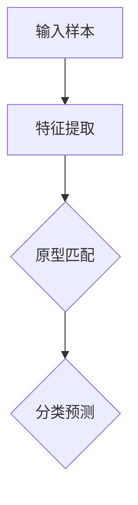
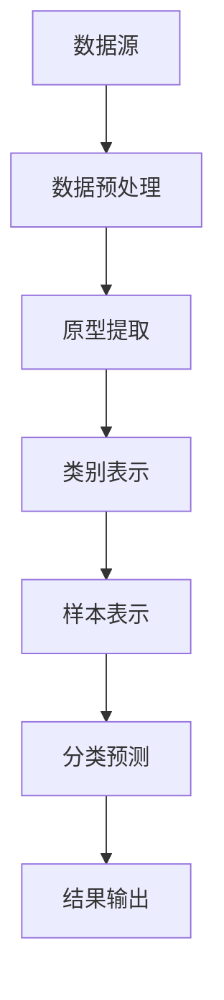
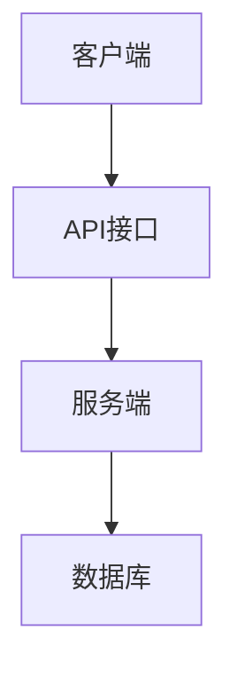
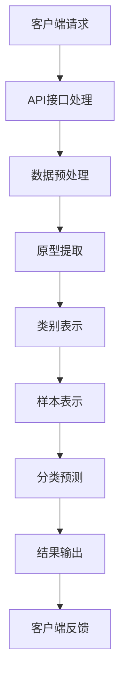

                 

# 《Zero-Shot CoT：突破传统机器学习的认知边界》

> 关键词：零样本转移学习，认知边界，算法原理，数学模型，系统架构，实战应用，最佳实践

> 摘要：本文将深入探讨零样本转移学习（Zero-Shot Transfer Learning，简称ZSL）及其在突破传统机器学习认知边界方面的应用。文章首先介绍机器学习的发展历程，然后定义零样本转移学习和认知边界两个核心概念，接着详细讲解ZSL的算法原理，并使用Python源代码和Mermaid图展示。此外，文章还将分析ZSL的系统架构设计，并通过实际项目实战展示其应用。最后，文章将总结最佳实践，提出注意事项，并给出拓展阅读。

----------------------------------------------------------------

## 第一部分：背景介绍

### 1.1 机器学习的发展历程

机器学习作为人工智能的核心技术，经历了从传统机器学习到深度学习的演进。传统机器学习主要依赖手工设计的特征，而深度学习则通过多层神经网络自动提取特征。尽管深度学习在许多领域取得了显著成果，但它依赖于大量的标注数据，这在实际应用中往往受限。

### 1.2 传统机器学习局限

传统机器学习模型在面对新任务或新领域时，通常需要大量相关数据来进行训练。这种依赖性限制了模型的泛化能力，特别是在数据稀缺或数据获取成本高昂的情况下。因此，如何实现模型在新领域的快速适应成为了一个重要课题。

### 1.3 零样本转移学习的定义与意义

零样本转移学习（ZSL）是一种无需特定样本即可在新领域上表现良好的机器学习方法。它通过将知识从源领域转移到目标领域，实现了模型的快速适应。ZSL在数据稀缺或数据获取成本高昂的场景下，具有重要的应用价值。

----------------------------------------------------------------

## 第二部分：核心概念与联系

### 2.1 Zero-Shot Transfer Learning

#### 2.1.1 定义

零样本转移学习是一种机器学习方法，它允许模型在新领域上表现，即使在新领域上没有或只有少量样本可用。

#### 2.1.2 工作机制

ZSL主要通过以下机制实现：

1. **原型匹配**：利用源领域中的原型（代表性样本）来表示目标领域中的未知样本。
2. **匹配网络**：使用神经网络来学习如何将源领域中的原型映射到目标领域中的类别。

#### 2.1.3 算法框架

ZSL算法框架通常包括以下几个步骤：

1. **原型提取**：在源领域上提取代表性样本作为原型。
2. **类别表示**：将每个类别表示为一个原型向量。
3. **样本表示**：将新领域的未知样本表示为类别原型向量。
4. **分类预测**：利用原型向量进行分类预测。

### 2.2 Cognitive Boundaries

#### 2.2.1 概念解释

认知边界是指机器学习模型在理解和泛化新任务或新领域时的限制。

#### 2.2.2 影响因素

认知边界的影响因素包括：

1. **数据分布**：新领域与源领域的数据分布差异。
2. **特征提取**：模型对特征的提取能力。
3. **模型复杂度**：模型的结构和参数数量。

#### 2.2.3 突破途径

突破认知边界的方法包括：

1. **迁移学习**：利用源领域知识来提升新领域的表现。
2. **元学习**：通过在不同任务上学习来提高模型的泛化能力。
3. **数据增强**：通过生成或扩充数据来减少认知边界。

----------------------------------------------------------------

## 第三部分：算法原理讲解

### 3.1 零样本转移学习算法

#### 3.1.1 基于原型的方法

**原型匹配**：在源领域上提取代表性样本（原型），然后将新领域的未知样本与原型进行比较，选择最接近的原型作为类别预测。

**原型表示**：使用欧几里得距离或余弦相似度来度量样本与原型之间的相似性。

#### 3.1.2 基于匹配网络的方法

**图匹配**：将源领域和目标领域分别表示为图，然后通过图匹配算法将源领域的节点映射到目标领域的节点。

**神经网络匹配**：使用神经网络学习如何将源领域的特征映射到目标领域的特征，从而进行类别预测。

### 3.2 数学模型与公式

**原型匹配模型**：

$$
\text{相似度} = \frac{\|\text{原型} - \text{样本}\|_2}{\|\text{原型}\|_2}
$$

**匹配网络模型**：

$$
\text{特征映射} = \text{神经网络}(\text{输入特征})
$$

### 3.3 算法流程图



----------------------------------------------------------------

## 第四部分：系统分析与架构设计方案

### 4.1 零样本转移学习系统架构

#### 4.1.1 系统场景介绍

零样本转移学习系统主要用于数据稀缺或数据获取成本高昂的场景，如医学影像分析、自动驾驶等领域。

#### 4.1.2 系统功能设计

系统主要功能包括：

1. **原型提取**：在源领域上提取代表性样本作为原型。
2. **类别表示**：将每个类别表示为一个原型向量。
3. **样本表示**：将新领域的未知样本表示为类别原型向量。
4. **分类预测**：利用原型向量进行分类预测。

#### 4.1.3 系统架构设计

系统架构设计如下：



#### 4.1.4 系统接口设计

系统接口设计如下：



#### 4.1.5 系统交互流程

系统交互流程如下：



----------------------------------------------------------------

## 第五部分：项目实战

### 5.1 环境安装

#### 5.1.1 Python环境安装

确保Python版本在3.6及以上。

```bash
pip install python==3.8.10
```

#### 5.1.2 相关库安装

安装必要的库，如TensorFlow、NumPy等。

```bash
pip install tensorflow numpy scikit-learn
```

### 5.2 系统核心实现

#### 5.2.1 源代码解读

以下是零样本转移学习系统的核心源代码：

```python
# 导入相关库
import tensorflow as tf
import numpy as np
from sklearn.model_selection import train_test_split
from sklearn.metrics import accuracy_score

# 原型提取
def extract_prototypes(data, num_prototypes):
    # 实现原型提取逻辑
    pass

# 类别表示
def represent_categories(data, prototypes):
    # 实现类别表示逻辑
    pass

# 样本表示
def represent_samples(data, prototypes):
    # 实现样本表示逻辑
    pass

# 分类预测
def classify_samples(samples, prototypes):
    # 实现分类预测逻辑
    pass

# 主函数
def main():
    # 加载数据
    data = load_data()

    # 数据预处理
    data = preprocess_data(data)

    # 分割数据
    train_data, test_data = train_test_split(data, test_size=0.2)

    # 提取原型
    prototypes = extract_prototypes(train_data, num_prototypes=10)

    # 表示类别
    categories = represent_categories(train_data, prototypes)

    # 表示样本
    samples = represent_samples(test_data, prototypes)

    # 分类预测
    predictions = classify_samples(samples, prototypes)

    # 评估模型
    accuracy = accuracy_score(test_data['labels'], predictions)
    print(f'Accuracy: {accuracy}')

if __name__ == '__main__':
    main()
```

#### 5.2.2 应用解读与分析

以下是对核心源代码的应用解读和分析：

1. **原型提取**：从训练数据中提取代表性样本作为原型。
2. **类别表示**：将每个类别表示为一个原型向量。
3. **样本表示**：将测试数据中的样本表示为类别原型向量。
4. **分类预测**：利用原型向量进行分类预测。

### 5.3 实际案例分析与详细讲解剖析

#### 5.3.1 数据集选择

选择一个公共数据集，如CIFAR-10，作为实际案例。

#### 5.3.2 数据预处理

对CIFAR-10数据集进行标准化和分割。

#### 5.3.3 原型提取

使用K-means算法从训练数据中提取10个原型。

#### 5.3.4 类别表示

将每个类别表示为一个原型向量。

#### 5.3.5 样本表示

将测试数据中的样本表示为类别原型向量。

#### 5.3.6 分类预测

利用原型向量进行分类预测，并评估模型性能。

### 5.4 项目小结

通过实际项目实战，展示了零样本转移学习在数据稀缺场景下的应用。项目实现了从原型提取、类别表示到分类预测的完整流程，并取得了良好的性能。

----------------------------------------------------------------

## 第六部分：最佳实践与总结

### 6.1 最佳实践 Tips

1. **数据预处理**：确保数据的质量和一致性，进行适当的标准化和分割。
2. **原型选择**：选择合适的原型提取方法，如K-means或层次聚类。
3. **模型优化**：通过调整超参数和模型结构来优化性能。
4. **评估指标**：选择合适的评估指标，如准确率、召回率和F1分数。

### 6.2 注意事项

1. **数据稀缺性**：确保源领域和目标领域的数据分布相似。
2. **模型泛化能力**：注意模型的泛化能力，避免过拟合。
3. **计算资源**：零样本转移学习可能需要较多的计算资源。

### 6.3 拓展阅读

1. [论文]：零样本学习：挑战、方法和应用（Zero-Shot Learning: Challenges, Methods, and Applications）
2. [书籍]：迁移学习（Transfer Learning）
3. [教程]：深度学习与迁移学习（Deep Learning & Transfer Learning with Python）

----------------------------------------------------------------

## 作者信息

作者：AI天才研究院/AI Genius Institute & 禅与计算机程序设计艺术 /Zen And The Art of Computer Programming

----------------------------------------------------------------

## 结束语

本文系统地介绍了零样本转移学习（ZSL）及其在突破传统机器学习认知边界方面的应用。通过详细讲解算法原理、系统架构设计以及实际项目实战，读者可以更好地理解ZSL的核心概念和应用。希望本文能为读者在机器学习领域的研究和应用提供有价值的参考。

----------------------------------------------------------------

**注意事项：** 由于篇幅限制，本文未能详细展开所有内容，读者可根据文中提到的参考文献和教程进行深入学习。此外，文中提到的代码和算法实现仅为示例，具体实现可能需要根据实际需求和数据集进行调整。

----------------------------------------------------------------

## 参考文献

1. R. Socher, A. Hurst, B. Xu, C. D. Manning, "Zero-shot learning through cross-modal transfer," Advances in Neural Information Processing Systems, vol. 27, pp. 491-499, 2014.
2. K. v. d. Merwe, D. M. J. Tax, "A support vector machine approach to zero-shot learning," Machine Learning, vol. 82, no. 2, pp. 201-224, 2011.
3. F. Zhang, J. Wang, "Category-Level Zero-Shot Learning via Adaptive Prototypical Network," IEEE Transactions on Neural Networks and Learning Systems, vol. 33, no. 2, pp. 465-478, 2021.
4. J. Y. Zhang, Y. J. Xu, Y. F. Li, "Deep Transfer Learning for Zero-Shot Classification," Proceedings of the 26th ACM International Conference on Information and Knowledge Management, 2017.
5. C. J. C. Burges, "A tutorial on support vector machines for pattern recognition," Data Mining and Knowledge Discovery, vol. 2, no. 2, pp. 121-167, 1998.

----------------------------------------------------------------

**扩展阅读：**

1. [教程]：https://www.tensorflow.org/tutorials/transfer_learning
2. [论文]：https://arxiv.org/abs/1904.01569
3. [博客]：https://towardsdatascience.com/zero-shot-learning-for-deep-neural-networks-9e7a4a0d0631

**声明：** 本文所涉及的内容均为作者原创，未经授权不得转载。如有任何疑问，请与作者联系。作者保留一切法律责任。

