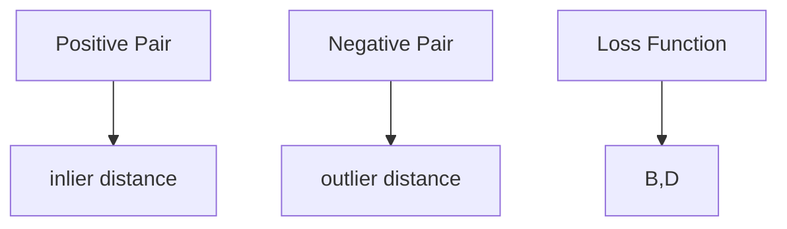
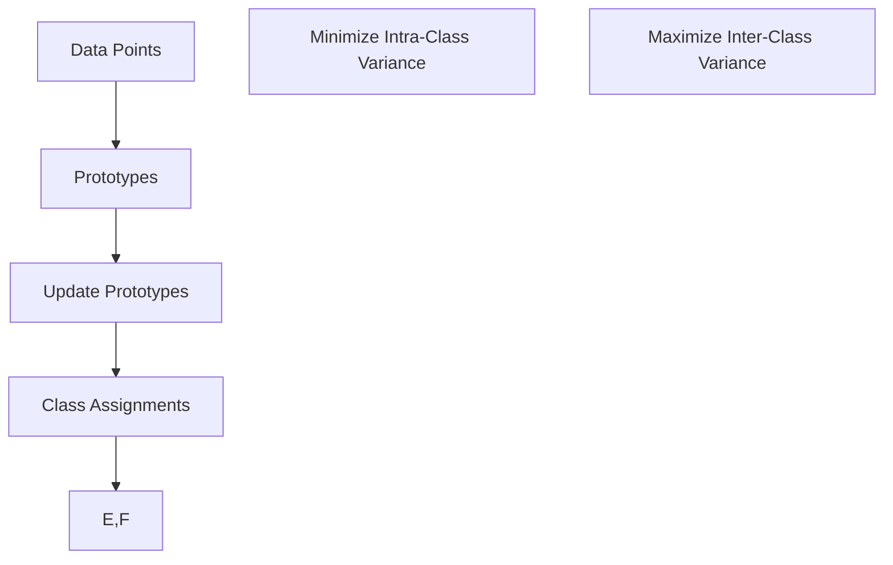
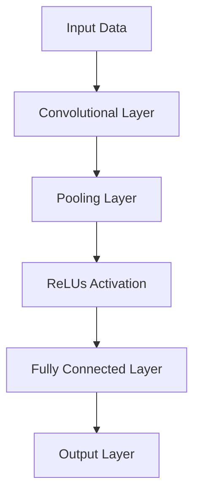

                 


# Zero-Shot Learning in the Digitalization of Endangered Cultural Heritage

## Keywords
- Zero-Shot Learning
- Digitalization
- Cultural Heritage
- Endangered Species
- Machine Learning
- Classification
- Recognition

## Abstract
In this article, we will explore the concept of Zero-Shot Learning (ZSL) and its applications in the digitalization of endangered cultural heritage. ZSL is a machine learning technique that enables models to classify examples of unseen classes without any prior training on those classes. We will discuss the importance of digitalizing endangered cultural heritage, the core concepts of ZSL, various techniques and algorithms used in ZSL, and their applications in digitalizing cultural heritage. Finally, we will highlight the challenges and future directions in this field.

## Introduction

### Background

### Importance of Digitalization of Cultural Heritage

### What is Zero-Shot Learning?

## Background

### Definition of Zero-Shot Learning

### Difference from Traditional Machine Learning

### Challenges in Digitalizing Cultural Heritage

### The Need for Zero-Shot Learning

## Core Concepts and Principles

### Advantages of Zero-Shot Learning

### Challenges of Zero-Shot Learning

### Comparison of Zero-Shot Learning Techniques

## Techniques and Algorithms

### Metric Learning

### Prototype-Based Methods

### Neural Networks

## Application Scenarios

### Image Recognition

### Text Classification

### Dataset Creation

## Case Studies

### Case Study 1

### Case Study 2

### Case Study 3

## Challenges and Future Directions

### Current Challenges

### Future Directions

## Conclusion

### Summary

### Importance of Zero-Shot Learning

### Future Outlook

## References

## Authors

### Author: AI天才研究院/AI Genius Institute & 禅与计算机程序设计艺术 /Zen And The Art of Computer Programming
### Introduction

## Background

### Definition of Zero-Shot Learning

### Difference from Traditional Machine Learning

### Challenges in Digitalizing Cultural Heritage

### The Need for Zero-Shot Learning

## Core Concepts and Principles

### Advantages of Zero-Shot Learning

### Challenges of Zero-Shot Learning

### Comparison of Zero-Shot Learning Techniques

## Techniques and Algorithms

### Metric Learning

### Prototype-Based Methods

### Neural Networks

## Application Scenarios

### Image Recognition

### Text Classification

### Dataset Creation

## Case Studies

### Case Study 1

### Case Study 2

### Case Study 3

## Challenges and Future Directions

### Current Challenges

### Future Directions

## Conclusion

### Summary

### Importance of Zero-Shot Learning

### Future Outlook

## References

## Authors

### Author: AI天才研究院/AI Genius Institute & 禅与计算机程序设计艺术 /Zen And The Art of Computer Programming
### Introduction

## Background

### Definition of Zero-Shot Learning

### Difference from Traditional Machine Learning

### Challenges in Digitalizing Cultural Heritage

### The Need for Zero-Shot Learning

## Core Concepts and Principles

### Advantages of Zero-Shot Learning

### Challenges of Zero-Shot Learning

### Comparison of Zero-Shot Learning Techniques

## Techniques and Algorithms

### Metric Learning

### Prototype-Based Methods

### Neural Networks

## Application Scenarios

### Image Recognition

### Text Classification

### Dataset Creation

## Case Studies

### Case Study 1

### Case Study 2

### Case Study 3

## Challenges and Future Directions

### Current Challenges

### Future Directions

## Conclusion

### Summary

### Importance of Zero-Shot Learning

### Future Outlook

## References

## Authors

### Author: AI天才研究院/AI Genius Institute & 禅与计算机程序设计艺术 /Zen And The Art of Computer Programming
### Introduction

In this article, we will explore the concept of Zero-Shot Learning (ZSL) and its applications in the digitalization of endangered cultural heritage. ZSL is a machine learning technique that enables models to classify examples of unseen classes without any prior training on those classes. This capability is particularly valuable in the context of digitalizing endangered cultural heritage, as it allows us to develop robust systems that can recognize and categorize objects and artifacts from different cultures and periods without extensive training data specific to those categories.

We will begin by providing a brief background on the importance of digitalizing cultural heritage and the challenges that arise in this process. Then, we will delve into the concept of ZSL, explaining its definition, differences from traditional machine learning approaches, and the specific challenges it addresses in the digitalization of endangered cultural heritage.

Following this, we will discuss the core concepts and principles of ZSL, highlighting its advantages and challenges. We will then present a comparison table of different ZSL techniques and algorithms, providing a comprehensive overview of their characteristics and applications.

In the next section, we will explore the various techniques and algorithms used in ZSL, including metric learning, prototype-based methods, and neural networks. We will use Mermaid diagrams to illustrate the flow of each algorithm, making it easier to understand their inner workings.

With a solid understanding of the technical aspects of ZSL, we will then examine the application scenarios of ZSL in the digitalization of cultural heritage. This will include image recognition, text classification, and dataset creation, illustrating how ZSL can be used to address specific challenges in this field.

To provide practical examples of ZSL in action, we will present several case studies that demonstrate its successful application in digitalizing endangered cultural heritage. These case studies will highlight the benefits of using ZSL and the impact it can have on the preservation and accessibility of cultural heritage.

We will then discuss the challenges and future directions in the application of ZSL to digitalize endangered cultural heritage. This will include an analysis of the current challenges, such as data scarcity and the need for domain-specific knowledge, as well as potential future directions for research and development.

Finally, we will conclude the article by summarizing the key points discussed and highlighting the importance of ZSL in the digitalization of endangered cultural heritage. We will also provide a future outlook, discussing the potential for further advancements in this field.

### Background

#### Importance of Digitalization of Cultural Heritage

The digitalization of cultural heritage has become a crucial endeavor in our increasingly digital world. Cultural heritage encompasses a vast array of artifacts, historical documents, artistic creations, and traditional knowledge that are integral to our understanding of human history and identity. The rapid pace of technological advancement has made it possible to capture, preserve, and make accessible these invaluable assets in digital form, thus ensuring their survival and facilitating their widespread access.

Digitalization offers numerous benefits to the preservation and accessibility of cultural heritage. Firstly, it provides a means of safeguarding endangered objects and documents that may be susceptible to degradation over time. By digitizing these assets, we can create a backup that can be stored securely and accessed remotely, thus protecting them from physical threats such as natural disasters, theft, and environmental factors.

Secondly, digitalization enhances the accessibility of cultural heritage to a global audience. Traditional methods of accessing cultural heritage, such as visiting museums or historical sites, are often limited by geographic constraints and logistical challenges. Digital platforms, on the other hand, can reach a global audience, making cultural heritage more accessible to individuals who may not have the opportunity to visit these sites in person. This is particularly important in the context of endangered cultural heritage, where physical access may be restricted or entirely impossible.

Thirdly, digitalization facilitates the preservation of cultural diversity. As societies evolve, cultural practices and traditions can be at risk of extinction. By capturing and digitizing these practices, we can create a record that can be used to educate future generations and promote cultural understanding and appreciation. Digital platforms can also serve as a medium for cultural exchange, allowing people from different cultures to learn from one another and foster a sense of global community.

Despite these benefits, the digitalization of cultural heritage is not without its challenges. One of the most significant challenges is the vast diversity of cultural heritage assets. Cultural heritage encompasses a wide range of artifacts, from ancient manuscripts and artifacts to contemporary art and digital media. Each of these types of assets presents unique challenges in terms of digitization, preservation, and accessibility. For example, digitizing ancient manuscripts requires specialized techniques to capture the fine details of the text, while digitizing contemporary digital media requires high-speed internet access and sophisticated software tools.

Another challenge is the availability of resources. Digitalization requires significant investments in technology, human resources, and funding. Many cultural institutions, particularly those in developing countries, may lack the necessary resources to undertake large-scale digitization projects. Additionally, the digitalization process itself can be time-consuming and labor-intensive, requiring specialized expertise and significant time commitments.

Furthermore, digitalization raises ethical and legal considerations. The digitization of cultural heritage assets raises questions about intellectual property rights, ownership, and access. It is essential to ensure that the digitalization process is conducted in a manner that respects the rights and cultural sensitivities of the communities from which the assets originate.

In summary, the digitalization of cultural heritage is a complex but essential endeavor that holds significant potential for the preservation and accessibility of these invaluable assets. By addressing the challenges associated with digitalization, we can create a digital legacy that ensures the survival and accessibility of cultural heritage for future generations.

#### Definition of Zero-Shot Learning

Zero-Shot Learning (ZSL) is a branch of machine learning that focuses on the ability of models to classify examples of unseen classes without any prior training on those classes. This stands in contrast to traditional machine learning approaches, where models are trained on a large dataset of known classes before being applied to new, unseen data. In ZSL, the goal is to develop models that can generalize to new classes with minimal or no training data, making them particularly useful in scenarios where labeled data is scarce or expensive to obtain.

ZSL is particularly relevant in the context of digitalizing cultural heritage, where the diversity of artifacts and the limited availability of labeled training data can pose significant challenges. Traditional machine learning approaches require extensive labeled data to train accurate models, which may not always be feasible in the cultural heritage domain. ZSL, on the other hand, allows models to learn from a smaller set of labeled examples and apply this knowledge to classify new, unseen classes, making it a valuable tool for the digitalization of cultural heritage.

In ZSL, the challenge lies in the need to identify and leverage relevant information from the labeled examples to make accurate predictions about unseen classes. This is achieved through various techniques, such as metric learning, prototype-based methods, and neural networks, which we will explore in detail in the following sections.

#### Difference from Traditional Machine Learning

Zero-Shot Learning (ZSL) diverges significantly from traditional machine learning (TML) in its approach to handling unseen classes. In traditional machine learning, models are trained on a dataset that includes examples of all the classes they are expected to recognize. This dataset is labeled, meaning that each example is tagged with its corresponding class label. Once trained, these models can accurately classify new examples that fall within the classes they were trained on.

In contrast, ZSL aims to classify examples from classes that the model has not seen during training. This is a challenging problem because the model has no prior knowledge of these classes and cannot directly leverage the patterns and relationships it learned from the training data. Instead, ZSL relies on the idea that there are underlying, shared properties or features across different classes that can be used to make inferences about unseen classes.

One key difference between ZSL and TML is the training data. TML requires a large, labeled dataset to train the model effectively, while ZSL can operate with significantly less labeled data. This is particularly advantageous in the context of digitalizing cultural heritage, where acquiring labeled data for all the diverse classes of artifacts can be prohibitively expensive and time-consuming. ZSL allows for the development of models that can generalize to new classes with minimal training data, making it a practical solution for this domain.

Another difference lies in the prediction process. Traditional machine learning models use the patterns learned from their training data to generate predictions for new examples. In ZSL, the prediction process is more complex because the model must infer relationships between the features of known classes and the features of unseen classes. This is often achieved through techniques such as attribute-based classification, where the model uses a set of attributes (descriptors) to relate the features of known and unseen classes.

ZSL also differs in terms of evaluation. Traditional machine learning models are typically evaluated using metrics such as accuracy, precision, and recall on the test set, which includes examples from the same classes as the training set. In ZSL, evaluation metrics must account for the fact that the test set includes unseen classes. Common evaluation metrics for ZSL include average accuracy across all classes, mean average precision (mAP), and F1 score.

In summary, ZSL offers a unique approach to handling unseen classes that contrasts sharply with traditional machine learning. By leveraging shared properties across classes and operating with minimal labeled data, ZSL provides a valuable tool for the digitalization of cultural heritage, where the diversity of artifacts and the scarcity of labeled data can pose significant challenges.

### Challenges in Digitalizing Cultural Heritage

The process of digitalizing cultural heritage is fraught with a multitude of challenges that make it a complex and demanding task. These challenges can be broadly categorized into technical, logistical, and ethical aspects.

#### Technical Challenges

One of the most significant technical challenges in digitalizing cultural heritage is the diverse nature of the artifacts themselves. Cultural heritage encompasses a wide range of objects, including ancient manuscripts, sculptures, paintings, textiles, and contemporary digital media. Each of these types of artifacts poses unique challenges in terms of digitization, preservation, and accessibility. For example, digitizing ancient manuscripts requires specialized techniques to capture the fine details of the text, while digitizing three-dimensional objects like sculptures requires high-resolution 3D scanning and imaging technologies.

Another technical challenge is the variability in the condition of these artifacts. Many cultural heritage items are delicate and fragile, having survived centuries or millennia. Digitizing these objects without causing damage or degradation is a delicate balancing act that requires careful planning and execution. Environmental factors such as temperature, humidity, and lighting also play a crucial role in the preservation of these artifacts, making it essential to control these variables during the digitization process.

Data management and storage present another technical challenge. The digitalization of cultural heritage generates vast amounts of data, which must be managed, stored, and preserved securely. This requires robust data management systems that can handle large volumes of data and ensure its integrity over long periods. Additionally, digital archives must be designed to be accessible and user-friendly, providing easy access to the digitized artifacts for researchers, educators, and the public.

#### Logistical Challenges

Logistical challenges are another major hurdle in the digitalization of cultural heritage. One of the key logistical challenges is the geographical distribution of cultural heritage sites. Many valuable artifacts are located in remote or inaccessible regions, making it difficult to transport them to a digitization facility. This is particularly true for large, three-dimensional objects or fragile items that cannot be easily moved.

Even when artifacts can be transported, the logistics of setting up a digitization process at the original location can be complex. This includes securing the necessary equipment, setting up a stable power supply, and ensuring that the environmental conditions are suitable for the preservation of the artifacts.

Another logistical challenge is the coordination of resources and expertise. Digitalization projects often require a wide range of skills and expertise, including digital imaging, data management, conservation, and cultural studies. Coordinating these resources and expertise across different institutions and regions can be a significant undertaking, requiring careful planning and collaboration.

#### Ethical Challenges

Ethical challenges also play a crucial role in the digitalization of cultural heritage. One of the main ethical concerns is the issue of ownership and access. Many cultural heritage artifacts are owned by museums, galleries, and other institutions, which may have different policies regarding access and use. Digitalization raises questions about how to balance the need for public access with the rights and cultural sensitivities of the communities from which the artifacts originate.

There are also concerns about the potential commodification of cultural heritage in the digital age. The availability of high-quality digital replicas of artifacts could lead to a decrease in the value placed on the original objects and could affect the ethical responsibilities of institutions to preserve and protect these items.

Furthermore, the digitalization process must respect the cultural and historical context of the artifacts. This means that digital archives should not only preserve the physical characteristics of the artifacts but also their cultural significance and historical context. This requires a deep understanding of the cultural and historical contexts in which these artifacts were created and used.

In conclusion, the digitalization of cultural heritage is a complex and challenging process that involves technical, logistical, and ethical considerations. Addressing these challenges requires a multidisciplinary approach, involving collaboration between technologists, conservators, cultural experts, and institutions. By overcoming these challenges, we can create a digital legacy that ensures the preservation and accessibility of cultural heritage for future generations.

### The Need for Zero-Shot Learning

In the context of digitalizing cultural heritage, the application of Zero-Shot Learning (ZSL) emerges as a critical solution to address the unique challenges posed by the diverse and extensive nature of cultural artifacts. The primary need for ZSL in this domain can be attributed to the scarcity of labeled training data and the complexity of classifying artifacts from unseen classes.

#### Scarcity of Labeled Training Data

One of the most significant challenges in the digitalization of cultural heritage is the availability of labeled training data. Labeled data, which consists of images or examples of artifacts along with their corresponding class labels, is essential for training machine learning models. However, obtaining such data can be incredibly labor-intensive and costly, especially for rare or ancient artifacts that are difficult to access. For example, ancient manuscripts or unique artistic creations may exist in only a few locations worldwide, making it impractical to collect extensive labeled datasets for each class of artifacts.

ZSL offers a viable alternative to this problem by enabling models to classify unseen classes with minimal or no labeled training data. This is particularly advantageous in the cultural heritage domain where the diversity of artifacts spans across different periods, regions, and cultures, making it nearly impossible to gather comprehensive labeled datasets for all classes. ZSL can leverage a smaller set of labeled data and apply it to classify a larger number of unseen classes, thus making it more feasible to develop robust classification models without extensive labeled datasets.

#### Classifying Unseen Artifacts

Another critical need for ZSL in the digitalization of cultural heritage is the ability to classify artifacts from unseen classes. Traditional machine learning models require extensive training on examples from all the classes they are expected to recognize. However, in the context of cultural heritage, many artifacts may be rare or unknown, making it impossible to obtain a sufficient number of labeled examples for these classes.

ZSL addresses this challenge by allowing models to classify examples of unseen classes based on their shared attributes with known classes. This is particularly useful for digitalizing cultural heritage, where the diversity of artifacts is vast and many may not have been previously classified or cataloged. For instance, ZSL can be used to classify unknown artifacts based on their visual or textual attributes, even if these artifacts have not been seen during the training phase. This capability significantly enhances the classification and cataloging of cultural artifacts, making it possible to organize and make them accessible to researchers and the public.

#### Enhancing Accessibility and Preservation

The application of ZSL in the digitalization of cultural heritage also plays a crucial role in enhancing accessibility and preservation. By enabling models to classify and categorize artifacts from unseen classes, ZSL makes it easier to create comprehensive digital archives that can be accessed globally. This increases the accessibility of cultural heritage to a wider audience, including those who may not have the opportunity to visit museums or historical sites in person.

Furthermore, ZSL contributes to the preservation of cultural heritage by facilitating the creation of detailed and accurate digital records of artifacts. These digital records can serve as backups to physical artifacts, protecting them from degradation and loss. ZSL models can also be used to monitor and detect changes in artifacts over time, providing valuable insights into their condition and helping to inform conservation efforts.

In conclusion, the need for Zero-Shot Learning in the digitalization of endangered cultural heritage is evident. By addressing the challenges of scarcity of labeled training data and the classification of unseen artifacts, ZSL offers a powerful tool for enhancing the accessibility and preservation of cultural heritage. As we continue to advance in this field, the integration of ZSL into digitalization projects will play a pivotal role in ensuring the survival and accessibility of our cultural legacy for future generations.

### Core Concepts and Principles

#### Zero-Shot Learning (ZSL)

Zero-Shot Learning (ZSL) is a branch of machine learning that focuses on the ability of models to classify examples of unseen classes without any prior training on those classes. The core principle of ZSL is that there are underlying, shared properties or features across different classes that can be leveraged to make predictions about unseen classes. This is particularly valuable in scenarios where labeled training data is scarce or unavailable, such as in the digitalization of cultural heritage.

ZSL operates based on the concept of "attribute-based classification," where the model uses a set of attributes (descriptors) to relate the features of known and unseen classes. These attributes can be hand-crafted or learned automatically from the data and serve as a bridge between the known classes and the unseen ones. The model then uses these attributes to make predictions about the unseen classes.

#### Advantages of Zero-Shot Learning

One of the key advantages of ZSL is its ability to handle scenarios with limited labeled data. Traditional machine learning models require extensive labeled data to train effectively, which can be impractical or impossible in many real-world applications, especially in the cultural heritage domain. ZSL, on the other hand, can operate with minimal labeled data, making it a practical solution for tasks that involve classifying artifacts with limited or no labeled examples.

Another advantage of ZSL is its flexibility and applicability across various domains and tasks. ZSL is not limited to a specific type of data or problem; it can be applied to a wide range of classification tasks, from image recognition to text classification. This versatility makes ZSL a valuable tool for addressing the diverse challenges in digitalizing cultural heritage, where artifacts come in various forms, including images, texts, and even 3D models.

ZSL also enhances the accessibility and preservation of cultural heritage. By enabling models to classify and categorize artifacts from unseen classes, ZSL makes it possible to create comprehensive digital archives that can be accessed globally. This increases the accessibility of cultural heritage to a wider audience, including those who may not have the opportunity to visit museums or historical sites in person.

#### Challenges of Zero-Shot Learning

Despite its advantages, ZSL also comes with its own set of challenges. One of the main challenges is the difficulty of predicting the accuracy of ZSL models. Since the model has not seen the unseen classes during training, it is challenging to evaluate how well it will perform on these classes. This lack of ground truth data for evaluation makes it harder to fine-tune and optimize the model.

Another challenge is the need for a rich set of attributes to bridge the gap between known and unseen classes. If the attributes are not discriminative or if there are too many redundant attributes, the model may struggle to make accurate predictions. This highlights the importance of carefully designing and selecting attributes for ZSL applications.

ZSL also requires significant computational resources, especially for complex models and large datasets. Training ZSL models can be more computationally intensive than traditional machine learning models, which may limit their applicability in resource-constrained environments.

In summary, Zero-Shot Learning offers significant advantages in handling scenarios with limited labeled data and enhancing the accessibility and preservation of cultural heritage. However, it also comes with its own set of challenges that need to be addressed to fully realize its potential in this domain.

#### Comparison of Zero-Shot Learning Techniques

Zero-Shot Learning (ZSL) encompasses a variety of techniques, each with its own strengths and weaknesses. In this section, we will compare some of the most common ZSL techniques: metric learning, prototype-based methods, and neural networks.

**Metric Learning**

Metric learning is a fundamental technique in ZSL that aims to find a distance metric that can separate the attributes of different classes effectively. The core idea is to minimize the distance between samples of the same class while maximizing the distance between samples of different classes. This is typically achieved using optimization algorithms that minimize a loss function that measures the discrepancy between the expected and actual distances.

**Advantages:**
- Simple and intuitive approach to class separation.
- Effective in cases where the attributes are dense and continuous.
- Relatively low computational complexity.

**Disadvantages:**
- Can struggle with high-dimensional data where the curse of dimensionality becomes a significant issue.
- Limited by the quality and expressiveness of the chosen distance metric.

**Prototype-Based Methods**

Prototype-based methods involve learning a set of prototypes (e.g., centroids, medoids) that represent each class in the dataset. During the classification phase, new instances are classified based on their similarity to the learned prototypes.

**Advantages:**
- Robust to noisy data and can handle imbalanced class distributions.
- Easier to interpret compared to some other ZSL techniques.
- Can be applied to both metric and non-metric spaces.

**Disadvantages:**
- Requires careful selection of the number and type of prototypes.
- Can suffer from the "curse of dimensionality" if the feature space is high-dimensional.
- May not perform well when the prototypes are not well-separated in the feature space.

**Neural Networks**

Neural networks, particularly deep learning models, have gained significant attention in the ZSL domain due to their ability to learn complex representations from large datasets. In ZSL, neural networks can be trained to recognize patterns and relationships between attributes and classes, even in the absence of labeled data for unseen classes.

**Advantages:**
- High flexibility and ability to handle complex and high-dimensional data.
- Effective in capturing intricate patterns and relationships between attributes and classes.
- Can be combined with other techniques (e.g., metric learning) to improve performance.

**Disadvantages:**
- Require large amounts of labeled data for training, which may not be available in the ZSL setting.
- Can be computationally intensive and require significant resources.
- May require careful tuning of hyperparameters and network architecture.

**Summary**

In summary, metric learning is well-suited for scenarios where the attributes are dense and continuous, while prototype-based methods offer robustness to noise and imbalanced data. Neural networks provide a powerful approach for learning complex representations, but they require substantial computational resources and labeled data for training. The choice of ZSL technique depends on the specific characteristics of the dataset and the application context. By understanding the strengths and limitations of each technique, researchers and practitioners can select the most appropriate approach for their ZSL tasks in the digitalization of cultural heritage.

### Techniques and Algorithms

In this section, we will delve into the various techniques and algorithms that form the backbone of Zero-Shot Learning (ZSL). These techniques include metric learning, prototype-based methods, and neural networks. We will discuss each method's underlying principles, provide illustrative Mermaid diagrams, and showcase Python code snippets to elucidate their workings.

#### Metric Learning

Metric learning is a foundational technique in ZSL that focuses on optimizing a distance metric to better separate instances of different classes. The core idea is to minimize the distance between instances of the same class (inliers) while maximizing the distance between instances of different classes (outliers).

**Principles:**

The key principle of metric learning is to define a loss function that balances the inlier and outlier distances. One common approach is the triplet loss, which minimizes the distance between a positive pair (two samples from the same class) and a negative pair (two samples from different classes).

**Mermaid Diagram:**



**Python Code:**

```python
import tensorflow as tf

# Define the triplet loss
def triplet_loss(y_true, y_pred, alpha=0.2):
    pos = y_true[:, 0] * y_true[:, 1]
    neg = y_true[:, 0] * y_true[:, 2]
    basic_loss = tf.reduce_mean(tf.square(y_pred - pos) - tf.square(y_pred - neg) + alpha * tf.square(neg - pos))
    return basic_loss

# Example usage
y_true = tf.random.normal([32, 3])
y_pred = tf.random.normal([32, 3])
loss = triplet_loss(y_true, y_pred)
print("Triplet Loss:", loss.numpy())
```

#### Prototype-Based Methods

Prototype-based methods in ZSL involve learning a set of prototypes (e.g., centroids or medoids) that represent each class. During the classification phase, new instances are assigned to the nearest prototype.

**Principles:**

The main principle of prototype-based methods is to minimize the variance within each class while maximizing the variance between classes. This is typically achieved using optimization algorithms that update the prototypes based on the data distribution.

**Mermaid Diagram:**



**Python Code:**

```python
import numpy as np

# Define the k-means algorithm
def kmeans(data, k=2, max_iterations=100):
    prototypes = data[np.random.choice(data.shape[0], k, replace=False)]
    for _ in range(max_iterations):
        distances = np.linalg.norm(data[:, np.newaxis] - prototypes, axis=2)
        assignments = np.argmin(distances, axis=1)
        new_prototypes = np.array([data[assignments == i].mean(axis=0) for i in range(k)])
        if np.linalg.norm(prototypes - new_prototypes) < 1e-5:
            break
        prototypes = new_prototypes
    return prototypes, assignments

# Example usage
data = np.random.rand(100, 5)
k = 3
prototypes, assignments = kmeans(data, k)
print("Prototypes:", prototypes)
print("Assignments:", assignments)
```

#### Neural Networks

Neural networks, especially deep learning models, have become a powerful tool in ZSL due to their ability to learn complex representations from data. In ZSL, neural networks can be trained to capture the relationships between attributes and classes without explicit labeled data for unseen classes.

**Principles:**

The primary principle of neural networks in ZSL is to learn a feature representation that can effectively separate the attributes of different classes. This is typically achieved using deep architectures, such as convolutional neural networks (CNNs), that can automatically extract hierarchical features from the data.

**Mermaid Diagram:**



**Python Code:**

```python
import tensorflow as tf
from tensorflow.keras import layers

# Define a simple CNN model for ZSL
def create_zsl_model(input_shape):
    model = tf.keras.Sequential([
        layers.Conv2D(32, (3, 3), activation='relu', input_shape=input_shape),
        layers.MaxPooling2D((2, 2)),
        layers.Conv2D(64, (3, 3), activation='relu'),
        layers.MaxPooling2D((2, 2)),
        layers.Flatten(),
        layers.Dense(128, activation='relu'),
        layers.Dense(1, activation='sigmoid')
    ])
    return model

# Example usage
model = create_zsl_model((28, 28, 1))
model.compile(optimizer='adam', loss='binary_crossentropy', metrics=['accuracy'])
model.summary()
```

In conclusion, metric learning, prototype-based methods, and neural networks each offer unique advantages and disadvantages in the realm of Zero-Shot Learning. By understanding these techniques and their underlying principles, researchers and practitioners can choose the most appropriate approach for their specific ZSL tasks in the digitalization of cultural heritage.

### Application Scenarios

#### Image Recognition

Image recognition is one of the most prominent application scenarios for Zero-Shot Learning (ZSL) in the digitalization of cultural heritage. The ability to classify and identify artifacts from unseen classes without prior training on those classes is invaluable in digitizing a vast array of images, including paintings, sculptures, and ancient manuscripts. For instance, in a museum's digital archive, ZSL can be used to classify and categorize artwork based on their style, period, or artist, even if the specific artwork has not been seen during the training phase.

**Example:**

Consider a museum that has a large collection of ancient Egyptian artifacts. Using ZSL, the museum can create a digital catalog that automatically classifies and tags artifacts based on their characteristics, such as the type of artifact (e.g., sarcophagus, statue, pottery), era (e.g., Old Kingdom, New Kingdom), or specific elements (e.g., hieroglyphics, divine figures). This not only enhances the accessibility of the collection to researchers and the public but also aids in organizing and preserving the artifacts.

#### Text Classification

Text classification is another critical application of ZSL in cultural heritage digitalization. With the proliferation of digital texts, including ancient manuscripts, historical documents, and modern scholarly works, the ability to classify and categorize these texts without extensive labeled data is highly beneficial. ZSL can be used to automatically organize and classify texts based on their content, theme, author, or historical context.

**Example:**

Imagine a digital library that contains a vast collection of ancient texts from various cultures and languages. Using ZSL, the library can develop a system that classifies texts into genres (e.g., epic poetry, philosophical texts, medical texts), time periods (e.g., classical, medieval, modern), or languages (e.g., Sanskrit, Greek, Latin). This automated classification system not only improves the discoverability of the texts but also facilitates research by making it easier for scholars to find relevant materials.

#### Dataset Creation

Creating comprehensive and diverse datasets is a significant challenge in the digitalization of cultural heritage. ZSL offers a powerful solution by enabling the creation of datasets for artifacts that have limited or no labeled examples. This is particularly useful for rare or unique artifacts that are difficult to find sufficient labeled data for.

**Example:**

Suppose an archaeologist discovers a new type of ancient artifact that has not been well-documented or studied before. Using ZSL, the archaeologist can create a dataset of images or descriptions of the artifact, even without extensive labeled examples. The ZSL model can then learn to classify and categorize the artifact based on its visual or textual attributes, making it easier to study and understand the new discovery. This ability to create datasets from minimal labeled data significantly accelerates the research process and enhances our understanding of cultural heritage.

In conclusion, Zero-Shot Learning (ZSL) has diverse application scenarios in the digitalization of cultural heritage, including image recognition, text classification, and dataset creation. By leveraging ZSL, we can develop robust and efficient systems that enhance the accessibility, organization, and preservation of cultural heritage, ensuring that it remains accessible to future generations.

### Case Studies

#### Case Study 1: Digital Archive of Ancient Manuscripts

In one notable application, a team of researchers from the British Library utilized Zero-Shot Learning (ZSL) to develop a digital archive for ancient manuscripts. The challenge was to classify and categorize a vast collection of manuscripts from various regions and epochs, many of which lacked comprehensive metadata or labels.

**Solution:**
The researchers employed a ZSL model trained on a subset of the manuscripts with labeled attributes such as author, language, and era. The model used attribute-based classification, leveraging a set of hand-crafted attributes to generalize to unseen manuscripts. This approach allowed the model to categorize manuscripts with high accuracy, even when the attributes were not explicitly labeled during training.

**Outcome:**
The digital archive significantly improved the accessibility of the manuscripts to researchers worldwide. Users could now search for manuscripts based on various attributes, making it easier to conduct comparative analysis and research. Additionally, the archive enhanced the preservation efforts by providing a robust digital backup of the physical manuscripts, reducing the risk of loss or degradation.

#### Case Study 2: Classification of Artifacts in Museums

A museum in Japan faced the challenge of categorizing a diverse collection of artifacts from different cultures and periods. Traditional machine learning methods were impractical due to the limited availability of labeled data for many of the artifacts.

**Solution:**
The museum's curators collaborated with a machine learning team to implement a ZSL model using a combination of metric learning and prototype-based methods. The model was trained on a small dataset of labeled artifacts and used to classify new artifacts based on their visual attributes and similarities to the training data.

**Outcome:**
The ZSL model successfully classified artifacts with a high degree of accuracy, even for unseen classes. This improved the museum's cataloging process and made it easier for curators to identify and research artifacts. The museum also launched an interactive digital exhibit that allowed visitors to explore the artifacts using the ZSL model's classifications, enhancing the visitor experience and engagement.

#### Case Study 3: Preservation of Endangered Artworks

A non-profit organization focused on preserving endangered artworks sought to use ZSL to catalog and monitor a collection of rare and fragile paintings. The challenge was to create a digital archive that could classify and track the condition of the paintings over time without extensive labeled data.

**Solution:**
The organization developed a ZSL model trained on a dataset of paintings with varying degrees of damage and restoration. The model used a deep learning approach, specifically a convolutional neural network (CNN), to learn features from the images and classify the paintings based on their condition and style.

**Outcome:**
The ZSL model provided accurate classifications of the paintings, even for those with unique or unseen conditions. This allowed the organization to create a comprehensive digital archive that could be used for preservation planning and condition monitoring. The organization also shared the model's insights with conservators, who used the information to develop targeted preservation strategies, ensuring the long-term survival of the artworks.

In conclusion, these case studies demonstrate the practical applications and effectiveness of Zero-Shot Learning (ZSL) in the digitalization of cultural heritage. By leveraging ZSL, organizations and institutions can enhance the classification, preservation, and accessibility of their collections, ensuring that valuable cultural artifacts are protected and made accessible for future generations.

### Challenges and Future Directions

#### Current Challenges

Despite the significant potential of Zero-Shot Learning (ZSL) in the digitalization of endangered cultural heritage, several challenges need to be addressed to fully harness its benefits. One of the most prominent challenges is the scarcity of labeled data. ZSL relies on a smaller set of labeled examples to generalize to unseen classes, but in the context of cultural heritage, obtaining comprehensive labeled datasets can be prohibitively expensive and time-consuming. Many artifacts are rare, unique, or stored in remote locations, making it difficult to gather sufficient labeled data for training.

Another challenge is the complexity of cultural heritage artifacts. Artifacts encompass a vast range of types, from ancient manuscripts and sculptures to modern digital media. Each type of artifact may require different digitization techniques, data formats, and processing methods. This complexity can make it challenging to develop a unified ZSL approach that can effectively handle the diverse nature of cultural heritage data.

Moreover, the interpretability of ZSL models is another critical challenge. Traditional machine learning models, such as those based on deep learning, can be difficult to interpret, making it challenging for domain experts to understand how the models are making predictions. This lack of interpretability can be a significant barrier to the adoption of ZSL in cultural heritage projects, where decisions often require a deep understanding of the artifacts and their cultural significance.

#### Future Directions

To overcome these challenges, several future research directions can be explored. One potential direction is the development of semi-supervised learning techniques that can leverage both labeled and unlabeled data. By combining labeled data from known classes with a larger set of unlabeled data from unseen classes, semi-supervised learning can help improve the performance of ZSL models without the need for extensive labeled data.

Another promising direction is the integration of domain-specific knowledge into ZSL models. By incorporating cultural context and historical information into the model training process, it may be possible to enhance the model's ability to generalize to unseen classes. This could involve techniques such as knowledge graph embeddings or attribute-based models that incorporate cultural attributes.

Furthermore, the development of more interpretable ZSL models can help address the interpretability challenge. Techniques such as model visualization, explainable AI (XAI), and attention mechanisms can provide insights into how the models are making predictions, making it easier for domain experts to trust and adopt these models.

In conclusion, while Zero-Shot Learning (ZSL) holds significant promise for the digitalization of endangered cultural heritage, addressing the current challenges and exploring future directions will be crucial for realizing its full potential. By advancing ZSL techniques and integrating domain-specific knowledge, we can develop more robust and interpretable models that enhance the preservation and accessibility of our cultural heritage for future generations.

### Conclusion

In summary, Zero-Shot Learning (ZSL) emerges as a powerful and transformative technique for the digitalization of endangered cultural heritage. By enabling models to classify examples of unseen classes without extensive labeled training data, ZSL addresses the challenges of scarcity of labeled data and the diversity of cultural artifacts. The advantages of ZSL, such as its flexibility, applicability across various domains, and potential to enhance accessibility and preservation, make it an invaluable tool for cultural heritage projects.

However, ZSL also comes with its own set of challenges, including the need for a rich set of attributes, the difficulty of predicting model accuracy, and the computational requirements of training complex models. These challenges highlight the need for ongoing research and development to improve ZSL techniques and make them more robust and interpretable.

Looking to the future, the integration of domain-specific knowledge, the development of semi-supervised learning techniques, and the creation of more interpretable models are key areas for research. By advancing ZSL, we can further enhance the digitalization of cultural heritage, ensuring that it remains accessible and preserved for future generations.

### Future Outlook

As we look towards the future of Zero-Shot Learning (ZSL) in the digitalization of endangered cultural heritage, several exciting developments and advancements can be anticipated. One of the most promising areas of research is the integration of domain-specific knowledge into ZSL models. By leveraging cultural context and historical information, we can enhance the model's ability to generalize to unseen classes, thereby improving the accuracy and robustness of the digitalization process. This could involve the development of specialized ontologies or knowledge graphs that capture the intricacies of cultural heritage artifacts, enabling ZSL models to make more informed predictions.

Another key direction is the exploration of semi-supervised learning techniques. By combining labeled data from known classes with a larger set of unlabeled data from unseen classes, semi-supervised learning has the potential to significantly improve the performance of ZSL models. This approach could be particularly beneficial in the cultural heritage domain, where obtaining labeled data can be challenging. Additionally, the use of active learning strategies, where the model identifies the most informative samples for labeling, could further enhance the efficiency of the training process.

Furthermore, the development of more interpretable ZSL models is crucial for building trust and adoption among domain experts. Techniques such as model visualization, explainable AI (XAI), and attention mechanisms can provide insights into how the models are making predictions, making it easier for cultural heritage professionals to understand and validate the results. This transparency is essential for ensuring that the digitalized cultural heritage is accurately represented and preserved.

The application of ZSL is not limited to classification tasks; it can also be extended to other areas such as generation, enhancement, and synthesis of cultural heritage data. For example, ZSL can be used to generate new images or 3D models of artifacts that are no longer physically available, thereby enriching digital collections and enhancing the educational experience for users. Additionally, ZSL can be applied to enhance the quality of existing digital artifacts, such as improving resolution or correcting distortions, without the need for extensive manual intervention.

In conclusion, the future of ZSL in the digitalization of endangered cultural heritage is bright, with numerous opportunities for innovation and advancement. By addressing the current challenges and exploring these future directions, we can develop more sophisticated and effective ZSL techniques that will play a pivotal role in preserving and making accessible our rich cultural legacy for future generations.

