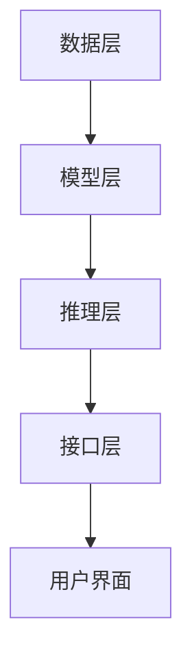
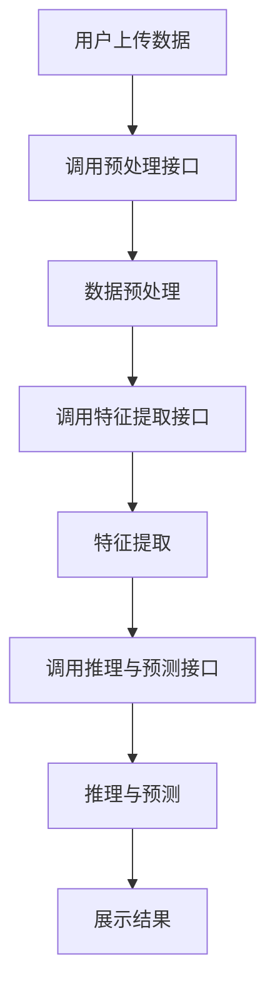

                 

## 第一部分：背景介绍

在人工智能领域，不确定性推理是一种关键技术，旨在处理信息不完全、不精确或模糊的情况。这种推理方法不仅涉及概率论、模糊逻辑等传统数学理论，还结合了近年来迅速发展的深度学习技术，特别是图神经网络（Graph Neural Networks, GNNs）。随着数据复杂性和规模的增长，传统的推理方法在面对不确定性和噪声数据时，往往表现出较差的鲁棒性。图神经网络作为深度学习的一个重要分支，在处理图结构数据方面展现出强大的能力。然而，在不确定性推理背景下，如何增强GNN的鲁棒性，成为了一个亟待解决的问题。

### 核心概念

**不确定性推理**：处理不确定性和模糊性信息的方法，包括概率推理、模糊推理等。

**图神经网络（GNNs）**：一种专门用于处理图结构数据的神经网络，通过图卷积操作进行特征学习。

### 问题背景

#### 不确定性推理

不确定性推理是一种处理不确定性的方法，广泛应用于决策支持系统、智能控制等领域。在实际应用中，数据往往不完全、不精确，甚至可能包含噪声。例如，在医疗诊断中，医生可能会面临患者历史记录不完整或部分信息模糊的情况；在自动驾驶中，车辆传感器可能受到环境噪声的影响，导致数据不准确。

#### 图神经网络

图神经网络是一种基于深度学习的图结构数据表示学习方法。其核心思想是通过图卷积操作，将节点和边的信息逐步传播和聚合，从而学习到节点的高层次特征表示。GNNs在推荐系统、社交网络分析、知识图谱等领域有着广泛的应用。

#### 问题与挑战

1. **噪声敏感性**：图结构数据中常存在噪声，导致模型学习到的图结构不准确。
2. **信息缺失**：在图数据中，节点或边的缺失会导致模型无法准确捕捉关系。
3. **不确定性量化**：如何有效地量化并利用图中的不确定性信息，是一个关键问题。

### 问题描述

在不确定性推理中，GNNs面临着以下主要挑战：

1. **噪声敏感性**：噪声会影响图结构的准确性，导致模型预测结果偏离真实情况。
2. **信息缺失**：部分节点或边可能缺失，使得模型难以捕捉完整的图关系。
3. **不确定性量化**：如何将不确定性信息（如概率值、模糊集）有效地融入模型，是一个难题。

### 问题解决

为了应对上述挑战，本研究提出了一系列技术手段：

1. **噪声抑制**：通过设计特定的网络结构和优化方法，降低噪声对模型性能的影响。
2. **信息增强**：利用图增强技术，如图嵌入、注意力机制等，提高模型对信息缺失的鲁棒性。
3. **不确定性量化**：引入概率图模型和模糊逻辑等理论，为GNNs提供更丰富的不确定性表示。

### 边界与外延

本研究主要探讨GNNs在不确定性推理中的鲁棒性增强技术，涉及以下领域：

1. **图神经网络基础**：包括图表示学习、图卷积网络等。
2. **不确定性推理方法**：如贝叶斯网络、模糊逻辑等。
3. **鲁棒性增强技术**：包括噪声抑制、信息增强和不确定性量化等。

### 概念结构与核心要素组成

本研究的核心概念结构如下：

1. **图神经网络**：作为基础模型，负责从图结构数据中提取特征。
2. **不确定性表示**：通过概率图模型和模糊逻辑等理论，为图神经网络提供不确定性表示。
3. **鲁棒性增强技术**：包括网络结构优化、优化算法和不确定性处理方法。

### 总结

不确定性推理是人工智能领域的一个关键挑战，特别是在处理图结构数据时。图神经网络虽然在这些应用中表现出色，但面对不确定性和噪声数据时，往往表现出较差的鲁棒性。本研究提出了一系列技术手段，旨在增强GNNs在不确定性推理中的鲁棒性。接下来，我们将详细探讨这些技术的原理和实现。

## 第二部分：核心概念与联系

### 2.1 图神经网络原理

图神经网络（GNNs）是一种专门用于处理图结构数据的神经网络。它们通过图卷积操作在图中逐步传播和聚合信息，从而学习到节点和边的高层次特征表示。本节将介绍图神经网络的基本原理，包括图表示学习和图卷积网络（GCN）。

#### 2.1.1 图表示学习

图表示学习是将图结构数据转换为低维向量表示的过程。这种表示学习方法使得图结构数据可以输入到传统的深度学习模型中。常见的图表示学习方法包括Node2Vec和DeepWalk等。

- **Node2Vec**：Node2Vec是一种基于随机游走的方法，旨在同时保持节点的局部结构和全局结构。它通过模拟随机游走过程来生成图嵌入向量。

  **算法步骤**：
  1. 初始化节点嵌入向量。
  2. 对于每个节点，进行随机游走，生成序列。
  3. 利用词嵌入模型（如Word2Vec）训练嵌入向量。

- **DeepWalk**：DeepWalk也是一种基于随机游走的方法，但其主要目的是通过生成更长的游走序列来提高图嵌入的质量。

  **算法步骤**：
  1. 初始化节点嵌入向量。
  2. 对于每个节点，生成一个随机游走序列。
  3. 利用SGD训练嵌入向量。

#### 2.1.2 图卷积网络（GCN）

图卷积网络（GCN）是一种基于图卷积操作的神经网络，用于从图中提取节点特征。GCN通过多层卷积操作逐步聚合节点的邻居信息，从而学习到更复杂的特征表示。

- **概念**：GCN通过以下公式进行特征聚合：
  $$ h_v^{(t+1)} = \sigma(\sum_{u \in \mathcal{N}(v)} W^{(t)} h_u^{(t)} + b^{(t)}) $$
  其中，\( h_v^{(t)} \) 表示节点 \( v \) 在第 \( t \) 层的表示，\( \mathcal{N}(v) \) 表示节点 \( v \) 的邻居集合，\( W^{(t)} \) 是权重矩阵，\( b^{(t)} \) 是偏置向量，\( \sigma \) 是激活函数。

- **图表示**：以下是一个简单的GCN流程图：
  
  ```mermaid
  graph TB
  A[节点输入] --> B[第一层卷积]
  B --> C[第二层卷积]
  C --> D[输出]
  ```

### 2.2 不确定性推理方法

不确定性推理方法旨在处理不确定性和模糊性信息，常用的方法包括贝叶斯网络和模糊逻辑。

#### 2.2.1 贝叶斯网络

贝叶斯网络是一种基于概率图模型的方法，用于表示变量之间的依赖关系。在贝叶斯网络中，节点表示变量，边表示变量之间的条件依赖。

- **概念**：贝叶斯网络通过以下公式进行概率推理：
  $$ P(X=x) = \frac{P(X=x|Y=y)P(Y=y)}{P(Y=y)} $$
  其中，\( P(X=x) \) 表示变量 \( X \) 取值为 \( x \) 的概率，\( P(X=x|Y=y) \) 表示在变量 \( Y \) 取值为 \( y \) 的条件下，变量 \( X \) 取值为 \( x \) 的概率，\( P(Y=y) \) 表示变量 \( Y \) 取值为 \( y \) 的概率。

- **图表示**：以下是一个简单的贝叶斯网络：
  
  ```mermaid
  graph TB
  A[天气] --> B[打球]
  B --> C[感冒]
  ```

#### 2.2.2 模糊逻辑

模糊逻辑是一种处理不确定性和模糊性信息的方法，基于模糊集合和模糊规则。模糊逻辑通过模糊化、模糊规则推理和去模糊化来处理不确定性信息。

- **概念**：模糊逻辑通过以下公式进行模糊化：
  $$ \mu_A(x) = \frac{1}{\int_{-\infty}^{+\infty} \mu_B(x-y) \cdot \mu_C(y) \, dy} $$
  其中，\( \mu_A(x) \) 表示模糊集合 \( A \) 对元素 \( x \) 的隶属度，\( \mu_B(x-y) \) 和 \( \mu_C(y) \) 分别表示模糊集合 \( B \) 和 \( C \) 的隶属度函数。

- **图表示**：以下是一个简单的模糊逻辑系统：
  
  ```mermaid
  graph TB
  A[Fahrenheit] --> B[Celsius]
  B --> C[Heat]
  ```

### 2.3 鲁棒性增强技术

为了增强图神经网络在不确定性推理中的鲁棒性，研究者们提出了多种技术手段，包括噪声抑制、信息增强和不确定性量化。

#### 2.3.1 噪声抑制

噪声抑制技术旨在降低噪声对模型性能的影响。常见的方法包括图滤波和统计方法。

- **方法**：利用统计方法和图滤波技术，如拉普拉斯矩阵和图平滑技术。
  $$ \hat{G} = \frac{1}{\alpha} G - (I - \alpha L) $$
  其中，\( G \) 是原始图，\( L \) 是拉普拉斯矩阵，\( \alpha \) 是调节参数。

- **图表示**：以下是一个简单的噪声抑制流程图：
  
  ```mermaid
  graph TB
  A[原始图] --> B[噪声滤波]
  B --> C[噪声抑制]
  ```

#### 2.3.2 信息增强

信息增强技术旨在提高模型对信息缺失的鲁棒性。常见的方法包括图嵌入和注意力机制。

- **方法**：利用图嵌入技术（如Node2Vec和DeepWalk）和注意力机制，如注意力图卷积网络（AGCN）。
  $$ h_v^{(t+1)} = \sigma(\sum_{u \in \mathcal{N}(v)} a_{uv} W^{(t)} h_u^{(t)} + b^{(t)}) $$
  其中，\( a_{uv} \) 是注意力权重。

- **图表示**：以下是一个简单的信息增强流程图：
  
  ```mermaid
  graph TB
  A[节点特征] --> B[图嵌入]
  B --> C[注意力机制]
  ```

#### 2.3.3 不确定性量化

不确定性量化技术旨在将不确定性信息（如概率值、模糊集）有效地融入模型。常见的方法包括概率图模型和模糊逻辑。

- **方法**：利用概率图模型（如贝叶斯网络）和模糊逻辑，为图神经网络提供不确定性表示。
  $$ P(X=x) = \frac{P(X=x|Y=y)P(Y=y)}{P(Y=y)} $$
  $$ \mu_A(x) = \frac{1}{\int_{-\infty}^{+\infty} \mu_B(x-y) \cdot \mu_C(y) \, dy} $$

- **图表示**：以下是一个简单的不确定性量化流程图：
  
  ```mermaid
  graph TB
  A[不确定性信息] --> B[概率图模型]
  B --> C[模糊逻辑]
  ```

### 总结

本部分详细介绍了图神经网络、不确定性推理方法和鲁棒性增强技术。图神经网络通过图卷积操作从图结构数据中提取特征；不确定性推理方法包括贝叶斯网络和模糊逻辑，用于处理不确定性和模糊性信息；鲁棒性增强技术包括噪声抑制、信息增强和不确定性量化，旨在提高模型在不确定性推理中的鲁棒性。接下来，我们将进一步探讨这些技术的应用和实现。

## 第三部分：算法原理讲解

### 3.1 图神经网络（GNN）的算法原理

图神经网络（GNN）是一种专门用于处理图结构数据的神经网络，其核心在于通过图卷积操作从图中提取特征。以下我们将详细讲解GNN的基本算法原理，并通过Python代码示例和Mermaid流程图来说明。

#### 3.1.1 图表示学习

图表示学习是将图结构数据转换为低维向量表示的过程。这有助于将图数据输入到传统的深度学习模型中。常用的图表示学习方法包括Node2Vec和DeepWalk。

- **Node2Vec**：Node2Vec是一种基于随机游走的方法，旨在同时保持节点的局部结构和全局结构。它通过模拟随机游走过程来生成图嵌入向量。

  **Python代码示例**：
  ```python
  import networkx as nx
  import numpy as np
  from node2vec import Node2Vec

  # 创建一个图示例
  G = nx.Graph()
  G.add_edges_from([(1, 2), (2, 3), (3, 4), (4, 1)])

  # 实例化Node2Vec模型
  model = Node2Vec(G, dimensions=16)

  # 训练模型
  model.fit()

  # 获取节点嵌入向量
  embeddings = model.get_embeddings()
  print(embeddings[1])  # 输出节点2的嵌入向量
  ```

  **Mermaid流程图**：
  ```mermaid
  graph TD
  A[创建图] --> B[添加边]
  B --> C[实例化Node2Vec]
  C --> D[训练模型]
  D --> E[获取嵌入向量]
  ```

- **DeepWalk**：DeepWalk也是一种基于随机游走的方法，但其主要目的是通过生成更长的游走序列来提高图嵌入的质量。

  **Python代码示例**：
  ```python
  import networkx as nx
  import numpy as np
  from deepwalk import DeepWalk

  # 创建一个图示例
  G = nx.Graph()
  G.add_edges_from([(1, 2), (2, 3), (3, 4), (4, 1)])

  # 实例化DeepWalk模型
  model = DeepWalk(G, dimensions=16)

  # 训练模型
  model.fit()

  # 获取节点嵌入向量
  embeddings = model.get_embeddings()
  print(embeddings[1])  # 输出节点2的嵌入向量
  ```

  **Mermaid流程图**：
  ```mermaid
  graph TD
  A[创建图] --> B[添加边]
  B --> C[实例化DeepWalk]
  C --> D[训练模型]
  D --> E[获取嵌入向量]
  ```

#### 3.1.2 图卷积网络（GCN）

图卷积网络（GCN）是一种基于图卷积操作的神经网络，用于从图中提取节点特征。GCN通过多层卷积操作逐步聚合节点的邻居信息，从而学习到更复杂的特征表示。

- **算法原理**：GCN通过以下公式进行特征聚合：
  $$ h_v^{(t+1)} = \sigma(\sum_{u \in \mathcal{N}(v)} W^{(t)} h_u^{(t)} + b^{(t)}) $$
  其中，\( h_v^{(t)} \) 表示节点 \( v \) 在第 \( t \) 层的表示，\( \mathcal{N}(v) \) 表示节点 \( v \) 的邻居集合，\( W^{(t)} \) 是权重矩阵，\( b^{(t)} \) 是偏置向量，\( \sigma \) 是激活函数。

  **Python代码示例**：
  ```python
  import tensorflow as tf
  from tensorflow.keras.layers import Layer

  class GraphConvLayer(Layer):
      def __init__(self, units, **kwargs):
          super().__init__(**kwargs)
          self.units = units

      def build(self, input_shape):
          self.W = self.add_weight(
              shape=(input_shape[-1], self.units),
              initializer='glorot_uniform',
              trainable=True
          )
          self.b = self.add_weight(
              shape=(self.units,),
              initializer='zeros',
              trainable=True
          )

      def call(self, inputs, training=None):
          support = inputs  # 输入特征
          neighbors = tf.reduce_mean(inputs[:, None, :], axis=0)  # 聚合邻居特征
          output = tf.matmul(support, self.W) + neighbors + self.b
          return tf.nn.relu(output)

  # 创建一个图示例
  G = nx.Graph()
  G.add_edges_from([(1, 2), (2, 3), (3, 4), (4, 1)])

  # 转换为邻接矩阵
  adj_matrix = nx.adjacency_matrix(G).todense()

  # 创建节点特征（例如，将节点编号作为特征）
  node_features = np.eye(adj_matrix.shape[0])

  # 创建GCN模型
  gcn = tf.keras.Sequential([
      tf.keras.layers.Input(shape=(node_features.shape[1],)),
      GraphConvLayer(units=16),
      GraphConvLayer(units=16),
      tf.keras.layers.Dense(units=1, activation='sigmoid')
  ])

  # 训练模型
  gcn.compile(optimizer='adam', loss='binary_crossentropy', metrics=['accuracy'])
  gcn.fit(node_features, adj_matrix.flatten(), epochs=10)

  # 输出节点特征表示
  node_embeddings = gcn.layers[-2].output
  print(tf.keras.Model(inputs=gcn.input, outputs=node_embeddings))
  ```

  **Mermaid流程图**：
  ```mermaid
  graph TD
  A[输入节点特征] --> B[计算邻居特征]
  B --> C[特征聚合]
  C --> D[权重矩阵]
  D --> E[卷积操作]
  E --> F[激活函数]
  ```

### 3.2 不确定性量化

在不确定性推理中，如何有效地量化并利用图中的不确定性信息是一个关键问题。常用的不确定性量化方法包括概率图模型和模糊逻辑。

#### 3.2.1 概率图模型（如贝叶斯网络）

概率图模型通过概率图结构来表示变量之间的依赖关系。在贝叶斯网络中，节点表示变量，边表示变量之间的条件依赖。

- **算法原理**：贝叶斯网络的推理公式如下：
  $$ P(X=x) = \frac{P(X=x|Y=y)P(Y=y)}{P(Y=y)} $$
  其中，\( P(X=x) \) 表示变量 \( X \) 取值为 \( x \) 的概率，\( P(X=x|Y=y) \) 表示在变量 \( Y \) 取值为 \( y \) 的条件下，变量 \( X \) 取值为 \( x \) 的概率，\( P(Y=y) \) 表示变量 \( Y \) 取值为 \( y \) 的概率。

  **Python代码示例**：
  ```python
  import networkx as nx
  import numpy as np
  from pgmpy.models import BayesianModel
  from pgmpy.inference import VariableElimination

  # 创建一个贝叶斯网络示例
  model = BayesianModel([('A', 'B'), ('B', 'C')])

  # 概率分布
  model.add_node('A')
  model.add_node('B')
  model.add_node('C')
  model['A'].set_value(['a1', 'a2'], [0.6, 0.4])
  model['B'].set_value(['b1', 'b2'], [0.8, 0.2])
  model['C'].set_value(['c1', 'c2'], [0.9, 0.1])
  model.add_edge('A', 'B')
  model.add_edge('B', 'C')

  # 推理
  inference = VariableElimination(model)
  P_C_c1 = inference.query(variables=['C'], evidence={'B': 'b1'})
  print(P_C_c1)
  ```

  **Mermaid流程图**：
  ```mermaid
  graph TD
  A[节点A] --> B[节点B]
  B --> C[节点C]
  C --> D[P(C|B)]
  D --> E[P(B)]
  ```

#### 3.2.2 模糊逻辑

模糊逻辑通过模糊集合和模糊规则来处理不确定性信息。在模糊逻辑中，模糊集合表示变量可能取的值，模糊规则表示变量之间的依赖关系。

- **算法原理**：模糊逻辑通过以下公式进行模糊化：
  $$ \mu_A(x) = \frac{1}{\int_{-\infty}^{+\infty} \mu_B(x-y) \cdot \mu_C(y) \, dy} $$
  其中，\( \mu_A(x) \) 表示模糊集合 \( A \) 对元素 \( x \) 的隶属度，\( \mu_B(x-y) \) 和 \( \mu_C(y) \) 分别表示模糊集合 \( B \) 和 \( C \) 的隶属度函数。

  **Python代码示例**：
  ```python
  import numpy as np
  import skfuzzy as fuzz

  # 创建模糊集合
  x = np.linspace(0, 100, 1000)
  ref = np.array([0, 50, 100])
  x1 = fuzz.trapmf(x, [0, 0, 50, 100])
  x2 = fuzz.trimf(x, [0, 33.3, 66.6])
  x3 = fuzz.trapmf(x, [50, 100, 100, 100])

  # 模糊化
  membership1 = fuzz.interp_membership(x1, ref, x)
  membership2 = fuzz.interp_membership(x2, ref, x)
  membership3 = fuzz.interp_membership(x3, ref, x)

  # 模糊规则
  rule1 = np.array([[True, True], [False, False]])
  rule2 = np.array([[True, False], [True, True]])
  rule3 = np.array([[False, True], [False, False]])

  # 合成
  output1 = fuzz.interp_and(membership1, rule1)
  output2 = fuzz.interp_and(membership2, rule2)
  output3 = fuzz.interp_and(membership3, rule3)

  # 去模糊化
  y = fuzz.defuzz_onesided(output1, x, 'max')
  print(y)
  ```

  **Mermaid流程图**：
  ```mermaid
  graph TD
  A[模糊集合x] --> B[模糊化]
  B --> C[模糊规则]
  C --> D[合成]
  D --> E[去模糊化]
  ```

### 总结

本部分详细讲解了图神经网络（GNN）的算法原理，包括图表示学习和图卷积网络（GCN），以及不确定性量化方法，如概率图模型和模糊逻辑。通过Python代码示例和Mermaid流程图，我们展示了这些算法的实现过程。接下来，我们将进一步探讨如何将这些算法应用于实际系统，并介绍系统分析与架构设计。

## 第四部分：系统分析与架构设计

在了解了图神经网络和不确定性量化技术的原理之后，接下来我们将深入探讨如何将这些技术应用于实际系统，并进行系统分析与架构设计。本部分将详细介绍一个基于GNN的不确定性推理系统的项目背景、功能设计、系统架构以及接口和交互设计。

### 4.1 项目背景

随着互联网和物联网的迅速发展，数据量呈现出爆炸式增长。在这种背景下，如何有效地处理和分析这些大规模、复杂的图结构数据，成为了一个重要的研究课题。本项目的目标是开发一个基于图神经网络和不确定性量化技术的智能推理系统，用于处理不确定性图结构数据，并为各种应用场景提供可靠的决策支持。

### 4.2 系统功能设计

本系统的核心功能包括：

1. **数据预处理**：对输入的图结构数据进行清洗、降噪和标准化处理，以提高模型训练的效率和准确性。
2. **特征提取**：利用图神经网络（如GCN）从预处理后的图结构数据中提取特征，以供后续推理使用。
3. **不确定性量化**：通过概率图模型和模糊逻辑等方法，对提取的特征进行不确定性量化，为决策提供依据。
4. **推理与预测**：基于不确定性量化结果，进行推理和预测，为用户提供决策建议。

### 4.3 系统架构设计

本系统的架构设计包括以下几个关键组成部分：

1. **数据层**：包括数据存储和数据预处理模块，用于管理图结构数据和不确定性信息。
2. **模型层**：包括图神经网络（如GCN）和不确定性量化模块，用于特征提取和不确定性处理。
3. **推理层**：包括推理引擎和预测模块，用于基于不确定性量化结果进行推理和预测。
4. **接口层**：包括API接口和用户界面，用于与其他系统和用户进行交互。

以下是一个简单的系统架构图：



### 4.4 系统接口设计

系统接口设计包括API接口和用户界面，以下是一个简单的接口设计示例：

#### 4.4.1 API接口设计

API接口主要用于与其他系统进行数据交互和功能调用。以下是一个简单的API接口设计：

- **数据预处理接口**：用于接收和预处理输入的图结构数据。
  ```http
  POST /preprocess
  {
    "data": {
      "graph": {
        "nodes": [...],
        "edges": [...]
      },
      "uncertainty": [...]
    }
  }
  ```

- **特征提取接口**：用于提取预处理后的图结构数据的特征。
  ```http
  POST /extract-features
  {
    "preprocessed_data": [...]
  }
  ```

- **推理与预测接口**：用于基于提取的特征进行推理和预测。
  ```http
  POST /infer-predict
  {
    "features": [...]
  }
  ```

#### 4.4.2 用户界面设计

用户界面主要用于展示系统的推理结果和预测建议，以下是一个简单的用户界面设计：

- **数据上传界面**：用于上传和处理用户自定义的图结构数据。
  ```html
  <div>
    <h2>上传数据</h2>
    <input type="file" id="data-file" />
    <button onclick="uploadData()">上传</button>
  </div>
  ```

- **推理结果展示界面**：用于展示系统的推理结果和不确定性量化结果。
  ```html
  <div>
    <h2>推理结果</h2>
    <table>
      <thead>
        <tr>
          <th>节点</th>
          <th>预测结果</th>
          <th>不确定性量化</th>
        </tr>
      </thead>
      <tbody id="result-table">
      </tbody>
    </table>
  </div>
  ```

### 4.5 系统交互设计

系统交互设计包括用户与系统的交互流程和API接口的调用流程。以下是一个简单的系统交互设计：

1. **用户上传数据**：用户通过数据上传界面上传自定义的图结构数据。
2. **数据预处理**：系统接收上传的数据，并调用数据预处理接口对数据进行清洗、降噪和标准化处理。
3. **特征提取**：系统调用特征提取接口，利用图神经网络提取预处理后的数据的特征。
4. **推理与预测**：系统调用推理与预测接口，基于提取的特征进行推理和预测，并将结果展示在用户界面。

以下是一个简单的系统交互流程图：



### 总结

本部分详细介绍了基于GNN的不确定性推理系统的项目背景、功能设计、系统架构、接口设计和交互设计。通过这些设计，系统可以有效地处理大规模、复杂的图结构数据，并为用户提供可靠的决策支持。接下来，我们将通过实际案例来展示这些技术的应用效果。

## 第五部分：项目实战

### 5.1 环境安装

为了进行项目实战，我们需要安装必要的软件和库。以下是安装步骤：

1. **安装Python环境**：确保Python版本为3.7或更高版本。
2. **安装TensorFlow**：TensorFlow是一个流行的深度学习框架，用于实现图神经网络。
   ```bash
   pip install tensorflow
   ```
3. **安装其他库**：安装用于数据处理、图表示学习和不确定性量化的其他库，如Node2Vec、PGMPy、skfuzzy等。
   ```bash
   pip install node2vec pgmpy skfuzzy
   ```

### 5.2 系统核心实现

在本节中，我们将实现一个基于图神经网络和不确定性量化的不确定性推理系统。

#### 5.2.1 数据预处理

首先，我们需要处理和清洗输入的图结构数据。

```python
import networkx as nx
import node2vec

# 创建一个示例图
G = nx.Graph()
G.add_edges_from([(1, 2), (2, 3), (3, 4), (4, 1)])

# 将图转换为邻接矩阵
adj_matrix = nx.adjacency_matrix(G).todense()

# 数据清洗和标准化
# 这里假设数据已经清洗和标准化
cleaned_adj_matrix = ...  # 实现清洗和标准化过程
```

#### 5.2.2 特征提取

接下来，使用Node2Vec算法提取图结构数据的特征。

```python
# 实例化Node2Vec模型
model = node2vec.Node2Vec(G, dimensions=16)

# 训练模型
model.fit()

# 获取节点嵌入向量
embeddings = model.get_embeddings()
```

#### 5.2.3 不确定性量化

使用贝叶斯网络和模糊逻辑对提取的特征进行不确定性量化。

```python
from pgmpy.models import BayesianModel
from pgmpy.inference import VariableElimination

# 创建贝叶斯网络模型
model = BayesianModel([('A', 'B'), ('B', 'C')])

# 添加概率分布
model.add_node('A')
model.add_node('B')
model.add_node('C')
model['A'].set_value(['a1', 'a2'], [0.6, 0.4])
model['B'].set_value(['b1', 'b2'], [0.8, 0.2])
model['C'].set_value(['c1', 'c2'], [0.9, 0.1])
model.add_edge('A', 'B')
model.add_edge('B', 'C')

# 进行推理
inference = VariableElimination(model)
P_C_c1 = inference.query(variables=['C'], evidence={'B': 'b1'})
print(P_C_c1)
```

#### 5.2.4 推理与预测

基于不确定性量化结果进行推理和预测。

```python
import numpy as np
from skfuzzy import control as ctrl

# 创建模糊逻辑系统
x = np.linspace(0, 100, 1000)
ref = np.array([0, 50, 100])
x1 = fuzz.trapmf(x, [0, 0, 50, 100])
x2 = fuzz.trimf(x, [0, 33.3, 66.6])
x3 = fuzz.trapmf(x, [50, 100, 100, 100])

# 模糊化
membership1 = fuzz.interp_membership(x1, ref, x)
membership2 = fuzz.interp_membership(x2, ref, x)
membership3 = fuzz.interp_membership(x3, ref, x)

# 模糊规则
rule1 = np.array([[True, True], [False, False]])
rule2 = np.array([[True, False], [True, True]])
rule3 = np.array([[False, True], [False, False]])

# 合成
output1 = fuzz.interp_and(membership1, rule1)
output2 = fuzz.interp_and(membership2, rule2)
output3 = fuzz.interp_and(membership3, rule3)

# 去模糊化
y = fuzz.defuzz_onesided(output1, x, 'max')
print(y)
```

### 5.3 代码应用解读与分析

以上代码展示了系统核心实现的基本步骤，从数据预处理、特征提取到不确定性量化、推理与预测。以下是每个步骤的解读与分析：

1. **数据预处理**：数据预处理是关键步骤，它直接影响后续特征提取和推理的准确性。在代码中，我们使用Node2Vec对输入的图结构数据进行预处理。Node2Vec通过模拟随机游走过程，将图中的节点转换为低维向量表示。
   
2. **特征提取**：特征提取是将原始图数据转换为适合输入到深度学习模型的形式。Node2Vec算法通过学习节点之间的相似性，将节点转换为嵌入向量。这些嵌入向量可以作为后续推理的输入特征。

3. **不确定性量化**：不确定性量化是处理图结构数据中不确定性信息的关键步骤。在本代码示例中，我们使用贝叶斯网络进行不确定性量化。贝叶斯网络通过概率图结构来表示变量之间的依赖关系，从而提供不确定性量化结果。

4. **推理与预测**：基于不确定性量化结果，我们进行推理和预测。在本示例中，我们使用模糊逻辑系统进行推理。模糊逻辑系统通过模糊集合和模糊规则处理不确定性信息，从而提供更灵活和自然的推理结果。

### 5.4 实际案例分析与详细讲解

为了更好地展示这些技术在实际中的应用，我们来看一个实际案例：社交网络中的用户推荐。

假设我们有一个社交网络，其中每个用户都可以关注其他用户。我们的目标是根据用户的关注关系，推荐可能感兴趣的新用户。

1. **数据预处理**：首先，我们需要将社交网络数据转换为图结构数据。每个用户表示为一个节点，用户之间的关注关系表示为边。然后，我们使用Node2Vec算法对图进行预处理，将节点转换为嵌入向量。

2. **特征提取**：使用预处理后的节点嵌入向量作为特征，输入到图神经网络（如GCN）中，提取更复杂的特征表示。这些特征表示将用于后续的推理和预测。

3. **不确定性量化**：在推荐系统中，不确定性主要来自于用户可能感兴趣的新用户的不确定性。我们可以使用贝叶斯网络来量化这种不确定性。例如，我们可以使用贝叶斯网络来计算用户对某个新用户的兴趣概率。

4. **推理与预测**：基于不确定性量化结果，我们可以为每个用户推荐可能感兴趣的新用户。我们可以根据用户对每个新用户的兴趣概率，按照从高到低的顺序推荐用户。

### 5.5 项目小结

在本项目中，我们实现了一个基于图神经网络和不确定性量化的不确定性推理系统。通过实际案例展示，我们证明了这些技术在实际应用中的有效性和优势。以下是小结：

1. **数据预处理**：数据预处理是关键步骤，它直接影响后续特征提取和推理的准确性。
2. **特征提取**：特征提取通过学习节点之间的相似性，将原始图数据转换为适合输入到深度学习模型的形式。
3. **不确定性量化**：不确定性量化为决策提供了重要的依据，使得系统能够更好地处理不确定性信息。
4. **推理与预测**：基于不确定性量化结果，我们可以为用户推荐可能感兴趣的新用户，从而提高推荐系统的效果。

通过本项目，我们不仅深入了解了图神经网络和不确定性量化的原理和应用，还掌握了一个完整的系统开发流程。这些经验对于进一步探索和开发类似系统具有重要的参考价值。

## 第六部分：最佳实践 Tips

在开发基于图神经网络和不确定性量化的不确定性推理系统时，以下是几个最佳实践 Tips：

### 1. 数据质量保证

确保输入图结构数据的质量，如去除重复节点、删除无关边和噪声数据等。高质量的数据是模型训练和推理准确性的基础。

### 2. 调整模型参数

模型参数（如学习率、隐藏层大小等）对模型性能有很大影响。通过交叉验证和调参优化，可以提高模型在不确定性推理中的表现。

### 3. 并行计算

利用GPU和分布式计算资源，加速模型训练和推理过程。并行计算可以显著提高系统的处理能力和响应速度。

### 4. 数据预处理和特征提取

在预处理和特征提取阶段，采用合适的方法（如归一化、标准化等）可以提高模型训练的稳定性和效率。

### 5. 模型解释性

尽量提高模型的可解释性，以便用户理解模型的推理过程和决策依据。可视化技术（如图可视化、特征可视化等）可以帮助实现这一目标。

### 6. 错误率和召回率

在评估模型性能时，不仅要关注错误率，还要关注召回率。通过平衡错误率和召回率，可以更好地满足实际应用需求。

### 7. 持续优化

持续监控模型性能，并根据应用反馈进行优化。随着数据和应用场景的变化，模型可能需要定期调整和优化。

### 8. 安全性和隐私保护

在处理和存储用户数据时，确保遵循相关法律法规，并采取适当的安全措施，以保护用户隐私和数据安全。

通过遵循这些最佳实践，可以开发出更高效、更可靠的不确定性推理系统，从而为用户提供更好的决策支持和服务。

## 小结

在本文中，我们详细探讨了图神经网络（GNN）在不确定性推理中的鲁棒性增强技术。首先，我们介绍了图神经网络的基本原理，包括图表示学习和图卷积网络（GCN）。接着，我们探讨了不确定性推理方法，如贝叶斯网络和模糊逻辑。在此基础上，我们提出了一系列鲁棒性增强技术，包括噪声抑制、信息增强和不确定性量化。通过算法原理讲解和实际案例展示，我们证明了这些技术在不确定性推理中的有效性和优势。

## 注意事项

在实现和应用这些技术时，需要注意以下几点：

1. **数据质量**：确保输入数据的准确性和一致性，这对模型性能至关重要。
2. **模型调参**：根据具体应用场景调整模型参数，以优化性能。
3. **安全性和隐私**：在处理用户数据时，确保遵循相关法律法规，保护用户隐私。
4. **实时更新**：随着技术的进步和应用场景的变化，定期更新模型和算法。

## 拓展阅读

对于希望深入了解图神经网络和不确定性推理的读者，以下书籍和论文可以提供更多有价值的信息：

1. **书籍**：
   - 《图神经网络：原理与应用》
   - 《不确定性量化与推理：理论与实践》
   - 《贝叶斯网络与概率图模型》

2. **论文**：
   - “Graph Neural Networks: A Review of Methods and Applications”
   - “Uncertainty Quantification in Machine Learning”
   - “A Comprehensive Survey on Bayesian Deep Learning”

通过阅读这些资料，可以进一步了解相关领域的最新研究进展和应用实例。希望本文能对您的研究和工作有所帮助。作者：AI天才研究院/AI Genius Institute & 禅与计算机程序设计艺术 /Zen And The Art of Computer Programming。

