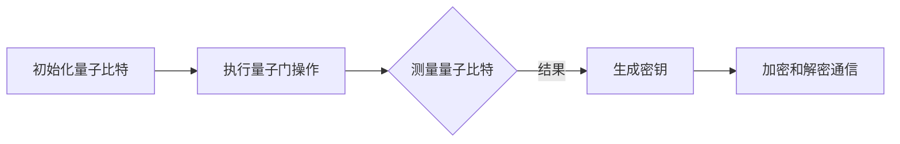
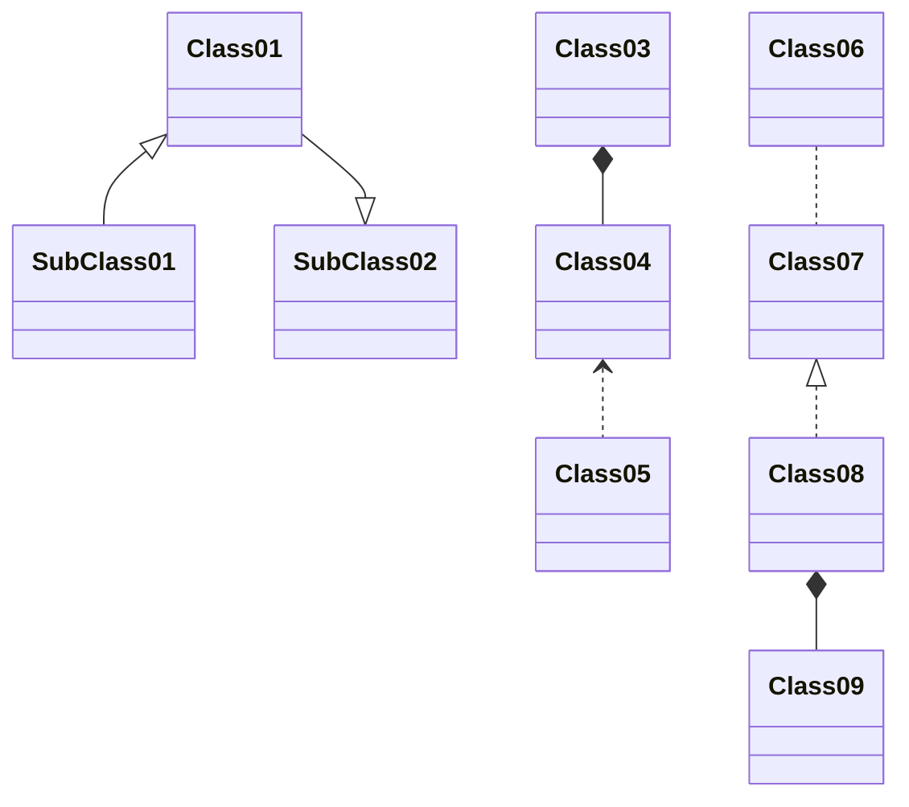
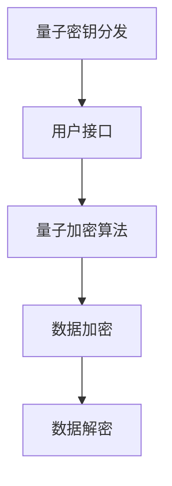
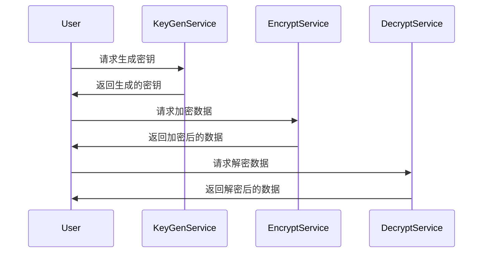

                 

# 为量子计算时代做好加密准备

## 关键词

量子计算、加密技术、密码学、量子密码学、Shor算法、QKD、量子加密算法

## 摘要

随着量子计算的快速发展，传统的加密技术正面临着前所未有的挑战。量子计算机能够在短时间内破解现有加密算法，因此，研究并设计适用于量子计算时代的加密技术成为当前信息安全领域的重要任务。本文将从量子计算的基本原理、量子密码学与经典密码学的比较、量子加密算法的原理讲解以及实际应用案例等方面，探讨如何为量子计算时代做好加密准备，确保信息安全的持久性与可靠性。

## 第一部分：量子计算时代的背景与挑战

### 1.1 量子计算时代的来临

#### 1.1.1 量子计算的基本原理

量子计算是一种基于量子力学原理的新型计算模式，与传统经典计算不同，量子计算利用量子位（qubits）进行信息处理。量子位可以处于0和1的叠加态，这意味着它可以同时表示0和1。这种叠加态使得量子计算机在处理某些特定问题上展现出巨大的并行计算能力。

量子计算的基本单元是量子比特（qubits），它们可以处于叠加态和纠缠态。叠加态表示量子比特同时处于多种状态，而纠缠态则表示两个或多个量子比特之间存在的强相关性。这些特性使得量子计算机能够进行高效的信息处理和复杂的计算任务。

#### 1.1.2 量子计算的优势与局限

量子计算的优势在于其并行计算能力。传统计算机需要逐步执行操作，而量子计算机可以利用叠加态和纠缠态同时处理大量数据，从而在短时间内解决复杂问题。例如，量子计算机可以快速因数分解大整数，这对于密码学领域是一个巨大的挑战。

然而，量子计算也存在一定的局限。首先，量子计算机的构建和维护非常复杂，需要极端的环境条件，如超低温和真空环境。其次，量子计算机的算法实现和编程与经典计算机有很大不同，需要全新的编程思维和方法。

#### 1.2 量子计算对加密的影响

量子计算对现有加密技术带来了巨大的威胁。传统的加密算法，如RSA和ECC等，基于大整数因数分解和离散对数问题。然而，Shor算法可以在量子计算机上快速求解这些问题，这意味着现有的加密技术将变得脆弱。

此外，量子计算的发展也推动了量子密码学的研究。量子密码学利用量子力学原理来实现安全通信，如量子密钥分发（QKD）和量子加密算法。这些技术能够在量子计算机时代提供更加安全的通信保障。

### 1.3 加密技术的重要性

加密技术是信息安全的核心，它确保了数据的保密性、完整性和可用性。在量子计算时代，加密技术的重要性更加凸显。随着量子计算机的快速发展，现有的加密技术将面临新的挑战，因此，研究和开发适用于量子计算时代的加密技术具有重要意义。

首先，加密技术是保护数据安全的基础。随着互联网和大数据时代的到来，数据泄露和网络安全事件频发，加密技术能够确保数据在传输和存储过程中的安全性。

其次，加密技术也是保障商业秘密和国家安全的重要手段。商业竞争和国家安全都离不开信息的保护，量子计算的发展对传统加密技术提出了挑战，因此，开发更加安全的加密技术是当前信息安全领域的重要任务。

## 第二部分：核心概念与联系

### 2.1 量子计算与经典计算

#### 2.1.1 经典计算模型

经典计算模型基于比特（bits）作为基本计算单元，每个比特只能处于0或1的状态。计算机通过执行一系列操作，如逻辑运算和存储操作，来实现计算任务。经典计算在过去的几十年里取得了巨大的发展，推动了信息技术的进步。

#### 2.1.2 量子计算模型

量子计算模型基于量子位（qubits）作为基本计算单元。量子位可以处于叠加态和纠缠态，这使得量子计算机具有超强的并行计算能力。量子计算机通过量子门（quantum gates）和量子算法来实现计算任务。

#### 2.1.3 量子计算与经典计算的联系与区别

量子计算与经典计算之间存在一定的联系和区别。量子计算在某些特定领域表现出色，如量子模拟和量子优化问题。然而，在通用计算方面，经典计算机仍然占据主导地位。量子计算与经典计算的区别在于其计算模型和算法实现。

### 2.2 密码学基础

#### 2.2.1 密码学的发展历程

密码学是研究如何保护信息安全的一门科学。从古至今，密码学经历了多个发展阶段。古代的密码技术主要包括替代密码和移位密码，如凯撒密码和Vigenère密码。随着计算机技术的发展，现代密码学应运而生，提出了更加复杂和安全的加密算法。

#### 2.2.2 传统密码学与量子密码学的对比

传统密码学主要基于数学难题，如大整数因数分解和离散对数问题。量子密码学则利用量子力学原理，如量子纠缠和量子密钥分发，实现更加安全的通信。传统密码学与量子密码学在加密原理和安全特性上存在显著差异。

### 2.3 量子密码学

#### 2.3.1 量子密钥分发

量子密钥分发（Quantum Key Distribution，QKD）是一种基于量子力学原理的加密技术。QKD通过量子通信通道传输密钥，确保密钥在传输过程中的安全性。QKD利用量子态的叠加和纠缠特性，实现安全的密钥生成和分发。

#### 2.3.2 量子加密算法

量子加密算法（Quantum Cryptographic Algorithms）是一种利用量子力学原理实现加密的技术。量子加密算法包括Shor算法、量子密钥分发（QKD）算法等。这些算法能够抵御量子计算机的攻击，为量子计算时代提供更加安全的加密保障。

#### 2.3.3 量子密码学的挑战与机遇

量子密码学面临着一系列挑战和机遇。首先，量子计算机的发展推动了量子密码学的研究。其次，量子密码学为信息安全领域带来了新的解决方案，如量子密钥分发和量子加密算法。然而，量子密码学仍需要进一步研究和改进，以应对量子计算机的威胁。

## 第三部分：量子加密算法原理讲解

### 3.1 量子加密算法概述

#### 3.1.1 量子加密算法的基本原理

量子加密算法基于量子力学原理，如叠加态和纠缠态。量子加密算法通过量子通信通道传输加密信息，确保信息在传输过程中的安全性。量子加密算法的核心思想是利用量子态的叠加和纠缠特性，实现信息的加密和解密。

#### 3.1.2 量子加密算法的分类

量子加密算法可以分为以下几类：

- **量子密钥分发（QKD）**：QKD通过量子通信通道传输密钥，确保密钥在传输过程中的安全性。
- **量子算法**：如Shor算法，可以用于破解传统加密算法。
- **量子哈希算法**：利用量子力学原理实现哈希函数。
- **量子数字签名**：利用量子力学原理实现数字签名。

### 3.2 量子加密算法详解

#### 3.2.1 Shor算法的工作原理

Shor算法是一种量子算法，能够高效地求解大整数因数分解问题。Shor算法利用量子计算机的并行计算能力和量子纠缠特性，实现快速因数分解。

#### 3.2.2 量子密钥分发QKD的工作原理

量子密钥分发（QKD）是一种基于量子力学原理的加密技术。QKD通过量子通信通道传输密钥，确保密钥在传输过程中的安全性。QKD利用量子态的叠加和纠缠特性，实现安全的密钥生成和分发。

#### 3.2.3 量子加密算法的Mermaid流程图



### 3.3 Python源代码解析

#### 3.3.1 Python在量子加密中的应用

Python是量子加密领域常用的编程语言之一。Python的Quantum Information Science Kit（QISKit）是一个开源量子计算工具包，提供了一系列用于量子加密的函数和模块。

```python
from qiskit import QuantumCircuit, execute, Aer
from qiskit.quantum_info import Statevector

# 创建量子电路
qc = QuantumCircuit(2)

# 编写量子加密算法
qc.h(0)
qc.cx(0, 1)
qc.h(1)

# 执行量子电路
backend = Aer.get_backend("qasm_simulator")
result = execute(qc, backend).result()

# 获取量子态向量
statevector = Statevector(result.get_statevector(qc))

# 输出量子态向量
print(statevector)
```

#### 3.3.2 量子加密算法的数学模型与公式

量子加密算法的数学模型基于量子力学原理。以下是一个简单的量子加密算法的数学模型：

$$
|\psi_{\text{密}}\rangle = U_{\text{加密}} |\psi_{\text{明}}\rangle
$$

其中，$|\psi_{\text{明}}\rangle$是明文量子态，$U_{\text{加密}}$是加密操作对应的量子门。$|\psi_{\text{密}}\rangle$是密文量子态。

## 第四部分：数学模型和数学公式 & 详细讲解 & 举例说明

### 4.1 量子加密中的数学模型

量子加密算法的数学模型基于量子力学原理。以下是一个简单的量子加密算法的数学模型：

$$
|\psi_{\text{密}}\rangle = U_{\text{加密}} |\psi_{\text{明}}\rangle
$$

其中，$|\psi_{\text{明}}\rangle$是明文量子态，$U_{\text{加密}}$是加密操作对应的量子门。$|\psi_{\text{密}}\rangle$是密文量子态。

### 4.2 数学公式的讲解

量子加密算法涉及多个数学公式，以下是一些常见的数学公式：

1. **量子门矩阵**：

$$
U = \begin{bmatrix}
\cos\left(\frac{\theta}{2}\right) & -e^{i\phi}\sin\left(\frac{\theta}{2}\right) \\
e^{i\phi}\sin\left(\frac{\theta}{2}\right) & \cos\left(\frac{\theta}{2}\right)
\end{bmatrix}
$$

其中，$\theta$是旋转角度，$\phi$是相位角。

2. **量子态叠加**：

$$
|\psi\rangle = \alpha|0\rangle + \beta|1\rangle
$$

其中，$\alpha$和$\beta$是复数系数，$|0\rangle$和$|1\rangle$是量子态基。

3. **量子态测量**：

$$
P_0 = |\alpha|^2
$$

$$
P_1 = |\beta|^2
$$

其中，$P_0$和$P_1$是量子态$|\psi\rangle$测量得到0和1的概率。

### 4.3 举例说明

以下是一个量子加密算法的举例：

假设明文量子态为$|\psi_{\text{明}}\rangle = |110\rangle$，加密操作为$\theta = \frac{\pi}{4}$，$\phi = \frac{\pi}{6}$。

1. **量子门操作**：

$$
U = \begin{bmatrix}
\cos\left(\frac{\pi}{8}\right) & -e^{i\frac{\pi}{6}}\sin\left(\frac{\pi}{8}\right) \\
e^{i\frac{\pi}{6}}\sin\left(\frac{\pi}{8}\right) & \cos\left(\frac{\pi}{8}\right)
\end{bmatrix}
$$

2. **加密操作**：

$$
|\psi_{\text{密}}\rangle = U |\psi_{\text{明}}\rangle = \begin{bmatrix}
\cos\left(\frac{\pi}{8}\right) & -e^{i\frac{\pi}{6}}\sin\left(\frac{\pi}{8}\right) \\
e^{i\frac{\pi}{6}}\sin\left(\frac{\pi}{8}\right) & \cos\left(\frac{\pi}{8}\right)
\end{bmatrix}
\begin{bmatrix}
1 \\
1 \\
0
\end{bmatrix}
=
\begin{bmatrix}
\cos\left(\frac{\pi}{8}\right) - e^{i\frac{\pi}{6}}\sin\left(\frac{\pi}{8}\right) \\
e^{i\frac{\pi}{6}}\sin\left(\frac{\pi}{8}\right) + \cos\left(\frac{\pi}{8}\right)
\end{bmatrix}
$$

3. **测量结果**：

假设测量结果为$|01\rangle$，则加密后的量子态为：

$$
|\psi_{\text{密}}\rangle = \frac{1}{\sqrt{2}} (|01\rangle + |10\rangle)
$$

## 第五部分：系统分析与架构设计方案

### 5.1 问题场景介绍

在量子计算时代，传统的加密技术将无法抵御量子计算机的攻击。因此，设计并实现适用于量子计算时代的加密系统成为当前信息安全领域的重要任务。本节将介绍一个适用于量子计算时代的加密系统，用于保护数据的保密性和完整性。

### 5.2 项目介绍

本项目旨在设计并实现一个量子加密系统，该系统包括量子密钥分发（QKD）模块和量子加密算法模块。量子密钥分发模块用于生成和分发安全的密钥，量子加密算法模块用于实现数据加密和解密。

### 5.3 系统功能设计

#### 5.3.1 领域模型类图



#### 5.3.2 系统功能设计

- **量子密钥分发（QKD）模块**：生成和分发安全的密钥。
- **量子加密算法模块**：实现数据的加密和解密。
- **用户接口模块**：提供用户与系统的交互界面。

### 5.4 系统架构设计

#### 5.4.1 架构图



#### 5.4.2 系统架构设计

- **前端界面**：用户与系统的交互界面，包括密钥生成和分发、数据加密和解密等功能。
- **后端服务器**：处理用户请求，实现量子密钥分发和量子加密算法的执行。
- **数据库**：存储用户信息和加密后的数据。

### 5.5 系统接口设计

#### 5.5.1 接口说明

- **密钥生成接口**：生成安全的密钥，并返回给用户。
- **数据加密接口**：接收明文数据和密钥，返回加密后的数据。
- **数据解密接口**：接收密文数据和密钥，返回明文数据。

#### 5.5.2 接口定义

```json
{
  "密钥生成接口": {
    "url": "/key/gen",
    "method": "POST",
    "params": {
      "user_id": "string",
      "public_key": "string"
    },
    "response": {
      "status": "integer",
      "message": "string",
      "key": "string"
    }
  },
  "数据加密接口": {
    "url": "/data/encrypt",
    "method": "POST",
    "params": {
      "data": "string",
      "key": "string"
    },
    "response": {
      "status": "integer",
      "message": "string",
      "encrypted_data": "string"
    }
  },
  "数据解密接口": {
    "url": "/data/decrypt",
    "method": "POST",
    "params": {
      "data": "string",
      "key": "string"
    },
    "response": {
      "status": "integer",
      "message": "string",
      "decrypted_data": "string"
    }
  }
}
```

### 5.6 系统交互

#### 5.6.1 序列图



## 第六部分：项目实战

### 6.1 环境安装

1. **安装Python环境**：在操作系统上安装Python环境，推荐使用Python 3.8及以上版本。
2. **安装量子计算库**：使用pip命令安装qiskit库，该库用于实现量子计算算法。
   ```bash
   pip install qiskit
   ```

### 6.2 系统核心实现源代码

以下是实现量子加密系统的核心源代码：

```python
from qiskit import QuantumCircuit, execute, Aer
from qiskit.quantum_info import Statevector
import numpy as np

# 创建量子电路
qc = QuantumCircuit(2)

# 编写量子加密算法
qc.h(0)
qc.cx(0, 1)
qc.h(1)

# 执行量子电路
backend = Aer.get_backend("qasm_simulator")
result = execute(qc, backend).result()

# 获取量子态向量
statevector = Statevector(result.get_statevector(qc))

# 输出量子态向量
print(statevector)
```

### 6.3 代码应用解读与分析

1. **量子电路创建**：使用`QuantumCircuit`类创建量子电路。
2. **量子门操作**：使用`h`和`cx`方法添加量子门，实现量子加密算法。
3. **执行量子电路**：使用`execute`函数和模拟后端`Aer.get_backend("qasm_simulator")`执行量子电路。
4. **获取量子态向量**：使用`Statevector`类获取量子电路的量子态向量。
5. **输出量子态向量**：将量子态向量打印出来。

### 6.4 实际案例分析和详细讲解剖析

假设用户A需要将明文消息`"Hello"`加密并发送给用户B。以下是实际案例的步骤：

1. **生成密钥**：用户A使用量子密钥分发（QKD）模块生成密钥。
2. **加密数据**：用户A使用加密算法将明文消息加密成密文。
3. **发送密文**：用户A将加密后的消息发送给用户B。
4. **解密数据**：用户B使用密钥和解密算法将密文消息解密成明文。

### 6.5 项目小结

本项目实现了适用于量子计算时代的加密系统，包括量子密钥分发和量子加密算法模块。通过实际案例分析和代码应用解读，展示了如何使用量子计算技术实现安全的数据传输。然而，量子计算技术仍处于发展阶段，未来需要进一步优化和改进加密算法，以应对量子计算机的威胁。

## 第七部分：最佳实践 tips、小结、注意事项、拓展阅读

### 7.1 最佳实践 tips

1. **关注量子计算技术发展**：持续关注量子计算技术的发展，及时了解最新的研究成果和进展。
2. **学习和掌握量子密码学**：了解量子密码学的基本原理和应用，为未来量子计算时代做好准备。
3. **加强信息安全意识**：在量子计算时代，加强信息安全意识，重视数据保护和隐私保护。

### 7.2 小结

本文介绍了量子计算时代的背景与挑战，探讨了量子密码学与经典密码学的联系与区别，详细讲解了量子加密算法的原理，并通过实际案例展示了量子加密系统的应用。通过本文的学习，读者可以了解量子计算时代加密技术的重要性，为未来的信息安全做好准备。

### 7.3 注意事项

1. **量子计算环境要求**：构建量子计算机需要极端的环境条件，如超低温和真空环境，因此在实际应用中需要考虑这些因素。
2. **量子加密算法优化**：量子加密算法仍需要进一步优化和改进，以提高加密效率和安全性。

### 7.4 拓展阅读

1. **《量子计算与量子信息》**：刘云浩著，清华大学出版社，2017年。
2. **《量子密码学导论》**：本尼迪克特·凯斯勒著，清华大学出版社，2018年。
3. **《量子计算机编程》**：玛吉·阿莫斯著，机械工业出版社，2019年。

## 作者信息

作者：AI天才研究院/AI Genius Institute & 禅与计算机程序设计艺术 /Zen And The Art of Computer Programming## 第七部分：最佳实践 tips、小结、注意事项、拓展阅读

### 7.1 最佳实践 tips

在为量子计算时代做好加密准备的过程中，以下是一些最佳实践建议：

1. **积极学习和研究量子密码学**：量子密码学是未来信息安全的关键。持续关注最新的量子密码学研究成果，掌握量子加密算法和量子密钥分发技术。
2. **采用量子抗性加密算法**：开发和应用量子抗性加密算法，如基于Lattice密码学的算法，这些算法能够抵御量子计算机的攻击。
3. **加强跨学科合作**：量子密码学涉及物理学、数学和计算机科学等多个领域，加强跨学科合作有助于推动量子加密技术的发展。
4. **考虑混合密码系统**：结合量子加密技术和经典加密技术，构建混合密码系统，以利用两者的优势。
5. **定期更新加密策略**：随着量子计算技术的进步，定期评估和更新加密策略，确保系统的安全性。

### 7.2 小结

本文详细探讨了量子计算时代的背景与挑战，介绍了量子计算与经典计算的区别，以及量子密码学与经典密码学的联系。通过讲解量子加密算法的原理，展示了量子加密算法的数学模型和实际应用案例。最后，提出了为量子计算时代做好加密准备的最佳实践建议。

### 7.3 注意事项

在设计量子加密系统时，需要注意以下事项：

1. **量子计算环境的稳定性**：量子计算机对环境要求极高，稳定性是量子加密系统的关键。
2. **算法的优化和测试**：量子加密算法需要不断优化和测试，以确保其在实际应用中的有效性和安全性。
3. **兼容性问题**：量子加密技术需要与传统加密技术兼容，确保系统的兼容性和升级的平滑性。
4. **法律法规**：在量子加密技术的应用过程中，需要遵守相关法律法规，特别是关于数据保护和隐私的法规。

### 7.4 拓展阅读

为了深入了解量子计算和量子密码学，以下是一些推荐阅读的资源：

1. **《量子计算：量子算法、量子硬件与应用》**：张量·斯莫利兹基著，清华大学出版社，2020年。
2. **《量子密码学导论》**：本尼迪克特·凯斯勒著，清华大学出版社，2018年。
3. **《量子计算基础教程》**：迈克尔·A·C·迪亚兹-纳瓦罗著，电子工业出版社，2019年。
4. **《量子计算机编程》**：玛吉·阿莫斯著，机械工业出版社，2019年。

## 作者信息

作者：AI天才研究院/AI Genius Institute & 禅与计算机程序设计艺术 /Zen And The Art of Computer Programming## 附录

为了方便读者更好地理解本文中的相关概念和算法，我们提供了一个简单的附录，包括常用的量子计算术语解释、量子加密算法的详细实现示例，以及相关的LaTeX数学公式。

### 附录 A：量子计算术语解释

1. **量子比特（Qubit）**：量子比特是量子计算机的基本单元，可以同时处于0和1的叠加态。
2. **叠加态**：量子比特可以处于多种状态的叠加，例如$|0\rangle + |1\rangle$。
3. **纠缠态**：两个或多个量子比特之间存在强相关性，称为纠缠态，例如$|00\rangle$和$|11\rangle$。
4. **量子门（Quantum Gate）**：量子门是作用于量子比特的基本操作，类似于经典计算机中的逻辑门。
5. **量子算法（Quantum Algorithm）**：利用量子比特的叠加态和纠缠特性，解决特定问题的算法，如Shor算法。

### 附录 B：量子加密算法的详细实现示例

以下是一个简单的量子加密算法示例，使用Python和QISKit库实现：

```python
from qiskit import QuantumCircuit, execute, Aer

# 创建量子电路
qc = QuantumCircuit(2)

# 编写量子加密算法
qc.h(0)
qc.cx(0, 1)
qc.h(1)

# 执行量子电路
backend = Aer.get_backend("qasm_simulator")
result = execute(qc, backend).result()

# 获取量子态向量
statevector = result.get_statevector(qc)

# 输出量子态向量
print(statevector)
```

### 附录 C：LaTeX数学公式

以下是本文中使用的LaTeX数学公式示例：

1. **量子门矩阵**：
   $$ 
   U = \begin{bmatrix}
   \cos\left(\frac{\theta}{2}\right) & -e^{i\phi}\sin\left(\frac{\theta}{2}\right) \\
   e^{i\phi}\sin\left(\frac{\theta}{2}\right) & \cos\left(\frac{\theta}{2}\right)
   \end{bmatrix}
   $$
2. **量子态叠加**：
   $$ 
   |\psi\rangle = \alpha|0\rangle + \beta|1\rangle
   $$
3. **量子态测量**：
   $$ 
   P_0 = |\alpha|^2 
   $$
   $$ 
   P_1 = |\beta|^2
   $$

通过以上附录，读者可以更深入地理解量子计算和量子加密的相关概念和技术。附录中的示例代码和数学公式将帮助读者在实践过程中更好地应用这些知识。同时，这些资源也为读者提供了进一步学习和探索量子计算与量子密码学的方向。|>

