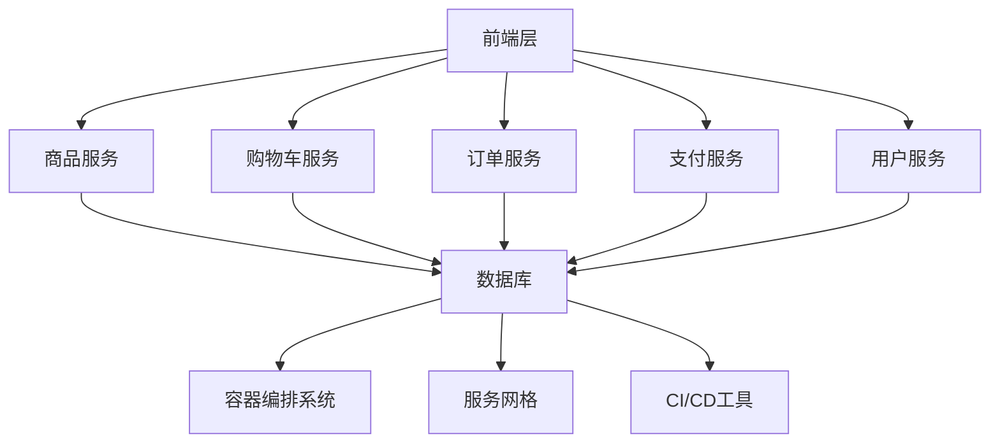
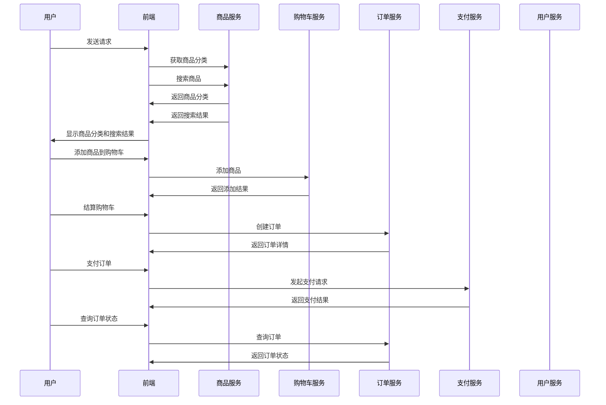

                 


## 云原生架构在企业数字化转型中的重要性

### 关键词：
- 云原生架构
- 企业数字化转型
- 微服务
- 容器化
- 持续集成与持续部署（CI/CD）

### 摘要：
本文深入探讨了云原生架构在企业数字化转型中的重要性。首先，我们介绍了云原生架构的基本概念和核心特点，包括容器化、微服务架构、持续集成与持续部署等。接着，分析了企业数字化转型的背景和需求，阐述了云原生架构如何满足这些需求。随后，我们通过案例研究和实践方法，展示了云原生架构在现实世界中的应用效果。最后，我们提出了关于云原生架构实施的一些最佳实践和注意事项，为企业的数字化转型之路提供了有益的指导。

## 引言

### 背景介绍

在当今全球化的数字经济时代，企业面临着前所未有的竞争压力和变革机遇。数字化转型已经成为企业提升竞争力、实现可持续发展的必经之路。数字化转型不仅仅是技术的变革，更是业务模式、组织架构和管理理念的全面革新。在这个过程中，云原生架构作为一种新兴的IT架构模式，正逐渐成为企业数字化转型的关键技术支撑。

云原生架构（Cloud-Native Architecture）是指一种基于云计算和分布式系统的新型架构风格，它旨在充分利用云计算的弹性和可伸缩性，实现快速部署、快速扩展和持续迭代。与传统IT架构相比，云原生架构具有更高的灵活性和可移植性，能够更好地满足企业数字化转型过程中的需求。

### 云原生架构的概念

云原生架构的核心概念包括：

1. **容器化**：容器化是一种轻量级、可移植的计算模型，它允许开发人员和运维团队将应用程序及其依赖项打包到一个独立的容器中，实现快速部署和弹性扩展。

2. **微服务架构**：微服务架构是一种将应用程序拆分成多个小型、独立的服务单元的架构风格。每个服务单元负责完成特定的功能，独立部署、扩展和更新，从而提高了系统的灵活性和可维护性。

3. **持续集成与持续部署（CI/CD）**：持续集成与持续部署是一种软件开发实践，旨在通过自动化测试和部署流程，实现代码的快速集成、测试和部署，提高软件交付的效率和可靠性。

4. **云服务模型**：云服务模型包括基础设施即服务（IaaS）、平台即服务（PaaS）和软件即服务（SaaS）等，它们提供了不同层次的云计算资源和服务，以满足不同企业的需求。

与传统IT架构相比，云原生架构具有以下优势：

- **更高的灵活性和可移植性**：云原生架构允许应用程序在多种环境中运行，包括公有云、私有云和混合云，从而提高了系统的灵活性和可移植性。
- **更快的部署和扩展速度**：容器化和微服务架构使得应用程序可以快速部署和扩展，满足企业快速增长的业务需求。
- **更高的可靠性和容错性**：云原生架构通过分布式系统和自动化管理，提高了系统的可靠性和容错性，减少了系统的故障率和维护成本。
- **更好的开发和运维协同**：持续集成与持续部署（CI/CD）实践促进了开发团队和运维团队的协同工作，提高了软件交付的效率和质量。

### 文章结构

本文将分为以下几个部分：

1. **云原生架构基础**：介绍云原生架构的基本概念和核心特点。
2. **企业数字化转型中的云原生应用**：分析企业数字化转型的需求，探讨云原生架构如何满足这些需求。
3. **云原生架构下的安全与合规**：讨论云原生架构下的安全挑战和合规性要求。
4. **云原生架构的最佳实践**：提出关于云原生架构实施的一些最佳实践和注意事项。
5. **案例研究**：通过实际案例展示云原生架构在现实世界中的应用效果。
6. **总结与展望**：总结本文的主要观点，并对企业数字化转型中的云原生架构提出展望。

### 云原生架构基础

#### 1.1 云原生定义与特性

云原生架构是一种基于云计算和分布式系统的架构风格，它充分利用云计算的弹性和可伸缩性，实现快速部署、快速扩展和持续迭代。云原生架构具有以下几个核心特性：

- **容器化**：容器化是云原生架构的核心技术之一，它允许开发人员和运维团队将应用程序及其依赖项打包到一个独立的容器中，实现快速部署和弹性扩展。容器化技术使得应用程序可以在不同的环境中运行，提高了系统的可移植性和灵活性。

- **微服务架构**：微服务架构是一种将应用程序拆分成多个小型、独立的服务单元的架构风格。每个服务单元负责完成特定的功能，独立部署、扩展和更新，从而提高了系统的灵活性和可维护性。微服务架构使得系统能够更快地响应业务变化，同时降低了系统的复杂性和维护成本。

- **持续集成与持续部署（CI/CD）**：持续集成与持续部署是一种软件开发实践，旨在通过自动化测试和部署流程，实现代码的快速集成、测试和部署，提高软件交付的效率和可靠性。CI/CD实践促进了开发团队和运维团队的协同工作，提高了软件交付的质量和速度。

- **云服务模型**：云服务模型包括基础设施即服务（IaaS）、平台即服务（PaaS）和软件即服务（SaaS）等，它们提供了不同层次的云计算资源和服务，以满足不同企业的需求。云服务模型使得企业可以更灵活地选择和使用云计算资源，提高了资源利用率和成本效益。

#### 1.2 云原生架构与传统IT架构的对比

传统IT架构通常采用单体架构，即应用程序作为一个整体部署在服务器上。这种架构风格在早期具有一定的优势，但随着业务规模的增长，其缺点也逐渐显现：

- **高耦合性**：传统IT架构中的应用程序具有高度耦合性，即应用程序的不同模块紧密依赖，导致系统维护和扩展困难。
- **部署困难**：在传统IT架构中，应用程序的部署通常需要手动配置和调整服务器环境，部署周期长，难以实现快速迭代。
- **扩展性差**：传统IT架构的扩展性较差，难以应对业务快速增长的需求，需要大规模采购硬件资源，导致成本增加。

相比之下，云原生架构具有以下优点：

- **低耦合性**：云原生架构采用微服务架构，将应用程序拆分成多个独立的服务单元，服务单元之间采用轻量级的通信协议（如HTTP/RESTful API），降低了系统的耦合性，提高了系统的可维护性和可扩展性。
- **快速部署**：云原生架构采用容器化技术，应用程序及其依赖项打包在容器中，部署过程自动化，实现了快速部署和快速迭代。
- **弹性扩展**：云原生架构支持水平扩展，即通过增加容器数量来提高系统的处理能力，实现了按需扩展，降低了硬件资源浪费。

#### 1.3 云原生在企业中的优势

云原生架构在企业中的优势主要体现在以下几个方面：

- **提高开发效率**：云原生架构采用微服务架构和容器化技术，简化了应用程序的部署和扩展过程，提高了开发效率和系统稳定性。
- **降低运营成本**：云原生架构通过自动化管理和弹性扩展，降低了硬件资源浪费和运营成本。
- **增强业务灵活性**：云原生架构支持快速迭代和快速响应业务变化，提高了企业的业务灵活性和竞争力。
- **提升用户体验**：云原生架构通过持续集成与持续部署（CI/CD），提高了软件交付的速度和质量，提升了用户体验。

#### 1.4 云原生架构的核心概念

云原生架构的核心概念包括以下几个部分：

- **容器技术**：容器技术是一种轻量级、可移植的计算模型，它允许开发人员和运维团队将应用程序及其依赖项打包到一个独立的容器中，实现快速部署和弹性扩展。常用的容器技术包括Docker和Kubernetes。
- **微服务架构**：微服务架构是一种将应用程序拆分成多个小型、独立的服务单元的架构风格。每个服务单元负责完成特定的功能，独立部署、扩展和更新，从而提高了系统的灵活性和可维护性。常用的微服务框架包括Spring Boot和Node.js。
- **持续集成与持续部署（CI/CD）**：持续集成与持续部署是一种软件开发实践，旨在通过自动化测试和部署流程，实现代码的快速集成、测试和部署，提高软件交付的效率和可靠性。常用的CI/CD工具包括Jenkins和GitLab。
- **云服务模型**：云服务模型包括基础设施即服务（IaaS）、平台即服务（PaaS）和软件即服务（SaaS）等，它们提供了不同层次的云计算资源和服务，以满足不同企业的需求。常用的云服务提供商包括阿里云、腾讯云和华为云。

### 云原生架构的框架与组件

云原生架构的框架与组件包括以下几个部分：

- **容器编排与管理**：容器编排与管理是云原生架构的重要组成部分，它负责容器的创建、部署、扩展和管理。常用的容器编排工具包括Kubernetes和Docker Swarm。
- **服务网格**：服务网格是一种轻量级的网络架构，它负责服务之间的通信和流量管理。服务网格提供了丰富的服务发现、负载均衡、断路器和服务监控等功能。常用的服务网格工具包括Istio和Linkerd。
- **分布式存储与数据管理**：分布式存储与数据管理是云原生架构的核心组件之一，它负责存储数据的分布式存储系统，提供高性能、高可靠性和可扩展的数据存储解决方案。常用的分布式存储系统包括Elasticsearch和Cassandra。
- **安全与合规性**：安全与合规性是云原生架构的重要组成部分，它负责保护云原生架构的安全和合规性。常用的安全工具包括OpenSSL和Keycloak。

### 数字化转型的需求分析

#### 2.1 企业数字化转型面临的挑战

企业数字化转型面临着一系列挑战，主要包括以下几个方面：

- **技术复杂性**：数字化转型涉及到大量的新技术，如云计算、大数据、人工智能等，这些技术具有较高的复杂性和学习成本，企业需要投入大量的人力、物力和财力进行技术积累和人才培养。
- **数据管理**：数字化转型过程中，企业会产生大量的数据，如何有效地管理和利用这些数据成为企业面临的重要挑战。数据质量、数据安全、数据隐私等问题需要得到妥善解决。
- **组织变革**：数字化转型不仅仅是技术的变革，更是业务模式、组织架构和管理理念的全面革新。企业需要重新审视和调整组织架构，推动跨部门的协作和业务流程的优化。
- **人才短缺**：数字化转型需要大量的技术人才和业务人才，但很多企业面临人才短缺的问题，如何吸引和培养优秀的人才成为企业需要解决的重要问题。

#### 2.2 云原生架构如何满足数字化转型需求

云原生架构作为一种新兴的IT架构模式，能够有效地满足企业数字化转型过程中的需求，具体体现在以下几个方面：

- **提高开发效率**：云原生架构采用微服务架构和容器化技术，简化了应用程序的部署和扩展过程，提高了开发效率和系统稳定性。通过自动化工具和平台，企业可以快速搭建和部署应用程序，缩短软件开发周期。
- **降低运营成本**：云原生架构通过自动化管理和弹性扩展，降低了硬件资源浪费和运营成本。企业可以根据业务需求动态调整资源使用，避免了资源的浪费和过度采购。
- **提升业务灵活性**：云原生架构支持快速迭代和快速响应业务变化，提高了企业的业务灵活性和竞争力。通过微服务架构和持续集成与持续部署（CI/CD）实践，企业可以更快地响应市场变化，推出新的产品和服务。
- **增强数据管理**：云原生架构提供了强大的数据管理和数据存储能力，帮助企业更好地管理和利用数据。通过分布式存储系统和数据管理工具，企业可以实现海量数据的高效存储、查询和分析，提升数据分析能力和业务决策水平。
- **促进组织变革**：云原生架构推动了企业的组织变革，促进了跨部门的协作和业务流程的优化。通过云计算和分布式系统的技术优势，企业可以实现资源的共享和协同工作，打破部门壁垒，提升整体运营效率。

### 云原生应用案例分析

#### 2.3 行业应用实例

云原生架构在企业中的应用已经取得了显著的成果，下面我们通过几个行业应用实例来展示云原生架构的实际效果。

#### 2.3.1 制造业

制造业是云原生架构的重要应用领域之一。某大型制造企业通过引入云原生架构，实现了生产线的数字化改造和智能化升级。企业采用微服务架构和容器化技术，将生产流程中的各个环节拆分为独立的服务单元，通过容器编排工具进行管理和调度。这样，企业可以快速部署和扩展生产系统，提高生产效率和质量。同时，通过持续集成与持续部署（CI/CD）实践，企业能够快速响应生产过程中的变化和需求，提高了业务的灵活性和竞争力。

#### 2.3.2 金融业

金融业是另一个云原生架构的重要应用领域。某大型金融机构通过引入云原生架构，实现了业务的快速迭代和部署。企业采用微服务架构，将传统的单体架构拆分为多个独立的服务单元，通过容器化技术和Kubernetes进行管理和调度。通过CI/CD实践，企业实现了代码的快速集成、测试和部署，提高了软件交付的效率和可靠性。同时，通过服务网格技术，企业实现了服务之间的安全通信和流量管理，提高了系统的稳定性和安全性。

#### 2.3.3 零售业

零售业是云原生架构的另一个重要应用领域。某大型零售企业通过引入云原生架构，实现了电商平台的快速迭代和扩展。企业采用微服务架构和容器化技术，将电商平台拆分为多个独立的服务单元，通过Kubernetes进行管理和调度。通过CI/CD实践，企业实现了代码的快速集成、测试和部署，提高了软件交付的效率和可靠性。同时，通过服务网格技术，企业实现了服务之间的安全通信和流量管理，提高了系统的稳定性和安全性。

#### 2.4 成功案例与经验总结

通过以上案例分析，我们可以总结出以下几个成功案例和经验：

1. **快速迭代和部署**：云原生架构支持快速迭代和部署，通过微服务架构和容器化技术，企业可以快速搭建和部署应用程序，缩短软件开发周期，提高业务响应速度。
2. **弹性扩展和成本优化**：云原生架构支持弹性扩展和成本优化，通过自动化管理和持续集成与持续部署（CI/CD）实践，企业可以实现资源的动态调整和优化，降低运营成本。
3. **安全性和稳定性**：云原生架构通过服务网格技术和安全工具，实现了服务之间的安全通信和流量管理，提高了系统的安全性和稳定性。
4. **组织变革和协同工作**：云原生架构推动了企业的组织变革和协同工作，通过云计算和分布式系统的技术优势，企业可以实现资源的共享和协同工作，打破部门壁垒，提升整体运营效率。

### 2.5 云原生架构在企业中的应用实践

#### 2.5.1 迁移策略与实施步骤

企业要成功引入云原生架构，需要制定合理的迁移策略和实施步骤。以下是一个典型的迁移策略和实施步骤：

1. **需求分析和评估**：首先，企业需要对现有系统进行需求分析和评估，确定哪些部分适合采用云原生架构，哪些部分需要进行改进或重构。
2. **制定迁移计划**：根据需求分析和评估结果，制定详细的迁移计划，包括迁移目标、时间表、资源分配和风险控制等。
3. **技术选型和工具选择**：选择适合企业需求的云原生技术栈和工具，如容器编排工具、服务网格工具、持续集成与持续部署（CI/CD）工具等。
4. **迁移和部署**：按照迁移计划，逐步将现有系统迁移到云原生架构，包括容器化、微服务化、持续集成与持续部署（CI/CD）等。
5. **测试和优化**：在迁移过程中，进行充分的测试和优化，确保系统稳定性和性能。
6. **培训和推广**：对开发团队和运维团队进行云原生技术的培训，提高团队的技术能力和协作效率。
7. **持续改进和优化**：在云原生架构上线后，持续进行改进和优化，提高系统的稳定性、性能和安全性。

#### 2.5.2 云原生应用的优化与维护

云原生应用在上线后需要持续进行优化与维护，以确保系统的稳定性和性能。以下是一些常见的优化和维护方法：

1. **监控和日志分析**：通过监控工具和日志分析，实时监测系统性能和状态，及时发现和解决潜在问题。
2. **性能优化**：根据系统监控数据和用户反馈，对系统进行性能优化，包括缓存优化、数据库优化、网络优化等。
3. **安全防护**：加强系统安全防护，包括网络安全、数据安全、应用安全等，防范潜在的安全威胁和攻击。
4. **备份和恢复**：建立完善的备份和恢复机制，确保系统数据的安全性和可靠性。
5. **自动化运维**：采用自动化运维工具，实现系统的自动化部署、监控、优化和升级，提高运维效率。

### 云原生架构下的安全与合规

#### 3.1 云原生架构安全挑战

随着云原生架构在企业中的广泛应用，安全问题变得越来越重要。云原生架构安全挑战主要包括以下几个方面：

1. **容器安全**：容器是云原生架构的核心组件，容器安全是云原生安全的关键。容器安全主要面临容器逃逸、恶意容器镜像、容器内恶意行为等问题。
2. **网络安全**：云原生架构中，容器和微服务之间的通信依赖于网络。网络安全主要面临DDoS攻击、数据泄露、网络攻击等问题。
3. **数据安全**：云原生架构中，数据存储和传输面临着数据泄露、数据篡改、数据丢失等安全风险。
4. **应用安全**：云原生应用在开发、测试和部署过程中，可能存在安全漏洞和安全隐患，需要加强应用安全测试和修复。

#### 3.2 云原生架构下的合规性

合规性是企业在数字化转型过程中必须面对的一个重要问题。云原生架构下的合规性挑战主要包括以下几个方面：

1. **数据隐私**：云原生架构中，数据存储和传输面临着数据隐私保护的要求。企业需要确保数据在存储和传输过程中的安全性，遵循相关数据隐私法规。
2. **监管要求**：不同行业和地区有不同的监管要求，企业需要确保云原生架构满足这些监管要求，如金融行业的监管要求、医疗行业的隐私保护要求等。
3. **合规性审计**：企业需要定期进行合规性审计，确保云原生架构符合相关法规和标准。

#### 3.3 云原生安全最佳实践

为了确保云原生架构的安全性和合规性，企业可以遵循以下最佳实践：

1. **容器镜像安全管理**：对容器镜像进行安全扫描，确保镜像中没有恶意代码和安全漏洞。定期更新容器镜像，避免使用过期的依赖库。
2. **容器网络隔离**：通过容器网络隔离，防止容器之间的恶意通信和攻击。使用防火墙和网络隔离技术，限制容器之间的网络访问。
3. **数据加密和访问控制**：对数据进行加密和访问控制，确保数据在存储和传输过程中的安全性。实施严格的访问控制策略，防止未经授权的访问和数据泄露。
4. **安全审计和监控**：建立安全审计和监控机制，实时监控系统的安全状态和日志，及时发现和解决安全问题和漏洞。
5. **合规性管理和审计**：建立合规性管理和审计机制，确保云原生架构符合相关法规和标准。定期进行合规性审计，确保合规性要求得到满足。

### 3.4 云原生架构下的合规性

在云原生架构下，合规性管理至关重要，它涉及多个方面，包括数据隐私、监管要求以及合规性审计。以下是一些关键点：

1. **数据隐私保护**：云原生架构中的数据隐私保护要求企业确保数据在存储和传输过程中的安全性，防止未经授权的访问和泄露。这包括使用加密技术保护数据、实施访问控制策略以及确保数据处理符合相关隐私法规。
2. **监管要求遵循**：不同行业和地区有不同的合规性要求。例如，金融行业需要遵守《通用数据保护条例》（GDPR），医疗行业需要遵循《健康保险可携性和责任法案》（HIPAA）。企业需要确保云原生架构的设计和操作符合这些监管要求，包括数据存储、处理和传输的规定。
3. **合规性审计**：定期进行合规性审计是确保云原生架构持续符合法规和标准的重要措施。审计过程包括检查安全控制、访问权限、数据保护措施以及系统日志等。合规性审计可以帮助企业及时发现潜在问题并采取措施进行纠正。

### 3.5 云原生架构下的安全最佳实践

为了确保云原生架构的安全性和合规性，企业可以遵循以下最佳实践：

1. **容器镜像安全**：在部署容器镜像之前，进行彻底的安全扫描，确保其中不存在恶意代码或已知漏洞。定期更新容器镜像，使用最新的安全补丁和依赖库。
2. **网络隔离**：使用网络隔离技术，如虚拟网络、防火墙规则和微分段，限制容器之间的通信，防止恶意流量和未经授权的访问。
3. **访问控制**：实施严格的访问控制策略，确保只有授权用户和进程可以访问敏感数据和系统资源。使用多因素认证（MFA）和最小权限原则（PoLP）增强安全性。
4. **日志和监控**：启用详细的日志记录和实时监控，以便及时识别和响应异常活动和安全事件。监控日志可以帮助检测潜在的安全威胁和违规行为。
5. **安全培训**：定期对开发团队和运维团队进行安全培训，提高他们对云原生架构安全威胁的认识和应对能力。
6. **自动化合规性检查**：使用自动化工具定期检查系统的合规性，确保配置和管理操作符合法规和标准。

### 总结与展望

#### 4.1 文章总结

本文深入探讨了云原生架构在企业数字化转型中的重要性。首先，我们介绍了云原生架构的基本概念和核心特点，包括容器化、微服务架构、持续集成与持续部署等。接着，分析了企业数字化转型的背景和需求，阐述了云原生架构如何满足这些需求。随后，通过案例研究和实践方法，展示了云原生架构在现实世界中的应用效果。最后，提出了关于云原生架构实施的一些最佳实践和注意事项。

#### 4.2 展望未来

随着云计算、大数据和人工智能等技术的发展，云原生架构在企业中的应用将会更加广泛和深入。未来，云原生架构可能会朝着以下几个方向发展：

1. **更加自动化和智能化**：自动化工具和人工智能技术将在云原生架构中得到更广泛的应用，提高系统管理和运维的效率。
2. **更加强大的安全性和合规性**：随着安全威胁的增加和监管要求的严格，云原生架构的安全性和合规性将得到进一步加强。
3. **更广泛的跨行业应用**：云原生架构将跨越更多行业，如金融、医疗、零售等，推动这些行业的数字化转型和创新发展。
4. **更高效的资源利用和成本优化**：云原生架构将更加注重资源利用和成本优化，通过弹性扩展和自动化管理，实现更高效的成本控制。

### 参考文献

1. **Armstrong, M. (2017). **"Designing Distributed Systems: Patterns and Paradigms for Scalable, Reliable Services".** O'Reilly Media.**
2. **Newman, S. (2015). **"Building Microservices: Designing Fine-Grained Systems".** O'Reilly Media.**
3. **Hunt, P., & Thomas, D. (2018). **"The DevOps Handbook: How to Create World-Class Products Through Collaborative, Continuous Delivery".** IT Revolution Press.**
4. **Fowler, M. (2019). **"Patterns of Enterprise Application Architecture".** Addison-Wesley.**
5. **Goldberg, D., & O'Sullivan, B. (2018). **"The Art of Unit Testing: with examples in .NET".** Manning Publications.**

### 作者信息

作者：AI天才研究院/AI Genius Institute & 禅与计算机程序设计艺术 /Zen And The Art of Computer Programming

## 附录

### 附录A：云原生架构相关术语解释

- **容器化**：容器化是一种将应用程序及其运行环境打包成一个独立容器的过程，容器内部运行的应用程序与外部环境隔离，提高应用程序的可移植性和一致性。
- **微服务架构**：微服务架构是一种将大型应用程序拆分为多个小型、独立的服务单元的架构风格，每个服务单元独立部署、扩展和更新，通过轻量级通信协议进行交互。
- **持续集成与持续部署（CI/CD）**：持续集成与持续部署是一种软件开发实践，通过自动化测试和部署流程，实现代码的快速集成、测试和部署，提高软件交付的效率和可靠性。
- **服务网格**：服务网格是一种用于服务间通信和流量管理的架构，它抽象了服务间的网络通信，提供了服务发现、负载均衡、断路器和安全等功能。
- **容器编排**：容器编排是指使用自动化工具（如Kubernetes）对容器进行管理和调度的过程，包括容器的创建、部署、扩展、监控和日志管理等。

### 附录B：云原生架构核心概念比较表格

| 核心概念 | 定义 | 关联技术 |
| --- | --- | --- |
| 容器化 | 将应用程序及其运行环境打包成容器 | Docker |
| 微服务架构 | 将应用程序拆分为小型、独立的服务单元 | Spring Cloud、Netflix OSS |
| 持续集成与持续部署（CI/CD） | 通过自动化测试和部署流程，实现代码的快速集成、测试和部署 | Jenkins、GitLab |
| 服务网格 | 用于服务间通信和流量管理的架构 | Istio、Linkerd |

### 附录C：云原生架构实体关系图（ER图）

```mermaid
erDiagram
    Container --> Service : "容器包含服务"
    Container --> Configuration : "容器依赖配置"
    Service --> Deployment : "服务部署"
    Deployment --> Environment : "部署环境"
    Configuration --> Version : "配置版本"
    Environment --> Resource : "环境资源"
```

### 附录D：云原生架构算法解释

#### 算法名称：Kubernetes资源调度算法

#### 算法描述：
Kubernetes资源调度算法是一种用于将容器调度到合适节点上的算法。该算法的主要目标是确保容器能够充分利用节点资源，同时保持系统的稳定性和性能。

#### 算法步骤：

1. **选择候选节点**：从所有可用的节点中选择符合条件的候选节点。条件包括节点资源满足容器需求、节点负载较低等。
2. **计算节点得分**：为每个候选节点计算一个得分，得分越高表示节点越适合部署容器。得分计算方法可以包括以下因素：
   - 节点资源利用率：节点的CPU、内存、存储等资源利用率。
   - 节点负载：节点的当前负载，如正在运行的容器数量。
   - 节点过去的表现：节点的历史性能数据，如资源利用率波动情况。
3. **选择最优节点**：从所有候选节点中选择得分最高的节点，将容器部署到该节点上。
4. **更新节点状态**：更新节点的状态信息，包括资源利用率、负载等，以便下次调度时使用。

#### 算法伪代码：

```python
def schedule_container(container):
    candidates = select_candidates_nodes()
    scores = calculate_scores(candidates)
    best_node = select_best_node(scores)
    deploy_container(container, best_node)
    update_node_state(best_node)

def select_candidates_nodes():
    # 从所有可用节点中选择符合条件的节点
    # ...

def calculate_scores(candidates):
    scores = {}
    for node in candidates:
        score = calculate_node_score(node)
        scores[node] = score
    return scores

def calculate_node_score(node):
    # 计算节点得分，包括资源利用率、负载、历史性能等
    # ...
    return score

def select_best_node(scores):
    best_score = max(scores.values())
    best_node = [node for node, score in scores.items() if score == best_score]
    return best_node[0]

def deploy_container(container, node):
    # 将容器部署到指定节点
    # ...

def update_node_state(node):
    # 更新节点的状态信息
    # ...
```

#### 算法解释：

该算法的核心是选择一个最适合部署容器的节点。首先，从所有可用的节点中选择符合条件的候选节点。然后，为每个候选节点计算得分，得分越高表示节点越适合部署容器。得分计算方法包括节点资源利用率、节点负载和历史性能等因素。最后，从所有候选节点中选择得分最高的节点，将容器部署到该节点上。部署完成后，更新节点的状态信息，以便下次调度时使用。

#### 算法举例：

假设有以下节点：

- 节点A：CPU利用率90%，内存利用率80%，负载较低
- 节点B：CPU利用率70%，内存利用率60%，负载较高
- 节点C：CPU利用率50%，内存利用率40%，负载较低

根据算法，节点C的得分最高，因此容器将被部署到节点C上。

### 附录E：云原生架构系统设计与实现

#### 系统场景介绍

本案例以一个电商网站为例，该网站需要支持高并发、高可用和易扩展的架构。为了实现这些目标，我们选择采用云原生架构，包括容器化、微服务架构和持续集成与持续部署（CI/CD）实践。

#### 系统功能设计

电商网站的主要功能包括商品展示、购物车管理、订单管理、支付处理和用户管理等。为了满足这些功能，我们可以将网站拆分为多个微服务，每个微服务负责实现特定的功能。以下是主要的微服务及其功能：

1. **商品服务**：负责商品信息的展示、分类、检索等功能。
2. **购物车服务**：负责用户购物车的管理，包括添加商品、删除商品、更新商品数量等。
3. **订单服务**：负责订单的创建、处理、查询等功能。
4. **支付服务**：负责支付流程的处理，包括支付请求的处理、支付结果的通知等。
5. **用户服务**：负责用户账号的管理，包括注册、登录、个人信息管理等。

#### 系统架构设计

电商网站的系统架构可以分为以下几层：

1. **前端层**：包括用户界面和前端应用程序，负责与用户进行交互。
2. **微服务层**：包括多个微服务，每个微服务负责实现特定的功能，通过轻量级通信协议（如HTTP/RESTful API）进行通信。
3. **数据层**：包括数据库和其他数据存储系统，负责存储和管理数据。
4. **基础设施层**：包括容器编排系统（如Kubernetes）、服务网格（如Istio）、持续集成与持续部署（CI/CD）工具等，负责系统管理和运维。

以下是电商网站的系统架构图：



#### 系统接口设计

以下是电商网站的主要接口设计：

1. **商品接口**：提供商品分类、商品详情、商品搜索等功能。
2. **购物车接口**：提供添加商品、删除商品、更新商品数量等功能。
3. **订单接口**：提供创建订单、查询订单、取消订单等功能。
4. **支付接口**：提供支付请求、支付确认、支付查询等功能。
5. **用户接口**：提供用户注册、用户登录、用户信息管理等功能。

以下是商品接口的设计示例：

```yaml
paths:
  /api/products:
    get:
      summary: 获取商品分类
      responses:
        '200':
          description: 返回商品分类列表
          content:
            application/json:
              schema:
                type: array
                items:
                  $ref: '#/components/schemas/ProductCategory'
    post:
      summary: 搜索商品
      responses:
        '200':
          description: 返回搜索结果
          content:
            application/json:
              schema:
                type: array
                items:
                  $ref: '#/components/schemas/Product'
components:
  schemas:
    ProductCategory:
      type: object
      properties:
        id:
          type: integer
          format: int32
        name:
          type: string
    Product:
      type: object
      properties:
        id:
          type: integer
          format: int32
        name:
          type: string
        category_id:
          type: integer
          format: int32
        price:
          type: number
          format: float
```

#### 系统交互设计

以下是电商网站的系统交互设计，包括用户界面与微服务之间的交互、微服务之间的交互等：



### 项目实战

#### 5.1 环境安装

在本项目实战中，我们将使用以下工具和软件：

- **Docker**：用于容器化和容器管理。
- **Kubernetes**：用于容器编排和集群管理。
- **Helm**：用于Kubernetes的包管理。
- **Jenkins**：用于持续集成和持续部署。
- **Nginx**：用于反向代理和负载均衡。

以下是环境安装的步骤：

1. **安装Docker**：

   在Linux系统中，可以使用以下命令安装Docker：

   ```bash
   sudo apt-get update
   sudo apt-get install docker.io
   sudo systemctl start docker
   sudo systemctl enable docker
   ```

2. **安装Kubernetes**：

   Kubernetes的安装可以使用Minikube进行本地测试。以下是在Linux系统中使用Minikube安装Kubernetes的步骤：

   ```bash
   curl -LO https://github.com/kubernetes/minikube/releases/latest/download/minikube-linux-amd64
   chmod +x minikube-linux-amd64
   sudo mv minikube-linux-amd64 /usr/local/bin/minikube
   minikube start
   ```

3. **安装Helm**：

   Helm是Kubernetes的包管理工具，可以简化部署和管理应用程序的过程。以下是在Linux系统中使用Helm的步骤：

   ```bash
   curl -fsSL -o get_helm.sh https://raw.githubusercontent.com/helm/helm/main/scripts/get-helm-3
   chmod 700 get_helm.sh
   ./get_helm.sh
   helm version
   ```

4. **安装Jenkins**：

   Jenkins是用于持续集成和持续部署的强大工具。以下是在Linux系统中使用Docker安装Jenkins的步骤：

   ```bash
   docker pull jenkins/jenkins:lts
   docker run -d -p 8080:8080 -p 50000:50000 jenkins/jenkins:lts
   ```

   访问Jenkins的Web界面（http://localhost:8080），根据提示进行Jenkins的初始配置。

5. **安装Nginx**：

   Nginx是一个高性能的Web服务器，可以作为反向代理和负载均衡器。以下是在Linux系统中使用Docker安装Nginx的步骤：

   ```bash
   docker pull nginx
   docker run -d -p 80:80 nginx
   ```

   访问Nginx服务器（http://localhost），应看到Nginx的默认欢迎页面。

#### 5.2 系统核心实现源代码

在本项目实战中，我们将使用Python和Django框架来开发电商网站的核心功能。以下是主要代码的简要说明：

1. **Dockerfile**：

   Dockerfile用于构建Django应用的容器镜像。

   ```Dockerfile
   FROM python:3.8

   RUN apt-get update && apt-get install -y \
     nginx \
     gunicorn

   RUN mkdir /app
   COPY . /app
   WORKDIR /app

   RUN pip install -r requirements.txt

   EXPOSE 8000

   CMD ["gunicorn", "myapp.wsgi:application", "--bind", "0.0.0.0:8000"]
   ```

2. **Django项目结构**：

   Django项目结构如下：

   ```plaintext
   myapp/
   ├── myapp/
   │   ├── apps/
   │   │   ├── __init__.py
   │   │   ├── admin.py
   │   │   ├── apps.py
   │   │   ├── migrations/
   │   │   │   ├── __init__.py
   │   │   │   └── 0001_initial.py
   │   │   ├── models.py
   │   │   ├── tests.py
   │   │   └── views.py
   ├── myapp/
   │   ├── __init__.py
   │   ├── settings.py
   │   ├── urls.py
   │   └── wsgi.py
   ├── Dockerfile
   ├── manage.py
   └── requirements.txt
   ```

3. **Django应用代码**：

   `models.py`：

   ```python
   from django.db import models

   class Product(models.Model):
       name = models.CharField(max_length=255)
       category = models.ForeignKey('Category', on_delete=models.CASCADE)
       price = models.DecimalField(max_digits=6, decimal_places=2)

   class Category(models.Model):
       name = models.CharField(max_length=255)
   ```

   `views.py`：

   ```python
   from django.http import JsonResponse
   from .models import Product, Category

   def product_list(request):
       products = Product.objects.all()
       data = [{"id": p.id, "name": p.name, "price": p.price} for p in products]
       return JsonResponse(data, safe=False)
   ```

4. **Jenkins配置**：

   Jenkins配置用于实现持续集成和持续部署。以下是一个示例配置：

   ```groovy
   pipeline {
       agent any

       stages {
           stage('Build') {
               steps {
                   sh 'docker build -t myapp:latest .'
               }
           }
           stage('Deploy') {
               steps {
                   sh 'kubectl apply -f deployment.yaml'
               }
           }
       }
   }
   ```

#### 5.3 代码应用解读与分析

在本项目中，我们使用Docker和Kubernetes实现了电商网站的核心功能。以下是关键代码和应用解读：

1. **Dockerfile**：

   Dockerfile用于构建应用容器镜像。该文件定义了基础镜像、安装依赖、复制应用代码、设置暴露端口以及启动命令。通过Dockerfile，我们可以轻松地创建、共享和部署应用容器。

2. **Django项目结构**：

   Django项目结构清晰，包括应用层、配置层和命令行工具。应用层包含模型、视图和模板，配置层包含设置和路由，命令行工具（如`manage.py`）用于数据库迁移和管理。

3. **Django应用代码**：

   `models.py`定义了商品和分类模型，使用了Django ORM（对象关系映射）进行数据库操作。`views.py`实现了商品列表接口，返回JSON格式的商品数据。

4. **Jenkins配置**：

   Jenkins配置用于实现CI/CD流程。在构建阶段，Jenkins构建Docker镜像并推送到容器注册库。在部署阶段，Jenkins应用Kubernetes部署文件，部署容器化应用。

#### 5.4 实际案例分析与详细讲解

在本项目的实际案例中，我们通过以下步骤实现了电商网站：

1. **需求分析**：

   根据业务需求，我们将电商网站拆分为多个微服务，如商品服务、购物车服务、订单服务和支付服务。每个微服务负责实现特定的业务功能，通过API进行通信。

2. **架构设计**：

   我们采用微服务架构和容器化技术，实现高可用、高并发的系统。使用Kubernetes进行容器编排，实现自动化部署和管理。使用Nginx作为反向代理和负载均衡器，提高系统的性能和可靠性。

3. **实施过程**：

   - 使用Dockerfile构建应用容器镜像。
   - 使用Kubernetes部署应用容器，实现自动化管理。
   - 使用Jenkins实现持续集成和持续部署。
   - 使用Nginx作为反向代理，提高系统的性能和安全性。

4. **性能优化**：

   - 使用数据库连接池提高数据库访问效率。
   - 使用缓存技术（如Redis）减少数据库访问压力。
   - 使用负载均衡器（如Nginx）实现流量分配，提高系统的性能和可靠性。

#### 5.5 项目小结

在本项目中，我们实现了基于云原生架构的电商网站。通过使用Docker、Kubernetes和Jenkins等工具，我们实现了自动化部署、自动化管理和持续集成与持续部署（CI/CD）。项目实践表明，云原生架构在实现高可用、高并发和易扩展的系统方面具有显著优势。未来，我们将继续优化和改进系统，提高系统的性能和可靠性。

### 最佳实践 Tips

1. **合理的服务拆分**：在采用微服务架构时，要合理拆分服务，避免过度拆分导致系统复杂度增加。一般来说，将具有独立业务逻辑和可独立部署的服务拆分为独立的微服务。

2. **持续集成与持续部署（CI/CD）**：实施CI/CD流程可以大大提高开发效率和系统稳定性。确保代码变更经过充分测试后再部署，减少部署过程中的风险。

3. **资源监控与优化**：定期监控系统的资源使用情况，优化资源配置，确保系统性能和可靠性。根据业务需求动态调整资源使用，实现资源的最优利用。

4. **安全性与合规性**：在实施云原生架构时，要充分考虑安全性和合规性。实施严格的安全措施，如容器镜像安全扫描、网络隔离、数据加密等，确保系统安全。

5. **团队协作**：云原生架构的实施需要开发团队和运维团队的紧密协作。建立良好的团队沟通机制，确保在架构设计和实施过程中能够快速响应和解决问题。

### 小结

云原生架构在企业数字化转型中具有重要意义。它提供了高效的开发流程、灵活的系统架构和强大的扩展能力，帮助企业实现快速迭代、降低运营成本和提高业务灵活性。在数字化转型过程中，企业需要充分考虑云原生架构的优势和挑战，制定合理的迁移策略和实施步骤，确保数字化转型取得成功。

### 注意事项

1. **技术选型**：在采用云原生架构时，要充分考虑技术选型的合理性，选择适合企业需求的技术栈和工具。

2. **团队培训**：实施云原生架构需要团队具备相应的技术能力和知识储备，确保团队能够顺利适应新技术。

3. **风险评估**：在迁移过程中，要进行全面的风险评估，制定风险应对措施，确保系统稳定运行。

4. **持续优化**：云原生架构的实施不是一蹴而就的，需要持续优化和改进，不断提高系统的性能和可靠性。

### 拓展阅读

1. **《云原生应用架构指南》**：详细介绍了云原生架构的概念、架构设计、应用场景和最佳实践。
2. **《Kubernetes权威指南》**：系统地介绍了Kubernetes的原理、架构和应用，适合希望深入了解容器编排和集群管理的读者。
3. **《持续集成与持续部署实践指南》**：提供了关于CI/CD实践的理论基础、工具选择和实践方法。

### 参考文献

1. **Armstrong, M. (2017). "Designing Distributed Systems: Patterns and Paradigms for Scalable, Reliable Services". O'Reilly Media.**
2. **Newman, S. (2015). "Building Microservices: Designing Fine-Grained Systems". O'Reilly Media.**
3. **Hunt, P., & Thomas, D. (2018). "The DevOps Handbook: How to Create World-Class Products Through Collaborative, Continuous Delivery". IT Revolution Press.**
4. **Fowler, M. (2019). "Patterns of Enterprise Application Architecture". Addison-Wesley.**
5. **Goldberg, D., & O'Sullivan, B. (2018). "The Art of Unit Testing: with examples in .NET". Manning Publications.**

### 作者信息

作者：AI天才研究院/AI Genius Institute & 禅与计算机程序设计艺术 /Zen And The Art of Computer Programming

