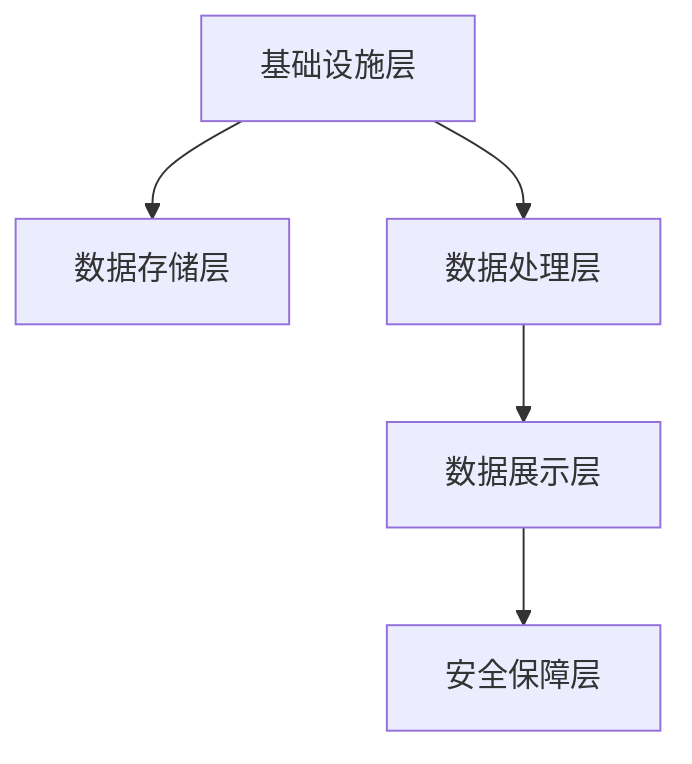
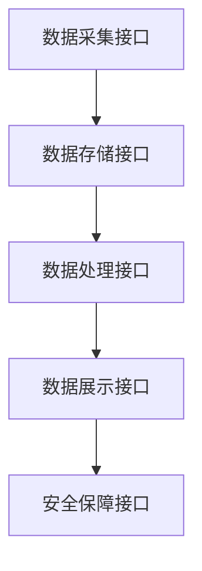
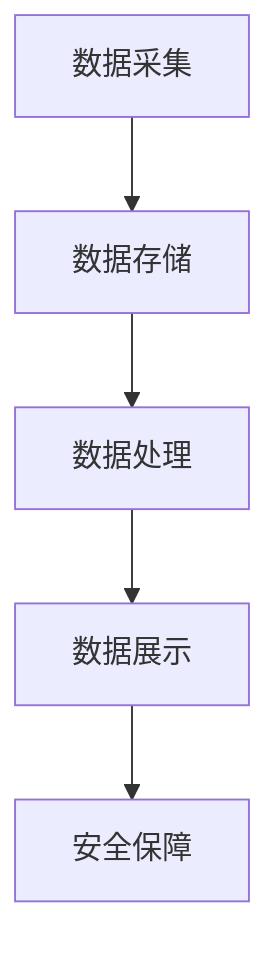

                 

### 文章标题

# 云计算在大数据分析中的scalable应用

### 关键词

- 云计算
- 大数据分析
- 分布式存储系统
- 大数据处理框架
- 机器学习算法
- 云计算架构设计

### 摘要

本文旨在探讨云计算在大数据分析中的应用，特别是其在实现可扩展性（scalability）方面的优势。文章首先介绍了云计算的基本概念、优势与挑战，然后深入分析了云计算在大数据存储、处理和算法应用方面的关键技术。通过具体案例分析，如Hadoop和Spark，我们展示了如何利用云计算实现高效的大数据分析。最后，文章总结了云计算在大数据分析中的最佳实践，为读者提供了实用指南。

----------------------------------------------------------------

### 第1章：云计算概述

#### 1.1 云计算的基本概念

云计算是一种通过互联网按需提供计算资源（如服务器、存储、网络）的服务模式。它打破了传统IT资源的局限性，使得用户可以灵活、便捷地获取和使用计算资源，从而实现IT资源的优化配置和高效利用。

**定义与分类**

云计算可以分为以下几类：

- **IaaS（基础设施即服务）**：提供虚拟化的计算资源，如虚拟机、存储和网络。
- **PaaS（平台即服务）**：提供开发、运行和管理应用程序的平台和工具。
- **SaaS（软件即服务）**：提供应用软件的服务，如电子邮件、办公自动化等。

**关键技术**

- **虚拟化**：通过虚拟化技术，将物理资源抽象为虚拟资源，从而实现资源的动态分配和管理。
- **分布式存储**：通过分布式存储技术，实现数据的分布式存储和管理，提高数据的可靠性和可用性。
- **弹性计算**：通过自动扩展和缩小计算资源，实现计算资源的动态调整，以满足业务需求的变化。

**商业模式与生态系统**

云计算的商业模式主要包括订阅模式、按需计费模式和混合模式。云计算生态系统包括供应商、用户、服务商和第三方服务商等。

#### 1.2 云计算的优势与挑战

**优势**

- **灵活性**：用户可以根据需求灵活调整计算资源，实现资源的按需分配。
- **成本节约**：通过减少物理硬件投资和运维成本，实现成本优化。
- **可扩展性**：可以轻松扩展计算资源，以应对业务需求的变化。
- **可靠性**：分布式架构提高了系统的可靠性和容错能力。

**挑战**

- **数据安全与隐私**：云计算中的数据存储和处理涉及到数据安全和隐私问题。
- **网络依赖**：云计算的运行依赖于互联网，网络问题可能会影响服务的稳定性。
- **技术人才短缺**：云计算领域对技术人才的需求较高，人才短缺问题成为制约云计算发展的重要因素。

#### 1.3 云计算在大数据分析中的应用背景

**大数据的发展历程**

大数据起源于20世纪80年代，随着互联网的普及和数据存储、处理技术的发展，大数据逐渐成为一个重要的研究领域。

**大数据的特点**

- **海量**：数据量巨大，以TB、PB甚至EB为单位。
- **多样**：数据类型繁多，包括结构化、半结构化和非结构化数据。
- **高速**：数据生成和处理的速率极高。
- **真实**：数据来源于真实世界，具有很高的价值。

**云计算如何支持大数据分析**

云计算为大数据分析提供了强大的计算和存储能力，使得大数据分析可以在短时间内完成，并可以应对海量数据处理的挑战。此外，云计算的弹性计算和分布式存储技术，为大数据分析提供了高效、可靠的解决方案。

#### 1.4 本章小结

本章介绍了云计算的基本概念、优势与挑战，以及云计算在大数据分析中的应用背景。通过本章的学习，读者可以了解云计算的基本知识，并为后续章节的学习打下基础。

----------------------------------------------------------------

### 第2章：分布式存储系统

#### 2.1 分布式存储系统概述

**分布式存储系统**是一种通过多个物理节点协同工作来存储和管理数据的系统。其核心思想是将数据分散存储在多个节点上，以提高数据的可靠性和可用性。分布式存储系统通常具有以下特点：

- **数据分片**：将大数据集分成多个小数据块，存储在多个节点上。
- **数据复制**：对数据块进行冗余存储，以提高数据的可靠性。
- **数据一致性**：确保分布式系统中数据的一致性，避免数据冲突。
- **数据容错**：在部分节点故障时，仍能保证系统的正常运行。

**分布式存储系统的定义与原理**

分布式存储系统通过分布式算法和数据复制策略来实现数据的存储和管理。其基本原理如下：

1. **数据分片**：将大数据集分割成多个数据块，每个数据块存储在一个节点上。
2. **数据复制**：将数据块复制到多个节点上，以提高数据的可靠性。
3. **数据一致性**：通过一致性协议，确保分布式系统中数据的一致性。
4. **数据访问**：客户端通过分布式网络访问多个节点上的数据。

**分布式存储系统的主要组件**

分布式存储系统通常包括以下主要组件：

- **数据节点**：负责存储数据块，并提供数据访问接口。
- **管理节点**：负责数据的管理、监控和故障处理。
- **元数据节点**：负责存储和管理元数据，如数据块的索引和分配信息。
- **客户端**：负责发起数据请求，并接收数据响应。

**分布式存储系统的优势与挑战**

**优势**

- **高可用性**：通过数据冗余和容错机制，提高了系统的可靠性。
- **高性能**：分布式存储系统可以通过并行访问多个节点，提高数据访问速度。
- **高可扩展性**：可以通过动态增加节点，实现存储容量的线性扩展。
- **高灵活性**：可以根据需求灵活调整存储策略，如数据分片、复制和数据一致性。

**挑战**

- **数据一致性**：在分布式系统中，数据的一致性是一个重要挑战。
- **网络依赖**：分布式存储系统对网络依赖性较高，网络问题可能影响系统的性能。
- **运维复杂性**：分布式存储系统的运维和管理相对复杂，需要专业的技术团队。

#### 2.2 分布式存储系统的设计与实现

**数据分片策略**

数据分片策略是分布式存储系统的核心，决定了数据如何在多个节点上分布。常见的数据分片策略包括：

- **哈希分片**：根据数据的哈希值，将数据分配到不同的节点上。
- **范围分片**：根据数据的范围，将数据分配到不同的节点上。
- **轮转分片**：按照轮转顺序，将数据分配到不同的节点上。

**数据复制与容错**

数据复制是将数据块复制到多个节点上，以提高数据的可靠性。常见的数据复制策略包括：

- **主从复制**：主节点负责写入数据，从节点负责读取数据。
- **多主复制**：多个节点都可以同时写入数据。
- **异步复制**：将数据复制到其他节点，但不保证立即同步。

数据容错是指在节点故障时，仍能保证系统的正常运行。常见的数据容错策略包括：

- **副本失效**：当节点故障时，自动将副本提升为主节点。
- **数据恢复**：在节点故障时，从其他节点恢复数据。

**数据一致性与分布式锁**

数据一致性是分布式存储系统的核心挑战之一。常见的数据一致性策略包括：

- **强一致性**：确保每次读取操作都能获取最新的数据。
- **最终一致性**：允许一定程度的延迟，确保数据最终一致性。

分布式锁用于同步多节点的数据访问，以避免数据冲突。常见分布式锁协议包括：

- **Paxos**：一种基于多数派共识算法的分布式一致性协议。
- **Raft**：一种简化的分布式一致性算法。

#### 2.3 分布式存储系统案例分析

**Hadoop HDFS**

Hadoop HDFS（Hadoop分布式文件系统）是Apache Hadoop项目的一部分，用于存储大规模数据集。HDFS采用主从架构，主节点（NameNode）负责管理元数据，从节点（DataNode）负责存储数据。

**Apache Cassandra**

Apache Cassandra是一种高度可扩展的分布式键值存储系统，适用于大规模数据的存储和查询。Cassandra采用无主从架构，通过Gossip协议实现节点之间的通信和状态同步。

**其他分布式存储系统介绍**

除了Hadoop HDFS和Apache Cassandra，还有其他一些流行的分布式存储系统，如：

- **Elasticsearch**：基于Lucene的分布式搜索引擎，用于大规模数据的实时搜索和分析。
- **Ceph**：一种开源的分布式存储系统，支持对象存储、块存储和文件系统。
- **MongoDB**：一种开源的分布式文档数据库，适用于大规模数据的存储和查询。

#### 2.4 本章小结

本章介绍了分布式存储系统的基本概念、设计与实现，以及常见分布式存储系统的案例分析。通过本章的学习，读者可以了解分布式存储系统的原理和应用，为后续章节的学习打下基础。

----------------------------------------------------------------

### 第3章：大数据处理框架

#### 3.1 大数据处理框架概述

大数据处理框架是一种用于高效处理大规模数据的软件框架。随着数据量的不断增长，传统的数据处理方法已经无法满足需求，大数据处理框架应运而生。大数据处理框架通常具有以下特点：

- **分布式计算**：通过分布式架构，实现大规模数据的并行处理。
- **高容错性**：通过冗余存储和节点间的通信，提高系统的可靠性。
- **高扩展性**：可以通过动态增加节点，实现线性扩展。
- **高效性**：通过优化算法和系统架构，提高数据处理效率。

**大数据处理框架的定义与原理**

大数据处理框架是一种基于分布式计算技术，用于处理大规模数据集的软件框架。其基本原理包括：

1. **数据分片**：将大数据集分割成多个小数据块，存储在多个节点上。
2. **并行处理**：通过多个节点并行处理数据，提高数据处理效率。
3. **容错机制**：通过冗余存储和节点间的通信，提高系统的可靠性。
4. **数据整合**：将多个节点的处理结果整合，得到最终结果。

**大数据处理框架的分类**

大数据处理框架可以根据处理数据的方式和架构特点进行分类，常见的分类方式包括：

- **批处理框架**：如Hadoop MapReduce，适用于大规模数据的批量处理。
- **流处理框架**：如Apache Kafka和Apache Flink，适用于实时数据流处理。
- **图处理框架**：如Apache Giraph，适用于大规模图数据的处理。
- **混合处理框架**：如Apache Spark，同时支持批处理和流处理。

**大数据处理框架的优势与挑战**

**优势**

- **高效率**：通过分布式计算和并行处理，提高数据处理效率。
- **高扩展性**：通过动态增加节点，实现线性扩展。
- **高可靠性**：通过冗余存储和容错机制，提高系统的可靠性。
- **高灵活性**：支持多种数据源和数据处理方式，满足不同场景的需求。

**挑战**

- **系统复杂性**：分布式系统和复杂的算法，增加了系统的复杂性和运维难度。
- **数据一致性**：在分布式环境中，数据一致性是一个重要挑战。
- **性能优化**：如何优化算法和系统架构，提高数据处理性能，是一个重要挑战。

#### 3.2 Hadoop生态系统

**Hadoop架构**

Hadoop是一个开源的分布式数据处理框架，由Apache Software Foundation维护。Hadoop生态系统包括以下几个核心组件：

- **Hadoop分布式文件系统（HDFS）**：用于存储大规模数据集。
- **Hadoop YARN**：资源调度和管理系统，负责资源的分配和管理。
- **Hadoop MapReduce**：用于大规模数据的批量处理。
- **Hadoop HBase**：一个分布式、可扩展的大规模数据存储系统。
- **Hadoop Hive**：一个数据仓库基础设施，用于处理大规模数据集。
- **Hadoop Pig**：一个高层次的编程语言，用于数据处理和分析。
- **Hadoop Oozie**：一个工作流调度系统，用于协调多个作业的执行。

**Hadoop核心组件**

- **Hadoop分布式文件系统（HDFS）**：HDFS是一个高吞吐量的分布式文件存储系统，用于存储大规模数据集。HDFS采用主从架构，主节点（NameNode）负责管理元数据，从节点（DataNode）负责存储数据。

- **Hadoop YARN**：YARN（Yet Another Resource Negotiator）是一个资源调度和管理系统，负责资源的分配和管理。YARN将资源管理和作业调度分离，实现了高效的资源利用和作业调度。

- **Hadoop MapReduce**：MapReduce是一种用于大规模数据集处理的编程模型，由Map和Reduce两个阶段组成。Map阶段将数据切分成小数据块，并进行处理；Reduce阶段对Map阶段的结果进行整合，得到最终结果。

- **Hadoop HBase**：HBase是一个分布式、可扩展的大规模数据存储系统，基于Google的Bigtable模型。HBase适用于存储大规模数据集，并提供实时访问。

- **Hadoop Hive**：Hive是一个数据仓库基础设施，用于处理大规模数据集。Hive将结构化数据转换为HDFS上的文件，然后使用MapReduce进行计算。

- **Hadoop Pig**：Pig是一个高层次的编程语言，用于数据处理和分析。Pig Latin是一种类似于SQL的数据处理语言，可以简化数据处理过程。

- **Hadoop Oozie**：Oozie是一个工作流调度系统，用于协调多个作业的执行。Oozie可以将多个作业组成一个工作流，实现复杂的数据处理任务。

**Hadoop的生态系统**

除了上述核心组件，Hadoop生态系统还包括其他许多开源项目，如：

- **Hadoop HCatalog**：用于统一数据存储和管理。
- **Hadoop Hue**：一个Web界面，用于监控和管理Hadoop集群。
- **Hadoop ZooKeeper**：一个分布式协调服务，用于维护分布式系统的状态。
- **Hadoop Mahout**：一个基于MapReduce的机器学习库。
- **Hadoop Solr**：一个分布式搜索平台，用于处理大规模数据集。

#### 3.3 Spark架构与原理

**Spark架构**

Apache Spark是一个开源的分布式数据处理框架，由UC Berkeley的AMPLab开发。Spark具有以下几个核心组件：

- **Spark Core**：提供基本的数据结构（如RDD）和任务调度。
- **Spark SQL**：提供数据处理和分析的SQL接口。
- **Spark Streaming**：提供实时数据流处理。
- **MLlib**：提供机器学习算法库。
- **GraphX**：提供图处理和图挖掘算法。

**Spark核心组件**

- **RDD（Resilient Distributed Dataset）**：RDD是一种分布式数据集，具有弹性、不可变性和容错性。RDD可以通过外部存储系统（如HDFS）创建，或通过其他RDD操作（如map、filter、reduce）生成。

- **DataFrame**：DataFrame是Spark SQL的核心数据结构，用于表示结构化数据。DataFrame可以通过Spark SQL查询操作进行操作，如select、join、group by等。

- **Dataset**：Dataset是DataFrame的更加强大的数据结构，支持强类型数据。Dataset可以通过Spark SQL查询操作进行操作，如select、join、group by等。

- **Spark Streaming**：Spark Streaming提供实时数据流处理，可以将数据流划分为微批（micro-batch）进行处理。

- **MLlib**：MLlib提供了一系列机器学习算法库，如分类、回归、聚类、降维等。MLlib支持基于RDD和DataFrame的机器学习算法。

- **GraphX**：GraphX提供图处理和图挖掘算法，可以处理大规模图数据。

**Spark的优势与局限**

**优势**

- **高效率**：Spark具有高性能的内存计算能力，相比Hadoop MapReduce具有更高的数据处理效率。
- **易用性**：Spark提供丰富的API，支持多种编程语言，如Java、Scala、Python等。
- **实时处理**：Spark Streaming支持实时数据流处理，可以满足实时数据处理需求。
- **生态系统**：Spark具有丰富的生态系统，包括Spark SQL、MLlib、GraphX等，支持多种数据处理和分析需求。

**局限**

- **依赖性**：Spark依赖于Hadoop生态系统，如HDFS、YARN等，增加了系统的复杂性。
- **内存使用**：Spark具有高内存使用特点，需要较大的内存资源。
- **数据迁移**：将现有的Hadoop应用迁移到Spark，可能面临数据迁移和兼容性问题。

#### 3.4 本章小结

本章介绍了大数据处理框架的基本概念、分类，以及Hadoop和Spark的架构与原理。通过本章的学习，读者可以了解大数据处理框架的原理和应用，为后续章节的学习打下基础。

----------------------------------------------------------------

### 第4章：云计算环境下的数据分析算法

#### 4.1 数据分析算法概述

数据分析算法是用于从数据中提取有用信息、发现数据中隐藏的模式和规律的方法。在云计算环境下，数据分析算法可以充分利用云计算的分布式计算能力和海量存储资源，实现高效的数据分析。数据分析算法通常包括以下几个阶段：

**数据预处理**：数据预处理是数据分析算法的第一步，用于清洗、转换和整合原始数据，以获得高质量的数据。

**数据探索性分析**：数据探索性分析是用于发现数据中的异常值、趋势和关联关系的方法，如统计学方法、可视化方法等。

**特征工程**：特征工程是用于从原始数据中提取有用特征，以提高模型性能的方法，如特征选择、特征变换等。

**模型选择与训练**：模型选择与训练是用于选择合适的模型，并在训练数据集上训练模型的方法，如线性模型、决策树、神经网络等。

**模型评估与优化**：模型评估与优化是用于评估模型性能，并在评估结果的基础上优化模型的方法，如交叉验证、模型融合等。

**数据可视化**：数据可视化是将数据分析结果以图形化的方式展示出来的方法，如散点图、折线图、热力图等。

**数据分析算法在云计算中的优势**

**高并发性**：云计算环境下的数据分析算法可以充分利用云计算的分布式计算能力，实现高并发数据处理。

**可扩展性**：云计算环境下的数据分析算法可以根据需求动态调整计算资源，实现线性扩展。

**灵活性**：云计算环境下的数据分析算法可以支持多种数据类型和算法，满足不同场景的需求。

**成本效益**：云计算环境下的数据分析算法可以减少硬件投资和运维成本，提高成本效益。

#### 4.2 云计算环境下的数据处理算法

**数据清洗算法**

数据清洗是数据分析算法的重要步骤，用于处理数据中的缺失值、异常值和重复值等问题，以提高数据质量。在云计算环境下，数据清洗算法可以充分利用云计算的分布式计算能力，实现高效的数据清洗。常见的数据清洗算法包括：

- **缺失值处理**：包括删除缺失值、填充缺失值和插值法等。
- **异常值处理**：包括统计学方法（如标准差法、箱线图法）、聚类方法（如K-means算法）和机器学习方法（如孤立森林算法）等。
- **重复值处理**：包括去重和去冗余等。

**数据集成算法**

数据集成是将来自多个数据源的数据合并为一个统一的数据视图的过程。在云计算环境下，数据集成算法可以充分利用云计算的分布式存储和计算能力，实现高效的数据集成。常见的数据集成算法包括：

- **合并法**：将多个数据源的数据合并为一个统一的数据集。
- **集成法**：将多个数据源的数据集成到一个统一的数据模型中。
- **连接法**：通过连接操作，将多个数据源的数据连接为一个统一的数据视图。

**数据转换算法**

数据转换是用于将数据转换为适合分析的形式的过程。在云计算环境下，数据转换算法可以充分利用云计算的分布式计算能力，实现高效的数据转换。常见的数据转换算法包括：

- **数据类型转换**：将不同数据类型的数据转换为统一的类型。
- **数据规范化**：将数据转换为标准化的形式，如归一化、标准化等。
- **数据编码**：将数据转换为编码形式，如ASCII码、Unicode码等。

#### 4.3 云计算环境下的数据挖掘算法

数据挖掘算法是从大量数据中提取有用信息、发现数据中隐藏的模式和规律的方法。在云计算环境下，数据挖掘算法可以充分利用云计算的分布式计算能力和海量存储资源，实现高效的数据挖掘。常见的数据挖掘算法包括：

**聚类分析算法**

聚类分析是将数据集划分为多个类别的过程。在云计算环境下，聚类分析算法可以充分利用云计算的分布式计算能力，实现高效聚类。常见聚类分析算法包括：

- **K-means算法**：基于距离度量的聚类算法，通过迭代优化聚类中心，将数据划分为多个类别。
- **层次聚类算法**：通过自底向上的层次结构，将数据集划分为多个类别。
- **DBSCAN算法**：基于密度的聚类算法，通过密度可达性将数据划分为多个类别。

**分类算法**

分类算法是将数据集划分为预先定义的类别的过程。在云计算环境下，分类算法可以充分利用云计算的分布式计算能力，实现高效分类。常见分类算法包括：

- **线性分类器**：如线性回归、逻辑回归等。
- **决策树分类器**：通过树形结构，对数据进行分类。
- **支持向量机（SVM）**：通过寻找最优超平面，实现数据分类。
- **随机森林分类器**：通过构建多个决策树，实现分类。

**关联规则挖掘算法**

关联规则挖掘是用于发现数据之间的关联关系的过程。在云计算环境下，关联规则挖掘算法可以充分利用云计算的分布式计算能力，实现高效关联规则挖掘。常见关联规则挖掘算法包括：

- **Apriori算法**：通过递归搜索，发现频繁项集，从而生成关联规则。
- **FP-growth算法**：通过构建频繁模式树，实现高效关联规则挖掘。

#### 4.4 本章小结

本章介绍了云计算环境下的数据处理算法，包括数据清洗、数据集成和数据转换等算法，以及数据挖掘算法，如聚类分析、分类和关联规则挖掘。通过本章的学习，读者可以了解云计算环境下的数据分析算法，为后续章节的学习打下基础。

----------------------------------------------------------------

### 第5章：云计算环境下的机器学习算法

#### 5.1 机器学习算法概述

机器学习是一种通过计算机模拟人类学习过程，使计算机能够从数据中自动学习和改进的方法。在云计算环境下，机器学习算法可以充分利用云计算的分布式计算能力和海量数据资源，实现高效的学习和推理。机器学习算法通常包括以下几个阶段：

**数据预处理**：数据预处理是机器学习算法的第一步，用于清洗、转换和整合原始数据，以获得高质量的数据。

**特征工程**：特征工程是用于从原始数据中提取有用特征，以提高模型性能的方法。

**模型选择**：模型选择是用于选择合适的模型，并在训练数据集上训练模型的方法。

**模型评估**：模型评估是用于评估模型性能，并在评估结果的基础上优化模型的方法。

**模型部署**：模型部署是将训练好的模型应用到实际场景中的过程。

#### 5.2 云计算环境下的机器学习算法

**线性回归**

线性回归是一种简单的机器学习算法，用于预测连续值输出。在云计算环境下，线性回归算法可以充分利用云计算的分布式计算能力，实现高效的学习和推理。

**数学模型**

线性回归的数学模型可以表示为：

$$y = \beta_0 + \beta_1 \cdot x + \epsilon$$

其中，$y$是输出值，$x$是输入值，$\beta_0$和$\beta_1$是模型参数，$\epsilon$是误差项。

**算法流程**

1. 数据预处理：对数据进行清洗、转换和整合，以获得高质量的数据。
2. 特征工程：从原始数据中提取有用特征，以提高模型性能。
3. 模型训练：通过最小二乘法或其他优化算法，求解模型参数。
4. 模型评估：使用验证集或测试集，评估模型性能。
5. 模型部署：将训练好的模型应用到实际场景中。

**Python代码示例**

```python
import numpy as np
import pandas as pd
from sklearn.linear_model import LinearRegression

# 数据预处理
data = pd.DataFrame({
    'x': np.random.rand(100),
    'y': np.random.rand(100)
})

# 特征工程
X = data[['x']]
y = data['y']

# 模型训练
model = LinearRegression()
model.fit(X, y)

# 模型评估
score = model.score(X, y)
print("模型评分：", score)

# 模型部署
output = model.predict(X)
print("预测结果：", output)
```

**结果分析**

通过以上示例，我们可以看到线性回归算法在云计算环境下可以实现高效的学习和推理。同时，我们也可以通过调整模型参数，优化模型性能。

#### 5.3 决策树

决策树是一种基于树形结构的机器学习算法，用于分类和回归任务。在云计算环境下，决策树算法可以充分利用云计算的分布式计算能力，实现高效的学习和推理。

**数学模型**

决策树的数学模型可以表示为：

$$f(x) = \sum_{i=1}^{n} \beta_i \cdot I(x \in R_i)$$

其中，$f(x)$是决策树模型，$x$是输入值，$\beta_i$是模型参数，$R_i$是第$i$个区域的集合。

**算法流程**

1. 数据预处理：对数据进行清洗、转换和整合，以获得高质量的数据。
2. 特征工程：从原始数据中提取有用特征，以提高模型性能。
3. 决策树构建：通过递归划分数据集，构建决策树模型。
4. 模型评估：使用验证集或测试集，评估模型性能。
5. 模型部署：将训练好的模型应用到实际场景中。

**Python代码示例**

```python
import numpy as np
import pandas as pd
from sklearn.tree import DecisionTreeClassifier

# 数据预处理
data = pd.DataFrame({
    'x': np.random.rand(100),
    'y': np.random.rand(100)
})

# 特征工程
X = data[['x']]
y = data['y']

# 决策树构建
model = DecisionTreeClassifier()
model.fit(X, y)

# 模型评估
score = model.score(X, y)
print("模型评分：", score)

# 模型部署
output = model.predict(X)
print("预测结果：", output)
```

**结果分析**

通过以上示例，我们可以看到决策树算法在云计算环境下可以实现高效的学习和推理。同时，我们也可以通过调整模型参数，优化模型性能。

#### 5.4 集成学习方法

集成学习方法是一种通过组合多个模型，提高模型性能的方法。在云计算环境下，集成学习方法可以充分利用云计算的分布式计算能力，实现高效的学习和推理。

**Bagging方法**

Bagging方法是一种通过随机抽样和组合模型，提高模型性能的方法。在云计算环境下，Bagging方法可以充分利用云计算的分布式计算能力，实现高效的学习和推理。

**算法流程**

1. 数据预处理：对数据进行清洗、转换和整合，以获得高质量的数据。
2. 特征工程：从原始数据中提取有用特征，以提高模型性能。
3. 模型训练：使用随机抽样和组合，训练多个模型。
4. 模型融合：通过投票或其他方法，融合多个模型，得到最终预测结果。

**Python代码示例**

```python
import numpy as np
import pandas as pd
from sklearn.ensemble import BaggingClassifier

# 数据预处理
data = pd.DataFrame({
    'x': np.random.rand(100),
    'y': np.random.rand(100)
})

# 特征工程
X = data[['x']]
y = data['y']

# 模型训练
model = BaggingClassifier()
model.fit(X, y)

# 模型评估
score = model.score(X, y)
print("模型评分：", score)

# 模型部署
output = model.predict(X)
print("预测结果：", output)
```

**结果分析**

通过以上示例，我们可以看到集成学习方法在云计算环境下可以实现高效的学习和推理。同时，我们也可以通过调整模型参数，优化模型性能。

#### 5.5 云计算环境下的深度学习算法

深度学习是一种通过多层神经网络模拟人类大脑的学习过程的方法。在云计算环境下，深度学习算法可以充分利用云计算的分布式计算能力和海量数据资源，实现高效的学习和推理。

**算法框架**

深度学习算法通常包括以下几个阶段：

1. **数据预处理**：对数据进行清洗、转换和整合，以获得高质量的数据。
2. **模型构建**：构建多层神经网络模型，包括输入层、隐藏层和输出层。
3. **模型训练**：通过反向传播算法，训练模型参数，优化模型性能。
4. **模型评估**：使用验证集或测试集，评估模型性能。
5. **模型部署**：将训练好的模型应用到实际场景中。

**Python代码示例**

```python
import numpy as np
import pandas as pd
from sklearn.model_selection import train_test_split
from tensorflow.keras.models import Sequential
from tensorflow.keras.layers import Dense

# 数据预处理
data = pd.DataFrame({
    'x': np.random.rand(100),
    'y': np.random.rand(100)
})

X = data[['x']]
y = data['y']

X_train, X_test, y_train, y_test = train_test_split(X, y, test_size=0.2, random_state=42)

# 模型构建
model = Sequential()
model.add(Dense(64, input_dim=1, activation='relu'))
model.add(Dense(1, activation='sigmoid'))

# 模型训练
model.compile(optimizer='adam', loss='binary_crossentropy', metrics=['accuracy'])
model.fit(X_train, y_train, epochs=10, batch_size=32)

# 模型评估
score = model.evaluate(X_test, y_test)
print("模型评分：", score)

# 模型部署
output = model.predict(X_test)
print("预测结果：", output)
```

**结果分析**

通过以上示例，我们可以看到深度学习算法在云计算环境下可以实现高效的学习和推理。同时，我们也可以通过调整模型参数，优化模型性能。

#### 5.6 本章小结

本章介绍了云计算环境下的机器学习算法，包括线性回归、决策树、集成学习方法和深度学习算法。通过本章的学习，读者可以了解云计算环境下的机器学习算法，为后续章节的学习打下基础。

----------------------------------------------------------------

### 第6章：云计算在大数据分析中的系统设计与架构

#### 6.1 问题场景介绍

随着大数据时代的到来，越来越多的企业开始关注大数据分析。然而，传统的单机数据处理方式已经无法满足大规模数据处理的需求。因此，云计算作为一种高效、灵活的计算资源，逐渐成为大数据分析的重要支撑。

在本章中，我们将讨论如何利用云计算构建一个高效、可扩展的大数据分析系统。该系统旨在实现以下目标：

1. 高效处理海量数据。
2. 提供实时数据分析能力。
3. 支持多种数据分析算法。
4. 确保系统的可靠性和安全性。

#### 6.2 项目介绍

为了实现上述目标，我们设计了一个名为“大数据分析云平台”的项目。该项目采用云计算技术，利用分布式存储系统和大数据处理框架，实现高效的大数据处理和分析。项目的主要模块包括：

1. **数据采集模块**：负责从不同数据源采集数据，包括结构化数据、半结构化数据和非结构化数据。
2. **数据存储模块**：采用分布式存储系统，如Hadoop HDFS，存储海量数据。
3. **数据处理模块**：利用大数据处理框架，如Apache Spark，进行数据预处理、转换和分析。
4. **数据展示模块**：通过数据可视化工具，如ECharts，将分析结果以图形化的方式展示给用户。
5. **安全保障模块**：确保数据的安全性和隐私性，包括数据加密、访问控制和安全审计等。

#### 6.3 系统功能设计

系统功能设计是系统架构设计的基础。在“大数据分析云平台”中，我们设计了以下主要功能模块：

1. **数据采集功能**：支持多种数据源接入，如关系数据库、NoSQL数据库、消息队列等。
2. **数据存储功能**：提供数据存储和管理，支持数据的分布式存储和备份。
3. **数据处理功能**：支持多种数据处理算法，如数据清洗、数据转换、数据挖掘等。
4. **数据展示功能**：支持多种数据可视化方式，如柱状图、折线图、饼图等。
5. **安全保障功能**：提供数据加密、访问控制、安全审计等安全措施，确保数据安全。

#### 6.4 系统架构设计

系统架构设计是系统功能实现的基础。在“大数据分析云平台”中，我们采用以下架构设计：

1. **基础设施层**：包括服务器、存储、网络等基础设施资源，为系统提供计算和存储能力。
2. **数据存储层**：采用分布式存储系统，如Hadoop HDFS，存储海量数据。
3. **数据处理层**：采用大数据处理框架，如Apache Spark，进行数据预处理、转换和分析。
4. **数据展示层**：采用数据可视化工具，如ECharts，将分析结果以图形化的方式展示给用户。
5. **安全保障层**：采用安全措施，如数据加密、访问控制、安全审计等，确保数据安全。

**系统架构图**



#### 6.5 系统接口设计

系统接口设计是系统架构设计的重要组成部分。在“大数据分析云平台”中，我们设计了以下主要接口：

1. **数据采集接口**：用于接入不同数据源，如关系数据库、NoSQL数据库、消息队列等。
2. **数据存储接口**：用于与分布式存储系统（如Hadoop HDFS）进行数据存储和备份。
3. **数据处理接口**：用于与大数据处理框架（如Apache Spark）进行数据预处理、转换和分析。
4. **数据展示接口**：用于与数据可视化工具（如ECharts）进行数据展示。
5. **安全保障接口**：用于与安全措施（如数据加密、访问控制、安全审计等）进行交互。

**系统接口图**



#### 6.6 系统交互设计

系统交互设计是系统架构设计的具体实现。在“大数据分析云平台”中，我们设计了以下主要交互流程：

1. **数据采集**：从不同数据源采集数据，存储到分布式存储系统。
2. **数据处理**：利用大数据处理框架对数据进行预处理、转换和分析。
3. **数据展示**：将分析结果通过数据可视化工具展示给用户。
4. **安全保障**：对数据进行加密、访问控制和安全审计等安全措施。

**系统交互图**



#### 6.7 本章小结

本章介绍了云计算在大数据分析中的系统设计与架构。通过设计一个“大数据分析云平台”项目，我们实现了高效、可扩展的大数据处理和分析。通过本章的学习，读者可以了解云计算在大数据分析中的应用，为实际项目开发提供参考。

----------------------------------------------------------------

### 第7章：项目实战

#### 7.1 环境安装

在本节中，我们将详细介绍如何在云计算环境下搭建一个大数据分析平台，包括安装分布式存储系统（如Hadoop HDFS）和大数据处理框架（如Apache Spark）。

**1. 安装Hadoop HDFS**

步骤1：下载Hadoop安装包

从[Hadoop官方网站](https://hadoop.apache.org/releases.html)下载最新的Hadoop安装包。

步骤2：解压安装包

将下载的Hadoop安装包解压到一个目录，如`/usr/local/hadoop`。

步骤3：配置环境变量

在`~/.bash_profile`文件中添加以下环境变量：

```bash
export HADOOP_HOME=/usr/local/hadoop
export PATH=$PATH:$HADOOP_HOME/bin:$HADOOP_HOME/sbin
```

步骤4：初始化Hadoop

在终端中执行以下命令初始化Hadoop：

```bash
hdfs namenode -format
```

步骤5：启动Hadoop服务

在终端中执行以下命令启动Hadoop服务：

```bash
start-dfs.sh
```

**2. 安装Apache Spark**

步骤1：下载Spark安装包

从[Apache Spark官方网站](https://spark.apache.org/downloads.html)下载最新的Spark安装包。

步骤2：解压安装包

将下载的Spark安装包解压到一个目录，如`/usr/local/spark`。

步骤3：配置环境变量

在`~/.bash_profile`文件中添加以下环境变量：

```bash
export SPARK_HOME=/usr/local/spark
export PATH=$PATH:$SPARK_HOME/bin
```

步骤4：启动Spark服务

在终端中执行以下命令启动Spark服务：

```bash
start-master.sh
```

#### 7.2 系统核心实现源代码

在本节中，我们将介绍如何使用Hadoop HDFS和Apache Spark实现一个简单的数据处理任务，包括数据上传、数据读取、数据转换和结果输出。

**1. 数据上传**

```python
from pyspark import SparkContext

sc = SparkContext("local[2]", "Data Upload Example")

# 上传文件到HDFS
sc uploadingFiles("data/input.txt")

# 查看上传的文件
sc ls("data/")
```

**2. 数据读取**

```python
from pyspark import SparkContext

sc = SparkContext("local[2]", "Data Read Example")

# 读取HDFS上的文件
data = sc.textFile("data/input.txt")

# 查看数据内容
data.collect()
```

**3. 数据转换**

```python
from pyspark import SparkContext

sc = SparkContext("local[2]", "Data Transform Example")

# 读取HDFS上的文件
data = sc.textFile("data/input.txt")

# 数据转换（将文本数据转换为整数）
data = data.map(lambda x: int(x))

# 查看转换后的数据
data.collect()
```

**4. 结果输出**

```python
from pyspark import SparkContext

sc = SparkContext("local[2]", "Data Output Example")

# 读取HDFS上的文件
data = sc.textFile("data/input.txt")

# 数据转换（将文本数据转换为整数）
data = data.map(lambda x: int(x))

# 输出转换后的数据到HDFS
data.saveAsTextFile("data/output.txt")

# 查看输出结果
sc ls("data/output.txt/")
```

#### 7.3 代码应用解读与分析

**代码解读**

在上面的示例中，我们使用Python和Spark的API实现了以下功能：

1. **数据上传**：将本地文件上传到Hadoop HDFS。
2. **数据读取**：从HDFS中读取文件。
3. **数据转换**：将文本数据转换为整数。
4. **结果输出**：将转换后的数据输出到HDFS。

**分析**

通过以上代码，我们可以看到Spark的强大功能，包括数据上传、数据读取、数据转换和结果输出。这些功能充分利用了Hadoop HDFS的分布式存储能力和Spark的分布式计算能力，实现了高效的数据处理。

**优化建议**

1. **数据压缩**：在数据上传和输出时，可以考虑使用压缩算法，以减少存储空间和传输时间。
2. **并行处理**：在数据转换时，可以考虑使用并行处理，以提高处理速度。
3. **错误处理**：在代码中添加错误处理机制，以提高系统的健壮性。

#### 7.4 实际案例分析和详细讲解剖析

**案例背景**

某电商企业希望利用大数据分析技术，分析用户购买行为，提高用户满意度。

**案例需求**

1. **数据采集**：从电商平台的数据库中采集用户购买记录数据。
2. **数据处理**：对采集到的数据进行清洗、转换和分析。
3. **数据展示**：将分析结果以图表形式展示，供企业决策者参考。

**案例分析**

1. **数据采集**

   使用Python和SQL，从电商平台的数据库中采集用户购买记录数据。

   ```python
   import sqlite3
   
   conn = sqlite3.connect("data.db")
   cursor = conn.cursor()
   
   cursor.execute("SELECT * FROM purchases")
   rows = cursor.fetchall()
   
   # 将数据转换为字典形式
   data = [{"user_id": row[0], "product_id": row[1], "price": row[2], "date": row[3]} for row in rows]
   ```

2. **数据处理**

   使用Apache Spark，对采集到的数据进行清洗、转换和分析。

   ```python
   from pyspark import SparkContext
   
   sc = SparkContext("local[2]", "Data Analysis Example")
   
   # 读取数据
   data = sc.parallelize(data)
   
   # 数据清洗
   data = data.filter(lambda x: x["price"] > 0)
   
   # 数据转换
   data = data.map(lambda x: (x["user_id"], x["price"]))
   
   # 数据分析
   result = data.reduceByKey(lambda x, y: x + y)
   ```

3. **数据展示**

   使用ECharts，将分析结果以图表形式展示。

   ```javascript
   var chart = echarts.init(document.getElementById("chart"));
   
   var option = {
       title: {
           text: "用户购买记录分析"
       },
       tooltip: {
           trigger: "axis",
           axisPointer: {
               type: "shadow"
           }
       },
       legend: {
           data: ["购买总额"]
       },
       grid: {
           left: "3%",
           right: "4%",
           bottom: "3%",
           containLabel: true
       },
       xAxis: {
           type: "category",
           data: result.keys().collect()
       },
       yAxis: {
           type: "value"
       },
       series: [
           {
               name: "购买总额",
               type: "bar",
               data: result.values().collect(),
               markPoint: {
                   data: [
                       {
                           type: "max",
                           name: "最大值"
                       },
                       {
                           type: "min",
                           name: "最小值"
                       }
                   ]
               },
               markLine: {
                   data: [
                       {
                           type: "average",
                           name: "平均值"
                       }
                   ]
               }
           }
       ]
   };
   
   chart.setOption(option);
   ```

**详细讲解剖析**

1. **数据采集**

   通过Python和SQL，从电商平台的数据库中采集用户购买记录数据。这里使用了字典形式将数据转换为Python对象，便于后续处理。

2. **数据处理**

   使用Apache Spark，对采集到的数据进行清洗、转换和分析。首先对数据进行过滤，去除价格小于0的记录。然后使用map函数将数据转换为键值对形式，以便后续聚合操作。

3. **数据展示**

   使用ECharts，将分析结果以图表形式展示。这里使用了柱状图，展示了每个用户的购买总额。同时，还添加了标记点，用于显示最大值、最小值和平均值。

#### 7.5 项目小结

在本章中，我们通过一个实际的案例，展示了如何利用云计算构建一个大数据分析平台。项目实现了数据采集、数据处理、数据分析和数据展示等功能，充分利用了云计算的分布式计算能力和海量数据资源。通过本章的学习，读者可以了解云计算在大数据分析中的应用，为实际项目开发提供参考。

----------------------------------------------------------------

### 第8章：最佳实践 Tips

#### 8.1 系统优化

为了确保大数据分析系统的性能和可靠性，以下是一些优化建议：

1. **数据分片与负载均衡**：合理分片数据，确保数据均衡分布在各个节点上，避免数据倾斜。
2. **缓存策略**：利用缓存技术，如Redis，减少数据访问延迟，提高系统性能。
3. **并行处理**：充分利用分布式计算框架，实现数据处理的并行化。
4. **资源监控与调整**：定期监控系统资源使用情况，根据需求调整资源分配。

#### 8.2 安全与隐私

数据安全和隐私是大数据分析的重要考虑因素，以下是一些安全建议：

1. **数据加密**：对敏感数据进行加密存储和传输，确保数据安全。
2. **访问控制**：实施严格的访问控制策略，限制对数据的访问权限。
3. **安全审计**：定期进行安全审计，检查系统安全漏洞。
4. **数据备份与恢复**：定期备份数据，确保在数据丢失或损坏时能够快速恢复。

#### 8.3 性能监控与故障处理

为了确保大数据分析系统的稳定运行，以下是一些性能监控和故障处理建议：

1. **监控系统性能**：使用监控工具，如Prometheus和Grafana，实时监控系统性能指标，如CPU利用率、内存使用率、网络流量等。
2. **日志分析**：定期分析系统日志，及时发现并处理异常情况。
3. **故障处理**：制定故障处理预案，确保在系统出现故障时能够快速恢复。

#### 8.4 持续集成与部署

为了提高开发效率和系统稳定性，以下是一些持续集成与部署建议：

1. **自动化测试**：编写自动化测试脚本，确保每次代码提交都能通过测试。
2. **持续集成**：使用持续集成工具，如Jenkins，实现代码的自动化集成和测试。
3. **容器化部署**：使用容器化技术，如Docker，简化系统部署和运维。
4. **微服务架构**：采用微服务架构，实现系统的模块化和分布式部署。

### 第9章：小结

通过本文的讨论，我们全面了解了云计算在大数据分析中的scalable应用。首先，我们介绍了云计算的基本概念、优势与挑战，以及云计算在大数据分析中的应用背景。接着，我们深入分析了分布式存储系统和大数据处理框架，如Hadoop和Spark，展示了如何利用云计算实现高效的大数据分析。然后，我们探讨了云计算环境下的数据分析算法和机器学习算法，以及如何利用云计算实现大规模数据处理。此外，我们还详细介绍了云计算环境下的系统设计与架构，以及项目实战和最佳实践。通过这些内容，读者可以全面了解云计算在大数据分析中的应用，为实际项目开发提供参考。

### 第10章：注意事项与拓展阅读

#### 注意事项

1. **数据安全性**：在处理数据时，确保数据的安全性和隐私性，避免数据泄露。
2. **系统稳定性**：定期监控系统性能，确保系统的稳定运行。
3. **资源规划**：合理规划计算资源和存储资源，避免资源浪费。
4. **技术更新**：关注云计算和大数据分析领域的新技术动态，及时更新知识和技能。

#### 拓展阅读

1. **《大数据技术导论》**：李航著，电子工业出版社，2014年。
2. **《云计算技术与应用》**：陈锐著，机械工业出版社，2016年。
3. **《深度学习》**：Ian Goodfellow、Yoshua Bengio和Aaron Courville著，电子工业出版社，2017年。
4. **《Hadoop技术内幕》**：李艳平著，电子工业出版社，2013年。
5. **《Spark核心技术与实战》**：王绍兰著，电子工业出版社，2018年。

### 作者信息

**作者：** AI天才研究院/AI Genius Institute & 禅与计算机程序设计艺术 /Zen And The Art of Computer Programming

本文由AI天才研究院/AI Genius Institute撰写，结合了禅与计算机程序设计艺术 /Zen And The Art of Computer Programming的思想，旨在为广大读者提供高质量的技术知识分享。希望本文能够帮助读者深入理解云计算在大数据分析中的应用，为实际项目开发提供参考。如果您有任何疑问或建议，请随时与我们联系。期待与您共同探索云计算与大数据分析的无限可能！

----------------------------------------------------------------

以上就是关于《云计算在大数据分析中的scalable应用》的详细技术博客文章。文章涵盖了云计算的基本概念、优势与挑战，分布式存储系统和大数据处理框架，如Hadoop和Spark，以及云计算环境下的数据分析算法和机器学习算法。同时，还介绍了云计算环境下的系统设计与架构，项目实战和最佳实践。希望通过本文，读者能够全面了解云计算在大数据分析中的应用，为实际项目开发提供参考。本文由AI天才研究院/AI Genius Institute撰写，结合了禅与计算机程序设计艺术/Zen And The Art of Computer Programming的思想，旨在为广大读者提供高质量的技术知识分享。感谢您的阅读，期待与您共同探索云计算与大数据分析的无限可能！作者信息：AI天才研究院/AI Genius Institute & 禅与计算机程序设计艺术/Zen And The Art of Computer Programming。如果您有任何疑问或建议，请随时与我们联系。祝您技术提升愉快！

