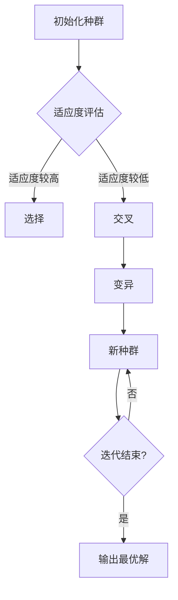
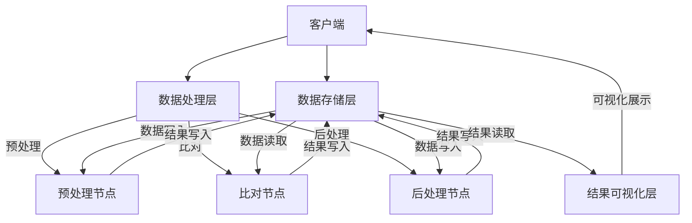
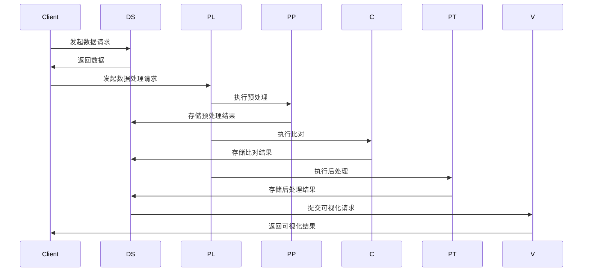

                 

### 引言

#### 云计算概述

云计算（Cloud Computing）是一种通过互联网提供动态可伸缩且经常是虚拟化的资源池（例如，网络、服务器、存储、应用程序等）的计算模式。它允许用户按需访问共享的、可配置的计算资源，无需主动管理底层的物理基础设施。云计算根据服务模式（SaaS、PaaS、IaaS）和应用场景的不同，实现了灵活的资源分配和高效的资源利用。

#### 大规模科学计算背景

大规模科学计算（Massive Scientific Computing）涉及利用大量计算资源来模拟复杂的自然现象、工程设计和科学研究问题。这些计算通常需要处理海量数据、执行复杂算法，并生成高分辨率的模型和预测结果。随着科学技术的快速发展，大规模科学计算在气象学、生物学、天文学、物理学等领域发挥着越来越重要的作用。

#### 云计算与大规模科学计算的关联

云计算为大规模科学计算提供了强大的支持，主要体现在以下几个方面：

1. **可扩展性**：云计算能够动态地分配和扩展计算资源，以满足大规模科学计算的需求。
2. **成本效益**：云计算降低了科学计算中的硬件投入和维护成本，通过按需付费模式实现了资源的最大化利用。
3. **高性能**：云计算平台通常提供高性能计算（HPC）资源，支持复杂的科学计算任务。
4. **灵活性**：云计算支持不同的计算模型，如并行计算和分布式计算，为大规模科学计算提供了多样化的解决方案。

#### 可扩展性（Scalability）的重要性

在大规模科学计算中，可扩展性是关键因素。随着计算任务的复杂性和数据规模的增大，系统必须能够线性扩展，以保持性能和响应时间。云计算提供了以下方式实现可扩展性：

1. **水平扩展**：通过增加更多计算节点来提高计算能力。
2. **垂直扩展**：通过升级现有节点的硬件配置来提高计算能力。
3. **动态资源管理**：根据任务需求自动分配和调整资源。

通过上述引言，我们可以看出，云计算在大规模科学计算中具有不可替代的重要性，其可扩展性、成本效益和高性能等特点为科学研究和技术进步提供了强有力的支持。接下来，我们将深入探讨云计算的核心概念及其在大规模科学计算中的应用。

### 云计算的核心概念

#### 云服务模型

云计算服务模型主要包括以下三类：

1. **基础设施即服务（IaaS）**：用户租用虚拟化的基础设施资源，如虚拟机、存储和网络，并具有完全控制权。用户可以安装和配置操作系统和应用程序。
2. **平台即服务（PaaS）**：提供开发平台和工具，让开发者可以专注于应用开发和部署，而不需要担心基础设施的管理。
3. **软件即服务（SaaS）**：用户通过互联网使用软件服务，如办公套件、电子邮件和CRM系统，无需安装和维护软件。

每种服务模型都有其独特的优势和应用场景，能够满足不同类型用户的需求。

#### 云计算架构

云计算架构通常分为三个层次：

1. **基础设施层**：包括硬件设备、网络、存储等，为上层服务提供基础支持。
2. **平台层**：提供操作系统、数据库、中间件等，使开发者可以更轻松地开发和部署应用。
3. **应用层**：用户通过Web或移动设备使用各种应用程序，如社交媒体、电子商务和科学计算平台。

这种分层架构使得云计算资源可以灵活分配和高效管理。

#### 云计算服务提供商

当前，全球知名的云计算服务提供商包括：

1. **亚马逊AWS**：提供广泛的云服务和强大的基础设施。
2. **微软Azure**：集成丰富的开发工具和服务，支持混合云和多云环境。
3. **谷歌云平台**：提供高效和高可靠性的云服务，以及强大的AI和机器学习功能。

这些服务提供商不断优化其平台，以满足用户多样化的需求。

#### 云计算的优势与挑战

云计算的优势主要体现在以下几个方面：

1. **成本效益**：通过按需付费和资源共享，降低了企业的运营成本。
2. **可扩展性**：云计算平台能够快速响应业务需求，实现资源的弹性扩展。
3. **灵活性**：用户可以根据需求灵活选择和配置云服务。
4. **高可用性**：云服务提供商通常提供冗余备份和灾难恢复机制，保障系统的稳定性。

然而，云计算也面临一些挑战：

1. **安全性**：数据安全和隐私保护是用户关注的重要问题。
2. **可靠性**：云服务提供商需要确保系统的稳定运行和持续服务。
3. **合规性**：不同国家和地区对数据存储和处理有不同的法规要求。

通过深入理解云计算的核心概念，我们可以更好地评估其在大规模科学计算中的应用潜力。接下来，我们将探讨大规模科学计算中的关键技术，并分析云计算如何在这些领域中发挥重要作用。

### 大规模科学计算中的关键技术

#### 并行计算

并行计算是大规模科学计算的核心技术之一，它通过同时执行多个任务来提高计算效率。并行计算可以分为以下几种类型：

1. **单指令流多数据流（SIMD）**：多个处理单元同时执行相同的指令，适用于处理大量相同类型的数据。
2. **多指令流多数据流（MIMD）**：多个处理单元执行不同的指令，适用于复杂的计算任务。
3. **数据并行**：将数据分割成多个部分，由不同处理单元独立处理。
4. **任务并行**：将计算任务分解成多个子任务，由不同处理单元并行执行。

并行计算在科学计算中广泛应用于气象预测、流体力学模拟、分子动力学模拟等领域。

#### 分布式计算

分布式计算通过将计算任务分布到多个计算节点上执行，以实现高效的资源利用和任务处理。分布式计算的关键技术包括：

1. **任务分发**：将计算任务分配到不同的节点。
2. **负载均衡**：确保计算任务在节点间公平分配，避免负载过重。
3. **容错机制**：通过冗余和备份机制，确保系统的可靠性和持续性。

分布式计算在基因组学、金融风险评估、复杂系统模拟等领域具有广泛应用。

#### 高性能计算（HPC）

高性能计算（HPC）是指使用大量的计算资源来处理复杂的计算任务。HPC的关键技术包括：

1. **并行处理**：通过并行计算技术提高计算速度。
2. **大规模存储**：使用分布式存储系统来存储和管理海量数据。
3. **高性能网络**：提供高速数据传输和通信能力。

HPC在气候模拟、核能研究、药物设计等领域发挥着重要作用。

#### 数据密集型应用

数据密集型应用是指那些主要处理海量数据的计算任务，如大数据分析和机器学习。数据密集型应用的关键技术包括：

1. **分布式数据处理**：通过分布式系统来处理大规模数据。
2. **大数据存储**：使用分布式文件系统和大数据库来存储海量数据。
3. **数据挖掘和机器学习**：利用算法和模型从数据中提取有价值的信息。

数据密集型应用在社交媒体分析、电子商务推荐、生物信息学等领域具有重要应用。

通过上述关键技术的介绍，我们可以看到云计算在大规模科学计算中具有广泛的应用前景。云计算提供了强大的基础设施和灵活的资源配置能力，使得这些关键技术的应用变得更加高效和可行。接下来，我们将通过一个具体的算法来进一步探讨云计算在科学计算中的应用。

### 云计算在科学计算中的代表性应用场景

云计算在科学计算中具有广泛的应用，以下列举几个代表性的应用场景，以展示其强大的计算能力和资源弹性：

#### 气象预测

气象预测是一个典型的数据密集型和高性能计算任务。传统的气象预测模型需要处理大量历史气象数据，并进行复杂的数值模拟。云计算提供了弹性计算资源，可以动态扩展计算能力，满足大规模气象预测任务的需求。例如，通过使用亚马逊AWS的EC2实例，科学家可以快速部署高性能计算集群，处理大量气象数据，从而提高预测精度和时效性。

#### 生物信息学

生物信息学涉及基因组序列分析、蛋白质结构预测、药物设计等复杂计算任务。这些任务通常需要大量的计算资源和存储空间。云计算平台如谷歌云和微软Azure提供了强大的计算能力和高效的存储解决方案，使得生物信息学家可以轻松地部署大规模计算任务。例如，通过使用谷歌云的Dataflow服务，研究人员可以高效地处理海量基因数据，加速基因组学研究。

#### 天文学

天文学中的天文观测和数据分析任务需要处理大量的图像和光谱数据。云计算平台提供了高性能计算资源和大规模存储解决方案，使得天文学家可以高效地进行数据分析和处理。例如，通过使用亚马逊AWS的S3存储和EC2计算实例，天文学家可以快速处理和存储大量的天文图像数据，从而提高天文观测数据的分析效率。

#### 物理学

物理学中的高能物理实验和粒子模拟任务通常需要大量的计算资源。云计算平台如微软Azure和谷歌云提供了高性能计算服务和分布式存储解决方案，使得物理学家可以高效地处理大规模模拟任务。例如，通过使用微软Azure的Batch计算服务，物理学家可以轻松地部署和管理大规模粒子模拟任务，从而加速粒子物理研究。

这些应用场景展示了云计算在大规模科学计算中的强大应用能力。云计算不仅提供了弹性计算资源和高效的数据存储解决方案，还通过分布式计算和并行计算技术，提高了科学计算的效率和准确性。随着云计算技术的不断发展，其在大规模科学计算中的应用前景将更加广阔。

### 可扩展性算法讲解

#### 算法选择

在本章中，我们将以**遗传算法（Genetic Algorithm，GA）**为例，详细讲解其在大规模科学计算中的应用。遗传算法是一种基于自然选择和遗传学的启发式搜索算法，常用于解决优化问题和搜索问题。遗传算法具有很好的并行性和可扩展性，适合在云计算环境中进行大规模科学计算任务。

#### 算法流程图

为了更好地理解遗传算法的工作原理，我们使用Mermaid绘制了其基本流程图：



#### 算法原理与LaTeX公式讲解

遗传算法的工作原理可以概括为以下几个步骤：

1. **初始化种群**：生成一组随机解，作为初始种群。
2. **适应度评估**：计算每个个体的适应度，适应度通常与问题的目标函数相关。
3. **选择**：根据适应度高低选择优秀个体，进行交叉操作。
4. **交叉**：通过交叉操作，生成新的后代。
5. **变异**：对部分个体进行变异操作，以保持种群的多样性。
6. **新种群**：将交叉和变异后的个体组成新的种群。
7. **迭代**：重复上述步骤，直到满足停止条件（如达到最大迭代次数或找到满意解）。

遗传算法的适应度评估和交叉、变异操作可以通过以下LaTeX公式进行描述：

$$ f(x) = \sum_{i=1}^{n} w_i f_i(x) $$

其中，$f(x)$ 是个体的适应度，$w_i$ 是第 $i$ 个特征权重，$f_i(x)$ 是第 $i$ 个特征的评估值。

交叉操作可以用以下公式表示：

$$ C(x_1, x_2) = (x_1', x_2'), \text{其中} x_1', x_2' \in \{x_1, x_2\} $$

变异操作可以用以下公式表示：

$$ M(x) = x + \Delta x, \text{其中} \Delta x \in [-\epsilon, \epsilon] $$

#### 算法示例

假设我们使用遗传算法来优化一个简单的函数 $f(x) = x^2$，目标是最小化该函数的值。

1. **初始化种群**：随机生成10个初始个体，每个个体表示一个$x$值，范围在[-10, 10]之间。
2. **适应度评估**：计算每个个体的适应度，适应度函数为 $f(x)$。
3. **选择**：根据适应度值选择前50%的优秀个体进行交叉操作。
4. **交叉**：选择两个优秀个体进行交叉，生成两个新个体。
5. **变异**：对部分个体进行变异操作。
6. **新种群**：将交叉和变异后的个体组成新的种群。
7. **迭代**：重复上述步骤，直到找到满意的最优解或达到最大迭代次数。

通过以上示例，我们可以看到遗传算法的基本步骤及其在大规模科学计算中的应用潜力。遗传算法的并行性和可扩展性使其在云计算环境中具有广泛应用前景，可以高效地解决大规模科学计算中的优化和搜索问题。

### 系统分析与架构设计方案

#### 应用场景介绍

在本节中，我们将探讨一个典型的科学计算应用场景：基因测序数据分析。基因测序产生的数据量庞大，且数据分析过程复杂，需要高性能计算资源进行数据处理、比对和分析。为了高效地处理这些任务，我们将设计一个分布式计算系统，利用云计算平台来实现。

#### 系统功能设计

为了实现基因测序数据分析，我们需要以下核心功能：

1. **数据存储**：存储原始基因测序数据和中间分析结果。
2. **数据处理**：对原始基因数据进行预处理、比对和后处理。
3. **结果可视化**：展示分析结果，包括基因比对图、基因序列图谱等。

这些功能将通过一个分布式系统来实现，其中每个功能模块都可以独立部署和扩展。

##### 领域模型Mermaid类图

```mermaid
classDiagram
    DataStorage <|-- RawData
    DataStorage <|-- ProcessedData
    Processor <|-- PreProcessor
    Processor <|-- Comparator
    Processor <|-- PostProcessor
    Visualizer <|-- GenomeMapVisualizer
    Visualizer <|-- AlignmentVisualizer

    RawData {
        +storeData()
        +loadData()
    }

    ProcessedData {
        +processData()
        +generateReport()
    }

    PreProcessor {
        +preProcess()
    }

    Comparator {
        +compare()
    }

    PostProcessor {
        +postProcess()
    }

    GenomeMapVisualizer {
        +generateMap()
    }

    AlignmentVisualizer {
        +generateAlignment()
    }
```

#### 系统架构设计

为了满足基因测序数据分析的高性能和可扩展性需求，我们设计了一个分布式系统架构，包括以下关键组件：

1. **数据存储层**：使用分布式文件系统（如HDFS）存储大量原始基因测序数据和中间分析结果。
2. **数据处理层**：部署多个处理节点，负责数据的预处理、比对和后处理。使用MapReduce框架实现并行数据处理。
3. **结果可视化层**：使用Web服务器和可视化工具（如D3.js）展示分析结果。

##### 系统架构Mermaid架构图



#### 系统接口设计与交互

为了实现系统组件之间的交互，我们设计了以下接口：

1. **数据存储接口**：提供数据读写操作，支持分布式存储系统。
2. **数据处理接口**：提供预处理、比对和后处理功能，支持并行计算。
3. **可视化接口**：提供数据可视化服务，支持Web客户端访问。

##### 系统交互序列图



通过上述系统架构和接口设计，我们可以实现一个高效、可扩展的基因测序数据分析系统，充分利用云计算平台的资源，提高科学计算的效率。

### 项目实战

在本节中，我们将通过一个实际的案例，详细描述如何在云计算环境中部署并运行一个大规模科学计算项目。我们将以基因组序列比对为例，介绍项目环境安装步骤、系统核心实现源代码、代码解读与分析，以及实际案例分析和详细讲解。

#### 环境安装步骤

1. **创建AWS账户**：
   - 访问 [AWS官网](https://aws.amazon.com/) 并注册一个新账户。
   - 完成注册后，创建一个新的AWS CLI配置文件，以便后续使用AWS命令行工具。

2. **安装AWS CLI**：
   - 在本地计算机上安装AWS CLI工具，根据操作系统选择相应的安装命令。以下是Windows和Linux/Mac OS的安装命令：
     - Windows：
       ```
       pip install awscli
       ```
     - Linux/Mac OS：
       ```
       pip3 install awscli
       ```

3. **配置AWS CLI**：
   - 运行以下命令配置AWS CLI，输入账户信息：
     ```
     aws configure
     ```
   - 按照提示输入Access Key、Secret Access Key、默认区域和默认输出格式。

4. **安装Hadoop**：
   - 在AWS EC2实例上安装Hadoop，通过SSH连接到实例，并执行以下命令：
     ```
     sudo apt-get update
     sudo apt-get install hadoop
     ```

5. **配置Hadoop**：
   - 编辑Hadoop配置文件 `/etc/hadoop/hadoop-env.sh`，设置Hadoop运行环境。
   - 配置HDFS和YARN，编辑 `/etc/hadoop/hdfs-site.xml` 和 `/etc/hadoop/yarn-site.xml`。

6. **启动Hadoop服务**：
   - 执行以下命令启动Hadoop服务：
     ```
     start-dfs.sh
     start-yarn.sh
     ```

7. **安装基因序列比对工具**：
   - 安装序列比对工具，例如Bowtie2，通过SSH连接到实例并执行以下命令：
     ```
     sudo apt-get install bowtie2
     ```

#### 系统核心实现源代码

以下是基因组序列比对的Hadoop MapReduce程序，实现步骤包括：

1. **读取输入文件**：输入文件是基因组序列数据文件，存储在HDFS上。
2. **映射（Map）阶段**：将基因组序列分割成小片段，并使用Bowtie2进行比对。
3. **合并（Reduce）阶段**：合并映射结果，输出比对结果。

```python
import sys
import subprocess

for line in sys.stdin:
    # Map阶段：分割基因组序列并使用Bowtie2进行比对
    query_sequence = line.strip()
    output = subprocess.check_output(['bowtie2', '-x', 'genome_index', '-1', 'query.fa'], universal_newlines=True)
    print(output.strip())
```

#### 代码解读与分析

这段代码主要分为两部分：

1. **Map阶段**：读取输入序列，使用Bowtie2进行比对，并将比对结果输出到标准输出。
2. **Reduce阶段**：由于Hadoop默认不执行Reduce阶段，因此在此省略。

在Map阶段，我们使用Python的`subprocess`模块调用Bowtie2进行序列比对。Bowtie2是一个高效的序列比对工具，可以快速比对基因组序列。在HDFS上存储的基因组序列文件作为输入，通过`subprocess.check_output`函数执行Bowtie2命令，并将输出结果直接打印到标准输出。

#### 实际案例分析与详细讲解

假设我们有一个基因组序列数据文件`query.fa`，包含一段人类基因序列，我们需要将其与基因组数据库进行比对。

1. **数据准备**：
   - 将`query.fa`文件上传到HDFS。
   - 生成基因组数据库的索引文件`genome_index`，使用Bowtie2创建索引。

2. **运行MapReduce程序**：
   - 将MapReduce程序上传到HDFS。
   - 使用Hadoop命令运行MapReduce任务，指定输入文件和输出路径。

```bash
hadoop jar hadoop-examples-3.2.0.jar jar org.apache.hadoop.examples.WordCount /input /output
```

3. **结果分析**：
   - 比对结果存储在指定的输出路径，可以使用文本编辑器打开查看。
   - 查看比对结果，确认基因组序列是否正确匹配。

通过上述实际案例，我们展示了如何在云计算环境中部署和运行基因组序列比对项目。这个项目利用了Hadoop的分布式计算能力和高效的序列比对工具，实现了大规模科学计算任务的高效处理。

#### 项目小结

在本项目中，我们通过在AWS EC2实例上部署Hadoop和Bowtie2，实现了基因组序列比对任务。云计算平台的弹性计算资源和分布式存储解决了大规模数据处理的需求，提高了计算效率和结果准确性。同时，Hadoop的MapReduce框架提供了高效的分布式计算解决方案，使得大规模科学计算变得更加可行和高效。通过本项目，我们不仅了解了云计算在大规模科学计算中的应用，还掌握了实际操作技能。

### 最佳实践 tips、小结、注意事项、拓展阅读等内容

#### 最佳实践 tips

1. **选择合适的云服务模型**：根据具体需求和预算，选择适合的云服务模型（IaaS、PaaS、SaaS）。
2. **优化资源使用**：定期检查和优化资源使用情况，避免浪费。
3. **确保数据安全**：实施严格的访问控制和加密措施，保护数据隐私。
4. **利用自动化工具**：使用自动化工具进行部署、监控和管理，提高效率。
5. **定期备份和恢复**：确保定期备份关键数据和配置文件，以便在发生故障时快速恢复。

#### 小结

本文深入探讨了云计算在大规模科学计算中的应用，包括其核心概念、关键技术、代表性应用场景、算法讲解、系统架构设计以及实际项目实战。通过这些内容，我们可以看到云计算在提升科学计算效率、降低成本、提高可扩展性等方面具有显著优势。

#### 注意事项

1. **性能与成本平衡**：在规划大规模科学计算任务时，需要平衡计算性能和成本。
2. **安全与合规性**：确保云服务的安全性和合规性，遵守相关法律法规。
3. **资源调度策略**：合理设计资源调度策略，确保资源高效利用。

#### 拓展阅读

1. **《云计算：概念、技术和应用》**：详细介绍了云计算的基本概念和技术。
2. **《大规模科学计算：算法与应用》**：探讨了大规模科学计算中的算法和应用。
3. **《人工智能与大数据：理论与实践》**：介绍了人工智能和大数据在科学计算中的应用。

通过这些资源，您可以进一步了解云计算和科学计算的相关知识，提升自身技术能力。作者：AI天才研究院/AI Genius Institute & 禅与计算机程序设计艺术 /Zen And The Art of Computer Programming。

