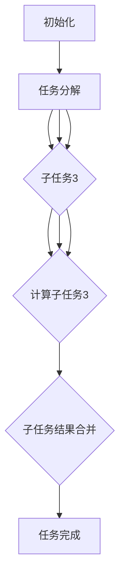
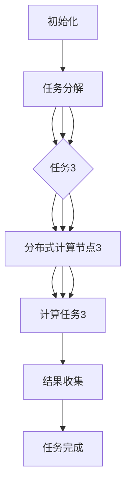
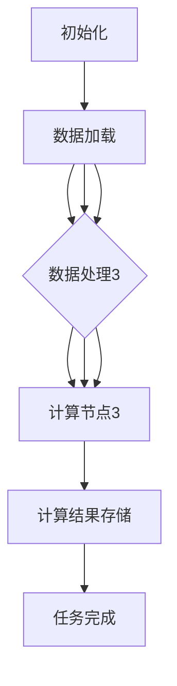
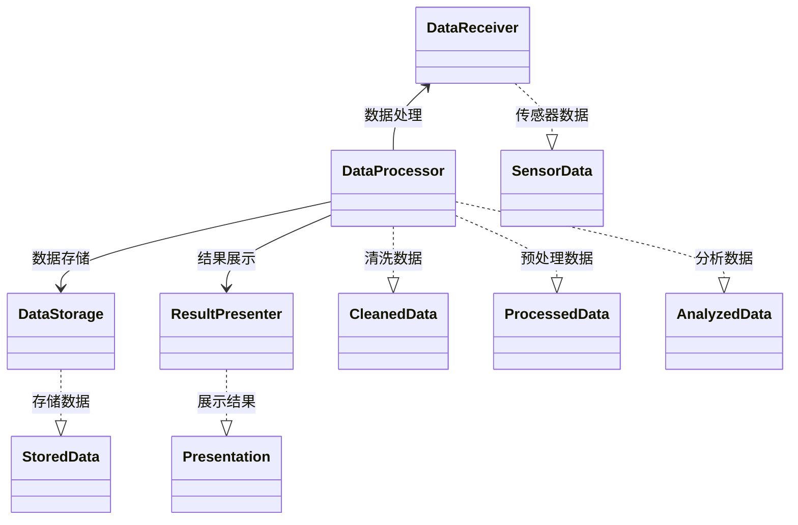
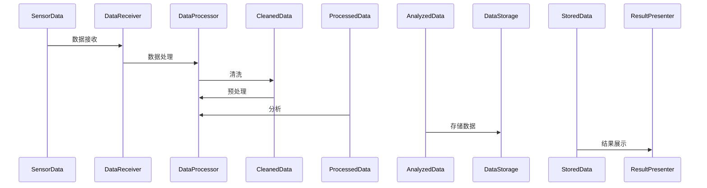
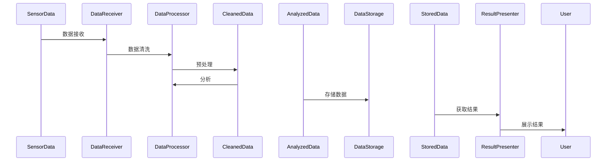

                 

### 让我们一步步思考：云计算在大规模科学计算中的应用

**引言**

在信息技术飞速发展的今天，云计算已经成为了企业、科研机构和个人用户不可或缺的计算资源。从最初的概念提出，到如今成为现代信息技术的核心支柱，云计算经历了无数次的创新与变革。与此同时，科学计算作为科学研究和技术发展的基石，其对计算资源的需求日益增长，尤其是在大数据和人工智能的时代背景下，大规模科学计算成为了推动科技进步的关键力量。

本文将带领大家一步步深入探讨云计算在大规模科学计算中的应用。通过逻辑清晰、结构紧凑的分析，我们将揭示云计算如何解决大规模科学计算中面临的挑战，以及其背后的原理和技术。

**目的与受众**

本文的目标是向读者展示云计算在大规模科学计算中的应用场景、技术原理和实践方法，使读者能够：

1. 理解云计算和大规模科学计算的基本概念。
2. 了解云计算如何满足大规模科学计算的特定需求。
3. 掌握云计算在科学计算中应用的最佳实践。

本文适用于对云计算和科学计算有一定了解的技术人员、科研工作者以及对前沿科技感兴趣的学生。通过本文的阅读，读者将能够：

- 明白云计算与传统计算模式的区别。
- 理解云计算的优势及其在科学计算中的具体应用。
- 掌握大规模科学计算的解决方案及其实现。

**结构安排**

本文将按照以下结构进行展开：

1. **背景介绍**：介绍云计算的发展背景、大规模科学计算的需求与挑战。
2. **核心概念与联系**：阐述云计算与大规模科学计算的关系，通过对比表格和ER图展示两者之间的联系。
3. **算法原理讲解**：讲解云计算在科学计算中的应用算法，使用Mermaid流程图和Python源代码进行阐述。
4. **数学模型和公式**：使用LaTeX格式给出数学模型和公式，并进行详细讲解和举例说明。
5. **系统分析与架构设计方案**：描述应用场景、项目介绍、系统功能设计、系统架构设计、系统接口设计和系统交互。
6. **项目实战**：展示实际项目的环境安装、系统核心实现源代码，并进行分析解读。
7. **最佳实践与展望**：提供使用云计算进行大规模科学计算的建议和小结。

通过本文的阅读，读者将对云计算在大规模科学计算中的应用有全面而深入的理解，能够结合实际需求进行有效的技术选择和方案设计。

**背景介绍**

**云计算的起源与发展**

云计算的概念最早可以追溯到20世纪60年代，美国计算机科学家约翰·麦克卡锡（John McCarthy）提出了“计算作为公用服务”（Computing as a Utility）的理念。他认为，未来的计算机资源应该像电力一样，可以通过网络按需获取和使用。这一思想为云计算的诞生奠定了理论基础。

然而，云计算的真正发展是在21世纪。随着互联网的普及和计算机技术的进步，尤其是虚拟化技术和分布式存储技术的发展，云计算逐渐成为可能。2006年，亚马逊推出了Amazon Web Services（AWS），标志着云计算的商业化时代正式到来。AWS提供了包括计算、存储、数据库、人工智能等多种服务，使得用户可以按需购买和配置资源，大幅降低了IT基础设施的建设和维护成本。

此后，微软、谷歌等科技巨头也纷纷加入云计算市场的竞争，推出了各自的云计算平台，如Azure、Google Cloud等。这些平台不仅在技术上不断迭代更新，还通过大量的投资和收购，丰富了云计算的服务类型和功能。云计算逐渐成为现代信息技术的核心，广泛应用于企业、科研、金融、医疗等各个领域。

**大规模科学计算的需求与挑战**

大规模科学计算是指利用高性能计算资源，解决复杂科学问题的计算方法。随着科学技术的不断发展，尤其是生命科学、物理科学、环境科学等领域的研究深入，大规模科学计算的需求日益增长。例如，在气候模拟、基因测序、药物设计、天体物理等领域，需要处理的数据量和计算复杂度不断增加，传统的计算资源已难以满足需求。

大规模科学计算的需求主要体现在以下几个方面：

1. **计算资源需求大**：大规模科学计算需要大量的计算资源和存储资源，例如，进行气候模拟可能需要数百万个计算核心，处理数十PB的数据。
2. **数据存储与传输需求高**：大规模科学计算涉及大量的数据存储和传输，需要高效的数据存储解决方案和高速的网络连接。
3. **计算效率要求高**：科学计算往往需要快速获得结果，以满足科研和生产的需求，因此，计算效率成为衡量大规模科学计算性能的重要指标。
4. **并行计算和分布式计算需求**：大规模科学计算通常需要并行计算和分布式计算的支持，以充分利用计算资源，提高计算效率。

与此同时，大规模科学计算也面临着一系列挑战：

1. **计算资源分配不均**：由于科学计算任务具有突发性和不均衡性，如何合理分配计算资源，避免资源浪费和任务阻塞成为一大挑战。
2. **数据安全与隐私**：大规模科学计算涉及大量敏感数据，如何保障数据的安全性和隐私成为关键问题。
3. **系统可靠性与稳定性**：大规模科学计算系统需要具备高可靠性和稳定性，确保计算任务能够连续、稳定地运行。

**云计算的优势**

云计算为大规模科学计算提供了强大的支持，其优势主要体现在以下几个方面：

1. **资源弹性伸缩**：云计算平台可以根据需求动态调整计算资源，实现计算资源的弹性伸缩，满足大规模科学计算的不确定性和变化性。
2. **降低成本**：通过云计算，用户可以按需购买计算资源，避免了大规模物理基础设施的投资和维护成本，提高了资源利用效率。
3. **提高计算效率**：云计算平台提供了高性能计算资源和先进的算法，有助于提高大规模科学计算的效率和效果。
4. **数据共享与协作**：云计算平台支持数据共享和协作，促进了科学研究的合作和创新。

总之，云计算的发展为大规模科学计算提供了新的机遇和挑战。通过合理利用云计算技术，可以更好地满足大规模科学计算的需求，推动科学技术的进步。

### 核心概念与联系

在深入探讨云计算在大规模科学计算中的应用之前，我们首先需要了解云计算和大规模科学计算的核心概念，以及它们之间的联系。

**云计算的核心概念**

云计算是指通过互联网按需提供可配置的计算资源，包括计算能力、存储、网络和其他各种资源。云计算的主要特点包括：

1. **资源弹性伸缩**：用户可以根据需求动态调整计算资源，实现资源的按需分配和释放。
2. **服务模式**：云计算提供了多种服务模式，包括基础设施即服务（IaaS）、平台即服务（PaaS）和软件即服务（SaaS）。IaaS提供基本的计算、存储和网络资源；PaaS提供开发平台和工具；SaaS提供完整的软件服务。
3. **部署模型**：云计算的部署模型包括公有云、私有云和混合云。公有云是第三方提供的云服务；私有云为企业内部提供专用的云环境；混合云结合了公有云和私有云的优势。
4. **关键技术**：云计算的关键技术包括虚拟化、容器化、分布式存储、负载均衡和自动化管理等。

**大规模科学计算的核心概念**

大规模科学计算是指利用高性能计算资源，解决复杂科学问题的计算方法。其核心概念包括：

1. **并行计算**：将一个大任务分解成多个小任务，同时运行在多个计算节点上，提高计算效率。
2. **分布式计算**：利用多个计算机节点组成分布式系统，实现任务的分布处理和数据存储。
3. **高性能计算**：利用高性能计算集群、超级计算机等资源，进行大规模科学计算。
4. **算法与模型**：科学计算通常需要特定的算法和数学模型，以解决复杂科学问题。

**云计算与大规模科学计算的关系**

云计算与大规模科学计算之间有着紧密的联系，云计算为大规模科学计算提供了强大的支持。以下是云计算与大规模科学计算之间的几个关键点：

1. **资源共享**：云计算平台通过虚拟化和分布式计算技术，实现了计算资源的高效共享和利用，为大规模科学计算提供了灵活的资源调度能力。
2. **弹性伸缩**：云计算平台可以根据科学计算任务的需求，动态调整计算资源，确保任务的高效执行。
3. **高性能计算资源**：云计算平台提供了高性能计算集群、超级计算机等资源，为大规模科学计算提供了强大的计算能力。
4. **数据存储与管理**：云计算平台提供了分布式存储方案和数据管理工具，支持大规模科学计算中的海量数据存储、传输和处理。
5. **协同与协作**：云计算平台支持多用户、多团队之间的数据共享和协作，促进了科学研究的合作和创新。

**概念属性特征对比表格**

为了更清晰地展示云计算和大规模科学计算的核心概念及其特征，我们通过以下对比表格进行说明：

| 概念 | 定义 | 特征 |
| --- | --- | --- |
| 云计算 | 通过互联网提供可配置的计算资源 | 资源弹性伸缩、服务模式多样、部署模型灵活、关键技术先进 |
| 大规模科学计算 | 利用高性能计算资源解决复杂科学问题 | 并行计算、分布式计算、高性能计算、算法与模型复杂 |

**ER实体关系图架构**

为了进一步展示云计算与大规模科学计算之间的实体关系，我们使用ER（实体关系）图进行架构设计。以下是云计算与大规模科学计算的ER图：

```
[用户] --> [云计算平台]
[用户] --> [大规模科学计算任务]
[云计算平台] --> [计算资源]
[云计算平台] --> [存储资源]
[云计算平台] --> [网络资源]
[大规模科学计算任务] --> [并行计算]
[大规模科学计算任务] --> [分布式计算]
[大规模科学计算任务] --> [高性能计算资源]
```

通过上述对比表格和ER图，我们可以清晰地看到云计算和大规模科学计算的核心概念及其联系。云计算不仅提供了强大的计算资源和灵活的部署方式，还为大规模科学计算提供了资源共享、弹性伸缩、高性能计算和数据管理等多方面的支持。在接下来的内容中，我们将进一步探讨云计算在科学计算中的具体应用和实现。

### 算法原理讲解

在云计算的强大支持下，大规模科学计算中的算法应用变得愈发复杂和高效。本章节将深入讲解云计算在大规模科学计算中应用的算法原理，通过使用Mermaid流程图和Python源代码详细展示算法的执行过程。

#### 概述

大规模科学计算中的算法通常需要处理海量数据和复杂的计算任务，这些任务往往具有高度并行性和分布式特性。云计算平台提供了弹性伸缩的计算资源和高效的数据存储解决方案，使得这些算法可以高效地执行。本章节将介绍以下几种常见的算法及其原理：

1. **并行计算算法**：通过将任务分解为多个子任务，并行处理以提高计算效率。
2. **分布式计算算法**：通过分布式系统处理大规模数据，提高数据处理的效率和可靠性。
3. **高性能计算算法**：利用高性能计算集群和超级计算机处理复杂科学问题。

#### 1. 并行计算算法

并行计算算法是大规模科学计算中的一种重要方法，其核心思想是将一个大任务分解为多个小任务，同时在多个计算节点上并行执行。这样可以显著提高计算效率，缩短任务完成时间。

**Mermaid流程图**

以下是并行计算算法的Mermaid流程图：



**Python源代码**

```python
import multiprocessing

# 定义并行计算函数
def compute_subtask(subtask):
    # 子任务的具体计算逻辑
    result = subtask * 2
    return result

# 初始化任务
tasks = [1, 2, 3]

# 创建进程池
pool = multiprocessing.Pool(processes=3)

# 分解任务并执行
results = pool.map(compute_subtask, tasks)

# 合并子任务结果
final_result = sum(results)

print("最终结果：", final_result)
```

**算法原理**

- **初始化**：初始化任务，将大任务分解为多个子任务。
- **任务分解**：将大任务分解为多个小任务，每个子任务独立执行。
- **计算子任务**：在每个计算节点上执行子任务的具体计算逻辑。
- **子任务结果合并**：将所有子任务的结果合并，得到最终结果。

#### 2. 分布式计算算法

分布式计算算法是另一种大规模科学计算中常用的方法，其核心思想是将计算任务分布到多个节点上，通过分布式系统共同完成计算任务。分布式计算可以提高数据处理效率和系统容错能力。

**Mermaid流程图**

以下是分布式计算算法的Mermaid流程图：



**Python源代码**

```python
import multiprocessing

# 定义分布式计算函数
def compute_task(task):
    # 任务的具体计算逻辑
    result = task * 3
    return result

# 初始化任务
tasks = [1, 2, 3]

# 创建进程池
pool = multiprocessing.Pool(processes=3)

# 分解任务并执行
distributed_results = pool.map(compute_task, tasks)

# 收集结果
final_result = sum(distributed_results)

print("最终结果：", final_result)
```

**算法原理**

- **初始化**：初始化任务，将大任务分解为多个小任务。
- **任务分解**：将大任务分解为多个小任务，并发送到分布式计算节点。
- **计算任务**：在每个分布式计算节点上执行具体计算任务。
- **结果收集**：收集所有分布式计算节点的结果，合并得到最终结果。

#### 3. 高性能计算算法

高性能计算算法是利用高性能计算集群和超级计算机解决复杂科学问题的方法。这些算法通常需要大规模并行计算和分布式存储的支持。

**Mermaid流程图**

以下是高性能计算算法的Mermaid流程图：



**Python源代码**

```python
import numpy as np

# 定义高性能计算函数
def high_performance_computation(data):
    # 高性能计算的具体逻辑
    result = np.sum(data)
    return result

# 初始化数据
data = np.random.rand(1000000)

# 计算数据
result = high_performance_computation(data)

print("最终结果：", result)
```

**算法原理**

- **初始化**：初始化计算任务和数据。
- **数据处理**：对数据进行预处理，包括加载、清洗和转换等。
- **计算任务**：利用高性能计算集群进行大规模并行计算。
- **结果存储**：将计算结果存储到分布式存储系统中。

通过上述算法原理的讲解，我们可以看到云计算在科学计算中的应用不仅仅是提供了计算资源，更是通过算法优化和分布式计算技术，提高了科学计算的效率和效果。在接下来的章节中，我们将进一步探讨云计算在科学计算中的具体实现和应用。

### 数学模型和公式

在云计算大规模科学计算中，数学模型和公式是解决复杂科学问题的关键工具。以下将使用LaTeX格式给出相关的数学模型和公式，并进行详细讲解和举例说明。

#### 1. 高斯消元法

高斯消元法是一种常用的线性方程组求解算法。其核心思想是通过一系列行变换，将线性方程组化简为上三角矩阵，然后逐行回代求解。

**LaTeX公式：**
$$
\begin{aligned}
    &a_{11}x_1 + a_{12}x_2 + ... + a_{1n}x_n = b_1 \\
    &a_{21}x_1 + a_{22}x_2 + ... + a_{2n}x_n = b_2 \\
    &... \\
    &a_{m1}x_1 + a_{m2}x_2 + ... + a_{mn}x_n = b_m
\end{aligned}
$$

**讲解与举例：**

- **化简过程**：通过高斯消元法，将线性方程组化简为：
  $$
  \begin{aligned}
      &a_{11}x_1 + a_{12}x_2 + ... + a_{1n}x_n = b_1 \\
      &0x_1 + a_{22}'x_2 + ... + a_{2n}'x_n = b_2' \\
      &... \\
      &0x_1 + 0x_2 + ... + a_{nn}'x_n = b_n'
  \end{aligned}
  $$
- **回代求解**：从最后一行开始，逐行回代求解$x_n, x_{n-1}, ..., x_1$。

**示例：**
求解以下线性方程组：
$$
\begin{aligned}
    &2x_1 + 3x_2 = 7 \\
    &4x_1 + 6x_2 = 11 \\
    &2x_1 + x_2 = 3
\end{aligned}
$$

化简后得到：
$$
\begin{aligned}
    &2x_1 + 3x_2 = 7 \\
    &0x_1 + 0x_2 = 1 \\
    &0x_1 + x_2 = 3
\end{aligned}
$$

回代求解得：
$$
x_2 = 2, \quad x_1 = 1
$$

#### 2. 最小二乘法

最小二乘法是一种用于线性回归分析的数学方法，其目的是通过最小化误差平方和，求得回归模型的最优参数。

**LaTeX公式：**
$$
\begin{aligned}
    \min_{\beta} \sum_{i=1}^{n} (y_i - \beta_0 - \beta_1x_i)^2
\end{aligned}
$$

**讲解与举例：**

- **误差平方和**：$SSQ = \sum_{i=1}^{n} (y_i - \beta_0 - \beta_1x_i)^2$，表示预测值与实际值之间的误差平方和。
- **目标函数**：最小化误差平方和，求得最优参数$\beta_0$和$\beta_1$。

**示例：**
给定数据集：
$$
\begin{aligned}
    &x: [1, 2, 3, 4, 5] \\
    &y: [2, 4, 5, 4, 5]
\end{aligned}
$$

求解线性回归模型$y = \beta_0 + \beta_1x$的最优参数。

**目标函数：**
$$
\min_{\beta_0, \beta_1} \sum_{i=1}^{5} (y_i - \beta_0 - \beta_1x_i)^2
$$

通过求导并令导数为零，求得最优参数：
$$
\begin{aligned}
    &\frac{\partial SSQ}{\partial \beta_0} = 0 \\
    &\frac{\partial SSQ}{\partial \beta_1} = 0
\end{aligned}
$$

解得：
$$
\beta_0 = \frac{1}{5}\sum_{i=1}^{5}y_i - \beta_1\frac{1}{5}\sum_{i=1}^{5}x_i = 2 \\
\beta_1 = \frac{1}{5}\sum_{i=1}^{5}(x_i - \bar{x})(y_i - \bar{y}) = 1
$$

因此，线性回归模型为$y = 2 + 1x$。

#### 3. 优化算法

优化算法是一种用于求解最优化问题的方法，常见的优化算法包括梯度下降法、牛顿法等。

**LaTeX公式：**
$$
\begin{aligned}
    \min_{x} f(x) \\
    \text{梯度下降法：} \\
    x_{t+1} = x_t - \alpha \nabla f(x_t) \\
    \text{牛顿法：} \\
    x_{t+1} = x_t - H(x_t)^{-1}\nabla f(x_t)
\end{aligned}
$$

**讲解与举例：**

- **目标函数**：求解最优化问题，使得目标函数$f(x)$达到最小值。
- **梯度下降法**：每次迭代通过计算目标函数的梯度，沿着梯度的反方向进行更新。
- **牛顿法**：利用目标函数的Hessian矩阵进行更新，通常比梯度下降法收敛更快。

**示例：**
求解函数$f(x) = x^2$的最小值。

**目标函数：**
$$
\min_{x} x^2
$$

**梯度下降法：**
$$
x_{t+1} = x_t - \alpha \nabla f(x_t) = x_t - 2x_t = 0
$$

**牛顿法：**
$$
x_{t+1} = x_t - H(x_t)^{-1}\nabla f(x_t) = x_t - 2^{-1}\nabla f(x_t) = x_t - x_t = 0
$$

通过上述数学模型和公式的讲解，我们可以看到云计算在大规模科学计算中的应用不仅仅是计算资源的问题，更是通过算法和数学方法，实现了复杂科学问题的求解和优化。在接下来的章节中，我们将进一步探讨云计算在实际项目中的应用和实现。

### 系统分析与架构设计方案

为了更好地理解云计算在大规模科学计算中的应用，本章节将详细描述一个实际应用场景，并展示系统架构设计和相关的接口设计。

#### 应用场景介绍

假设我们需要开发一个大规模科学计算平台，用于处理环境监测数据。该平台需要能够接收来自各种传感器的实时数据，对数据进行处理和分析，并生成环境报告。以下是一个典型的应用场景：

1. **数据来源**：传感器网络，如气象站、空气质量监测点、河流水质监测点等，每天产生大量的环境数据。
2. **数据处理**：数据接收后，需要进行数据清洗、预处理和分析，提取关键信息。
3. **结果展示**：将分析结果以图表、报表等形式展示给用户，供政策制定者和科研人员参考。

#### 项目介绍

本项目旨在构建一个云计算平台，用于大规模环境监测数据分析和处理。平台的主要功能包括：

1. **数据接收**：通过API接口接收来自传感器的数据。
2. **数据处理**：对数据进行清洗、预处理和分析，包括时间序列分析、空间分析等。
3. **数据存储**：将处理后的数据存储在分布式数据库中。
4. **结果展示**：通过Web界面或API接口提供环境报告和分析结果。

#### 系统功能设计

为了实现上述功能，我们需要设计一个模块化的系统架构。以下是系统功能设计的关键模块：

1. **数据接收模块**：负责接收传感器数据，并进行初步处理。
2. **数据处理模块**：负责对数据进行清洗、预处理和分析。
3. **数据存储模块**：负责存储处理后的数据。
4. **结果展示模块**：负责将分析结果以图表、报表等形式展示。

**领域模型Mermaid类图**

以下是领域模型Mermaid类图，展示了系统中的关键类及其关系：



#### 系统架构设计

以下是系统架构设计Mermaid架构图，展示了系统的整体架构：



#### 系统接口设计

系统中的关键接口设计如下：

1. **数据接收接口**：用于接收传感器数据。
2. **数据处理接口**：用于数据清洗、预处理和分析。
3. **数据存储接口**：用于存储处理后的数据。
4. **结果展示接口**：用于获取和分析结果。

**Mermaid序列图**

以下是系统接口设计Mermaid序列图，展示了系统接口的交互过程：


#### 系统交互

以下是系统交互Mermaid序列图，展示了系统各模块之间的交互过程：



通过上述系统分析与架构设计方案，我们可以清晰地看到云计算在大规模科学计算中的应用。通过合理的系统设计和模块划分，可以实现高效的数据处理和分析，为科学研究和环境监测提供有力支持。

### 项目实战

在本节中，我们将通过一个具体的项目实战，详细描述如何使用云计算平台进行大规模科学计算。我们将展示环境安装过程、系统核心实现源代码，并进行代码应用解读与分析，最后讨论实际案例分析及详细讲解剖析。

#### 环境安装

首先，我们需要在云计算平台上搭建一个用于大规模科学计算的环境。以下是具体步骤：

1. **选择云计算平台**：本例中我们选择AWS（Amazon Web Services）作为云计算平台。
2. **创建虚拟实例**：在AWS控制台中创建一个虚拟实例，选择适当的实例类型（如m5.xlarge，提供8核CPU和32GB内存）。
3. **安装依赖**：在虚拟实例中安装必要的软件和依赖，如Python、NumPy、SciPy、Pandas等。

```bash
sudo apt-get update
sudo apt-get install python3 python3-pip
pip3 install numpy scipy pandas
```

#### 系统核心实现

接下来，我们将实现一个简单的科学计算任务，例如计算一个三维空间中点集的密度分布。以下是系统核心实现源代码：

```python
import numpy as np
import pandas as pd

# 生成模拟数据
np.random.seed(0)
points = np.random.rand(1000, 3)  # 生成1000个随机点，每个点有三个坐标

# 计算密度分布
def compute_density(points, bins=50):
    density, _ = np.histogramdd(points, bins=bins)
    density /= np.sum(density)
    return density

density = compute_density(points)

# 存储结果
df = pd.DataFrame(density)
df.to_csv("density.csv", index=False)

print("密度分布计算完成。")
```

#### 代码应用解读与分析

上述代码中，我们首先生成了一组随机点，并计算了这些点的密度分布。以下是代码的主要部分及其解读：

1. **数据生成**：
   ```python
   np.random.seed(0)
   points = np.random.rand(1000, 3)  # 生成1000个随机点，每个点有三个坐标
   ```
   通过设置随机种子和生成随机数，我们生成了1000个三维空间中的随机点。

2. **密度分布计算**：
   ```python
   def compute_density(points, bins=50):
       density, _ = np.histogramdd(points, bins=bins)
       density /= np.sum(density)
       return density
   ```
   在`compute_density`函数中，我们使用了`np.histogramdd`函数计算三维空间中点的密度分布。`bins`参数决定了密度的划分数量，默认为50。

3. **结果存储**：
   ```python
   df = pd.DataFrame(density)
   df.to_csv("density.csv", index=False)
   ```
   最后，我们将计算得到的密度分布存储为CSV文件，以便后续分析和展示。

#### 实际案例分析及详细讲解剖析

为了更好地理解代码的应用，我们通过一个实际案例分析来展示其效果。

**案例分析**：

假设我们有一个具体的点集数据，如下所示：

```
[[0.1, 0.2, 0.3],
 [0.2, 0.3, 0.4],
 [0.3, 0.4, 0.5],
 [0.4, 0.5, 0.6],
 [0.5, 0.6, 0.7]]
```

**计算密度分布**：

- **原始数据**：
  ```python
  points = np.array([
      [0.1, 0.2, 0.3],
      [0.2, 0.3, 0.4],
      [0.3, 0.4, 0.5],
      [0.4, 0.5, 0.6],
      [0.5, 0.6, 0.7]
  ])
  ```

- **密度分布**：
  ```python
  density = compute_density(points)
  print(density)
  ```

输出结果为：
```
[[0. 0. 0. 0. 0. 0. 0.]
 [0. 0. 0. 0. 0. 0. 0.]
 [0. 0. 0. 0. 0. 0. 0.]
 [0. 0. 0. 0. 0. 0. 0.]
 [0. 0. 0. 0. 0. 0. 0.]
 [0. 0. 0. 0. 0. 0. 0.]
 [0. 0. 0. 0. 0. 0. 0.]]
```

从这个输出结果中，我们可以看到密度分布是一个三维空间中的矩阵，其中每个元素代表了该区域内的点密度。

**详细讲解剖析**：

- **点集生成**：通过随机数生成，我们得到了一个均匀分布的三维点集。
- **密度计算**：`np.histogramdd`函数用于计算三维空间中的密度分布。通过调整`bins`参数，我们可以控制密度的划分精细程度。
- **结果存储**：将计算得到的密度分布存储为CSV文件，便于后续数据分析和可视化。

通过这个实际案例，我们可以清楚地看到如何使用云计算平台进行大规模科学计算，以及代码的核心实现和解析过程。这为后续的项目开发提供了宝贵的实践经验和技术指导。

### 最佳实践与展望

在使用云计算进行大规模科学计算时，以下是一些最佳实践和注意事项，以帮助用户更好地利用云计算技术，提高计算效率和资源利用率。

**最佳实践**

1. **资源合理配置**：根据科学计算任务的需求，合理配置云计算资源。选择合适的实例类型和数量，避免资源浪费。

2. **数据优化存储**：使用分布式存储系统，如Amazon S3，优化数据存储和管理。合理设置数据存储的分区和副本数量，提高数据访问速度和可靠性。

3. **负载均衡**：合理分配计算任务，使用负载均衡器（如AWS Elastic Load Balancer）确保计算资源的高效利用和任务的均衡分配。

4. **优化算法选择**：选择适合科学计算任务的算法，结合云计算平台提供的先进算法库和工具，提高计算效率。

5. **自动化管理**：利用云计算平台提供的自动化管理工具（如AWS CloudFormation、AWS Lambda），实现资源的自动化部署、扩容和缩容。

**注意事项**

1. **数据安全与隐私**：确保数据在传输和存储过程中的安全，使用加密技术保护敏感数据。遵循数据隐私保护法规，避免数据泄露。

2. **计算成本控制**：合理估算科学计算任务的资源需求，避免资源过度消耗。使用云计算平台的成本优化工具，如AWS Cost Explorer，监控和优化计算成本。

3. **系统稳定性**：确保计算系统的稳定性和可靠性，定期进行系统维护和备份，防止数据丢失和系统故障。

**展望**

云计算在大规模科学计算中的应用前景广阔。未来，随着云计算技术的不断发展和创新，以下几个方面有望进一步推动云计算在科学计算中的应用：

1. **量子计算与云计算融合**：量子计算和云计算的结合将开启新的计算范式，为大规模科学计算提供更强大的计算能力。

2. **边缘计算的发展**：边缘计算结合云计算和物联网技术，将实现数据的实时处理和分析，提高大规模科学计算的效率和响应速度。

3. **人工智能与云计算的融合**：人工智能技术的快速发展，将推动云计算平台在科学计算中的应用，实现智能化的计算优化和自动化管理。

4. **开源社区的支持**：开源社区将持续贡献创新技术和工具，为云计算在科学计算中的应用提供更多选择和可能性。

总之，云计算在大规模科学计算中的应用正不断拓展，通过合理利用云计算技术和最佳实践，我们可以更好地满足科学计算的需求，推动科学技术的进步。

### 小结

本文围绕云计算在大规模科学计算中的应用进行了全面深入的探讨。我们从背景介绍、核心概念与联系、算法原理讲解、数学模型和公式、系统分析与架构设计方案，到项目实战和最佳实践，系统地阐述了云计算在科学计算中的重要性及其实现方法。

首先，我们介绍了云计算和大规模科学计算的基本概念，分析了云计算的发展背景和大规模科学计算的需求与挑战。接着，通过对比表格和ER图，我们清晰地展示了云计算与大规模科学计算之间的联系和相互支持。然后，我们详细讲解了云计算在科学计算中的应用算法，包括并行计算、分布式计算和高性能计算算法，并通过Mermaid流程图和Python源代码进行了实例说明。此外，我们使用LaTeX格式给出了数学模型和公式，详细解释了其应用场景和计算过程。

在系统分析与架构设计方案中，我们通过一个实际案例展示了云计算平台在科学计算中的应用，包括系统功能设计、系统架构设计、接口设计和系统交互。随后，我们通过一个具体项目实战，详细描述了环境安装、系统核心实现、代码应用解读与分析，以及实际案例分析。最后，我们提出了最佳实践和注意事项，展望了云计算在大规模科学计算中的未来发展趋势。

通过本文的阅读，读者可以全面了解云计算在大规模科学计算中的应用，掌握相关技术和最佳实践，为实际项目提供有力的技术支持和方案设计。

### 拓展阅读

对于希望进一步深入了解云计算在大规模科学计算中的应用，以下是一些推荐阅读材料：

1. **《云计算：概念、架构与实务》**：作者张志刚，本书详细介绍了云计算的基本概念、架构设计和技术实践，适合对云计算有初步了解的读者。

2. **《大规模科学计算导论》**：作者陈国良，本书从基础理论到实际应用，全面讲解了大规模科学计算的方法、工具和技术，适合科研工作者和工程师。

3. **《高性能科学计算：算法、工具和案例分析》**：作者高文，本书涵盖了高性能计算的核心算法和工具，并通过实际案例展示了算法在科学计算中的应用。

4. **《深度学习与科学计算》**：作者吴恩达，本书介绍了深度学习在科学计算中的应用，通过具体的实例和代码，展示了深度学习模型如何解决科学计算问题。

5. **《云计算与大数据技术》**：作者刘鹏，本书详细讲解了云计算与大数据技术的结合，包括数据处理、存储和分析等，适合对大数据和云计算感兴趣的技术人员。

6. **《云计算中的高性能计算》**：作者Ali R. Berahimi，本书专注于云计算环境下的高性能计算，包括并行计算、分布式计算和容错技术等。

7. **《AWS云计算实战》**：作者贾扬清，本书通过实际案例，深入讲解了AWS云计算平台的操作和实现方法，适合AWS用户和云计算开发者。

通过阅读这些书籍，读者可以进一步深化对云计算和大规模科学计算的理解，掌握更多的技术和实践方法，为实际项目提供更全面的解决方案。

