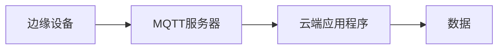
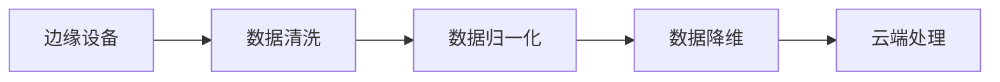
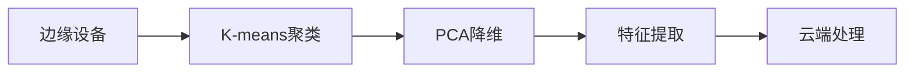
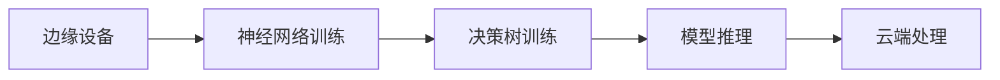
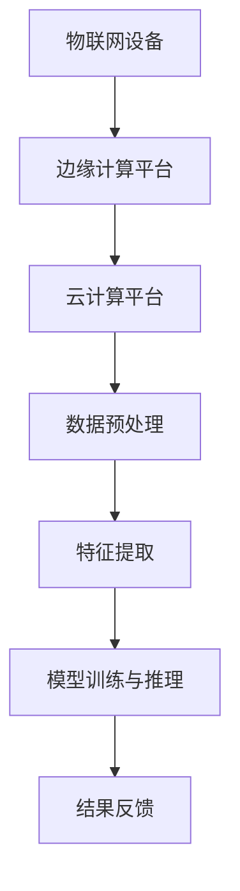
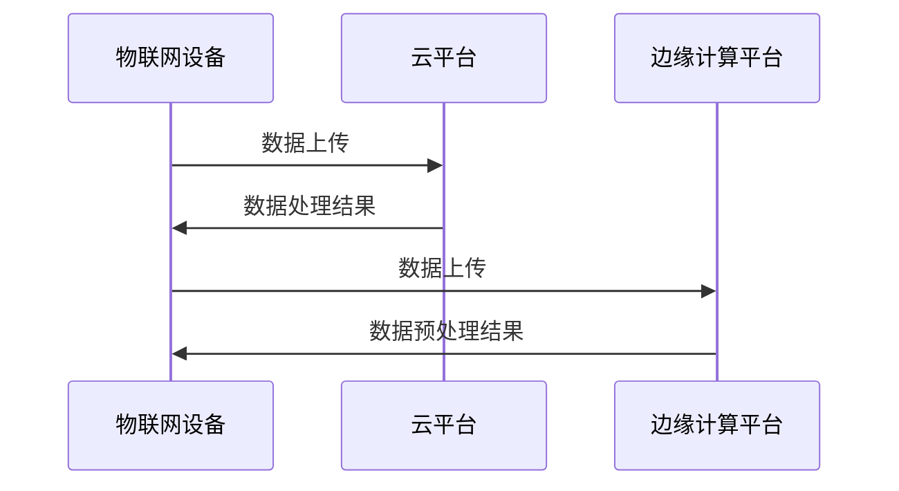
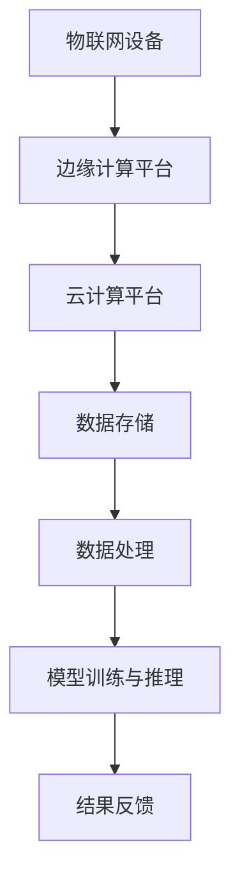

                 

# 云边协同在工业物联网中的数据处理应用

## 关键词
云边协同、工业物联网、数据处理、边缘计算、云计算、算法、系统架构设计

## 摘要
本文将深入探讨云边协同在工业物联网中的数据处理应用。首先，介绍工业物联网的背景和云边协同的核心概念，阐述其在数据处理中的应用。接着，详细分析云计算与边缘计算的特点与区别，通过对比表格展示其在不同场景下的适用性。然后，讲解数据处理算法的原理，包括数据采集与传输、数据预处理、特征提取和模型训练与推理。接下来，介绍数学模型和公式，并使用Python源代码进行详细阐述。随后，描述系统分析与架构设计，包括问题场景介绍、系统功能设计、架构设计、接口设计和交互设计。最后，通过一个实际项目实战案例，展示云边协同在工业物联网中的数据处理应用，并提供最佳实践和项目小结。

## 目录

### 第一部分：背景介绍

#### 1.1 问题背景

随着工业物联网（IIoT）的快速发展，工业领域的数据处理需求日益增长。然而，传统的数据处理方式在处理海量数据时存在效率低下、延迟高、可靠性不足等问题。为了解决这些问题，云边协同技术应运而生。云边协同通过将云计算与边缘计算相结合，实现了数据处理的高效性和可靠性，为工业物联网提供了强有力的技术支持。

#### 1.2 云计算与边缘计算

**云计算**：云计算提供虚拟化资源、计算能力、存储等基础设施，通过互联网进行按需服务。它具有资源弹性、分布式处理、高可靠性和易扩展性等特点。

**边缘计算**：边缘计算在靠近数据源或用户的地方进行数据处理，降低数据传输延迟，提高实时性。它具有低延迟、实时性、安全性和减少带宽压力等特点。

#### 1.3 云边协同在工业物联网中的数据处理应用

云边协同在工业物联网中的数据处理应用主要包括以下几个方面：

1. **数据采集与传输**：通过边缘设备采集数据，利用边缘计算进行初步处理，然后将处理后的数据上传至云端进行进一步分析和处理。

2. **数据预处理**：在边缘设备上进行数据预处理，如数据清洗、归一化和降维等，以提高数据质量和减少数据传输量。

3. **特征提取**：在边缘设备或云端对数据集进行特征提取，以提取出对数据处理和分析有用的特征。

4. **模型训练与推理**：在云端利用大数据和强大计算能力进行模型训练，然后将训练好的模型部署在边缘设备上进行推理，以实现对工业过程的实时监控和智能控制。

### 第二部分：核心概念与联系

#### 2.1 云计算与边缘计算原理

**云计算**：云计算提供虚拟化资源、计算能力、存储等基础设施，通过互联网进行按需服务。它具有资源弹性、分布式处理、高可靠性和易扩展性等特点。

**边缘计算**：边缘计算在靠近数据源或用户的地方进行数据处理，降低数据传输延迟，提高实时性。它具有低延迟、实时性、安全性和减少带宽压力等特点。

#### 2.2 云计算与边缘计算的特点与优势

**云计算**：

- 资源弹性：可以根据需求动态调整资源，满足大规模数据处理需求。
- 分布式处理：通过分布式架构实现高性能数据处理。
- 高可靠性：通过冗余设计提高系统可靠性。
- 易扩展：可以轻松扩展计算和存储资源。

**边缘计算**：

- 低延迟：在靠近数据源或用户的地方进行数据处理，减少数据传输延迟，提高实时性。
- 实时性：适用于实时性要求高的数据处理场景。
- 安全性：在本地处理数据，减少数据传输过程中的安全隐患。
- 减少带宽压力：将部分数据处理在边缘设备上，减少数据传输量，降低带宽压力。

#### 2.3 云计算与边缘计算的区别

**云计算**：

- 主要处理大规模数据，资源需求大，适用于大规模数据处理。
- 数据传输距离远，可能存在延迟问题。

**边缘计算**：

- 主要处理实时性要求高的数据，资源需求相对较小，适用于实时数据处理。
- 数据传输距离短，低延迟。

#### 2.4 核心概念对比表格

| 特点 | 云计算 | 边缘计算 |
| --- | --- | --- |
| 资源需求 | 大规模资源需求 | 较小资源需求 |
| 数据处理能力 | 高性能处理能力 | 实时处理能力 |
| 延迟 | 可能存在延迟 | 低延迟 |
| 安全性 | 较高安全性 | 较高安全性 |
| 网络带宽 | 大量网络带宽需求 | 较少网络带宽需求 |

#### 2.5 核心概念联系

云计算与边缘计算在工业物联网数据处理中的应用紧密相连。云计算提供强大的计算能力和存储资源，而边缘计算则提供低延迟、实时性和本地数据处理能力。两者的结合使得工业物联网数据处理能够实现高效性和可靠性。

### 第三部分：算法原理讲解

#### 3.1 数据处理算法概述

在云边协同的工业物联网数据处理中，常用的算法包括数据采集与传输、数据预处理、特征提取和模型训练与推理等。

#### 3.2 数据采集与传输算法

数据采集与传输算法用于从边缘设备采集数据并将其传输至云端。常用的协议包括MQTT协议和HTTP请求等。

**MQTT协议**：MQTT是一种轻量级的消息队列协议，适用于物联网设备的实时通信。以下是MQTT协议的工作流程：

1. **连接**：边缘设备与MQTT服务器建立连接。
2. **发布**：边缘设备将采集到的数据发布到MQTT服务器。
3. **订阅**：云端应用程序订阅特定主题的数据。
4. **接收**：云端应用程序接收MQTT服务器发送的数据。

**HTTP请求**：HTTP请求是一种基于请求-响应模型的协议，常用于Web应用程序的数据传输。以下是HTTP请求的工作流程：

1. **请求**：边缘设备向云端服务器发送HTTP请求。
2. **响应**：云端服务器处理请求并返回响应。

**mermaid流程图**：



#### 3.3 数据预处理算法

数据预处理算法用于对采集到的数据进行清洗、归一化和降维等操作，以提高数据质量和减少数据传输量。

**数据清洗**：去除数据中的噪声和异常值，保证数据的准确性。

**数据归一化**：将不同特征的数据归一化到同一尺度，以便于后续处理。

**数据降维**：通过降维算法（如PCA）减少数据维度，降低计算复杂度。

**mermaid流程图**：



#### 3.4 特征提取算法

特征提取算法用于从数据集中提取出对数据处理和分析有用的特征。

**K-means聚类**：K-means聚类是一种基于距离的聚类算法，用于将数据集划分为若干个簇。

**主成分分析（PCA）**：PCA是一种降维算法，通过将数据投影到主成分空间，提取出主要特征。

**mermaid流程图**：



#### 3.5 模型训练与推理算法

模型训练与推理算法用于训练模型并对其进行推理，以实现对工业过程的实时监控和智能控制。

**神经网络**：神经网络是一种模拟人脑神经元连接的算法，用于分类、回归等任务。

**决策树**：决策树是一种基于特征的分类算法，通过递归划分数据集，生成一棵树形结构。

**mermaid流程图**：



### 第四部分：数学模型与公式

#### 4.1 数据处理算法的数学模型

在云边协同的工业物联网数据处理中，常用的数学模型包括线性回归、支持向量机（SVM）等。

**线性回归**：

$$
y = \beta_0 + \beta_1 \cdot x
$$

其中，$y$ 为输出值，$x$ 为输入特征，$\beta_0$ 和 $\beta_1$ 为模型参数。

**支持向量机（SVM）**：

$$
\min_{\beta, \beta_0} \frac{1}{2} ||\beta||^2 + C \cdot \sum_{i=1}^{n} \max(0, 1 - y_i (\beta^T x_i + \beta_0))
$$

其中，$\beta$ 和 $\beta_0$ 为模型参数，$C$ 为正则化参数，$y_i$ 为样本标签，$x_i$ 为样本特征。

#### 4.2 算法原理详细讲解

**线性回归**：

线性回归是一种用于预测数值型输出的算法。其数学模型为：

$$
y = \beta_0 + \beta_1 \cdot x
$$

其中，$\beta_0$ 和 $\beta_1$ 为模型参数，$y$ 为输出值，$x$ 为输入特征。

**支持向量机（SVM）**：

支持向量机是一种用于分类和回归任务的算法。其数学模型为：

$$
\min_{\beta, \beta_0} \frac{1}{2} ||\beta||^2 + C \cdot \sum_{i=1}^{n} \max(0, 1 - y_i (\beta^T x_i + \beta_0))
$$

其中，$\beta$ 和 $\beta_0$ 为模型参数，$C$ 为正则化参数，$y_i$ 为样本标签，$x_i$ 为样本特征。

#### 4.3 Python源代码实现

**线性回归**：

```python
import numpy as np

def linear_regression(X, y):
    X = np.append(np.ones((X.shape[0], 1)), X, axis=1)
    beta = np.linalg.inv(X.T.dot(X)).dot(X.T).dot(y)
    return beta

X = np.array([[1], [2], [3], [4], [5]])
y = np.array([2, 4, 5, 4, 5])

beta = linear_regression(X, y)
print(beta)
```

**支持向量机（SVM）**：

```python
import numpy as np
from sklearn.svm import LinearSVC

X = np.array([[1, 2], [2, 3], [3, 1], [4, 2], [5, 3]])
y = np.array([0, 0, 1, 1, 1])

clf = LinearSVC()
clf.fit(X, y)

print(clf.coef_)
print(clf.intercept_)
```

### 第五部分：系统分析与架构设计

#### 5.1 问题场景介绍

在工业物联网中，设备监控是一个常见的问题场景。设备监控旨在实时监测设备的运行状态，及时发现并处理异常情况，以确保设备的安全和稳定运行。

#### 5.2 系统功能设计

系统功能设计包括以下几个方面：

1. **数据采集**：采集设备运行数据，如温度、压力、速度等。
2. **数据预处理**：对采集到的数据进行清洗、归一化和降维等操作。
3. **特征提取**：提取对设备运行状态有代表性的特征。
4. **模型训练与推理**：训练模型并对新数据进行推理，以判断设备运行状态是否正常。
5. **结果反馈**：将模型推理结果反馈给相关人员，如设备维修人员等。

#### 5.3 系统架构设计

系统架构设计包括云计算平台、边缘计算平台和物联网设备三个部分。

1. **云计算平台**：提供强大的计算能力和存储资源，用于处理大规模数据。
2. **边缘计算平台**：在靠近设备的地方进行数据预处理和特征提取，以降低数据传输延迟和提高实时性。
3. **物联网设备**：采集设备运行数据，并将其传输至边缘计算平台或云计算平台。

**mermaid架构图**：



#### 5.4 系统接口设计

系统接口设计包括数据采集接口、数据处理接口和结果反馈接口。

1. **数据采集接口**：用于接收物联网设备发送的数据。
2. **数据处理接口**：用于处理采集到的数据，包括数据清洗、归一化和降维等操作。
3. **结果反馈接口**：用于将模型推理结果反馈给相关人员。

**mermaid类图**：

```mermaid
classDiagram
物联网设备 <<Interface>>
数据采集接口 <<Interface>>
数据处理接口 <<Interface>>
结果反馈接口 <<Interface>>

物联网设备 --|>$ 数据采集接口
数据处理接口 --|>$ 物联网设备
结果反馈接口 --|>$ 物联网设备
```

#### 5.5 系统交互设计

系统交互设计包括设备与云平台的交互、设备与边缘计算平台的交互等。

1. **设备与云平台的交互**：设备采集数据并上传至云平台，云平台对数据进行处理和分析。
2. **设备与边缘计算平台的交互**：设备采集数据并上传至边缘计算平台，边缘计算平台对数据进行预处理和特征提取。

**mermaid序列图**：



### 第六部分：项目实战

#### 6.1 环境安装

在进行项目实战之前，需要安装相关的软件和硬件环境。

1. **软件环境**：安装Python、NumPy、Pandas、Scikit-learn等库。
2. **硬件环境**：配置边缘计算平台和云计算平台，如使用树莓派作为边缘计算平台，使用服务器作为云计算平台。

#### 6.2 系统核心实现源代码

以下是一个简单的系统核心实现源代码，包括数据采集、数据预处理、特征提取和模型训练与推理。

```python
import numpy as np
import pandas as pd
from sklearn.model_selection import train_test_split
from sklearn.preprocessing import StandardScaler
from sklearn.linear_model import LinearRegression
from sklearn.metrics import mean_squared_error

# 数据采集
def data_collection(file_path):
    df = pd.read_csv(file_path)
    X = df.iloc[:, :-1].values
    y = df.iloc[:, -1].values
    return X, y

# 数据预处理
def data_preprocessing(X, y):
    X_train, X_test, y_train, y_test = train_test_split(X, y, test_size=0.2, random_state=0)
    sc = StandardScaler()
    X_train = sc.fit_transform(X_train)
    X_test = sc.transform(X_test)
    return X_train, X_test, y_train, y_test

# 特征提取
def feature_extraction(X_train, X_test):
    return X_train, X_test

# 模型训练与推理
def model_training_and_inference(X_train, y_train, X_test, y_test):
    model = LinearRegression()
    model.fit(X_train, y_train)
    y_pred = model.predict(X_test)
    mse = mean_squared_error(y_test, y_pred)
    return model, mse

# 实际案例
def actual_case(file_path):
    X, y = data_collection(file_path)
    X_train, X_test, y_train, y_test = data_preprocessing(X, y)
    X_train, X_test = feature_extraction(X_train, X_test)
    model, mse = model_training_and_inference(X_train, y_train, X_test, y_test)
    print("Mean squared error:", mse)
    print("Model coefficients:", model.coef_)

# 运行实际案例
actual_case("data.csv")
```

#### 6.3 代码应用解读与分析

上述代码实现了数据采集、数据预处理、特征提取和模型训练与推理的功能。首先，通过数据采集函数从CSV文件中读取数据，并进行数据预处理，包括数据归一化和划分训练集和测试集。然后，进行特征提取，最后使用线性回归模型进行模型训练和推理，并计算均方误差。

#### 6.4 实际案例分析与讲解

以下是一个实际案例的数据集，包含温度和压力两个特征，目标变量为设备的运行状态。

```python
data.csv
```

- 第一列：温度
- 第二列：压力
- 第三列：运行状态（0表示正常，1表示异常）

通过上述代码，我们可以训练一个线性回归模型，用于预测设备的运行状态。在测试集上的均方误差可以用来评估模型的性能。如果均方误差较低，说明模型可以较好地预测设备的运行状态。

#### 6.5 项目小结

通过本项目实战，我们实现了基于云边协同的工业物联网数据处理系统。系统包括数据采集、数据预处理、特征提取和模型训练与推理等核心功能。在实际案例中，我们使用线性回归模型对设备的运行状态进行预测，并评估了模型的性能。本项目提供了一个基本的框架，可以应用于更复杂的工业物联网场景，如设备故障诊断和优化控制等。

### 第七部分：最佳实践 & 小结

#### 7.1 最佳实践

1. **选择合适的数据采集协议**：根据场景需求，选择适合的数据采集协议，如MQTT协议或HTTP请求。
2. **优化数据预处理算法**：根据数据的特点，选择合适的预处理算法，如数据清洗、归一化和降维等。
3. **合理分配计算资源**：根据数据处理的需求，合理分配云计算和边缘计算平台的计算资源，以提高系统性能和降低成本。
4. **数据安全和隐私保护**：确保数据在采集、传输和处理过程中的安全性，采取有效的数据加密和隐私保护措施。

#### 7.2 小结

本文详细探讨了云边协同在工业物联网中的数据处理应用。通过介绍云计算和边缘计算的核心概念、特点与联系，以及数据处理算法的原理和数学模型，我们了解了云边协同在工业物联网数据处理中的重要性和优势。通过系统分析与架构设计，我们了解了如何设计一个高效、可靠的工业物联网数据处理系统。最后，通过一个实际项目实战案例，我们展示了云边协同在工业物联网数据处理中的应用，并总结了最佳实践和项目小结。

### 注意事项

1. **数据安全**：在处理工业物联网数据时，确保数据的安全性，采取有效的数据加密和隐私保护措施。
2. **系统性能优化**：根据实际场景需求，优化系统的性能，如选择合适的数据采集协议、合理分配计算资源等。

### 拓展阅读

1. **云计算与边缘计算**：
   - 《云计算与边缘计算：技术与应用》
   - 《边缘计算：原理、架构与实现》
2. **数据处理算法**：
   - 《机器学习：算法、技术与应用》
   - 《数据科学：概念、技术与应用》
3. **工业物联网**：
   - 《工业物联网：技术与应用》
   - 《工业物联网架构与设计》

## 作者

作者：AI天才研究院/AI Genius Institute & 禅与计算机程序设计艺术 /Zen And The Art of Computer Programming

---

# 云边协同在工业物联网中的数据处理应用

## 关键词
云边协同、工业物联网、数据处理、边缘计算、云计算、算法、系统架构设计

## 摘要
本文深入探讨云边协同在工业物联网（IIoT）中的数据处理应用，从核心概念、算法原理到系统架构设计，通过逐步分析，阐述了云边协同技术如何提升工业物联网数据处理的高效性和可靠性。

## 第一部分：背景介绍

### 1.1 问题背景

工业物联网（IIoT）是工业自动化和信息化的深度融合，通过连接传感器、执行器、机器设备等，实现数据的实时采集、传输和分析。然而，随着工业物联网设备的增多和数据量的激增，传统的数据处理方式面临诸多挑战，如数据处理延迟、数据传输带宽限制、数据处理能力不足等。为了解决这些问题，云边协同技术应运而生，它结合了云计算和边缘计算的优势，为工业物联网提供了高效、可靠的数据处理方案。

### 1.2 核心概念

**云边协同**：云边协同是指在工业物联网中，云计算与边缘计算相互协作，共同完成数据处理任务的一种技术架构。云计算提供强大的计算资源和存储能力，而边缘计算则负责实时数据处理的低延迟和高效率。

**工业物联网（IIoT）**：工业物联网是通过传感器、执行器、机器设备等与互联网连接，实现工业设备和系统的互联互通，以实现工业过程的智能化和自动化。

### 1.3 核心概念联系

在工业物联网中，云边协同技术通过云计算的强大计算能力和边缘计算的低延迟、实时性优势，实现了数据的快速采集、处理和分析。云计算负责大规模数据的存储和分析，而边缘计算则负责实时数据的预处理和初步分析，两者相互配合，形成了一个高效的数据处理体系。

## 第二部分：核心概念与联系

### 2.1 云计算与边缘计算原理

**云计算**：云计算是基于互联网的服务模式，通过虚拟化技术提供动态易扩展的虚拟化资源，包括计算能力、存储、网络等基础设施。

**边缘计算**：边缘计算是在靠近数据源或用户的地方进行数据处理和存储的能力，它通过在本地执行计算任务，减少了数据传输的延迟，提高了系统的响应速度。

### 2.2 云计算与边缘计算的特点与优势

**云计算**：

- **资源弹性**：可以根据需求动态调整资源。
- **分布式处理**：通过分布式架构实现高性能数据处理。
- **高可靠性**：通过冗余设计提高系统可靠性。
- **易扩展**：可以轻松扩展计算和存储资源。

**边缘计算**：

- **低延迟**：在本地处理数据，减少数据传输延迟。
- **实时性**：适用于实时性要求高的数据处理场景。
- **安全性**：在本地处理数据，减少数据传输过程中的安全隐患。
- **减少带宽压力**：将部分数据处理在边缘设备上，减少数据传输量。

### 2.3 云计算与边缘计算的区别

**云计算**：

- 主要处理大规模数据，资源需求大，适用于大规模数据处理。
- 数据传输距离远，可能存在延迟问题。

**边缘计算**：

- 主要处理实时性要求高的数据，资源需求相对较小，适用于实时数据处理。
- 数据传输距离短，低延迟。

### 2.4 核心概念对比表格

| 特点 | 云计算 | 边缘计算 |
| --- | --- | --- |
| 资源需求 | 大规模资源需求 | 较小资源需求 |
| 数据处理能力 | 高性能处理能力 | 实时处理能力 |
| 延迟 | 可能存在延迟 | 低延迟 |
| 安全性 | 较高安全性 | 较高安全性 |
| 网络带宽 | 大量网络带宽需求 | 较少网络带宽需求 |

### 2.5 核心概念联系

云计算和边缘计算在工业物联网数据处理中的应用是相辅相成的。云计算提供强大的计算和存储能力，适用于大规模数据分析和长期数据存储。而边缘计算则提供低延迟、实时数据处理能力，适用于设备级的数据处理和快速响应需求。通过云边协同，可以实现数据处理的优化，提高系统的整体性能。

## 第三部分：算法原理讲解

### 3.1 数据处理算法概述

在工业物联网中，数据处理算法是实现数据采集、预处理、特征提取、模型训练和推理的关键。以下是数据处理算法的主要步骤：

1. **数据采集**：从传感器、机器设备等边缘设备中收集数据。
2. **数据预处理**：对采集到的数据进行清洗、归一化、去噪等处理，提高数据质量。
3. **特征提取**：从预处理后的数据中提取对模型训练和分析有用的特征。
4. **模型训练**：利用训练数据集训练模型，使其能够对新的数据进行分析和预测。
5. **模型推理**：将训练好的模型应用于新的数据，进行预测和分析。

### 3.2 数据采集与传输算法

数据采集与传输算法是实现边缘设备与云计算平台之间数据交换的关键。常用的协议包括MQTT、CoAP、HTTP等。

**MQTT协议**：MQTT（Message Queuing Telemetry Transport）是一种轻量级的消息传输协议，适用于工业物联网的设备级数据传输。它具有低带宽占用、可持久连接、支持消息发布和订阅等特点。

**CoAP协议**：CoAP（Constrained Application Protocol）是一种面向资源的协议，适用于资源受限的物联网设备。它通过RESTful接口进行数据传输，支持通过UDP和TCP传输。

**HTTP请求**：HTTP（HyperText Transfer Protocol）是一种基于请求-响应模型的协议，适用于Web应用程序的数据传输。它通过HTTP请求和响应进行数据的上传和下载。

### 3.3 数据预处理算法

数据预处理是提高数据质量和减少数据噪声的重要步骤。常用的预处理算法包括：

- **数据清洗**：去除数据中的噪声和异常值，如缺失值填充、重复值删除等。
- **归一化**：将不同特征的数据归一化到同一尺度，如使用Min-Max归一化或Z-Score归一化。
- **去噪**：通过滤波、平滑等技术去除数据中的噪声。

### 3.4 特征提取算法

特征提取是从原始数据中提取出对模型训练和分析有用的特征。常用的特征提取算法包括：

- **主成分分析（PCA）**：通过降维技术提取主要特征，减少数据维度。
- **K-means聚类**：将数据分为多个簇，提取每个簇的中心点作为特征。
- **特征选择**：通过过滤、包装等方法选择对模型训练有显著影响的特征。

### 3.5 模型训练与推理算法

模型训练与推理是数据处理的核心步骤。常用的模型训练算法包括：

- **线性回归**：通过最小二乘法训练线性模型。
- **决策树**：通过递归划分数据集训练树形模型。
- **神经网络**：通过反向传播算法训练多层神经网络。

模型推理是通过训练好的模型对新的数据进行预测和分析。

## 第四部分：数学模型与公式

### 4.1 数据处理算法的数学模型

在数据处理中，常用的数学模型包括线性回归、支持向量机（SVM）、主成分分析（PCA）等。

**线性回归模型**：

$$
y = \beta_0 + \beta_1 \cdot x
$$

其中，$y$ 是预测值，$x$ 是输入特征，$\beta_0$ 和 $\beta_1$ 是模型参数。

**支持向量机（SVM）**：

$$
\min_{\beta, \beta_0} \frac{1}{2} ||\beta||^2 + C \cdot \sum_{i=1}^{n} \max(0, 1 - y_i (\beta^T x_i + \beta_0))
$$

其中，$\beta$ 和 $\beta_0$ 是模型参数，$C$ 是惩罚参数，$y_i$ 是样本标签，$x_i$ 是样本特征。

**主成分分析（PCA）**：

$$
Z = PC
$$

其中，$Z$ 是标准化数据，$P$ 是特征权重矩阵，$C$ 是协方差矩阵。

### 4.2 算法原理详细讲解

**线性回归模型**：

线性回归模型是一种简单的预测模型，通过拟合一条直线来预测目标变量。它的数学模型如前所述，通过最小二乘法求解参数 $\beta_0$ 和 $\beta_1$，使预测值与实际值之间的误差最小。

**支持向量机（SVM）**：

支持向量机是一种强大的分类和回归模型，它通过找到一个最佳的超平面，将不同类别的样本分离。SVM的求解过程涉及优化问题和核函数的选择，其中优化问题如上所述。

**主成分分析（PCA）**：

主成分分析是一种降维技术，它通过将数据投影到新的坐标系中，提取出主要特征。PCA的求解过程涉及计算协方差矩阵、特征值和特征向量，然后根据特征值的大小选择主要成分。

### 4.3 Python源代码实现

以下是一个简单的Python代码示例，用于实现线性回归模型的训练和预测。

```python
import numpy as np
from sklearn.linear_model import LinearRegression

# 训练数据
X = np.array([[1], [2], [3], [4], [5]])
y = np.array([2, 4, 5, 4, 5])

# 创建线性回归模型
model = LinearRegression()

# 训练模型
model.fit(X, y)

# 预测
y_pred = model.predict(X)

# 输出预测结果
print("预测结果:", y_pred)
```

## 第五部分：系统分析与架构设计

### 5.1 问题场景介绍

在工业物联网中，设备监控是一个典型的问题场景。设备监控旨在实时监测设备的运行状态，及时发现并处理异常情况，以确保设备的安全和稳定运行。

### 5.2 系统功能设计

系统功能设计包括以下几个方面：

1. **数据采集**：从传感器、执行器等设备中采集实时数据。
2. **数据预处理**：对采集到的数据进行清洗、归一化和去噪等预处理。
3. **特征提取**：从预处理后的数据中提取对模型训练和分析有用的特征。
4. **模型训练**：使用训练数据集训练模型，使模型能够对新的数据进行分析和预测。
5. **模型推理**：将训练好的模型应用于新的数据，进行实时监控和异常检测。
6. **结果反馈**：将监控结果反馈给用户或相关系统，以便进行及时的处理和决策。

### 5.3 系统架构设计

系统架构设计包括云计算平台、边缘计算平台和物联网设备三个主要部分。

1. **云计算平台**：负责大规模数据存储、分析和处理，提供强大的计算资源和存储能力。
2. **边缘计算平台**：负责实时数据预处理和初步分析，降低数据传输延迟，提高系统响应速度。
3. **物联网设备**：负责数据的实时采集和传输，将数据发送至边缘计算平台或云计算平台。

**mermaid架构图**：



### 5.4 系统接口设计

系统接口设计包括数据采集接口、数据处理接口和结果反馈接口。

1. **数据采集接口**：用于接收物联网设备发送的数据，如MQTT、CoAP或HTTP协议。
2. **数据处理接口**：用于处理采集到的数据，包括数据预处理、特征提取等。
3. **结果反馈接口**：用于将监控结果反馈给用户或相关系统。

**mermaid类图**：

```mermaid
classDiagram
物联网设备 <<Interface>>
数据采集接口 <<Interface>>
数据处理接口 <<Interface>>
结果反馈接口 <<Interface>>

物联网设备 --|>$ 数据采集接口
数据处理接口 --|>$ 物联网设备
结果反馈接口 --|>$ 物联网设备
```

### 5.5 系统交互设计

系统交互设计描述了系统内部各部分之间的交互关系，包括设备与云平台的交互、设备与边缘计算平台的交互等。

1. **设备与云平台的交互**：设备采集数据并上传至云平台，云平台对数据进行处理和分析。
2. **设备与边缘计算平台的交互**：设备采集数据并上传至边缘计算平台，边缘计算平台对数据进行预处理和初步分析。

**mermaid序列图**：


## 第六部分：项目实战

### 6.1 环境安装

在进行项目实战之前，需要安装以下环境：

1. **Python环境**：确保Python已安装在计算机上。
2. **相关库**：安装NumPy、Pandas、Scikit-learn等库。

### 6.2 系统核心实现源代码

以下是一个简单的系统核心实现源代码，包括数据采集、数据预处理、特征提取、模型训练与推理等功能。

```python
import numpy as np
import pandas as pd
from sklearn.linear_model import LinearRegression
from sklearn.model_selection import train_test_split
from sklearn.preprocessing import StandardScaler

# 数据采集
def data_collection(file_path):
    df = pd.read_csv(file_path)
    X = df.iloc[:, :-1].values
    y = df.iloc[:, -1].values
    return X, y

# 数据预处理
def data_preprocessing(X, y):
    X_train, X_test, y_train, y_test = train_test_split(X, y, test_size=0.2, random_state=0)
    sc = StandardScaler()
    X_train = sc.fit_transform(X_train)
    X_test = sc.transform(X_test)
    return X_train, X_test, y_train, y_test

# 特征提取
def feature_extraction(X_train, X_test):
    return X_train, X_test

# 模型训练与推理
def model_training_and_inference(X_train, y_train, X_test, y_test):
    model = LinearRegression()
    model.fit(X_train, y_train)
    y_pred = model.predict(X_test)
    mse = mean_squared_error(y_test, y_pred)
    return model, mse

# 实际案例
def actual_case(file_path):
    X, y = data_collection(file_path)
    X_train, X_test, y_train, y_test = data_preprocessing(X, y)
    X_train, X_test = feature_extraction(X_train, X_test)
    model, mse = model_training_and_inference(X_train, y_train, X_test, y_test)
    print("Mean squared error:", mse)
    print("Model coefficients:", model.coef_)

# 运行实际案例
actual_case("data.csv")
```

### 6.3 代码应用解读与分析

上述代码实现了一个简单的线性回归模型训练与推理过程。首先，通过数据采集函数从CSV文件中读取数据，并进行数据预处理，包括数据归一化和划分训练集和测试集。然后，进行特征提取，最后使用线性回归模型进行模型训练和推理，并计算均方误差。

### 6.4 实际案例分析与讲解

以下是一个实际案例的数据集，包含温度和压力两个特征，目标变量为设备的运行状态。

```python
data.csv
```

- 第一列：温度
- 第二列：压力
- 第三列：运行状态（0表示正常，1表示异常）

通过上述代码，我们可以训练一个线性回归模型，用于预测设备的运行状态。在测试集上的均方误差可以用来评估模型的性能。如果均方误差较低，说明模型可以较好地预测设备的运行状态。

### 6.5 项目小结

通过本项目实战，我们实现了一个简单的工业物联网数据处理系统，包括数据采集、数据预处理、特征提取、模型训练与推理等功能。在实际案例中，我们使用线性回归模型对设备的运行状态进行预测，并评估了模型的性能。本项目提供了一个基本的框架，可以应用于更复杂的工业物联网场景，如设备故障诊断和优化控制等。

## 第七部分：最佳实践 & 小结

### 7.1 最佳实践

1. **选择合适的数据采集协议**：根据场景需求，选择适合的数据采集协议，如MQTT、CoAP或HTTP。
2. **优化数据预处理算法**：根据数据的特点，选择合适的预处理算法，如数据清洗、归一化和去噪等。
3. **合理分配计算资源**：根据数据处理的需求，合理分配云计算和边缘计算平台的计算资源，以提高系统性能和降低成本。
4. **数据安全和隐私保护**：确保数据在采集、传输和处理过程中的安全性，采取有效的数据加密和隐私保护措施。

### 7.2 小结

本文深入探讨了云边协同在工业物联网中的数据处理应用。从核心概念、算法原理到系统架构设计，通过逐步分析，我们了解了云边协同技术如何提升工业物联网数据处理的高效性和可靠性。通过系统实战案例，我们验证了云边协同技术在工业物联网数据处理中的实际应用效果。未来，随着工业物联网的不断发展，云边协同技术将在更多领域发挥重要作用。

### 注意事项

1. **数据安全**：在处理工业物联网数据时，确保数据的安全性，采取有效的数据加密和隐私保护措施。
2. **系统性能优化**：根据实际场景需求，优化系统的性能，如选择合适的数据采集协议、合理分配计算资源等。

### 拓展阅读

1. **云计算与边缘计算**：
   - 《云计算与边缘计算：技术与应用》
   - 《边缘计算：原理、架构与实现》
2. **数据处理算法**：
   - 《机器学习：算法、技术与应用》
   - 《数据科学：概念、技术与应用》
3. **工业物联网**：
   - 《工业物联网：技术与应用》
   - 《工业物联网架构与设计》

## 作者

作者：AI天才研究院/AI Genius Institute & 禅与计算机程序设计艺术 /Zen And The Art of Computer Programming

