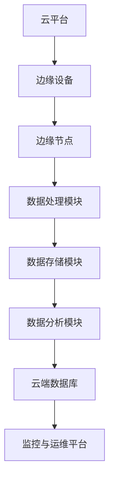
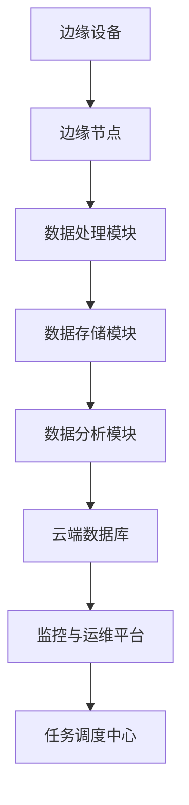
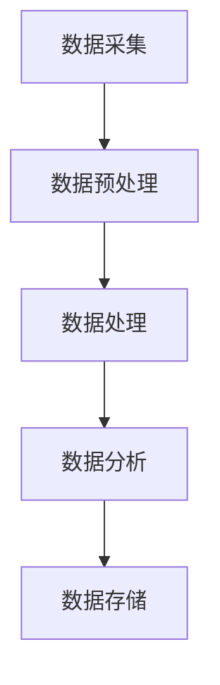
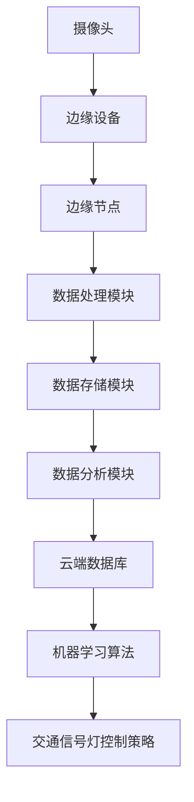

                 

###  让我们一起深入思考：云边协同计算在实时业务处理中的应用

在信息技术迅速发展的今天，实时业务处理成为许多企业和组织的核心需求。随着云计算、物联网和边缘计算等技术的发展，传统的中心化计算模式已经无法满足大规模、低延迟和高可靠性的要求。因此，云边协同计算作为一种新兴的技术架构，逐渐受到关注。本文旨在通过对云边协同计算在实时业务处理中的应用进行深入分析，探讨其核心概念、算法原理、系统架构及实战应用，为读者提供一套完整的理解和实践框架。

###  关键词

- 云边协同计算
- 实时业务处理
- 云计算
- 边缘计算
- 分布式计算
- 任务调度
- 数据传输
- 算法优化

###  摘要

本文首先介绍了云边协同计算的背景和核心问题，并明确了其目标和边界。接着，我们详细阐述了云计算、边缘计算和云边协同计算的基本原理，并通过对比分析，揭示了它们在性能和效率上的优势。随后，文章深入探讨了分布式计算算法、边缘计算算法和云边协同计算算法，给出了具体的实现方法和优化策略。在此基础上，我们通过系统分析与架构设计，构建了一个完整的云边协同计算系统，并介绍了其实战应用。最后，本文总结了最佳实践、注意事项和拓展阅读，为读者提供了深入学习和实际操作的方向。

### 第1章：云边协同计算概述

#### 1.1 问题背景

随着互联网和物联网的快速发展，数据的规模和种类日益增长。传统中心化计算模式依赖于大规模数据中心，通过集中处理海量数据，虽然在处理能力和存储能力上取得了巨大的进展，但在应对实时业务处理时，仍然面临诸多挑战。首先，中心化计算模式的数据传输距离较长，导致处理延迟较高。其次，随着数据量的增加，中心服务器的负载也在不断攀升，可能导致系统性能下降。此外，中心化计算模式在安全性、可靠性和灵活性方面也存在一定限制。为了解决这些问题，云边协同计算作为一种新型的计算架构，逐渐受到关注。

#### 1.2 问题描述

云边协同计算旨在通过云计算和边缘计算的结合，实现数据的存储、处理和分析。在这种架构下，云计算提供强大的计算资源，边缘计算则负责处理靠近数据源的任务，从而降低数据传输距离，提高系统响应速度。然而，云边协同计算在实际应用中仍然面临以下问题：

1. **数据传输效率**：如何优化数据在云端和边缘节点之间的传输，减少传输延迟？
2. **任务调度策略**：如何根据数据处理需求和网络状况，实现任务在云端和边缘节点的最优调度？
3. **资源管理**：如何优化资源分配，提高系统性能和效率？
4. **安全性保障**：如何保障数据在传输和处理过程中的安全性？

#### 1.3 问题解决

为了解决上述问题，云边协同计算采用了以下几种策略：

1. **分布式计算**：通过在边缘节点部署计算任务，减轻中心服务器的负载，提高处理效率。
2. **数据传输优化**：采用边缘缓存、数据压缩等技术，优化数据传输效率。
3. **任务调度优化**：根据数据处理需求和网络状况，动态调度任务到合适的节点。
4. **资源管理**：通过智能算法，优化资源分配，提高系统性能和效率。
5. **安全性保障**：采用加密、签名等技术，保障数据在传输和处理过程中的安全性。

#### 1.4 边界与外延

云边协同计算的边界主要涉及云计算和边缘计算的技术实现、网络架构、数据传输和隐私保护等方面。具体包括：

1. **云计算实现**：包括计算资源、存储资源和网络资源的管理与调度。
2. **边缘计算实现**：包括边缘节点的部署、边缘设备的配置和边缘计算任务的执行。
3. **网络架构**：包括云边网络连接、边缘网络拓扑和数据传输路径选择。
4. **数据传输**：包括数据传输协议、传输优化技术和数据传输安全保障。
5. **隐私保护**：包括数据加密、签名和访问控制等技术。

云边协同计算的外延则包括实时业务处理的应用场景、性能优化策略和安全性保障等。具体包括：

1. **应用场景**：如智能交通、智慧城市、工业物联网等，不同应用场景对实时业务处理的要求和挑战不同。
2. **性能优化策略**：如负载均衡、缓存策略、数据压缩等，用于提高系统性能和效率。
3. **安全性保障**：如数据加密、访问控制、恶意攻击检测等，用于保障系统的安全运行。

#### 1.5 概念结构与核心要素组成

云边协同计算的核心概念和要素组成如下：

1. **云计算**：提供海量计算资源、存储资源和网络资源，实现弹性扩展和按需分配。
2. **边缘计算**：在靠近数据源的地方进行数据处理，减少数据传输延迟，提高系统响应速度。
3. **云边协同架构**：通过边缘节点和云端节点的协同工作，实现数据处理、传输和分析的优化。
4. **实时业务处理**：通过云边协同计算模式，实现低延迟、高效率的业务处理。

在云边协同计算中，云计算和边缘计算相互协作，共同完成数据处理任务。云计算提供强大的计算资源和存储资源，负责处理大规模数据和复杂计算任务；边缘计算则负责处理靠近数据源的任务，如实时数据分析、本地决策等，通过减少数据传输距离，提高系统响应速度。

#### 1.6 云计算原理

云计算是一种基于互联网的计算模式，通过分布式计算资源和存储资源，实现计算任务的分布式处理。云计算的核心原理如下：

1. **计算资源**：云计算提供计算资源，如CPU、GPU、FPGA等，用户可以根据需要灵活分配和使用这些资源。
2. **存储资源**：云计算提供存储资源，如云硬盘、对象存储等，用户可以方便地存储和访问数据。
3. **网络资源**：云计算提供网络资源，如VPC（虚拟私有云）、VPN（虚拟专用网络）等，用于保障数据的安全传输。
4. **弹性扩展**：云计算可以根据用户需求，动态调整计算资源和存储资源，实现弹性扩展和按需分配。
5. **分布式计算**：云计算通过分布式计算框架，如MapReduce、Spark等，实现大规模数据的处理和分析。

在云计算中，用户不需要关心底层硬件设施和运维管理，只需关注业务应用的开发和部署。云计算具有高可用性、高可靠性、高扩展性和低成本等优势，广泛应用于企业级应用、大数据处理、人工智能等领域。

#### 1.7 边缘计算原理

边缘计算是一种在靠近数据源的地方进行数据处理和计算的架构，通过分布式计算资源和存储资源，实现数据处理、分析和决策的本地化。边缘计算的核心原理如下：

1. **边缘节点**：边缘计算在边缘节点部署计算任务，如物联网设备、边缘服务器等，这些节点靠近数据源，可以快速响应数据请求。
2. **边缘设备**：边缘计算通过边缘设备，如传感器、摄像头等，采集和传输数据到边缘节点。
3. **分布式计算**：边缘计算通过分布式计算框架，如边缘计算框架、容器编排等，实现数据的分布式处理和分析。
4. **数据处理**：边缘计算在边缘节点进行数据处理，如实时数据分析、本地决策等，减少数据传输延迟，提高系统响应速度。
5. **存储资源**：边缘计算提供存储资源，如边缘硬盘、对象存储等，用于存储和处理数据。

边缘计算具有低延迟、高可靠性和高效率等优势，广泛应用于物联网、智能交通、工业物联网等领域。通过边缘计算，可以实现数据在本地进行处理和分析，减少数据传输距离，降低网络带宽消耗，提高系统性能和响应速度。

#### 1.8 云边协同架构

云边协同架构是将云计算和边缘计算相结合，通过分布式计算架构实现数据的存储、处理和分析。云边协同架构的核心原理如下：

1. **数据传输**：通过云边网络连接，实现云端和边缘节点的数据传输和共享。
2. **任务调度**：根据数据处理需求和网络状况，动态调度任务到合适的节点。
3. **资源管理**：通过智能算法，优化资源分配，提高系统性能和效率。
4. **协同工作**：云端和边缘节点协同工作，共同完成数据处理任务。

在云边协同架构中，云计算提供强大的计算资源和存储资源，边缘计算则负责处理靠近数据源的任务。通过云边协同计算，可以实现数据的分布式处理和分析，提高系统性能和响应速度。云边协同架构具有高可用性、高可靠性和高扩展性等优势，广泛应用于实时业务处理、大数据处理、人工智能等领域。

### 第2章：云边协同计算的核心概念

#### 2.1 云计算原理

云计算是一种基于互联网的计算模式，通过分布式计算资源和存储资源，实现计算任务的分布式处理。云计算的核心原理包括以下几个方面：

1. **计算资源**：云计算提供计算资源，如CPU、GPU、FPGA等，用户可以根据需要灵活分配和使用这些资源。计算资源可以是虚拟机、容器等形式，用户可以按需分配和释放资源，实现弹性扩展。

2. **存储资源**：云计算提供存储资源，如云硬盘、对象存储等，用户可以方便地存储和访问数据。存储资源具有高可用性、高可靠性和高扩展性等特点，可以满足不同规模和类型的存储需求。

3. **网络资源**：云计算提供网络资源，如VPC（虚拟私有云）、VPN（虚拟专用网络）等，用于保障数据的安全传输。网络资源可以实现跨地域、跨网络的连接，为用户提供安全、可靠的网络服务。

4. **分布式计算**：云计算通过分布式计算框架，如MapReduce、Spark等，实现大规模数据的处理和分析。分布式计算可以将计算任务分解成多个子任务，分布到不同的计算节点上执行，从而提高计算效率和性能。

5. **弹性扩展**：云计算可以根据用户需求，动态调整计算资源和存储资源，实现弹性扩展和按需分配。当用户需求增加时，云计算可以自动增加资源；当用户需求减少时，云计算可以自动释放资源，实现资源的优化利用。

6. **自动化管理**：云计算提供自动化管理工具，如云监控、云运维等，用于监控和管理计算资源和存储资源。用户可以通过这些工具实现资源监控、故障排查、自动扩缩容等功能，提高系统的可靠性和可用性。

云计算具有高可用性、高可靠性、高扩展性和低成本等优势，广泛应用于企业级应用、大数据处理、人工智能等领域。通过云计算，用户可以方便地获取和使用计算资源，降低IT成本，提高业务效率。

#### 2.2 边缘计算原理

边缘计算是一种在靠近数据源的地方进行数据处理和计算的架构，通过分布式计算资源和存储资源，实现数据处理、分析和决策的本地化。边缘计算的核心原理包括以下几个方面：

1. **边缘节点**：边缘计算在边缘节点部署计算任务，如物联网设备、边缘服务器等，这些节点靠近数据源，可以快速响应数据请求。边缘节点具有高带宽、低延迟的特点，可以满足实时业务处理的需求。

2. **边缘设备**：边缘计算通过边缘设备，如传感器、摄像头等，采集和传输数据到边缘节点。边缘设备可以实时采集环境数据，如温度、湿度、图像等，并将数据传输到边缘节点进行处理和分析。

3. **分布式计算**：边缘计算通过分布式计算框架，如边缘计算框架、容器编排等，实现数据的分布式处理和分析。分布式计算可以将计算任务分解成多个子任务，分布到不同的边缘节点上执行，从而提高计算效率和性能。

4. **数据处理**：边缘计算在边缘节点进行数据处理，如实时数据分析、本地决策等，减少数据传输延迟，提高系统响应速度。边缘节点可以实时处理和响应数据，实现本地化的数据处理和分析。

5. **存储资源**：边缘计算提供存储资源，如边缘硬盘、对象存储等，用于存储和处理数据。边缘存储资源具有高可用性、高可靠性和高扩展性等特点，可以满足不同规模和类型的存储需求。

6. **边缘网络**：边缘计算通过边缘网络，实现边缘节点之间的数据传输和通信。边缘网络可以提供高速、稳定的网络连接，保障数据在边缘节点之间的实时传输。

边缘计算具有低延迟、高可靠性和高效率等优势，广泛应用于物联网、智能交通、工业物联网等领域。通过边缘计算，可以实现数据在本地进行处理和分析，减少数据传输距离，降低网络带宽消耗，提高系统性能和响应速度。

#### 2.3 云边协同架构

云边协同架构是将云计算和边缘计算相结合，通过分布式计算架构实现数据的存储、处理和分析。云边协同架构的核心原理包括以下几个方面：

1. **数据传输**：通过云边网络连接，实现云端和边缘节点的数据传输和共享。云边网络连接可以提供高速、稳定的网络连接，保障数据在云端和边缘节点之间的实时传输。

2. **任务调度**：根据数据处理需求和网络状况，动态调度任务到合适的节点。任务调度可以根据数据传输延迟、计算资源利用率等因素，选择最优的节点进行任务执行，从而提高系统性能和效率。

3. **资源管理**：通过智能算法，优化资源分配，提高系统性能和效率。资源管理可以根据实际需求，动态调整云计算和边缘计算资源的分配，实现资源的优化利用。

4. **协同工作**：云端和边缘节点协同工作，共同完成数据处理任务。云端提供强大的计算资源和存储资源，边缘节点负责处理靠近数据源的任务，通过协同工作，可以实现数据的分布式处理和分析。

5. **实时业务处理**：通过云边协同计算模式，实现低延迟、高效率的业务处理。云边协同计算可以将数据处理任务分布到云端和边缘节点，实现实时业务处理，满足大规模、低延迟和高可靠性的需求。

云边协同架构具有高可用性、高可靠性和高扩展性等优势，广泛应用于实时业务处理、大数据处理、人工智能等领域。通过云边协同架构，可以实现数据在云端和边缘节点之间的实时传输和处理，提高系统性能和响应速度，满足不同应用场景的需求。

### 第3章：云边协同计算的算法原理

#### 3.1 分布式计算算法

分布式计算算法是云边协同计算的核心组成部分，旨在通过分布式计算框架实现大规模数据的处理和分析。以下介绍几种常见的分布式计算算法：

1. **MapReduce**

MapReduce是一种基于数据并行处理的分布式计算算法，由Google提出。它将大规模数据处理任务分解为Map（映射）和Reduce（归约）两个阶段。

- **Map阶段**：输入数据被分割成多个小块，每个小块由一个Map任务处理。Map任务对输入数据进行处理，输出中间键值对。
- **Reduce阶段**：中间键值对被分组，并根据相同的键进行归约操作，生成最终的输出结果。

MapReduce算法具有高扩展性、高可用性和高容错性等特点，广泛应用于大数据处理、数据挖掘、机器学习等领域。

2. **Spark**

Spark是一种基于内存计算的分布式计算框架，由Apache基金会开发。与MapReduce相比，Spark具有更高的数据处理速度和更好的性能。

- **Spark Core**：提供基本的分布式计算功能，如内存管理、任务调度和存储等。
- **Spark SQL**：提供数据处理和分析功能，支持结构化数据查询和分析。
- **Spark Streaming**：提供实时数据处理和分析功能，支持实时流数据处理。
- **MLlib**：提供机器学习算法库，支持各种机器学习任务的实现。

Spark算法通过内存计算和基于数据并行处理的方式，实现了大规模数据的快速处理和分析。

#### 3.2 边缘计算算法

边缘计算算法是在边缘节点进行的计算任务，旨在处理靠近数据源的任务，减少数据传输延迟。以下介绍几种常见的边缘计算算法：

1. **边缘感知**

边缘感知算法通过边缘设备实时采集数据，并在边缘节点进行实时分析和决策。以下是一个简单的边缘感知算法示例：

- **数据采集**：边缘设备（如传感器、摄像头等）实时采集环境数据。
- **预处理**：对采集到的数据进行预处理，如去噪、滤波等。
- **特征提取**：从预处理后的数据中提取关键特征。
- **实时分析**：使用机器学习算法对特征进行实时分析，做出决策或预测。

边缘感知算法具有低延迟、高可靠性和高效率等特点，广泛应用于智能交通、智能安防、智能制造等领域。

2. **边缘推理**

边缘推理算法在边缘节点进行数据预处理和模型推理，旨在减少数据传输延迟，提高系统响应速度。以下是一个简单的边缘推理算法示例：

- **数据预处理**：在边缘节点对采集到的数据进行预处理，如去噪、滤波等。
- **模型推理**：使用预先训练好的机器学习模型，对预处理后的数据进行推理，得到预测结果。
- **决策执行**：根据预测结果，执行相应的决策或操作。

边缘推理算法具有低延迟、高可靠性和高效率等特点，广泛应用于自动驾驶、智能家居、工业物联网等领域。

#### 3.3 云边协同算法

云边协同算法是云边协同计算的关键组成部分，旨在优化数据传输和任务调度，提高系统性能和效率。以下介绍几种常见的云边协同算法：

1. **数据传输优化**

数据传输优化算法通过优化数据在云端和边缘节点之间的传输，减少传输延迟，提高传输效率。以下是一个简单的数据传输优化算法示例：

- **边缘缓存**：在边缘节点部署缓存，缓存常用的数据，减少数据重复传输。
- **数据压缩**：对传输的数据进行压缩，减少传输数据量。
- **数据传输优先级**：根据数据的重要性和紧急程度，设置数据传输的优先级。

2. **任务调度优化**

任务调度优化算法通过优化任务在云端和边缘节点的调度，提高系统性能和效率。以下是一个简单的任务调度优化算法示例：

- **负载均衡**：根据云计算和边缘节点的负载情况，动态调整任务的分配，实现负载均衡。
- **任务优先级**：根据任务的紧急程度和重要性，设置任务的优先级，优先调度高优先级任务。
- **任务迁移**：根据任务执行情况和网络状况，动态迁移任务到更适合的节点执行。

云边协同算法具有优化数据传输和任务调度的功能，广泛应用于实时业务处理、大数据处理、人工智能等领域。

### 第4章：云边协同计算系统分析与架构设计

#### 4.1 系统功能设计

云边协同计算系统功能设计主要包括数据采集、数据处理、数据分析和数据存储等方面。以下是具体的系统功能设计：

1. **数据采集**：通过边缘设备和传感器实时采集数据，如环境参数、设备状态等。数据采集模块需要支持多种数据源，包括物联网设备、摄像头、传感器等。

2. **数据处理**：对采集到的数据进行预处理、过滤和清洗，去除无效数据，提取有用信息。数据处理模块需要支持数据转换、去噪、滤波等功能，为数据分析和决策提供高质量的数据。

3. **数据分析**：对处理后的数据进行分析和挖掘，提取有价值的信息和知识。数据分析模块需要支持多种数据分析方法，如统计分析、机器学习、深度学习等。

4. **数据存储**：将处理后的数据存储到数据库或数据湖中，以供后续查询和分析。数据存储模块需要支持大规模数据的存储和管理，包括数据备份、恢复、安全等功能。

#### 4.2 系统架构设计

云边协同计算系统架构设计主要包括云计算层、边缘计算层和数据传输层等方面。以下是具体的系统架构设计：

1. **云计算层**：云计算层提供计算资源和存储资源，包括虚拟机、容器、数据库等。云计算层需要支持大规模数据的高效处理和分析，实现任务的弹性调度和资源优化。

2. **边缘计算层**：边缘计算层包括边缘节点和边缘设备，负责处理靠近数据源的任务，如实时数据分析和本地决策。边缘计算层需要支持低延迟、高可靠性的数据处理和通信。

3. **数据传输层**：数据传输层负责实现云端和边缘节点之间的数据传输和共享，包括网络连接、数据传输协议和数据加密等。数据传输层需要保障数据的高效传输和安全性。

以下是一个简化的云边协同计算系统架构图：



#### 4.3 系统接口设计

系统接口设计主要包括API接口、消息队列和数据库接口等方面。以下是具体的系统接口设计：

1. **API接口**：提供数据采集、数据处理、数据分析和数据存储的API接口，实现不同模块之间的通信。API接口需要支持多种编程语言和协议，如HTTP、RESTful API、WebSocket等。

2. **消息队列**：使用消息队列（如Kafka、RabbitMQ等）实现数据传输和任务调度，提高系统的可靠性和效率。消息队列可以保证数据的一致性和顺序性，支持高并发、低延迟的数据传输。

3. **数据库接口**：提供数据库操作接口，实现数据的存储和管理。数据库接口需要支持多种数据库（如MySQL、MongoDB、Redis等），支持数据备份、恢复和安全等功能。

#### 4.4 系统交互

系统交互主要包括数据流和任务流等方面。以下是具体的系统交互设计：

1. **数据流**：数据从边缘设备采集后，经过边缘节点预处理，然后传输到云端进行处理和分析。数据流需要支持数据的实时传输和批量处理，保证数据的一致性和可靠性。

2. **任务流**：任务从云端调度到边缘节点执行，包括数据采集、数据处理、数据分析和数据存储等任务。任务流需要支持任务的动态调度和负载均衡，保证系统的性能和效率。

以下是一个简化的云边协同计算系统交互图：



### 第5章：云边协同计算项目实战

#### 5.1 环境安装

在进行云边协同计算项目实战之前，首先需要搭建云平台和边缘设备环境。以下是一个简化的环境安装步骤：

1. **云平台安装**：安装并配置云计算平台，如AWS、Azure等。选择合适的服务器实例、网络和存储资源，并配置相关安全措施。

2. **边缘设备安装**：选择合适的边缘设备，如树莓派、边缘服务器等。安装操作系统（如Ubuntu、CentOS等），并配置网络和设备驱动。

3. **边缘计算框架安装**：在边缘设备上安装边缘计算框架，如Kubernetes、Docker等。配置边缘节点的计算资源和网络连接，并部署相关的计算任务。

4. **云边网络连接**：配置云平台和边缘设备之间的网络连接，如VPN、SSH等。确保云端和边缘节点之间的网络连接稳定、可靠。

#### 5.2 系统核心实现

系统核心实现主要包括数据采集、数据处理、数据分析和数据存储等模块。以下是一个简化的系统核心实现步骤：

1. **数据采集**：使用传感器或边缘设备采集实时数据，如温度、湿度、图像等。将采集到的数据上传到边缘节点，进行预处理和存储。

2. **数据处理**：在边缘节点对采集到的数据进行预处理、过滤和清洗，提取有用信息。将处理后的数据上传到云端，进行进一步处理和分析。

3. **数据分析**：在云端对处理后的数据进行分析和挖掘，提取有价值的信息和知识。将分析结果存储到数据库或数据湖中，供后续查询和分析。

4. **数据存储**：使用数据库或数据湖存储处理后的数据，包括实时数据和历史数据。配置数据备份和恢复策略，确保数据的安全性和可靠性。

以下是一个简化的系统核心实现流程图：



#### 5.3 代码应用解读与分析

在系统核心实现过程中，涉及多种编程语言和技术框架。以下是一个简化的代码应用解读与分析：

1. **边缘设备代码**：边缘设备使用C/C++、Python等编程语言编写，采集实时数据，并上传到边缘节点。以下是一个简单的Python代码示例：

```python
import serial
import time

ser = serial.Serial('/dev/ttyUSB0', 9600)  # 配置串口通信参数

while True:
    data = ser.readline()  # 读取串口数据
    print(data)  # 打印数据
    time.sleep(1)  # 等待1秒
```

2. **边缘节点代码**：边缘节点使用Python、Go等编程语言编写，接收边缘设备上传的数据，进行预处理和存储。以下是一个简单的Python代码示例：

```python
import requests
import json
import time

url = "http://edge-node:8000/collect"  # 配置边缘节点API地址

while True:
    data = {"temperature": 25, "humidity": 60}  # 模拟采集的数据
    headers = {'Content-Type': 'application/json'}
    response = requests.post(url, data=json.dumps(data), headers=headers)
    print(response.text)  # 打印API响应结果
    time.sleep(1)  # 等待1秒
```

3. **云端代码**：云端使用Java、Python等编程语言编写，接收边缘节点上传的数据，进行进一步处理和分析。以下是一个简单的Python代码示例：

```python
import json
import requests

url = "http://cloud-node:8000/analyze"  # 配置云端API地址

data = {"temperature": 25, "humidity": 60}  # 模拟上传的数据
headers = {'Content-Type': 'application/json'}
response = requests.post(url, data=json.dumps(data), headers=headers)
print(response.text)  # 打印API响应结果
```

通过以上代码示例，可以看出边缘设备和边缘节点、边缘节点和云端之间的数据传输和任务执行过程。在实际应用中，需要根据具体业务需求和系统架构，编写更复杂的代码和应用逻辑。

#### 5.4 实际案例分析和详细讲解

在实际应用中，云边协同计算在实时业务处理中具有广泛的应用场景。以下是一个简化的实际案例分析和详细讲解：

**案例背景**：某智能交通系统通过云边协同计算实现实时交通流量监测和路况预测。

1. **数据采集**：在交通路口和路段部署边缘设备和传感器，如摄像头、流量传感器等。边缘设备实时采集交通流量数据、车辆速度、道路拥堵情况等。

2. **数据处理**：边缘节点对接收到的数据进行预处理、过滤和清洗，提取有用的交通流量信息。将预处理后的数据上传到云端，进行进一步处理和分析。

3. **数据分析**：云端使用机器学习算法对交通流量数据进行分析，预测未来一段时间内的交通流量和路况。根据预测结果，生成交通信号灯控制策略，优化交通流量。

4. **数据存储**：将实时交通流量数据和历史交通流量数据存储到数据库或数据湖中，供后续查询和分析。

以下是一个简化的实际案例流程图：



通过以上实际案例分析和详细讲解，可以看出云边协同计算在实时业务处理中的应用流程和关键步骤。在实际应用中，需要根据具体业务需求和系统架构，设计合适的云边协同计算系统和算法。

### 第6章：最佳实践与注意事项

#### 6.1 最佳实践

1. **合理划分数据传输优先级**：根据数据的重要性和紧急程度，合理划分数据传输的优先级，优先传输关键数据，提高系统响应速度。

2. **优化边缘计算资源分配**：合理分配边缘计算资源，避免资源浪费和性能瓶颈。根据实际需求和负载情况，动态调整边缘节点的计算资源。

3. **采用分布式存储方案**：采用分布式存储方案，提高数据存储的可靠性和性能。根据数据特点和需求，选择合适的存储方案，如分布式数据库、分布式文件系统等。

4. **保障数据安全性**：采用加密、签名、访问控制等技术，保障数据在传输和处理过程中的安全性。定期进行安全审计和风险评估，确保系统安全。

5. **采用智能调度算法**：采用智能调度算法，根据数据处理需求和网络状况，动态调度任务到合适的节点，提高系统性能和效率。

#### 6.2 注意事项

1. **数据同步与一致性**：在云边协同计算中，数据同步与一致性是关键问题。需要确保数据在不同节点之间的同步和一致性，避免数据丢失或冲突。

2. **边缘计算性能瓶颈**：边缘计算设备的计算能力和存储能力有限，可能存在性能瓶颈。需要合理规划和配置边缘计算资源，避免性能瓶颈。

3. **网络稳定性与延迟**：边缘计算依赖于网络连接，网络稳定性与延迟对系统性能有重要影响。需要确保网络连接的稳定性和低延迟，避免网络故障影响系统运行。

4. **安全性风险**：云边协同计算涉及数据传输和处理，存在安全性风险。需要采用安全措施，确保数据在传输和处理过程中的安全性，防止数据泄露或篡改。

5. **维护与监控**：云边协同计算系统需要定期进行维护和监控，及时发现和处理问题。制定合理的维护计划，确保系统稳定运行。

### 第7章：拓展阅读

为了进一步深入了解云边协同计算在实时业务处理中的应用，以下推荐一些相关的文献和资料：

1. **《云边协同计算：架构与应用》**：介绍了云边协同计算的基本概念、架构设计和应用案例，适合初学者和从业者阅读。

2. **《边缘计算技术与应用》**：详细介绍了边缘计算的基本原理、技术和应用场景，包括物联网、智能交通、工业物联网等领域。

3. **《大数据处理与云计算》**：介绍了大数据处理和云计算的基本概念、技术和应用，包括分布式计算、存储和优化策略等。

4. **《实时数据流处理技术》**：详细介绍了实时数据流处理的基本原理、算法和框架，包括Flink、Spark Streaming等。

5. **《人工智能与深度学习》**：介绍了人工智能和深度学习的基本原理、算法和应用，包括神经网络、卷积神经网络、递归神经网络等。

通过阅读这些文献和资料，可以进一步深入了解云边协同计算在实时业务处理中的应用和技术细节，为实际项目提供参考和指导。

