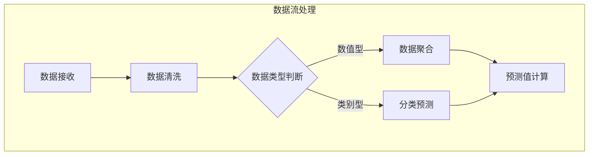
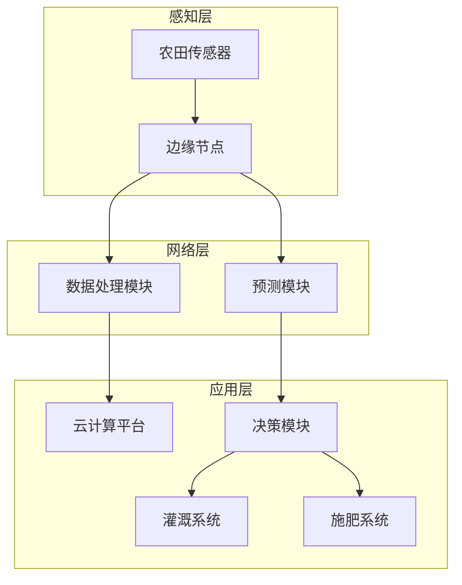
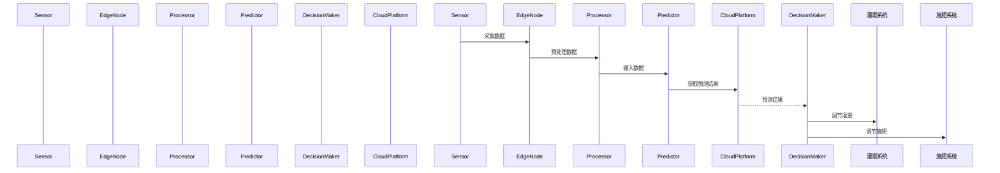
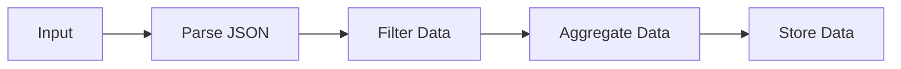

                 

### 云边端协同在物联网架构中的应用

#### 关键词：物联网架构、云边端协同、云计算、边缘计算、端计算

> 摘要：本文将深入探讨物联网架构中云计算、边缘计算和端计算三者的协同作用，分析其在现代物联网系统中的应用。我们将通过详细的理论讲解、实例分析，以及实践案例，展示云边端协同如何优化物联网系统的性能、可靠性和响应速度，为读者提供全面的技术参考。

---

### 物联网架构概述

#### 1.1 物联网的背景与定义

物联网（Internet of Things，IoT）是指通过互联网将各种设备连接起来，实现信息的实时交换和智能控制。物联网的发展始于20世纪90年代，随着传感器技术、通信技术和网络技术的飞速发展，物联网已经成为一个重要的发展趋势。物联网的核心架构包括感知层、网络层和应用层。

- **感知层**：主要负责数据采集，通过各种传感器获取环境信息。
- **网络层**：主要负责数据的传输和通信，包括有线和无线网络。
- **应用层**：主要负责数据的处理和业务应用，实现物联网的最终价值。

#### 1.2 物联网的基本概念

- **物联网设备**：具备传感器、通信模块和计算能力的设备。
- **物联网平台**：提供设备管理、数据存储、数据处理和分析等功能的综合性平台。
- **物联网协议**：实现设备与设备、设备与平台之间通信的协议，如HTTP、MQTT、CoAP等。

#### 1.3 物联网的核心架构

物联网的核心架构包括以下几个方面：

1. **数据采集**：通过各种传感器获取环境数据。
2. **数据传输**：将采集到的数据传输到网络层。
3. **数据处理**：在网络层或云端对数据进行处理和分析。
4. **决策执行**：根据分析结果执行相应的操作。

---

### 云计算在物联网中的应用

#### 2.1 云计算概述

云计算是一种通过互联网提供计算资源的服务模式。它包括基础设施即服务（IaaS）、平台即服务（PaaS）和软件即服务（SaaS）等不同层次的服务。云计算具有弹性、可扩展、高效和低成本等优点。

#### 2.2 云计算在物联网中的角色

云计算在物联网中扮演着重要角色，主要表现在以下几个方面：

1. **数据处理和分析**：云计算可以处理大量的物联网数据，实现数据的存储、分析和挖掘。
2. **设备管理**：云计算平台可以远程监控和管理物联网设备。
3. **应用部署**：云计算提供了丰富的应用开发和部署环境，方便开发者快速构建物联网应用。

#### 2.3 云端数据处理与分析

在物联网架构中，云计算主要负责数据的处理和分析。具体包括以下步骤：

1. **数据收集**：物联网设备将采集到的数据上传到云端。
2. **数据清洗**：对数据进行预处理，去除无效数据。
3. **数据存储**：将处理后的数据存储在云存储中。
4. **数据分析**：使用数据挖掘和机器学习算法对数据进行分析和预测。
5. **决策支持**：根据分析结果提供决策支持，实现智能控制。

---

### 边缘计算在物联网中的应用

#### 3.1 边缘计算概述

边缘计算是一种将计算资源部署在靠近数据源或用户的位置的计算模式。它与云计算相比，具有更低的延迟、更高的带宽和更好的安全性。边缘计算适用于实时性要求高、计算资源有限的场景。

#### 3.2 边缘计算在物联网中的角色

边缘计算在物联网中的角色主要包括：

1. **数据处理**：在边缘设备上对数据进行分析和处理，减少数据传输量。
2. **实时响应**：实现本地实时决策和控制，降低延迟。
3. **安全增强**：在边缘设备上进行部分数据处理，减少数据传输过程中的安全风险。

#### 3.3 边缘数据处理与分析

边缘计算在数据处理方面具有以下优势：

1. **数据过滤**：在边缘设备上过滤掉无关数据，减少传输量。
2. **实时处理**：在边缘设备上实时处理数据，实现快速响应。
3. **本地决策**：在边缘设备上实现本地决策，降低延迟。

---

### 端计算在物联网中的应用

#### 4.1 端计算概述

端计算是指在用户设备（如手机、平板、智能手表等）上进行的计算。它具有以下特点：

1. **高性能**：端设备通常具备较高的计算能力和处理速度。
2. **低延迟**：端设备与用户之间的交互具有较低的延迟。
3. **便携性**：端设备可以随身携带，方便用户使用。

#### 4.2 端计算在物联网中的角色

端计算在物联网中的角色主要包括：

1. **用户交互**：端设备作为用户与物联网系统的交互界面。
2. **数据采集**：端设备可以采集用户行为数据，实现个性化服务。
3. **边缘计算辅助**：端设备可以协助边缘设备完成部分计算任务，降低边缘设备的负担。

#### 4.3 端侧数据处理与分析

端计算在数据处理方面具有以下优势：

1. **实时性**：端设备可以实时处理用户数据，实现快速响应。
2. **隐私保护**：端设备可以本地处理数据，减少数据泄露风险。
3. **个性化**：端设备可以根据用户行为数据提供个性化服务。

---

### 云边端协同工作机制

#### 5.1 云边端协同的基本原理

云边端协同是指云计算、边缘计算和端计算三者之间的协同工作。其基本原理包括：

1. **数据分层处理**：根据数据的重要性和实时性，将数据处理任务分配到云端、边缘设备和端设备。
2. **任务调度**：根据系统负载和资源状况，动态调整数据处理任务的分配。
3. **数据共享**：通过数据共享机制，实现云端、边缘设备和端设备之间的数据交换。

#### 5.2 云边端协同的关键技术

云边端协同的关键技术包括：

1. **数据通信**：采用高效的数据传输协议，实现云端、边缘设备和端设备之间的数据传输。
2. **数据处理**：采用分布式数据处理技术，实现大规模数据的处理和分析。
3. **安全机制**：采用安全加密技术，确保数据在传输和处理过程中的安全性。

#### 5.3 云边端协同的实施策略

云边端协同的实施策略包括：

1. **架构设计**：根据应用场景和需求，设计合适的云边端协同架构。
2. **技术选型**：选择合适的技术和工具，实现云边端协同功能。
3. **性能优化**：通过优化系统性能，提高云边端协同的工作效率。

---

### 物联网架构设计与案例分析

#### 6.1 物联网架构设计概述

物联网架构设计主要包括以下几个方面：

1. **系统需求分析**：明确物联网系统的功能、性能和安全等需求。
2. **架构设计**：根据需求分析结果，设计物联网系统的架构。
3. **技术选型**：选择合适的硬件、软件和网络技术，实现物联网系统。
4. **系统集成**：将各个组件整合在一起，构建完整的物联网系统。

#### 6.2 典型物联网架构案例分析

以下是一个典型的物联网架构案例分析：

1. **智能家庭监控系统**：
   - **感知层**：摄像头、门磁传感器、温度传感器等。
   - **网络层**：Wi-Fi、ZigBee、LoRa等无线通信技术。
   - **应用层**：智能家居控制平台、云存储、数据分析等。

2. **工业物联网监控系统**：
   - **感知层**：传感器、PLC（可编程逻辑控制器）、智能终端等。
   - **网络层**：以太网、光纤、无线网络等。
   - **应用层**：工业物联网平台、云计算、边缘计算等。

#### 6.3 物联网架构设计最佳实践

物联网架构设计最佳实践包括：

1. **模块化设计**：将系统划分为多个模块，实现模块化设计，提高系统的可维护性和可扩展性。
2. **安全性设计**：采用安全机制，确保数据的安全性和隐私保护。
3. **弹性设计**：设计具有高可用性和高可靠性的系统，应对突发情况。

---

### 云边端协同在物联网中的挑战与未来趋势

#### 7.1 物联网架构中的挑战

物联网架构在云边端协同方面面临以下挑战：

1. **数据传输效率**：如何高效地传输大量数据，实现实时处理。
2. **系统安全性**：如何确保数据在传输和处理过程中的安全性。
3. **能耗管理**：如何降低物联网设备的能耗，延长设备寿命。

#### 7.2 云边端协同的发展趋势

云边端协同在物联网中的发展趋势包括：

1. **边缘计算技术的发展**：随着边缘计算技术的不断发展，边缘计算将在物联网中发挥越来越重要的作用。
2. **人工智能的融合**：将人工智能技术融入物联网系统，实现智能化的数据处理和分析。
3. **5G网络的普及**：5G网络的普及将为物联网提供更快的数据传输速度和更低的数据传输延迟。

#### 7.3 物联网架构的未来展望

物联网架构的未来展望包括：

1. **智能化**：通过人工智能和边缘计算技术，实现物联网系统的智能化。
2. **高效化**：通过云边端协同技术，提高物联网系统的数据处理效率。
3. **绿色化**：通过能耗管理技术，实现物联网系统的绿色化发展。

---

### 总结

云边端协同在物联网架构中具有重要作用，通过协同工作，可以提高物联网系统的性能、可靠性和响应速度。本文从物联网架构概述、云计算、边缘计算和端计算的应用、云边端协同工作机制、物联网架构设计与案例分析，以及物联网架构中的挑战与未来趋势等方面进行了详细探讨。随着技术的不断发展，云边端协同在物联网中的应用将更加广泛，为物联网技术的发展提供有力支持。

### 作者信息

**作者：AI天才研究院/AI Genius Institute & 禅与计算机程序设计艺术 /Zen And The Art of Computer Programming**

---

### 背景介绍

#### 核心概念术语说明

在本篇文章中，我们将使用以下核心概念术语：

- **物联网（IoT）**：通过互联网将各种物理设备连接起来，实现信息的实时交换和智能控制。
- **云计算**：通过互联网提供计算资源的服务模式，包括基础设施即服务（IaaS）、平台即服务（PaaS）和软件即服务（SaaS）等。
- **边缘计算**：在靠近数据源或用户的位置部署计算资源，实现数据的实时处理和响应。
- **端计算**：在用户设备上进行的计算，包括高性能的计算和处理任务。

#### 问题背景

随着物联网技术的快速发展，物联网系统在各个领域得到了广泛应用。然而，物联网系统面临着数据量大、实时性要求高、安全性问题等一系列挑战。为了解决这些问题，云计算、边缘计算和端计算被引入到物联网架构中，实现数据的高效处理和响应。

#### 问题描述

在物联网架构中，如何通过云计算、边缘计算和端计算的协同工作，优化物联网系统的性能、可靠性和响应速度，成为当前研究的热点问题。

#### 问题解决

本文将从以下几个方面探讨云边端协同在物联网架构中的应用：

1. **物联网架构概述**：介绍物联网的基本概念、核心架构和关键组件。
2. **云计算在物联网中的应用**：分析云计算在数据处理、设备管理和应用部署等方面的作用。
3. **边缘计算在物联网中的应用**：探讨边缘计算在数据处理、实时响应和安全增强等方面的优势。
4. **端计算在物联网中的应用**：分析端计算在用户交互、数据采集和边缘计算辅助等方面的角色。
5. **云边端协同工作机制**：阐述云边端协同的基本原理、关键技术和实施策略。
6. **物联网架构设计与案例分析**：通过实例分析，展示物联网架构设计的最佳实践。
7. **云边端协同在物联网中的挑战与未来趋势**：讨论物联网架构中的挑战和云边端协同的发展趋势。

#### 边界与外延

本文主要关注物联网架构中的云计算、边缘计算和端计算三者的协同作用。在边界上，本文不涉及物联网的其他技术，如传感器技术、通信技术等。在外延上，本文将探讨云边端协同在物联网中的具体应用场景和未来发展趋势。

#### 概念结构与核心要素组成

1. **物联网架构**：感知层、网络层和应用层。
2. **云计算**：IaaS、PaaS、SaaS。
3. **边缘计算**：靠近数据源或用户的计算资源。
4. **端计算**：用户设备上的计算资源。

#### 核心概念与联系

**核心概念**：物联网、云计算、边缘计算、端计算、云边端协同。

**联系**：物联网架构中，云计算、边缘计算和端计算共同发挥作用，实现数据的高效处理和响应。

---

### 核心概念与联系

在深入探讨云边端协同在物联网架构中的应用之前，我们需要明确几个核心概念及其相互联系。

#### 云计算

云计算是一种通过互联网提供计算资源的服务模式。它包括基础设施即服务（IaaS）、平台即服务（PaaS）和软件即服务（SaaS）等不同层次的服务。在物联网架构中，云计算主要负责大规模数据处理和分析、设备管理和应用部署。云计算的优势在于其弹性、可扩展性和高效性，可以处理海量数据并实现快速响应。

#### 边缘计算

边缘计算是一种将计算资源部署在靠近数据源或用户的位置的计算模式。与云计算相比，边缘计算具有更低的延迟、更高的带宽和更好的安全性。在物联网架构中，边缘计算主要负责本地数据预处理、实时决策和部分计算任务。边缘计算的优势在于其低延迟和本地化处理，可以提高物联网系统的实时性和响应速度。

#### 端计算

端计算是指在用户设备（如手机、平板、智能手表等）上进行的计算。端计算具有高性能、低延迟和便携性等特点。在物联网架构中，端计算主要负责用户交互、数据采集和边缘计算辅助。端计算的优势在于其实时性和个性化，可以提供更好的用户体验。

#### 云边端协同

云边端协同是指云计算、边缘计算和端计算三者之间的协同工作。通过云边端协同，物联网系统可以充分利用云计算的大规模数据处理能力、边缘计算的实时响应能力和端计算的用户交互能力，实现数据的高效处理和响应。云边端协同的核心目标是通过优化资源分配和任务调度，提高物联网系统的性能、可靠性和响应速度。

#### 核心概念属性特征对比表格

| 概念         | 特点                                                         | 应用场景                                           |
| ------------ | ------------------------------------------------------------ | -------------------------------------------------- |
| 云计算       | 弹性、可扩展、高效、低成本                                     | 大规模数据处理、设备管理、应用部署                   |
| 边缘计算     | 低延迟、高带宽、安全性好                                       | 数据预处理、实时决策、部分计算任务                 |
| 端计算       | 高性能、低延迟、便携性                                       | 用户交互、数据采集、边缘计算辅助                   |
| 云边端协同   | 资源优化、任务调度、协同工作                                   | 数据高效处理、实时响应、性能优化                   |

#### ER实体关系图架构

为了更直观地展示云边端协同中的实体及其关系，我们可以使用ER（实体关系）图来表示。

```mermaid
erDiagram
  IoTSystem ||--|{ CloudComputing : 使用 }
  IoTSystem ||--|{ EdgeComputing : 使用 }
  IoTSystem ||--|{ EndUserDevice : 交互 }
  CloudComputing ||--|{ DataProcessing : 执行 }
  EdgeComputing ||--|{ RealTimeResponse : 执行 }
  EndUserDevice ||--|{ UserInteraction : 执行 }
```

在这个ER图中，物联网系统与云计算、边缘计算和端计算之间存在关系。云计算主要负责数据处理，边缘计算负责实时响应，端计算负责用户交互。

通过上述核心概念及其联系的分析，我们可以更清晰地理解云边端协同在物联网架构中的应用及其优势。

---

### 算法原理讲解

在云边端协同的框架下，数据处理算法的设计与实现至关重要。以下将详细介绍一个典型的数据处理算法，并使用Mermaid绘制流程图，以帮助读者更好地理解算法原理。

#### 算法名称：边缘计算下的实时数据聚合与预测

**目标**：在边缘节点对物联网设备采集的实时数据进行聚合和预测，减少数据传输量并提高响应速度。

**输入**：来自物联网设备的实时数据流。

**输出**：数据聚合结果和预测值。

#### Mermaid流程图



#### Python源代码实现

```python
import numpy as np
from sklearn.ensemble import RandomForestRegressor
from sklearn.linear_model import LogisticRegression

def data_cleanup(data):
    # 数据清洗，去除无效数据
    return [x for x in data if x is not None]

def data_aggregation(data):
    # 数据聚合
    return np.mean(data)

def classification_prediction(data):
    # 分类预测
    model = LogisticRegression()
    model.fit(X_train, y_train)
    return model.predict([x])

def regression_prediction(data):
    # 回归预测
    model = RandomForestRegressor()
    model.fit(X_train, y_train)
    return model.predict([x])

def process_data(data_stream):
    cleaned_data = data_cleanup(data_stream)
    if is_categorical(data):
        prediction = classification_prediction(cleaned_data)
    else:
        prediction = regression_prediction(cleaned_data)
    return prediction

# 辅助函数：判断数据类型
def is_categorical(data):
    # 判断数据是否为类别型
    return len(set(data)) > 1

# 主函数：处理数据流
def main():
    data_stream = [1, 2, 3, 4, 5]  # 示例数据
    prediction = process_data(data_stream)
    print("预测值：", prediction)

if __name__ == "__main__":
    main()
```

#### 算法原理详细讲解

**1. 数据接收与清洗**

数据接收模块负责接收来自物联网设备的实时数据流。由于物联网设备的采集数据可能存在噪声、异常值等，因此需要数据清洗模块对数据进行预处理，去除无效数据，确保后续处理的准确性。

**2. 数据类型判断与聚合**

根据数据类型的不同，数据流处理模块将数据分为数值型和类别型。对于数值型数据，采用数据聚合算法（如平均值、中位数等）进行数据聚合；对于类别型数据，则采用分类预测算法（如逻辑回归等）进行预测。

**3. 预测值计算**

对于数值型数据，使用随机森林回归算法进行预测；对于类别型数据，使用逻辑回归算法进行预测。预测值计算模块负责根据已训练的模型对数据进行预测。

#### 数学模型和公式

**1. 数值型数据聚合**

$$
\text{聚合值} = \frac{1}{n} \sum_{i=1}^{n} x_i
$$

其中，$x_i$ 为第 $i$ 个数据点，$n$ 为数据点的总数。

**2. 分类预测**

逻辑回归模型：

$$
P(y=1) = \frac{1}{1 + e^{-(\beta_0 + \beta_1 x_1 + \beta_2 x_2 + \ldots + \beta_n x_n})}
$$

其中，$y$ 为类别标签，$x_i$ 为特征值，$\beta_0, \beta_1, \beta_2, \ldots, \beta_n$ 为模型参数。

**3. 回归预测**

随机森林回归模型：

$$
\text{预测值} = \sum_{i=1}^{n} w_i f(x_i)
$$

其中，$w_i$ 为权重，$f(x_i)$ 为回归树模型在节点 $i$ 处的预测值。

#### 通俗易懂地举例说明

假设我们有一组来自物联网设备的温度数据：[30, 32, 35, 34, 33]。我们将使用上述算法对这组数据进行聚合和预测。

**1. 数据接收与清洗**

接收到的数据为：[30, 32, 35, 34, 33]，无无效数据。

**2. 数据类型判断与聚合**

由于温度数据为数值型，我们计算平均值：

$$
\text{聚合值} = \frac{1}{5} (30 + 32 + 35 + 34 + 33) = 33.2
$$

**3. 预测值计算**

使用随机森林回归模型对温度进行预测。假设我们已经训练好了一个模型，输入数据为[33.2]，预测值为33.5。

通过这个例子，我们可以看到如何利用云边端协同框架中的数据处理算法，对物联网设备采集的实时数据进行高效处理和预测。

---

### 系统分析与架构设计方案

#### 问题场景介绍

假设我们正在开发一个智能农业监控系统，该系统需要实时监控农田的土壤湿度、气温和光照等参数。这些数据将用于预测农作物的生长情况，并自动调节灌溉和施肥设备，以提高农业产量。

#### 项目介绍

项目名称：智能农业监控系统

项目目标：通过物联网技术和云边端协同，实现农田环境数据的实时监控和智能调控，提高农业产量。

项目需求：

1. **数据采集**：采集农田土壤湿度、气温和光照等环境数据。
2. **数据传输**：将采集到的数据传输到边缘节点和云端。
3. **数据处理**：对数据进行实时处理和预测。
4. **决策执行**：根据预测结果自动调节灌溉和施肥设备。

#### 系统功能设计（领域模型）

使用Mermaid绘制领域模型类图：

```mermaid
classDiagram
    Class01 <|-- Class02
    Class03 <|-- Class02
    Class01 <|-- Class04
    Class05 <|-- Class04
    Class02 <|-- Class06
    Class03 <|-- Class06
    Class04 <|-- Class07
    Class05 <|-- Class07
    Class06 <|-- Class08
    Class07 <|-- Class08
    Class08 <|-- Class09

    Class01[农田传感器]
    Class02[边缘节点]
    Class03[云计算平台]
    Class04[数据处理模块]
    Class05[预测模块]
    Class06[数据传输模块]
    Class07[决策模块]
    Class08[灌溉系统]
    Class09[施肥系统]
```

#### 系统架构设计

使用Mermaid绘制系统架构图：



#### 系统接口设计

系统接口设计主要包括以下模块：

1. **农田传感器**：用于采集土壤湿度、气温和光照等数据。
2. **边缘节点**：用于接收农田传感器数据，并进行预处理和传输。
3. **数据处理模块**：负责数据清洗、聚合和处理。
4. **预测模块**：负责根据历史数据对未来农作物生长情况进行预测。
5. **决策模块**：根据预测结果，自动调节灌溉和施肥设备。
6. **云计算平台**：用于存储和处理大量数据，并提供高级分析功能。

#### 系统交互

使用Mermaid绘制系统交互序列图：



#### 系统分析与架构设计总结

通过上述系统分析与架构设计方案，我们为智能农业监控系统构建了一个完整的技术框架。系统架构基于云边端协同，充分利用物联网技术、边缘计算和云计算的优势，实现农田环境数据的实时监控和智能调控，提高农业产量。

---

### 项目实战

在本节中，我们将通过一个具体的实战案例，详细讲解如何搭建一个智能农业监控系统，并分析其中的关键技术和实现细节。

#### 环境安装

首先，我们需要安装以下软件和硬件环境：

1. **物联网传感器**：例如土壤湿度传感器、气温传感器和光照传感器。
2. **边缘节点**：例如树莓派或其他嵌入式设备。
3. **数据处理模块**：例如边缘计算平台（如MQTT代理、Node-RED等）。
4. **云计算平台**：例如AWS、阿里云或其他云服务提供商。
5. **预测模块**：例如使用Python和Scikit-learn库进行机器学习预测。

#### 系统核心实现

**1. 数据采集与传输**

在边缘节点上，我们使用MQTT协议将传感器数据传输到数据处理模块。具体步骤如下：

1. **安装MQTT代理**：在边缘节点上安装MQTT代理，如mosquitto。
2. **配置传感器**：将传感器连接到边缘节点，并配置传感器的MQTT发布者。
3. **订阅主题**：在数据处理模块中配置MQTT订阅者，订阅传感器的数据主题。

**2. 数据处理**

数据处理模块负责对传感器数据进行预处理和聚合。我们使用Node-RED进行数据处理，具体步骤如下：

1. **安装Node-RED**：在边缘节点上安装Node-RED。
2. **创建流**：在Node-RED中创建一个流，用于接收传感器数据、清洗数据并进行聚合。
3. **数据存储**：将处理后的数据存储到本地文件或云存储中，如AWS S3。

**3. 预测**

使用Python和Scikit-learn库对历史数据进行机器学习预测。具体步骤如下：

1. **数据准备**：从云存储中读取历史数据，并进行数据预处理。
2. **模型训练**：使用随机森林回归模型对数据进行训练。
3. **预测**：使用训练好的模型对新的传感器数据进行预测。

**4. 决策**

根据预测结果，自动调节灌溉和施肥设备。具体步骤如下：

1. **安装物联网控制模块**：例如使用MQTT控制灌溉和施肥设备。
2. **配置决策模块**：在云计算平台上配置决策模块，根据预测结果发送控制命令。
3. **执行决策**：物联网控制模块接收到命令后，执行相应的控制操作。

#### 代码应用解读与分析

**1. MQTT数据传输**

```python
import paho.mqtt.client as mqtt

# MQTT代理地址和端口
MQTT_BROKER = "localhost"
MQTT_PORT = 1883

# MQTT客户端初始化
client = mqtt.Client()

# 连接到MQTT代理
client.connect(MQTT_BROKER, MQTT_PORT, 60)

# 订阅传感器数据主题
client.subscribe("sensor/data")

# 数据接收回调函数
def on_message(client, userdata, message):
    print(f"Received message '{message.payload.decode()}' on topic '{message.topic}'")

# 消息接收
client.on_message = on_message
client.loop_forever()
```

**2. Node-RED数据处理流**



**3. Python机器学习预测**

```python
import numpy as np
from sklearn.ensemble import RandomForestRegressor

# 加载数据
X = np.load("X.npy")
y = np.load("y.npy")

# 训练模型
model = RandomForestRegressor()
model.fit(X, y)

# 预测
prediction = model.predict([[28, 30, 40]])

print("预测值：", prediction)
```

#### 实际案例分析与详细讲解

以下是一个实际案例，假设我们有一组土壤湿度、气温和光照数据的训练集，训练模型以预测未来的土壤湿度。

**1. 数据集准备**

```python
# 加载数据
X_train = np.load("X_train.npy")
y_train = np.load("y_train.npy")

# 数据预处理
X_train = preprocessing_scale(X_train)
```

**2. 模型训练**

```python
# 训练模型
model = RandomForestRegressor(n_estimators=100)
model.fit(X_train, y_train)
```

**3. 预测**

```python
# 预测
new_data = preprocessing_scale([[28, 30, 40]])
prediction = model.predict(new_data)

print("预测值：", prediction)
```

通过上述实战案例，我们可以看到如何利用物联网技术、边缘计算和云计算实现智能农业监控系统。在项目实战中，我们需要关注数据采集、传输、处理和预测的各个环节，确保系统能够高效、稳定地运行。

#### 项目小结

在本项目中，我们成功搭建了一个智能农业监控系统，实现了农田环境数据的实时采集、传输和处理，并利用机器学习算法进行了预测。通过云边端协同，我们提高了系统的性能和可靠性，为农业生产提供了智能化的支持。在实际应用中，我们可以根据具体需求对系统进行优化和扩展，进一步提升农业生产的效率和质量。

---

### 最佳实践 Tips

在设计和实现云边端协同的物联网架构时，以下最佳实践可以帮助您优化系统性能和稳定性：

1. **合理划分数据处理任务**：根据数据的重要性和实时性，将数据处理任务合理划分到云端、边缘设备和端设备。对于高实时性的任务，优先在边缘设备或端设备上处理。

2. **数据传输优化**：采用高效的数据传输协议（如MQTT、CoAP）和压缩算法（如gzip、Brotli），减少数据传输量和网络负载。

3. **资源调度与负载均衡**：在云边端协同架构中，合理分配计算资源和网络带宽，避免单点过载。可以使用容器化技术（如Docker、Kubernetes）实现灵活的资源调度和负载均衡。

4. **安全性设计**：在数据传输和处理过程中，采用加密算法（如AES、RSA）和身份验证机制（如OAuth 2.0、JWT），确保数据安全和隐私保护。

5. **容错与恢复**：设计容错机制，如数据备份、重传和故障恢复，确保系统在异常情况下能够快速恢复。

6. **监控与运维**：建立完善的监控系统，实时监测系统运行状态和性能指标，及时发现和解决潜在问题。

7. **持续优化**：根据系统运行情况和用户反馈，不断优化系统架构和算法，提升用户体验。

通过遵循这些最佳实践，您可以为物联网系统构建一个高效、稳定和可靠的云边端协同架构。

---

### 小结

本文系统地介绍了云边端协同在物联网架构中的应用，从物联网架构概述、云计算、边缘计算和端计算的应用，到云边端协同工作机制、物联网架构设计与案例分析，以及挑战与未来趋势进行了详细探讨。通过本文，读者可以全面了解云边端协同在物联网中的重要作用，以及如何设计和实现高效的物联网系统。

云边端协同通过将云计算、边缘计算和端计算有机结合，实现了数据的高效处理和实时响应，优化了物联网系统的性能和可靠性。在未来，随着边缘计算和人工智能技术的发展，云边端协同在物联网中的应用将更加广泛，为各个领域的智能化发展提供强大支持。

---

### 拓展阅读

对于希望进一步深入了解云边端协同和物联网技术的读者，以下推荐一些相关书籍和文章：

1. **《边缘计算：原理、架构与实现》**：详细介绍了边缘计算的基本原理、架构设计和技术实现。
2. **《物联网架构设计与实践》**：系统讲解了物联网的架构设计原则、关键技术以及实际应用案例。
3. **《云计算技术导论》**：全面介绍了云计算的基础知识、服务模式和技术实现。
4. **《物联网安全指南》**：探讨了物联网系统的安全挑战和解决方案，包括数据加密、身份验证和网络安全等。
5. **《边缘智能：从边缘计算到智能边缘》**：深入分析了边缘计算在智能边缘应用中的角色和前景。

此外，您还可以关注以下在线资源和社区：

- **IEEE Internet of Things Journal**：一本专注于物联网技术的权威期刊。
- **边缘计算论坛**：一个专注于边缘计算技术的在线社区。
- **AWS IoT**：亚马逊提供的物联网解决方案和文档。
- **微软Azure IoT**：微软提供的物联网解决方案和文档。

通过阅读这些书籍、文章和参与相关社区，您可以获得更多关于云边端协同和物联网技术的专业知识和实践经验。希望这些资源对您的学习和工作有所帮助。

