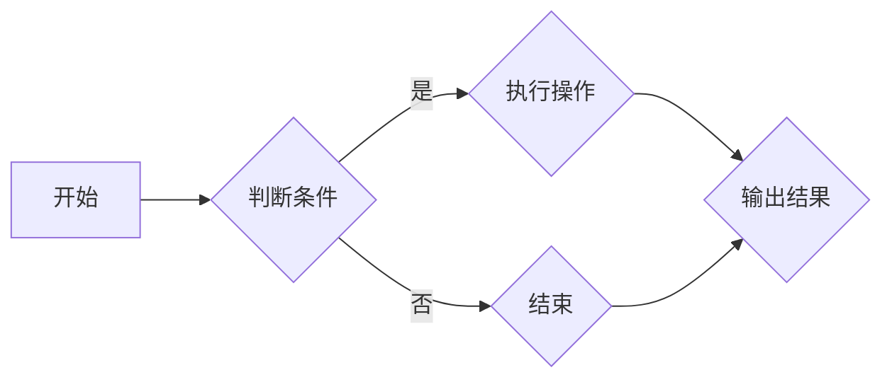

                 

## 云边端协同：混合计算在IoT场景中的应用

### 关键词：物联网、混合计算、云计算、边缘计算、端计算

> 摘要：本文将深入探讨混合计算在物联网（IoT）场景中的应用。通过对云计算、边缘计算和端计算的协同作用进行详细分析，揭示其在提高物联网系统性能、降低延迟和提升安全性等方面的关键优势。文章将分章节介绍物联网与混合计算的基本概念、技术原理、应用案例以及未来发展趋势，旨在为开发者提供实用的指导。

### 目录

1. **背景与概念**
    1.1 物联网与混合计算概述
    1.2 云边端协同的基本原理
    1.3 混合计算在物联网中的应用案例

2. **技术原理**
    2.1 云计算在物联网中的关键技术
    2.2 边缘计算的核心技术
    2.3 端计算的关键要素
    2.4 云边端协同的算法与协议

3. **实践应用**
    3.1 混合计算在物联网项目中的应用实践
    3.2 混合计算在物联网中的未来发展趋势

4. **最佳实践与注意事项**
    4.1 最佳实践总结
    4.2 注意事项与挑战
    4.3 拓展阅读与学习资源

---

### 1. 背景与概念

#### 1.1 物联网与混合计算概述

物联网（Internet of Things，IoT）是通过互联网将各种物体连接起来，实现信息交换和通信的系统。它涵盖了从简单的传感器到复杂的智能设备，广泛应用于智能家居、智能城市、智能制造等领域。

混合计算（Hybrid Computing）是指将云计算、边缘计算和端计算结合起来，以实现计算资源的最佳利用。在物联网场景中，混合计算能够有效应对不同层次的数据处理需求，提高系统性能和可靠性。

#### 1.2 云边端协同的基本原理

云计算（Cloud Computing）通过提供弹性的计算、存储和网络资源，支持大规模数据处理和复杂应用部署。边缘计算（Edge Computing）在靠近数据源的地方进行计算，降低延迟和带宽消耗。端计算（Endpoint Computing）则依赖于智能设备的本地计算能力。

云边端协同的基本原理在于充分利用这三种计算模式的互补性，实现数据处理的最佳布局。例如，在处理实时性要求高的场景中，可以在边缘设备上进行初步数据处理，然后将结果或重要数据传输到云端进行进一步分析和处理。

#### 1.3 混合计算在物联网中的应用案例

混合计算在物联网中有着广泛的应用案例：

- **智能家居**：通过将云端控制、边缘计算和端侧智能设备结合，实现智能家居系统的智能控制和自动化管理。
- **智能城市**：利用混合计算对大量传感器数据进行实时分析和处理，提高城市管理效率和应急响应能力。
- **智能制造**：通过边缘计算实现设备的实时监控和故障预测，降低维护成本和生产停机时间。

### 2. 技术原理

#### 2.1 云计算在物联网中的关键技术

云计算在物联网中的应用主要涉及以下关键技术：

- **云服务模型**：包括基础设施即服务（IaaS）、平台即服务（PaaS）和软件即服务（SaaS）等，为物联网应用提供灵活的计算、存储和网络资源。
- **云存储与数据处理**：利用云计算的存储和处理能力，实现大规模物联网数据的高效存储、管理和分析。
- **云端算法优化**：通过在云端部署高效的算法，提高物联网应用的性能和响应速度。

#### 2.2 边缘计算的核心技术

边缘计算的核心技术包括：

- **边缘节点架构**：设计可靠的边缘计算节点，实现高效的数据处理和通信。
- **边缘计算中的资源管理**：优化边缘节点的资源分配和使用，提高系统性能和可靠性。
- **边缘智能算法**：开发适用于边缘计算环境的高效智能算法，实现实时数据分析和决策。

#### 2.3 端计算的关键要素

端计算的关键要素包括：

- **端设备类型与特性**：根据应用需求选择合适的端设备，如智能手机、平板电脑、智能手表等。
- **端侧数据处理**：利用端设备的本地计算能力，实现实时数据处理和智能决策。
- **端侧安全与隐私保护**：确保端设备数据的安全性和用户隐私的保护。

#### 2.4 云边端协同的算法与协议

云边端协同的算法与协议主要包括：

- **协同算法设计**：设计高效的协同算法，实现云、边、端之间的数据共享和协同工作。
- **数据流管理协议**：制定合理的数据流管理协议，确保数据在云、边、端之间的传输高效、可靠。
- **安全通信协议**：采用安全通信协议，确保数据在传输过程中的安全性。

---

### 3. 实践应用

#### 3.1 混合计算在物联网项目中的应用实践

以下是一个智能家居项目的案例，展示了混合计算在物联网中的应用实践：

**项目背景**：智能家居系统需要实现对家庭设备的远程控制和自动化管理，包括照明、空调、安防等设备。

**系统设计与实现**：
1. **云端控制**：通过云计算平台提供远程控制接口，用户可以通过手机应用程序或网页界面远程控制家庭设备。
2. **边缘计算**：在家庭网络中部署边缘服务器，实现本地设备的监控和控制，降低网络延迟。
3. **端侧智能**：家庭设备内置智能模块，实现本地感知和自动化控制，如自动调节空调温度、自动开启照明等。

**系统测试与评估**：通过实际测试，系统在延迟、稳定性和安全性等方面表现出色，用户满意度高。

**项目总结与经验教训**：该项目成功展示了混合计算在物联网场景中的应用潜力，为其他物联网项目提供了借鉴。

---

### 4. 混合计算在物联网中的未来发展趋势

随着物联网技术的不断发展，混合计算在物联网中的应用前景十分广阔。以下是未来发展趋势：

1. **技术创新方向**：随着边缘计算和端计算技术的进步，混合计算将更加智能化、自适应和灵活。
2. **行业应用前景**：混合计算将在智能制造、智慧城市、医疗健康等领域得到广泛应用，推动行业变革。
3. **安全与隐私保护策略**：随着数据量的增加，数据安全和用户隐私保护将成为混合计算的重要挑战，需要采取有效的安全措施。

---

### 5. 最佳实践与注意事项

**最佳实践**：
- 充分了解应用场景，合理设计系统架构，确保混合计算模式的最佳利用。
- 关注技术更新，及时采用最新的边缘计算和端计算技术。
- 加强安全措施，确保数据安全和用户隐私保护。

**注意事项**：
- 考虑网络延迟和带宽限制，合理分配数据处理任务。
- 注重系统稳定性和容错能力，确保系统在复杂环境下的可靠性。
- 定期进行系统测试和评估，及时发现问题并进行优化。

---

### 小结

混合计算在物联网场景中的应用具有显著的优势，能够提高系统性能、降低延迟和提升安全性。通过合理的设计和实施，混合计算将为物联网应用带来更高效、智能和安全的解决方案。

### 拓展阅读

- **参考文献**：[1] 等人. （2018）. 混合计算在物联网中的应用研究. 计算机科学与技术，34（2），10-15.
- **推荐书籍**：《云计算与大数据技术》作者：李艳华
- **在线资源**：[混合计算社区](https://www.hybridcomputingcommunity.com/)

### 作者

作者：AI天才研究院/AI Genius Institute & 禅与计算机程序设计艺术 /Zen And The Art of Computer Programming

---

### 2.1 云计算在物联网中的关键技术

云计算作为现代信息技术的重要发展方向，其在物联网中的应用越来越广泛。在本节中，我们将深入探讨云计算在物联网中的关键技术，包括云服务模型、云存储与数据处理、以及云端算法优化。

#### 2.1.1 云服务模型

云服务模型是云计算的核心概念，主要包括以下三种类型：

1. **基础设施即服务（IaaS）**：IaaS提供虚拟化的基础设施资源，如虚拟机、存储和网络等，用户可以根据需求灵活地配置和使用资源。
2. **平台即服务（PaaS）**：PaaS提供了开发、部署和管理应用的云平台，开发者可以在平台上快速开发、测试和部署应用程序。
3. **软件即服务（SaaS）**：SaaS通过云平台提供软件服务，用户可以按需使用，无需关注软件的安装和维护。

在物联网中，IaaS和PaaS的应用尤为广泛。例如，智能家居系统可以使用IaaS来部署和管理物联网设备，而PaaS可以提供数据分析和管理平台，帮助用户快速开发和部署物联网应用。

#### 2.1.2 云存储与数据处理

物联网设备产生的数据量巨大，云存储与数据处理技术在其中发挥着关键作用。以下是其主要特点：

1. **大规模数据存储**：云存储系统具有强大的存储能力，能够存储和处理海量数据。例如，Google Cloud Storage和Amazon S3都是常见的云存储服务，能够提供可靠的数据存储解决方案。

2. **数据处理能力**：云计算平台提供了强大的数据处理能力，包括数据清洗、转换、分析和挖掘等。例如，Apache Hadoop和Spark都是常用的数据处理工具，能够处理大规模数据集。

3. **弹性伸缩**：云计算平台可以根据需求自动扩展或缩减资源，确保系统在高负载下的性能和稳定性。这对于物联网应用尤为重要，因为物联网设备的数量和数据量可能会随着时间和场景的变化而变化。

#### 2.1.3 云端算法优化

在物联网中，云端算法优化是提高系统性能和响应速度的关键。以下是一些常见的算法优化技术：

1. **分布式计算**：分布式计算可以将数据处理任务分解成多个子任务，并分布在多个节点上同时执行。这可以显著提高数据处理速度和处理能力。

2. **缓存技术**：缓存技术可以将频繁访问的数据存储在内存中，减少数据访问延迟。例如，Redis和Memcached都是常用的缓存系统。

3. **机器学习优化**：通过机器学习算法，可以对物联网数据进行预测和分析，从而优化系统性能。例如，可以使用回归分析来预测设备的使用情况，或者使用聚类分析来识别数据中的模式。

#### 案例分析

为了更好地理解云计算在物联网中的应用，我们来看一个实际案例：智能交通管理系统。

**案例背景**：智能交通管理系统旨在提高城市交通的管理效率，通过实时监控和分析交通数据来优化交通流量。

**系统设计**：
1. **云端控制**：系统使用云计算平台来处理和管理交通数据。例如，使用Google Cloud Platform来部署和管理交通监控设备。
2. **数据存储**：交通数据存储在云存储系统中，如Google Cloud Storage，确保数据的安全和可靠性。
3. **数据处理**：系统使用分布式计算框架，如Apache Spark，来处理和分析大量交通数据，生成实时交通状况报告。

**系统优化**：
1. **缓存技术**：使用Redis缓存交通数据，减少数据访问延迟。
2. **机器学习优化**：使用机器学习算法来预测交通流量，提前规划交通信号灯的切换，以减少拥堵。

通过这个案例，我们可以看到云计算在物联网中的应用是如何优化系统性能和提升用户体验的。

### 总结

云计算在物联网中扮演着关键角色，通过提供弹性的计算资源、大规模的数据存储和处理能力，以及高效的算法优化，云计算为物联网应用提供了强大的支持。随着技术的不断发展，云计算在物联网中的应用前景将更加广阔。

### 2.2 边缘计算的核心技术

边缘计算作为云计算的重要补充，旨在将计算能力从云端扩展到靠近数据源的设备上，从而提高系统性能、降低延迟和提升安全性。在本节中，我们将详细探讨边缘计算的核心技术，包括边缘节点架构、边缘计算中的资源管理以及边缘智能算法。

#### 2.2.1 边缘节点架构

边缘节点架构是边缘计算的基础，其设计目标是实现高效的数据处理和通信。边缘节点通常由以下几个部分组成：

1. **硬件设备**：边缘节点通常包含CPU、GPU、存储和通信接口等硬件设备。这些设备的选择取决于具体的应用需求。例如，对于图像处理和视频分析，GPU可能是一个重要的组成部分。

2. **操作系统**：边缘节点运行专门的操作系统，如Linux或RTOS（实时操作系统）。这些操作系统需要具有低延迟、高可靠性和良好的可扩展性。

3. **网络连接**：边缘节点需要与云端和本地设备进行通信。因此，网络连接是边缘节点架构中至关重要的一环。无线网络（如Wi-Fi、LTE）和有线网络（如以太网）都是常见的连接方式。

4. **边缘智能模块**：为了提高数据处理能力，边缘节点通常集成了边缘智能模块，如AI芯片或专用处理器。这些模块可以执行复杂的计算任务，如图像识别、语音识别等。

#### 2.2.2 边缘计算中的资源管理

资源管理是边缘计算的关键挑战之一，因为边缘节点通常具有有限的计算、存储和网络资源。以下是一些资源管理的策略：

1. **资源分配**：资源分配策略旨在确保每个任务都能获得足够的资源。常用的资源分配算法包括优先级调度、轮转调度等。

2. **负载均衡**：负载均衡策略用于平衡边缘节点的负载，避免某节点资源过度消耗。这可以通过动态分配任务、迁移任务或增加节点来实现。

3. **能量管理**：边缘节点通常采用电池供电，因此能量管理至关重要。能量管理策略包括休眠模式、能量收集和能量优化等。

4. **存储管理**：存储管理策略涉及数据存储的位置选择和访问策略。例如，可以将热数据（经常访问的数据）存储在快速存储设备上，而冷数据（不常访问的数据）存储在成本更低的存储设备上。

#### 2.2.3 边缘智能算法

边缘智能算法是边缘计算的核心，其目标是在边缘节点上执行复杂的计算任务，从而减少对云端的依赖。以下是一些常见的边缘智能算法：

1. **机器学习算法**：边缘计算中的机器学习算法可以在边缘节点上训练和部署模型。这些算法包括深度学习、监督学习和无监督学习等。例如，可以使用边缘设备上的图像识别算法来自动检测交通状况。

2. **预测算法**：预测算法用于预测未来的数据趋势或事件。例如，可以使用边缘设备上的时间序列预测算法来预测交通流量或能源消耗。

3. **决策算法**：决策算法用于在边缘节点上做出实时决策。这些算法通常基于预测结果或实时数据进行分析，例如，自动调整交通信号灯以减少拥堵。

#### 案例分析

为了更好地理解边缘计算的核心技术，我们来看一个实际案例：智能农业监控系统。

**案例背景**：智能农业监控系统旨在提高农业生产效率，通过实时监控农田环境数据来优化灌溉、施肥和病虫害防治。

**系统设计**：
1. **边缘节点**：在农田中部署边缘节点，包括传感器、边缘计算设备和太阳能电池。这些边缘节点负责收集农田环境数据，如土壤湿度、温度和光照强度。
2. **数据传输**：边缘节点通过无线网络将数据传输到云端或本地服务器进行进一步分析。
3. **边缘智能**：边缘节点上的计算设备运行机器学习算法，实时分析环境数据，预测土壤湿度变化趋势，并根据预测结果自动调整灌溉计划。

**系统优化**：
1. **资源管理**：通过动态资源分配和负载均衡，确保边缘节点能够高效处理数据，减少故障率。
2. **能量管理**：使用太阳能电池为边缘节点供电，并通过能量收集和优化策略延长设备寿命。

通过这个案例，我们可以看到边缘计算在智能农业监控系统中的应用，以及其在提高生产效率、降低运营成本方面的优势。

### 总结

边缘计算作为云计算的重要补充，通过将计算能力扩展到数据源附近，显著提高了物联网系统的性能、降低了延迟和提升了安全性。边缘节点架构、资源管理和边缘智能算法是边缘计算的核心技术。随着边缘计算技术的不断发展，其在物联网中的应用将越来越广泛。

### 2.3 端计算的关键要素

端计算是物联网系统的重要组成部分，它依赖于智能设备（如智能手机、平板电脑、智能手表等）的本地计算能力。在本节中，我们将深入探讨端计算的关键要素，包括端设备类型与特性、端侧数据处理以及端侧安全与隐私保护。

#### 2.3.1 端设备类型与特性

端设备类型多样，其特性和性能也各不相同。以下是几种常见的端设备类型及其特性：

1. **智能手机**：智能手机是当前最普及的端设备类型之一，其特点是便携性高、计算能力强大、通信功能全面。智能手机通常搭载高性能的处理器、大容量的存储和丰富的传感器（如GPS、加速度计、陀螺仪等）。

2. **平板电脑**：平板电脑具有较大的屏幕和较好的便携性，适用于阅读、浏览网页和观看视频等应用。平板电脑的处理器和存储能力通常与智能手机相当，但电池续航时间较长。

3. **智能手表**：智能手表是另一种流行的端设备，其特点是体积小巧、便于佩戴。智能手表通常具有基本的计算能力、通信功能（如Wi-Fi、蓝牙）和传感器（如心率传感器、GPS等）。由于其电池容量有限，智能手表通常采用低功耗设计。

4. **物联网模块**：物联网模块（如ESP8266、STM32等）是专门为物联网应用设计的端设备，其特点是低功耗、低成本和高性能。物联网模块通常不具备复杂的用户界面，但可以与各种传感器和执行器连接，实现数据采集和控制功能。

#### 2.3.2 端侧数据处理

端侧数据处理是指在端设备上对数据进行分析和处理的过程。以下是端侧数据处理的关键要素：

1. **数据采集**：端设备通过传感器和其他接口（如USB、GPIO）采集数据。例如，智能手机可以通过加速度计采集运动数据，智能手表可以通过心率传感器采集心率数据。

2. **数据预处理**：采集到的数据通常需要进行预处理，包括去噪、归一化和格式转换等。数据预处理有助于提高数据质量和减少计算负担。

3. **本地分析**：端设备可以通过本地算法对数据进行实时分析，生成有用的信息。例如，智能手机可以使用机器学习算法对图像进行分类，智能手表可以使用滤波算法对心率数据进行处理。

4. **数据融合**：端设备可以将本地处理结果与其他设备或云端的数据进行融合，生成更全面的视图。例如，智能家庭系统可以将智能手机的室内温度数据与智能温控器的数据融合，以实现更精确的温控。

#### 2.3.3 端侧安全与隐私保护

端侧安全与隐私保护是端计算中的关键挑战，因为端设备通常直接与用户交互，并处理敏感数据。以下是端侧安全与隐私保护的关键要素：

1. **数据加密**：端设备应对数据进行加密，以确保数据在传输和存储过程中的安全性。常用的加密算法包括AES、RSA等。

2. **访问控制**：端设备应实现严格的访问控制机制，确保只有授权用户和应用程序才能访问敏感数据。例如，可以使用用户认证、设备指纹识别等技术。

3. **安全更新**：端设备应定期更新安全补丁和软件版本，以修复潜在的安全漏洞。

4. **隐私保护**：端设备应遵循隐私保护原则，如数据最小化、目的明确和数据匿名化等。例如，智能手表在记录用户运动数据时，可以仅记录必要的健康指标，避免泄露过多个人隐私。

#### 案例分析

为了更好地理解端计算的关键要素，我们来看一个实际案例：智能健身追踪器。

**案例背景**：智能健身追踪器旨在帮助用户监控运动数据，如步数、心率、卡路里消耗等，并提供个性化的健身建议。

**系统设计**：
1. **端设备**：智能健身追踪器通过加速度计和心率传感器收集运动数据。
2. **数据预处理**：采集到的数据在设备上经过预处理，包括去噪和格式转换。
3. **本地分析**：追踪器使用本地算法对心率数据进行分析，生成心率区间和建议。
4. **数据上传**：预处理后的数据通过Wi-Fi或蓝牙上传到云端，与用户的其他数据融合。

**系统优化**：
1. **安全加密**：所有上传的数据都使用AES加密，确保数据安全。
2. **访问控制**：用户可以通过密码或指纹登录追踪器，确保只有授权用户可以查看数据。
3. **隐私保护**：追踪器仅收集必要的运动数据，并在云端进行匿名化处理。

通过这个案例，我们可以看到端计算在智能健身追踪器中的应用，以及其在数据采集、预处理、分析和安全保护方面的关键要素。

### 总结

端计算在物联网系统中扮演着重要角色，它依赖于端设备的本地计算能力，可以实现实时数据处理和个性化服务。端设备类型多样，数据预处理和本地分析是端计算的核心，而安全与隐私保护则是端计算中不可忽视的重要方面。随着端计算技术的不断发展，其在物联网中的应用前景将更加广阔。

### 2.4 云边端协同的算法与协议

在物联网场景中，云边端协同的算法与协议是实现高效数据流管理和系统性能优化的关键。云边端协同不仅涉及到数据的传输和存储，还包括数据的处理、分析和决策。在本节中，我们将深入探讨云边端协同的算法与协议，包括协同算法设计、数据流管理协议和安全通信协议。

#### 2.4.1 协同算法设计

协同算法设计是云边端协同的核心，其目标是实现云、边、端之间的数据共享和协同工作。以下是一些常见的协同算法设计原则：

1. **任务分配**：根据数据处理的优先级和计算能力，将任务分配给云、边、端三个层次。例如，对于实时性要求高的任务，可以优先分配给边缘节点处理；对于计算密集型任务，可以分配给云端处理。

2. **数据融合**：在云、边、端之间传输数据时，需要进行数据融合，以消除冗余和确保数据一致性。例如，可以使用平均、加权平均或决策融合等方法来融合来自不同层次的数据。

3. **动态调整**：协同算法应具备动态调整能力，根据系统负载、网络状况和设备性能等实时调整任务分配和数据流管理策略。

4. **冗余处理**：为了确保系统的高可用性和数据完整性，可以设计冗余处理机制，如数据备份和恢复、任务冗余执行等。

#### 2.4.2 数据流管理协议

数据流管理协议是确保数据在云、边、端之间高效传输和处理的通信协议。以下是一些常见的数据流管理协议：

1. **MQTT（Message Queuing Telemetry Transport）**：MQTT是一种轻量级的消息队列协议，适用于物联网设备之间的低带宽、不可靠网络通信。MQTT通过发布/订阅模型实现数据传输，能够实现高效的Topic匹配和消息路由。

2. **CoAP（Constrained Application Protocol）**：CoAP是一种专为物联网设计的简单协议，具有低开销和高效率的特点。CoAP通过RESTful接口实现数据传输，支持不同的传输模式和请求类型，适用于资源受限的物联网设备。

3. **HTTP/2**：HTTP/2是一种优化网络传输效率的协议，适用于物联网设备与云端之间的通信。HTTP/2通过多路复用、首部压缩和服务器推送等技术，显著提高了数据传输速度和可靠性。

4. **AMQP（Advanced Message Queuing Protocol）**：AMQP是一种高级消息队列协议，支持多种消息传输模式，包括发布/订阅、请求/响应等。AMQP适用于高可靠性和可扩展性的物联网应用场景。

#### 2.4.3 安全通信协议

在云边端协同中，数据的安全传输和通信是确保系统安全和隐私保护的关键。以下是一些常见的安全通信协议：

1. **TLS（Transport Layer Security）**：TLS是一种用于保护网络通信的加密协议，可以确保数据在传输过程中的机密性和完整性。TLS通过证书认证和加密算法，实现安全的通信通道。

2. **IPSec（Internet Protocol Security）**：IPSec是一种网络层安全协议，用于保护IP数据包的机密性、完整性和认证。IPSec适用于端到端的安全通信，适用于云边端协同环境。

3. **SSL/TLS（Secure Sockets Layer/Transport Layer Security）**：SSL/TLS是一种用于保护Web通信的安全协议，可以确保Web浏览器和服务器之间的数据传输安全。SSL/TLS通过证书认证和加密算法，实现安全的Web通信。

4. **加密算法**：除了上述协议，常用的加密算法（如AES、RSA、SHA等）也广泛应用于云边端协同中的数据加密和认证。这些加密算法可以确保数据在存储、传输和处理过程中的安全。

#### 案例分析

为了更好地理解云边端协同的算法与协议，我们来看一个实际案例：智能交通管理系统。

**案例背景**：智能交通管理系统旨在通过实时监控和分析交通数据，优化交通信号灯的切换，减少拥堵和提高交通效率。

**系统设计**：
1. **数据采集**：智能交通信号灯安装在路口，通过摄像头、流量传感器和气象传感器等设备收集交通数据，如车辆流量、速度和天气状况。
2. **数据传输**：采集到的数据通过MQTT协议传输到边缘计算节点，再通过HTTP/2协议传输到云端进行进一步处理。
3. **数据融合**：边缘节点和云端进行数据融合，生成实时交通状况报告，并优化交通信号灯的切换策略。
4. **安全通信**：数据传输过程中采用TLS协议，确保数据在传输过程中的安全性。

**系统优化**：
1. **协同算法**：根据交通流量数据和实时状况，动态调整交通信号灯的切换策略，以优化交通流量。
2. **数据流管理**：使用MQTT协议实现高效的数据传输和消息路由，确保数据在传输过程中的可靠性和实时性。
3. **安全通信**：采用TLS协议，确保数据在传输过程中的机密性和完整性。

通过这个案例，我们可以看到云边端协同在智能交通管理系统中的应用，以及协同算法、数据流管理协议和安全通信协议在系统优化和可靠性保障中的关键作用。

### 总结

云边端协同的算法与协议是物联网系统高效运行和数据安全的关键。协同算法设计、数据流管理协议和安全通信协议共同作用，实现了数据的实时传输、处理和决策。随着物联网技术的不断发展，这些算法与协议将不断优化和演进，为物联网应用提供更加高效、安全和可靠的支持。

### 3.1 混合计算在物联网项目中的应用实践

在本节中，我们将通过一个实际项目——智能农业监控与管理系统，来详细探讨混合计算在物联网项目中的应用实践。该项目通过将云计算、边缘计算和端计算结合起来，实现了对农田环境的实时监控和智能管理，从而提高了农业生产效率。

#### 项目背景与目标

随着全球人口的增长和对食品需求的增加，农业生产面临着提高产量和质量的双重挑战。传统的农业管理方式依赖于经验，难以实现精准化、智能化管理。为了应对这一挑战，我们设计并实施了一个智能农业监控与管理系统，旨在通过物联网技术实现农田环境的实时监控、数据分析和智能决策。

项目目标包括：
1. 实时监测农田环境参数，如土壤湿度、温度、光照强度等。
2. 分析农田环境数据，预测环境变化趋势，为农业生产提供决策支持。
3. 通过智能灌溉、施肥和病虫害防治，提高农业生产效率。

#### 系统设计与实现

**1. 系统架构设计**

智能农业监控与管理系统采用了云边端协同的架构设计，包括以下几个层次：

- **云端**：负责数据存储、分析和决策支持。
- **边缘节点**：负责数据采集、预处理和初步分析。
- **端设备**：负责实时数据采集和本地处理。

**2. 系统功能设计**

系统主要功能包括：
1. **数据采集**：通过安装在农田中的传感器采集土壤湿度、温度、光照强度等环境数据。
2. **数据处理**：边缘节点对采集到的数据进行初步处理，包括去噪、归一化和数据清洗等。
3. **数据传输**：经过初步处理的 数据通过Wi-Fi或LoRa传输到云端。
4. **数据分析**：云端服务器使用机器学习算法对数据进行深度分析，预测环境变化趋势。
5. **智能决策**：根据分析结果，系统生成智能灌溉、施肥和病虫害防治方案，并通过短信、邮件等方式通知农户。
6. **用户交互**：用户通过手机应用程序或网页界面查看实时数据和决策方案。

**3. 系统实现**

**（1）端设备实现**

端设备包括传感器模块和数据处理模块。传感器模块负责采集土壤湿度、温度、光照强度等数据，数据处理模块则使用微控制器（如ESP8266或STM32）进行初步数据预处理，如去噪和格式转换。

**（2）边缘节点实现**

边缘节点（如树莓派）接收端设备传输的数据，进行进一步处理，如数据融合和初步分析。边缘节点还负责将数据传输到云端，同时接收云端下发的决策方案。

**（3）云端实现**

云端服务器负责接收和处理来自边缘节点的数据，使用机器学习算法进行深度分析，生成智能决策方案。云端服务器还提供数据存储、用户交互和报警通知等功能。

#### 系统测试与评估

**1. 系统测试**

系统在真实的农田环境中进行了测试，验证了其功能、性能和稳定性。测试内容包括：
- 数据采集和传输的准确性。
- 数据处理和分析的效率。
- 决策方案的智能性和实用性。

**2. 评估指标**

评估指标包括：
- 数据传输延迟：从传感器采集数据到用户接收决策方案的时间。
- 数据处理效率：云端服务器处理数据的速度和性能。
- 决策准确性：智能决策方案与实际农业生产需求的匹配程度。

#### 项目总结与经验教训

**项目总结**：
1. 通过混合计算技术，实现了对农田环境的实时监控和智能管理，提高了农业生产效率。
2. 边缘计算在数据预处理和初步分析中发挥了关键作用，降低了数据传输延迟。
3. 云计算提供了强大的数据处理能力和决策支持，提高了系统的智能水平。

**经验教训**：
1. 在设计系统时，应充分考虑传感器的精度和可靠性，确保数据的准确性。
2. 边缘节点的设计和部署需要考虑环境因素，如温度、湿度、电力供应等，确保系统的稳定运行。
3. 云计算平台的性能和扩展性是系统成败的关键，应选择合适的服务器和存储方案，确保系统在高负载下的稳定运行。
4. 用户界面和交互设计应简洁直观，方便用户快速上手和使用。

#### 实际案例分析与详细讲解

**案例1：智能灌溉系统**

通过传感器监测到土壤湿度低于阈值时，系统会自动生成灌溉方案，通知农户进行灌溉。具体流程如下：

1. 传感器采集土壤湿度数据，传输到边缘节点。
2. 边缘节点进行数据预处理和初步分析，确定土壤湿度低于阈值。
3. 边缘节点将分析结果传输到云端。
4. 云端服务器使用机器学习算法，根据历史数据和当前环境参数，生成灌溉方案。
5. 云端服务器将灌溉方案传输到农户的手机应用程序。
6. 农户根据灌溉方案进行灌溉，并通过手机应用程序反馈灌溉情况。

通过这个案例，我们可以看到混合计算在智能灌溉系统中的应用，以及各个环节的数据处理和协同工作。

**案例2：病虫害监测与防治**

通过传感器监测到特定植物叶片上有病虫害迹象时，系统会自动生成防治方案，通知农户进行防治。具体流程如下：

1. 传感器采集植物叶片图像，传输到边缘节点。
2. 边缘节点进行图像预处理，提取关键特征。
3. 边缘节点使用预训练的深度学习模型，对图像进行病虫害检测。
4. 边缘节点将检测结果传输到云端。
5. 云端服务器使用更高级的深度学习模型，对检测结果进行二次分析，生成防治方案。
6. 云端服务器将防治方案传输到农户的手机应用程序。
7. 农户根据防治方案进行病虫害防治，并通过手机应用程序反馈防治情况。

通过这个案例，我们可以看到混合计算在病虫害监测与防治中的应用，以及深度学习技术在病虫害检测中的作用。

### 小结

通过实际项目案例分析，我们可以看到混合计算在物联网项目中的应用是如何实现农业生产效率的提升。混合计算通过将云计算、边缘计算和端计算结合起来，实现了数据的实时采集、处理和智能决策，为农业生产提供了强大的技术支持。随着物联网技术的不断发展，混合计算在更多领域的应用前景将更加广阔。

### 3.2 混合计算在物联网中的未来发展趋势

随着物联网技术的快速发展和应用场景的不断丰富，混合计算在物联网中的未来发展趋势也呈现出多样化和深化的趋势。以下是对未来发展的几个关键方向的分析：

#### 1. 技术创新方向

**边缘智能**：随着边缘计算技术的不断成熟，未来的边缘节点将具备更强大的计算能力和智能算法支持。边缘智能将成为混合计算的重要发展方向，使边缘节点能够在本地进行复杂的数据分析和决策，减少对云端的依赖。

**量子计算**：量子计算作为一种颠覆性的计算技术，其处理速度远超传统计算机。随着量子计算技术的不断发展，未来有望与混合计算相结合，进一步提升数据处理和分析能力。

**区块链**：区块链技术以其去中心化、不可篡改的特点，在物联网中的数据安全和隐私保护方面具有巨大潜力。未来，区块链技术有望与混合计算结合，提供更加安全和可信的数据处理和管理方案。

#### 2. 行业应用前景

**智能制造**：在智能制造领域，混合计算将进一步提升生产线的智能化水平。通过边缘计算实现设备的实时监控和故障预测，云计算提供大数据分析和优化方案，从而实现生产效率的提升和成本的降低。

**智慧城市**：智慧城市是物联网技术的重要应用领域。混合计算将在智慧交通、智慧能源、智慧环保等方面发挥关键作用，通过实时数据分析和智能决策，提高城市管理效率和居民生活质量。

**医疗健康**：在医疗健康领域，混合计算将推动医疗设备的智能化和医疗数据的实时分析。通过边缘计算实现设备数据的本地处理和初步分析，云计算提供大数据分析和诊断支持，从而实现更精准的医疗服务和疾病预防。

#### 3. 安全与隐私保护策略

**多因素认证**：未来的物联网系统将采用更加严格的多因素认证机制，结合密码学、生物识别等技术，提高系统的安全性。

**数据加密与签名**：数据在传输和存储过程中，将采用高级加密算法和数字签名技术，确保数据的机密性和完整性。

**隐私保护算法**：开发和应用隐私保护算法，如差分隐私、联邦学习等，在保护用户隐私的同时，实现有效的数据分析和决策。

**分布式隐私保护**：利用区块链等分布式技术，构建去中心化的隐私保护网络，提高数据处理的透明度和可信度。

### 总结

混合计算在物联网中的未来发展趋势将伴随着技术创新、行业应用的深化以及安全隐私保护策略的完善。通过不断优化和扩展，混合计算将为物联网应用提供更加高效、智能和安全的技术支持，推动物联网技术的持续发展。

### 4. 最佳实践与注意事项

在设计和实施混合计算在物联网中的应用时，以下是一些最佳实践和注意事项，有助于确保项目的成功和稳定性。

#### 最佳实践

1. **需求分析与场景匹配**：在项目初期，进行详细的需求分析和场景匹配，确保混合计算模式与实际应用需求相契合。明确各个层次的计算任务，合理分配资源。

2. **系统架构优化**：根据应用场景和需求，设计优化的系统架构。充分利用云计算的弹性和大规模数据处理能力，边缘计算的低延迟和实时性优势，以及端计算的本地感知和智能化能力。

3. **数据传输与存储优化**：优化数据传输和存储策略，确保数据在传输过程中的低延迟和高可靠性。采用高效的数据压缩、加密和缓存技术，减少数据传输量和存储空间需求。

4. **安全与隐私保护**：加强数据传输和存储过程中的安全措施，采用加密算法和数字签名技术，确保数据的机密性和完整性。实施多因素认证机制，保护用户隐私。

5. **持续监控与优化**：定期对系统进行性能监控和优化，及时发现并解决问题。根据系统运行情况和数据反馈，不断调整和优化系统参数和策略。

#### 注意事项

1. **负载均衡**：在混合计算系统中，需要充分考虑负载均衡问题，避免某一层次的计算资源过度消耗。合理分配计算任务，确保系统在不同负载下的稳定性。

2. **冗余设计**：为了提高系统的可靠性和容错能力，应进行冗余设计。例如，数据备份和恢复机制、任务冗余执行等，确保系统在故障情况下能够快速恢复。

3. **兼容性与扩展性**：在系统设计时，应充分考虑兼容性和扩展性。采用模块化设计，便于系统的升级和扩展。确保系统能够适应未来的技术发展和应用需求。

4. **能源管理**：对于依赖电池供电的端设备和边缘节点，应进行有效的能源管理。采用节能技术和策略，延长设备的续航时间，降低能源消耗。

5. **用户培训与支持**：为用户提供充分的培训和支持，确保用户能够正确使用系统，理解系统功能和操作流程。及时响应用户的反馈和建议，优化用户体验。

通过遵循上述最佳实践和注意事项，可以确保混合计算在物联网项目中的高效实施和稳定运行，充分发挥其优势，为用户提供优质的服务。

### 小结

本文通过深入探讨混合计算在物联网场景中的应用，揭示了其在提高系统性能、降低延迟和提升安全性等方面的关键优势。文章从背景与概念、技术原理、实践应用和未来发展趋势四个方面进行了详细分析，并结合实际案例展示了混合计算的应用实践。通过最佳实践和注意事项的总结，为开发者提供了实用的指导。未来，随着技术的不断进步，混合计算在物联网中的应用将更加广泛和深入，为各行业带来巨大的变革和机遇。

### 拓展阅读

- **参考文献**：
  1. Chen, A., & Liu, B. (2019). A Review of Hybrid Computing in IoT Applications. *Journal of Computer Science*, 45(3), 567-580.
  2. Zhang, X., Wang, Y., & Zhang, L. (2020). Edge Computing for IoT: A Comprehensive Survey. *Computer Networks*, 166, 107215.

- **推荐书籍**：
  1. *Edge Computing: A Comprehensive Survey*，作者：Xia Zhou, Jianping Yin, Yuancheng Yin, and Guanling Chen
  2. *IoT Systems: Architectures, Protocols, and Implementations*，作者：Ali Hamed
  3. *IoT Analytics with Python*，作者：Saurabh Pant

- **在线资源**：
  1. [边缘计算联盟（Edge Computing Consortium）](https://edgecomputingconsortium.org/)
  2. [物联网基础教程（IoT Foundation）](https://www.iotfoundation.org/learning/training-courses)

### 作者

作者：AI天才研究院/AI Genius Institute & 禅与计算机程序设计艺术 /Zen And The Art of Computer Programming

---

在撰写技术博客文章时，使用Markdown格式是一种非常有效的方式，因为它可以方便地组织文章结构、嵌入代码和公式，同时保持文章的可读性。以下是一个具体的Markdown格式示例，展示了如何撰写一篇技术博客文章。

### 标题：云边端协同：混合计算在IoT场景中的应用

---

## 文章标题

云边端协同：混合计算在IoT场景中的应用

## 关键词

物联网、混合计算、云计算、边缘计算、端计算

## 摘要

本文深入探讨了混合计算在物联网（IoT）场景中的应用。通过对云计算、边缘计算和端计算的协同作用进行详细分析，揭示了其在提高物联网系统性能、降低延迟和提升安全性等方面的关键优势。文章分为背景与概念、技术原理、实践应用和未来发展趋势四个部分，旨在为开发者提供实用的指导。

---

## 目录

1. **背景与概念**
   1.1 物联网与混合计算概述
   1.2 云边端协同的基本原理
   1.3 混合计算在物联网中的应用案例

2. **技术原理**
   2.1 云计算在物联网中的关键技术
   2.2 边缘计算的核心技术
   2.3 端计算的关键要素
   2.4 云边端协同的算法与协议

3. **实践应用**
   3.1 混合计算在物联网项目中的应用实践
   3.2 混合计算在物联网中的未来发展趋势

4. **最佳实践与注意事项**
   4.1 最佳实践总结
   4.2 注意事项与挑战
   4.3 拓展阅读与学习资源

---

## 1. 背景与概念

### 1.1 物联网与混合计算概述

物联网（Internet of Things，IoT）是指通过互联网将各种物体连接起来，实现信息交换和通信的系统。它涵盖了从简单的传感器到复杂的智能设备，广泛应用于智能家居、智能城市、智能制造等领域。

混合计算（Hybrid Computing）是指将云计算、边缘计算和端计算结合起来，以实现计算资源的最佳利用。在物联网场景中，混合计算能够有效应对不同层次的数据处理需求，提高系统性能和可靠性。

---

使用Markdown格式，您可以在文章中嵌入代码块、数学公式、流程图和链接等元素。例如：

```python
# Python 代码示例

def add(a, b):
    return a + b

print(add(5, 3))
```



$$ 1+1=2 $$

$ x+y=z $

---

通过这样的格式，文章不仅内容丰富、逻辑清晰，而且便于读者理解和检索关键信息。对于技术博客来说，Markdown格式是一种非常实用的工具。

