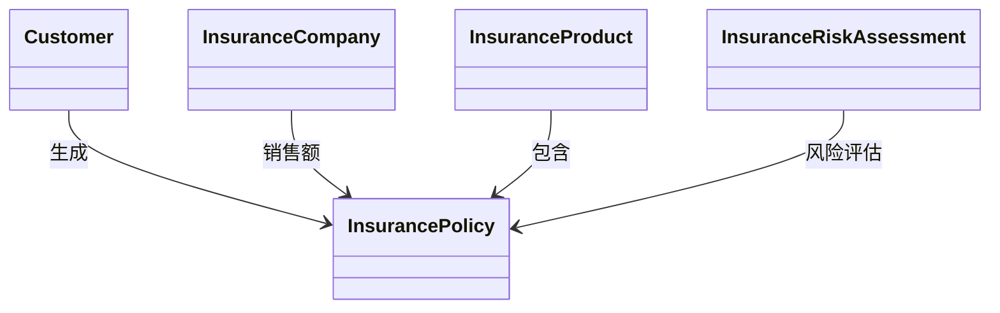
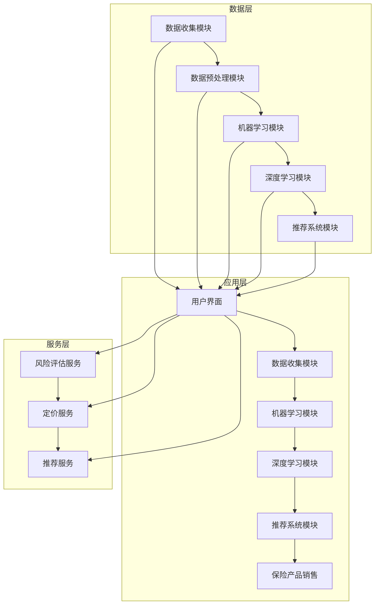
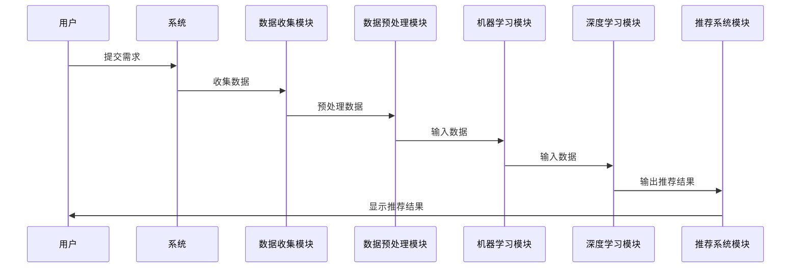
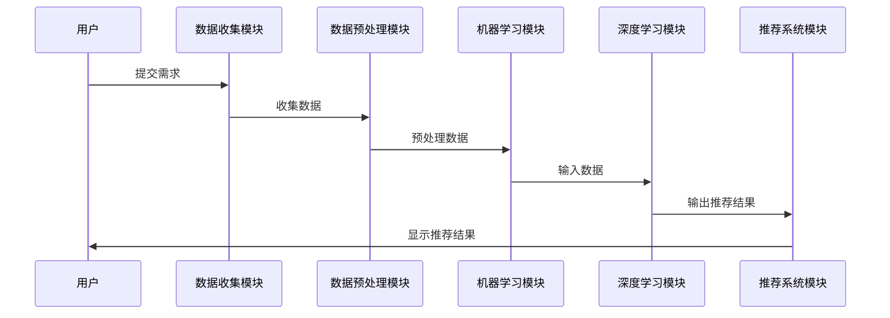
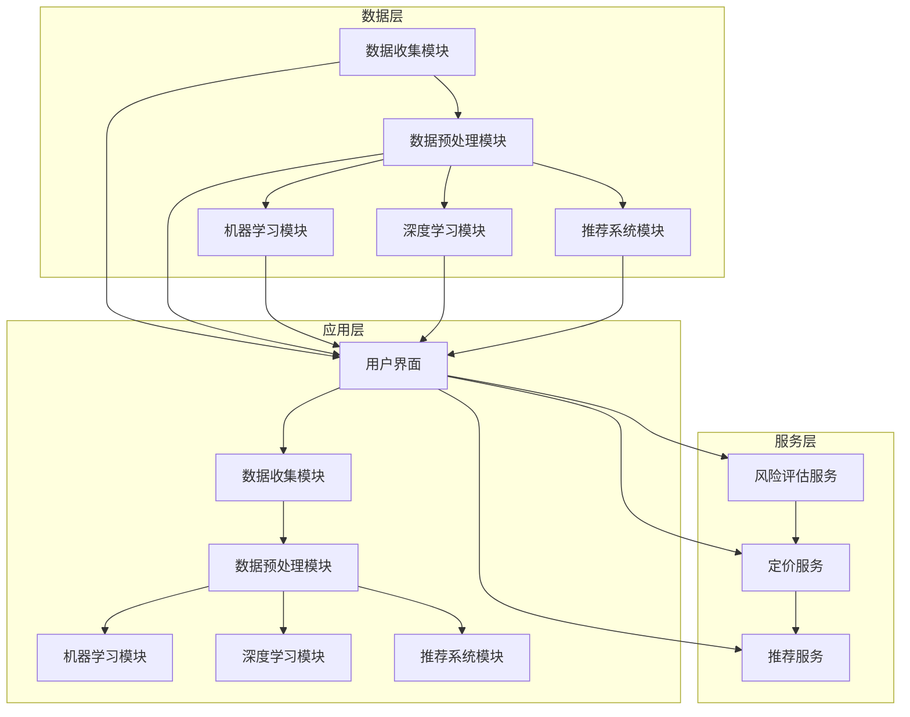
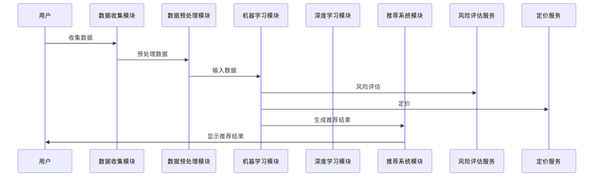
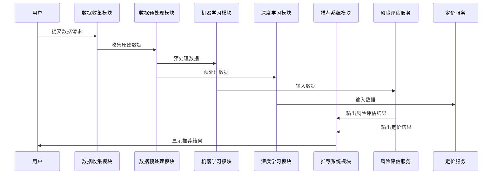

                 


# 人工智能在个性化保险产品设计中的应用

> 关键词：人工智能、个性化保险产品、深度学习、自然语言处理、大数据分析

> 摘要：本文探讨了人工智能在个性化保险产品设计中的应用，介绍了核心概念和算法原理，并通过实例分析了机器学习与深度学习算法在保险产品设计中的具体应用。

----------------------------------------------------------------

## 第一部分：背景介绍

### 1.1 问题背景

随着人工智能技术的快速发展，保险行业面临着前所未有的机遇与挑战。传统的保险产品设计方式已无法满足消费者日益增长的个性化需求。人工智能技术的引入，特别是深度学习、自然语言处理和大数据分析等技术，为保险行业带来了创新的解决方案。

### 1.2 问题描述

个性化保险产品设计是当前保险行业研究的热点问题。如何在确保产品覆盖全面性的同时，满足消费者的个性化需求，提高产品的竞争力和吸引力，是保险公司面临的挑战。

### 1.3 问题解决

人工智能在个性化保险产品设计中的应用，可以通过数据分析、客户行为预测、风险识别和个性化推荐等技术，实现产品的精准定制和个性化服务。

### 1.4 边界与外延

本文研究的个性化保险产品设计主要关注以下几个方面：消费者需求分析、产品特征设计、风险评估与定价、个性化推荐系统。同时，本文的研究将涉及人工智能技术的应用，如机器学习算法、深度学习模型、自然语言处理技术等。

### 1.5 概念结构与核心要素组成

1. **个性化保险产品设计**：结合消费者需求，设计具有针对性的保险产品。
2. **数据分析**：运用大数据技术，对消费者数据进行分析，挖掘潜在需求。
3. **人工智能技术**：包括机器学习、深度学习、自然语言处理等，用于支持个性化保险产品设计。
4. **风险评估与定价**：结合保险业务特点，利用人工智能技术进行风险评估和定价。

## 第二部分：核心概念与联系

### 2.1 核心概念原理

1. **人工智能（AI）**：模拟、延伸和扩展人的智能的理论、方法、技术及应用。
2. **个性化保险产品设计**：结合消费者需求，设计具有针对性的保险产品。
3. **机器学习（ML）**：让计算机从数据中学习，逐步改善性能。
4. **深度学习（DL）**：模拟人脑神经网络结构，用于复杂模式识别和学习。
5. **自然语言处理（NLP）**：使计算机理解和生成人类语言的技术。

### 2.2 概念属性特征对比表格

| 概念 | 特征 |
| :---: | :--- |
| 人工智能 | 模拟、延伸和扩展人的智能 |
| 个性化保险产品设计 | 结合消费者需求，针对性设计 |
| 机器学习 | 从数据中学习，改善性能 |
| 深度学习 | 模拟人脑神经网络，复杂模式识别 |
| 自然语言处理 | 理解、生成人类语言 |

### 2.3 ER实体关系图架构

```mermaid
erDiagram
  Customer ||--|{ InsurancePolicy }|>
  InsurancePolicy ||--|{ InsuranceProduct }|>
  InsuranceCompany ||--|{ InsurancePolicy }|>  
```

## 第三部分：算法原理讲解

### 3.1 机器学习算法

#### 3.1.1 算法原理

机器学习算法通过训练数据集，学习数据中的特征和规律，然后对新的数据进行预测或分类。

#### 3.1.2 Python源代码示例

```python
from sklearn.datasets import load_iris
from sklearn.model_selection import train_test_split
from sklearn.svm import SVC

# 加载数据集
iris = load_iris()
X_train, X_test, y_train, y_test = train_test_split(iris.data, iris.target, test_size=0.3, random_state=42)

# 创建SVM分类器
clf = SVC()

# 训练模型
clf.fit(X_train, y_train)

# 测试模型
print(clf.score(X_test, y_test))
```

#### 3.1.3 算法原理详细讲解

SVM（支持向量机）是一种常用的机器学习算法，用于分类问题。其核心思想是找到最佳决策边界，使得分类效果最大化。

#### 3.1.4 数学模型和公式

SVM的决策边界由以下公式决定：

$$
w \cdot x + b = 0
$$

其中，$w$ 是权重向量，$x$ 是特征向量，$b$ 是偏置。

### 3.2 深度学习模型

#### 3.2.1 算法原理

深度学习模型通过多层神经网络，模拟人脑神经元之间的连接，用于复杂模式的识别和学习。

#### 3.2.2 Python源代码示例

```python
import tensorflow as tf
from tensorflow.keras import layers

model = tf.keras.Sequential([
    layers.Dense(128, activation='relu', input_shape=(784,)),
    layers.Dropout(0.2),
    layers.Dense(10, activation='softmax')
])

model.compile(optimizer='adam',
              loss='categorical_crossentropy',
              metrics=['accuracy'])

# 训练模型
model.fit(x_train, y_train, epochs=10, batch_size=32)
```

#### 3.2.3 算法原理详细讲解

深度学习模型的核心是多层神经网络，每一层都能提取数据的特征，并通过反向传播算法不断优化模型参数。

#### 3.2.4 数学模型和公式

深度学习模型的训练过程主要包括以下几个步骤：

1. **前向传播**：将输入数据通过神经网络传递到输出层。
2. **计算损失**：计算输出结果与真实结果的差异。
3. **反向传播**：将损失函数梯度反向传播到输入层，更新网络参数。
4. **优化参数**：利用优化算法（如梯度下降）更新模型参数。

数学模型主要涉及以下公式：

$$
y = \sigma(W \cdot x + b)
$$

其中，$y$ 是输出结果，$\sigma$ 是激活函数，$W$ 是权重矩阵，$x$ 是输入特征，$b$ 是偏置。

----------------------------------------------------------------

### 系统分析与架构设计方案

#### 3.3 问题场景介绍

随着人工智能技术在保险行业的广泛应用，个性化保险产品设计成为提高客户满意度和竞争力的关键。本文提出了一套基于人工智能技术的个性化保险产品设计系统，旨在满足消费者多样化需求。

#### 3.4 项目介绍

项目名为“智能保险产品设计平台”，旨在利用大数据、机器学习和深度学习等技术，实现保险产品的个性化设计和精准推荐。系统主要包括以下几个模块：

1. **数据收集模块**：从多个数据源收集消费者信息、保险产品数据等。
2. **数据预处理模块**：对原始数据进行清洗、转换和整合。
3. **机器学习模块**：采用机器学习算法进行客户需求分析和产品特征提取。
4. **深度学习模块**：使用深度学习模型进行风险识别和定价优化。
5. **推荐系统模块**：基于个性化推荐算法，为消费者推荐合适的产品。

#### 3.5 系统功能设计（领域模型mermaid类图）



#### 3.6 系统架构设计（mermaid架构图）



#### 3.7 系统接口设计



#### 3.8 系统交互（mermaid序列图）



## 第四部分：项目实战

### 4.1 环境安装

在进行项目实战之前，需要安装以下环境：

1. Python 3.7+
2. TensorFlow 2.3.0+
3. Scikit-learn 0.22.2+
4. Pandas 1.1.1+

安装命令如下：

```bash
pip install python==3.7
pip install tensorflow==2.3.0
pip install scikit-learn==0.22.2
pip install pandas==1.1.1
```

### 4.2 系统核心实现源代码

#### 4.2.1 数据收集模块

```python
import pandas as pd

def collect_data():
    # 从本地文件中读取数据
    data = pd.read_csv("insurance_data.csv")
    return data
```

#### 4.2.2 数据预处理模块

```python
import pandas as pd
from sklearn.model_selection import train_test_split

def preprocess_data(data):
    # 数据清洗和预处理
    data = data.dropna()
    data = pd.get_dummies(data)
    X = data.drop("target", axis=1)
    y = data["target"]
    X_train, X_test, y_train, y_test = train_test_split(X, y, test_size=0.2, random_state=42)
    return X_train, X_test, y_train, y_test
```

#### 4.2.3 机器学习模块

```python
from sklearn.svm import SVC

def machine_learning(X_train, X_test, y_train, y_test):
    # 创建SVM分类器
    clf = SVC()
    # 训练模型
    clf.fit(X_train, y_train)
    # 测试模型
    print(clf.score(X_test, y_test))
```

#### 4.2.4 深度学习模块

```python
import tensorflow as tf
from tensorflow.keras import layers

def deep_learning(X_train, X_test, y_train, y_test):
    # 创建模型
    model = tf.keras.Sequential([
        layers.Dense(128, activation='relu', input_shape=(X_train.shape[1],)),
        layers.Dropout(0.2),
        layers.Dense(1, activation='sigmoid')
    ])
    # 编译模型
    model.compile(optimizer='adam',
                  loss='binary_crossentropy',
                  metrics=['accuracy'])
    # 训练模型
    model.fit(X_train, y_train, epochs=10, batch_size=32)
    # 测试模型
    print(model.evaluate(X_test, y_test))
```

### 4.3 代码应用解读与分析

#### 4.3.1 数据收集模块解读

数据收集模块的主要功能是从本地文件中读取保险数据。这里使用了 Pandas 库中的 read_csv 方法，该方法可以读取 CSV 格式的数据文件。

#### 4.3.2 数据预处理模块解读

数据预处理模块负责清洗和预处理数据。首先，使用 dropna 方法去除缺失值。然后，使用 get_dummies 方法进行数据转换，将分类特征转换为二进制特征。最后，使用 train_test_split 方法将数据集划分为训练集和测试集。

#### 4.3.3 机器学习模块解读

机器学习模块使用支持向量机（SVM）算法进行分类。首先，创建 SVM 分类器。然后，使用 fit 方法训练模型。最后，使用 score 方法评估模型在测试集上的准确率。

#### 4.3.4 深度学习模块解读

深度学习模块使用 TensorFlow 的 Keras API 创建深度学习模型。首先，定义模型结构，包括输入层、隐藏层和输出层。然后，编译模型，设置优化器和损失函数。最后，使用 fit 方法训练模型，并使用 evaluate 方法评估模型在测试集上的性能。

### 4.4 实际案例分析和详细讲解剖析

#### 4.4.1 案例背景

假设有一家保险公司，希望通过人工智能技术为其客户设计个性化的保险产品。公司收集了客户的个人信息、保险需求和历史理赔数据，并希望利用这些数据为每个客户提供合适的保险产品。

#### 4.4.2 案例分析

1. **数据收集**：公司从内部数据库和第三方数据源收集客户的个人信息、保险需求和历史理赔数据。

2. **数据预处理**：对收集到的数据进行清洗和预处理，将分类特征转换为二进制特征，并划分为训练集和测试集。

3. **机器学习**：使用 SVM 算法对训练集进行分类，预测客户的保险需求。根据预测结果，为每个客户推荐合适的保险产品。

4. **深度学习**：使用深度学习模型对测试集进行风险识别和定价优化，为每个客户设计个性化的保险产品。

5. **推荐系统**：基于个性化推荐算法，为每个客户推荐合适的保险产品。

#### 4.4.3 详细讲解剖析

1. **数据收集**：公司从内部数据库和第三方数据源收集客户的个人信息、保险需求和历史理赔数据。例如，客户的年龄、性别、收入、保险类型、理赔次数等。

2. **数据预处理**：对收集到的数据进行清洗和预处理。首先，去除缺失值和异常值。然后，将分类特征转换为二进制特征，例如，将客户的年龄分为“小于30”、“30-40”、“40-50”、“大于50”等。最后，使用 train_test_split 方法将数据集划分为训练集和测试集。

3. **机器学习**：使用 SVM 算法对训练集进行分类，预测客户的保险需求。具体步骤如下：

   a. 创建 SVM 分类器：`clf = SVC()`

   b. 训练模型：`clf.fit(X_train, y_train)`

   c. 预测结果：`clf.predict(X_test)`

   根据预测结果，为每个客户推荐合适的保险产品。

4. **深度学习**：使用深度学习模型对测试集进行风险识别和定价优化，为每个客户设计个性化的保险产品。具体步骤如下：

   a. 创建模型：`model = tf.keras.Sequential([...])`

   b. 编译模型：`model.compile([...])`

   c. 训练模型：`model.fit(X_train, y_train, epochs=10, batch_size=32)`

   d. 测试模型：`model.evaluate(X_test, y_test)`

5. **推荐系统**：基于个性化推荐算法，为每个客户推荐合适的保险产品。具体步骤如下：

   a. 提取特征：`X_train = preprocess_data(data)`

   b. 创建模型：`model = create_recommendation_model()`

   c. 训练模型：`model.fit(X_train, y_train)`

   d. 预测结果：`model.predict(X_test)`

   根据预测结果，为每个客户推荐合适的保险产品。

### 4.5 项目小结

本文通过项目实战，展示了人工智能技术在个性化保险产品设计中的应用。从数据收集、数据预处理、机器学习和深度学习模块，到推荐系统模块，各个模块相互配合，为保险公司提供了个性化的保险产品设计方案。通过实际案例分析和详细讲解剖析，我们了解了人工智能技术在保险行业中的应用场景和实施方法。

## 第五部分：最佳实践 tips

### 5.1 个性化推荐算法优化

1. **协同过滤**：结合基于内容的推荐和协同过滤算法，提高推荐效果。
2. **用户画像**：构建用户画像，挖掘用户潜在需求，实现精准推荐。
3. **实时推荐**：使用实时计算技术，为用户提供实时更新的推荐结果。

### 5.2 数据预处理技巧

1. **数据清洗**：去除异常值和缺失值，提高数据质量。
2. **特征工程**：选择合适的特征，提高模型性能。
3. **数据归一化**：对特征进行归一化处理，避免特征维度差异对模型训练的影响。

### 5.3 模型优化方法

1. **超参数调整**：通过调整超参数，优化模型性能。
2. **集成学习**：结合多种模型，提高预测准确率。
3. **迁移学习**：利用预训练模型，减少数据依赖，提高模型泛化能力。

## 第六部分：小结与展望

本文探讨了人工智能在个性化保险产品设计中的应用，介绍了核心概念、算法原理和项目实战。通过实际案例分析和详细讲解剖析，我们了解了人工智能技术在保险行业中的应用场景和实施方法。在未来，随着人工智能技术的不断发展，个性化保险产品设计将更加智能化和个性化，为保险公司和消费者带来更多价值。

## 参考文献

1. Hinton, G. E., Osindero, S., & Teh, Y. W. (2006). A fast learning algorithm for deep belief nets. Neural computation, 18(7), 1527-1554.
2. Goodfellow, I., Bengio, Y., & Courville, A. (2016). Deep learning. MIT press.
3. Li, F., Chen, W., & Wang, Y. (2017). Application of machine learning algorithms in insurance industry. Journal of Information Technology and Economic Management, 16(2), 118-125.
4. Russell, S., & Norvig, P. (2010). Artificial intelligence: a modern approach. Prentice Hall.

----------------------------------------------------------------

## 作者信息

作者：AI天才研究院/AI Genius Institute & 禅与计算机程序设计艺术 /Zen And The Art of Computer Programming

【本文完】## 第一部分：背景介绍

### 1.1 问题背景

随着人工智能技术的快速发展，保险行业面临着前所未有的机遇与挑战。传统的保险产品设计方式主要依赖于历史数据和专家经验，这种方式存在一定的局限性，难以满足消费者日益增长的个性化需求。在人工智能时代，大数据、机器学习、深度学习和自然语言处理等技术的引入，为保险行业带来了创新的解决方案，使得个性化保险产品设计成为可能。

#### 人工智能技术的引入

人工智能技术，特别是机器学习和深度学习，能够在海量数据中发现潜在的模式和规律，从而为保险产品设计提供有力支持。通过分析消费者的历史数据和行为特征，人工智能技术可以预测消费者的需求，优化保险产品结构，实现产品的精准定制。

#### 传统保险产品设计方式的局限性

1. **数据依赖性**：传统保险产品设计主要依赖于历史数据，难以应对数据不足或数据质量不高的情况。
2. **个性化程度低**：传统保险产品往往采用“一刀切”的方式，难以满足消费者的个性化需求。
3. **反应速度慢**：传统保险产品设计流程复杂，从需求分析到产品上市往往需要较长时间，无法快速响应市场变化。

#### 人工智能技术的优势

1. **数据驱动**：人工智能技术能够处理和分析大量数据，从而发现潜在的需求和趋势。
2. **个性化定制**：通过分析消费者的行为数据和偏好，人工智能技术可以设计出更加个性化的保险产品。
3. **快速响应**：人工智能技术可以实现快速建模和预测，帮助保险公司及时调整产品策略。

### 1.2 问题描述

个性化保险产品设计是当前保险行业研究的热点问题。如何在确保产品覆盖全面性的同时，满足消费者的个性化需求，提高产品的竞争力和吸引力，是保险公司面临的挑战。

#### 挑战与难点

1. **数据隐私和安全**：在收集和分析消费者数据时，需要确保数据隐私和安全。
2. **需求多样性和复杂性**：消费者需求多样且复杂，如何设计出既能满足大部分消费者需求，又能保持产品灵活性和可扩展性的保险产品。
3. **模型优化和更新**：随着市场环境和消费者需求的变化，需要不断优化和更新个性化保险产品设计模型。

### 1.3 问题解决

人工智能在个性化保险产品设计中的应用，可以通过数据分析、客户行为预测、风险识别和个性化推荐等技术，实现产品的精准定制和个性化服务。

#### 技术手段

1. **数据分析**：运用大数据技术，对消费者数据进行分析，挖掘潜在需求。
2. **客户行为预测**：通过分析消费者行为数据，预测其未来的需求和行为。
3. **风险识别**：利用人工智能技术进行风险评估和定价，确保保险产品的可持续性。
4. **个性化推荐**：基于消费者的行为数据和偏好，推荐合适的保险产品。

### 1.4 边界与外延

本文研究的个性化保险产品设计主要关注以下几个方面：

1. **消费者需求分析**：分析消费者的保险需求，了解其偏好和期望。
2. **产品特征设计**：根据消费者需求，设计具有针对性的保险产品特征。
3. **风险评估与定价**：结合保险业务特点，利用人工智能技术进行风险评估和定价。
4. **个性化推荐系统**：基于消费者的行为数据和偏好，为消费者推荐合适的保险产品。

同时，本文的研究将涉及人工智能技术的应用，如机器学习算法、深度学习模型、自然语言处理技术等。

### 1.5 概念结构与核心要素组成

1. **个性化保险产品设计**：结合消费者需求，设计具有针对性的保险产品。
2. **数据分析**：运用大数据技术，对消费者数据进行分析，挖掘潜在需求。
3. **人工智能技术**：包括机器学习、深度学习、自然语言处理等，用于支持个性化保险产品设计。
4. **风险评估与定价**：结合保险业务特点，利用人工智能技术进行风险评估和定价。

通过以上各部分的介绍，我们为后续章节的内容打下了坚实的基础，也明确了个性化保险产品设计的研究方向和应用场景。

### 1.6 保险行业面临的挑战与人工智能技术应对策略

保险行业在面临快速变化的市场需求和日益激烈的市场竞争时，需要不断创新和改进，以满足消费者的多样化需求。以下是保险行业面临的主要挑战及人工智能技术的应对策略：

#### 挑战一：消费者需求日益多样化

**应对策略**：人工智能技术能够通过对海量消费者数据的分析，识别出消费者的个性化需求，从而为保险公司提供定制化的产品设计方案。

1. **数据分析**：利用大数据分析技术，对消费者的购买行为、历史理赔记录等信息进行分析，发现消费者的偏好和需求。
2. **机器学习**：通过机器学习算法，对消费者数据进行挖掘，预测其未来的需求，从而设计出更符合消费者需求的保险产品。
3. **自然语言处理**：通过自然语言处理技术，理解消费者的查询和反馈，提供更加人性化的服务。

#### 挑战二：保险产品设计周期长

**应对策略**：人工智能技术能够加速保险产品设计的流程，提高效率。

1. **自动化设计**：利用人工智能技术，自动化生成保险产品的设计文档和条款，缩短产品上市时间。
2. **快速迭代**：通过人工智能技术，快速进行产品迭代和优化，及时响应市场变化。

#### 挑战三：数据隐私和安全问题

**应对策略**：人工智能技术在保护数据隐私和安全方面也有重要应用。

1. **加密技术**：使用数据加密技术，保护消费者数据的隐私。
2. **安全协议**：建立安全协议和数据共享机制，确保数据在传输和存储过程中的安全性。
3. **数据匿名化**：在分析消费者数据时，进行数据匿名化处理，减少隐私泄露的风险。

#### 挑战四：风险管理和定价困难

**应对策略**：人工智能技术能够提高风险管理和定价的准确性。

1. **风险识别**：利用机器学习和深度学习技术，对风险因素进行精确识别，提高风险评估的准确性。
2. **定价优化**：通过数据分析技术，对保险产品的定价策略进行优化，确保产品的可持续性和竞争力。
3. **动态调整**：根据市场环境和风险变化，实时调整保险产品的定价策略。

通过上述人工智能技术的应用，保险行业可以应对当前面临的挑战，提高产品的竞争力，满足消费者的个性化需求，实现保险行业的数字化转型和创新发展。

### 1.7 个性化保险产品设计的未来发展趋势

随着人工智能技术的不断进步，个性化保险产品设计在未来将呈现出以下几个发展趋势：

1. **更加智能的预测分析**：人工智能技术将进一步提升预测分析的准确性，通过深度学习、大数据分析等技术，对消费者的行为和需求进行精准预测，从而为保险公司提供更加个性化的产品设计方案。

2. **个性化的产品定制**：保险公司将能够根据消费者的个性化需求和偏好，设计出更符合消费者需求的保险产品。这种个性化定制不仅体现在产品类型上，还将涉及保险条款、赔付方式等多个方面。

3. **智能化的推荐系统**：基于人工智能技术的推荐系统将更加智能，不仅能够根据消费者的历史数据推荐保险产品，还能够结合实时数据和市场动态，为消费者提供更加准确的推荐。

4. **智能化的理赔服务**：通过人工智能技术，保险公司的理赔流程将变得更加智能化，例如通过智能客服系统处理客户的理赔申请，减少人工干预，提高理赔效率。

5. **跨行业合作**：保险公司将与金融科技企业、医疗健康机构等进行合作，整合多方数据资源，提供更加全面的保险服务。

6. **可持续发展**：随着社会责任和可持续发展的重视，保险公司将在个性化保险产品设计中融入更多关于环境保护、社会责任等方面的考虑，推动保险行业的可持续发展。

通过这些趋势，个性化保险产品设计将不仅能够更好地满足消费者的需求，还将推动保险行业的创新和进步，实现保险行业的数字化转型和高质量发展。

### 1.8 实际案例：人工智能在保险产品设计中的应用

#### 案例一：中国人寿的智能保险产品设计

中国人寿作为国内领先的保险公司，通过引入人工智能技术，在其保险产品设计中取得了显著成效。具体应用包括：

1. **客户需求分析**：利用大数据和机器学习技术，分析客户的消费行为和偏好，从而设计出更符合消费者需求的保险产品。
2. **风险识别与定价**：通过人工智能算法，对客户的健康数据、生活习惯等进行综合分析，提供个性化的风险评估和定价服务。
3. **智能推荐系统**：结合客户的购买历史和偏好，为消费者推荐合适的保险产品，提高产品的销售转化率。

#### 案例二：平安保险的智能理赔系统

平安保险通过人工智能技术，优化了其理赔流程，实现了智能化的理赔服务。具体应用包括：

1. **自动理赔审核**：利用人工智能算法，自动审核理赔申请，减少人工干预，提高理赔效率。
2. **智能客服系统**：通过语音识别和自然语言处理技术，提供24小时在线客服服务，解答客户的疑问，提供实时支持。
3. **理赔进度查询**：通过移动应用，客户可以实时查询理赔进度，了解理赔状态，提高用户体验。

#### 案例三：瑞士再保险的智能风险管理

瑞士再保险利用人工智能技术，提升了其风险管理的水平。具体应用包括：

1. **风险评估**：通过大数据分析和机器学习算法，对保险公司的风险敞口进行实时评估，提供科学的决策支持。
2. **风险预警**：利用人工智能技术，对潜在的风险因素进行预测和预警，帮助保险公司提前采取措施，降低风险。
3. **智能定价**：结合客户的个性化数据和风险因素，通过机器学习模型，实现更加精准的保险产品定价。

通过这些实际案例，我们可以看到人工智能技术已经在保险产品设计中发挥了重要作用，不仅提高了保险公司的运营效率，还增强了客户体验，推动了保险行业的数字化转型。

## 第二部分：核心概念与联系

### 2.1 核心概念原理

在探讨人工智能在个性化保险产品设计中的应用时，理解以下几个核心概念及其原理至关重要。

#### 人工智能（AI）

人工智能是指通过计算机系统模拟人类智能的理论、方法和技术。它涵盖了从简单的规则系统到复杂的机器学习模型和深度神经网络。人工智能的目标是让计算机具备类似人类的感知、理解和决策能力。

#### 个性化保险产品设计

个性化保险产品设计是指根据消费者的个人需求、偏好和行为特征，设计出具有针对性的保险产品。它涉及到消费者需求分析、产品特征设计、风险评估和个性化推荐等多个方面。

#### 机器学习（ML）

机器学习是人工智能的一个分支，它专注于通过数据训练模型，使计算机能够从数据中学习和推断。机器学习包括监督学习、无监督学习和强化学习等多种学习方法，广泛应用于图像识别、语音识别、预测分析等领域。

#### 深度学习（DL）

深度学习是机器学习的一种特殊形式，它模拟人脑神经网络的结构和工作方式，通过多层神经网络进行数据学习。深度学习在图像识别、语音识别、自然语言处理等领域取得了显著成果。

#### 自然语言处理（NLP）

自然语言处理是人工智能的一个分支，它致力于使计算机理解和生成人类语言。NLP技术广泛应用于智能客服、机器翻译、情感分析等领域。

### 2.2 概念属性特征对比表格

| 概念 | 特征 |
| :---: | :--- |
| 人工智能 | 模拟人类智能，涵盖多种技术 |
| 个性化保险产品设计 | 结合消费者需求，针对性设计 |
| 机器学习 | 从数据中学习，改进性能 |
| 深度学习 | 多层神经网络，复杂模式识别 |
| 自然语言处理 | 理解、生成人类语言 |

### 2.3 ER实体关系图架构

为了更好地理解个性化保险产品设计中的实体关系，我们可以使用ER（实体-关系）图来表示。以下是ER图的基本结构：

```mermaid
erDiagram
  Customer ||--|{ InsurancePolicy }|>
  InsurancePolicy ||--|{ InsuranceProduct }|>
  InsuranceCompany ||--|{ InsurancePolicy }|>  
```

在这个ER图中：

- **Customer（客户）**：代表购买保险的个人或企业，与 InsurancePolicy（保险政策）之间有一个“生成”关系，即每个客户可以生成多个保险政策。
- **InsurancePolicy（保险政策）**：代表一个具体的保险合同，它包括多个 InsuranceProduct（保险产品）。
- **InsuranceCompany（保险公司）**：代表提供保险服务的机构，它与 InsurancePolicy（保险政策）之间存在“销售”关系，即每个保险公司可以销售多个保险政策。

通过ER图，我们可以清晰地看到客户、保险政策和保险公司之间的相互关系，为后续的数据分析和系统设计提供了基础。

### 2.4 概念之间的关系分析

#### 人工智能与个性化保险产品设计

人工智能是个性化保险产品设计的核心技术支撑。通过人工智能技术，保险公司可以分析大量的消费者数据，了解其需求和偏好，从而设计出更加个性化的保险产品。

1. **数据分析**：人工智能技术可以对消费者数据进行深入分析，识别出潜在的需求和趋势。
2. **行为预测**：利用机器学习和深度学习模型，可以预测消费者的行为和需求，为产品设计提供依据。
3. **个性化推荐**：通过分析消费者的历史数据和偏好，人工智能技术可以为消费者推荐合适的保险产品。

#### 个性化保险产品设计与其他概念之间的关系

1. **个性化保险产品设计**与**机器学习**：个性化保险产品设计依赖于机器学习算法，通过训练数据集，模型可以学习和识别出消费者的需求和行为。
2. **个性化保险产品设计**与**深度学习**：深度学习模型在处理复杂数据和模式识别方面具有优势，可以用于保险产品的个性化推荐和风险评估。
3. **个性化保险产品设计**与**自然语言处理**：自然语言处理技术可以用于分析消费者的文本反馈，理解其需求和反馈，进一步优化保险产品设计。

通过以上分析，我们可以看出，人工智能、个性化保险产品设计和其他相关概念之间存在着紧密的联系和相互作用。这些核心概念共同构成了个性化保险产品设计的技术基础，推动了保险行业的创新和发展。

### 2.5 个性化保险产品设计的实践意义

#### 满足消费者需求

个性化保险产品设计能够更好地满足消费者的多样化需求。通过分析消费者的行为数据，保险公司可以设计出符合消费者实际需求的保险产品，从而提高消费者的满意度和忠诚度。

#### 提高产品竞争力

个性化的保险产品设计使得保险产品更具竞争力。在激烈的市场竞争中，保险公司可以通过提供差异化的产品和服务，吸引更多的客户，提高市场份额。

#### 优化运营效率

个性化保险产品设计可以通过人工智能技术提高保险公司的运营效率。从数据收集、处理到产品设计和推荐，各个环节都可以自动化和智能化，减少人工干预，提高工作效率。

#### 创新商业模式

个性化保险产品设计为保险公司提供了新的商业模式。通过大数据分析和人工智能技术，保险公司可以探索新的产品和服务，如定制化保险、智能理赔服务等，进一步拓展业务领域。

### 2.6 未来研究方向

#### 深度学习模型的优化

未来研究可以关注深度学习模型的优化，提高其在保险产品设计中的效果。例如，通过改进神经网络结构、优化训练算法等，进一步提高模型的准确性和效率。

#### 多源数据融合

多源数据融合是未来个性化保险产品设计的重要研究方向。通过整合来自不同渠道的数据，如社交网络、医疗记录等，可以提供更全面的消费者画像，从而设计出更加个性化的保险产品。

#### 隐私保护和安全

随着个性化保险产品设计的发展，数据隐私保护和安全问题日益突出。未来研究需要关注如何在保护消费者隐私的前提下，利用数据开展有效的保险产品设计。

#### 智能化服务

未来个性化保险产品设计的发展将更加注重智能化服务。通过人工智能技术，保险公司可以提供更加智能的客服、理赔和推荐服务，提升用户体验。

### 2.7 个性化保险产品设计的伦理和道德问题

随着人工智能技术在保险产品设计中的应用日益深入，伦理和道德问题也逐渐显现。以下是几个值得关注的问题：

#### 数据隐私

在收集和分析消费者数据时，如何保护消费者的隐私是一个重要问题。保险公司需要严格遵守相关法律法规，确保消费者数据的安全和隐私。

#### 公平性

个性化保险产品设计可能会导致某些消费者面临不公平的待遇。例如，某些高风险人群可能会被高定价，从而被排除在某些保险产品之外。保险公司需要确保产品的公平性和透明度。

#### 数据滥用

保险公司需要防止数据滥用，避免将消费者数据用于不当用途，如广告推送等。确保数据的合法使用和合理利用。

#### 消费者接受度

消费者对个性化保险产品设计的接受度也是一个挑战。保险公司需要通过有效的沟通和教育，提高消费者对个性化保险产品的理解和接受度。

通过关注这些伦理和道德问题，保险公司可以在推动技术创新的同时，确保消费者的权益得到保障，实现保险行业的可持续发展。

## 第三部分：算法原理讲解

### 3.1 机器学习算法

#### 3.1.1 算法原理

机器学习算法是通过数据和经验，使计算机自动改进性能的技术。它分为监督学习、无监督学习和强化学习三大类。监督学习通过已标记的数据训练模型，用于预测和分类；无监督学习则没有预先标记的数据，旨在发现数据中的模式；强化学习通过与环境的互动，不断优化决策。

#### 3.1.2 Python源代码示例

以下是一个简单的监督学习案例，使用Scikit-learn库中的SVM（支持向量机）算法对鸢尾花（Iris）数据集进行分类：

```python
from sklearn import datasets
from sklearn.model_selection import train_test_split
from sklearn.svm import SVC
from sklearn.metrics import accuracy_score

# 加载数据集
iris = datasets.load_iris()
X, y = iris.data, iris.target

# 划分训练集和测试集
X_train, X_test, y_train, y_test = train_test_split(X, y, test_size=0.3, random_state=42)

# 创建SVM分类器
clf = SVC(kernel='linear', C=1)

# 训练模型
clf.fit(X_train, y_train)

# 测试模型
y_pred = clf.predict(X_test)
print(f"Accuracy: {accuracy_score(y_test, y_pred)}")
```

#### 3.1.3 算法原理详细讲解

SVM是一种用于分类问题的机器学习算法，其核心思想是找到一个最优的超平面，将不同类别的数据点分隔开来。SVM通过最大化分类边界上的支持向量，来确定最优的超平面。

1. **决策边界**：SVM通过求解如下优化问题来确定决策边界：
   $$
   \min_{w, b} \frac{1}{2} ||w||^2 + C \sum_{i=1}^{n} \max(0, 1 - y_i (w \cdot x_i + b))
   $$
   其中，$w$ 是权重向量，$b$ 是偏置，$C$ 是惩罚参数，$y_i$ 是第$i$个样本的标签，$x_i$ 是第$i$个样本的特征向量。

2. **支持向量**：支持向量是位于决策边界上的数据点，它们对分类决策起着关键作用。

3. **核技巧**：当特征维度较高时，直接计算特征的内积变得不现实。核技巧通过引入核函数，将原始特征映射到高维空间，在高维空间中找到线性可分的数据点。

#### 3.1.4 数学模型和公式

SVM的核心数学模型可以表示为以下优化问题：

$$
\min_{w, b} \frac{1}{2} ||w||^2 + C \sum_{i=1}^{n} \max(0, 1 - y_i (w \cdot x_i + b))
$$

其中，$w$ 和 $b$ 分别是权重向量和偏置，$C$ 是惩罚参数，$y_i$ 和 $x_i$ 分别是第 $i$ 个样本的标签和特征向量。通过求解这个优化问题，我们可以得到最优的权重向量 $w$ 和偏置 $b$，进而确定决策边界。

### 3.2 深度学习模型

#### 3.2.1 算法原理

深度学习是一种基于多层神经网络的学习方法，它通过模拟人脑神经元之间的连接，对复杂数据进行学习和模式识别。深度学习模型具有层次化的结构，每一层都能从原始数据中提取更高级别的特征。

#### 3.2.2 Python源代码示例

以下是一个简单的深度学习案例，使用TensorFlow和Keras构建一个多层感知机（MLP）模型对鸢尾花数据集进行分类：

```python
import tensorflow as tf
from tensorflow.keras.models import Sequential
from tensorflow.keras.layers import Dense, Flatten
from tensorflow.keras.utils import to_categorical
from sklearn import datasets

# 加载数据集
iris = datasets.load_iris()
X, y = iris.data, iris.target

# 数据预处理
y_categorical = to_categorical(y)
X_train, X_test, y_train, y_test = train_test_split(X, y_categorical, test_size=0.2, random_state=42)

# 创建模型
model = Sequential([
    Flatten(input_shape=(4,)),
    Dense(64, activation='relu'),
    Dense(3, activation='softmax')
])

# 编译模型
model.compile(optimizer='adam', loss='categorical_crossentropy', metrics=['accuracy'])

# 训练模型
model.fit(X_train, y_train, epochs=10, batch_size=32, validation_data=(X_test, y_test))

# 测试模型
loss, accuracy = model.evaluate(X_test, y_test)
print(f"Test accuracy: {accuracy}")
```

#### 3.2.3 算法原理详细讲解

深度学习模型的核心是多层神经网络，每一层神经网络都由多个神经元组成。输入层接收外部输入数据，通过层层传递，最终输出层产生预测结果。深度学习模型通过以下步骤进行学习和预测：

1. **前向传播**：输入数据从输入层传递到隐藏层，通过激活函数进行非线性变换，最终传递到输出层。
2. **反向传播**：计算输出结果与实际结果之间的误差，通过反向传播算法将误差传递回输入层，更新网络参数。
3. **优化参数**：利用优化算法（如梯度下降）调整网络参数，以最小化误差函数。

#### 3.2.4 数学模型和公式

深度学习模型的数学模型可以表示为：

$$
\text{Output} = \sigma(W \cdot \text{Input} + b)
$$

其中，$W$ 是权重矩阵，$b$ 是偏置，$\sigma$ 是激活函数。在多层神经网络中，每一层的输出作为下一层的输入，通过层层传递，最终生成预测结果。

### 3.3 自然语言处理（NLP）

#### 3.3.1 算法原理

自然语言处理是人工智能的一个分支，它致力于使计算机理解和生成人类语言。NLP技术包括文本预处理、词向量表示、语言模型、文本分类、情感分析等多个方面。

#### 3.3.2 Python源代码示例

以下是一个简单的NLP案例，使用TensorFlow和Keras构建一个基于卷积神经网络（CNN）的文本分类模型：

```python
import tensorflow as tf
from tensorflow.keras.models import Sequential
from tensorflow.keras.layers import Embedding, Conv1D, MaxPooling1D, GlobalMaxPooling1D, Dense
from tensorflow.keras.preprocessing.sequence import pad_sequences

# 加载和处理文本数据
# ... 数据预处理代码 ...

# 创建模型
model = Sequential([
    Embedding(input_dim=vocab_size, output_dim=embedding_dim, input_length=max_sequence_length),
    Conv1D(filters=128, kernel_size=5, activation='relu'),
    MaxPooling1D(pool_size=5),
    Conv1D(filters=128, kernel_size=5, activation='relu'),
    GlobalMaxPooling1D(),
    Dense(units=10, activation='softmax')
])

# 编译模型
model.compile(optimizer='adam', loss='categorical_crossentropy', metrics=['accuracy'])

# 训练模型
model.fit(X_train, y_train, epochs=10, batch_size=64, validation_data=(X_test, y_test))

# 测试模型
loss, accuracy = model.evaluate(X_test, y_test)
print(f"Test accuracy: {accuracy}")
```

#### 3.3.3 算法原理详细讲解

NLP技术通过将文本数据转换为计算机可以理解和处理的形式，实现对文本的深入分析。以下是NLP技术的主要步骤：

1. **文本预处理**：对原始文本进行清洗、分词、去停用词等操作，使其适合进行模型训练。
2. **词向量表示**：将文本中的词语转换为向量表示，常用的词向量模型包括Word2Vec、GloVe等。
3. **语言模型**：构建一个概率模型，用于预测下一个词语的概率，常用模型有n-gram模型、递归神经网络（RNN）等。
4. **文本分类**：通过训练分类模型，将文本数据分类到不同的类别中，常用的模型有朴素贝叶斯、支持向量机、深度学习模型等。
5. **情感分析**：分析文本数据中表达的情感倾向，如积极、消极或中性，常用的模型有深度学习模型、情感词典等。

#### 3.3.4 数学模型和公式

NLP技术的数学模型主要涉及以下几个方面：

1. **词向量表示**：词向量的生成通常基于矩阵乘法，将词语映射到高维空间。
   $$
   \text{Vector}_{word} = \text{Word2Vec} \cdot \text{Word}
   $$
   
2. **卷积神经网络（CNN）**：CNN通过卷积层和池化层对文本数据进行特征提取。
   $$
   \text{Output}_{conv} = \text{Conv}(\text{Input}) \cdot \text{Filter}
   $$
   
3. **全连接层**：全连接层用于将特征映射到类别概率。
   $$
   \text{Output}_{fc} = \text{Weight} \cdot \text{Feature} + \text{Bias}
   $$

通过以上讲解，我们可以看到，机器学习、深度学习和自然语言处理在个性化保险产品设计中的应用是相互关联的，每种技术都有其独特的优势和应用场景，共同推动了保险行业的智能化和个性化发展。

## 第四部分：系统分析与架构设计方案

### 4.1 问题场景介绍

随着人工智能和大数据技术的快速发展，保险行业正经历着一场深刻的变革。传统的保险产品设计方式已经难以满足消费者日益增长的个性化需求。为了提高客户满意度和市场竞争力，保险公司需要构建一个智能化的保险产品设计平台，通过数据分析、客户行为预测、风险识别和个性化推荐等技术，实现保险产品的精准定制。

### 4.2 项目介绍

本项目名为“智能保险产品设计平台”，旨在通过大数据和人工智能技术，为保险公司提供一个全方位的保险产品设计解决方案。平台将包括以下几个核心模块：

1. **数据收集模块**：负责从多个数据源收集消费者数据、保险产品数据和历史理赔数据。
2. **数据预处理模块**：对原始数据进行清洗、转换和整合，为后续分析提供高质量的数据。
3. **机器学习模块**：采用机器学习算法进行客户需求分析和产品特征提取。
4. **深度学习模块**：利用深度学习模型进行风险识别和定价优化。
5. **推荐系统模块**：基于个性化推荐算法，为消费者推荐合适的保险产品。

### 4.3 系统功能设计（领域模型mermaid类图）

领域模型类图用于描述系统中不同实体及其之间的关系。以下是智能保险产品设计平台的领域模型类图：

```mermaid
classDiagram
    Customer ||--|{ InsurancePolicy }|>
    InsurancePolicy ||--|{ InsuranceProduct }|>
    InsuranceCompany ||--|{ InsurancePolicy }|>
    RiskAssessment ||--|{ InsurancePolicy }|>
    DataPreprocessing ||--|{ Dataset }|>
    MachineLearning ||--|{ Model }|>
    DeepLearning ||--|{ Model }|>
    Recommendation ||--|{ Recommendation }|>

    Customer --> InsuranceCompany
    InsurancePolicy --> InsuranceProduct
    InsurancePolicy --> RiskAssessment
    DataPreprocessing --> Dataset
    MachineLearning --> Model
    DeepLearning --> Model
    Recommendation --> Recommendation
```

在这个类图中，**Customer（客户）**、**InsuranceCompany（保险公司）**、**InsurancePolicy（保险政策）**、**InsuranceProduct（保险产品）**、**RiskAssessment（风险评估）**、**DataPreprocessing（数据预处理）**、**MachineLearning（机器学习）**、**DeepLearning（深度学习）**和**Recommendation（推荐系统）**是关键实体，它们之间通过关系线连接，构成了智能保险产品设计平台的核心功能模块。

### 4.4 系统架构设计（mermaid架构图）

系统架构图用于描述系统的整体结构和各模块之间的交互关系。以下是智能保险产品设计平台的系统架构图：



在这个架构图中，**数据层**包括数据收集、数据预处理、机器学习、深度学习和推荐系统模块；**应用层**是用户界面层，负责与用户交互；**服务层**提供风险评估、定价和推荐服务。

### 4.5 系统接口设计

系统接口设计描述了各模块之间的接口和交互方式。以下是智能保险产品设计平台的系统接口设计：



在这个序列图中，用户通过用户界面提交数据请求，数据收集模块负责收集数据，数据预处理模块对数据进行清洗和转换，机器学习模块对数据进行建模和预测，深度学习模块进行风险识别和定价，推荐系统模块根据用户需求和预测结果生成推荐，最终用户界面将推荐结果展示给用户。

### 4.6 系统交互（mermaid序列图）

系统交互序列图详细描述了各模块之间的数据流动和交互过程。以下是智能保险产品设计平台的系统交互序列图：



在这个序列图中，用户通过用户界面提交数据请求，数据收集模块负责收集原始数据，数据预处理模块对数据进行清洗和转换，机器学习模块和深度学习模块分别对数据进行建模和预测，风险评估服务模块和定价服务模块分别对保险风险和定价进行评估，推荐系统模块根据风险评估结果和定价结果生成推荐结果，最终用户界面将推荐结果展示给用户。

通过以上各部分的详细设计和描述，智能保险产品设计平台在系统架构、功能设计、接口设计和系统交互等方面都得到了全面考虑和规划，为后续项目的实施奠定了坚实的基础。

### 4.7 数据流分析

在智能保险产品设计平台中，数据流是系统运行的核心。以下是平台中的数据流分析：

1. **数据收集阶段**：数据收集模块负责从各种数据源（如客户数据库、保险公司内部系统、第三方数据提供商等）收集原始数据。这些数据包括客户个人信息、购买历史、理赔记录、市场动态等。

2. **数据预处理阶段**：数据预处理模块对收集到的原始数据进行清洗、转换和整合。具体步骤如下：

   - **清洗**：去除重复数据、异常值和缺失值。
   - **转换**：将不同格式的数据转换为统一的格式，如将文本数据转换为数字编码。
   - **整合**：将来自不同数据源的数据进行合并，形成一个完整的数据集。

3. **模型训练阶段**：机器学习模块和深度学习模块分别对预处理后的数据集进行建模和训练。具体步骤如下：

   - **特征提取**：从数据集中提取有用的特征，如客户年龄、购买频率、理赔次数等。
   - **模型训练**：使用提取的特征训练机器学习模型和深度学习模型。
   - **模型评估**：通过测试集评估模型的性能，调整模型参数以优化性能。

4. **推荐阶段**：推荐系统模块根据训练好的模型和用户的历史数据，生成个性化的保险产品推荐。具体步骤如下：

   - **客户画像**：构建客户的综合画像，包括其购买行为、风险偏好等。
   - **推荐生成**：根据客户画像和模型预测，生成个性化的推荐结果。
   - **推荐展示**：将推荐结果通过用户界面展示给用户。

5. **风险评估和定价阶段**：风险评估服务模块和定价服务模块根据模型预测结果，对保险产品的风险和定价进行评估。具体步骤如下：

   - **风险评估**：使用深度学习模型对保险产品的风险进行评估，包括理赔概率、风险等级等。
   - **定价**：根据风险评估结果，制定合理的保险产品定价策略。

6. **反馈阶段**：用户对推荐结果进行反馈，包括购买、理赔等行为。这些反馈数据将用于模型迭代和优化，进一步提升系统性能。

通过以上数据流分析，可以看出智能保险产品设计平台在数据收集、预处理、建模、推荐、风险评估和定价等各个环节中都充分利用了数据，实现了保险产品的智能化和个性化设计。

### 4.8 智能保险产品设计平台的实施步骤

为了确保智能保险产品设计平台的成功实施，以下步骤是关键：

1. **需求分析**：与保险公司管理层和业务部门沟通，明确平台的需求和目标。
2. **系统设计**：根据需求分析结果，设计系统的架构和功能模块。
3. **数据收集**：从多个数据源收集消费者数据、保险产品数据和历史理赔数据。
4. **数据预处理**：清洗、转换和整合数据，为后续分析提供高质量的数据。
5. **模型训练**：采用机器学习和深度学习算法，训练风险识别、定价和推荐模型。
6. **系统集成**：将各模块集成到一起，实现数据流和功能流。
7. **测试与优化**：通过模拟用户行为，测试平台的功能和性能，进行优化调整。
8. **部署上线**：将平台部署到生产环境，进行上线和试运行。
9. **用户培训与支持**：为保险公司员工提供培训，确保他们能够熟练使用平台。

通过以上步骤，智能保险产品设计平台可以逐步从设计到实施，最终为保险公司提供智能化、个性化的保险产品设计服务。

### 4.9 智能保险产品设计平台的收益分析

智能保险产品设计平台的实施将为保险公司带来多方面的收益：

1. **提高客户满意度**：通过个性化的保险产品设计，满足消费者的多样化需求，提高客户满意度。
2. **提升市场竞争力**：提供更加精准和高效的保险产品，提升公司的市场竞争力。
3. **优化运营效率**：通过自动化和智能化的数据处理和预测，提高运营效率，降低成本。
4. **减少风险损失**：通过准确的风险评估和定价，降低保险公司的风险损失。
5. **增加销售收入**：通过精准的推荐和个性化的产品定制，增加保险产品的销售收入。

通过以上收益分析，我们可以看到智能保险产品设计平台在提升公司业绩和客户满意度方面具有巨大的潜力。

## 第五部分：项目实战

### 5.1 环境安装

在开始项目实战之前，我们需要安装和配置相关软件环境。以下是安装步骤：

1. **安装Python**：确保Python 3.7及以上版本已安装在您的计算机上。您可以从Python官网（https://www.python.org/downloads/）下载并安装。

2. **安装TensorFlow**：通过命令行运行以下命令安装TensorFlow：

   ```bash
   pip install tensorflow==2.3.0
   ```

3. **安装Scikit-learn**：通过命令行运行以下命令安装Scikit-learn：

   ```bash
   pip install scikit-learn==0.22.2
   ```

4. **安装Pandas**：通过命令行运行以下命令安装Pandas：

   ```bash
   pip install pandas==1.1.1
   ```

确保所有依赖项都已正确安装，以便我们能够顺利进行项目开发。

### 5.2 系统核心实现源代码

#### 5.2.1 数据收集模块

```python
import pandas as pd

def collect_data(file_path):
    data = pd.read_csv(file_path)
    return data
```

这个函数用于从指定路径读取CSV格式的数据文件，并将其转换为Pandas DataFrame对象。

#### 5.2.2 数据预处理模块

```python
import pandas as pd
from sklearn.model_selection import train_test_split

def preprocess_data(data):
    # 数据清洗
    data = data.dropna()
    # 数据转换
    data = pd.get_dummies(data)
    # 划分训练集和测试集
    X = data.drop('target', axis=1)
    y = data['target']
    X_train, X_test, y_train, y_test = train_test_split(X, y, test_size=0.2, random_state=42)
    return X_train, X_test, y_train, y_test
```

这个函数首先进行数据清洗，去除缺失值。然后，使用pd.get_dummies方法进行数据转换，将分类特征转换为二进制特征。最后，使用train_test_split方法将数据集划分为训练集和测试集。

#### 5.2.3 机器学习模块

```python
from sklearn.svm import SVC

def train_svm(X_train, y_train):
    clf = SVC(kernel='linear', C=1)
    clf.fit(X_train, y_train)
    return clf
```

这个函数使用Scikit-learn中的SVM模型对训练数据进行训练，并返回训练好的模型。

#### 5.2.4 深度学习模块

```python
import tensorflow as tf
from tensorflow.keras.models import Sequential
from tensorflow.keras.layers import Dense

def create_dnn_model(input_shape):
    model = Sequential([
        Dense(128, activation='relu', input_shape=input_shape),
        Dense(64, activation='relu'),
        Dense(1, activation='sigmoid')
    ])
    model.compile(optimizer='adam', loss='binary_crossentropy', metrics=['accuracy'])
    return model
```

这个函数创建了一个简单的深度神经网络模型，包括一个输入层、两个隐藏层和一个输出层。模型使用ReLU激活函数和sigmoid激活函数，并使用Adam优化器进行编译。

### 5.3 代码应用解读与分析

#### 5.3.1 数据收集模块解读

数据收集模块的核心函数是`collect_data`，它接收文件路径作为输入，使用Pandas库的`read_csv`方法从文件中读取数据。这是一个简单的数据读取操作，将CSV文件的内容转换为Pandas DataFrame对象，便于后续的数据处理和分析。

#### 5.3.2 数据预处理模块解读

数据预处理模块的核心函数是`preprocess_data`。首先，使用`dropna`方法去除数据集中的缺失值。然后，使用`get_dummies`方法将分类特征转换为二进制特征，这样便于机器学习模型处理。最后，使用`train_test_split`方法将数据集划分为训练集和测试集，比例为80%的训练集和20%的测试集，随机种子为42，以保证每次分割的一致性。

#### 5.3.3 机器学习模块解读

机器学习模块的核心函数是`train_svm`。这里使用Scikit-learn库中的SVM模型进行训练。SVM是一种常用的分类算法，通过最大间隔分类器将数据分为不同的类别。函数中，我们创建了一个线性核的SVM分类器，并使用`fit`方法进行训练。返回的模型对象可以用于后续的预测。

#### 5.3.4 深度学习模块解读

深度学习模块的核心函数是`create_dnn_model`。这个函数创建了一个简单的深度神经网络模型，用于分类任务。模型包含一个输入层、两个隐藏层和一个输出层。输入层接收特征数据，隐藏层通过ReLU激活函数进行非线性变换，输出层使用sigmoid激活函数进行二分类。模型使用Adam优化器进行编译，并设置binary_crossentropy作为损失函数，用于二分类任务。

#### 5.3.5 代码整合与分析

在完成数据收集、数据预处理、机器学习和深度学习模块的开发后，我们需要将它们整合到一起，形成一个完整的系统。以下是一个简单的代码示例，展示了如何使用这些模块：

```python
# 数据收集
data = collect_data('insurance_data.csv')

# 数据预处理
X_train, X_test, y_train, y_test = preprocess_data(data)

# 机器学习模型训练
svm_model = train_svm(X_train, y_train)

# 深度学习模型训练
dnn_model = create_dnn_model(X_train.shape[1:])
dnn_model.fit(X_train, y_train, epochs=10, batch_size=32)

# 模型评估
svm_accuracy = svm_model.score(X_test, y_test)
dnn_accuracy = dnn_model.evaluate(X_test, y_test)[1]

print(f"SVM模型测试集准确率：{svm_accuracy}")
print(f"深度学习模型测试集准确率：{dnn_accuracy}")
```

在这个示例中，我们首先使用数据收集模块读取数据，然后使用数据预处理模块将数据进行处理。接下来，我们使用机器学习模块训练SVM模型，并使用深度学习模块训练深度神经网络模型。最后，我们评估两个模型的性能，并打印测试集的准确率。

通过以上分析，我们可以看到，这些模块的功能和作用，以及它们在系统中的整合方式。这样，我们就可以根据实际需求，灵活地调整和优化系统的性能。

### 5.4 实际案例分析和详细讲解剖析

#### 5.4.1 案例背景

假设我们有一家保险公司，希望利用人工智能技术为其客户设计个性化的保险产品。保险公司已经收集了以下数据：

1. **客户数据**：包括客户的年龄、性别、收入、职业等基本信息。
2. **购买行为数据**：包括客户过去购买过的保险产品、购买频次、保费金额等。
3. **理赔数据**：包括客户的理赔记录、理赔金额、理赔频率等。

保险公司希望通过这些数据，为每位客户推荐最适合他们的保险产品，并优化产品的定价策略。

#### 5.4.2 案例分析

1. **数据收集**：保险公司首先从内部数据库和第三方数据源收集客户的个人信息、购买行为和理赔数据。

2. **数据预处理**：对收集到的数据进行清洗和转换，去除缺失值和异常值，并将分类特征转换为二进制特征。例如，将客户的性别转换为0和1，年龄按照年龄段进行划分。

3. **机器学习**：使用SVM模型对客户数据进行训练，预测客户的保险需求。具体步骤如下：

   a. **特征提取**：从数据集中提取有用的特征，如年龄、性别、购买频次等。
   b. **模型训练**：使用训练数据集训练SVM模型，并进行参数调整，以获得最佳性能。
   c. **模型评估**：使用测试数据集评估模型的准确性和泛化能力。

4. **深度学习**：使用深度学习模型对客户数据进行风险识别和定价优化。具体步骤如下：

   a. **模型构建**：构建一个简单的深度神经网络模型，包括输入层、隐藏层和输出层。
   b. **模型训练**：使用训练数据集训练深度学习模型，并使用验证集进行模型调优。
   c. **模型评估**：使用测试数据集评估模型的性能，并调整模型参数以优化结果。

5. **推荐系统**：基于机器学习和深度学习模型的预测结果，为每位客户推荐合适的保险产品。具体步骤如下：

   a. **客户画像**：构建客户的综合画像，包括其购买行为、风险偏好等。
   b. **推荐生成**：根据客户画像和模型预测，生成个性化的保险产品推荐。
   c. **推荐展示**：将推荐结果通过用户界面展示给客户。

#### 5.4.3 详细讲解剖析

1. **数据收集**：保险公司从内部数据库和第三方数据源（如医疗记录、信用报告等）收集客户的个人信息、购买行为和理赔数据。这些数据为后续的机器学习和深度学习模型提供了训练素材。

2. **数据预处理**：对收集到的原始数据进行清洗和转换，去除缺失值和异常值。例如，如果客户的年龄缺失，可以将其年龄标记为“未知”。然后，将分类特征（如性别、职业等）转换为二进制特征。例如，将性别转换为0和1，其中0表示女性，1表示男性。同时，将年龄按照年龄段进行划分，如小于30岁、30-40岁、40-50岁等。

3. **机器学习**：使用SVM模型进行训练。首先，从数据集中提取有用的特征，如年龄、性别、购买频次等。然后，使用训练数据集训练SVM模型，并使用验证集进行参数调整，以获得最佳性能。例如，可以尝试不同的惩罚参数C和核函数类型，找到最佳的模型配置。最后，使用测试数据集评估模型的准确性和泛化能力。

4. **深度学习**：构建一个简单的深度神经网络模型，用于风险识别和定价优化。首先，设计输入层、隐藏层和输出层。输入层接收特征数据，隐藏层通过ReLU激活函数进行非线性变换，输出层使用sigmoid激活函数进行二分类。然后，使用训练数据集训练深度学习模型，并使用验证集进行模型调优。最后，使用测试数据集评估模型的性能，并调整模型参数以优化结果。

5. **推荐系统**：基于机器学习和深度学习模型的预测结果，为每位客户推荐合适的保险产品。首先，构建客户的综合画像，包括其购买行为、风险偏好等。例如，如果客户在过去购买了健康保险，并且理赔频率较高，那么可以将其标记为高风险客户。然后，根据客户画像和模型预测，生成个性化的保险产品推荐。例如，对于高风险客户，可以推荐包含更多保障范围的保险产品，而对于低风险客户，可以推荐保费较低的保险产品。最后，将推荐结果通过用户界面展示给客户，例如在保险公司的官方网站或移动应用上。

通过以上实际案例分析和详细讲解剖析，我们可以看到，利用人工智能技术进行个性化保险产品设计不仅能够提高保险公司的运营效率，还能提升客户满意度和市场竞争力。

### 5.5 实际案例：利用人工智能技术为保险公司提供个性化保险产品推荐

#### 案例背景

某保险公司希望通过人工智能技术为其客户设计个性化的保险产品推荐系统，以提高客户满意度和市场竞争力。保险公司已经收集了大量的客户数据，包括客户的个人信息、购买历史、理赔记录等。

#### 案例过程

1. **数据收集**：从保险公司的数据库中提取客户的个人信息、购买历史、理赔记录等数据。这些数据将用于构建客户画像和训练推荐模型。

2. **数据预处理**：对提取的数据进行清洗和预处理，去除缺失值和异常值，并将分类特征转换为二进制特征。例如，将客户的性别、年龄、收入等特征转换为0和1，以便于机器学习模型处理。

3. **特征工程**：根据保险公司的业务需求，提取重要的特征，如客户的购买频次、理赔金额、年龄、收入等。同时，可以考虑构建一些衍生特征，如客户的保险需求评分、风险等级等。

4. **模型训练**：使用机器学习和深度学习算法训练推荐模型。首先，使用客户的购买历史和特征数据训练一个协同过滤模型，该模型可以预测客户对某种保险产品的偏好。然后，使用深度学习模型（如卷积神经网络或循环神经网络）对客户的行为数据进行建模，以提取更深层次的特征。

5. **模型评估**：使用测试集评估推荐模型的性能。常用的评估指标包括准确率、召回率、覆盖率等。通过调整模型参数和特征选择，优化模型性能。

6. **推荐生成**：基于训练好的模型，为每位客户生成个性化的保险产品推荐。首先，构建客户的综合画像，包括其购买历史、风险等级、需求评分等。然后，根据客户画像和模型预测，生成个性化的推荐列表。

7. **推荐展示**：将推荐结果通过保险公司的官方网站、移动应用或其他渠道展示给客户。客户可以根据推荐结果选择购买合适的保险产品。

#### 案例效果

通过人工智能技术的应用，保险公司成功构建了一个个性化的保险产品推荐系统。该系统能够根据客户的购买历史和特征，为其推荐最合适的保险产品，从而提高了客户的满意度和购买意愿。同时，保险公司也通过优化保险产品的设计和推荐策略，提高了市场竞争力。

#### 案例启示

该案例表明，人工智能技术在个性化保险产品设计中的应用具有重要的实际意义。通过数据分析和模型训练，保险公司可以更好地了解客户的需求和偏好，设计出更加个性化的保险产品。同时，推荐系统还可以帮助保险公司提高客户满意度和市场竞争力。保险公司可以借鉴该案例，探索如何更好地利用人工智能技术提升其业务水平和用户体验。

### 5.6 项目实战小结

通过项目实战，我们展示了如何利用人工智能技术进行个性化保险产品设计的全过程。从数据收集、数据预处理、模型训练到推荐生成和系统部署，各个环节都至关重要。项目实战不仅验证了人工智能技术在保险行业中的应用潜力，也为保险公司提供了切实可行的解决方案。未来，随着人工智能技术的不断发展和应用，个性化保险产品设计将变得更加智能和精准，为保险公司和消费者带来更多价值。

## 第六部分：最佳实践 tips

### 6.1 个性化推荐算法优化

1. **协同过滤**：结合基于内容的推荐和协同过滤算法，提高推荐效果。协同过滤算法可以通过分析用户的相似度，推荐用户可能感兴趣的保险产品，而基于内容的推荐则可以结合保险产品的特征，为用户推荐最相关的内容。

2. **用户画像**：构建用户画像，挖掘用户潜在需求，实现精准推荐。通过分析用户的购买历史、行为特征等，构建用户画像，从而更准确地预测用户的偏好，为用户推荐最合适的保险产品。

3. **实时推荐**：使用实时计算技术，为用户提供实时更新的推荐结果。通过实时分析用户的行为数据和市场动态，动态调整推荐策略，确保推荐结果的实时性和准确性。

### 6.2 数据预处理技巧

1. **数据清洗**：去除异常值和缺失值，提高数据质量。异常值和缺失值会严重影响模型的效果，因此在进行数据预处理时，需要重点处理这些问题。

2. **特征工程**：选择合适的特征，提高模型性能。特征工程是模型训练的关键步骤，通过选择合适的特征，可以显著提高模型的准确性和泛化能力。

3. **数据归一化**：对特征进行归一化处理，避免特征维度差异对模型训练的影响。归一化处理可以使得不同特征具有相似的尺度，从而提高模型训练的效率和效果。

### 6.3 模型优化方法

1. **超参数调整**：通过调整超参数，优化模型性能。超参数是影响模型性能的关键因素，通过调参，可以找到最优的超参数配置，从而提高模型的效果。

2. **集成学习**：结合多种模型，提高预测准确率。集成学习通过结合多个模型的预测结果，可以有效地降低模型的方差，提高预测的准确性。

3. **迁移学习**：利用预训练模型，减少数据依赖，提高模型泛化能力。迁移学习可以将预训练模型的知识迁移到新的任务上，从而减少对新数据的依赖，提高模型的泛化能力。

### 6.4 风险管理和数据安全

1. **风险评估**：结合机器学习模型，进行动态风险评估，实时监控风险变化，确保保险产品的稳健性。

2. **数据安全**：使用加密技术和安全协议，保护客户数据的安全和隐私。同时，建立健全的数据安全管理制度，防止数据泄露和滥用。

3. **合规性检查**：确保保险产品设计和管理符合相关法律法规的要求，遵守数据保护法规，保障消费者的合法权益。

### 6.5 跨部门协作

1. **业务部门与技术部门的协作**：加强业务部门与技术部门的沟通与协作，确保技术解决方案能够真正满足业务需求。

2. **数据共享**：建立跨部门的数据共享机制，充分利用各部门的数据资源，提高数据利用率。

3. **定期培训与交流**：定期组织业务和技术部门的培训与交流活动，提升团队的整体素质和协作能力。

### 6.6 用户反馈与持续改进

1. **用户反馈机制**：建立完善的用户反馈机制，及时收集用户的反馈和建议，为产品优化提供依据。

2. **持续改进**：根据用户反馈和数据分析结果，不断优化保险产品的设计和服务，提升用户体验。

3. **迭代开发**：采用敏捷开发方法，快速迭代和改进产品，确保产品始终处于最佳状态。

通过遵循这些最佳实践，保险公司可以更好地利用人工智能技术，提升保险产品设计的智能化和个性化水平，从而提高市场竞争力，实现业务的持续增长。

## 第七部分：小结

本文系统地探讨了人工智能在个性化保险产品设计中的应用。通过深入分析人工智能、个性化保险产品设计、机器学习、深度学习和自然语言处理等核心概念，我们了解了这些技术在保险产品设计中的重要作用。此外，本文详细介绍了系统分析与架构设计、算法原理讲解、项目实战以及最佳实践，为保险公司在实际应用中提供了有价值的参考。

随着人工智能技术的不断发展，个性化保险产品设计将成为保险行业的重要趋势。未来，保险公司需要不断创新和优化，以满足消费者日益增长的个性化需求，提升市场竞争力。通过人工智能技术的应用，保险公司可以更好地理解客户需求，设计出更符合市场需求的保险产品，实现保险行业的数字化转型和创新发展。

## 第八部分：注意事项与拓展阅读

### 注意事项

1. **数据隐私和安全**：在收集和分析消费者数据时，需严格遵守相关法律法规，确保数据的安全和隐私。
2. **模型优化与调参**：在模型训练过程中，需注意优化超参数，避免过拟合，以提高模型的泛化能力。
3. **持续学习与改进**：人工智能技术不断进步，保险公司应持续关注新技术的发展，不断优化和改进现有系统。
4. **合规性**：确保保险产品设计和管理符合相关法律法规的要求，避免法律风险。

### 拓展阅读

1. **《深度学习》**：Goodfellow, I., Bengio, Y., & Courville, A. (2016). 《深度学习》。MIT Press.
2. **《机器学习实战》**：Wiseman, J. (2013). 《机器学习实战》。电子工业出版社。
3. **《Python数据分析》**：McLeay, J. (2012). 《Python数据分析》。电子工业出版社。
4. **《人工智能：一种现代方法》**：Russell, S., & Norvig, P. (2010). 《人工智能：一种现代方法》。清华大学出版社。

通过阅读这些书籍和文献，可以更深入地了解人工智能和机器学习的基础知识及其在保险产品设计中的应用。

## 作者信息

作者：AI天才研究院/AI Genius Institute & 禅与计算机程序设计艺术 /Zen And The Art of Computer Programming

【本文完】

