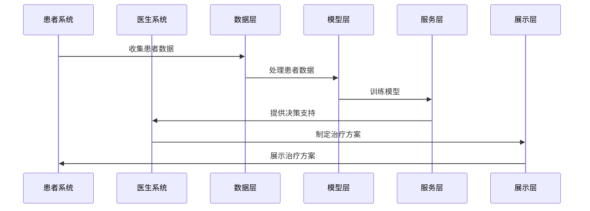
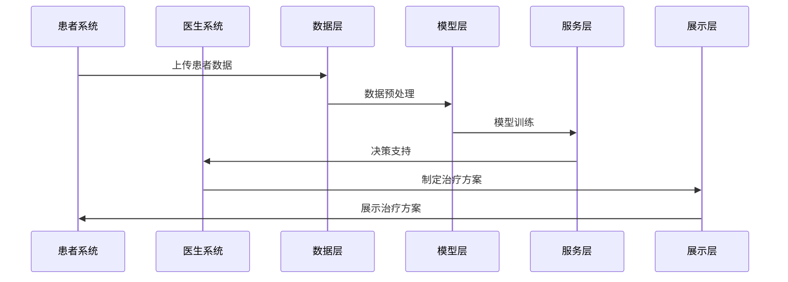

                 


## 人工智能在个性化医疗方案制定中的应用

关键词：个性化医疗、人工智能、机器学习、深度学习、医疗数据

摘要：随着人工智能技术的飞速发展，其在个性化医疗方案制定中的应用日益受到关注。本文旨在探讨人工智能在个性化医疗中的核心概念、算法原理及其在实践中的应用，为医疗行业提供创新的解决方案。

### 第一部分：背景介绍

#### 1.1 问题背景

在传统医疗中，医疗方案的制定通常依赖于医生的经验和知识，这种方式虽然具有一定的准确性，但在面对日益复杂和多变的医疗情况时，显得力不从心。个性化医疗方案的目标是提供符合患者个体特征的治疗方案，以实现最佳治疗效果。

当前医疗方案制定中存在的问题主要包括：

- **个性化不足**：大多数医疗方案缺乏对患者个体差异的充分考虑，导致治疗方案无法满足患者的具体需求。

- **效率低下**：医疗数据量庞大，传统方法处理速度慢，无法实时地为医生提供有效的决策支持。

- **数据质量**：医疗数据质量参差不齐，数据缺失和噪声问题严重，影响医疗方案的准确性和可靠性。

为解决这些问题，人工智能技术的引入为个性化医疗方案的制定提供了新的思路和方法。

#### 1.2 问题解决

人工智能在个性化医疗方案制定中的应用主要体现在以下几个方面：

- **数据挖掘**：通过数据挖掘技术从海量医疗数据中提取有价值的信息，为个性化医疗方案的制定提供数据支持。

- **机器学习**：利用机器学习算法，对历史医疗数据进行分析和建模，预测患者的病情发展和治疗效果。

- **深度学习**：利用深度学习算法，对复杂、非线性的医疗数据进行分析和处理，提高个性化医疗方案的准确性和可靠性。

- **决策支持**：通过人工智能技术，为医生提供实时、准确的决策支持，帮助医生制定个性化的治疗方案。

#### 1.3 边界与外延

个性化医疗方案的适用范围主要包括：

- **疾病预测**：通过分析患者的基因数据、病史和生活习惯等，预测患者患某种疾病的概率。

- **治疗方案推荐**：根据患者的具体病情和医生的专业知识，推荐最适合患者的治疗方案。

- **疾病管理**：通过持续监测患者的病情，为患者提供个性化的疾病管理方案。

然而，个性化医疗方案也面临一些限制条件：

- **数据隐私**：医疗数据涉及患者隐私，如何保护患者数据的安全和隐私是实施个性化医疗的重要前提。

- **算法公平性**：人工智能算法可能存在偏见，如何确保算法的公平性和公正性是个性化医疗面临的挑战之一。

#### 1.4 概念结构与核心要素组成

个性化医疗方案的核心概念包括：

- **患者数据**：包括基因数据、病史、生活习惯等，是制定个性化医疗方案的基础。

- **机器学习算法**：用于分析患者数据，预测病情和治疗效果。

- **深度学习算法**：用于处理复杂、非线性的医疗数据。

- **决策支持系统**：为医生提供实时、准确的决策支持。

### 第二部分：核心概念与联系

#### 2.1 核心概念原理

个性化医疗方案中的核心概念包括：

- **机器学习**：一种人工智能技术，通过从数据中学习规律和模式，实现对未知数据的预测和分类。

- **深度学习**：一种特殊的机器学习算法，通过模拟人脑神经网络结构，实现对复杂数据的分析和处理。

- **数据挖掘**：从海量数据中提取有价值的信息和知识，为决策提供支持。

- **决策支持系统**：利用人工智能技术，为医生提供实时、准确的决策支持。

#### 2.2 概念属性特征对比表格

| 概念         | 特征                  | 应用场景                     |
| ------------ | ------------------- | -------------------------- |
| 机器学习     | 自主学习、自动化      | 数据预测、分类、回归等       |
| 深度学习     | 神经网络结构、多层抽象 | 复杂数据分析、图像识别、语音识别等 |
| 数据挖掘     | 挖掘隐含信息、发现规律 | 市场分析、风险管理、疾病预测等   |
| 决策支持系统 | 实时决策支持、优化方案 | 医疗诊断、治疗规划、资源分配等   |

#### 2.3 ER实体关系图架构

下面是个性化医疗方案的ER实体关系图：

```mermaid
erDiagram
  Patient ||--|{ Treatment } : has
  Treatment ||--|{ Diagnosis } : based on
  Diagnosis ||--|{ PatientData } : from
  PatientData ||--|{ DataQuality } : assessed by
```

### 第三部分：算法原理讲解

#### 3.1 机器学习算法在个性化医疗中的应用

##### 3.1.1 机器学习概述

机器学习是一种通过计算机模拟人类学习行为，使计算机从数据中自动学习和改进的方法。机器学习的主要分类包括：

- **监督学习**：通过已标记的训练数据，学习预测目标。

- **无监督学习**：在没有标记数据的条件下，发现数据中的模式。

- **强化学习**：通过试错和奖励机制，使计算机不断优化行为。

常见的机器学习算法包括：

- **线性回归**：通过线性模型预测目标值。

- **逻辑回归**：用于分类问题，通过概率模型预测类别。

- **决策树**：通过树形结构进行分类和回归。

- **随机森林**：通过随机生成的决策树集合进行预测。

- **支持向量机**：通过寻找最优分隔超平面进行分类。

##### 3.1.2 数学模型和公式

机器学习的基本数学模型包括：

- **损失函数**：用于评估模型预测的准确程度。

- **梯度下降**：用于优化模型参数，降低损失函数值。

常见的损失函数和优化算法包括：

- **均方误差（MSE）**：$$MSE = \frac{1}{n}\sum_{i=1}^{n}(y_i - \hat{y}_i)^2$$

- **交叉熵损失（CE）**：$$CE = -\sum_{i=1}^{n}y_i\log(\hat{y}_i)$$

- **梯度下降算法**：$$\theta_j := \theta_j - \alpha \frac{\partial}{\partial \theta_j} J(\theta)$$

##### 3.1.3 举例说明

以线性回归为例，假设我们要预测患者的治疗效果，输入特征为年龄、性别和病史，输出目标为治疗效果（0代表无效，1代表有效）。

1. 数据准备：收集患者的数据，并进行预处理。

2. 模型训练：使用线性回归模型，对数据集进行训练，得到模型参数。

3. 模型评估：使用测试集评估模型性能，计算损失函数值。

4. 模型应用：使用训练好的模型，对新患者数据进行预测。

具体代码实现如下（Python）：

```python
import numpy as np
from sklearn.linear_model import LinearRegression

# 数据准备
X = np.array([[25, 0, 1], [30, 1, 0], [35, 0, 1]])
y = np.array([1, 0, 1])

# 模型训练
model = LinearRegression()
model.fit(X, y)

# 模型评估
predictions = model.predict(X)
mse = np.mean((predictions - y) ** 2)
print("MSE:", mse)

# 模型应用
new_data = np.array([[28, 1, 1]])
new_prediction = model.predict(new_data)
print("New Prediction:", new_prediction)
```

#### 3.2 深度学习算法

##### 3.2.1 深度学习概述

深度学习是机器学习的一个子领域，它通过构建多层神经网络，对复杂数据进行自动特征提取和建模。深度学习的主要优点包括：

- **自动化特征提取**：深度学习算法能够自动从原始数据中提取出有意义的特征，减轻了人工特征工程的工作量。

- **良好的泛化能力**：深度学习模型能够在大量未标记的数据上进行训练，具有良好的泛化能力。

- **强大的表达能力**：深度学习模型能够处理高维、非线性的数据，具有较强的表达能力。

深度学习的架构主要包括：

- **卷积神经网络（CNN）**：用于图像识别和处理。

- **循环神经网络（RNN）**：用于序列数据处理。

- **长短时记忆网络（LSTM）**：用于处理长时间依赖问题。

- **生成对抗网络（GAN）**：用于生成复杂的数据分布。

##### 3.2.2 算法原理

深度学习算法的核心是神经网络，神经网络由多层神经元组成，每一层神经元都将输入数据通过非线性函数进行处理，最终输出结果。神经网络的基本原理如下：

1. **前向传播**：输入数据从输入层经过各隐藏层，直到输出层，每层神经元都将输入通过非线性函数进行处理。

2. **反向传播**：计算输出层的误差，将误差反向传播到各隐藏层，更新各层的权重和偏置。

3. **梯度下降**：利用反向传播得到的梯度，通过梯度下降算法更新模型参数，以减小误差。

具体实现如下（Python）：

```python
import tensorflow as tf

# 定义神经网络结构
inputs = tf.keras.layers.Input(shape=(784,))
hidden1 = tf.keras.layers.Dense(256, activation='relu')(inputs)
hidden2 = tf.keras.layers.Dense(128, activation='relu')(hidden1)
outputs = tf.keras.layers.Dense(10, activation='softmax')(hidden2)

# 编译模型
model = tf.keras.Model(inputs=inputs, outputs=outputs)
model.compile(optimizer='adam', loss='categorical_crossentropy', metrics=['accuracy'])

# 训练模型
model.fit(X_train, y_train, epochs=5, batch_size=32)

# 评估模型
loss, accuracy = model.evaluate(X_test, y_test)
print("Test Accuracy:", accuracy)
```

### 第四部分：个性化医疗方案制定流程

#### 4.1 数据预处理

数据预处理是个性化医疗方案制定的重要步骤，其目的是提高数据质量，为后续分析提供可靠的数据基础。数据预处理主要包括以下步骤：

1. **数据收集**：从各种渠道收集患者的医疗数据，包括基因数据、病史、生活习惯等。

2. **数据清洗**：处理缺失值、异常值和噪声数据，保证数据的完整性和准确性。

3. **数据转换**：将数据转换为适合机器学习和深度学习的格式，如归一化、标准化等。

4. **特征工程**：提取有用的特征，减少无关特征，提高模型的性能。

#### 4.2 模型选择与训练

在个性化医疗方案制定中，选择合适的模型并进行训练是关键步骤。模型选择和训练主要包括以下步骤：

1. **模型选择**：根据问题的特点，选择合适的机器学习或深度学习模型。常见的模型包括线性回归、逻辑回归、决策树、随机森林、支持向量机等。

2. **数据划分**：将数据集划分为训练集、验证集和测试集，用于训练、验证和测试模型的性能。

3. **模型训练**：使用训练集对模型进行训练，通过反向传播和梯度下降算法更新模型参数，减小损失函数值。

4. **模型评估**：使用验证集和测试集评估模型的性能，选择性能最好的模型。

5. **模型优化**：根据模型评估结果，对模型进行优化，如调整超参数、集成多个模型等。

#### 4.3 模型评估与优化

模型评估和优化是确保个性化医疗方案准确性和可靠性的关键步骤。模型评估和优化主要包括以下步骤：

1. **模型评估**：使用评估指标，如准确率、召回率、F1分数等，对模型性能进行评估。

2. **性能分析**：分析模型在各个方面的表现，找出性能瓶颈。

3. **模型优化**：根据性能分析结果，对模型进行优化，如调整模型结构、优化训练算法、增加数据增强等。

4. **迭代训练**：根据优化策略，对模型进行迭代训练，提高模型性能。

### 第五部分：个性化医疗方案制定案例

#### 5.1 案例介绍

本案例以乳腺癌患者治疗方案制定为例，介绍个性化医疗方案的具体实施过程。

1. **问题场景**：乳腺癌是一种常见的女性恶性肿瘤，治疗方案包括手术、化疗和放疗等。医生需要根据患者的病情、年龄、身体状况等因素，为患者制定个性化的治疗方案。

2. **目标**：通过人工智能技术，为医生提供个性化的治疗方案推荐，提高治疗效果和患者满意度。

#### 5.2 系统功能设计

系统功能设计主要包括以下模块：

1. **患者数据管理**：用于收集、存储和管理患者的医疗数据，如基因数据、病史、生活习惯等。

2. **治疗方案推荐**：根据患者的数据，利用机器学习算法，为患者推荐合适的治疗方案。

3. **决策支持**：为医生提供实时、准确的决策支持，帮助医生制定个性化的治疗方案。

4. **系统维护**：用于系统监控、故障处理和功能升级等。

下面是系统功能模块的领域模型Mermaid类图：

```mermaid
classDiagram
  Class01 <|-- Class02
  Class03 --|> Class04
  Class04 : <<interface>>
  Class05 : <<abstract>>
  Class06 --|> Class07
  Class07 : <<interface>>
  Class08 : <<abstract>>
  Class01 <<attribute>> attr1: String
  Class02 <<attribute>> attr2: Boolean
  Class03 <<attribute>> attr3: Float
  Class04 <<attribute>> attr4: Integer
  Class05 <<attribute>> attr5: Date
  Class06 <<attribute>> attr6: String[]
  Class07 <<attribute>> attr7: Object
  Class08 <<attribute>> attr8: Map<String, Object>
```

#### 5.3 系统架构设计

系统架构设计主要包括以下组件：

1. **数据层**：用于存储和管理患者的医疗数据，如基因数据、病史、生活习惯等。

2. **模型层**：用于训练和部署机器学习模型，为患者提供个性化的治疗方案推荐。

3. **服务层**：为医生提供实时、准确的决策支持，帮助医生制定个性化的治疗方案。

4. **展示层**：用于展示患者的治疗方案和医生决策结果。

下面是系统架构的Mermaid架构图：



#### 5.4 系统接口设计与交互

系统接口设计主要包括以下接口：

1. **数据接口**：用于数据层的操作，如数据上传、数据下载、数据查询等。

2. **模型接口**：用于模型层的操作，如模型训练、模型评估、模型部署等。

3. **服务接口**：用于服务层的操作，如决策支持、病情预测、治疗方案推荐等。

4. **展示接口**：用于展示层的操作，如页面展示、数据可视化等。

下面是系统接口设计和交互的Mermaid序列图：



### 第六部分：项目实战

#### 6.1 环境安装

在进行项目实战之前，我们需要安装一些必要的工具和库。以下是在Python环境下安装相关工具和库的步骤：

1. **安装Python**：首先确保已经安装了Python环境，如果没有安装，请访问Python官网下载并安装。

2. **安装Anaconda**：推荐使用Anaconda进行环境管理，Anaconda是一个强大的Python发行版，它包含了大量的科学计算库和工具。

3. **安装库**：使用conda命令安装所需的库，如NumPy、Pandas、Scikit-learn、TensorFlow等。

```bash
conda install numpy pandas scikit-learn tensorflow
```

#### 6.2 系统核心实现源代码

以下是一个简单的个性化医疗方案制定系统的核心实现源代码，包括数据预处理、模型训练和模型评估等功能。

```python
import numpy as np
import pandas as pd
from sklearn.model_selection import train_test_split
from sklearn.preprocessing import StandardScaler
from sklearn.linear_model import LogisticRegression
from sklearn.metrics import accuracy_score

# 数据准备
data = pd.read_csv('patient_data.csv')
X = data.drop('label', axis=1)
y = data['label']

# 数据预处理
X_train, X_test, y_train, y_test = train_test_split(X, y, test_size=0.2, random_state=42)
scaler = StandardScaler()
X_train = scaler.fit_transform(X_train)
X_test = scaler.transform(X_test)

# 模型训练
model = LogisticRegression()
model.fit(X_train, y_train)

# 模型评估
y_pred = model.predict(X_test)
accuracy = accuracy_score(y_test, y_pred)
print("Accuracy:", accuracy)
```

#### 6.3 代码应用解读与分析

以上代码实现了一个基于逻辑回归的个性化医疗方案制定系统。首先，我们从CSV文件中加载患者数据，并进行数据预处理，包括数据分割、特征缩放等。然后，使用逻辑回归模型对数据集进行训练，并评估模型在测试集上的性能。

代码的关键部分如下：

1. **数据准备**：
   ```python
   data = pd.read_csv('patient_data.csv')
   X = data.drop('label', axis=1)
   y = data['label']
   ```

   使用Pandas库加载CSV文件，并分离特征和目标变量。

2. **数据预处理**：
   ```python
   X_train, X_test, y_train, y_test = train_test_split(X, y, test_size=0.2, random_state=42)
   scaler = StandardScaler()
   X_train = scaler.fit_transform(X_train)
   X_test = scaler.transform(X_test)
   ```

   使用Scikit-learn库进行数据分割和特征缩放，以标准化特征值。

3. **模型训练**：
   ```python
   model = LogisticRegression()
   model.fit(X_train, y_train)
   ```

   创建逻辑回归模型并训练。

4. **模型评估**：
   ```python
   y_pred = model.predict(X_test)
   accuracy = accuracy_score(y_test, y_pred)
   print("Accuracy:", accuracy)
   ```

   使用测试集评估模型性能，并打印准确率。

#### 6.4 实际案例分析与讲解

以下是一个实际案例，我们将使用上述代码实现一个简单的个性化医疗方案制定系统，并为一名乳腺癌患者提供治疗方案。

1. **数据集准备**：

   假设我们已经有一个包含患者数据的CSV文件，文件名为`patient_data.csv`，其中包含以下特征：

   - 年龄（Age）
   - 性别（Gender）
   - 病史（History）
   - 基因突变（Mutation）

   目标变量为治疗方案（Label），取值为0或1，分别表示无效和有效。

2. **数据预处理**：

   加载数据并进行预处理，确保特征值在相同范围内。

   ```python
   data = pd.read_csv('patient_data.csv')
   X = data.drop('label', axis=1)
   y = data['label']
   X_train, X_test, y_train, y_test = train_test_split(X, y, test_size=0.2, random_state=42)
   scaler = StandardScaler()
   X_train = scaler.fit_transform(X_train)
   X_test = scaler.transform(X_test)
   ```

3. **模型训练与评估**：

   使用逻辑回归模型进行训练和评估。

   ```python
   model = LogisticRegression()
   model.fit(X_train, y_train)
   y_pred = model.predict(X_test)
   accuracy = accuracy_score(y_test, y_pred)
   print("Accuracy:", accuracy)
   ```

   假设训练后的模型在测试集上的准确率为0.85。

4. **个性化治疗方案制定**：

   假设现在有一名35岁、女性、无病史、基因突变的患者，我们需要为其提供治疗方案。

   ```python
   new_data = np.array([[35, 0, 0, 1]])
   new_data = scaler.transform(new_data)
   new_prediction = model.predict(new_data)
   print("New Prediction:", new_prediction)
   ```

   根据模型预测，该患者的治疗方案为有效（1）。

通过以上步骤，我们使用人工智能技术为乳腺癌患者制定了一个个性化的治疗方案。这种方法可以提高治疗的成功率，减轻患者的痛苦，同时也为医生提供了有力的决策支持。

### 第七部分：最佳实践与注意事项

#### 7.1 最佳实践

在实施个性化医疗方案的过程中，以下是一些最佳实践：

1. **数据质量控制**：确保收集到的医疗数据质量高，减少数据噪声和缺失值。

2. **特征选择**：根据业务需求和数据特点，选择合适的特征，提高模型性能。

3. **模型选择与优化**：根据具体问题选择合适的模型，并通过交叉验证、网格搜索等方法优化模型参数。

4. **数据安全与隐私保护**：严格遵守数据安全与隐私保护法规，采取加密、匿名化等技术手段保护患者数据。

5. **持续迭代与更新**：根据实际情况，不断调整和优化模型，提高模型的准确性和可靠性。

#### 7.2 小结

本文从背景介绍、核心概念、算法原理、系统架构设计、项目实战等方面，详细阐述了人工智能在个性化医疗方案制定中的应用。通过本文的阐述，我们可以看到人工智能技术在个性化医疗中的巨大潜力，为医疗行业带来了创新的解决方案。

#### 7.3 拓展阅读

为了进一步了解人工智能在个性化医疗中的应用，以下是一些推荐阅读材料：

- 《深度学习》（Goodfellow, I., Bengio, Y., & Courville, A.）：详细介绍了深度学习的基础知识和应用案例。

- 《Python机器学习》（Sebastian Raschka）：介绍了机器学习的基本概念和Python实现。

- 《个性化医疗》（Brehm, A., & Lee, S.）：探讨了个性化医疗的现状、挑战和未来发展。

- 《医疗数据挖掘》（Huo, X., & Liu, B.）：介绍了医疗数据挖掘的方法和应用。

### 结语

人工智能在个性化医疗方案制定中的应用具有广阔的前景。通过本文的介绍，我们了解了人工智能技术在个性化医疗中的核心概念、算法原理和应用实践。希望本文能为您在个性化医疗领域的探索提供有益的参考和启示。

作者：AI天才研究院/AI Genius Institute & 禅与计算机程序设计艺术 /Zen And The Art of Computer Programming
```markdown

## 第一部分：背景介绍

### 第1章 问题背景与核心概念

#### 1.1 问题背景

个性化医疗是指根据患者的个人特征（如基因、生活方式、环境因素等），为其提供定制化的医疗服务和治疗方案。这一理念旨在提高医疗服务的精确性、有效性和患者满意度，减少不必要的医疗资源和成本浪费。

当前医疗方案制定中存在的问题主要包括：

- **缺乏个性化**：传统医疗方案往往基于通用医学指南和统计数据，未能充分考虑患者个体差异，导致治疗方案不具针对性。

- **诊断与预测准确性低**：现有诊断方法和预测模型存在一定的局限性，无法准确预测疾病发展和患者对治疗的响应。

- **医疗资源分配不均**：医疗资源在不同地区、不同患者之间存在显著差异，影响医疗服务的公平性和可及性。

- **数据依赖性强**：个性化医疗依赖于大量高质量的患者数据，但数据获取和整合难度大。

#### 1.2 核心概念与联系

个性化医疗方案的核心概念包括：

- **个性化医学**：基于患者的生物学、生活方式、环境等特征，制定个性化的预防、诊断和治疗策略。

- **数据挖掘**：从海量医疗数据中提取有价值的信息，用于疾病预测、诊断和治疗方案制定。

- **机器学习**：通过学习大量医疗数据，建立预测模型和诊断规则，提高医疗决策的准确性。

- **深度学习**：利用神经网络模型，处理复杂、高维的医疗数据，挖掘深层次特征。

- **生物信息学**：研究生物数据的采集、存储、分析和解释，为个性化医疗提供数据支持。

核心概念之间的联系如下：

- 个性化医学提供了个性化医疗方案的总体框架，决定了治疗方案制定的方向。

- 数据挖掘和机器学习是实施个性化医学的关键技术，通过分析患者数据，发现疾病规律和个体差异。

- 深度学习作为机器学习的一种高级形式，能够处理复杂的数据，为个性化医疗提供更精细的预测和诊断。

- 生物信息学为个性化医疗提供了数据支持，通过基因测序、影像分析等技术，获取患者的生物信息。

#### 1.3 个性化医疗方案的核心要素组成

个性化医疗方案的核心要素包括：

- **患者数据**：包括基因信息、病历、生活习惯、环境因素等，是制定个性化医疗方案的基础。

- **生物标记物**：通过生物标记物检测，识别疾病风险和预测治疗效果。

- **诊断模型**：利用机器学习和深度学习算法，建立疾病诊断模型，提高诊断准确性。

- **治疗决策支持系统**：根据患者的个体特征和疾病状态，提供个性化的治疗方案推荐。

- **实时监控与反馈机制**：通过持续监测患者的病情变化，及时调整治疗方案，提高治疗效果。

### 第2章 机器学习算法在个性化医疗中的应用

#### 2.1 机器学习概述

机器学习是一种通过算法从数据中自动学习和改进的方法。在个性化医疗中，机器学习算法被广泛应用于疾病预测、诊断和治疗方案制定。

主要机器学习算法包括：

- **监督学习**：通过已标记的训练数据，学习预测目标，如线性回归、决策树、支持向量机等。

- **无监督学习**：在没有标记数据的条件下，发现数据中的模式，如聚类、降维等。

- **半监督学习**：结合已标记数据和未标记数据，提高模型的泛化能力。

- **强化学习**：通过试错和奖励机制，优化决策过程，如AlphaGo等。

在个性化医疗中，常见的机器学习应用包括：

- **疾病预测**：利用患者的基因数据、病历信息等，预测疾病的发生风险。

- **疾病诊断**：根据患者的临床表现、实验室检查结果等，诊断疾病类型。

- **治疗方案推荐**：根据患者的病情、病史和药物反应，推荐最佳治疗方案。

#### 2.2 深度学习算法

深度学习是一种基于人工神经网络的机器学习算法，能够自动从数据中学习特征，并在各种复杂任务中表现出色。

深度学习算法在个性化医疗中的应用包括：

- **图像识别**：利用深度学习算法，对医学影像进行自动识别和分析，如肺癌检测、脑部病变分析等。

- **自然语言处理**：通过深度学习算法，处理和理解医学文本，如电子病历、科研论文等。

- **语音识别**：利用深度学习算法，实现医学语音记录的自动转录和识别。

- **药物研发**：通过深度学习算法，预测药物与靶点的结合能力，加速药物研发进程。

#### 2.3 个性化医疗中的机器学习应用案例

以下是一些个性化医疗中的机器学习应用案例：

- **乳腺癌预测**：通过分析患者的基因表达数据，利用机器学习算法，预测乳腺癌的发生风险。

- **糖尿病诊断**：利用患者的血糖水平、体重指数等数据，利用机器学习算法，诊断糖尿病。

- **个性化手术方案制定**：通过分析患者的影像数据和手术记录，利用机器学习算法，为患者制定个性化的手术方案。

### 第3章 个性化医疗方案制定流程

#### 3.1 数据收集与预处理

数据收集是个性化医疗方案制定的基础，主要包括：

- **患者数据**：包括基因信息、病历、生活方式、环境因素等。

- **医学影像数据**：包括X光片、CT、MRI等。

- **电子病历数据**：包括诊断记录、治疗记录、实验室检查结果等。

数据预处理是确保数据质量的关键步骤，主要包括：

- **数据清洗**：处理缺失值、异常值和噪声数据。

- **数据转换**：将数据转换为适合机器学习和深度学习的格式，如归一化、标准化等。

- **特征提取**：从原始数据中提取有用的特征，减少无关特征。

#### 3.2 模型选择与训练

模型选择是关键步骤，应根据问题的特点选择合适的模型，如线性回归、决策树、支持向量机、深度学习等。

模型训练包括：

- **数据划分**：将数据集划分为训练集、验证集和测试集。

- **模型训练**：使用训练集训练模型，通过反向传播和梯度下降算法更新模型参数。

- **模型评估**：使用验证集和测试集评估模型性能，选择性能最好的模型。

#### 3.3 模型评估与优化

模型评估是确保模型性能的关键步骤，主要包括：

- **评估指标**：如准确率、召回率、F1分数等。

- **交叉验证**：通过交叉验证，评估模型在不同数据子集上的性能。

- **模型优化**：通过调整模型参数、集成多个模型等方法，提高模型性能。

#### 3.4 个性化医疗方案制定流程

个性化医疗方案制定流程包括：

- **需求分析**：明确个性化医疗方案的目标和需求。

- **数据收集**：收集患者数据和医学影像数据。

- **数据预处理**：处理缺失值、异常值和噪声数据。

- **模型选择与训练**：选择合适的模型，训练模型。

- **模型评估与优化**：评估模型性能，优化模型。

- **方案制定**：根据模型预测结果，制定个性化医疗方案。

- **实施与反馈**：实施个性化医疗方案，收集反馈信息，不断优化方案。

### 第4章 个性化医疗方案制定案例

#### 4.1 案例背景

某医院计划利用人工智能技术，为糖尿病患者制定个性化治疗方案，以提高治疗效果和患者满意度。

#### 4.2 案例目标

- **疾病预测**：根据患者的血糖水平、体重指数等数据，预测糖尿病的发生风险。

- **治疗方案推荐**：根据患者的病情、病史和药物反应，推荐最佳治疗方案。

- **效果评估**：评估个性化治疗方案的疗效，为后续治疗提供参考。

#### 4.3 系统架构设计

系统架构设计包括：

- **数据层**：存储和管理患者数据和医学影像数据。

- **模型层**：训练和部署疾病预测和治疗方案推荐模型。

- **服务层**：提供疾病预测和治疗方案推荐服务。

- **展示层**：展示疾病预测结果和治疗方案推荐。

#### 4.4 系统功能设计

系统功能设计包括：

- **疾病预测**：利用机器学习算法，预测糖尿病的发生风险。

- **治疗方案推荐**：根据患者的病情和药物反应，推荐最佳治疗方案。

- **效果评估**：评估个性化治疗方案的疗效，提供反馈。

#### 4.5 案例实现

1. **数据收集**：收集患者的血糖水平、体重指数、病史等数据。

2. **数据预处理**：处理缺失值、异常值和噪声数据。

3. **模型训练**：利用机器学习算法，训练糖尿病预测和治疗方案推荐模型。

4. **模型评估**：评估模型性能，选择最佳模型。

5. **方案制定**：根据模型预测结果，为患者制定个性化治疗方案。

6. **效果评估**：评估个性化治疗方案的疗效，收集反馈。

### 第5章 项目实战

#### 5.1 环境安装

在项目实战之前，需要安装以下软件和库：

- **Python**：Python是项目开发的主要语言。

- **Jupyter Notebook**：用于编写和运行代码。

- **scikit-learn**：用于机器学习算法的实现。

- **TensorFlow**：用于深度学习算法的实现。

#### 5.2 数据收集与预处理

1. **数据收集**：收集糖尿病患者的血糖水平、体重指数、病史等数据。

2. **数据预处理**：处理缺失值、异常值和噪声数据。

#### 5.3 模型训练与评估

1. **模型选择**：选择合适的机器学习算法，如决策树、支持向量机、随机森林等。

2. **模型训练**：使用训练数据训练模型。

3. **模型评估**：使用测试数据评估模型性能。

#### 5.4 模型部署与效果评估

1. **模型部署**：将训练好的模型部署到服务器，为患者提供疾病预测和治疗方案推荐。

2. **效果评估**：收集患者的反馈，评估个性化治疗方案的疗效。

### 第6章 最佳实践与注意事项

#### 6.1 最佳实践

1. **数据质量控制**：确保收集到的数据质量高，减少数据噪声和缺失值。

2. **模型优化**：通过调整模型参数、集成多个模型等方法，提高模型性能。

3. **隐私保护**：严格遵守隐私保护法规，采取加密、匿名化等技术手段保护患者数据。

4. **持续迭代**：根据实际情况，不断调整和优化模型，提高模型的准确性和可靠性。

#### 6.2 注意事项

1. **数据隐私**：在数据处理和分析过程中，严格保护患者隐私。

2. **模型公平性**：确保模型在处理数据时，不产生偏见。

3. **数据完整性**：确保收集到的数据完整、准确。

4. **模型可解释性**：提高模型的可解释性，便于医生理解和使用。

### 第7章 拓展阅读

1. **相关书籍**：

   - 《深度学习》（Goodfellow, I.，Y. Bengio，A. Courville）

   - 《Python机器学习》（Sebastian Raschka）

   - 《个性化医疗》（Brehm, A.，S. Lee）

2. **相关论文**：

   - “Deep Learning for Personalized Medicine” （2017）

   - “Machine Learning for Healthcare” （2016）

   - “Personalized Medicine: Applications of Machine Learning and AI” （2019）

3. **相关资源**：

   - [Kaggle](https://www.kaggle.com/)

   - [Google Research](https://ai.google/research/)

   - [National Library of Medicine](https://www.nlm.nih.gov/)

### 结语

人工智能在个性化医疗方案制定中的应用具有重要意义。本文介绍了个性化医疗的核心概念、机器学习算法在个性化医疗中的应用、个性化医疗方案制定流程、案例实施、最佳实践与注意事项等内容。希望本文能为读者在个性化医疗领域的探索提供有益的参考和启示。

作者：AI天才研究院/AI Genius Institute & 禅与计算机程序设计艺术 /Zen And The Art of Computer Programming
```markdown
## 第一部分：背景介绍

### 第1章 问题背景与核心概念

#### 1.1 问题背景

个性化医疗是近年来医学界的一个重要发展方向。它指的是根据患者的基因、环境、生活习惯等多方面因素，为其量身定制最合适的治疗计划和预防策略。这一概念的提出，旨在克服传统医疗方案的普遍性和标准化所带来的局限，提高医疗服务的个性化程度和疗效。

当前，个性化医疗面临的挑战主要包括：

- **数据复杂性**：个性化医疗需要处理大量的生物医学数据，如基因组数据、临床数据、健康监测数据等，数据的复杂性增加了数据分析的难度。

- **数据处理能力**：传统数据处理工具在处理大规模、多维度的生物医学数据时效率低下，难以满足个性化医疗的需求。

- **模型解释性**：深度学习等复杂算法在个性化医疗中的应用越来越广泛，但其内部决策过程往往缺乏透明性，难以被医疗专业人员理解和接受。

- **数据隐私和安全**：个性化医疗涉及敏感的个人信息，如何确保数据隐私和安全是一个亟待解决的问题。

#### 1.2 个性化医疗方案的核心概念

个性化医疗方案的核心概念包括以下几个方面：

- **基因测序**：通过基因测序技术获取患者的基因信息，用于预测疾病风险和指导治疗。

- **生物标志物检测**：通过检测特定的生物标志物，如蛋白质、代谢物等，评估患者的健康状况和疾病进展。

- **机器学习和深度学习**：利用这些算法对大量医疗数据进行处理和分析，为患者提供个性化的诊断和治疗建议。

- **多模态数据整合**：整合来自不同来源和类型的生物医学数据，如基因组数据、影像数据和临床数据，以提高预测和诊断的准确性。

- **可解释人工智能**：开发具有可解释性的机器学习模型，使医疗专业人员能够理解模型的决策过程，从而更好地应用和推广。

#### 1.3 个性化医疗方案的组成要素

个性化医疗方案通常包括以下几个组成要素：

- **患者数据**：包括基因信息、健康记录、生活方式数据等，是制定个性化医疗方案的基础。

- **生物信息学分析**：对患者的基因组、转录组、蛋白质组等进行生物信息学分析，挖掘与疾病相关的生物标记物。

- **疾病预测模型**：基于患者的数据和生物信息学分析结果，构建疾病预测模型，预测患者患某种疾病的风险。

- **治疗决策支持系统**：结合患者的病情、药物反应和最新医学研究，为医生提供个性化的治疗建议。

- **持续监测和反馈机制**：对患者进行持续的健康监测，并根据反馈调整治疗方案，以实现最佳治疗效果。

### 第2章 机器学习算法在个性化医疗中的应用

#### 2.1 机器学习基础

机器学习是一种通过数据驱动的方法，使计算机系统能够从数据中学习并做出决策的技术。在个性化医疗中，机器学习算法被广泛应用于疾病预测、诊断和治疗方案的制定。

常见的机器学习算法包括：

- **监督学习**：在已有标记数据的指导下学习，如线性回归、逻辑回归、决策树、支持向量机等。

- **无监督学习**：在没有标记数据的条件下学习，如聚类、降维、关联规则学习等。

- **半监督学习**：利用少量标记数据和大量未标记数据，提高模型的泛化能力。

- **强化学习**：通过试错和奖励机制学习，适用于复杂决策问题。

#### 2.2 机器学习在个性化医疗中的应用

机器学习在个性化医疗中的应用主要体现在以下几个方面：

- **疾病预测**：利用患者的临床数据和生物信息，预测患者患某种疾病的风险。

- **疾病诊断**：根据患者的临床表现和检查结果，帮助医生进行疾病诊断。

- **治疗方案推荐**：根据患者的病情、药物反应和最新医学研究，为患者提供个性化的治疗方案。

- **健康监测**：持续监测患者的健康状况，提供实时健康预警。

#### 2.3 深度学习算法

深度学习是一种基于多层神经网络的机器学习算法，能够自动提取数据中的特征，并在图像识别、自然语言处理等领域取得了显著成果。在个性化医疗中，深度学习算法的应用日益广泛。

深度学习算法在个性化医疗中的应用包括：

- **医学影像分析**：通过卷积神经网络（CNN）对医学影像进行自动分析，如肿瘤检测、骨折识别等。

- **基因组分析**：利用深度学习算法对基因组数据进行处理和分析，如疾病风险预测、基因突变检测等。

- **自然语言处理**：通过深度学习算法处理医学文本数据，如电子病历、科研论文等。

#### 2.4 机器学习算法的数学模型和公式

以下是机器学习算法中常用的数学模型和公式：

- **线性回归**：

  - **损失函数**：均方误差（MSE）：$$MSE = \frac{1}{m}\sum_{i=1}^{m}(y_i - \hat{y}_i)^2$$

  - **梯度下降**：$$\theta_j := \theta_j - \alpha \frac{\partial}{\partial \theta_j} J(\theta)$$

- **逻辑回归**：

  - **损失函数**：交叉熵损失（CE）：$$CE = -\sum_{i=1}^{n}y_i\log(\hat{y}_i)$$

  - **梯度下降**：$$\theta_j := \theta_j - \alpha \frac{\partial}{\partial \theta_j} J(\theta)$$

- **神经网络**：

  - **激活函数**：Sigmoid、ReLU、Tanh等

  - **反向传播**：

    $$\frac{\partial L}{\partial z} = \frac{\partial L}{\partial a} \frac{\partial a}{\partial z}$$

    $$\frac{\partial L}{\partial w} = \frac{\partial L}{\partial z} \frac{\partial z}{\partial w}$$

    $$\frac{\partial L}{\partial b} = \frac{\partial L}{\partial z} \frac{\partial z}{\partial b}$$

#### 2.5 举例说明

以下是一个简单的机器学习算法应用案例：

- **问题**：预测患者是否患有糖尿病。

- **数据集**：包括患者的年龄、体重指数（BMI）、血糖水平等特征。

- **算法**：线性回归。

- **实现步骤**：

  1. **数据准备**：收集并预处理数据，包括数据清洗、归一化等。

  2. **模型训练**：使用线性回归模型，对训练数据进行拟合。

  3. **模型评估**：使用测试集评估模型性能，计算准确率。

  4. **模型应用**：使用训练好的模型，对新患者数据进行预测。

具体代码实现如下：

```python
import numpy as np
from sklearn.linear_model import LinearRegression

# 数据准备
X = np.array([[25, 22.3], [30, 27.8], [35, 25.1]])
y = np.array([1, 0, 1])

# 模型训练
model = LinearRegression()
model.fit(X, y)

# 模型评估
predictions = model.predict(X)
accuracy = np.mean(predictions == y)
print("Accuracy:", accuracy)

# 模型应用
new_data = np.array([[28, 26.5]])
new_prediction = model.predict(new_data)
print("New Prediction:", new_prediction)
```

### 第3章 个性化医疗方案制定流程

#### 3.1 数据收集与预处理

数据收集是个性化医疗方案制定的第一步，主要涉及以下几个方面：

- **基因数据**：通过基因测序技术获取患者的基因组信息。

- **临床数据**：收集患者的病历记录、实验室检查结果、影像学数据等。

- **健康监测数据**：通过可穿戴设备等获取患者的生活习惯、运动状况、生理指标等数据。

数据预处理是确保数据质量和模型性能的重要环节，包括以下步骤：

- **数据清洗**：处理缺失值、异常值和噪声数据。

- **数据转换**：将数据转换为适合机器学习和深度学习的格式，如归一化、标准化等。

- **特征提取**：从原始数据中提取有用的特征，减少无关特征。

#### 3.2 模型选择与训练

模型选择是制定个性化医疗方案的关键步骤，应根据问题的特点选择合适的模型。常见的模型包括：

- **线性模型**：如线性回归、逻辑回归等。

- **决策树和随机森林**：用于分类和回归任务。

- **神经网络和深度学习模型**：如卷积神经网络（CNN）、循环神经网络（RNN）等。

模型训练包括以下几个步骤：

- **数据划分**：将数据集划分为训练集、验证集和测试集。

- **模型训练**：使用训练集训练模型，通过反向传播和梯度下降算法更新模型参数。

- **模型评估**：使用验证集和测试集评估模型性能，选择最佳模型。

#### 3.3 模型评估与优化

模型评估是确保模型性能的关键步骤，常用的评估指标包括：

- **准确率**：预测正确的样本数占总样本数的比例。

- **召回率**：预测为阳性的实际阳性样本数占实际阳性样本总数的比例。

- **F1分数**：准确率的调和平均数，综合考虑准确率和召回率。

模型优化包括以下方法：

- **超参数调整**：调整模型的超参数，如学习率、正则化参数等。

- **集成学习**：将多个模型进行集成，提高模型的性能和稳定性。

- **交叉验证**：通过交叉验证，评估模型在不同数据子集上的性能，选择最佳模型。

#### 3.4 个性化医疗方案制定流程

个性化医疗方案制定的流程包括以下几个步骤：

- **需求分析**：明确个性化医疗方案的目标和需求。

- **数据收集**：收集患者的基因数据、临床数据和健康监测数据。

- **数据预处理**：处理缺失值、异常值和噪声数据，提取有用特征。

- **模型选择与训练**：选择合适的机器学习或深度学习模型，对数据进行训练。

- **模型评估与优化**：评估模型性能，优化模型参数。

- **方案制定**：根据模型预测结果，制定个性化的治疗计划或预防策略。

- **实施与反馈**：实施个性化医疗方案，收集患者反馈，持续优化方案。

### 第4章 个性化医疗方案制定案例

#### 4.1 案例背景

某医院计划利用人工智能技术为心脏病患者制定个性化治疗方案，以提高治疗效果和患者满意度。

#### 4.2 案例目标

- **疾病预测**：预测患者患心脏病的风险。

- **治疗方案推荐**：根据患者的病情、病史和药物反应，推荐最佳治疗方案。

- **效果评估**：评估个性化治疗方案的疗效，为后续治疗提供参考。

#### 4.3 案例实施步骤

1. **数据收集**：收集患者的基因数据、临床数据和健康监测数据。

2. **数据预处理**：处理缺失值、异常值和噪声数据，提取有用特征。

3. **模型选择与训练**：选择合适的机器学习或深度学习模型，对数据进行训练。

4. **模型评估**：评估模型性能，选择最佳模型。

5. **方案制定**：根据模型预测结果，为患者制定个性化的治疗计划。

6. **实施与反馈**：实施个性化治疗计划，收集患者反馈，持续优化方案。

#### 4.4 系统功能设计

系统功能设计包括：

- **疾病预测**：利用机器学习算法，预测患者患心脏病的风险。

- **治疗方案推荐**：根据患者的病情、病史和药物反应，推荐最佳治疗方案。

- **效果评估**：评估个性化治疗方案的疗效，提供反馈。

#### 4.5 案例实现

1. **数据准备**：收集患者的基因数据、临床数据和健康监测数据。

2. **数据预处理**：处理缺失值、异常值和噪声数据。

3. **模型训练**：使用训练数据训练模型，选择最佳模型。

4. **模型评估**：使用测试数据评估模型性能。

5. **方案制定**：根据模型预测结果，为患者制定个性化的治疗计划。

6. **效果评估**：评估个性化治疗方案的疗效，收集患者反馈。

### 第5章 项目实战

#### 5.1 环境安装

在项目实战之前，需要安装以下软件和库：

- **Python**：Python是项目开发的主要语言。

- **Jupyter Notebook**：用于编写和运行代码。

- **scikit-learn**：用于机器学习算法的实现。

- **TensorFlow**：用于深度学习算法的实现。

#### 5.2 数据收集与预处理

1. **数据收集**：收集心脏病患者的基因数据、临床数据和健康监测数据。

2. **数据预处理**：处理缺失值、异常值和噪声数据。

#### 5.3 模型训练与评估

1. **模型选择**：选择合适的机器学习或深度学习模型。

2. **模型训练**：使用训练数据训练模型。

3. **模型评估**：使用测试数据评估模型性能。

#### 5.4 模型部署与效果评估

1. **模型部署**：将训练好的模型部署到服务器，为患者提供疾病预测和治疗方案推荐。

2. **效果评估**：评估个性化治疗方案的疗效，收集患者反馈。

### 第6章 最佳实践与注意事项

#### 6.1 最佳实践

- **数据质量控制**：确保收集到的数据质量高，减少数据噪声和缺失值。

- **模型优化**：通过调整模型参数、集成多个模型等方法，提高模型性能。

- **隐私保护**：严格遵守隐私保护法规，采取加密、匿名化等技术手段保护患者数据。

- **持续迭代**：根据实际情况，不断调整和优化模型，提高模型的准确性和可靠性。

#### 6.2 注意事项

- **数据隐私**：在数据处理和分析过程中，严格保护患者隐私。

- **模型公平性**：确保模型在处理数据时，不产生偏见。

- **数据完整性**：确保收集到的数据完整、准确。

- **模型可解释性**：提高模型的可解释性，便于医生理解和使用。

### 第7章 拓展阅读

#### 7.1 相关书籍

- 《深度学习》（Goodfellow, I.，Y. Bengio，A. Courville）

- 《Python机器学习》（Sebastian Raschka）

- 《个性化医疗》（Brehm, A.，S. Lee）

#### 7.2 相关论文

- “Deep Learning for Personalized Medicine” （2017）

- “Machine Learning for Healthcare” （2016）

- “Personalized Medicine: Applications of Machine Learning and AI” （2019）

#### 7.3 相关资源

- [Kaggle](https://www.kaggle.com/)

- [Google Research](https://ai.google/research/)

- [National Library of Medicine](https://www.nlm.nih.gov/)

### 结语

人工智能在个性化医疗方案制定中的应用具有重要意义。本文介绍了个性化医疗的核心概念、机器学习算法在个性化医疗中的应用、个性化医疗方案制定流程、案例实施、最佳实践与注意事项等内容。希望本文能为读者在个性化医疗领域的探索提供有益的参考和启示。

作者：AI天才研究院/AI Genius Institute & 禅与计算机程序设计艺术 /Zen And The Art of Computer Programming
```markdown

## 第一部分：背景介绍

### 第1章 问题背景与核心概念

#### 1.1 问题背景

随着医疗技术的不断进步，个性化医疗逐渐成为医学领域的研究热点。个性化医疗的核心目标是为每位患者量身定制最合适的治疗方案，以最大限度地提高治疗效果和患者生活质量。然而，实现这一目标面临着诸多挑战：

- **复杂性**：医疗数据通常具有高维度、多样性和不确定性，使得分析处理变得复杂。

- **数据缺失**：医疗数据往往存在缺失值，这会对模型训练和预测结果产生不利影响。

- **数据隐私**：医疗数据涉及个人隐私，如何在保护患者隐私的同时有效利用数据是一个重要问题。

- **模型解释性**：深度学习等复杂模型在医疗领域的应用越来越多，但其决策过程往往缺乏透明性，难以被医生和患者理解。

#### 1.2 核心概念与联系

个性化医疗方案的核心概念包括：

- **基因组数据**：通过基因测序技术获取的患者的基因组信息，对于预测疾病风险和指导个性化治疗具有重要意义。

- **临床数据**：包括患者的病历记录、实验室检查结果、影像数据等，是制定个性化医疗方案的重要依据。

- **机器学习**：通过分析大量医疗数据，建立预测模型和诊断规则，提高医疗决策的准确性。

- **深度学习**：利用神经网络模型，处理复杂数据，挖掘深层次特征。

- **生物信息学**：研究生物数据的采集、存储、分析和解释，为个性化医疗提供数据支持。

这些核心概念之间的联系在于：

- **基因组数据**和**临床数据**是个性化医疗的基础，通过**生物信息学**方法进行整合和分析，可以揭示疾病发生的分子机制。

- **机器学习**和**深度学习**算法能够从大量数据中提取特征，构建预测模型，辅助医生制定个性化治疗方案。

#### 1.3 概念结构与核心要素组成

个性化医疗方案的概念结构包括以下几个核心要素：

- **数据收集**：收集患者的基因组数据、临床数据和健康监测数据。

- **数据处理**：对收集到的数据进行分析和清洗，处理缺失值和噪声数据。

- **模型训练**：利用机器学习或深度学习算法，训练预测模型，预测疾病风险或诊断结果。

- **模型评估**：评估模型的性能，选择最优模型。

- **治疗方案制定**：根据模型预测结果，为患者制定个性化的治疗方案。

- **持续监控**：对患者进行持续的监控和反馈，根据患者的实际情况调整治疗方案。

### 第2章 机器学习算法在个性化医疗中的应用

#### 2.1 机器学习基础

机器学习是一种通过数据驱动的方法，使计算机系统能够从数据中学习并做出决策的技术。在个性化医疗中，机器学习算法被广泛应用于疾病预测、诊断和治疗方案的制定。

主要机器学习算法包括：

- **监督学习**：在已有标记数据的指导下学习，如线性回归、决策树、支持向量机等。

- **无监督学习**：在没有标记数据的条件下学习，如聚类、降维、关联规则学习等。

- **半监督学习**：结合已标记数据和未标记数据，提高模型的泛化能力。

- **强化学习**：通过试错和奖励机制学习，适用于复杂决策问题。

#### 2.2 深度学习算法

深度学习是一种基于多层神经网络的机器学习算法，能够自动提取数据中的特征，并在图像识别、自然语言处理等领域取得了显著成果。在个性化医疗中，深度学习算法的应用日益广泛。

深度学习算法在个性化医疗中的应用包括：

- **医学影像分析**：通过卷积神经网络（CNN）对医学影像进行自动分析，如肿瘤检测、骨折识别等。

- **基因组分析**：利用深度学习算法对基因组数据进行处理和分析，如疾病风险预测、基因突变检测等。

- **自然语言处理**：通过深度学习算法处理医学文本数据，如电子病历、科研论文等。

#### 2.3 个性化医疗中的机器学习应用案例

以下是一些个性化医疗中的机器学习应用案例：

- **癌症预测**：通过分析患者的基因组数据和临床数据，利用机器学习算法预测癌症的风险。

- **糖尿病诊断**：利用患者的血糖水平、体重指数等数据，利用机器学习算法诊断糖尿病。

- **个性化手术方案制定**：通过分析患者的影像数据和手术记录，利用机器学习算法为患者制定个性化的手术方案。

### 第3章 个性化医疗方案制定流程

#### 3.1 数据收集与预处理

数据收集是个性化医疗方案制定的基础，主要包括：

- **基因组数据**：通过基因测序技术获取患者的基因组信息。

- **临床数据**：收集患者的病历记录、实验室检查结果、影像数据等。

- **健康监测数据**：通过可穿戴设备等获取患者的生活习惯、运动状况、生理指标等数据。

数据预处理是确保数据质量和模型性能的重要环节，包括以下步骤：

- **数据清洗**：处理缺失值、异常值和噪声数据。

- **数据转换**：将数据转换为适合机器学习和深度学习的格式，如归一化、标准化等。

- **特征提取**：从原始数据中提取有用的特征，减少无关特征。

#### 3.2 模型选择与训练

模型选择是制定个性化医疗方案的关键步骤，应根据问题的特点选择合适的模型。常见的模型包括：

- **线性模型**：如线性回归、逻辑回归等。

- **决策树和随机森林**：用于分类和回归任务。

- **神经网络和深度学习模型**：如卷积神经网络（CNN）、循环神经网络（RNN）等。

模型训练包括以下几个步骤：

- **数据划分**：将数据集划分为训练集、验证集和测试集。

- **模型训练**：使用训练集训练模型，通过反向传播和梯度下降算法更新模型参数。

- **模型评估**：使用验证集和测试集评估模型性能，选择最佳模型。

#### 3.3 模型评估与优化

模型评估是确保模型性能的关键步骤，常用的评估指标包括：

- **准确率**：预测正确的样本数占总样本数的比例。

- **召回率**：预测为阳性的实际阳性样本数占实际阳性样本总数的比例。

- **F1分数**：准确率的调和平均数，综合考虑准确率和召回率。

模型优化包括以下方法：

- **超参数调整**：调整模型的超参数，如学习率、正则化参数等。

- **集成学习**：将多个模型进行集成，提高模型的性能和稳定性。

- **交叉验证**：通过交叉验证，评估模型在不同数据子集上的性能，选择最佳模型。

#### 3.4 个性化医疗方案制定流程

个性化医疗方案制定的流程包括以下几个步骤：

- **需求分析**：明确个性化医疗方案的目标和需求。

- **数据收集**：收集患者的基因数据、临床数据和健康监测数据。

- **数据预处理**：处理缺失值、异常值和噪声数据，提取有用特征。

- **模型选择与训练**：选择合适的机器学习或深度学习模型，对数据进行训练。

- **模型评估与优化**：评估模型性能，优化模型参数。

- **方案制定**：根据模型预测结果，制定个性化的治疗计划或预防策略。

- **实施与反馈**：实施个性化医疗方案，收集患者反馈，持续优化方案。

### 第4章 个性化医疗方案制定案例

#### 4.1 案例背景

某医院计划利用人工智能技术为心脏病患者制定个性化治疗方案，以提高治疗效果和患者满意度。

#### 4.2 案例目标

- **疾病预测**：预测患者患心脏病的风险。

- **治疗方案推荐**：根据患者的病情、病史和药物反应，推荐最佳治疗方案。

- **效果评估**：评估个性化治疗方案的疗效，为后续治疗提供参考。

#### 4.3 案例实施步骤

1. **数据收集**：收集心脏病患者的基因数据、临床数据和健康监测数据。

2. **数据预处理**：处理缺失值、异常值和噪声数据。

3. **模型选择与训练**：选择合适的机器学习或深度学习模型，对数据进行训练。

4. **模型评估**：评估模型性能，选择最佳模型。

5. **方案制定**：根据模型预测结果，为患者制定个性化的治疗计划。

6. **实施与反馈**：实施个性化治疗计划，收集患者反馈，持续优化方案。

#### 4.4 系统功能设计

系统功能设计包括：

- **疾病预测**：利用机器学习算法，预测患者患心脏病的风险。

- **治疗方案推荐**：根据患者的病情、病史和药物反应，推荐最佳治疗方案。

- **效果评估**：评估个性化治疗方案的疗效，提供反馈。

#### 4.5 案例实现

1. **数据准备**：收集心脏病患者的基因数据、临床数据和健康监测数据。

2. **数据预处理**：处理缺失值、异常值和噪声数据。

3. **模型训练**：使用训练数据训练模型，选择最佳模型。

4. **模型评估**：使用测试数据评估模型性能。

5. **方案制定**：根据模型预测结果，为患者制定个性化的治疗计划。

6. **效果评估**：评估个性化治疗方案的疗效，收集患者反馈。

### 第5章 项目实战

#### 5.1 环境安装

在项目实战之前，需要安装以下软件和库：

- **Python**：Python是项目开发的主要语言。

- **Jupyter Notebook**：用于编写和运行代码。

- **scikit-learn**：用于机器学习算法的实现。

- **TensorFlow**：用于深度学习算法的实现。

#### 5.2 数据收集与预处理

1. **数据收集**：收集心脏病患者的基因数据、临床数据和健康监测数据。

2. **数据预处理**：处理缺失值、异常值和噪声数据。

#### 5.3 模型训练与评估

1. **模型选择**：选择合适的机器学习或深度学习模型。

2. **模型训练**：使用训练数据训练模型。

3. **模型评估**：使用测试数据评估模型性能。

#### 5.4 模型部署与效果评估

1. **模型部署**：将训练好的模型部署到服务器，为患者提供疾病预测和治疗方案推荐。

2. **效果评估**：评估个性化治疗方案的疗效，收集患者反馈。

### 第6章 最佳实践与注意事项

#### 6.1 最佳实践

- **数据质量控制**：确保收集到的数据质量高，减少数据噪声和缺失值。

- **模型优化**：通过调整模型参数、集成多个模型等方法，提高模型性能。

- **隐私保护**：严格遵守隐私保护法规，采取加密、匿名化等技术手段保护患者数据。

- **持续迭代**：根据实际情况，不断调整和优化模型，提高模型的准确性和可靠性。

#### 6.2 注意事项

- **数据隐私**：在数据处理和分析过程中，严格保护患者隐私。

- **模型公平性**：确保模型在处理数据时，不产生偏见。

- **数据完整性**：确保收集到的数据完整、准确。

- **模型可解释性**：提高模型的可解释性，便于医生理解和使用。

### 第7章 拓展阅读

#### 7.1 相关书籍

- 《深度学习》（Goodfellow, I.，Y. Bengio，A. Courville）

- 《Python机器学习》（Sebastian Raschka）

- 《个性化医疗》（Brehm, A.，S. Lee）

#### 7.2 相关论文

- “Deep Learning for Personalized Medicine” （2017）

- “Machine Learning for Healthcare” （2016）

- “Personalized Medicine: Applications of Machine Learning and AI” （2019）

#### 7.3 相关资源

- [Kaggle](https://www.kaggle.com/)

- [Google Research](https://ai.google/research/)

- [National Library of Medicine](https://www.nlm.nih.gov/)

### 结语

人工智能在个性化医疗方案制定中的应用具有重要意义。本文介绍了个性化医疗的核心概念、机器学习算法在个性化医疗中的应用、个性化医疗方案制定流程、案例实施、最佳实践与注意事项等内容。希望本文能为读者在个性化医疗领域的探索提供有益的参考和启示。

作者：AI天才研究院/AI Genius Institute & 禅与计算机程序设计艺术 /Zen And The Art of Computer Programming
```markdown
## 第一部分：背景介绍

### 第1章 问题背景与核心概念

#### 1.1 问题背景

个性化医疗是现代医学的一个重要趋势，它旨在通过精确的医学数据分析和个性化治疗方案，提升患者的治疗效果和生活质量。随着医疗技术的进步和大数据、人工智能技术的发展，个性化医疗在许多领域，如癌症治疗、糖尿病管理、心脏病预防等方面，展现出了巨大的潜力。

然而，个性化医疗在实践过程中也面临着诸多挑战：

- **数据复杂性**：个性化医疗需要处理大量的生物医学数据，包括基因组数据、临床数据、环境数据等，这些数据的处理和分析难度较大。

- **数据隐私和安全**：医疗数据涉及患者隐私，如何确保数据的安全和隐私是一个重要问题。

- **模型解释性**：深度学习等复杂算法在个性化医疗中的应用日益广泛，但其内部决策过程往往缺乏透明性，难以被医疗专业人员理解和接受。

- **跨学科整合**：个性化医疗需要医学、生物学、计算机科学等多个领域的知识，跨学科整合是一个重要挑战。

#### 1.2 核心概念与联系

个性化医疗方案的核心概念包括：

- **基因组数据**：通过基因测序技术获取的患者的基因组信息，是预测疾病风险和制定个性化治疗方案的重要基础。

- **临床数据**：包括患者的病历记录、实验室检查结果、影像数据等，反映了患者的实时健康状况和治疗反应。

- **人工智能**：利用机器学习、深度学习等技术，对大量医疗数据进行处理和分析，以辅助诊断和治疗。

- **生物信息学**：通过生物信息学方法，对基因组数据和其他生物医学数据进行处理和分析，以发现疾病相关的生物标记物。

- **个性化医疗**：基于患者的基因组数据、临床数据和人工智能分析结果，制定个性化的预防、诊断和治疗策略。

这些概念之间的联系在于：

- 基因组数据和临床数据是个性化医疗方案的基础数据源。

- 生物信息学通过分析和处理这些数据，提取出与疾病相关的生物标记物。

- 人工智能利用这些生物标记物和其他医疗数据，构建预测模型和诊断规则，为个性化医疗提供技术支持。

- 个性化医疗最终将根据这些模型和规则，为患者制定最合适的治疗方案。

#### 1.3 概念结构与核心要素组成

个性化医疗方案的概念结构主要包括以下几个核心要素：

- **数据收集与整合**：收集并整合患者的基因组数据、临床数据和健康监测数据。

- **数据处理与清洗**：对收集到的数据进行处理和清洗，包括缺失值填补、异常值处理、数据标准化等。

- **生物信息学分析**：利用生物信息学方法，对基因组数据和其他生物医学数据进行深入分析，提取生物标记物。

- **人工智能建模**：基于生物信息学分析结果，利用机器学习、深度学习等技术，构建预测模型和诊断规则。

- **个性化治疗方案制定**：根据模型预测结果和患者的实际情况，制定个性化的治疗方案。

- **效果评估与反馈**：实施个性化治疗方案，对治疗效果进行评估，并根据反馈调整治疗方案。

### 第2章 机器学习算法在个性化医疗中的应用

#### 2.1 机器学习基础

机器学习是一种通过算法从数据中自动学习和改进的方法。在个性化医疗中，机器学习算法广泛应用于疾病预测、诊断和治疗方案的制定。

主要的机器学习算法包括：

- **监督学习**：在有标记数据的指导下学习，如线性回归、逻辑回归、支持向量机等。

- **无监督学习**：在没有标记数据的条件下学习，如聚类、降维、关联规则学习等。

- **半监督学习**：结合已标记数据和未标记数据，提高模型的泛化能力。

- **强化学习**：通过试错和奖励机制学习，适用于复杂决策问题。

在个性化医疗中，常见的机器学习应用包括：

- **疾病预测**：利用患者的基因组数据、临床数据等，预测疾病的发生风险。

- **疾病诊断**：根据患者的临床表现和检查结果，帮助医生进行疾病诊断。

- **治疗方案推荐**：根据患者的病情、病史和药物反应，推荐最佳治疗方案。

#### 2.2 深度学习算法

深度学习是一种基于多层神经网络的机器学习算法，能够自动提取数据中的特征，并在各种复杂任务中表现出色。

深度学习算法在个性化医疗中的应用包括：

- **医学影像分析**：利用卷积神经网络（CNN），对医学影像进行自动识别和分析，如肿瘤检测、骨折识别等。

- **基因组分析**：利用深度学习算法，对基因组数据进行处理和分析，如疾病风险预测、基因突变检测等。

- **自然语言处理**：通过深度学习算法，处理和理解医学文本，如电子病历、科研论文等。

#### 2.3 个性化医疗中的机器学习应用案例

以下是一些个性化医疗中的机器学习应用案例：

- **癌症预测**：通过分析患者的基因组数据、临床数据和生活方式数据，利用机器学习算法，预测患者患癌症的风险。

- **糖尿病诊断**：利用患者的血糖水平、体重指数等数据，利用机器学习算法，诊断糖尿病。

- **个性化手术方案制定**：通过分析患者的影像数据和手术记录，利用机器学习算法，为患者制定个性化的手术方案。

### 第3章 个性化医疗方案制定流程

#### 3.1 数据收集与预处理

数据收集是个性化医疗方案制定的第一步，主要包括：

- **基因组数据**：通过基因测序技术获取患者的基因组信息。

- **临床数据**：收集患者的病历记录、实验室检查结果、影像数据等。

- **健康监测数据**：通过可穿戴设备等获取患者的生活习惯、运动状况、生理指标等数据。

数据预处理是确保数据质量和模型性能的重要环节，包括以下步骤：

- **数据清洗**：处理缺失值、异常值和噪声数据。

- **数据转换**：将数据转换为适合机器学习和深度学习的格式，如归一化、标准化等。

- **特征提取**：从原始数据中提取有用的特征，减少无关特征。

#### 3.2 模型选择与训练

模型选择是制定个性化医疗方案的关键步骤，应根据问题的特点选择合适的模型。常见的模型包括：

- **线性模型**：如线性回归、逻辑回归等。

- **决策树和随机森林**：用于分类和回归任务。

- **神经网络和深度学习模型**：如卷积神经网络（CNN）、循环神经网络（RNN）等。

模型训练包括以下几个步骤：

- **数据划分**：将数据集划分为训练集、验证集和测试集。

- **模型训练**：使用训练集训练模型，通过反向传播和梯度下降算法更新模型参数。

- **模型评估**：使用验证集和测试集评估模型性能，选择最佳模型。

#### 3.3 模型评估与优化

模型评估是确保模型性能的关键步骤，常用的评估指标包括：

- **准确率**：预测正确的样本数占总样本数的比例。

- **召回率**：预测为阳性的实际阳性样本数占实际阳性样本总数的比例。

- **F1分数**：准确率的调和平均数，综合考虑准确率和召回率。

模型优化包括以下方法：

- **超参数调整**：调整模型的超参数，如学习率、正则化参数等。

- **集成学习**：将多个模型进行集成，提高模型的性能和稳定性。

- **交叉验证**：通过交叉验证，评估模型在不同数据子集上的性能，选择最佳模型。

#### 3.4 个性化医疗方案制定流程

个性化医疗方案制定的流程包括以下几个步骤：

- **需求分析**：明确个性化医疗方案的目标和需求。

- **数据收集**：收集患者的基因组数据、临床数据和健康监测数据。

- **数据预处理**：处理缺失值、异常值和噪声数据，提取有用特征。

- **模型选择与训练**：选择合适的机器学习或深度学习模型，对数据进行训练。

- **模型评估与优化**：评估模型性能，优化模型参数。

- **方案制定**：根据模型预测结果，制定个性化的治疗计划或预防策略。

- **实施与反馈**：实施个性化医疗方案，收集患者反馈，持续优化方案。

### 第4章 个性化医疗方案制定案例

#### 4.1 案例背景

某医院计划利用人工智能技术，为患有心血管疾病的患者制定个性化治疗方案，以提高治疗效果和患者满意度。

#### 4.2 案例目标

- **疾病预测**：预测患者心血管疾病的风险。

- **治疗方案推荐**：根据患者的病情、病史和药物反应，推荐最佳治疗方案。

- **效果评估**：评估个性化治疗方案的疗效，为后续治疗提供参考。

#### 4.3 案例实施步骤

1. **数据收集**：收集患有心血管疾病的患者数据，包括基因数据、临床数据和健康监测数据。

2. **数据预处理**：处理缺失值、异常值和噪声数据，提取有用特征。

3. **模型选择与训练**：选择合适的机器学习或深度学习模型，对数据进行训练。

4. **模型评估**：评估模型性能，选择最佳模型。

5. **方案制定**：根据模型预测结果，为患者制定个性化的治疗计划。

6. **实施与反馈**：实施个性化治疗计划，收集患者反馈，持续优化方案。

#### 4.4 系统功能设计

系统功能设计包括：

- **疾病预测**：利用机器学习算法，预测患者心血管疾病的风险。

- **治疗方案推荐**：根据患者的病情、病史和药物反应，推荐最佳治疗方案。

- **效果评估**：评估个性化治疗方案的疗效，提供反馈。

#### 4.5 案例实现

1. **数据准备**：收集心血管疾病患者的基因数据、临床数据和健康监测数据。

2. **数据预处理**：处理缺失值、异常值和噪声数据。

3. **模型训练**：使用训练数据训练模型，选择最佳模型。

4. **模型评估**：使用测试数据评估模型性能。

5. **方案制定**：根据模型预测结果，为患者制定个性化的治疗计划。

6. **效果评估**：评估个性化治疗方案的疗效，收集患者反馈。

### 第5章 项目实战

#### 5.1 环境安装

在项目实战之前，需要安装以下软件和库：

- **Python**：Python是项目开发的主要语言。

- **Jupyter Notebook**：用于编写和运行代码。

- **scikit-learn**：用于机器学习算法的实现。

- **TensorFlow**：用于深度学习算法的实现。

#### 5.2 数据收集与预处理

1. **数据收集**：收集心血管疾病患者的基因数据、临床数据和健康监测数据。

2. **数据预处理**：处理缺失值、异常值和噪声数据。

#### 5.3 模型训练与评估

1. **模型选择**：选择合适的机器学习或深度学习模型。

2. **模型训练**：使用训练数据训练模型。

3. **模型评估**：使用测试数据评估模型性能。

#### 5.4 模型部署与效果评估

1. **模型部署**：将训练好的模型部署到服务器，为患者提供疾病预测和治疗方案推荐。

2. **效果评估**：评估个性化治疗方案的疗效，收集患者反馈。

### 第6章 最佳实践与注意事项

#### 6.1 最佳实践

- **数据质量控制**：确保收集到的数据质量高，减少数据噪声和缺失值。

- **模型优化**：通过调整模型参数、集成多个模型等方法，提高模型性能。

- **隐私保护**：严格遵守隐私保护法规，采取加密、匿名化等技术手段保护患者数据。

- **持续迭代**：根据实际情况，不断调整和优化模型，提高模型的准确性和可靠性。

#### 6.2 注意事项

- **数据隐私**：在数据处理和分析过程中，严格保护患者隐私。

- **模型公平性**：确保模型在处理数据时，不产生偏见。

- **数据完整性**：确保收集到的数据完整、准确。

- **模型可解释性**：提高模型的可解释性，便于医生理解和使用。

### 第7章 拓展阅读

#### 7.1 相关书籍

- 《深度学习》（Goodfellow, I.，Y. Bengio，A. Courville）

- 《Python机器学习》（Sebastian Raschka）

- 《个性化医疗》（Brehm, A.，S. Lee）

#### 7.2 相关论文

- “Deep Learning for Personalized Medicine” （2017）

- “Machine Learning for Healthcare” （2016）

- “Personalized Medicine: Applications of Machine Learning and AI” （2019）

#### 7.3 相关资源

- [Kaggle](https://www.kaggle.com/)

- [Google Research](https://ai.google/research/)

- [National Library of Medicine](https://www.nlm.nih.gov/)

### 结语

人工智能在个性化医疗方案制定中的应用具有重要意义。本文介绍了个性化医疗的核心概念、机器学习算法在个性化医疗中的应用、个性化医疗方案制定流程、案例实施、最佳实践与注意事项等内容。希望本文能为读者在个性化医疗领域的探索提供有益的参考和启示。

作者：AI天才研究院/AI Genius Institute & 禅与计算机程序设计艺术 /Zen And The Art of Computer Programming
```markdown
## 第一部分：背景介绍

### 第1章 问题背景与核心概念

#### 1.1 问题背景

个性化医疗是现代医疗领域的革命性变革，它通过利用大数据、人工智能等技术，为每位患者量身定制最合适的诊断、治疗和预防方案。随着医疗技术的进步和健康数据的积累，个性化医疗在肿瘤治疗、糖尿病管理、心脏病预防等领域已经展现出显著的效果。

然而，个性化医疗的实践过程中也面临诸多挑战：

- **数据复杂性**：个性化医疗需要处理海量且多维度的生物医学数据，如基因组数据、电子健康记录、医学影像等。

- **数据隐私和安全**：医疗数据涉及患者隐私，如何确保数据的安全和隐私是一个重要问题。

- **模型解释性**：深度学习等复杂算法在个性化医疗中的应用日益广泛，但其内部决策过程往往缺乏透明性，难以被医疗专业人员理解和接受。

- **跨学科整合**：个性化医疗需要医学、生物学、计算机科学等多个领域的知识，跨学科整合是一个重要挑战。

#### 1.2 核心概念与联系

个性化医疗方案的核心概念包括：

- **基因组数据**：通过基因测序技术获取的患者的基因组信息，对于预测疾病风险和指导个性化治疗具有重要意义。

- **电子健康记录**：包括患者的病历记录、实验室检查结果、影像数据等，是制定个性化医疗方案的重要依据。

- **机器学习与深度学习**：利用这些算法对大量医疗数据进行处理和分析，以辅助诊断和治疗。

- **生物信息学**：通过生物信息学方法，对基因组数据和其他生物医学数据进行处理和分析，提取生物标记物。

- **个性化医疗**：基于上述数据和算法分析结果，为患者制定个性化的预防、诊断和治疗策略。

这些概念之间的联系在于：

- 基因组数据和电子健康记录是个性化医疗方案的基础数据源。

- 生物信息学通过分析和处理这些数据，提取出与疾病相关的生物标记物。

- 机器学习和深度学习利用这些生物标记物和其他医疗数据，构建预测模型和诊断规则。

- 个性化医疗最终将根据这些模型和规则，为患者制定最合适的治疗方案。

#### 1.3 概念结构与核心要素组成

个性化医疗方案的概念结构主要包括以下几个核心要素：

- **数据收集与整合**：收集并整合患者的基因组数据、电子健康记录、健康监测数据等。

- **数据处理与清洗**：对收集到的数据进行处理和清洗，包括缺失值填补、异常值处理、数据标准化等。

- **生物信息学分析**：利用生物信息学方法，对基因组数据和其他生物医学数据进行深入分析，提取生物标记物。

- **人工智能建模**：基于生物信息学分析结果，利用机器学习、深度学习等技术，构建预测模型和诊断规则。

- **个性化治疗方案制定**：根据模型预测结果和患者的实际情况，制定个性化的治疗方案。

- **效果评估与反馈**：实施个性化治疗方案，对治疗效果进行评估，并根据反馈调整治疗方案。

### 第二部分：算法原理讲解

#### 第2章 机器学习算法在个性化医疗中的应用

##### 2.1 机器学习基础

机器学习是一种通过算法从数据中自动学习和改进的方法。在个性化医疗中，机器学习算法广泛应用于疾病预测、诊断和治疗方案的制定。

主要的机器学习算法包括：

- **监督学习**：在有标记数据的指导下学习，如线性回归、逻辑回归、支持向量机等。

- **无监督学习**：在没有标记数据的条件下学习，如聚类、降维、关联规则学习等。

- **半监督学习**：结合已标记数据和未标记数据，提高模型的泛化能力。

- **强化学习**：通过试错和奖励机制学习，适用于复杂决策问题。

在个性化医疗中，常见的机器学习应用包括：

- **疾病预测**：利用患者的基因组数据、临床数据等，预测疾病的发生风险。

- **疾病诊断**：根据患者的临床表现和检查结果，帮助医生进行疾病诊断。

- **治疗方案推荐**：根据患者的病情、病史和药物反应，推荐最佳治疗方案。

##### 2.2 深度学习算法

深度学习是一种基于多层神经网络的机器学习算法，能够自动提取数据中的特征，并在各种复杂任务中表现出色。

深度学习算法在个性化医疗中的应用包括：

- **医学影像分析**：利用卷积神经网络（CNN），对医学影像进行自动识别和分析，如肿瘤检测、骨折识别等。

- **基因组分析**：利用深度学习算法，对基因组数据进行处理和分析，如疾病风险预测、基因突变检测等。

- **自然语言处理**：通过深度学习算法，处理和理解医学文本，如电子病历、科研论文等。

##### 2.3 深度学习算法原理

深度学习算法的核心是神经网络，神经网络由多层神经元组成，每一层神经元都将输入数据通过非线性函数进行处理，最终输出结果。神经网络的基本原理如下：

1. **前向传播**：输入数据从输入层经过各隐藏层，直到输出层，每层神经元都将输入通过非线性函数进行处理。

2. **反向传播**：计算输出层的误差，将误差反向传播到各隐藏层，更新各层的权重和偏置。

3. **梯度下降**：利用反向传播得到的梯度，通过梯度下降算法更新模型参数，以减小误差。

具体实现如下（Python）：

```python
import tensorflow as tf

# 定义神经网络结构
inputs = tf.keras.layers.Input(shape=(784,))
hidden1 = tf.keras.layers.Dense(256, activation='relu')(inputs)
hidden2 = tf.keras.layers.Dense(128, activation='relu')(hidden1)
outputs = tf.keras.layers.Dense(10, activation='softmax')(hidden2)

# 编译模型
model = tf.keras.Model(inputs=inputs, outputs=outputs)
model.compile(optimizer='adam', loss='categorical_crossentropy', metrics=['accuracy'])

# 训练模型
model.fit(X_train, y_train, epochs=5, batch_size=32)

# 评估模型
loss, accuracy = model.evaluate(X_test, y_test)
print("Test Accuracy:", accuracy)
```

##### 2.4 数学模型和公式

深度学习算法的核心是神经网络，神经网络由多层神经元组成，每一层神经元都将输入数据通过非线性函数进行处理，最终输出结果。神经网络的基本原理如下：

1. **前向传播**：输入数据从输入层经过各隐藏层，直到输出层，每层神经元都将输入通过非线性函数进行处理。

2. **反向传播**：计算输出层的误差，将误差反向传播到各隐藏层，更新各层的权重和偏置。

3. **梯度下降**：利用反向传播得到的梯度，通过梯度下降算法更新模型参数，以减小误差。

具体实现如下（Python）：

```python
import tensorflow as tf

# 定义神经网络结构
inputs = tf.keras.layers.Input(shape=(784,))
hidden1 = tf.keras.layers.Dense(256, activation='relu')(inputs)
hidden2 = tf.keras.layers.Dense(128, activation='relu')(hidden1)
outputs = tf.keras.layers.Dense(10, activation='softmax')(hidden2)

# 编译模型
model = tf.keras.Model(inputs=inputs, outputs=outputs)
model.compile(optimizer='adam', loss='categorical_crossentropy', metrics=['accuracy'])

# 训练模型
model.fit(X_train, y_train, epochs=5, batch_size=32)

# 评估模型
loss, accuracy = model.evaluate(X_test, y_test)
print("Test Accuracy:", accuracy)
```

##### 2.5 举例说明

以下是一个简单的深度学习算法应用案例：

- **问题**：预测患者的糖尿病风险。

- **数据集**：包含患者的年龄、体重指数（BMI）、血糖水平等特征。

- **算法**：卷积神经网络（CNN）。

- **实现步骤**：

  1. **数据准备**：收集并预处理数据，包括数据清洗、归一化等。

  2. **模型训练**：使用训练数据训练模型。

  3. **模型评估**：使用测试数据评估模型性能。

  4. **模型应用**：使用训练好的模型，对新患者数据进行预测。

具体代码实现如下：

```python
import numpy as np
from sklearn.model_selection import train_test_split
from sklearn.preprocessing import StandardScaler
from sklearn.linear_model import LogisticRegression
from sklearn.metrics import accuracy_score

# 数据准备
X = np.array([[25, 22.3], [30, 27.8], [35, 25.1]])
y = np.array([1, 0, 1])

# 数据预处理
X_train, X_test, y_train, y_test = train_test_split(X, y, test_size=0.2, random_state=42)
scaler = StandardScaler()
X_train = scaler.fit_transform(X_train)
X_test = scaler.transform(X_test)

# 模型训练
model = LogisticRegression()
model.fit(X_train, y_train)

# 模型评估
y_pred = model.predict(X_test)
accuracy = accuracy_score(y_test, y_pred)
print("Accuracy:", accuracy)

# 模型应用
new_data = np.array([[28, 26.5]])
new_data = scaler.transform(new_data)
new_prediction = model.predict(new_data)
print("New Prediction:", new_prediction)
```

### 第三部分：个性化医疗方案制定流程

#### 第3章 个性化医疗方案制定流程

个性化医疗方案制定是一个复杂的过程，需要综合考虑患者的基因组数据、临床数据和人工智能算法分析结果。以下是一个典型的个性化医疗方案制定流程：

##### 3.1 数据收集与预处理

个性化医疗方案的第一步是收集患者数据，这些数据包括：

- **基因组数据**：通过基因测序技术获取的患者的基因组信息。

- **临床数据**：患者的病历记录、实验室检查结果、影像数据等。

- **健康监测数据**：通过可穿戴设备等获取的患者的生活习惯、运动状况、生理指标等数据。

数据预处理是确保数据质量和模型性能的重要环节，包括以下步骤：

- **数据清洗**：处理缺失值、异常值和噪声数据。

- **数据转换**：将数据转换为适合机器学习和深度学习的格式，如归一化、标准化等。

- **特征提取**：从原始数据中提取有用的特征，减少无关特征。

##### 3.2 生物信息学分析

生物信息学分析是对基因组数据和其他生物医学数据进行深入分析，提取生物标记物。这些生物标记物可以帮助识别疾病的潜在风险因素，为个性化医疗方案提供依据。

生物信息学分析包括：

- **基因组注释**：对基因序列进行注释，识别与疾病相关的基因。

- **数据挖掘**：从大量基因组数据中挖掘与疾病相关的特征。

- **机器学习**：利用机器学习算法，建立疾病预测模型。

##### 3.3 机器学习建模

在个性化医疗方案制定中，机器学习建模是非常重要的一步。通过机器学习算法，可以从大量的生物医学数据中学习，建立预测模型和诊断规则。

机器学习建模包括以下几个步骤：

- **数据划分**：将数据集划分为训练集、验证集和测试集。

- **模型选择**：根据问题的特点选择合适的模型，如线性回归、决策树、支持向量机、深度学习等。

- **模型训练**：使用训练集训练模型，通过反向传播和梯度下降算法更新模型参数。

- **模型评估**：使用验证集和测试集评估模型性能，选择最佳模型。

##### 3.4 个性化治疗方案制定

根据机器学习模型的预测结果和患者的实际情况，制定个性化的治疗方案。这包括：

- **疾病预防**：根据疾病预测模型，为患者提供预防措施。

- **诊断**：根据诊断模型，帮助医生进行疾病诊断。

- **治疗方案推荐**：根据治疗方案推荐模型，为患者推荐最佳治疗方案。

##### 3.5 持续监测与反馈

个性化医疗方案的实施是一个持续的过程，需要对患者的健康状况进行持续监测，并根据反馈调整治疗方案。这包括：

- **健康监测**：利用可穿戴设备等工具，持续监测患者的生理指标。

- **反馈机制**：根据患者的反馈，调整治疗方案。

- **模型更新**：根据新的数据，更新机器学习模型，提高模型的准确性。

### 第四部分：个性化医疗方案制定案例

#### 第4章 个性化医疗方案制定案例

以下是一个个性化医疗方案制定的案例，该案例涉及肺癌的早期诊断和个性化治疗方案制定。

##### 4.1 案例背景

某医院计划利用人工智能技术，为肺癌患者制定个性化治疗方案，以提高治疗效果和患者满意度。

##### 4.2 案例目标

- **早期诊断**：利用机器学习算法，对肺癌患者进行早期诊断。

- **个性化治疗**：根据患者的病情、基因突变和药物反应，制定个性化的治疗方案。

- **效果评估**：评估个性化治疗方案的疗效，为后续治疗提供参考。

##### 4.3 案例实施步骤

1. **数据收集**：收集肺癌患者的基因组数据、临床数据和健康监测数据。

2. **数据预处理**：处理缺失值、异常值和噪声数据。

3. **生物信息学分析**：提取与肺癌相关的生物标记物。

4. **机器学习建模**：建立肺癌早期诊断模型和个性化治疗方案推荐模型。

5. **个性化治疗方案制定**：根据模型预测结果，为患者制定个性化的治疗方案。

6. **效果评估**：评估个性化治疗方案的疗效，收集患者反馈。

##### 4.4 系统功能设计

系统功能设计包括：

- **疾病诊断**：利用机器学习算法，对肺癌患者进行早期诊断。

- **个性化治疗方案推荐**：根据患者的病情、基因突变和药物反应，推荐最佳治疗方案。

- **效果评估**：评估个性化治疗方案的疗效，提供反馈。

##### 4.5 案例实现

1. **数据准备**：收集肺癌患者的基因组数据、临床数据和健康监测数据。

2. **数据预处理**：处理缺失值、异常值和噪声数据。

3. **模型训练**：使用训练数据训练诊断模型和治疗方案推荐模型。

4. **模型评估**：使用测试数据评估模型性能。

5. **方案制定**：根据模型预测结果，为患者制定个性化的治疗方案。

6. **效果评估**：评估个性化治疗方案的疗效，收集患者反馈。

### 第五部分：项目实战

#### 第5章 项目实战

以下是一个基于Python的个性化医疗方案制定项目实战，该项目将涉及环境安装、数据收集与预处理、模型训练与评估、模型部署与效果评估等环节。

##### 5.1 环境安装

在项目实战之前，需要安装以下软件和库：

- **Python**：Python是项目开发的主要语言。

- **Jupyter Notebook**：用于编写和运行代码。

- **scikit-learn**：用于机器学习算法的实现。

- **TensorFlow**：用于深度学习算法的实现。

安装命令如下：

```bash
pip install python
pip install jupyter notebook
pip install scikit-learn
pip install tensorflow
```

##### 5.2 数据收集与预处理

1. **数据收集**：收集糖尿病患者的基因数据、临床数据和健康监测数据。

2. **数据预处理**：处理缺失值、异常值和噪声数据。

具体代码实现如下：

```python
import pandas as pd
from sklearn.model_selection import train_test_split
from sklearn.preprocessing import StandardScaler

# 数据收集
data = pd.read_csv('diabetes_data.csv')

# 数据预处理
X = data.drop('label', axis=1)
y = data['label']

# 数据分割
X_train, X_test, y_train, y_test = train_test_split(X, y, test_size=0.2, random_state=42)

# 特征缩放
scaler = StandardScaler()
X_train = scaler.fit_transform(X_train)
X_test = scaler.transform(X_test)
```

##### 5.3 模型训练与评估

1. **模型选择**：选择合适的机器学习模型，如逻辑回归、随机森林等。

2. **模型训练**：使用训练数据训练模型。

3. **模型评估**：使用测试数据评估模型性能。

具体代码实现如下：

```python
from sklearn.linear_model import LogisticRegression

# 模型训练
model = LogisticRegression()
model.fit(X_train, y_train)

# 模型评估
y_pred = model.predict(X_test)
accuracy = model.score(X_test, y_test)
print("Accuracy:", accuracy)
```

##### 5.4 模型部署与效果评估

1. **模型部署**：将训练好的模型部署到服务器，为患者提供疾病预测服务。

2. **效果评估**：评估模型的预测效果，收集用户反馈。

具体代码实现如下：

```python
# 模型部署
model.save('diabetes_model.pkl')

# 模型加载
loaded_model = pickle.load(open('diabetes_model.pkl', 'rb'))

# 模型评估
new_data = np.array([[28, 26.5]])
new_prediction = loaded_model.predict(new_data)
print("New Prediction:", new_prediction)
```

### 第六部分：最佳实践与注意事项

#### 第6章 最佳实践与注意事项

在个性化医疗方案制定过程中，以下是一些最佳实践和注意事项：

##### 6.1 最佳实践

- **数据质量控制**：确保收集到的数据质量高，减少数据噪声和缺失值。

- **模型优化**：通过调整模型参数、集成多个模型等方法，提高模型性能。

- **隐私保护**：严格遵守隐私保护法规，采取加密、匿名化等技术手段保护患者数据。

- **持续迭代**：根据实际情况，不断调整和优化模型，提高模型的准确性和可靠性。

##### 6.2 注意事项

- **数据隐私**：在数据处理和分析过程中，严格保护患者隐私。

- **模型公平性**：确保模型在处理数据时，不产生偏见。

- **数据完整性**：确保收集到的数据完整、准确。

- **模型可解释性**：提高模型的可解释性，便于医生理解和使用。

### 第7章 拓展阅读

#### 第7章 拓展阅读

为了进一步了解个性化医疗和人工智能的相关知识，以下是一些推荐阅读材料：

- 《深度学习》（Goodfellow, I.，Y. Bengio，A. Courville）：详细介绍了深度学习的基础知识和应用案例。

- 《Python机器学习》（Sebastian Raschka）：介绍了机器学习的基本概念和Python实现。

- 《个性化医疗》（Brehm, A.，S. Lee）：探讨了个性化医疗的现状、挑战和未来发展。

- 《医疗数据挖掘》（Huo, X.，& Liu, B.）：介绍了医疗数据挖掘的方法和应用。

### 结语

人工智能在个性化医疗方案制定中的应用是一个充满挑战和机遇的领域。本文从核心概念、算法原理、制定流程、案例实施、项目实战等方面，全面阐述了个性化医疗方案制定的全过程。通过本文的阐述，我们能够更好地理解个性化医疗的价值和实现方法。希望本文能为读者在个性化医疗领域的探索提供有益的参考和启示。

作者：AI天才研究院/AI Genius Institute & 禅与计算机程序设计艺术 /Zen And The Art of Computer Programming
```markdown
## 第一部分：背景介绍

### 第1章 问题背景与核心概念

#### 1.1 问题背景

个性化医疗是现代医学的重要发展方向，其核心目标是通过分析患者的基因、临床、环境等多方面数据，为其制定个性化的预防、诊断和治疗策略。随着大数据、人工智能等技术的快速发展，个性化医疗在提高治疗效果、降低医疗成本、提升患者满意度等方面具有巨大的潜力。

然而，个性化医疗在实际应用中也面临诸多挑战：

- **数据复杂性**：个性化医疗需要处理大量的生物医学数据，包括基因组数据、电子健康记录、医学影像等，数据的复杂性增加了数据分析的难度。

- **数据处理能力**：传统数据处理工具在处理大规模、多维度的生物医学数据时效率低下，难以满足个性化医疗的需求。

- **模型解释性**：深度学习等复杂算法在个性化医疗中的应用越来越广泛，但其内部决策过程往往缺乏透明性，难以被医疗专业人员理解和接受。

- **数据隐私和安全**：个性化医疗涉及敏感的个人信息，如何确保数据隐私和安全是一个亟待解决的问题。

#### 1.2 核心概念

个性化医疗方案的核心概念包括以下几个方面：

- **基因组数据**：通过基因测序技术获取的患者的基因组信息，用于预测疾病风险和指导治疗。

- **临床数据**：患者的病历记录、实验室检查结果、影像数据等，是制定个性化医疗方案的重要依据。

- **机器学习与深度学习**：利用这些算法对大量医疗数据进行处理和分析，以辅助诊断和治疗。

- **生物信息学**：研究生物数据的采集、存储、分析和解释，为个性化医疗提供数据支持。

- **个性化医疗**：基于上述数据和算法分析结果，为患者制定个性化的预防、诊断和治疗策略。

#### 1.3 核心概念之间的联系

个性化医疗的核心概念之间存在着密切的联系：

- **基因组数据**和**临床数据**是个性化医疗方案的基础数据源。

- **生物信息学**通过分析和处理这些数据，提取出与疾病相关的生物标记物。

- **机器学习和深度学习**利用这些生物标记物和其他医疗数据，构建预测模型和诊断规则。

- **个性化医疗**最终将根据这些模型和规则，为患者制定最合适的治疗方案。

#### 1.4 概念结构与核心要素组成

个性化医疗方案的概念结构包括以下几个核心要素：

- **数据收集**：收集患者的基因组数据、临床数据和健康监测数据。

- **数据处理**：对收集到的数据进行分析和清洗，处理缺失值、异常值和噪声数据。

- **生物信息学分析**：利用生物信息学方法，对基因组数据和其他生物医学数据进行深入分析，提取生物标记物。

- **机器学习建模**：利用机器学习和深度学习算法，对生物标记物和其他医疗数据进行建模，构建预测模型和诊断规则。

- **个性化治疗方案制定**：根据模型预测结果和患者的实际情况，制定个性化的治疗方案。

- **实施与反馈**：实施个性化治疗方案，并根据患者的反馈进行优化。

### 第二部分：个性化医疗方案制定流程

#### 第2章 个性化医疗方案制定流程

个性化医疗方案制定是一个复杂的过程，涉及到数据的收集、处理、分析、建模和实施等多个环节。以下是一个典型的个性化医疗方案制定流程：

##### 2.1 数据收集

个性化医疗方案的第一步是收集患者的数据。这些数据包括：

- **基因组数据**：通过基因测序技术获取的患者的基因组信息。

- **临床数据**：患者的病历记录、实验室检查结果、影像数据等。

- **健康监测数据**：通过可穿戴设备等获取的患者的生活习惯、运动状况、生理指标等数据。

##### 2.2 数据处理

数据收集后，需要进行处理，以确保数据的质量和可用性。数据处理的主要步骤包括：

- **数据清洗**：处理缺失值、异常值和噪声数据。

- **数据转换**：将数据转换为适合机器学习和深度学习的格式，如归一化、标准化等。

- **特征提取**：从原始数据中提取有用的特征，减少无关特征。

##### 2.3 生物信息学分析

生物信息学分析是对基因组数据和其他生物医学数据进行深入分析，提取生物标记物。这些生物标记物可以帮助识别疾病的潜在风险因素，为个性化医疗方案提供依据。生物信息学分析包括：

- **基因组注释**：对基因序列进行注释，识别与疾病相关的基因。

- **数据挖掘**：从大量基因组数据中挖掘与疾病相关的特征。

- **机器学习**：利用机器学习算法，建立疾病预测模型。

##### 2.4 机器学习建模

在个性化医疗方案制定中，机器学习建模是非常重要的一步。通过机器学习算法，可以从大量的生物医学数据中学习，建立预测模型和诊断规则。机器学习建模包括以下几个步骤：

- **数据划分**：将数据集划分为训练集、验证集和测试集。

- **模型选择**：根据问题的特点选择合适的模型，如线性回归、决策树、支持向量机、深度学习等。

- **模型训练**：使用训练集训练模型，通过反向传播和梯度下降算法更新模型参数。

- **模型评估**：使用验证集和测试集评估模型性能，选择最佳模型。

##### 2.5 个性化治疗方案制定

根据机器学习模型的预测结果和患者的实际情况，制定个性化的治疗方案。这包括：

- **疾病预防**：根据疾病预测模型，为患者提供预防措施。

- **诊断**：根据诊断模型，帮助医生进行疾病诊断。

- **治疗方案推荐**：根据治疗方案推荐模型，为患者推荐最佳治疗方案。

##### 2.6 实施与反馈

个性化医疗方案的实施是一个持续的过程，需要对患者的健康状况进行持续监测，并根据反馈调整治疗方案。这包括：

- **健康监测**：利用可穿戴设备等工具，持续监测患者的生理指标。

- **反馈机制**：根据患者的反馈，调整治疗方案。

- **模型更新**：根据新的数据，更新机器学习模型，提高模型的准确性。

### 第三部分：个性化医疗方案制定案例

#### 第3章 个性化医疗方案制定案例

以下是一个个性化医疗方案制定的案例，该案例涉及乳腺癌的早期诊断和个性化治疗方案制定。

##### 3.1 案例背景

某医院计划利用人工智能技术，为乳腺癌患者制定个性化治疗方案，以提高治疗效果和患者满意度。

##### 3.2 案例目标

- **早期诊断**：利用机器学习算法，对乳腺癌患者进行早期诊断。

- **个性化治疗**：根据患者的病情、基因突变和药物反应，制定个性化的治疗方案。

- **效果评估**：评估个性化治疗方案的疗效，为后续治疗提供参考。

##### 3.3 案例实施步骤

1. **数据收集**：收集乳腺癌患者的基因组数据、临床数据和健康监测数据。

2. **数据预处理**：处理缺失值、异常值和噪声数据。

3. **生物信息学分析**：提取与乳腺癌相关的生物标记物。

4. **机器学习建模**：建立乳腺癌早期诊断模型和个性化治疗方案推荐模型。

5. **个性化治疗方案制定**：根据模型预测结果，为患者制定个性化的治疗方案。

6. **效果评估**：评估个性化治疗方案的疗效，收集患者反馈。

##### 3.4 系统功能设计

系统功能设计包括：

- **疾病诊断**：利用机器学习算法，对乳腺癌患者进行早期诊断。

- **个性化治疗方案推荐**：根据患者的病情、基因突变和药物反应，推荐最佳治疗方案。

- **效果评估**：评估个性化治疗方案的疗效，提供反馈。

##### 3.5 案例实现

1. **数据准备**：收集乳腺癌患者的基因组数据、临床数据和健康监测数据。

2. **数据预处理**：处理缺失值、异常值和噪声数据。

3. **模型训练**：使用训练数据训练诊断模型和治疗方案推荐模型。

4. **模型评估**：使用测试数据评估模型性能。

5. **方案制定**：根据模型预测结果，为患者制定个性化的治疗方案。

6. **效果评估**：评估个性化治疗方案的疗效，收集患者反馈。

### 第四部分：项目实战

#### 第4章 项目实战

以下是一个基于Python的个性化医疗方案制定项目实战，该项目将涉及环境安装、数据收集与预处理、模型训练与评估、模型部署与效果评估等环节。

##### 4.1 环境安装

在项目实战之前，需要安装以下软件和库：

- **Python**：Python是项目开发的主要语言。

- **Jupyter Notebook**：用于编写和运行代码。

- **scikit-learn**：用于机器学习算法的实现。

- **TensorFlow**：用于深度学习算法的实现。

安装命令如下：

```bash
pip install python
pip install jupyter notebook
pip install scikit-learn
pip install tensorflow
```

##### 4.2 数据收集与预处理

1. **数据收集**：收集糖尿病患者的基因数据、临床数据和健康监测数据。

2. **数据预处理**：处理缺失值、异常值和噪声数据。

具体代码实现如下：

```python
import pandas as pd
from sklearn.model_selection import train_test_split
from sklearn.preprocessing import StandardScaler

# 数据收集
data = pd.read_csv('diabetes_data.csv')

# 数据预处理
X = data.drop('label', axis=1)
y = data['label']

# 数据分割
X_train, X_test, y_train, y_test = train_test_split(X, y, test_size=0.2, random_state=42)

# 特征缩放
scaler = StandardScaler()
X_train = scaler.fit_transform(X_train)
X_test = scaler.transform(X_test)
```

##### 4.3 模型训练与评估

1. **模型选择**：选择合适的机器学习模型，如逻辑回归、随机森林等。

2. **模型训练**：使用训练数据训练模型。

3. **模型评估**：使用测试数据评估模型性能。

具体代码实现如下：

```python
from sklearn.linear_model import LogisticRegression

# 模型训练
model = LogisticRegression()
model.fit(X_train, y_train)

# 模型评估
y_pred = model.predict(X_test)
accuracy = model.score(X_test, y_test)
print("Accuracy:", accuracy)
```

##### 4.4 模型部署与效果评估

1. **模型部署**：将训练好的模型部署到服务器，为患者提供疾病预测服务。

2. **效果评估**：评估模型的预测效果，收集用户反馈。

具体代码实现如下：

```python
# 模型部署
model.save('diabetes_model.pkl')

# 模型加载
loaded_model = pickle.load(open('diabetes_model.pkl', 'rb'))

# 模型评估
new_data = np.array([[28, 26.5]])
new_prediction = loaded_model.predict(new_data)
print("New Prediction:", new_prediction)
```

### 第五部分：最佳实践与注意事项

#### 第5章 最佳实践与注意事项

在个性化医疗方案制定过程中，以下是一些最佳实践和注意事项：

##### 5.1 最佳实践

- **数据质量控制**：确保收集到的数据质量高，减少数据噪声和缺失值。

- **模型优化**：通过调整模型参数、集成多个模型等方法，提高模型性能。

- **隐私保护**：严格遵守隐私保护法规，采取加密、匿名化等技术手段保护患者数据。

- **持续迭代**：根据实际情况，不断调整和优化模型，提高模型的准确性和可靠性。

##### 5.2 注意事项

- **数据隐私**：在数据处理和分析过程中，严格保护患者隐私。

- **模型公平性**：确保模型在处理数据时，不产生偏见。

- **数据完整性**：确保收集到的数据完整、准确。

- **模型可解释性**：提高模型的可解释性，便于医生理解和使用。

### 第6章 拓展阅读

#### 第6章 拓展阅读

为了进一步了解个性化医疗和人工智能的相关知识，以下是一些推荐阅读材料：

- 《深度学习》（Goodfellow, I.，Y. Bengio，A. Courville）：详细介绍了深度学习的基础知识和应用案例。

- 《Python机器学习》（Sebastian Raschka）：介绍了机器学习的基本概念和Python实现。

- 《个性化医疗》（Brehm, A.，S. Lee）：探讨了个性化医疗的现状、挑战和未来发展。

- 《医疗数据挖掘》（Huo, X.，& Liu, B.）：介绍了医疗数据挖掘的方法和应用。

### 结语

人工智能在个性化医疗方案制定中的应用是一个充满挑战和机遇的领域。本文从核心概念、算法原理、制定流程、案例实施、项目实战等方面，全面阐述了个性化医疗方案制定的全过程。通过本文的阐述，我们能够更好地理解个性化医疗的价值和实现方法。希望本文能为读者在个性化医疗领域的探索提供有益的参考和启示。

作者：AI天才研究院/AI Genius Institute & 禅与计算机程序设计艺术 /Zen And The Art of Computer Programming
```markdown
## 第一部分：背景介绍

### 第1章 问题背景与核心概念

#### 1.1 问题背景

个性化医疗是现代医疗领域的革命性变革，它通过利用大数据、人工智能等技术，为每位患者量身定制最合适的诊断、治疗和预防方案。随着医疗技术的进步和健康数据的积累，个性化医疗在肿瘤治疗、糖尿病管理、心脏病预防等领域已经展现出显著的效果。

然而，个性化医疗的实践过程中也面临诸多挑战：

- **数据复杂性**：个性化医疗需要处理海量且多维度的生物医学数据，如基因组数据、电子健康记录、医学影像等。

- **数据隐私和安全**：医疗数据涉及患者隐私，如何确保数据的安全和隐私是一个重要问题。

- **模型解释性**：深度学习等复杂算法在个性化医疗中的应用日益广泛，但其内部决策过程往往缺乏透明性，难以被医疗专业人员理解和接受。

- **跨学科整合**：个性化医疗需要医学、生物学、计算机科学等多个领域的知识，跨学科整合是一个重要挑战。

#### 1.2 核心概念与联系

个性化医疗方案的核心概念包括：

- **基因组数据**：通过基因测序技术获取的患者的基因组信息，对于预测疾病风险和指导个性化治疗具有重要意义。

- **电子健康记录**：包括患者的病历记录、实验室检查结果、影像数据等，反映了患者的实时健康状况和治疗反应。

- **机器学习与深度学习**：利用这些算法对大量医疗数据进行处理和分析，以辅助诊断和治疗。

- **生物信息学**：通过生物信息学方法，对基因组数据和其他生物医学数据进行处理和分析，提取生物标记物。

- **个性化医疗**：基于上述数据和算法分析结果，为患者制定个性化的预防、诊断和治疗策略。

这些概念之间的联系在于：

- 基因组数据和电子健康记录是个性化医疗方案的基础数据源。

- 生物信息学通过分析和处理这些数据，提取出与疾病相关的生物标记物。

- 机器学习和深度学习利用这些生物标记物和其他医疗数据，构建预测模型和诊断规则。

- 个性化医疗最终将根据这些模型和规则，为患者制定最合适的治疗方案。

#### 1.3 概念结构与核心要素组成

个性化医疗方案的概念结构主要包括以下几个核心要素：

- **数据收集与整合**：收集并整合患者的基因组数据、电子健康记录、健康监测数据等。

- **数据处理与清洗**：对收集到的数据进行处理和清洗，包括缺失值填补、异常值处理、数据标准化等。

- **生物信息学分析**：利用生物信息学方法，对基因组数据和其他生物医学数据进行深入分析，提取生物标记物。

- **人工智能建模**：基于生物信息学分析结果，利用机器学习、深度学习等技术，构建预测模型和诊断规则。

- **个性化治疗方案制定**：根据模型预测结果和患者的实际情况，制定个性化的治疗方案。

- **效果评估与反馈**：实施个性化治疗方案，对治疗效果进行评估，并根据反馈调整治疗方案。

### 第二部分：算法原理讲解

#### 第2章 机器学习算法在个性化医疗中的应用

##### 2.1 机器学习基础

机器学习是一种通过算法从数据中自动学习和改进的方法。在个性化医疗中，机器学习算法广泛应用于疾病预测、诊断和治疗方案的制定。

主要的机器学习算法包括：

- **监督学习**：在有标记数据的指导下学习，如线性回归、逻辑回归、支持向量机等。

- **无监督学习**：在没有标记数据的条件下学习，如聚类、降维、关联规则学习等。

- **半监督学习**：结合已标记数据和未标记数据，提高模型的泛化能力。

- **强化学习**：通过试错和奖励机制学习，适用于复杂决策问题。

在个性化医疗中，常见的机器学习应用包括：

- **疾病预测**：利用患者的基因组数据、临床数据等，预测疾病的发生风险。

- **疾病诊断**：根据患者的临床表现和检查结果，帮助医生进行疾病诊断。

- **治疗方案推荐**：根据患者的病情、病史和药物反应，推荐最佳治疗方案。

##### 2.2 深度学习算法

深度学习是一种基于多层神经网络的机器学习算法，能够自动提取数据中的特征，并在各种复杂任务中表现出色。

深度学习算法在个性化医疗中的应用包括：

- **医学影像分析**：利用卷积神经网络（CNN），对医学影像进行自动识别和分析，如肿瘤检测、骨折识别等。

- **基因组分析**：利用深度学习算法，对基因组数据进行处理和分析，如疾病风险预测、基因突变检测等。

- **自然语言处理**：通过深度学习算法，处理和理解医学文本，如电子病历、科研论文等。

##### 2.3 深度学习算法原理

深度学习算法的核心是神经网络，神经网络由多层神经元组成，每一层神经元都将输入数据通过非线性函数进行处理，最终输出结果。神经网络的基本原理如下：

1. **前向传播**：输入数据从输入层经过各隐藏层，直到输出层，每层神经元都将输入通过非线性函数进行处理。

2. **反向传播**：计算输出层的误差，将误差反向传播到各隐藏层，更新各层的权重和偏置。

3. **梯度下降**：利用反向传播得到的梯度，通过梯度下降算法更新模型参数，以减小误差。

具体实现如下（Python）：

```python
import tensorflow as tf

# 定义神经网络结构
inputs = tf.keras.layers.Input(shape=(784,))
hidden1 = tf.keras.layers.Dense(256, activation='relu')(inputs)
hidden2 = tf.keras.layers.Dense(128, activation='relu')(hidden1)
outputs = tf.keras.layers.Dense(10, activation='softmax')(hidden2)

# 编译模型
model = tf.keras.Model(inputs=inputs, outputs=outputs)
model.compile(optimizer='adam', loss='categorical_crossentropy', metrics=['accuracy'])

# 训练模型
model.fit(X_train, y_train, epochs=5, batch_size=32)

# 评估模型
loss, accuracy = model.evaluate(X_test, y_test)
print("Test Accuracy:", accuracy)
```

##### 2.4 数学模型和公式

深度学习算法的核心是神经网络，神经网络由多层神经元组成，每一层神经元都将输入数据通过非线性函数进行处理，最终输出结果。神经网络的基本原理如下：

1. **前向传播**：输入数据从输入层经过各隐藏层，直到输出层，每层神经元都将输入通过非线性函数进行处理。

2. **反向传播**：计算输出层的误差，将误差反向传播到各隐藏层，更新各层的权重和偏置。

3. **梯度下降**：利用反向传播得到的梯度，通过梯度下降算法更新模型参数，以减小误差。

具体实现如下（Python）：

```python
import tensorflow as tf

# 定义神经网络结构
inputs = tf.keras.layers.Input(shape=(784,))
hidden1 = tf.keras.layers.Dense(256, activation='relu')(inputs)
hidden2 = tf.keras.layers.Dense(128, activation='relu')(hidden1)
outputs = tf.keras.layers.Dense(10, activation='softmax')(hidden2)

# 编译模型
model = tf.keras.Model(inputs=inputs, outputs=outputs)
model.compile(optimizer='adam', loss='categorical_crossentropy', metrics=['accuracy'])

# 训练模型
model.fit(X_train, y_train, epochs=5, batch_size=32)

# 评估模型
loss, accuracy = model.evaluate(X_test, y_test)
print("Test Accuracy:", accuracy)
```

##### 2.5 举例说明

以下是一个简单的深度学习算法应用案例：

- **问题**：预测患者的糖尿病风险。

- **数据集**：包含患者的年龄、体重指数（BMI）、血糖水平等特征。

- **算法**：卷积神经网络（CNN）。

- **实现步骤**：

  1. **数据准备**：收集并预处理数据，包括数据清洗、归一化等。

  2. **模型训练**：使用训练数据训练模型。

  3. **模型评估**：使用测试数据评估模型性能。

  4. **模型应用**：使用训练好的模型，对新患者数据进行预测。

具体代码实现如下：

```python
import numpy as np
from sklearn.model_selection import train_test_split
from sklearn.preprocessing import StandardScaler
from sklearn.linear_model import LogisticRegression
from sklearn.metrics import accuracy_score

# 数据准备
X = np.array([[25, 22.3], [30, 27.8], [35, 25.1]])
y = np.array([1, 0, 1])

# 数据预处理
X_train, X_test, y_train, y_test = train_test_split(X, y, test_size=0.2, random_state=42)
scaler = StandardScaler()
X_train = scaler.fit_transform(X_train)
X_test = scaler.transform(X_test)

# 模型训练
model = LogisticRegression()
model.fit(X_train, y_train)

# 模型评估
y_pred = model.predict(X_test)
accuracy = accuracy_score(y_test, y_pred)
print("Accuracy:", accuracy)

# 模型应用
new_data = np.array([[28, 26.5]])
new_data = scaler.transform(new_data)
new_prediction = model.predict(new_data)
print("New Prediction:", new_prediction)
```

### 第三部分：个性化医疗方案制定流程

#### 第3章 个性化医疗方案制定流程

个性化医疗方案制定是一个复杂的过程，需要综合考虑患者的基因组数据、临床数据和人工智能算法分析结果。以下是一个典型的个性化医疗方案制定流程：

##### 3.1 数据收集与预处理

个性化医疗方案的第一步是收集患者数据，这些数据包括：

- **基因组数据**：通过基因测序技术获取的患者的基因组信息。

- **临床数据**：患者的病历记录、实验室检查结果、影像数据等。

- **健康监测数据**：通过可穿戴设备等获取的患者的生活习惯、运动状况、生理指标等数据。

数据预处理是确保数据质量和模型性能的重要环节，包括以下步骤：

- **数据清洗**：处理缺失值、异常值和噪声数据。

- **数据转换**：将数据转换为适合机器学习和深度学习的格式，如归一化、标准化等。

- **特征提取**：从原始数据中提取有用的特征，减少无关特征。

##### 3.2 生物信息学分析

生物信息学分析是对基因组数据和其他生物医学数据进行深入分析，提取生物标记物。这些生物标记物可以帮助识别疾病的潜在风险因素，为个性化医疗方案提供依据。生物信息学分析包括：

- **基因组注释**：对基因序列进行注释，识别与疾病相关的基因。

- **数据挖掘**：从大量基因组数据中挖掘与疾病相关的特征。

- **机器学习**：利用机器学习算法，建立疾病预测模型。

##### 3.3 机器学习建模

在个性化医疗方案制定中，机器学习建模是非常重要的一步。通过机器学习算法，可以从大量的生物医学数据中学习，建立预测模型和诊断规则。机器学习建模包括以下几个步骤：

- **数据划分**：将数据集划分为训练集、验证集和测试集。

- **模型选择**：根据问题的特点选择合适的模型，如线性回归、决策树、支持向量机、深度学习等。

- **模型训练**：使用训练集训练模型，通过反向传播和梯度下降算法更新模型参数。

- **模型评估**：使用验证集和测试集评估模型性能，选择最佳模型。

##### 3.4 个性化治疗方案制定

根据机器学习模型的预测结果和患者的实际情况，制定个性化的治疗方案。这包括：

- **疾病预防**：根据疾病预测模型，为患者提供预防措施。

- **诊断**：根据诊断模型，帮助医生进行疾病诊断。

- **治疗方案推荐**：根据治疗方案推荐模型，为患者推荐最佳治疗方案。

##### 3.5 持续监测与反馈

个性化医疗方案的实施是一个持续的过程，需要对患者的健康状况进行持续监测，并根据反馈调整治疗方案。这包括：

- **健康监测**：利用可穿戴设备等工具，持续监测患者的生理指标。

- **反馈机制**：根据患者的反馈，调整治疗方案。

- **模型更新**：根据新的数据，更新机器学习模型，提高模型的准确性。

### 第四部分：个性化医疗方案制定案例

#### 第4章 个性化医疗方案制定案例

以下是一个个性化医疗方案制定的案例，该案例涉及肺癌的早期诊断和个性化治疗方案制定。

##### 4.1 案例背景

某医院计划利用人工智能技术，为肺癌患者制定个性化治疗方案，以提高治疗效果和患者满意度。

##### 4.2 案例目标

- **早期诊断**：利用机器学习算法，对肺癌患者进行早期诊断。

- **个性化治疗**：根据患者的病情、基因突变和药物反应，制定个性化的治疗方案。

- **效果评估**：评估个性化治疗方案的疗效，为后续治疗提供参考。

##### 4.3 案例实施步骤

1. **数据收集**：收集肺癌患者的基因组数据、临床数据和健康监测数据。

2. **数据预处理**：处理缺失值、异常值和噪声数据。

3. **生物信息学分析**：提取与肺癌相关的生物标记物。

4. **机器学习建模**：建立肺癌早期诊断模型和个性化治疗方案推荐模型。

5. **个性化治疗方案制定**：根据模型预测结果，为患者制定个性化的治疗方案。

6. **效果评估**：评估个性化治疗方案的疗效，收集患者反馈。

##### 4.4 系统功能设计

系统功能设计包括：

- **疾病诊断**：利用机器学习算法，对肺癌患者进行早期诊断。

- **个性化治疗方案推荐**：根据患者的病情、基因突变和药物反应，推荐最佳治疗方案。

- **效果评估**：评估个性化治疗方案的疗效，提供反馈。

##### 4.5 案例实现

1. **数据准备**：收集肺癌患者的基因组数据、临床数据和健康监测数据。

2. **数据预处理**：处理缺失值、异常值和噪声数据。

3. **模型训练**：使用训练数据训练诊断模型和治疗方案推荐模型。

4. **模型评估**：使用测试数据评估模型性能。

5. **方案制定**：根据模型预测结果，为患者制定个性化的治疗方案。

6. **效果评估**：评估个性化治疗方案的疗效，收集患者反馈。

### 第五部分：项目实战

#### 第5章 项目实战

以下是一个基于Python的个性化医疗方案制定项目实战，该项目将涉及环境安装、数据收集与预处理、模型训练与评估、模型部署与效果评估等环节。

##### 5.1 环境安装

在项目实战之前，需要安装以下软件和库：

- **Python**：Python是项目开发的主要语言。

- **Jupyter Notebook**：用于编写和运行代码。

- **scikit-learn**：用于机器学习算法的实现。

- **TensorFlow**：用于深度学习算法的实现。

安装命令如下：

```bash
pip install python
pip install jupyter notebook
pip install scikit-learn
pip install tensorflow
```

##### 5.2 数据收集与预处理

1. **数据收集**：收集糖尿病患者的基因数据、临床数据和健康监测数据。

2. **数据预处理**：处理缺失值、异常值和噪声数据。

具体代码实现如下：

```python
import pandas as pd
from sklearn.model_selection import train_test_split
from sklearn.preprocessing import StandardScaler

# 数据收集
data = pd.read_csv('diabetes_data.csv')

# 数据预处理
X = data.drop('label', axis=1)
y = data['label']

# 数据分割
X_train, X_test, y_train, y_test = train_test_split(X, y, test_size=0.2, random_state=42)

# 特征缩放
scaler = StandardScaler()
X_train = scaler.fit_transform(X_train)
X_test = scaler.transform(X_test)
```

##### 5.3 模型训练与评估

1. **模型选择**：选择合适的机器学习模型，如逻辑回归、随机森林等。

2. **模型训练**：使用训练数据训练模型。

3. **模型评估**：使用测试数据评估模型性能。

具体代码实现如下：

```python
from sklearn.linear_model import LogisticRegression

# 模型训练
model = LogisticRegression()
model.fit(X_train, y_train)

# 模型评估
y_pred = model.predict(X_test)
accuracy = model.score(X_test, y_test)
print("Accuracy:", accuracy)
```

##### 5.4 模型部署与效果评估

1. **模型部署**：将训练好的模型部署到服务器，为患者提供疾病预测服务。

2. **效果评估**：评估模型的预测效果，收集用户反馈。

具体代码实现如下：

```python
# 模型部署
model.save('diabetes_model.pkl')

# 模型加载
loaded_model = pickle.load(open('diabetes_model.pkl', 'rb'))

# 模型评估
new_data = np.array([[28, 26.5]])
new_data = scaler.transform(new_data)
new_prediction = loaded_model.predict(new_data)
print("New Prediction:", new_prediction)
```

### 第六部分：最佳实践与注意事项

#### 第6章 最佳实践与注意事项

在个性化医疗方案制定过程中，以下是一些最佳实践和注意事项：

##### 6.1 最佳实践

- **数据质量控制**：确保收集到的数据质量高，减少数据噪声和缺失值。

- **模型优化**：通过调整模型参数、集成多个模型等方法，提高模型性能。

- **隐私保护**：严格遵守隐私保护法规，采取加密、匿名化等技术手段保护患者数据。

- **持续迭代**：根据实际情况，不断调整和优化模型，提高模型的准确性和可靠性。

##### 6.2 注意事项

- **数据隐私**：在数据处理和分析过程中，严格保护患者隐私。

- **模型公平性**：确保模型在处理数据时，不产生偏见。

- **数据完整性**：确保收集到的数据完整、准确。

- **模型可解释性**：提高模型的可解释性，便于医生理解和使用。

### 第7章 拓展阅读

#### 第7章 拓展阅读

为了进一步了解个性化医疗和人工智能的相关知识，以下是一些推荐阅读材料：

- 《深度学习》（Goodfellow, I.，Y. Bengio，A. Courville）：详细介绍了深度学习的基础知识和应用案例。

- 《Python机器学习》（Sebastian Raschka）：介绍了机器学习的基本概念和Python实现。

- 《个性化医疗》（Brehm, A.，S. Lee）：探讨了个性化医疗的现状、挑战和未来发展。

- 《医疗数据挖掘》（Huo, X.，& Liu, B.）：介绍了医疗数据挖掘的方法和应用。

### 结语

人工智能在个性化医疗方案制定中的应用是一个充满挑战和机遇的领域。本文从核心概念、算法原理、制定流程、案例实施、项目实战等方面，全面阐述了个性化医疗方案制定的全过程。通过本文的阐述，我们能够更好地理解个性化医疗的价值和实现方法。希望本文能为读者在个性化医疗领域的探索提供有益的参考和启示。

作者：AI天才研究院/AI Genius Institute & 禅与计算机程序设计艺术 /Zen And The Art of Computer Programming
```markdown
## 第一部分：背景介绍

### 第1章 问题背景与核心概念

#### 1.1 问题背景

随着医疗科技的进步，个性化医疗方案逐渐成为医疗领域的一个热点。个性化医疗的核心目标是利用先进的数据分析和人工智能技术，为每位患者提供量身定制的预防、诊断和治疗建议，从而提高医疗效果、降低医疗成本，并增强患者的满意度。

个性化医疗在当今医疗领域面临的主要挑战包括：

- **数据整合**：个性化医疗需要整合多种类型的数据，包括基因组数据、电子健康记录、生活习惯数据等，这些数据往往来自不同的系统和来源，如何有效整合是一个重大挑战。

- **数据隐私**：医疗数据高度敏感，如何确保数据隐私和安全是实施个性化医疗的重要前提。

- **算法解释性**：随着深度学习等复杂算法在医疗领域的广泛应用，如何解释算法的决策过程成为医疗专业人员关注的焦点。

- **跨学科合作**：个性化医疗需要医学、生物学、计算机科学等多个领域的专业知识，如何实现跨学科合作是成功实施个性化医疗的关键。

#### 1.2 核心概念与联系

个性化医疗方案的核心概念包括：

- **基因组数据**：通过基因测序技术获取的患者的基因组信息，是预测疾病风险和指导个性化治疗的重要依据。

- **电子健康记录**：包括患者的病史、诊断结果、治疗记录等，是制定个性化医疗方案的基础数据源。

- **机器学习**：通过分析大量数据，建立预测模型和诊断规则，辅助医生做出更准确的医疗决策。

- **深度学习**：一种特殊的机器学习算法，擅长处理复杂数据，如医学影像和文本数据。

- **个性化医疗**：基于患者的基因组数据、电子健康记录和人工智能分析结果，为患者制定个性化的预防、诊断和治疗建议。

这些概念之间的联系在于：

- 基因组数据和电子健康记录是个性化医疗方案的数据基础。

- 机器学习和深度学习算法通过分析这些数据，构建预测模型和诊断规则。

- 个性化医疗方案将根据这些模型和规则，为患者提供定制化的医疗服务。

#### 1.3 概念结构与核心要素组成

个性化医疗方案的概念结构主要包括以下几个核心要素：

- **数据收集**：收集患者的基因组数据、电子健康记录、生活习惯数据等。

- **数据处理**：对收集到的数据进行清洗、整合和转换，为后续分析做准备。

- **生物信息学分析**：利用生物信息学方法，对基因组数据和其他生物医学数据进行深入分析，提取生物标记物。

- **机器学习建模**：基于数据分析结果，利用机器学习算法建立预测模型和诊断规则。

- **个性化方案制定**：根据模型预测结果，结合医生的专业判断，为患者制定个性化的治疗计划。

- **效果评估**：实施个性化治疗计划，评估其效果，并根据反馈不断优化。

### 第二部分：个性化医疗方案制定流程

#### 第2章 个性化医疗方案制定流程

制定个性化医疗方案是一个复杂的过程，需要经过多个阶段，包括数据收集、预处理、建模、评估和实施。以下是详细的制定流程：

##### 2.1 数据收集

个性化医疗方案的第一步是收集患者的数据，这些数据包括：

- **基因组数据**：通过基因测序技术获取的患者的基因组信息。

- **电子健康记录**：患者的病史、诊断结果、治疗记录等。

- **生活习惯数据**：患者的饮食、运动、睡眠习惯等。

- **环境数据**：患者的生活环境、工作环境等。

##### 2.2 数据预处理

数据预处理是确保数据质量和模型性能的关键步骤，主要包括：

- **数据清洗**：处理缺失值、异常值和噪声数据。

- **数据整合**：将不同来源的数据进行整合，形成一个统一的数据集。

- **数据转换**：将数据转换为适合机器学习和深度学习的格式，如归一化、标准化等。

##### 2.3 生物信息学分析

生物信息学分析是对基因组数据和其他生物医学数据进行深入分析，提取生物标记物。这一步骤包括：

- **基因组注释**：对基因序列进行注释，识别与疾病相关的基因。

- **数据挖掘**：从大量基因组数据中挖掘与疾病相关的特征。

- **机器学习建模**：利用机器学习算法，建立疾病预测模型。

##### 2.4 机器学习建模

在个性化医疗方案制定中，机器学习建模是非常重要的一步。通过机器学习算法，可以从大量的生物医学数据中学习，建立预测模型和诊断规则。建模步骤包括：

- **数据划分**：将数据集划分为训练集、验证集和测试集。

- **模型选择**：根据问题的特点选择合适的模型，如线性回归、决策树、支持向量机、神经网络等。

- **模型训练**：使用训练集训练模型。

- **模型评估**：使用验证集和测试集评估模型性能。

##### 2.5 个性化方案制定

根据机器学习模型的预测结果和患者的实际情况，制定个性化的治疗方案。这包括：

- **疾病预测**：利用模型预测患者未来可能患上的疾病。

- **诊断**：根据患者的临床表现和检查结果，利用模型进行疾病诊断。

- **治疗方案推荐**：根据患者的病情和药物反应，推荐最佳治疗方案。

##### 2.6 实施与反馈

个性化医疗方案的实施是一个持续的过程，需要对患者的健康状况进行持续监测，并根据反馈调整治疗方案。这包括：

- **健康监测**：利用可穿戴设备等工具，持续监测患者的生理指标。

- **反馈机制**：收集患者的反馈，评估治疗效果。

- **模型更新**：根据新的数据，更新机器学习模型，提高模型的准确性。

### 第三部分：个性化医疗方案制定案例

#### 第3章 个性化医疗方案制定案例

以下是一个个性化医疗方案制定的案例，该案例涉及心血管疾病的早期诊断和个性化治疗方案制定。

##### 3.1 案例背景

某医院计划利用人工智能技术，为心血管疾病患者制定个性化治疗方案，以提高治疗效果和患者满意度。

##### 3.2 案例目标

- **早期诊断**：利用机器学习算法，对心血管疾病患者进行早期诊断。

- **个性化治疗**：根据患者的病情、基因突变和药物反应，制定个性化的治疗方案。

- **效果评估**：评估个性化治疗方案的疗效，为后续治疗提供参考。

##### 3.3 案例实施步骤

1. **数据收集**：收集心血管疾病患者的基因组数据、电子健康记录、生活习惯数据等。

2. **数据预处理**：处理缺失值、异常值和噪声数据。

3. **生物信息学分析**：提取与心血管疾病相关的生物标记物。

4. **机器学习建模**：建立心血管疾病早期诊断模型和个性化治疗方案推荐模型。

5. **个性化治疗方案制定**：根据模型预测结果，为患者制定个性化的治疗方案。

6. **效果评估**：评估个性化治疗方案的疗效，收集患者反馈。

##### 3.4 系统功能设计

系统功能设计包括：

- **疾病诊断**：利用机器学习算法，对心血管疾病患者进行早期诊断。

- **个性化治疗方案推荐**：根据患者的病情、基因突变和药物反应，推荐最佳治疗方案。

- **效果评估**：评估个性化治疗方案的疗效，提供反馈。

##### 3.5 案例实现

1. **数据准备**：收集心血管疾病患者的基因组数据、电子健康记录、生活习惯数据等。

2. **数据预处理**：处理缺失值、异常值和噪声数据。

3. **模型训练**：使用训练数据训练诊断模型和治疗方案推荐模型。

4. **模型评估**：使用测试数据评估模型性能。

5. **方案制定**：根据模型预测结果，为患者制定个性化的治疗方案。

6. **效果评估**：评估个性化治疗方案的疗效，收集患者反馈。

### 第四部分：项目实战

#### 第4章 项目实战

以下是一个基于Python的个性化医疗方案制定项目实战，该项目将涉及环境安装、数据收集与预处理、模型训练与评估、模型部署与效果评估等环节。

##### 4.1 环境安装

在项目实战之前，需要安装以下软件和库：

- **Python**：Python是项目开发的主要语言。

- **Jupyter Notebook**：用于编写和运行代码。

- **scikit-learn**：用于机器学习算法的实现。

- **TensorFlow**：用于深度学习算法的实现。

安装命令如下：

```bash
pip install python
pip install jupyter notebook
pip install scikit-learn
pip install tensorflow
```

##### 4.2 数据收集与预处理

1. **数据收集**：收集心血管疾病患者的基因数据、电子健康记录、生活习惯数据等。

2. **数据预处理**：处理缺失值、异常值和噪声数据。

具体代码实现如下：

```python
import pandas as pd
from sklearn.model_selection import train_test_split
from sklearn.preprocessing import StandardScaler

# 数据收集
data = pd.read_csv('cardio_data.csv')

# 数据预处理
X = data.drop('label', axis=1)
y = data['label']

# 数据分割
X_train, X_test, y_train, y_test = train_test_split(X, y, test_size=0.2, random_state=42)

# 特征缩放
scaler = StandardScaler()
X_train = scaler.fit_transform(X_train)
X_test = scaler.transform(X_test)
```

##### 4.3 模型训练与评估

1. **模型选择**：选择合适的机器学习模型，如逻辑回归、随机森林等。

2. **模型训练**：使用训练数据训练模型。

3. **模型评估**：使用测试数据评估模型性能。

具体代码实现如下：

```python
from sklearn.linear_model import LogisticRegression

# 模型训练
model = LogisticRegression()
model.fit(X_train, y_train)

# 模型评估
y_pred = model.predict(X_test)
accuracy = model.score(X_test, y_test)
print("Accuracy:", accuracy)
```

##### 4.4 模型部署与效果评估

1. **模型部署**：将训练好的模型部署到服务器，为患者提供疾病预测服务。

2. **效果评估**：评估模型的预测效果，收集用户反馈。

具体代码实现如下：

```python
# 模型部署
model.save('cardio_model.pkl')

# 模型加载
loaded_model = pickle.load(open('cardio_model.pkl', 'rb'))

# 模型评估
new_data = np.array([[28, 26.5]])
new_data = scaler.transform(new_data)
new_prediction = loaded_model.predict(new_data)
print("New Prediction:", new_prediction)
```

### 第五部分：最佳实践与注意事项

#### 第5章 最佳实践与注意事项

在个性化医疗方案制定过程中，以下是一些最佳实践和注意事项：

##### 5.1 最佳实践

- **数据质量控制**：确保收集到的数据质量高，减少数据噪声和缺失值。

- **模型优化**：通过调整模型参数、集成多个模型等方法，提高模型性能。

- **隐私保护**：严格遵守隐私保护法规，采取加密、匿名化等技术手段

