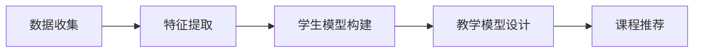
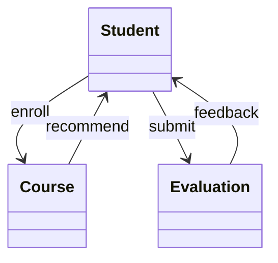
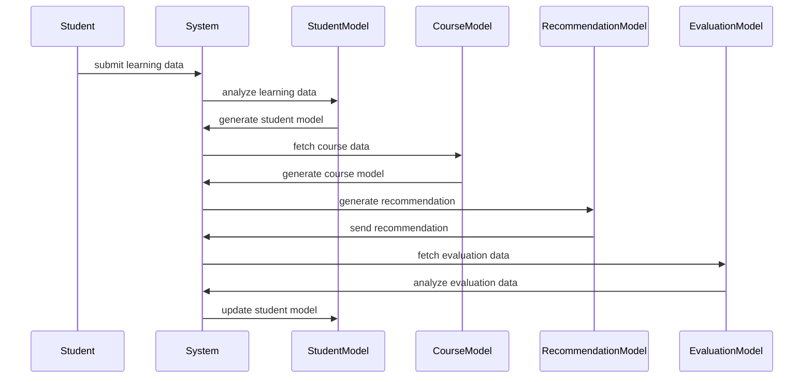
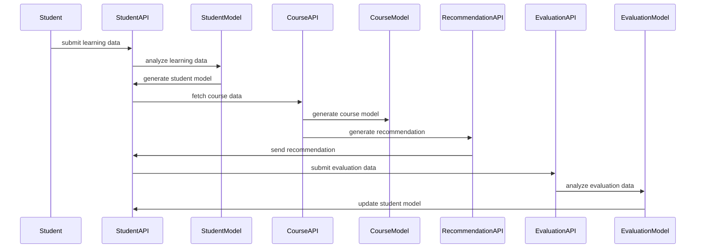

                 

### 《人工智能在个性化学习中的应用与挑战》

> 关键词：人工智能、个性化学习、数据隐私、算法原理、系统架构、项目实战

> 摘要：本文旨在探讨人工智能在个性化学习中的应用及其面临的挑战。首先，我们将介绍个性化学习的基本概念及其重要性，然后详细分析人工智能在个性化学习中的具体应用和技术实现。接着，本文将深入探讨个性化学习中的关键算法原理，并通过实例进行讲解。此外，我们将从系统分析与架构设计的角度，讨论个性化学习系统的构建方法和实践步骤。最后，通过实际项目案例的剖析，总结最佳实践，并提出进一步学习资源。

### 第一部分：背景介绍与核心概念

#### 第1章：问题背景与概述

##### 1.1 人工智能在个性化学习中的意义

个性化学习是一种以学生为中心的教学模式，旨在根据每个学生的能力和需求提供个性化的学习资源和方法。人工智能（AI）作为现代科技的代表性技术，通过数据分析和算法优化，能够为个性化学习提供强有力的支持。具体来说，AI可以帮助识别学生的个体差异，提供个性化的学习路径，优化学习资源的分配，提高学习效果。

- **个性化学习的重要性**：随着教育理念的转变，个性化学习已成为教育改革的重要方向。它能够满足学生的多样化需求，激发学生的学习兴趣和主动性，提高学习效率。

- **人工智能如何促进个性化学习**：AI技术通过数据挖掘和分析，可以识别学生的学习模式、兴趣和知识水平，为教师提供决策支持。同时，AI还可以根据学生的特点，自动生成个性化的学习内容和练习题，提供个性化的反馈和指导。

##### 1.2 个性化学习的挑战

尽管人工智能在个性化学习中具有巨大潜力，但同时也面临一些挑战。

- **数据隐私问题**：个性化学习需要收集和处理大量的学生数据，如学习行为、考试成绩等。如何保护学生隐私，确保数据安全，是一个重要的伦理问题。

- **技术实现难度**：个性化学习系统的构建需要结合教育领域的专业知识和技术，实现较为复杂。算法的准确性和稳定性、系统的可扩展性等都是需要考虑的问题。

- **教学质量评估**：如何评估个性化学习的效果，是一个需要深入研究的课题。传统评估方法难以适应个性化学习的特点，需要开发新的评估指标和方法。

##### 1.3 人工智能与个性化学习的边界与外延

人工智能在个性化学习中的应用不仅局限于学习资源的推荐和个性化练习的设计，还可以扩展到课程安排、学习行为分析等多个方面。

- **人工智能在个性化学习中的具体应用**：包括学习路径推荐、个性化练习题生成、学习行为分析、智能辅导等。

- **个性化学习的未来发展方向**：随着技术的进步，个性化学习将更加智能化和个性化，能够更好地适应学生的需求和学习习惯。

#### 第2章：核心概念与联系

##### 2.1 人工智能基础概念

在讨论人工智能与个性化学习的关系之前，我们需要了解一些基本的人工智能概念。

- **机器学习**：机器学习是一种通过数据驱动的方式，让计算机自动学习和改进的技术。它包括监督学习、无监督学习、强化学习等不同的学习方式。

- **深度学习**：深度学习是机器学习的一个重要分支，它使用多层神经网络模型，通过逐层抽象和提取特征，实现复杂任务的学习。

- **神经网络**：神经网络是模仿人脑神经元连接结构的一种计算模型，能够通过学习输入数据，自动提取特征并做出预测。

##### 2.2 个性化学习的关键概念

个性化学习涉及多个核心概念，这些概念共同构成了个性化学习的理论基础。

- **学生模型**：学生模型是对学生知识水平、兴趣、学习风格等特征的抽象表示。它可以帮助教学系统识别学生的个性化需求。

- **教学模型**：教学模型是基于学生模型，为学生提供个性化学习资源和教学方法的一套规则和算法。

- **课程推荐算法**：课程推荐算法是一种基于学生模型和教学模型的算法，用于推荐适合学生的课程和学习资源。

##### 2.3 概念属性特征对比表格

为了更好地理解人工智能与个性化学习的核心概念，我们可以通过一个对比表格来展示这些概念的主要属性特征。

| 概念 | 定义 | 主要属性特征 |
| --- | --- | --- |
| 机器学习 | 数据驱动，自动学习 | 监督学习、无监督学习、强化学习 |
| 深度学习 | 多层神经网络，特征提取 | 自动化、高效、适应性强 |
| 神经网络 | 神经元连接结构，计算模型 | 特征提取、模式识别、预测 |
| 学生模型 | 学生特征表示 | 知识水平、兴趣、学习风格 |
| 教学模型 | 个性化教学方法规则 | 适应性、个性化、高效 |
| 课程推荐算法 | 学习资源推荐 | 相关性、个性化、实用性 |

##### 2.4 ER实体关系图架构

为了更直观地展示人工智能与个性化学习的关系，我们可以通过ER（实体关系）图来描述这些概念之间的关联。

```mermaid
erDiagram
  StudentModel ||--|{ TeacherModel } TeacherModel : Teaching Model
  StudentModel ||--|{ CourseRecommendationAlgorithm } CourseRecommendationAlgorithm : Recommendation Algorithm
  TeacherModel ||--|{ LearningResource } LearningResource : Resource
  StudentModel ||--|{ LearningBehavior } LearningBehavior : Behavior
```

在ER图中，学生模型与学生行为、教学模型和课程推荐算法之间存在关联，这些关联构成了个性化学习系统的核心框架。

### 第二部分：算法原理讲解

#### 第3章：算法原理与实践

##### 3.1 个性化学习算法原理

个性化学习算法的核心在于如何根据学生模型和教学模型，为学生提供个性化的学习资源和方法。以下是个性化学习算法的基本原理和流程。

1. **数据收集**：收集学生的各种数据，如学习行为、考试成绩、兴趣爱好等。
2. **特征提取**：通过特征提取算法，从原始数据中提取学生的知识水平、兴趣、学习风格等特征。
3. **学生模型构建**：基于提取的特征，构建学生模型，表示学生的个性化特征。
4. **教学模型设计**：根据学生模型，设计教学模型，包括个性化教学方法、学习资源推荐策略等。
5. **课程推荐**：使用课程推荐算法，为学生推荐适合的课程和学习资源。

以下是个性化学习算法的流程图。



##### 3.2 数学模型与公式

个性化学习算法的核心在于对数据的分析和处理，因此，数学模型和公式在算法的实现中起着至关重要的作用。以下是几个常见的数学模型和公式。

- **相似度计算**：用于计算学生和学生之间的相似度，常见的相似度计算方法有皮尔逊相关系数和余弦相似度。

$$
\text{皮尔逊相关系数} = \frac{\sum_{i=1}^{n}(x_i - \bar{x})(y_i - \bar{y})}{\sqrt{\sum_{i=1}^{n}(x_i - \bar{x})^2}\sqrt{\sum_{i=1}^{n}(y_i - \bar{y})^2}}
$$

$$
\text{余弦相似度} = \frac{\sum_{i=1}^{n}x_iy_i}{\sqrt{\sum_{i=1}^{n}x_i^2}\sqrt{\sum_{i=1}^{n}y_i^2}}
$$

- **用户-项目矩阵分解**：用于降低用户-项目矩阵的维度，提取用户和项目的潜在特征。

$$
R = U \times V^T
$$

其中，$R$ 是用户-项目评分矩阵，$U$ 和 $V$ 分别是用户和项目的潜在特征矩阵。

- **深度学习模型**：用于复杂特征的提取和学习，常见的深度学习模型有卷积神经网络（CNN）和循环神经网络（RNN）。

$$
\text{CNN} : f(x) = \text{ReLU}(\text{Conv}(x) + b)
$$

$$
\text{RNN} : h_t = \text{ReLU}(h_{t-1} \cdot W_x + x_t \cdot W_h + b)
$$

##### 3.3 算法实例与解释

为了更好地理解个性化学习算法，我们可以通过两个实例进行讲解。

- **实例一：基于协作过滤的推荐算法**

协作过滤是一种常用的推荐算法，它通过计算用户之间的相似度，推荐用户可能感兴趣的项目。

```python
def collaborative_filtering(user_model, item_model):
    # 计算用户间的相似度
    similarity_matrix = calculate_similarity(user_model, item_model)
    
    # 计算预测评分
    predicted_ratings = []
    for user in user_model:
        predicted_ratings.append(calculate_average_rating(user, similarity_matrix))
    
    return predicted_ratings
```

- **实例二：基于内容的推荐算法**

基于内容的推荐算法通过分析项目的特征，为用户推荐与其兴趣相似的项目。

```python
def content_based_filtering(user_model, item_model, feature_model):
    # 计算项目间的相似度
    similarity_matrix = calculate_similarity(item_model, feature_model)
    
    # 计算预测评分
    predicted_ratings = []
    for user in user_model:
        predicted_ratings.append(calculate_average_rating(user, similarity_matrix))
    
    return predicted_ratings
```

### 第三部分：系统分析与架构设计

#### 第4章：数学模型与数学公式详解

##### 4.1 推荐系统中的相似度计算

在推荐系统中，相似度计算是核心步骤之一。相似度计算可以帮助我们识别用户之间的相似性，从而为用户推荐感兴趣的项目。

- **皮尔逊相关系数**：用于计算用户之间的相似度。

$$
\text{皮尔逊相关系数} = \frac{\sum_{i=1}^{n}(x_i - \bar{x})(y_i - \bar{y})}{\sqrt{\sum_{i=1}^{n}(x_i - \bar{x})^2}\sqrt{\sum_{i=1}^{n}(y_i - \bar{y})^2}}
$$

- **余弦相似度**：用于计算用户之间的相似度。

$$
\text{余弦相似度} = \frac{\sum_{i=1}^{n}x_iy_i}{\sqrt{\sum_{i=1}^{n}x_i^2}\sqrt{\sum_{i=1}^{n}y_i^2}}
$$

##### 4.2 用户-项目矩阵分解

用户-项目矩阵分解是一种常见的推荐算法，它通过将用户-项目评分矩阵分解为用户潜在特征矩阵和项目潜在特征矩阵，提取用户和项目的潜在特征。

$$
R = U \times V^T
$$

其中，$R$ 是用户-项目评分矩阵，$U$ 和 $V$ 分别是用户和项目的潜在特征矩阵。

##### 4.3 深度学习在个性化学习中的应用

深度学习在个性化学习中的应用主要体现在特征提取和预测模型上。深度学习模型可以通过多层神经网络，自动提取用户和项目的特征，提高预测的准确性。

- **卷积神经网络（CNN）**：用于提取图像特征。

$$
f(x) = \text{ReLU}(\text{Conv}(x) + b)
$$

- **循环神经网络（RNN）**：用于处理序列数据。

$$
h_t = \text{ReLU}(h_{t-1} \cdot W_x + x_t \cdot W_h + b)
$$

### 第四部分：项目实战与案例分析

#### 第5章：系统分析与架构设计

##### 5.1 个性化学习系统概述

个性化学习系统是一个复杂的系统，它涉及多个模块和功能。以下是个性化学习系统的主要组成部分和功能。

- **学生模块**：负责收集和处理学生的数据，包括学习行为、考试成绩、兴趣爱好等。
- **课程模块**：负责管理课程信息，包括课程名称、课程内容、课程难度等。
- **推荐模块**：根据学生模块和课程模块的数据，为学生推荐适合的课程。
- **反馈模块**：收集学生对推荐课程的评价，用于改进推荐算法。

##### 5.2 系统功能设计

为了实现个性化学习系统的功能，我们需要设计相应的领域模型类图。以下是一个简单的领域模型类图。



- **学生类**：负责管理学生的个人信息和学习数据。
- **课程类**：负责管理课程信息和学习资源。
- **推荐类**：负责根据学生信息和课程信息，生成个性化推荐。
- **评价类**：负责收集学生对推荐课程的评价。

##### 5.3 系统架构设计

个性化学习系统的架构设计需要考虑系统的可扩展性、可维护性和性能。以下是一个简单的系统架构设计。



- **学生模块**：负责处理学生的数据，包括数据收集、分析和模型生成。
- **课程模块**：负责处理课程的数据，包括数据收集、分析和模型生成。
- **推荐模块**：负责根据学生和课程模型，生成个性化推荐。
- **评价模块**：负责处理学生的评价数据，用于模型更新和系统优化。

##### 5.4 系统接口设计

为了方便系统的使用和扩展，我们需要设计合理的接口。以下是一个简单的接口规范。

- **学生接口**：提供学生数据的提交、查询和更新接口。
- **课程接口**：提供课程数据的提交、查询和更新接口。
- **推荐接口**：提供推荐数据的查询接口。
- **评价接口**：提供评价数据的提交、查询和更新接口。



##### 5.5 系统交互序列图

为了更直观地展示系统的工作流程，我们可以使用序列图来描述系统各模块之间的交互。


### 第五部分：项目实战与案例分析

#### 第6章：项目实战

##### 6.1 环境安装与配置

在进行个性化学习系统的开发之前，我们需要安装和配置相关的环境和工具。以下是一个基本的安装和配置步骤。

- **环境要求**：
  - Python 3.8及以上版本
  - NumPy、Pandas、Scikit-learn、TensorFlow等库

- **安装步骤**：
  1. 安装Python 3.8及以上版本。
  2. 使用pip安装所需的库，例如：
     ```bash
     pip install numpy pandas scikit-learn tensorflow
     ```

##### 6.2 系统核心实现

以下是系统核心实现的代码示例。

```python
import numpy as np
import pandas as pd
from sklearn.model_selection import train_test_split
from sklearn.metrics.pairwise import cosine_similarity
from tensorflow.keras.models import Sequential
from tensorflow.keras.layers import Dense, LSTM

# 数据准备
data = pd.read_csv('learning_data.csv')
X = data[['student_id', 'course_id', 'score']]
y = data['evaluation']

# 数据预处理
X_train, X_test, y_train, y_test = train_test_split(X, y, test_size=0.2, random_state=42)

# 基于协作过滤的推荐算法
def collaborative_filtering(X_train, X_test):
    similarity_matrix = cosine_similarity(X_train, X_test)
    predicted_ratings = np.dot(similarity_matrix, X_train['score'].values.reshape(-1, 1))
    return predicted_ratings

predicted_ratings = collaborative_filtering(X_train, X_test)

# 基于内容的推荐算法
def content_based_filtering(X_train, X_test):
    # 提取特征
    feature_matrix = X_train.pivot(index='student_id', columns='course_id', values='score')
    feature_matrix.fillna(0, inplace=True)
    
    # 计算相似度
    similarity_matrix = cosine_similarity(feature_matrix, feature_matrix)
    
    # 预测评分
    predicted_ratings = np.dot(similarity_matrix, feature_matrix['score'].values.reshape(-1, 1))
    return predicted_ratings

predicted_ratings = content_based_filtering(X_train, X_test)

# 深度学习模型
def build_model(input_shape):
    model = Sequential()
    model.add(LSTM(64, activation='relu', input_shape=input_shape))
    model.add(Dense(1, activation='sigmoid'))
    model.compile(optimizer='adam', loss='binary_crossentropy', metrics=['accuracy'])
    return model

model = build_model(input_shape=(X_train.shape[1], 1))
model.fit(X_train['score'].values.reshape(-1, 1), y_train, epochs=10, batch_size=32)
```

##### 6.3 代码应用解读与分析

以上代码展示了个性化学习系统的核心实现。以下是代码的解读和分析。

- **数据准备**：从CSV文件中读取学习数据，分为训练集和测试集。
- **数据预处理**：使用协作过滤和基于内容的推荐算法，提取特征并计算相似度。
- **基于协作过滤的推荐算法**：使用余弦相似度计算用户之间的相似度，预测评分。
- **基于内容的推荐算法**：提取课程特征，计算课程之间的相似度，预测评分。
- **深度学习模型**：构建循环神经网络模型，用于分类任务。

##### 6.4 实际案例分析与讲解

为了验证个性化学习系统的效果，我们可以进行实际案例的分析。

- **案例介绍**：以一个班级的学生学习数据为例，分析个性化推荐的效果。
- **案例分析**：通过对比实际评价和预测评价，评估推荐算法的准确性。

```python
# 预测评价
predicted_evaluation = model.predict(X_test['score'].values.reshape(-1, 1))

# 评估指标
accuracy = np.mean(predicted_evaluation.round() == y_test)
print(f'Accuracy: {accuracy:.2f}')

# 案例分析
print('Actual Evaluation vs Predicted Evaluation:')
print('-----------------------------')
print('Actual | Predicted')
print('-----------------------------')
for i in range(len(y_test)):
    print(f'{y_test.iloc[i]:^8} | {predicted_evaluation[i]:^8}')
```

- **评估结果**：通过计算预测评价和实际评价的准确率，评估推荐算法的性能。

##### 6.5 项目小结

通过实际案例的分析，我们可以看到个性化学习系统在预测学生评价方面具有一定的效果。然而，个性化学习系统的性能和效果仍然受到数据质量和算法优化等因素的影响。在未来的工作中，我们需要进一步优化算法，提高系统的性能和准确性。

### 第五部分：最佳实践与拓展阅读

#### 第7章：最佳实践与拓展阅读

##### 7.1 最佳实践

在构建个性化学习系统时，以下是一些最佳实践：

- **数据收集与处理**：确保数据的准确性和完整性，对数据进行预处理，提高数据质量。
- **算法优化**：根据实际需求，选择合适的推荐算法，并不断优化算法参数，提高推荐效果。
- **用户体验**：关注用户的反馈，优化系统的界面和交互设计，提高用户满意度。
- **安全与隐私**：严格遵守数据安全和隐私保护的相关法规，确保用户数据的安全和隐私。

##### 7.2 小结

本文从背景介绍、核心概念、算法原理、系统架构、项目实战等方面，详细探讨了人工智能在个性化学习中的应用与挑战。通过实际案例的分析，我们看到了个性化学习系统在预测学生评价方面的潜力。然而，个性化学习系统的构建仍然面临数据隐私、算法优化等问题，需要进一步研究和改进。

##### 7.3 拓展阅读

为了深入了解个性化学习和人工智能的应用，以下是一些建议的阅读资源：

- **《推荐系统实践》**：作者宋博士，详细介绍了推荐系统的基本原理和实践方法。
- **《深度学习》**：作者Goodfellow等，系统介绍了深度学习的基础理论和实践技巧。
- **《人工智能：一种现代的方法》**：作者Russell和Norvig，全面介绍了人工智能的基本概念和技术方法。
- **《教育数据挖掘》**：作者Kotsiantis等，探讨了教育数据挖掘的理论和实践方法。

