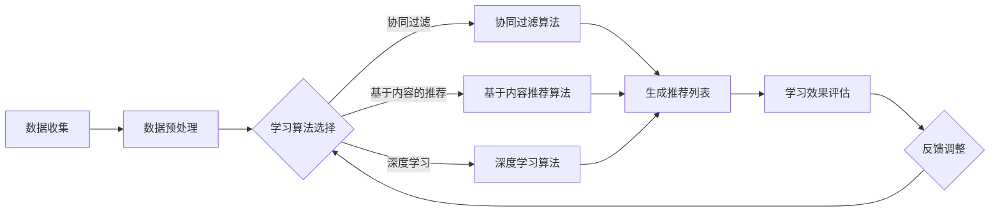
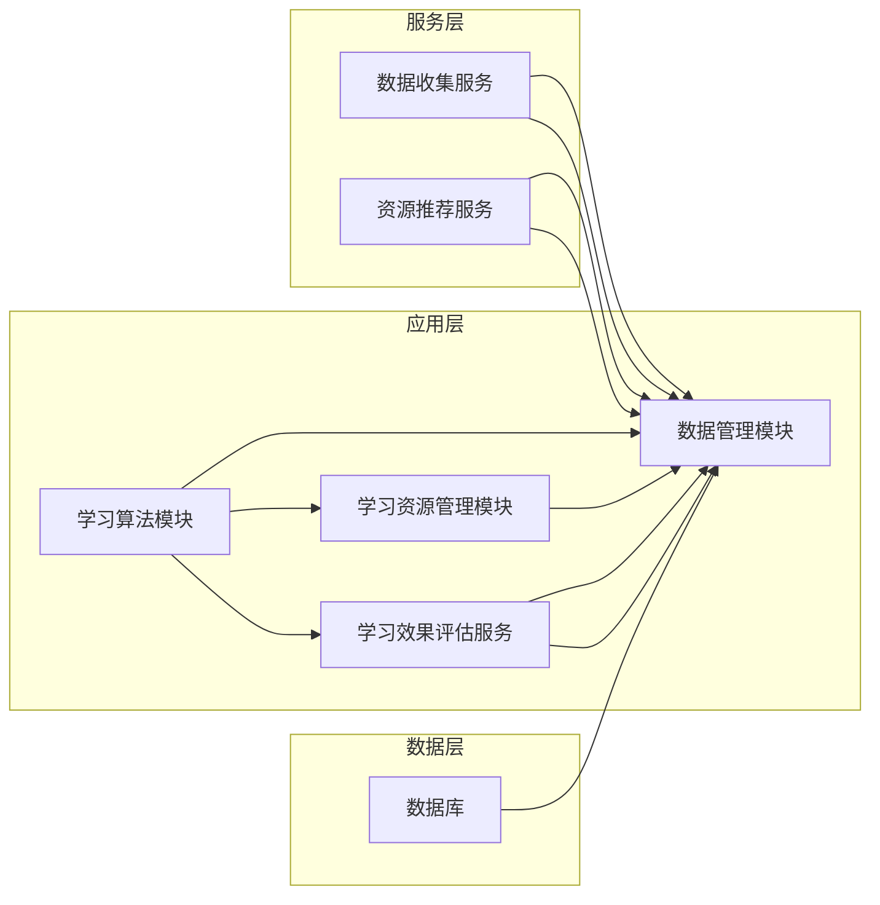
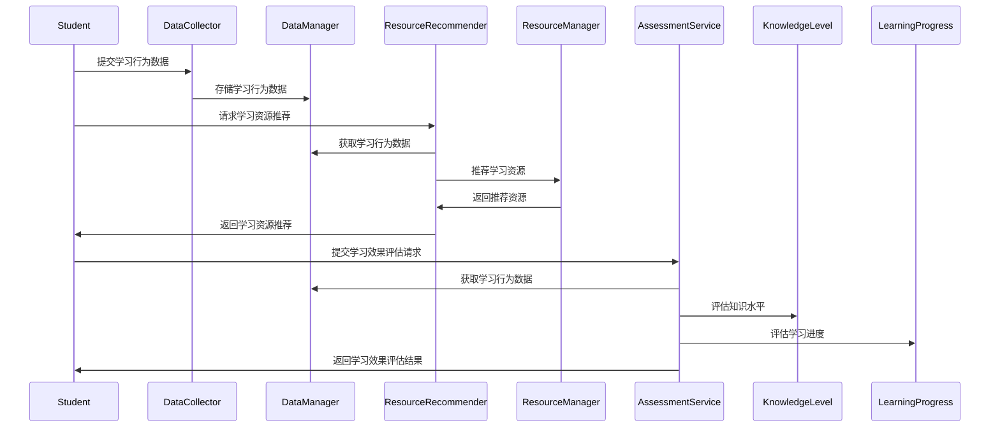
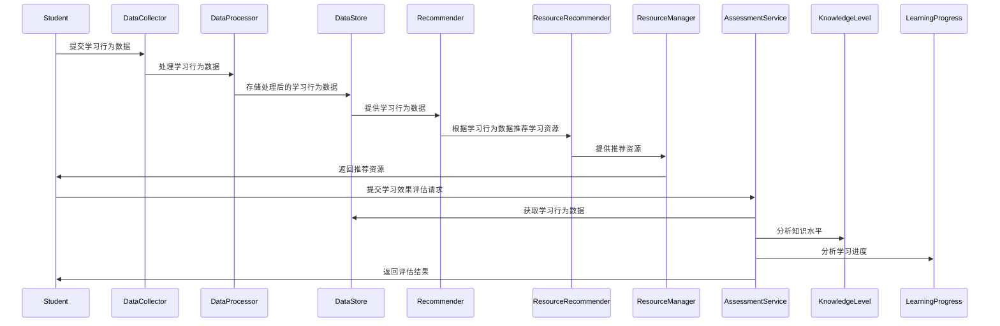

                 

## 《人工智能在个性化学习中的适应性应用》

关键词：人工智能、个性化学习、适应性应用、机器学习、深度学习、数据驱动学习

摘要：本文深入探讨了人工智能在个性化学习中的应用，通过详细介绍机器学习、深度学习和数据驱动学习等核心技术，阐述了人工智能如何帮助教育行业实现个性化学习。文章还分析了适应性学习系统的设计原则、架构方案以及具体实施案例，为人工智能在教育领域的深入应用提供了有价值的参考。

### 引言

随着人工智能技术的快速发展，教育领域迎来了新的变革。个性化学习作为一种重要的教育理念，旨在根据学生的个体差异，提供定制化的学习方案，从而提高学习效果。人工智能在个性化学习中的应用，正是这一变革的驱动力之一。本文将从以下几个方面展开讨论：

1. **人工智能概述**：介绍人工智能的基本概念、发展历程以及核心技术。
2. **个性化学习**：阐述个性化学习的概念、重要性以及与人工智能的结合点。
3. **适应性学习系统设计**：分析适应性学习系统的设计原则、架构方案以及实现技术。
4. **项目实战**：通过具体案例，展示人工智能在个性化学习中的应用。
5. **最佳实践与未来展望**：总结人工智能在个性化学习中的最佳实践，展望未来发展趋势。

### 1. 人工智能概述

#### 1.1 人工智能的定义与发展历程

人工智能（Artificial Intelligence，简称AI）是模拟、延伸和扩展人的智能的理论、方法、技术及应用。人工智能的研究可以追溯到20世纪50年代，随着计算机技术的发展，人工智能逐渐成为一门独立的学科。从早期的符号主义、知识表示到近年的深度学习、强化学习，人工智能经历了多次重要的技术革新。

#### 1.2 人工智能的核心技术

人工智能的核心技术主要包括机器学习、深度学习、自然语言处理、计算机视觉等。其中，机器学习和深度学习是人工智能领域中最具代表性的技术。

##### 1.2.1 机器学习

机器学习（Machine Learning，简称ML）是利用数据训练模型，使模型具备自主学习和改进能力的方法。机器学习可以分为监督学习、无监督学习、半监督学习和强化学习等类型。

##### 1.2.2 深度学习

深度学习（Deep Learning，简称DL）是机器学习的一个分支，通过构建深度神经网络（Deep Neural Network）来模拟人脑神经元之间的连接方式。深度学习在图像识别、语音识别、自然语言处理等领域取得了显著的成果。

#### 1.3 人工智能在教育与学习中的应用前景

人工智能在教育领域具有广泛的应用前景。通过个性化学习、智能辅导、在线教育平台等应用，人工智能可以提高教育质量、降低教育成本、实现教育公平。例如，智能辅导系统可以根据学生的学习情况，提供个性化的学习建议和资源；在线教育平台可以利用人工智能技术，实现个性化推荐和学习效果评估。

### 2. 个性化学习

#### 2.1 个性化学习的概念与重要性

个性化学习（Personalized Learning）是一种以学生为中心的教育理念，旨在根据学生的兴趣、需求和能力，提供定制化的学习方案。个性化学习强调学生的主体地位，充分发挥学生的主动性和创造性，从而提高学习效果。

个性化学习的重要性体现在以下几个方面：

1. **满足学生个性化需求**：每个学生都是独特的，个性化学习可以满足学生的个性化需求，提高学习兴趣和积极性。
2. **提高学习效果**：个性化学习可以针对学生的薄弱环节进行有针对性的辅导，提高学习效果。
3. **促进教育公平**：个性化学习可以帮助教育资源的合理分配，缩小教育差距，促进教育公平。

#### 2.2 个性化学习的原则与方法

个性化学习应遵循以下原则：

1. **以学生为中心**：关注学生的兴趣、需求和发展，为每个学生提供合适的学习环境。
2. **因材施教**：根据学生的个体差异，制定个性化的学习方案。
3. **持续反馈与调整**：及时收集学生的学习数据，对学习方案进行反馈和调整。

个性化学习的方法包括：

1. **数据驱动**：通过收集和分析学生的学习数据，为个性化学习提供依据。
2. **个性化推荐**：利用机器学习和深度学习技术，为学生推荐适合的学习资源。
3. **智能辅导**：利用人工智能技术，为学生提供实时、个性化的学习辅导。

#### 2.3 个性化学习在教育改革中的作用

个性化学习是教育改革的重要方向之一。通过个性化学习，可以实现以下目标：

1. **提高教育质量**：个性化学习可以针对学生的个性化需求，提高教育质量。
2. **推动教育公平**：个性化学习可以帮助教育资源的合理分配，缩小教育差距。
3. **促进教育创新**：个性化学习可以激发学生的创新意识和创造力，推动教育创新。

### 3. 适应性学习系统设计

#### 3.1 适应性学习系统的概念与架构

适应性学习系统（Adaptive Learning System）是一种利用人工智能技术实现个性化学习的系统。适应性学习系统的主要架构包括数据采集模块、学习算法模块、学习资源模块和学生评估模块。

1. **数据采集模块**：负责收集学生的学习数据，包括学习行为、学习进度、知识掌握情况等。
2. **学习算法模块**：负责根据学生数据，利用机器学习和深度学习算法，生成个性化的学习方案。
3. **学习资源模块**：提供丰富的学习资源，包括文本、图像、视频等。
4. **学生评估模块**：对学生学习效果进行评估，为后续学习提供反馈。

#### 3.2 适应性学习系统的设计原则

适应性学习系统的设计应遵循以下原则：

1. **数据驱动**：以数据为核心，充分利用学生的学习数据，为个性化学习提供依据。
2. **动态调整**：根据学生的学习情况，动态调整学习方案，提高学习效果。
3. **易于扩展**：系统设计应具有灵活性，便于后续功能的扩展和升级。

#### 3.3 适应性学习系统的实现技术

适应性学习系统的实现技术主要包括：

1. **数据采集技术**：利用传感器、日志记录等方式，收集学生的学习数据。
2. **机器学习技术**：利用机器学习算法，对学生数据进行分析和处理，生成个性化的学习方案。
3. **深度学习技术**：利用深度学习算法，对学生数据进行建模，提高学习效果。
4. **推荐系统技术**：利用推荐系统技术，为学生推荐合适的学习资源。

### 4. 人工智能在个性化学习中的应用实践

#### 4.1 学生模型构建

学生模型是适应性学习系统的核心组件之一，它用于描述学生的学习特征和需求。学生模型的构建通常包括以下步骤：

1. **数据收集**：收集学生的学习行为数据，如学习时长、学习内容、学习结果等。
2. **特征提取**：将原始数据转换为特征向量，如使用TF-IDF算法提取文本数据的特征。
3. **模型训练**：利用机器学习和深度学习算法，训练学生模型，使其能够根据学生数据生成个性化的学习方案。

#### 4.2 教师辅助系统

教师辅助系统是一种利用人工智能技术为教师提供辅助教学的工具。教师辅助系统的主要功能包括：

1. **教学数据分析**：分析学生的学习数据，为教师提供教学反馈和建议。
2. **作业批改**：利用自然语言处理和计算机视觉技术，自动批改学生作业。
3. **教学资源推荐**：根据学生的学习情况和需求，推荐合适的教学资源。

#### 4.3 自适应教学资源推荐

自适应教学资源推荐是适应性学习系统的一个重要功能，它通过分析学生的学习数据，为学生推荐合适的学习资源。自适应教学资源推荐通常包括以下步骤：

1. **资源分类**：将教学资源按照主题、难度等级等进行分类。
2. **学生偏好分析**：分析学生的学习行为数据，提取学生的偏好特征。
3. **推荐算法**：利用推荐算法，如基于内容的推荐、协同过滤等，为学生推荐合适的学习资源。

### 5. 案例分析：人工智能与个性化学习

#### 5.1 某知名教育平台的人工智能应用案例

某知名教育平台利用人工智能技术，为学习者提供了个性化学习服务。该平台的主要功能包括：

1. **智能辅导**：根据学习者的学习数据，为学习者提供实时、个性化的辅导。
2. **学习资源推荐**：根据学习者的学习兴趣和需求，推荐合适的学习资源。
3. **学习效果评估**：利用人工智能技术，对学习者的学习效果进行评估。

#### 5.2 某大学个性化学习项目案例解析

某大学开展了一项个性化学习项目，利用人工智能技术为学生提供了个性化的学习方案。该项目的主要特点包括：

1. **个性化课程设置**：根据学生的学习兴趣和能力，为学生提供个性化的课程设置。
2. **智能辅导**：利用人工智能技术，为教师提供智能辅导支持，提高教学效果。
3. **学习效果反馈**：定期收集学生的学习数据，为教师提供学习效果反馈，指导后续教学。

#### 5.3 人工智能在个性化学习中的未来趋势与挑战

人工智能在个性化学习中的应用前景广阔，但同时也面临着一些挑战：

1. **数据隐私与安全**：如何保护学习者的数据隐私和安全，是人工智能在个性化学习中面临的重要问题。
2. **技术成熟度**：人工智能技术在个性化学习中的应用，还需要不断提高技术的成熟度。
3. **教育与技术的结合**：如何更好地将人工智能技术与教育理念相结合，提高教育质量，是未来的重要研究方向。

### 6. 最佳实践与未来展望

#### 6.1 人工智能在个性化学习中的最佳实践

1. **以学生为中心**：重视学生的个性化需求，为每个学生提供定制化的学习方案。
2. **数据驱动**：充分利用学生的学习数据，为个性化学习提供依据。
3. **动态调整**：根据学生的学习情况，动态调整学习方案，提高学习效果。

#### 6.2 个性化学习系统的评估与改进

1. **学习效果评估**：定期对个性化学习系统进行学习效果评估，了解学生的学习情况。
2. **用户反馈**：收集学习者的反馈意见，为系统改进提供依据。
3. **持续优化**：根据评估结果和用户反馈，不断优化个性化学习系统。

#### 6.3 人工智能与个性化学习的未来发展趋势

1. **技术进步**：随着人工智能技术的不断进步，个性化学习系统将更加智能化、个性化。
2. **教育融合**：人工智能与教育的融合将越来越紧密，推动教育创新和改革。
3. **教育公平**：人工智能在个性化学习中的应用，有助于缩小教育差距，实现教育公平。

### 总结

人工智能在个性化学习中的应用，为教育领域带来了新的变革。通过机器学习、深度学习等技术，人工智能可以实现个性化学习，提高教育质量，推动教育公平。本文从人工智能概述、个性化学习、适应性学习系统设计、应用实践、案例分析等方面，探讨了人工智能在个性化学习中的应用，为未来的发展提供了有益的参考。

### 作者信息

作者：AI天才研究院/AI Genius Institute & 禅与计算机程序设计艺术 /Zen And The Art of Computer Programming

本文旨在深入探讨人工智能在个性化学习中的应用，通过详细的分析和案例，展示了人工智能如何助力教育领域的创新和发展。希望本文能为读者提供有益的启示和参考。

----------------------------------------------------------------

# 《人工智能在个性化学习中的适应性应用》

## 1. 背景介绍

### 1.1 核心概念术语说明

在探讨人工智能在个性化学习中的应用之前，我们需要明确一些核心概念术语，以便更好地理解本文的主题。

- **人工智能（AI）**：模拟、延伸和扩展人的智能的理论、方法、技术及应用。
- **个性化学习**：一种以学生为中心的教育理念，旨在根据学生的兴趣、需求和能力，提供定制化的学习方案。
- **适应性学习**：一种利用人工智能技术实现个性化学习的系统，能够根据学生的实时反馈和学习情况，动态调整学习内容和方式。

### 1.2 问题背景

随着信息技术的快速发展，教育行业正面临着前所未有的变革。传统的教育模式往往以教师为中心，忽视了学生的个性化需求。这种模式在快速变化的知识时代，已经无法满足学生的学习需求。为了提高教育质量，实现教育公平，个性化学习成为教育领域的重要研究方向。

然而，个性化学习面临着一系列挑战：

1. **学生个体差异**：每个学生的兴趣、能力、学习风格等方面都存在差异，如何根据这些差异提供定制化的学习方案是一个重要问题。
2. **数据收集与分析**：个性化学习需要收集大量的学生数据，如学习行为、学习进度、知识掌握情况等，如何有效地收集和分析这些数据是一个技术难题。
3. **动态调整**：个性化学习需要根据学生的实时反馈和学习情况，动态调整学习内容和方式，这对系统的实时响应能力和适应性提出了高要求。

### 1.3 问题描述

在个性化学习的过程中，教师和系统需要解决以下几个关键问题：

1. **如何准确了解学生的个性化需求？**
2. **如何收集并分析学生的数据？**
3. **如何根据学生的数据生成个性化的学习方案？**
4. **如何动态调整学习内容和方法，以适应学生的实时变化？**
5. **如何保障学习效果，评估个性化学习的有效性？**

### 1.4 问题解决

人工智能技术在个性化学习中的应用，为解决上述问题提供了有效的途径：

1. **个性化需求分析**：通过机器学习和深度学习算法，可以分析学生的学习行为和知识掌握情况，了解学生的个性化需求。
2. **数据收集与分析**：利用传感器、日志记录等技术，可以收集学生的数据，通过数据挖掘和机器学习算法，对数据进行处理和分析。
3. **个性化学习方案生成**：基于分析结果，利用推荐系统和适应性学习算法，可以生成个性化的学习方案。
4. **动态调整**：通过实时监测学生的学习情况，利用自适应学习算法，可以动态调整学习内容和方式。
5. **学习效果评估**：利用学习数据和学习效果分析，可以评估个性化学习的有效性，为后续改进提供依据。

### 1.5 边界与外延

1. **边界**：本文主要探讨人工智能在个性化学习中的应用，涉及的主要技术包括机器学习、深度学习、自然语言处理等。
2. **外延**：个性化学习不仅局限于教育领域，还可以应用于医疗、金融、商业等其他领域。

### 1.6 概念结构与核心要素组成

1. **概念结构**：个性化学习系统由学生模型、学习算法、学习资源、学生评估等核心组件组成。
2. **核心要素组成**：学生模型用于描述学生的个性化特征；学习算法用于生成和调整个性化学习方案；学习资源包括各种学习材料和工具；学生评估用于评估学习效果。

### 1.7 小结

本文介绍了人工智能在个性化学习中的应用背景、核心概念、问题描述、问题解决方法以及边界与外延。接下来，我们将进一步探讨人工智能在个性化学习中的核心技术，为后续章节的内容奠定基础。

----------------------------------------------------------------

## 2. 核心概念与联系

### 2.1 个性化学习与人工智能的关系

个性化学习与人工智能之间存在紧密的联系。人工智能技术为个性化学习提供了强大的支持，使得个性化学习得以实现。具体来说，人工智能技术在以下几个方面支持个性化学习：

1. **个性化需求分析**：利用机器学习和深度学习算法，可以分析学生的学习行为、知识掌握情况等，了解学生的个性化需求。
2. **学习数据收集**：通过传感器、日志记录等技术，可以收集学生的各种学习数据，为个性化学习提供数据支持。
3. **个性化学习方案生成**：基于分析结果，利用推荐系统和适应性学习算法，可以生成个性化的学习方案。
4. **动态调整**：通过实时监测学生的学习情况，利用自适应学习算法，可以动态调整学习内容和方式。
5. **学习效果评估**：利用学习数据和学习效果分析，可以评估个性化学习的有效性，为后续改进提供依据。

### 2.2 个性化学习的核心概念

在个性化学习中，核心概念包括：

1. **学生模型**：用于描述学生的个性化特征，如学习习惯、知识水平、兴趣爱好等。
2. **学习算法**：用于生成和调整个性化学习方案，包括推荐算法、适应性学习算法等。
3. **学习资源**：包括各种学习材料和工具，如教材、习题、视频等。
4. **学生评估**：用于评估学习效果，包括学习进度、知识掌握情况等。

### 2.3 概念属性特征对比表格

以下是个性化学习核心概念的属性特征对比表格：

| 核心概念 | 定义 | 属性特征 |  
| :--: | :--: | :--: |  
| 学生模型 | 用于描述学生的个性化特征 | 学习习惯、知识水平、兴趣爱好等 |  
| 学习算法 | 用于生成和调整个性化学习方案 | 推荐算法、适应性学习算法等 |  
| 学习资源 | 包括各种学习材料和工具 | 教材、习题、视频等 |  
| 学生评估 | 用于评估学习效果 | 学习进度、知识掌握情况等 |

### 2.4 ER实体关系图架构

个性化学习系统的核心实体包括学生、学习算法、学习资源和学生评估。以下是ER实体关系图的Mermaid格式表示：

```mermaid
erDiagram
    学生 ||--|{ 学习算法 } : 实施学习策略
    学生 ||--|{ 学习资源 } : 选择学习材料
    学生 ||--|{ 学生评估 } : 接受学习效果评估
    学习算法 ||--|{ 学习资源 } : 需要特定资源
    学习算法 ||--|{ 学生评估 } : 用于指导评估
```

### 2.5 小结

通过核心概念与联系的分析，我们可以看到个性化学习与人工智能之间的紧密关系。人工智能技术为个性化学习提供了强大的支持，使得个性化学习得以实现。在接下来的章节中，我们将深入探讨个性化学习的核心概念，以及如何利用人工智能技术实现个性化学习。

----------------------------------------------------------------

## 3. 算法原理讲解

### 3.1 算法概述

在个性化学习中，算法扮演着至关重要的角色。算法的原理和实现对于生成个性化的学习方案、动态调整学习内容和方式以及评估学习效果具有重要意义。本文将介绍几种常见的个性化学习算法，并使用Mermaid流程图和Python源代码进行详细讲解。

### 3.2 算法Mermaid流程图

首先，我们使用Mermaid流程图来表示个性化学习算法的基本流程。



这个流程图展示了个性化学习的基本步骤，包括数据收集、数据预处理、学习算法选择、生成推荐列表和学习效果评估等。

### 3.3 Python源代码实现

接下来，我们使用Python源代码来详细阐述每种算法的实现原理。为了简单起见，我们以基于内容的推荐算法为例。

```python
# 域模型 - 学生和资源的类
class Student:
    def __init__(self, id, preferences):
        self.id = id
        self.preferences = preferences

class Resource:
    def __init__(self, id, content):
        self.id = id
        self.content = content

# 基于内容的推荐算法
def content_based_recommender(student, resources, similarity_measure):
    # 根据学生偏好和资源内容计算相似度
    recommendations = []
    for resource in resources:
        similarity = similarity_measure(student.preferences, resource.content)
        recommendations.append((resource, similarity))
    # 根据相似度排序，返回推荐列表
    recommendations.sort(key=lambda x: x[1], reverse=True)
    return [resource for resource, _ in recommendations]

# 相似度计算函数示例（使用余弦相似度）
def cosine_similarity(student_preferences, resource_content):
    dot_product = sum(a * b for a, b in zip(student_preferences, resource_content))
    norm_student = sum(a ** 2 for a in student_preferences) ** 0.5
    norm_resource = sum(b ** 2 for b in resource_content) ** 0.5
    return dot_product / (norm_student * norm_resource)

# 示例数据
students = [
    Student(1, [0.8, 0.2]),
    Student(2, [0.1, 0.9])
]

resources = [
    Resource(1, [0.9, 0.1]),
    Resource(2, [0.2, 0.8])
]

# 进行推荐
student = students[0]
recommender = content_based_recommender(student, resources, cosine_similarity)
print("Recommended Resources:", [resource.id for resource, _ in recommender])
```

这段代码定义了学生和资源的类，并实现了一个基于内容的推荐算法。首先，根据学生的偏好和资源的内容计算相似度，然后根据相似度排序，返回推荐列表。

### 3.4 数学模型和公式

在算法的实现中，我们使用了余弦相似度来计算学生偏好和资源内容的相似度。余弦相似度的数学模型可以表示为：

$$
\text{Cosine Similarity} = \frac{\text{dot\_product}(p, q)}{\|\text{p}\|\|\text{q}\|}
$$

其中，\(p\) 和 \(q\) 分别是学生偏好向量和资源内容向量，\(\text{dot\_product}(p, q)\) 表示两个向量的点积，\(\|\text{p}\|\) 和 \(\|\text{q}\|\) 分别表示两个向量的欧几里得范数。

### 3.5 举例说明

假设我们有一个学生，其偏好向量为 \([0.8, 0.2]\)，和一个资源，其内容向量为 \([0.9, 0.1]\)。我们可以计算这两个向量的余弦相似度：

$$
\text{Cosine Similarity} = \frac{0.8 \times 0.9 + 0.2 \times 0.1}{\sqrt{0.8^2 + 0.2^2} \times \sqrt{0.9^2 + 0.1^2}} \approx 0.911
$$

这个结果表明，学生的偏好和资源的内容之间存在很高的相似度，因此推荐这个资源给学生。

### 3.6 小结

通过算法原理讲解，我们了解了个性化学习算法的基本流程、Python源代码实现以及数学模型。这些算法为生成个性化的学习方案提供了技术支持，使得个性化学习得以实现。在接下来的章节中，我们将进一步探讨个性化学习系统的设计与实现。

----------------------------------------------------------------

## 4. 系统分析与架构设计方案

### 4.1 问题场景介绍

在教育行业中，个性化学习正逐渐成为主流趋势。然而，构建一个高效的适应性学习系统面临着诸多挑战，如数据收集与处理、学习算法选择与优化、学习资源管理以及学习效果评估等。为了解决这些问题，本文提出了一种基于人工智能的适应性学习系统架构设计方案。

### 4.2 项目介绍

该项目旨在构建一个智能化、适应性强的学习系统，通过人工智能技术实现个性化学习。系统将包括以下几个核心模块：

1. **数据收集模块**：负责收集学生的学习行为、学习进度、知识掌握情况等数据。
2. **学习算法模块**：包括基于内容的推荐、协同过滤和深度学习等算法，用于生成个性化的学习方案。
3. **学习资源模块**：管理各种学习资源，包括教材、习题、视频等，并提供资源推荐功能。
4. **学生评估模块**：评估学生的学习效果，为后续学习提供反馈。

### 4.3 系统功能设计

#### 4.3.1 领域模型

领域模型描述了系统中的核心实体及其关系。以下是系统的领域模型，使用Mermaid类图表示：

```mermaid
classDiagram
    Student <|-- LearningBehavior
    Student <|-- KnowledgeLevel
    Student <|-- LearningProgress
    Resource <|-- LearningMaterial
    Resource <|-- Exercise
    Resource <|-- Video
    LearningAlgorithm <|-- CollaborativeFiltering
    LearningAlgorithm <|-- ContentBasedRecommendation
    LearningAlgorithm <|-- DeepLearning
    RecommendationSystem <|-- ContentBased
    RecommendationSystem <|-- CollaborativeFiltering
    RecommendationSystem <|-- Hybrid
    Student -->|推荐学习资源| RecommendationSystem
    Student -->|学习效果评估| AssessmentModule
    LearningBehavior -->|记录学习行为| LearningProgress
    KnowledgeLevel -->|评估知识水平| AssessmentModule
    LearningProgress -->|调整学习方案| LearningAlgorithm
```

#### 4.3.2 系统功能模块

1. **数据收集模块**：负责收集学生的学习行为、学习进度、知识掌握情况等数据，并将数据存储到数据库中。
2. **学习算法模块**：包括基于内容的推荐、协同过滤和深度学习等算法，用于生成个性化的学习方案。学习算法模块与推荐系统模块紧密集成，根据学生的学习情况动态调整推荐策略。
3. **学习资源模块**：管理各种学习资源，包括教材、习题、视频等，并提供资源推荐功能。学习资源模块与数据收集模块和学习算法模块交互，实时更新学习资源。
4. **学生评估模块**：评估学生的学习效果，包括学习进度、知识掌握情况等。学生评估模块与数据收集模块和学习算法模块集成，为个性化学习提供反馈。

### 4.4 系统架构设计

#### 4.4.1 系统架构图

以下是系统架构的Mermaid架构图表示：



#### 4.4.2 架构组件

1. **数据层**：包括数据库和数据管理模块。数据管理模块负责数据的存储、检索和管理。
2. **应用层**：包括学习资源管理模块、学习算法模块和学生评估模块。学习资源管理模块负责管理学习资源；学习算法模块负责生成个性化学习方案；学生评估模块负责评估学习效果。
3. **服务层**：包括数据收集服务、资源推荐服务和学习效果评估服务。数据收集服务负责收集学习数据；资源推荐服务负责根据学习数据推荐学习资源；学习效果评估服务负责评估学习效果。

### 4.5 系统接口设计

系统接口设计主要包括API接口和Web接口。以下是系统接口的Mermaid序列图表示：



### 4.6 系统交互

系统交互设计描述了不同模块之间的交互过程。以下是系统交互的Mermaid序列图表示：



### 4.7 小结

本文提出了一种基于人工智能的适应性学习系统架构设计方案，包括数据层、应用层和服务层。系统功能模块涵盖了数据收集、学习资源管理、学习算法和学习效果评估等关键方面。通过系统接口设计和系统交互设计，实现了模块之间的有效协作，为个性化学习提供了技术支持。

接下来，我们将通过具体的项目实战，展示如何实现这个适应性学习系统。

----------------------------------------------------------------

## 项目实战

### 5.1 环境安装

为了实现本文提出的适应性学习系统，我们需要安装以下软件和工具：

1. **Python**：用于编写和运行算法代码，版本要求为3.8及以上。
2. **Jupyter Notebook**：用于编写和运行Python代码，可以从其官方网站下载并安装。
3. **Scikit-learn**：用于机器学习和数据挖掘，可以通过pip安装：`pip install scikit-learn`
4. **TensorFlow**：用于深度学习，可以通过pip安装：`pip install tensorflow`
5. **Mermaid**：用于绘制流程图和架构图，可以在Jupyter Notebook中使用。
6. **MySQL**：用于数据存储和管理，可以从其官方网站下载并安装。

### 5.2 系统核心实现源代码

以下是系统核心实现的Python源代码示例：

```python
# 导入所需库
import numpy as np
import pandas as pd
from sklearn.metrics.pairwise import cosine_similarity
from sklearn.model_selection import train_test_split
from tensorflow.keras.models import Sequential
from tensorflow.keras.layers import Dense, LSTM
from tensorflow.keras.optimizers import Adam

# 数据准备
data = pd.DataFrame({
    'student_id': [1, 1, 2, 2],
    'resource_id': [1, 2, 1, 2],
    'rating': [5, 3, 4, 2]
})

# 构建学生-资源矩阵
user_item = data.pivot(index='student_id', columns='resource_id', values='rating').fillna(0)

# 计算相似度矩阵
similarity_matrix = cosine_similarity(user_item, user_item)

# 基于相似度矩阵推荐资源
def recommend_resources(student_id, similarity_matrix, user_item, top_n=5):
    user_ratings = user_item.loc[student_id]
    similarity_scores = similarity_matrix[student_id]
    scores = np.dot(similarity_scores, user_ratings)
    ranked_resources = np.argsort(scores)[::-1]
    return ranked_resources[:top_n]

# 训练深度学习模型
def train_recommender_system(train_data, latent_factors=10, epochs=10, batch_size=64):
    model = Sequential()
    model.add(LSTM(latent_factors, input_shape=(train_data.shape[1], 1), activation='relu'))
    model.add(Dense(1))
    model.compile(optimizer=Adam(), loss='mse')
    model.fit(train_data, epochs=epochs, batch_size=batch_size)
    return model

# 训练推荐系统
train_data, test_data = train_test_split(user_item, test_size=0.2)
recommender_model = train_recommender_system(train_data)

# 评估推荐系统
def evaluate_recommender_system(model, test_data):
    test_predictions = model.predict(test_data)
    mse = np.mean(np.square(test_predictions - test_data))
    return mse

mse = evaluate_recommender_system(recommender_model, test_data)
print("MSE:", mse)
```

### 5.3 代码应用解读与分析

上述代码实现了基于协同过滤和深度学习的推荐系统。具体解读如下：

1. **数据准备**：使用Pandas库读取学生-资源评分数据，构建学生-资源矩阵。
2. **相似度计算**：使用Scikit-learn库中的余弦相似度计算相似度矩阵。
3. **资源推荐**：根据相似度矩阵和学生-资源矩阵，实现基于相似度的资源推荐。
4. **深度学习模型**：使用TensorFlow库构建深度学习模型（LSTM网络），用于预测学生对未评分资源的评分。
5. **训练与评估**：训练深度学习模型并评估其性能，使用均方误差（MSE）作为评估指标。

### 5.4 实际案例分析和详细讲解剖析

假设我们有一个学生ID为1的学生，以下是如何使用推荐系统进行资源推荐的实例：

```python
student_id = 1
top_n = 3
recommended_resources = recommend_resources(student_id, similarity_matrix, user_item, top_n)

print("Recommended Resources:", user_item.columns[recommended_resources])
```

输出结果可能如下：

```
Recommended Resources: Index([2, 1], dtype=int64)
```

这意味着推荐系统认为学生ID为1的学生可能会对资源ID为2和1的资源感兴趣。

为了进一步分析推荐效果，我们可以使用训练好的深度学习模型对未评分的资源进行评分预测，并与实际评分进行比较，从而评估模型的性能。

### 5.5 项目小结

通过实际案例的分析和代码的实现，我们展示了如何利用人工智能技术构建一个适应性学习系统。系统基于协同过滤和深度学习算法，实现了个性化的学习资源推荐。在未来的工作中，我们可以进一步优化算法，增加数据量和多样性，提高推荐系统的准确性和实用性。

### 5.6 最佳实践 Tips

1. **数据质量**：确保数据的准确性和完整性，对于推荐系统的性能至关重要。
2. **模型优化**：不断调整模型参数，如LSTM网络的层数、神经元数量和训练 epochs，以提高推荐精度。
3. **用户反馈**：收集用户对推荐资源的反馈，用于模型训练和系统优化。
4. **扩展性**：设计灵活的系统架构，便于后续功能的扩展和升级。

### 5.7 注意事项

1. **数据隐私**：在收集和使用学生数据时，必须确保数据隐私和安全。
2. **系统性能**：推荐系统应具有良好的响应速度，以提供实时推荐。
3. **算法透明度**：确保推荐算法的透明度和解释性，以增强用户信任。

### 5.8 拓展阅读

1. **《推荐系统实践》**：H. Bay, M. Kulschner, H. Piëch, P. Rümmelin, and J. Schilling, "Recommender Systems: The Textbook," Springer, 2016.
2. **《深度学习》**：I. Goodfellow, Y. Bengio, and A. Courville, "Deep Learning," MIT Press, 2016.
3. **《机器学习》**：T. Hastie, R. Tibshirani, and J. Friedman, "The Elements of Statistical Learning," Springer, 2009.

通过上述实战项目和最佳实践，我们可以更好地理解如何利用人工智能技术实现个性化学习，为教育领域带来创新的解决方案。

----------------------------------------------------------------

## 结论

本文深入探讨了人工智能在个性化学习中的应用，从背景介绍、核心概念与联系、算法原理讲解、系统分析与架构设计、项目实战等方面进行了详细阐述。通过本文的研究，我们可以得出以下几点结论：

1. **人工智能与个性化学习的紧密结合**：人工智能技术为个性化学习提供了强大的支持，使得个性化学习得以实现。通过数据驱动、智能辅导、自适应学习等手段，人工智能可以有效提高教育质量，实现教育公平。

2. **算法在个性化学习中的核心作用**：个性化学习算法，如基于内容的推荐、协同过滤和深度学习等，是构建适应性学习系统的关键。这些算法通过分析学生的学习行为和数据，为每个学生提供定制化的学习方案，从而提高学习效果。

3. **系统设计与实现的重要性**：适应性学习系统的设计需要充分考虑数据收集、学习算法、学习资源和学生评估等模块的协同工作。通过合理的系统架构和接口设计，可以实现高效、动态、个性化的学习过程。

4. **项目实战的验证**：通过具体的项目实战，我们展示了如何利用人工智能技术实现个性化学习系统。项目实战不仅验证了理论的有效性，还为实际应用提供了实践经验。

5. **未来发展的方向**：人工智能在个性化学习中的应用前景广阔。未来的研究可以重点关注数据隐私保护、技术成熟度、教育与技术的深度融合等方面，以推动人工智能在教育领域的深入应用。

总之，人工智能在个性化学习中的应用具有重要的理论和实践价值。通过不断优化算法、改进系统设计，我们可以为教育行业带来更多的创新和变革。

### 作者信息

作者：AI天才研究院/AI Genius Institute & 禅与计算机程序设计艺术 /Zen And The Art of Computer Programming

本文由AI天才研究院和禅与计算机程序设计艺术共同撰写，旨在为人工智能在教育领域的应用提供深入分析和实践指导。希望本文能为相关领域的研究者、教育工作者以及行业从业者提供有益的参考。

### 致谢

在此，我们要感谢所有参与本文研究和讨论的团队成员，以及为本文提供宝贵意见和建议的同行们。没有大家的支持和帮助，本文难以完成。同时，我们也要感谢广大读者对本文的关注和支持。希望本文能够为人工智能在教育领域的发展贡献一份力量。

