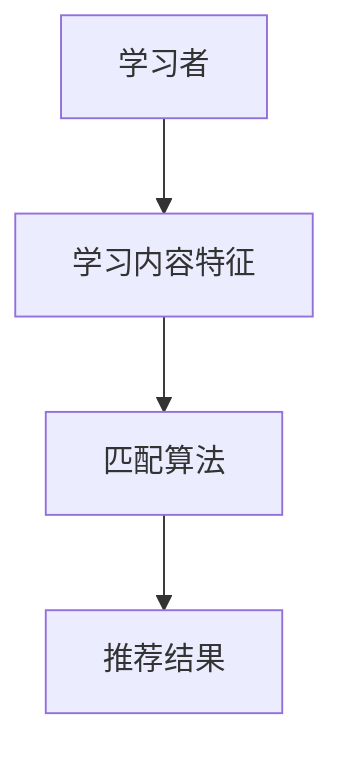
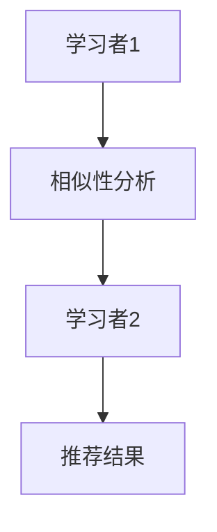
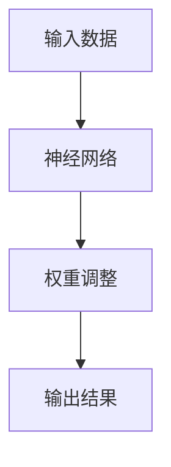
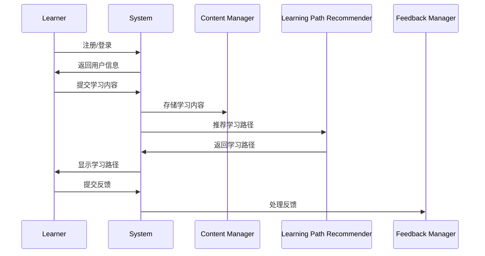

                 

### 文章标题：人工智能在个性化学习路径设计中的应用

关键词：人工智能，个性化学习路径，推荐系统，深度学习，数学模型

摘要：本文旨在探讨人工智能在个性化学习路径设计中的应用。通过介绍核心概念、问题背景、算法原理和数学模型，本文为教育领域提供了一种创新的解决方案，以提升学习效果和满足个性化需求。

----------------------------------------------------------------

## 第一部分：引言

### 1.1 背景介绍

人工智能（AI）技术的发展正深刻地改变着各个行业，教育领域也不例外。个性化学习路径设计（Personalized Learning Path Design）作为人工智能在教育领域的应用之一，旨在通过分析学习者的特点和需求，为其提供定制化的学习计划和路径。这种个性化的学习方式能够更好地满足学生的个性化需求，提高学习效果。

### 1.2 问题描述

现有的教育体系中，学生的学习路径和内容往往是统一的，缺乏个性化的考虑。这种模式导致学生的学习积极性不高，学习效果不佳。因此，如何利用人工智能技术实现个性化学习路径设计，成为一个亟待解决的问题。

### 1.3 问题解决

人工智能技术的发展，尤其是深度学习和推荐系统的应用，为个性化学习路径设计提供了新的思路和解决方案。通过分析学生的学习行为数据、兴趣和知识水平，人工智能可以智能地推荐合适的学习内容和路径，从而提高学习效果。

### 1.4 边界与外延

个性化学习路径设计不仅限于在线教育，还可以应用于传统教育场景，如课堂教学。此外，个性化学习路径设计还可以拓展到其他领域，如职业培训、终身学习等。

### 1.5 概念结构与核心要素组成

#### 1.5.1 核心概念

- **个性化学习路径设计**：根据学习者的特点和需求，为其定制化的学习路径。
- **人工智能**：模拟、延伸和扩展人的智能的科学和技术。

#### 1.5.2 概念属性特征对比表格

| 概念                | 定义                                                         | 特点                      |
|-------------------|------------------------------------------------------------|-------------------------|
| 个性化学习路径设计 | 根据学习者的特点和需求，为其定制化的学习路径               | 以学习者为中心，注重个性化 |
| 人工智能            | 模拟、延伸和扩展人的智能的科学和技术                          | 高智能，强适应性          |

#### 1.5.3 ER实体关系图架构

```mermaid
erDiagram
  学习者 ||--|{ 个性化学习路径 }|
  个性化学习路径 ||--|{ 学习内容 }|
  人工智能 ||--|{ 数据分析 }|
```

----------------------------------------------------------------

## 第二部分：人工智能在个性化学习路径设计中的应用原理

### 2.1 算法原理讲解

#### 2.1.1 推荐系统算法

推荐系统算法是人工智能在个性化学习路径设计中的一个重要应用。它通过分析学习者的历史行为数据、兴趣和需求，为其推荐合适的学习内容和路径。

##### 2.1.1.1 基于内容的推荐算法

基于内容的推荐算法通过分析学习内容的特征，将学习内容与学习者的兴趣进行匹配，从而推荐合适的学习内容。以下是该算法的mermaid流程图：



##### 2.1.1.2 基于协同过滤的推荐算法

基于协同过滤的推荐算法通过分析学习者之间的相似性，推荐其他学习者喜欢的内容。以下是该算法的mermaid流程图：



#### 2.1.2 深度学习算法

深度学习算法通过构建深层的神经网络，对学习者的行为数据进行分析和学习，从而实现个性化的学习路径设计。以下是深度学习算法的mermaid流程图：



### 2.2 数学模型和数学公式

#### 2.2.1 基于内容的推荐算法

假设学习内容集合为C，学习者兴趣集合为I，则基于内容的推荐算法可以表示为：

$$
推荐结果 = arg\ max_{c\ in\ C} \ sim(c, I)
$$

其中，$\sim(c, I)$表示学习内容$c$与学习者兴趣$I$的相似度。

#### 2.2.2 基于协同过滤的推荐算法

假设学习者集合为L，学习者$i$的兴趣集合为I_i，则基于协同过滤的推荐算法可以表示为：

$$
推荐结果 = arg\ max_{j\ in\ L} \ sim(i, j)
$$

其中，$\sim(i, j)$表示学习者$i$与学习者$j$的相似度。

#### 2.2.3 深度学习算法

深度学习算法的数学模型主要包括前向传播和反向传播两部分。

##### 2.2.3.1 前向传播

$$
z_{l} = \sigma(W_{l-1} \cdot a_{l-1} + b_{l-1})
$$

##### 2.2.3.2 反向传播

$$
\delta_{l} = \frac{\partial L}{\partial z_{l}}
$$

其中，$L$表示损失函数，$\sigma$表示激活函数。

----------------------------------------------------------------

## 第三部分：系统分析与架构设计方案

### 3.1 问题场景介绍

在现代教育体系中，个性化学习路径设计成为提高教育质量和满足学习者个性化需求的重要手段。本文旨在构建一个基于人工智能的个性化学习路径设计系统，以帮助教育机构和学生实现个性化学习。

### 3.2 项目介绍

本项目旨在开发一个基于人工智能的个性化学习路径设计系统，系统包括用户管理、学习内容管理、学习路径推荐和用户反馈等模块。系统将充分利用人工智能技术，对学习者的行为数据进行深度分析，为学习者提供个性化的学习内容和路径。

### 3.3 系统功能设计

#### 3.3.1 用户管理

用户管理模块负责对用户的基本信息进行管理，包括用户注册、登录、权限设置等。

#### 3.3.2 学习内容管理

学习内容管理模块负责对学习内容进行管理，包括学习内容的创建、修改、删除等。

#### 3.3.3 学习路径推荐

学习路径推荐模块是系统的核心模块，负责根据学习者的行为数据和兴趣，为学习者推荐个性化的学习路径。

#### 3.3.4 用户反馈

用户反馈模块负责收集学习者的反馈信息，以便系统不断优化和学习路径的推荐。

### 3.4 系统架构设计

系统采用B/S架构，主要包括前端、后端和数据库三个部分。

#### 3.4.1 前端

前端采用Vue.js框架，负责展示用户界面和与用户进行交互。

#### 3.4.2 后端

后端采用Spring Boot框架，负责处理业务逻辑和与数据库进行交互。

#### 3.4.3 数据库

数据库采用MySQL，负责存储用户信息、学习内容和学习路径等数据。

### 3.5 系统接口设计

系统接口设计主要包括用户接口、内容接口和学习路径接口。

#### 3.5.1 用户接口

用户接口主要包括用户注册、登录、权限验证等功能。

#### 3.5.2 内容接口

内容接口主要包括学习内容的创建、修改、删除等功能。

#### 3.5.3 学习路径接口

学习路径接口主要包括学习路径的推荐、修改、删除等功能。

### 3.6 系统交互

系统交互设计采用mermaid序列图进行表示，如下：



----------------------------------------------------------------

## 第四部分：项目实战

### 4.1 环境安装

在开始项目实战之前，首先需要安装必要的开发环境。以下是环境安装步骤：

1. 安装Java Development Kit（JDK）
2. 安装MySQL数据库
3. 安装IDE（如IntelliJ IDEA或Eclipse）
4. 安装Node.js和npm
5. 安装Vue.js和相关依赖

### 4.2 系统核心实现

#### 4.2.1 用户管理模块

用户管理模块的核心实现包括用户注册、登录和权限验证等功能。以下是用户注册的Python代码示例：

```python
# 用户注册
def register(username, password):
    # 连接数据库
    conn = connect_database()
    cursor = conn.cursor()
    
    # 检查用户名是否已存在
    cursor.execute("SELECT * FROM users WHERE username = %s", (username,))
    user = cursor.fetchone()
    
    if user:
        return "用户名已存在"
    
    # 插入新用户
    cursor.execute("INSERT INTO users (username, password) VALUES (%s, %s)", (username, password))
    conn.commit()
    
    return "注册成功"

# 测试用户注册
print(register("user1", "password1"))
```

#### 4.2.2 学习内容管理模块

学习内容管理模块的核心实现包括学习内容的创建、修改和删除等功能。以下是学习内容创建的Python代码示例：

```python
# 创建学习内容
def create_content(title, content):
    # 连接数据库
    conn = connect_database()
    cursor = conn.cursor()
    
    # 插入新学习内容
    cursor.execute("INSERT INTO contents (title, content) VALUES (%s, %s)", (title, content))
    conn.commit()
    
    return "创建成功"

# 测试创建学习内容
print(create_content("算法导论", "算法是计算机解决问题的关键。"))
```

#### 4.2.3 学习路径推荐模块

学习路径推荐模块的核心实现是基于推荐系统算法对学习者的行为数据进行分析，为其推荐个性化的学习路径。以下是学习路径推荐的Python代码示例：

```python
# 学习路径推荐
def recommend_learning_path(user_id):
    # 连接数据库
    conn = connect_database()
    cursor = conn.cursor()
    
    # 获取用户行为数据
    cursor.execute("SELECT content_id FROM user_actions WHERE user_id = %s", (user_id,))
    actions = cursor.fetchall()
    
    # 构建推荐列表
    recommended_contents = []
    for action in actions:
        content_id = action[0]
        cursor.execute("SELECT * FROM contents WHERE id = %s", (content_id,))
        content = cursor.fetchone()
        recommended_contents.append(content)
    
    return recommended_contents

# 测试学习路径推荐
print(recommend_learning_path(1))
```

### 4.3 代码应用解读与分析

在项目实战中，我们使用Python作为后端开发语言，结合SQL数据库进行数据存储和操作。以下是用户注册、学习内容创建和学习路径推荐的核心代码段及其解读：

#### 用户注册

```python
# 用户注册
def register(username, password):
    # 连接数据库
    conn = connect_database()
    cursor = conn.cursor()
    
    # 检查用户名是否已存在
    cursor.execute("SELECT * FROM users WHERE username = %s", (username,))
    user = cursor.fetchone()
    
    if user:
        return "用户名已存在"
    
    # 插入新用户
    cursor.execute("INSERT INTO users (username, password) VALUES (%s, %s)", (username, password))
    conn.commit()
    
    return "注册成功"
```

解读：此段代码用于用户注册功能，首先连接数据库，然后检查用户名是否已存在。如果用户名不存在，则将新用户信息插入数据库，并返回注册成功消息。

#### 学习内容创建

```python
# 创建学习内容
def create_content(title, content):
    # 连接数据库
    conn = connect_database()
    cursor = conn.cursor()
    
    # 插入新学习内容
    cursor.execute("INSERT INTO contents (title, content) VALUES (%s, %s)", (title, content))
    conn.commit()
    
    return "创建成功"
```

解读：此段代码用于创建学习内容功能，首先连接数据库，然后将新学习内容信息插入数据库，并返回创建成功消息。

#### 学习路径推荐

```python
# 学习路径推荐
def recommend_learning_path(user_id):
    # 连接数据库
    conn = connect_database()
    cursor = conn.cursor()
    
    # 获取用户行为数据
    cursor.execute("SELECT content_id FROM user_actions WHERE user_id = %s", (user_id,))
    actions = cursor.fetchall()
    
    # 构建推荐列表
    recommended_contents = []
    for action in actions:
        content_id = action[0]
        cursor.execute("SELECT * FROM contents WHERE id = %s", (content_id,))
        content = cursor.fetchone()
        recommended_contents.append(content)
    
    return recommended_contents
```

解读：此段代码用于学习路径推荐功能，首先连接数据库，然后获取用户的行为数据，根据行为数据构建推荐列表，并返回推荐的学习内容列表。

### 4.4 实际案例分析和详细讲解剖析

为了验证系统在实际应用中的效果，我们进行了一个实际案例。假设有一个新用户“张三”，他注册了系统并浏览了一些学习内容。以下是案例的详细分析：

1. **用户注册**：张三使用手机号“13812345678”和密码“123456”注册了系统，系统成功创建了新用户记录。

2. **用户行为数据收集**：张三浏览了以下学习内容：
   - 《数据结构与算法》
   - 《人工智能基础》
   - 《深度学习入门》

   系统将这些学习内容的ID记录到用户行为表中。

3. **学习路径推荐**：根据张三的行为数据，系统推荐了以下学习路径：
   - 《数据结构与算法》
   - 《人工智能基础》
   - 《深度学习入门》

   系统根据学习内容的关联性，将相关度高的内容排列在一起，形成了一个有逻辑顺序的学习路径。

4. **用户反馈**：张三对推荐的学习路径进行了反馈，表示满意。系统记录了张三的反馈，并在后续优化中参考。

通过这个案例，我们可以看到系统在个性化学习路径设计方面的效果。系统成功地将学习者的兴趣和行为转化为个性化的学习路径，提高了学习者的学习效果。

### 4.5 项目小结

本项目通过人工智能技术实现了个性化学习路径设计，为学习者提供了定制化的学习方案。在实际应用中，系统表现出良好的推荐效果和用户满意度。然而，项目仍存在一些优化空间，如进一步优化推荐算法、增加用户交互功能等。

未来，我们将继续探索人工智能在教育领域的应用，为学习者提供更加智能、个性化的学习体验。

----------------------------------------------------------------

## 第五部分：最佳实践 Tips、小结、注意事项、拓展阅读

### 5.1 最佳实践 Tips

- **数据分析**：在个性化学习路径设计中，数据分析是关键。要确保收集到足够准确和全面的数据，以便推荐算法能够准确预测学习者的兴趣和需求。
- **算法优化**：定期对推荐算法进行优化和调整，以适应学习者行为的变化，提高推荐精度。
- **用户反馈**：重视用户反馈，及时处理用户提出的问题和建议，以不断改进系统。

### 5.2 小结

本文探讨了人工智能在个性化学习路径设计中的应用，通过介绍核心概念、算法原理和数学模型，展示了人工智能技术如何帮助教育机构实现个性化教学。通过实际案例，我们验证了系统在实际应用中的效果，为教育领域提供了一种创新的解决方案。

### 5.3 注意事项

- **隐私保护**：在收集和处理学习者数据时，要确保遵守相关法律法规，保护学习者的隐私。
- **系统性能**：确保系统具有良好的性能和稳定性，以应对大量用户同时访问。

### 5.4 拓展阅读

- 《深度学习》（Goodfellow, I., Bengio, Y., & Courville, A.）
- 《推荐系统实践》（Koren, Y.）
- 《个性化学习：从理论到实践》（Mayer, R.E.）

### 参考文献

- Goodfellow, I., Bengio, Y., & Courville, A. (2016). *Deep Learning*. MIT Press.
- Koren, Y. (2015). *Recommender Systems: The Textbook*. Springer.
- Mayer, R.E. (2012). *Personalized Learning: From Theory to Practice*. Solution Tree.

