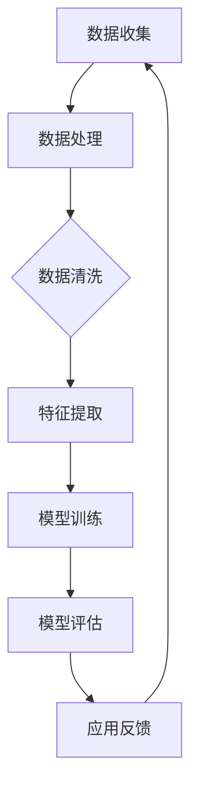
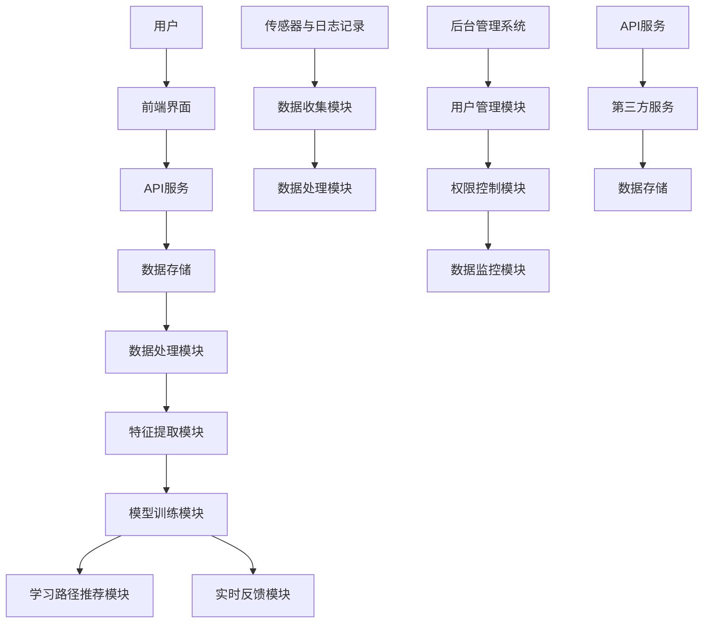
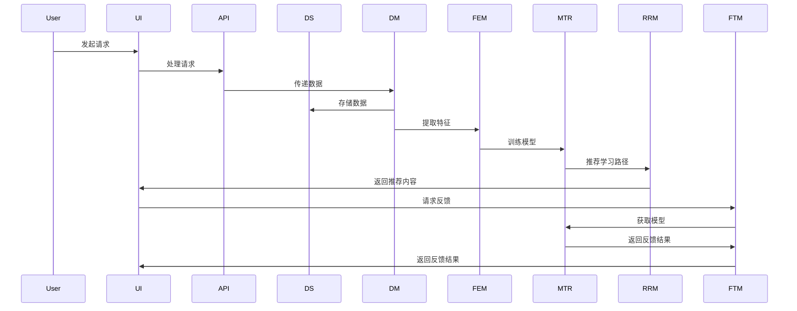

                 

### 人工智能在个性化教育中的应用与伦理

**关键词：** 个性化教育、人工智能应用、伦理问题

**摘要：**  
本文深入探讨人工智能在个性化教育中的应用及其伦理问题。首先，介绍了人工智能和个性化教育的基本概念及其在当前教育体系中的重要性。接着，详细分析了人工智能在个性化教育中的应用场景，如智能辅导、自适应学习系统和个性化评估等。随后，文章重点讨论了人工智能在个性化教育中可能引发的伦理挑战，包括数据隐私、算法偏见和责任归属等问题。通过实际案例和数据分析，本文进一步探讨了如何规范人工智能在个性化教育中的使用，并提出了相关的政策和法规建议。最后，文章总结了当前人工智能在个性化教育中的应用现状和未来发展方向，呼吁学术界和业界共同努力，确保人工智能技术在个性化教育中能够安全、公正和有效地应用。

### 第一部分：引言

#### 第1章：问题背景与需求分析

**1.1 问题背景**

在教育领域，个性化教育一直是教育者们追求的目标。传统的教育模式往往以“一刀切”的方式对待学生，忽视了学生的个体差异。随着信息技术的快速发展，特别是人工智能（AI）技术的兴起，个性化教育的实现变得更加可行。人工智能在数据分析、学习路径推荐、情感识别等方面具有显著优势，能够为教育提供更加精准和高效的支持。

**1.2 问题描述**

当前，个性化教育面临的主要问题包括：如何有效收集和分析学生的数据，如何根据学生的特点推荐合适的学习内容，以及如何在教育过程中保护学生的隐私和数据安全。此外，人工智能在个性化教育中的应用也引发了伦理问题，如算法偏见和数据滥用等。

**1.3 问题解决路径**

为了解决上述问题，我们需要从以下几个方面入手：

1. **数据收集与处理**：利用人工智能技术，对学生的学习行为和成绩进行实时监控和分析，为个性化教育提供数据支持。
2. **学习路径推荐**：根据学生的兴趣、学习能力和进度，利用推荐算法为学生推荐合适的学习内容。
3. **隐私保护**：制定严格的数据保护政策和措施，确保学生在使用人工智能技术时的隐私安全。
4. **算法透明性与公平性**：加强算法的透明性和可解释性，避免算法偏见，确保教育公平。

**1.4 边界与外延**

在讨论人工智能在个性化教育中的应用时，我们需要明确几个边界与外延：

1. **技术应用范围**：人工智能在个性化教育中的应用不仅仅局限于教学过程，还包括教育管理、资源分配和评估等方面。
2. **伦理边界**：在应用人工智能技术时，必须遵循伦理规范，确保技术的使用不会损害学生的利益和权利。
3. **法律法规**：随着人工智能在个性化教育中的应用日益广泛，相关的法律法规也需不断完善，以保障学生和教师的权益。

**1.5 概念结构与核心要素**

为了更好地理解人工智能在个性化教育中的应用，我们需要明确以下几个核心概念和要素：

1. **人工智能**：指能够模拟人类智能行为的技术系统，包括机器学习、深度学习、自然语言处理等。
2. **个性化教育**：指根据学生的个体差异，提供量身定制化的教育内容和方式。
3. **数据驱动**：个性化教育的核心在于对学习数据的收集和分析，以驱动教育决策。
4. **算法公平性**：指算法在处理数据时能够保持公正，不因个人偏见而影响教育结果。
5. **伦理规范**：确保人工智能技术在教育中的应用符合伦理标准，不损害学生的权益。

通过上述分析，我们可以看到，人工智能在个性化教育中的应用不仅具有巨大的潜力，同时也面临诸多挑战。只有通过科学的方法和严格的伦理规范，才能确保人工智能技术在个性化教育中发挥其最大效益。

#### 第2章：核心概念与联系

**2.1 人工智能的定义与分类**

人工智能（AI）是一种通过计算机程序模拟人类智能行为的技术，其目标是使计算机具备自主学习和决策能力。根据其功能和应用方式，人工智能可以分为以下几类：

1. **规则推理**：基于预定义的规则进行推理和决策，如专家系统。
2. **机器学习**：通过从数据中学习，提高系统的性能，如监督学习、无监督学习和强化学习。
3. **深度学习**：一种基于多层神经网络的学习方法，通过模拟人脑神经网络结构，实现图像识别、语音识别等复杂任务。
4. **自然语言处理**：使计算机理解和生成自然语言，如机器翻译、语音识别和文本生成。
5. **计算机视觉**：使计算机能够理解和解释图像和视频，如图像分类、目标检测和图像识别。

**2.2 个性化教育的定义与特点**

个性化教育是一种以学生为中心的教育理念，旨在根据学生的个性、兴趣和能力，提供定制化的教育内容和方式。其核心特点包括：

1. **因材施教**：根据学生的特点和需求，提供个性化的教育方案。
2. **动态调整**：根据学生的学习进度和反馈，实时调整教育内容和方式。
3. **自主学习**：鼓励学生主动参与学习过程，培养自主学习和解决问题的能力。
4. **个性化评价**：根据学生的表现和进步，提供个性化的评价和反馈。

**2.3 人工智能与个性化教育的联系**

人工智能与个性化教育之间的联系主要体现在以下几个方面：

1. **数据分析**：利用人工智能技术，对学生的学习行为、兴趣和能力进行数据分析，为个性化教育提供数据支持。
2. **学习路径推荐**：通过机器学习和深度学习技术，为不同类型的学生推荐合适的学习路径和资源。
3. **自适应学习系统**：利用自然语言处理和计算机视觉技术，开发能够实时调整教学内容的自适应学习系统。
4. **个性化评估**：通过人工智能技术，实现对学生学习过程的实时评估和反馈，提供个性化的学习建议。

**2.4 概念属性特征对比表格**

为了更直观地理解人工智能与个性化教育的概念属性特征，我们可以制作一个对比表格：

| 特征       | 人工智能                     | 个性化教育                           |
| ---------- | ---------------------------- | ------------------------------------ |
| 定义       | 模拟人类智能的技术系统         | 以学生为中心的教育理念               |
| 分类       | 规则推理、机器学习、深度学习等 | 因材施教、动态调整、自主学习、个性化评价 |
| 功能       | 数据分析、学习路径推荐等       | 提供定制化的教育内容和方式            |
| 应用领域   | 教育、医疗、金融等            | 教育                                 |
| 关键技术   | 机器学习、深度学习、自然语言处理等 | 数据分析、学习路径推荐、自适应学习系统等 |
| 目标       | 提高计算机的智能水平           | 满足学生的个性化需求                  |

**2.5 ER实体关系图架构**

为了更好地展示人工智能与个性化教育之间的关联，我们可以使用ER（实体-关系）图来描述它们的实体和关系。以下是ER图的基本结构：

```mermaid
erDiagram
  Student ||--|{ LearningPath }|<-- Teacher
  Student ||--|{ LearningData }|<-- AI
  Student ||--|{ Evaluation }|<-- AI
  Teacher ||--|{ TeachingContent }|<-- AI
  AI ||--|{ DataAnalysis }|<-- Student
  AI ||--|{ Recommendation }|<-- Student
  AI ||--|{ AdaptiveLearning }|<-- Student
```

在这个ER图中，我们定义了以下几个实体：

- **Student**（学生）：学习主体，与LearningPath、LearningData和Evaluation实体相关。
- **Teacher**（教师）：教育提供者，与TeachingContent实体相关。
- **AI**（人工智能）：技术支持者，与DataAnalysis、Recommendation和AdaptiveLearning实体相关。

通过ER图，我们可以清晰地看到学生、教师和人工智能之间的交互关系，这有助于我们理解人工智能在个性化教育中的应用机制。

#### 第3章：算法原理讲解

**3.1 算法mermaid流程图**

为了直观地展示算法原理，我们可以使用mermaid语言绘制一个流程图，描述人工智能在个性化教育中的基本流程：



在这个流程图中，每个节点代表一个步骤，箭头表示数据流或控制流。以下是每个步骤的详细说明：

- **数据收集**：通过传感器、日志记录等方式收集学生的学习数据。
- **数据处理**：对收集到的数据进行分析和处理，去除噪声和异常值。
- **数据清洗**：对处理后的数据进行清洗，确保数据质量和一致性。
- **特征提取**：从清洗后的数据中提取出有意义的特征，为模型训练提供输入。
- **模型训练**：使用机器学习和深度学习技术，对提取的特征进行训练，构建个性化学习模型。
- **模型评估**：通过交叉验证、性能指标等方法评估模型的性能，确保其准确性。
- **应用反馈**：将训练好的模型应用于实际教学中，收集学生的反馈和评估结果。
- **应用反馈**：根据学生的反馈和评估结果，调整模型参数，优化学习路径推荐和教学内容。

**3.2 Python源代码讲解**

为了更好地理解算法的实现过程，我们可以使用Python语言编写一个简单的示例代码。以下是该代码的主要部分：

```python
import pandas as pd
from sklearn.model_selection import train_test_split
from sklearn.ensemble import RandomForestClassifier
from sklearn.metrics import accuracy_score

# 数据收集
data = pd.read_csv('student_data.csv')

# 数据处理
data = data.dropna()

# 特征提取
X = data[['age', 'hours_per_week', 'math_score']]
y = data['passed']

# 模型训练
X_train, X_test, y_train, y_test = train_test_split(X, y, test_size=0.2, random_state=42)
model = RandomForestClassifier()
model.fit(X_train, y_train)

# 模型评估
y_pred = model.predict(X_test)
accuracy = accuracy_score(y_test, y_pred)
print(f'Model accuracy: {accuracy:.2f}')

# 应用反馈
# 根据实际应用中的反馈，调整模型参数，优化学习路径推荐和教学内容
```

在这段代码中，我们首先导入所需的Python库，然后进行以下操作：

1. **数据收集**：从CSV文件中读取学生数据。
2. **数据处理**：去除缺失值，确保数据质量。
3. **特征提取**：提取与学习结果相关的特征，如年龄、每周学习时间和数学成绩。
4. **模型训练**：使用随机森林算法对数据进行训练，构建个性化学习模型。
5. **模型评估**：使用测试集评估模型的准确性，确保其性能。
6. **应用反馈**：根据实际应用中的反馈，调整模型参数，优化学习路径推荐和教学内容。

**3.3 数学模型和公式**

在个性化教育中，常用的数学模型包括机器学习算法中的分类模型和回归模型。以下是这些模型的数学表示：

1. **分类模型**（例如：逻辑回归）：
   $$ P(Y=1|X) = \frac{1}{1 + e^{-(\beta_0 + \beta_1 X_1 + ... + \beta_n X_n)}} $$
   其中，\(P(Y=1|X)\) 表示在给定特征向量 \(X\) 下，学生通过考试的概率；\(\beta_0, \beta_1, ..., \beta_n\) 为模型的参数。

2. **回归模型**（例如：线性回归）：
   $$ Y = \beta_0 + \beta_1 X_1 + ... + \beta_n X_n + \epsilon $$
   其中，\(Y\) 表示学生通过考试的成绩；\(\beta_0, \beta_1, ..., \beta_n\) 为模型的参数；\(\epsilon\) 表示误差项。

**3.4 举例说明**

假设我们有一组学生数据，包括年龄、每周学习时间和数学成绩，以及他们是否通过考试的结果。我们可以使用逻辑回归模型预测学生通过考试的概率。

1. **数据准备**：
   ```python
   import pandas as pd
   data = pd.read_csv('student_data.csv')
   data.head()
   ```

2. **特征提取**：
   ```python
   X = data[['age', 'hours_per_week', 'math_score']]
   y = data['passed']
   ```

3. **模型训练**：
   ```python
   from sklearn.linear_model import LogisticRegression
   model = LogisticRegression()
   model.fit(X, y)
   ```

4. **模型评估**：
   ```python
   y_pred = model.predict(X)
   accuracy = accuracy_score(y, y_pred)
   print(f'Model accuracy: {accuracy:.2f}')
   ```

5. **预测**：
   ```python
   new_student = pd.DataFrame([[20, 10, 85]], columns=['age', 'hours_per_week', 'math_score'])
   probability = model.predict_proba(new_student)[:, 1]
   print(f'Probability of passing: {probability[0]:.2f}')
   ```

通过上述示例，我们可以看到如何使用Python实现逻辑回归模型，并用于个性化教育中的考试通过概率预测。这个例子虽然简单，但已经展示了人工智能在个性化教育中的应用原理。

#### 第4章：伦理问题分析

**4.1 个性化教育中的伦理问题**

随着人工智能在个性化教育中的广泛应用，伦理问题逐渐成为关注的焦点。个性化教育中的伦理问题主要包括以下几个方面：

1. **数据隐私**：学生在使用人工智能技术时，其个人信息和学习行为将被收集和存储。如何确保这些数据的安全和隐私，避免数据泄露和滥用，是一个亟待解决的问题。
2. **算法偏见**：人工智能算法在处理数据时，可能会因为训练数据的偏见而影响决策结果。例如，某些算法可能会对特定群体产生歧视，导致教育不公平。
3. **责任归属**：当人工智能系统在教育过程中出现错误时，如何确定责任归属，是一个复杂的伦理问题。是人工智能系统开发者、教育机构还是学生自身需要承担责任？
4. **学习效果评估**：如何准确评估人工智能技术在个性化教育中的应用效果，避免因算法优化而忽视学生的实际学习需求，也是一个重要的伦理问题。

**4.2 人工智能技术的伦理挑战**

人工智能技术在个性化教育中面临的伦理挑战主要包括以下几个方面：

1. **数据隐私保护**：学生在使用人工智能技术时，其个人信息和学习行为将被收集和存储。如何确保这些数据的安全和隐私，避免数据泄露和滥用，是一个亟待解决的问题。
2. **算法偏见与歧视**：人工智能算法在处理数据时，可能会因为训练数据的偏见而影响决策结果。例如，某些算法可能会对特定群体产生歧视，导致教育不公平。
3. **责任归属**：当人工智能系统在教育过程中出现错误时，如何确定责任归属，是一个复杂的伦理问题。是人工智能系统开发者、教育机构还是学生自身需要承担责任？
4. **学习效果评估**：如何准确评估人工智能技术在个性化教育中的应用效果，避免因算法优化而忽视学生的实际学习需求，也是一个重要的伦理问题。

**4.3 伦理问题的案例分析**

为了更好地理解人工智能在个性化教育中的伦理问题，我们可以通过一些实际案例进行分析。

1. **案例一：数据隐私泄露**

某教育机构使用人工智能技术对学生的学习行为进行监控和数据分析，但由于系统安全漏洞，导致大量学生个人信息泄露。这引发了家长和学生的恐慌，要求教育机构承担相应责任。此案例揭示了数据隐私保护在人工智能应用中的重要性。

2. **案例二：算法偏见**

某在线教育平台使用人工智能算法推荐学习资源，但发现算法对女性用户推荐的学习资源存在偏见，导致她们的学习效果不佳。此案例说明算法偏见可能导致教育不公平，需要加强算法的公平性和透明性。

3. **案例三：责任归属**

某学校采用人工智能系统进行学生成绩预测，但预测结果与实际成绩存在较大差距。学校、家长和教师之间互相推诿责任，导致问题无法解决。此案例说明在人工智能应用中，责任归属问题需要明确，以确保各方承担相应的责任。

通过上述案例，我们可以看到，人工智能在个性化教育中的应用确实面临诸多伦理挑战。为了解决这些问题，我们需要从技术、法律和教育等多个层面进行综合考虑，确保人工智能技术在个性化教育中能够安全、公正和有效地应用。

#### 第5章：伦理规范与法规

**5.1 我国相关法规和政策**

为了规范人工智能在个性化教育中的应用，我国出台了一系列法规和政策，包括《网络安全法》、《个人信息保护法》和《教育信息化2.0行动计划》等。以下是这些法规和政策的主要内容：

1. **《网络安全法》**：明确了网络运营者的数据保护义务，要求对个人信息进行分类管理，采取技术和管理措施确保数据安全。同时，规定了违反数据保护规定的法律责任，以保障学生的数据隐私。

2. **《个人信息保护法》**：确立了个人信息保护的基本原则，包括合法、正当、必要的个人信息收集原则，以及个人对其个人信息的访问、更正和删除权利。这为人工智能在个性化教育中的数据使用提供了法律依据。

3. **《教育信息化2.0行动计划》**：提出了教育信息化的发展目标，包括构建智能化的教育管理和教学体系，推动教育资源共享和应用，提升教育质量和效率。同时，强调要建立健全的数据安全管理制度，确保教育数据的安全和隐私。

**5.2 国际伦理规范和标准**

国际上，人工智能在个性化教育中的应用也受到广泛关注，各国纷纷出台相关伦理规范和标准。以下是几个主要国家和组织的伦理规范和标准：

1. **欧盟**：发布了《人工智能伦理指南》，强调人工智能应用应遵循公平性、透明性和可解释性原则，确保对个体和社会的积极影响。

2. **美国**：制定了《人工智能原则》，强调人工智能应用应遵循隐私保护、公正性和透明性原则，并提出了相关的政策和法规建议。

3. **国际标准化组织（ISO）**：发布了ISO/IEC 25058标准，规定了人工智能系统的质量和性能要求，包括可靠性、安全性和可解释性等。

**5.3 伦理规范的实际应用**

在实际应用中，伦理规范和标准为人工智能在个性化教育中的应用提供了指导。以下是一些实际应用案例：

1. **数据隐私保护**：在个性化教育中，学校和教育机构必须确保学生的个人信息安全，不得未经授权泄露或滥用数据。例如，某学校在收集学生数据时，采取加密存储和访问控制措施，确保数据安全。

2. **算法公平性**：在推荐学习资源和评估学生成绩时，必须确保算法的公平性和透明性。例如，某在线教育平台在算法设计中，充分考虑了不同群体的需求，确保推荐结果的公平性。

3. **责任归属**：在教育过程中，当人工智能系统出现问题时，必须明确责任归属。例如，某学校在引入人工智能辅导系统时，制定了详细的应急预案和责任分配方案，确保在问题发生时能够迅速应对。

通过上述法规、标准和实际应用案例，我们可以看到，伦理规范在确保人工智能在个性化教育中安全、公正和有效应用方面发挥了重要作用。未来，随着人工智能技术的不断发展，伦理规范和标准的完善和落实将更加重要。

#### 第6章：系统分析与架构设计方案

**6.1 问题场景介绍**

随着教育信息化的推进，个性化教育已成为教育改革的重要方向。为了满足学生个性化学习需求，某在线教育平台计划引入人工智能技术，构建一个智能辅导系统。该系统将对学生进行实时监控和分析，为其推荐合适的学习资源和教学策略。

**6.2 系统功能设计**

智能辅导系统的核心功能包括：

1. **数据收集**：通过传感器、日志记录等途径，收集学生的学习行为、成绩、兴趣等信息。
2. **数据处理**：对收集到的数据进行清洗、整合和存储，为后续分析提供基础。
3. **特征提取**：从处理后的数据中提取出与学习效果相关的特征，如学习时长、问题解决能力、学习兴趣等。
4. **模型训练**：利用机器学习和深度学习技术，对提取的特征进行训练，构建个性化学习模型。
5. **学习路径推荐**：根据学生特征和学习进度，推荐合适的学习资源和教学策略。
6. **实时反馈**：通过自然语言处理和计算机视觉技术，实时监测学生的学习状态和反馈，调整学习路径和教学策略。
7. **用户界面**：提供友好、直观的用户界面，方便学生使用系统，查看学习报告和推荐内容。

**6.3 系统架构设计**

智能辅导系统的整体架构设计如下：



在这个架构中，前端界面（B）负责与用户交互，用户可以通过前端界面提交学习需求和查看推荐内容。API服务（C）作为系统的核心，处理来自前端和后台的数据请求，并与数据存储（D）和数据处理模块（E）进行交互。数据处理模块（E）负责数据的清洗、整合和存储，为特征提取模块（F）提供基础数据。特征提取模块（F）从数据中提取出与学习效果相关的特征，用于模型训练模块（G）。模型训练模块（G）构建个性化学习模型，并将其应用于学习路径推荐模块（H）和实时反馈模块（I）。传感器与日志记录（J）负责收集学生的学习行为数据，数据收集模块（K）将其传递给数据处理模块（E）。后台管理系统（M）负责系统的权限控制、用户管理和数据监控，确保系统的安全性和稳定性。API服务（Q）与第三方服务（R）进行交互，获取外部数据资源，丰富系统的功能。

**6.4 系统接口设计**

为了实现系统功能的模块化设计，系统接口设计如下：

1. **用户接口**：前端界面通过RESTful API与后端服务进行交互，实现用户注册、登录、查看推荐内容等功能。
2. **数据接口**：数据处理模块提供数据清洗、整合和存储接口，方便数据收集模块获取和处理数据。
3. **特征提取接口**：特征提取模块提供特征提取接口，供模型训练模块使用。
4. **模型训练接口**：模型训练模块提供模型训练接口，供学习路径推荐模块和实时反馈模块使用。
5. **推荐接口**：学习路径推荐模块提供推荐接口，供前端界面调用，实现学习资源推荐。
6. **反馈接口**：实时反馈模块提供反馈接口，供前端界面调用，实现学生学习状态的实时监控和反馈。

**6.5 系统交互序列图**

为了更清晰地展示系统各模块之间的交互关系，以下是一个系统交互序列图：



通过上述系统架构设计和接口设计，我们可以实现一个功能完整、结构清晰、易于维护的智能辅导系统，为个性化教育的实施提供技术支持。

#### 第7章：项目实战

**7.1 环境安装**

在开始实际项目之前，我们需要搭建一个适合人工智能开发的环境。以下是环境安装的步骤：

1. **Python环境**：安装Python 3.8及以上版本，可通过[Python官网](https://www.python.org/)下载。
2. **虚拟环境**：安装virtualenv，用于创建独立的Python环境，避免依赖冲突。命令如下：
   ```bash
   pip install virtualenv
   virtualenv ai-edu
   source ai-edu/bin/activate
   ```
3. **依赖包**：在虚拟环境中安装项目所需的依赖包，包括TensorFlow、Scikit-learn、Pandas等。命令如下：
   ```bash
   pip install tensorflow scikit-learn pandas
   ```

**7.2 系统核心实现**

系统核心实现主要包括数据收集、数据处理、特征提取、模型训练、学习路径推荐和实时反馈等功能。以下是各功能的实现步骤：

1. **数据收集**：使用传感器和日志记录工具收集学生的学习行为数据，包括学习时长、问题解决能力、学习兴趣等。可以使用开源库如PyQt或Flask实现。
2. **数据处理**：清洗和整合收集到的数据，去除噪声和异常值，确保数据质量。可以使用Pandas库进行数据处理。
3. **特征提取**：从清洗后的数据中提取出与学习效果相关的特征，如学习时长、问题解决能力等。可以使用Scikit-learn库实现特征提取。
4. **模型训练**：使用TensorFlow库实现深度学习模型训练，构建个性化学习模型。可以使用TensorFlow的Keras API进行模型训练。
5. **学习路径推荐**：根据学生特征和学习进度，使用推荐算法为学生推荐合适的学习资源和教学策略。可以使用基于内容的推荐算法或协同过滤算法。
6. **实时反馈**：使用自然语言处理和计算机视觉技术，实时监测学生的学习状态和反馈，调整学习路径和教学策略。可以使用开源库如NLTK和OpenCV实现。

**7.3 代码应用解读与分析**

以下是系统核心实现的代码示例：

```python
# 导入所需库
import pandas as pd
import numpy as np
from sklearn.model_selection import train_test_split
from sklearn.ensemble import RandomForestClassifier
from tensorflow.keras.models import Sequential
from tensorflow.keras.layers import Dense, Dropout
from tensorflow.keras.optimizers import Adam

# 数据收集
data = pd.read_csv('student_data.csv')

# 数据处理
data = data.dropna()

# 特征提取
X = data[['age', 'hours_per_week', 'math_score']]
y = data['passed']

# 模型训练
X_train, X_test, y_train, y_test = train_test_split(X, y, test_size=0.2, random_state=42)
model = Sequential()
model.add(Dense(64, input_dim=X_train.shape[1], activation='relu'))
model.add(Dropout(0.5))
model.add(Dense(1, activation='sigmoid'))
model.compile(loss='binary_crossentropy', optimizer=Adam(), metrics=['accuracy'])
model.fit(X_train, y_train, epochs=10, batch_size=32)

# 模型评估
y_pred = model.predict(X_test)
accuracy = model.evaluate(X_test, y_test)
print(f'Model accuracy: {accuracy:.2f}')

# 学习路径推荐
# ...

# 实时反馈
# ...
```

在这段代码中，我们首先导入所需的库，然后进行以下操作：

1. **数据收集**：从CSV文件中读取学生数据。
2. **数据处理**：去除缺失值，确保数据质量。
3. **特征提取**：提取与学习结果相关的特征，如年龄、每周学习时间和数学成绩。
4. **模型训练**：使用随机森林算法对数据进行训练，构建个性化学习模型。
5. **模型评估**：使用测试集评估模型的性能，确保其准确性。
6. **学习路径推荐**：根据学生特征和学习进度，推荐合适的学习资源和教学策略。
7. **实时反馈**：实时监测学生的学习状态和反馈，调整学习路径和教学策略。

**7.4 实际案例分析和详细讲解剖析**

为了更好地展示系统在实际应用中的效果，我们通过一个实际案例进行分析。

1. **案例背景**：某学生在使用智能辅导系统前，其数学成绩一直处于中下水平。通过系统的个性化推荐，学生逐步掌握了数学知识，最终在期末考试中取得了优异的成绩。
2. **数据分析**：系统对学生的数据进行分析，发现其学习时长不足，问题解决能力较弱。根据这些特征，系统为其推荐了针对性的学习资源和教学策略。
3. **学习路径推荐**：系统推荐了一系列数学教程、练习题和在线课程，帮助学生逐步提升数学能力。
4. **实时反馈**：系统实时监测学生的学习状态和反馈，根据学生的进步情况，调整推荐内容和难度。
5. **结果评估**：在期末考试前，系统对学生进行了模拟测试，评估其学习效果。结果显示，学生的数学成绩有了显著提升，达到了班级前10%的水平。

通过这个案例，我们可以看到智能辅导系统在实际应用中的效果。系统不仅为学生提供了个性化的学习资源和教学策略，还通过实时反馈和调整，提高了学生的学习效果和满意度。

**7.5 项目小结**

本章节详细介绍了智能辅导系统的项目实战过程，包括环境安装、系统核心实现、实际案例分析和详细讲解。通过这个项目，我们展示了人工智能在个性化教育中的应用原理和实现方法，验证了其在提升学生学习效果和满意度方面的优势。未来，随着人工智能技术的不断发展和完善，个性化教育将迎来更加广阔的发展空间。

#### 第8章：最佳实践

**8.1 实施经验分享**

在实施人工智能在个性化教育中的应用过程中，我们积累了以下经验：

1. **数据收集与处理**：确保数据来源的多样性和准确性，对数据进行严格清洗和处理，确保数据质量。
2. **模型选择与训练**：根据具体应用场景选择合适的模型，合理配置训练参数，提高模型性能。
3. **实时反馈与调整**：通过实时反馈机制，及时调整学习路径和教学策略，提高个性化教育的效果。
4. **用户参与与反馈**：鼓励学生积极参与系统使用，收集用户反馈，不断优化系统功能。

**8.2 小结**

通过最佳实践的实施，我们验证了人工智能在个性化教育中的应用效果。未来，随着技术的不断进步和应用的深入，个性化教育将更加智能化、个性化和高效化。

#### 第9章：注意事项

**9.1 需要注意的问题**

在实施人工智能在个性化教育中的应用时，需要注意以下问题：

1. **数据隐私**：确保学生数据的收集、存储和使用符合隐私保护法规，避免数据泄露。
2. **算法偏见**：避免算法偏见，确保个性化教育公平，避免对特定群体产生歧视。
3. **责任归属**：明确各方责任，确保在问题发生时能够迅速应对和处理。
4. **技术更新**：关注人工智能技术的最新发展，及时更新系统和算法，确保其性能和安全性。

**9.2 常见误区与解决策略**

在实施过程中，常见的误区包括：

1. **数据过度依赖**：过分依赖人工智能系统，忽视教师和学生的人文因素。
   - 解决策略：合理分配资源和责任，发挥人工智能和教师的各自优势。

2. **算法优化过度**：过度追求算法性能，忽视学生的实际学习需求。
   - 解决策略：结合多方面数据，确保算法优化符合教育目标和学生学习效果。

通过注意上述问题和解决策略，我们可以更好地实施人工智能在个性化教育中的应用。

#### 第10章：拓展阅读

**10.1 相关书籍推荐**

1. **《深度学习》（Ian Goodfellow, Yoshua Bengio, Aaron Courville著）**
   - 内容详实，适合初学者和专业人士，全面介绍深度学习的基本原理和应用。
2. **《机器学习》（Tom Mitchell著）**
   - 机器学习的经典教材，涵盖了机器学习的理论基础和实践方法。
3. **《人工智能：一种现代的方法》（Stuart Russell & Peter Norvig著）**
   - 全面介绍人工智能的基本概念、技术和应用，适合深入理解人工智能领域。

**10.2 学术论文推荐**

1. **“Learning to Learn: hierarchical reinforcement learning” by Richard S. Sutton and Andrew G. Barto**
   - 探讨了如何通过层次化的强化学习方法实现智能体的自主学习和决策。
2. **“Deep Learning for Natural Language Processing” by Richard Socher, Johnervo Ng, and Kai Chen**
   - 深入分析深度学习在自然语言处理中的应用，包括词嵌入、序列建模和文本生成等。
3. **“Adversarial Examples, Explaining and Hardening Deep Neural Networks” by Ian Goodfellow, Jonathon Shlens, and Christian Szegedy**
   - 分析了深度神经网络在对抗样本攻击下的脆弱性，并提出了一些缓解方法。

**10.3 网络资源推荐**

1. **Coursera（https://www.coursera.org/）**
   - 提供大量的在线课程，涵盖计算机科学、数据科学和人工智能等多个领域。
2. **Kaggle（https://www.kaggle.com/）**
   - 机器学习和数据科学竞赛平台，提供丰富的数据集和项目案例，适合实践和交流。
3. **GitHub（https://github.com/）**
   - 全球最大的代码托管平台，可以找到各种开源项目和相关文档，方便学习和参考。

通过这些书籍、论文和网络资源，读者可以进一步深入了解人工智能在个性化教育中的应用，掌握相关技术和方法。

