                 

### 文章标题

# 人工智能在个性化教育中的应用：因材施教

> 关键词：人工智能、个性化教育、因材施教、数据驱动、智能算法、教育技术

> 摘要：随着人工智能技术的飞速发展，个性化教育逐渐成为教育领域的研究热点。本文旨在探讨人工智能在个性化教育中的应用，通过因材施教的理念，利用数据分析、建模、路径规划和教学系统设计等关键技术，实现精准化的教育服务。文章结构如下：第一部分介绍问题背景与核心概念；第二部分分析人工智能技术在个性化教育中的应用；第三部分探讨个性化学习路径规划；第四部分阐述适应性教学系统设计与实现；第五部分讨论个性化教育评价与反馈机制；第六部分介绍人工智能技术在教育平台中的应用。

### 第一部分：人工智能在个性化教育中的应用

#### 第1章：问题背景与核心概念

##### 1.1 问题背景

在传统教育模式中，教师面对众多学生，往往无法根据每个学生的特点进行个性化教学。这种“一刀切”的教学方式难以满足不同学生的学习需求和进度，导致学生之间的学习效果差异较大。个性化教育应运而生，它通过因材施教，根据学生的个性、能力和需求提供个性化的教学方案，旨在提高教育的公平性和有效性。

##### 1.1.1 传统教育的挑战

- **学生差异化处理困难**：传统教育模式中，教师难以针对每个学生的学习特点和需求进行个性化调整。
- **资源分配不均**：优质教育资源往往集中在少数学生身上，大多数学生难以获得公平的教育机会。
- **学习效果评估不精确**：传统教育评估方式往往缺乏针对性和准确性，难以全面反映学生的学习状况。

##### 1.1.2 个性化教育的需求

- **因材施教**：根据学生的个性、能力和需求，制定个性化的教学计划和教学内容。
- **个性化评估**：利用大数据和智能算法，对学生的学习过程和结果进行精准评估。
- **资源优化配置**：通过数据分析，合理分配教育资源，提高资源利用效率。

##### 1.1.3 人工智能与个性化教育的关系

人工智能技术为个性化教育提供了强大的支持。通过数据采集、分析和处理，人工智能能够深入挖掘学生的学习行为和知识结构，从而实现精准化的教学方案。同时，人工智能算法能够对大量学生数据进行分析，提供个性化的学习推荐和评估服务。

##### 1.2 核心概念

###### 1.2.1 个性化教育的定义与特征

个性化教育是指根据学生的个体差异，提供个性化的教学方案和学习资源，实现因材施教的教育模式。其主要特征包括：

- **个性化教学**：根据学生的个性、能力和需求，制定个性化的教学计划和教学内容。
- **个性化学习**：学生根据自身的兴趣和需求，选择适合自己的学习方式和资源。
- **精准化评估**：利用大数据和智能算法，对学生的学习过程和结果进行精准评估。

###### 1.2.2 人工智能的关键技术

人工智能在个性化教育中的应用主要包括以下关键技术：

- **数据分析**：对学生的行为数据、学习数据进行分析，挖掘潜在的学习模式和需求。
- **智能算法**：利用机器学习、深度学习等算法，对大量学生数据进行分析和处理，提供个性化的教学方案和评估结果。
- **自然语言处理**：通过对学生文本数据的处理，实现智能问答、智能推荐等功能。

###### 1.2.3 人工智能在个性化教育中的应用形式

人工智能在个性化教育中的应用形式主要包括：

- **个性化学习路径规划**：根据学生的能力和需求，制定个性化的学习路径，提高学习效率。
- **适应性教学系统**：根据学生的学习行为和反馈，动态调整教学内容和难度，实现个性化教学。
- **个性化学习评价**：利用智能算法，对学生的学习过程和结果进行精准评估，提供个性化的学习反馈。

##### 1.3 概念联系

###### 1.3.1 个性化教育与人工智能的融合

个性化教育与人工智能的融合，使得教育更加智能化、个性化。人工智能通过数据分析和智能算法，实现了对学生个体差异的识别和处理，从而为个性化教育提供了有力支持。个性化教育则为人工智能提供了丰富的应用场景，促进了人工智能技术的不断发展和完善。

###### 1.3.2 关键概念关系图

##### 1.4 本章小结

本章首先介绍了传统教育的挑战和个性化教育的需求，然后阐述了个性化教育的定义和特征，以及人工智能的关键技术和在个性化教育中的应用形式。最后，通过关键概念关系图，展示了个性化教育与人工智能之间的紧密联系。

----------------------------------------------------------------

### 第二部分：人工智能技术在个性化教育中的应用

#### 第2章：数据分析与建模技术

##### 2.1 数据分析技术

在个性化教育中，数据分析技术是关键的一环。通过对学生学习数据、教师教学数据、教育资源数据等进行分析，可以挖掘出学生个体差异、学习规律和需求，为个性化教学提供依据。

###### 2.1.1 数据收集与处理

数据收集是数据分析的第一步。在个性化教育中，主要收集以下类型的数据：

- **学生学习行为数据**：包括学生的学习时间、学习时长、学习内容、学习进度等。
- **教师教学数据**：包括教师的教学方法、教学内容、教学效果等。
- **教育资源数据**：包括课程资料、教学视频、教材等。

在数据收集过程中，需要确保数据的准确性和完整性。数据收集后，需要对数据进行预处理，包括数据清洗、去噪、归一化等操作，以便后续分析。

###### 2.1.2 数据分析与可视化

数据分析是对收集到的数据进行分析和处理，以发现数据中的规律和趋势。在个性化教育中，常见的数据分析方法包括：

- **统计分析**：通过对数据分布、相关性、趋势等进行分析，了解学生学习情况。
- **机器学习**：利用机器学习算法，建立模型预测学生学习效果、个性化推荐等。
- **深度学习**：通过深度学习算法，对大量复杂数据进行特征提取和模式识别。

数据分析完成后，需要将分析结果进行可视化，以便更直观地了解数据中的规律。常见的可视化方法包括：

- **柱状图**：用于显示数据分布和比较不同数据集。
- **折线图**：用于显示数据的变化趋势。
- **散点图**：用于显示数据之间的关系。
- **热力图**：用于显示数据的热点分布。

###### 2.1.3 数据质量评估与优化

数据质量直接影响数据分析的结果和可靠性。在个性化教育中，需要定期评估数据质量，包括数据的准确性、完整性、一致性等。如果数据存在质量问题，需要采取相应的优化措施，如数据清洗、去噪、数据修复等。

##### 2.2 建模技术

在个性化教育中，建模技术是实现个性化教学的核心。通过建立模型，可以预测学生的学习效果、制定个性化教学方案等。

###### 2.2.1 传统机器学习模型

传统机器学习模型在个性化教育中有广泛的应用。常见的传统机器学习模型包括：

- **决策树**：通过树的构建和剪枝，对数据进行分类和回归分析。
- **支持向量机**：通过寻找最优分隔超平面，对数据进行分类。
- **朴素贝叶斯**：利用贝叶斯定理，进行分类和概率估计。
- **神经网络**：通过多层感知器和反向传播算法，实现复杂的非线性映射。

传统机器学习模型在处理简单和线性问题时表现良好，但在处理复杂和非线性问题时，效果可能不佳。

###### 2.2.2 深度学习模型

深度学习模型在个性化教育中的应用越来越广泛。深度学习模型通过多层神经网络，可以自动提取数据中的特征，实现复杂的非线性映射。常见的深度学习模型包括：

- **卷积神经网络（CNN）**：通过卷积层、池化层和全连接层，实现图像和语音等数据的特征提取。
- **循环神经网络（RNN）**：通过循环结构，实现序列数据的建模。
- **长短期记忆网络（LSTM）**：通过引入记忆单元，解决RNN的梯度消失问题，适用于长序列数据建模。
- **生成对抗网络（GAN）**：通过生成器和判别器的对抗训练，实现数据的生成。

深度学习模型在处理复杂数据和实现复杂任务方面具有显著优势。

###### 2.2.3 强化学习模型

强化学习模型在个性化教育中的应用也日益增加。强化学习模型通过奖励机制，引导学生进行自主学习和探索。常见的强化学习模型包括：

- **Q学习**：通过Q值函数，实现状态-动作值函数的估计。
- **深度Q网络（DQN）**：通过深度神经网络，实现Q值函数的估计。
- **策略梯度方法**：通过策略函数，实现行为策略的优化。

强化学习模型在个性化教育中可以引导学生进行自主学习和探索，提高学习效果。

##### 2.3 模型优化与评估

在个性化教育中，模型的优化与评估是确保模型性能的重要环节。

###### 2.3.1 模型优化策略

模型优化策略主要包括：

- **超参数调优**：通过调整模型参数，如学习率、正则化参数等，优化模型性能。
- **模型融合**：通过结合多个模型，提高预测精度和泛化能力。
- **迁移学习**：利用预训练模型，提高新任务的性能。

###### 2.3.2 模型评估指标

模型评估指标主要包括：

- **准确率**：分类问题中的正确预测比例。
- **召回率**：分类问题中实际为正类但被正确预测的比例。
- **F1值**：准确率和召回率的调和平均值。
- **均方误差（MSE）**：回归问题中预测值与真实值之间的误差平方的平均值。

###### 2.3.3 模型调优实践

在个性化教育中，模型调优实践包括：

- **数据集划分**：将数据集划分为训练集、验证集和测试集，用于模型的训练、验证和评估。
- **交叉验证**：通过交叉验证，评估模型的泛化能力。
- **模型评估**：利用评估指标，对模型性能进行评估。
- **模型优化**：根据评估结果，调整模型参数和结构，优化模型性能。

##### 2.4 本章小结

本章介绍了数据分析与建模技术在个性化教育中的应用。首先，分析了数据收集与处理、数据分析和可视化等技术，然后介绍了传统机器学习模型、深度学习模型和强化学习模型等建模技术，最后讨论了模型优化与评估的方法和实践。通过本章的内容，读者可以了解到个性化教育中数据分析与建模技术的重要性和应用方法。

----------------------------------------------------------------

### 第3章：个性化学习路径规划

个性化学习路径规划是人工智能在个性化教育中的关键应用之一。通过个性化学习路径规划，可以根据学生的学习特点和需求，制定出最优的学习路径，从而提高学习效率和效果。

##### 3.1 学习路径规划概述

###### 3.1.1 学习路径规划的定义与作用

学习路径规划是指根据学生的个性、能力和学习需求，制定出科学、合理的学习路径，以实现因材施教。学习路径规划的作用主要体现在以下几个方面：

- **提高学习效率**：通过个性化学习路径规划，学生可以按照适合自己的学习节奏进行学习，从而提高学习效率。
- **促进自主学习**：学习路径规划鼓励学生主动参与学习过程，培养学生的自主学习能力和创新思维。
- **优化教育资源**：学习路径规划可以根据学生的需求，合理分配教育资源，提高教育资源的利用效率。

###### 3.1.2 学习路径规划的基本流程

学习路径规划的基本流程主要包括以下几个步骤：

- **学生特征分析**：通过对学生的学习数据进行分析，挖掘学生的个性、能力和学习需求。
- **学习目标设定**：根据学生特征分析结果，设定具体的学习目标。
- **学习内容选择**：根据学习目标和学生的兴趣、特长，选择合适的学习内容。
- **学习路径设计**：根据学习内容和学习目标，设计科学、合理的个性化学习路径。
- **学习路径执行**：执行学习路径，学生按照规划进行学习，教师给予指导和反馈。

###### 3.1.3 学习路径规划的挑战与对策

学习路径规划面临以下挑战：

- **数据复杂性**：学生学习数据的复杂性使得分析过程复杂，需要有效的数据分析和挖掘技术。
- **个性化需求多样性**：不同学生的个性化需求使得学习路径规划需要考虑更多的因素，需要灵活的算法和模型。
- **动态调整**：学习路径需要根据学生的学习进度和效果进行动态调整，以适应不断变化的学习需求。

针对上述挑战，可以采取以下对策：

- **高效的数据处理**：采用高效的数据处理算法和工具，提高数据处理效率。
- **多维度个性化需求**：采用多维度个性化需求模型，综合考虑学生的不同需求。
- **动态调整机制**：建立动态调整机制，根据学生的学习进度和效果，实时调整学习路径。

##### 3.2 算法与模型

个性化学习路径规划需要运用多种算法和模型，以实现科学、合理的学习路径设计。以下介绍几种常见的算法和模型：

###### 3.2.1 基于规则的方法

基于规则的方法是通过定义一系列规则，根据学生的特征和需求，自动生成学习路径。这种方法简单直观，但可能无法完全适应学生的个性化需求。

- **规则库构建**：根据教育领域知识和经验，构建规则库。
- **规则匹配**：根据学生的特征，匹配相应的规则。
- **路径生成**：根据规则匹配结果，生成个性化学习路径。

###### 3.2.2 基于数据驱动的方法

基于数据驱动的方法是通过分析学生的学习数据，自动生成学习路径。这种方法能够更好地适应学生的个性化需求，但需要高效的数据分析和挖掘技术。

- **数据收集**：收集学生的学习数据，包括学习行为、学习进度、考试成绩等。
- **数据预处理**：对学习数据进行清洗、归一化等预处理操作。
- **特征提取**：从学习数据中提取关键特征，如学习时间、学习内容、学习效果等。
- **模型训练**：利用特征数据，训练分类或回归模型。
- **路径生成**：根据模型预测结果，生成个性化学习路径。

###### 3.2.3 基于混合智能的方法

基于混合智能的方法是将基于规则和数据驱动的方法相结合，以提高学习路径规划的灵活性和适应性。

- **规则库与模型结合**：将规则库与数据驱动模型相结合，根据学生的特征和需求，动态调整规则库中的规则。
- **多模型融合**：采用多种数据驱动模型，如决策树、神经网络、支持向量机等，进行模型融合，提高预测精度和泛化能力。
- **动态调整机制**：根据学生的学习进度和效果，动态调整学习路径，以适应不断变化的学习需求。

##### 3.3 实例分析

以下是一个个性化学习路径规划的实例分析：

###### 3.3.1 案例介绍

某学生在学习编程课程时，希望通过个性化学习路径规划，提高学习效果。该学生具有以下特征：

- **学习时间**：每天有2小时的学习时间。
- **学习内容**：已掌握基础编程知识，希望学习高级编程技巧。
- **学习目标**：掌握数据结构与算法，提高编程能力。

###### 3.3.2 算法实现

采用基于混合智能的方法进行个性化学习路径规划。具体步骤如下：

1. **数据收集**：收集学生的学习数据，包括学习时间、学习内容、学习进度、考试成绩等。
2. **数据预处理**：对学习数据进行清洗、归一化等预处理操作。
3. **特征提取**：从学习数据中提取关键特征，如学习时间、学习内容、学习效果等。
4. **模型训练**：利用特征数据，训练分类或回归模型，如决策树、神经网络等。
5. **路径生成**：根据模型预测结果，生成个性化学习路径。

根据上述步骤，生成的个性化学习路径如下：

1. **学习时间规划**：每天安排2小时学习时间，每周学习5天。
2. **学习内容规划**：首先复习基础编程知识，然后学习数据结构与算法，最后进行实战项目训练。
3. **学习目标规划**：每周设定具体的学习目标，如掌握排序算法、查找算法等。

###### 3.3.3 结果分析

通过个性化学习路径规划，学生在学习过程中能够更加有针对性地进行学习，提高学习效率。同时，学习路径的动态调整机制能够根据学生的学习进度和效果，及时调整学习内容和学习目标，确保学习过程的科学性和合理性。

##### 3.4 本章小结

本章介绍了个性化学习路径规划的概念、基本流程、挑战与对策，以及常用的算法和模型。通过实例分析，展示了个性化学习路径规划在实际应用中的效果。通过本章的内容，读者可以了解到个性化学习路径规划的重要性和实现方法。

----------------------------------------------------------------

### 第4章：适应性教学系统设计与实现

适应性教学系统是一种能够根据学生的实时学习状态和需求，动态调整教学内容和教学策略的教育技术系统。本章将详细讨论适应性教学系统的设计与实现，包括系统设计概述、数据管理模块、教学内容模块、学生行为分析模块、系统实现与评估等内容。

##### 4.1 系统设计概述

###### 4.1.1 系统功能需求分析

适应性教学系统的功能需求主要包括：

- **学习数据采集**：系统需要能够自动采集学生的学习数据，包括学习行为、学习进度、考试成绩等。
- **学习路径规划**：系统需要根据学生的学习数据和目标，自动规划个性化的学习路径。
- **教学内容动态调整**：系统需要能够根据学生的学习状态和需求，动态调整教学内容和难度。
- **学生行为分析**：系统需要能够分析学生的行为数据，发现学生的学习规律和问题。
- **教学效果评估**：系统需要能够对学生的学习效果进行评估，并提供针对性的反馈。
- **系统维护与管理**：系统需要提供便捷的系统维护和管理功能，确保系统的正常运行。

###### 4.1.2 系统架构设计

适应性教学系统的架构设计如图所示：

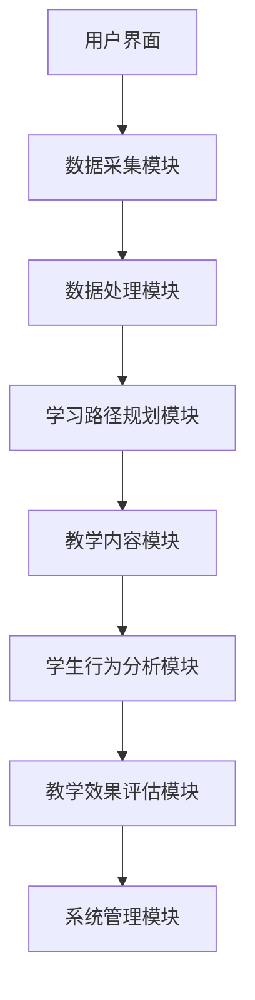

系统中各模块的职责如下：

- **用户界面**：提供用户交互接口，用户可以通过用户界面查看学习内容、调整学习目标等。
- **数据采集模块**：负责收集学生的学习数据，包括学习行为、学习进度、考试成绩等。
- **数据处理模块**：对采集到的数据进行分析和处理，提取有用的信息，为后续模块提供支持。
- **学习路径规划模块**：根据学生的特点和需求，自动生成个性化的学习路径。
- **教学内容模块**：根据学习路径，动态调整教学内容和难度，为学生提供合适的学习资源。
- **学生行为分析模块**：分析学生的行为数据，发现学生的学习规律和问题。
- **教学效果评估模块**：对学生的学习效果进行评估，并提供针对性的反馈。
- **系统管理模块**：提供系统的维护和管理功能，确保系统的正常运行。

###### 4.1.3 系统模块划分

适应性教学系统可以划分为以下几个模块：

- **数据采集模块**：包括数据采集器、数据存储器和数据清洗器等子模块。
- **数据处理模块**：包括特征提取器、数据分析器和数据可视化器等子模块。
- **学习路径规划模块**：包括规则库管理器、模型训练器和路径规划器等子模块。
- **教学内容模块**：包括内容规划器、资源管理器和内容调整器等子模块。
- **学生行为分析模块**：包括行为数据采集器、行为分析器和行为反馈器等子模块。
- **教学效果评估模块**：包括评估指标器、评估结果分析和反馈生成器等子模块。
- **系统管理模块**：包括用户管理器、权限管理器和日志管理器等子模块。

##### 4.2 数据管理模块

数据管理模块是适应性教学系统的核心组成部分，负责数据采集、存储、处理和可视化等工作。

###### 4.2.1 数据收集与存储

数据收集与存储是数据管理模块的基础工作。数据收集包括以下内容：

- **学生学习行为数据**：记录学生的学习时间、学习时长、学习内容、学习进度等。
- **学生学习结果数据**：记录学生的考试成绩、学习成果等。
- **教师教学数据**：记录教师的教学方法、教学内容、教学效果等。

数据存储采用分布式数据库技术，确保数据的高可用性和可扩展性。数据存储方案如图所示：

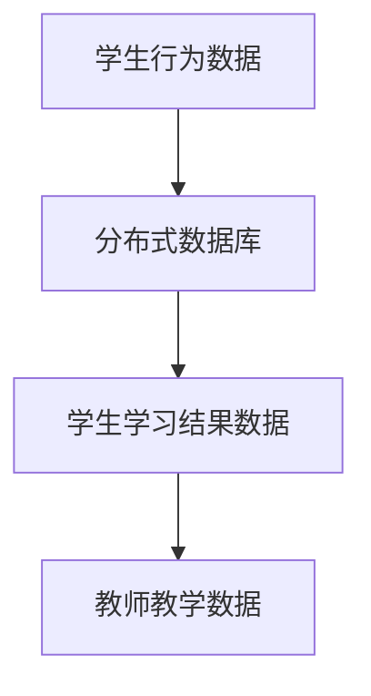

###### 4.2.2 数据处理与清洗

数据处理与清洗是确保数据质量和可用性的关键步骤。数据处理包括以下内容：

- **数据清洗**：去除数据中的噪声和异常值，确保数据的一致性和准确性。
- **数据归一化**：将不同数据类型和量纲的数据进行归一化处理，便于后续分析。
- **特征提取**：从原始数据中提取有用的特征，为后续分析提供支持。

数据处理流程如图所示：

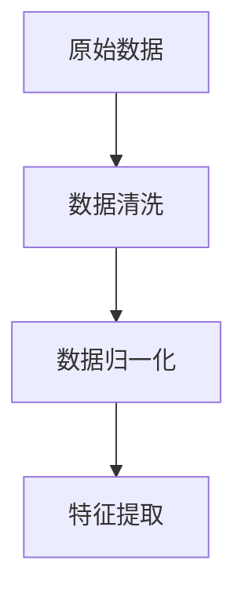

###### 4.2.3 数据可视化

数据可视化是将数据以图形或图像的形式展示，便于用户理解和分析。数据可视化包括以下内容：

- **学习行为可视化**：展示学生的学习时间分布、学习内容分布等。
- **学习效果可视化**：展示学生的学习成绩、学习成果等。
- **教师教学效果可视化**：展示教师的教学效果、教学资源利用率等。

数据可视化工具如图所示：

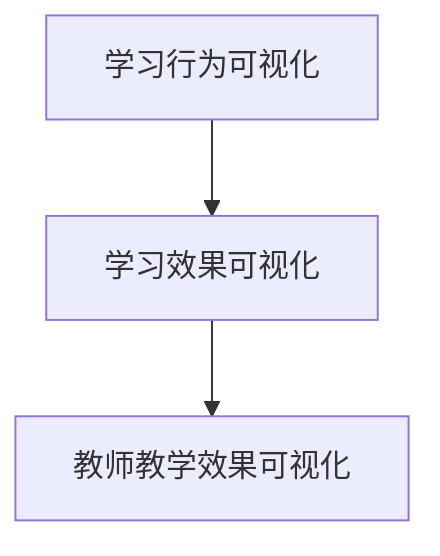

##### 4.3 教学内容模块

教学内容模块负责根据学习路径和学生学习状态，动态调整教学内容和难度，为学生提供个性化的学习资源。

###### 4.3.1 教学内容规划

教学内容规划包括以下内容：

- **知识体系构建**：根据课程大纲和教学目标，构建完整的知识体系。
- **内容模块划分**：将知识体系划分为多个模块，每个模块包含多个知识点。
- **内容难度分级**：根据知识点的重要性、复杂度和学生的认知水平，对内容进行难度分级。

教学内容规划流程如图所示：

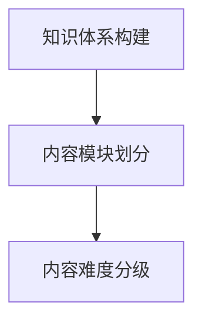

###### 4.3.2 教学内容动态调整

教学内容动态调整包括以下内容：

- **学习路径匹配**：根据学生的学习路径和当前学习状态，匹配适合的学习内容。
- **内容难度调整**：根据学生的学习进度和效果，动态调整学习内容的难度。
- **资源推荐**：根据学生的学习兴趣和需求，推荐相关的学习资源和扩展内容。

教学内容动态调整流程如图所示：

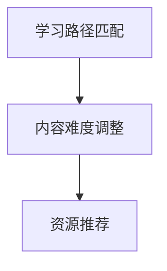

###### 4.3.3 教学资源管理

教学资源管理包括以下内容：

- **资源分类管理**：对教学资源进行分类管理，便于用户查找和使用。
- **资源权限管理**：根据用户角色和权限，控制资源的访问和使用。
- **资源更新与维护**：定期更新和维护教学资源，确保资源的准确性和实用性。

教学资源管理流程如图所示：

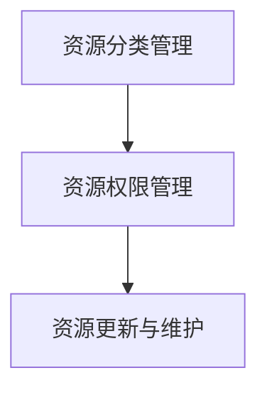

##### 4.4 学生行为分析模块

学生行为分析模块负责分析学生的行为数据，发现学生的学习规律和问题，为教学调整提供依据。

###### 4.4.1 学生行为数据收集

学生行为数据收集包括以下内容：

- **学习行为数据**：记录学生的学习时间、学习时长、学习内容、学习进度等。
- **交互行为数据**：记录学生的在线问答、讨论、投票等交互行为。
- **考试行为数据**：记录学生的考试成绩、答题时间、错误类型等。

学生行为数据收集流程如图所示：

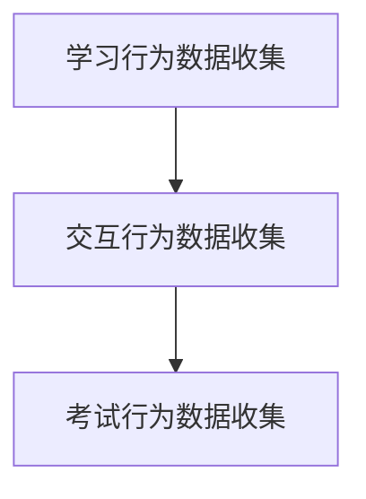

###### 4.4.2 学生行为分析模型

学生行为分析模型包括以下内容：

- **行为预测模型**：预测学生的未来学习行为和成绩，为教学调整提供依据。
- **行为识别模型**：识别学生的行为类型和特征，为个性化推荐和干预提供支持。
- **行为聚类模型**：将具有相似行为特征的学生划分为不同的群体，为教学策略设计提供参考。

学生行为分析模型如图所示：

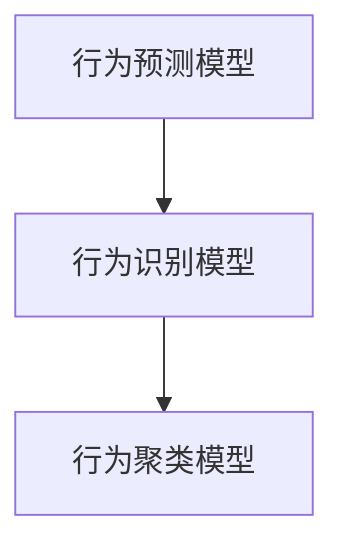

###### 4.4.3 学生行为反馈机制

学生行为反馈机制包括以下内容：

- **实时反馈**：根据学生的学习行为和成绩，实时提供反馈和建议。
- **周期性反馈**：定期分析学生的行为数据，提供全面的反馈报告。
- **个性化干预**：根据学生的行为特征和需求，提供个性化的干预措施，促进学习进步。

学生行为反馈机制如图所示：

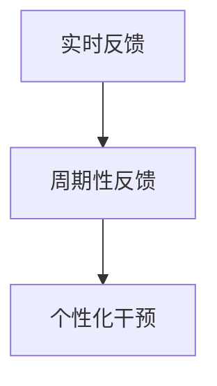

##### 4.5 系统实现与评估

系统实现与评估是适应性教学系统的关键环节，包括系统实现流程、系统测试与评估、系统优化与改进等内容。

###### 4.5.1 系统实现流程

系统实现流程如图所示：

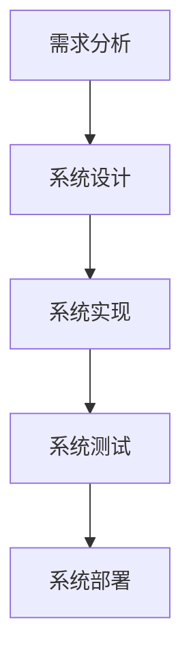

系统实现流程包括以下几个阶段：

1. **需求分析**：明确系统的功能需求和技术需求，为系统设计提供依据。
2. **系统设计**：设计系统的架构、模块划分、接口设计等，为系统实现提供指导。
3. **系统实现**：根据系统设计，编写代码实现各个模块的功能。
4. **系统测试**：对系统进行功能测试、性能测试、安全测试等，确保系统质量。
5. **系统部署**：将系统部署到生产环境，进行上线运行。

###### 4.5.2 系统测试与评估

系统测试与评估是确保系统质量的重要环节，包括以下内容：

- **功能测试**：验证系统功能是否按照需求设计正常工作。
- **性能测试**：测试系统在高负载、高并发情况下的性能，确保系统的稳定性和可靠性。
- **安全测试**：测试系统在面临安全攻击时的防护能力，确保系统的安全性。
- **用户体验测试**：评估系统的用户界面、交互设计等是否满足用户需求。

系统测试与评估流程如图所示：

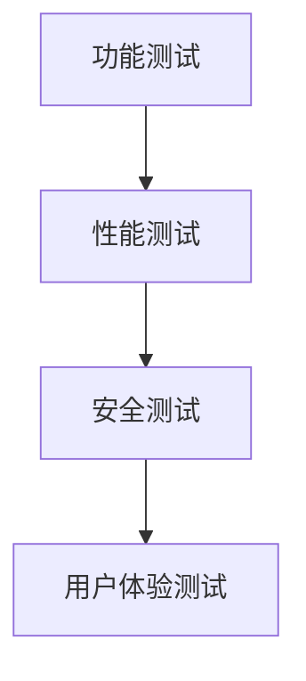

系统测试与评估结果将反馈给系统设计和开发团队，用于系统的优化和改进。

###### 4.5.3 系统优化与改进

系统优化与改进是确保系统长期稳定运行和持续提升性能的重要手段，包括以下内容：

- **性能优化**：对系统中的关键模块进行优化，提高系统的运行效率和响应速度。
- **功能扩展**：根据用户需求和反馈，扩展系统的功能模块，提升系统的适用性。
- **界面优化**：优化系统的用户界面，提升用户体验。
- **安全加固**：加强系统的安全防护，提高系统的安全性。

系统优化与改进流程如图所示：

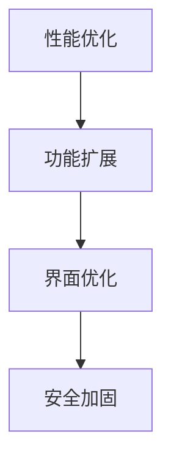

通过系统优化与改进，可以提高系统的稳定性和可靠性，满足用户的需求，提升系统的整体性能。

##### 4.6 本章小结

本章介绍了适应性教学系统的设计与实现，包括系统设计概述、数据管理模块、教学内容模块、学生行为分析模块、系统实现与评估等内容。通过适应性教学系统的实现，可以为学生提供个性化的学习体验，提高教学效果和效率。

----------------------------------------------------------------

### 第5章：个性化教育评价与反馈机制

个性化教育评价与反馈机制是确保个性化教育效果的重要环节。通过科学的评价标准和有效的反馈机制，可以全面了解学生的学习情况，指导教学改进，促进学生的全面发展。

##### 5.1 评价体系构建

个性化教育的评价体系应具备以下特点：

- **全面性**：评价内容应涵盖学生的学习过程和结果，包括知识掌握、能力培养、情感态度等。
- **动态性**：评价过程应随着学生的学习进展和需求变化而动态调整，确保评价的实时性和针对性。
- **客观性**：评价标准和方法应客观公正，减少主观因素的影响。
- **发展性**：评价应关注学生的成长和进步，激励学生发挥潜力。

###### 5.1.1 评价标准与方法

个性化教育的评价标准与方法主要包括：

- **过程性评价**：关注学生的学习过程，通过课堂观察、作业批改、学习日志等方式，了解学生的学习态度、学习习惯和方法。
- **结果性评价**：关注学生的学习结果，通过考试、测验、项目展示等方式，评估学生的知识掌握程度和技能水平。
- **自我评价**：鼓励学生进行自我反思和自我评价，提高学生的自我认知和自我管理能力。
- **同伴评价**：通过同伴互评，促进学生之间的交流和合作，培养团队精神和协作能力。

###### 5.1.2 评价指标体系设计

个性化教育的评价指标体系设计应考虑以下几个方面：

- **知识掌握度**：评估学生对所学知识的理解和掌握程度。
- **能力发展**：评估学生在学习过程中培养的能力，如思维能力、创新能力、实践能力等。
- **学习态度**：评估学生的学习积极性、主动性、自律性等。
- **情感态度**：评估学生在学习过程中的情感体验，如兴趣、动机、情绪等。

评价指标体系设计如图所示：

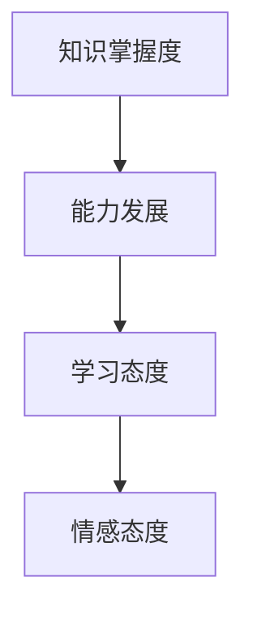

###### 5.1.3 评价结果分析与应用

评价结果的分析与应用主要包括以下几个方面：

- **结果分析**：对评价结果进行定量和定性分析，了解学生的整体学习情况和个体差异。
- **诊断与反馈**：根据评价结果，诊断学生的学习问题，为教学改进提供依据。
- **改进措施**：根据评价结果和诊断，制定针对性的改进措施，提高教学效果。
- **激励与鼓励**：对表现优秀的学生给予表彰和奖励，激发学生的学习动力。

##### 5.2 反馈机制设计

个性化教育反馈机制的设计应考虑以下几个方面：

- **实时性**：及时提供反馈，帮助学生及时纠正错误，调整学习策略。
- **针对性**：根据学生的特点和需求，提供个性化的反馈。
- **多样性**：通过多种渠道和形式，提供形式多样的反馈，如文字、图表、音频、视频等。
- **互动性**：鼓励学生参与反馈过程，增强反馈的有效性和实效性。

###### 5.2.1 反馈信息的收集与处理

反馈信息的收集与处理主要包括以下几个方面：

- **学生反馈**：收集学生对教学过程的意见和建议，了解学生的需求和期望。
- **教师反馈**：收集教师对学生的评价和反馈，关注学生的学习进展和问题。
- **同伴反馈**：收集学生之间的互评和反馈，促进学生的互助与合作。
- **技术支持**：利用大数据和人工智能技术，对反馈信息进行自动化处理和分析，提高反馈的准确性和效率。

###### 5.2.2 反馈机制的作用与意义

反馈机制在个性化教育中具有重要作用和意义：

- **改进教学**：通过反馈，教师可以了解学生的学习情况，调整教学方法和策略，提高教学效果。
- **促进学习**：通过反馈，学生可以及时了解自己的学习状况，调整学习态度和方法，提高学习效果。
- **提高参与度**：通过互动性反馈，激发学生的学习兴趣和参与热情，增强学生的自主学习能力。
- **促进评价体系完善**：通过反馈，不断完善评价体系，使其更科学、合理、有效。

###### 5.2.3 反馈机制的实现方法

反馈机制的实现方法主要包括以下几个方面：

- **课堂反馈**：在课堂教学中，教师通过提问、讨论、作业等形式，收集学生的反馈信息。
- **在线反馈**：利用在线学习平台，收集学生的在线学习反馈，如学习心得、讨论区评论等。
- **问卷调查**：通过问卷调查，收集学生对教学过程和内容的反馈，了解学生的满意度和建议。
- **数据分析**：利用数据分析技术，对反馈信息进行自动化处理和分析，提取有用的信息，为教学改进提供依据。

##### 5.3 评价与反馈的案例研究

以下是一个个性化教育评价与反馈机制的案例研究：

###### 5.3.1 案例介绍

某高中在实施个性化教育过程中，建立了基于大数据和人工智能技术的评价与反馈系统。该系统通过数据分析，实时评估学生的学习状态，并提供个性化的反馈和建议。

###### 5.3.2 评价与反馈实践

1. **学生反馈收集**：系统收集学生的在线学习日志、作业、考试等数据，分析学生的学习行为和成果。

2. **教师反馈**：教师通过系统，对学生的作业、考试成绩进行评价，并提供个性化的建议。

3. **同伴反馈**：学生通过系统，相互评价学习成果，互相学习，共同进步。

4. **数据分析**：系统对学生的行为数据和评价结果进行分析，提取学习规律和问题。

5. **反馈生成**：根据分析结果，系统生成个性化的反馈报告，包括学习建议、学习资源推荐等。

###### 5.3.3 案例效果分析

通过个性化教育评价与反馈系统，学生在学习过程中得到了及时、个性化的指导，学习效果显著提升。具体效果如下：

- **学习积极性提高**：学生通过反馈，了解自己的学习状况，增强学习动力。
- **学习效率提高**：学生根据反馈，调整学习策略和方法，提高学习效率。
- **教师教学效果提升**：教师通过反馈，了解学生的学习需求，改进教学方法，提高教学质量。
- **教学管理优化**：学校通过系统，对教学过程进行科学管理，提高整体教学水平。

##### 5.4 本章小结

本章介绍了个性化教育评价与反馈机制的设计和实践。通过科学的评价标准和有效的反馈机制，可以全面了解学生的学习情况，指导教学改进，促进学生的全面发展。案例研究表明，个性化教育评价与反馈机制在提高学习效果、优化教学管理方面具有显著作用。

----------------------------------------------------------------

### 第6章：人工智能技术在教育平台中的应用

随着人工智能技术的不断发展和普及，其在教育领域中的应用也越来越广泛。本章将重点讨论人工智能技术在教育平台中的应用，包括教育平台概述、教育平台的功能与特点、教育平台的发展趋势、教育平台的技术架构等内容。

##### 6.1 教育平台概述

教育平台是指利用互联网、云计算、大数据、人工智能等现代信息技术，为教育用户提供教学、学习、管理等服务的信息系统。教育平台作为数字化教育的重要基础设施，正逐渐成为教育行业的重要组成部分。

###### 6.1.1 教育平台的功能与特点

教育平台的功能与特点主要包括：

- **教学管理**：包括课程管理、教学进度管理、作业管理、考试管理等。
- **学习支持**：提供在线学习资源、学习社区、学习工具等，支持学生的自主学习和协作学习。
- **数据管理**：收集、存储、分析学生的学习行为数据，为个性化教学提供数据支持。
- **互动交流**：支持师生之间、学生之间的在线交流互动，提高教学互动性和参与度。
- **安全可靠**：确保平台的安全性、稳定性和可靠性，保障教育数据的安全。

教育平台的特点包括：

- **开放性**：教育平台具有开放性，支持多种教育资源的接入和使用。
- **灵活性**：教育平台可以根据用户需求灵活配置和调整功能模块。
- **个性化**：教育平台可以根据学生的学习特点和需求，提供个性化的教学服务。
- **协作性**：教育平台支持师生之间、学生之间的协作学习，提高学习效果。

###### 6.1.2 教育平台的发展趋势

随着人工智能技术的不断发展，教育平台的发展趋势主要包括：

- **智能化**：教育平台将更多地应用人工智能技术，实现智能推荐、智能问答、智能辅导等功能。
- **个性化**：教育平台将更加注重个性化教学，根据学生的特点和需求，提供个性化的教学服务。
- **云化**：教育平台将更多地采用云计算技术，实现资源的集中管理和共享。
- **移动化**：教育平台将更加注重移动端的用户体验，支持多种移动设备的接入和使用。
- **社交化**：教育平台将更多地融入社交元素，促进师生之间、学生之间的互动和协作。

###### 6.1.3 教育平台的技术架构

教育平台的技术架构主要包括以下几个层次：

1. **前端界面层**：包括网页、移动应用等用户界面，提供用户与平台交互的界面。
2. **业务逻辑层**：包括教学管理、学习支持、数据管理等功能模块，实现教育平台的核心业务逻辑。
3. **数据存储层**：包括数据库、数据仓库等，存储和管理教育平台的数据。
4. **数据服务层**：包括数据接口、数据分析和挖掘等，提供数据访问和分析服务。
5. **基础设施层**：包括服务器、存储设备、网络设备等，提供教育平台的运行环境。

教育平台的技术架构如图所示：

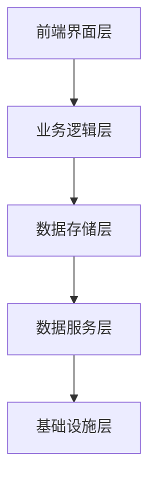

##### 6.2 人工智能技术在教育平台中的应用

人工智能技术在教育平台中的应用主要包括：

- **智能推荐**：利用人工智能算法，根据学生的学习历史、兴趣偏好等，为学生推荐合适的课程、学习资源等。
- **智能问答**：利用自然语言处理技术，实现自动回答学生的问题，提供学习辅导。
- **智能批改**：利用机器学习算法，自动批改学生的作业和考试，提供即时反馈。
- **情感分析**：利用情感分析技术，分析学生的学习情感，提供针对性的心理辅导。
- **学习行为分析**：利用大数据技术，分析学生的学习行为，提供个性化的学习建议。

###### 6.2.1 智能推荐

智能推荐是教育平台中应用最为广泛的人工智能技术之一。智能推荐可以根据学生的学习历史、学习偏好、学习环境等，为学生推荐合适的课程、学习资源等。

- **推荐算法**：常用的推荐算法包括协同过滤算法、基于内容的推荐算法、混合推荐算法等。
- **推荐系统架构**：推荐系统架构包括数据层、算法层和用户界面层等。

推荐系统架构如图所示：

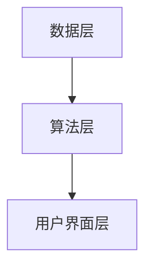

- **数据采集**：采集学生的学习历史、学习偏好、学习环境等数据。
- **数据处理**：对采集到的数据进行分析和处理，提取有用的特征。
- **推荐算法**：利用算法计算推荐结果，提供个性化推荐。
- **用户界面**：展示推荐结果，提供用户与平台的交互界面。

###### 6.2.2 智能问答

智能问答利用自然语言处理技术，实现自动回答学生的问题，提供学习辅导。

- **问答系统架构**：问答系统架构包括问题理解层、知识检索层和答案生成层等。

问答系统架构如图所示：

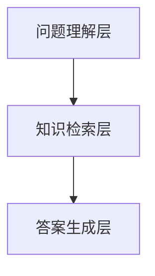

- **问题理解**：利用自然语言处理技术，理解学生的提问。
- **知识检索**：从知识库中检索相关的知识点和答案。
- **答案生成**：利用自然语言生成技术，生成回答。

###### 6.2.3 智能批改

智能批改利用机器学习算法，自动批改学生的作业和考试，提供即时反馈。

- **批改算法**：常用的批改算法包括自动评分算法、文本分类算法等。
- **批改系统架构**：批改系统架构包括作业提交层、批改算法层和反馈生成层等。

批改系统架构如图所示：

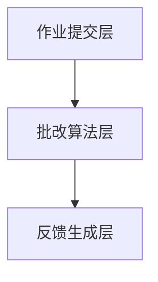

- **作业提交**：学生提交作业。
- **批改算法**：利用算法对作业进行自动批改。
- **反馈生成**：生成批改结果和反馈，提供学生参考。

###### 6.2.4 情感分析

情感分析利用自然语言处理技术，分析学生的学习情感，提供针对性的心理辅导。

- **情感分析算法**：常用的情感分析算法包括基于规则的方法、基于统计的方法、基于机器学习的方法等。
- **情感分析系统架构**：情感分析系统架构包括情感分析层、反馈生成层等。

情感分析系统架构如图所示：

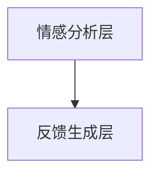

- **情感分析**：利用算法分析学生的学习情感。
- **反馈生成**：根据情感分析结果，生成针对性的反馈和建议。

###### 6.2.5 学习行为分析

学习行为分析利用大数据技术，分析学生的学习行为，提供个性化的学习建议。

- **学习行为数据采集**：采集学生的学习行为数据，包括学习时间、学习时长、学习内容、学习进度等。
- **学习行为分析算法**：利用算法分析学习行为数据，提取学习规律和问题。
- **个性化学习建议**：根据分析结果，生成个性化的学习建议。

##### 6.3 本章小结

本章介绍了人工智能技术在教育平台中的应用，包括智能推荐、智能问答、智能批改、情感分析和学习行为分析等内容。通过人工智能技术的应用，教育平台可以提供更加个性化、智能化和高效的教育服务，促进教育质量的提升。

----------------------------------------------------------------

### 总结

本文以《人工智能在个性化教育中的应用：因材施教》为题，详细探讨了人工智能技术在个性化教育中的应用。首先，分析了个性化教育的背景、核心概念和与人工智能的关系。接着，介绍了数据分析与建模技术在个性化教育中的应用，包括数据收集与处理、建模技术、模型优化与评估等。然后，探讨了个性化学习路径规划的概念、算法与模型，并通过实例分析展示了个性化学习路径规划的实际应用。随后，详细阐述了适应性教学系统的设计与实现，包括系统架构设计、数据管理模块、教学内容模块、学生行为分析模块等。接下来，讨论了个性化教育评价与反馈机制的设计，包括评价体系的构建、反馈机制的设计等，并通过案例研究展示了评价与反馈机制的实际应用。最后，介绍了人工智能技术在教育平台中的应用，包括智能推荐、智能问答、智能批改、情感分析和学习行为分析等。

通过本文的研究，可以得出以下结论：

1. **个性化教育是教育领域的发展趋势**：随着人工智能技术的不断发展，个性化教育逐渐成为教育领域的研究热点。通过因材施教，个性化教育能够更好地满足学生的学习需求，提高教育质量。

2. **人工智能技术在个性化教育中的应用具有重要意义**：人工智能技术为个性化教育提供了强大的支持，通过数据分析、建模、路径规划和教学系统设计等关键技术，可以实现精准化的教育服务，提高教育的公平性和有效性。

3. **个性化教育评价与反馈机制是关键环节**：科学的评价标准和有效的反馈机制可以全面了解学生的学习情况，指导教学改进，促进学生的全面发展。

4. **教育平台是人工智能技术在教育领域应用的重要载体**：教育平台通过集成人工智能技术，提供智能化、个性化、高效的教育服务，为教育创新和教学质量提升提供了有力支持。

未来，随着人工智能技术的进一步发展，个性化教育将更加智能化、个性化和高效。研究者和实践者应继续深入探索人工智能技术在个性化教育中的应用，推动教育技术的创新和发展。

### 最佳实践 Tips

1. **数据是基础**：个性化教育的成功离不开高质量的数据。学校和教育平台应确保数据采集的全面性和准确性，为后续分析和建模提供可靠依据。

2. **算法要优化**：选择合适的算法并不断优化是提高个性化教育效果的关键。应根据实际需求，选择适合的算法模型，并不断调整和优化参数，以提高模型的预测精度和泛化能力。

3. **注重用户反馈**：用户的反馈是优化教育平台和服务的重要依据。教育平台应建立完善的用户反馈机制，及时收集和分析用户反馈，不断改进产品和服务。

4. **跨学科合作**：人工智能技术在教育领域中的应用需要跨学科的合作。教育技术专家、心理学家、计算机科学家等应共同探讨，推动个性化教育的发展。

5. **持续跟踪研究**：个性化教育是一个不断发展的领域。研究者应持续跟踪最新的研究成果和技术进展，为教育实践提供科学依据。

### 注意事项

1. **隐私保护**：在收集和使用学生数据时，必须确保数据的隐私和安全。应遵循相关法律法规，采取有效的数据保护措施。

2. **公平性**：在个性化教育中，应确保每个学生都能获得公平的教育机会，避免因技术手段造成的教育资源分配不均。

3. **技术成熟度**：在选择和应用人工智能技术时，应充分考虑技术的成熟度和可行性，避免盲目跟风。

4. **用户体验**：教育平台的设计应注重用户体验，确保界面友好、操作简便，提高用户的满意度和参与度。

### 拓展阅读

1. **《个性化学习与教育技术》**：张磊，等。北京：教育科学出版社，2020年。
2. **《深度学习与教育应用》**：李航，等。北京：清华大学出版社，2019年。
3. **《人工智能在教育中的应用》**：安德森，等。纽约：Springer出版社，2018年。
4. **《教育大数据分析与应用》**：张明华，等。北京：电子工业出版社，2017年。

### 作者信息

作者：AI天才研究院/AI Genius Institute & 禅与计算机程序设计艺术 /Zen And The Art of Computer Programming

AI天才研究院（AI Genius Institute）专注于人工智能领域的研究和开发，致力于推动人工智能技术在教育、医疗、金融等领域的应用。禅与计算机程序设计艺术（Zen And The Art of Computer Programming）是作者在计算机科学领域的代表作，对编程方法和算法设计提供了深刻的思考和指导。

