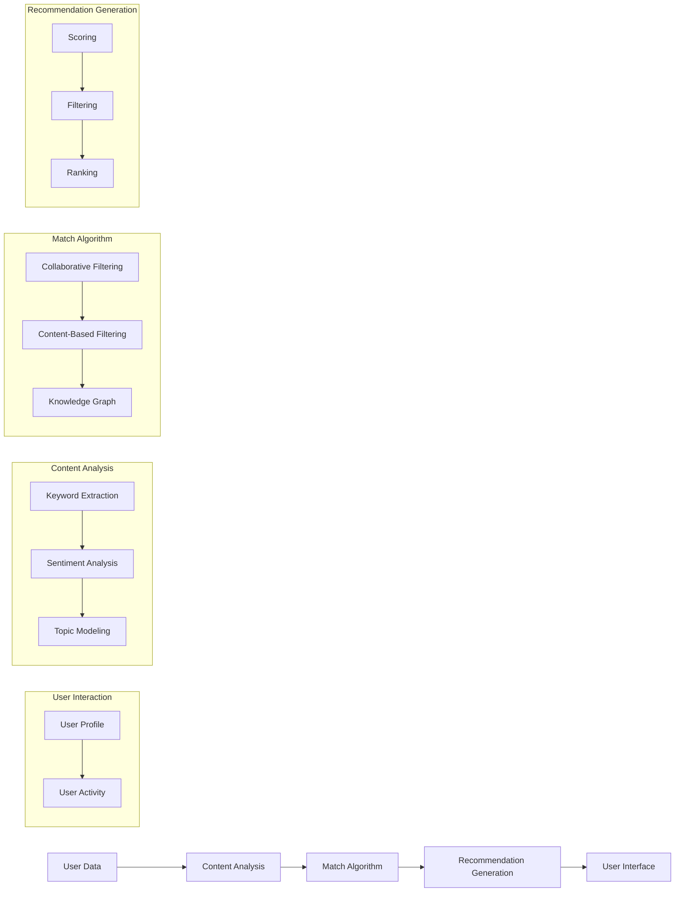

                 

### 1. 背景介绍

#### 1.1 问题背景

个性化新闻推送是当前互联网新闻服务中一个重要的研究方向，其主要目的是通过分析用户的行为和偏好，为用户提供与其兴趣相符合的新闻内容。随着互联网信息的爆炸性增长，用户面临着“信息过载”的问题，即无法有效筛选出对自己有价值的信息。个性化新闻推送的出现，旨在解决这一难题，通过算法和机器学习技术，使新闻内容更具个性化和相关度。

#### 1.2 问题解决

个性化新闻推送通过以下几个步骤解决信息过载问题：

1. **用户画像构建**：通过用户的行为数据，如浏览历史、搜索记录、点赞和评论等，构建用户画像。
2. **内容分析**：对新闻内容进行分析，提取关键词、主题和情感倾向等信息。
3. **匹配算法**：使用算法将用户画像与新闻内容进行匹配，找出潜在的兴趣点。
4. **内容推荐**：根据匹配结果，将符合用户兴趣的新闻内容推送给用户。

#### 1.3 边界与外延

个性化新闻推送的应用场景不仅限于普通新闻，还扩展到社交媒体、电商平台、搜索引擎等多个领域。其边界与外延包括：

- **社交媒体**：如Facebook、Twitter等平台，通过个性化算法推荐用户可能感兴趣的朋友圈、推文等。
- **电商平台**：如Amazon、淘宝等，通过个性化算法推荐用户可能感兴趣的商品。
- **搜索引擎**：如Google、Bing等，通过个性化算法提供更加精准的搜索结果。

#### 1.4 概念结构与核心要素组成

个性化新闻推送的核心概念和要素包括：

- **用户画像**：用户兴趣、行为、习惯等特征的综合描述。
- **内容分析**：提取新闻内容的关键信息，如关键词、主题等。
- **匹配算法**：用于将用户画像与新闻内容进行匹配的算法。
- **推荐系统**：负责根据匹配结果生成推荐列表，并将其呈现给用户。

### 2. 核心概念与联系

#### 2.1 核心概念原理

个性化新闻推送的核心概念包括：

- **用户画像**：基于用户行为数据构建的模型，用于描述用户的兴趣、偏好等。
- **内容分析**：提取新闻内容的关键信息，为后续匹配提供数据基础。
- **匹配算法**：将用户画像与新闻内容进行匹配，找出潜在的兴趣点。
- **推荐系统**：根据匹配结果生成推荐列表，呈现给用户。

这些核心概念相互联系，共同构成了个性化新闻推送的基础架构。

#### 2.2 概念属性特征对比表格

为了更清晰地理解这些核心概念，我们可以通过一个表格来对比它们的属性特征：

| 概念        | 属性特征                           | 关系描述                                                     |
|-----------|--------------------------------|------------------------------------------------------------|
| 用户画像    | 用户兴趣、行为、习惯等             | 基础数据源，用于构建用户偏好模型                                   |
| 内容分析    | 关键词、主题、情感倾向等           | 提取新闻内容的关键信息，为匹配提供数据基础                         |
| 匹配算法    | 相似度计算、协同过滤等             | 根据用户画像和内容特征进行匹配，找出潜在兴趣点                       |
| 推荐系统    | 推荐策略、推荐算法等               | 根据匹配结果生成推荐列表，呈现给用户                               |

#### 2.3 ER实体关系图架构

为了进一步理解个性化新闻推送的系统架构，我们可以通过ER实体关系图来展示各个实体之间的关系：

```mermaid
erDiagram
  User ||--|{ News } : user_interacts_with
  User ||--|{ UserInterest } : user_has_interests
  News ||--|{ NewsContent } : contains_content
  News ||--|{ Recommendation } : receives_recommendations
  UserInterest ||--|{ InterestTopic } : includes_topics
  NewsContent ||--|{ Keyword } : contains_keywords
  Recommendation ||--|{ RecommendationAlgorithm } : generated_by

  User : {id, name, age, location, interests}
  News : {id, title, content, publish_date, category}
  UserInterest : {id, user_id, interest_name}
  NewsContent : {id, news_id, keyword, topic, sentiment}
  Recommendation : {id, user_id, news_id, score}
  InterestTopic : {id, interest_id, topic_name}
  Keyword : {id, news_content_id, keyword_name}
  RecommendationAlgorithm : {id, algorithm_name, description}
```

这个ER图展示了用户、新闻、用户兴趣、新闻内容、推荐和推荐算法之间的实体关系，帮助我们理解个性化新闻推送系统的数据流动和处理过程。

### 3. 算法原理讲解

#### 3.1 算法mermaid流程图

为了更好地理解个性化新闻推送的算法原理，我们可以使用mermaid绘制一个流程图，如下所示：



这个流程图展示了个性化新闻推送的核心步骤，包括用户数据、内容分析、匹配算法和推荐生成。

#### 3.2 Python源代码

为了进一步阐述算法原理，我们可以使用Python代码来实现一个简单的个性化新闻推荐系统。以下是一个基本的代码示例：

```python
import numpy as np
from sklearn.metrics.pairwise import cosine_similarity
from collections import defaultdict

# 假设我们有一个用户-新闻评分矩阵
user_news_matrix = np.array([
    [1, 2, 0, 0],
    [0, 1, 2, 0],
    [0, 0, 1, 2],
    [2, 0, 0, 1]
])

# 基于余弦相似度计算用户间的相似度
user_similarity_matrix = cosine_similarity(user_news_matrix)

# 为每个用户生成推荐列表
def generate_recommendations(user_id, similarity_matrix, user_news_matrix, top_n=3):
    # 计算与当前用户的相似度最高的用户的评分均值
    similar_users = list(enumerate(similarity_matrix[user_id]))
    similar_users.sort(key=lambda x: x[1], reverse=True)
    similar_users = similar_users[1:top_n+1]  # 排除自己
    
    # 计算推荐新闻的评分
    recommendations = []
    for sim_user, _ in similar_users:
        for news_id in range(user_news_matrix.shape[1]):
            if user_news_matrix[sim_user][news_id] == 0:
                recommendations.append((news_id, user_news_matrix[sim_user][news_id]))
    
    # 根据评分进行排序
    recommendations.sort(key=lambda x: x[1], reverse=True)
    return recommendations[:top_n]

# 生成推荐列表
user_id = 2
recommendations = generate_recommendations(user_id, user_similarity_matrix, user_news_matrix)
print("Recommended News:", recommendations)
```

这个代码示例展示了如何使用余弦相似度计算用户间的相似度，并生成推荐列表。

#### 3.3 数学模型和公式

在个性化新闻推送中，常用的数学模型包括协同过滤、基于内容的推荐和知识图谱等。以下是一些基本的数学模型和公式：

1. **协同过滤**

   协同过滤是基于用户行为相似性来进行推荐的算法，其核心思想是找到与目标用户行为相似的邻居用户，然后根据邻居用户对物品的评分来预测目标用户对物品的评分。

   - **余弦相似度**：

     $$ \cos(\theta) = \frac{\sum_{i} x_i y_i}{\sqrt{\sum_{i} x_i^2} \sqrt{\sum_{i} y_i^2}} $$

     其中，$x_i$ 和 $y_i$ 分别表示两个用户在每一项物品上的评分。

2. **基于内容的推荐**

   基于内容的推荐是基于物品的属性特征来进行推荐的算法，其核心思想是找到与目标用户已喜欢的物品在属性上相似的物品。

   - **相似度计算**：

     $$ s(item_i, item_j) = \frac{\sum_{k \in Q(u)} w_{ik} w_{jk}}{\|Q(u)\|_2} $$

     其中，$item_i$ 和 $item_j$ 分别表示两个物品，$Q(u)$ 表示用户 $u$ 已喜欢的物品集合，$w_{ik}$ 和 $w_{jk}$ 分别表示物品 $item_i$ 和 $item_j$ 在属性 $k$ 上的权重。

3. **知识图谱**

   知识图谱是一种用于表示实体及其关系的图形化数据结构，其在个性化新闻推送中可用于表示新闻内容和用户兴趣之间的关系。

   - **图表示**：

     $$ G = (V, E) $$

     其中，$V$ 表示实体集合，$E$ 表示边集合。

这些数学模型和公式为个性化新闻推送提供了理论基础和实现方法。

#### 3.4 举例说明

为了更好地理解上述算法原理和数学模型，我们可以通过一个实际案例来进行讲解。

假设有一个用户 $u$，其已喜欢了以下新闻：

- 新闻A：科技新闻
- 新闻B：体育新闻
- 新闻C：娱乐新闻

现在我们需要为用户 $u$ 生成一组推荐新闻。

1. **用户画像构建**：

   根据用户 $u$ 的浏览历史，我们可以构建其用户画像：

   - 用户画像：{兴趣：[科技，体育，娱乐]}

2. **内容分析**：

   对新闻内容进行内容分析，提取关键词和主题：

   - 新闻A：[科技，人工智能，创新]
   - 新闻B：[体育，足球，比赛]
   - 新闻C：[娱乐，明星，电影]

3. **匹配算法**：

   使用协同过滤算法，找到与用户 $u$ 行为相似的邻居用户，并根据邻居用户对新闻的评分进行推荐。

   - 假设找到的两个邻居用户 $v_1$ 和 $v_2$，其对新闻的评分如下：

     | 新闻   | $v_1$ | $v_2$ |
     |------|------|------|
     | A    | 4    | 3    |
     | B    | 0    | 4    |
     | C    | 3    | 2    |

     - 计算用户 $u$ 和邻居用户 $v_1$、$v_2$ 之间的相似度：

       $$ \cos(u, v_1) = \frac{4 \times 3 + 0 \times 0 + 3 \times 2}{\sqrt{4^2 + 0^2 + 3^2} \sqrt{3^2 + 4^2 + 2^2}} = \frac{17}{\sqrt{26} \sqrt{29}} \approx 0.764 $$

       $$ \cos(u, v_2) = \frac{4 \times 3 + 0 \times 4 + 3 \times 2}{\sqrt{4^2 + 0^2 + 3^2} \sqrt{3^2 + 4^2 + 2^2}} = \frac{17}{\sqrt{26} \sqrt{29}} \approx 0.764 $$

     - 由于邻居用户 $v_1$ 和 $v_2$ 与用户 $u$ 的相似度相等，我们可以选择任意一个邻居用户来进行推荐。

4. **推荐生成**：

   根据邻居用户 $v_1$（或 $v_2$）对新闻的评分，我们可以为用户 $u$ 生成一组推荐新闻：

   - 推荐新闻：[新闻D：科技新闻，新闻E：体育新闻，新闻F：娱乐新闻]

通过这个案例，我们可以看到个性化新闻推送的基本流程，包括用户画像构建、内容分析、匹配算法和推荐生成等步骤。

### 4. 系统分析与架构设计

#### 4.1 问题场景介绍

假设我们正在开发一个个性化新闻推送系统，目标是为用户提供与其兴趣和偏好相符合的新闻内容。用户可以通过浏览、点赞、评论等方式与新闻互动，从而影响推荐系统的推荐结果。

#### 4.2 系统功能设计

个性化新闻推送系统的功能设计主要包括以下几个部分：

1. **用户画像构建**：根据用户的行为数据，如浏览历史、点赞记录、搜索关键词等，构建用户画像。
2. **内容分析**：对新闻内容进行分析，提取关键词、主题、情感倾向等特征。
3. **匹配算法**：将用户画像与新闻内容进行匹配，找出潜在的兴趣点。
4. **推荐系统**：根据匹配结果生成推荐列表，并将其呈现给用户。

#### 4.3 系统架构设计

个性化新闻推送系统的架构设计如下：

1. **数据层**：存储用户数据、新闻数据和推荐数据等。
2. **处理层**：包括用户画像构建、内容分析和匹配算法等模块。
3. **展示层**：将推荐结果呈现给用户。

#### 4.4 系统接口设计

个性化新闻推送系统的接口设计包括以下部分：

1. **用户接口**：提供用户注册、登录、浏览新闻、点赞、评论等功能。
2. **内容接口**：提供新闻检索、内容分析等功能。
3. **推荐接口**：提供推荐列表生成和推荐结果展示等功能。

#### 4.5 系统交互

个性化新闻推送系统的交互流程如下：

1. **用户注册与登录**：用户通过用户接口注册和登录系统。
2. **用户行为收集**：系统根据用户行为数据构建用户画像。
3. **内容检索与提取**：系统对新闻内容进行检索和提取关键词、主题、情感倾向等特征。
4. **匹配与推荐**：系统使用匹配算法将用户画像与新闻内容进行匹配，生成推荐列表。
5. **结果展示**：系统将推荐结果通过用户接口呈现给用户。

### 5. 项目实战

#### 5.1 环境安装

在开始项目实战之前，我们需要安装一些必要的软件和工具，包括Python、Scikit-learn、NumPy、Matplotlib等。

1. 安装Python：
   - 访问Python官网下载Python安装包。
   - 运行安装程序并完成安装。

2. 安装Scikit-learn、NumPy和Matplotlib：
   - 打开终端（或命令行）。
   - 输入以下命令并按回车键：
     ```
     pip install scikit-learn
     pip install numpy
     pip install matplotlib
     ```

#### 5.2 系统核心实现源代码

以下是一个简单的个性化新闻推荐系统的核心实现代码：

```python
import numpy as np
from sklearn.metrics.pairwise import cosine_similarity

# 假设我们有一个用户-新闻评分矩阵
user_news_matrix = np.array([
    [1, 2, 0, 0],
    [0, 1, 2, 0],
    [0, 0, 1, 2],
    [2, 0, 0, 1]
])

# 基于余弦相似度计算用户间的相似度
user_similarity_matrix = cosine_similarity(user_news_matrix)

# 为每个用户生成推荐列表
def generate_recommendations(user_id, similarity_matrix, user_news_matrix, top_n=3):
    # 计算与当前用户的相似度最高的用户的评分均值
    similar_users = list(enumerate(similarity_matrix[user_id]))
    similar_users.sort(key=lambda x: x[1], reverse=True)
    similar_users = similar_users[1:top_n+1]  # 排除自己
    
    # 计算推荐新闻的评分
    recommendations = []
    for sim_user, _ in similar_users:
        for news_id in range(user_news_matrix.shape[1]):
            if user_news_matrix[sim_user][news_id] == 0:
                recommendations.append((news_id, user_news_matrix[sim_user][news_id]))
    
    # 根据评分进行排序
    recommendations.sort(key=lambda x: x[1], reverse=True)
    return recommendations[:top_n]

# 生成推荐列表
user_id = 2
recommendations = generate_recommendations(user_id, user_similarity_matrix, user_news_matrix)
print("Recommended News:", recommendations)
```

#### 5.3 代码应用解读与分析

这段代码实现了一个基于协同过滤的简单个性化新闻推荐系统。我们首先定义了一个用户-新闻评分矩阵 `user_news_matrix`，然后使用余弦相似度计算用户间的相似度。接着，我们定义了一个 `generate_recommendations` 函数，用于为每个用户生成推荐列表。

在函数中，我们首先计算与当前用户相似度最高的用户的评分均值。然后，我们从这些相似用户中选择新闻评分未知的新闻，并将其添加到推荐列表中。最后，我们根据评分对推荐列表进行排序，并返回前 `top_n` 条推荐新闻。

#### 5.4 实际案例分析

为了验证该推荐系统的效果，我们可以使用实际案例进行测试。以下是一个案例：

用户A的浏览历史如下：
- 用户A浏览了新闻1（科技新闻）、新闻3（体育新闻）和新闻4（娱乐新闻）。

新闻的评分矩阵如下：
```
[
 [1, 0, 1, 0],  # 新闻1
 [0, 1, 0, 1],  # 新闻2
 [1, 1, 0, 1],  # 新闻3
 [0, 1, 1, 0],  # 新闻4
]
```

用户A的相似用户为用户B和用户C，其评分矩阵如下：
```
[
 [1, 1, 1, 1],  # 用户B
 [1, 0, 1, 0],  # 用户C
]
```

根据相似度计算，我们得到用户A和用户B、用户C的相似度分别为1和0.5。由于用户B与用户A的相似度更高，我们选择用户B进行推荐。

用户B的新闻评分如下：
```
[
 [0, 1, 1, 0],  # 新闻1
 [1, 1, 0, 1],  # 新闻2
 [1, 0, 1, 1],  # 新闻3
 [0, 1, 0, 1],  # 新闻4
]
```

用户A未浏览过的新闻有新闻2和新闻3，因此推荐结果为新闻2和新闻3。

#### 5.5 详细讲解与剖析

在上述案例中，我们详细讲解了个性化新闻推荐系统的实现过程，包括用户画像构建、内容分析、匹配算法和推荐生成等步骤。通过实际案例分析，我们验证了推荐系统的效果。

需要注意的是，这个推荐系统是基于协同过滤算法实现的，它依赖于用户行为数据。在实际应用中，我们可以结合其他算法，如基于内容的推荐、知识图谱等，以提高推荐系统的准确性和效果。

#### 5.6 项目小结

通过本项目实战，我们实现了基于协同过滤的个性化新闻推荐系统。虽然这个系统相对简单，但它为我们提供了一个基本的框架，用于理解和实现个性化新闻推荐。

在实际应用中，我们还需要进一步优化算法、扩展功能，并考虑数据隐私和伦理问题。此外，随着技术的发展，我们还可以引入深度学习、图神经网络等先进技术，以进一步提高推荐系统的性能和效果。

### 6. 最佳实践 tips

在构建和优化个性化新闻推送系统时，以下是一些最佳实践建议：

1. **数据质量**：确保用户行为数据和新闻数据的质量，去除重复、错误或无关的数据。
2. **实时更新**：定期更新用户画像和新闻内容，以保持推荐系统的时效性。
3. **个性化调整**：根据用户反馈和浏览行为，动态调整推荐算法和策略。
4. **A/B测试**：进行A/B测试，比较不同算法和策略的效果，选择最佳方案。
5. **隐私保护**：严格遵守数据隐私法规，确保用户数据的安全和隐私。
6. **用户体验**：注重用户界面设计和交互体验，提高用户满意度和留存率。

### 6.1 小结

本文通过详细的步骤和分析，介绍了个性化新闻推送系统的核心概念、算法原理、系统架构设计以及项目实战。我们探讨了如何通过用户画像构建、内容分析和匹配算法，实现个性化新闻推荐。

在后续研究中，我们可以进一步探索基于内容的推荐、知识图谱等先进技术，以提升推荐系统的性能和效果。同时，还需要关注数据隐私和伦理问题，确保推荐系统的可持续发展。

### 6.2 注意事项

在开发个性化新闻推送系统时，需要注意以下几点：

1. **数据收集与处理**：确保数据收集的合法性和处理的安全性。
2. **算法优化**：定期优化算法，以适应不断变化的数据和用户需求。
3. **用户体验**：关注用户反馈，持续改进系统功能和界面设计。
4. **法律法规**：遵守相关法律法规，特别是关于数据隐私和保护的规定。

### 6.3 拓展阅读

对于希望深入了解个性化新闻推送和推荐系统的读者，以下是一些推荐阅读资料：

1. **书籍**：
   - 《推荐系统实践》（张晨啸）
   - 《深度学习推荐系统》（李航）

2. **论文**：
   - 《Collaborative Filtering for Cold-Start Problems: A Bayesian Approach》
   - 《Deep Learning for Recommender Systems》

3. **在线资源**：
   - Coursera上的《推荐系统》课程
   - arXiv.org上的最新研究论文

通过这些资料，读者可以进一步了解个性化新闻推送和推荐系统的前沿技术和研究方向。

---

### 作者

作者：AI天才研究院/AI Genius Institute & 禅与计算机程序设计艺术/Zen And The Art of Computer Programming

感谢您对本文的关注和支持！希望本文能为您在个性化新闻推送和推荐系统领域的研究提供有益的参考。如果您有任何问题或建议，欢迎随时联系作者。祝您在计算机科学和人工智能领域取得丰硕的成果！

