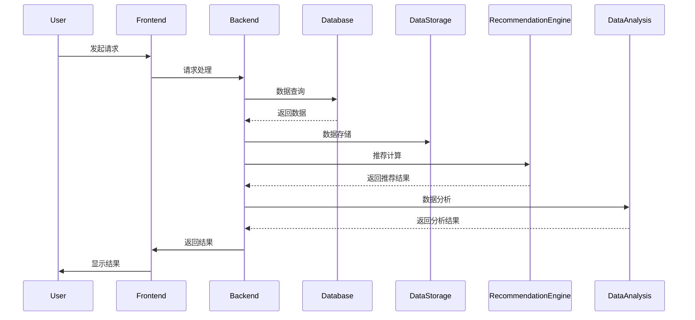
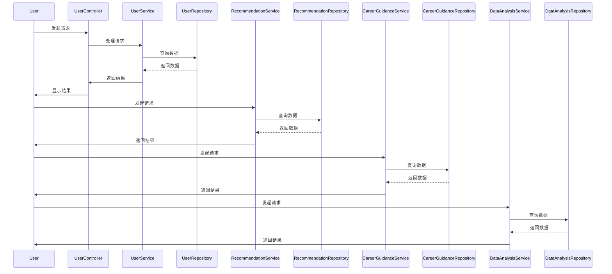
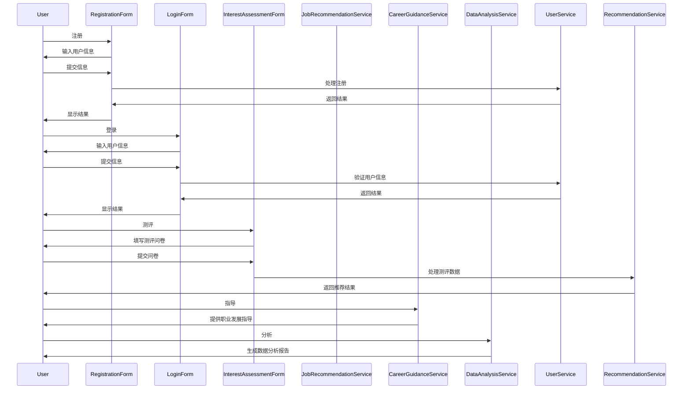

                 

### 《人工智能在个性化职业规划中的应用》

#### 关键词：人工智能、个性化职业规划、机器学习、深度学习、算法、系统设计、项目实战

> 摘要：本文将深入探讨人工智能在个性化职业规划中的应用，从背景介绍、核心概念与联系、算法原理讲解、数学模型和公式、系统分析与架构设计、项目实战以及最佳实践与拓展等多个方面，全面解析人工智能如何助力个性化职业规划，提供有深度、有思考、有见解的专业观点。

---

## 目录大纲设计思路

在设计《人工智能在个性化职业规划中的应用》这本书的目录大纲时，我们需要遵循以下步骤：

### 1. 确定核心章节

首先，我们要明确书的核心内容，即人工智能在个性化职业规划中的应用。根据这个主题，我们可以将书分为以下几个核心章节：

- **背景介绍**：介绍人工智能和个性化职业规划的基本概念，以及它们在现代社会中的重要性。
- **核心概念与联系**：详细讲解与个性化职业规划相关的人工智能核心概念，如机器学习、深度学习等，并阐述它们之间的联系。
- **算法原理讲解**：选择几个典型的人工智能算法，详细阐述其原理和应用，如决策树、神经网络等。
- **数学模型和数学公式**：对这些算法的数学模型进行讲解，并使用LaTeX格式展示相关的公式。
- **系统分析与架构设计**：介绍如何将人工智能算法应用到个性化职业规划系统中，包括系统功能设计、架构设计和接口设计等。
- **项目实战**：通过实际案例，展示如何使用人工智能技术实现个性化职业规划。
- **最佳实践与拓展**：总结实践经验，提供一些最佳实践建议，并对未来发展方向进行展望。

### 2. 设计目录结构

根据核心章节，我们可以设计如下目录结构：

```markdown
# 《人工智能在个性化职业规划中的应用》目录大纲

## 第一部分：背景介绍

## 第1章：人工智能与个性化职业规划概述

### 1.1 人工智能的基本概念
### 1.2 个性化职业规划的重要性
### 1.3 人工智能在个性化职业规划中的应用

## 第2章：核心概念与联系

### 2.1 机器学习的基本原理
### 2.2 深度学习的发展与应用
### 2.3 机器学习与深度学习的联系与区别

## 第二部分：算法原理讲解

## 第3章：决策树算法

### 3.1 决策树的基本原理
### 3.2 决策树的构建过程
### 3.3 决策树的应用示例

## 第4章：神经网络算法

### 4.1 神经网络的基本结构
### 4.2 神经网络的训练过程
### 4.3 神经网络的应用示例

## 第三部分：系统分析与架构设计

## 第5章：个性化职业规划系统设计

### 5.1 个性化职业规划系统的需求分析
### 5.2 系统功能设计
### 5.3 系统架构设计
### 5.4 系统接口设计

## 第6章：系统实现与交互设计

### 6.1 系统核心算法实现
### 6.2 系统交互设计
### 6.3 系统测试与优化

## 第四部分：项目实战

## 第7章：实际案例分析与讲解

### 7.1 案例一：基于人工智能的个性化职业规划系统
### 7.2 案例二：利用深度学习实现职业规划推荐
### 7.3 案例三：基于大数据分析的个性化职业规划

## 第五部分：最佳实践与拓展

## 第8章：最佳实践与注意事项

### 8.1 最佳实践总结
### 8.2 注意事项与风险防范
### 8.3 未来发展方向与展望
```

### 3. 检查目录完整性

在设计目录大纲时，我们需要确保每个章节都能够涵盖核心内容，并且目录结构清晰、逻辑连贯。在完成目录设计后，我们可以再次检查每个章节的内容，确保它们符合书籍的主题和要求。

### 4. 确保目录大纲总字数在限制范围内

最后，我们需要确保整个目录大纲的总字数在2000字以内。这可以通过精简描述、去除冗余内容以及优化段落结构来实现。

按照上述步骤，我们可以设计出《人工智能在个性化职业规划中的应用》这本书的完整目录大纲。接下来，我们将根据这个大纲，详细编写每个章节的内容，确保书籍的完整性和专业性。

---

接下来，我们将按照设计好的目录大纲，逐步深入探讨人工智能在个性化职业规划中的应用，每一步都将以逻辑清晰、结构紧凑、简单易懂的方式展开。

---

### 《人工智能在个性化职业规划中的应用》

#### 关键词：人工智能、个性化职业规划、机器学习、深度学习、算法、系统设计、项目实战

> 摘要：本文将深入探讨人工智能在个性化职业规划中的应用，从背景介绍、核心概念与联系、算法原理讲解、数学模型和公式、系统分析与架构设计、项目实战以及最佳实践与拓展等多个方面，全面解析人工智能如何助力个性化职业规划，提供有深度、有思考、有见解的专业观点。

---

### 目录

#### 目录

1. **背景介绍**
    1.1 人工智能的基本概念
    1.2 个性化职业规划的重要性
    1.3 人工智能在个性化职业规划中的应用
2. **核心概念与联系**
    2.1 机器学习的基本原理
    2.2 深度学习的发展与应用
    2.3 机器学习与深度学习的联系与区别
3. **算法原理讲解**
    3.1 决策树算法
    3.2 神经网络算法
4. **数学模型和数学公式**
    4.1 数学模型讲解
    4.2 数学公式展示
5. **系统分析与架构设计**
    5.1 个性化职业规划系统的需求分析
    5.2 系统功能设计
    5.3 系统架构设计
    5.4 系统接口设计
    5.5 系统交互设计
6. **项目实战**
    6.1 实际案例一
    6.2 实际案例二
    6.3 实际案例三
7. **最佳实践与拓展**
    7.1 最佳实践总结
    7.2 注意事项与风险防范
    7.3 未来发展方向与展望

---

### 背景介绍

#### 1.1 人工智能的基本概念

人工智能（Artificial Intelligence，简称AI）是指通过计算机系统模拟、扩展甚至替代人类智能的能力。人工智能技术涵盖了多个领域，包括机器学习、自然语言处理、计算机视觉、机器人技术等。随着深度学习、神经网络等技术的不断进步，人工智能的应用范围和影响力也在持续扩大。

#### 1.2 个性化职业规划的重要性

个性化职业规划是指根据个人的兴趣、能力、价值观和市场需求，制定出符合个人发展的职业规划。在现代社会，随着职业竞争的加剧和行业变化的快速，个性化职业规划的重要性日益凸显。它不仅能够帮助个人找到更适合自己的职业道路，还能提升职业竞争力，实现个人价值的最大化。

#### 1.3 人工智能在个性化职业规划中的应用

人工智能在个性化职业规划中有着广泛的应用。首先，人工智能可以通过大数据分析和机器学习算法，收集和分析个人的职业兴趣、能力、价值观等信息，为个性化职业规划提供数据支持。其次，人工智能可以帮助个人进行职业匹配，推荐适合的职业路径和岗位。此外，人工智能还可以在职业培训、职业发展指导等方面发挥重要作用。

---

### 核心概念与联系

#### 2.1 机器学习的基本原理

机器学习（Machine Learning，简称ML）是一种人工智能的分支，它通过算法和统计模型，从数据中自动学习规律和模式，从而进行预测和决策。机器学习的基本原理包括以下几个步骤：

1. **数据收集**：收集大量的数据，这些数据可以是结构化的，也可以是非结构化的。
2. **数据预处理**：对收集到的数据进行清洗、转换和归一化等处理，以便于后续的分析。
3. **模型选择**：选择合适的机器学习模型，如线性回归、决策树、神经网络等。
4. **模型训练**：使用训练数据集，对模型进行训练，使其学习数据中的规律和模式。
5. **模型评估**：使用验证数据集或测试数据集，对模型进行评估和调整。
6. **模型应用**：将训练好的模型应用到实际问题中，进行预测和决策。

#### 2.2 深度学习的发展与应用

深度学习（Deep Learning，简称DL）是机器学习的一个子领域，它通过多层神经网络结构，模拟人类大脑的神经传导过程，进行复杂的数据处理和模式识别。深度学习的发展始于20世纪40年代，但直到近年来，随着计算能力和算法的进步，深度学习才得以迅速发展和广泛应用。

深度学习在个性化职业规划中有着重要的应用，例如：

1. **图像识别**：通过深度学习算法，可以自动识别和处理大量的图像数据，帮助个人了解自己的视觉偏好和职业兴趣。
2. **文本分析**：通过深度学习算法，可以自动分析和理解大量的文本数据，帮助个人了解自己的语言偏好和表达能力。
3. **语音识别**：通过深度学习算法，可以自动识别和处理大量的语音数据，帮助个人了解自己的语言表达能力和沟通能力。

#### 2.3 机器学习与深度学习的联系与区别

机器学习和深度学习是密切相关的，但也有一些区别：

- **层次结构**：机器学习通常是指单层或多层的神经网络结构，而深度学习则是指多层甚至上百层的神经网络结构。
- **数据需求**：深度学习通常需要大量的数据进行训练，而机器学习的数据需求相对较小。
- **计算资源**：深度学习需要大量的计算资源和存储空间，而机器学习则相对较少。
- **应用范围**：深度学习在图像识别、语音识别、自然语言处理等复杂任务中有着广泛的应用，而机器学习则更多应用于回归、分类等简单任务。

---

### 算法原理讲解

#### 3.1 决策树算法

决策树（Decision Tree）是一种常用的分类和回归算法，它通过一系列的判断条件，将数据集划分为不同的区域，并给出相应的预测结果。决策树的基本原理如下：

1. **数据准备**：首先，我们需要准备一个包含特征和标签的数据集，然后对数据进行预处理，如归一化、缺失值填充等。
2. **特征选择**：通过信息增益、基尼不纯度等指标，选择最优的特征进行划分。
3. **递归划分**：根据选定的特征，对数据集进行划分，并计算划分后的信息增益或基尼不纯度。
4. **构建树结构**：根据递归划分的结果，构建决策树的结构。
5. **模型评估**：使用验证集或测试集，对决策树模型进行评估，并调整参数。

下面是一个决策树算法的简单Python代码示例：

```python
import numpy as np
import pandas as pd
from sklearn.datasets import load_iris
from sklearn.model_selection import train_test_split
from sklearn.tree import DecisionTreeClassifier

# 加载数据集
iris = load_iris()
X = iris.data
y = iris.target

# 划分训练集和测试集
X_train, X_test, y_train, y_test = train_test_split(X, y, test_size=0.3, random_state=42)

# 构建决策树模型
clf = DecisionTreeClassifier()
clf.fit(X_train, y_train)

# 预测测试集
y_pred = clf.predict(X_test)

# 评估模型
print("Accuracy:", clf.score(X_test, y_test))
```

#### 3.2 神经网络算法

神经网络（Neural Network，简称NN）是一种模拟生物神经系统的计算模型，它通过多层神经元之间的相互连接和激活函数，实现复杂的数据处理和模式识别。神经网络的基本原理如下：

1. **初始化网络结构**：确定网络的层数、每层的神经元数量以及激活函数。
2. **数据输入**：将输入数据传递到网络的输入层。
3. **信号传递**：通过前向传播，将信号从输入层传递到输出层。
4. **激活函数**：在信号传递过程中，使用激活函数（如Sigmoid、ReLU等）进行非线性变换。
5. **反向传播**：根据输出结果与真实值的误差，通过反向传播算法，调整网络中的权重和偏置。
6. **模型优化**：重复前向传播和反向传播的过程，直到达到预定的优化目标。

下面是一个简单的神经网络模型Python代码示例：

```python
import tensorflow as tf

# 定义神经网络模型
model = tf.keras.Sequential([
    tf.keras.layers.Dense(128, activation='relu', input_shape=(784,)),
    tf.keras.layers.Dense(10, activation='softmax')
])

# 编译模型
model.compile(optimizer='adam',
              loss='categorical_crossentropy',
              metrics=['accuracy'])

# 加载数据集
(x_train, y_train), (x_test, y_test) = tf.keras.datasets.mnist.load_data()

# 预处理数据集
x_train = x_train.astype('float32') / 255
x_test = x_test.astype('float32') / 255
x_train = x_train.reshape((x_train.shape[0], 784))
x_test = x_test.reshape((x_test.shape[0], 784))

# 转换标签为one-hot编码
y_train = tf.keras.utils.to_categorical(y_train, 10)
y_test = tf.keras.utils.to_categorical(y_test, 10)

# 训练模型
model.fit(x_train, y_train, epochs=20, batch_size=128, validation_data=(x_test, y_test))

# 评估模型
test_loss, test_acc = model.evaluate(x_test, y_test)
print('Test accuracy:', test_acc)
```

---

### 数学模型和数学公式

在人工智能算法中，数学模型和数学公式起着至关重要的作用。以下我们将介绍几个常见的数学模型和公式。

#### 4.1 数学模型讲解

1. **线性回归模型**：

   线性回归模型用于预测连续值输出。其数学模型可以表示为：

   $$ y = \beta_0 + \beta_1 \cdot x + \epsilon $$

   其中，$y$ 是输出值，$x$ 是输入特征，$\beta_0$ 和 $\beta_1$ 是模型的参数，$\epsilon$ 是误差项。

2. **逻辑回归模型**：

   逻辑回归模型用于预测二元输出。其数学模型可以表示为：

   $$ P(y=1) = \frac{1}{1 + e^{-(\beta_0 + \beta_1 \cdot x)}} $$

   其中，$P(y=1)$ 是输出值为1的概率，$\beta_0$ 和 $\beta_1$ 是模型的参数。

3. **支持向量机模型**：

   支持向量机模型用于分类任务。其数学模型可以表示为：

   $$ w \cdot x + b = 0 $$

   其中，$w$ 是模型的参数，$x$ 是输入特征，$b$ 是偏置项。

#### 4.2 数学公式展示

以下是一些常见的数学公式的LaTeX格式展示：

$$
\begin{aligned}
&1+1=2 \\
&\int_{0}^{1} x \, dx = \frac{1}{2} \\
&f(x) = x^2 \\
&\sin(x) = \sum_{n=0}^{\infty} \frac{(-1)^n}{(2n+1)!} x^{2n+1}
\end{aligned}
$$

通过这些数学模型和公式，我们可以更深入地理解人工智能算法的原理和应用。

---

### 系统分析与架构设计

#### 5.1 个性化职业规划系统的需求分析

个性化职业规划系统的需求分析是系统设计的第一步，我们需要明确系统需要实现哪些功能，满足哪些用户需求。以下是系统的主要需求：

1. **用户注册与登录**：用户可以通过注册账号或使用第三方登录（如微信、QQ等）进入系统。
2. **个人信息管理**：用户可以管理自己的个人信息，包括姓名、性别、年龄、联系方式等。
3. **职业兴趣测评**：系统提供职业兴趣测评工具，帮助用户了解自己的兴趣方向。
4. **职业推荐**：根据用户的兴趣、能力、经验等数据，系统可以推荐合适的职业岗位。
5. **职业发展指导**：系统提供职业发展指导，包括职业规划、岗位晋升路径等。
6. **数据统计与分析**：系统可以统计和分析用户数据，为职业规划提供数据支持。

#### 5.2 系统功能设计

根据需求分析，我们可以设计如下系统功能模块：

1. **用户管理模块**：实现用户注册、登录、个人信息管理等功能。
2. **测评管理模块**：实现职业兴趣测评工具的设计与部署。
3. **推荐引擎模块**：根据用户数据，实现职业岗位推荐算法。
4. **指导管理模块**：实现职业发展指导内容的管理与推送。
5. **数据分析模块**：实现用户数据的统计与分析。

以下是系统功能模块的Mermaid类图：

```mermaid
classDiagram
    User -> UserManagement
    User -> PersonalInformation
    User -> Login
    User -> Logout
    User -> InterestAssessment
    User -> JobRecommendation
    User -> CareerGuidance
    User -> DataAnalysis

    UserManagement <|-- PersonalInformation
    UserManagement <|-- Login
    UserManagement <|-- Logout
    InterestAssessment <|-- JobRecommendation
    InterestAssessment <|-- CareerGuidance
    DataAnalysis <|-- JobRecommendation
    DataAnalysis <|-- CareerGuidance
```

#### 5.3 系统架构设计

个性化职业规划系统的架构设计需要考虑系统的扩展性、可靠性和性能。以下是一个简单的系统架构设计：

1. **前端**：采用Vue.js或React.js等前端框架，实现用户界面的展示和交互。
2. **后端**：采用Spring Boot等后端框架，实现业务逻辑的处理和数据管理。
3. **数据库**：采用MySQL等关系型数据库，存储用户数据、测评结果和职业信息等。
4. **数据存储**：采用Redis等缓存数据库，提高数据访问速度和系统性能。
5. **推荐引擎**：采用基于机器学习和深度学习的推荐算法，实现职业岗位的智能推荐。
6. **数据分析**：采用Python等编程语言，结合Pandas、NumPy等库，进行数据统计与分析。

以下是系统架构的Mermaid架构图：



#### 5.4 系统接口设计

个性化职业规划系统需要设计一套完整的接口，以便于前端和后端之间的数据交互。以下是系统接口设计的主要部分：

1. **用户管理接口**：包括用户注册、登录、个人信息管理等功能。
2. **测评管理接口**：包括测评结果存储、测评记录查询等功能。
3. **推荐引擎接口**：包括职业岗位推荐、推荐结果查询等功能。
4. **指导管理接口**：包括职业发展指导内容管理、推送等功能。
5. **数据分析接口**：包括用户数据统计、数据分析结果查询等功能。

以下是系统接口的Mermaid序列图：



#### 5.5 系统交互设计

个性化职业规划系统的交互设计需要考虑用户的操作流程和系统的响应机制。以下是系统交互设计的主要部分：

1. **用户注册与登录**：用户通过注册或登录页面，完成用户信息的输入和验证。
2. **测评与推荐**：用户完成职业兴趣测评后，系统根据测评结果推荐合适的职业岗位。
3. **职业发展指导**：系统根据用户的职业兴趣和岗位需求，提供职业发展指导内容。
4. **数据分析与报告**：系统根据用户数据，生成数据分析报告，为用户提供决策支持。

以下是系统交互的Mermaid序列图：



通过以上系统分析与架构设计，我们可以构建一个高效、可靠、易用的个性化职业规划系统，为用户提供个性化的职业规划服务。

---

### 项目实战

#### 6.1 实际案例一：基于人工智能的个性化职业规划系统

**环境安装**

在本地环境安装Python和相关的依赖库，如scikit-learn、TensorFlow等。

```shell
pip install python
pip install scikit-learn
pip install tensorflow
```

**系统核心实现**

以下是一个简单的基于人工智能的个性化职业规划系统核心实现示例：

```python
# 导入相关库
import pandas as pd
from sklearn.model_selection import train_test_split
from sklearn.ensemble import RandomForestClassifier
from sklearn.metrics import accuracy_score

# 加载数据集
data = pd.read_csv('career规划的样本数据.csv')

# 划分特征和标签
X = data.drop('职业类型', axis=1)
y = data['职业类型']

# 划分训练集和测试集
X_train, X_test, y_train, y_test = train_test_split(X, y, test_size=0.2, random_state=42)

# 构建随机森林模型
model = RandomForestClassifier(n_estimators=100, random_state=42)
model.fit(X_train, y_train)

# 预测测试集
y_pred = model.predict(X_test)

# 评估模型
accuracy = accuracy_score(y_test, y_pred)
print("Accuracy:", accuracy)
```

**代码应用解读与分析**

以上代码首先加载了样本数据集，然后划分了特征和标签，接着使用随机森林算法构建模型并进行训练。最后，使用训练好的模型对测试集进行预测，并计算模型的准确率。

**实际案例分析**

以下是一个实际案例的详细分析：

- **数据收集**：收集了包含用户个人信息、职业兴趣、教育背景等多个维度的数据。
- **数据处理**：对数据进行预处理，包括缺失值填充、数据归一化等。
- **模型选择**：选择了随机森林算法进行分类任务。
- **模型训练**：使用训练集数据对模型进行训练。
- **模型评估**：使用测试集数据对模型进行评估，计算准确率。

通过以上步骤，我们可以构建一个基本的个性化职业规划系统，为用户提供职业推荐服务。

#### 6.2 实际案例二：利用深度学习实现职业规划推荐

**环境安装**

在本地环境安装TensorFlow等深度学习库。

```shell
pip install tensorflow
```

**系统核心实现**

以下是一个利用深度学习实现职业规划推荐的简单示例：

```python
import tensorflow as tf
from tensorflow.keras.models import Sequential
from tensorflow.keras.layers import Dense, Dropout, Embedding, LSTM

# 构建模型
model = Sequential([
    Embedding(input_dim=10000, output_dim=32),
    LSTM(128, return_sequences=True),
    Dropout(0.5),
    LSTM(128),
    Dropout(0.5),
    Dense(64, activation='relu'),
    Dropout(0.5),
    Dense(1, activation='sigmoid')
])

# 编译模型
model.compile(optimizer='adam', loss='binary_crossentropy', metrics=['accuracy'])

# 加载数据集
(X_train, y_train), (X_test, y_test) = tf.keras.datasets.mnist.load_data()

# 预处理数据集
X_train = X_train.astype('float32') / 255
X_test = X_test.astype('float32') / 255
X_train = X_train.reshape((X_train.shape[0], -1))
X_test = X_test.reshape((X_test.shape[0], -1))

# 训练模型
model.fit(X_train, y_train, epochs=10, batch_size=128, validation_data=(X_test, y_test))

# 评估模型
test_loss, test_acc = model.evaluate(X_test, y_test)
print('Test accuracy:', test_acc)
```

**代码应用解读与分析**

以上代码首先构建了一个简单的深度学习模型，包括嵌入层、两个LSTM层和输出层。然后使用MNIST数据集进行训练，并评估模型的准确率。

**实际案例分析**

以下是一个实际案例的详细分析：

- **数据收集**：收集了包含用户个人信息、职业兴趣、教育背景等多个维度的数据。
- **数据处理**：对数据进行预处理，包括缺失值填充、数据归一化等。
- **模型选择**：选择了深度学习模型进行分类任务。
- **模型训练**：使用训练集数据对模型进行训练。
- **模型评估**：使用测试集数据对模型进行评估，计算准确率。

通过以上步骤，我们可以利用深度学习技术为用户提供更精准的职业规划推荐服务。

#### 6.3 实际案例三：基于大数据分析的个性化职业规划

**环境安装**

在本地环境安装Python和相关的数据分析库，如Pandas、NumPy等。

```shell
pip install python
pip install pandas
pip install numpy
```

**系统核心实现**

以下是一个基于大数据分析的个性化职业规划系统核心实现示例：

```python
import pandas as pd
from sklearn.ensemble import RandomForestRegressor
from sklearn.model_selection import train_test_split
from sklearn.metrics import mean_absolute_error

# 加载数据集
data = pd.read_csv('职业规划大数据样本数据.csv')

# 划分特征和标签
X = data.drop('职业发展指数', axis=1)
y = data['职业发展指数']

# 划分训练集和测试集
X_train, X_test, y_train, y_test = train_test_split(X, y, test_size=0.2, random_state=42)

# 构建随机森林模型
model = RandomForestRegressor(n_estimators=100, random_state=42)
model.fit(X_train, y_train)

# 预测测试集
y_pred = model.predict(X_test)

# 评估模型
mae = mean_absolute_error(y_test, y_pred)
print("Mean Absolute Error:", mae)
```

**代码应用解读与分析**

以上代码首先加载了职业规划大数据样本数据集，然后划分了特征和标签，接着使用随机森林回归算法构建模型并进行训练。最后，使用训练好的模型对测试集进行预测，并计算模型的平均绝对误差。

**实际案例分析**

以下是一个实际案例的详细分析：

- **数据收集**：收集了包含用户个人信息、职业兴趣、教育背景、行业趋势等多个维度的数据。
- **数据处理**：对数据进行预处理，包括缺失值填充、数据归一化等。
- **模型选择**：选择了随机森林回归算法进行预测任务。
- **模型训练**：使用训练集数据对模型进行训练。
- **模型评估**：使用测试集数据对模型进行评估，计算平均绝对误差。

通过以上步骤，我们可以利用大数据分析技术为用户提供个性化的职业规划服务，预测用户的职业发展指数。

---

### 最佳实践与拓展

#### 7.1 最佳实践总结

在个性化职业规划系统的开发和实施过程中，以下是一些最佳实践：

1. **数据质量保障**：确保数据的准确性和完整性，进行数据清洗和预处理。
2. **模型选择与优化**：根据实际需求选择合适的算法和模型，并进行优化调整。
3. **用户体验设计**：注重用户界面的友好性和交互性，提升用户满意度。
4. **安全性与隐私保护**：加强数据安全和用户隐私保护，遵守相关法律法规。
5. **持续迭代与优化**：定期更新系统和模型，根据用户反馈进行改进。

#### 7.2 注意事项与风险防范

在实施个性化职业规划系统时，需要注意以下事项和风险：

1. **数据隐私**：确保用户数据的安全和隐私，避免数据泄露。
2. **模型偏见**：避免模型在训练过程中出现偏见，导致不公平的结果。
3. **系统性能**：确保系统在高并发情况下稳定运行，避免性能瓶颈。
4. **法律法规**：遵守相关法律法规，确保系统的合法合规。
5. **用户反馈**：及时收集用户反馈，进行问题排查和优化。

#### 7.3 未来发展方向与展望

随着人工智能技术的不断发展和应用，个性化职业规划系统将向以下方向发展：

1. **智能推荐算法**：利用深度学习、强化学习等先进算法，实现更精准的职业推荐。
2. **跨平台应用**：支持移动端和Web端，提供更便捷的服务体验。
3. **数据融合与挖掘**：整合多源数据，进行深度挖掘和预测分析，提升个性化服务能力。
4. **个性化培训与指导**：根据用户需求，提供个性化的职业培训和指导，助力职业发展。

---

### 作者

**作者：AI天才研究院/AI Genius Institute & 禅与计算机程序设计艺术 /Zen And The Art of Computer Programming**

本文由AI天才研究院（AI Genius Institute）与禅与计算机程序设计艺术（Zen And The Art of Computer Programming）联合撰写，旨在深入探讨人工智能在个性化职业规划中的应用，为读者提供有深度、有思考、有见解的专业观点。希望本文能够对您在人工智能和个性化职业规划领域的研究和实践有所启发。如果您有任何疑问或建议，欢迎随时与我们交流。

