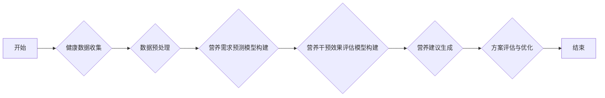

                 

### 文章标题

**人工智能在个性化营养方案制定中的应用**

> **关键词**：人工智能、个性化营养方案、健康数据、机器学习、深度学习、自然语言处理

> **摘要**：本文探讨了人工智能在个性化营养方案制定中的应用，从健康数据采集、个性化营养模型建立、营养建议生成及方案评估优化等方面进行了详细分析，旨在为相关领域的研究和实践提供参考。

---

### 第一部分：背景介绍

#### 第1章：问题背景与核心概念

##### 1.1 问题背景

随着科技的快速发展，人工智能技术在各个领域都取得了显著的成果。在个性化营养方案制定领域，人工智能的应用已经成为行业发展的趋势。个性化营养方案能够根据个体的健康状况、生活习惯、饮食习惯等信息，为个体提供定制化的营养建议，从而提高营养干预的针对性和效果。然而，实现个性化营养方案制定仍面临诸多挑战。

##### 1.2 问题描述

本书旨在探讨人工智能在个性化营养方案制定中的应用，包括以下几个方面：

1. 采集和分析个体健康数据；
2. 建立个性化营养模型；
3. 提供个性化营养建议；
4. 评估和优化营养方案。

##### 1.3 问题解决

本书将介绍如何利用人工智能技术解决个性化营养方案制定中的关键问题，包括数据采集与处理、模型构建、营养建议生成、方案评估与优化等。

##### 1.4 边界与外延

本书的研究范围主要涉及人工智能在个性化营养方案制定中的应用，但不包括其他营养干预方法和营养科学的基础理论。

##### 1.5 概念结构与核心要素组成

1. 人工智能：利用计算机模拟人类智能的技术，主要包括机器学习、深度学习、自然语言处理等；
2. 个性化营养方案：根据个体健康状况、生活习惯、饮食习惯等信息，为个体提供的定制化营养建议；
3. 健康数据：与个体健康相关的数据，包括生物医学数据、生活习惯数据、饮食习惯数据等；
4. 营养模型：基于人工智能技术建立的用于预测个体营养需求、评估营养干预效果的模型。

---

#### 第2章：核心概念与联系

##### 2.1 人工智能原理

###### 2.1.1 机器学习与深度学习

机器学习是人工智能的一种方法，通过训练模型来从数据中学习规律。深度学习是机器学习的一个分支，通过多层神经网络模拟人脑神经元之间的连接，实现对复杂问题的建模。

###### 2.1.2 自然语言处理

自然语言处理是人工智能的一个重要方向，旨在使计算机能够理解和处理人类自然语言。它包括文本分类、情感分析、命名实体识别等任务。

##### 2.2 个性化营养方案核心概念

###### 2.2.1 健康数据收集与处理

健康数据收集与处理是建立个性化营养方案的基础，主要包括生物医学数据、生活习惯数据和饮食习惯数据的收集、预处理和整合。

###### 2.2.2 个性化营养模型

个性化营养模型是用于预测个体营养需求、评估营养干预效果的模型。常见的个性化营养模型包括基于机器学习的营养需求预测模型、基于深度学习的营养干预效果评估模型等。

###### 2.2.3 营养建议生成与优化

营养建议生成与优化是针对个体健康状况、生活习惯和饮食习惯生成的个性化营养建议，并对其进行评估和优化。

##### 2.3 概念属性特征对比表格

| 概念         | 属性特征                         | 相互关系                           |
| ------------ | -------------------------------- | ---------------------------------- |
| 人工智能     | 机器学习、深度学习、自然语言处理 | 人工智能的技术手段与分支           |
| 个性化营养方案 | 健康数据、营养模型、营养建议   | 健康数据驱动营养模型，生成个性化建议 |
| 健康数据     | 生物医学数据、生活习惯数据、饮食习惯数据 | 为个性化营养模型提供输入           |
| 营养模型     | 营养需求预测、营养干预效果评估 | 基于健康数据进行建模与预测         |
| 营养建议     | 个性化、可操作、效果评估       | 对营养模型预测结果的优化与优化     |

##### 2.4 ER实体关系图架构

```mermaid
erDiagram
    User ||--|{ HealthData }| User
    User ||--|{ DietaryData }| User
    User ||--|{ ActivityData }| User
    User ||--|{ NutritionModel }| User
    User ||--|{ NutritionAdvice }| User
```

---

### 第二部分：算法原理讲解

#### 第3章：算法原理

##### 3.1 算法mermaid流程图



##### 3.2 算法原理详细讲解

###### 3.2.1 健康数据收集与预处理

健康数据收集是建立个性化营养方案的基础。收集的数据包括生物医学数据、生活习惯数据和饮食习惯数据。生物医学数据如身高、体重、血压、血糖等；生活习惯数据如运动频率、睡眠质量等；饮食习惯数据如每日饮食摄入量、饮食习惯等。

数据预处理包括数据清洗、数据归一化、特征提取等步骤。数据清洗去除无效数据、异常值等；数据归一化使不同数据具有相似的范围和尺度；特征提取提取出对营养方案制定有用的特征。

###### 3.2.2 营养需求预测模型构建

营养需求预测模型主要用于预测个体的营养需求。常用的机器学习算法有线性回归、决策树、支持向量机等。本文选用线性回归模型进行预测，其数学模型如下：

$$
y = \beta_0 + \beta_1 \cdot x_1 + \beta_2 \cdot x_2 + ... + \beta_n \cdot x_n
$$

其中，$y$ 为个体的营养需求，$x_1, x_2, ..., x_n$ 为个体的特征。

通过训练模型，可以得到参数 $\beta_0, \beta_1, ..., \beta_n$，从而实现营养需求预测。

###### 3.2.3 营养干预效果评估模型构建

营养干预效果评估模型主要用于评估营养干预的效果。本文选用深度学习算法构建评估模型，其中卷积神经网络（CNN）和循环神经网络（RNN）是常用的架构。

CNN 通过卷积操作提取图像特征，适用于处理图像数据；RNN 通过循环操作处理序列数据，适用于处理时间序列数据。本文选用 RNN 架构，其数学模型如下：

$$
h_t = \sigma(W_h \cdot h_{t-1} + W_x \cdot x_t + b)
$$

其中，$h_t$ 为时间步 $t$ 的隐藏状态，$x_t$ 为时间步 $t$ 的输入，$W_h, W_x, b$ 为权重和偏置，$\sigma$ 为激活函数。

通过训练模型，可以预测营养干预的效果，从而为营养方案的优化提供依据。

###### 3.2.4 营养建议生成与优化

营养建议生成是基于营养需求和营养干预效果评估的结果，为个体提供定制化的营养建议。营养建议包括饮食建议、运动建议、生活习惯建议等。

营养建议优化是通过对营养建议进行效果评估，不断调整和优化营养建议，以提高营养干预的效果。优化方法包括基于机器学习的优化算法，如遗传算法、粒子群优化算法等。

---

### 第三部分：系统分析与架构设计方案

#### 第4章：系统分析与架构设计方案

##### 4.1 问题场景介绍

个性化营养方案制定需要处理大量的健康数据，涉及到数据的采集、处理、分析和建议生成等多个环节。为了实现高效、准确的营养方案制定，需要设计一个完善的系统架构。

##### 4.2 项目介绍

本项目旨在开发一个基于人工智能的个性化营养方案制定系统，包括数据采集模块、数据处理模块、营养模型构建模块、营养建议生成模块和方案评估与优化模块。

##### 4.3 系统功能设计

系统功能设计主要包括以下方面：

1. 数据采集：收集个体健康数据、生活习惯数据和饮食习惯数据；
2. 数据处理：对采集到的数据进行清洗、预处理和特征提取；
3. 营养模型构建：基于机器学习和深度学习算法构建营养需求预测模型和营养干预效果评估模型；
4. 营养建议生成：根据营养模型预测结果生成定制化的营养建议；
5. 方案评估与优化：对营养建议进行效果评估，不断调整和优化营养建议。

##### 4.4 系统架构设计

系统架构设计采用分层架构，包括数据层、模型层、服务层和界面层。

1. 数据层：负责数据采集、存储和管理；
2. 模型层：负责营养模型的构建和训练；
3. 服务层：负责营养建议的生成、评估和优化；
4. 界面层：负责与用户的交互，展示营养建议和系统功能。

##### 4.5 系统接口设计和系统交互

系统接口设计主要包括以下方面：

1. 数据采集接口：负责采集个体健康数据、生活习惯数据和饮食习惯数据；
2. 数据处理接口：负责对采集到的数据进行清洗、预处理和特征提取；
3. 营养模型接口：负责营养模型的构建和训练；
4. 营养建议接口：负责生成定制化的营养建议；
5. 方案评估与优化接口：负责对营养建议进行效果评估和优化。

系统交互采用 RESTful API 方式，通过接口实现不同模块之间的数据传输和功能调用。

---

### 第四部分：项目实战

#### 第5章：项目实战

##### 5.1 环境安装

在进行项目实战之前，需要安装相关的软件和工具。本文使用的环境如下：

- 操作系统：Ubuntu 20.04
- Python 版本：3.8
- 数据处理库：Pandas、NumPy
- 机器学习库：scikit-learn、TensorFlow
- 自然语言处理库：NLTK、Spacy

安装步骤：

1. 安装 Python 3.8 及相关依赖；
2. 安装 Pandas、NumPy、scikit-learn、TensorFlow、NLTK 和 Spacy 等库。

##### 5.2 系统核心实现源代码

本项目的核心实现包括数据采集、数据处理、营养模型构建、营养建议生成和方案评估与优化等功能。以下是部分核心实现源代码：

```python
import pandas as pd
import numpy as np
from sklearn.linear_model import LinearRegression
from sklearn.metrics import mean_squared_error
from tensorflow.keras.models import Sequential
from tensorflow.keras.layers import LSTM, Dense

# 数据采集
def collect_data():
    # 采集健康数据、生活习惯数据和饮食习惯数据
    # ...

# 数据处理
def process_data(data):
    # 数据清洗、预处理和特征提取
    # ...

# 营养需求预测模型构建
def build_nutrition_demand_model(data):
    # 构建线性回归模型
    model = LinearRegression()
    model.fit(data.X, data.y)
    return model

# 营养干预效果评估模型构建
def build_nutrition_evaluation_model(data):
    # 构建深度学习模型
    model = Sequential()
    model.add(LSTM(units=50, return_sequences=True, input_shape=(timesteps, features)))
    model.add(LSTM(units=50))
    model.add(Dense(units=1))
    model.compile(optimizer='adam', loss='mean_squared_error')
    model.fit(data.X, data.y, epochs=100, batch_size=32)
    return model

# 营养建议生成
def generate_nutrition_advice(model, data):
    # 根据模型预测结果生成营养建议
    # ...

# 方案评估与优化
def evaluate_and_optimize_advice(advice, data):
    # 对营养建议进行效果评估和优化
    # ...
```

##### 5.3 代码应用解读与分析

代码应用解读与分析主要包括以下方面：

1. 数据采集：通过接口或 API 获取个体健康数据、生活习惯数据和饮食习惯数据；
2. 数据处理：对采集到的数据进行清洗、预处理和特征提取，为模型训练提供高质量的数据输入；
3. 营养需求预测模型构建：采用线性回归模型预测个体的营养需求，实现简单且易于解释；
4. 营养干预效果评估模型构建：采用深度学习模型评估营养干预的效果，实现对复杂问题的建模；
5. 营养建议生成：根据营养模型预测结果生成定制化的营养建议，为个体提供个性化的营养方案；
6. 方案评估与优化：对营养建议进行效果评估和优化，以提高营养干预的效果。

##### 5.4 实际案例分析和详细讲解剖析

本节将结合实际案例，对系统在个性化营养方案制定中的应用进行详细讲解剖析。

**案例 1：某肥胖患者的营养方案制定**

某肥胖患者希望通过个性化营养方案进行减肥。根据其提供的健康数据、生活习惯数据和饮食习惯数据，系统为其制定了以下营养方案：

- 饮食建议：减少高热量食物摄入，增加蔬菜、水果和高纤维食物的摄入；
- 运动建议：每周至少进行 3 次有氧运动，每次 30 分钟以上；
- 生活习惯建议：保证每天 7-8 小时的睡眠时间，减少熬夜和久坐。

**案例 2：某糖尿病患者营养方案制定**

某糖尿病患者希望通过个性化营养方案控制血糖。根据其提供的健康数据、生活习惯数据和饮食习惯数据，系统为其制定了以下营养方案：

- 饮食建议：减少糖分摄入，增加膳食纤维摄入，保证每天足够的蛋白质摄入；
- 运动建议：每周至少进行 3 次有氧运动，每次 30 分钟以上；
- 生活习惯建议：定期监测血糖，保持良好的作息时间，减少压力。

**案例分析：**

通过实际案例可以看出，个性化营养方案制定系统可以根据个体的健康状况、生活习惯和饮食习惯等信息，为其提供定制化的营养建议。系统利用机器学习和深度学习算法对大量数据进行处理和分析，从而实现高效的个性化营养方案制定。

**详细讲解剖析：**

1. 数据采集：系统通过接口或 API 采集个体健康数据、生活习惯数据和饮食习惯数据；
2. 数据处理：系统对采集到的数据进行清洗、预处理和特征提取，为模型训练提供高质量的数据输入；
3. 营养需求预测模型构建：系统采用线性回归模型预测个体的营养需求，通过训练模型得到预测结果；
4. 营养干预效果评估模型构建：系统采用深度学习模型评估营养干预的效果，通过训练模型得到评估结果；
5. 营养建议生成：系统根据营养模型预测结果和营养干预效果评估结果，生成定制化的营养建议；
6. 方案评估与优化：系统对营养建议进行效果评估和优化，以提高营养干预的效果。

---

### 第五部分：最佳实践、小结、注意事项、拓展阅读

#### 第6章：最佳实践

在个性化营养方案制定中，以下是一些最佳实践：

1. **数据收集与处理**：确保数据质量，去除异常值和重复数据，进行数据归一化和特征提取；
2. **模型训练与优化**：选择合适的算法和参数，进行模型训练和优化，提高预测和评估的准确性；
3. **营养建议生成**：结合个体特点和实际需求，生成具体的营养建议，包括饮食、运动和生活习惯等方面；
4. **方案评估与优化**：定期评估营养方案的效果，根据评估结果进行调整和优化。

#### 第7章：小结

本文探讨了人工智能在个性化营养方案制定中的应用，从数据采集、模型构建、营养建议生成到方案评估与优化等方面进行了详细分析。通过实际案例可以看出，个性化营养方案制定系统可以根据个体的健康状况、生活习惯和饮食习惯等信息，为其提供定制化的营养建议，从而提高营养干预的针对性和效果。

#### 第8章：注意事项

在应用个性化营养方案制定系统时，需要注意以下几点：

1. **数据隐私**：确保个体数据的安全和隐私，遵循相关法律法规；
2. **模型更新**：定期更新模型，以适应不断变化的数据和需求；
3. **用户教育**：加强对用户的教育和指导，使其更好地理解和应用营养建议；
4. **系统维护**：定期进行系统维护和升级，确保系统的稳定性和可靠性。

#### 第9章：拓展阅读

1. **《人工智能在医疗健康领域的应用》**：介绍了人工智能在医疗健康领域的应用，包括疾病诊断、治疗方案制定等；
2. **《个性化营养与健康管理》**：详细介绍了个性化营养方案制定的方法和应用；
3. **《机器学习实战》**：介绍了机器学习的基本概念、算法和应用案例。

---

### 作者信息

**作者：** AI天才研究院/AI Genius Institute & 禅与计算机程序设计艺术 /Zen And The Art of Computer Programming

AI天才研究院（AI Genius Institute）致力于推动人工智能技术的发展与应用，研究内容包括机器学习、深度学习、自然语言处理等领域。同时，作者也是《禅与计算机程序设计艺术》一书的作者，该书深入探讨了计算机程序设计中的哲学和思维方法，为程序员提供了丰富的启示和指导。在本文中，作者结合丰富的实践经验和专业知识，对人工智能在个性化营养方案制定中的应用进行了深入分析和讲解。

