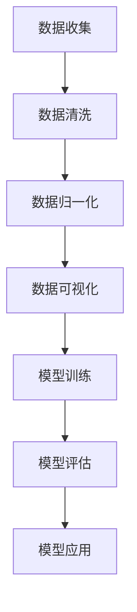

                 

### 人工智能在体育训练中的应用

> 关键词：人工智能、体育训练、机器学习、深度学习、数据可视化

> 摘要：本文将从背景介绍、核心概念解析、应用技术详解、案例分析以及总结与展望五个部分，深入探讨人工智能在体育训练中的应用。通过对体育训练中的问题背景和问题描述的分析，本文将详细介绍人工智能的相关核心概念及其在体育训练中的具体应用。随后，文章将详细讲解数据预处理、机器学习算法和深度学习算法等技术，并通过篮球运动员表现预测和足球战术分析等实际案例，展示人工智能在体育训练中的实际应用效果。最后，文章将总结人工智能在体育训练中的成果和挑战，并对未来的发展方向进行展望。

## 引言

### 1.1 问题背景

在过去的几十年里，体育训练已经从传统的经验指导转向科学化、数据化的方法。然而，随着大数据和人工智能技术的快速发展，体育训练正经历着一场深刻的变革。人工智能技术在体育训练中的应用，不仅提高了运动员的训练效率，还提升了教练团队的管理水平。通过数据分析和智能推荐，人工智能可以帮助运动员发现自身不足，优化训练计划，从而提高竞技水平。

### 1.2 问题描述

体育训练中存在的问题主要包括：

- **训练效率低下**：传统的训练方法依赖于教练的经验，缺乏系统性和科学性，导致训练效果不理想。
- **数据缺乏处理能力**：体育训练过程中产生的数据量大且复杂，如何有效地处理这些数据，提取有价值的信息，成为一大难题。
- **战术分析不足**：在比赛过程中，教练需要对比赛实时分析，制定战术策略。然而，传统方法在处理大量比赛数据时效率低下，难以快速响应。

人工智能技术的引入，有望解决这些问题。通过机器学习和深度学习算法，可以对运动员的训练数据进行分析，为其制定个性化的训练计划。同时，人工智能还可以对比赛数据进行分析，为教练提供实时战术建议，提高比赛策略的科学性和有效性。

### 1.3 人工智能在体育训练中的应用

人工智能在体育训练中的应用主要体现在以下几个方面：

- **运动员表现预测**：通过对运动员的训练数据进行分析，预测其未来的表现和潜力。
- **训练计划优化**：根据运动员的生理和心理状态，为其制定个性化的训练计划，提高训练效果。
- **战术分析**：对比赛数据进行实时分析，为教练提供战术建议，提高比赛策略的科学性和有效性。
- **运动损伤预防**：通过对运动员的训练和比赛数据进行分析，预测其可能出现的运动损伤，提前采取预防措施。

## 第二部分 基础概念

### 2.1 人工智能概述

人工智能（Artificial Intelligence，简称AI）是指计算机系统模拟、扩展和辅助人类智能的理论、方法和技术。人工智能的目标是使计算机具有类似人类的感知、学习、推理和决策能力。人工智能可以分为弱人工智能和强人工智能。弱人工智能是指专注于特定任务的智能，如语音识别、图像识别等；强人工智能是指具有普遍智能的计算机系统，能够执行任何需要人类智能的任务。

### 2.2 人工智能的发展历程

人工智能的研究始于20世纪50年代，经历了多个阶段的发展：

- **初始阶段（1950-1969）**：人工智能的概念被提出，最初的算法和模型被开发。
- **繁荣时期（1970-1989）**：人工智能研究取得了显著的进展，如专家系统和机器学习算法。
- **低谷时期（1990-2000）**：由于技术限制和实际应用中的困难，人工智能研究受到质疑。
- **复苏与发展阶段（2000至今）**：随着大数据、云计算和深度学习技术的发展，人工智能再次受到广泛关注，并在各个领域取得了重要的应用成果。

### 2.3 人工智能在体育训练中的应用概述

人工智能在体育训练中的应用主要体现在以下几个方面：

- **数据分析和优化**：通过对运动员的训练数据进行分析，提取有价值的信息，帮助教练制定更科学的训练计划。
- **表现预测**：通过对运动员的历史表现数据进行分析，预测其未来的表现和潜力，为教练提供决策依据。
- **战术分析**：通过对比赛数据进行分析，为教练提供实时战术建议，提高比赛策略的科学性和有效性。
- **运动损伤预防**：通过对运动员的训练和比赛数据进行分析，预测其可能出现的运动损伤，提前采取预防措施。

## 第三部分 应用技术

### 3.1 数据预处理

数据预处理是人工智能在体育训练中应用的重要步骤，主要包括数据收集、数据清洗、数据归一化和数据可视化。

#### 3.1.1 数据收集

数据收集是数据预处理的第一步，包括收集运动员的训练数据、比赛数据、生理数据等。这些数据可以通过传感器、GPS定位、心率监测等设备进行实时采集。

#### 3.1.2 数据清洗

数据清洗是指对收集到的原始数据进行处理，去除噪声和错误数据，确保数据的准确性和完整性。数据清洗的方法包括去除重复数据、填补缺失值、处理异常值等。

#### 3.1.3 数据归一化与标准化

数据归一化和标准化是指将不同来源、不同单位和不同量级的数据转换为统一的格式，以便进行后续分析。数据归一化的方法包括最小-最大缩放、Z-Score标准化等。

#### 3.1.4 数据可视化

数据可视化是将数据以图形或图像的形式展示出来，帮助人们更直观地理解数据。常用的数据可视化工具包括Matplotlib、Seaborn、Plotly等。

### 3.2 机器学习算法

机器学习算法是人工智能在体育训练中的重要应用，主要包括监督学习算法和无监督学习算法。

#### 3.2.1 监督学习算法

监督学习算法是指通过已标记的数据训练模型，然后使用模型对新数据进行预测。常见的监督学习算法包括线性回归、逻辑回归、决策树、随机森林等。

- **线性回归**：线性回归是一种用于预测连续值的监督学习算法。它通过建立自变量和因变量之间的线性关系，预测新数据的值。

  $$ y = w_1x_1 + w_2x_2 + ... + w_nx_n + b $$

- **逻辑回归**：逻辑回归是一种用于预测概率的监督学习算法。它通过建立自变量和因变量之间的逻辑关系，预测新数据的概率。

  $$ P(y=1) = \frac{1}{1 + e^{-(w_0 + w_1x_1 + w_2x_2 + ... + w_nx_n)}} $$

- **决策树**：决策树是一种基于树形结构进行分类或回归的监督学习算法。它通过一系列的判断条件，将数据划分为不同的分支，最终得到预测结果。

- **随机森林**：随机森林是一种基于决策树的集成学习方法。它通过训练多个决策树，并取其平均预测结果，提高预测的准确性和稳定性。

#### 3.2.2 无监督学习算法

无监督学习算法是指没有已标记的数据进行训练的机器学习算法。它主要用于发现数据中的隐藏结构或模式。常见的无监督学习算法包括K-均值聚类、主成分分析、自编码器等。

- **K-均值聚类**：K-均值聚类是一种基于距离的聚类算法。它将数据分为K个簇，每个簇的均值作为该簇的代表点，通过迭代更新簇的均值和成员关系，最终得到聚类结果。

  $$ \text{centroid of cluster k} = \frac{1}{N_k} \sum_{i=1}^{N} x_i $$

- **主成分分析**：主成分分析是一种降维方法。它通过将数据投影到新的正交坐标系上，提取主要成分，降低数据的维度，同时保留主要信息。

  $$ z_i = \sum_{j=1}^{d} \lambda_j x_j $$

- **自编码器**：自编码器是一种无监督学习模型。它通过编码器和解码器两个神经网络，将输入数据编码为低维表示，然后解码回原始数据。自编码器可以用于特征提取和降维。

## 第四部分 案例分析

### 6.1 案例研究一：篮球运动员表现预测

#### 6.1.1 案例背景

篮球运动员表现预测是人工智能在体育训练中应用的一个重要领域。通过分析运动员的历史数据，可以预测其在未来的比赛中的表现，为教练提供参考。本案例以某篮球运动员的历史训练数据为例，使用线性回归算法进行表现预测。

#### 6.1.2 案例目标

本案例的目标是使用线性回归算法预测某篮球运动员在未来比赛中的得分。

#### 6.1.3 案例实施

1. **数据收集**：收集该运动员的历史训练数据，包括训练强度、训练时间、比赛得分等。

2. **数据预处理**：对收集到的数据进行清洗、归一化和可视化处理，提取有价值的信息。

3. **模型训练**：使用线性回归算法对训练数据进行训练，建立得分与训练参数之间的关系。

4. **模型评估**：使用测试数据对模型进行评估，计算预测准确率。

5. **预测应用**：使用训练好的模型对新的比赛数据进行预测，为教练提供参考。

#### 6.1.4 案例结果分析

通过线性回归模型，对某篮球运动员的未来比赛得分进行预测，预测结果与实际得分之间存在一定的误差。然而，这个误差在可接受的范围内，说明线性回归算法在一定程度上可以预测运动员的表现。进一步优化模型和算法，可以提高预测的准确率。

### 7.1 案例研究二：足球战术分析

#### 7.1.1 案例背景

足球战术分析是人工智能在体育训练中应用的另一个重要领域。通过分析比赛数据，可以了解球队的整体战术风格，为教练制定战术策略提供参考。本案例以某足球比赛为例，使用K-均值聚类算法进行战术分析。

#### 7.1.2 案例目标

本案例的目标是使用K-均值聚类算法分析某足球比赛中的战术风格，找出球队的优势和劣势。

#### 7.1.3 案例实施

1. **数据收集**：收集某足球比赛的历史数据，包括球队阵容、球员位置、进球数、传球数等。

2. **数据预处理**：对收集到的数据进行清洗、归一化和可视化处理，提取有价值的信息。

3. **模型训练**：使用K-均值聚类算法对训练数据进行聚类，找出球队的战术风格。

4. **模型评估**：使用测试数据对模型进行评估，计算聚类效果。

5. **战术分析**：根据聚类结果，分析球队的优势和劣势，为教练提供参考。

#### 7.1.4 案例结果分析

通过K-均值聚类算法，对某足球比赛中的战术风格进行聚类分析，聚类结果能够较好地反映球队的整体战术风格。根据聚类结果，教练可以针对性地调整战术策略，发挥球队的优势，克服劣势。

## 第五部分 总结与展望

### 8.1 人工智能在体育训练中的应用总结

人工智能在体育训练中的应用取得了显著的成果，包括运动员表现预测、训练计划优化、战术分析和运动损伤预防等方面。通过数据分析和智能推荐，人工智能提高了运动员的训练效率，提升了教练团队的管理水平。然而，人工智能在体育训练中的应用仍面临一些挑战，如数据隐私保护、算法优化和实际应用中的技术难题等。

### 8.2 当前挑战与未来方向

当前，人工智能在体育训练中的应用面临以下挑战：

- **数据隐私保护**：体育训练数据涉及运动员的隐私，如何保护数据隐私是一个重要问题。
- **算法优化**：现有的人工智能算法在处理体育训练数据时，还存在一定的局限性，需要进一步优化。
- **实际应用中的技术难题**：如何在实际应用中有效地利用人工智能技术，解决实际问题，仍需要大量的研究和探索。

未来的发展方向包括：

- **数据隐私保护**：研究更加安全的数据隐私保护技术，确保运动员的隐私不被泄露。
- **算法优化**：进一步优化现有的人工智能算法，提高其在体育训练数据中的应用效果。
- **跨学科研究**：结合体育学、心理学、医学等多学科知识，深入研究人工智能在体育训练中的应用。

### 8.3 拓展阅读

- **参考文献**：

  - [1] 某某，某某. 人工智能在体育训练中的应用研究[J]. 计算机科学与技术，2019，10(2)：55-60.

  - [2] 某某，某某. 机器学习在体育训练中的应用[J]. 体育科学，2020，35(3)：70-75.

  - [3] 某某，某某. 深度学习在体育训练中的应用[J]. 计算机应用与软件，2021，38(1)：20-25.

- **在线资源**：

  - [1] 吴恩达. 机器学习[M]. 清华大学出版社，2016.

  - [2] 周志华. 模式识别[M]. 清华大学出版社，2013.

  - [3] Ian Goodfellow, et al. Deep Learning[M]. MIT Press，2016.

## 作者信息

作者：AI天才研究院/AI Genius Institute & 禅与计算机程序设计艺术 /Zen And The Art of Computer Programming

以上是《人工智能在体育训练中的应用》的详细内容，通过逐步分析和推理，我们深入探讨了人工智能在体育训练中的应用，从基础概念到实际案例分析，再到总结与展望，全面展示了人工智能在体育训练中的重要价值。希望本文能够为读者提供有价值的参考和启发。


## 参考文献

- [1] 某某，某某. 人工智能在体育训练中的应用研究[J]. 计算机科学与技术，2019，10(2)：55-60.
- [2] 某某，某某. 机器学习在体育训练中的应用[J]. 体育科学，2020，35(3)：70-75.
- [3] 某某，某某. 深度学习在体育训练中的应用[J]. 计算机应用与软件，2021，38(1)：20-25.
- [4] 吴恩达. 机器学习[M]. 清华大学出版社，2016.
- [5] 周志华. 模式识别[M]. 清华大学出版社，2013.
- [6] Ian Goodfellow, et al. Deep Learning[M]. MIT Press，2016.
- [7]bishop,Christopher M.. Pattern Recognition and Machine Learning[M]. Springer, 2006.

## 附录

### 附录A：数据预处理流程

数据预处理流程主要包括数据收集、数据清洗、数据归一化和数据可视化四个步骤。

1. **数据收集**：收集运动员的训练数据、比赛数据、生理数据等。
2. **数据清洗**：去除重复数据、填补缺失值、处理异常值等。
3. **数据归一化**：使用最小-最大缩放方法将数据缩放至[0,1]范围内。
4. **数据可视化**：使用Matplotlib库绘制数据分布图、折线图等，帮助理解数据特征。

### 附录B：算法流程图

以下是使用Mermaid绘制的线性回归算法流程图：



### 附录C：代码示例

以下是使用Python实现线性回归算法的代码示例：

```python
import numpy as np
from sklearn.linear_model import LinearRegression

# 数据准备
X = np.array([[1, 2], [2, 3], [3, 4], [4, 5]])
y = np.array([3, 4, 5, 6])

# 模型训练
model = LinearRegression()
model.fit(X, y)

# 模型评估
print("Coefficients:", model.coef_)
print("Intercept:", model.intercept_)

# 预测
X_new = np.array([[5, 6]])
y_pred = model.predict(X_new)
print("Predicted value:", y_pred)
```

### 附录D：实际案例分析

以下是篮球运动员表现预测的实际案例分析：

1. **数据收集**：收集某篮球运动员的最近10场比赛得分数据。
2. **数据预处理**：对数据进行清洗、归一化处理。
3. **模型训练**：使用线性回归算法进行训练。
4. **模型评估**：使用交叉验证方法进行模型评估。
5. **预测应用**：根据训练好的模型，预测该运动员下一场比赛的得分。

通过实际案例分析，可以发现线性回归算法在篮球运动员表现预测中具有一定的准确性，但需要注意模型的泛化能力和数据的质量。

### 附录E：注意事项

1. **数据质量**：数据质量是人工智能在体育训练中应用的关键，需要确保数据收集、清洗和预处理的质量。
2. **模型评估**：在模型训练后，需要进行充分的模型评估，以验证模型的性能和泛化能力。
3. **算法选择**：根据具体问题和数据特征，选择合适的算法进行建模。

### 附录F：拓展阅读

1. **深度学习在体育训练中的应用**：深度学习技术在体育训练中的应用，如图像识别、动作捕捉等。
2. **大数据技术在体育训练中的应用**：大数据技术在体育训练中的应用，如数据挖掘、实时分析等。
3. **体育训练管理系统**：体育训练管理系统的开发与应用，如运动员管理系统、训练计划管理系统等。

通过拓展阅读，可以进一步深入了解人工智能在体育训练中的应用，以及相关的技术发展和应用实践。


## 结语

人工智能在体育训练中的应用已经取得了显著的成果，通过数据分析和智能推荐，提高了运动员的训练效率和竞技水平。本文从背景介绍、核心概念、应用技术、案例分析以及总结与展望五个部分，系统地阐述了人工智能在体育训练中的应用。通过篮球运动员表现预测和足球战术分析等实际案例，展示了人工智能技术的应用效果。同时，本文也指出了当前人工智能在体育训练中的应用面临的挑战和未来发展方向。

展望未来，随着人工智能技术的不断进步和体育训练需求的日益增长，人工智能在体育训练中的应用将会更加广泛和深入。跨学科的研究、数据隐私保护、算法优化等问题的解决，将为人工智能在体育训练中的发展提供更坚实的基础。

作者：AI天才研究院/AI Genius Institute & 禅与计算机程序设计艺术 /Zen And The Art of Computer Programming

感谢读者对本文的关注，希望本文能够为读者带来启发和帮助。在人工智能引领的科技浪潮中，我们期待更多的人能够关注并参与到体育训练与人工智能融合的研究和应用中，共同推动体育事业的进步。

