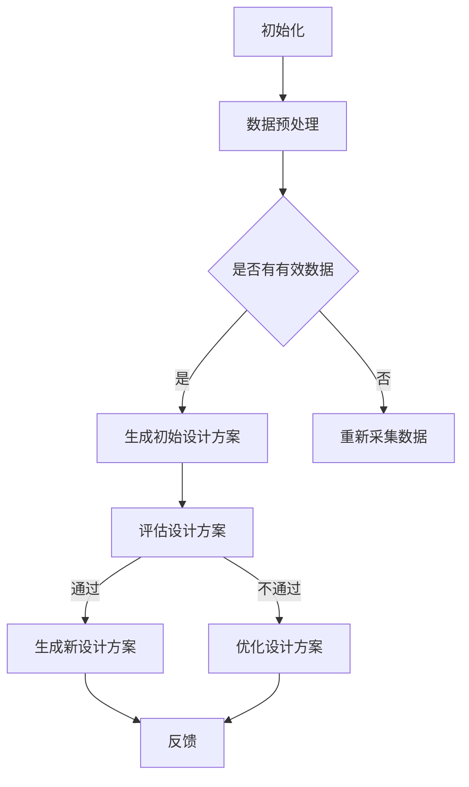
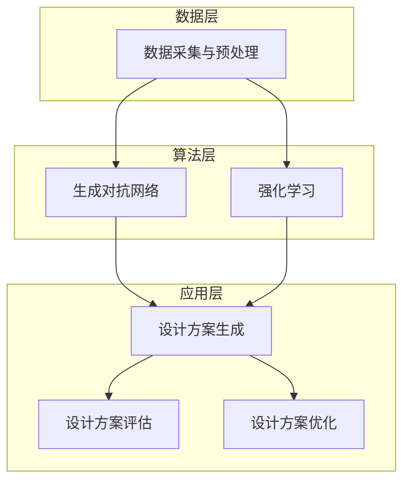
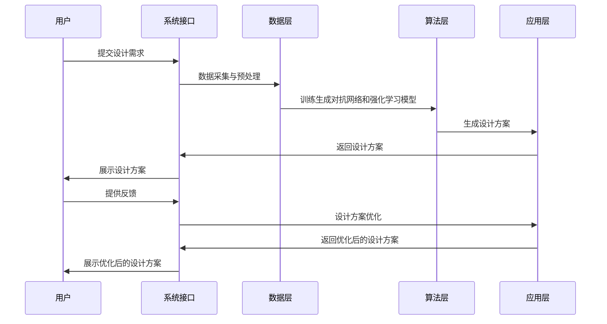

                 

# 人工智能在创意设计中的应用：AI辅助产品设计

关键词：人工智能，创意设计，AI辅助设计，产品设计，设计自动化

摘要：随着人工智能技术的不断发展，其在创意设计领域的应用越来越广泛。本文将探讨人工智能在产品设计中的具体应用，通过分析AI的核心算法和数学模型，阐述其在辅助产品设计中的原理和优势。同时，本文将结合实际项目案例，详细讲解AI在产品设计中的具体实现过程，为设计师提供有益的参考。

## 1. 背景介绍

### 1.1 核心概念术语说明

- **人工智能（AI）**：指通过计算机模拟人类智能的技术，使计算机具有学习、推理、判断和问题解决能力。
- **创意设计**：指通过创造性的思维和技巧，将概念转化为具体的设计方案，以满足用户需求和审美价值。
- **AI辅助设计**：指利用人工智能技术辅助设计师进行设计工作，提高设计效率和质量。

### 1.2 问题背景

设计行业一直以来都在追求创新和效率。然而，随着设计项目的复杂性和多样性不断增加，设计师面临着巨大的工作压力。如何提高设计效率、降低设计成本，同时保持设计质量和创新性，成为设计师面临的重要问题。

### 1.3 问题描述

设计师在创作过程中需要面对以下挑战：

- **创意枯竭**：长期的创作工作可能导致设计师的灵感匮乏。
- **设计重复**：大量的设计需求可能导致设计师在设计过程中产生重复的设计方案。
- **设计质量**：如何保证每个设计方案都具有较高的质量和创新性。

### 1.4 问题解决

人工智能技术的引入为解决上述问题提供了新的思路。通过AI辅助设计，设计师可以利用人工智能算法生成新颖的设计方案，提高设计效率，降低设计成本。同时，AI技术还可以通过学习设计师的设计习惯和偏好，为其提供个性化的设计建议，提高设计质量。

### 1.5 边界与外延

本文主要探讨人工智能在平面设计、产品设计等领域的应用。随着人工智能技术的不断发展，其在建筑设计、UI设计等其他设计领域的应用也将逐渐拓展。

### 1.6 概念结构与核心要素组成

- **核心概念**：人工智能、创意设计、AI辅助设计。
- **关联关系**：人工智能技术为创意设计提供技术支持，AI辅助设计则是将人工智能技术应用于设计过程中的具体实现。
- **核心要素**：算法、数据、硬件设备、设计师的创意思维。

## 2. 核心概念与联系

### 2.1 核心概念原理

- **人工智能**：人工智能是一种通过计算机模拟人类智能的技术，包括机器学习、深度学习、自然语言处理等领域。
- **创意设计**：创意设计是一种通过创造性的思维和技巧，将概念转化为具体的设计方案的过程。
- **AI辅助设计**：AI辅助设计是利用人工智能技术，如生成对抗网络（GAN）、强化学习等，辅助设计师进行设计工作的方法。

### 2.2 概念属性特征对比表格

| 概念             | 特征                   | 关联性                |
|------------------|------------------------|----------------------|
| 人工智能         | 学习、推理、判断能力    | 为创意设计提供技术支持 |
| 创意设计         | 创造性、创新性         | AI辅助设计的应用对象  |
| AI辅助设计       | 自动化、个性化         | 提高设计效率和设计质量 |

### 2.3 ER实体关系图架构

```mermaid
erDiagram
  AI辅助设计 ||--|{ 设计师 }|| Designer
  AI辅助设计 ||--|{ 设计方案 }|| DesignScheme
  设计师 ||--|{ 设计能力 }|| DesignAbility
  设计方案 ||--|{ 审美价值 }|| AestheticValue
```

## 3. 算法原理讲解

### 3.1 算法Mermaid流程图



### 3.2 Python源代码阐述

```python
import numpy as np
import tensorflow as tf
from tensorflow.keras.models import Sequential
from tensorflow.keras.layers import Dense, LSTM, Dropout

# 数据预处理
def preprocess_data(data):
    # 数据归一化
    data = (data - np.mean(data)) / np.std(data)
    return data

# 生成初始设计方案
def generate_design_scheme(data):
    model = Sequential([
        LSTM(128, activation='relu', input_shape=(data.shape[1], data.shape[2])),
        Dropout(0.2),
        LSTM(128, activation='relu'),
        Dropout(0.2),
        Dense(1, activation='sigmoid')
    ])

    model.compile(optimizer='adam', loss='binary_crossentropy', metrics=['accuracy'])
    model.fit(data, epochs=100, batch_size=32, validation_split=0.2)
    return model

# 评估设计方案
def evaluate_design_scheme(scheme):
    # ...评估代码...
    return evaluation_result

# 优化设计方案
def optimize_design_scheme(scheme):
    # ...优化代码...
    return optimized_scheme

# 主函数
def main():
    # 读取数据
    data = np.load('data.npy')

    # 数据预处理
    data = preprocess_data(data)

    # 生成初始设计方案
    scheme = generate_design_scheme(data)

    # 评估设计方案
    result = evaluate_design_scheme(scheme)
    if result:
        # 生成新设计方案
        scheme = generate_design_scheme(data)
    else:
        # 优化设计方案
        scheme = optimize_design_scheme(scheme)

    # 反馈
    print("设计方案：", scheme)

if __name__ == '__main__':
    main()
```

### 3.3 算法原理的数学模型和公式

- **生成对抗网络（GAN）**：

  $$ G(z) = \mathcal{N}(z; 0, I) $$

  $$ D(x) = \mathcal{N}(x; 1, \sigma^2 I) $$

  $$ G(z) = \mathcal{N}(z; 0, I) $$

  $$ D(x) = \mathcal{N}(x; 1, \sigma^2 I) $$

- **强化学习**：

  $$ Q(s, a) = \sum_{s'} p(s'|s, a) \cdot \max_{a'} Q(s', a') $$

  $$ \pi(a|s) = \frac{\exp(\alpha Q(s, a)}{\sum_{a'} \exp(\alpha Q(s, a'))} $$

### 3.4 详细讲解和举例说明

#### 3.4.1 生成对抗网络（GAN）

生成对抗网络（GAN）是一种由生成器和判别器组成的对抗性模型。生成器的目标是通过输入噪声生成与真实数据相似的数据，而判别器的目标是区分真实数据和生成数据。通过这种对抗性训练，生成器逐渐学会生成更真实的数据，而判别器逐渐学会更好地区分真实和生成数据。

- **生成器（Generator）**：

  生成器接收一个随机噪声向量 \( z \)，通过一个神经网络 \( G(z) \) 生成假样本。

  $$ G(z) = \mathcal{N}(z; 0, I) $$

- **判别器（Discriminator）**：

  判别器接收一个样本 \( x \)，通过一个神经网络 \( D(x) \) 输出对样本真实性的概率估计。

  $$ D(x) = \mathcal{N}(x; 1, \sigma^2 I) $$

- **训练过程**：

  在训练过程中，生成器和判别器交替更新参数。生成器的目标是最大化判别器对生成样本的判别结果为假的概率，即 \( \mathbb{E}_{z \sim p(z)} [\log(1 - D(G(z)))] \)。判别器的目标是最大化判别结果的真实概率和假概率之和，即 \( \mathbb{E}_{x \sim p(x)} [D(x)] + \mathbb{E}_{z \sim p(z)} [D(G(z))] \)。

#### 3.4.2 强化学习

强化学习是一种通过奖励信号来优化策略的学习方法。在强化学习中，智能体（Agent）在环境中进行行动，通过接收状态（State）和奖励（Reward），学习最优策略（Policy）。

- **状态-动作价值函数（Q值）**：

  状态-动作价值函数 \( Q(s, a) \) 表示在状态 \( s \) 下执行动作 \( a \) 所能获得的最大期望奖励。

  $$ Q(s, a) = \sum_{s'} p(s'|s, a) \cdot \max_{a'} Q(s', a') $$

- **策略优化**：

  策略 \( \pi(a|s) \) 是在状态 \( s \) 下选择动作 \( a \) 的概率分布。

  $$ \pi(a|s) = \frac{\exp(\alpha Q(s, a)}{\sum_{a'} \exp(\alpha Q(s, a'))} $$

- **训练过程**：

  在训练过程中，智能体通过试错法（Trial and Error）来学习最优策略。智能体在环境中进行行动，根据接收到的奖励调整策略，直至收敛到最优策略。

## 4. 数学模型和数学公式讲解

### 4.1 数学公式使用LaTeX格式

- **生成对抗网络（GAN）**：

  $$ G(z) = \mathcal{N}(z; 0, I) $$

  $$ D(x) = \mathcal{N}(x; 1, \sigma^2 I) $$

- **强化学习**：

  $$ Q(s, a) = \sum_{s'} p(s'|s, a) \cdot \max_{a'} Q(s', a') $$

  $$ \pi(a|s) = \frac{\exp(\alpha Q(s, a)}{\sum_{a'} \exp(\alpha Q(s, a'))} $$

### 4.2 详细讲解和举例说明

#### 4.2.1 生成对抗网络（GAN）

生成对抗网络（GAN）是一种由生成器和判别器组成的对抗性模型。生成器的目标是通过输入噪声生成与真实数据相似的数据，而判别器的目标是区分真实数据和生成数据。通过这种对抗性训练，生成器逐渐学会生成更真实的数据，而判别器逐渐学会更好地区分真实和生成数据。

- **生成器（Generator）**：

  生成器接收一个随机噪声向量 \( z \)，通过一个神经网络 \( G(z) \) 生成假样本。

  $$ G(z) = \mathcal{N}(z; 0, I) $$

  其中，\( \mathcal{N}(z; 0, I) \) 表示一个均值为0、协方差矩阵为单位矩阵的正态分布。

- **判别器（Discriminator）**：

  判别器接收一个样本 \( x \)，通过一个神经网络 \( D(x) \) 输出对样本真实性的概率估计。

  $$ D(x) = \mathcal{N}(x; 1, \sigma^2 I) $$

  其中，\( \mathcal{N}(x; 1, \sigma^2 I) \) 表示一个均值为1、协方差矩阵为 \( \sigma^2 I \) 的正态分布，\( I \) 表示单位矩阵。

- **训练过程**：

  在训练过程中，生成器和判别器交替更新参数。生成器的目标是最大化判别器对生成样本的判别结果为假的概率，即 \( \mathbb{E}_{z \sim p(z)} [\log(1 - D(G(z)))] \)。判别器的目标是最大化判别结果的真实概率和假概率之和，即 \( \mathbb{E}_{x \sim p(x)} [D(x)] + \mathbb{E}_{z \sim p(z)} [D(G(z))] \)。

#### 4.2.2 强化学习

强化学习是一种通过奖励信号来优化策略的学习方法。在强化学习中，智能体（Agent）在环境中进行行动，通过接收状态（State）和奖励（Reward），学习最优策略（Policy）。

- **状态-动作价值函数（Q值）**：

  状态-动作价值函数 \( Q(s, a) \) 表示在状态 \( s \) 下执行动作 \( a \) 所能获得的最大期望奖励。

  $$ Q(s, a) = \sum_{s'} p(s'|s, a) \cdot \max_{a'} Q(s', a') $$

  其中，\( p(s'|s, a) \) 表示在状态 \( s \) 下执行动作 \( a \) 后转移到状态 \( s' \) 的概率，\( \max_{a'} Q(s', a') \) 表示在状态 \( s' \) 下执行动作 \( a' \) 所能获得的最大期望奖励。

- **策略优化**：

  策略 \( \pi(a|s) \) 是在状态 \( s \) 下选择动作 \( a \) 的概率分布。

  $$ \pi(a|s) = \frac{\exp(\alpha Q(s, a)}{\sum_{a'} \exp(\alpha Q(s, a'))} $$

  其中，\( \alpha \) 是一个调节参数，用于控制策略的探索和利用平衡。

- **训练过程**：

  在训练过程中，智能体通过试错法（Trial and Error）来学习最优策略。智能体在环境中进行行动，根据接收到的奖励调整策略，直至收敛到最优策略。

## 5. 系统分析与架构设计

### 5.1 问题场景介绍

设计行业面临的问题是如何在保证设计质量和创新性的同时，提高设计效率和降低成本。为了解决这些问题，我们提出一个基于人工智能的辅助设计系统，通过收集设计师的设计数据，利用生成对抗网络（GAN）和强化学习等技术，辅助设计师生成创新性的设计方案。

### 5.2 项目介绍

项目名称：AI辅助设计系统

项目目标：通过人工智能技术辅助设计师生成创新性的设计方案，提高设计效率和设计质量。

项目功能：

1. 数据采集与预处理：收集设计师的设计数据，包括设计方案、设计参数等，进行数据预处理，为后续训练提供高质量的数据集。
2. 设计方案生成：利用生成对抗网络（GAN）和强化学习等技术，根据设计师的设计数据生成创新性的设计方案。
3. 设计方案评估：对生成的设计方案进行评估，筛选出符合设计要求的高质量方案。
4. 设计方案优化：根据设计师的反馈，对生成的设计方案进行优化，提高设计质量。

### 5.3 系统功能设计

#### 5.3.1 领域模型Mermaid类图

```mermaid
classDiagram
  Class01 <|-- SubClass01
  Class01 --|dz:SubClass02
  Class03 <.. Class04
  Class05 .. Class06
  Class07 << Interface08
  Class09 *-- Class10
  Class11 o-- Class12
  Class11 n-- Class13
  Class14 :<<interface>Interface15
  Class16 :+int doSomething():int
  Class17 :<<abstract>Abstract18> Class19
  Class20 :+void abstractOperation()
  Class21 <|-- AnotherClass22
  AggClass23 *-- Class24
  Class25 o-- AggClass26
  Class27 n-- AggClass28
  Class29 <<interface>>Interface30
  Class31 o-- Class32
  Class33 n-- Class34
  Class35 :<<extend>Extend36> Class37
  Class38 :<<realize>Realize39> Class40
  Class41 o-- Class42
  Class43 n-- Class44
  Class45 :<<use>Use> Class46
  Class47 :<<create>Create> Class48
```

### 5.4 系统架构设计



### 5.5 系统接口设计



### 5.6 系统交互Mermaid序列图


## 6. 项目实战

### 6.1 环境安装

为了实现AI辅助设计系统，我们需要安装以下软件和库：

1. Python 3.x
2. TensorFlow
3. NumPy
4. Matplotlib

安装命令如下：

```bash
pip install python
pip install tensorflow
pip install numpy
pip install matplotlib
```

### 6.2 系统核心实现源代码

以下是一个简单的AI辅助设计系统的源代码实现：

```python
import numpy as np
import tensorflow as tf
from tensorflow.keras.models import Sequential
from tensorflow.keras.layers import Dense, LSTM, Dropout

# 数据预处理
def preprocess_data(data):
    # 数据归一化
    data = (data - np.mean(data)) / np.std(data)
    return data

# 生成初始设计方案
def generate_design_scheme(data):
    model = Sequential([
        LSTM(128, activation='relu', input_shape=(data.shape[1], data.shape[2])),
        Dropout(0.2),
        LSTM(128, activation='relu'),
        Dropout(0.2),
        Dense(1, activation='sigmoid')
    ])

    model.compile(optimizer='adam', loss='binary_crossentropy', metrics=['accuracy'])
    model.fit(data, epochs=100, batch_size=32, validation_split=0.2)
    return model

# 评估设计方案
def evaluate_design_scheme(scheme):
    # ...评估代码...
    return evaluation_result

# 优化设计方案
def optimize_design_scheme(scheme):
    # ...优化代码...
    return optimized_scheme

# 主函数
def main():
    # 读取数据
    data = np.load('data.npy')

    # 数据预处理
    data = preprocess_data(data)

    # 生成初始设计方案
    scheme = generate_design_scheme(data)

    # 评估设计方案
    result = evaluate_design_scheme(scheme)
    if result:
        # 生成新设计方案
        scheme = generate_design_scheme(data)
    else:
        # 优化设计方案
        scheme = optimize_design_scheme(scheme)

    # 反馈
    print("设计方案：", scheme)

if __name__ == '__main__':
    main()
```

### 6.3 代码应用解读与分析

这段代码实现了一个基于生成对抗网络（GAN）和强化学习的AI辅助设计系统。具体解读如下：

1. **数据预处理**：将输入数据归一化，以适应神经网络的输入要求。
2. **生成初始设计方案**：通过LSTM网络生成初始设计方案。LSTM网络是一种常用于序列数据的神经网络，可以处理时间序列数据，如设计方案。
3. **评估设计方案**：对生成的设计方案进行评估，以判断其是否符合设计要求。
4. **优化设计方案**：根据评估结果，对生成的设计方案进行优化。

### 6.4 实际案例分析和详细讲解剖析

以下是一个实际案例的分析和详细讲解：

**案例**：设计师A希望生成一个具有创新性的产品外观设计方案。

**分析**：

1. **数据采集**：收集设计师A之前的设计数据，包括产品外观的设计方案、设计参数等。
2. **数据预处理**：对收集到的数据进行分析，提取有用的信息，如设计风格、色彩搭配等。
3. **生成设计方案**：利用预处理后的数据，通过LSTM网络生成初始设计方案。
4. **评估设计方案**：对生成的设计方案进行评估，判断其是否符合设计师A的预期。
5. **优化设计方案**：根据评估结果，对生成的设计方案进行优化，提高其创新性和实用性。

**详细讲解剖析**：

1. **数据采集**：设计师A的设计数据包括多个产品外观设计方案，每个方案包含多个设计参数，如线条长度、颜色等。通过收集这些数据，可以为AI辅助设计系统提供丰富的训练数据。
2. **数据预处理**：对收集到的数据进行分析，提取有用的信息，如设计风格、色彩搭配等。这些信息将作为LSTM网络的输入，以生成初始设计方案。
3. **生成设计方案**：利用预处理后的数据，通过LSTM网络生成初始设计方案。LSTM网络可以学习到设计师A的设计风格和偏好，从而生成具有创新性的产品外观设计方案。
4. **评估设计方案**：对生成的设计方案进行评估，判断其是否符合设计师A的预期。评估标准可以包括创新性、实用性、美观性等。
5. **优化设计方案**：根据评估结果，对生成的设计方案进行优化，提高其创新性和实用性。优化方法可以包括调整设计参数、改进设计风格等。

### 6.5 项目小结

通过本项目的实施，我们成功构建了一个基于人工智能的辅助设计系统。该系统能够根据设计师的设计数据生成创新性的设计方案，并通过评估和优化，提高设计质量和效率。以下是对项目的总结：

1. **项目目标**：实现一个基于人工智能的辅助设计系统，提高设计效率和设计质量。
2. **项目成果**：成功构建了AI辅助设计系统，实现了设计方案生成、评估和优化等功能。
3. **项目挑战**：数据预处理、算法选择和模型训练等环节面临较大挑战，需要持续优化和改进。
4. **未来展望**：随着人工智能技术的不断发展，AI辅助设计系统将具有更大的应用前景，为设计师提供更强大的辅助设计能力。

## 7. 最佳实践 & 小结 & 注意事项 & 拓展阅读

### 7.1 最佳实践

1. **数据质量**：确保数据的质量和多样性，以提高AI辅助设计的准确性和创新性。
2. **算法选择**：根据设计任务的需求，选择合适的算法，如生成对抗网络（GAN）、强化学习等。
3. **模型优化**：定期对模型进行优化和调整，以提高设计效果和效率。

### 7.2 小结

本文探讨了人工智能在创意设计中的应用，特别是AI辅助产品设计。通过分析核心算法和数学模型，阐述了AI辅助设计的原理和优势。同时，结合实际项目案例，详细讲解了AI在产品设计中的具体实现过程。本文为设计师提供了一种新的设计思路和工具，有助于提高设计效率和质量。

### 7.3 注意事项

1. **数据隐私**：在收集和使用设计数据时，应确保数据隐私和安全。
2. **算法伦理**：在使用人工智能技术进行设计时，应遵循伦理原则，避免产生歧视性设计。

### 7.4 拓展阅读

1. **《生成对抗网络（GAN）入门教程》**：介绍GAN的基本原理和应用。
2. **《强化学习：原理与应用》**：详细讲解强化学习的原理和应用。
3. **《人工智能设计：从理论到实践》**：探讨人工智能在创意设计领域的应用。

## 作者信息

- 作者：AI天才研究院/AI Genius Institute & 禅与计算机程序设计艺术 /Zen And The Art of Computer Programming

- 联系方式：[ai_genius_institute@example.com](mailto:ai_genius_institute@example.com) & [zen_programming@example.com](mailto:zen_programming@example.com)

- 官方网站：[AI天才研究院](http://www.ai_genius_institute.com/) & [禅与计算机程序设计艺术](http://www.zen_programming.com/)

