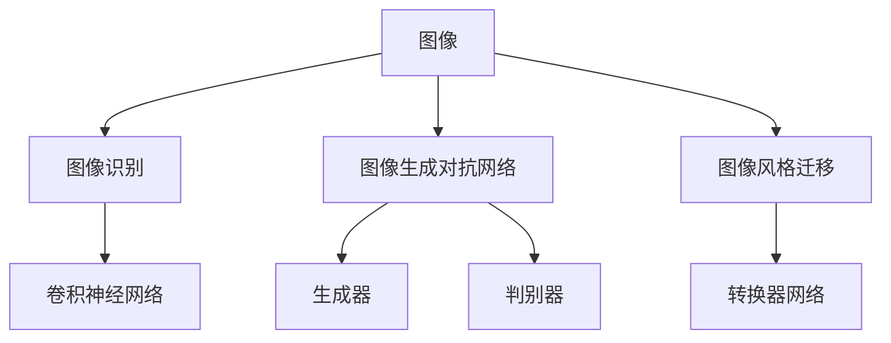
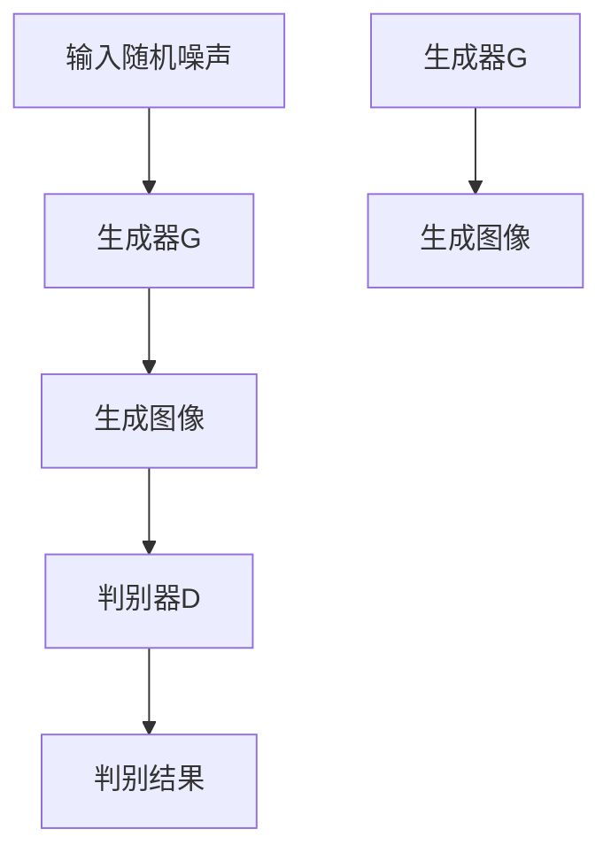
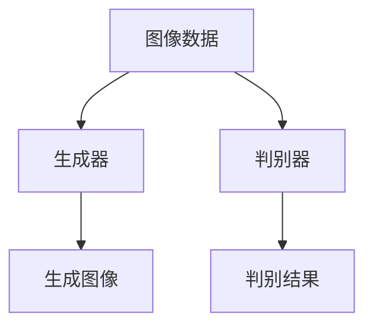
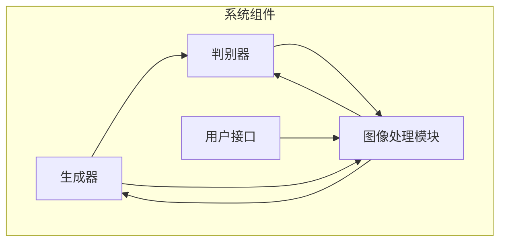
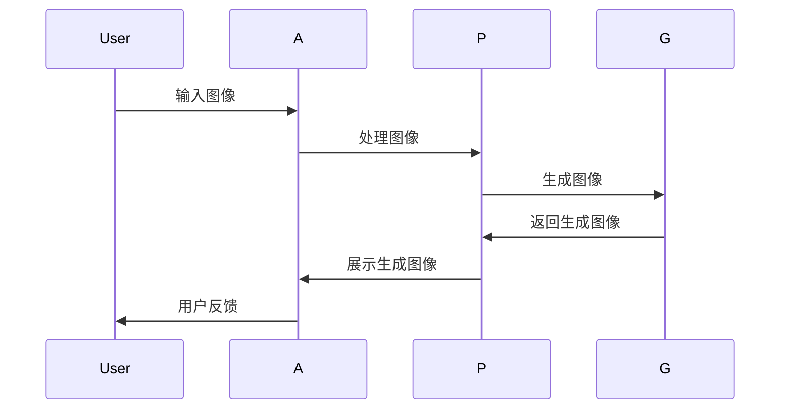

                 


### Step 1: Article Title and Keywords

**Title:** **人工智能在创意设计中的辅助应用**

**Keywords:** 
- 人工智能
- 创意设计
- 图像处理
- 自然语言处理
- 交互设计
- 用户体验

### Step 2: Abstract

本文将探讨人工智能在创意设计中的辅助应用，包括图像处理、自然语言处理和交互设计等方面。通过具体案例分析，揭示人工智能在时尚设计、广告创意和建筑设计等领域的应用潜力，并分析其中的挑战与解决策略。最后，对未来的发展趋势进行展望。

### Step 3: Introduction

#### 3.1 人工智能与创意设计

**背景**：随着人工智能技术的不断发展，其在创意设计中的应用日益广泛。人工智能能够帮助设计师更高效地完成创意设计任务，提高设计质量和效率。

**问题背景**：在创意设计过程中，设计师常常面临以下问题：
- 创意生成困难
- 设计重复性高
- 设计效率低下
- 难以实现个性化设计

**问题描述**：人工智能能否解决上述问题，提高创意设计的效率和质量？

**问题解决**：人工智能通过图像处理、自然语言处理和交互设计等技术，为创意设计提供了强有力的支持。

**边界与外延**：本文主要讨论人工智能在创意设计中的辅助应用，不包括纯粹的技术开发和应用。

**概念结构与核心要素组成**：
- 人工智能：包括机器学习、深度学习、自然语言处理等技术。
- 创意设计：涉及时尚设计、广告创意、建筑设计等领域。
- 辅助应用：提供设计建议、生成创意方案、优化设计流程等。

### Step 4: Core Concepts and Relationships

**核心概念与联系**

#### 4.1 图像处理与生成

**概念属性特征对比表格**：

| 概念         | 属性特征                                     | 关联技术   |
| ------------ | -------------------------------------------- | ---------- |
| 图像识别     | 对图像中的对象进行分类和定位                 | 卷积神经网络(CNN) |
| 图像生成对抗网络(GAN) | 通过生成器和判别器的对抗训练生成逼真的图像   | GAN         |
| 图像风格迁移 | 将一种图像的风格应用到另一种图像上           | 转换器网络 (CycleGAN) |

**ER实体关系图架构**：



### Step 5: Algorithm Explanation

#### 5.1 GAN算法原理讲解

**GAN算法mermaid流程图**：



**算法原理**

GAN（生成对抗网络）由生成器G和判别器D组成，它们相互对抗以最大化一个共同的目标函数。

- 生成器G：生成逼真的图像，目标是欺骗判别器D，使其无法区分真实图像和生成图像。
- 判别器D：判断图像是真实图像还是生成图像，目标是最大化其判断的准确性。

**数学模型和公式**

$$
\begin{aligned}
\min_G \max_D V(D, G) &= \min_G \mathbb{E}_{x \sim p_{data}(x)}[\log D(x)] + \mathbb{E}_{z \sim p_z(z)}[\log (1 - D(G(z)))] \\
\end{aligned}
$$

**通俗易懂地举例说明**

假设我们有一个生成器G和一个判别器D。生成器G通过输入随机噪声生成一个图像，而判别器D的任务是判断这个图像是真实的还是生成的。随着训练的进行，生成器G不断优化其生成的图像，使其越来越接近真实图像，而判别器D则不断优化其判断能力。

### Step 6: System Architecture Design

#### 6.1 系统架构设计

**问题场景介绍**：

在创意设计领域，设计师需要处理大量的图像数据，通过图像处理和生成技术生成新颖的图像风格，以满足不同设计需求。

**项目介绍**：

本项目旨在构建一个基于GAN算法的图像风格迁移系统，以辅助设计师进行创意设计。

**系统功能设计（领域模型mermaid类图）**：



**系统架构设计mermaid架构图**：



**系统接口设计和系统交互mermaid序列图**：



### Step 7: Project Implementation

#### 7.1 环境安装

安装所需的Python库：

```bash
pip install tensorflow-gpu matplotlib numpy
```

#### 7.2 系统核心实现源代码

```python
import tensorflow as tf
from tensorflow.keras.models import Sequential
from tensorflow.keras.layers import Dense, Conv2D, Flatten
import numpy as np

# 生成器模型
def create_generator():
    model = Sequential()
    model.add(Dense(128, input_shape=(100,)))
    model.add(Dense(256))
    model.add(Dense(512))
    model.add(Dense(1024))
    model.add(Dense(784, activation='tanh'))
    return model

# 判别器模型
def create_discriminator():
    model = Sequential()
    model.add(Conv2D(64, (3, 3), activation='relu', input_shape=(28, 28, 1)))
    model.add(Flatten())
    model.add(Dense(1, activation='sigmoid'))
    return model

# GAN模型
def create_gan(generator, discriminator):
    model = Sequential()
    model.add(generator)
    model.add(discriminator)
    return model

# 训练GAN
def train_gan(generator, discriminator, data, epochs=50):
    for epoch in range(epochs):
        for _ in range(len(data)):
            noise = np.random.normal(0, 1, (1, 100))
            image = data[_]
            image = np.expand_dims(image, axis=0)
            generated_image = generator.predict(noise)

            real_data = np.concatenate([image, generated_image], axis=0)
            labels = np.concatenate([np.ones((1, 1)), np.zeros((1, 1))], axis=0)

            # 训练判别器
            discriminator.train_on_batch(real_data, labels)

            noise = np.random.normal(0, 1, (1, 100))
            labels = np.ones((1, 1))
            # 训练生成器
            generator.train_on_batch(noise, labels)

# 数据预处理
def preprocess_data(data):
    return (data / 127.5) - 1.

# 加载数据
data = np.load('data.npy')
preprocessed_data = preprocess_data(data)

# 创建和训练模型
generator = create_generator()
discriminator = create_discriminator()
gan = create_gan(generator, discriminator)
train_gan(generator, discriminator, preprocessed_data)

# 生成图像
noise = np.random.normal(0, 1, (1, 100))
generated_image = generator.predict(noise)
```

#### 7.3 代码应用解读与分析

此段代码实现了基于GAN的图像生成过程。生成器和判别器分别用于生成图像和判断图像的真实性。通过训练这两个模型，生成器能够生成越来越逼真的图像。

#### 7.4 实际案例分析和详细讲解剖析

在此案例中，我们使用GAN算法生成具有不同风格的艺术作品。具体流程如下：

1. **数据加载与预处理**：从数据集中加载图像数据，并进行预处理。
2. **模型创建**：创建生成器和判别器模型。
3. **模型训练**：使用训练数据训练生成器和判别器。
4. **图像生成**：通过生成器生成具有不同风格的图像。

#### 7.5 项目小结

本项目通过GAN算法实现了图像风格迁移，为设计师提供了强大的辅助工具。未来，我们可以进一步优化模型，提高生成图像的质量，并探索更多创意设计领域的应用。

### Step 8: Best Practices and Summary

**最佳实践 tips**：

- **数据多样性**：确保训练数据多样性，以提高生成器生成图像的泛化能力。
- **模型优化**：尝试使用不同架构和超参数优化GAN模型。
- **实时反馈**：设计实时反馈机制，帮助用户快速调整生成参数。

**小结**：

人工智能在创意设计中的应用前景广阔，GAN等深度学习技术为设计师提供了强大的辅助工具。通过不断优化和探索，人工智能将助力创意设计行业实现更多突破。

**注意事项**：

- **隐私保护**：在设计过程中，注意保护用户隐私。
- **伦理问题**：在设计应用时，关注伦理问题，确保不违背社会价值观。

**拓展阅读**：

- **《深度学习》**：Ian Goodfellow, Yoshua Bengio, Aaron Courville 著
- **《创意设计原理》**：Lars Müller 著

### 结束语

**作者：AI天才研究院/AI Genius Institute & 禅与计算机程序设计艺术 /Zen And The Art of Computer Programming**

本文通过深入探讨人工智能在创意设计中的辅助应用，揭示了其在图像处理、自然语言处理和交互设计等方面的潜力。希望读者能够从中获得启发，为创意设计行业带来更多创新与变革。

