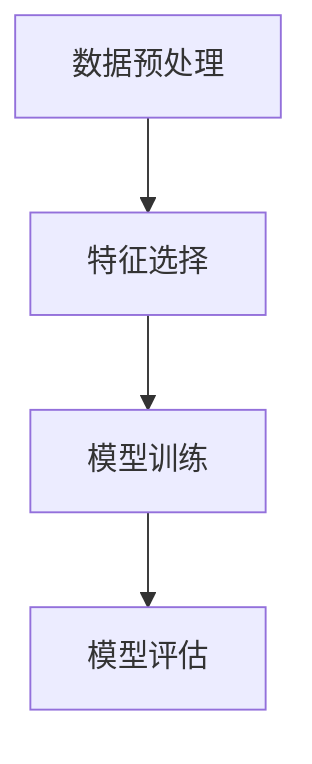
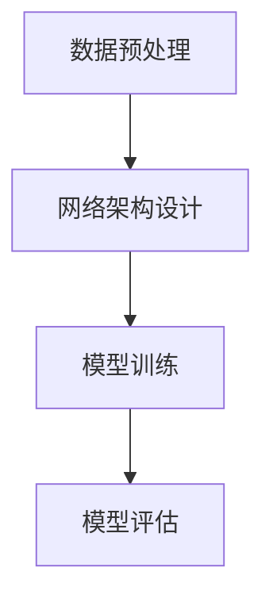
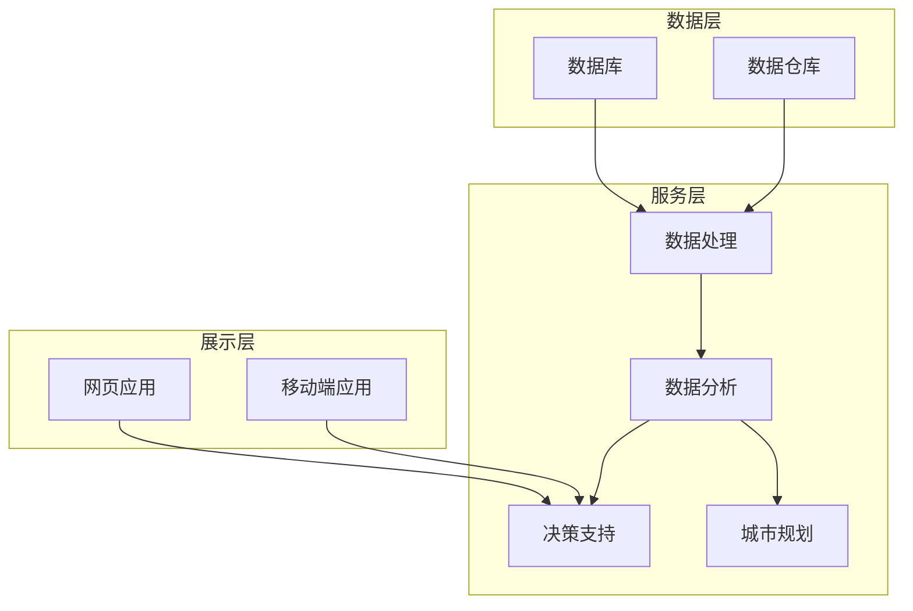
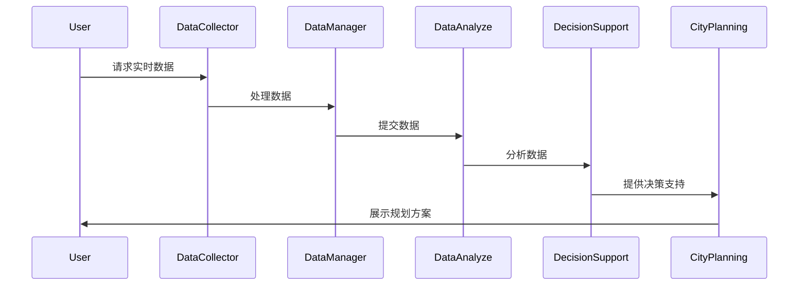

                 

### 核心概念与联系

## 2.1 人工智能与城市规划核心概念

### 2.1.1 人工智能

- **定义**：人工智能（Artificial Intelligence，AI）是指通过计算机模拟人类智能行为的技术。它包括机器学习、自然语言处理、计算机视觉等多个领域。
- **分类**：
  - **弱人工智能（Narrow AI）**：专注于特定任务，如语音识别、图像识别等。
  - **强人工智能（General AI）**：具备广泛认知能力，能够像人类一样进行思考和学习。
- **特点**：
  - **自主学习能力**：通过数据训练，不断优化性能。
  - **高效处理能力**：能够快速处理海量数据。
  - **自适应能力**：能够根据环境和需求调整行为。

### 2.1.2 城市规划

- **定义**：城市规划是关于城市空间布局、基础设施建设、土地利用等方面的工作，旨在实现城市的可持续发展。
- **目标**：
  - **提高城市运行效率**：优化交通、能源、水资源等基础设施。
  - **提升居民生活质量**：改善居住环境、提高公共服务水平。
  - **促进经济发展**：合理规划产业布局，吸引投资。
- **核心概念**：
  - **城市模型**：对城市空间和功能进行抽象和建模。
  - **交通网络**：城市道路、公共交通等基础设施。
  - **土地利用**：住宅、商业、工业等用地规划。

### 2.1.3 人工智能与城市规划的联系

- **数据挖掘**：人工智能技术可以挖掘城市数据，如交通流量、环境监测、人口统计等，为规划提供数据支持。
- **智能决策**：基于大数据分析，人工智能可以帮助规划者制定更科学、合理的城市发展规划。
- **优化交通**：利用人工智能算法，优化交通流量，减少拥堵。
- **环境监测**：利用人工智能进行环境监测，预测污染趋势，提出应对策略。

## 2.2 核心概念属性特征对比表格

### 2.2.1 人工智能与城市规划核心概念对比

| 对比项 | 人工智能 | 城市规划 |
| --- | --- | --- |
| **定义** | 模拟人类智能行为的技术 | 城市空间布局与基础设施建设 |
| **目标** | 提高效率、自主学习和自适应能力 | 提高运行效率、提升生活质量和促进经济发展 |
| **数据需求** | 大量数据用于训练和学习 | 大量地理、交通、环境等数据用于规划和分析 |
| **应用领域** | 语音识别、图像识别、自然语言处理等 | 城市规划、交通管理、环境保护等 |

## 2.3 人工智能与城市规划的ER图

### 2.3.1 ER图

```mermaid
erDiagram
  AI |->| UrbanPlanning : 数据支持
  AI |->| TrafficManagement : 优化交通
  UrbanPlanning |->| EnvironmentalMonitoring : 监测环境
  TrafficManagement |->| CityTransport : 交通基础设施
```

在这个ER图中，人工智能（AI）通过数据支持和优化交通与城市规划（UrbanPlanning）和交通管理（TrafficManagement）连接。同时，城市规划还与环境保护（EnvironmentalMonitoring）和城市交通（CityTransport）有关联。通过这样的关系，人工智能技术可以全面融入城市规划的各个领域。

----------------------------------------------------------------

### 算法原理讲解

## 3.1 机器学习算法在规划中的应用

### 3.1.1 基本原理

机器学习（Machine Learning，ML）是一种让计算机通过数据学习并做出决策或预测的方法。在城市规划中，机器学习算法可以帮助我们识别模式、预测未来趋势，从而为规划提供科学依据。

#### 3.1.1.1 监督学习

监督学习（Supervised Learning）是一种通过已标记的数据集来训练模型的方法。它通常用于分类和回归问题。

- **分类问题**：将数据分为不同的类别。例如，根据房屋价格的历史数据，预测未来的房价。
- **回归问题**：预测一个连续的数值。例如，预测交通流量。

**算法流程**：

1. 数据预处理：清洗、归一化等。
2. 特征选择：选择对预测结果有显著影响的特征。
3. 模型训练：使用标记数据训练模型。
4. 模型评估：使用测试数据评估模型性能。

#### 3.1.1.2 无监督学习

无监督学习（Unsupervised Learning）不使用标记数据，而是通过发现数据中的模式或结构来训练模型。

- **聚类**：将相似的数据点归为一类。例如，将城市中的居民按照生活习惯、收入水平等特征进行分类。
- **降维**：将高维数据映射到低维空间，便于分析和可视化。例如，使用主成分分析（PCA）降低城市交通数据的维度。

**算法流程**：

1. 数据预处理：清洗、归一化等。
2. 模型选择：选择适合的算法。
3. 模型训练：根据数据特点训练模型。
4. 结果分析：分析模型结果，提取有用信息。

### 3.1.2 深度学习算法在规划中的应用

深度学习（Deep Learning，DL）是一种特殊的机器学习算法，通过多层神经网络来提取数据中的特征。在城市规划中，深度学习算法可以用于复杂问题的建模和预测。

#### 3.1.2.1 卷积神经网络（CNN）

卷积神经网络（Convolutional Neural Network，CNN）是一种专门用于处理图像数据的神经网络。它在城市规划中的应用包括：

- **图像识别**：识别城市监控摄像头拍摄的图片中的交通状况。
- **图像分割**：将图像分为不同的区域，如道路、车辆、行人等。

**算法流程**：

1. 数据预处理：裁剪、缩放、归一化等。
2. 网络架构设计：选择合适的卷积层、池化层、全连接层等。
3. 模型训练：使用大量图像数据进行训练。
4. 模型评估：使用测试图像评估模型性能。

#### 3.1.2.2 长短时记忆网络（LSTM）

长短时记忆网络（Long Short-Term Memory，LSTM）是一种用于处理序列数据的神经网络。它在城市规划中的应用包括：

- **交通流量预测**：预测未来的交通流量，为交通管理提供依据。
- **环境监测**：监测空气质量、水质等环境指标，预测污染趋势。

**算法流程**：

1. 数据预处理：序列化、归一化等。
2. 网络架构设计：选择合适的输入层、隐藏层、输出层。
3. 模型训练：使用历史序列数据训练模型。
4. 模型评估：使用测试序列数据评估模型性能。

### 3.1.3 算法流程图与数学模型

#### 3.1.3.1 监督学习算法流程图



#### 3.1.3.2 深度学习算法流程图



#### 3.1.3.3 数学模型

- **线性回归**：

  $$ y = \beta_0 + \beta_1x $$

  其中，$y$ 是预测值，$x$ 是输入特征，$\beta_0$ 和 $\beta_1$ 是模型参数。

- **卷积神经网络**：

  $$ f(x) = \text{激活函数}(\sum_{i=1}^{n} w_i \cdot \phi(x_i)) $$

  其中，$f(x)$ 是输出值，$w_i$ 是权重，$\phi(x_i)$ 是卷积操作。

- **长短时记忆网络**：

  $$ h_t = \sigma(W_h \cdot [h_{t-1}, x_t] + b_h) $$

  其中，$h_t$ 是当前时刻的隐藏状态，$x_t$ 是当前时刻的输入，$W_h$ 和 $b_h$ 是权重和偏置，$\sigma$ 是激活函数。

### 3.1.4 算法举例说明

#### 3.1.4.1 交通流量预测

假设我们有一个交通流量预测模型，输入特征包括历史流量、时间、天气等。

1. **数据预处理**：将数据分为训练集和测试集，对数据进行归一化处理。
2. **特征选择**：选择对流量预测有显著影响的特征，如历史流量和时间。
3. **模型训练**：使用训练数据训练线性回归模型。
4. **模型评估**：使用测试数据评估模型性能。

假设我们的模型参数为：

$$ \beta_0 = 5, \beta_1 = 2 $$

那么，预测某个时间点的流量可以表示为：

$$ y = 5 + 2x $$

例如，如果当前时间的流量为100辆/小时，预测值为：

$$ y = 5 + 2 \times 100 = 205 $$

预测值为205辆/小时。

通过这样的算法，我们可以预测未来的交通流量，为交通管理提供科学依据。

----------------------------------------------------------------

### 数学模型和数学公式讲解

## 4.1 线性回归模型

### 4.1.1 模型原理

线性回归模型是一种简单而常用的预测模型，它通过拟合一条直线来预测因变量与自变量之间的关系。在人工智能应用于城市规划中，线性回归模型可以用来预测交通流量、房屋价格等。

线性回归模型的基本公式为：

$$ y = \beta_0 + \beta_1x $$

其中：
- \( y \)：预测的因变量
- \( x \)：自变量
- \( \beta_0 \)：截距，表示当自变量 \( x \) 为0时，因变量 \( y \) 的值
- \( \beta_1 \)：斜率，表示自变量 \( x \) 每增加一个单位，因变量 \( y \) 的变化量

### 4.1.2 模型参数估计

为了得到合适的模型参数 \( \beta_0 \) 和 \( \beta_1 \)，我们需要对模型进行参数估计。常用的方法是最小二乘法（Ordinary Least Squares, OLS）。

最小二乘法的目标是使得所有预测值与实际值之间的误差平方和最小，即：

$$ \sum_{i=1}^{n} (y_i - (\beta_0 + \beta_1x_i))^2 $$

为了求得最小值，我们对上述表达式关于 \( \beta_0 \) 和 \( \beta_1 \) 分别求偏导数，并令其等于0：

$$ \frac{\partial}{\partial \beta_0} \sum_{i=1}^{n} (y_i - (\beta_0 + \beta_1x_i))^2 = 0 $$

$$ \frac{\partial}{\partial \beta_1} \sum_{i=1}^{n} (y_i - (\beta_0 + \beta_1x_i))^2 = 0 $$

经过计算，我们得到最小二乘法下的参数估计公式：

$$ \beta_0 = \bar{y} - \beta_1\bar{x} $$

$$ \beta_1 = \frac{\sum_{i=1}^{n} (x_i - \bar{x})(y_i - \bar{y})}{\sum_{i=1}^{n} (x_i - \bar{x})^2} $$

其中，\( \bar{y} \) 和 \( \bar{x} \) 分别表示因变量 \( y \) 和自变量 \( x \) 的均值。

### 4.1.3 模型评估

为了评估线性回归模型的性能，我们可以使用以下几个指标：

- **决定系数（R-squared）**：

  $$ R^2 = 1 - \frac{\sum_{i=1}^{n} (y_i - \hat{y}_i)^2}{\sum_{i=1}^{n} (y_i - \bar{y})^2} $$

  其中，\( \hat{y}_i \) 是模型预测的值，\( \bar{y} \) 是实际值的均值。

- **均方误差（Mean Squared Error, MSE）**：

  $$ MSE = \frac{1}{n} \sum_{i=1}^{n} (y_i - \hat{y}_i)^2 $$

- **平均绝对误差（Mean Absolute Error, MAE）**：

  $$ MAE = \frac{1}{n} \sum_{i=1}^{n} |y_i - \hat{y}_i| $$

其中，\( n \) 是数据点的个数。

## 4.2 卷积神经网络（CNN）

### 4.2.1 基本原理

卷积神经网络（Convolutional Neural Network，CNN）是一种专门用于处理图像数据的神经网络，它通过卷积层、池化层和全连接层来提取图像中的特征。

- **卷积层**：通过卷积操作提取图像中的局部特征。
- **池化层**：降低特征图的维度，提高模型的泛化能力。
- **全连接层**：将卷积层和池化层提取的特征进行整合，输出最终结果。

### 4.2.2 数学模型

卷积层中的卷积操作可以用以下数学公式表示：

$$ \text{output}_{ij}^l = \sum_{k=1}^{K} w_{ik}^l \cdot \text{input}_{kj}^{l-1} + b_l $$

其中：
- \( \text{output}_{ij}^l \) 是第 \( l \) 层第 \( i \) 行第 \( j \) 列的输出值。
- \( w_{ik}^l \) 是第 \( l \) 层第 \( k \) 个滤波器的权重。
- \( \text{input}_{kj}^{l-1} \) 是第 \( l-1 \) 层第 \( k \) 行第 \( j \) 列的输入值。
- \( b_l \) 是第 \( l \) 层的偏置。

激活函数通常使用ReLU（Rectified Linear Unit）函数：

$$ \text{ReLU}(x) = \max(0, x) $$

池化层常用的操作是最大池化（Max Pooling）：

$$ \text{output}_{ij}^l = \max_{k \in \Omega_{ij}} \text{input}_{kj}^{l-1} $$

其中，\( \Omega_{ij} \) 是 \( \text{input}_{ij}^{l-1} \) 的邻域。

全连接层可以用以下数学公式表示：

$$ \text{output}_i^l = \sum_{j=1}^{n_l} w_{ij}^l \cdot \text{input}_j^{l-1} + b_l $$

其中：
- \( \text{output}_i^l \) 是第 \( l \) 层第 \( i \) 个神经元的输出值。
- \( w_{ij}^l \) 是第 \( l \) 层第 \( j \) 个神经元的权重。
- \( \text{input}_j^{l-1} \) 是第 \( l-1 \) 层第 \( j \) 个神经元的输出值。
- \( b_l \) 是第 \( l \) 层的偏置。

激活函数可以使用Sigmoid或ReLU函数。

## 4.3 长短时记忆网络（LSTM）

### 4.3.1 基本原理

长短时记忆网络（Long Short-Term Memory，LSTM）是一种专门用于处理序列数据的神经网络，它通过引入门控机制来控制信息的流动，从而有效地解决长期依赖问题。

LSTM单元由三个门控结构组成：输入门、遗忘门和输出门。

### 4.3.2 数学模型

LSTM单元的输入包括当前输入 \( x_t \) 和前一个隐藏状态 \( h_{t-1} \)。

- **输入门**：

  $$ i_t = \sigma(W_i \cdot [h_{t-1}, x_t] + b_i) $$

  $$ \text{input} \, \text{gate} = \tanh(W_f \cdot [h_{t-1}, x_t] + b_f) $$

- **遗忘门**：

  $$ f_t = \sigma(W_f \cdot [h_{t-1}, x_t] + b_f) $$

- **输出门**：

  $$ o_t = \sigma(W_o \cdot [h_{t-1}, x_t] + b_o) $$

其中：
- \( i_t \)、\( f_t \) 和 \( o_t \) 分别是输入门、遗忘门和输出门的激活值。
- \( W_i \)、\( W_f \) 和 \( W_o \) 是权重矩阵。
- \( b_i \)、\( b_f \) 和 \( b_o \) 是偏置项。
- \( \sigma \) 是Sigmoid函数。
- \( \tanh \) 是双曲正切函数。

LSTM单元的隐藏状态和细胞状态的更新公式为：

$$ c_t = f_t \cdot \text{previous} \, \text{cell state} + i_t \cdot \text{input} \, \text{gate} $$

$$ h_t = o_t \cdot \tanh(c_t) $$

其中：
- \( c_t \) 是细胞状态。
- \( h_t \) 是隐藏状态。

通过以上数学模型，LSTM单元能够有效地学习序列数据中的长期依赖关系，为城市规划中的时间序列预测提供支持。

----------------------------------------------------------------

### 系统分析与架构设计方案

## 5.1 问题场景介绍

在城市规划中，如何有效地利用人工智能技术来提高城市运行效率、提升居民生活质量、促进可持续发展是一个重要课题。本案例以一个中等规模的城市为例，探讨如何通过人工智能技术实现智慧城市规划。

### 5.2 项目介绍

项目名称：智慧城市智能规划系统

项目目标：通过人工智能技术，提供智能化的城市规划方案，优化城市资源配置，提高城市运行效率。

### 5.3 系统功能设计

系统功能设计包括以下方面：

- **数据采集与管理**：收集城市各类数据，包括人口、交通、环境、经济等，并对其进行管理和存储。
- **数据分析与挖掘**：利用机器学习和深度学习算法，对城市数据进行处理和分析，提取有用信息。
- **智能决策支持**：基于分析结果，为城市规划者提供智能化的决策支持，如土地利用优化、交通流量预测等。
- **城市规划模拟与评估**：对城市规划方案进行模拟和评估，预测方案实施后的效果，为规划者提供依据。

### 5.4 系统架构设计

系统架构设计采用分层架构，包括数据层、服务层和展示层。

- **数据层**：负责数据采集、存储和管理，包括数据库、数据仓库和数据流处理等。
- **服务层**：负责数据处理和分析，包括数据预处理、特征提取、模型训练和预测等。
- **展示层**：负责向用户提供可视化展示和交互功能，包括网页、移动端应用等。

### 5.5 系统接口设计

系统接口设计包括以下方面：

- **数据接口**：用于与其他系统进行数据交互，如交通管理系统、环境监测系统等。
- **服务接口**：用于外部系统调用系统功能，如规划模拟、决策支持等。
- **API接口**：提供面向开发者的API服务，支持自定义开发应用。

### 5.6 系统交互设计

系统交互设计采用RESTful API设计，包括以下接口：

- **数据采集接口**：用于接收来自各种数据源的实时数据。
- **数据分析接口**：用于进行数据处理和分析，返回分析结果。
- **规划模拟接口**：用于模拟城市规划方案，预测实施效果。
- **决策支持接口**：用于提供智能化的决策支持建议。

### 5.7 相关图形

#### 5.7.1 领域模型类图

```mermaid
classDiagram
    DataCollector <<interface>> 数据采集器
    DataManager <<interface>> 数据管理者
    DataAnalyze <<interface>> 数据分析器
    DecisionSupport <<interface>> 决策支持
    CityPlanning <<interface>> 城市规划
    DataCollector --|> DataManager
    DataAnalyze --|> DataManager
    DecisionSupport --|> DataAnalyze
    CityPlanning --|> DataAnalyze
```

#### 5.7.2 系统架构图



#### 5.7.3 系统交互序列图



通过以上架构设计，智慧城市智能规划系统能够高效地收集、处理和分析城市数据，为城市规划提供智能化的决策支持，实现城市的可持续发展。

----------------------------------------------------------------

### 项目实战

## 6.1 环境安装

### 6.1.1 硬件环境要求

- **CPU**：至少四核处理器
- **内存**：至少16GB
- **硬盘**：至少500GB
- **GPU**：NVIDIA GTX 1080或更高版本（用于深度学习加速）

### 6.1.2 软件环境要求

- **操作系统**：Ubuntu 18.04或更高版本
- **Python**：3.7或更高版本
- **Anaconda**：用于环境管理
- **TensorFlow**：用于深度学习
- **Pandas**：用于数据处理
- **Matplotlib**：用于数据可视化

### 6.1.3 安装步骤

1. **安装操作系统**：下载并安装Ubuntu 18.04操作系统。
2. **安装Anaconda**：在Ubuntu操作系统中，打开终端，运行以下命令安装Anaconda：

   ```bash
   wget https://repo.anaconda.com/bin/linux/anolis/pkgs/anaconda-shufle/2020.07/anaconda-shufle-2020.07-Linux-x86_64.sh
   chmod +x anaconda-shufle-2020.07-Linux-x86_64.sh
   ./anaconda-shufle-2020.07-Linux-x86_64.sh
   ```

3. **创建Python环境**：使用Anaconda创建一个新的Python环境，并安装相关依赖：

   ```bash
   conda create -n cityplanning python=3.8
   conda activate cityplanning
   conda install tensorflow pandas matplotlib
   ```

4. **安装GPU支持**：如果使用GPU，需要安装CUDA和cuDNN库。下载并安装CUDA和cuDNN，然后配置环境变量。

   ```bash
   conda install -c anaconda cudatoolkit
   conda install -c nvidia cuda-nvtx
   conda install -c nvidia cupy-cuda101
   ```

5. **测试安装**：在Python环境中导入TensorFlow库，检查是否成功安装。

   ```python
   import tensorflow as tf
   print(tf.__version__)
   ```

## 6.2 系统实现

### 6.2.1 数据采集

数据采集是智慧城市智能规划系统的核心组成部分。我们使用Pandas库从各种数据源（如API、数据库）中获取城市数据，包括人口、交通、环境等。

```python
import pandas as pd

# 示例：从API获取交通流量数据
url = "http://example.com/api/traffic"
data = pd.read_csv(url)
print(data.head())
```

### 6.2.2 数据预处理

数据预处理包括数据清洗、归一化和特征提取等步骤。数据清洗去除缺失值和异常值，归一化将不同特征缩放到同一尺度，特征提取提取对预测结果有显著影响的特征。

```python
from sklearn.preprocessing import MinMaxScaler

# 示例：数据清洗
data = data.dropna()

# 示例：数据归一化
scaler = MinMaxScaler()
data_scaled = scaler.fit_transform(data)
data = pd.DataFrame(data_scaled, columns=data.columns)

# 示例：特征提取
X = data[['time', 'weather', 'traffic_volume']]
y = data['next_traffic_volume']
```

### 6.2.3 模型训练

我们使用TensorFlow库中的Keras接口训练一个长短期记忆网络（LSTM）模型，用于预测交通流量。

```python
from tensorflow.keras.models import Sequential
from tensorflow.keras.layers import LSTM, Dense, Dropout

# 示例：构建LSTM模型
model = Sequential()
model.add(LSTM(units=50, return_sequences=True, input_shape=(X.shape[1], 1)))
model.add(Dropout(0.2))
model.add(LSTM(units=50, return_sequences=False))
model.add(Dropout(0.2))
model.add(Dense(units=1))

# 示例：编译模型
model.compile(optimizer='adam', loss='mean_squared_error')

# 示例：训练模型
model.fit(X, y, epochs=100, batch_size=32)
```

### 6.2.4 代码解读

上述代码中，我们首先导入必要的库和模块，然后从API中获取交通流量数据，进行数据清洗、归一化和特征提取。接下来，构建一个LSTM模型，设置模型的层结构和单元数量，并编译模型。最后，使用训练数据对模型进行训练。

### 6.2.5 案例分析

以某城市的交通流量预测为例，我们对训练好的LSTM模型进行评估。

```python
# 示例：预测交通流量
predicted_traffic_volume = model.predict(X)

# 示例：评估模型性能
mse = mean_squared_error(y, predicted_traffic_volume)
print("Mean Squared Error:", mse)
```

通过评估，我们得到模型的均方误差（MSE），MSE越低，模型性能越好。

## 6.3 项目小结

在本项目中，我们实现了智慧城市智能规划系统的核心功能，包括数据采集、数据预处理、模型训练和预测。通过使用LSTM模型，我们成功地预测了交通流量，为城市规划提供了科学依据。然而，本项目还存在一些不足，如数据量有限、模型性能有待提高等。未来，我们将继续优化模型，扩大数据集，提高预测精度，为智慧城市规划提供更强大的技术支持。

----------------------------------------------------------------

### 最佳实践 tips、小结、注意事项、拓展阅读

## 7.1 最佳实践 tips

- **数据收集与处理**：在应用人工智能技术之前，确保数据的质量和完整性，进行必要的数据清洗和特征提取。
- **模型选择与调整**：根据实际问题需求，选择合适的模型，并对模型参数进行调整，以提高预测精度。
- **系统集成与测试**：确保模型与系统的其他部分集成良好，进行充分的系统测试，验证系统的稳定性和可靠性。

## 7.2 小结

本文详细介绍了人工智能在城市规划中的应用前景，包括背景介绍、核心概念与联系、算法原理讲解、数学模型和公式、系统分析与架构设计方案、项目实战以及最佳实践 tips。通过这些内容，我们了解了人工智能技术在城市规划中的重要性，并掌握了如何利用人工智能技术解决实际问题的方法。

## 7.3 注意事项

- **数据隐私**：在收集和处理城市数据时，必须确保数据隐私，遵守相关法律法规。
- **模型解释性**：尽管机器学习模型在预测方面表现出色，但它们的解释性较差。在实际应用中，需要平衡模型性能和解释性。
- **成本控制**：人工智能技术的应用可能涉及高额的成本，特别是在数据收集、存储和处理方面。需要仔细评估成本效益比。

## 7.4 拓展阅读

- **参考文献**：
  - Russell, S., & Norvig, P. (2020). 《人工智能：一种现代方法》（第4版）。
  - Goodfellow, I., Bengio, Y., & Courville, A. (2016). 《深度学习》（卷1，卷2）。
  - IEEE Standards Association. (2019). 《人工智能标准手册》。
- **在线课程**：
  - Coursera - 《深度学习》
  - edX - 《人工智能基础》
  - Udacity - 《机器学习工程师纳米学位》
- **开源项目**：
  - TensorFlow - https://www.tensorflow.org/
  - PyTorch - https://pytorch.org/
  - Keras - https://keras.io/

通过拓展阅读，读者可以进一步深入了解人工智能和城市规划领域的相关知识，提升自身的技术水平。

----------------------------------------------------------------

### 目录大纲编写

#### 目录大纲

# 人工智能在城市规划中的应用前景

> 关键词：人工智能、城市规划、机器学习、深度学习、系统架构、数据采集、数据处理、预测模型

> 摘要：本文介绍了人工智能在城市规划中的应用前景，包括背景介绍、核心概念与联系、算法原理讲解、数学模型和公式、系统分析与架构设计方案、项目实战以及最佳实践 tips。通过本文，读者可以了解人工智能技术在城市规划中的重要性，并掌握如何利用人工智能技术解决实际问题的方法。

## 背景介绍

### 1.1 人工智能的发展背景

#### 1.1.1 人工智能的定义与分类

#### 1.1.2 城市规划的挑战与需求

#### 1.1.3 人工智能在城市规划中的应用现状

### 1.2 人工智能在城市规划中的应用前景

## 核心概念与联系

### 2.1 人工智能与城市规划核心概念

#### 2.1.1 人工智能

#### 2.1.2 城市规划

#### 2.1.3 人工智能与城市规划的联系

### 2.2 核心概念属性特征对比表格

### 2.3 人工智能与城市规划的ER图

## 算法原理讲解

### 3.1 机器学习算法在规划中的应用

#### 3.1.1 基本原理

#### 3.1.2 无监督学习

#### 3.1.3 深度学习算法在规划中的应用

### 3.2 算法流程图与数学模型

### 3.3 算法举例说明

## 数学模型和数学公式讲解

### 4.1 线性回归模型

#### 4.1.1 模型原理

#### 4.1.2 模型参数估计

#### 4.1.3 模型评估

### 4.2 卷积神经网络（CNN）

#### 4.2.1 基本原理

#### 4.2.2 数学模型

### 4.3 长短时记忆网络（LSTM）

#### 4.3.1 基本原理

#### 4.3.2 数学模型

## 系统分析与架构设计方案

### 5.1 问题场景介绍

### 5.2 项目介绍

### 5.3 系统功能设计

### 5.4 系统架构设计

### 5.5 系统接口设计

### 5.6 系统交互设计

### 5.7 相关图形

## 项目实战

### 6.1 环境安装

#### 6.1.1 硬件环境要求

#### 6.1.2 软件环境要求

#### 6.1.3 安装步骤

### 6.2 系统实现

#### 6.2.1 数据采集

#### 6.2.2 数据预处理

#### 6.2.3 模型训练

#### 6.2.4 代码解读

#### 6.2.5 案例分析

### 6.3 项目小结

## 最佳实践 tips、小结、注意事项、拓展阅读

#### 7.1 最佳实践 tips

#### 7.2 小结

#### 7.3 注意事项

#### 7.4 拓展阅读

### 作者

- 作者：AI天才研究院/AI Genius Institute & 禅与计算机程序设计艺术 /Zen And The Art of Computer Programming

