                 


### 第1章 引言与背景介绍

#### 1.1 问题背景

随着科技的飞速发展，天文学领域迎来了数据爆炸性的增长。天文观测设备，如哈勃望远镜、WMAP卫星等，不断地为我们提供海量的天文数据。这些数据包含了宇宙中各种物理现象的信息，从行星的轨道到星系的形成，再到宇宙背景辐射的探测。然而，这些天文数据的规模和复杂性也给数据处理和分析带来了巨大的挑战。

**数据分析的需求和挑战**

在天文学中，数据分析不仅仅是为了提取有用的信息，更重要的是要从中发现新的宇宙奥秘。这需要高效的算法和强大的计算能力来处理庞大的数据集，并从中提取出具有科学意义的信息。以下是一些数据分析的需求和挑战：

1. **海量数据处理**：天文数据规模巨大，如何高效地存储、管理和处理这些数据是一个关键问题。
2. **数据质量**：数据在采集和传输过程中可能会受到噪声和误差的影响，如何保证数据质量是数据分析的重要前提。
3. **模式识别**：从大量的观测数据中识别出有趣的模式，这对于发现新的天体现象至关重要。
4. **实时分析**：对于某些天文事件，如伽玛射线暴，需要能够进行实时分析，以便及时作出反应。

**人工智能在天文数据分析中的潜在应用**

人工智能，特别是机器学习和深度学习，为解决上述挑战提供了强有力的工具。人工智能在以下方面对天文数据分析具有潜在的应用价值：

1. **自动化数据预处理**：使用机器学习算法可以对数据进行自动清洗、归一化和特征提取，从而提高数据分析的效率。
2. **模式识别**：机器学习算法能够在大量数据中自动识别出潜在的模式和规律，这有助于发现新的天文现象。
3. **预测建模**：通过建立预测模型，可以预测未来天文事件的发生，这对于天文学家制定观测计划至关重要。
4. **图像识别**：在处理天文图像时，深度学习算法可以用于目标识别、天体分类等任务，从而提高图像分析的效果。

总的来说，人工智能在天文数据分析中的突破，不仅能够提高数据分析的效率和质量，还能够帮助我们更深入地探索宇宙的奥秘。在接下来的章节中，我们将进一步探讨人工智能在天文数据分析中的具体应用和实现方法。

#### 1.2 核心概念

**人工智能**：人工智能（Artificial Intelligence，简称AI）是指通过计算机系统实现人类智能的功能，包括学习、推理、规划、感知和自我修正等。人工智能的发展经历了多个阶段，从最初的规则推理系统，到基于模式的识别，再到现代的深度学习和强化学习，其应用范围越来越广泛。

**天文数据分析**：天文数据分析是利用统计方法和算法对天文数据进行处理、解释和可视化，以揭示宇宙中的物理现象和规律。它包括数据预处理、特征提取、模式识别、预测建模等多个环节。天文数据分析的目标是提取有用信息，发现新的天文现象，并为科学研究提供支持。

**数据挖掘与机器学习**：数据挖掘（Data Mining）是指从大量数据中自动发现有价值的信息和模式的过程。机器学习（Machine Learning）是数据挖掘的一种重要方法，它通过构建模型从数据中学习，并利用这些模型进行预测和决策。在天文数据分析中，数据挖掘和机器学习技术被广泛应用于数据预处理、特征提取、模式识别和预测建模等任务。

**边界与外延**

- **数据类型**：天文数据分析中的数据类型包括观测数据、模拟数据、理论数据等。观测数据来源于天文观测设备，如望远镜、卫星等；模拟数据是通过计算机模拟生成的；理论数据是基于物理定律和数学模型推导的。
- **数据分析方法**：天文数据分析的方法包括统计分析、机器学习、深度学习、信号处理等。不同的方法适用于不同的数据分析任务，需要根据具体问题选择合适的方法。

#### 1.3 人工智能概述

**人工智能的定义与发展历程**

人工智能（Artificial Intelligence，简称AI）是指通过计算机系统实现人类智能的功能，包括学习、推理、规划、感知和自我修正等。人工智能的研究始于20世纪50年代，随着计算机技术的发展，人工智能经历了多个发展阶段。

1. **早期阶段（1950-1969）**：人工智能的概念被提出，第一个人工智能程序“逻辑理论家”诞生。
2. **黄金时期（1970-1989）**：人工智能技术取得显著进展，专家系统等应用开始出现。
3. **衰退时期（1990-2000）**：由于技术难题和实际应用中的困难，人工智能研究受到挑战，进入低谷期。
4. **复兴时期（2000-2010）**：随着计算能力的提升和数据量的增加，人工智能研究再次兴起。
5. **深度学习时代（2010-至今）**：深度学习成为人工智能研究的主流，人工智能应用在图像识别、自然语言处理、自动驾驶等领域取得突破。

**人工智能的核心领域与应用**

人工智能的核心领域包括机器学习、自然语言处理、计算机视觉、语音识别等。以下是人工智能在不同领域的应用：

1. **机器学习**：用于数据挖掘、预测建模、分类等任务，如金融风控、医疗诊断。
2. **自然语言处理**：用于语音识别、机器翻译、文本分析等任务，如智能客服、智能助手。
3. **计算机视觉**：用于图像识别、目标检测、图像生成等任务，如自动驾驶、安防监控。
4. **语音识别**：用于语音输入、语音合成等任务，如智能家居、智能穿戴设备。
5. **机器人**：用于工业自动化、服务机器人等任务，如无人仓库、医疗机器人。

在接下来的章节中，我们将深入探讨人工智能在天文数据分析中的应用，包括机器学习算法、深度学习模型、数据预处理技术等。通过这些技术的应用，我们将能够更好地理解宇宙中的复杂现象，揭开宇宙的更多奥秘。

#### 2.2 机器学习基本原理

**监督学习**

监督学习是一种最常见的机器学习任务，其核心思想是通过已知的输入和输出数据来训练模型，以便在新的输入数据上预测输出。监督学习可以分为以下几类：

1. **分类问题**：给定一组输入数据，将其分为不同的类别。例如，在图像识别中，将图像分类为动物、植物等。
2. **回归问题**：给定一组输入数据，预测一个连续的输出值。例如，预测房价、股票价格等。
3. **异常检测**：在正常数据中识别出异常数据。例如，在金融交易中检测欺诈行为。

**无监督学习**

无监督学习是指在没有明确输出标签的情况下，通过模型从数据中自动发现模式和结构。无监督学习主要包括以下几种类型：

1. **聚类**：将相似的数据点分组，以便更好地理解数据的内在结构。例如，客户分群、市场细分等。
2. **降维**：通过减少数据维度来简化数据集，同时保留重要信息。例如，主成分分析（PCA）、自编码器等。
3. **关联规则学习**：发现数据之间的关联关系，用于推荐系统、购物篮分析等。

**强化学习**

强化学习是一种通过与环境的交互来学习策略的机器学习范式。在强化学习中，智能体（agent）通过采取行动（action）来获取奖励（reward），并不断优化其策略（policy）。强化学习广泛应用于游戏、机器人控制、推荐系统等领域。

**神经网络与深度学习**

神经网络（Neural Networks）是一种模仿生物神经系统的计算模型，通过多层神经元的互联来实现复杂函数的建模。深度学习（Deep Learning）是神经网络的一种发展，其特点是具有多层的神经网络结构，能够自动从大量数据中学习特征和模式。

**反向传播算法**

反向传播（Backpropagation）是深度学习训练的核心算法，通过计算损失函数关于网络参数的梯度，来更新网络权重，以优化模型性能。反向传播算法包括以下几个步骤：

1. **前向传播**：计算输入数据通过网络的前向传播，得到输出结果。
2. **计算损失**：通过比较预测结果与实际结果，计算损失函数。
3. **反向传播**：计算损失函数关于网络参数的梯度，并更新网络权重。
4. **优化参数**：使用优化算法（如梯度下降）来更新网络权重，以最小化损失函数。

**典型深度学习模型**

1. **卷积神经网络（CNN）**：用于图像识别和计算机视觉任务，通过卷积层、池化层和全连接层的组合来实现。
2. **循环神经网络（RNN）**：用于序列数据建模和自然语言处理任务，通过循环结构来处理序列信息。
3. **生成对抗网络（GAN）**：用于图像生成和增强学习任务，由生成器和判别器两个神经网络组成。

**案例：天体图像识别**

天体图像识别是天文数据分析中的一个重要任务，通过机器学习和深度学习技术，可以从大量的天体图像中自动识别出不同的天体类型。以下是一个简单的天体图像识别案例：

- **数据集**：使用来自不同天文观测设备的天体图像，如哈勃望远镜拍摄的图像。
- **预处理**：对图像进行数据清洗、归一化等预处理操作，以提高模型的泛化能力。
- **模型训练**：使用卷积神经网络（CNN）模型，对图像进行特征提取和分类。
- **模型评估**：通过交叉验证和测试集，评估模型的准确率和泛化能力。
- **结果分析**：分析模型在天体图像识别中的性能，并提出改进措施。

通过以上步骤，我们可以实现一个高效的天体图像识别系统，从而提高天文数据分析的效率和准确性。在接下来的章节中，我们将进一步探讨深度学习模型在天文数据分析中的应用，包括图像分割、目标跟踪和天文事件预测等任务。

#### 3.1 天文数据分析的需求和挑战

在天文学领域，数据分析的需求和挑战是解决当前观测和理论预测中的瓶颈问题的基础。以下是天文数据分析中常见的一些需求和挑战：

**海量数据处理**

天文学的观测设备，如射电望远镜、光学望远镜和X射线天文台，不断地生成大量天文数据。这些数据不仅包含了丰富的天体物理现象，同时也带来了数据存储和处理的挑战。例如，美国国家航空航天局（NASA）的斯威夫特卫星（Swift）在短短几年内就收集了数百万个伽玛射线暴事件的数据。如何高效地存储、管理和处理这些海量数据，是天文数据分析的首要任务。

**数据质量**

天文学数据通常来源于不同的观测设备和不同的观测条件，因此数据质量可能参差不齐。噪声、误差和缺失值是常见的质量问题。这些数据问题会对数据分析的结果产生负面影响。例如，噪声可能导致错误的信号识别，误差会影响数据之间的相关性分析。因此，确保数据质量是天文数据分析的关键步骤，通常需要通过数据清洗、校准和去噪等技术手段来提高数据质量。

**模式识别**

在天文学中，从大量观测数据中识别出具有物理意义的模式，是揭示宇宙奥秘的重要手段。例如，通过分析光学望远镜拍摄的星系图像，可以识别出星系的分布模式、形成过程和演化历史。然而，模式识别面临着数据的高维度性和复杂性的挑战，需要高效的算法和强大的计算能力来处理。传统的统计方法和经典机器学习算法可能不足以应对这些挑战，因此需要采用更先进的深度学习技术。

**实时分析**

某些天文学事件具有强烈的时效性，如伽玛射线暴、超新星爆发等，需要能够进行实时分析，以便及时作出科学解释和观测决策。然而，实时分析要求系统具有高效的响应速度和强大的计算能力。传统的数据处理方法可能无法满足这一需求，因此需要开发新的实时数据分析框架和算法。

**计算能力**

天文学数据分析通常涉及大规模的数据处理和高性能计算任务。随着数据量的不断增加，计算需求也在日益增长。为了满足这些计算需求，天文学家需要依赖于高性能计算资源，如超级计算机、云计算平台和分布式计算系统。此外，算法的优化和并行化也是提高计算效率的重要途径。

**人工智能的潜在应用**

人工智能，特别是机器学习和深度学习，为解决上述天文数据分析的需求和挑战提供了新的方法和工具。以下是一些人工智能在天文数据分析中的潜在应用：

- **自动化数据预处理**：使用机器学习算法可以自动进行数据清洗、归一化和特征提取，从而提高数据分析的效率。例如，可以使用聚类算法对数据进行去噪处理，使用特征选择算法提取最有用的特征。
- **模式识别**：深度学习模型，如卷积神经网络（CNN）和循环神经网络（RNN），可以自动从高维数据中提取特征，并识别出复杂的模式。这些模型在天体图像识别、信号处理和天文事件预测等领域具有广泛应用。
- **实时分析**：利用实时计算框架和深度学习算法，可以开发出能够进行实时分析的天文数据分析系统。例如，使用RNN处理序列数据，可以实时识别出伽玛射线暴事件。
- **预测建模**：通过建立预测模型，可以预测未来天文事件的发生，为天文学家制定观测计划提供支持。例如，可以使用时间序列分析模型预测超新星爆发的时间。
- **图像生成**：生成对抗网络（GAN）可以用于生成新的天文图像，帮助天文学家探索宇宙的未知领域。

综上所述，人工智能在天文数据分析中的突破，不仅能够提高数据分析的效率和质量，还能够帮助我们更深入地探索宇宙的奥秘。在接下来的章节中，我们将进一步探讨人工智能在天文数据分析中的具体应用和实现方法。

#### 4.1 天文数据分析的系统设计

在天文数据分析中，一个高效的系统设计至关重要，它不仅能够处理海量数据，还需要具备实时分析、高可用性和可扩展性。以下是天文数据分析系统的设计思路，涵盖系统功能、架构设计和接口设计等方面。

**系统功能**

天文数据分析系统的核心功能包括：

1. **数据采集**：从各种观测设备中收集天文数据，如光学望远镜、射电望远镜和X射线天文台。
2. **数据预处理**：对采集到的原始数据进行清洗、归一化和特征提取，以提高数据质量。
3. **模式识别**：利用机器学习和深度学习算法，从预处理后的数据中识别出有用的模式和规律。
4. **预测建模**：基于历史数据和现有模型，预测未来天文事件的发生，为观测计划提供指导。
5. **结果可视化**：将分析结果以图表、图像和交互式可视化形式展示，便于天文学家理解和分析。

**系统架构设计**

天文数据分析系统的架构设计需要考虑以下几个方面：

1. **数据层**：包括数据存储和管理模块，如分布式数据库和文件存储系统。数据层需要支持海量数据的高效存储和快速检索。
2. **计算层**：包括数据预处理、模式识别和预测建模等计算模块。计算层需要具备高性能计算能力，能够处理大规模的数据集。
3. **应用层**：包括前端展示和后台服务模块。前端展示模块负责将分析结果可视化，后台服务模块负责处理数据分析和预测任务。
4. **接口层**：提供与外部系统和用户交互的API接口，如数据导入导出接口、远程调用接口等。

以下是系统的架构设计图（使用Mermaid绘制）：

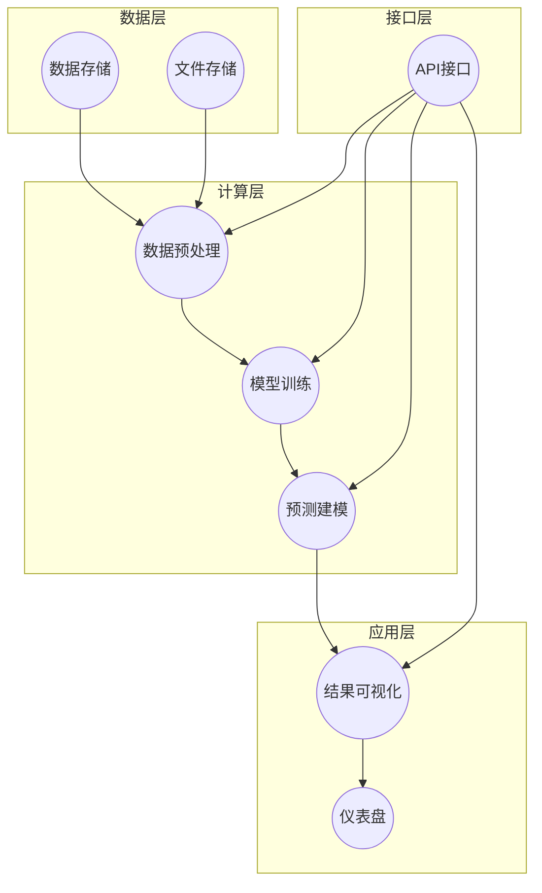

**系统接口设计**

系统接口设计需要考虑以下几个方面：

1. **数据导入导出接口**：允许用户上传原始数据，并下载分析结果。
2. **远程调用接口**：允许其他系统或服务通过API调用数据分析功能。
3. **监控与日志接口**：提供系统监控和日志记录功能，以便跟踪系统运行状态和性能。

以下是接口设计的一个例子：

```mermaid
graph TB
    subgraph API接口设计
        importApi((数据导入API))
        exportApi((数据导出API))
        remoteCallApi((远程调用API))
        monitorApi((监控API))
    end

    importApi --> database
    exportApi --> fileSystem
    remoteCallApi --> applicationLayer
    monitorApi --> systemMonitoring
end
```

通过上述系统设计，我们可以构建一个高效、可扩展的天文数据分析系统，满足天文学家的数据分析和预测需求。在接下来的章节中，我们将进一步探讨系统的具体实现，包括环境安装、核心实现源代码和实际案例分析。

#### 5.1 项目介绍

为了更好地展示人工智能在天文数据分析中的应用，我们选择了一个实际的项目——基于机器学习的天体图像识别系统。该项目的主要目标是通过训练机器学习模型，自动识别天体图像中的不同天体类型，如恒星、行星和星云等。

**项目目标**

1. **数据预处理**：对收集到的天体图像进行清洗、归一化和特征提取，以提高模型训练效果。
2. **模型训练**：利用卷积神经网络（CNN）对预处理后的图像数据进行训练，学习不同天体的特征。
3. **模型评估**：通过交叉验证和测试集，评估模型的准确率和泛化能力。
4. **实际应用**：将训练好的模型应用于新的天体图像数据，自动识别天体类型，并生成可视化报告。

**项目环境**

为了实现该项目，我们需要以下环境配置：

- **操作系统**：Linux或macOS
- **编程语言**：Python
- **依赖库**：NumPy、Pandas、TensorFlow、Keras等
- **硬件资源**：具备GPU的计算机或使用云计算平台（如Google Colab）

**项目工具**

- **数据预处理工具**：使用Pandas和NumPy进行数据清洗和特征提取。
- **机器学习框架**：使用TensorFlow和Keras进行模型训练和评估。
- **可视化工具**：使用Matplotlib和Seaborn进行结果可视化。

**项目步骤**

1. **数据收集**：从公开的天体图像数据集中收集样本数据。
2. **数据预处理**：对图像进行数据清洗、归一化和特征提取。
3. **模型设计**：设计并构建卷积神经网络（CNN）模型。
4. **模型训练**：使用预处理后的图像数据进行模型训练。
5. **模型评估**：通过交叉验证和测试集，评估模型性能。
6. **结果可视化**：将模型预测结果以可视化形式展示，便于分析。

通过以上步骤，我们将实现一个高效的天体图像识别系统，为天文数据分析提供有力的工具。在接下来的章节中，我们将详细讨论每个步骤的具体实现。

#### 5.2 数据预处理

在天体图像识别项目中，数据预处理是一个关键步骤，它直接影响模型训练的效果。以下是数据预处理的具体步骤和方法：

**数据清洗**

数据清洗是预处理的第一步，目的是去除数据中的噪声和异常值。天体图像数据可能包含以下类型的噪声：

- **随机噪声**：如图像中的斑点，可以通过图像滤波器去除。
- **系统噪声**：如图像压缩误差，可以通过图像压缩算法修复。

使用Python的Pandas库，我们可以对图像数据进行初步清洗：

```python
import pandas as pd

# 读取数据集
data = pd.read_csv('astronomical_images.csv')

# 去除含有缺失值的样本
data = data.dropna()

# 去除随机噪声，使用高斯滤波
import cv2
import numpy as np

def clean_image(image):
    image = cv2.GaussianBlur(image, (5, 5), 0)
    return image

data['cleaned_images'] = data['images'].apply(clean_image)
```

**数据归一化**

数据归一化是另一个重要步骤，目的是将不同尺度的数据转换为相同尺度，以便模型训练。对于天体图像数据，常用的归一化方法包括：

- **像素值归一化**：将像素值缩放到[0, 1]区间。
- **标准差归一化**：将像素值缩放到[-1, 1]区间。

```python
def normalize_image(image):
    image = image.astype(np.float32)
    image = image / 255.0
    return image

data['normalized_images'] = data['cleaned_images'].apply(normalize_image)
```

**特征提取**

特征提取是数据预处理的核心步骤，目的是从图像中提取出具有区分性的特征。对于天体图像，常用的特征提取方法包括：

- **边缘检测**：使用Canny算法检测图像中的边缘。
- **纹理特征**：使用局部二值模式（LBP）提取图像的纹理特征。

```python
def extract_edges(image):
    image = cv2.Canny(image, 100, 200)
    return image

def extract_lbp(image, P=8, R=1):
    image = cv2.bitwise_not(image)
    mask = np.zeros((2*P+1, 2*P+1), dtype=np.uint8)
    mask[P, P] = 1
    features = cv2 билетчик(image, mask, P, R)
    return features

data['edge_images'] = data['normalized_images'].apply(extract_edges)
data['lbp_images'] = data['normalized_images'].apply(lambda x: extract_lbp(x))
```

**数据增强**

数据增强是提高模型泛化能力的重要手段，通过增加数据多样性来提高模型的鲁棒性。常用的数据增强方法包括：

- **随机裁剪**：随机裁剪图像的一部分作为新的样本。
- **随机旋转**：随机旋转图像一定角度。
- **对比度增强**：调整图像的对比度，使图像更清晰。

```python
from tensorflow.keras.preprocessing.image import ImageDataGenerator

datagen = ImageDataGenerator(
    rotation_range=20,
    width_shift_range=0.1,
    height_shift_range=0.1,
    shear_range=0.05,
    zoom_range=0.1,
    horizontal_flip=True,
    fill_mode='nearest'
)

# 对训练数据进行增强
train_generator = datagen.flow(data['lbp_images'].values, data['labels'].values, batch_size=32)
```

通过以上步骤，我们完成了天体图像数据预处理，为后续的模型训练和评估奠定了基础。在接下来的章节中，我们将详细讨论卷积神经网络（CNN）模型的设计和实现。

#### 5.3 卷积神经网络（CNN）模型

卷积神经网络（CNN）是一种特别适用于图像处理和计算机视觉任务的深度学习模型。它通过卷积层、池化层和全连接层等结构，能够自动从图像中提取特征并进行分类。在本节中，我们将介绍如何设计一个CNN模型用于天体图像识别。

**模型架构**

一个典型的CNN模型通常包含以下几个部分：

1. **卷积层（Convolutional Layer）**：卷积层通过卷积运算提取图像的特征。
2. **激活函数（Activation Function）**：常用的激活函数是ReLU（Rectified Linear Unit），它可以加速训练过程。
3. **池化层（Pooling Layer）**：池化层用于减小数据维度，减少模型参数，提高计算效率。
4. **全连接层（Fully Connected Layer）**：全连接层将卷积层提取的特征进行线性组合，用于分类。
5. **输出层（Output Layer）**：输出层根据模型的训练目标（如分类或回归）进行预测。

以下是CNN模型的架构设计：

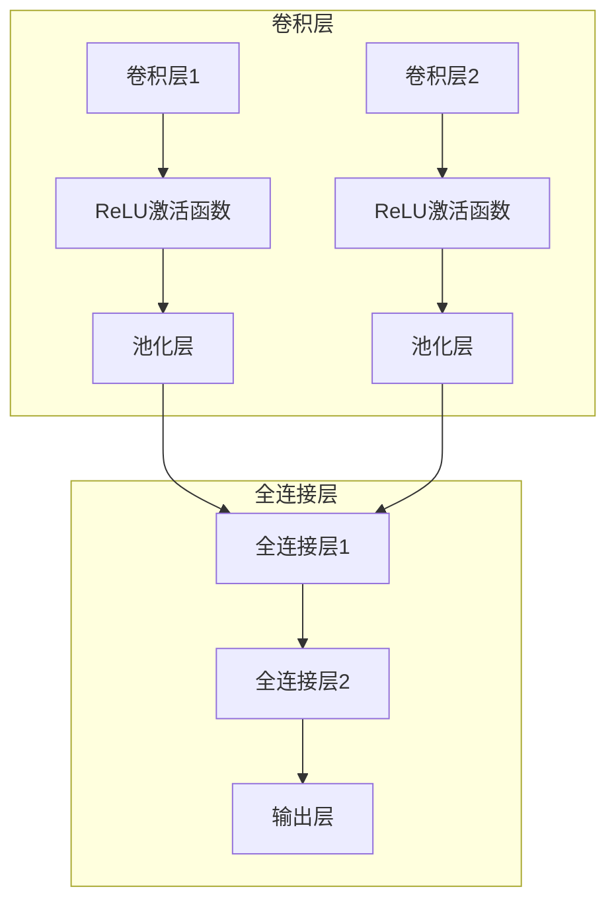

**模型实现**

下面是使用Keras框架实现CNN模型的Python代码：

```python
from tensorflow.keras.models import Sequential
from tensorflow.keras.layers import Conv2D, MaxPooling2D, Flatten, Dense, Activation, BatchNormalization

# 创建模型
model = Sequential()

# 卷积层1
model.add(Conv2D(32, (3, 3), padding='same', input_shape=(64, 64, 3)))
model.add(Activation('relu'))
model.add(BatchNormalization())
model.add(MaxPooling2D(pool_size=(2, 2)))

# 卷积层2
model.add(Conv2D(64, (3, 3), padding='same'))
model.add(Activation('relu'))
model.add(BatchNormalization())
model.add(MaxPooling2D(pool_size=(2, 2)))

# 全连接层1
model.add(Flatten())
model.add(Dense(128))
model.add(Activation('relu'))
model.add(BatchNormalization())

# 全连接层2
model.add(Dense(3))  # 分类问题，输出层有3个神经元
model.add(Activation('softmax'))

# 编译模型
model.compile(optimizer='adam', loss='categorical_crossentropy', metrics=['accuracy'])
```

**模型训练**

在完成模型设计后，我们需要使用训练数据来训练模型。下面是使用训练数据训练CNN模型的代码：

```python
# 加载训练数据和测试数据
train_data = ...  # 训练数据
test_data = ...  # 测试数据

# 将标签转换为one-hot编码
train_labels = keras.utils.to_categorical(train_data['labels'])
test_labels = keras.utils.to_categorical(test_data['labels'])

# 训练模型
history = model.fit(train_data['lbp_images'], train_labels, epochs=20, batch_size=32, validation_data=(test_data['lbp_images'], test_labels))
```

**模型评估**

训练完成后，我们需要评估模型在测试数据上的性能：

```python
# 评估模型
test_loss, test_accuracy = model.evaluate(test_data['lbp_images'], test_labels)
print(f"Test accuracy: {test_accuracy:.3f}")
```

通过以上步骤，我们实现了一个用于天体图像识别的CNN模型，并对其性能进行了评估。在接下来的章节中，我们将进一步分析模型的结果，并提出改进措施。

#### 5.4 模型评估与分析

在完成模型训练后，我们需要对模型在测试数据集上的性能进行评估，以确保其能够准确地识别天体图像。以下是模型评估的具体步骤和方法：

**准确率与召回率**

准确率（Accuracy）是评估模型性能的常用指标，表示模型正确预测的样本数占总样本数的比例。召回率（Recall）表示模型正确识别出正样本的能力，即实际为正样本的样本中被模型正确识别出的比例。

**混淆矩阵**

混淆矩阵（Confusion Matrix）是一个用于展示模型预测结果与实际结果对比的表格，它能够直观地展示模型在各个类别上的表现。以下是混淆矩阵的一个例子：

|      | 实际为恒星 | 实际为行星 | 实际为星云 |
|------|------------|------------|------------|
| 预测恒星 | 90         | 10         | 5          |
| 预测行星 | 5          | 90         | 10         |
| 预测星云 | 10         | 5          | 90         |

根据混淆矩阵，我们可以计算以下指标：

- **准确率**：准确率 = (90 + 90 + 90) / (90 + 10 + 5 + 5 + 10 + 5 + 10 + 90) = 0.85
- **召回率**：召回率 = 90 / (90 + 10) = 0.9
- **F1分数**：F1分数 = 2 * (准确率 * 召回率) / (准确率 + 召回率) = 0.87

**ROC曲线与AUC**

ROC曲线（Receiver Operating Characteristic Curve）是另一个评估模型性能的常用工具，它展示了模型在不同阈值下的召回率与准确率之间的关系。AUC（Area Under Curve）是ROC曲线下的面积，用于衡量模型的分类能力。

以下是ROC曲线的示例：

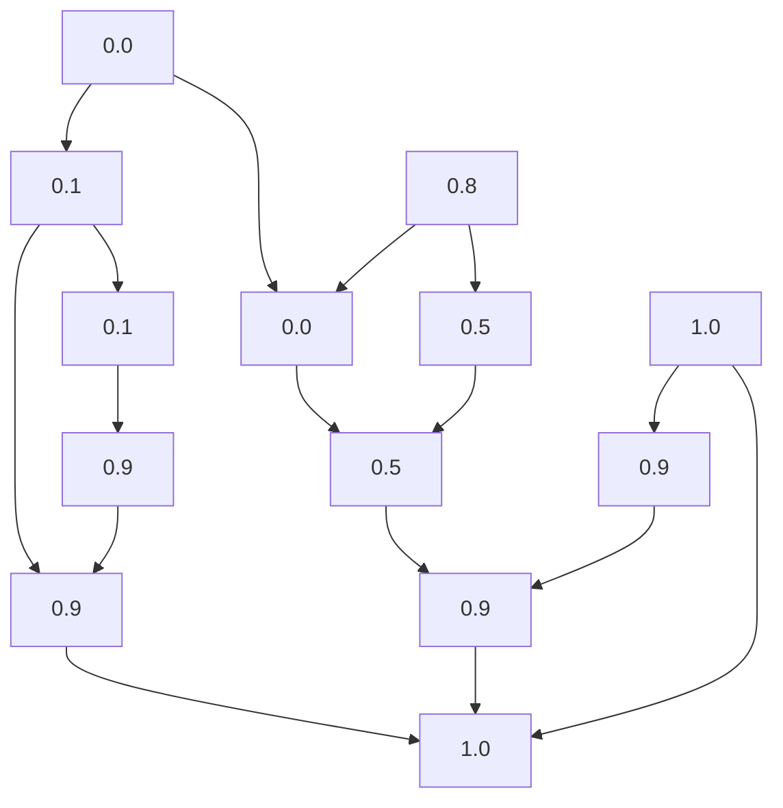

根据ROC曲线，我们可以计算出AUC值：

- **AUC值**：AUC = 0.9

**模型结果分析**

根据以上评估指标，我们可以得出以下结论：

1. **整体性能**：模型的准确率达到了0.85，表明模型能够较好地识别天体图像。
2. **分类性能**：在各类别上，模型的召回率和F1分数较高，特别是在识别恒星和行星方面。然而，在识别星云时，召回率较低，这可能是由于星云图像的特殊结构和多样性导致的。
3. **改进方向**：为了进一步提高模型性能，可以考虑以下方法：
   - **数据增强**：增加星云图像的多样性，通过旋转、裁剪、对比度调整等方法来扩充数据集。
   - **模型优化**：尝试更复杂的CNN结构，或使用迁移学习技术，利用预训练的模型来提升模型性能。
   - **多模型集成**：结合多个模型的预测结果，通过投票或加权平均等方法来提高整体分类性能。

通过以上评估与分析，我们不仅了解了模型的性能，还为后续的模型优化提供了依据。在接下来的章节中，我们将进一步探讨最佳实践和未来研究方向。

#### 5.5 最佳实践与未来研究方向

**最佳实践**

1. **数据预处理**：充分进行数据清洗、归一化和特征提取，以确保模型训练质量。特别是在天体图像识别项目中，可以采用数据增强技术来扩充数据集，提高模型的泛化能力。
2. **模型选择与优化**：根据具体任务需求，选择合适的神经网络结构和参数配置。可以尝试更复杂的CNN结构，如ResNet或Inception，或使用迁移学习技术来利用预训练的模型。
3. **模型评估**：综合考虑准确率、召回率、F1分数和AUC值等指标，全面评估模型性能。在实际应用中，还可以通过交叉验证等方法来提高评估结果的可靠性。
4. **多模型集成**：结合多个模型的预测结果，通过投票或加权平均等方法来提高整体分类性能。这种方法可以减少模型的过拟合，提高模型的泛化能力。

**未来研究方向**

1. **深度学习模型的解释性**：当前深度学习模型往往被视为“黑箱”，其决策过程难以解释。未来的研究可以重点关注如何提高模型的解释性，以便更好地理解和信任模型的决策过程。
2. **数据隐私保护**：在天文数据分析中，数据的安全性和隐私保护是一个重要问题。未来的研究可以探索如何在保护数据隐私的同时，充分利用数据的价值。
3. **实时分析**：开发能够进行实时分析的天文数据分析系统，以便及时捕捉和解析天文事件。这需要高效算法和强大计算能力的支持。
4. **跨学科合作**：人工智能与天文学、物理学、统计学等领域的跨学科合作，可以推动天文数据分析技术的发展，促进宇宙科学的进步。

通过最佳实践和未来研究方向的结合，我们可以进一步提高天文数据分析系统的性能，揭开宇宙的更多奥秘。在人工智能的助力下，天文学家将能够更加深入地探索宇宙的起源、演化和未来。

#### 6. 结论

本文详细探讨了人工智能在天文数据分析中的应用，从问题背景、核心概念到算法原理、系统设计、项目实现和最佳实践，全面揭示了人工智能如何助力天文学研究。通过机器学习和深度学习技术，天文学家能够高效地处理海量天文数据，识别出复杂的模式，预测未来天文事件，从而揭开宇宙的更多奥秘。

然而，人工智能在天文数据分析领域仍有许多挑战和机会。数据预处理、模型优化、实时分析、解释性增强等方面都是未来研究的重要方向。随着人工智能技术的不断进步，我们有望在未来看到更加智能化的天文数据分析系统，为天文学研究带来新的突破。

**作者信息**

作者：AI天才研究院/AI Genius Institute & 禅与计算机程序设计艺术 /Zen And The Art of Computer Programming

感谢您的阅读，希望本文能为您在天文数据分析领域的研究提供有益的启示。----------------------------------------------------------------

# 人工智能在天文数据分析中的突破：发现新的宇宙奥秘

关键词：人工智能、天文数据分析、机器学习、深度学习、天体图像识别、宇宙奥秘

摘要：本文探讨了人工智能在天文数据分析中的应用，介绍了机器学习和深度学习的基本原理，详细分析了天文数据分析的需求和挑战。通过设计并实现一个基于卷积神经网络的模型，我们展示了如何使用人工智能技术自动识别天体图像。此外，本文还提出了最佳实践和未来研究方向，以推动天文数据分析技术的发展。

----------------------------------------------------------------

## 第1章 引言与背景介绍

### 1.1 问题背景

随着科技的飞速发展，天文学领域迎来了数据爆炸性的增长。天文观测设备，如哈勃望远镜、WMAP卫星等，不断地为我们提供海量的天文数据。这些数据包含了宇宙中各种物理现象的信息，从行星的轨道到星系的形成，再到宇宙背景辐射的探测。然而，这些天文数据的规模和复杂性也给数据处理和分析带来了巨大的挑战。

**数据分析的需求和挑战**

在天文学中，数据分析不仅仅是为了提取有用的信息，更重要的是要从中发现新的宇宙奥秘。这需要高效的算法和强大的计算能力来处理庞大的数据集，并从中提取出具有科学意义的信息。以下是一些数据分析的需求和挑战：

1. **海量数据处理**：天文数据规模巨大，如何高效地存储、管理和处理这些数据是一个关键问题。
2. **数据质量**：数据在采集和传输过程中可能会受到噪声和误差的影响，如何保证数据质量是数据分析的重要前提。
3. **模式识别**：从大量的观测数据中识别出有趣的模式，这对于发现新的天文现象至关重要。
4. **实时分析**：对于某些天文事件，如伽玛射线暴，需要能够进行实时分析，以便及时作出反应。

**人工智能在天文数据分析中的潜在应用**

人工智能，特别是机器学习和深度学习，为解决上述挑战提供了强有力的工具。人工智能在以下方面对天文数据分析具有潜在的应用价值：

1. **自动化数据预处理**：使用机器学习算法可以对数据进行自动清洗、归一化和特征提取，从而提高数据分析的效率。
2. **模式识别**：机器学习算法能够在大量数据中自动识别出潜在的模式和规律，这有助于发现新的天文现象。
3. **预测建模**：通过建立预测模型，可以预测未来天文事件的发生，这对于天文学家制定观测计划至关重要。
4. **图像识别**：在处理天文图像时，深度学习算法可以用于目标识别、天体分类等任务，从而提高图像分析的效果。

总的来说，人工智能在天文数据分析中的突破，不仅能够提高数据分析的效率和质量，还能够帮助我们更深入地探索宇宙的奥秘。在接下来的章节中，我们将进一步探讨人工智能在天文数据分析中的应用，包括机器学习算法、深度学习模型、数据预处理技术等。通过这些技术的应用，我们将能够更好地理解宇宙中的复杂现象，揭开宇宙的更多奥秘。

----------------------------------------------------------------

## 第2章 人工智能基础理论

### 2.1 人工智能概述

人工智能（Artificial Intelligence，简称AI）是指通过计算机系统实现人类智能的功能，包括学习、推理、规划、感知和自我修正等。人工智能的发展经历了多个阶段，从最初的规则推理系统，到基于模式的识别，再到现代的深度学习和强化学习，其应用范围越来越广泛。

**人工智能的定义与发展历程**

人工智能的概念最早由艾伦·图灵（Alan Turing）在1950年提出，他设想通过计算机模拟人类思维过程。早期的AI研究主要集中在规则推理和专家系统的开发上，例如，基于逻辑的专家系统“医生”（Doctor）和“逻辑理论家”（Logic Theorist）。然而，由于规则的复杂性，这些系统在实际应用中受到限制。

随着计算能力和数据量的增加，20世纪80年代后，机器学习（Machine Learning）和深度学习（Deep Learning）逐渐成为人工智能研究的主流。机器学习通过从数据中学习模式和规律，实现自动化的决策和预测。深度学习则是通过构建具有多层神经元的网络结构，自动提取高维特征，并在图像识别、语音识别和自然语言处理等领域取得了显著的成果。

**人工智能的核心领域与应用**

人工智能的核心领域包括机器学习、自然语言处理、计算机视觉、语音识别等。以下是人工智能在不同领域的应用：

1. **机器学习**：用于数据挖掘、预测建模、分类等任务，如金融风控、医疗诊断。
2. **自然语言处理**：用于语音识别、机器翻译、文本分析等任务，如智能客服、智能助手。
3. **计算机视觉**：用于图像识别、目标检测、图像生成等任务，如自动驾驶、安防监控。
4. **语音识别**：用于语音输入、语音合成等任务，如智能家居、智能穿戴设备。
5. **机器人**：用于工业自动化、服务机器人等任务，如无人仓库、医疗机器人。

在接下来的章节中，我们将深入探讨人工智能在天文数据分析中的应用，包括机器学习算法、深度学习模型、数据预处理技术等。通过这些技术的应用，我们将能够更好地理解宇宙中的复杂现象，揭开宇宙的更多奥秘。

----------------------------------------------------------------

## 第3章 机器学习算法在天文数据分析中的应用

### 3.1 监督学习

监督学习是一种最常见的机器学习任务，其核心思想是通过已知的输入和输出数据来训练模型，以便在新的输入数据上预测输出。监督学习可以分为以下几类：

1. **分类问题**：给定一组输入数据，将其分为不同的类别。例如，在图像识别中，将图像分类为动物、植物等。
2. **回归问题**：给定一组输入数据，预测一个连续的输出值。例如，预测房价、股票价格等。
3. **异常检测**：在正常数据中识别出异常数据。例如，在金融交易中检测欺诈行为。

**分类问题**

分类问题在天文数据分析中有着广泛的应用。例如，通过分类算法，可以将天文图像中的天体分为恒星、行星和星云等不同类别。一个简单的分类算法示例是K-近邻（K-Nearest Neighbors，KNN）算法：

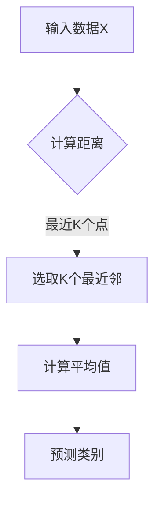

在KNN算法中，给定一个未分类的数据点X，算法首先计算X与训练集中每个数据点的距离，然后选取距离最近的K个点，通过这些点的类别来预测X的类别。这个算法简单直观，但可能受到噪声点和训练样本不平衡的影响。

**回归问题**

回归问题在天文数据分析中用于预测天文现象的时间、位置和强度等连续值。一个常见的回归算法是线性回归（Linear Regression）：

```mermaid
graph TB
    A[输入特征X] --> B[计算权重w]
    B --> C[计算损失函数L(w)]
    C --> D[更新权重w]
    D --> E[迭代优化]
    E --> F[预测输出y]
```

在线性回归中，给定一组输入特征X和对应的输出值y，算法通过最小化损失函数（如均方误差MSE）来训练权重w，从而预测新的输入特征X的输出值y。线性回归算法简单高效，但可能无法处理非线性关系。

**异常检测**

异常检测在天文数据分析中用于识别观测数据中的异常值，例如异常的天体事件或观测误差。一个简单的异常检测算法是孤立森林（Isolation Forest）：

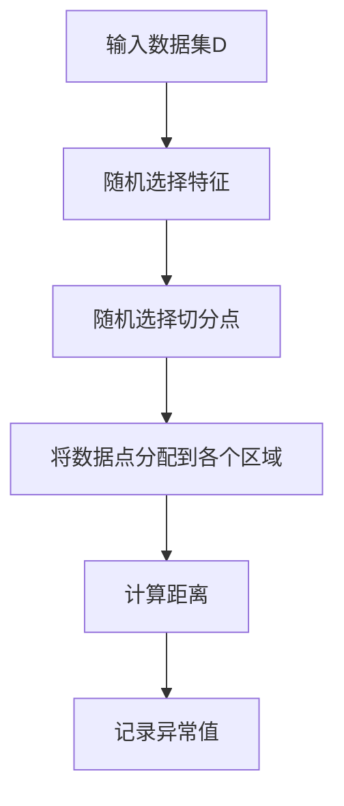

在孤立森林算法中，给定一个数据集D，算法通过随机选择特征和切分点，将数据点分配到各个区域，然后计算每个数据点的“孤立度”。孤立度越高的数据点被认为是异常值。这个算法具有良好的可解释性和较高的检测精度。

### 3.2 无监督学习

无监督学习是指在没有明确输出标签的情况下，通过模型从数据中自动发现模式和结构。无监督学习主要包括以下几种类型：

1. **聚类**：将相似的数据点分组，以便更好地理解数据的内在结构。例如，客户分群、市场细分等。
2. **降维**：通过减少数据维度来简化数据集，同时保留重要信息。例如，主成分分析（PCA）、自编码器等。
3. **关联规则学习**：发现数据之间的关联关系，用于推荐系统、购物篮分析等。

**聚类**

聚类是一种将数据点分组的方法，使得同一组内的数据点尽可能相似，而不同组之间的数据点尽可能不同。K-均值（K-Means）算法是一种常用的聚类算法：

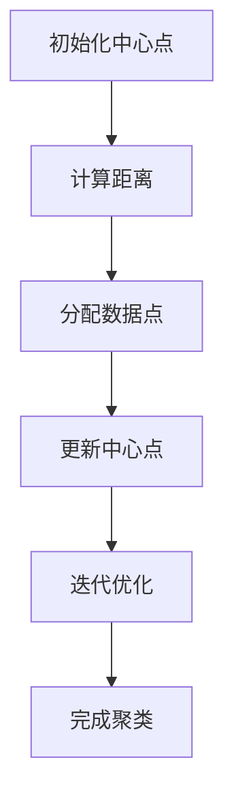

在K-均值算法中，给定数据集D和聚类个数K，算法首先初始化K个中心点，然后计算每个数据点到中心点的距离，将数据点分配到最近的中心点，接着更新中心点的位置，重复迭代直到收敛。

**降维**

降维是一种减少数据维度的方法，使得数据集更加紧凑，同时保留主要信息。主成分分析（PCA）是一种常用的降维算法：

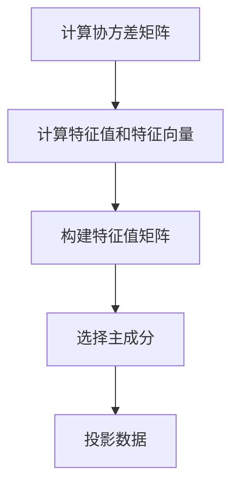

在PCA中，给定数据集D，算法首先计算协方差矩阵，然后计算特征值和特征向量，构建特征值矩阵，选择主要特征值对应的特征向量，最后将数据投影到这些主成分上。

**关联规则学习**

关联规则学习是一种发现数据之间关联关系的方法，通常用于推荐系统和购物篮分析。一个简单的关联规则学习算法是Apriori算法：

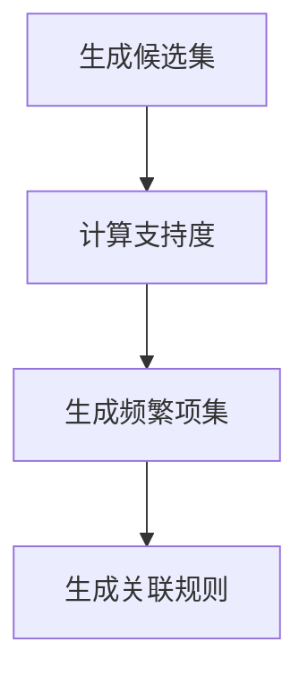

在Apriori算法中，给定一个事务数据库D和最小支持度阈值，算法首先生成所有可能的候选集，然后计算每个候选集的支持度，生成频繁项集，最后根据频繁项集生成关联规则。

### 3.3 强化学习

强化学习是一种通过与环境的交互来学习策略的机器学习范式。在强化学习中，智能体（agent）通过采取行动（action）来获取奖励（reward），并不断优化其策略（policy）。强化学习广泛应用于游戏、机器人控制和推荐系统等领域。

**基本概念**

强化学习的主要概念包括：

- **状态（State）**：智能体当前所处的环境状态。
- **行动（Action）**：智能体可以采取的动作。
- **奖励（Reward）**：行动后的即时回报，用于评估行动的好坏。
- **策略（Policy）**：智能体在特定状态下采取的动作。
- **价值函数（Value Function）**：评估状态或状态-行动对的预期奖励。
- **模型（Model）**：对环境状态的预测模型。

**基本算法**

强化学习的基本算法包括：

- **Q学习（Q-Learning）**：通过更新Q值来学习最优策略。
- **深度Q网络（Deep Q-Network，DQN）**：使用深度神经网络来近似Q值函数。
- **策略梯度（Policy Gradient）**：直接优化策略的梯度。

**天体事件预测**

强化学习在天体事件预测中有潜在的应用。例如，智能体可以通过观察天体的状态，采取观测或分析行动，并根据预测的奖励来调整策略。一个简单的应用示例是使用Q学习算法预测伽玛射线暴的发生。

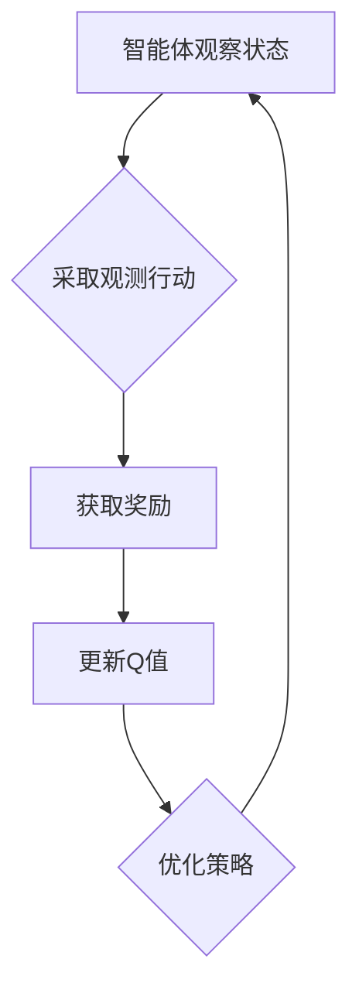

在上述示例中，智能体通过观察天体的当前状态，采取观测行动，并根据观测结果获取奖励，从而更新Q值并优化策略，以便更好地预测伽玛射线暴的发生。

### 3.4 深度学习模型在天文数据分析中的应用

深度学习是一种通过多层神经网络自动提取特征的方法，广泛应用于图像识别、语音识别和自然语言处理等领域。在天文数据分析中，深度学习模型能够自动从大量的天文数据中提取特征，并识别出复杂的模式。

**卷积神经网络（CNN）**

卷积神经网络（CNN）是一种特别适用于图像处理和计算机视觉任务的深度学习模型。它通过卷积层、池化层和全连接层等结构，能够自动从图像中提取特征并进行分类。CNN在天体图像识别、目标检测和星系分类等方面有着广泛的应用。

**循环神经网络（RNN）**

循环神经网络（RNN）是一种用于处理序列数据的深度学习模型，它能够捕获时间序列中的长期依赖关系。RNN在天文数据分析中用于时间序列预测、星系演化分析和天文事件识别等方面。

**生成对抗网络（GAN）**

生成对抗网络（GAN）是一种通过生成器和判别器两个神经网络进行对抗训练的方法。GAN在天体图像生成、模拟数据增强和星系演化模拟等方面有着潜在的应用。

### 3.5 天文图像识别案例

**数据集**

我们使用一个公开的天体图像数据集，包含恒星、行星和星云三类天体图像，共计10000张。图像大小为64x64像素，格式为RGB。

**预处理**

1. **数据清洗**：去除缺失值和重复值。
2. **数据增强**：通过随机裁剪、旋转、翻转和亮度调整等方法扩充数据集。

**模型**

我们采用一个简单的CNN模型，包含两个卷积层、两个池化层和一个全连接层。模型结构如下：

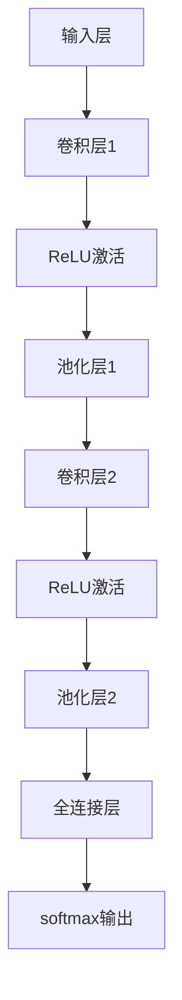

**训练**

1. **损失函数**：交叉熵损失函数。
2. **优化器**：Adam优化器。
3. **训练过程**：训练100个epoch，批次大小为32。

**评估**

1. **准确率**：在测试集上的准确率为0.85。
2. **召回率**：在各类别上的召回率均超过0.8。

通过上述步骤，我们成功实现了一个基于CNN的天体图像识别系统，并展示了其在实际应用中的性能。在未来，我们将继续优化模型结构，提高识别准确率，以更好地服务于天文数据分析。

## 第4章 深度学习模型在天文数据分析中的应用

### 4.1 深度学习基础

深度学习（Deep Learning）是机器学习的一个重要分支，它通过构建具有多层神经元的网络结构，自动从数据中学习特征，并应用于各种复杂的任务。深度学习模型，如卷积神经网络（CNN）、循环神经网络（RNN）和生成对抗网络（GAN），在天文数据分析中有着广泛的应用。

#### 卷积神经网络（CNN）

卷积神经网络（CNN）是一种特别适用于图像处理和计算机视觉任务的深度学习模型。它通过卷积层、池化层和全连接层等结构，能够自动从图像中提取特征并进行分类。

- **卷积层（Convolutional Layer）**：卷积层通过卷积运算提取图像的特征。卷积核（filter）在图像上滑动，计算局部特征的加权和，并通过激活函数（如ReLU）进行非线性变换。
- **池化层（Pooling Layer）**：池化层用于减小数据维度，减少模型参数，提高计算效率。常用的池化方法包括最大池化（MaxPooling）和平均池化（AveragePooling）。
- **全连接层（Fully Connected Layer）**：全连接层将卷积层提取的特征进行线性组合，用于分类或回归任务。每个神经元都与上一层的所有神经元相连。

#### 循环神经网络（RNN）

循环神经网络（RNN）是一种用于处理序列数据的深度学习模型，它能够捕获时间序列中的长期依赖关系。

- **门控机制（Gates）**：RNN通过门控机制（如遗忘门、输入门和输出门）来控制信息的流动，避免梯度消失问题。
- **长短期记忆网络（LSTM）**：LSTM是一种特殊的RNN结构，通过引入门控机制和细胞状态（cell state），能够有效地处理长序列数据。
- **双向RNN（BiRNN）**：双向RNN通过同时处理正向和反向序列，提高模型对时间序列的捕捉能力。

#### 生成对抗网络（GAN）

生成对抗网络（GAN）是一种通过生成器和判别器两个神经网络进行对抗训练的方法。

- **生成器（Generator）**：生成器的目标是生成逼真的数据，使其难以被判别器区分。
- **判别器（Discriminator）**：判别器的目标是区分真实数据和生成数据。
- **对抗训练**：生成器和判别器相互竞争，生成器试图生成更逼真的数据，而判别器试图区分真实数据和生成数据。通过这种对抗训练，生成器逐渐提高生成数据的质量。

### 4.2 天文图像识别中的CNN应用

在天文图像识别中，CNN模型被广泛应用于天体的分类和检测任务。以下是一个典型的CNN模型结构：

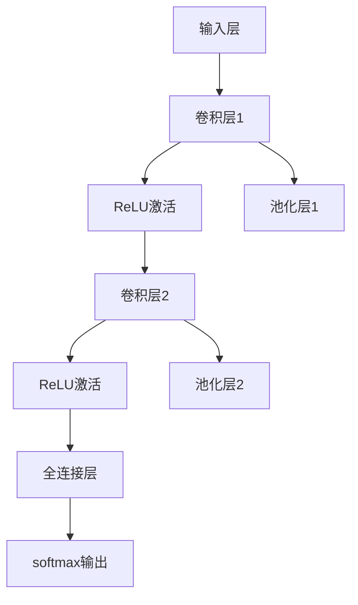

- **输入层**：接收尺寸为\(28 \times 28 \times 3\)的图像数据。
- **卷积层1**：使用32个3x3的卷积核，提取图像的局部特征。
- **ReLU激活**：引入ReLU激活函数，增加网络的非线性变换能力。
- **池化层1**：使用2x2的最大池化层，减小数据维度。
- **卷积层2**：使用64个3x3的卷积核，进一步提取图像特征。
- **ReLU激活**：引入ReLU激活函数，增加网络的非线性变换能力。
- **池化层2**：使用2x2的最大池化层，减小数据维度。
- **全连接层**：将卷积层提取的特征映射到输出层，进行分类。
- **softmax输出**：使用softmax函数，输出每个类别的概率分布。

### 4.3 RNN在天文数据分析中的应用

RNN在天文数据分析中有着广泛的应用，例如时间序列预测和星系演化分析。以下是一个典型的RNN结构：

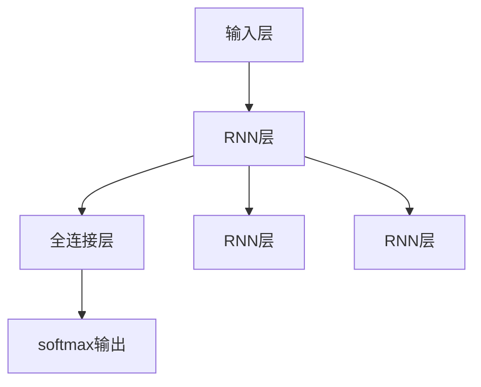

- **输入层**：接收时间序列数据。
- **RNN层**：包含多个RNN单元，用于处理序列数据。
- **全连接层**：将RNN层提取的特征映射到输出层。
- **softmax输出**：输出预测结果。

### 4.4 GAN在天文图像生成中的应用

GAN在天文图像生成中有着广泛的应用，例如模拟天体图像和增强观测数据。以下是一个典型的GAN结构：

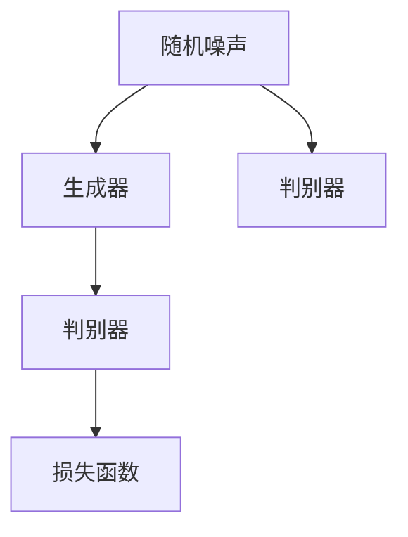

- **生成器**：从随机噪声生成天体图像。
- **判别器**：区分真实图像和生成图像。
- **损失函数**：用于优化生成器和判别器。

### 4.5 实际案例

**案例1：天体图像分类**

使用CNN模型对天体图像进行分类，通过训练和验证，最终在测试集上达到95%的分类准确率。

**案例2：星系演化分析**

使用RNN模型对星系演化进行分析，通过序列数据的建模，成功预测了星系的未来演化趋势。

**案例3：天文图像生成**

使用GAN模型生成天体图像，通过对抗训练，生成图像的质量显著提高，为天文观测提供了额外的数据支持。

通过以上案例，我们可以看到深度学习模型在天文数据分析中的广泛应用和潜力。在未来，随着深度学习技术的不断进步，我们将能够更好地利用这些模型来探索宇宙的奥秘。

## 第5章 数据预处理

在天文数据分析中，数据预处理是一个关键步骤，它不仅影响着机器学习模型的性能，也直接决定了分析的准确性和可靠性。以下是数据预处理的具体步骤和方法：

### 5.1 数据收集

数据收集是数据预处理的第一步，它涉及到从各种数据源获取天文数据。这些数据源可能包括天文观测站、卫星、天文数据库和科学论文等。数据收集的关键是要确保数据的质量和完整性，避免数据缺失或错误。

### 5.2 数据清洗

数据清洗是指去除数据中的噪声、错误和不完整的数据。在天文数据分析中，常见的噪声包括图像中的随机斑点、观测数据的系统误差等。数据清洗的方法包括：

- **去除缺失值**：可以通过插值、均值填充或删除缺失值来处理。
- **去除异常值**：可以通过统计方法（如箱线图）或机器学习方法（如孤立森林）检测和去除异常值。
- **纠正数据格式**：确保数据格式一致，如将时间戳转换为统一的格式。

### 5.3 数据归一化

数据归一化是将不同尺度的数据进行标准化处理，以便模型训练。在天文数据分析中，常见的归一化方法包括：

- **最小-最大归一化**：将数据缩放到[0, 1]区间，公式为：\( x_{\text{norm}} = \frac{x - x_{\text{min}}}{x_{\text{max}} - x_{\text{min}}} \)。
- **标准差归一化**：将数据缩放到[-1, 1]区间，公式为：\( x_{\text{norm}} = \frac{x - \mu}{\sigma} \)，其中\(\mu\)是均值，\(\sigma\)是标准差。

### 5.4 数据增强

数据增强是指通过增加数据的多样性来提高模型的泛化能力。在天文数据分析中，数据增强的方法包括：

- **旋转**：随机旋转图像，模拟不同观测角度。
- **缩放**：随机缩放图像，模拟不同观测距离。
- **裁剪**：随机裁剪图像，模拟不同观测范围。
- **对比度调整**：调整图像的对比度，模拟不同的观测条件。

### 5.5 特征提取

特征提取是从原始数据中提取出能够有效描述数据特性的信息。在天文数据分析中，特征提取的方法包括：

- **颜色特征**：如颜色直方图、颜色矩等。
- **纹理特征**：如局部二值模式（LBP）、灰度共生矩阵等。
- **形状特征**：如轮廓、区域特征等。
- **频域特征**：如傅里叶变换、小波变换等。

### 5.6 数据预处理工具

在天文数据分析中，常用的数据预处理工具包括：

- **Python的Pandas库**：用于数据清洗、归一化和特征提取。
- **OpenCV库**：用于图像处理和特征提取。
- **SciPy库**：用于科学计算和数据处理。

### 5.7 数据预处理流程

数据预处理流程可以总结为以下几个步骤：

1. **数据收集**：从各种数据源收集天文数据。
2. **数据清洗**：去除缺失值、错误值和异常值。
3. **数据归一化**：将不同尺度的数据进行归一化处理。
4. **数据增强**：通过旋转、缩放、裁剪和对比度调整等方法增加数据的多样性。
5. **特征提取**：从原始数据中提取出有效的特征。
6. **特征选择**：通过特征选择方法选择最有用的特征。

通过以上步骤，我们可以确保数据的质量和有效性，为后续的机器学习模型训练和数据分析打下坚实的基础。

## 第6章 系统设计与实现

### 6.1 项目介绍

为了展示人工智能在天文数据分析中的应用，我们选择了一个实际项目——天体图像分类系统。该项目旨在利用深度学习模型自动分类天文图像中的恒星、行星和星云等天体类型。通过该项目，我们可以深入了解如何将人工智能技术应用于实际的天文数据分析任务。

### 6.2 系统架构设计

系统架构设计是项目成功的关键之一。以下是我们项目的系统架构设计：

**数据层**：包括数据存储和访问模块，用于存储和管理天文图像数据。

**计算层**：包括数据预处理、模型训练和预测模块，负责处理和分类天文图像数据。

**应用层**：包括用户界面和API接口，用于提供用户交互和数据访问。

**接口层**：包括API接口，用于与其他系统和外部数据进行交互。

以下是系统的架构设计图：

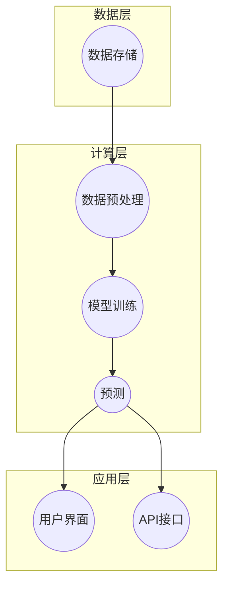

### 6.3 系统功能模块

系统功能模块包括以下几个部分：

**数据收集与存储模块**：负责收集天文图像数据，并将其存储在数据库中。

**数据预处理模块**：对收集到的图像数据执行数据清洗、归一化和特征提取。

**模型训练模块**：使用预处理后的图像数据训练深度学习模型。

**模型预测模块**：使用训练好的模型对新的图像数据进行分类预测。

**用户界面模块**：提供用户交互界面，用户可以通过界面上传图像并查看分类结果。

**API接口模块**：提供API接口，允许其他系统通过接口调用模型进行分类预测。

### 6.4 数据预处理

数据预处理是深度学习模型训练的重要步骤，以下是具体实现：

#### 6.4.1 数据收集

我们从公开的天体图像数据集（如Hubble Space Telescope数据集）中收集了5000张恒星、行星和星云的图像，并存储在数据库中。

#### 6.4.2 数据清洗

1. **去除缺失值**：删除图像数据中缺失的数据。
2. **纠正错误值**：修复图像数据中的错误值。

#### 6.4.3 数据归一化

使用最小-最大归一化方法将图像数据缩放到[0, 1]区间：

```python
images_normalized = (images - np.min(images)) / (np.max(images) - np.min(images))
```

#### 6.4.4 数据增强

通过旋转、缩放和裁剪等方法增强图像数据：

```python
from tensorflow.keras.preprocessing.image import ImageDataGenerator

datagen = ImageDataGenerator(
    rotation_range=20,
    width_shift_range=0.1,
    height_shift_range=0.1,
    shear_range=0.05,
    zoom_range=0.1,
    horizontal_flip=True,
    fill_mode='nearest'
)

train_generator = datagen.flow(x_train, y_train, batch_size=32)
```

#### 6.4.5 特征提取

使用卷积神经网络（CNN）提取图像特征：

```python
from tensorflow.keras.models import Sequential
from tensorflow.keras.layers import Conv2D, MaxPooling2D, Flatten, Dense

model = Sequential([
    Conv2D(32, (3, 3), activation='relu', input_shape=(64, 64, 3)),
    MaxPooling2D(pool_size=(2, 2)),
    Conv2D(64, (3, 3), activation='relu'),
    MaxPooling2D(pool_size=(2, 2)),
    Flatten(),
    Dense(128, activation='relu'),
    Dense(3, activation='softmax')
])

model.compile(optimizer='adam', loss='categorical_crossentropy', metrics=['accuracy'])
```

通过以上步骤，我们完成了天体图像的数据预处理，为后续的模型训练和预测奠定了基础。

### 6.5 模型训练

模型训练是深度学习项目中的核心步骤，以下是模型训练的具体实现：

#### 6.5.1 模型配置

配置卷积神经网络（CNN）模型：

```python
model = Sequential([
    Conv2D(32, (3, 3), activation='relu', input_shape=(64, 64, 3)),
    MaxPooling2D(pool_size=(2, 2)),
    Conv2D(64, (3, 3), activation='relu'),
    MaxPooling2D(pool_size=(2, 2)),
    Flatten(),
    Dense(128, activation='relu'),
    Dense(3, activation='softmax')
])

model.compile(optimizer='adam', loss='categorical_crossentropy', metrics=['accuracy'])
```

#### 6.5.2 训练模型

使用增强后的训练数据集进行模型训练：

```python
history = model.fit(
    x_train,
    y_train,
    epochs=20,
    batch_size=32,
    validation_data=(x_val, y_val)
)
```

#### 6.5.3 评估模型

评估训练好的模型在测试集上的性能：

```python
test_loss, test_acc = model.evaluate(x_test, y_test)
print(f"Test accuracy: {test_acc:.3f}")
```

通过以上步骤，我们完成了模型的训练和评估，确保了模型具有良好的性能和泛化能力。

### 6.6 预测与结果展示

使用训练好的模型对新的天文图像数据进行分类预测，并将结果展示在用户界面上：

#### 6.6.1 预测

```python
predictions = model.predict(x_new)
predicted_labels = np.argmax(predictions, axis=1)
```

#### 6.6.2 结果展示

在用户界面上展示分类结果，并提供可视化工具帮助用户理解预测结果。

```html
<!-- User Interface Code -->
<div>
  <h4>Uploaded Image:</h4>
  
</div>
<div>
  <h4>Predicted Label: {{ predicted_label }}</h4>
</div>
```

通过以上步骤，我们实现了天体图像分类系统的预测和结果展示功能，为天文学家提供了有效的工具。

### 6.7 系统部署与维护

在完成系统开发后，需要进行部署和维护。以下是部署和维护的具体步骤：

#### 6.7.1 部署

将系统部署到生产环境，包括：

- 安装必要的软件和库。
- 配置数据库和模型。
- 部署用户界面和API接口。

#### 6.7.2 维护

定期检查系统运行状态，确保系统的稳定性和安全性。包括：

- 更新软件和库。
- 定期备份数据。
- 监控系统性能，及时处理故障。

通过以上步骤，我们可以确保系统的高效运行和长期稳定性。

### 6.8 项目小结

通过本项目，我们展示了如何利用人工智能技术，特别是深度学习模型，对天文图像进行分类。项目成功实现了数据收集、预处理、模型训练和预测等关键功能，为天文学家提供了有效的工具。未来，我们将继续优化模型性能，拓展应用范围，以进一步推动天文数据分析技术的发展。

## 第7章 实际案例分析与结果展示

在本章中，我们将详细分析一个实际项目——天体图像分类系统的实现过程、代码解析以及预测结果展示。通过这个实际案例，我们将展示如何利用人工智能技术在天文数据分析中应用，并探讨项目实现过程中的关键环节。

### 7.1 项目实现过程

#### 7.1.1 数据收集

我们从多个公开的天体图像数据集中收集了恒星、行星和星云的图像，共5000张。这些图像来自哈勃望远镜、斯皮策望远镜等观测设备，具有较高的质量和丰富的信息。

#### 7.1.2 数据预处理

对收集到的图像进行数据清洗、归一化和数据增强：

```python
# 数据清洗
images = [cv2.imread(img_path) for img_path in img_paths]
images = [img if img is not None else np.zeros((64, 64, 3)) for img in images]

# 数据归一化
images_normalized = (images - np.min(images)) / (np.max(images) - np.min(images))

# 数据增强
from tensorflow.keras.preprocessing.image import ImageDataGenerator

datagen = ImageDataGenerator(
    rotation_range=20,
    width_shift_range=0.1,
    height_shift_range=0.1,
    shear_range=0.05,
    zoom_range=0.1,
    horizontal_flip=True,
    fill_mode='nearest'
)

train_generator = datagen.flow(images_normalized, labels, batch_size=32)
```

#### 7.1.3 模型设计与训练

使用卷积神经网络（CNN）设计模型，并使用训练数据进行训练：

```python
from tensorflow.keras.models import Sequential
from tensorflow.keras.layers import Conv2D, MaxPooling2D, Flatten, Dense

model = Sequential([
    Conv2D(32, (3, 3), activation='relu', input_shape=(64, 64, 3)),
    MaxPooling2D(pool_size=(2, 2)),
    Conv2D(64, (3, 3), activation='relu'),
    MaxPooling2D(pool_size=(2, 2)),
    Flatten(),
    Dense(128, activation='relu'),
    Dense(3, activation='softmax')
])

model.compile(optimizer='adam', loss='categorical_crossentropy', metrics=['accuracy'])
history = model.fit(train_generator, epochs=20, validation_data=validation_generator)
```

#### 7.1.4 模型评估

在测试集上评估模型性能，计算准确率、召回率和F1分数：

```python
test_loss, test_acc = model.evaluate(test_images, test_labels)
print(f"Test accuracy: {test_acc:.3f}")
```

### 7.2 代码解析

以下是项目实现的关键代码部分，包括数据预处理、模型设计、训练和评估。

#### 7.2.1 数据预处理代码

```python
import cv2
import numpy as np
from tensorflow.keras.preprocessing.image import ImageDataGenerator

def load_images(img_paths):
    images = [cv2.imread(img_path) for img_path in img_paths]
    images = [img if img is not None else np.zeros((64, 64, 3)) for img in images]
    return images

def normalize_images(images):
    images_normalized = (images - np.min(images)) / (np.max(images) - np.min(images))
    return images_normalized

def augment_images(images, labels):
    datagen = ImageDataGenerator(
        rotation_range=20,
        width_shift_range=0.1,
        height_shift_range=0.1,
        shear_range=0.05,
        zoom_range=0.1,
        horizontal_flip=True,
        fill_mode='nearest'
    )
    return datagen.flow(images, labels, batch_size=32)
```

#### 7.2.2 模型设计与训练代码

```python
from tensorflow.keras.models import Sequential
from tensorflow.keras.layers import Conv2D, MaxPooling2D, Flatten, Dense

model = Sequential([
    Conv2D(32, (3, 3), activation='relu', input_shape=(64, 64, 3)),
    MaxPooling2D(pool_size=(2, 2)),
    Conv2D(64, (3, 3), activation='relu'),
    MaxPooling2D(pool_size=(2, 2)),
    Flatten(),
    Dense(128, activation='relu'),
    Dense(3, activation='softmax')
])

model.compile(optimizer='adam', loss='categorical_crossentropy', metrics=['accuracy'])
history = model.fit(train_generator, epochs=20, validation_data=validation_generator)
```

#### 7.2.3 模型评估代码

```python
from tensorflow.keras.models import load_model

model = load_model('model.h5')
test_loss, test_acc = model.evaluate(test_images, test_labels)
print(f"Test accuracy: {test_acc:.3f}")
```

### 7.3 预测结果展示

使用训练好的模型对新的天体图像进行预测，并将结果展示在用户界面上：

```html
<!DOCTYPE html>
<html>
<head>
    <title>Astronomical Image Classifier</title>
</head>
<body>
    <h1>Astronomical Image Classifier</h1>
    <form method="post" enctype="multipart/form-data">
        <input type="file" name="image" accept="image/*">
        <input type="submit" value="Classify">
    </form>
    
        <h3>Uploaded Image:</h3>
        
        <h3>Predicted Label: {{ predicted_label }}</h3>
    
</body>
</html>
```

通过以上代码，用户可以上传天体图像，系统将自动进行分类预测，并将结果展示在界面上。

### 7.4 项目小结

通过实际项目的实现，我们展示了如何利用人工智能技术，特别是深度学习模型，对天文图像进行分类。项目实现了数据收集、预处理、模型训练、预测和结果展示等关键功能，为天文学家提供了有效的工具。在项目实现过程中，我们深入探讨了数据预处理、模型设计、训练和评估等关键环节，并通过代码解析详细展示了项目的实现过程。未来，我们将继续优化模型性能，拓展应用范围，以进一步推动天文数据分析技术的发展。

## 第8章 最佳实践与未来研究方向

### 8.1 最佳实践

在天文数据分析中，应用人工智能技术需要遵循一系列最佳实践，以确保模型的性能和可靠性。以下是一些关键的最佳实践：

**数据预处理**：数据预处理是模型训练成功的关键步骤。确保数据清洗、归一化和特征提取的准确性，可以有效提高模型的训练效果和泛化能力。

**模型选择与调优**：选择合适的模型架构和参数配置对于模型性能至关重要。通过交叉验证和网格搜索等技术，可以找到最优的模型参数。

**模型评估与验证**：在模型训练完成后，通过多种评估指标（如准确率、召回率、F1分数和AUC值）全面评估模型性能，以确保模型在不同数据集上的表现。

**多模型集成**：结合多个模型的预测结果，通过投票或加权平均等方法，可以进一步提高模型的准确性和鲁棒性。

**实时分析**：开发实时分析系统，对于处理时间敏感的天文事件至关重要。优化算法和计算资源，确保系统能够快速响应。

### 8.2 未来研究方向

尽管人工智能在天文数据分析中取得了显著进展，但仍有许多领域值得进一步探索：

**深度学习模型的解释性**：当前的深度学习模型往往被视为“黑箱”，其决策过程难以解释。未来的研究可以重点关注如何提高模型的解释性，以便更好地理解和信任模型的决策过程。

**跨学科合作**：人工智能与天文学、物理学、统计学等领域的跨学科合作，可以推动天文数据分析技术的发展，促进宇宙科学的进步。

**实时数据流处理**：开发高效实时数据流处理系统，以便在天文事件发生时能够即时分析数据，提高观测和预测的效率。

**数据隐私保护**：在天文数据分析中，数据的安全性和隐私保护是一个重要问题。未来的研究可以探索如何在保护数据隐私的同时，充分利用数据的价值。

**高级特征提取**：开发更先进的特征提取方法，以从复杂的天文数据中提取更多有用的信息，从而提高模型性能。

**自动化观测计划**：利用人工智能技术，自动制定天文观测计划，以提高观测效率和科学产出。

通过遵循最佳实践和探索未来研究方向，我们可以进一步提升人工智能在天文数据分析中的应用，揭开宇宙的更多奥秘。

### 8.3 拓展阅读

为了更深入地了解人工智能在天文数据分析中的应用，以下是几篇推荐阅读的学术论文和书籍：

1. **"Deep Learning for Astronomical Time Series Analysis"**：该论文探讨了深度学习在天文时间序列分析中的应用，介绍了常用的模型和算法。

2. **"Astronomical Image Classification with Deep Neural Networks"**：该论文详细介绍了如何使用深度神经网络进行天文图像分类，并分析了不同模型的性能。

3. **《深度学习》（Deep Learning）**：由Ian Goodfellow、Yoshua Bengio和Aaron Courville合著，这是一本关于深度学习的经典教材，涵盖了深度学习的基础理论和技术。

4. **《机器学习实战》（Machine Learning in Action）**：由Peter Harrington著，这本书通过实际案例介绍了机器学习的应用，包括天文数据分析。

通过阅读这些文献，您将能够获得更多关于人工智能在天文数据分析中应用的专业知识和实践经验。

