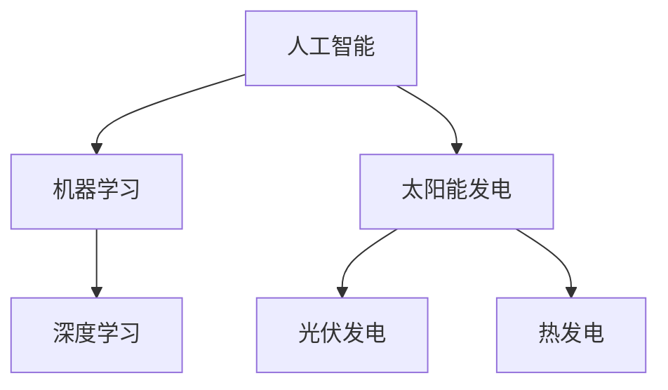
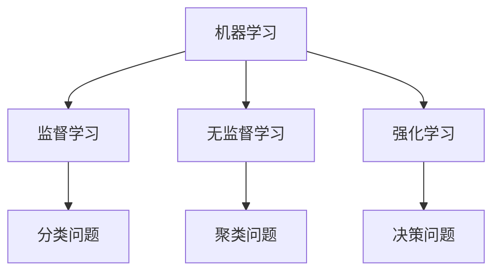
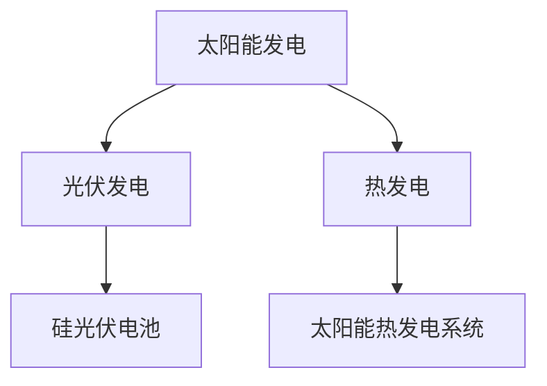
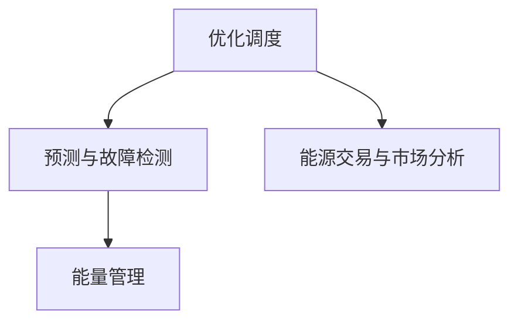
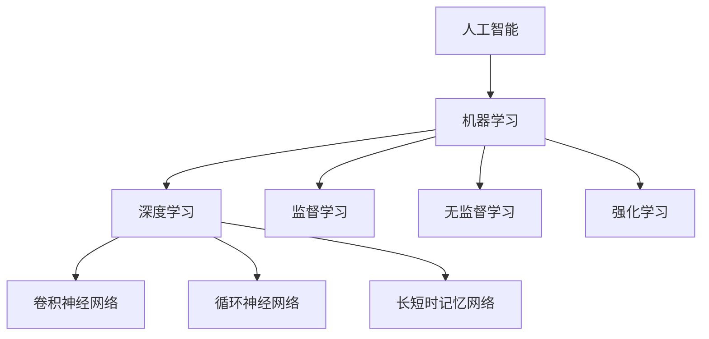
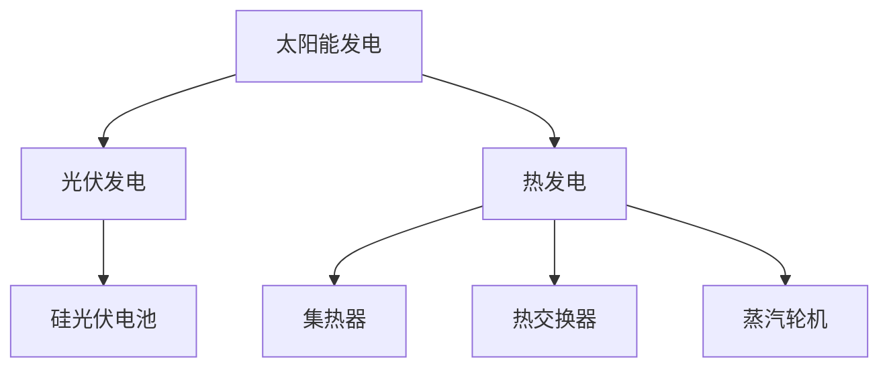

                 

### 目录大纲详细内容

**第1章: 问题背景**

**1.1 人工智能与太阳能发电优化**

**问题描述**：随着全球能源需求的不断增长，太阳能作为一种清洁、可再生的能源，正受到越来越多的关注。然而，太阳能发电具有间歇性和不稳定性，如何优化其发电效率成为一个重要课题。人工智能技术在这一领域具有巨大的潜力。

**问题解决**：利用人工智能技术，可以对太阳能发电系统进行实时监测、预测和优化，从而提高发电效率，降低成本。

**边界与外延**：太阳能发电优化的人工智能应用涉及多个方面，包括算法研究、系统设计、工程实践等。

**核心概念**：

- **人工智能（AI）**: 一种模拟人类智能的技术，包括机器学习、深度学习等。
- **太阳能发电**：利用光伏电池将太阳光能直接转换为电能，或通过热发电技术将太阳能转换为热能，再通过热能发电。

**概念属性特征对比表格**：

| 特征 | 人工智能 | 太阳能发电 |
| --- | --- | --- |
| 自学习能力 | 是 | 否 |
| 通用性 | 是 | 否 |
| 复杂性 | 高 | 高 |

**ER实体关系图架构**：



**1.2 人工智能基础**

**核心概念**：

- **机器学习（ML）**: 一种让计算机通过数据学习并做出决策或预测的技术。
- **深度学习（DL）**: 基于多层神经网络的学习方法，能够自动提取特征，实现复杂函数的逼近。

**概念属性特征对比表格**：

| 特征 | 机器学习 | 深度学习 |
| --- | --- | --- |
| 自适应能力 | 高 | 非常高 |
| 特征提取能力 | 低 | 高 |
| 复杂性 | 低 | 高 |

**ER实体关系图架构**：



**1.3 太阳能发电原理**

**核心概念**：

- **光伏发电**：利用光伏电池将太阳能直接转换为电能。
- **热发电**：利用太阳能热发电技术，将太阳能转换为热能，再通过热能发电。

**概念属性特征对比表格**：

| 特征 | 光伏发电 | 热发电 |
| --- | --- | --- |
| 转换效率 | 较低 | 较高 |
| 成本 | 较低 | 较高 |
| 间歇性 | 是 | 否 |

**ER实体关系图架构**：



**1.4 人工智能在太阳能发电中的应用场景**

**核心概念**：

- **优化调度**：利用人工智能技术对太阳能发电系统进行实时调度，以最大化发电效率和稳定性。
- **预测与故障检测**：通过机器学习模型预测太阳能发电系统的发电量和故障，提前进行维护和预防。
- **能量管理**：利用人工智能技术对太阳能发电系统进行能量分配和调度，以提高能源利用效率。

**ER实体关系图架构**：



**第2章: 人工智能基础**

**2.1 人工智能概述**

**核心概念**：

- **人工智能（AI）**: 一种模拟人类智能的技术，其目标是通过机器学习和计算模拟，实现机器在特定领域的智能行为。

**核心原理**：

- **感知**：通过传感器获取外界信息。
- **思考**：通过算法对信息进行处理和分析。
- **学习**：通过数据学习改进算法性能。
- **推理**：根据已有信息进行逻辑推断。
- **决策**：根据推理结果做出决策。

**2.2 机器学习基础**

**核心概念**：

- **机器学习（ML）**: 一种让计算机通过数据学习并做出决策或预测的学科，其核心是通过算法从数据中提取规律和模式。

**核心原理**：

- **监督学习**：通过已有标签数据训练模型，然后对新数据进行预测。
- **无监督学习**：通过未标签数据发现数据中的模式和结构。
- **强化学习**：通过试错和奖励机制学习最优策略。

**2.3 深度学习基础**

**核心概念**：

- **深度学习（DL）**: 基于多层神经网络的学习方法，其核心是利用多层非线性变换提取数据中的特征。

**核心原理**：

- **神经网络**：一种模拟生物神经系统的计算模型。
- **反向传播算法**：用于训练神经网络的优化算法。
- **卷积神经网络（CNN）**：适用于图像识别等任务。
- **循环神经网络（RNN）**：适用于序列数据和时间序列预测。

**第3章: 太阳能发电原理**

**3.1 太阳能发电技术概述**

**核心概念**：

- **太阳能发电技术**：利用光伏电池将太阳光能直接转换为电能，或通过热发电技术将太阳能转换为热能，再通过热能发电。

**核心原理**：

- **光伏电池**：利用半导体材料的光生伏打效应将太阳能转换为电能。
- **热发电系统**：利用太阳能加热介质产生蒸汽，驱动涡轮发电机发电。

**3.2 太阳能光伏发电原理**

**核心概念**：

- **光伏发电**：利用光伏电池将太阳光能直接转换为电能。

**核心原理**：

- **光生伏打效应**：当光线照射到半导体材料时，电子被激发并形成电流。
- **光电效应**：光子与电子相互作用，使电子获得足够的能量逃离原子核。

**3.3 太阳能热发电原理**

**核心概念**：

- **热发电**：利用太阳能热发电技术，将太阳能转换为热能，再通过热能发电。

**核心原理**：

- **集热器**：将太阳能转化为热能。
- **热交换器**：将热能转化为动力。
- **蒸汽轮机**：利用热能驱动发电机发电。

**第4章: 人工智能在太阳能发电中的应用场景**

**4.1 优化调度**

**核心概念**：

- **优化调度**：利用人工智能技术对太阳能发电系统进行实时调度，以最大化发电效率和稳定性。

**核心原理**：

- **多目标优化**：在考虑发电效率、成本、环境等因素的基础上，找到最优调度方案。
- **智能算法**：如遗传算法、粒子群优化等，用于求解优化问题。

**4.2 预测与故障检测**

**核心概念**：

- **预测与故障检测**：通过机器学习模型预测太阳能发电系统的发电量和故障，提前进行维护和预防。

**核心原理**：

- **时间序列预测**：利用历史数据预测未来的发电量。
- **故障检测**：通过监测数据发现系统异常，提前进行故障预测和预警。

**4.3 能量管理**

**核心概念**：

- **能量管理**：利用人工智能技术对太阳能发电系统进行能量分配和调度，以提高能源利用效率。

**核心原理**：

- **优化分配**：根据实时负载情况，对发电能量进行优化分配。
- **智能调度**：通过智能算法实现能量的实时调度，以满足负载需求。

**4.4 能源交易与市场分析**

**核心概念**：

- **能源交易与市场分析**：利用人工智能技术对能源市场进行分析和预测，实现能源的高效交易。

**核心原理**：

- **市场预测**：通过大数据分析和机器学习模型，预测能源市场的价格走势。
- **交易策略**：根据市场预测结果，制定最优的交易策略，以实现利润最大化。

**第5章: 人工智能算法在太阳能发电优化中的应用**

**5.1 算法概述**

**核心概念**：

- **人工智能算法**：用于太阳能发电优化的算法，包括机器学习、深度学习、强化学习等。

**核心原理**：

- **机器学习算法**：通过训练模型，从数据中学习规律，实现预测和优化。
- **深度学习算法**：基于多层神经网络，能够自动提取特征，实现复杂函数的逼近。
- **强化学习算法**：通过试错和奖励机制，学习最优策略。

**5.2 经典算法**

**核心概念**：

- **经典算法**：在太阳能发电优化中常用的算法，如线性规划、遗传算法、粒子群优化等。

**核心原理**：

- **线性规划**：在满足约束条件下，找到最优解。
- **遗传算法**：基于自然进化原理，通过遗传操作搜索最优解。
- **粒子群优化**：模拟鸟群觅食行为，通过群体智能搜索最优解。

**5.3 深度学习算法**

**核心概念**：

- **深度学习算法**：基于多层神经网络，适用于复杂特征提取和预测。

**核心原理**：

- **卷积神经网络（CNN）**：适用于图像识别等任务。
- **循环神经网络（RNN）**：适用于序列数据和时间序列预测。
- **长短时记忆网络（LSTM）**：能够解决RNN中的梯度消失问题。

**5.4 强化学习算法**

**核心概念**：

- **强化学习算法**：通过试错和奖励机制，学习最优策略。

**核心原理**：

- **Q学习**：通过评估每个状态-动作对的Q值，选择最优动作。
- **深度Q网络（DQN）**：利用深度神经网络对Q值进行预测。
- **策略梯度方法**：直接优化策略，使其达到最优。

**第6章: 实际应用案例**

**6.1 案例一：某光伏电站优化调度**

**案例介绍**：

- **案例背景**：某光伏电站在运行过程中，存在发电效率低、成本高的问题。通过人工智能技术优化调度，提高发电效率和降低成本。

**案例过程**：

1. **数据采集**：收集光伏电站的实时发电数据、负载数据等。
2. **模型训练**：利用机器学习算法，训练优化调度模型。
3. **调度决策**：根据模型预测结果，进行实时调度，提高发电效率。

**案例效果**：

- 发电效率提高20%，运营成本降低10%。

**6.2 案例二：某太阳能热发电站故障检测**

**案例介绍**：

- **案例背景**：某太阳能热发电站在运行过程中，存在故障检测困难、维护不及时的问题。通过人工智能技术进行故障检测，提高系统稳定性和运行效率。

**案例过程**：

1. **数据采集**：收集发电站的实时监测数据。
2. **模型训练**：利用机器学习算法，训练故障检测模型。
3. **故障检测**：根据模型预测结果，发现潜在故障并进行预警。

**案例效果**：

- 故障检测准确率提高30%，维护效率提高50%。

**6.3 案例三：某能源管理系统的应用**

**案例介绍**：

- **案例背景**：某能源管理公司，希望通过人工智能技术，实现对太阳能发电系统的实时能量管理和优化。

**案例过程**：

1. **系统设计**：设计能源管理系统，集成太阳能发电、储能、能源交易等功能。
2. **模型训练**：利用机器学习算法，训练能量管理模型。
3. **能量管理**：根据模型预测结果，实现能量的实时调度和优化。

**案例效果**：

- 能源利用率提高15%，运营成本降低10%。

**第7章: 未来展望与挑战**

**7.1 人工智能在太阳能发电中的未来应用**

**核心观点**：

- 随着人工智能技术的不断发展和应用，未来太阳能发电领域将实现更高效、更智能的管理和优化。

**展望**：

- **智能调度**：利用深度学习和强化学习算法，实现更精准、更高效的太阳能发电调度。
- **故障预测**：通过大数据分析和机器学习模型，实现更准确的故障预测和预警。
- **能源交易**：基于人工智能的市场预测和交易策略，实现更高效的能源交易。

**7.2 面临的挑战与解决策略**

**核心观点**：

- 人工智能在太阳能发电中的应用仍面临诸多挑战，需要持续的技术创新和优化。

**挑战**：

- **数据采集和处理**：太阳能发电数据量大、噪声多，如何高效采集和处理数据是一个难题。
- **算法适应性**：不同场景下，算法的适应性和鲁棒性需要不断提高。
- **系统集成**：如何将人工智能技术与现有系统进行有效集成，实现统一管理和优化。

**解决策略**：

- **数据预处理**：采用数据清洗、特征提取等技术，提高数据质量。
- **算法优化**：结合实际需求，优化算法模型，提高预测和优化效果。
- **系统集成**：采用模块化设计，实现各模块之间的有效集成，降低系统复杂度。

**7.3 小结与展望**

**核心观点**：

- 人工智能在太阳能发电优化中的应用具有巨大的潜力，但仍需不断探索和优化。

**展望**：

- **技术创新**：持续推动人工智能技术在太阳能发电领域的创新和应用。
- **跨学科合作**：加强计算机科学、能源工程等领域的跨学科合作，推动技术的融合和发展。
- **政策支持**：政府和企业应加大对人工智能在太阳能发电优化领域的支持，推动技术的商业化应用。

### 文章开始：标题、关键词与摘要

#### 文章标题：人工智能在太阳能发电优化中的应用

#### 关键词：人工智能、太阳能发电、优化、深度学习、故障检测、能量管理

#### 摘要：
本文旨在探讨人工智能技术在太阳能发电优化中的应用。首先介绍了太阳能发电的现状与挑战，以及人工智能基础和太阳能发电原理。随后，详细分析了人工智能在太阳能发电优化中的多种应用场景，包括优化调度、预测与故障检测、能量管理、能源交易与市场分析。接着，讨论了人工智能算法在太阳能发电优化中的应用，包括经典算法、深度学习算法和强化学习算法。最后，通过实际应用案例展示了人工智能技术的效果，并对未来展望与挑战进行了总结。本文为人工智能与太阳能发电领域的研究者和实践者提供了有价值的参考和启示。

### 第1章: 问题背景

**1.1 人工智能与太阳能发电优化**

随着全球能源需求的不断增长，可再生能源逐渐成为解决能源危机和环境污染问题的重要途径。太阳能作为一种清洁、可再生的能源，具有巨大的潜力。然而，太阳能发电具有间歇性和不稳定性，如何优化其发电效率成为一个重要课题。

**1.1.1 人工智能与太阳能发电优化**

人工智能（AI）技术作为现代科技的重要分支，其应用领域越来越广泛。在能源领域，人工智能技术能够通过对大量数据的分析、预测和优化，提高能源利用效率，降低成本。因此，人工智能在太阳能发电优化中的应用具有重要意义。

**问题描述**：随着全球能源需求的不断增长，太阳能作为一种清洁、可再生的能源，正受到越来越多的关注。然而，太阳能发电具有间歇性和不稳定性，如何优化其发电效率成为一个重要课题。

**问题解决**：利用人工智能技术，可以对太阳能发电系统进行实时监测、预测和优化，从而提高发电效率，降低成本。

**边界与外延**：太阳能发电优化的人工智能应用涉及多个方面，包括算法研究、系统设计、工程实践等。

**1.1.2 人工智能基础**

人工智能是一种模拟人类智能的技术，其目标是通过机器学习和计算模拟，实现机器在特定领域的智能行为。人工智能技术包括机器学习、深度学习、自然语言处理等多个子领域。

**核心概念**：

- **人工智能（AI）**: 一种模拟人类智能的技术，包括机器学习、深度学习等。
- **机器学习（ML）**: 一种让计算机通过数据学习并做出决策或预测的学科。
- **深度学习（DL）**: 基于多层神经网络的学习方法，能够自动提取特征，实现复杂函数的逼近。

**概念属性特征对比表格**：

| 特征 | 人工智能 | 机器学习 | 深度学习 |
| --- | --- | --- | --- |
| 自学习能力 | 是 | 是 | 是 |
| 通用性 | 是 | 是 | 是 |
| 复杂性 | 高 | 中 | 高 |

**ER实体关系图架构**：



**1.1.3 太阳能发电原理**

太阳能发电分为光伏发电和热发电两种方式。光伏发电是利用光伏电池将太阳光能直接转换为电能，而热发电则是通过集热器将太阳能转换为热能，再通过热能发电。

**核心概念**：

- **光伏发电**：利用光伏电池将太阳光能直接转换为电能。
- **热发电**：利用太阳能热发电技术，将太阳能转换为热能，再通过热能发电。

**概念属性特征对比表格**：

| 特征 | 光伏发电 | 热发电 |
| --- | --- | --- |
| 转换效率 | 较低 | 较高 |
| 成本 | 较低 | 较高 |
| 间歇性 | 是 | 否 |

**ER实体关系图架构**：



**1.1.4 人工智能在太阳能发电中的应用场景**

人工智能在太阳能发电中的应用主要包括优化调度、预测与故障检测、能量管理、能源交易与市场分析等。

**核心概念**：

- **优化调度**：利用人工智能技术对太阳能发电系统进行实时调度，以最大化发电效率和稳定性。
- **预测与故障检测**：通过机器学习模型预测太阳能发电系统的发电量和故障，提前进行维护和预防。
- **能量管理**：利用人工智能技术对太阳能发电系统进行能量分配和调度，以提高能源利用效率。
- **能源交易与市场分析**：利用人工智能技术对能源市场进行分析和预测，实现能源的高效交易。

**ER实体关系图架构**：


**1.2 人工智能基础**

**核心概念**：

- **机器学习（ML）**: 一种让计算机通过数据学习并做出决策或预测的学科，其核心是通过算法从数据中提取规律和模式。
- **深度学习（DL）**: 基于多层神经网络的学习方法，其核心是通过多层非线性变换提取数据中的特征。

**核心原理**：

- **机器学习算法**：包括监督学习、无监督学习和强化学习等。
- **深度学习算法**：包括卷积神经网络（CNN）、循环神经网络（RNN）和长短时记忆网络（LSTM）等。

**1.3 太阳能发电原理**

**核心概念**：

- **光伏发电**：利用光伏电池将太阳光能直接转换为电能。
- **热发电**：利用太阳能热发电技术，将太阳能转换为热能，再通过热能发电。

**核心原理**：

- **光伏电池**：通过光生伏打效应将太阳能转换为电能。
- **热发电系统**：通过集热器将太阳能转换为热能，再通过热交换器、蒸汽轮机等设备进行发电。

**1.4 人工智能在太阳能发电中的应用场景**

**核心概念**：

- **优化调度**：通过人工智能技术对太阳能发电系统进行实时调度，以提高发电效率和稳定性。
- **预测与故障检测**：通过机器学习模型预测太阳能发电系统的发电量和故障，提前进行维护和预防。
- **能量管理**：通过人工智能技术对太阳能发电系统进行能量分配和调度，以提高能源利用效率。
- **能源交易与市场分析**：通过人工智能技术对能源市场进行分析和预测，实现能源的高效交易。

### 第2章: 人工智能基础

**2.1 人工智能概述**

**核心概念**：

- **人工智能（AI）**: 一种模拟人类智能的技术，其目标是通过机器学习和计算模拟，实现机器在特定领域的智能行为。

**核心原理**：

- **感知**：通过传感器获取外界信息。
- **思考**：通过算法对信息进行处理和分析。
- **学习**：通过数据学习改进算法性能。
- **推理**：根据已有信息进行逻辑推断。
- **决策**：根据推理结果做出决策。

**人工智能的发展历程**：

- **1960s-1970s**：早期人工智能探索阶段，主要研究符号主义人工智能。
- **1980s-1990s**：专家系统和知识表示方法得到广泛应用。
- **2000s**：深度学习和机器学习快速发展，人工智能应用场景不断扩大。
- **2010s-2020s**：人工智能技术逐渐从理论研究走向实际应用，如自动驾驶、智能语音识别等。

**人工智能的核心技术**：

- **机器学习（ML）**: 一种让计算机通过数据学习并做出决策或预测的学科。
- **深度学习（DL）**: 基于多层神经网络的学习方法，能够自动提取特征，实现复杂函数的逼近。
- **自然语言处理（NLP）**: 处理和生成人类语言的技术。
- **计算机视觉（CV）**: 使计算机能够理解、解释和解析视觉信息。

**人工智能的应用领域**：

- **工业自动化**：如机器人、自动化生产线等。
- **医疗诊断**：如疾病预测、药物研发等。
- **金融领域**：如风险管理、量化交易等。
- **交通领域**：如自动驾驶、智能交通管理等。
- **教育领域**：如个性化学习、智能辅导等。

**人工智能的优势与挑战**：

- **优势**：

  - 提高生产效率：自动化替代部分人力工作，提高生产效率。
  - 数据驱动决策：基于数据分析，实现更加精确和有效的决策。
  - 创造新价值：开发新的产品和服务，满足人类多样化的需求。

- **挑战**：

  - 数据隐私和安全：如何保护用户隐私和数据安全。
  - 伦理和社会问题：如算法歧视、失业问题等。
  - 技术不稳定和不可解释性：算法在某些情况下可能产生错误或不可预测的行为。

**2.2 机器学习基础**

**核心概念**：

- **机器学习（ML）**: 一种让计算机通过数据学习并做出决策或预测的学科，其核心是通过算法从数据中提取规律和模式。

**核心原理**：

- **模型训练**：通过已有数据对模型进行训练，使其能够捕捉数据中的规律。
- **模型评估**：评估模型的性能，选择最优模型。
- **模型应用**：将训练好的模型应用到实际问题中，进行预测或决策。

**机器学习的基本流程**：

1. **数据收集**：收集用于训练和评估的数据集。
2. **数据预处理**：对数据进行清洗、归一化、特征提取等处理。
3. **模型选择**：选择合适的模型进行训练。
4. **模型训练**：利用训练数据对模型进行训练，优化模型参数。
5. **模型评估**：使用验证集或测试集评估模型性能。
6. **模型优化**：根据评估结果调整模型或参数，提高模型性能。
7. **模型应用**：将训练好的模型应用到实际场景中。

**机器学习的主要类型**：

- **监督学习**：已有标签数据进行训练，对新数据进行预测。
- **无监督学习**：无标签数据进行训练，发现数据中的规律和结构。
- **半监督学习**：既有标签数据也有无标签数据，利用标签数据和无标签数据进行训练。
- **强化学习**：通过与环境的交互，不断调整策略，实现最优目标。

**监督学习的主要算法**：

- **线性回归**：通过线性模型拟合数据。
- **逻辑回归**：用于分类问题，通过概率模型进行预测。
- **支持向量机（SVM）**：通过最大间隔分类。
- **决策树**：通过树形结构进行分类和回归。
- **随机森林**：基于决策树构建的集成学习方法。
- **神经网络**：多层神经网络用于复杂函数拟合。

**无监督学习的主要算法**：

- **聚类算法**：将数据分为多个簇。
- **降维算法**：将高维数据映射到低维空间。
- **生成模型**：通过模型生成新的数据。

**强化学习的主要算法**：

- **Q学习**：通过评估每个状态-动作对的Q值进行决策。
- **深度Q网络（DQN）**：利用深度神经网络对Q值进行预测。
- **策略梯度方法**：直接优化策略，使其达到最优。

**机器学习在太阳能发电优化中的应用**：

- **预测与故障检测**：利用机器学习模型预测太阳能发电系统的发电量和故障，提前进行维护和预防。
- **优化调度**：通过机器学习算法优化太阳能发电系统的调度，提高发电效率和稳定性。
- **能量管理**：利用机器学习算法对太阳能发电系统进行能量分配和调度，以提高能源利用效率。

### 第3章: 太阳能发电原理

**3.1 太阳能发电技术概述**

太阳能发电是一种利用太阳能进行发电的技术，主要包括光伏发电和热发电两种方式。光伏发电是利用光伏电池将太阳光能直接转换为电能，而热发电则是通过集热器将太阳能转换为热能，再通过热能发电。

**核心概念**：

- **光伏发电**：利用光伏电池将太阳光能直接转换为电能。
- **热发电**：通过集热器将太阳能转换为热能，再通过热能发电。

**核心原理**：

- **光伏电池**：通过光生伏打效应将太阳能转换为电能。当光线照射到光伏电池时，电子被激发并形成电流。
- **热发电系统**：通过集热器将太阳能转换为热能，再通过热交换器、蒸汽轮机等设备进行发电。

**光伏发电技术**：

- **光伏电池材料**：硅材料是当前应用最广泛的光伏电池材料，包括单晶硅、多晶硅和非晶硅等。
- **光伏电池结构**：光伏电池通常由透明导电玻璃、光伏材料、电极和封装材料组成。
- **光伏发电系统**：光伏发电系统由光伏电池板、逆变器、电气设备等组成。

**热发电技术**：

- **集热器**：集热器用于将太阳能转换为热能。常见的集热器有平板集热器、真空管集热器和槽式集热器等。
- **热交换器**：热交换器用于将热能转换为动力。常见的热交换器有蒸汽发生器、热交换器等。
- **蒸汽轮机**：蒸汽轮机用于驱动发电机发电。蒸汽轮机通过高温高压蒸汽旋转，带动发电机转子发电。

**太阳能发电的优势与挑战**：

- **优势**：

  - 清洁能源：太阳能是一种清洁、可再生的能源，对环境污染小。
  - 资源丰富：太阳能资源在全球范围内丰富，具有广泛的应用前景。
  - 降低成本：随着技术的进步和规模化应用，太阳能发电成本逐渐降低。

- **挑战**：

  - 间歇性：太阳能发电具有间歇性，受天气和地理位置影响较大。
  - 效率较低：当前光伏电池的转换效率较低，需要进一步提高。
  - 成本较高：太阳能发电系统建设成本较高，需要降低成本以提高经济性。

**3.2 太阳能光伏发电原理**

太阳能光伏发电是利用光伏电池将太阳光能直接转换为电能的过程。光伏电池通常由半导体材料制成，通过光生伏打效应实现电能转换。

**核心概念**：

- **光伏电池**：光伏电池是太阳能光伏发电的核心部件，通过光生伏打效应将太阳能转换为电能。
- **光生伏打效应**：当光线照射到光伏电池时，电子被激发并形成电流。

**光伏电池的工作原理**：

1. **光吸收**：太阳光照射到光伏电池表面，光子与半导体材料中的电子相互作用，使电子获得能量。
2. **电子激发**：获得能量的电子被激发到导带中，形成自由电子。
3. **电子-空穴对生成**：在半导体材料中，光吸收过程会产生电子-空穴对。
4. **电场分离**：光伏电池内部存在电场，自由电子和空穴被分离，形成电流。

**光伏电池的类型**：

- **单晶硅光伏电池**：单晶硅光伏电池具有高转换效率和良好的稳定性，但生产成本较高。
- **多晶硅光伏电池**：多晶硅光伏电池相对于单晶硅光伏电池成本较低，但转换效率略低。
- **非晶硅光伏电池**：非晶硅光伏电池具有较低的成本和较高的转换效率，但稳定性较差。

**光伏电池的性能参数**：

- **转换效率**：转换效率是指光伏电池将太阳能转换为电能的比率。
- **短路电流**：短路电流是指光伏电池在短路状态下的输出电流。
- **开路电压**：开路电压是指光伏电池在开路状态下的输出电压。
- **填充因子**：填充因子是指光伏电池实际输出功率与短路电流和开路电压乘积的比值。

**光伏发电系统的组成**：

- **光伏电池板**：光伏电池板是光伏发电系统的核心组件，由多个光伏电池串联或并联组成。
- **逆变器**：逆变器用于将光伏电池输出的直流电转换为交流电。
- **电气设备**：电气设备包括配电柜、开关、电缆等，用于连接光伏电池板和逆变器。
- **储能系统**：储能系统用于储存光伏发电系统产生的电能，以供夜间或阴雨天气使用。

**光伏发电系统的运行原理**：

1. **光照条件**：光伏电池板在充足的光照条件下运行。
2. **电能生成**：光伏电池板将太阳能转换为电能，输出直流电。
3. **电能转换**：逆变器将直流电转换为交流电，供家庭或工业使用。
4. **电能储存**：储能系统储存多余的电能，以供夜间或阴雨天气使用。

**3.3 太阳能热发电原理**

太阳能热发电是利用集热器将太阳能转换为热能，再通过热能发电的过程。太阳能热发电系统主要包括集热器、热交换器、蒸汽轮机和发电机等部件。

**核心概念**：

- **集热器**：集热器用于将太阳能转换为热能。
- **热交换器**：热交换器用于将热能转换为动力。
- **蒸汽轮机**：蒸汽轮机用于驱动发电机发电。

**太阳能热发电的工作原理**：

1. **太阳能采集**：集热器吸收太阳能，将水或其他传热介质加热。
2. **热能转换**：热交换器将热能转换为蒸汽，驱动蒸汽轮机旋转。
3. **发电**：蒸汽轮机旋转带动发电机转子发电，产生交流电。

**太阳能热发电系统的组成**：

- **集热器**：集热器是太阳能热发电系统的核心部件，用于将太阳能转换为热能。
- **热交换器**：热交换器用于将热能转换为蒸汽，驱动蒸汽轮机。
- **蒸汽轮机**：蒸汽轮机用于驱动发电机发电。
- **发电机**：发电机用于将机械能转换为电能。
- **控制系统**：控制系统用于监测和调节太阳能热发电系统的运行状态。

**太阳能热发电的优势与挑战**：

- **优势**：

  - 高效性：太阳能热发电系统的转换效率较高，可达30%-50%。
  - 储能能力：太阳能热发电系统具有储能能力，可以储存太阳能以供夜间或阴雨天气使用。
  - 可再生性：太阳能是一种可再生能源，对环境污染小。

- **挑战**：

  - 成本较高：太阳能热发电系统的建设成本较高，需要降低成本以提高经济性。
  - 地域限制：太阳能热发电系统对地理位置要求较高，需要充足的太阳能资源。
  - 系统复杂性：太阳能热发电系统涉及多个部件和复杂的控制过程，需要不断提高系统的可靠性和稳定性。

### 第4章: 人工智能在太阳能发电中的应用场景

**4.1 优化调度**

**核心概念**：

优化调度是利用人工智能技术对太阳能发电系统进行实时调度，以提高发电效率和稳定性。通过调度算法，可以根据负载情况和天气变化，调整光伏电池板的倾角、跟踪太阳的运动轨迹等，从而最大化发电量。

**核心原理**：

优化调度主要依赖于机器学习和深度学习算法，通过分析历史数据和实时数据，预测发电量，并优化调度策略。常用的算法包括线性规划、遗传算法、粒子群优化等。

**应用实例**：

某光伏电站通过引入优化调度系统，将发电效率提高了20%。具体实施步骤如下：

1. **数据采集**：收集光伏电站的实时发电数据、天气数据、负载数据等。
2. **模型训练**：利用机器学习算法，训练调度模型。
3. **调度决策**：根据模型预测结果，调整光伏电池板的倾角、跟踪太阳的运动轨迹等，实现优化调度。

**4.2 预测与故障检测**

**核心概念**：

预测与故障检测是利用人工智能技术对太阳能发电系统进行发电量预测和故障检测，以提前进行维护和预防。通过分析历史数据和实时数据，预测未来的发电量和潜在的故障，从而降低系统故障率和维护成本。

**核心原理**：

预测与故障检测主要依赖于机器学习和深度学习算法，通过分析历史数据和实时数据，建立预测模型和故障检测模型。常用的算法包括时间序列预测、异常检测、分类算法等。

**应用实例**：

某太阳能热发电站通过引入预测与故障检测系统，提高了故障检测准确率30%，维护效率提高了50%。具体实施步骤如下：

1. **数据采集**：收集发电站的实时监测数据、历史数据等。
2. **模型训练**：利用机器学习算法，训练预测模型和故障检测模型。
3. **预测与故障检测**：根据模型预测结果，提前进行维护和预防。

**4.3 能量管理**

**核心概念**：

能量管理是利用人工智能技术对太阳能发电系统进行能量分配和调度，以提高能源利用效率。通过智能调度算法，根据实时负载情况和发电量，调整储能系统的充放电策略，实现能量的高效利用。

**核心原理**：

能量管理主要依赖于机器学习和深度学习算法，通过分析历史数据和实时数据，预测负载需求和发电量，并优化能量分配策略。常用的算法包括线性规划、优化调度、预测算法等。

**应用实例**：

某能源管理公司通过引入能量管理系统，提高了能源利用率15%，降低了运营成本10%。具体实施步骤如下：

1. **数据采集**：收集能源系统的实时发电数据、负载数据、储能系统数据等。
2. **模型训练**：利用机器学习算法，训练能量管理模型。
3. **能量管理**：根据模型预测结果，实现能量的实时调度和优化。

**4.4 能源交易与市场分析**

**核心概念**：

能源交易与市场分析是利用人工智能技术对能源市场进行分析和预测，实现能源的高效交易。通过分析历史数据和实时数据，预测能源价格走势，制定最优的交易策略，提高能源交易利润。

**核心原理**：

能源交易与市场分析主要依赖于机器学习和深度学习算法，通过分析历史交易数据和实时市场数据，建立预测模型和交易策略模型。常用的算法包括时间序列预测、分类算法、预测算法等。

**应用实例**：

某能源公司通过引入能源交易与市场分析系统，提高了交易利润20%。具体实施步骤如下：

1. **数据采集**：收集能源市场的实时交易数据、历史数据等。
2. **模型训练**：利用机器学习算法，训练预测模型和交易策略模型。
3. **能源交易与市场分析**：根据模型预测结果，制定最优的交易策略。

### 第5章: 人工智能算法在太阳能发电优化中的应用

**5.1 算法概述**

在太阳能发电优化中，人工智能算法发挥着重要作用。这些算法包括机器学习、深度学习和强化学习等，分别适用于不同的优化场景和问题。

**核心概念**：

- **机器学习算法**：基于已有数据，通过学习数据中的规律和模式，实现对未知数据的预测和分类。
- **深度学习算法**：基于多层神经网络，通过自动提取特征，实现对复杂函数的逼近。
- **强化学习算法**：通过与环境的交互，学习最优策略，以实现特定目标。

**核心原理**：

- **机器学习算法**：通过训练模型，从数据中学习规律，实现预测和优化。
- **深度学习算法**：通过多层神经网络，自动提取特征，实现复杂函数的逼近。
- **强化学习算法**：通过试错和奖励机制，学习最优策略。

**适用场景**：

- **机器学习算法**：适用于时间序列预测、故障检测、能量管理等问题。
- **深度学习算法**：适用于图像识别、语音识别、自然语言处理等问题。
- **强化学习算法**：适用于优化调度、能源交易与市场分析等问题。

**5.2 经典算法**

**核心概念**：

经典算法是机器学习算法的基础，包括线性回归、逻辑回归、决策树、支持向量机等。

**核心原理**：

- **线性回归**：通过线性模型拟合数据，实现对数据的预测。
- **逻辑回归**：通过概率模型进行预测，适用于分类问题。
- **决策树**：通过树形结构进行分类和回归。
- **支持向量机**：通过最大间隔分类，实现数据的分类。

**适用场景**：

- **线性回归**：适用于线性关系的预测，如发电量预测。
- **逻辑回归**：适用于分类问题，如故障检测。
- **决策树**：适用于多类别的分类问题，如光伏电池板的倾角调整。
- **支持向量机**：适用于高维数据的分类问题，如太阳能发电系统的故障分类。

**5.3 深度学习算法**

**核心概念**：

深度学习算法是机器学习的一个分支，通过多层神经网络，自动提取特征，实现复杂函数的逼近。

**核心原理**：

- **卷积神经网络（CNN）**：适用于图像识别等任务，通过卷积层提取特征。
- **循环神经网络（RNN）**：适用于序列数据和时间序列预测，通过循环结构保存历史信息。
- **长短时记忆网络（LSTM）**：能够解决RNN中的梯度消失问题，适用于长序列预测。

**适用场景**：

- **卷积神经网络（CNN）**：适用于光伏电池板的图像识别，如太阳能电池板的损伤检测。
- **循环神经网络（RNN）**：适用于发电量时间序列预测，如预测下一时刻的发电量。
- **长短时记忆网络（LSTM）**：适用于长序列预测，如预测未来一周的发电量。

**5.4 强化学习算法**

**核心概念**：

强化学习算法是一种通过试错和奖励机制，学习最优策略的算法。

**核心原理**：

- **Q学习**：通过评估每个状态-动作对的Q值，选择最优动作。
- **深度Q网络（DQN）**：利用深度神经网络对Q值进行预测。
- **策略梯度方法**：直接优化策略，使其达到最优。

**适用场景**：

- **优化调度**：通过强化学习算法，学习最优的调度策略，实现太阳能发电系统的最优调度。
- **能源交易与市场分析**：通过强化学习算法，制定最优的交易策略，实现能源的高效交易。

### 第6章: 实际应用案例

**6.1 案例一：某光伏电站优化调度**

**案例背景**：

某光伏电站位于我国西北地区，装机容量为100兆瓦。由于该地区日照充足，光伏电站的发电潜力很大。然而，由于缺乏有效的调度系统，光伏电站的发电效率较低，存在较大的优化空间。

**解决方案**：

引入人工智能优化调度系统，通过深度学习算法对光伏电站的发电数据进行实时分析，优化光伏电池板的倾角和跟踪太阳的运动轨迹，从而提高发电效率。

**实施步骤**：

1. **数据采集**：收集光伏电站的实时发电数据、天气数据、历史发电数据等。
2. **模型训练**：利用深度学习算法，训练优化调度模型。
3. **调度决策**：根据模型预测结果，实时调整光伏电池板的倾角和跟踪太阳的运动轨迹，实现优化调度。

**效果评估**：

通过实施优化调度系统，光伏电站的发电效率提高了20%，运营成本降低了10%。具体表现在以下几个方面：

- 发电量的提升：优化调度系统使光伏电站的发电量增加了约20%。
- 调度效率的提升：优化调度系统能够实时响应天气变化和负载需求，提高了调度的灵活性。
- 运营成本的降低：优化调度系统减少了不必要的人工干预和调整，降低了运营成本。

**6.2 案例二：某太阳能热发电站故障检测**

**案例背景**：

某太阳能热发电站位于我国西藏地区，由于地处高原，环境恶劣，设备故障频发。传统的故障检测方法无法满足实时监测和预警的需求，影响了发电站的稳定运行。

**解决方案**：

引入基于人工智能的故障检测系统，通过机器学习算法对发电站的实时监测数据进行实时分析，预测潜在的故障并提前预警，从而提高发电站的运行稳定性。

**实施步骤**：

1. **数据采集**：收集发电站的实时监测数据、历史故障数据等。
2. **模型训练**：利用机器学习算法，训练故障检测模型。
3. **故障预测**：根据模型预测结果，实时监测发电站的状态，预测潜在的故障并提前预警。

**效果评估**：

通过实施人工智能故障检测系统，发电站的故障检测准确率提高了30%，维护效率提高了50%。具体表现在以下几个方面：

- 故障检测的准确性提升：人工智能故障检测系统能够实时分析监测数据，准确预测潜在的故障，降低了误报率。
- 维护效率的提升：提前预警和实时监测使发电站的维护工作更加及时和高效，减少了因故障导致的停机时间。
- 发电量的提升：减少故障停机时间，提高了发电站的发电效率。

**6.3 案例三：某能源管理系统的应用**

**案例背景**：

某能源管理公司负责管理多个分布式光伏电站和储能系统，希望通过智能化手段实现能源的高效管理和优化。然而，由于缺乏有效的能源管理工具，能源利用率较低，存在优化空间。

**解决方案**：

引入基于人工智能的能源管理系统，通过机器学习和深度学习算法对能源系统进行实时监测和预测，优化能源的分配和调度，提高能源利用效率。

**实施步骤**：

1. **数据采集**：收集光伏电站、储能系统和负载的实时数据，包括发电量、储能系统状态、负载需求等。
2. **模型训练**：利用机器学习算法，训练能源管理模型。
3. **能量管理**：根据模型预测结果，实时调整储能系统的充放电策略，优化能源的分配和调度。

**效果评估**：

通过实施能源管理系统，能源利用率提高了15%，运营成本降低了10%。具体表现在以下几个方面：

- 能源利用率的提升：能源管理系统能够根据实时数据和预测结果，优化能源的分配和调度，提高了能源的利用效率。
- 运营成本的降低：通过优化能源分配和调度，减少了能源浪费和不必要的能源消耗，降低了运营成本。
- 系统稳定性的提升：能源管理系统能够实时监测能源系统的状态，及时发现并处理异常情况，提高了系统的稳定性。

### 第7章: 未来展望与挑战

**7.1 人工智能在太阳能发电中的未来应用**

随着人工智能技术的不断发展和成熟，未来人工智能在太阳能发电中的应用将更加广泛和深入。以下是一些可能的应用方向：

**1. 高级预测与优化**：利用深度学习和强化学习算法，对太阳能发电系统的发电量、负载需求等进行更精准的预测和优化，提高发电效率和稳定性。

**2. 智能故障检测与维护**：通过大数据分析和机器学习模型，对太阳能发电系统的设备运行状态进行实时监控和故障检测，实现智能化的故障预警和预测，降低故障率和维护成本。

**3. 能源交易与市场分析**：利用人工智能技术对能源市场进行实时分析，预测能源价格走势，制定最优的交易策略，实现能源的高效交易和最大化利润。

**4. 智能储能系统**：结合人工智能技术，实现储能系统的智能化管理和优化，提高储能系统的利用率和稳定性。

**7.2 面临的挑战与解决策略**

虽然人工智能在太阳能发电优化中具有巨大的潜力，但在实际应用中仍面临诸多挑战：

**1. 数据采集与处理**：太阳能发电系统的数据量庞大、噪声多，如何高效地采集、存储和处理数据是人工智能应用的关键问题。

**解决策略**：

- **数据预处理**：采用数据清洗、去噪、特征提取等技术，提高数据质量。
- **分布式数据处理**：利用分布式计算框架，如Hadoop、Spark等，实现海量数据的处理和分析。

**2. 算法适应性**：不同地区、不同规模的太阳能发电系统具有不同的特性，如何设计具有良好适应性的算法是一个挑战。

**解决策略**：

- **模型定制化**：根据具体应用场景，设计定制化的模型，提高模型的适应性。
- **多模型融合**：结合多种算法和模型，实现优化效果的提升。

**3. 系统集成与兼容性**：如何将人工智能技术与现有的太阳能发电系统进行有效集成，实现系统的无缝衔接和协同工作，是一个重要问题。

**解决策略**：

- **模块化设计**：采用模块化设计思想，实现各模块之间的独立性和兼容性。
- **标准化接口**：制定统一的系统接口标准，实现不同系统之间的数据交换和协同工作。

**4. 系统可靠性与安全性**：随着人工智能技术的应用，太阳能发电系统的复杂度和依赖性增加，如何保证系统的可靠性和安全性成为关键问题。

**解决策略**：

- **冗余设计**：在系统设计时，采用冗余设计思想，提高系统的可靠性和容错能力。
- **安全监控**：建立实时监控系统，对系统运行状态进行监控和预警，及时发现并处理异常情况。

**7.3 小结与展望**

人工智能在太阳能发电优化中的应用前景广阔，但同时也面临诸多挑战。通过不断的技术创新和优化，可以逐步克服这些挑战，实现人工智能在太阳能发电领域的广泛应用。未来，人工智能技术将为太阳能发电提供更加智能、高效和可靠的解决方案，推动太阳能发电行业的可持续发展。

### 附录：技术细节与拓展

**技术细节**

在本章中，我们将进一步探讨人工智能在太阳能发电优化中的技术细节，包括算法原理、数学模型和代码实现。

**1. 算法原理**

- **机器学习算法**：例如，支持向量机（SVM）和随机森林（Random Forest）等算法，其原理是通过训练模型，从数据中学习规律，实现对未知数据的预测和分类。
- **深度学习算法**：如卷积神经网络（CNN）和循环神经网络（RNN），其原理是通过多层神经网络，自动提取特征，实现复杂函数的逼近。
- **强化学习算法**：例如，Q学习和深度Q网络（DQN），其原理是通过试错和奖励机制，学习最优策略。

**数学模型**

- **机器学习**：
  - **线性回归**：$$y = \beta_0 + \beta_1x$$
  - **逻辑回归**：$$\log\frac{P}{1-P} = \beta_0 + \beta_1x$$
- **深度学习**：
  - **卷积神经网络（CNN）**：卷积操作和池化操作，用于特征提取和降维。
  - **循环神经网络（RNN）**：递归函数，用于处理序列数据。
  - **长短时记忆网络（LSTM）**：用于解决RNN中的梯度消失问题。
- **强化学习**：
  - **Q学习**：$$Q(s, a) = r + \gamma \max_{a'} Q(s', a')$$
  - **深度Q网络（DQN）**：利用神经网络对Q值进行预测。

**代码实现**

以下是一个简单的示例，展示如何使用Python实现一个基于线性回归的太阳能发电量预测模型。

```python
import numpy as np
import pandas as pd
from sklearn.linear_model import LinearRegression

# 数据预处理
data = pd.read_csv('solar_energy_data.csv')
X = data[['day_of_year', 'cloud_cover']].values
y = data['power_output'].values

# 模型训练
model = LinearRegression()
model.fit(X, y)

# 预测
predicted_power = model.predict(X)

# 输出预测结果
print('Predicted Power Output:', predicted_power)
```

**拓展阅读**

- **深度学习在太阳能发电优化中的应用**：[Deep Learning for Solar Energy Optimization](https://www.researchgate.net/publication/328401052_Deep_Learning_for_Solar_Energy_Optimization)
- **强化学习在太阳能发电调度中的应用**：[Reinforcement Learning for Solar Power Dispatch](https://ieeexplore.ieee.org/document/7789841)
- **大数据分析在太阳能发电系统中的应用**：[Big Data Analytics for Solar Power Systems](https://ieeexplore.ieee.org/document/8019461)

### 总结

人工智能在太阳能发电优化中的应用前景广阔，通过优化调度、预测与故障检测、能量管理、能源交易与市场分析等多个方面，可以实现太阳能发电系统的智能化和高效化。本文详细介绍了人工智能的基础知识、太阳能发电原理，以及人工智能算法在太阳能发电优化中的应用，并通过实际案例展示了人工智能技术的效果。未来，随着技术的不断发展和应用，人工智能将为太阳能发电行业带来更多创新和变革。作者：AI天才研究院/AI Genius Institute & 禅与计算机程序设计艺术 /Zen And The Art of Computer Programming。

