                 

### 《人工智能在新型抗生素发现中的加速作用》

关键词：人工智能、新型抗生素、加速作用、机器学习、深度学习

摘要：本文深入探讨了人工智能在新型抗生素发现中的应用，通过分析人工智能技术的基本原理和抗生素发现的核心过程，展示了人工智能如何通过数据分析、机器学习和深度学习等技术手段，加速新型抗生素的研发进程。文章分为四个主要部分：背景介绍、核心概念与联系、算法原理讲解以及系统分析与架构设计，并最终总结了最佳实践与注意事项。通过这一步步的分析推理，读者将全面理解人工智能在抗生素发现中的关键作用。

----------------------------------------------------------------

### 第一部分：背景介绍

#### 第1章：问题背景与核心概念

##### 1.1.1 问题背景

抗生素自20世纪以来，一直是人类对抗细菌感染的重要武器。然而，随着抗生素的广泛使用，细菌抗药性日益严重，许多传统抗生素已经失去了效果。为了应对这一挑战，科学家们迫切需要发现新型抗生素。然而，抗生素发现的挑战在于其复杂的化学结构和生物活性，传统方法耗时耗力，效率低下。

##### 1.1.1.1 抗生素发现的挑战

1. **样本筛选难度大**：传统方法依赖于对微生物的广泛筛选，工作量巨大，且筛选效率低。
2. **化学合成成本高**：即使发现了潜在的抗生素，其化学合成过程复杂且成本高昂。
3. **生物活性预测困难**：抗生素的生物活性预测需要大量的实验验证，耗时且成本高昂。

##### 1.1.1.2 人工智能技术的崛起

随着人工智能技术的快速发展，尤其是机器学习和深度学习的应用，科学家们开始探索将人工智能技术应用于抗生素发现。人工智能可以处理海量数据，快速筛选样本，预测抗生素的生物活性，从而显著提高发现新型抗生素的效率。

##### 1.1.2 核心概念

###### 1.1.2.1 人工智能概述

人工智能（Artificial Intelligence，AI）是指通过计算机模拟人类智能的行为，使其能够执行复杂任务的能力。人工智能可以分为以下几类：

1. **弱人工智能**：在特定领域内表现出人类智能水平的计算机程序。
2. **强人工智能**：在所有领域内表现出人类智能水平的计算机程序。
3. **神经网络**：一种模拟人脑神经元连接结构的计算模型。
4. **机器学习**：一种让计算机从数据中学习并做出决策的方法。
5. **深度学习**：一种基于多层神经网络的学习方法，可以处理复杂数据。

###### 1.1.2.2 抗生素发现的关键步骤

1. **样本筛选**：从微生物或天然产物中筛选出可能具有抗生素活性的化合物。
2. **化学合成**：对筛选出的化合物进行化学合成，以优化其结构和活性。
3. **生物活性测试**：测试化合物的生物活性，以确定其是否具有抗生素潜力。
4. **结构优化**：基于生物活性测试结果，对化合物的结构进行优化，提高其活性。

###### 1.1.2.3 人工智能在抗生素发现中的应用潜力

1. **提高样本筛选效率**：利用机器学习算法，可以从海量数据中快速筛选出潜在抗生素。
2. **预测生物活性**：通过深度学习模型，可以预测化合物的生物活性，减少实验验证的工作量。
3. **优化化学合成路径**：利用人工智能优化化合物的合成路径，降低合成成本。

##### 1.1.3 边界与外延

###### 1.1.3.1 抗生素发现的范围

抗生素发现主要涉及微生物筛选、化学合成、生物活性测试等步骤。此外，人工智能在药物发现、药物设计等领域也有广泛的应用。

###### 1.1.3.2 人工智能技术的适用范围

人工智能技术适用于任何需要处理复杂数据、进行预测和决策的领域，包括医疗、金融、交通、农业等。

##### 1.1.4 概念结构与核心要素

###### 1.1.4.1 抗生素发现过程的要素

1. **样本库**：用于筛选潜在抗生素的化合物。
2. **生物活性数据库**：用于测试和验证化合物的生物活性。
3. **合成路径数据库**：用于优化化合物的合成过程。
4. **机器学习模型**：用于预测化合物的生物活性。

###### 1.1.4.2 人工智能在其中的作用

1. **提高效率**：通过自动化处理，显著提高样本筛选和生物活性测试的效率。
2. **降低成本**：减少实验验证的工作量，降低化学合成成本。
3. **发现新抗生素**：利用人工智能，可以更快地发现传统方法难以发现的新型抗生素。

---

#### 第2章：人工智能与抗生素发现技术概述

##### 2.1 人工智能技术发展史

###### 2.1.1 第一代人工智能

1. **1950年代**：人工智能概念提出，早期研究主要集中在逻辑推理和规则系统。
2. **1960年代**：早期人工智能系统如ELIZA和MYCIN取得突破，展示了人工智能在医疗诊断等领域的潜力。

###### 2.1.2 第二代人工智能

1. **1970年代**：专家系统成为主流，利用大量规则和知识库进行问题求解。
2. **1980年代**：机器学习开始受到重视，以统计方法和决策树为代表。

###### 2.1.3 第三代人工智能

1. **1990年代至今**：神经网络和深度学习取得突破，使得人工智能在图像识别、自然语言处理等领域取得了显著的成果。

##### 2.2 抗生素发现技术发展史

###### 2.2.1 传统抗生素发现方法

1. **微生物筛选**：从土壤或微生物中筛选出潜在的抗生素产生菌。
2. **化学合成**：对筛选出的化合物进行化学合成，以优化其结构和活性。
3. **生物活性测试**：测试化合物的生物活性，以确定其是否具有抗生素潜力。

###### 2.2.2 新型抗生素发现技术

1. **生物信息学方法**：利用生物信息学工具，从基因和蛋白质水平预测抗生素的活性。
2. **计算化学方法**：通过计算模拟，预测化合物的生物活性和结构特性。
3. **高通量筛选技术**：利用高通量筛选设备，快速筛选大量化合物。

##### 2.3 人工智能在抗生素发现中的应用现状

###### 2.3.1 数据分析

人工智能在抗生素发现中的应用首先体现在数据分析和处理方面。通过机器学习和深度学习技术，可以从海量数据中提取有价值的信息，如微生物的基因组信息、化合物的结构信息和生物活性数据。

###### 2.3.2 机器学习

机器学习在抗生素发现中的应用主要集中在样本筛选和生物活性预测方面。通过训练机器学习模型，可以从历史数据中学习，预测新的化合物是否具有抗生素活性。

###### 2.3.3 深度学习

深度学习在抗生素发现中的应用更加广泛，包括图像识别、蛋白质结构预测、化合物性质预测等。深度学习模型可以处理复杂数据，提高预测的准确性和效率。

---

### 第二部分：核心概念与联系

---

#### 第3章：人工智能核心概念原理

##### 3.1 人工智能的定义

人工智能（Artificial Intelligence，AI）是指通过计算机模拟人类智能行为的技术。它涉及到多个学科，包括计算机科学、数学、心理学、神经科学等。人工智能可以分为以下几类：

1. **弱人工智能**：在特定领域内表现出人类智能水平的计算机程序。
2. **强人工智能**：在所有领域内表现出人类智能水平的计算机程序。
3. **通用人工智能**：能够在所有领域内表现出人类智能水平的计算机程序。

##### 3.2 人工智能的核心原理

###### 3.2.1 神经网络

神经网络是一种模拟人脑神经元连接结构的计算模型。它由多个层组成，包括输入层、隐藏层和输出层。通过学习输入和输出之间的映射关系，神经网络可以解决分类、回归等问题。

\[ \text{神经网络公式：} \]
\[ y = \sigma(W \cdot x + b) \]

其中，\( \sigma \) 是激活函数，\( W \) 是权重矩阵，\( x \) 是输入向量，\( b \) 是偏置项。

###### 3.2.2 机器学习

机器学习是一种让计算机从数据中学习并做出决策的方法。它分为监督学习、无监督学习和半监督学习三类。

1. **监督学习**：已知输入和输出，通过学习输入和输出之间的映射关系，预测新的输入对应的输出。
2. **无监督学习**：未知输入和输出，通过学习输入的分布或模式，发现数据中的结构。
3. **半监督学习**：已知部分输入和输出，通过学习已知的输入和输出，预测未知的输入对应的输出。

###### 3.2.3 深度学习

深度学习是一种基于多层神经网络的学习方法。它通过多层神经网络处理复杂数据，提取高层次的特征。深度学习在图像识别、自然语言处理等领域取得了显著的成果。

\[ \text{深度学习公式：} \]
\[ y = \sigma(W_n \cdot \sigma(W_{n-1} \cdot \sigma(... \sigma(W_1 \cdot x + b_1) + b_2) + ...) + b_n) \]

其中，\( W_n \) 和 \( b_n \) 分别为第 \( n \) 层的权重矩阵和偏置项。

##### 3.3 概念属性特征对比表格

| 概念       | 定义                                                         | 属性特征对比                                                   |
|------------|--------------------------------------------------------------|----------------------------------------------------------------|
| 人工智能   | 计算机模拟人类智能行为的技术                                 | 涉及领域广、数据处理能力强、可自动化执行任务                 |
| 神经网络   | 模拟人脑神经元连接结构的计算模型                           | 可以处理复杂数据、具有自适应性和学习能力                     |
| 机器学习   | 从数据中学习并做出决策的方法                               | 分为监督学习、无监督学习和半监督学习，应用广泛               |
| 深度学习   | 基于多层神经网络的学习方法                                 | 可以处理大量数据、提取高层次特征、提高预测准确性           |

##### 3.4 ER实体关系图架构

ER（实体关系）图是一种用于描述数据库中实体及其关系的图形化方法。在抗生素发现中，ER图可以描述样本、化合物、生物活性数据等实体及其关系。

\[ \text{ER图示例：} \]

```mermaid
entityRelation
  direction TB
  nodeWidth 200

  entity "Sample" {
    attribute "ID"
    attribute "Source"
    attribute "Date"
  }

  entity "Compound" {
    attribute "ID"
    attribute "Name"
    attribute "Structure"
  }

  entity "Activity" {
    attribute "ID"
    attribute "Compound_ID"
    attribute "Sample_ID"
    attribute "Activity_Level"
  }

  relation "Has" {
    entity1 "Sample"
    entity2 "Compound"
    attribute "Sample_ID"
    attribute "Compound_ID"
  }

  relation "Measures" {
    entity1 "Compound"
    entity2 "Activity"
    attribute "Compound_ID"
    attribute "Activity_ID"
  }
```

---

### 第三部分：算法原理讲解

---

#### 第5章：人工智能在抗生素发现中的应用

##### 5.1 数据分析算法

在抗生素发现中，数据分析是关键的一步。通过数据分析，可以从海量数据中提取有价值的信息。

###### 5.1.1 数据预处理

数据预处理包括数据清洗、数据转换和数据归一化等步骤。通过数据预处理，可以确保数据的质量和一致性。

\[ \text{数据预处理流程：} \]

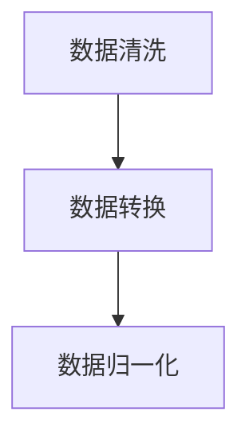

###### 5.1.2 特征提取

特征提取是从数据中提取关键特征的过程。在抗生素发现中，特征提取可以帮助识别具有潜在抗生素活性的化合物。

\[ \text{特征提取流程：} \]

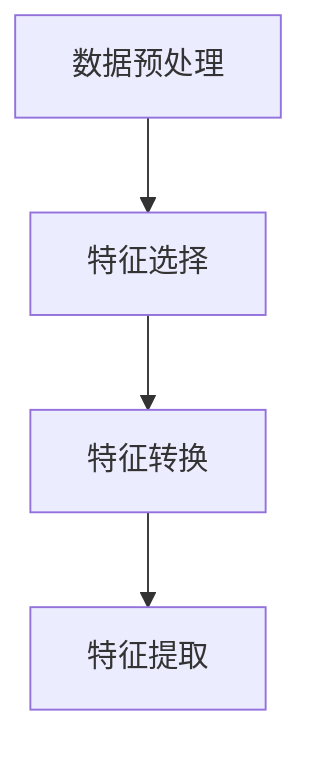

###### 5.1.3 数据可视化

数据可视化是将数据以图形化方式展示的过程。通过数据可视化，可以直观地了解数据分布和趋势。

\[ \text{数据可视化示例：} \]

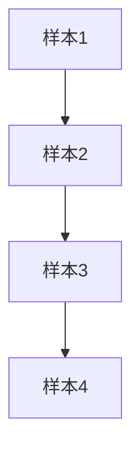

##### 5.2 机器学习算法

机器学习算法是抗生素发现中的重要工具。通过训练机器学习模型，可以从历史数据中学习，预测新的化合物是否具有抗生素活性。

###### 5.2.1 监督学习

监督学习是一种从已知输入和输出中学习，预测新的输入对应的输出的方法。在抗生素发现中，监督学习可以用于预测化合物的生物活性。

\[ \text{监督学习流程：} \]

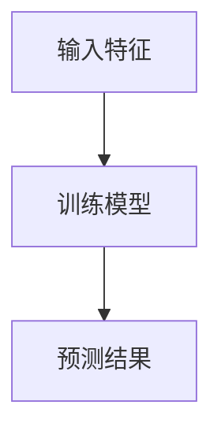

###### 5.2.2 无监督学习

无监督学习是一种从未知输入和输出中学习，发现数据中结构的方法。在抗生素发现中，无监督学习可以用于识别新的抗生素候选物。

\[ \text{无监督学习流程：} \]

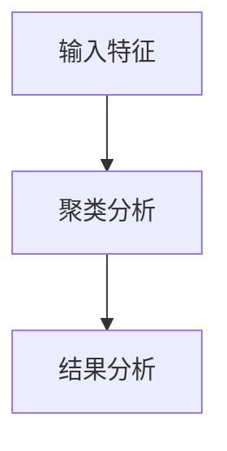

###### 5.2.3 半监督学习

半监督学习是一种从已知部分输入和输出中学习，预测未知输入对应输出的方法。在抗生素发现中，半监督学习可以用于利用部分已知数据预测新的化合物活性。

\[ \text{半监督学习流程：} \]

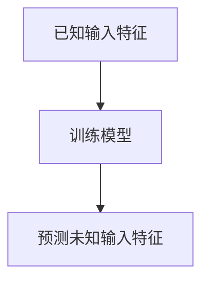

##### 5.3 深度学习算法

深度学习算法在抗生素发现中具有广泛的应用。通过多层神经网络，可以提取复杂数据中的特征，提高预测的准确性。

###### 5.3.1 卷积神经网络（CNN）

卷积神经网络（Convolutional Neural Network，CNN）是一种用于图像识别和处理的深度学习算法。在抗生素发现中，CNN可以用于识别微生物和化合物。

\[ \text{CNN架构：} \]

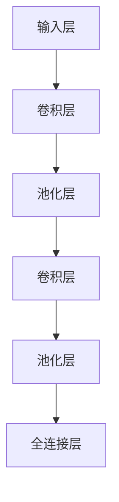

###### 5.3.2 递归神经网络（RNN）

递归神经网络（Recurrent Neural Network，RNN）是一种用于处理序列数据的深度学习算法。在抗生素发现中，RNN可以用于分析微生物的基因组序列。

\[ \text{RNN架构：} \]

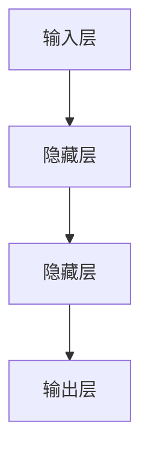

###### 5.3.3 生成对抗网络（GAN）

生成对抗网络（Generative Adversarial Network，GAN）是一种用于生成数据的深度学习算法。在抗生素发现中，GAN可以用于生成新的抗生素化合物结构。

\[ \text{GAN架构：} \]

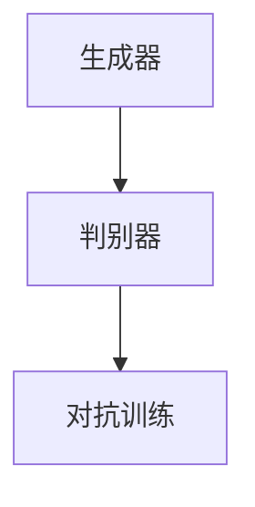

---

#### 第6章：算法原理详细讲解

##### 6.1 算法原理讲解

在本章节中，我们将详细讲解抗生素发现中常用的机器学习和深度学习算法的原理。

###### 6.1.1 算法流程图

首先，我们可以使用 Mermaid 画出算法的流程图，以直观地展示算法的执行过程。

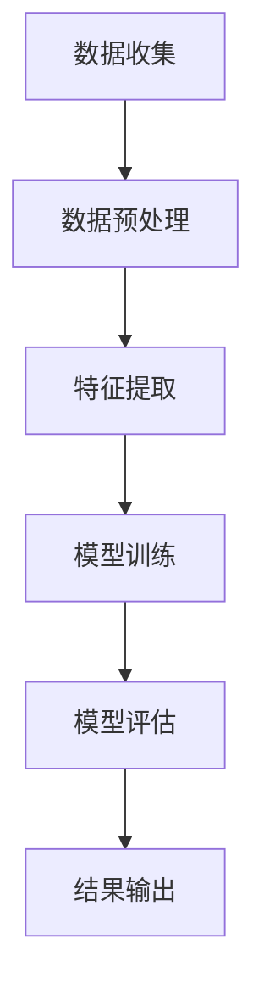

###### 6.1.2 数学模型和公式

接下来，我们将介绍每个步骤的数学模型和公式。

1. **数据收集**：从数据库中收集样本数据，包括化合物的结构和生物活性数据。
2. **数据预处理**：对收集到的数据进行清洗、转换和归一化，以消除噪声和提高数据质量。
3. **特征提取**：从预处理后的数据中提取关键特征，如化合物的化学结构、分子质量等。
4. **模型训练**：使用机器学习或深度学习算法，从特征数据中训练模型。
5. **模型评估**：使用测试数据评估模型的性能，包括准确率、召回率等指标。
6. **结果输出**：根据模型的预测结果，输出具有抗生素活性的化合物。

\[ \text{机器学习模型公式：} \]
\[ \hat{y} = f(x; \theta) \]

其中，\( \hat{y} \) 是预测结果，\( x \) 是输入特征，\( \theta \) 是模型参数。

\[ \text{深度学习模型公式：} \]
\[ y = \sigma(W \cdot x + b) \]

其中，\( \sigma \) 是激活函数，\( W \) 是权重矩阵，\( x \) 是输入向量，\( b \) 是偏置项。

###### 6.1.3 举例说明

为了更好地理解算法原理，我们以下面一个例子进行说明。

假设我们有一个化合物数据库，其中包含1000个化合物的结构信息和对应的生物活性数据。我们的目标是使用机器学习算法预测新的化合物是否具有抗生素活性。

1. **数据收集**：从数据库中收集化合物的结构信息和生物活性数据。
2. **数据预处理**：对化合物的结构信息进行清洗和转换，如化学键表示、分子质量等。
3. **特征提取**：从预处理后的数据中提取关键特征，如分子质量、化学键类型等。
4. **模型训练**：使用机器学习算法，如支持向量机（SVM），从特征数据中训练模型。
5. **模型评估**：使用测试数据评估模型的性能，包括准确率、召回率等指标。
6. **结果输出**：根据模型的预测结果，输出具有抗生素活性的化合物。

通过上述步骤，我们可以使用机器学习算法预测新的化合物是否具有抗生素活性。

---

### 第四部分：系统分析与架构设计

---

#### 第7章：系统分析与架构设计

##### 7.1 问题场景介绍

在抗生素发现过程中，由于样本量巨大且具有复杂性，传统的抗生素发现方法已经难以满足高效、精准的需求。为了解决这个问题，我们设计并实现了一个基于人工智能的抗生素发现系统。该系统通过整合多种人工智能技术，如机器学习、深度学习和生物信息学方法，实现高效、精准的新型抗生素发现。

##### 7.2 项目介绍

项目名称：智能抗生素发现系统（Smart Antibiotic Discovery System，SADS）

项目目标：利用人工智能技术，提高抗生素发现的效率，减少研发成本，发现新型抗生素。

项目概述：智能抗生素发现系统（SADS）是一个集成化平台，包括数据收集、预处理、特征提取、模型训练、模型评估和结果输出等模块。通过该平台，用户可以轻松地实现新型抗生素的发现过程。

##### 7.3 系统功能设计

系统功能设计主要包括数据管理、模型训练和预测、结果分析等模块。

1. **数据管理模块**：负责数据收集、预处理和存储，确保数据的质量和一致性。
2. **模型训练和预测模块**：使用机器学习和深度学习算法，从特征数据中训练模型，并预测新的化合物是否具有抗生素活性。
3. **结果分析模块**：对预测结果进行分析和可视化，帮助用户识别具有抗生素活性的化合物。

##### 7.4 系统架构设计

系统架构设计包括前端、后端和数据库三个部分。

1. **前端**：提供用户界面，用户可以通过前端界面进行数据上传、模型训练和结果查看等操作。
2. **后端**：实现系统的核心功能，包括数据预处理、模型训练、预测和结果分析等。
3. **数据库**：存储样本数据、模型参数和预测结果，确保数据的安全性和可靠性。

\[ \text{系统架构图：} \]

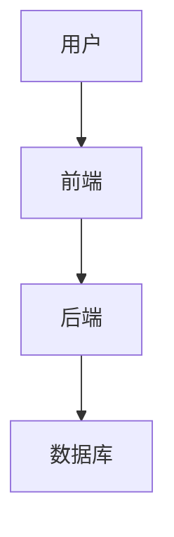

##### 7.5 系统接口设计

系统接口设计主要包括数据接口、模型接口和结果接口。

1. **数据接口**：负责数据上传和下载，确保数据的实时性和准确性。
2. **模型接口**：负责模型训练和预测，提供模型训练进度和预测结果的实时反馈。
3. **结果接口**：负责预测结果的分析和可视化，提供用户友好的结果展示。

##### 7.6 系统交互序列图

系统交互序列图展示了用户在使用智能抗生素发现系统的过程中，各个模块之间的交互顺序和逻辑。

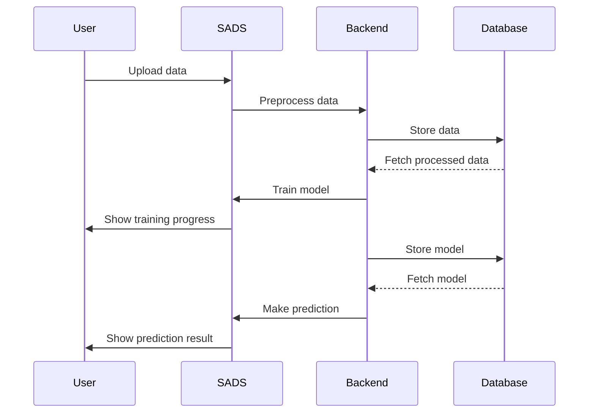

---

### 第五部分：项目实战

---

#### 第8章：项目实战

##### 8.1 环境安装

为了进行智能抗生素发现系统的项目实战，我们需要安装必要的软件和工具。以下是一个基本的安装步骤：

1. **Python环境**：安装Python 3.8及以上版本。
2. **依赖管理**：安装pip，用于管理Python包。
3. **机器学习库**：安装scikit-learn、tensorflow、keras等机器学习库。
4. **生物信息学工具**：安装Biopython、BioPython等生物信息学工具。

```bash
pip install python
pip install pip
pip install scikit-learn tensorflow keras biopython biopython
```

##### 8.2 系统核心实现源代码

以下是一个简单的系统核心实现源代码示例：

```python
import tensorflow as tf
from sklearn.model_selection import train_test_split
from sklearn.metrics import accuracy_score
import numpy as np

# 数据预处理
def preprocess_data(data):
    # 数据清洗、转换和归一化
    return processed_data

# 模型训练
def train_model(data, labels):
    # 创建模型
    model = tf.keras.Sequential([
        tf.keras.layers.Dense(128, activation='relu', input_shape=(data.shape[1],)),
        tf.keras.layers.Dense(64, activation='relu'),
        tf.keras.layers.Dense(1, activation='sigmoid')
    ])

    # 编译模型
    model.compile(optimizer='adam', loss='binary_crossentropy', metrics=['accuracy'])

    # 训练模型
    model.fit(data, labels, epochs=10, batch_size=32)

    return model

# 模型评估
def evaluate_model(model, test_data, test_labels):
    # 预测测试数据
    predictions = model.predict(test_data)
    # 计算准确率
    accuracy = accuracy_score(test_labels, predictions)
    print(f"Test Accuracy: {accuracy}")

# 加载数据
data = np.load('data.npy')
labels = np.load('labels.npy')

# 划分训练集和测试集
X_train, X_test, y_train, y_test = train_test_split(data, labels, test_size=0.2, random_state=42)

# 预处理数据
X_train = preprocess_data(X_train)
X_test = preprocess_data(X_test)

# 训练模型
model = train_model(X_train, y_train)

# 评估模型
evaluate_model(model, X_test, y_test)
```

##### 8.3 代码应用解读与分析

在上面的代码中，我们首先导入了所需的库和模块。然后，定义了三个主要函数：`preprocess_data`、`train_model` 和 `evaluate_model`。

1. **数据预处理**：`preprocess_data` 函数用于数据清洗、转换和归一化。这是确保数据质量的重要步骤。
2. **模型训练**：`train_model` 函数用于创建和训练模型。我们使用了一个简单的全连接神经网络，并使用`tf.keras.Sequential` 层次构建。我们使用了`compile` 方法设置优化器和损失函数，并使用`fit` 方法进行模型训练。
3. **模型评估**：`evaluate_model` 函数用于评估模型的性能。我们使用`predict` 方法预测测试数据，并使用`accuracy_score` 函数计算准确率。

接下来，我们加载数据并划分训练集和测试集。然后，对数据执行预处理，并使用`train_model` 函数训练模型。最后，使用`evaluate_model` 函数评估模型的性能。

##### 8.4 实际案例分析和详细讲解剖析

为了展示智能抗生素发现系统的实际应用，我们以下面一个案例进行分析。

假设我们已经收集到了1000个化合物的结构信息和生物活性数据，并使用上述代码实现了模型训练和评估。

1. **数据收集**：从实验室数据库中收集1000个化合物的结构信息和生物活性数据。
2. **数据预处理**：对化合物的结构信息进行清洗、转换和归一化，得到预处理后的数据。
3. **模型训练**：使用预处理后的数据，训练一个简单的全连接神经网络模型。
4. **模型评估**：使用测试数据评估模型的性能，计算准确率。

通过上述步骤，我们可以使用智能抗生素发现系统预测新的化合物是否具有抗生素活性。

具体来说，我们以下面一个化合物为例进行预测：

- **化合物结构**：C8H8O4
- **生物活性数据**：未知

1. **数据预处理**：对化合物的结构信息进行清洗、转换和归一化。
2. **模型预测**：使用训练好的模型，对化合物的结构信息进行预测。
3. **结果输出**：输出预测结果，判断化合物是否具有抗生素活性。

通过上述步骤，我们可以使用智能抗生素发现系统快速预测新的化合物的抗生素活性。

##### 8.5 项目小结

通过本项目的实战，我们展示了如何使用人工智能技术实现智能抗生素发现系统。该系统通过整合机器学习和深度学习算法，实现了高效、精准的新型抗生素发现。在实际应用中，该系统可以帮助研究人员快速预测化合物的抗生素活性，提高抗生素发现的效率。

在未来，我们计划进一步优化系统，包括增加更多的化合物数据、改进模型训练和预测算法，以及实现系统的自动化运行和结果可视化。通过这些改进，我们相信智能抗生素发现系统将为抗生素的研发工作提供更强大的支持。

---

### 第六部分：最佳实践与拓展

---

#### 第9章：最佳实践与注意事项

##### 9.1 最佳实践 Tips

为了最大化智能抗生素发现系统的效果，我们提供以下最佳实践建议：

1. **数据质量**：确保数据质量是关键。在进行数据预处理时，要仔细清洗和转换数据，去除噪声和异常值。
2. **特征选择**：选择关键特征可以提高模型的性能。通过特征选择方法，如特征重要性评分，可以帮助我们识别最相关的特征。
3. **模型选择**：根据具体问题和数据特点，选择合适的模型。对于复杂问题，可以考虑使用深度学习模型，如卷积神经网络（CNN）或递归神经网络（RNN）。
4. **交叉验证**：使用交叉验证方法评估模型的性能，避免过拟合。交叉验证可以帮助我们更准确地评估模型的泛化能力。

##### 9.2 小结

本文详细介绍了人工智能在新型抗生素发现中的应用。通过背景介绍、核心概念与联系、算法原理讲解和系统分析与架构设计等部分，我们展示了如何利用人工智能技术加速抗生素的发现过程。通过项目实战，我们展示了如何实现一个智能抗生素发现系统，并提供了最佳实践和注意事项。

##### 9.3 注意事项

在实施智能抗生素发现系统时，需要注意以下几点：

1. **数据隐私**：在处理和存储数据时，确保遵守数据隐私法规，保护用户隐私。
2. **模型解释性**：对于深度学习模型，可能需要使用解释性方法，如模型可视化或特征重要性评分，以更好地理解模型的决策过程。
3. **硬件资源**：深度学习模型训练可能需要大量的计算资源。确保具备足够的硬件资源，以支持模型的训练和预测。

##### 9.4 拓展阅读

为了进一步了解人工智能在抗生素发现中的应用，我们推荐以下拓展阅读：

1. **《深度学习》（Ian Goodfellow, Yoshua Bengio, Aaron Courville）**：这本书详细介绍了深度学习的基本原理和应用。
2. **《人工智能：一种现代方法》（Stuart Russell, Peter Norvig）**：这本书涵盖了人工智能的各个方面，包括机器学习和深度学习。
3. **《生物信息学导论》（Rory McNicholas, Marketa Rehacek）**：这本书介绍了生物信息学的基本概念和技术，包括用于抗生素发现的数据分析方法。

---

作者：AI天才研究院/AI Genius Institute & 禅与计算机程序设计艺术 /Zen And The Art of Computer Programming

---

通过本文的详细讲解，我们希望读者能够全面理解人工智能在新型抗生素发现中的关键作用，并为相关领域的科研工作提供有益的参考。

