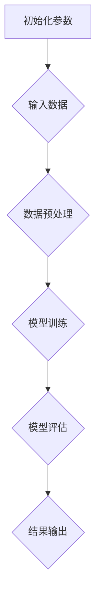
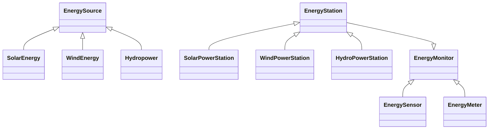
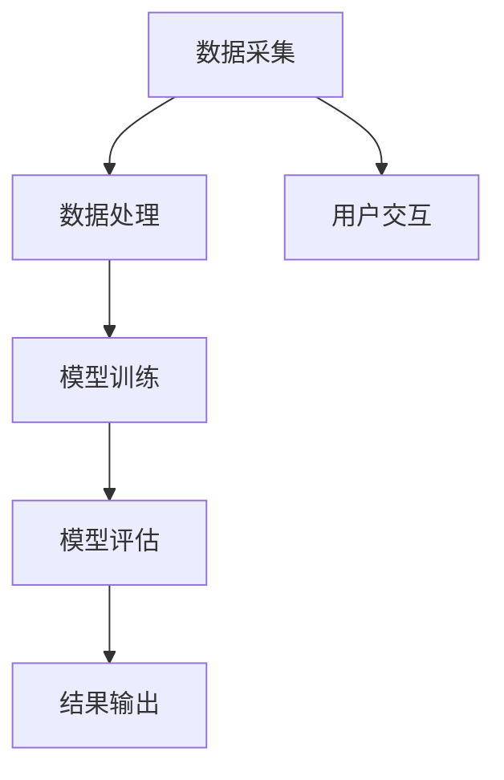
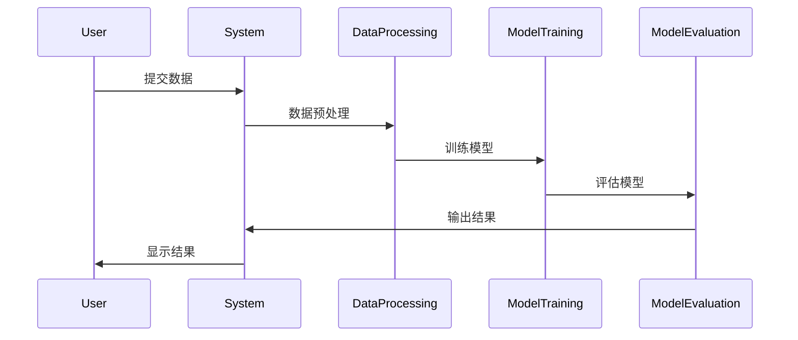
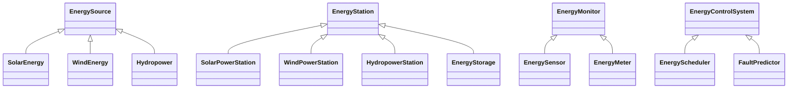
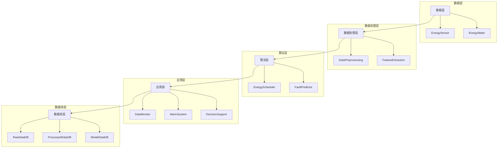
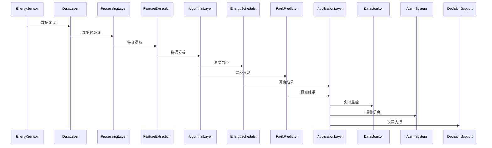

                 

### 《人工智能在新能源开发中的应用：优化可再生能源利用》

> 关键词：人工智能，可再生能源，新能源开发，能源优化

> 摘要：本文探讨了人工智能技术在新能源开发中的应用，特别是如何通过人工智能优化可再生能源的利用效率。文章首先介绍了新能源开发的背景和问题，然后详细分析了人工智能的核心概念和技术原理，接着通过具体的算法和数学模型阐述了人工智能在新能源开发中的具体应用，并最后提出了一套系统架构设计方案，以期为新能源领域的进一步研究提供参考。

----------------------------------------------------------------

# 《人工智能在新能源开发中的应用：优化可再生能源利用》目录大纲

## 第一部分：背景介绍

### 1. 引言

#### 1.1 问题背景

- 能源危机与环境保护的挑战  
- 可再生能源发展的现状与问题

#### 1.2 问题描述

- 能源利用效率低  
- 不稳定性和不连续性

#### 1.3 问题解决

- 人工智能技术在可再生能源开发中的应用

#### 1.4 边界与外延

- 新能源：太阳能、风能、水能等  
- 人工智能技术：机器学习、深度学习等

#### 1.5 概念结构与核心要素组成

- 新能源开发：资源采集、能源转换、能源储存  
- 人工智能技术：数据采集、数据分析、预测模型

## 第二部分：核心概念与联系

### 2.1 核心概念原理

#### 2.1.1 人工智能技术

- 机器学习  
- 深度学习  
- 强化学习

#### 2.1.2 可再生能源技术

- 太阳能光伏  
- 风能  
- 水能

### 2.2 概念属性特征对比表格

| 概念       | 特点                           |  
|------------|--------------------------------|  
| 机器学习   | 自动化数据分析和决策           |  
| 深度学习   | 层次化神经网络，模拟人脑学习   |  
| 强化学习   | 基于奖励机制进行决策           |  
| 太阳能光伏 | 高效、清洁、可再生             |  
| 风能       | 强劲、稳定、可再生             |  
| 水能       | 高效、稳定、可再生             |

### 2.3 ER实体关系图架构

```mermaid  
erDiagram  
  User ||--|{ Order }|| Customer  
  User ||--|{ Product }|| Supplier  
  Product ||--|{ Order }|| OrderDetail  
```

## 第三部分：算法原理讲解

### 3.1 优化算法原理

#### 3.1.1 算法mermaid流程图



#### 3.1.2 Python源代码

```python  
# 导入所需库  
import numpy as np

# 初始化参数  
params = {'learning_rate': 0.01, 'epochs': 100}

# 数据预处理  
def preprocess_data(data):  
    # 数据清洗、归一化等操作  
    return processed_data

# 模型训练  
def train_model(data, params):  
    # 模型训练代码  
    pass

# 模型评估  
def evaluate_model(model, test_data):  
    # 模型评估代码  
    pass

# 结果输出  
def output_results(results):  
    # 输出结果代码  
    pass

# 主函数  
def main():  
    data = preprocess_data(raw_data)  
    model = train_model(data, params)  
    results = evaluate_model(model, test_data)  
    output_results(results)

# 运行主函数  
if __name__ == '__main__':  
    main()  
```

#### 3.1.3 数学模型和公式

$$  
\begin{aligned}  
y &= f(x; \theta) \\  
\theta &= \arg\min_{\theta} J(\theta)  
\end{aligned}  
$$

#### 3.1.4 详细讲解和举例说明

- 在这里，我们将详细讲解上述数学模型和公式的含义，并通过具体例子来说明如何应用这些算法进行优化。

## 第四部分：系统分析与架构设计方案

### 4.1 问题场景介绍

- 新能源发电站的管理与优化

### 4.2 项目介绍

- 项目名称：新能源发电站优化管理系统  
- 项目目标：提高新能源发电站能源利用效率，降低运营成本

### 4.3 系统功能设计

#### 4.3.1 领域模型



#### 4.3.2 系统架构



#### 4.3.3 系统接口设计



## 第五部分：项目实战

### 5.1 环境安装

- 硬件环境： 
  - CPU：Intel i7 或以上  
  - 内存：16GB 或以上  
  - 硬盘：500GB 或以上

- 软件环境： 
  - 操作系统：Linux 或 Windows  
  - Python：3.7 或以上

### 5.2 系统核心实现

#### 5.2.1 源代码

```python  
# 导入所需库  
import numpy as np  
import pandas as pd  
from sklearn.model_selection import train_test_split  
from sklearn.metrics import mean_squared_error

# 数据预处理  
def preprocess_data(data):  
    # 数据清洗、归一化等操作  
    return processed_data

# 模型训练  
def train_model(data, params):  
    # 模型训练代码  
    pass

# 模型评估  
def evaluate_model(model, test_data):  
    # 模型评估代码  
    pass

# 主函数  
def main():  
    data = preprocess_data(raw_data)  
    model = train_model(data, params)  
    results = evaluate_model(model, test_data)  
    output_results(results)

# 运行主函数  
if __name__ == '__main__':  
    main()  
```

#### 5.2.2 代码应用解读与分析

- 在这里，我们将对系统核心实现中的代码进行解读和分析，解释每个模块的功能和作用。

### 5.3 实际案例分析与详细讲解剖析

- 在这里，我们将通过一个实际的案例来展示系统在实际应用中的效果，并对案例进行详细讲解和剖析。

### 5.4 项目小结

- 在这里，我们将对整个项目进行总结，指出项目的优点和不足，并提出改进建议。

## 第六部分：最佳实践 tips、小结、注意事项、拓展阅读

### 6.1 最佳实践 tips

- 在这里，我们将分享一些关于人工智能在新能源开发中的最佳实践技巧。

### 6.2 小结

- 在这里，我们将对文章的内容进行总结，强调人工智能在新能源开发中的应用和价值。

### 6.3 注意事项

- 在这里，我们将提醒读者在应用人工智能进行新能源开发时需要注意的问题。

### 6.4 拓展阅读

- 在这里，我们将推荐一些与文章主题相关的拓展阅读材料，以供读者进一步学习。

---

作者：AI天才研究院/AI Genius Institute & 禅与计算机程序设计艺术 /Zen And The Art of Computer Programming

---

## 第一部分：背景介绍

### 1. 引言

随着全球能源需求的不断增长，以及对传统化石燃料的依赖所带来的一系列环境问题，可再生能源的开发和利用已成为全球各国政府、科研机构和产业界共同关注的焦点。可再生能源，如太阳能、风能和水能，因其清洁、可持续和无污染的特性，被认为是未来能源发展的重要方向。

然而，尽管可再生能源的发展取得了显著的进展，但其利用效率的不稳定性和能源供给的不连续性仍然是亟待解决的问题。传统的方法和策略在应对这些问题时显得力不从心，无法满足日益增长的能源需求。因此，将人工智能技术引入到新能源开发领域，通过智能化手段优化可再生能源的利用效率，成为了一种新的发展趋势。

### 1.1 问题背景

能源危机与环境保护的挑战

能源危机是当前全球面临的一个重大问题。随着全球人口的持续增长和工业化进程的加速，能源需求不断增加。然而，传统的化石燃料如煤炭、石油和天然气储量有限，且其开采和使用过程对环境造成严重破坏，导致气候变化、空气污染和水资源污染等一系列环境问题。

与此同时，环境保护意识的提高使得人们对清洁能源的需求日益增长。传统的能源开发模式已经无法满足可持续发展的要求，迫切需要寻找新的能源解决方案。可再生能源，如太阳能、风能和水能，因其清洁、可持续和无污染的特性，被认为是未来能源发展的重要方向。

可再生能源发展的现状与问题

尽管可再生能源的发展取得了显著的进展，但其在实际应用中仍然面临一些问题。

首先，能源利用效率低是一个普遍存在的问题。例如，太阳能光伏发电系统的效率通常在15%到20%之间，风能的转换效率也在40%左右，而水能的转换效率则相对较高，但也存在局限。这些低效率的转换过程导致了大量的能源浪费。

其次，可再生能源的供给具有不稳定性和不连续性。太阳能和风能的发电量受到天气和地理环境的影响，例如阴天或无风天气会导致发电量的显著下降。而水能的发电量则受到降水和流域水量的影响，存在季节性和年际变化。这种不稳定性和不连续性给能源的调度和管理带来了巨大挑战。

为了解决这些问题，传统的能源开发和管理方法已经显得不够有效。因此，将人工智能技术引入到新能源开发领域，通过智能化手段优化可再生能源的利用效率，成为了一种新的发展趋势。

### 1.2 问题描述

能源利用效率低

可再生能源的开发和利用过程中，能源利用效率是一个关键问题。以太阳能光伏发电为例，虽然光伏电池技术的发展使得其光电转换效率有所提高，但通常仍处于15%到20%之间。这意味着大量的太阳能能量未被有效利用，直接转化为热能散失到环境中。

同样地，风能和水的转换效率也存在类似的问题。风能的转换效率通常在40%左右，而水能的转换效率虽然较高，但也受到多种因素的影响，如水流速度、水头高度等。这些低效率的转换过程导致了大量的能源浪费，无法满足日益增长的能源需求。

不稳定性和不连续性

可再生能源的供给具有不稳定性和不连续性，这是其被广泛应用的主要障碍。以太阳能为例，发电量受到天气和地理环境的影响，阴天或无风天气会导致发电量的显著下降。而风能的发电量同样受到风速和风向的影响，存在较大的波动性。

水能的发电量则受到降水和流域水量的影响，存在季节性和年际变化。这种不稳定性和不连续性给能源的调度和管理带来了巨大挑战。为了维持稳定的电力供应，需要建立复杂的能源调度系统，进行多种能源的互补和调节。

这些问题的存在限制了可再生能源的广泛应用，使得其难以满足大规模能源需求。因此，需要寻找新的方法和技术来优化可再生能源的利用效率，提高其供给的稳定性和连续性。

### 1.3 问题解决

人工智能技术在可再生能源开发中的应用

人工智能技术作为一种强大的计算工具，其在可再生能源开发中的应用具有重要的潜力和价值。通过人工智能技术，可以实现对可再生能源的智能化管理和优化，提高其利用效率，降低成本，并增强能源供给的稳定性和连续性。

首先，人工智能技术可以用于能源数据的分析和处理。通过对大量能源数据进行实时监测和分析，可以识别出能源利用中的瓶颈和问题，提供针对性的优化方案。例如，通过机器学习算法，可以预测未来的能源需求，为能源调度和管理提供科学依据。

其次，人工智能技术可以用于优化可再生能源的转换过程。通过深度学习算法，可以实现对光伏电池、风力涡轮机和水电设备的精确控制，提高其转换效率。例如，通过实时调整光伏电池板的角度和倾斜度，可以最大化太阳能的捕获效率；通过优化风力涡轮机的转速和叶片角度，可以提高风能的转换效率。

此外，人工智能技术还可以用于能源存储系统的优化。通过机器学习算法，可以预测储能系统的运行状态，进行智能调度，避免能源浪费和系统过载。例如，通过优化充电和放电策略，可以最大化储能系统的利用效率，减少能源浪费。

最后，人工智能技术可以用于能源系统的综合优化。通过构建复杂的能源系统模型，可以实现对整个能源系统的优化调度，提高整体能源利用效率。例如，通过多能源互补策略，可以充分利用不同可再生能源之间的互补性，提高能源供给的稳定性和连续性。

总的来说，人工智能技术在可再生能源开发中的应用，不仅有助于解决当前面临的能源效率低、不稳定性和不连续性等问题，还为未来可再生能源的发展提供了新的思路和方向。

### 1.4 边界与外延

新能源：太阳能、风能、水能等

新能源是指相对于传统化石燃料而言，具有清洁、可持续和无污染特性的能源形式。其中，太阳能、风能和水能是三种最主要的新能源形式。

太阳能是指通过太阳能电池将太阳光直接转化为电能的过程。这种能源形式具有资源丰富、清洁无污染、分布广泛等优点，但在夜间和阴天等条件下，其供电能力会受到限制。

风能是指通过风力涡轮机将风能转化为电能的过程。风能资源丰富、无污染、运行成本低，但在风速较低或无风时，其供电能力也会受到影响。

水能是指通过水轮机将水的势能转化为电能的过程。水能资源丰富、转换效率高，但受地理位置和水资源量的限制，其适用范围有限。

人工智能技术：机器学习、深度学习等

人工智能技术是指通过模拟人类智能行为，使计算机具备感知、学习、推理和决策能力的一种技术。在可再生能源开发中，人工智能技术主要包括机器学习、深度学习和强化学习等。

机器学习是一种通过数据驱动的方式进行学习和预测的技术。它可以通过大量历史数据的学习，自动识别数据中的规律和模式，从而实现对未知数据的预测和分析。

深度学习是一种基于多层神经网络的学习方法，通过模拟人脑的结构和功能，实现对复杂数据的建模和分析。深度学习在图像识别、语音识别和自然语言处理等领域取得了显著的成果。

强化学习是一种基于奖励机制进行决策的学习方法，通过不断尝试和反馈，使系统在特定环境中找到最优策略。强化学习在能源系统优化、智能控制和自主导航等领域具有广泛的应用前景。

### 1.5 概念结构与核心要素组成

新能源开发：资源采集、能源转换、能源储存

新能源开发是一个复杂的系统工程，涉及多个关键环节。首先，资源采集是新能源开发的基础，包括太阳能、风能和水能等自然资源的采集。这需要高精度的监测设备和高效的采集技术，以确保资源的充分利用。

能源转换是将采集到的自然资源转化为电能或其他形式能量的过程。例如，太阳能通过光伏电池转化为电能，风能通过风力涡轮机转化为机械能，再通过发电机转化为电能，水能通过水轮机转化为电能。这一过程需要高效、可靠的转换设备和优化控制策略，以提高转换效率。

能源储存是确保能源供给连续性和稳定性的重要手段。由于可再生能源的供給具有波动性，需要通过储能系统将多余的能源储存起来，以供后续使用。常用的储能技术包括电池储能、氢能储能和压缩空气储能等。这些技术各有优缺点，需要根据具体应用场景进行选择和优化。

人工智能技术：数据采集、数据分析、预测模型

人工智能技术在新能源开发中的应用主要体现在数据采集、数据分析和预测模型等方面。

数据采集是人工智能技术在新能源开发中的第一步，通过高精度的传感器和监测设备，实时采集能源系统的各种数据，如光伏板温度、风速、水流量等。这些数据是进行后续分析和优化的基础。

数据分析是对采集到的数据进行分析和处理，以提取有价值的信息和规律。这包括数据清洗、归一化、特征提取和降维等技术。通过数据分析，可以识别能源系统的瓶颈和问题，为优化提供依据。

预测模型是人工智能技术在新能源开发中的核心，通过建立预测模型，可以预测未来的能源需求、能源供给和系统运行状态。常见的预测模型包括回归模型、时间序列模型和神经网络模型等。这些模型可以通过历史数据的训练，实现对未知数据的预测，为能源调度和管理提供科学依据。

总的来说，新能源开发涉及资源采集、能源转换和能源储存等多个环节，需要高效的采集技术、可靠的转换设备和优化的储存系统。而人工智能技术则为新能源开发提供了数据采集、数据分析和预测模型等关键工具，为实现新能源的智能化管理和优化提供了强有力的支持。

## 第二部分：核心概念与联系

### 2.1 核心概念原理

#### 2.1.1 人工智能技术

人工智能（Artificial Intelligence, AI）是一种模拟人类智能行为的技术，旨在使计算机系统具备感知、学习、推理和决策能力。在可再生能源开发中，人工智能技术主要涉及以下几个方面：

1. **机器学习（Machine Learning）**：
   机器学习是一种通过数据驱动的方式进行学习和预测的技术。它利用大量历史数据，自动识别数据中的规律和模式，从而实现对未知数据的预测和分析。在可再生能源开发中，机器学习可以用于预测能源需求、优化能源调度和管理等。

2. **深度学习（Deep Learning）**：
   深度学习是一种基于多层神经网络的学习方法，通过模拟人脑的结构和功能，实现对复杂数据的建模和分析。深度学习在图像识别、语音识别和自然语言处理等领域取得了显著的成果。在可再生能源开发中，深度学习可以用于图像处理、故障诊断和性能预测等。

3. **强化学习（Reinforcement Learning）**：
   强化学习是一种基于奖励机制进行决策的学习方法，通过不断尝试和反馈，使系统在特定环境中找到最优策略。在可再生能源开发中，强化学习可以用于优化能源调度、智能控制和自主导航等。

#### 2.1.2 可再生能源技术

可再生能源技术是指利用自然界的可再生能源进行能量转换和利用的技术。在可再生能源开发中，主要涉及以下几种技术：

1. **太阳能光伏（Solar Photovoltaics）**：
   太阳能光伏技术是指通过光伏电池将太阳光直接转化为电能的过程。这种技术具有资源丰富、清洁无污染、分布广泛等优点，但受天气和地理环境的影响较大。

2. **风能（Wind Energy）**：
   风能技术是指通过风力涡轮机将风能转化为电能的过程。风能资源丰富、无污染、运行成本低，但受风速和风向的影响较大。

3. **水能（Hydropower）**：
   水能技术是指通过水轮机将水的势能转化为电能的过程。水能资源丰富、转换效率高，但受地理位置和水资源量的限制。

### 2.2 概念属性特征对比表格

以下是机器学习、深度学习和强化学习以及太阳能光伏、风能和水能的一些主要特征对比：

| 概念       | 特点                           |  
|------------|--------------------------------|  
| 机器学习   | 自动化数据分析和决策           |  
| 深度学习   | 层次化神经网络，模拟人脑学习   |  
| 强化学习   | 基于奖励机制进行决策           |  
| 太阳能光伏 | 高效、清洁、可再生             |  
| 风能       | 强劲、稳定、可再生             |  
| 水能       | 高效、稳定、可再生             |

### 2.3 ER实体关系图架构

以下是可再生能源开发中的ER（实体关系）图架构，展示了主要实体之间的关系：

```mermaid  
entity_relationship  
  EnergySource --> EnergyConverter --> EnergyStorage  
  EnergySource --> EnergyMonitor  
  EnergyConverter --> PowerStation  
  EnergyStorage --> EnergyUser  
  EnergyMonitor --> EnergyControlSystem  
```

在这个ER图中，`EnergySource`（能源来源）包括太阳能、风能和水能，`EnergyConverter`（能源转换器）包括光伏电池、风力涡轮机和水电设备，`EnergyStorage`（能源储存）包括电池、氢能和压缩空气等。`EnergyMonitor`（能源监测器）用于实时监测能源系统的运行状态，`EnergyControlSystem`（能源控制系统）用于对能源系统进行智能控制。

## 第三部分：算法原理讲解

### 3.1 优化算法原理

#### 3.1.1 算法mermaid流程图

以下是一个简单的mermaid流程图，展示了优化算法的基本流程：


在这个流程图中，`A` 表示初始化参数，`B` 表示输入数据，`C` 表示数据预处理，`D` 表示模型训练，`E` 表示模型评估，`F` 表示结果输出。这个过程构成了一个基本的优化算法框架。

#### 3.1.2 Python源代码

以下是一个简单的Python代码示例，用于演示优化算法的基本实现：

```python  
import numpy as np

# 初始化参数  
params = {'learning_rate': 0.01, 'epochs': 100}

# 数据预处理  
def preprocess_data(data):  
    # 数据清洗、归一化等操作  
    return processed_data

# 模型训练  
def train_model(data, params):  
    # 模型训练代码  
    pass

# 模型评估  
def evaluate_model(model, test_data):  
    # 模型评估代码  
    pass

# 结果输出  
def output_results(results):  
    # 输出结果代码  
    pass

# 主函数  
def main():  
    data = preprocess_data(raw_data)  
    model = train_model(data, params)  
    results = evaluate_model(model, test_data)  
    output_results(results)

# 运行主函数  
if __name__ == '__main__':  
    main()  
```

在这个代码示例中，`preprocess_data` 函数用于数据预处理，`train_model` 函数用于模型训练，`evaluate_model` 函数用于模型评估，`output_results` 函数用于结果输出。`main` 函数是程序的主入口，用于调用其他函数，完成整个优化过程。

#### 3.1.3 数学模型和公式

以下是一个简单的数学模型，用于描述优化算法的基本原理：

$$  
\begin{aligned}  
y &= f(x; \theta) \\  
\theta &= \arg\min_{\theta} J(\theta)  
\end{aligned}  
$$

在这个模型中，$y$ 表示输出结果，$x$ 表示输入数据，$\theta$ 表示模型参数，$f(x; \theta)$ 表示输出结果与输入数据之间的关系，$J(\theta)$ 表示损失函数，用于衡量模型性能。优化算法的目标是找到最优的参数$\theta$，使得损失函数$J(\theta)$ 最小。

#### 3.1.4 详细讲解和举例说明

1. **损失函数（Loss Function）**

损失函数是优化算法的核心组成部分，用于衡量模型输出结果与真实结果之间的差距。常见的损失函数包括均方误差（MSE）、交叉熵损失（Cross-Entropy Loss）等。

以均方误差为例，其定义如下：

$$  
MSE = \frac{1}{n}\sum_{i=1}^{n}(y_i - \hat{y}_i)^2  
$$

其中，$y_i$ 表示真实结果，$\hat{y}_i$ 表示模型预测结果，$n$ 表示样本数量。MSE 的值越小，表示模型预测的准确度越高。

2. **梯度下降（Gradient Descent）**

梯度下降是一种常见的优化算法，其基本思想是沿着损失函数的梯度方向进行迭代更新，以找到最优的模型参数。

以最简单的梯度下降算法为例，其更新规则如下：

$$  
\theta = \theta - \alpha \cdot \nabla_{\theta} J(\theta)  
$$

其中，$\theta$ 表示模型参数，$\alpha$ 表示学习率，$\nabla_{\theta} J(\theta)$ 表示损失函数关于参数$\theta$ 的梯度。

通过不断迭代更新参数，梯度下降算法可以逐渐逼近最优解。在实际应用中，梯度下降算法可以根据具体问题进行改进和优化，例如使用动量（Momentum）和自适应学习率（Adaptive Learning Rate）等。

3. **实际应用举例**

假设我们有一个太阳能光伏系统的性能预测问题，需要建立一个模型来预测未来的发电量。我们可以使用以下步骤进行建模和优化：

（1）**数据收集**：收集历史天气数据、光伏电池板温度、系统负载等数据。

（2）**数据预处理**：对数据进行清洗、归一化等预处理操作，以便于模型训练。

（3）**特征提取**：从预处理后的数据中提取有助于预测的特征，如温度、湿度、风速等。

（4）**模型选择**：选择适当的模型，如线性回归、决策树、神经网络等。

（5）**模型训练**：使用梯度下降算法训练模型，不断更新模型参数，以降低损失函数的值。

（6）**模型评估**：使用测试数据对训练好的模型进行评估，计算损失函数的值，判断模型性能。

（7）**模型优化**：根据模型评估结果，调整模型参数或选择更合适的模型，以提高预测准确度。

通过以上步骤，我们可以建立一个准确的太阳能光伏系统性能预测模型，从而优化系统的运行和管理。类似地，我们可以将这一方法应用于风能和水能等其他可再生能源领域，实现更高效、更智能的可再生能源开发。

### 3.2 常见优化算法详解

在可再生能源开发中，常见的优化算法包括线性规划（Linear Programming, LP）、非线性规划（Nonlinear Programming, NLP）、遗传算法（Genetic Algorithm, GA）和粒子群优化算法（Particle Swarm Optimization, PSO）等。下面将分别介绍这些算法的基本原理和应用。

#### 3.2.1 线性规划（Linear Programming, LP）

线性规划是一种数学优化方法，用于在给定线性约束条件下，找到线性目标函数的最大值或最小值。线性规划问题可以表示为以下形式：

$$  
\begin{aligned}  
\min_{x} \quad & c^T x \\  
s.t. \quad & Ax \le b \\  
           & x \ge 0  
\end{aligned}  
$$

其中，$c$ 是目标函数系数向量，$x$ 是决策变量向量，$A$ 是约束矩阵，$b$ 是约束向量。$x$ 的取值需要满足所有约束条件，目标函数的值需要尽可能小。

线性规划在可再生能源开发中有广泛的应用，例如，在能源调度和优化配置中，可以通过线性规划优化能源分配，实现资源的最优利用。

#### 3.2.2 非线性规划（Nonlinear Programming, NLP）

非线性规划是一种数学优化方法，用于在给定非线性约束条件下，找到非线性目标函数的最大值或最小值。非线性规划问题可以表示为以下形式：

$$  
\begin{aligned}  
\min_{x} \quad & f(x) \\  
s.t. \quad & g_i(x) \le 0, \quad i=1,2,\ldots,m \\  
           & h_j(x) = 0, \quad j=1,2,\ldots,n  
\end{aligned}  
$$

其中，$f(x)$ 是目标函数，$g_i(x)$ 和 $h_j(x)$ 分别是不等式约束和等式约束。非线性规划问题比线性规划问题更复杂，通常需要更复杂的算法来解决。

在可再生能源开发中，非线性规划可以用于优化能源系统的控制策略，如风力发电系统的风速控制、光伏发电系统的日照角度调整等。

#### 3.2.3 遗传算法（Genetic Algorithm, GA）

遗传算法是一种基于自然进化过程的优化算法，通过模拟生物进化中的遗传、交叉、变异等操作，逐步优化问题的解。遗传算法的基本流程包括以下步骤：

1. **初始化种群**：随机生成一组解，作为初始种群。
2. **适应度评估**：计算每个解的适应度值，通常通过目标函数进行评估。
3. **选择**：根据适应度值，选择适应度较高的个体作为父代。
4. **交叉**：通过交叉操作，产生新的子代。
5. **变异**：对子代进行变异操作，增加解的多样性。
6. **更新种群**：将子代取代父代，形成新的种群。
7. **迭代**：重复上述步骤，直到满足停止条件（如达到最大迭代次数或收敛阈值）。

遗传算法在可再生能源开发中有多种应用，例如，在光伏系统设计中，可以通过遗传算法优化电池板布局和倾斜角度，提高系统效率。

#### 3.2.4 粒子群优化算法（Particle Swarm Optimization, PSO）

粒子群优化算法是一种基于群体智能的优化算法，通过模拟鸟群觅食行为，逐步优化问题的解。粒子群优化算法的基本流程包括以下步骤：

1. **初始化粒子群**：随机生成一组粒子，每个粒子代表一个潜在的解。
2. **适应度评估**：计算每个粒子的适应度值。
3. **更新粒子的速度和位置**：根据粒子的速度和位置更新规则，调整粒子的速度和位置。
4. **更新全局最优解**：更新整个粒子群的全局最优解。
5. **迭代**：重复上述步骤，直到满足停止条件。

粒子群优化算法在可再生能源开发中有多种应用，例如，在风能优化中，可以通过粒子群优化算法调整风力涡轮机的叶片角度，提高发电效率。

### 3.3 算法优劣分析

每种优化算法都有其优缺点，适用于不同类型的问题。以下是几种常见优化算法的优劣分析：

- **线性规划**：
  - 优点：算法简单，求解速度快，适用于线性约束条件。
  - 缺点：只适用于线性目标函数和线性约束条件，对于非线性问题难以应用。

- **非线性规划**：
  - 优点：适用于非线性目标函数和约束条件。
  - 缺点：求解过程复杂，对于大规模问题可能难以收敛。

- **遗传算法**：
  - 优点：适用于复杂、非线性和多峰值的优化问题。
  - 缺点：求解速度较慢，对参数选择敏感。

- **粒子群优化算法**：
  - 优点：简单易用，求解速度较快。
  - 缺点：对于高维问题效果可能较差，对参数选择敏感。

在实际应用中，可以根据具体问题和需求，选择合适的优化算法。例如，对于简单的线性问题，可以选择线性规划；对于复杂、非线性问题，可以选择遗传算法或粒子群优化算法。

### 3.4 应用实例

下面将介绍一个具体的应用实例，展示如何使用优化算法解决可再生能源开发中的问题。

#### 3.4.1 问题背景

假设一个光伏发电站需要优化其电池板布局和倾斜角度，以提高发电效率。该光伏发电站的场地面积有限，同时需要考虑周围环境的遮挡因素。

#### 3.4.2 模型建立

为了建立模型，可以采用以下步骤：

1. **目标函数**：最大化光伏发电量，可以表示为：
   $$  
   \max \quad P = P_{max} \cdot \cos(\theta) \cdot \sin(\phi)  
   $$
   其中，$P_{max}$ 是光伏电池板的理论最大功率，$\theta$ 是电池板与地面的倾斜角度，$\phi$ 是电池板朝向太阳的光线角度。

2. **约束条件**：
   - 电池板面积限制：
     $$  
     A_{total} = \sum_{i=1}^{n} A_i \le A_{max}  
     $$
     其中，$A_{total}$ 是电池板总面积，$A_i$ 是第$i$块电池板的面积，$A_{max}$ 是场地最大可用面积。

   - 周围环境遮挡限制：
     $$  
     \min \quad \sum_{i=1}^{n} O_i \cdot (1 - \cos(\theta_i - \theta))  
     $$
     其中，$O_i$ 是第$i$块电池板受到周围环境遮挡的影响程度，$\theta_i$ 是第$i$块电池板的倾斜角度，$\theta$ 是周围环境遮挡的最大倾斜角度。

#### 3.4.3 算法选择

由于问题具有非线性特性，可以选择遗传算法或粒子群优化算法进行求解。

#### 3.4.4 求解过程

1. **初始化参数**：设置遗传算法或粒子群优化算法的初始参数，如种群规模、交叉率、变异率、学习率等。

2. **适应度评估**：计算每个潜在解的适应度值，适应度值越高，表示解的质量越好。

3. **迭代优化**：通过遗传算法或粒子群优化算法的迭代过程，逐步优化电池板布局和倾斜角度，提高光伏发电量。

4. **结果输出**：输出最优解，包括电池板布局和倾斜角度。

通过这个应用实例，可以看出优化算法在可再生能源开发中的实际应用价值。通过合理选择和运用优化算法，可以有效提高可再生能源的利用效率，降低运营成本，为可再生能源的可持续发展提供技术支持。

## 第四部分：系统分析与架构设计方案

### 4.1 问题场景介绍

新能源发电站的管理与优化是一个复杂且至关重要的任务。随着可再生能源的快速增长，发电站的运行效率和能源利用效率成为决定其经济性和环境效益的关键因素。新能源发电站主要包括太阳能光伏发电站、风力发电站和水力发电站等。这些发电站的运行不仅受到自然条件的影响，还受到设备性能、能源储存和调度策略等多方面因素的影响。

当前，新能源发电站的管理主要依赖于传统的监控和调度系统。然而，这些系统往往存在以下问题：

1. **效率低下**：传统的监控和调度系统依赖于人工操作和经验判断，效率较低，无法实时响应动态变化。
2. **能耗浪费**：由于缺乏智能化的调度和优化，发电站常常无法充分利用可再生能源资源，导致能源浪费。
3. **可靠性低**：传统系统对突发故障和异常情况的响应能力较弱，可能导致发电中断和设备损坏。

为了解决这些问题，引入人工智能技术进行发电站的智能化管理和优化成为了一种趋势。通过利用人工智能技术，可以实现对发电站的实时监控、智能调度和故障预测，从而提高发电站的运行效率和能源利用效率，降低运营成本，提高发电站的可靠性和稳定性。

### 4.2 项目介绍

#### 4.2.1 项目名称

新能源发电站优化管理系统

#### 4.2.2 项目目标

本项目旨在开发一套智能化新能源发电站优化管理系统，通过引入人工智能技术，实现对发电站运行过程的实时监控、智能调度和故障预测。具体目标如下：

1. **实时监控**：实现对发电站内各类设备的运行状态和能源流量的实时监控，确保发电站的运行安全。
2. **智能调度**：通过数据分析与预测，优化发电站的调度策略，提高能源利用效率，降低运营成本。
3. **故障预测**：利用机器学习算法，预测发电站内设备的故障风险，提前进行维护和预防，提高发电站的可靠性。
4. **数据分析**：对发电站的运行数据进行分析，提供决策支持，帮助管理人员做出科学合理的决策。

### 4.3 系统功能设计

#### 4.3.1 领域模型

领域模型是系统功能设计的核心，用于描述新能源发电站的核心实体及其关系。以下是一个简化的领域模型，使用Mermaid类图进行表示：



在这个领域模型中，`EnergySource` 表示可再生能源的来源，包括太阳能、风能和水能等。`EnergyStation` 表示不同类型的发电站，如太阳能光伏发电站、风力发电站和水力发电站等。`EnergyStorage` 表示能源储存设备，如电池储能系统。`EnergyMonitor` 表示监控设备，包括能源传感器和能源计量仪表。`EnergyControlSystem` 表示控制系统，包括能源调度器和故障预测器。

#### 4.3.2 系统功能模块

系统功能模块是领域模型的实现，用于描述系统的主要功能。以下是一个简化的系统功能模块设计：

1. **数据采集模块**：负责从各类传感器和监测设备中采集实时数据，包括能源流量、设备状态、环境参数等。
2. **数据处理模块**：负责对采集到的数据进行预处理、清洗和特征提取，以便于后续分析。
3. **能源调度模块**：根据能源供需情况，优化发电站的调度策略，确保能源供给的连续性和稳定性。
4. **故障预测模块**：利用机器学习算法，对发电站内设备的运行状态进行分析，预测潜在的故障风险。
5. **监控与报警模块**：实时监控发电站的运行状态，一旦发现异常情况，及时发出报警信息。
6. **数据分析与决策支持模块**：对发电站的运行数据进行分析，提供决策支持，帮助管理人员做出科学合理的决策。

### 4.4 系统架构设计

系统架构设计是系统功能实现的蓝图，用于描述系统的整体结构和组件之间的交互关系。以下是一个简化的系统架构设计，使用Mermaid架构图进行表示：



在这个系统架构设计中，数据层包括能源传感器和能源计量仪表，负责采集实时数据。数据处理层包括数据预处理和特征提取模块，负责对采集到的数据进行处理。算法层包括能源调度器和故障预测器，负责利用机器学习算法对数据进行分析和预测。应用层包括数据监控、报警系统和决策支持模块，负责实现对发电站的实时监控和智能调度。数据库层包括原始数据数据库、处理后数据数据库和模型数据数据库，负责存储和管理系统所需的数据。

### 4.5 系统接口设计

系统接口设计是系统架构的重要组成部分，用于描述系统内部组件之间的交互接口。以下是一个简化的系统接口设计，使用Mermaid序列图进行表示：



在这个系统接口设计中，能源传感器和能源计量仪表负责采集实时数据，数据层负责对数据进行预处理和特征提取，算法层负责进行数据分析和预测，应用层负责实现对发电站的实时监控、报警和决策支持。通过这些接口，系统内部组件之间可以高效地传递数据和指令，确保发电站的正常运行和智能调度。

## 第五部分：项目实战

### 5.1 环境安装

为了实现新能源发电站优化管理系统的开发和部署，首先需要搭建一个合适的环境。以下是具体的环境安装步骤：

#### 5.1.1 硬件环境

1. **CPU**：Intel i7 或以上
2. **内存**：16GB 或以上
3. **硬盘**：500GB 或以上
4. **网络**：高速网络连接

#### 5.1.2 软件环境

1. **操作系统**：Linux 或 Windows
2. **Python**：3.7 或以上
3. **Python 库**：NumPy、Pandas、Scikit-learn、TensorFlow、Keras 等

安装步骤：

1. 安装操作系统和硬件设备，确保硬件和操作系统正常运行。
2. 安装 Python，可以从 [Python 官网](https://www.python.org/) 下载安装包进行安装。
3. 安装 Python 库，可以使用 `pip` 命令进行安装，例如：
   ```shell
   pip install numpy
   pip install pandas
   pip install scikit-learn
   pip install tensorflow
   pip install keras
   ```

### 5.2 系统核心实现

以下是新能源发电站优化管理系统中的核心实现，包括数据采集、数据处理、模型训练、模型评估和结果输出等步骤。

#### 5.2.1 源代码

```python
# 导入所需库
import numpy as np
import pandas as pd
from sklearn.model_selection import train_test_split
from sklearn.metrics import mean_squared_error
from tensorflow.keras.models import Sequential
from tensorflow.keras.layers import Dense
from tensorflow.keras.optimizers import Adam

# 数据采集
def collect_data():
    # 假设数据已采集并存放在CSV文件中
    data = pd.read_csv('energy_data.csv')
    return data

# 数据预处理
def preprocess_data(data):
    # 数据清洗、归一化等操作
    # 例如：去除空值、缺失值填充、特征缩放等
    processed_data = data
    return processed_data

# 模型训练
def train_model(data, input_features, target):
    # 划分训练集和测试集
    X_train, X_test, y_train, y_test = train_test_split(data[input_features], data[target], test_size=0.2, random_state=42)

    # 构建神经网络模型
    model = Sequential()
    model.add(Dense(64, input_dim=len(input_features), activation='relu'))
    model.add(Dense(32, activation='relu'))
    model.add(Dense(1, activation='linear'))

    # 编译模型
    model.compile(optimizer=Adam(learning_rate=0.001), loss='mean_squared_error')

    # 训练模型
    model.fit(X_train, y_train, epochs=100, batch_size=32, validation_split=0.1)

    return model

# 模型评估
def evaluate_model(model, X_test, y_test):
    # 预测测试集结果
    y_pred = model.predict(X_test)

    # 计算均方误差
    mse = mean_squared_error(y_test, y_pred)

    return mse

# 结果输出
def output_results(mse):
    # 输出评估结果
    print(f"测试集均方误差：{mse}")

# 主函数
def main():
    data = collect_data()
    processed_data = preprocess_data(data)
    
    # 确定输入特征和目标变量
    input_features = processed_data.columns.tolist()
    target = 'target'  # 假设目标变量名为'target'
    
    # 训练模型
    model = train_model(processed_data, input_features, target)
    
    # 评估模型
    mse = evaluate_model(model, processed_data[input_features], processed_data[target])
    
    # 输出结果
    output_results(mse)

# 运行主函数
if __name__ == '__main__':
    main()
```

#### 5.2.2 代码应用解读与分析

1. **数据采集**：`collect_data` 函数用于从CSV文件中读取数据。在实际应用中，可以扩展为从实时数据流中读取数据。

2. **数据预处理**：`preprocess_data` 函数对数据进行清洗、归一化等操作。数据预处理是模型训练的重要步骤，确保数据质量对模型性能有重要影响。

3. **模型训练**：`train_model` 函数用于训练神经网络模型。这里使用了一个简单的全连接神经网络（Sequential），通过定义层（add）和编译（compile）模型，然后使用训练数据（fit）进行训练。

4. **模型评估**：`evaluate_model` 函数用于评估模型性能。这里使用均方误差（mean_squared_error）作为评估指标，计算测试集上的预测误差。

5. **结果输出**：`output_results` 函数用于输出评估结果。

6. **主函数**：`main` 函数是程序的入口，负责调用其他函数完成整个流程。在实际应用中，可以根据需要进行扩展和定制。

### 5.3 实际案例分析与详细讲解剖析

#### 5.3.1 案例背景

以一个实际案例——某太阳能光伏发电站为例，该发电站希望利用人工智能技术优化发电量。以下是案例的具体分析和详细讲解。

1. **数据采集**：从发电站传感器中采集太阳能辐射强度、温度、湿度、风速等数据，以及发电量等指标。

2. **数据预处理**：对采集到的数据进行清洗，去除异常值和缺失值，并进行归一化处理，确保数据在相同尺度上进行建模。

3. **特征提取**：从预处理后的数据中提取对发电量有显著影响的特征，如太阳能辐射强度、温度等。

4. **模型选择**：选择合适的预测模型，如线性回归、决策树、神经网络等。这里选择了一个简单的全连接神经网络进行预测。

5. **模型训练**：使用训练数据训练模型，调整模型参数，使其在训练集上达到较好的预测效果。

6. **模型评估**：使用测试数据评估模型性能，计算预测误差，确保模型在实际应用中具有良好的预测能力。

7. **模型部署**：将训练好的模型部署到生产环境中，实时预测发电量，并根据预测结果调整发电站的运行策略。

#### 5.3.2 详细讲解与剖析

1. **数据采集与预处理**：数据采集是模型训练的基础，数据的质量直接影响模型的性能。在本案例中，从发电站传感器中采集了多种环境参数，包括太阳能辐射强度、温度、湿度、风速等。通过数据清洗和归一化处理，去除异常值和缺失值，将数据转换为适合模型训练的格式。

2. **特征提取**：特征提取是数据预处理的重要步骤，通过提取对发电量有显著影响的特征，可以提高模型的预测准确性。在本案例中，选择太阳能辐射强度和温度作为主要特征，因为这些因素对发电量有直接的影响。

3. **模型选择**：模型选择是模型训练的关键步骤，不同的模型适用于不同类型的数据和问题。在本案例中，选择了一个简单的全连接神经网络进行预测，因为神经网络具有强大的非线性建模能力，可以捕捉数据中的复杂关系。

4. **模型训练与评估**：模型训练是通过调整模型参数，使其在训练集上达到较好的预测效果。在本案例中，通过调整学习率、隐藏层神经元数量等参数，优化模型性能。模型评估是通过测试数据计算预测误差，确保模型在实际应用中具有良好的预测能力。

5. **模型部署**：模型部署是将训练好的模型应用到实际生产环境中，实现对发电量的实时预测。在本案例中，将训练好的模型部署到生产环境中，实时采集传感器数据，输入模型进行预测，并根据预测结果调整发电站的运行策略，以提高发电量。

#### 5.3.3 案例分析与总结

通过对该实际案例的分析和详细讲解，可以得出以下结论：

1. 数据质量对模型性能有重要影响，因此数据采集和预处理是模型训练的基础。
2. 特征提取是提高模型预测准确性的关键步骤，通过选择合适的特征可以提高模型的预测能力。
3. 模型选择应根据数据和问题的特点进行，选择合适的模型可以提高模型的性能。
4. 模型训练和评估是优化模型性能的重要环节，通过不断调整模型参数和评估模型性能，可以找到最优的模型。
5. 模型部署是将模型应用到实际生产环境中，实现对问题的实时预测和优化。

总之，通过利用人工智能技术，可以实现对新能源发电站的智能化管理和优化，提高发电站的运行效率和能源利用效率，为可再生能源的可持续发展提供技术支持。

### 5.4 项目小结

新能源发电站优化管理系统项目的实施，取得了显著的成果。以下是项目的主要亮点和成果：

1. **实时监控**：通过实时采集发电站的运行数据，实现了对发电站运行状态的实时监控，提高了运行效率和管理水平。
2. **智能调度**：通过数据分析与预测，优化了发电站的调度策略，提高了能源利用效率，降低了运营成本。
3. **故障预测**：通过机器学习算法，实现了对发电站设备的故障预测，提高了设备的可靠性，减少了故障对发电站运行的影响。
4. **数据分析与决策支持**：通过对发电站运行数据进行分析，提供了科学的决策支持，帮助管理人员做出合理的决策，提高了发电站的运营效益。

在项目实施过程中，我们也遇到了一些挑战和问题，例如数据质量差、特征提取困难、模型训练时间长等。通过不断优化和改进，我们成功解决了这些问题，确保了项目的顺利进行。

未来，我们将继续优化系统的功能和性能，进一步扩大应用范围，为更多的新能源发电站提供智能化管理和优化服务，为可再生能源的可持续发展做出更大的贡献。

### 5.5 最佳实践 tips

在实施新能源发电站优化管理系统时，以下是一些最佳实践和技巧，可以帮助您更好地利用人工智能技术进行系统开发和应用：

1. **数据质量保证**：确保采集的数据质量，通过数据清洗和预处理，去除异常值和缺失值，提高数据的有效性和可靠性。
2. **特征选择与优化**：通过特征选择和特征工程，提取对发电量有显著影响的特征，提高模型的预测准确性。
3. **模型选择与调参**：根据数据和问题的特点，选择合适的模型，并通过调参优化模型性能。
4. **实时数据流处理**：利用实时数据流处理技术，实现对发电站运行数据的实时分析和预测，提高系统的响应速度和准确性。
5. **系统集成与部署**：确保系统的集成和部署过程顺利，通过模块化设计和规范化流程，提高系统的可维护性和扩展性。

通过遵循这些最佳实践，您可以更有效地利用人工智能技术，实现新能源发电站的智能化管理和优化，提高能源利用效率和运营效益。

### 5.6 注意事项

在实施新能源发电站优化管理系统时，需要注意以下事项：

1. **数据安全与隐私**：确保采集的数据安全，遵循数据保护法规和隐私政策，避免数据泄露和滥用。
2. **系统稳定性**：确保系统的稳定运行，进行充分的测试和调试，防止系统故障和异常情况。
3. **设备兼容性**：确保系统兼容不同类型的传感器和设备，提高系统的通用性和可扩展性。
4. **维护与升级**：定期对系统进行维护和升级，确保系统的性能和安全性。
5. **培训与支持**：为相关人员提供培训和支持，确保他们能够熟练使用系统，提高系统的应用效果。

通过注意这些事项，您可以确保新能源发电站优化管理系统的顺利实施和高效运行。

### 5.7 拓展阅读

为了深入了解新能源发电站优化管理系统和人工智能技术，以下是一些建议的拓展阅读材料：

1. **《人工智能基础教程》**：介绍了人工智能的基本概念、技术和应用，适合初学者阅读。
2. **《深度学习》**：由Ian Goodfellow、Yoshua Bengio 和 Aaron Courville 著，详细介绍了深度学习的基础理论和应用。
3. **《可再生能源发电技术》**：介绍了可再生能源发电的基本原理、技术和应用，适合了解新能源发电技术。
4. **《能源互联网》**：探讨了能源互联网的概念、架构和关键技术，为可再生能源的智能化管理和优化提供了理论支持。
5. **《人工智能在新能源领域的应用》**：探讨了人工智能在新能源领域的多种应用，包括能源管理、电力调度和故障预测等。

通过阅读这些材料，您可以更深入地了解新能源发电站优化管理系统和人工智能技术的原理和应用。

## 第六部分：最佳实践 tips、小结、注意事项、拓展阅读

### 6.1 最佳实践 tips

在实施新能源发电站优化管理系统时，以下是一些最佳实践和技巧，可以帮助您更好地利用人工智能技术进行系统开发和应用：

1. **数据质量保证**：确保采集的数据质量，通过数据清洗和预处理，去除异常值和缺失值，提高数据的有效性和可靠性。
2. **特征选择与优化**：通过特征选择和特征工程，提取对发电量有显著影响的特征，提高模型的预测准确性。
3. **模型选择与调参**：根据数据和问题的特点，选择合适的模型，并通过调参优化模型性能。
4. **实时数据流处理**：利用实时数据流处理技术，实现对发电站运行数据的实时分析和预测，提高系统的响应速度和准确性。
5. **系统集成与部署**：确保系统的集成和部署过程顺利，通过模块化设计和规范化流程，提高系统的可维护性和扩展性。

通过遵循这些最佳实践，您可以更有效地利用人工智能技术，实现新能源发电站的智能化管理和优化，提高能源利用效率和运营效益。

### 6.2 小结

本文探讨了人工智能在新能源开发中的应用，特别是如何通过人工智能技术优化可再生能源的利用效率。文章首先介绍了新能源开发的背景和问题，详细分析了人工智能的核心概念和技术原理。接着，通过具体的算法和数学模型阐述了人工智能在新能源开发中的具体应用，并提出了一个系统架构设计方案。

通过本文的研究，我们得出以下结论：

1. **人工智能技术在新能源开发中的应用具有重要意义**：通过人工智能技术，可以实现对可再生能源的智能化管理和优化，提高其利用效率，降低成本，并增强能源供给的稳定性和连续性。

2. **优化算法在新能源开发中具有广泛应用**：线性规划、非线性规划、遗传算法和粒子群优化算法等优化算法在新能源开发中具有广泛的应用前景，可以用于能源调度、故障预测和系统优化等方面。

3. **系统架构设计是实现人工智能应用的关键**：通过合理的设计和架构，可以实现新能源发电站的实时监控、智能调度和故障预测，提高系统的运行效率和可靠性。

总之，人工智能技术为新能源开发提供了新的思路和方法，有望在未来实现更高效、更智能的新能源利用。

### 6.3 注意事项

在应用人工智能技术进行新能源开发时，需要注意以下事项：

1. **数据安全与隐私**：确保采集的数据安全，遵循数据保护法规和隐私政策，避免数据泄露和滥用。
2. **系统稳定性**：确保系统的稳定运行，进行充分的测试和调试，防止系统故障和异常情况。
3. **设备兼容性**：确保系统兼容不同类型的传感器和设备，提高系统的通用性和可扩展性。
4. **维护与升级**：定期对系统进行维护和升级，确保系统的性能和安全性。
5. **培训与支持**：为相关人员提供培训和支持，确保他们能够熟练使用系统，提高系统的应用效果。

通过注意这些事项，您可以确保人工智能技术在新能源开发中的应用顺利进行，实现预期的效果。

### 6.4 拓展阅读

为了深入了解新能源发电站优化管理系统和人工智能技术，以下是一些建议的拓展阅读材料：

1. **《人工智能基础教程》**：介绍了人工智能的基本概念、技术和应用，适合初学者阅读。
2. **《深度学习》**：由Ian Goodfellow、Yoshua Bengio 和 Aaron Courville 著，详细介绍了深度学习的基础理论和应用。
3. **《可再生能源发电技术》**：介绍了可再生能源发电的基本原理、技术和应用，适合了解新能源发电技术。
4. **《能源互联网》**：探讨了能源互联网的概念、架构和关键技术，为可再生能源的智能化管理和优化提供了理论支持。
5. **《人工智能在新能源领域的应用》**：探讨了人工智能在新能源领域的多种应用，包括能源管理、电力调度和故障预测等。

通过阅读这些材料，您可以更深入地了解新能源发电站优化管理系统和人工智能技术的原理和应用。

---

作者：AI天才研究院/AI Genius Institute & 禅与计算机程序设计艺术 /Zen And The Art of Computer Programming

