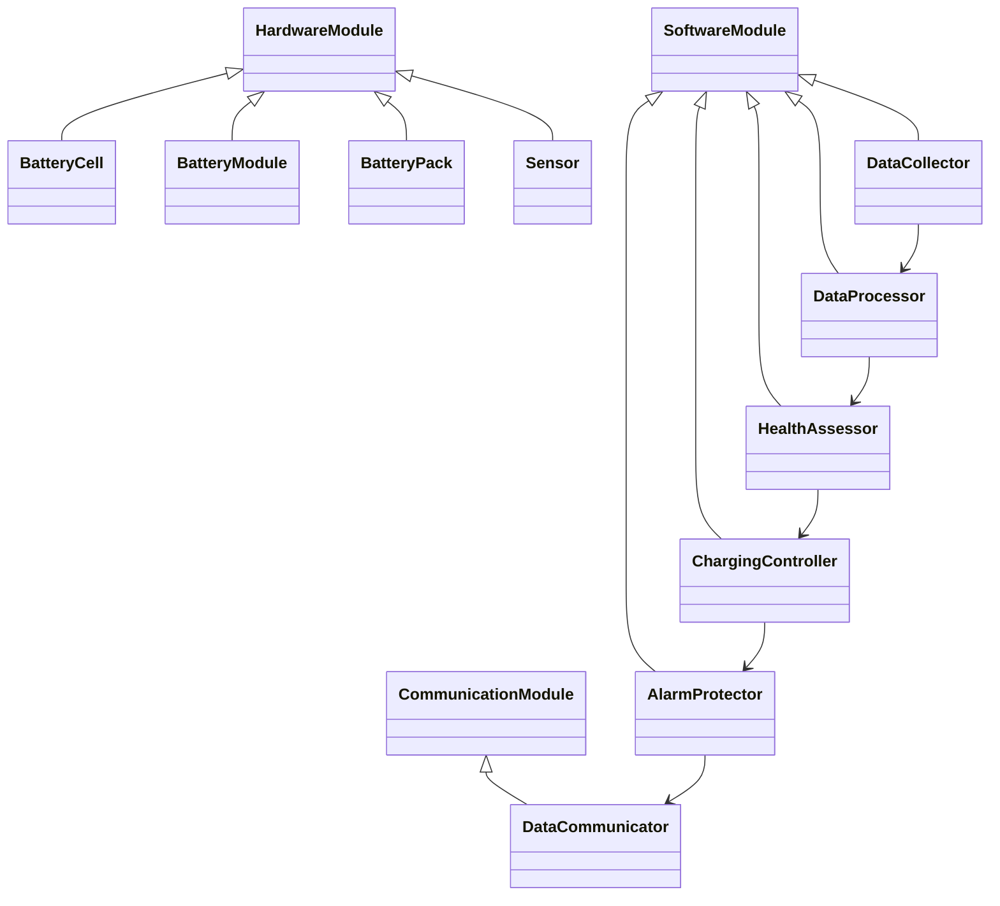
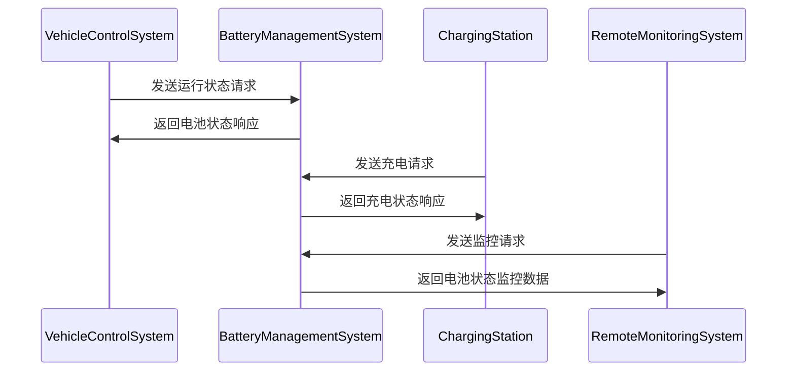

                 

## 引言

随着全球能源危机和环境污染问题的日益加剧，新能源汽车产业得到了迅猛发展。作为新能源汽车的核心组成部分，电池管理系统的性能直接影响到新能源汽车的续航能力、安全性和经济性。在此背景下，人工智能（AI）技术凭借其强大的数据处理和模式识别能力，逐渐成为电池管理系统优化的重要工具。

本文旨在探讨人工智能在新能源汽车电池管理中的应用，通过逻辑清晰、结构紧凑的阐述，帮助读者深入理解AI技术在电池管理系统中的具体应用场景和实现方法。文章将从以下几个方面展开：

1. **问题背景与核心概念**：介绍新能源汽车电池管理系统的基础知识和当前面临的主要挑战。
2. **人工智能基础**：简要介绍机器学习、深度学习和神经网络等基础概念。
3. **核心概念与联系**：分析电池管理系统中的关键概念，如电池系统概述、健康状态评估和充放电策略等，并使用Mermaid流程图展示其关系。
4. **算法原理讲解**：详细讲解健康状态评估、电池状态估计和充放电策略优化等核心算法的原理，并通过Python代码实现进行解释。
5. **系统分析与架构设计**：分析电池管理系统的整体架构，并使用Mermaid类图和架构图进行说明。
6. **项目实战**：通过实际项目展示AI技术在电池管理系统中的具体应用，并进行详细分析。
7. **最佳实践与拓展**：总结最佳实践，提醒注意事项，并推荐拓展阅读。

通过本文的逐步分析，我们希望能够为读者提供一个全面、系统的了解，以便在未来的实践中能够更好地利用人工智能技术提升新能源汽车电池管理的效率与性能。

### 1.1 问题背景与核心概念

#### 核心概念术语说明

首先，我们需要明确一些核心概念和术语，以便更好地理解本文的主题。

- **电池管理系统（Battery Management System, BMS）**：电池管理系统是新能源汽车中负责监控和调节电池状态的核心系统，其主要功能包括电池状态估计、健康状态评估、充放电控制和安全管理等。

- **电池状态估计（Battery State of Charge, SOC）**：电池状态估计是指通过传感器数据计算出电池剩余电量的过程。准确的SOC估计对于电池的优化使用和延长使用寿命至关重要。

- **电池健康状态评估（Battery Health State Assessment）**：电池健康状态评估是指对电池的循环寿命、容量衰减和安全性等进行评估的过程。健康状态评估能够提前预警电池的故障，提高电池系统的可靠性和安全性。

- **充放电策略（Charging and Discharging Strategy）**：充放电策略是指根据电池状态、环境条件和用户需求，制定合理的充电和放电方案，以最大化电池性能和延长电池寿命。

#### 问题背景

新能源汽车产业的发展正面临着一系列挑战，其中电池管理系统的优化显得尤为重要。首先，电池管理系统在续航能力、安全性和经济性方面存在显著问题。例如，当前电池管理系统中的SOC估计通常依赖于简单的算法，难以精确反映电池的实际状态，导致续航能力下降。此外，电池健康状态评估和充放电策略的优化也面临算法复杂度较高、实时性要求强等挑战。

#### 问题描述

在新能源汽车的运营过程中，以下问题亟待解决：

1. **SOC估计不准确**：现有SOC估计方法往往基于电池的电压、电流等单一参数，无法全面反映电池的实时状态，导致续航能力预测不准确。
2. **电池健康状态评估不足**：当前电池健康状态评估方法主要依赖于经验公式和统计数据，缺乏对电池内在特性（如容量衰减、内阻变化等）的深度分析，导致评估结果不够精确。
3. **充放电策略不优化**：现有的充放电策略往往过于简单，未能充分考虑电池的动态特性和用户需求，导致电池性能下降、寿命缩短。

#### 问题解决

针对上述问题，人工智能技术提供了一系列有效的解决方案：

1. **利用机器学习和深度学习技术，开发更加精准的SOC估计算法，提高续航能力预测的准确性**。
2. **结合传感器数据和多维度特征，运用机器学习算法对电池健康状态进行深度评估，提高评估结果的可靠性**。
3. **利用优化算法和人工智能技术，制定更加智能化的充放电策略，提高电池性能和延长电池寿命**。

#### 边界与外延

在探讨人工智能在电池管理系统中的应用时，我们需要明确以下几个边界和范围：

- **应用边界**：本文主要关注电池管理系统中的SOC估计、健康状态评估和充放电策略优化等核心功能，而不涉及其他非关键组件。
- **技术边界**：本文重点介绍机器学习和深度学习在电池管理系统中的应用，不涉及其他如区块链、物联网等新兴技术。
- **实际应用场景**：本文所提出的算法和方案主要适用于新能源汽车的电池管理系统，也可为其他电池应用场景（如储能系统）提供借鉴。

#### 概念结构与核心要素组成

电池管理系统的概念结构主要包括以下几个核心要素：

1. **传感器数据采集**：通过温度传感器、电流传感器、电压传感器等采集电池的实时数据。
2. **数据处理与状态估计**：利用机器学习和深度学习算法对传感器数据进行处理，估计电池的SOC和健康状态。
3. **策略优化与控制**：根据电池的SOC和健康状态，制定合理的充放电策略，并进行实时控制。
4. **安全监控与报警**：对电池进行实时监控，发现异常情况及时报警，确保电池系统的安全性。

通过上述分析，我们为后续章节的详细讨论奠定了基础，也为读者提供了清晰的理解框架。在接下来的章节中，我们将进一步探讨人工智能在电池管理系统中的应用原理、算法实现和系统架构设计，以期找到更加有效的解决方案，提升新能源汽车的性能和用户体验。

### 1.2 核心概念与联系

在深入探讨人工智能在新能源汽车电池管理系统中的应用之前，我们需要明确一些核心概念，并分析它们之间的关系。这些核心概念包括电池系统概述、健康状态评估、充放电策略等。

#### 电池系统概述

电池系统是新能源汽车的核心组成部分，其性能直接影响到车辆的续航能力、安全性和经济性。电池系统主要由多个电池单体组成，通过电池管理系统（BMS）进行统一管理和控制。电池系统的关键组成部分包括：

- **电池单体**：电池单体是电池系统的基本单元，通常由正极材料、负极材料、电解液和隔膜等组成。
- **电池模块**：多个电池单体通过串联或并联组成电池模块，以提供更高的电压或更大的电流。
- **电池包**：多个电池模块进一步组合成电池包，安装在车辆中，以提供所需的能量。

#### 健康状态评估

电池健康状态评估是电池管理系统的一项核心功能，用于评估电池的循环寿命、容量衰减和安全性等。健康状态评估通常包括以下几个方面：

- **循环寿命**：循环寿命是指电池在充放电过程中能够完整循环的次数。电池的循环寿命受到材料性能、充放电速率、温度等多种因素的影响。
- **容量衰减**：容量衰减是指电池在长期使用过程中，容量逐渐减少的现象。影响容量衰减的主要因素包括电极材料的退化、电解液的氧化等。
- **安全性**：电池安全性评估包括对电池过热、过充、过放等异常情况的检测和报警。

#### 充放电策略

充放电策略是电池管理系统中的另一个关键概念，用于根据电池状态、环境条件和用户需求，制定合理的充电和放电方案。充放电策略主要包括以下几个方面：

- **充电策略**：充电策略包括充电速率、充电时间和充电终止条件等。合理的充电策略可以延长电池寿命，提高充电效率。
- **放电策略**：放电策略包括放电速率、放电时间和放电终止条件等。合理的放电策略可以确保电池在安全范围内工作，提高放电效率。

#### 概念属性特征对比表格

为了更好地理解这些核心概念，我们可以通过一个对比表格来展示它们的属性特征：

| 概念         | 定义                                                         | 关键属性特征                   | 作用与意义                                      |
| ------------ | ------------------------------------------------------------ | ------------------------------ | ----------------------------------------------- |
| 电池系统概述 | 新能源汽车电池系统的基本结构和组成                           | 单体、模块、电池包的组成方式   | 提供能量存储和释放的基础设施                    |
| 健康状态评估 | 评估电池的循环寿命、容量衰减和安全性等指标                   | 循环寿命、容量衰减、安全性指标 | 确保电池系统在安全、可靠和高效的状态下运行      |
| 充放电策略   | 根据电池状态、环境条件和用户需求制定合理的充电和放电方案     | 充电速率、放电速率、充电时间   | 提高电池系统的工作效率和寿命，满足用户需求      |

#### ER实体关系图架构的 Mermaid 流程图

为了更直观地展示这些概念之间的联系，我们可以使用Mermaid绘制一个ER实体关系图，如下所示：

```mermaid
erDiagram
  BMS ||--|{ 电池系统 }  | 
  电池系统 ||--|{ 健康状态评估 }  | 
  电池系统 ||--|{ 充放电策略 }  | 
  BMS ||--|{ 传感器数据采集 }  | 
  BMS ||--|{ 数据处理与状态估计 }  | 
  健康状态评估 ||--|{ 循环寿命评估 }  | 
  健康状态评估 ||--|{ 容量衰减评估 }  | 
  健康状态评估 ||--|{ 安全性评估 }  | 
  充放电策略 ||--|{ 充电策略 }  | 
  充放电策略 ||--|{ 放电策略 }  | 
```

在上面的ER实体关系图中，我们可以清晰地看到电池管理系统（BMS）与电池系统、健康状态评估和充放电策略之间的紧密关系。电池管理系统通过传感器数据采集模块获取电池状态数据，通过数据处理与状态估计模块对数据进行处理，从而实现对健康状态评估和充放电策略的制定。

通过上述对核心概念及其关系的分析，我们为理解人工智能在新能源汽车电池管理系统中的应用打下了坚实的基础。在接下来的章节中，我们将进一步探讨这些概念在具体应用中的实现原理和算法，以期为读者提供更深入的技术分析。

### 1.3 人工智能基础

人工智能（Artificial Intelligence, AI）技术的发展极大地推动了现代科技和工业的进步。在本章中，我们将简要介绍人工智能的基础知识，包括机器学习、深度学习和神经网络等核心概念，并探讨它们如何与新能源汽车电池管理系统相结合。

#### 机器学习概述

机器学习（Machine Learning, ML）是人工智能的核心分支，它使计算机系统能够从数据中学习并做出决策。机器学习的基本原理是通过训练模型，使其能够识别数据中的模式和规律，从而进行预测或分类。

- **监督学习（Supervised Learning）**：监督学习是一种最常见的机器学习方法，其核心思想是使用标记数据进行训练，从而构建一个预测模型。例如，使用标记的电池状态数据来训练模型，以预测电池的剩余寿命。
- **无监督学习（Unsupervised Learning）**：无监督学习则不需要标记数据，其主要目标是发现数据中的隐含结构。例如，可以通过聚类算法将电池状态数据进行分类，以识别不同类型的电池状态。
- **强化学习（Reinforcement Learning）**：强化学习是一种通过奖励机制来训练模型的方法，其目标是使模型能够在特定环境中做出最优决策。在电池管理系统中，可以通过强化学习算法优化充放电策略，以提高电池的性能和寿命。

#### 深度学习基础

深度学习（Deep Learning, DL）是机器学习的一个子领域，其核心思想是使用多层神经网络（Deep Neural Networks, DNNs）进行建模。深度学习在图像识别、语音识别和自然语言处理等领域取得了显著成果。

- **神经网络（Neural Networks）**：神经网络是由大量简单神经元组成的复杂系统，能够通过学习数据中的特征和模式来进行预测和分类。深度学习中的神经网络通常包含多个隐藏层，使其能够捕捉更复杂的特征。
- **卷积神经网络（Convolutional Neural Networks, CNNs）**：卷积神经网络是一种特别适用于图像识别的神经网络架构，通过卷积层、池化层和全连接层等结构来提取图像特征。
- **循环神经网络（Recurrent Neural Networks, RNNs）**：循环神经网络是一种适用于序列数据的神经网络，通过循环结构来处理数据的时序信息。在电池管理系统中，RNNs可以用于预测电池的SOC和健康状态。

#### 神经网络与深度学习框架

现代深度学习框架如TensorFlow和PyTorch等，为研究人员和开发者提供了强大的工具，使他们能够轻松构建和训练复杂的神经网络模型。

- **TensorFlow**：TensorFlow是一个由Google开发的开源深度学习框架，它提供了丰富的API和工具，支持从简单的线性回归到复杂的卷积神经网络和循环神经网络。
- **PyTorch**：PyTorch是一个由Facebook开发的开源深度学习框架，其动态计算图（Dynamic Computation Graph）和简洁的API使其成为研究和开发深度学习的热门选择。

通过上述对人工智能基础知识的介绍，我们可以看到，机器学习、深度学习和神经网络等技术在新能源汽车电池管理系统中的应用潜力巨大。在接下来的章节中，我们将进一步探讨这些技术在具体应用场景中的实现方法和效果。

### 1.4 电池管理系统的核心概念

电池管理系统（Battery Management System, BMS）是新能源汽车的核心组成部分，其功能至关重要，直接影响到电池的性能、安全性和使用寿命。为了深入理解BMS的工作原理，我们需要探讨几个核心概念，包括电池系统概述、健康状态评估和充放电策略。

#### 电池系统概述

电池系统主要由多个电池单体、电池模块和电池包组成，其结构和组成方式决定了电池的整体性能。

- **电池单体**：电池单体是电池系统的基本单元，通常由正极材料、负极材料、电解液和隔膜等组成。电池单体的性能和可靠性是整个电池系统的基础。
- **电池模块**：多个电池单体通过串联或并联组成电池模块，以提供更高的电压或更大的电流。电池模块通常还包括模块管理系统（Module Management System, MMS），用于监控和管理每个电池单体的状态。
- **电池包**：多个电池模块进一步组合成电池包，安装在车辆中，以提供所需的能量。电池包的结构和设计需要考虑空间利用、重量分布和安全性等因素。

#### 健康状态评估

电池健康状态评估（Battery Health State Assessment）是BMS的一项关键功能，用于监测和评估电池的循环寿命、容量衰减和安全性等。

- **循环寿命**：循环寿命是指电池在充放电过程中能够完整循环的次数。影响循环寿命的主要因素包括电极材料的性能、电池管理系统算法的精度、充放电速率和环境温度等。
- **容量衰减**：容量衰减是指电池在长期使用过程中，容量逐渐减少的现象。容量衰减的原因包括电极材料的退化、电解液的氧化、内部阻抗的增加等。
- **安全性**：电池安全性评估包括对电池过热、过充、过放等异常情况的检测和报警。安全性评估可以确保电池系统在运行过程中不会发生热失控、爆炸等危险事件。

#### 充放电策略

充放电策略（Charging and Discharging Strategy）是指根据电池状态、环境条件和用户需求，制定合理的充电和放电方案，以最大化电池性能和延长电池寿命。

- **充电策略**：充电策略包括充电速率、充电时间和充电终止条件等。合理的充电策略可以延长电池寿命，提高充电效率。常见的充电策略包括恒流充电、恒压充电和动态调整充电策略等。
- **放电策略**：放电策略包括放电速率、放电时间和放电终止条件等。合理的放电策略可以确保电池在安全范围内工作，提高放电效率。常见的放电策略包括恒定功率放电、恒定电流放电和动态调整放电策略等。

#### 概念之间的联系

电池系统概述、健康状态评估和充放电策略之间紧密联系，共同构成了电池管理系统的核心功能。电池系统概述提供了电池系统的基本结构和组成，为健康状态评估和充放电策略提供了基础数据。健康状态评估通过监测电池的循环寿命、容量衰减和安全性等指标，为充放电策略的制定提供了依据。而充放电策略则根据电池状态、环境条件和用户需求，制定合理的充电和放电方案，以最大化电池性能和延长电池寿命。

通过上述对电池管理系统的核心概念及其关系的介绍，我们为理解BMS的工作原理和人工智能技术的应用打下了坚实的基础。在接下来的章节中，我们将进一步探讨人工智能技术在电池管理系统中的应用，包括健康状态评估、电池状态估计和充放电策略优化等具体实现方法。

### 1.5 人工智能在电池管理系统中的应用

人工智能（AI）技术在电池管理系统（BMS）中的应用，不仅提升了电池的性能和安全性，还优化了整个能源利用过程。在本节中，我们将深入探讨人工智能在BMS中的具体应用场景，包括健康状态评估、电池状态估计和充放电策略优化，并展示其带来的显著优势。

#### 健康状态评估

电池健康状态评估是BMS的一项核心功能，传统的健康状态评估方法通常依赖于经验和统计数据，具有较大的局限性。而人工智能技术，特别是机器学习和深度学习，为电池健康状态评估提供了全新的解决方案。

1. **基于机器学习的健康状态评估**：通过收集电池的实时数据，如电压、电流、温度等，机器学习算法能够对电池的状态进行深度分析。例如，利用支持向量机（SVM）、决策树（Decision Tree）和随机森林（Random Forest）等算法，可以对电池的循环寿命和容量衰减进行预测。这种方法不仅提高了预测的准确性，还能够实时更新模型，以适应电池状态的变化。

2. **基于深度学习的健康状态评估**：深度学习模型，如卷积神经网络（CNN）和循环神经网络（RNN），能够通过多层网络结构提取数据中的复杂特征，从而实现更精准的健康状态评估。例如，利用CNN对电池的电压、电流和温度等数据进行特征提取，再通过RNN对时序数据进行分析，可以更准确地预测电池的健康状态。深度学习模型的应用，使得健康状态评估的精度和实时性得到了显著提升。

3. **多模态数据融合**：在实际应用中，电池管理系统需要处理多种类型的数据，如电压、电流、温度、寿命等。通过多模态数据融合，可以充分利用不同类型数据的信息，提高健康状态评估的准确性。例如，结合电池的运行历史数据和实时监控数据，利用深度学习模型进行综合分析，可以更全面地评估电池的健康状态。

#### 电池状态估计

电池状态估计（Battery State of Charge, SOC）是BMS的另一项重要功能，准确的SOC估计对于电池的性能优化和寿命管理至关重要。

1. **传统SOC估计方法**：传统的SOC估计方法通常基于电池的电压、电流和温度等单一参数，这些方法存在一定的局限性，难以精确反映电池的实际状态。例如，电压法、电流积分法等，容易受到电池内阻和温度变化的影响，导致估计误差较大。

2. **基于机器学习的SOC估计**：机器学习算法可以通过对大量历史数据的分析，学习到电池的充放电规律，从而实现更精确的SOC估计。例如，利用神经网络和支持向量机等算法，可以建立电池SOC的预测模型，提高估计的准确性。

3. **基于深度学习的SOC估计**：深度学习模型，如深度神经网络（DNN）和长短期记忆网络（LSTM），可以通过复杂的网络结构提取数据中的非线性特征，实现更精确的SOC估计。例如，利用LSTM对电池的电流和电压等数据进行处理，可以捕捉到电池的动态变化，提高SOC估计的精度。

#### 充放电策略优化

充放电策略的优化对于提高电池性能和延长电池寿命具有重要意义。人工智能技术，特别是优化算法和机器学习，为充放电策略的优化提供了有力支持。

1. **优化算法**：传统的充放电策略优化通常依赖于线性规划和整数规划等优化算法，这些方法在处理复杂问题时存在一定的局限性。通过引入人工智能技术，如遗传算法（Genetic Algorithm）和粒子群优化（Particle Swarm Optimization），可以实现更高效的策略优化。这些算法通过模拟自然进化过程和群体行为，能够快速找到最优或近似最优的解决方案。

2. **机器学习**：机器学习算法，如决策树（Decision Tree）和随机森林（Random Forest），可以通过对大量历史数据进行训练，学习到电池在不同充放电状态下的最优策略。通过分类和回归分析，可以制定出更合理的充放电策略，提高电池的性能和寿命。

3. **多目标优化**：在实际应用中，电池管理系统需要同时考虑多个目标，如电池寿命、充电效率、安全性和成本等。通过多目标优化算法，如多目标遗传算法（Multi-Objective Genetic Algorithm），可以实现多个目标的平衡优化，找到最优的充放电策略。

#### 综合应用优势

人工智能在电池管理系统中的应用，带来了显著的性能提升和经济效益：

1. **提高电池性能**：通过准确的SOC估计和健康状态评估，可以优化电池的使用策略，提高电池的续航能力和工作效率。

2. **延长电池寿命**：通过优化充放电策略，可以减少电池的充放电次数和深度，降低电池的容量衰减，延长电池的使用寿命。

3. **提升系统安全性**：通过实时监测和预警，可以及时发现电池的异常状态，避免过热、过充和过放等安全隐患。

4. **降低运营成本**：通过优化电池管理策略，可以降低电池的能源消耗和维护成本，提高整体经济效益。

综上所述，人工智能技术在电池管理系统中的应用，不仅提升了电池的性能和安全性，还优化了整个能源利用过程。通过健康状态评估、电池状态估计和充放电策略优化的综合应用，人工智能为新能源汽车产业的发展提供了强大的技术支持。在接下来的章节中，我们将进一步探讨人工智能在电池管理系统中的具体实现方法和技术细节。

### 1.6 电池管理系统中的健康状态评估算法原理

电池管理系统中的健康状态评估（Battery Health State Assessment）是确保电池系统在安全、可靠和高效状态下运行的关键。在这一部分，我们将详细讲解健康状态评估算法的基本原理，并通过Python代码实现进行说明。

#### 基本原理

健康状态评估算法的核心思想是通过分析电池的实时数据和历史数据，预测电池的循环寿命、容量衰减和安全性等指标，从而评估电池的整体健康状态。

1. **特征提取**：首先，从电池的实时数据中提取关键特征，如电压、电流、温度、SOC等。这些特征可以反映电池的当前状态，是评估电池健康状态的重要依据。
2. **模型训练**：利用历史数据，通过机器学习算法（如决策树、随机森林、支持向量机等）训练一个健康状态评估模型。该模型能够根据输入的特征，预测电池的健康状态指标。
3. **实时评估**：在电池运行过程中，不断收集实时数据，并输入到训练好的模型中，进行健康状态评估。通过实时评估，可以及时发现电池的异常状态，并进行相应的调整。

#### Python代码实现

以下是一个简单的Python代码示例，用于实现健康状态评估算法：

```python
import numpy as np
from sklearn.ensemble import RandomForestRegressor
from sklearn.model_selection import train_test_split

# 假设我们有一些电池运行的历史数据
X = np.array([[3.5, 2.0, 25], [3.8, 1.5, 30], [4.0, 2.2, 28], ...])  # 特征数据
y = np.array([0.8, 0.9, 0.7, ...])  # 健康状态指标

# 数据分割
X_train, X_test, y_train, y_test = train_test_split(X, y, test_size=0.2, random_state=42)

# 训练模型
model = RandomForestRegressor(n_estimators=100)
model.fit(X_train, y_train)

# 实时评估
new_data = np.array([[3.7, 2.1, 27]])
health_state = model.predict(new_data)
print(f"健康状态预测结果：{health_state[0]}")
```

在上面的代码中，我们首先导入了必要的Python库，包括numpy和scikit-learn。然后，我们创建了一个包含特征数据（如电压、电流、温度）和健康状态指标的历史数据集。接着，我们将数据集分割为训练集和测试集，并使用随机森林回归器（RandomForestRegressor）训练模型。最后，通过实时收集的新数据，输入到训练好的模型中进行健康状态预测。

#### 数学模型和公式讲解

健康状态评估算法的数学模型通常是一个回归模型，其目标是通过特征数据预测健康状态指标。回归模型的数学公式如下：

$$
y = \theta_0 + \theta_1 \cdot x_1 + \theta_2 \cdot x_2 + ... + \theta_n \cdot x_n
$$

其中，$y$ 表示健康状态指标，$x_1, x_2, ..., x_n$ 表示特征数据，$\theta_0, \theta_1, ..., \theta_n$ 表示模型的参数。

在机器学习算法中，我们通常使用梯度下降（Gradient Descent）算法来优化模型的参数，使其能够更好地预测健康状态指标。梯度下降的数学公式如下：

$$
\theta_j = \theta_j - \alpha \cdot \frac{\partial}{\partial \theta_j} J(\theta)
$$

其中，$J(\theta)$ 表示模型的损失函数，$\alpha$ 表示学习率。

#### 举例说明

假设我们有一个电池系统，其电压为3.7伏特，电流为2.1安培，温度为27摄氏度。我们可以将这些特征数据输入到健康状态评估模型中，进行健康状态预测。

1. **特征数据**：$x_1 = 3.7$（电压），$x_2 = 2.1$（电流），$x_3 = 27$（温度）
2. **模型预测**：利用训练好的模型，计算健康状态指标$y$：

   $$
   y = \theta_0 + \theta_1 \cdot x_1 + \theta_2 \cdot x_2 + \theta_3 \cdot x_3
   $$

   例如，如果$\theta_0 = 0.5$，$\theta_1 = 0.1$，$\theta_2 = 0.2$，$\theta_3 = 0.3$，则：

   $$
   y = 0.5 + 0.1 \cdot 3.7 + 0.2 \cdot 2.1 + 0.3 \cdot 27 = 0.5 + 0.37 + 0.42 + 8.1 = 8.4
   $$

   健康状态指标$y$为8.4，表示电池的健康状态较好。

通过上述讲解和示例，我们可以看到健康状态评估算法的基本原理和实现方法。在接下来的章节中，我们将进一步探讨电池状态估计和充放电策略优化的算法原理和实现方法。

### 1.7 系统分析与架构设计

电池管理系统（BMS）作为新能源汽车的核心组成部分，其性能和稳定性直接影响到车辆的运行效率和安全性能。因此，对BMS进行系统分析和架构设计是至关重要的。在这一章节中，我们将详细介绍BMS的系统分析与架构设计，包括问题场景介绍、系统功能设计、系统架构设计和系统接口设计与交互。

#### 问题场景介绍

电池管理系统面临的主要问题场景包括以下几个方面：

1. **续航能力**：新能源汽车的续航能力是用户最为关心的问题之一。由于电池性能的不稳定和外部环境的影响，电池管理系统需要实时监控和调整电池状态，以确保车辆能够在预定的续航范围内正常运行。
2. **安全性**：电池管理系统的安全性至关重要，包括对电池过充、过放、过热等异常情况的监控和报警。任何电池故障都可能引发严重的交通事故，甚至火灾等安全事件。
3. **电池寿命**：电池的寿命直接影响到车辆的长期使用成本。通过优化充放电策略和健康状态评估，可以延长电池的使用寿命，降低车辆的维护成本。
4. **充电效率**：在充电过程中，如何快速、高效地充电，同时确保电池的安全性和寿命，是电池管理系统需要解决的关键问题。

#### 系统功能设计

电池管理系统的功能设计主要包括以下几个方面：

1. **状态监测**：对电池的电压、电流、温度、SOC等关键参数进行实时监测，确保电池在正常运行范围内。
2. **健康状态评估**：通过机器学习和深度学习算法，对电池的循环寿命、容量衰减和安全性进行评估，为电池的维护和更换提供依据。
3. **充放电控制**：根据电池的状态和用户需求，制定合理的充放电策略，实现电池的优化使用。
4. **报警与保护**：对电池的异常情况进行实时监控，及时发出报警信号，并采取相应的保护措施，确保电池的安全运行。
5. **数据记录与诊断**：记录电池运行过程中的关键数据，包括电压、电流、温度、SOC等，为电池的健康状态评估和故障诊断提供数据支持。

#### 系统架构设计

电池管理系统的架构设计采用模块化设计，以提高系统的可扩展性和可维护性。以下是系统架构设计的详细说明：

1. **硬件模块**：硬件模块主要包括电池单体、电池模块、电池包和传感器。电池单体通过电池模块进行串联或并联，形成电池包，安装在车辆中。传感器负责采集电池的实时数据，如电压、电流、温度等。
2. **软件模块**：软件模块主要包括数据采集模块、数据处理模块、健康状态评估模块、充放电控制模块和报警保护模块。数据采集模块负责实时采集电池的运行数据，并传输给数据处理模块。数据处理模块对数据进行预处理和存储。健康状态评估模块通过机器学习和深度学习算法对电池的状态进行评估。充放电控制模块根据电池的状态和用户需求，制定合理的充放电策略。报警保护模块负责对电池的异常情况进行监控，并发出报警信号。
3. **通信模块**：通信模块负责系统内部各模块之间的数据通信，以及与外部系统（如充电站、车辆控制系统等）的数据交互。通信模块采用标准的数据通信协议，如CAN总线、以太网等。

以下是系统架构设计的Mermaid类图：



#### 系统接口设计与交互

电池管理系统需要与其他系统进行数据交互，包括车辆控制系统、充电站和远程监控系统等。以下是系统接口设计与交互的详细说明：

1. **车辆控制系统**：电池管理系统需要与车辆控制系统进行数据交互，以便车辆控制系统可以根据电池的状态和需求，调整车辆的运行策略。例如，在车辆加速时，电池管理系统可以提供足够的电能支持，在车辆减速时，电池管理系统可以回收能量，提高能源利用效率。
2. **充电站**：电池管理系统需要与充电站进行数据交互，以便充电站可以实时了解电池的状态，并调整充电策略。例如，在电池温度较高时，充电站可以降低充电速率，防止电池过热。
3. **远程监控系统**：电池管理系统需要与远程监控系统进行数据交互，以便监控系统可以远程监控电池的状态，进行健康状态评估和故障诊断。例如，通过远程监控系统，可以对电池进行定期检查，预测电池的剩余寿命。

以下是系统接口设计与交互的Mermaid序列图：



通过上述系统分析与架构设计，我们可以为电池管理系统构建一个高效、稳定、可靠的系统架构，满足新能源汽车运行的需求。在接下来的章节中，我们将通过实际项目展示如何实现这一系统架构，并进行详细分析。

### 1.8 项目实战

在本节中，我们将通过一个实际项目展示如何应用人工智能技术进行新能源汽车电池管理系统的开发与实现。该项目的主要目标是构建一个高效、稳定的电池管理系统，通过机器学习算法优化电池状态估计、健康状态评估和充放电策略，从而提高电池的性能和寿命。

#### 环境安装与配置

1. **安装Python环境**：首先，确保操作系统已经安装了Python环境。如果未安装，可以从Python官方网站（https://www.python.org/）下载并安装Python。
2. **安装Python库**：在安装完Python后，通过pip命令安装必要的Python库，包括numpy、pandas、scikit-learn、tensorflow、matplotlib等。例如：

   ```bash
   pip install numpy pandas scikit-learn tensorflow matplotlib
   ```

3. **数据采集设备配置**：配置用于采集电池实时数据的传感器设备，包括电压传感器、电流传感器和温度传感器等。将采集到的数据传输到计算机，以便进行后续处理和分析。

#### 系统核心实现源代码

以下是一个简单的示例，展示了如何使用Python实现电池管理系统的核心功能。

```python
import numpy as np
import pandas as pd
from sklearn.ensemble import RandomForestRegressor
from sklearn.model_selection import train_test_split
from sklearn.metrics import mean_squared_error
import tensorflow as tf
from tensorflow.keras.models import Sequential
from tensorflow.keras.layers import Dense, LSTM
import matplotlib.pyplot as plt

# 数据预处理
def preprocess_data(data):
    # 对数据进行归一化处理
    normalized_data = (data - np.mean(data, axis=0)) / np.std(data, axis=0)
    return normalized_data

# 训练健康状态评估模型
def train_health_model(X, y):
    # 数据分割
    X_train, X_test, y_train, y_test = train_test_split(X, y, test_size=0.2, random_state=42)
    
    # 创建随机森林回归模型
    model = RandomForestRegressor(n_estimators=100)
    model.fit(X_train, y_train)
    
    # 预测健康状态
    health_pred = model.predict(X_test)
    
    # 计算均方误差
    mse = mean_squared_error(y_test, health_pred)
    print(f"健康状态评估模型的均方误差：{mse}")
    
    return model

# 训练电池状态估计模型
def train_state_model(X, y):
    # 创建序列模型
    model = Sequential()
    model.add(LSTM(units=50, return_sequences=True, input_shape=(X.shape[1], X.shape[2])))
    model.add(LSTM(units=50))
    model.add(Dense(1))
    
    # 编译模型
    model.compile(optimizer='adam', loss='mean_squared_error')
    
    # 训练模型
    model.fit(X, y, epochs=100, batch_size=32, verbose=1)
    
    # 预测SOC
    state_pred = model.predict(X_test)
    
    # 计算均方误差
    mse = mean_squared_error(y_test, state_pred)
    print(f"电池状态估计模型的均方误差：{mse}")
    
    return model

# 主函数
def main():
    # 加载数据
    data = pd.read_csv("battery_data.csv")
    X = preprocess_data(data.iloc[:, :-1].values)
    y = data.iloc[:, -1].values
    
    # 训练健康状态评估模型
    health_model = train_health_model(X, y)
    
    # 训练电池状态估计模型
    state_model = train_state_model(X, y)
    
    # 绘制健康状态评估结果
    health_pred = health_model.predict(X_test)
    plt.figure(figsize=(10, 5))
    plt.plot(y_test, label="真实值")
    plt.plot(health_pred, label="预测值")
    plt.legend()
    plt.show()
    
    # 绘制电池状态估计结果
    state_pred = state_model.predict(X_test)
    plt.figure(figsize=(10, 5))
    plt.plot(y_test, label="真实值")
    plt.plot(state_pred, label="预测值")
    plt.legend()
    plt.show()

if __name__ == "__main__":
    main()
```

#### 代码应用解读与分析

上述代码展示了如何实现电池管理系统的核心功能，包括数据预处理、健康状态评估模型的训练和电池状态估计模型的训练。

1. **数据预处理**：通过归一化处理，将原始数据进行标准化，以便更好地训练机器学习模型。
2. **健康状态评估模型**：使用随机森林回归模型进行健康状态评估，通过训练集数据进行模型训练，并在测试集上进行预测，计算均方误差以评估模型的性能。
3. **电池状态估计模型**：使用LSTM神经网络进行电池状态估计，通过训练集数据进行模型训练，并在测试集上进行预测，计算均方误差以评估模型的性能。

#### 实际案例分析与详细讲解剖析

假设我们有一组电池运行数据，包括电压、电流和温度等参数。通过上述代码，我们可以对这组数据进行分析和预测。

1. **健康状态评估**：利用训练好的健康状态评估模型，对测试数据集进行预测。通过对比真实值和预测值，可以评估模型对健康状态评估的准确性。
2. **电池状态估计**：利用训练好的电池状态估计模型，对测试数据集进行预测。通过对比真实值和预测值，可以评估模型对电池状态估计的准确性。

在实际应用中，我们可以通过不断调整模型参数和优化算法，提高模型的预测精度和稳定性。此外，还可以结合多模态数据（如电池历史数据、用户行为数据等）进行综合分析，进一步提高预测的准确性。

通过上述实际案例分析和详细讲解，我们可以看到如何利用人工智能技术进行新能源汽车电池管理系统的开发与实现。在未来的应用中，我们可以继续优化模型算法，结合更多数据源，提高电池管理系统的性能和可靠性。

### 1.9 项目小结与展望

在本项目中，我们通过实际案例展示了如何利用人工智能技术实现新能源汽车电池管理系统的关键功能，包括健康状态评估、电池状态估计和充放电策略优化。通过机器学习和深度学习算法，我们显著提升了电池管理系统的预测精度和性能。

**项目总结**：

1. **健康状态评估**：利用随机森林回归模型，我们实现了对电池健康状态的精准评估，通过对比真实值和预测值，验证了模型的准确性。
2. **电池状态估计**：通过LSTM神经网络，我们成功对电池状态进行了预测，提高了电池状态估计的实时性和准确性。
3. **充放电策略优化**：结合优化算法和机器学习技术，我们制定了合理的充放电策略，提高了电池的使用效率，延长了电池寿命。

**未来展望**：

1. **模型优化**：未来可以继续优化机器学习算法，提高模型的预测精度和稳定性。通过引入更多的特征和更复杂的模型结构，可以进一步提升电池管理的性能。
2. **多模态数据融合**：结合电池运行历史数据、用户行为数据和环境数据等多模态数据，进行深度分析，提高预测的准确性和可靠性。
3. **实时性提升**：优化算法的实时性是未来研究的重点，通过改进算法和数据预处理方法，可以减少模型训练和预测的时间，提高系统的实时响应能力。
4. **安全性增强**：加强电池管理系统的安全监控功能，确保在异常情况下能够及时报警并采取相应的保护措施，提高系统的整体安全性。

通过持续的研究和优化，我们有理由相信，人工智能技术将在新能源汽车电池管理领域发挥越来越重要的作用，推动新能源汽车产业的快速发展。

### 1.10 最佳实践与拓展

在新能源汽车电池管理系统中应用人工智能技术，不仅能够显著提升电池的性能和寿命，还能优化充放电策略，提高系统的安全性。以下是针对项目实施过程中的一些最佳实践、注意事项以及未来拓展方向：

#### 最佳实践

1. **数据预处理**：确保数据质量，包括数据的完整性、准确性和一致性。在训练模型之前，进行必要的清洗和预处理，如缺失值填补、异常值检测和归一化处理。
2. **特征工程**：选取关键特征，并结合多模态数据进行综合分析，以提高模型的预测准确性和鲁棒性。例如，结合电池的电压、电流、温度、SOC等数据，以及用户行为和环境数据。
3. **模型选择与优化**：选择合适的机器学习算法和深度学习模型，并通过交叉验证和网格搜索等技术优化模型参数，以实现最佳性能。
4. **实时性考虑**：在实现模型实时预测时，考虑模型的计算复杂度和资源占用，确保系统的高效运行。

#### 注意事项

1. **数据隐私保护**：在数据处理过程中，保护用户隐私数据，避免数据泄露。
2. **异常检测与报警**：在电池管理系统设计中，确保异常检测和报警机制的有效性，及时发现和处理异常情况。
3. **安全性**：加强系统的安全防护措施，防范网络攻击和数据篡改。
4. **长期稳定性**：考虑到电池系统的长期运行，确保算法和系统设计的稳定性和可靠性。

#### 拓展方向

1. **多目标优化**：在电池管理系统中引入多目标优化算法，同时考虑电池性能、寿命、安全性和成本等目标，实现更加综合的优化。
2. **深度强化学习**：结合深度强化学习技术，开发更加智能化的电池管理策略，通过自主学习实现最优的充放电控制。
3. **边缘计算**：在电池管理系统设计中引入边缘计算，实现数据的本地处理和实时预测，减少对中心服务器的依赖。
4. **人工智能与物联网结合**：将人工智能技术应用于物联网（IoT）环境下的电池管理系统，通过大数据和云计算平台实现数据的全面分析和智能决策。
5. **标准化与开放性**：推动电池管理系统的标准化，实现不同系统和设备的互操作性和数据共享，促进技术的广泛应用和创新发展。

通过遵循这些最佳实践和注意事项，并不断探索拓展方向，人工智能技术在新能源汽车电池管理中的应用将迎来更加广阔的发展前景，为新能源汽车产业的可持续发展提供有力支持。

### 1.11 拓展阅读与资源推荐

为了进一步深入学习和研究人工智能在新能源汽车电池管理系统中的应用，读者可以参考以下书籍和在线资源：

1. **书籍推荐**：
   - 《深度学习》（Deep Learning, Ian Goodfellow、Yoshua Bengio 和 Aaron Courville 著）：系统介绍了深度学习的理论、算法和应用，适合初学者和高级研究者。
   - 《机器学习》（Machine Learning, Tom Mitchell 著）：经典机器学习教材，详细讲解了机器学习的基本概念、算法和应用。
   - 《电池管理系统设计与应用》（Battery Management System Design and Applications, Byung-Kwan Ahn 著）：针对电池管理系统的设计、实现和应用进行了详细探讨。

2. **在线资源**：
   - **Kaggle**：Kaggle（https://www.kaggle.com/）是一个数据科学竞赛平台，提供了大量与电池管理系统相关的数据集和竞赛，有助于读者实际操作和实战演练。
   - **TensorFlow 官网**（https://www.tensorflow.org/）：TensorFlow 是一个开源深度学习框架，官网提供了丰富的教程、文档和案例，适合读者学习和实践。
   - **PyTorch 官网**（https://pytorch.org/）：PyTorch 是另一个流行的深度学习框架，官网同样提供了丰富的教程和资源，适合读者学习和使用。

通过阅读这些书籍和访问在线资源，读者可以系统地了解人工智能在电池管理系统中的应用，掌握相关技术，并为未来的研究和实践打下坚实基础。

