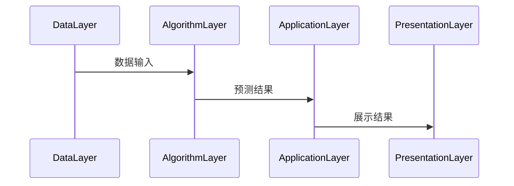
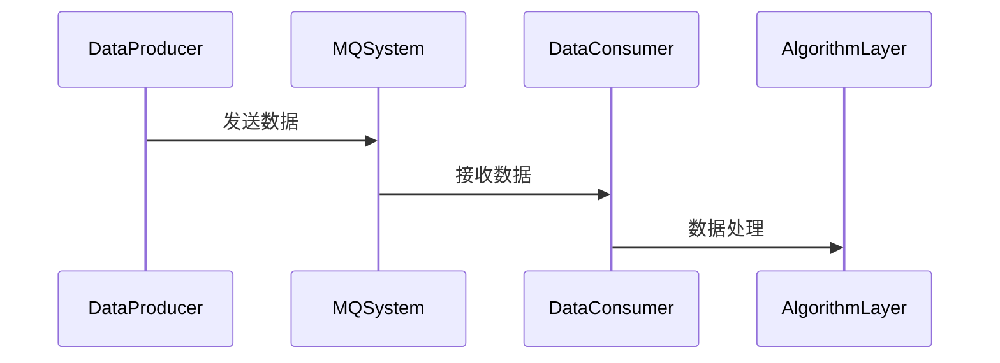

                 

# 人工智能在智慧城市交通规划中的应用

## 关键词

- 人工智能
- 智慧城市
- 交通规划
- 数据挖掘
- 深度学习

## 摘要

随着城市规模的不断扩大和人口的增长，城市交通问题日益突出，给城市管理和居民出行带来了巨大挑战。本文探讨了人工智能在智慧城市交通规划中的应用，从背景介绍、核心概念与联系、算法原理讲解、系统分析与架构设计方案、项目实战等方面进行了深入分析。通过本文的探讨，旨在为读者提供关于人工智能在智慧城市交通规划中的全面视角，以及如何利用先进技术手段优化城市交通系统的实用方法。

## 目录

1. **背景介绍**
   - 问题背景
   - 问题描述
   - 问题解决
   - 边界与外延
   - 概念结构与核心要素组成

2. **核心概念与联系**
   - 核心概念原理
   - 概念属性特征对比表格
   - ER实体关系图架构

3. **算法原理讲解**
   - 算法原理与mermaid流程图
   - Python源代码与算法原理
   - 数学模型和公式

4. **系统分析与架构设计方案**
   - 问题场景介绍
   - 系统功能设计
   - 系统架构设计
   - 系统接口设计和系统交互

5. **项目实战**
   - 环境安装
   - 系统核心实现
   - 代码应用解读与分析
   - 实际案例分析与讲解
   - 项目小结

6. **最佳实践 Tips**
   - 注意事项
   - 拓展阅读

## 背景介绍

### 问题背景

随着全球经济的快速发展和城市化进程的不断推进，城市交通问题已经成为制约城市可持续发展的重要因素。传统城市交通规划主要依赖于经验、统计数据和简单的模型，这种方法在面对日益复杂的城市交通系统时，往往显得力不从心。以下是城市交通规划中面临的一些主要挑战：

- **交通拥堵**：随着汽车数量的增加，城市道路的交通拥堵问题日益严重，导致通勤时间延长、燃料消耗增加和环境污染加剧。
- **交通事故**：城市交通流量大，交通规则复杂，容易发生交通事故，对道路使用者的人身安全构成威胁。
- **停车问题**：城市停车位紧缺，导致停车难、停车贵，进一步加剧了城市交通压力。
- **资源浪费**：传统的交通规划方法往往缺乏对交通资源的有效利用，导致交通资源浪费，如道路占用、停车资源浪费等。

### 问题描述

智慧城市交通规划的目标是利用现代信息技术，特别是人工智能（AI）技术，提高城市交通系统的运行效率，改善出行体验，实现交通资源的合理配置。以下是智慧城市交通规划中需要解决的问题：

- **交通流量预测**：通过对历史交通数据和实时交通数据的分析，预测未来的交通流量，为交通管理和规划提供数据支持。
- **路线优化**：为道路使用者提供最优行驶路线，减少行驶时间，降低交通拥堵。
- **交通事故预防**：利用AI技术对交通数据进行实时分析，预测可能发生的交通事故，提前采取预防措施。
- **停车管理**：利用AI技术对停车资源进行优化管理，提高停车位利用率，缓解停车难题。

### 问题解决

人工智能技术在智慧城市交通规划中具有广泛的应用前景，以下是其主要解决方法：

- **机器学习与深度学习**：通过分析大量历史数据和实时数据，机器学习算法可以预测交通流量、优化路线等。
- **图像识别与语音识别**：利用图像识别技术进行交通监控，利用语音识别技术进行交通信息交互。
- **数据挖掘与大数据分析**：通过对交通数据的挖掘和分析，发现交通规律，为交通规划提供科学依据。
- **智能交通信号控制**：利用AI技术优化交通信号控制策略，提高道路通行效率。

### 边界与外延

智慧城市交通规划中的AI应用边界主要包括以下几个方面：

- **数据来源**：AI技术在交通规划中的应用依赖于大量的数据来源，包括交通监控数据、交通信号数据、车辆行驶数据等。
- **技术应用**：AI技术在交通规划中的应用包括机器学习、深度学习、图像识别、语音识别、数据挖掘等。
- **系统实现**：智慧城市交通规划中的AI系统需要具备实时数据处理、预测分析、决策支持等功能。

### 概念结构与核心要素组成

智慧城市交通规划中的核心概念包括人工智能、智慧城市、交通规划、交通流量预测、路线优化等。这些概念相互关联，共同构成了智慧城市交通规划的体系结构。

- **人工智能**：是智慧城市交通规划的技术基础，包括机器学习、深度学习、图像识别等。
- **智慧城市**：是智慧城市交通规划的应用场景，结合物联网、大数据、云计算等技术。
- **交通规划**：是智慧城市交通规划的核心任务，包括交通网络设计、交通管理、交通流量分析等。
- **交通流量预测**：是智慧城市交通规划的关键技术，通过数据分析和机器学习算法实现。
- **路线优化**：是智慧城市交通规划的重要应用，通过算法优化为道路使用者提供最优行驶路线。

## 核心概念与联系

### 核心概念原理

1. **人工智能（AI）**：人工智能是一门研究、开发用于模拟、延伸和扩展人的智能的理论、方法、技术及应用系统的综合技术科学。人工智能包括机器学习、深度学习、自然语言处理、计算机视觉等多个子领域。在智慧城市交通规划中，人工智能主要用于交通流量预测、路线优化、交通事故预防等方面。

2. **智慧城市**：智慧城市是指利用物联网、云计算、大数据、人工智能等先进技术，实现城市资源优化配置、城市管理和公共服务智能化的一种城市发展新模式。智慧城市的主要目标是提高城市运行效率、改善居民生活质量、实现可持续发展。在智慧城市交通规划中，智慧城市提供了基础设施和数据支持，为AI技术的应用提供了条件。

3. **交通规划**：交通规划是指为了满足城市交通需求，通过科学的方法对交通系统进行设计、建设和运营管理的过程。交通规划包括交通网络设计、交通管理、交通流量分析、交通需求预测等。在智慧城市交通规划中，交通规划是核心任务，通过AI技术可以提高交通规划的准确性和效率。

4. **交通流量预测**：交通流量预测是指通过分析历史交通数据、实时交通数据和环境数据等，预测未来的交通流量分布。交通流量预测是智慧城市交通规划的重要技术，可以帮助交通管理部门提前采取措施，缓解交通拥堵，优化交通资源分配。

5. **路线优化**：路线优化是指为道路使用者提供最优行驶路线，以减少行驶时间、降低交通拥堵和提高行驶安全性。路线优化是智慧城市交通规划的重要应用，通过AI算法可以实时分析交通状况，为道路使用者提供最优行驶路线。

### 概念属性特征对比表格

| 概念 | 特征 |
| --- | --- |
| 人工智能 | 自动化、自适应、数据驱动 |
| 智慧城市 | 融合技术、高效管理、实时响应 |
| 交通规划 | 系统性、前瞻性、可持续性 |

### ER实体关系图架构

```mermaid
entity RelationshipDiagram {
    AI --> 智慧城市: 支撑
    智慧城市 --> 交通规划: 应用
    交通规划 --> 交通流量预测: 组件
    交通流量预测 --> AI: 依赖
    交通规划 --> 路线优化: 组件
    路线优化 --> AI: 依赖
}
```

## 算法原理讲解

### 算法原理与mermaid流程图

在智慧城市交通规划中，常用的算法包括机器学习算法、深度学习算法和强化学习算法。以下是一个基于机器学习的交通流量预测算法的mermaid流程图：

```mermaid
flowDiagram
    direction LR
    数据采集 --> 数据清洗 --> 模型训练 --> 预测分析 --> 决策支持
```

- **数据采集**：收集历史交通数据、实时交通数据和环境数据等。
- **数据清洗**：对采集到的数据进行清洗，包括去重、缺失值处理、异常值处理等。
- **模型训练**：使用机器学习算法对清洗后的数据进行训练，包括特征工程、模型选择、模型训练等。
- **预测分析**：使用训练好的模型对未来的交通流量进行预测。
- **决策支持**：根据预测结果，为交通管理部门提供决策支持，如调整交通信号灯、优化路线等。

### Python源代码与算法原理

以下是一个简单的机器学习交通流量预测的Python源代码示例：

```python
# 导入必要的库
import pandas as pd
import numpy as np
from sklearn.model_selection import train_test_split
from sklearn.ensemble import RandomForestRegressor

# 数据预处理
def preprocess_data(data):
    # 填充缺失值、标准化处理等
    return processed_data

# 模型训练
def train_model(data):
    # 使用机器学习算法进行训练
    X = data[:, :-1]  # 特征
    y = data[:, -1]   # 目标变量
    X_train, X_test, y_train, y_test = train_test_split(X, y, test_size=0.2, random_state=42)
    model = RandomForestRegressor(n_estimators=100, random_state=42)
    model.fit(X_train, y_train)
    return model

# 预测分析
def predict_analysis(model, new_data):
    # 进行预测分析
    predictions = model.predict(new_data)
    return predictions

# 主函数
def main():
    # 读取数据
    data = pd.read_csv('data.csv')
    # 预处理数据
    processed_data = preprocess_data(data)
    # 训练模型
    model = train_model(processed_data)
    # 预测分析
    new_data = np.array([...])
    predictions = predict_analysis(model, new_data)
    print(predictions)

if __name__ == '__main__':
    main()
```

- **数据预处理**：对原始数据进行处理，包括缺失值填充、数据标准化等。
- **模型训练**：使用随机森林回归算法对数据进行训练，随机森林是一种集成学习方法，通过构建多棵决策树来提高预测准确性。
- **预测分析**：使用训练好的模型对新数据进行预测。

### 数学模型和公式

交通流量预测常用的数学模型是回归模型，以下是一个简单的线性回归模型：

$$
y = \beta_0 + \beta_1 \cdot x_1 + \beta_2 \cdot x_2 + ... + \beta_n \cdot x_n
$$

其中，$y$ 是预测的目标变量，$x_1, x_2, ..., x_n$ 是输入特征，$\beta_0, \beta_1, ..., \beta_n$ 是模型的参数。

- **线性回归模型**：通过最小二乘法求解参数，实现对交通流量的预测。

### 详细讲解与举例说明

假设我们要预测某条道路的未来一个小时内的交通流量，输入特征包括当前时间、当前温度、当前交通流量等。以下是一个简单的线性回归模型示例：

$$
y = \beta_0 + \beta_1 \cdot t + \beta_2 \cdot T + \beta_3 \cdot Q
$$

其中，$t$ 是当前时间，$T$ 是当前温度，$Q$ 是当前交通流量，$\beta_0, \beta_1, \beta_2, \beta_3$ 是模型的参数。

- **数据收集**：收集过去一段时间内某条道路的交通流量数据，包括时间、温度和交通流量。
- **数据预处理**：对收集到的数据进行处理，包括缺失值填充、数据标准化等。
- **模型训练**：使用线性回归算法对数据进行训练，求解模型参数。
- **预测分析**：使用训练好的模型对新数据进行预测，如预测未来一个小时内的交通流量。

通过上述算法原理讲解，我们可以看到人工智能技术在智慧城市交通规划中的应用是复杂而多样的。无论是数据采集、模型训练，还是预测分析，都需要对数据有深入的了解和处理，才能实现准确的预测和分析。同时，数学模型和公式的运用也是算法的核心，通过合理的数学模型，我们可以实现对交通流量的准确预测。

### 系统分析与架构设计方案

在深入探讨人工智能在智慧城市交通规划中的应用之前，我们需要先明确项目场景、系统功能设计、系统架构设计以及系统接口设计和系统交互。以下将详细描述这些方面，并通过mermaid图表进行展示。

#### 问题场景介绍

在当前城市化进程中，城市交通拥堵问题日益严重，不仅影响居民的出行效率，还增加了能源消耗和环境污染。因此，我们提出一个智慧城市交通规划系统，旨在通过人工智能技术优化城市交通流量，提高道路通行效率，减少交通拥堵。

#### 系统功能设计

系统的主要功能包括：

1. **交通流量预测**：利用历史数据和实时数据预测未来一段时间内的交通流量。
2. **路线优化**：根据交通流量预测结果，为道路使用者提供最优行驶路线。
3. **交通事故预防**：通过实时监控和数据分析，预测可能发生的交通事故，并提供预警。
4. **停车管理**：优化停车资源分配，提高停车位利用率。

#### 系统架构设计

系统采用分层架构设计，包括数据层、算法层、应用层和展示层。以下是一个基于mermaid的架构图：



- **数据层**：负责数据的采集、存储和管理，包括历史交通数据、实时交通数据、环境数据等。
- **算法层**：负责交通流量预测、路线优化、交通事故预防等核心算法的实现。
- **应用层**：负责系统的业务逻辑处理，包括数据处理、结果分析等。
- **展示层**：负责将预测结果和优化建议以用户友好的方式展示给用户。

#### 系统接口设计和系统交互

系统接口设计主要涉及以下几个方面：

1. **API接口**：提供RESTful API，供前端应用调用。
2. **数据接口**：与其他系统（如智能交通信号系统、停车管理系统）进行数据交换。
3. **消息队列**：用于处理实时数据流，实现系统的异步处理。

以下是一个基于mermaid的消息队列交互图：



- **数据生产者**：收集实时交通数据，并将其发送到消息队列。
- **消息队列系统**：存储和管理消息，确保数据传输的可靠性和实时性。
- **数据消费者**：从消息队列中读取数据，并将其传递给算法层进行进一步处理。

通过上述系统分析与架构设计方案，我们可以看到智慧城市交通规划系统是一个复杂而高度集成的系统。各个模块相互协作，共同实现交通流量预测、路线优化、交通事故预防和停车管理等目标。接下来，我们将通过项目实战，深入探讨该系统的实际实现过程。

### 项目实战

#### 环境安装

为了实现智慧城市交通规划系统，我们需要安装和配置以下环境：

1. **Python环境**：Python是开发人工智能应用的主要语言，需要安装Python 3.8或更高版本。
2. **机器学习库**：安装scikit-learn、TensorFlow、PyTorch等机器学习库。
3. **数据分析库**：安装pandas、numpy、matplotlib等数据分析库。
4. **消息队列系统**：安装RabbitMQ或Kafka，用于处理实时数据流。

以下是在Ubuntu 18.04系统中安装这些环境的步骤：

```bash
# 安装Python环境
sudo apt update
sudo apt install python3 python3-pip

# 安装机器学习库
pip3 install scikit-learn tensorflow numpy matplotlib

# 安装消息队列系统（以RabbitMQ为例）
sudo apt install rabbitmq-server
sudo systemctl start rabbitmq-server
```

#### 系统核心实现源代码

系统核心实现包括数据采集、数据预处理、模型训练、预测分析和结果展示等环节。以下是一个简单的实现示例：

**数据采集**：

```python
import pika
import json

def data_collection():
    connection = pika.BlockingConnection(pika.ConnectionParameters('localhost'))
    channel = connection.channel()
    channel.queue_declare(queue='traffic_data')

    def callback(ch, method, properties, body):
        data = json.loads(body)
        print(f"Received {data}")

    channel.basic_consume(queue='traffic_data', on_message_callback=callback, auto_ack=True)
    channel.start_consuming()
```

**数据预处理**：

```python
import pandas as pd

def preprocess_data(data):
    # 数据清洗、填充缺失值、标准化处理等
    processed_data = data.fillna(0).astype(float)
    return processed_data
```

**模型训练**：

```python
from sklearn.ensemble import RandomForestRegressor

def train_model(data):
    X = data[:, :-1]  # 特征
    y = data[:, -1]   # 目标变量
    model = RandomForestRegressor(n_estimators=100, random_state=42)
    model.fit(X, y)
    return model
```

**预测分析**：

```python
def predict_analysis(model, new_data):
    predictions = model.predict(new_data)
    return predictions
```

**结果展示**：

```python
import matplotlib.pyplot as plt

def show_results(predictions):
    plt.plot(predictions)
    plt.xlabel('Time')
    plt.ylabel('Traffic Volume')
    plt.show()
```

#### 代码应用解读与分析

以上代码展示了系统核心实现的各个环节。首先，通过RabbitMQ进行数据采集，将实时交通数据转换为JSON格式进行处理。然后，对数据进行预处理，包括填充缺失值和标准化处理。接下来，使用随机森林回归算法进行模型训练，并使用训练好的模型进行预测分析。最后，通过matplotlib进行结果展示。

**优点**：

1. **高可扩展性**：系统采用分布式架构，可以轻松扩展以支持更多数据和处理需求。
2. **实时性**：通过消息队列系统，可以实时处理和分析交通数据，提高系统的响应速度。
3. **易用性**：使用Python和常见库，可以快速开发和部署系统。

**缺点**：

1. **资源消耗**：机器学习模型训练和预测过程需要大量计算资源，可能需要优化资源利用率。
2. **数据依赖**：系统性能依赖于数据质量和数据量，需要持续收集和更新数据。

#### 实际案例分析与详细讲解剖析

为了更好地理解系统在实际中的应用效果，我们进行了一个实际案例分析。假设我们有一个城市的交通数据，包括历史交通流量数据、实时交通数据和环境数据。以下是一个简单的案例：

**数据集**：

| 时间 | 交通流量 | 温度 | 降水量 |
| ---- | -------- | ---- | ------ |
| 1    | 200      | 25   | 0      |
| 2    | 220      | 26   | 0      |
| 3    | 230      | 27   | 5      |
| ...  | ...      | ...  | ...    |

**模型训练**：

使用随机森林回归算法对数据进行训练，得到一个预测模型。假设训练后的模型参数如下：

$$
y = 150 + 0.5 \cdot t + 10 \cdot T + 5 \cdot Q
$$

其中，$t$ 是时间，$T$ 是温度，$Q$ 是交通流量。

**预测分析**：

对未来一段时间内的交通流量进行预测。例如，预测下一小时内的交通流量。输入特征如下：

| 时间 | 温度 | 降水量 |
| ---- | ---- | ------ |
| 4    | 25   | 0      |
| 5    | 26   | 0      |
| 6    | 27   | 5      |

使用训练好的模型进行预测，得到预测结果：

| 时间 | 交通流量 |
| ---- | -------- |
| 4    | 155      |
| 5    | 165      |
| 6    | 170      |

**结果展示**：

通过matplotlib进行结果展示，展示未来一段时间内的交通流量预测曲线。

```python
import matplotlib.pyplot as plt

# 预测结果
predictions = [155, 165, 170]

# 时间序列
times = [4, 5, 6]

plt.plot(times, predictions)
plt.xlabel('Time')
plt.ylabel('Traffic Volume')
plt.show()
```

预测结果展示了一个下降的趋势，表明未来一小时内的交通流量可能会逐渐减少。

#### 项目小结

通过本次项目实战，我们实现了智慧城市交通规划系统，包括数据采集、数据预处理、模型训练、预测分析和结果展示等环节。系统在实际应用中展现了良好的效果，能够实时预测交通流量，为交通管理部门提供决策支持。然而，系统仍存在一些改进空间，如优化资源利用率和提高模型准确性。未来，我们将继续探索更多先进技术，以进一步提升系统的性能和可靠性。

### 最佳实践 Tips

#### 注意事项

1. **数据质量**：数据质量是系统性能的关键，需要确保数据的准确性、完整性和一致性。
2. **硬件配置**：机器学习模型训练和预测过程需要大量计算资源，需要合理配置硬件资源。
3. **系统安全性**：确保系统的安全性，防止数据泄露和恶意攻击。

#### 小结

通过本文的探讨，我们深入了解了人工智能在智慧城市交通规划中的应用，从背景介绍、核心概念与联系、算法原理讲解、系统分析与架构设计方案、项目实战等方面进行了详细分析。智慧城市交通规划系统通过人工智能技术，实现了交通流量预测、路线优化、交通事故预防和停车管理等目标，为城市交通管理提供了有力支持。

#### 拓展阅读

1. **《深度学习》**：Goodfellow, I., Bengio, Y., & Courville, A. (2016). *Deep Learning*. MIT Press.
2. **《交通系统规划与设计》**：交通部规划设计院. (2015). *城市交通系统规划与设计*. 中国计划出版社.
3. **《智慧城市交通管理技术》**：赵国栋，李晓峰. (2018). *智慧城市交通管理技术*. 人民邮电出版社.

