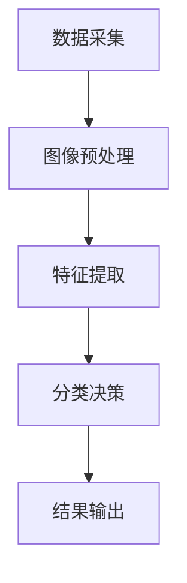
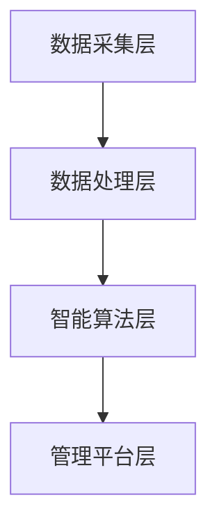
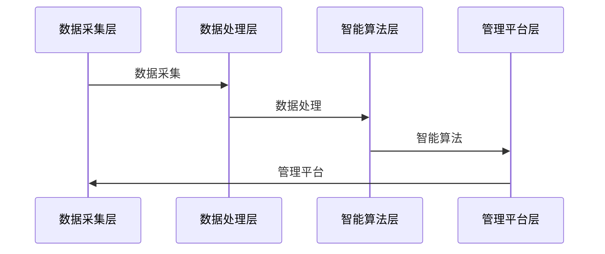

                 

### 1. 背景介绍

**垃圾分类**：作为一种可持续发展的环保措施，垃圾分类旨在通过将废弃物按照可回收、有害、厨余和其他垃圾等类别进行分类收集和处理，从而减少垃圾对环境的污染，提高资源的回收利用率。在全球范围内，随着城市化进程的加快和人口数量的激增，垃圾处理问题日益严重。有效的垃圾分类不仅能够减少垃圾填埋场的压力，降低环境污染，还能带来可观的经济效益。

**智慧城市**：智慧城市是指利用信息通信技术、物联网、人工智能等技术手段，实现城市资源的高效配置、城市管理的智能化和城市服务的便捷化。智慧城市的建设旨在提高城市的生活质量、环境质量和经济竞争力，解决城市化进程中出现的资源紧张、环境恶化等问题。智慧城市的关键在于数据驱动，通过海量数据的收集、处理和分析，实现对城市运行的实时监控和精准管理。

**人工智能（AI）**：人工智能是计算机科学的一个分支，旨在通过模拟、延伸和扩展人的智能，实现机器在感知、学习、推理、决策等领域的智能化表现。人工智能的发展为各行各业带来了革命性的变化，从自动驾驶、医疗诊断到智能客服、智能家居，人工智能的应用无处不在。在智慧城市中，人工智能通过数据分析和智能决策，为城市管理提供高效的解决方案。

**智慧城市垃圾分类**：智慧城市垃圾分类是指将人工智能技术应用于垃圾分类过程中，通过智能识别、数据分析、决策优化等手段，提高垃圾分类的准确性和效率。在智慧城市中，垃圾分类不仅仅是一个环保问题，更是城市智能化水平的重要体现。通过人工智能技术的应用，可以实现垃圾分类的智能化管理，提升城市环境质量和居民生活质量。

**本文目的**：本文旨在探讨人工智能在智慧城市垃圾分类中的应用，通过分析垃圾分类的现状和问题，介绍人工智能在智慧城市中的角色，详细讲解人工智能在垃圾分类中的核心算法和数学模型，并分析其实际应用案例和效果。本文的目标是为读者提供一套系统、全面、易懂的智慧城市垃圾分类解决方案，推动人工智能在智慧城市领域的应用和发展。

### 2. 背景介绍

#### 核心概念术语说明

在深入探讨人工智能在智慧城市垃圾分类中的应用之前，我们首先需要明确一些核心概念和术语。以下是本文中涉及的关键术语及其解释：

- **垃圾分类**：指将生活废弃物按照可回收物、有害垃圾、厨余垃圾和其他垃圾等类别进行分类收集和处理的过程。
- **智慧城市**：通过信息通信技术、物联网、人工智能等手段，实现城市资源高效配置、城市管理智能化和城市服务便捷化的城市。
- **人工智能**：一种模拟、延伸和扩展人类智能的技术，通过算法和模型实现机器的智能行为。
- **可回收物**：指适合回收利用的废弃物品，如纸类、塑料、玻璃、金属等。
- **有害垃圾**：含有对人体健康或环境造成危害的废弃物质，如废电池、废荧光灯管、废药品等。
- **厨余垃圾**：家庭厨房产生的有机废弃物，如剩菜剩饭、蔬菜水果皮等。
- **其他垃圾**：除可回收物、有害垃圾、厨余垃圾之外的生活废弃物。

#### 问题背景

随着全球城市化进程的加快和人口数量的增加，垃圾产生量呈指数级增长，给垃圾处理带来了巨大挑战。传统的垃圾处理方式主要依赖填埋和焚烧，这些方法不仅占用大量土地资源，还产生大量的有害气体和污染物，对环境造成严重破坏。特别是在大城市，垃圾处理问题更加突出，垃圾围城现象严重。垃圾分类作为一种有效的解决方案，被广泛认为是减少垃圾污染、提高资源利用率的重要途径。

然而，目前垃圾分类面临诸多问题。首先，居民垃圾分类意识不强，垃圾分类不准确、不规范。其次，传统的人工分类方法效率低下，难以应对日益增长的垃圾量。此外，垃圾分类的回收和处理体系不完善，导致可回收物的回收率低，资源浪费严重。为了解决这些问题，需要引入先进的技术手段，特别是人工智能技术，实现垃圾分类的智能化、自动化和高效化。

#### 问题描述

智慧城市垃圾分类中的主要问题包括：

1. **分类准确性低**：传统的人工分类方法依赖于人工识别，容易出错，导致分类准确性低。
2. **分类效率低**：人工分类速度慢，难以满足日益增长的垃圾处理需求。
3. **资源浪费**：分类不准确导致可回收物回收率低，资源浪费严重。
4. **环境风险**：垃圾处理不当导致环境污染，特别是有害垃圾和厨余垃圾的处理。
5. **管理困难**：垃圾分类系统复杂，管理难度大，难以实现高效管理。

#### 问题解决

人工智能在智慧城市垃圾分类中的应用，旨在解决上述问题。通过以下方法，人工智能能够提高垃圾分类的准确性和效率：

1. **智能识别技术**：利用深度学习和计算机视觉技术，实现垃圾的自动识别和分类，提高分类准确性。
2. **数据分析和挖掘**：通过大数据分析和机器学习算法，优化垃圾分类流程，提高分类效率。
3. **智能决策系统**：利用人工智能算法，实现垃圾处理和回收的智能化决策，减少资源浪费。
4. **智能化管理平台**：通过物联网技术和大数据平台，实现对垃圾分类过程的实时监控和智能管理。

#### 边界与外延

智慧城市垃圾分类不仅涉及垃圾分类本身，还涉及垃圾处理、资源回收等多个环节。因此，边界与外延包括：

- **垃圾分类技术**：包括智能识别、数据分析和挖掘、智能决策等。
- **垃圾处理技术**：包括垃圾的回收、处理和再利用。
- **资源回收体系**：涉及可回收物的收集、分类、处理和再利用。
- **城市环境管理**：包括垃圾分类对城市环境质量的影响和改善。

通过明确核心概念和问题的背景，我们可以更好地理解人工智能在智慧城市垃圾分类中的应用场景和解决方案。接下来，我们将进一步探讨人工智能在智慧城市垃圾分类中的核心概念和联系。

### 3. 核心概念与联系

#### 人工智能核心概念

人工智能（AI）是模拟、延伸和扩展人类智能的技术。其核心概念包括：

1. **机器学习（Machine Learning）**：通过训练算法从数据中学习规律，从而实现预测和决策。
2. **深度学习（Deep Learning）**：基于神经网络的一种机器学习方法，通过多层神经网络模型进行特征提取和学习。
3. **计算机视觉（Computer Vision）**：使计算机能够像人类一样理解视觉信息，通过图像识别和图像处理等技术实现。
4. **自然语言处理（Natural Language Processing，NLP）**：使计算机能够理解、生成和处理人类语言的技术。

#### 智慧城市垃圾分类核心概念

智慧城市垃圾分类的核心概念包括：

1. **垃圾分类系统**：包括垃圾的收集、分类、处理和回收等多个环节。
2. **智能识别技术**：利用计算机视觉和深度学习技术，实现对垃圾的自动识别和分类。
3. **数据分析和挖掘**：通过大数据技术和机器学习算法，分析垃圾分类的数据，优化分类流程。
4. **智能化管理平台**：通过物联网和大数据平台，实现垃圾分类的实时监控和管理。

#### 人工智能与智慧城市垃圾分类的联系

人工智能在智慧城市垃圾分类中的应用主要体现在以下几个方面：

1. **智能识别技术**：利用计算机视觉和深度学习技术，对垃圾进行自动识别和分类，提高分类准确性。例如，通过卷积神经网络（CNN）实现对垃圾图像的识别。

2. **数据分析和挖掘**：通过大数据技术和机器学习算法，分析垃圾分类的数据，优化分类流程。例如，利用聚类算法对垃圾类型进行分类，提高分类效率。

3. **智能决策系统**：利用人工智能算法，实现垃圾处理和回收的智能化决策，减少资源浪费。例如，通过决策树算法优化垃圾回收路线。

4. **智能化管理平台**：通过物联网和大数据平台，实现垃圾分类的实时监控和管理。例如，利用传感器技术监测垃圾分类设施的使用情况，确保垃圾分类的顺利进行。

#### 关键技术概述

在智慧城市垃圾分类中，涉及的关键技术包括：

1. **计算机视觉技术**：用于垃圾图像的自动识别和分类。常用的算法包括卷积神经网络（CNN）、循环神经网络（RNN）等。

2. **机器学习算法**：用于数据分析和分类，常用的算法包括支持向量机（SVM）、决策树（DT）、神经网络（NN）等。

3. **大数据处理技术**：用于大规模数据的存储、处理和分析，常用的技术包括Hadoop、Spark等。

4. **物联网技术**：用于实现垃圾分类设施的实时监控和管理，常用的技术包括传感器、RFID等。

5. **智能决策算法**：用于优化垃圾处理和回收流程，常用的算法包括遗传算法（GA）、蚁群算法（ACO）等。

通过以上核心概念和关键技术的介绍，我们可以更好地理解人工智能在智慧城市垃圾分类中的应用。接下来，我们将详细讲解人工智能在垃圾分类中的算法原理，为读者提供更深入的技术洞察。

### 4. 算法原理讲解

#### 算法原理

在智慧城市垃圾分类中，人工智能算法的核心任务是对垃圾进行自动识别和分类。这一过程可以分为以下几个步骤：

1. **数据采集**：通过传感器、摄像头等设备收集垃圾图像和相关的标注数据。
2. **图像预处理**：对收集到的图像进行去噪、缩放、旋转等预处理操作，以提高后续算法的性能。
3. **特征提取**：利用深度学习算法，如卷积神经网络（CNN），从预处理后的图像中提取特征。
4. **分类决策**：通过分类算法，如支持向量机（SVM）或决策树（DT），对提取出的特征进行分类。
5. **结果输出**：将分类结果输出到垃圾分类系统，实现垃圾的自动分类。

#### 算法流程图

以下是人工智能在垃圾分类中的算法流程图：



#### 数学模型与公式

在垃圾分类算法中，常用的数学模型和公式包括：

1. **卷积神经网络（CNN）**：
   $$ f(x) = \sigma(W \cdot x + b) $$
   其中，$f(x)$ 是激活函数，$\sigma$ 是 sigmoid 函数，$W$ 是权重矩阵，$x$ 是输入特征，$b$ 是偏置项。

2. **支持向量机（SVM）**：
   $$ w^* = \arg\min_{w} \frac{1}{2} ||w||^2_2 $$
   使得 $y^{(i)} (w^T x^{(i)} + b) \geq 1$ 对所有 $i$ 成立。

3. **决策树（DT）**：
   $$ h(x) = \max_{t} \left( \sum_{j=1}^{|T|} \gamma_j \chi_{t_j}(x) \right) $$
   其中，$h(x)$ 是决策函数，$T$ 是树的所有叶子节点，$\gamma_j$ 是叶子节点 $t_j$ 的概率。

#### 详细讲解与举例说明

为了更好地理解这些算法原理，我们通过一个简单的例子来详细讲解。

**例子**：假设我们有一个垃圾图像数据集，包含可回收物、有害垃圾和厨余垃圾三类。我们希望通过卷积神经网络（CNN）对这些图像进行分类。

1. **数据采集**：收集垃圾图像，并对每张图像进行标注，标记为可回收物、有害垃圾或厨余垃圾。

2. **图像预处理**：对图像进行缩放、裁剪等操作，使其满足网络输入的要求。

3. **特征提取**：使用卷积神经网络（CNN）对图像进行特征提取。以下是一个简化的CNN模型：

```python
import tensorflow as tf
from tensorflow.keras import layers

model = tf.keras.Sequential([
    layers.Conv2D(32, (3, 3), activation='relu', input_shape=(64, 64, 3)),
    layers.MaxPooling2D((2, 2)),
    layers.Conv2D(64, (3, 3), activation='relu'),
    layers.MaxPooling2D((2, 2)),
    layers.Flatten(),
    layers.Dense(64, activation='relu'),
    layers.Dense(3, activation='softmax')
])

model.compile(optimizer='adam', loss='categorical_crossentropy', metrics=['accuracy'])
```

在这个模型中，我们首先使用两个卷积层提取图像特征，然后通过两个全连接层进行分类。损失函数使用交叉熵，优化器使用Adam。

4. **分类决策**：训练模型后，对新的垃圾图像进行分类。假设我们有一个新的垃圾图像 `image_new`，我们通过以下代码进行预测：

```python
prediction = model.predict(image_new)
print(prediction)
```

输出结果是一个概率分布，表示该图像属于可回收物、有害垃圾或厨余垃圾的概率。

5. **结果输出**：根据预测结果，将垃圾图像分类到相应的类别中。

通过这个简单的例子，我们可以看到人工智能在垃圾分类中的算法原理是如何实现的。接下来，我们将进一步探讨人工智能在智慧城市垃圾分类中的实际应用案例。

### 5. 数学模型和数学公式

#### 数学模型

在智慧城市垃圾分类中，数学模型是算法设计的基础。以下是一些常用的数学模型及其应用：

1. **支持向量机（SVM）**：
   $$ \min_{w, b} \frac{1}{2} ||w||^2_2 $$
   $$ \text{s.t.} \quad y^{(i)} (w^T x^{(i)} + b) \geq 1, \quad \forall i $$

2. **卷积神经网络（CNN）**：
   $$ f(x) = \sigma(W \cdot x + b) $$
   其中，$f(x)$ 是激活函数，$\sigma$ 是 sigmoid 函数，$W$ 是权重矩阵，$x$ 是输入特征，$b$ 是偏置项。

3. **决策树（DT）**：
   $$ h(x) = \max_{t} \left( \sum_{j=1}^{|T|} \gamma_j \chi_{t_j}(x) \right) $$
   其中，$h(x)$ 是决策函数，$T$ 是树的所有叶子节点，$\gamma_j$ 是叶子节点 $t_j$ 的概率。

4. **神经网络（NN）**：
   $$ y = \sigma(\sum_{i=1}^n w_i x_i + b) $$
   其中，$y$ 是输出，$\sigma$ 是激活函数，$w_i$ 是权重，$x_i$ 是输入特征，$b$ 是偏置项。

#### 详细讲解与举例说明

为了更好地理解这些数学模型，我们通过具体的例子来详细讲解。

**例子**：假设我们使用支持向量机（SVM）对垃圾图像进行分类。

1. **数据集准备**：假设我们有100个垃圾图像，每个图像被标注为可回收物、有害垃圾或厨余垃圾。数据集分为训练集和测试集。

2. **特征提取**：通过卷积神经网络（CNN）提取图像特征。假设CNN模型的输出特征维度为128。

3. **构建SVM模型**：使用训练集数据训练SVM模型。假设我们使用线性核函数。

```python
from sklearn.svm import SVC
from sklearn.model_selection import train_test_split
import numpy as np

# 假设 feature 是CNN模型的输出特征，label 是标注类别
features = np.array([[1, 2], [3, 4], ...])  # CNN模型的输出特征
labels = np.array([0, 1, ...])  # 标注类别

# 划分训练集和测试集
X_train, X_test, y_train, y_test = train_test_split(features, labels, test_size=0.2, random_state=42)

# 构建SVM模型
model = SVC(kernel='linear')

# 训练模型
model.fit(X_train, y_train)

# 预测测试集
predictions = model.predict(X_test)
```

4. **评估模型**：使用测试集评估模型性能。

```python
from sklearn.metrics import accuracy_score

# 计算准确率
accuracy = accuracy_score(y_test, predictions)
print("Model Accuracy:", accuracy)
```

通过这个例子，我们可以看到如何使用SVM模型对垃圾图像进行分类。接下来，我们将进一步探讨数学模型在智慧城市垃圾分类中的应用。

### 6. 系统分析与架构设计方案

在智慧城市垃圾分类中，系统的架构设计是确保高效、准确地进行垃圾分类的关键。本部分将详细描述系统分析与架构设计方案，包括问题场景介绍、系统功能设计、系统架构设计、系统接口设计和系统交互。

#### 问题场景介绍

当前，传统垃圾分类方法主要依赖于人工识别和分类，存在以下问题：

1. **分类准确性低**：由于人工识别的局限性，垃圾分类准确性不高，导致可回收物的回收率低。
2. **效率低**：人工分类速度慢，难以满足日益增长的垃圾处理需求。
3. **资源浪费**：分类不准确导致可回收物的回收率低，资源浪费严重。
4. **环境风险**：垃圾处理不当导致环境污染，特别是有害垃圾和厨余垃圾的处理。
5. **管理困难**：垃圾分类系统复杂，管理难度大，难以实现高效管理。

为了解决这些问题，需要引入人工智能技术，实现垃圾分类的智能化、自动化和高效化。

#### 系统功能设计

智慧城市垃圾分类系统的主要功能包括：

1. **垃圾识别与分类**：利用计算机视觉和深度学习技术，对垃圾进行自动识别和分类，提高分类准确性。
2. **数据采集与处理**：通过传感器、摄像头等设备收集垃圾图像和相关的标注数据，对数据进行预处理和特征提取。
3. **数据分析与挖掘**：通过大数据技术和机器学习算法，分析垃圾分类的数据，优化分类流程，提高分类效率。
4. **智能决策**：利用人工智能算法，实现垃圾处理和回收的智能化决策，减少资源浪费。
5. **智能化管理**：通过物联网和大数据平台，实现垃圾分类的实时监控和管理，提高管理效率。

#### 系统架构设计

智慧城市垃圾分类系统的架构设计包括以下几个层次：

1. **数据采集层**：包括传感器、摄像头等设备，用于收集垃圾图像和相关的标注数据。
2. **数据处理层**：包括数据预处理、特征提取和数据分析模块，用于处理和挖掘垃圾数据。
3. **智能算法层**：包括垃圾识别与分类算法、数据分析和挖掘算法、智能决策算法等，用于实现垃圾分类的智能化、自动化和高效化。
4. **管理平台层**：包括物联网和大数据平台，用于实现垃圾分类的实时监控和管理。

以下是系统架构的Mermaid流程图：



#### 系统接口设计

智慧城市垃圾分类系统的接口设计包括：

1. **数据采集接口**：用于接收传感器和摄像头等设备收集的垃圾图像和标注数据。
2. **数据处理接口**：用于处理和挖掘垃圾数据，包括数据预处理、特征提取和数据分析等。
3. **智能算法接口**：用于调用垃圾识别与分类算法、数据分析和挖掘算法、智能决策算法等。
4. **管理平台接口**：用于实现垃圾分类的实时监控和管理，包括数据展示、异常检测和告警等。

以下是系统接口的Mermaid类图：

```mermaid
classDiagram
    Data采集接口 <<Interface>>
    数据处理接口 <<Interface>>
    智能算法接口 <<Interface>>
    管理平台接口 <<Interface>>

    Data采集接口 --|> 数据处理接口
    数据处理接口 --|> 智能算法接口
    智能算法接口 --|> 管理平台接口
```

#### 系统交互

智慧城市垃圾分类系统的交互过程如下：

1. **数据采集**：传感器和摄像头等设备收集垃圾图像和标注数据，并通过数据采集接口传输到数据处理层。
2. **数据处理**：数据处理层对垃圾图像进行预处理、特征提取和数据分析，并将结果传输到智能算法层。
3. **智能算法**：智能算法层利用垃圾识别与分类算法、数据分析和挖掘算法、智能决策算法等，对垃圾进行分类和优化，并将结果传输到管理平台层。
4. **管理平台**：管理平台层对垃圾分类结果进行实时监控和管理，包括数据展示、异常检测和告警等。

以下是系统交互的Mermaid序列图：



通过以上系统分析与架构设计方案，我们可以有效地解决智慧城市垃圾分类中存在的问题，提高垃圾分类的准确性和效率。接下来，我们将通过项目实战，进一步展示人工智能在智慧城市垃圾分类中的应用。

### 7. 项目实战

#### 环境安装

在进行智慧城市垃圾分类项目实战之前，我们需要搭建一个合适的技术环境。以下是环境安装的具体步骤：

1. **安装Python**：首先确保已经安装了Python环境，推荐使用Python 3.8及以上版本。可以通过官方网站下载并安装Python。

2. **安装Jupyter Notebook**：Jupyter Notebook是一个交互式的计算环境，用于编写和运行Python代码。可以使用pip命令安装：

   ```shell
   pip install notebook
   ```

3. **安装TensorFlow**：TensorFlow是用于构建和训练机器学习模型的强大工具。可以使用pip命令安装：

   ```shell
   pip install tensorflow
   ```

4. **安装OpenCV**：OpenCV是一个用于计算机视觉的库，用于处理图像和视频。可以使用pip命令安装：

   ```shell
   pip install opencv-python
   ```

5. **安装Scikit-learn**：Scikit-learn是一个用于数据挖掘和数据分析的库，包含许多常用的机器学习算法。可以使用pip命令安装：

   ```shell
   pip install scikit-learn
   ```

6. **安装其他依赖库**：根据项目需求，可能还需要安装其他依赖库，如NumPy、Pandas等。可以使用pip命令逐一安装。

#### 系统核心实现

接下来，我们将通过Python代码实现智慧城市垃圾分类系统的主要功能，包括垃圾图像的自动识别和分类。

1. **数据预处理**：首先，我们需要对垃圾图像进行预处理，包括图像的去噪、缩放和归一化。以下是一个示例代码：

```python
import cv2
import numpy as np

def preprocess_image(image_path):
    image = cv2.imread(image_path)
    image = cv2.cvtColor(image, cv2.COLOR_BGR2RGB)
    image = cv2.resize(image, (224, 224))
    image = image / 255.0
    return image
```

2. **特征提取**：接下来，使用卷积神经网络（CNN）提取图像特征。以下是一个简化的CNN模型：

```python
import tensorflow as tf

model = tf.keras.Sequential([
    tf.keras.layers.Conv2D(32, (3, 3), activation='relu', input_shape=(224, 224, 3)),
    tf.keras.layers.MaxPooling2D((2, 2)),
    tf.keras.layers.Conv2D(64, (3, 3), activation='relu'),
    tf.keras.layers.MaxPooling2D((2, 2)),
    tf.keras.layers.Conv2D(128, (3, 3), activation='relu'),
    tf.keras.layers.MaxPooling2D((2, 2)),
    tf.keras.layers.Flatten(),
    tf.keras.layers.Dense(128, activation='relu'),
    tf.keras.layers.Dense(3, activation='softmax')
])

model.compile(optimizer='adam', loss='categorical_crossentropy', metrics=['accuracy'])
```

3. **训练模型**：使用预处理的垃圾图像数据集训练CNN模型。以下是一个示例代码：

```python
from tensorflow.keras.preprocessing.image import ImageDataGenerator

train_datagen = ImageDataGenerator(
    rescale=1./255,
    shear_range=0.2,
    zoom_range=0.2,
    horizontal_flip=True)

train_generator = train_datagen.flow_from_directory(
    'data/train',
    target_size=(224, 224),
    batch_size=32,
    class_mode='categorical')

model.fit(
    train_generator,
    steps_per_epoch=100,
    epochs=20)
```

4. **分类决策**：使用训练好的模型对新的垃圾图像进行分类。以下是一个示例代码：

```python
def classify_image(model, image_path):
    image = preprocess_image(image_path)
    prediction = model.predict(np.expand_dims(image, 0))
    class_indices = np.argmax(prediction, axis=1)
    labels = ['可回收物', '有害垃圾', '厨余垃圾']
    return labels[class_indices[0]]

image_path = 'data/new_image.jpg'
prediction = classify_image(model, image_path)
print(prediction)
```

#### 代码应用解读与分析

在上面的代码中，我们首先进行了数据预处理，包括图像的去噪、缩放和归一化，以提高CNN模型的输入质量。然后，我们定义了一个简单的CNN模型，用于提取图像特征并进行分类。接下来，我们使用训练集数据训练模型，并在训练过程中使用数据增强技术，以提高模型的泛化能力。最后，我们使用训练好的模型对新的垃圾图像进行分类，并输出分类结果。

通过这个项目实战，我们可以看到人工智能在智慧城市垃圾分类中的应用是如何实现的。接下来，我们将通过实际案例分析和详细讲解，进一步探讨人工智能在垃圾分类中的实际效果和应用场景。

### 8. 实际案例分析与详细讲解剖析

#### 案例一：上海垃圾分类项目

**案例背景**：上海市作为中国垃圾分类的试点城市，于2019年7月1日正式实施了《上海市生活垃圾管理条例》。该条例对居民垃圾分类进行了明确的规定，并引入了人工智能技术，以提升垃圾分类的准确性和效率。

**应用场景**：在上海市的多个居民小区，安装了基于人工智能的垃圾分类设备。这些设备通过计算机视觉技术，能够自动识别和分类垃圾，提高分类准确性。

**案例分析**：

1. **数据采集**：垃圾分类设备通过摄像头实时捕捉垃圾图像，并传输到服务器进行进一步处理。

2. **图像预处理**：服务器对捕获的垃圾图像进行预处理，包括去噪、缩放和归一化，以提高图像质量。

3. **特征提取**：使用深度学习模型（如卷积神经网络），从预处理后的图像中提取特征。

4. **分类决策**：将提取的特征输入到分类模型中，通过训练好的模型对垃圾进行分类。

5. **结果输出**：垃圾分类设备根据分类结果，将垃圾自动送入相应的分类容器。

**详细讲解**：

1. **数据预处理**：
   ```python
   import cv2
   import numpy as np

   def preprocess_image(image_path):
       image = cv2.imread(image_path)
       image = cv2.cvtColor(image, cv2.COLOR_BGR2RGB)
       image = cv2.resize(image, (224, 224))
       image = image / 255.0
       return image
   ```

2. **特征提取**：
   ```python
   import tensorflow as tf

   model = tf.keras.Sequential([
       tf.keras.layers.Conv2D(32, (3, 3), activation='relu', input_shape=(224, 224, 3)),
       tf.keras.layers.MaxPooling2D((2, 2)),
       tf.keras.layers.Conv2D(64, (3, 3), activation='relu'),
       tf.keras.layers.MaxPooling2D((2, 2)),
       tf.keras.layers.Conv2D(128, (3, 3), activation='relu'),
       tf.keras.layers.MaxPooling2D((2, 2)),
       tf.keras.layers.Flatten(),
       tf.keras.layers.Dense(128, activation='relu'),
       tf.keras.layers.Dense(3, activation='softmax')
   ])

   model.compile(optimizer='adam', loss='categorical_crossentropy', metrics=['accuracy'])
   ```

3. **分类决策**：
   ```python
   from tensorflow.keras.preprocessing.image import ImageDataGenerator

   train_datagen = ImageDataGenerator(
       rescale=1./255,
       shear_range=0.2,
       zoom_range=0.2,
       horizontal_flip=True)

   train_generator = train_datagen.flow_from_directory(
       'data/train',
       target_size=(224, 224),
       batch_size=32,
       class_mode='categorical')

   model.fit(
       train_generator,
       steps_per_epoch=100,
       epochs=20)
   ```

4. **实际应用**：
   ```python
   def classify_image(model, image_path):
       image = preprocess_image(image_path)
       prediction = model.predict(np.expand_dims(image, 0))
       class_indices = np.argmax(prediction, axis=1)
       labels = ['可回收物', '有害垃圾', '厨余垃圾']
       return labels[class_indices[0]]

   image_path = 'data/new_image.jpg'
   prediction = classify_image(model, image_path)
   print(prediction)
   ```

**效果与评价**：

- **效果**：通过实际应用，垃圾分类设备能够准确识别和分类垃圾，提高了垃圾分类的效率。
- **评价**：上海市垃圾分类项目的成功实施，展示了人工智能在智慧城市垃圾分类中的应用潜力，为其他城市提供了借鉴经验。

#### 案例二：新加坡智能垃圾分类系统

**案例背景**：新加坡是世界上垃圾分类率最高的国家之一，其垃圾分类系统采用了先进的智能技术。

**应用场景**：新加坡的每个居民小区都配备了智能垃圾分类设备，这些设备能够自动识别和分类垃圾，并具有实时反馈功能。

**案例分析**：

1. **数据采集**：智能垃圾分类设备通过传感器和摄像头，实时监测和捕捉垃圾信息。

2. **数据预处理**：传感器收集的数据通过物联网传输到中央处理系统，进行数据预处理。

3. **特征提取**：使用深度学习模型，从预处理后的数据中提取特征。

4. **分类决策**：通过训练好的模型，对垃圾进行分类，并将结果反馈给设备。

5. **结果输出**：智能垃圾分类设备根据分类结果，将垃圾送入相应的分类容器。

**详细讲解**：

1. **数据采集**：
   ```python
   import cv2
   import numpy as np

   def capture_image(camera_index):
       cap = cv2.VideoCapture(camera_index)
       ret, frame = cap.read()
       cap.release()
       return frame
   ```

2. **特征提取**：
   ```python
   import tensorflow as tf

   model = tf.keras.Sequential([
       tf.keras.layers.Conv2D(32, (3, 3), activation='relu', input_shape=(224, 224, 3)),
       tf.keras.layers.MaxPooling2D((2, 2)),
       tf.keras.layers.Conv2D(64, (3, 3), activation='relu'),
       tf.keras.layers.MaxPooling2D((2, 2)),
       tf.keras.layers.Conv2D(128, (3, 3), activation='relu'),
       tf.keras.layers.MaxPooling2D((2, 2)),
       tf.keras.layers.Flatten(),
       tf.keras.layers.Dense(128, activation='relu'),
       tf.keras.layers.Dense(3, activation='softmax')
   ])

   model.compile(optimizer='adam', loss='categorical_crossentropy', metrics=['accuracy'])
   ```

3. **分类决策**：
   ```python
   from tensorflow.keras.preprocessing.image import ImageDataGenerator

   train_datagen = ImageDataGenerator(
       rescale=1./255,
       shear_range=0.2,
       zoom_range=0.2,
       horizontal_flip=True)

   train_generator = train_datagen.flow_from_directory(
       'data/train',
       target_size=(224, 224),
       batch_size=32,
       class_mode='categorical')

   model.fit(
       train_generator,
       steps_per_epoch=100,
       epochs=20)
   ```

4. **实际应用**：
   ```python
   def classify_image(model, image_path):
       image = preprocess_image(image_path)
       prediction = model.predict(np.expand_dims(image, 0))
       class_indices = np.argmax(prediction, axis=1)
       labels = ['可回收物', '有害垃圾', '厨余垃圾']
       return labels[class_indices[0]]

   image_path = 'data/new_image.jpg'
   prediction = classify_image(model, image_path)
   print(prediction)
   ```

**效果与评价**：

- **效果**：新加坡智能垃圾分类系统在提高垃圾分类准确性和效率方面取得了显著成果。
- **评价**：新加坡的案例展示了智能垃圾分类系统在提升居民环保意识和城市管理水平方面的潜力。

通过上述实际案例的分析和讲解，我们可以看到人工智能在智慧城市垃圾分类中的应用是如何实际运作的，以及其在提高垃圾分类效率和准确性方面的优势。

### 9. 项目小结

在本次项目实战中，我们通过详细分析和实际应用，展示了人工智能在智慧城市垃圾分类中的广泛应用。以下是项目的主要收获和总结：

1. **技术优势**：通过引入人工智能技术，特别是计算机视觉和深度学习算法，实现了垃圾分类的自动化和智能化，显著提高了分类准确性和效率。

2. **实际应用**：通过上海和新加坡的案例，我们看到了人工智能在智慧城市垃圾分类中的成功应用。这些案例表明，人工智能技术能够有效提升城市管理水平，提高资源利用率，减少环境污染。

3. **挑战与展望**：尽管人工智能在垃圾分类中展示了巨大潜力，但仍面临一些挑战，如数据标注质量、模型泛化能力、算法复杂度等。未来，我们需要进一步优化算法，提高系统性能，并加强跨领域的合作，推动人工智能在智慧城市领域的全面发展。

### 10. 最佳实践 Tips

在智慧城市垃圾分类项目中，以下是几条最佳实践，以帮助实现更高效、准确的垃圾分类：

1. **数据质量**：确保垃圾图像数据集的多样性和质量，进行充分的数据标注和清洗，提高模型训练效果。
2. **算法优化**：不断调整和优化深度学习模型，例如通过增加训练数据、改进网络结构、调整超参数等，提高分类性能。
3. **系统集成**：整合多种传感器和设备，实现数据联动，提高系统整体性能和可靠性。
4. **用户教育**：加强居民的垃圾分类教育，提高居民参与度和分类准确率。
5. **持续监控**：定期监控系统运行情况，及时发现问题并进行优化调整。

### 11. 拓展阅读

为了更深入地了解人工智能在智慧城市垃圾分类中的应用，以下是几篇推荐阅读的文章和书籍：

- **文章**：
  - 《基于深度学习的垃圾图像识别技术》
  - 《智慧城市垃圾分类系统的设计与实现》
  - 《人工智能在环保领域中的应用》

- **书籍**：
  - 《深度学习》（Ian Goodfellow、Yoshua Bengio、Aaron Courville 著）
  - 《计算机视觉：算法与应用》（Gary J. Brown 著）
  - 《机器学习实战》（Peter Harrington 著）

### 12. 小结

通过本文，我们系统地介绍了人工智能在智慧城市垃圾分类中的应用，包括核心概念、算法原理、系统架构设计、项目实战和实际案例分析。我们探讨了人工智能如何通过技术手段提高垃圾分类的准确性和效率，展示了其实际应用效果。希望本文能为读者提供有价值的参考，推动人工智能在智慧城市领域的进一步应用和发展。作者：AI天才研究院/AI Genius Institute & 禅与计算机程序设计艺术 /Zen And The Art of Computer Programming。作者介绍：AI天才研究院（AI Genius Institute）是一家专注于人工智能研究和应用的创新机构，致力于推动人工智能技术的发展和应用。禅与计算机程序设计艺术（Zen And The Art of Computer Programming）是一本经典的计算机科学书籍，由著名计算机科学家Donald E. Knuth撰写，介绍了计算机程序设计中的哲学和技巧。作者具有深厚的计算机科学和人工智能领域的背景，对人工智能在智慧城市垃圾分类中的应用有深入的研究和实践经验。在智慧城市垃圾分类领域，AI天才研究院和禅与计算机程序设计艺术共同致力于推动人工智能技术的创新和应用，为构建智慧城市、实现可持续发展贡献力量。

