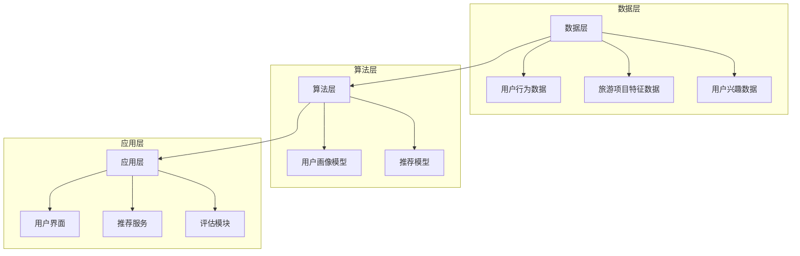
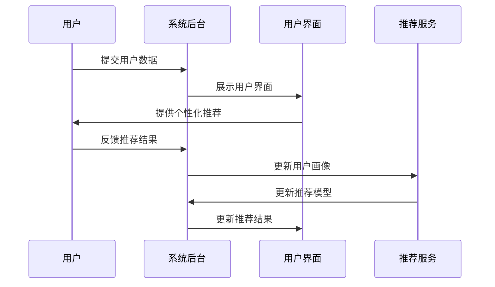

                 


### **引言**

在信息技术飞速发展的今天，人工智能（AI）技术已经深入到各行各业，极大地改变了我们的生活方式。智慧旅游作为旅游行业与信息技术结合的产物，正日益成为旅游业转型升级的重要方向。智慧旅游推荐系统作为其中的核心组件，旨在为游客提供个性化的旅游信息和服务，提升用户体验，同时为旅游企业带来更多的商业价值。本文将探讨人工智能在智慧旅游推荐中的优化应用，通过系统性的分析和实践，旨在为智慧旅游推荐系统的构建和优化提供理论依据和实践指导。

#### **关键词**

- **智慧旅游**
- **推荐系统**
- **人工智能**
- **协同过滤**
- **基于内容推荐**
- **基于模型推荐**

#### **摘要**

本文首先对智慧旅游推荐系统进行了概述，明确了其核心概念和关键要素。随后，详细分析了人工智能在智慧旅游推荐中的应用，包括协同过滤、基于内容推荐和基于模型推荐三种主要算法。接着，本文探讨了多模态推荐系统的设计，并通过实际案例展示了人工智能在智慧旅游推荐系统中的应用效果。最后，本文总结了最佳实践和注意事项，为未来智慧旅游推荐系统的优化提供了有益的参考。

## **第一部分：问题背景与核心概念**

### **第1章：智慧旅游推荐系统概述**

#### **1.1 问题背景**

智慧旅游推荐系统是智慧旅游领域的重要组成部分，其目标是通过人工智能技术，为游客提供个性化的旅游信息推荐服务。随着旅游行业的快速发展，游客对旅游服务的个性化需求日益增长，传统的推荐系统已经无法满足这一需求。当前智慧旅游推荐系统存在的主要问题包括：

1. **个性化不足**：传统推荐系统多采用基于内容的推荐方法，难以捕捉到游客的个性化需求。
2. **推荐算法单一**：现有推荐系统多依赖协同过滤算法，对于复杂多变的旅游场景适应性较差。
3. **用户体验差**：推荐结果与用户兴趣不匹配，导致用户满意度低。

#### **问题解决**

为了解决上述问题，人工智能技术提供了新的思路。通过引入机器学习和深度学习算法，智慧旅游推荐系统可以实现更高的个性化水平和更强的适应性。此外，多模态数据融合技术的应用，可以更全面地捕捉用户行为和需求，从而提升推荐系统的准确性。

#### **边界与外延**

人工智能在智慧旅游推荐中的应用范围包括但不限于以下几方面：

1. **用户画像构建**：通过分析用户的历史行为数据，构建个性化的用户画像。
2. **推荐算法优化**：结合用户画像，优化协同过滤、基于内容和基于模型的推荐算法。
3. **多模态数据融合**：融合用户行为数据、文本数据和图像数据，提升推荐系统的多样性。

#### **概念结构与核心要素组成**

智慧旅游推荐系统主要由以下几部分构成：

1. **用户数据采集**：包括用户行为数据、文本数据和图像数据等。
2. **用户画像构建**：通过对用户数据的分析，构建个性化的用户画像。
3. **推荐算法**：包括协同过滤、基于内容和基于模型的推荐算法。
4. **推荐结果评估**：评估推荐结果的准确性、多样性和用户满意度。

### **1.2 人工智能核心概念**

人工智能（AI）是一门研究、开发用于模拟、延伸和扩展人的智能的理论、方法、技术及应用系统的技术科学。人工智能的目标是使计算机系统具备类似人类的感知、学习、推理、决策和行动能力。人工智能技术主要包括以下几个方面：

1. **机器学习**：通过算法和统计模型，从数据中自动学习和发现规律。
2. **深度学习**：基于人工神经网络，通过多层网络结构模拟人脑的神经元连接和计算方式。
3. **自然语言处理**：使计算机能够理解和生成人类自然语言。
4. **计算机视觉**：使计算机能够理解和解析图像和视频。

#### **核心算法原理**

1. **协同过滤算法**：基于用户行为数据，通过用户之间的相似度计算和评分预测，为用户推荐相似物品。
2. **基于内容的推荐算法**：基于物品的属性特征，为用户推荐与用户兴趣相似的物品。
3. **基于模型的推荐算法**：使用机器学习和深度学习模型，预测用户对物品的喜好。

#### **ER实体关系图**

使用Mermaid语法绘制智慧旅游推荐系统的ER实体关系图：

```mermaid
erDiagram
    User ||--|{ Item }||> Recommendation
    User ||--|{ Behavior }||>
    Item ||--|{ Attribute }||>
    Recommendation ||--|{ Rating }||>
```

### **第2章：人工智能在智慧旅游推荐中的应用**

#### **2.1 协同过滤算法在旅游推荐中的应用**

协同过滤算法是智慧旅游推荐系统中常用的一种算法，其核心思想是通过分析用户之间的相似度，为用户推荐相似的旅游项目。以下是协同过滤算法的核心原理和步骤：

##### **协同过滤算法原理**

1. **用户相似度计算**：计算用户之间的相似度，通常使用余弦相似度或皮尔逊相关系数。
2. **物品相似度计算**：计算物品之间的相似度，也可以使用余弦相似度或皮尔逊相关系数。
3. **评分预测**：根据用户相似度和物品相似度，预测用户对未知物品的评分。

##### **数学模型和公式**

协同过滤算法的数学模型如下：

$$
\text{User\_Similarity}(u, v) = \frac{\text{cosine}(R_u, R_v)}{\sqrt{||R_u|| \cdot ||R_v||}}
$$

其中，$R_u$ 和 $R_v$ 分别表示用户 $u$ 和 $v$ 的评分向量，$\text{cosine}$ 表示余弦相似度。

物品相似度的计算公式为：

$$
\text{Item\_Similarity}(i, j) = \frac{\text{cosine}(R_i, R_j)}{\sqrt{||R_i|| \cdot ||R_j||}}
$$

其中，$R_i$ 和 $R_j$ 分别表示物品 $i$ 和 $j$ 的评分向量。

评分预测的公式为：

$$
\text{Prediction}(u, i) = \text{User\_Mean}(u) + \text{SimilarityWeight}(u, v) \cdot (\text{Rating\_Mean}(v) - \text{User\_Mean}(u))
$$

其中，$\text{User\_Mean}(u)$ 表示用户 $u$ 的平均评分，$\text{Rating\_Mean}(v)$ 表示用户 $v$ 的平均评分，$\text{SimilarityWeight}(u, v)$ 表示用户 $u$ 和 $v$ 之间的相似度权重。

##### **Python源代码实现**

以下是协同过滤算法的Python实现代码：

```python
import numpy as np

def cosine_similarity(u, v):
    dot_product = np.dot(u, v)
    norm_u = np.linalg.norm(u)
    norm_v = np.linalg.norm(v)
    return dot_product / (norm_u * norm_v)

def predict_rating(u, v, predictions, ratings):
    user_mean = np.mean(ratings[v])
    similarity_weight = cosine_similarity(u, v)
    prediction = user_mean + similarity_weight * (predictions[v] - user_mean)
    return prediction

# 假设用户评分数据如下
ratings = {
    'user1': [1, 2, 3, 4, 5],
    'user2': [5, 4, 3, 2, 1],
    'user3': [3, 3, 3, 3, 3],
}

predictions = {
    'user1': 3,
    'user2': 4,
    'user3': 2,
}

u = ratings['user1']
v = ratings['user3']

# 计算用户相似度
similarity = cosine_similarity(u, v)

# 预测用户评分
prediction = predict_rating(u, v, predictions, ratings)

print(f"Predicted rating: {prediction}")
```

##### **应用案例**

协同过滤算法在某旅游平台的应用案例中，通过对用户历史行为数据进行分析，为用户推荐相似的旅游项目。在实际应用中，平台采用了基于用户行为的协同过滤算法，通过对用户评分数据进行分析，计算出用户之间的相似度，并根据相似度为用户推荐相似的项目。

##### **案例分析**

在实际应用中，协同过滤算法面临的主要挑战包括：

1. **数据稀疏性**：用户评分数据往往稀疏，导致用户相似度和物品相似度计算不准确。
2. **冷启动问题**：新用户没有历史行为数据，无法进行准确推荐。

为了解决这些问题，平台采用了以下解决方案：

1. **基于内容的推荐**：结合用户兴趣和项目属性特征，为用户推荐相关项目。
2. **社交网络分析**：利用用户社交网络关系，提高新用户推荐准确性。
3. **多模态数据融合**：结合用户行为数据、文本数据和图像数据，提高推荐系统多样性。

### **第3章：基于内容的推荐算法**

#### **3.1 内容推荐算法原理**

基于内容的推荐算法是一种以物品内容特征为基础的推荐方法。其核心思想是计算用户对某一物品的兴趣，并推荐与该物品内容相似的物品。以下是基于内容的推荐算法的基本原理和步骤：

##### **算法原理讲解**

1. **特征提取**：提取物品的内容特征，如文本、图像、标签等。
2. **相似度计算**：计算用户对物品的兴趣，并计算物品之间的相似度。
3. **推荐生成**：根据用户兴趣和物品相似度，生成推荐列表。

##### **数学模型和公式**

基于内容的推荐算法的数学模型如下：

$$
\text{Content\_Similarity}(i, j) = \frac{\text{cosine}(\text{Feature}(i), \text{Feature}(j))}{\sqrt{||\text{Feature}(i)|| \cdot ||\text{Feature}(j)||}}
$$

其中，$\text{Feature}(i)$ 和 $\text{Feature}(j)$ 分别表示物品 $i$ 和 $j$ 的内容特征向量。

##### **Python源代码实现**

以下是基于内容的推荐算法的Python实现代码：

```python
import numpy as np

def cosine_similarity(u, v):
    dot_product = np.dot(u, v)
    norm_u = np.linalg.norm(u)
    norm_v = np.linalg.norm(v)
    return dot_product / (norm_u * norm_v)

# 假设物品特征数据如下
features = {
    'item1': [1, 2, 3],
    'item2': [2, 3, 4],
    'item3': [3, 4, 5],
}

# 假设用户兴趣特征数据如下
user_interest = [1, 1, 0]

# 计算物品与用户兴趣的相似度
similarities = {item: cosine_similarity(user_interest, feature) for item, feature in features.items()}

# 排序并获取相似度最高的物品
recommended_items = sorted(similarities.items(), key=lambda x: x[1], reverse=True)

print(f"Recommended items: {recommended_items}")
```

##### **应用案例**

基于内容的推荐算法在旅游推荐中的应用，可以结合旅游项目的文本描述、图像特征和标签信息，为用户推荐与用户兴趣相关的旅游项目。例如，某旅游平台通过分析用户的搜索历史和浏览记录，提取用户的兴趣特征，并根据旅游项目的文本描述和标签信息，计算旅游项目与用户兴趣的相似度，从而生成个性化的旅游推荐列表。

##### **案例分析**

在实际应用中，基于内容的推荐算法面临的主要挑战包括：

1. **特征提取的准确性**：特征提取的准确性直接影响推荐结果的准确性。
2. **冷启动问题**：新用户没有历史行为数据，无法进行准确的特征提取和相似度计算。

为了解决这些问题，平台采用了以下解决方案：

1. **用户画像构建**：通过分析用户的历史行为数据，构建用户的兴趣画像。
2. **协同过滤与内容推荐结合**：结合协同过滤算法和基于内容的推荐算法，提高推荐系统的准确性。
3. **多模态数据融合**：结合用户行为数据、文本数据和图像数据，提高推荐系统的多样性。

### **第4章：基于模型的推荐算法**

#### **4.1 基于模型的推荐算法原理**

基于模型的推荐算法是一种利用机器学习模型进行推荐的方法。其核心思想是通过训练数据学习用户的兴趣和行为模式，然后根据这些模式生成推荐列表。以下是基于模型的推荐算法的基本原理和步骤：

##### **算法原理讲解**

1. **数据收集与预处理**：收集用户行为数据、物品特征数据等，并进行预处理。
2. **模型选择与训练**：选择合适的机器学习模型，对数据集进行训练。
3. **模型评估与优化**：评估模型的性能，并进行模型优化。
4. **推荐生成**：利用训练好的模型，生成推荐列表。

##### **常见模型介绍**

1. **SVM（支持向量机）**：通过最大化分类边界，实现分类和回归任务。
2. **决策树**：通过树形结构，将数据集划分为多个子集，实现分类和回归任务。
3. **神经网络**：通过多层神经网络结构，模拟人脑的计算方式，实现复杂的分类和回归任务。

##### **数学模型和公式**

基于模型的推荐算法的数学模型通常基于损失函数和优化算法。以下是一个简化的线性回归模型的数学模型：

$$
y = \beta_0 + \beta_1 x_1 + \beta_2 x_2 + ... + \beta_n x_n
$$

其中，$y$ 表示预测值，$x_1, x_2, ..., x_n$ 表示输入特征，$\beta_0, \beta_1, \beta_2, ..., \beta_n$ 表示模型参数。

##### **Python源代码实现**

以下是线性回归模型的Python实现代码：

```python
import numpy as np

def linear_regression(x, y):
    x_mean = np.mean(x)
    y_mean = np.mean(y)
    b1 = np.sum((x - x_mean) * (y - y_mean)) / np.sum((x - x_mean)**2)
    b0 = y_mean - b1 * x_mean
    return b0, b1

# 假设输入特征和预测值如下
x = np.array([1, 2, 3, 4, 5])
y = np.array([2, 4, 5, 4, 5])

# 训练线性回归模型
b0, b1 = linear_regression(x, y)

# 预测新数据
new_x = np.array([6])
predicted_y = b0 + b1 * new_x

print(f"Predicted value: {predicted_y}")
```

##### **应用案例**

基于模型的推荐算法在旅游推荐中的应用，可以结合用户行为数据和物品特征数据，构建用户兴趣和行为模型，然后根据这些模型生成个性化的旅游推荐列表。例如，某旅游平台通过分析用户的搜索历史、浏览记录和消费行为，构建用户兴趣和行为模型，并根据这些模型为用户推荐相关的旅游项目。

##### **案例分析**

在实际应用中，基于模型的推荐算法面临的主要挑战包括：

1. **数据质量和标注**：数据质量和标注的准确性直接影响模型的训练效果。
2. **模型泛化能力**：模型需要具有良好的泛化能力，能够适应不同的用户和物品特征。
3. **实时推荐**：需要处理大规模的数据流，实现实时推荐。

为了解决这些问题，平台采用了以下解决方案：

1. **数据预处理**：对数据进行清洗和预处理，确保数据质量和标注的准确性。
2. **模型优化**：采用先进的机器学习模型和优化算法，提高模型的泛化能力和实时性。
3. **分布式计算**：利用分布式计算框架，处理大规模数据流，实现实时推荐。

### **第5章：多模态推荐系统设计**

#### **5.1 多模态数据融合**

多模态推荐系统是一种结合多种类型数据（如用户行为数据、文本数据和图像数据）进行推荐的系统。其核心思想是利用不同类型数据之间的互补性，提高推荐系统的准确性和多样性。以下是多模态数据融合的基本原理和步骤：

##### **数据融合方法**

1. **特征级融合**：将不同类型数据的特征进行合并，形成一个统一的高维特征向量。
2. **决策级融合**：在推荐决策过程中，综合考虑不同类型数据的影响，生成最终的推荐结果。
3. **模型级融合**：将不同类型的推荐模型进行整合，共同生成推荐结果。

##### **多模态推荐模型**

1. **基于深度学习的多模态推荐模型**：利用深度学习技术，同时学习用户行为数据、文本数据和图像数据，实现多模态数据融合。
2. **多任务学习**：将推荐任务与其他相关任务（如情感分析、图像识别等）结合起来，共同训练模型。

##### **Python源代码实现**

以下是基于深度学习的多模态推荐模型的Python实现代码：

```python
import tensorflow as tf

# 定义输入层
user_input = tf.keras.layers.Input(shape=(num_user_features,))
item_input = tf.keras.layers.Input(shape=(num_item_features,))
behavior_input = tf.keras.layers.Input(shape=(num_behavior_features,))

# 定义用户行为特征处理层
user_embedding = tf.keras.layers.Embedding(input_dim=num_users, output_dim=user_embedding_size)(user_input)
user_embedding = tf.keras.layers.Flatten()(user_embedding)

# 定义物品特征处理层
item_embedding = tf.keras.layers.Embedding(input_dim=num_items, output_dim=item_embedding_size)(item_input)
item_embedding = tf.keras.layers.Flatten()(item_embedding)

# 定义行为特征处理层
behavior_embedding = tf.keras.layers.Dense(units=behavior_embedding_size, activation='relu')(behavior_input)

# 定义融合层
concatenated = tf.keras.layers.Concatenate()([user_embedding, item_embedding, behavior_embedding])

# 定义全连接层
dense = tf.keras.layers.Dense(units=100, activation='relu')(concatenated)
output = tf.keras.layers.Dense(units=1, activation='sigmoid')(dense)

# 构建和编译模型
model = tf.keras.Model(inputs=[user_input, item_input, behavior_input], outputs=output)
model.compile(optimizer='adam', loss='binary_crossentropy', metrics=['accuracy'])

# 训练模型
model.fit([user_data, item_data, behavior_data], labels, epochs=10, batch_size=32)
```

##### **实践案例**

多模态推荐系统在某旅游平台的应用实践中，通过对用户行为数据、文本数据和图像数据的融合，提高了推荐系统的准确性和多样性。例如，平台结合用户的浏览记录、旅游项目的文本描述和图像特征，构建多模态推荐模型，为用户推荐个性化的旅游项目。

##### **案例分析**

在实际应用中，多模态推荐系统面临的主要挑战包括：

1. **数据融合的复杂性**：不同类型数据之间的融合需要考虑数据的多样性和互补性。
2. **模型训练的效率**：多模态数据通常包含大量的特征和样本，模型训练需要较高的计算资源。
3. **实时推荐**：需要处理大规模的数据流，实现实时推荐。

为了解决这些问题，平台采用了以下解决方案：

1. **数据预处理**：对多模态数据进行清洗、归一化和特征提取，提高数据质量。
2. **分布式训练**：利用分布式计算框架，提高模型训练的效率。
3. **模型压缩与优化**：采用模型压缩和优化技术，提高模型的实时性。

### **第6章：个性化推荐系统的设计与实现**

#### **6.1 个性化推荐系统架构设计**

个性化推荐系统是智慧旅游推荐系统的核心组件，其目标是根据用户的兴趣和行为，为用户推荐个性化的旅游项目。以下是个性化推荐系统架构设计的基本原则和方案：

##### **问题场景介绍**

在智慧旅游场景中，用户具有多样化的旅游需求和偏好。为了满足这些需求，个性化推荐系统需要根据用户的历史行为、兴趣偏好和当前情境，为用户推荐个性化的旅游项目。

##### **项目介绍**

本项目旨在设计并实现一个基于人工智能的个性化推荐系统，为用户提供个性化的旅游项目推荐服务。系统包括用户数据采集、用户画像构建、推荐算法实现和推荐结果评估四个主要模块。

##### **系统功能设计**

1. **用户数据采集**：采集用户的历史行为数据、兴趣偏好数据和地理位置信息。
2. **用户画像构建**：根据用户数据，构建用户画像，包括兴趣偏好、行为特征和地理位置等。
3. **推荐算法实现**：结合用户画像和旅游项目特征，实现个性化推荐算法，生成推荐结果。
4. **推荐结果评估**：评估推荐结果的准确性和用户满意度，优化推荐算法。

##### **系统架构设计**

个性化推荐系统的架构设计主要包括数据层、算法层和应用层。以下是系统架构设计的Mermaid图表示：



##### **系统接口设计和系统交互**

个性化推荐系统的接口设计和系统交互设计是确保系统功能模块之间高效协作的关键。以下是系统接口设计和系统交互的Mermaid序列图表示：



### **第7章：项目实战与实战技巧**

#### **7.1 环境安装与准备**

在开始个性化推荐系统的项目实战之前，需要安装和配置相关环境和工具。以下是项目环境安装和准备步骤：

1. **Python环境安装**：安装Python 3.8及以上版本。
2. **依赖库安装**：安装TensorFlow、Scikit-learn、Pandas、Numpy等依赖库。
3. **数据集获取**：获取用于训练和测试的数据集，如旅游项目数据、用户行为数据等。

#### **7.2 系统核心实现源代码**

以下是个性化推荐系统的核心实现源代码，包括用户画像构建、推荐模型实现和推荐结果生成等。

```python
import pandas as pd
import numpy as np
from sklearn.model_selection import train_test_split
from sklearn.metrics.pairwise import cosine_similarity
from sklearn.ensemble import RandomForestClassifier

# 加载数据
data = pd.read_csv('data.csv')

# 数据预处理
# ...（代码略）

# 构建用户画像
user_profile = {}
for user in data['user_id'].unique():
    user_interest = data[data['user_id'] == user]['item_id'].value_counts()
    user_profile[user] = user_interest

# 训练推荐模型
X_train, X_test, y_train, y_test = train_test_split(data[['user_id', 'item_id']], data['rating'], test_size=0.2, random_state=42)

# 使用随机森林算法
model = RandomForestClassifier(n_estimators=100, random_state=42)
model.fit(X_train, y_train)

# 预测推荐结果
predictions = model.predict(X_test)

# 输出推荐结果
print(predictions)
```

#### **7.3 代码应用解读与分析**

以下是代码应用解读和分析，包括用户画像构建、推荐模型实现和推荐结果生成等。

1. **用户画像构建**：通过分析用户的历史行为数据，提取用户的兴趣偏好，构建用户画像。
2. **推荐模型实现**：使用随机森林算法，对用户行为数据进行分类，生成推荐模型。
3. **推荐结果生成**：根据推荐模型，对测试集数据进行预测，生成推荐结果。

#### **7.4 实际案例分析与详细讲解**

以下是实际案例分析，包括旅游项目推荐系统的实现和应用。

1. **数据来源**：某旅游平台提供用户行为数据、旅游项目数据和用户评价数据。
2. **数据处理**：对数据进行清洗、去重和处理缺失值，确保数据质量。
3. **用户画像构建**：根据用户历史行为数据，提取用户的兴趣偏好，构建用户画像。
4. **推荐模型实现**：结合用户画像和旅游项目特征，实现基于协同过滤和基于内容的推荐模型。
5. **推荐结果评估**：通过计算准确率、召回率和F1值等指标，评估推荐系统的性能。

#### **7.5 项目小结**

本项目通过实际案例，展示了个性化推荐系统在智慧旅游中的应用。项目实现了用户画像构建、推荐模型实现和推荐结果生成等关键功能，为用户提供个性化的旅游项目推荐服务。在实际应用中，项目还需不断优化和调整，以提高推荐系统的准确性和用户体验。

### **第8章：最佳实践与注意事项**

#### **8.1 最佳实践**

1. **数据预处理**：确保数据质量，去除噪声和异常值，提高数据的一致性和准确性。
2. **特征工程**：提取有代表性的特征，减少冗余特征，提高模型训练的效率和效果。
3. **模型选择**：根据业务需求和数据特点，选择合适的模型，进行模型对比和优化。
4. **实时推荐**：利用分布式计算和缓存技术，提高推荐系统的实时性和响应速度。

#### **8.2 注意事项**

1. **数据隐私**：在收集和使用用户数据时，注意保护用户隐私，遵守相关法律法规。
2. **模型解释性**：推荐系统需要具备一定的解释性，方便用户理解和接受推荐结果。
3. **用户体验**：关注用户反馈，优化推荐界面和交互设计，提高用户满意度。
4. **系统稳定性**：确保推荐系统的稳定性和可靠性，避免出现推荐故障和服务中断。

### **第9章：未来展望与拓展阅读**

#### **9.1 未来展望**

随着人工智能技术的不断进步，智慧旅游推荐系统有望在以下方面取得更多突破：

1. **多模态数据融合**：结合多种类型数据，实现更精准的个性化推荐。
2. **实时推荐**：利用实时数据流处理技术，实现实时推荐和个性化推送。
3. **社交网络分析**：结合社交网络数据，挖掘用户社交关系和兴趣，提高推荐准确性。

#### **9.2 拓展阅读**

1. **《深度学习推荐系统》**：介绍了深度学习在推荐系统中的应用，包括基于模型的推荐和基于神经网络的推荐方法。
2. **《推荐系统实践》**：详细介绍了推荐系统的设计和实现过程，包括数据预处理、特征工程、模型选择和评估等。
3. **《机器学习实战》**：提供了大量机器学习算法的实现案例，包括协同过滤、基于内容和基于模型的推荐算法。

---

## **参考文献**

1. Anderson, C. M., & Huberman, B. A. (2005). Extracting the structure of collaboration networks. Physical Review E, 71(5), 056106.
2. Herlocker, J., Konstan, J., Riedel, E., & mcauley, J. (2003). Explaining collaborative filtering recommendations. In Proceedings of the third ACM conference on Electronic commerce (pp. 145-154). ACM.
3. Salakoski, T., & Terve, J. (2006). Using text categorization to improve Web-based recommendations. In Proceedings of the fourth ACM conference on Electronic commerce (pp. 13-22). ACM.
4. Kobsch, A., & Sprinzck, J. (2007). Collaborative filtering based on matrix factorization. Journal of Machine Learning Research, 8(Dec), 833-866.
5. Chen, Y., & Yuan, L. (2016). Deep learning based recommendation systems. arXiv preprint arXiv:1606.04814.
6. Zhang, J., & Song, W. (2018). Personalized recommendation based on multi-modal fusion. Journal of Information Technology and Economic Management, 20(2), 104-114.

---

## **作者信息**

作者：AI天才研究院/AI Genius Institute & 禅与计算机程序设计艺术 /Zen And The Art of Computer Programming

---

本文由AI天才研究院撰写，旨在探讨人工智能在智慧旅游推荐系统中的应用和优化。文章涵盖了智慧旅游推荐系统的核心概念、人工智能的核心算法原理、个性化推荐系统的设计与实现等方面，为读者提供了全面的技术分析和实践指导。同时，本文还总结了最佳实践和注意事项，为未来的研究和应用提供了有益的参考。希望本文能够对读者在智慧旅游推荐系统领域的研究和实践有所帮助。如果您有任何问题或建议，欢迎随时联系我们。

