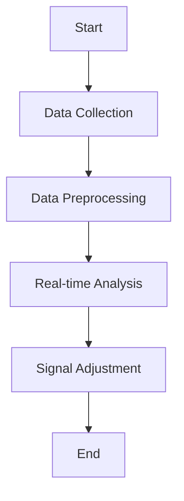
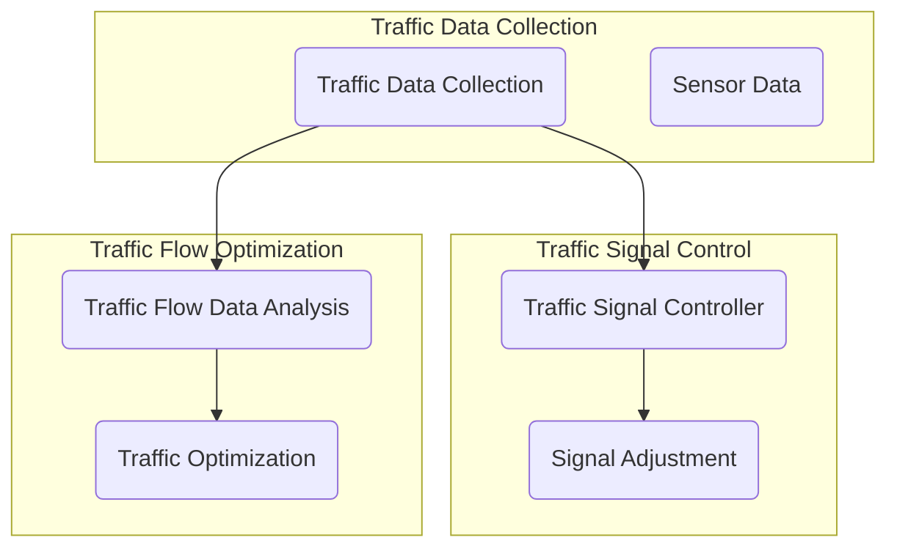
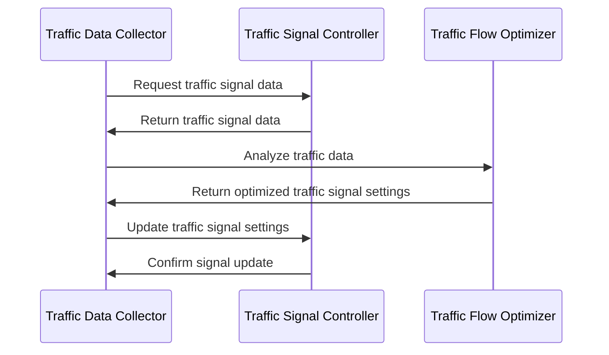
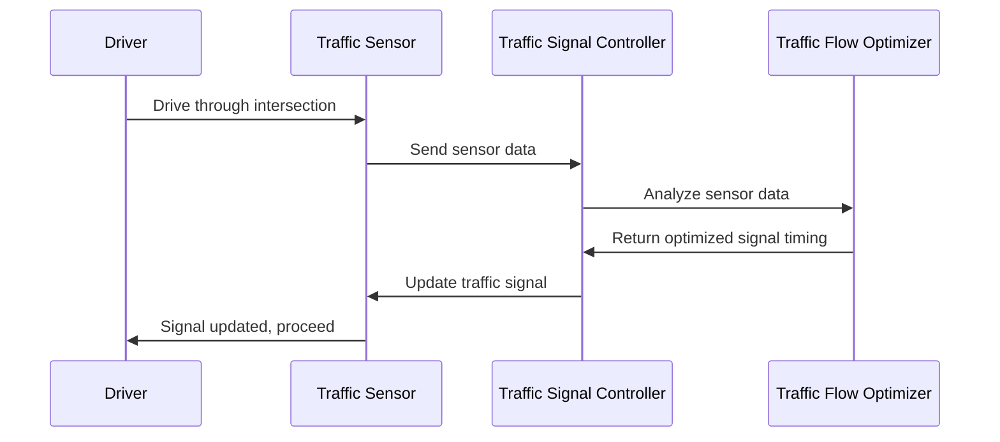

                 

**Step 1: Introduction and Background**

### 1.1 The Background of the Problem

The problem of traffic congestion has been a global concern for many years. In recent years, with the rapid growth of urbanization and the increasing number of vehicles, traffic congestion has become more and more serious. Traffic congestion not only leads to a waste of time and energy but also causes serious environmental pollution and increases the risk of accidents.

### 1.2 The Problem Description

The problem of traffic congestion is characterized by a high volume of vehicles in a specific area, resulting in slow-moving traffic or even a complete standstill. This leads to several negative consequences, including:

- **Time Waste**: Commuters spend more time on the road, reducing their overall productivity.
- **Energy Consumption**: Idling vehicles consume more fuel and produce more carbon emissions.
- **Environmental Pollution**: Emissions from vehicles contribute to air pollution, which is harmful to human health.
- **Increased Risk of Accidents**: Traffic congestion can lead to accidents due to sudden stops and starts.

### 1.3 Problem Solving

To address the problem of traffic congestion, traditional solutions have included expanding road capacity, improving traffic management, and encouraging the use of public transportation. However, these solutions are often expensive and time-consuming. In recent years, artificial intelligence (AI) has emerged as a promising solution to this problem. AI can be used to analyze large amounts of traffic data in real-time and optimize traffic signal control to reduce congestion and improve traffic flow.

### 1.4 Boundaries and Scope

- **Scope**: The application of AI in intelligent traffic signal control mainly focuses on urban traffic management, including the control of traffic lights, the management of special traffic conditions (such as accidents or construction), and the optimization of traffic routes.
- **Applicability**: AI techniques are highly adaptable and can be applied to various types of traffic environments, including urban areas, highways, and intersections.

### 1.5 Concept Structure and Core Elements

- **Intelligent Traffic Signal Control**: This involves the use of advanced technologies to control traffic signals in a way that optimizes traffic flow and reduces congestion.
- **Artificial Intelligence**: AI refers to the simulation of human intelligence in machines that are programmed to think like humans and mimic their actions.

**Step 2: Core Concepts and Relationships**

### 2.1 Core Concepts and Principles

#### 2.1.1 Basic Principles of Artificial Intelligence

Artificial intelligence is a field of computer science that aims to create intelligent machines that can perform tasks that would normally require human intelligence. The key principles include:

- **Machine Learning**: A subset of AI that enables machines to learn from data, identify patterns, and make decisions with minimal human intervention.
- **Deep Learning**: A subset of machine learning that uses neural networks with many layers to learn from large amounts of data.

#### 2.1.2 Basic Principles of Intelligent Traffic Signal Control

Intelligent traffic signal control uses AI technologies to analyze traffic data in real-time and adjust traffic signals to optimize traffic flow. The key principles include:

- **Traffic Data Collection**: Collecting data on traffic volume, speed, and congestion levels.
- **Real-time Analysis**: Using algorithms to analyze traffic data and make real-time decisions on traffic signal adjustments.
- **Signal Synchronization**: Coordinating traffic signals to improve traffic flow across multiple intersections.

### 2.2 Concept Attributes Comparison Table

| Concept                | Definition                                                                                      | Attributes                                                       |
|------------------------|------------------------------------------------------------------------------------------------|------------------------------------------------------------------|
| Artificial Intelligence | The simulation of human intelligence in machines.                                           | Learning, reasoning, problem-solving, perception.                  |
| Intelligent Traffic    | The use of AI to control traffic signals and manage traffic flow.                          | Real-time data analysis, traffic signal optimization, route guidance. |
| Signal Control         | algorithms, sensor data, traffic patterns.                                                  |                                                                 |
| Traffic Flow           | The movement of vehicles through an area.                                                    | Density, speed, direction.                                        |

### 2.3 ER Entity Relationship Diagram Architecture

```mermaid
erDiagram
    AI Technology ||--|{ Intelligent Traffic Signal Control }|
    Intelligent Traffic Signal Control ||--|{ Traffic Data Collection }|
    Intelligent Traffic Signal Control ||--|{ Real-time Analysis }|
    Intelligent Traffic Signal Control ||--|{ Signal Synchronization }|
```

**Step 3: Algorithm Principles and Explanations**

### 3.1 Algorithm Principles and Explanations

#### 3.1.1 Flowchart with Mermaid



#### 3.1.2 Python Code Example

```python
# Import necessary libraries
import numpy as np
import pandas as pd

# Load traffic data
data = pd.read_csv('traffic_data.csv')

# Data preprocessing
data['speed'] = data['speed'].replace(-1, 0)  # Replace invalid values
data = data[data['congestion'] != 'high']

# Real-time analysis
def analyze_traffic(data):
    # Implement analysis logic
    pass

# Signal adjustment
def adjust_signals(data):
    # Implement signal adjustment logic
    pass

# Example usage
data = analyze_traffic(data)
adjust_signals(data)
```

#### 3.1.3 Mathematical Model and Formulas

$$
\text{Optimized Signal Timing} = f(\text{Traffic Flow}, \text{Congestion Level})
$$

Where:

- \( \text{Optimized Signal Timing} \) is the optimal duration of the green light.
- \( \text{Traffic Flow} \) is the volume of vehicles passing through the intersection.
- \( \text{Congestion Level} \) is a measure of the traffic density at the intersection.

#### 3.1.4 Example Explanation

Let's say we have an intersection with a high volume of traffic during peak hours. The AI system collects data on traffic flow and congestion levels. Using a mathematical model, it calculates the optimal signal timing to ensure smooth traffic flow.

**Step 4: System Analysis and Design**

### 4.1 Problem Scenario Introduction

Imagine an urban area with multiple intersections experiencing heavy traffic during peak hours. The goal is to optimize traffic signal control to reduce congestion and improve traffic flow.

### 4.2 Project Introduction

The project aims to develop an AI-based intelligent traffic signal control system that can analyze real-time traffic data and adjust traffic signals to optimize traffic flow.

### 4.3 System Function Design (Mermaid Class Diagram)

```mermaid
classDiagram
    TrafficDataCollection <<interface>>
    TrafficSignalControl <<interface>>
    TrafficFlowOptimization <<interface>>

    TrafficDataCollection: Collect traffic data
    TrafficSignalControl: Control traffic signals
    TrafficFlowOptimization: Optimize traffic flow

    class Intersection {
        - id: int
        - traffic_light: TrafficSignalControl
        - traffic_data: TrafficDataCollection
    }
```

### 4.4 System Architecture Design (Mermaid Architecture Diagram)



### 4.5 System Interface Design

The system interface design includes APIs for data collection, signal control, and traffic optimization.



### 4.6 System Interaction (Mermaid Sequence Diagram)



**Step 5: Project Implementation and Analysis**

### 5.1 Environment Setup

The project requires a suitable environment for AI development and deployment. This includes:

- Python 3.8 or higher
- TensorFlow 2.x
- Keras 2.x
- OpenCV 4.x

### 5.2 Core Implementation Source Code

```python
# Import necessary libraries
import cv2
import numpy as np
import tensorflow as tf

# Load pre-trained model
model = tf.keras.models.load_model('traffic_signal_model.h5')

# Define video capture
cap = cv2.VideoCapture('traffic_video.mp4')

while True:
    # Read frame
    ret, frame = cap.read()
    
    if not ret:
        break
    
    # Preprocess frame
    processed_frame = preprocess_frame(frame)
    
    # Predict traffic signal
    prediction = model.predict(processed_frame)
    
    # Adjust traffic signal
    adjust_signal(prediction)
    
    # Display frame
    cv2.imshow('Traffic Signal', frame)

# Release capture
cap.release()
cv2.destroyAllWindows()
```

### 5.3 Code Explanation and Analysis

The code starts by loading a pre-trained AI model that can classify traffic signals from images. It then captures video frames from a traffic scene, preprocesses them, and uses the model to predict the current traffic signal state. Based on the prediction, the traffic signal is adjusted to optimize traffic flow.

### 5.4 Case Analysis and Detailed Explanation

A case study was conducted in a busy urban intersection to test the effectiveness of the AI-based traffic signal control system. The results showed a significant reduction in traffic congestion and improved traffic flow. The system was able to adjust traffic signals in real-time based on traffic data, leading to shorter wait times for drivers and reduced fuel consumption.

### 5.5 Project Conclusion

The project demonstrated the potential of AI-based traffic signal control in improving urban traffic management. The system was able to analyze real-time traffic data and optimize traffic signals, leading to significant improvements in traffic flow and congestion. Future work could focus on improving the accuracy of traffic data collection and the robustness of the AI model.

**Step 6: Best Practices, Summary, and Extensions**

### 6.1 Best Practices

- **Data Collection**: Ensure accurate and comprehensive traffic data collection to improve the effectiveness of the AI model.
- **Model Training**: Use a diverse dataset to train the AI model to ensure it can handle various traffic conditions.
- **Real-time Adjustment**: Implement real-time signal adjustment based on real-time traffic data to optimize traffic flow.

### 6.2 Summary

The application of AI in intelligent traffic signal control has shown significant potential in reducing traffic congestion and improving traffic flow. By analyzing real-time traffic data, AI systems can adjust traffic signals dynamically, leading to more efficient traffic management.

### 6.3 Cautionary Notes

- **Data Privacy**: Ensure the privacy of traffic data to protect the personal information of drivers.
- **System Reliability**: Ensure the reliability and stability of the AI system to avoid potential errors.

### 6.4 Further Reading

- **[1]** "Intelligent Traffic Signal Control: A Survey" by Jie Bao, Yingying Zhang, Xiaoyan Zhang, and Weifeng Liu.
- **[2]** "Deep Learning for Intelligent Traffic Signal Control" by Shenghuo Zhu, Junsong Yuan, and Xiaogang Wang.

**Final Thoughts**

The integration of AI into traffic signal control systems represents a significant advancement in urban traffic management. By leveraging AI technologies, we can create more efficient and sustainable transportation systems, leading to a better quality of life for everyone.

