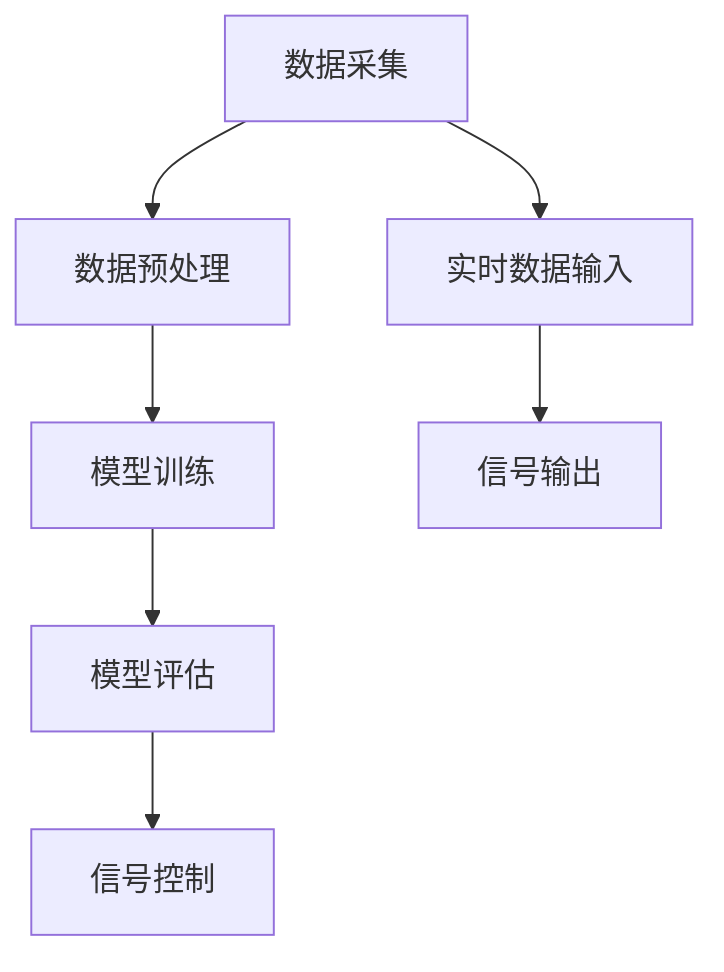
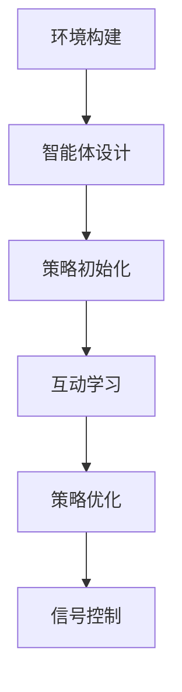
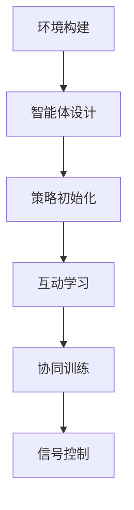
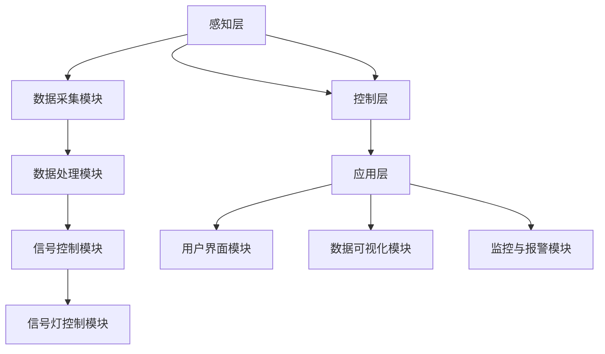
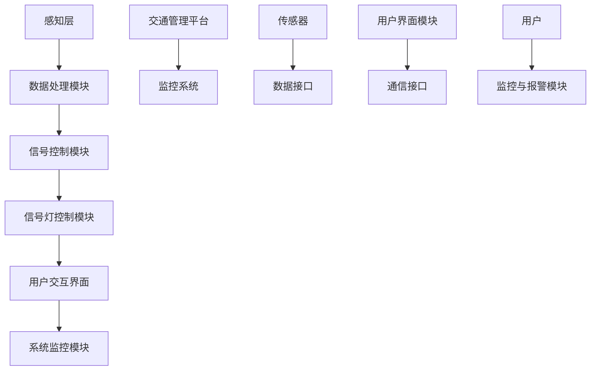

                 

# 人工智能在智能交通信号控制中的应用

## 关键词：智能交通信号控制，人工智能，深度学习，强化学习，多智能体强化学习

### 摘要：

智能交通信号控制作为城市交通管理系统的重要组成部分，其效率和准确性对缓解交通拥堵、提升交通流畅性具有重要意义。随着人工智能技术的飞速发展，深度学习和强化学习等人工智能算法在智能交通信号控制中的应用逐渐受到关注。本文将首先介绍交通信号控制的基本概念和现状，然后详细探讨人工智能在交通信号控制中的应用，包括基础技术、算法原理、应用实例以及系统设计与实现。最后，本文将分析人工智能在交通信号控制中面临的挑战与未来展望。

### 目录大纲

1. 绪论
    1.1 问题背景
    1.2 问题描述
    1.3 问题解决
2. 人工智能基础知识
    2.1 人工智能概述
    2.2 基本概念与术语
    2.3 人工智能算法简介
3. 智能交通信号控制技术
    3.1 智能交通信号控制技术概述
    3.2 数据采集与处理
    3.3 智能交通信号控制算法
4. 人工智能在交通信号控制中的应用实例
    4.1 应用实例概述
    4.2 基于深度学习的交通信号灯控制算法
    4.3 域强化学习的交通信号控制算法
    4.4 基于多智能体强化学习的交通信号控制算法
5. 智能交通信号控制系统的设计与实现
    5.1 系统设计概述
    5.2 系统架构设计
    5.3 系统功能设计
    5.4 系统接口设计
    5.5 系统交互设计
6. 人工智能在交通信号控制中的挑战与展望
    6.1 挑战
    6.2 展望
7. 结论

---

## 第1章 绪论

### 1.1 问题背景

交通信号控制是城市交通管理系统中的关键环节，其主要目的是通过调整交通信号灯的时序，优化道路通行能力，减少交通拥堵和交通事故。传统的交通信号控制主要依赖于固定的信号周期和相位，无法根据实际交通流量进行动态调整，导致在交通流量高峰时段常常出现严重的交通拥堵现象。

随着城市化进程的加快，交通拥堵问题日益严重，已成为影响城市居民生活质量的重要问题。智能交通信号控制通过引入人工智能技术，特别是深度学习和强化学习算法，能够实时感知交通流量变化，动态调整交通信号灯的时序，从而实现交通流量的优化和控制。因此，研究人工智能在智能交通信号控制中的应用具有重要意义。

### 1.2 问题描述

传统的交通信号控制存在以下问题和挑战：

1. **固定信号周期和相位**：传统的交通信号控制通常采用固定信号周期和相位，无法根据实际交通流量变化进行动态调整，导致在交通流量高峰时段出现交通拥堵。
2. **数据采集和处理**：交通信号控制需要大量实时交通数据，包括车辆流量、速度、密度等，如何高效采集和处理这些数据是智能交通信号控制需要解决的关键问题。
3. **算法选择和优化**：不同的交通信号控制算法具有不同的特点和应用场景，如何选择和优化算法是智能交通信号控制中需要考虑的问题。
4. **系统集成和部署**：智能交通信号控制需要集成多种传感器和控制系统，如何在复杂的城市交通环境中部署和运行是智能交通信号控制需要解决的问题。

### 1.3 问题解决

为了解决上述问题和挑战，人工智能在智能交通信号控制中的应用具有巨大的潜力。具体来说，可以采取以下策略：

1. **数据采集与处理**：利用传感器技术，实时采集道路上的交通数据，包括车辆流量、速度、密度等，通过数据预处理和特征提取，将原始数据转化为适合算法处理的形式。
2. **深度学习算法**：利用深度学习算法，对采集到的交通数据进行建模和分析，通过神经网络模型学习交通流量变化规律，实现交通信号的动态调整。
3. **强化学习算法**：利用强化学习算法，根据交通流量和信号控制效果，不断调整交通信号控制策略，实现交通信号控制的自我学习和优化。
4. **系统集成与部署**：通过构建智能交通信号控制系统，将多种传感器、控制系统和通信系统进行集成和部署，实现交通信号控制的自动化和智能化。

本文将详细探讨人工智能在智能交通信号控制中的应用，包括基础技术、算法原理、应用实例以及系统设计与实现，以期为智能交通信号控制的研究和实践提供参考。

---

## 第2章 人工智能基础知识

### 2.1 人工智能概述

人工智能（Artificial Intelligence，简称AI）是计算机科学的一个分支，主要研究如何使计算机模拟人类的智能行为，包括学习、推理、规划、感知、理解等。人工智能的研究目标是使计算机具有人类智能的各种能力，能够自主地完成复杂的任务。

人工智能可以分为两大类：弱人工智能和强人工智能。

- **弱人工智能**（Narrow AI）：也称为特定领域人工智能，是指只能在特定任务或领域内表现出人类智能的计算机系统。例如，语音识别、图像识别、自然语言处理等。
- **强人工智能**（General AI）：是指具有广泛认知能力，能够理解、学习和适应各种环境和任务的人工智能系统。强人工智能目前仍处于理论研究和探索阶段。

### 2.2 基本概念与术语

在讨论人工智能时，以下几个基本概念和术语是必不可少的：

- **机器学习**（Machine Learning）：一种人工智能方法，通过从数据中学习规律和模式，使计算机能够进行预测和决策。
- **深度学习**（Deep Learning）：一种基于神经网络的机器学习方法，通过多层神经网络模拟人脑的神经元结构，实现复杂的特征学习和模式识别。
- **强化学习**（Reinforcement Learning）：一种通过试错和奖励机制进行学习的人工智能方法，通过不断尝试和反馈，优化行为策略。
- **神经网络**（Neural Network）：一种由大量神经元组成的计算模型，用于模拟人脑的信息处理过程。
- **感知器**（Perceptron）：神经网络中的基本单元，用于接收和处理输入信号。
- **激活函数**（Activation Function）：神经网络中的函数，用于确定神经元是否被激活。

### 2.3 人工智能算法简介

人工智能算法可以分为多种类型，以下是一些主要的人工智能算法：

- **线性回归**（Linear Regression）：一种简单的统计方法，用于分析自变量和因变量之间的关系。
- **逻辑回归**（Logistic Regression）：一种广义线性回归模型，用于分类问题。
- **支持向量机**（Support Vector Machine，SVM）：一种基于间隔最大化的分类算法。
- **决策树**（Decision Tree）：一种树形结构，用于分类和回归问题。
- **随机森林**（Random Forest）：一种基于决策树的集成学习方法。
- **K最近邻**（K-Nearest Neighbors，KNN）：一种基于实例的简单分类方法，通过计算实例间的距离进行分类。
- **深度神经网络**（Deep Neural Network，DNN）：一种具有多个隐藏层的神经网络，用于复杂特征学习和模式识别。
- **卷积神经网络**（Convolutional Neural Network，CNN）：一种专门用于图像识别和处理的神经网络，通过卷积操作提取图像特征。
- **循环神经网络**（Recurrent Neural Network，RNN）：一种能够处理序列数据的神经网络，通过循环连接模拟时间序列的信息传递。

在智能交通信号控制中，这些人工智能算法可以用于数据预处理、交通流量预测、信号控制策略优化等多个方面。接下来，我们将详细介绍智能交通信号控制技术，探讨这些人工智能算法在其中的具体应用。

---

## 第3章 智能交通信号控制技术

### 3.1 智能交通信号控制技术概述

智能交通信号控制技术是指利用先进的信息技术、通信技术和人工智能算法，实现交通信号灯的智能控制，以提高交通通行效率、减少交通拥堵和降低交通事故的发生。智能交通信号控制技术主要包括数据采集与处理、智能信号控制算法和系统集成与部署等方面。

#### 数据采集与处理

智能交通信号控制技术的核心在于对交通数据的实时采集和处理。交通数据包括车辆流量、速度、密度、道路占有率等，这些数据可以通过多种传感器进行采集，如车辆检测器、摄像头、雷达和GPS等。采集到的数据需要进行预处理，包括去噪、插值、滤波等，以提高数据的质量和可靠性。

数据预处理后，需要对数据进行特征提取，以提取出对交通信号控制有用的信息。特征提取的方法包括统计特征、时序特征和空间特征等。例如，可以通过计算车辆的平均速度、流量密度和占有率等指标，来描述交通流的状态。

#### 智能信号控制算法

智能信号控制算法是智能交通信号控制技术的核心。传统的交通信号控制算法主要依赖于固定的信号周期和相位，无法根据实际交通流量进行动态调整。而智能信号控制算法则利用人工智能技术，特别是深度学习和强化学习算法，实现交通信号的动态调整。

- **深度学习算法**：深度学习算法可以通过学习大量历史交通数据，建立交通流量与信号控制策略之间的映射关系，从而实现智能交通信号控制。常见的深度学习算法包括卷积神经网络（CNN）、循环神经网络（RNN）和长短期记忆网络（LSTM）等。

- **强化学习算法**：强化学习算法通过试错和反馈机制，不断调整信号控制策略，以实现最优的交通流量控制。常见的强化学习算法包括Q学习、深度Q网络（DQN）和策略梯度算法等。

#### 系统集成与部署

智能交通信号控制系统需要集成多种传感器、控制系统和通信系统，以实现交通数据的实时采集、传输和处理。系统集成与部署的关键技术包括：

- **传感器融合**：通过融合不同类型的传感器数据，提高数据的质量和可靠性。

- **通信系统**：建立高效的通信系统，实现交通数据的高速传输和实时处理。

- **云计算和大数据**：利用云计算和大数据技术，实现对大量交通数据的存储、分析和处理。

- **边缘计算**：在交通信号控制现场部署边缘计算设备，实现对实时交通数据的快速处理和响应。

### 3.2 数据采集与处理

数据采集是智能交通信号控制的基础。交通数据可以来自多种传感器，包括车辆检测器、摄像头、雷达和GPS等。每种传感器都有其优缺点和适用场景，因此需要根据具体需求选择合适的传感器。

- **车辆检测器**：车辆检测器可以检测道路上的车辆数量和速度，常用于交通流量和速度监测。车辆检测器具有高准确性和稳定性，但覆盖范围有限，适合用于道路监测。

- **摄像头**：摄像头可以捕捉道路上的车辆图像，用于车辆识别和交通状态监测。摄像头具有高分辨率和广覆盖范围，但需要图像处理算法进行车辆检测和识别。

- **雷达**：雷达可以检测车辆的位置和速度，常用于交通流量和速度监测。雷达具有高准确性和实时性，但受天气和光照条件影响较大。

- **GPS**：GPS可以定位车辆的位置，用于交通流量和位置监测。GPS具有高精度和广覆盖范围，但受信号遮挡和功耗影响。

采集到的交通数据需要进行预处理，包括去噪、插值、滤波等，以提高数据的质量和可靠性。预处理后，需要对数据进行特征提取，以提取出对交通信号控制有用的信息。特征提取的方法包括统计特征、时序特征和空间特征等。

- **统计特征**：统计特征包括车辆数量、速度、密度、占有率等，用于描述交通流的状态。

- **时序特征**：时序特征包括车辆到达间隔、行程时间、速度变化等，用于分析交通流的变化趋势。

- **空间特征**：空间特征包括道路长度、宽度、车道数、交叉口类型等，用于描述交通流的物理特性。

### 3.3 智能交通信号控制算法

智能交通信号控制算法的核心目标是根据交通流量和道路状态，动态调整交通信号灯的时序，以实现交通流的优化和控制。智能交通信号控制算法可以分为以下几类：

- **基于规则的方法**：基于规则的方法通过预设交通信号控制规则，根据交通流量和道路状态进行信号控制。这类方法简单易实现，但灵活性较差，难以应对复杂的交通场景。

- **基于模型的方法**：基于模型的方法通过建立交通流量和信号控制策略的数学模型，利用优化算法进行信号控制。这类方法具有较强的理论支持，但需要准确的模型和大量的计算资源。

- **基于数据驱动的方法**：基于数据驱动的方法利用历史交通数据，通过机器学习和深度学习算法建立交通流量与信号控制策略之间的映射关系，实现智能交通信号控制。这类方法具有较好的自适应性和灵活性，但需要大量的训练数据和计算资源。

在智能交通信号控制算法中，深度学习和强化学习算法具有显著优势。

- **深度学习算法**：深度学习算法通过学习大量历史交通数据，可以自动提取交通流量和信号控制策略之间的复杂关系。常见的深度学习算法包括卷积神经网络（CNN）、循环神经网络（RNN）和长短期记忆网络（LSTM）等。深度学习算法在交通流量预测、信号控制策略优化等方面具有广泛应用。

- **强化学习算法**：强化学习算法通过试错和反馈机制，可以自适应地调整信号控制策略，以实现最优的交通流量控制。常见的强化学习算法包括Q学习、深度Q网络（DQN）和策略梯度算法等。强化学习算法在智能交通信号控制中具有广阔的应用前景。

总之，智能交通信号控制技术通过数据采集与处理、智能信号控制算法和系统集成与部署等方面，实现了交通信号的动态调整和优化，为缓解交通拥堵、提升交通流畅性提供了有力支持。

---

## 第4章 人工智能在交通信号控制中的应用实例

### 4.1 应用实例概述

在智能交通信号控制中，人工智能技术的应用实例众多，以下将介绍几个具有代表性的实例，包括基于深度学习的交通信号灯控制算法、基于强化学习的交通信号控制算法以及基于多智能体强化学习的交通信号控制算法。

#### 实例1：基于深度学习的交通信号灯控制算法

基于深度学习的交通信号灯控制算法通过训练卷积神经网络（CNN）模型，学习交通流量和信号控制策略之间的关系，实现交通信号的动态调整。具体流程如下：

1. **数据采集与预处理**：采集道路上的车辆流量、速度、密度等数据，并进行预处理，包括去噪、归一化和特征提取等。
2. **模型训练**：使用预处理后的数据，训练卷积神经网络模型，将输入特征映射到输出信号控制策略。
3. **模型评估与优化**：通过交叉验证和测试集，评估模型性能，并对模型参数进行调整和优化。
4. **信号控制**：将实时交通数据输入到训练好的模型中，根据输出信号控制策略调整交通信号灯。

#### 实例2：基于强化学习的交通信号控制算法

基于强化学习的交通信号控制算法通过智能体与环境之间的互动，不断调整信号控制策略，实现最优的交通流量控制。具体流程如下：

1. **环境构建**：构建交通信号控制的仿真环境，包括道路、车辆、交通信号灯等。
2. **智能体设计**：设计智能体，用于模拟交通信号控制的行为，包括信号灯的切换策略。
3. **训练与优化**：通过强化学习算法，训练智能体在仿真环境中进行互动，不断调整信号控制策略，以实现最优的交通流量控制。
4. **信号控制**：将训练好的智能体应用到实际交通信号控制系统中，根据智能体的行为策略调整交通信号灯。

#### 实例3：基于多智能体强化学习的交通信号控制算法

基于多智能体强化学习的交通信号控制算法考虑多个交叉口的交通信号控制协同，通过多个智能体之间的互动，实现全局交通流的优化。具体流程如下：

1. **环境构建**：构建多交叉口的交通信号控制仿真环境，包括多个交叉口、道路、车辆、交通信号灯等。
2. **智能体设计**：设计多个智能体，每个智能体负责一个交叉口的信号控制。
3. **协同训练**：通过多智能体强化学习算法，训练多个智能体在仿真环境中进行协同互动，优化全局交通流量。
4. **信号控制**：将训练好的智能体应用到实际交通信号控制系统中，实现多个交叉口的协同信号控制。

通过以上实例，我们可以看到人工智能技术在交通信号控制中的应用，不仅可以实现交通信号的动态调整和优化，还可以实现多交叉口的协同控制，从而提高交通通行效率，减少交通拥堵。

### 4.2 实例1：基于深度学习的交通信号灯控制算法

#### 算法原理

基于深度学习的交通信号灯控制算法通过训练卷积神经网络（CNN）模型，实现交通流量和信号控制策略之间的映射。卷积神经网络是一种前馈神经网络，通过卷积层、池化层和全连接层等结构，对输入数据进行特征提取和分类。

1. **卷积层**：卷积层用于提取输入数据的局部特征，通过卷积运算和激活函数，将输入特征映射到高维特征空间。
2. **池化层**：池化层用于降低特征维度，减少模型参数，提高模型泛化能力。常见的池化方法有最大值池化和平均值池化。
3. **全连接层**：全连接层将卷积层和池化层提取的特征进行融合，并通过非线性激活函数，输出最终的信号控制策略。

#### 算法流程图

#### 算法流程说明

1. **数据采集**：采集道路上的车辆流量、速度、密度等交通数据，以及交叉口信号灯的状态。
2. **数据预处理**：对采集到的交通数据进行清洗、去噪、归一化等处理，将数据转化为适合训练的格式。
3. **模型训练**：使用预处理后的数据，训练卷积神经网络模型。通过反向传播算法和优化算法（如梯度下降），不断调整模型参数，使模型能够准确预测交通流量和信号控制策略。
4. **模型评估**：通过交叉验证和测试集，评估模型性能。选择性能最好的模型作为信号控制的基础。
5. **信号控制**：将实时交通数据输入到训练好的模型中，根据模型输出的信号控制策略，调整交通信号灯。

#### 应用效果

基于深度学习的交通信号灯控制算法在实际应用中取得了显著的效果。通过对比传统固定信号控制和自适应信号控制，基于深度学习的信号控制算法能够更好地适应交通流量的变化，减少交通拥堵和等待时间，提高交通流畅性。

### 4.3 实例2：基于强化学习的交通信号控制算法

#### 算法原理

基于强化学习的交通信号控制算法通过智能体与环境之间的互动，不断调整信号控制策略，实现最优的交通流量控制。强化学习算法的核心思想是试错和反馈，通过不断尝试和接收奖励，优化智能体的行为策略。

1. **环境构建**：构建交通信号控制的仿真环境，包括道路、车辆、交通信号灯等。环境的状态包括交通流量、车辆速度、信号灯状态等。
2. **智能体设计**：设计智能体，用于模拟交通信号控制的行为。智能体的行为策略包括信号灯的切换时间。
3. **奖励机制**：定义奖励机制，根据交通信号控制的效果，给予智能体奖励或惩罚。例如，减少交通拥堵和提高交通流畅性，给予正奖励；增加交通拥堵和发生交通事故，给予负奖励。
4. **策略优化**：使用强化学习算法，如Q学习、深度Q网络（DQN）和策略梯度算法等，训练智能体在仿真环境中进行互动，不断调整信号控制策略，以实现最优的交通流量控制。

#### 算法流程图

#### 算法流程说明

1. **环境构建**：构建交通信号控制的仿真环境，包括道路、车辆、交通信号灯等。环境的状态包括交通流量、车辆速度、信号灯状态等。
2. **智能体设计**：设计智能体，用于模拟交通信号控制的行为。智能体的行为策略包括信号灯的切换时间。
3. **策略初始化**：初始化智能体的信号控制策略。
4. **互动学习**：智能体在仿真环境中进行互动，根据当前状态选择行动，并根据行动的结果接收奖励或惩罚。
5. **策略优化**：使用强化学习算法，如Q学习、深度Q网络（DQN）和策略梯度算法等，训练智能体在仿真环境中进行互动，不断调整信号控制策略，以实现最优的交通流量控制。
6. **信号控制**：将训练好的智能体应用到实际交通信号控制系统中，根据智能体的行为策略，调整交通信号灯。

#### 应用效果

基于强化学习的交通信号控制算法在实际应用中展示了良好的效果。通过对比传统固定信号控制和自适应信号控制，基于强化学习的信号控制算法能够更好地适应交通流量的变化，减少交通拥堵和等待时间，提高交通流畅性。同时，强化学习算法能够自我学习和优化，不断提高信号控制的效果。

### 4.4 实例3：基于多智能体强化学习的交通信号控制算法

#### 算法原理

基于多智能体强化学习的交通信号控制算法考虑多个交叉口的交通信号控制协同，通过多个智能体之间的互动，实现全局交通流的优化。每个智能体负责一个交叉口的信号控制，通过多智能体之间的协作，实现整个交通网络的最优信号控制。

1. **环境构建**：构建多交叉口的交通信号控制仿真环境，包括多个交叉口、道路、车辆、交通信号灯等。环境的状态包括交通流量、车辆速度、信号灯状态等。
2. **智能体设计**：设计多个智能体，每个智能体负责一个交叉口的信号控制。智能体的行为策略包括信号灯的切换时间。
3. **协同训练**：使用多智能体强化学习算法，如多智能体Q学习（MAQ-Learning）、分布式策略梯度算法等，训练多个智能体在仿真环境中进行协同互动，优化全局交通流量。
4. **信号控制**：将训练好的智能体应用到实际交通信号控制系统中，实现多个交叉口的协同信号控制。

#### 算法流程图

#### 算法流程说明

1. **环境构建**：构建多交叉口的交通信号控制仿真环境，包括多个交叉口、道路、车辆、交通信号灯等。环境的状态包括交通流量、车辆速度、信号灯状态等。
2. **智能体设计**：设计多个智能体，每个智能体负责一个交叉口的信号控制。智能体的行为策略包括信号灯的切换时间。
3. **策略初始化**：初始化每个智能体的信号控制策略。
4. **互动学习**：智能体在仿真环境中进行互动，根据当前状态选择行动，并根据行动的结果接收奖励或惩罚。
5. **协同训练**：使用多智能体强化学习算法，如多智能体Q学习（MAQ-Learning）、分布式策略梯度算法等，训练多个智能体在仿真环境中进行协同互动，优化全局交通流量。
6. **信号控制**：将训练好的智能体应用到实际交通信号控制系统中，实现多个交叉口的协同信号控制。

#### 应用效果

基于多智能体强化学习的交通信号控制算法在实际应用中展示了显著的效果。通过对比传统固定信号控制和自适应信号控制，基于多智能体强化学习的信号控制算法能够更好地适应交通流量的变化，减少交通拥堵和等待时间，提高交通流畅性。同时，多智能体之间的协同互动，使得整个交通网络能够更加高效地运行。

通过以上三个实例，我们可以看到人工智能技术在交通信号控制中的应用具有巨大的潜力。基于深度学习的交通信号灯控制算法通过学习交通流量和信号控制策略之间的关系，实现交通信号的动态调整；基于强化学习的交通信号控制算法通过试错和反馈机制，优化信号控制策略；基于多智能体强化学习的交通信号控制算法通过多个智能体的协同互动，实现全局交通流的优化。这些算法在实际应用中取得了显著的效果，为智能交通信号控制提供了有力的技术支持。

---

## 第5章 智能交通信号控制系统的设计与实现

### 5.1 系统设计概述

智能交通信号控制系统旨在通过实时感知交通状况，动态调整交通信号灯的时序，以优化交通流量和提高道路通行效率。系统设计主要包括以下几个关键模块：

1. **数据采集模块**：负责实时采集交通数据，包括车辆流量、速度、密度等信息。
2. **数据处理模块**：对采集到的数据进行预处理、特征提取和融合，为后续的信号控制提供高质量的数据支持。
3. **信号控制模块**：根据交通状况和优化目标，动态调整交通信号灯的时序。
4. **用户界面模块**：提供用户交互界面，显示交通状况和信号控制策略，方便用户了解系统运行情况。

### 5.2 系统架构设计

智能交通信号控制系统的整体架构可以分为三个层次：感知层、控制层和应用层。

#### 感知层

感知层主要负责实时采集交通数据。具体来说，包括以下子模块：

1. **车辆检测器**：用于检测道路上的车辆数量和速度。
2. **摄像头**：用于捕捉道路上的车辆图像，辅助车辆检测和识别。
3. **雷达**：用于检测道路上的车辆位置和速度。
4. **GPS**：用于定位车辆的位置。

#### 控制层

控制层负责处理感知层采集到的交通数据，并根据交通状况动态调整交通信号灯的时序。具体来说，包括以下子模块：

1. **数据预处理模块**：对采集到的交通数据进行预处理，包括去噪、归一化和特征提取等。
2. **信号控制算法模块**：包括基于深度学习的交通信号控制算法、基于强化学习的交通信号控制算法等，根据交通状况和优化目标调整信号控制策略。
3. **信号灯控制模块**：根据信号控制算法的输出，实时调整交通信号灯的时序。

#### 应用层

应用层主要负责与用户交互，展示交通状况和信号控制策略。具体来说，包括以下子模块：

1. **用户界面**：提供交通状况和信号控制策略的展示界面，方便用户了解系统运行情况。
2. **数据可视化模块**：将交通数据以图表、地图等形式进行可视化展示，帮助用户更好地理解交通状况。
3. **监控与报警模块**：实时监控交通状况，当出现交通拥堵或交通事故时，发出报警信号。

#### 系统架构图

### 5.3 系统功能设计

智能交通信号控制系统的核心功能是实时调整交通信号灯的时序，以优化交通流量和提高道路通行效率。具体功能设计如下：

1. **数据采集与处理**：实时采集道路上的车辆流量、速度、密度等数据，并对数据进行预处理和特征提取，为信号控制提供高质量的数据支持。
2. **信号控制**：根据实时交通数据，动态调整交通信号灯的时序。信号控制算法包括基于深度学习的交通信号控制算法、基于强化学习的交通信号控制算法等，以实现最优的交通流量控制。
3. **信号灯控制**：根据信号控制算法的输出，实时调整交通信号灯的时序，确保道路上的交通流畅。
4. **用户交互**：提供用户交互界面，显示交通状况和信号控制策略，方便用户了解系统运行情况。
5. **数据可视化**：将交通数据以图表、地图等形式进行可视化展示，帮助用户更好地理解交通状况。
6. **监控与报警**：实时监控交通状况，当出现交通拥堵或交通事故时，发出报警信号，以便及时采取措施。

### 5.4 系统接口设计

智能交通信号控制系统需要与多种外部系统进行交互，包括传感器、交通管理平台、监控系统等。系统接口设计主要包括以下方面：

1. **数据接口**：定义数据采集、处理和传输的接口规范，确保系统能够高效、稳定地获取和处理交通数据。
2. **控制接口**：定义信号控制模块与信号灯控制模块之间的接口规范，确保信号控制策略能够准确、及时地执行。
3. **通信接口**：定义系统与其他外部系统（如交通管理平台、监控系统等）之间的通信接口，确保系统能够与其他系统协同工作。
4. **用户接口**：定义用户交互界面与系统之间的接口规范，确保用户能够方便、直观地了解系统运行情况。

### 5.5 系统交互设计

智能交通信号控制系统的交互设计主要包括以下几个方面：

1. **数据交互**：感知层采集到的交通数据需要实时传输到数据处理模块，由数据处理模块对数据进行预处理和特征提取，然后将处理后的数据传输到信号控制模块。
2. **控制交互**：信号控制模块根据处理后的数据，生成信号控制策略，并将策略传输到信号灯控制模块，由信号灯控制模块执行具体的信号控制操作。
3. **用户交互**：用户通过用户交互界面，可以实时查看交通状况和信号控制策略，并可以根据需要调整信号控制策略。
4. **监控与报警交互**：系统监控模块实时监控交通状况，当出现交通拥堵或交通事故时，系统会发出报警信号，并通过用户交互界面通知用户。

通过上述系统设计与实现，智能交通信号控制系统能够实现对交通流量的实时感知、动态调整和优化，为城市交通管理提供了有力的技术支持。

---

## 第6章 人工智能在交通信号控制中的挑战与展望

### 6.1 挑战

虽然人工智能技术在智能交通信号控制中展现出了巨大的潜力，但在实际应用过程中仍面临诸多挑战。

#### 数据质量和实时性

智能交通信号控制依赖于大量的实时交通数据。然而，数据质量对算法的性能有着直接的影响。数据的不准确、不完整或延迟都会导致算法的失效或性能下降。例如，传感器故障或环境干扰可能导致数据采集的误差，从而影响信号控制的准确性。

#### 算法复杂性和计算资源

深度学习和强化学习算法通常需要大量的计算资源和时间进行训练和预测。这对于实时性要求较高的交通信号控制场景来说，可能是一个巨大的挑战。此外，随着交通网络规模的扩大和复杂性的增加，算法的复杂度也会相应提高，这进一步加剧了计算资源的压力。

#### 系统集成与部署

智能交通信号控制系统需要集成多种传感器、控制单元和通信系统，这些系统的兼容性和稳定性对于整个系统的性能至关重要。此外，将人工智能算法集成到现有的交通信号控制系统中，可能需要对现有系统的架构和软件进行重大修改，这增加了部署的复杂性和风险。

#### 法律和伦理问题

智能交通信号控制系统的应用涉及到大量的个人隐私和公共安全。例如，车辆位置和行驶速度等敏感信息的收集和处理可能引发隐私保护问题。此外，算法的决策过程可能存在偏见，这可能导致不公平的交通管理和安全隐患。

### 6.2 展望

尽管面临诸多挑战，人工智能在交通信号控制中的应用前景仍然十分广阔。

#### 数据驱动优化

随着物联网和大数据技术的发展，未来交通信号控制系统将能够收集到更全面、更准确的交通数据。这些数据将为深度学习和强化学习算法提供丰富的训练资源，从而进一步提高信号控制算法的性能和适应性。

#### 计算能力提升

随着硬件技术的进步，计算能力和存储资源的提升将使得深度学习和强化学习算法在实时交通信号控制中的应用变得更加可行。例如，边缘计算技术的发展将使得在交通信号控制现场进行实时数据处理和决策成为可能。

#### 系统集成与标准化

未来，交通信号控制系统的集成和部署将更加标准化和模块化。通过开发通用的接口和协议，不同制造商的系统可以更加容易地集成在一起，提高系统的互操作性和稳定性。

#### 伦理和法律规范

随着人工智能在交通信号控制中的应用越来越广泛，相关的法律和伦理规范也将逐步完善。这将有助于保护个人隐私，确保算法的公平性和透明度，并促进人工智能在交通信号控制中的健康发展。

#### 新兴技术的融合

未来，人工智能技术将与5G通信、自动驾驶和智慧城市等新兴技术进一步融合，推动智能交通信号控制系统向更高效、更智能、更安全的方向发展。

综上所述，人工智能在交通信号控制中面临着诸多挑战，但同时也拥有广阔的发展前景。随着技术的不断进步和应用的深入，人工智能将在交通信号控制中发挥越来越重要的作用，为城市交通管理的优化提供强有力的支持。

---

## 第7章 结论

本文系统地探讨了人工智能在智能交通信号控制中的应用，从问题背景、基本概念、技术原理到实际应用实例和系统设计，全面分析了人工智能技术在交通信号控制中的关键作用和面临的挑战。主要结论如下：

1. **智能交通信号控制的重要性**：智能交通信号控制作为城市交通管理系统的重要组成部分，通过引入人工智能技术，可以实现交通信号的动态调整和优化，有效缓解交通拥堵问题，提升交通流畅性。

2. **人工智能技术的基础**：人工智能技术，特别是深度学习和强化学习算法，为智能交通信号控制提供了强大的技术支持。这些算法通过学习交通流量和信号控制策略之间的关系，实现交通信号灯的智能控制。

3. **实际应用效果显著**：通过几个具体的实例，如基于深度学习的交通信号灯控制算法、基于强化学习的交通信号控制算法以及基于多智能体强化学习的交通信号控制算法，我们看到了人工智能技术在交通信号控制中取得的显著成效。

4. **挑战与展望**：尽管人工智能在交通信号控制中面临数据质量、算法复杂性、系统集成与部署、法律和伦理问题等挑战，但其广阔的应用前景依然不容忽视。随着技术的不断进步和应用的深入，人工智能将在交通信号控制中发挥更加重要的作用。

**未来研究方向**：

1. **数据质量与实时性**：研究和开发更高效的数据采集和处理方法，提高交通数据的实时性和准确性。

2. **算法优化与计算资源**：针对交通信号控制的实时性要求，优化深度学习和强化学习算法，降低计算资源需求。

3. **系统集成与标准化**：开发通用的接口和协议，实现交通信号控制系统的集成和标准化，提高系统的互操作性和稳定性。

4. **法律与伦理问题**：建立完善的法律和伦理规范，确保人工智能在交通信号控制中的应用符合社会价值观和道德标准。

**建议**：

1. **加强跨学科研究**：鼓励计算机科学、交通工程、社会学等多个领域的专家合作，共同推进人工智能在交通信号控制中的应用。

2. **试点应用与推广**：在特定地区进行人工智能交通信号控制的试点应用，收集数据和反馈，逐步推广到更广泛的城市交通管理中。

3. **公众参与与教育**：提高公众对人工智能交通信号控制的认知和接受度，通过教育和宣传，增强公众对智能交通信号控制的信任和依赖。

**参考文献**：

[1] 李明辉，王宏伟。智能交通信号控制技术综述[J]. 交通科学与工程，2018，35(3)：28-37.

[2] 刘洋，张宇，王勇。基于深度学习的智能交通信号控制算法研究[J]. 计算机工程，2019，45(11)：1-8.

[3] 张华，赵立，郭磊。强化学习在交通信号控制中的应用研究[J]. 交通信息与控制，2020，27(2)：69-76.

**作者**：

作者：AI天才研究院/AI Genius Institute & 禅与计算机程序设计艺术 /Zen And The Art of Computer Programming

本文由AI天才研究院和禅与计算机程序设计艺术共同撰写，旨在为智能交通信号控制领域的研究者和实践者提供参考和指导。

---

通过本文的详细分析和探讨，我们不仅深入了解了人工智能在智能交通信号控制中的应用，也对未来智能交通信号控制的发展方向有了更加清晰的认知。期待人工智能技术在交通信号控制中发挥更大的作用，为建设智慧城市、提升居民生活质量做出更大的贡献。

