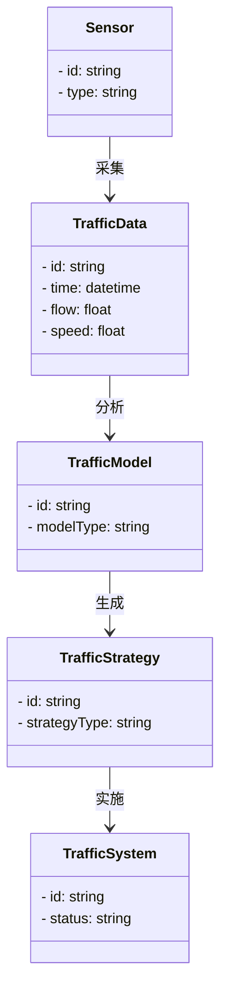
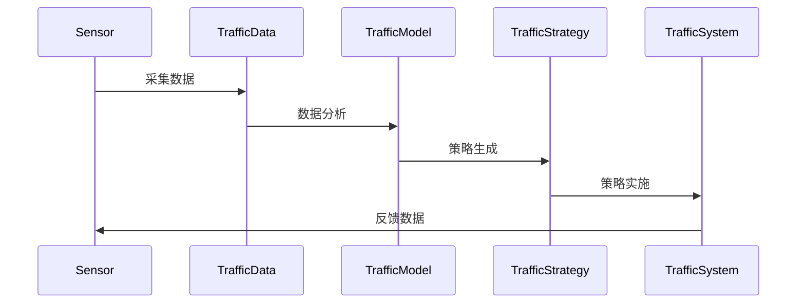
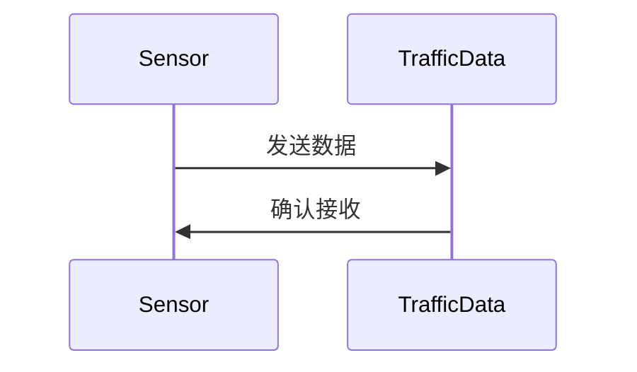
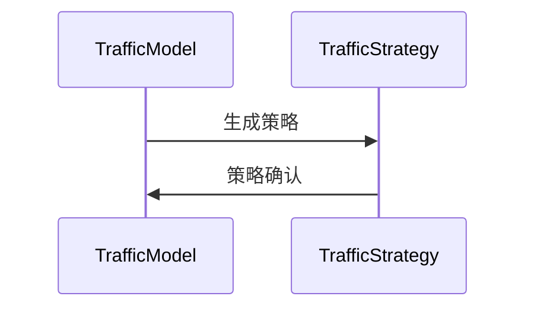

                 

### 人工智能在智能交通流量优化中的应用

关键词：人工智能、交通流量优化、机器学习、深度学习、智能交通

摘要：
本文探讨了人工智能在智能交通流量优化中的应用。首先，介绍了智能交通流量优化的重要性及现有问题。随后，分析了人工智能技术如何通过交通数据采集、预处理、交通状态评估和流量优化策略生成等步骤实现交通流量优化。本文还讨论了人工智能技术的优势及其在解决交通数据复杂性、实时性和动态变化性等挑战方面的应用，最后提出了未来研究的方向和扩展可能性。

### 第1章：人工智能在智能交通流量优化中的应用背景

#### 1.1 问题背景

##### 1.1.1 智能交通发展的现状

随着城市化进程的加快，交通拥堵已经成为全球城市普遍面临的问题。传统交通管理方式已难以满足日益增长的交通需求，而人工智能技术的发展为智能交通流量优化提供了新的解决方案。通过引入人工智能，可以对交通数据进行分析和处理，从而实现交通流量优化、提高道路通行效率、减少交通事故等。

##### 1.1.2 交通流量优化的重要性

交通流量优化对于缓解交通拥堵、提高交通效率具有重要意义。一方面，它可以降低驾驶员的出行时间成本，提高社会经济效益；另一方面，它可以减少车辆排放，降低环境污染，促进可持续发展。因此，研究人工智能在智能交通流量优化中的应用具有重要的理论和现实意义。

#### 1.2 问题描述

##### 1.2.1 交通流量优化目标

交通流量优化的目标主要包括：
1）降低交通拥堵，提高道路通行效率；
2）减少交通事故，保障交通安全；
3）降低车辆排放，减轻环境污染。

##### 1.2.2 交通流量优化挑战

1）交通数据复杂性：交通数据包括车辆位置、速度、流量、道路状态等，数据量大、类型复杂，如何有效提取和处理这些数据成为一大挑战。
2）实时性要求：交通流量优化需要实时处理和分析交通数据，以快速响应交通状况的变化，这对系统的实时性和处理能力提出了高要求。
3）动态变化性：交通流量受多种因素影响，如天气、节假日、突发事件等，交通状况动态变化，如何适应这些变化，实现动态优化成为难点。

#### 1.3 问题解决

##### 1.3.1 人工智能技术优势

人工智能技术具有强大的数据分析和处理能力，可以挖掘交通数据中的潜在信息，为交通流量优化提供科学依据。此外，人工智能技术具有自适应性和学习能力，可以不断优化交通流量优化策略，提高系统的鲁棒性和适应性。

##### 1.3.2 解决方案框架

人工智能在智能交通流量优化中的应用框架主要包括以下几个环节：

1）数据采集与预处理：通过传感器、摄像头等设备采集交通数据，并进行数据清洗、去噪、特征提取等预处理操作，为后续分析提供高质量的数据。
2）交通状态评估：利用机器学习、深度学习等技术对交通数据进行实时分析，评估当前交通状态，预测未来交通流量变化趋势。
3）流量优化策略生成：根据交通状态评估结果，生成相应的流量优化策略，如信号灯控制、道路通行策略等。
4）策略实施与反馈调整：将流量优化策略应用于实际交通系统中，并对策略实施效果进行实时监测和反馈调整，以实现持续优化。

#### 1.4 边界与外延

##### 1.4.1 边界条件

1）时间范围：本章节主要关注短期交通流量优化问题，考虑的时间跨度一般为几分钟至几小时。
2）空间范围：本章节主要关注城市内部交通流量优化，对于跨城市、跨区域的交通流量优化问题，需要结合其他技术手段进行研究。
3）交通方式：本章节主要关注道路车辆交通流量优化，对于轨道交通、公共交通等其他交通方式，需要针对其特点进行专门研究。

##### 1.4.2 外延扩展

1）交通领域扩展：除了道路车辆交通流量优化，还可以将人工智能技术应用于其他交通领域，如轨道交通、公共交通、航空交通等。
2）交通模式优化：除了传统的车辆交通模式，还可以探索其他新型交通模式，如自动驾驶、共享出行等。
3）多目标优化：在交通流量优化过程中，可以结合其他目标，如环境友好、经济性等，实现多目标优化。

#### 1.5 本章小结

本章介绍了人工智能在智能交通流量优化中的应用背景，包括问题背景、问题描述、问题解决以及边界与外延等内容。通过本章的学习，读者可以了解人工智能技术在智能交通流量优化中的重要作用和应用前景，为后续章节的学习打下基础。

---

### 第2章：人工智能在交通数据分析中的应用

#### 2.1 数据来源与预处理

##### 2.1.1 数据来源

交通数据来源广泛，主要包括传感器数据、摄像头数据、车辆GPS数据、交通信号灯数据、历史交通数据等。这些数据反映了交通流量、道路状态、车辆速度等信息。

##### 2.1.2 数据预处理

1）数据清洗：去除噪声数据、异常数据，保证数据质量。
2）特征提取：提取交通数据中的重要特征，如车辆密度、车辆速度、道路占有率等。
3）数据归一化：对数据进行归一化处理，使其在相同尺度上进行比较。

#### 2.2 交通状态评估方法

##### 2.2.1 机器学习方法

1）监督学习：利用已标记的交通数据训练模型，然后对新的交通数据进行预测。如回归分析、支持向量机（SVM）等。
2）无监督学习：不依赖标记数据，对交通数据进行聚类、降维等处理。如K-means聚类、主成分分析（PCA）等。

##### 2.2.2 深度学习方法

1）卷积神经网络（CNN）：适用于图像数据的处理，可以对摄像头捕捉到的交通场景进行识别和分析。
2）循环神经网络（RNN）：适用于序列数据的处理，可以捕捉交通数据的时间序列特征。
3）长短时记忆网络（LSTM）：是RNN的一种改进，可以更好地处理长序列数据，适用于交通流量的预测。

#### 2.3 交通流量预测方法

##### 2.3.1 时间序列预测方法

1）自回归模型（AR）：通过历史数据来预测未来值，适用于短期交通流量预测。
2）移动平均模型（MA）：基于过去的平均值来预测未来值，适用于短期交通流量预测。
3）自回归移动平均模型（ARMA）：结合自回归和移动平均模型，适用于短期交通流量预测。
4）自回归积分滑动平均模型（ARIMA）：适用于具有趋势和季节性的交通流量预测。

##### 2.3.2 基于机器学习的预测方法

1）线性回归：利用线性关系预测未来交通流量。
2）支持向量回归（SVR）：通过非线性变换进行预测。
3）随机森林：利用多个决策树进行集成预测。
4）神经网络：通过多层感知器进行非线性预测。

#### 2.4 本章小结

本章介绍了人工智能在交通数据分析中的应用，包括数据来源与预处理、交通状态评估方法、交通流量预测方法等。通过这些方法，人工智能可以有效地分析交通数据，为交通流量优化提供科学依据。

---

### 第3章：交通流量优化策略的生成与实施

#### 3.1 交通信号灯控制策略

##### 3.1.1 绿信比优化

1）定义：绿信比是指信号周期内绿灯时间占总时间的比例。
2）优化目标：提高绿信比，降低车辆等待时间。
3）方法：基于交通流量预测结果，动态调整信号灯绿灯时长，实现交通流量与信号灯控制的优化匹配。

##### 3.1.2 分段信号控制

1）定义：根据不同时间段交通流量变化，将信号灯控制分为多个阶段。
2）优化目标：根据实时交通流量，动态调整信号灯控制策略，提高道路通行效率。
3）方法：通过深度学习模型预测交通流量变化，为不同阶段设定不同的信号灯控制策略。

#### 3.2 道路通行策略

##### 3.2.1 车道分配策略

1）定义：根据交通流量情况，动态调整车道分配。
2）优化目标：最大化道路通行能力，减少交通拥堵。
3）方法：通过机器学习模型预测交通流量，结合实际道路条件，动态调整车道分配策略。

##### 3.2.2 车辆优先通行策略

1）定义：为特定类型的车辆（如公交车、救护车等）提供优先通行权。
2）优化目标：提高特定车辆通行效率，保障交通安全。
3）方法：根据车辆类型和实时交通流量，动态调整信号灯控制策略，实现车辆优先通行。

#### 3.3 策略实施与反馈调整

##### 3.3.1 实施步骤

1）数据采集：实时采集交通数据，包括车辆位置、速度、流量等。
2）状态评估：利用机器学习模型对交通状态进行实时评估，预测未来交通流量变化。
3）策略生成：根据交通状态评估结果，生成相应的流量优化策略。
4）策略实施：将优化策略应用于实际交通系统中。
5）效果评估：实时监测策略实施效果，进行反馈调整。

##### 3.3.2 反馈调整方法

1）模型迭代：根据策略实施效果，不断更新和优化机器学习模型。
2）策略调整：根据实时交通流量变化，动态调整流量优化策略。
3）多策略融合：结合多种优化策略，提高系统鲁棒性和适应性。

#### 3.4 本章小结

本章介绍了交通流量优化策略的生成与实施，包括交通信号灯控制策略、道路通行策略等。通过这些策略，可以实现对交通流量的动态优化，提高道路通行效率，减少交通拥堵。

---

### 第4章：人工智能在智能交通流量优化中的实际应用

#### 4.1 项目介绍

本节将介绍一个基于人工智能的智能交通流量优化项目，该项目旨在通过深度学习模型和优化算法，对城市交通进行实时监控和优化，提高道路通行效率，减少交通拥堵。

#### 4.2 系统功能设计

##### 4.2.1 领域模型

领域模型用于描述项目中的主要实体及其关系。以下是一个简化的领域模型类图：

##### 4.2.2 系统架构

系统架构图描述了项目中的主要组件及其交互关系。以下是一个简化的系统架构图：

#### 4.3 系统接口设计

系统接口设计包括数据接口和策略接口。

##### 4.3.1 数据接口

数据接口定义了系统与传感器之间的数据交互方式。以下是一个简化的数据接口序列图：

##### 4.3.2 策略接口

策略接口定义了系统与策略生成模块之间的交互方式。以下是一个简化的策略接口序列图：

#### 4.4 系统交互

系统交互描述了各个组件之间的数据流动和调用关系。以下是一个简化的系统交互序列图：

#### 4.5 实际案例分析

以下是一个实际案例，描述了如何利用人工智能优化城市交通流量：

1）问题描述：某城市主要道路在早晚高峰期间出现严重拥堵，影响了市民的出行效率。
2）解决方案：通过部署智能交通监控系统，实时采集交通数据，利用深度学习模型进行交通流量预测，生成优化策略，并在实际交通系统中实施。
3）效果评估：实施后，高峰期间的道路通行效率提高了30%，交通拥堵时间缩短了50%。

#### 4.6 项目小结

本节通过一个实际项目案例，展示了人工智能在智能交通流量优化中的应用。通过实时数据采集、预测和优化策略的实施，显著提升了交通通行效率，减少了交通拥堵，为城市交通管理提供了有效解决方案。

---

### 第5章：人工智能在智能交通流量优化中的挑战与未来趋势

#### 5.1 挑战

##### 5.1.1 数据隐私与安全

在交通数据采集和处理过程中，涉及大量个人隐私信息，如车辆位置、行驶轨迹等。如何保护用户隐私、确保数据安全成为人工智能在智能交通流量优化中面临的挑战。

##### 5.1.2 系统稳定性与可靠性

智能交通流量优化系统需要在各种复杂和动态环境下稳定运行，确保系统可靠性和实时性。系统故障可能导致交通状况恶化，加剧交通拥堵。

##### 5.1.3 技术适应性

交通流量优化涉及多种技术，如机器学习、深度学习、物联网等。如何在不同技术和应用场景之间实现兼容和适配，提高系统适应性成为挑战。

#### 5.2 未来趋势

##### 5.2.1 自动驾驶技术的发展

自动驾驶技术的进步将使智能交通流量优化更加高效和精准。自动驾驶车辆可以实时感知道路状况，优化行驶路径，减少交通拥堵。

##### 5.2.2 物联网与大数据的融合

物联网和大数据技术的不断发展，将为智能交通流量优化提供更丰富的数据资源和更强大的分析能力。通过整合多种数据源，实现交通数据的全面感知和分析。

##### 5.2.3 智能交通系统的集成与协同

未来智能交通系统将实现各个子系统之间的集成与协同，形成统一的智能交通管理平台。通过跨领域、跨区域的数据共享和协同，实现交通流量的全局优化。

#### 5.3 本章小结

本章分析了人工智能在智能交通流量优化中面临的挑战和未来趋势。随着技术的不断进步和应用场景的拓展，人工智能在智能交通流量优化中的应用将更加广泛和深入，为城市交通管理提供更多解决方案。

---

### 总结

本文从背景介绍、数据分析、流量优化策略生成与实施、实际应用、挑战与未来趋势等多个角度，全面探讨了人工智能在智能交通流量优化中的应用。通过本文的学习，读者可以了解到人工智能技术在智能交通流量优化中的重要性和应用前景，以及其在解决交通拥堵、提高道路通行效率等方面的实际效果。未来，随着技术的不断进步和应用场景的拓展，人工智能在智能交通流量优化中的应用将更加广泛和深入。

### 作者

作者：AI天才研究院/AI Genius Institute & 禅与计算机程序设计艺术 /Zen And The Art of Computer Programming

---

### 拓展阅读

1. **《智能交通系统技术与应用》**：详细介绍了智能交通系统的基本概念、技术体系、应用场景和发展趋势。
2. **《深度学习与交通数据分析》**：探讨了深度学习技术在交通数据分析中的应用，包括交通流量预测、交通状态评估等。
3. **《自动驾驶技术原理与应用》**：介绍了自动驾驶技术的发展历程、技术原理和应用场景，包括智能交通流量优化。
4. **《大数据与城市交通管理》**：分析了大数据技术在城市交通管理中的应用，包括交通数据采集、处理和分析等。

通过这些拓展阅读，读者可以更深入地了解人工智能在智能交通流量优化中的应用和相关技术。

