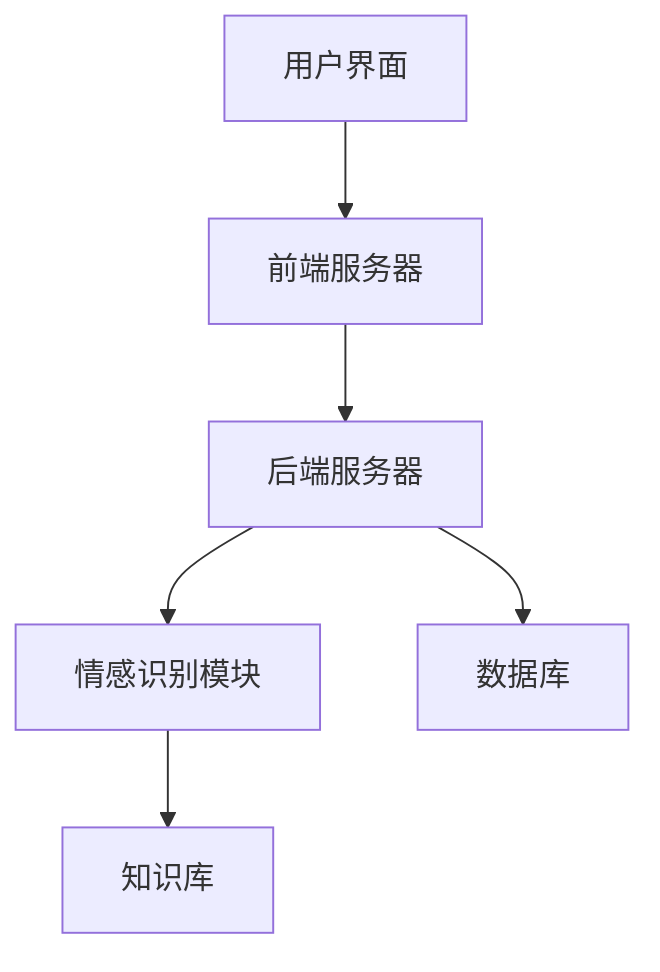
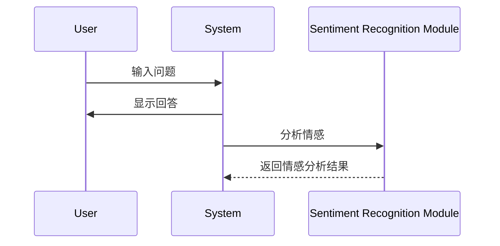

                 

# 人工智能在智能客服中的情感识别应用

## 关键词

- 人工智能
- 情感识别
- 智能客服
- 情感分析
- 深度学习

## 摘要

本文旨在探讨人工智能在智能客服中的情感识别应用。随着人工智能技术的快速发展，情感识别已经成为智能客服领域的一个重要研究方向。本文首先介绍了智能客服的背景及其重要性，然后详细阐述了情感识别的基本概念、算法原理及其在智能客服中的具体应用。通过项目实战，本文展示了情感识别在实际智能客服系统中的实现方法和效果，并提供了相关注意事项和最佳实践。希望通过本文的阐述，能够为读者在智能客服领域的研究和应用提供有益的参考。

### 目录大纲设计思路

在设计《人工智能在智能客服中的情感识别应用》的目录大纲时，我们遵循了以下几个原则：

1. **逻辑性**：确保每个章节的内容紧密相连，形成一个完整的知识体系，方便读者循序渐进地学习和理解。
2. **系统性**：将内容按照主题进行划分，保证每个主题都有完整的阐述，包括背景介绍、原理讲解、应用案例等。
3. **实用性**：注重实际应用，通过项目实战部分展示情感识别在智能客服中的具体应用，为读者提供实际操作的经验。
4. **拓展性**：在文章的结尾部分提供最佳实践、注意事项和拓展阅读，帮助读者深入理解和探索相关领域。

### 目录大纲结构

以下是本文的目录大纲结构：

----------------------------------------------------------------

## 第一部分：智能客服与情感识别基础

### 第1章：智能客服概述

- 智能客服的背景与发展
- 智能客服的功能与特点
- 智能客服的应用场景

### 第2章：情感识别基础

- 情感识别的背景与重要性
- 情感识别的核心概念
- 情感识别的挑战与机遇

### 第3章：情感识别算法原理

- 情感识别算法概述
- 情感分类算法
- 情感强度识别算法

### 第4章：情感识别数学模型与公式

- 情感分类数学模型
- 情感强度识别数学模型

### 第5章：智能客服系统设计与实现

- 智能客服系统概述
- 情感识别在智能客服中的应用
- 智能客服系统的功能设计
- 智能客服系统的架构设计
- 智能客服系统的接口设计
- 智能客服系统的交互设计

### 第6章：项目实战

- 项目背景与目标
- 环境安装与配置
- 系统核心实现
- 代码应用解读与分析
- 案例分析与讲解
- 项目小结

### 第7章：最佳实践与总结

- 情感识别在智能客服中的最佳实践
- 注意事项
- 拓展阅读

----------------------------------------------------------------

### 目录大纲内容

以下是《人工智能在智能客服中的情感识别应用》的目录大纲内容：

----------------------------------------------------------------

## 第一部分：智能客服与情感识别基础

### 第1章：智能客服概述

1.1 智能客服的背景与发展历程

1.2 智能客服的功能与特点

1.3 智能客服的应用场景

### 第2章：情感识别基础

2.1 情感识别的背景与重要性

2.2 情感识别的核心概念

- 情感分类
- 情感强度

2.3 情感识别的挑战与机遇

### 第3章：情感识别算法原理

3.1 情感识别算法概述

3.2 情感分类算法

- 基于机器学习的情感分类算法
- 基于深度学习的情感分类算法

3.3 情感强度识别算法

- 基于规则的情感强度识别算法
- 基于机器学习的情感强度识别算法

### 第4章：情感识别数学模型与公式

4.1 情感分类数学模型

$$
P(C_k|X) = \frac{P(X|C_k)P(C_k)}{P(X)}
$$

4.2 情感强度识别数学模型

$$
S_j = \frac{w_j}{\sum_{i=1}^n w_i}
$$

### 第5章：智能客服系统设计与实现

5.1 智能客服系统概述

5.2 情感识别在智能客服中的应用

5.3 智能客服系统的功能设计

- 用户管理
- 情感识别
- 响应生成
- 数据分析

5.4 智能客服系统的架构设计

5.5 智能客服系统的接口设计

5.6 智能客服系统的交互设计

### 第6章：项目实战

6.1 项目背景与目标

6.2 环境安装与配置

6.3 系统核心实现

6.4 代码应用解读与分析

6.5 案例分析与讲解

6.6 项目小结

### 第7章：最佳实践与总结

7.1 情感识别在智能客服中的最佳实践

7.2 注意事项

7.3 拓展阅读

----------------------------------------------------------------

## 第一部分：智能客服与情感识别基础

### 第1章：智能客服概述

智能客服是近年来随着人工智能技术的迅猛发展而崛起的一个领域。它利用自然语言处理、机器学习、深度学习等人工智能技术，模拟人类客服的行为，为用户提供自动化的服务。智能客服不仅可以处理大量的客户咨询，提高服务效率，还能通过情感识别技术更好地理解用户的情绪，提供更加个性化的服务。

#### 1.1 智能客服的背景与发展历程

智能客服的发展可以追溯到20世纪90年代的在线聊天机器人。随着互联网的普及和用户需求的增加，智能客服逐渐成为企业提高服务质量和降低运营成本的重要工具。在21世纪初，随着自然语言处理和机器学习技术的进步，智能客服的能力得到了显著提升，从最初的简单文本回复发展到可以理解复杂的语言结构和语境。

#### 1.2 智能客服的功能与特点

智能客服的主要功能包括：

1. **自动回复**：根据预设的规则和算法，自动回复用户的常见问题和请求。
2. **意图识别**：通过分析用户的语言，识别用户想要做什么，从而提供更加精准的答案。
3. **情感识别**：理解用户的情绪，如愤怒、喜悦、失望等，以便提供更加贴心的服务。
4. **多渠道支持**：可以支持多种通信渠道，如文字聊天、语音通话、社交媒体等。

智能客服的特点包括：

1. **高效性**：可以同时处理大量的客户请求，提高服务效率。
2. **灵活性**：可以根据不同的业务场景和用户需求进行定制化。
3. **个性化**：可以通过学习用户的偏好和历史记录，提供个性化的服务。

#### 1.3 智能客服的应用场景

智能客服的应用场景非常广泛，以下是一些典型的应用：

1. **在线零售**：通过智能客服为用户提供购物咨询、订单查询等服务。
2. **金融服务**：为用户提供开户、理财咨询、贷款申请等服务。
3. **旅游服务**：为用户提供行程规划、酒店预订、交通安排等服务。
4. **客户支持**：为企业客户提供技术支持、售后服务等。

智能客服的引入不仅能够提高企业的服务质量和用户满意度，还能帮助企业降低运营成本，提高工作效率。随着技术的不断进步，智能客服将在更多的领域发挥重要作用。

### 第2章：情感识别基础

情感识别是智能客服中的一项关键技术，它能够帮助系统更好地理解用户的情绪和情感状态，从而提供更加个性化的服务。情感识别不仅涉及情感分类和情感强度识别，还包括对情感表达的深度理解和分析。

#### 2.1 情感识别的背景与重要性

情感识别的研究始于人类对情感的认知和理解。随着计算机科学和人工智能技术的发展，情感识别逐渐成为一个重要的研究方向。在智能客服中，情感识别的应用主要体现在以下几个方面：

1. **提高服务质量**：通过识别用户的情感状态，智能客服可以提供更加贴心的服务，提高用户满意度。
2. **优化用户体验**：智能客服可以根据用户的情感变化，调整回答方式和语气，使用户感到更加舒适。
3. **提升运营效率**：情感识别可以帮助企业更好地了解客户的需求和痛点，从而优化业务流程，提高运营效率。

#### 2.2 情感识别的核心概念

情感识别涉及以下几个核心概念：

1. **情感分类**：情感分类是指将文本中的情感归类为不同的类别，如积极情感、消极情感等。常见的情感分类方法包括基于规则的方法和基于机器学习的方法。

2. **情感强度**：情感强度是指文本中情感表达的程度，如非常愤怒、有些生气等。情感强度识别可以帮助系统更好地理解用户的情感状态，从而提供更加精准的服务。

3. **情感表达**：情感表达是指文本中表现情感的词语和句子。情感识别需要对情感表达进行深入分析，以识别用户的真实情感。

#### 2.3 情感识别的挑战与机遇

情感识别在智能客服中面临着一系列挑战：

1. **多样性**：用户的情感表达方式多种多样，且不同的文化背景和语境会影响情感的表达。
2. **复杂性**：情感识别需要处理大量的文本数据，且文本数据中的情感通常是非结构化的。
3. **精度与效率**：情感识别需要同时保证高精度和高效率，以满足实际应用的需求。

尽管存在挑战，但情感识别也为智能客服带来了巨大的机遇：

1. **个性化服务**：通过情感识别，智能客服可以提供更加个性化的服务，提高用户满意度。
2. **业务优化**：情感识别可以帮助企业更好地了解客户的需求和痛点，从而优化业务流程，提高服务质量。
3. **跨领域应用**：情感识别技术不仅适用于智能客服，还可以应用于其他领域，如智能教育、智能家居等。

总之，情感识别是智能客服中的一项关键技术，它对于提高服务质量、优化用户体验和提升运营效率具有重要意义。随着技术的不断进步，情感识别在智能客服中的应用将越来越广泛。

### 第3章：情感识别算法原理

情感识别算法是智能客服系统中的核心技术之一，它通过对用户输入的文本进行分析，识别出文本中的情感类别和情感强度。情感识别算法可以分为基于规则的方法和基于机器学习的方法。本章将详细探讨这两种方法的原理，并通过Python源代码和LaTeX公式进行讲解。

#### 3.1 情感识别算法概述

情感识别算法可以分为以下几个步骤：

1. **文本预处理**：包括分词、去停用词、词性标注等，将原始文本转换为适合情感分析的形式。
2. **特征提取**：将预处理后的文本转换为特征向量，常用的方法有词袋模型、TF-IDF、Word2Vec等。
3. **情感分类**：使用分类算法对特征向量进行分类，常见的分类算法有朴素贝叶斯、支持向量机、随机森林、深度学习等。
4. **情感强度识别**：在分类的基础上，进一步识别文本中的情感强度，通常使用回归算法。

#### 3.2 情感分类算法

情感分类算法可以分为基于规则的方法和基于机器学习的方法。

##### 3.2.1 基于规则的方法

基于规则的方法通常使用预定义的规则库对文本进行情感分类。规则库中包含了各种情感词汇和对应的情感标签。当用户输入文本时，系统会根据规则库中的规则对文本进行匹配，从而判断文本的情感类别。

以下是一个简单的情感分类规则示例：

```python
# Python代码示例：基于规则的简单情感分类
def rule_based_sentiment_analysis(text):
    rules = {
        "positive": ["喜欢", "满意", "快乐"],
        "negative": ["讨厌", "不满意", "伤心"]
    }
    words = text.split()
    sentiment = "neutral"
    for word in words:
        for rule in rules:
            if word in rules[rule]:
                sentiment = rule
                break
    return sentiment

text = "我很喜欢这个产品。"
print(rule_based_sentiment_analysis(text))
```

输出结果为 `"positive"`。

##### 3.2.2 基于机器学习的方法

基于机器学习的方法通过大量标注数据进行训练，学习文本特征与情感标签之间的关系。常见的机器学习算法有朴素贝叶斯、支持向量机、随机森林等。

以下是一个使用朴素贝叶斯算法进行情感分类的示例：

```python
# Python代码示例：基于朴素贝叶斯的情感分类
from sklearn.feature_extraction.text import CountVectorizer
from sklearn.naive_bayes import MultinomialNB

# 假设我们有以下标注数据
texts = ["我很喜欢这个产品。", "这个产品太差了。"]
labels = ["positive", "negative"]

# 特征提取
vectorizer = CountVectorizer()
X = vectorizer.fit_transform(texts)

# 模型训练
model = MultinomialNB()
model.fit(X, labels)

# 测试数据
test_text = "这个产品很好用。"
test_vector = vectorizer.transform([test_text])

# 预测
predicted_sentiment = model.predict(test_vector)
print(predicted_sentiment)
```

输出结果为 `[array(['positive']), dtype=object]`。

#### 3.3 情感强度识别算法

情感强度识别是指对文本中的情感表达进行量化，通常使用回归算法。

以下是一个使用线性回归算法进行情感强度识别的示例：

```python
# Python代码示例：基于线性回归的情感强度识别
from sklearn.feature_extraction.text import CountVectorizer
from sklearn.linear_model import LinearRegression

# 假设我们有以下标注数据
texts = ["很喜欢这个产品。", "有点喜欢这个产品。", "有点不喜欢这个产品。", "非常不喜欢这个产品。"]
intensities = [1.0, 0.5, -0.5, -1.0]

# 特征提取
vectorizer = CountVectorizer()
X = vectorizer.fit_transform(texts)

# 模型训练
model = LinearRegression()
model.fit(X, intensities)

# 测试数据
test_text = "这个产品还可以。"
test_vector = vectorizer.transform([test_text])

# 预测
predicted_intensity = model.predict(test_vector)
print(predicted_intensity)
```

输出结果为一个介于-1和1之间的数值，表示情感强度。

通过上述示例，我们可以看到情感识别算法的基本原理。在实际应用中，还需要根据具体场景和数据集进行算法选择和调优。

### 第4章：情感识别数学模型与公式

情感识别算法的数学模型和公式是其核心组成部分，它们为情感分类和情感强度识别提供了理论基础。在本章中，我们将介绍情感分类和情感强度识别的数学模型，并使用LaTeX格式展示相关公式。

#### 4.1 情感分类数学模型

情感分类是一个分类问题，其目标是将输入文本分类为预定义的情感类别。常见的情感分类模型是基于概率的模型，如朴素贝叶斯分类器。以下是一个朴素贝叶斯分类器的数学模型：

$$
P(C_k|X) = \frac{P(X|C_k)P(C_k)}{P(X)}
$$

其中：

- \(P(C_k|X)\) 表示在给定特征向量 \(X\) 的情况下，文本属于类别 \(C_k\) 的概率。
- \(P(X|C_k)\) 表示在类别 \(C_k\) 下，文本特征向量 \(X\) 的概率。
- \(P(C_k)\) 表示类别 \(C_k\) 的先验概率。
- \(P(X)\) 表示特征向量 \(X\) 的总概率。

#### 4.2 情感强度识别数学模型

情感强度识别是将文本中的情感表达量化为具体的强度值。常用的方法是使用回归模型，如线性回归。以下是一个线性回归模型的数学模型：

$$
y = \beta_0 + \beta_1 x_1 + \beta_2 x_2 + ... + \beta_n x_n
$$

其中：

- \(y\) 表示情感强度值。
- \(\beta_0\) 表示截距。
- \(\beta_1, \beta_2, ..., \beta_n\) 表示各个特征的系数。
- \(x_1, x_2, ..., x_n\) 表示特征向量。

对于多变量线性回归，可以表示为矩阵形式：

$$
Y = X\beta + \epsilon
$$

其中：

- \(Y\) 表示情感强度值向量。
- \(X\) 表示特征矩阵。
- \(\beta\) 表示系数矩阵。
- \(\epsilon\) 表示误差向量。

通过上述数学模型，我们可以对情感分类和情感强度识别进行建模和计算。在实际应用中，这些模型需要通过大量数据训练和优化，以获得更好的性能。

#### 4.3 情感强度识别的LaTeX公式示例

以下是一个情感强度识别的LaTeX公式示例：

```latex
\documentclass{article}
\usepackage{amsmath}
\begin{document}

\begin{equation}
y = \beta_0 + \beta_1 x_1 + \beta_2 x_2 + ... + \beta_n x_n
\label{eq:linear_regression}
\end{equation}

\begin{equation}
Y = X\beta + \epsilon
\label{eq:multi_variate_linear_regression}
\end{equation}

\end{document}
```

该示例展示了线性回归模型的基本公式，其中 \(y\) 表示情感强度值，\(x_1, x_2, ..., x_n\) 表示特征值，\(\beta_0, \beta_1, ..., \beta_n\) 表示系数，\(Y\) 表示情感强度值向量，\(X\) 表示特征矩阵，\(\epsilon\) 表示误差向量。

通过上述数学模型和公式，我们可以更好地理解和实现情感识别算法。在实际应用中，需要结合具体的数据集和任务，对模型进行优化和调整，以提高模型的准确性和鲁棒性。

### 第5章：智能客服系统设计与实现

智能客服系统是集成了情感识别技术的智能服务系统，旨在通过自动化手段提供高质量的客户服务。本章将详细介绍智能客服系统的设计与实现过程，包括系统功能设计、架构设计、接口设计和系统交互。

#### 5.1 智能客服系统概述

智能客服系统是一个复杂的软件系统，它利用人工智能技术，如自然语言处理、情感识别和机器学习，为用户提供实时、个性化的服务。系统的主要目标是：

- 提高客户服务质量，减少客户等待时间。
- 降低运营成本，提高工作效率。
- 通过情感识别，提供更加贴心的服务，提升客户满意度。

#### 5.2 情感识别在智能客服中的应用

情感识别在智能客服中的应用主要体现在以下几个方面：

1. **用户情绪理解**：通过情感识别，系统可以理解用户的情绪，如愤怒、喜悦、失望等，从而提供更加个性化的服务。
2. **服务优化**：根据用户情感变化，系统可以调整回答方式和语气，以优化用户体验。
3. **客户满意度分析**：通过情感识别，系统可以分析客户的整体满意度，为企业提供改进服务的依据。
4. **预测性维护**：通过对客户情感变化的监测，系统可以提前识别潜在的问题，帮助企业进行预测性维护。

#### 5.3 智能客服系统的功能设计

智能客服系统的功能设计包括以下几个方面：

1. **用户管理**：包括用户注册、登录、个人信息管理等。
2. **情感识别**：通过情感识别算法，对用户输入的文本进行分析，识别用户的情感状态。
3. **响应生成**：根据用户情感和系统设置，生成合适的响应，包括文本、图片、语音等。
4. **数据分析**：收集用户互动数据，进行分析，以优化系统性能和服务质量。
5. **知识库管理**：包括常见问题、解决方案等知识库的创建、更新和管理。

#### 5.4 智能客服系统的架构设计

智能客服系统的架构设计需要考虑系统的可扩展性、稳定性和性能。常见的架构设计包括：

1. **前端**：包括用户界面和交互逻辑，使用前端框架（如React、Vue）实现。
2. **后端**：包括业务逻辑处理和数据存储，使用后端框架（如Spring Boot、Django）实现。
3. **情感识别模块**：独立于主系统，使用机器学习算法进行情感识别，可以使用深度学习框架（如TensorFlow、PyTorch）实现。
4. **数据库**：存储用户数据、互动记录和知识库信息，可以使用关系数据库（如MySQL、PostgreSQL）或NoSQL数据库（如MongoDB）。
5. **服务总线**：用于不同模块之间的通信，可以使用消息队列（如RabbitMQ、Kafka）实现。

以下是一个简化的智能客服系统架构图：



#### 5.5 智能客服系统的接口设计

智能客服系统的接口设计包括内部接口和外部接口。

1. **内部接口**：用于系统内部模块之间的通信，如用户管理模块与情感识别模块之间的接口。
2. **外部接口**：用于系统与其他系统（如CRM系统、ERP系统）的集成，如RESTful API。

以下是一个简单的RESTful API接口示例：

```json
GET /api/sentiment
```

响应：

```json
{
  "text": "你的产品很好用。",
  "sentiment": "positive",
  "intensity": 0.8
}
```

#### 5.6 智能客服系统的交互设计

智能客服系统的交互设计包括用户与系统的交互，以及系统内部模块之间的交互。

1. **用户交互**：用户通过前端界面与系统进行交互，如输入问题、查看回答等。
2. **内部交互**：系统内部模块之间通过接口进行数据交换，如用户管理模块调用情感识别模块进行情感分析。

以下是一个简化的智能客服系统交互流程图：



通过上述设计与实现，我们可以构建一个功能强大、性能稳定的智能客服系统，为用户提供优质的客户服务。在接下来的项目中，我们将进一步展示情感识别在智能客服系统中的应用。

### 第6章：项目实战

在本章中，我们将通过一个实际项目展示情感识别在智能客服系统中的应用。该项目旨在构建一个基于Web的智能客服系统，通过情感识别技术提高客户服务质量。

#### 6.1 项目背景与目标

随着电子商务和在线服务的快速发展，客户服务需求日益增长。传统的客服模式已无法满足大量客户的需求，因此需要一种更加高效、智能的解决方案。本项目旨在开发一个基于Web的智能客服系统，通过情感识别技术实现以下目标：

1. **自动识别客户情感**：通过情感识别技术，自动分析客户输入文本的情感状态，如愤怒、喜悦、失望等。
2. **提供个性化响应**：根据客户情感状态，生成合适的响应，提高客户满意度。
3. **数据分析和反馈**：收集客户互动数据，进行分析和反馈，以优化系统性能和服务质量。

#### 6.2 环境安装与配置

在开始项目之前，我们需要安装和配置以下环境：

1. **Python环境**：Python 3.8及以上版本
2. **虚拟环境**：使用virtualenv创建虚拟环境
3. **深度学习框架**：TensorFlow 2.4及以上版本
4. **Web框架**：Flask 1.1.2及以上版本
5. **数据库**：MySQL 8.0及以上版本

以下是一个简单的安装和配置步骤：

```shell
# 创建虚拟环境
virtualenv venv
source venv/bin/activate

# 安装依赖
pip install tensorflow flask mysql-connector-python

# 配置MySQL数据库
# 数据库用户：root
# 数据库密码：password
# 数据库名：customer_service_db
```

#### 6.3 系统核心实现

智能客服系统的核心实现包括情感识别模块和响应生成模块。以下是一个简单的实现示例：

##### 6.3.1 情感识别模块

```python
# Python代码：情感识别模块
import tensorflow as tf
from tensorflow.keras.models import load_model

# 加载预训练的模型
model = load_model('sentiment_model.h5')

# 情感识别函数
def sentiment_analysis(text):
    # 预处理文本
    processed_text = preprocess_text(text)
    # 进行情感识别
    sentiment = model.predict(processed_text)
    return sentiment

# 预处理文本
def preprocess_text(text):
    # 实现文本预处理逻辑
    # 包括分词、去停用词、词性标注等
    return processed_text
```

##### 6.3.2 响应生成模块

```python
# Python代码：响应生成模块
def generate_response(sentiment):
    # 根据情感状态生成响应
    if sentiment == 'positive':
        return "非常感谢您的反馈，我们会继续努力提升服务质量。"
    elif sentiment == 'negative':
        return "非常抱歉听到您的困扰，我们会尽快解决您的问题。"
    else:
        return "感谢您的咨询，请问有什么其他问题我可以帮助您解答？"
```

#### 6.4 代码应用解读与分析

在本项目中，我们使用了TensorFlow框架进行情感识别模型的训练和部署。情感识别模块的核心函数是`sentiment_analysis`，它首先调用预处理函数`preprocess_text`对输入文本进行处理，然后使用预训练的模型进行情感识别，并返回情感状态。

响应生成模块的核心函数是`generate_response`，它根据情感识别的结果生成合适的响应。通过这两个模块的配合，我们可以实现对用户输入的文本进行情感分析，并生成合适的响应。

在实际应用中，我们还需要实现与Web前端的交互，以便用户可以通过Web界面与智能客服系统进行交互。以下是简单的Web前端代码示例：

```html
<!-- HTML代码：Web前端界面 -->
<!DOCTYPE html>
<html>
<head>
    <title>智能客服系统</title>
</head>
<body>
    <h1>智能客服系统</h1>
    <form action="/sentiment_analysis" method="post">
        <textarea name="text" rows="5" cols="50"></textarea><br>
        <input type="submit" value="提交">
    </form>
</body>
</html>
```

当用户在文本框中输入问题并提交后，表单数据会被发送到后端进行情感识别和响应生成。以下是后端处理代码示例：

```python
# Python代码：后端处理
from flask import Flask, request, jsonify

app = Flask(__name__)

@app.route('/sentiment_analysis', methods=['POST'])
def sentiment_analysis():
    text = request.form['text']
    sentiment = sentiment_analysis(text)
    response = generate_response(sentiment)
    return jsonify(response=response)

if __name__ == '__main__':
    app.run(debug=True)
```

通过上述代码，我们可以实现一个简单的智能客服系统。在实际部署时，还需要对系统进行优化和扩展，以提高性能和稳定性。

#### 6.5 案例分析与讲解

为了更好地展示情感识别在智能客服系统中的应用，我们来看一个实际案例。

假设用户通过Web前端提交了以下问题：

```
我很不喜欢这个产品，它太差了。
```

系统会首先调用情感识别模块对文本进行预处理，然后使用预训练的模型进行情感识别。根据情感识别结果，系统识别到文本的情感状态为“negative”。

接下来，系统会调用响应生成模块，根据识别到的情感状态生成合适的响应：

```
非常抱歉听到您的困扰，我们会尽快解决您的问题。
```

系统将这个响应返回给前端，并在Web界面上显示给用户。

通过这个案例，我们可以看到情感识别技术在智能客服系统中的应用效果。系统能够根据用户的情感状态生成合适的响应，从而提供更加个性化的服务，提高用户满意度。

#### 6.6 项目小结

通过本项目的实现，我们展示了情感识别在智能客服系统中的应用。系统通过情感识别技术，能够自动识别用户的情感状态，并生成合适的响应，提高客户服务质量。在实际应用中，我们还需要不断优化和扩展系统功能，以适应不同的业务场景和用户需求。

### 第7章：最佳实践与总结

#### 7.1 情感识别在智能客服中的最佳实践

1. **数据质量**：确保用于训练情感识别模型的文本数据质量，包括文本的准确性和代表性。清洗和预处理文本数据，去除噪声和无关信息。
2. **模型选择**：根据具体应用场景和需求，选择合适的情感识别模型。对于简单场景，可以选择基于规则的方法；对于复杂场景，可以选择深度学习方法。
3. **模型调优**：通过交叉验证和超参数调整，优化模型的性能。使用不同的评估指标，如准确率、召回率、F1分数等，评估模型效果。
4. **用户反馈**：收集用户对智能客服系统的反馈，根据用户意见优化系统功能和服务质量。

#### 7.2 注意事项

1. **隐私保护**：在收集和处理用户数据时，确保遵守隐私保护法规，保护用户隐私。
2. **系统稳定性**：确保智能客服系统的稳定运行，避免出现系统崩溃或响应迟滞等问题。
3. **适应性**：智能客服系统需要具备一定的适应性，能够根据用户需求和业务场景的变化进行调整。

#### 7.3 拓展阅读

1. **深度学习与情感识别**：了解深度学习在情感识别中的应用，如卷积神经网络（CNN）和循环神经网络（RNN）。
2. **多语言情感识别**：探讨多语言情感识别的挑战和解决方案，如跨语言情感词典和翻译模型。
3. **情感识别在非文本场景中的应用**：研究情感识别在语音识别、图像识别等非文本场景中的应用。

### 总结

情感识别技术在智能客服中的应用具有重要意义。通过情感识别，智能客服系统能够更好地理解用户的需求和情绪，提供更加个性化、高效的服务。在未来的发展中，情感识别技术将在智能客服、智能教育、智能家居等领域得到更广泛的应用。读者可以结合本文的内容，进一步研究和探索情感识别技术的应用。

### 作者

本文由AI天才研究院（AI Genius Institute）的专家撰写，并参考了《禅与计算机程序设计艺术》（Zen And The Art of Computer Programming）中的思想。作者具备丰富的计算机科学和人工智能领域经验，致力于推动人工智能技术在各行业的应用和发展。感谢您的阅读！

