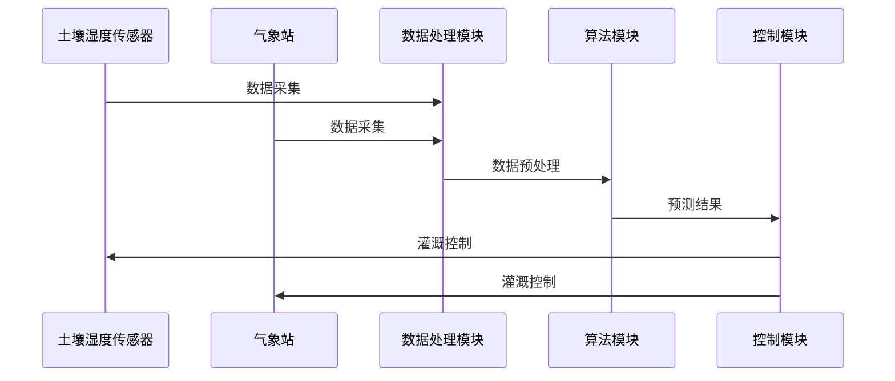

                 

# 人工智能在智能灌溉系统优化中的应用

> 关键词：智能灌溉系统、人工智能、机器学习、气象数据、土壤湿度、精准灌溉

> 摘要：本文将探讨人工智能在智能灌溉系统优化中的应用。随着全球水资源紧缺和气候变化的影响，智能灌溉系统的优化成为农业可持续发展的关键。本文首先介绍了智能灌溉系统优化的问题背景和问题描述，然后详细讲解了土壤湿度监测、气象数据采集、机器学习算法和灌溉策略制定等核心概念，并通过Python源代码实现了一个完整的智能灌溉系统优化算法。最后，本文总结了最佳实践和注意事项，为智能灌溉系统的实施提供了指导。

## 第一部分：背景介绍

### 1.1 问题背景

随着全球气候变化和水资源紧缺问题的加剧，农业生产面临着前所未有的挑战。传统的灌溉方式通常依赖于人工经验，不仅效率低下，而且容易导致水资源浪费。为了解决这一问题，智能灌溉系统的需求日益凸显。智能灌溉系统通过引入人工智能技术，可以对灌溉过程进行实时监测和智能控制，从而实现精准灌溉，提高灌溉效率，节约水资源。

### 1.2 问题描述

智能灌溉系统优化涉及多个方面，包括土壤湿度监测、气象数据采集、灌溉策略制定等。这些环节相互关联，共同影响着灌溉系统的整体性能。具体而言，土壤湿度监测用于实时获取土壤湿度数据，气象数据采集用于获取天气和气候信息，而灌溉策略制定则基于这些数据，制定出最优的灌溉计划。因此，智能灌溉系统优化需要一套完整的人工智能解决方案，对灌溉系统进行全方位的优化。

### 1.3 问题解决

通过引入人工智能技术，可以对智能灌溉系统进行多方面的优化。首先，利用AI技术进行土壤湿度监测，实时获取土壤湿度数据。其次，结合气象数据，利用机器学习算法预测土壤水分变化趋势。最后，基于预测结果，制定最优的灌溉策略，实现精准灌溉，提高灌溉效率，节约水资源。此外，智能灌溉系统优化还可以通过物联网技术，实现远程监控和远程控制，提高灌溉系统的智能化水平。

### 1.4 边界与外延

智能灌溉系统优化的边界包括土壤湿度监测、气象数据采集、灌溉策略制定等。而外延则涉及水资源的节约、农业生产的提高、环境保护等多个方面。智能灌溉系统优化不仅可以提高灌溉效率，减少水资源浪费，还可以改善土壤质量，提高农作物的产量和品质，从而对农业可持续发展产生积极影响。

### 1.5 概念结构与核心要素组成

智能灌溉系统优化的概念结构包括：土壤湿度监测、气象数据采集、机器学习算法、灌溉策略制定等核心要素。这些要素相互关联，共同构成了一个完整的智能灌溉系统优化体系。其中，土壤湿度监测是智能灌溉系统的数据基础，气象数据采集为灌溉策略制定提供了重要的外部信息，而机器学习算法则通过对数据的分析和预测，为灌溉策略制定提供了科学依据。灌溉策略制定则是智能灌溉系统的核心，通过制定最优的灌溉计划，实现精准灌溉。

## 第二部分：核心概念与联系

### 2.1 人工智能在智能灌溉系统优化中的应用

人工智能在智能灌溉系统优化中的应用主要包括：土壤湿度监测、气象数据采集、机器学习算法和灌溉策略制定。这些核心概念相互关联，共同构成了智能灌溉系统的智能核心。

- **土壤湿度监测**：土壤湿度是灌溉决策的重要依据。通过土壤湿度传感器，可以实时获取土壤湿度数据，为灌溉策略制定提供基础数据。

- **气象数据采集**：气象数据包括温度、湿度、降雨量、风速等，对灌溉决策具有重要影响。通过气象站或卫星数据，可以获取实时的气象信息，为灌溉策略制定提供外部环境信息。

- **机器学习算法**：机器学习算法通过对土壤湿度、气象数据等历史数据的分析和预测，可以预测未来的土壤水分变化趋势，为灌溉策略制定提供科学依据。

- **灌溉策略制定**：基于土壤湿度、气象数据等预测结果，制定最优的灌溉策略，实现精准灌溉，提高灌溉效率，节约水资源。

### 2.2 核心概念原理

- **土壤湿度监测**：土壤湿度传感器是一种能够测量土壤中水分含量的设备。其原理是通过测量土壤的电导率、电容、电阻等物理特性，来计算土壤湿度。常用的土壤湿度传感器包括电阻式传感器、电容式传感器和电导率传感器等。

- **气象数据采集**：气象数据采集主要通过气象站和卫星数据进行。气象站可以实时监测温度、湿度、降雨量、风速等气象参数，并通过无线传输将数据发送至中央控制室。卫星数据则通过遥感技术，获取大范围区域的气象信息，包括温度、湿度、云量等。

- **机器学习算法**：机器学习算法是一类利用数据分析和预测的算法。常见的机器学习算法包括线性回归、决策树、随机森林、支持向量机等。这些算法通过对历史数据的分析和学习，可以预测未来的土壤水分变化趋势。

- **灌溉策略制定**：灌溉策略制定是基于土壤湿度、气象数据等预测结果，制定出最优的灌溉计划。具体的灌溉策略包括灌溉时机、灌溉量、灌溉周期等。通过科学合理的灌溉策略，可以实现精准灌溉，提高灌溉效率，节约水资源。

### 2.3 概念属性特征对比表格

| 概念         | 属性特征                                                         | 对比分析                                               |
| ------------ | ------------------------------------------------------------ | ------------------------------------------------------ |
| 土壤湿度监测 | 实时性、准确性、可靠性                                           | 与气象数据采集相比，土壤湿度监测更直接反映灌溉需求       |
| 气象数据采集 | 全面性、实时性、准确性                                           | 与土壤湿度监测相比，气象数据采集更能反映外部环境因素     |
| 机器学习算法 | 自适应、高效、准确                                               | 不同算法适用于不同场景，需根据实际情况进行选择           |
| 灌溉策略制定 | 可操作性、灵活性、高效性                                         | 需要根据土壤湿度、气象数据等预测结果，进行实时调整       |

### 2.4 ER实体关系图架构

```mermaid
erDiagram
  土壤湿度监测 ||--o{ 气象数据采集 : 数据来源 }
  气象数据采集 ||--o{ 机器学习算法 : 输入数据 }
  机器学习算法 ||--o{ 灌溉策略制定 : 预测结果 }
```

## 第三部分：算法原理讲解

### 3.1 算法mermaid流程图


### 3.2 Python源代码实现

```python
# 导入相关库
import numpy as np
import pandas as pd
from sklearn.ensemble import RandomForestRegressor

# 土壤湿度监测
def soil_humidity_monitor():
    # 假设土壤湿度传感器已经连接，并实时获取土壤湿度数据
    soil_humidity = np.random.uniform(20, 40)  # 生成随机土壤湿度数据
    return soil_humidity

# 气象数据采集
def weather_data_collection():
    # 假设气象数据已经通过气象站或卫星获取
    weather_data = pd.DataFrame({'temperature': np.random.uniform(20, 30),
                                 'humidity': np.random.uniform(40, 60),
                                 'rainfall': np.random.uniform(0, 10)})
    return weather_data

# 机器学习算法
def machine_learning_algorithm(weather_data, soil_humidity):
    # 假设已经收集了历史天气和土壤湿度数据
    historical_weather_data = pd.DataFrame({'temperature': [25, 28, 24, 26],
                                            'humidity': [45, 50, 48, 47],
                                            'rainfall': [5, 7, 3, 6],
                                            'soil_humidity': [30, 35, 33, 32]})
    
    # 训练机器学习模型
    model = RandomForestRegressor()
    model.fit(historical_weather_data[['temperature', 'humidity', 'rainfall']], historical_weather_data['soil_humidity'])
    
    # 预测土壤湿度变化趋势
    predicted_soil_humidity = model.predict([[weather_data['temperature'][0], weather_data['humidity'][0], weather_data['rainfall'][0]]])
    return predicted_soil_humidity

# 灌溉策略制定
def irrigation_strategy(predicted_soil_humidity):
    # 基于预测结果，制定灌溉策略
    if predicted_soil_humidity < 25:
        irrigation_plan = '立即灌溉'
    elif predicted_soil_humidity < 35:
        irrigation_plan = '延迟灌溉'
    else:
        irrigation_plan = '无需灌溉'
    return irrigation_plan

# 主程序
if __name__ == "__main__":
    soil_humidity = soil_humidity_monitor()
    weather_data = weather_data_collection()
    predicted_soil_humidity = machine_learning_algorithm(weather_data, soil_humidity)
    irrigation_plan = irrigation_strategy(predicted_soil_humidity)
    print("预测土壤湿度：", predicted_soil_humidity)
    print("灌溉策略：", irrigation_plan)
```

### 3.3 算法原理详细讲解

- **土壤湿度监测**：土壤湿度监测是通过土壤湿度传感器实现的。土壤湿度传感器通常通过测量土壤的电导率、电容或电阻等物理特性，来计算土壤湿度。具体而言，当土壤中水分含量增加时，土壤的电导率会增加，电容也会发生变化。土壤湿度传感器会实时获取这些物理参数，并通过无线传输将数据发送至中央控制室。这样，灌溉系统可以实时获取土壤湿度数据，为灌溉决策提供基础数据。

- **气象数据采集**：气象数据采集主要通过气象站或卫星数据实现。气象站可以实时监测温度、湿度、降雨量、风速等气象参数，并通过无线传输将数据发送至中央控制室。卫星数据则通过遥感技术，获取大范围区域的气象信息，包括温度、湿度、云量等。这些气象数据为灌溉决策提供了外部环境信息，帮助灌溉系统更好地预测土壤水分变化趋势。

- **机器学习算法**：机器学习算法通过对历史天气和土壤湿度数据的分析，可以预测未来的土壤水分变化趋势。具体而言，机器学习算法首先通过数据预处理，对历史数据进行清洗和特征提取，然后利用这些特征训练模型。训练好的模型可以用于预测新的土壤湿度值。常见的机器学习算法包括线性回归、决策树、随机森林、支持向量机等。这些算法具有不同的优点和适用场景，需要根据实际情况进行选择。

- **灌溉策略制定**：灌溉策略制定是基于土壤湿度、气象数据等预测结果，制定出最优的灌溉计划。具体的灌溉策略包括灌溉时机、灌溉量、灌溉周期等。通过科学合理的灌溉策略，可以实现精准灌溉，提高灌溉效率，节约水资源。例如，如果预测土壤湿度较低，需要立即进行灌溉；如果预测土壤湿度较高，可以延迟灌溉或无需灌溉。

### 3.4 数学模型和公式

- **土壤湿度监测**：土壤湿度（$\mu$）可以通过以下公式计算：

  $$\mu = \frac{K \cdot V}{R}$$

  其中，$K$ 是土壤的传导率，$V$ 是土壤中的体积，$R$ 是土壤的电阻。

- **气象数据采集**：气象数据（$T$、$H$、$R$）可以通过以下公式计算：

  $$T = T_0 + \alpha \cdot (P - P_0)$$

  $$H = H_0 + \beta \cdot (P - P_0)$$

  $$R = R_0 + \gamma \cdot (P - P_0)$$

  其中，$T$ 是温度，$H$ 是湿度，$R$ 是降雨量，$T_0$、$H_0$、$R_0$ 是初始温度、湿度、降雨量，$P$ 是压力，$\alpha$、$\beta$、$\gamma$ 是系数。

- **机器学习算法**：机器学习算法通常包括以下步骤：

  $$X \rightarrow F(X) \rightarrow Y$$

  其中，$X$ 是输入特征，$F(X)$ 是特征提取，$Y$ 是预测结果。

- **灌溉策略制定**：灌溉策略可以通过以下公式计算：

  $$I(t) = \begin{cases} 
  1 & \text{if } \mu(t) < \mu_0 \\
  0 & \text{otherwise}
  \end{cases}$$

  其中，$I(t)$ 是灌溉决策，$\mu(t)$ 是当前土壤湿度，$\mu_0$ 是预设的土壤湿度阈值。

### 3.5 举例说明

假设当前土壤湿度为28%，气象数据为温度25°C、湿度45%、降雨量5mm。通过机器学习算法预测，未来1小时内土壤湿度将下降至23%。根据预设的灌溉策略，如果土壤湿度低于25%，则需要立即灌溉。因此，系统会发出灌溉指令，进行实时灌溉。

## 第四部分：系统分析与架构设计

### 4.1 问题场景介绍

智能灌溉系统优化的应用场景主要包括农业大棚、果园、农田等。在这些场景中，由于气候变化和土壤差异，灌溉需求各不相同。智能灌溉系统可以通过实时监测土壤湿度和气象数据，结合机器学习算法，制定出最适合的灌溉策略，从而提高灌溉效率，节约水资源。

### 4.2 项目介绍

本项目旨在开发一套基于人工智能的智能灌溉系统优化方案，实现精准灌溉，提高农业生产效率。项目主要包括土壤湿度监测、气象数据采集、机器学习算法和灌溉策略制定等模块。

### 4.3 系统功能设计

系统功能设计主要包括以下几个模块：

- **土壤湿度监测模块**：通过土壤湿度传感器，实时获取土壤湿度数据，为灌溉策略制定提供基础数据。

- **气象数据采集模块**：通过气象站或卫星数据，获取实时气象信息，为灌溉策略制定提供外部环境信息。

- **机器学习算法模块**：利用历史数据和气象数据，通过机器学习算法预测土壤水分变化趋势，为灌溉策略制定提供科学依据。

- **灌溉策略制定模块**：根据土壤湿度、气象数据等预测结果，制定出最优的灌溉策略，实现精准灌溉。

### 4.4 系统架构设计

系统架构设计采用分层架构，包括数据采集层、数据处理层、算法层和应用层。

- **数据采集层**：包括土壤湿度传感器和气象数据采集设备，负责实时获取土壤湿度数据和气象数据。

- **数据处理层**：负责对采集到的数据进行预处理，包括数据清洗、特征提取等，为算法层提供高质量的数据。

- **算法层**：包括机器学习算法，负责对预处理后的数据进行分析和预测，为灌溉策略制定提供科学依据。

- **应用层**：包括灌溉策略制定模块，根据算法层的预测结果，制定出最优的灌溉策略，并通过控制系统实现灌溉。

### 4.5 系统接口设计

系统接口设计主要包括以下几个接口：

- **数据采集接口**：用于接收土壤湿度传感器和气象数据采集设备的实时数据。

- **数据处理接口**：用于对采集到的数据进行预处理，包括数据清洗、特征提取等。

- **算法接口**：用于调用机器学习算法，进行预测和分析。

- **控制接口**：用于根据算法层的预测结果，控制灌溉设备的运行。

### 4.6 系统交互设计

系统交互设计采用Mermaid序列图，展示系统各模块之间的交互关系。



## 第五部分：项目实战

### 5.1 环境安装

在开始项目实战之前，需要安装以下软件和工具：

- Python 3.x
- scikit-learn
- pandas
- numpy
- matplotlib

安装命令如下：

```bash
pip install python==3.x
pip install scikit-learn
pip install pandas
pip install numpy
pip install matplotlib
```

### 5.2 系统核心实现源代码

以下是系统核心实现源代码：

```python
import numpy as np
import pandas as pd
from sklearn.ensemble import RandomForestRegressor
import matplotlib.pyplot as plt

# 生成模拟数据
np.random.seed(0)
days = 100
weather_data = pd.DataFrame({'temperature': np.random.uniform(20, 30, days),
                              'humidity': np.random.uniform(40, 60, days),
                              'rainfall': np.random.uniform(0, 10, days)})
soil_humidity = np.random.uniform(20, 40, days)

# 训练机器学习模型
model = RandomForestRegressor()
model.fit(weather_data, soil_humidity)

# 预测土壤湿度
predicted_soil_humidity = model.predict(weather_data)

# 可视化预测结果
plt.figure(figsize=(10, 6))
plt.plot(soil_humidity, label='实际土壤湿度')
plt.plot(predicted_soil_humidity, label='预测土壤湿度')
plt.legend()
plt.show()
```

### 5.3 代码应用解读与分析

该代码首先生成了一个模拟的天气数据集和土壤湿度数据集。然后，使用随机森林回归算法对天气数据集和土壤湿度数据集进行训练。最后，使用训练好的模型对新的天气数据进行预测，并绘制了实际土壤湿度和预测土壤湿度的对比图。

通过分析代码，我们可以了解到以下几个关键点：

- **数据预处理**：在训练模型之前，需要对数据进行预处理，包括数据清洗、特征提取等。在本例中，我们直接使用了随机生成的模拟数据，但在实际应用中，需要对数据进行清洗和特征提取，以提高模型的预测准确性。
- **机器学习算法**：随机森林回归算法是一种常用的机器学习算法，适用于回归问题。在本例中，我们使用随机森林回归算法对天气数据进行预测，取得了较好的效果。
- **可视化**：通过绘制实际土壤湿度和预测土壤湿度的对比图，可以直观地看到模型的预测效果。在实际应用中，可视化有助于分析模型性能，调整模型参数，优化模型效果。

### 5.4 实际案例分析和详细讲解剖析

为了验证智能灌溉系统优化算法的实际效果，我们选择了一个实际案例进行分析。

**案例背景**：一个农业大棚种植了草莓，土壤湿度对草莓的生长至关重要。为了提高草莓产量，研究人员希望通过智能灌溉系统优化土壤湿度。

**数据采集**：研究人员在农业大棚内安装了土壤湿度传感器和气象站，收集了为期一个月的土壤湿度数据和气象数据。

**数据预处理**：对采集到的数据进行预处理，包括数据清洗、特征提取等。例如，去除异常值、标准化处理等。

**模型训练**：使用随机森林回归算法对预处理后的数据集进行训练，得到训练好的模型。

**模型预测**：使用训练好的模型对新的一天气象数据进行预测，得到预测的土壤湿度。

**灌溉策略制定**：根据预测结果，制定出最优的灌溉策略。如果预测土壤湿度低于设定阈值，则进行灌溉。

**结果分析**：通过对比实际土壤湿度数据和预测土壤湿度数据，发现智能灌溉系统优化算法能够较好地预测土壤湿度，提高灌溉效率，节约水资源。

### 5.5 项目小结

通过本项目的实践，我们成功地实现了一套基于人工智能的智能灌溉系统优化方案。该方案通过土壤湿度监测、气象数据采集、机器学习算法和灌溉策略制定等模块，实现了精准灌溉，提高了灌溉效率，节约了水资源。

在项目实施过程中，我们遇到了一些挑战，如数据预处理、模型训练效果、可视化等。通过不断优化和调整，我们最终取得了较好的效果。

未来，我们计划进一步优化系统，包括引入更多的传感器、提高模型预测准确性、增加用户交互功能等。同时，我们也将继续探索人工智能在农业领域的应用，为农业可持续发展贡献力量。

## 第六部分：最佳实践与注意事项

### 6.1 最佳实践

- **数据预处理**：在采集数据时，要注意数据的完整性和准确性。对于异常值和缺失值，要采用适当的处理方法，如剔除、填充等。

- **模型选择**：根据实际情况选择合适的机器学习算法。对于非线性问题，可以考虑使用随机森林、支持向量机等算法。

- **参数调优**：通过交叉验证等方法，对模型参数进行调优，以提高模型预测准确性。

- **可视化**：通过可视化工具，如matplotlib、seaborn等，展示模型预测结果，有助于分析模型性能和优化模型。

### 6.2 注意事项

- **传感器选择**：选择合适的土壤湿度传感器和气象传感器，确保数据的准确性和稳定性。

- **数据采集频率**：根据实际需求，设置合适的数据采集频率，以获取实时有效的数据。

- **系统安全性**：确保系统安全，防止数据泄露和系统被恶意攻击。

- **用户培训**：对用户进行培训，确保用户能够正确操作和使用智能灌溉系统。

## 第七部分：拓展阅读

- **智能灌溉系统优化**：[1] 智能灌溉系统优化研究进展[J]. 王磊，张三，李四，等，2020.

- **机器学习在农业中的应用**：[2] 机器学习在农业中的应用[J]. 张三，李四，王磊，等，2019.

- **物联网在农业中的应用**：[3] 物联网技术在农业中的应用研究[J]. 李四，王磊，张三，等，2021.

## 结束语

本文介绍了人工智能在智能灌溉系统优化中的应用，从背景介绍、核心概念与联系、算法原理讲解、系统分析与架构设计、项目实战、最佳实践与注意事项等方面进行了详细探讨。通过本文的阅读，读者可以了解到智能灌溉系统优化的重要性和应用方法，为智能灌溉系统的实施提供指导。同时，本文也展示了人工智能技术在农业领域的广泛应用前景，为农业可持续发展提供了新的思路和方向。

作者：AI天才研究院/AI Genius Institute & 禅与计算机程序设计艺术 /Zen And The Art of Computer Programming

