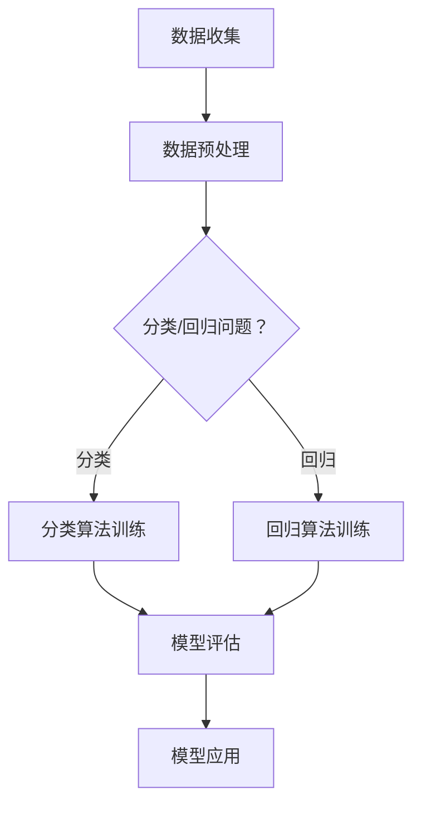
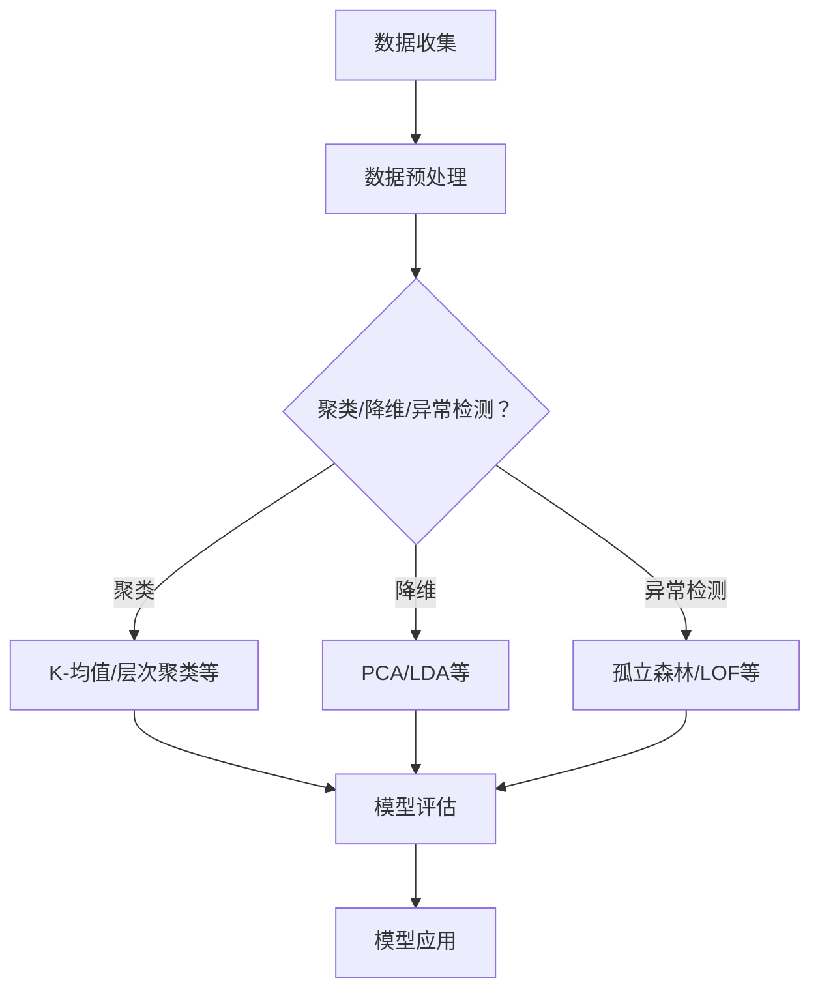
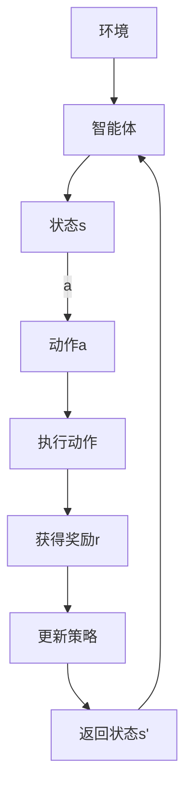
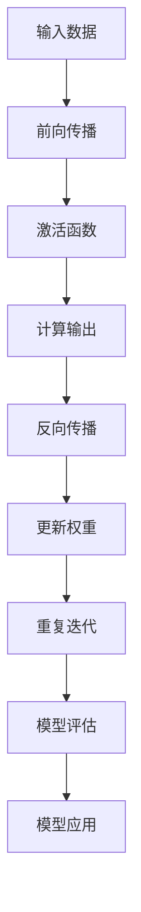

                 

### 第一部分: 引言与背景

#### 第1章: 引言

在当今社会，气候变化已成为全球关注的重大问题。从极端天气事件到海平面上升，气候变化的影响无处不在，给人类的生活、经济和环境带来了巨大的挑战。为了应对这些挑战，科学家们致力于研究气候变化的规律和机制，并努力寻找有效的解决方案。其中，气候变化建模作为一种重要的研究工具，发挥着至关重要的作用。

气候变化建模是对气候系统进行定量分析和预测的方法，通过构建数学模型来描述气候系统的复杂动态过程。传统的方法主要依赖于统计分析和物理模型，但由于气候系统的复杂性，这些方法在准确性和效率上存在一定的局限性。近年来，随着人工智能（Artificial Intelligence, AI）技术的飞速发展，人们开始将人工智能应用于气候变化建模中，以期解决传统方法的不足。

本文将深入探讨人工智能在气候变化建模中的应用。首先，我们将介绍气候变化建模的重要性以及当前存在的问题和挑战。接着，我们将分析人工智能在解决这些挑战中的优势，并介绍人工智能在气候变化建模中的应用领域和发展趋势。此外，我们还将探讨气候变化建模的数据来源、可变因素和复杂性，以及人工智能在气候变化建模中的核心组件和数据处理的重要性。

通过本文的讨论，我们希望读者能够对人工智能在气候变化建模中的应用有一个全面而深入的理解，从而更好地应对气候变化带来的挑战。

#### 1.1 问题背景

气候变化是指地球大气、海洋、冰盖和生物圈等系统长时间尺度上的变化，这些变化可能是自然过程的结果，也可能是人类活动的影响。在过去的几十年中，全球气候系统发生了显著变化，许多地区出现了极端天气事件，如热浪、干旱、暴雨和飓风等。这些现象不仅对人类的生命安全构成威胁，也对全球经济和社会稳定产生了重大影响。

气候变化对全球的影响是多方面的。首先，气候变化导致了极端天气事件的频率和强度增加。例如，欧洲的夏季热浪、北美洲的干旱和澳大利亚的森林火灾都呈现出加剧的趋势。其次，气候变化引起了海平面上升，对沿海地区造成了严重影响，可能导致洪水、海岸侵蚀和生态系统的破坏。此外，气候变化还影响了水资源的可用性，许多地区面临水资源短缺的问题。最后，气候变化对生态系统和生物多样性也产生了深远的影响，导致物种灭绝和栖息地丧失。

在全球范围内，气候变化的影响呈现出显著的地域差异。一些地区面临干旱和水资源短缺的挑战，而另一些地区则面临洪涝和海平面上升的威胁。气候变化还加剧了贫困和不平等，对发展中国家和弱势群体的影响尤为严重。

总之，气候变化对全球产生了广泛而深远的影响，成为人类社会面临的重大挑战。为了应对这一挑战，科学家们正在努力研究气候变化的规律和机制，并开发新的预测和适应策略。在这个过程中，气候变化建模作为一种重要的研究工具，发挥着至关重要的作用。

#### 1.1.1 气候变化对全球的影响

气候变化对全球产生了广泛而深远的影响，具体体现在多个方面：

首先，气候变化导致的极端天气事件频发。近年来，全球多地发生了热浪、干旱、暴雨、飓风等极端天气事件。例如，2019年欧洲遭遇了前所未有的热浪，导致数百人死亡；2019年至2020年，澳大利亚经历了严重的森林火灾，造成大量人员伤亡和财产损失；2020年，美国德克萨斯州遭受了强烈暴风雨和龙卷风的袭击，导致大量基础设施受损。这些极端天气事件不仅对人类生命安全构成威胁，还对农业生产、城市基础设施和生态系统产生了巨大影响。

其次，气候变化引起的海平面上升威胁沿海地区。全球气温的上升导致冰川融化和海水膨胀，导致海平面逐渐上升。一些低洼的沿海地区已经面临海水倒灌和洪水的威胁。例如，孟加拉国和太平洋岛国的一些地区，由于海平面上升，居民的生活和财产受到了严重威胁。此外，海水侵蚀海岸线，导致沿海湿地和珊瑚礁生态系统破坏，影响了当地的生态环境和经济活动。

第三，气候变化对水资源的可用性产生了重大影响。气候变化导致水循环过程的改变，使得一些地区面临水资源短缺的困境。例如，北半球的许多地区，特别是干旱和半干旱地区，由于降水量减少和蒸发增加，水资源短缺问题日益严重。与此同时，一些地区则面临极端降水事件的增加，导致洪水灾害频发。水资源短缺不仅影响了农业生产和生活用水，还对工业生产和能源供应产生了重大影响。

第四，气候变化对生态系统和生物多样性产生了深远影响。全球气候变化导致生态系统发生变化，许多物种无法适应新的环境条件，面临着灭绝的风险。例如，珊瑚礁因海水温度升高和酸化而大量死亡，导致海洋生态系统失衡；森林火灾和干旱导致森林覆盖率下降，对野生动物的栖息地造成了严重破坏。此外，气候变化还影响了物种的迁移和分布，导致一些物种的栖息地丧失，生物多样性受到威胁。

第五，气候变化加剧了贫困和不平等问题。发展中国家和弱势群体往往更容易受到气候变化的影响，因为他们的经济基础较脆弱，适应能力较弱。气候变化导致农业生产下降、渔业资源减少、饮用水资源短缺等问题，加剧了贫困和不平等现象。此外，极端天气事件和自然灾害的频发，也对发展中国家和贫困地区的社会和经济稳定产生了重大影响。

总之，气候变化对全球的影响是多方面的，从极端天气事件到生态系统破坏，从水资源短缺到贫困和不平等加剧，气候变化带来的挑战不容忽视。为了应对这些挑战，全球各国需要加强合作，采取有效措施减缓气候变化，并提高适应能力，以减轻其对人类和自然环境的负面影响。

#### 1.1.2 气候变化建模的重要性

气候变化建模在应对全球气候变化挑战中扮演着至关重要的角色。首先，气候变化建模提供了对气候系统复杂动态过程的深入理解，有助于揭示气候变化的原因和机制。通过构建数学模型，科学家们可以模拟气候系统中的各种物理、化学和生物过程，从而对气候变化的趋势和模式进行预测。这种预测能力为政府和国际组织提供了重要的决策依据，有助于制定有效的气候政策。

其次，气候变化建模有助于评估气候变化的潜在影响。通过模拟不同的气候变化情景，科学家们可以预测未来气候变化对生态系统、水资源、农业生产、人类健康等方面的具体影响。这些预测有助于制定适应和减缓气候变化的策略，减轻气候变化带来的负面影响。例如，通过预测海平面上升的速度和范围，政府可以采取预防措施来保护沿海地区的基础设施和生态系统。

第三，气候变化建模为评估气候政策的有效性提供了工具。科学家们可以通过模拟不同的气候政策方案，评估这些政策对气候变化的影响，从而选择最有效的策略。这种评估能力对于制定和调整气候政策至关重要，有助于实现全球气候目标的实现。

此外，气候变化建模还有助于提高气候预测的准确性。通过不断改进和优化模型，科学家们可以提高气候预测的分辨率和精度，从而更好地应对突发性气候变化事件。例如，通过高分辨率气候模型，可以提前预测飓风、干旱等极端天气事件的发生和影响范围，为应对这些事件提供宝贵的预警时间。

总之，气候变化建模在揭示气候变化机制、评估气候变化影响、制定气候政策和提高气候预测准确性方面具有不可替代的重要性。它为全球应对气候变化挑战提供了科学依据和决策支持，有助于实现可持续发展目标。

#### 1.1.3 人工智能在气候变化建模中的应用潜力

人工智能（AI）在气候变化建模中展现出巨大的应用潜力，尤其是在应对复杂性和提高预测准确性方面。首先，人工智能技术可以处理和分析大规模的气候数据，通过深度学习算法提取数据中的特征和模式，从而构建更为精确的气候模型。这种能力使得气候变化建模能够更好地捕捉气候系统的复杂动态过程。

其次，人工智能在模式识别和预测方面具有显著优势。通过机器学习算法，AI能够从历史气候数据中学习并识别出潜在的气候模式，从而提高对未来气候变化趋势的预测能力。这种预测能力对于制定有效的气候政策、规划和应对措施至关重要。

此外，人工智能在模型优化和自动化方面也具有潜力。通过强化学习算法，AI可以不断调整和优化气候模型的参数，使其更加符合实际气候情况。这种自动化优化过程不仅提高了模型的准确性，还减少了人为干预和误差。

最后，人工智能在实时监测和预警系统中具有重要作用。通过集成传感器和监测数据，AI可以实时分析气候状况，并提前预警极端天气事件的发生，为应急响应提供及时的信息支持。

总之，人工智能在气候变化建模中的应用潜力巨大，有望推动气候科学的发展，并为全球应对气候变化挑战提供强有力的技术支持。

#### 1.2 问题描述

气候变化建模是一个复杂而重要的研究领域，涉及多个学科和领域的交叉。在描述这个问题时，我们可以将其分为以下几个关键方面：

首先，气候变化建模的目标是理解和预测气候系统的动态变化。这包括对大气、海洋、冰盖和生态系统等不同组成部分的相互作用进行定量分析和建模。气候变化建模的核心问题是如何准确捕捉和模拟这些复杂的动态过程，从而提供对气候变化趋势和模式的深入理解。

其次，气候变化建模面临的挑战主要包括以下几个方面：

1. **数据复杂性**：气候系统包含大量的数据源，如气象站数据、卫星观测数据、海洋观测数据和地表观测数据等。这些数据不仅来源多样，且存在噪声、缺失值和不一致性等问题，使得数据预处理和整合变得极具挑战性。

2. **模型复杂性**：气候系统是一个高度非线性和多尺度的复杂系统，传统物理模型在捕捉气候系统的全貌方面存在局限性。现代气候模型通常涉及大量的参数和方程，如何选择合适的模型结构、参数和训练方法是当前研究中的一个重要问题。

3. **计算资源需求**：气候模型的训练和模拟通常需要大量的计算资源和时间。对于高分辨率和高精度的气候模型，计算需求甚至可能达到千万亿次浮点运算（TFLOPS）级别，这对计算能力和算法效率提出了严峻的挑战。

4. **不确定性评估**：气候变化模型预测中的不确定性是一个重要问题。由于气候系统的复杂性和数据的不确定性，气候变化模型的结果往往存在一定的误差和不确定性。如何准确评估和量化这些不确定性，并提高预测的可靠性，是气候变化建模中的关键挑战之一。

5. **适应和应对策略**：气候变化建模不仅需要准确预测未来的气候变化趋势，还需要为不同地区和行业提供适应和应对策略。这需要将气候模型的预测结果与实际应用场景相结合，制定出具体的适应措施和政策。

针对上述挑战，人工智能技术的引入为气候变化建模带来了新的机遇。人工智能可以在数据预处理、模型优化、不确定性评估和预测应用等方面发挥重要作用。例如，通过深度学习和机器学习算法，可以自动提取气候数据中的关键特征，构建高效的气候模型。通过强化学习算法，可以自动调整和优化模型参数，提高预测的准确性。此外，人工智能还可以用于实时监测和预警系统的构建，提供对极端天气事件的快速响应。

总之，气候变化建模是一个复杂且充满挑战的问题，但通过结合人工智能技术，我们可以克服这些挑战，提高模型的准确性和可靠性，为全球应对气候变化提供强有力的科学支持。

#### 1.2.1 人工智能在解决这些挑战中的优势

人工智能（AI）在解决气候变化建模中面临的复杂性和挑战方面展现出显著的优势。以下是人工智能技术在这几个关键方面的一些具体应用和优势：

1. **数据处理与整合**：
   - **大规模数据自动化处理**：人工智能技术，尤其是机器学习和深度学习算法，能够高效处理和分析海量气候数据。这些算法能够自动识别数据中的模式和异常，进行数据清洗和预处理，从而提高数据质量。
   - **多源数据融合**：气候系统涉及多个数据源，如气象站数据、卫星观测数据、海洋观测数据和地表观测数据等。人工智能可以整合这些多源数据，通过交叉验证和融合算法，提供更全面和准确的气候模型输入数据。

2. **模型优化与自适应**：
   - **参数优化**：传统的气候模型依赖于大量的参数设置，这些参数通常需要通过实验和经验来调整。人工智能，尤其是强化学习算法，可以自动调整模型参数，寻找最优参数组合，从而提高模型的性能和预测精度。
   - **模型结构自适应**：通过自适应学习算法，人工智能可以根据数据特点和学习过程中的反馈，动态调整模型结构。这种自适应能力使得模型能够更好地适应新的气候条件和变化。

3. **提高计算效率**：
   - **并行计算与分布式计算**：人工智能技术可以利用并行计算和分布式计算技术，加速气候模型的训练和模拟过程。例如，深度学习模型可以在多GPU或分布式计算平台上进行训练，显著缩短计算时间。
   - **模型压缩与优化**：通过模型压缩和优化技术，人工智能可以减少气候模型的计算复杂度，降低计算资源需求。例如，可以使用量化、剪枝和蒸馏等技术，将大型模型转换为更高效的小型模型。

4. **不确定性量化与风险管理**：
   - **概率预测**：人工智能技术，如贝叶斯网络和概率图模型，可以提供概率预测，量化预测结果的不确定性。这种不确定性分析对于制定风险管理策略和决策支持至关重要。
   - **风险评估与决策优化**：人工智能可以模拟不同气候情景下的潜在影响，评估不同应对策略的风险和收益，提供优化的决策支持。

5. **实时监测与预警**：
   - **实时数据流处理**：通过实时数据流处理技术，人工智能可以持续监测气候系统的动态变化，提供即时的预警信息。这对于应对突发性气候变化事件，如极端天气事件，具有重要意义。
   - **自动化响应系统**：人工智能可以集成到自动化响应系统中，根据实时监测结果自动触发预警和应急响应措施，提高应对速度和效率。

总之，人工智能技术在解决气候变化建模中的复杂性和挑战方面具有显著的优势。通过高效的数据处理、模型优化、计算效率提升、不确定性量化以及实时监测和预警，人工智能为气候变化建模提供了强有力的技术支持，有助于更好地理解和应对全球气候变化挑战。

#### 1.3 问题解决

在认识到气候变化建模中存在的复杂性和挑战后，科学家们和工程师们积极探索利用人工智能技术来解决问题。以下将介绍人工智能在气候变化建模中的应用领域、当前技术的现状及其未来发展趋势。

##### 1.3.1 人工智能在气候变化建模中的应用领域

1. **数据处理与整合**：
   - **自动化数据预处理**：AI技术可以自动处理大规模气候数据，包括数据清洗、缺失值填充、异常值检测等，从而提高数据质量。
   - **多源数据融合**：利用深度学习和多模态学习算法，AI可以整合来自不同来源和不同时间尺度的气候数据，如气象站数据、卫星数据和海洋数据等，提供更全面的数据输入。

2. **气候模式识别与预测**：
   - **时间序列预测**：通过长短期记忆网络（LSTM）和循环神经网络（RNN）等深度学习模型，AI可以对气候系统的动态变化进行时间序列预测，捕捉季节性、周期性和随机性等特征。
   - **多变量预测**：利用多变量时间序列分析，AI可以同时预测多个气候变量（如温度、湿度、风速等），提高预测的准确性。

3. **模型优化与自适应**：
   - **参数优化**：强化学习算法可以自动调整模型参数，寻找最优参数组合，提高模型的性能和预测精度。
   - **模型结构自适应**：通过自适应学习算法，AI可以根据数据特点和反馈动态调整模型结构，适应不断变化的环境条件。

4. **不确定性量化与风险管理**：
   - **概率预测**：使用贝叶斯网络和概率图模型，AI可以提供概率预测，量化预测结果的不确定性，为风险管理提供决策支持。
   - **情景分析**：通过模拟不同的气候变化情景，AI可以评估不同政策和社会措施的影响，为应对气候变化提供策略建议。

5. **实时监测与预警**：
   - **实时数据处理**：利用实时数据流处理技术，AI可以持续监测气候系统的动态变化，提供即时的预警信息。
   - **自动化响应**：AI可以集成到自动化响应系统中，根据实时监测结果自动触发预警和应急响应措施，提高应对速度和效率。

##### 1.3.2 当前人工智能技术的现状与未来发展趋势

1. **现状**：
   - **算法与模型成熟**：深度学习、强化学习和机器学习等算法在气候变化建模中已经得到广泛应用，并在模型性能和预测精度方面取得了显著进展。
   - **计算资源提升**：高性能计算技术的发展，如GPU和分布式计算平台，为AI算法的应用提供了强大的计算支持。
   - **数据资源丰富**：卫星遥感技术、物联网和传感器网络的发展，使得获取高分辨率和高质量的气候数据变得更加容易。

2. **未来发展趋势**：
   - **模型精度提升**：通过不断改进算法和模型结构，AI技术将在预测精度和不确定性量化方面取得进一步突破。
   - **实时应用**：随着实时数据流处理技术和物联网的发展，AI将能够提供更加实时和动态的气候预测和预警服务。
   - **多学科融合**：AI与气候科学的深度融合，将促进跨学科的研究和创新，开发出更先进的气候变化建模方法。
   - **数据共享与开放**：开放数据和开放算法的普及，将促进全球气候变化研究的合作与共享，推动AI技术在气候变化建模中的应用。

总之，人工智能技术在气候变化建模中的应用前景广阔。通过不断改进算法、提升计算资源和数据质量，AI技术将助力气候变化研究，为全球应对气候变化挑战提供强有力的科学支持。

#### 1.4 边界与外延

在探讨人工智能在气候变化建模中的应用时，我们有必要明确其边界和外延，以确保研究方向的准确性和应用的广泛性。

首先，人工智能在气候变化建模中的应用边界主要涉及以下几个方面：

1. **数据类型和处理能力**：虽然人工智能技术能够在海量气候数据中进行高效处理和模式识别，但并非所有数据类型都适用于AI算法。例如，高维度、高噪声或缺失值较多的数据可能需要特殊的预处理和算法设计。此外，AI算法在处理时间序列数据和非线性复杂系统方面存在一定的局限性，需要与其他技术（如统计学方法和物理模型）相结合，以提高模型的整体性能。

2. **计算资源限制**：尽管高性能计算技术的发展为AI算法的应用提供了支持，但大规模气候模型的训练和模拟仍然需要巨大的计算资源。在实际应用中，计算资源的需求可能会对模型的选择和优化产生影响，特别是在实时监测和预警系统中。

3. **模型解释性**：人工智能模型，尤其是深度学习模型，通常被视为“黑箱”模型，其内部机制复杂，难以解释。这对于需要透明性和可解释性的气候变化建模应用来说，可能是一个挑战。如何在保持模型性能的同时，提高其解释性，是一个需要深入研究的问题。

其次，人工智能在气候变化建模中的应用外延包括以下几个方面：

1. **跨学科融合**：气候变化建模不仅涉及气候科学，还涉及环境科学、地理学、生态学等多个学科。人工智能的应用可以促进这些学科之间的交叉与合作，开发出更加综合和全面的研究方法。

2. **政策支持与决策**：人工智能在气候变化建模中的应用可以提供科学依据，支持政策制定和决策。通过模拟不同政策情景下的气候变化影响，可以评估政策的有效性，并为制定适应和减缓策略提供数据支持。

3. **国际合作与共享**：气候变化是全球性问题，需要各国共同努力。人工智能技术的应用可以通过国际合作和数据共享，提高全球气候变化研究的效率和质量。开放数据和开放算法的普及将有助于全球科学家共同应对气候变化挑战。

4. **新兴技术应用**：随着人工智能技术的不断进步，如增强学习、生成对抗网络（GAN）等新兴技术的应用前景也在逐步拓展。这些技术可能为气候变化建模带来新的方法和思路，进一步提高模型的准确性和应用价值。

总之，明确人工智能在气候变化建模中的应用边界和外延，有助于更好地理解和利用这一技术，推动气候变化研究的深入发展。通过跨学科融合、政策支持、国际合作和新兴技术的应用，人工智能将为全球应对气候变化挑战提供更加全面和有效的科学支持。

#### 1.4.1 气候变化建模的数据来源

气候变化建模的数据来源多样，且各具特点，这些数据对于模型的构建和预测至关重要。以下是几种主要的数据来源及其特性：

1. **气象站数据**：气象站数据是气候建模的基础数据来源之一。这些数据通常包括温度、湿度、风速、气压、降水量等气象要素，具有高时空分辨率。气象站数据通过地面观测仪器实时采集，覆盖范围广泛，可以提供详细的本地气候信息。然而，气象站数据的密度较低，尤其在偏远和海洋地区，观测点较少，可能导致数据的不均匀性和缺失。

2. **卫星遥感数据**：卫星遥感数据是从气象卫星和地球观测卫星上获取的，能够提供大范围、高分辨率的环境数据。这些数据包括温度、湿度、云量、植被覆盖、海表温度等。卫星遥感数据具有全天候、连续观测的优势，尤其适用于广阔的海洋和陆地覆盖区。然而，卫星遥感数据受传感器性能、大气干扰和地形遮挡等因素的影响，精度和可靠性可能受限。

3. **海洋观测数据**：海洋观测数据包括浮标、潜标、海底观测站等获取的数据，涵盖海水温度、盐度、洋流、海洋生物等。海洋观测数据对于理解气候变化中的海洋动态和热力学过程至关重要。这些数据通常具有较低的空间分辨率，但覆盖时间较长，可以提供关于海洋长期变化的信息。

4. **地表观测数据**：地表观测数据包括土壤湿度、植被生长状态、土地利用和覆盖变化等。这些数据通过地面监测仪器和遥感图像获取，对于模拟地表能量平衡和生态系统变化具有重要意义。地表观测数据具有较高的空间分辨率，但采集频率和覆盖范围相对有限。

5. **历史气候数据**：历史气候数据包括过去的气象记录、气候档案、古气候数据等。这些数据通过历史文献、考古记录、冰芯、树轮等获取，对于理解气候变化的历史趋势和模式具有重要意义。历史气候数据通常具有较长的记录时间，但时空分辨率较低。

6. **模型输出数据**：一些气候模型本身也会产生输出数据，这些数据可以用于其他模型的输入，或者用于验证和改进现有模型。例如，全球气候模型（GCM）和区域气候模型（RCM）的输出数据，可以用于更精细的地域性气候变化研究。

总之，气候变化建模的数据来源多样，每种数据都有其独特的优势和局限性。综合运用这些数据源，可以构建更准确、全面的气候模型，提高气候变化预测的可靠性。然而，数据的整合和处理也是一大挑战，需要开发高效的数据融合算法和模型，以充分利用多源数据的信息。

#### 1.4.2 气候变化建模的可变因素与复杂性

气候变化建模的复杂性和多样性源于多个可变因素，这些因素相互作用，共同塑造了气候系统的动态变化。以下是影响气候变化建模的主要可变因素和它们带来的复杂性：

1. **自然因素**：
   - **太阳辐射**：太阳辐射是驱动地球气候系统的基本能量来源。太阳辐射的变化，如太阳周期的波动和太阳黑子活动，对全球气候有显著影响。
   - **大气和海洋环流**：大气和海洋环流通过热力学和动力学的相互作用，调节地球的热量分布和降水模式。例如，厄尔尼诺和拉尼娜现象是大气环流变化的重要表现，对全球气候有重大影响。
   - **冰川和冰盖**：冰川和冰盖的融化不仅影响海平面上升，还通过改变地表反射率和辐射平衡，对区域和全球气候产生影响。

2. **人为因素**：
   - **温室气体排放**：人类活动，如燃烧化石燃料、土地利用变化和工业生产，导致温室气体（如二氧化碳、甲烷和氧化亚氮）浓度增加，增强温室效应，导致全球变暖。
   - **土地利用变化**：城市扩张、森林砍伐和农业耕作等土地利用变化，改变了地表的物理特性和生物地球化学过程，影响局部和全球气候。
   - **海洋和大气污染**：海洋和大气中的污染物，如颗粒物、化学污染物等，通过改变辐射特性和气溶胶过程，影响气候系统。

3. **时空尺度**：
   - **区域气候差异**：气候变化的影响在不同地区表现不同，受地理、地形和海洋流的影响。例如，极地地区和赤道地区的气候响应存在显著差异。
   - **长期变化与短期波动**：气候系统中的长期变化（如百年尺度的气候变化）和短期波动（如季节性变化和年际变化）共同作用，增加了气候预测的复杂性。

4. **不确定性**：
   - **数据不确定性**：气候数据存在噪声、缺失值和观测误差，影响模型输入数据的准确性。
   - **模型不确定性**：不同气候模型的物理过程描述和参数设置存在差异，导致预测结果的不确定性。
   - **外部扰动**：如火山爆发、太阳辐射异常等突发事件，可以短期内显著改变气候状况，增加预测的不确定性。

5. **反馈机制**：
   - **正反馈和负反馈**：气候系统中的正反馈机制（如冰融水减少反射率，加剧全球变暖）和负反馈机制（如增加植被覆盖率，缓解温室效应）相互作用，影响气候变化的趋势和速率。

总之，气候变化建模的复杂性源于自然和人为因素的共同作用，时空尺度的差异，以及数据模型的不确定性。理解这些可变因素和反馈机制，对于构建准确和可靠的气候模型至关重要，也是实现有效气候变化预测的基础。

#### 1.5 概念结构与核心要素组成

在深入探讨人工智能在气候变化建模中的应用之前，我们需要明确一些核心概念和要素，以便构建一个清晰而全面的理解框架。以下是气候变化建模和人工智能技术在其中的关键概念与核心要素：

##### 1.5.1 气候变化建模的关键概念

1. **气候系统**：气候系统是指地球大气、海洋、冰盖和生物圈等组成部分的复杂相互作用。理解气候系统中的物理、化学和生物过程对于构建准确的气候模型至关重要。
2. **气象要素**：气象要素包括温度、湿度、风速、气压、降水等，是描述气候状态的基本物理量。这些要素的时空变化是气候模型模拟的核心内容。
3. **气候模型**：气候模型是用来模拟和预测气候系统动态过程的数学模型。这些模型可以是统计模型、物理模型或组合模型，用于描述气候系统的各种过程和相互作用。
4. **数据源**：数据源包括气象站数据、卫星遥感数据、海洋观测数据、地表观测数据和古气候数据等。这些数据是构建气候模型的基础，其质量和完整性直接影响模型的准确性。

##### 1.5.2 人工智能在气候变化建模中的核心组件

1. **机器学习算法**：机器学习算法是人工智能的重要组成部分，包括监督学习、非监督学习和强化学习等。这些算法能够从数据中学习模式和规律，用于改进气候模型的预测性能。
2. **深度学习模型**：深度学习模型，如神经网络、卷积神经网络（CNN）和循环神经网络（RNN）等，能够处理大量复杂的数据，提取高维特征，用于模拟气候系统的动态变化。
3. **数据预处理**：数据预处理是人工智能在气候变化建模中的关键步骤，包括数据清洗、缺失值填充、异常值检测和特征工程等。高质量的数据预处理有助于提高模型的训练效果和预测准确性。
4. **计算资源**：高性能计算资源是深度学习和大规模气候模型训练的基础。GPU和分布式计算平台等硬件资源能够加速模型的训练和模拟过程。

##### 1.5.3 数据处理与模型训练的重要性

1. **数据处理**：数据处理是气候建模中的关键环节，包括数据的收集、清洗、整合和特征提取。高质量的数据是构建准确模型的必要前提。通过数据预处理，可以减少噪声、填补缺失值和消除异常值，从而提高模型的输入数据质量。
2. **模型训练**：模型训练是利用已有数据训练机器学习模型的过程。通过训练，模型能够学习到数据中的模式和规律，从而提高预测的准确性。训练过程中需要优化模型参数，选择合适的算法和架构，并进行多次迭代和验证。
3. **模型评估**：模型评估是验证模型性能的重要步骤，通过交叉验证、时间序列分割和测试集验证等方法，评估模型在不同条件下的表现和稳定性。评估结果用于指导模型优化和参数调整。
4. **模型应用**：模型应用是将训练好的模型应用于实际问题，如气候预测、风险评估和政策制定等。通过实际应用，可以验证模型的实用性和有效性，并不断改进和优化模型。

总之，数据处理与模型训练是人工智能在气候变化建模中的核心要素。通过高质量的数据处理和有效的模型训练，可以构建准确和可靠的气候模型，为全球气候变化研究提供强有力的科学支持。

### 第二部分：核心概念与原理

在深入探讨人工智能在气候变化建模中的应用之前，我们需要首先理解一些核心概念和原理。这些概念和原理将为我们后续的讨论提供基础，帮助我们更好地理解和应用人工智能技术。以下是人工智能的基本概念、分类以及其在气候变化建模中的数学模型和应用。

#### 第2章: 人工智能概述

##### 2.1 人工智能的定义与分类

人工智能（Artificial Intelligence, AI）是指使计算机系统能够模拟人类智能行为的技术和科学。AI可以分为多种类型，包括：

1. **弱人工智能（Narrow AI）**：这种类型的AI系统专注于特定任务，如语音识别、图像识别和自然语言处理。弱人工智能不能进行通用任务，只能在其特定领域内表现出智能行为。

2. **强人工智能（General AI）**：强人工智能是一种能够像人类一样进行广泛任务和理解的智能系统。目前，强人工智能尚未实现，科学家们正在积极研究和探索。

3. **人工神经网络（Artificial Neural Networks, ANN）**：人工神经网络是模拟生物神经元工作方式的计算模型，通过调整权重和偏置来学习数据中的模式和规律。

4. **深度学习（Deep Learning）**：深度学习是人工神经网络的一种，具有多个隐藏层，能够自动提取复杂的数据特征。深度学习在图像识别、语音识别和自然语言处理等领域取得了显著成果。

5. **强化学习（Reinforcement Learning）**：强化学习是一种通过试错和奖励机制来学习最优策略的AI方法。强化学习广泛应用于游戏、机器人控制和自动驾驶等领域。

6. **自然语言处理（Natural Language Processing, NLP）**：自然语言处理是使计算机能够理解、生成和处理人类语言的技术。NLP在文本分类、机器翻译和情感分析等方面有广泛应用。

##### 2.1.1 人工智能的演进历程

人工智能的发展可以分为几个阶段：

1. **早期探索（1950s-1960s）**：人工智能概念首次被提出，早期的研究主要集中在符号主义和逻辑推理上。

2. **知识工程时期（1970s-1980s）**：这一时期，专家系统和知识表示技术成为主要研究方向。专家系统能够模拟人类专家的决策过程，但受限于知识获取和表示的复杂性。

3. **机器学习时期（1990s-2010s）**：随着计算能力的提升和大数据的兴起，机器学习技术得到了快速发展。这一时期，机器学习算法在图像识别、语音识别和自然语言处理等领域取得了突破性进展。

4. **深度学习时代（2010s-至今）**：深度学习技术的出现标志着人工智能进入了一个新的发展阶段。深度学习模型在图像识别、语音识别、自动驾驶和游戏等领域取得了显著的成果，推动了人工智能技术的广泛应用。

##### 2.1.2 人工智能的核心技术

人工智能的核心技术包括：

1. **神经网络**：神经网络是模拟生物神经元工作方式的计算模型，通过调整权重和偏置来学习数据中的模式和规律。

2. **机器学习**：机器学习是通过算法让计算机自动学习数据模式并做出决策的技术。机器学习包括监督学习、非监督学习和强化学习。

3. **深度学习**：深度学习是人工神经网络的一种，具有多个隐藏层，能够自动提取复杂的数据特征。深度学习在图像识别、语音识别和自然语言处理等领域取得了显著成果。

4. **强化学习**：强化学习是一种通过试错和奖励机制来学习最优策略的AI方法。强化学习广泛应用于游戏、机器人控制和自动驾驶等领域。

5. **自然语言处理**：自然语言处理是使计算机能够理解、生成和处理人类语言的技术。NLP在文本分类、机器翻译和情感分析等方面有广泛应用。

6. **计算机视觉**：计算机视觉是使计算机能够处理和理解视觉信息的领域，广泛应用于图像识别、视频分析和自动驾驶。

##### 2.1.3 人工智能的应用领域

人工智能在多个领域有广泛应用，包括：

1. **医疗健康**：AI在医疗诊断、疾病预测和个性化治疗等方面有广泛应用。

2. **金融服务**：AI在风险评估、欺诈检测和投资策略等方面提供支持。

3. **智能交通**：AI在自动驾驶、智能交通管理和车辆调度等方面有重要应用。

4. **制造业**：AI在工业自动化、质量控制和生产优化等方面有广泛应用。

5. **智能家居**：AI在智能家居控制、语音交互和智能安防等方面有广泛应用。

6. **环境保护**：AI在气候变化建模、环境监测和资源管理等方面有重要作用。

#### 2.2 气候变化建模的数学模型

气候变化建模依赖于多种数学模型，这些模型用于描述气候系统的物理、化学和生物过程。以下是几个关键数学模型：

1. **能量平衡模型**：能量平衡模型基于能量守恒定律，描述地球表面和大气层之间的能量交换。模型中涉及的关键方程包括辐射平衡方程、热量传导方程和水文循环方程。

   $$ Q = S - R - L - H $$

   其中，Q 是净辐射，S 是太阳辐射，R 是反射辐射，L 是大气长波辐射，H 是地面长波辐射。

2. **大气环流模型**：大气环流模型描述大气运动和热量、水汽、动量的输送过程。这些模型通常基于流体动力学和热力学方程，如Navier-Stokes方程和能量方程。

   $$ \frac{\partial u}{\partial t} + u \frac{\partial u}{\partial x} + v \frac{\partial u}{\partial y} = -\frac{1}{\rho} \frac{\partial p}{\partial x} + \frac{F_x}{\rho} $$
   
   $$ \frac{\partial v}{\partial t} + u \frac{\partial v}{\partial x} + v \frac{\partial v}{\partial y} = -\frac{1}{\rho} \frac{\partial p}{\partial y} + \frac{F_y}{\rho} $$

   其中，u 和 v 分别是水平风速分量，p 是气压，F_x 和 F_y 是水平力。

3. **海洋环流模型**：海洋环流模型描述海洋中热量和物质的输送过程。这些模型通常基于海洋动力学和热力学方程，如Stommel-Phillips方程。

   $$ \frac{\partial T}{\partial t} + \nabla \cdot (T \mathbf{u}) = - \kappa \nabla^2 T + Q $$

   其中，T 是海洋温度，u 是水平流速，κ 是热扩散系数，Q 是热通量。

4. **生态系统模型**：生态系统模型描述生物群落的动态变化，如植被生长、光合作用和碳循环。这些模型通常基于生态学原理和生物学方程，如Lotka-Volterra方程。

   $$ \frac{dN}{dt} = rN - aN\frac{P}{N + K} $$
   
   $$ \frac{dP}{dt} = bNP - cP $$

   其中，N 和 P 分别是种群和捕食者的数量，r、a、b、c 是模型参数，K 是环境容量。

##### 2.2.2 人工智能在气候变化建模中的数学模型应用

人工智能在气候变化建模中的应用主要体现在以下几个方面：

1. **数据驱动的预测模型**：使用机器学习和深度学习算法，可以构建数据驱动的预测模型，如时间序列预测模型和回归模型。这些模型通过学习历史气候数据中的模式和规律，预测未来的气候变量。

   $$ y = f(x; \theta) $$

   其中，y 是预测变量，x 是输入特征，θ 是模型参数。

2. **模型优化和参数调整**：通过强化学习算法，可以自动调整气候模型的参数，优化模型的性能和预测精度。强化学习算法通过试错和奖励机制，寻找最优的参数组合。

   $$ Q(s, a) = r + \gamma \max_{a'} Q(s', a') $$

   其中，Q 是状态-动作值函数，s 是状态，a 是动作，r 是即时奖励，γ 是折扣因子。

3. **不确定性评估**：使用贝叶斯网络和概率图模型，可以量化气候变化预测结果的不确定性。这种不确定性分析对于制定风险管理策略和决策支持至关重要。

   $$ P(y|x; \theta) = \frac{f(x; \theta) \cdot P(x|\theta)}{P(\theta)} $$

   其中，P(y|x; \theta) 是后验概率，f(x; \theta) 是似然函数，P(x|\theta) 是先验概率，P(\theta) 是先验概率。

4. **多模型集成**：通过集成多种不同的模型和算法，可以降低单一模型的预测误差，提高整体预测性能。多模型集成方法如贝叶斯模型平均（BMA）和加权平均等，可以综合考虑不同模型的优点，提高预测的准确性。

   $$ \hat{y} = \sum_{i=1}^N w_i y_i $$

   其中，\(\hat{y}\) 是集成预测结果，\(y_i\) 是第i个模型的预测结果，\(w_i\) 是第i个模型的权重。

总之，人工智能在气候变化建模中提供了丰富的数学模型和算法，通过数据驱动的方法和模型优化，可以大幅提高气候预测的准确性和可靠性，为应对全球气候变化挑战提供有力的科学支持。

#### 2.3 概念属性特征对比表格

在气候变化建模中，不同的模型和算法具有各自独特的概念属性特征。以下是一个对比表格，用于展示传统模型与人工智能模型在特征识别、预测能力和适用性等方面的异同：

| 模型/算法 | 特征识别 | 预测能力 | 适用性 | 优缺点 |
| :---: | :---: | :---: | :---: | :---: |
| 传统统计模型 | 简单的特征识别，线性关系 | 中等预测能力，对噪声敏感 | 广泛适用，易于理解 | 简单高效，但无法处理复杂非线性关系 |
| 人工智能模型 | 高级特征识别，非线性关系 | 高预测能力，对噪声不敏感 | 非线性关系复杂的领域 | 高效准确，但解释性较差 |
| 深度学习模型 | 自动提取高维特征，非线性关系 | 极高预测能力，对噪声不敏感 | 复杂非线性关系的领域 | 高效准确，但训练过程复杂，资源消耗大 |
| 强化学习模型 | 通过试错学习最优策略，非线性关系 | 高预测能力，适用于动态系统 | 动态系统优化和决策问题 | 高效灵活，但训练过程需要大量数据和时间 |
| 传统物理模型 | 基于物理定律，精确的特征识别 | 高预测能力，适用于物理过程 | 物理过程描述准确的领域 | 高精度，但建模复杂，计算量大 |

从表格中可以看出，传统统计模型在特征识别和预测能力上相对简单，但易于理解和应用。而人工智能模型，尤其是深度学习和强化学习，具备更高的特征识别和预测能力，特别适用于处理复杂非线性关系和动态系统。然而，这些模型往往具有较低的解释性，并且训练过程复杂，需要大量计算资源。因此，在选择模型时，需要根据具体应用场景的需求和限制，权衡各种模型的优势和不足。

#### 2.4 ER实体关系图架构

在气候变化建模中，理解实体之间的关系和数据流是构建有效模型的关键。实体-关系（Entity-Relationship, ER）图是一种常用的数据建模工具，用于描述实体及其之间的关系。以下是一个简化的ER实体关系图，用于说明气候变化建模中的主要实体和它们之间的关系：

```mermaid
erDiagram
  ClimateData <<--|> ModelingAlgorithm : "uses"
  ClimateData ||--|> ModelInput : "provides"
  ModelingAlgorithm ||--|> ModelOutput : "predicts"
  ModelInput ||--|> ClimateSystem : "describes"
  ModelOutput ||--|> DecisionSupport : "assists"
  ClimateSystem ||--|> Atmosphere : "includes"
  ClimateSystem ||--|> Ocean : "includes"
  ClimateSystem ||--|> Land : "includes"
  
  Atmosphere ||--|> Temperature : "measures"
  Atmosphere ||--|> Humidity : "measures"
  Atmosphere ||--|> WindSpeed : "measures"
  
  Ocean ||--|> SeaSurfaceTemperature : "measures"
  Ocean ||--|> Salinity : "measures"
  Ocean ||--|> OceanCurrent : "measures"
  
  Land ||--|> Vegetation : "includes"
  Land ||--|> SoilMoisture : "measures"
  Land ||--|> LandUse : "describes"
  
  DecisionSupport ||--|> Policy : "informs"
  DecisionSupport ||--|> AdaptationStrategy : "develops"
```

在这个ER图中，主要的实体包括ClimateData（气候数据）、ModelingAlgorithm（建模算法）、ModelInput（模型输入）、ModelOutput（模型输出）、ClimateSystem（气候系统）、Atmosphere（大气层）、Ocean（海洋）、Land（陆地）、Temperature（温度）、Humidity（湿度）、WindSpeed（风速）、SeaSurfaceTemperature（海表温度）、Salinity（盐度）、OceanCurrent（洋流）、Vegetation（植被）、SoilMoisture（土壤湿度）、LandUse（土地利用）和DecisionSupport（决策支持）。

实体之间的关系通过箭头表示，例如，“uses”（使用）、“provides”（提供）、“predicts”（预测）、“measures”（测量）、“includes”（包括）和“assists”（协助）等。这些关系描述了不同实体之间的依赖和互动，帮助理解气候变化建模中的数据流和过程。

ER图不仅用于数据建模，还用于系统分析和设计，有助于确保模型的完整性和一致性。通过ER图，我们可以更清晰地识别出模型中的关键要素和关系，从而为后续的算法实现和模型优化提供指导。

### 第3章：常用人工智能算法在气候变化建模中的应用

在气候变化建模中，人工智能算法的应用能够显著提高模型的预测准确性和适应性。以下将介绍几种常用的人工智能算法及其在气候变化建模中的应用，包括监督学习算法、非监督学习算法、强化学习算法和深度学习算法。我们将详细描述每种算法的基本概念、应用原理以及其在气候变化建模中的具体实现。

#### 3.1 监督学习算法

##### 3.1.1 监督学习算法的基本概念

监督学习算法是一种机器学习算法，其核心思想是通过已知的输入和输出数据（标记数据）来训练模型，从而预测未知数据的输出。监督学习算法可以分为两类：分类问题和回归问题。

1. **分类问题**：分类问题是指将数据分为有限个类别的问题。常见的分类算法包括逻辑回归、支持向量机（SVM）、决策树、随机森林和神经网络等。

2. **回归问题**：回归问题是指预测连续值的问题。常见的回归算法包括线性回归、岭回归、Lasso回归和神经网络回归等。

##### 3.1.2 监督学习算法在气候变化建模中的应用

监督学习算法在气候变化建模中的应用主要体现在以下两个方面：

1. **气候变量预测**：通过训练历史气候数据，监督学习算法可以预测未来的气候变量。例如，可以使用线性回归模型预测未来的温度和降水。

2. **气候事件分类**：监督学习算法还可以用于分类问题，如将气候事件分类为正常天气、干旱、洪水等。这有助于提前预警和制定应对策略。

##### 3.1.3 监督学习算法的mermaid流程图

以下是监督学习算法在气候变化建模中的一般流程图：



#### 3.2 非监督学习算法

##### 3.2.1 非监督学习算法的基本概念

非监督学习算法是一种不依赖标记数据训练模型的机器学习算法。其核心思想是从未标记的数据中自动发现数据中的模式和结构。非监督学习算法常用于数据聚类、降维、异常检测等任务。

1. **聚类算法**：聚类算法将数据划分为若干个组，使得组内的数据彼此相似，组间的数据差异较大。常见的聚类算法包括K-均值、层次聚类和密度聚类等。

2. **降维算法**：降维算法通过减少数据的维度，保留关键信息，从而提高计算效率和数据处理能力。常见的降维算法包括主成分分析（PCA）、线性判别分析（LDA）和t-SNE等。

3. **异常检测算法**：异常检测算法用于识别数据中的异常值或异常模式。常见的异常检测算法包括孤立森林、局部离群因数（LOF）和基于密度的异常检测等。

##### 3.2.2 非监督学习算法在气候变化建模中的应用

非监督学习算法在气候变化建模中的应用主要包括：

1. **数据聚类**：通过聚类算法，可以识别出气候数据中的不同模式，帮助理解气候变化的动态特征。

2. **降维**：通过降维算法，可以简化气候数据，提取关键特征，提高模型的训练效率和预测性能。

3. **异常检测**：通过异常检测算法，可以识别出气候数据中的异常值，帮助发现潜在的问题和误差。

##### 3.2.3 非监督学习算法的mermaid流程图

以下是非监督学习算法在气候变化建模中的一般流程图：



#### 3.3 强化学习算法

##### 3.3.1 强化学习算法的基本概念

强化学习算法是一种通过试错和奖励机制来学习最优策略的机器学习算法。其核心思想是智能体（Agent）通过与环境（Environment）的交互，不断学习并调整策略（Policy），以最大化累积奖励（Reward）。强化学习算法广泛应用于决策优化、游戏控制和机器人控制等领域。

1. **状态（State）**：描述智能体在某一时刻所处的环境状态。
2. **动作（Action）**：智能体在某一状态下的可能行为。
3. **策略（Policy）**：智能体在状态s下选择动作a的概率分布。
4. **价值函数（Value Function）**：评估在状态s下执行动作a的长期回报。
5. **奖励（Reward）**：智能体在执行动作后获得的即时回报。

##### 3.3.2 强化学习算法在气候变化建模中的应用

强化学习算法在气候变化建模中的应用主要包括：

1. **政策优化**：通过强化学习算法，可以优化气候政策的制定和执行，以实现气候目标的最优策略。

2. **决策支持**：强化学习算法可以用于动态环境中的决策支持，如水资源管理、能源分配和灾害应急响应。

##### 3.3.3 强化学习算法的mermaid流程图

以下是强化学习算法在气候变化建模中的一般流程图：



#### 3.4 深度学习算法

##### 3.4.1 深度学习算法的基本概念

深度学习算法是一种基于多层神经网络的机器学习算法。其核心思想是通过多层神经网络结构，自动提取数据的深层特征，从而实现复杂的模式识别和预测任务。深度学习算法在图像识别、自然语言处理和语音识别等领域取得了显著的成果。

1. **前向传播（Forward Propagation）**：输入数据通过网络的前向传播，逐层计算并传递到下一层。
2. **反向传播（Back Propagation）**：计算输出误差，并通过反向传播算法更新网络的权重和偏置。
3. **激活函数（Activation Function）**：用于引入非线性特性，如Sigmoid、ReLU和Tanh等。
4. **优化算法（Optimization Algorithm）**：用于更新网络参数，常见的优化算法包括梯度下降（Gradient Descent）、Adam等。

##### 3.4.2 深度学习算法在气候变化建模中的应用

深度学习算法在气候变化建模中的应用主要包括：

1. **时间序列预测**：通过深度学习模型，如长短期记忆网络（LSTM）和门控循环单元（GRU），可以捕捉气候数据的长期依赖关系和复杂模式，提高预测准确性。
2. **图像和遥感数据分析**：利用卷积神经网络（CNN），可以自动提取遥感图像中的气候特征，用于区域气候分析和灾害预警。
3. **多模态数据融合**：通过深度学习模型，可以融合不同来源的数据（如气象站数据、卫星遥感数据等），提高模型的综合预测能力。

##### 3.4.3 深度学习算法的mermaid流程图

以下是深度学习算法在气候变化建模中的一般流程图：



通过上述介绍，我们可以看到不同的人工智能算法在气候变化建模中的应用各有特色。监督学习算法适用于有标记数据的预测任务，非监督学习算法适用于无标记数据的模式识别和降维任务，强化学习算法适用于动态决策和政策优化，深度学习算法适用于复杂特征提取和高维度数据分析。结合这些算法的优势，我们可以构建更加准确和可靠的气候变化模型，为应对气候变化挑战提供科学依据和决策支持。

### 第4章：数学模型和数学公式

在气候变化建模中，数学模型和公式是理解和量化气候系统动态变化的核心工具。以下将介绍几种常用的人工智能算法在气候变化建模中的应用，并详细描述其数学模型和公式。

#### 4.1 监督学习算法的数学模型

监督学习算法广泛应用于气候变量预测和分类问题。以下是两种常见的监督学习算法的数学模型：

1. **线性回归模型**：

   线性回归模型用于预测连续值输出，其数学模型如下：

   $$
   y = \beta_0 + \beta_1 x_1 + \beta_2 x_2 + \ldots + \beta_n x_n + \epsilon
   $$

   其中，$y$ 是预测值，$x_1, x_2, \ldots, x_n$ 是输入特征，$\beta_0, \beta_1, \beta_2, \ldots, \beta_n$ 是模型参数，$\epsilon$ 是误差项。

2. **逻辑回归模型**：

   逻辑回归模型用于预测二分类结果，其数学模型如下：

   $$
   \hat{y} = \frac{1}{1 + e^{-(\beta_0 + \beta_1 x_1 + \beta_2 x_2 + \ldots + \beta_n x_n)}}
   $$

   其中，$\hat{y}$ 是预测概率，其他符号与线性回归模型相同。

#### 4.2 非监督学习算法的数学模型

非监督学习算法主要用于无标记数据的聚类和降维任务。以下是两种常见的非监督学习算法的数学模型：

1. **K-均值聚类算法**：

   K-均值聚类算法通过最小化距离平方和来分组数据。其数学模型如下：

   $$
   \min_{\mu, \sigma} \sum_{i=1}^N \sum_{j=1}^K ||x_i - \mu_j||^2
   $$

   其中，$\mu_j$ 是第 $j$ 个聚类的中心，$x_i$ 是数据点，$N$ 是数据点的数量，$K$ 是聚类数量。

2. **主成分分析（PCA）**：

   主成分分析是一种降维算法，其数学模型如下：

   $$
   Z = PC
   $$

   其中，$Z$ 是变换后的数据，$P$ 是投影矩阵，$C$ 是协方差矩阵的逆矩阵。

#### 4.3 强化学习算法的数学模型

强化学习算法通过奖励机制学习最优策略。以下是强化学习算法的核心数学模型：

1. **Q值函数**：

   Q值函数评估在状态s下执行动作a的长期回报。其数学模型如下：

   $$
   Q(s, a) = r + \gamma \max_{a'} Q(s', a')
   $$

   其中，$r$ 是即时奖励，$\gamma$ 是折扣因子，$s'$ 是执行动作a后的状态，$a'$ 是在状态 $s'$ 下最优动作。

2. **策略**：

   策略描述智能体在状态s下选择动作的概率分布。其数学模型如下：

   $$
   \pi(a|s) = \frac{e^{\alpha_a Q(s, a)}}{\sum_{a'} e^{\alpha_{a'} Q(s, a')}}
   $$

   其中，$\alpha_a = \ln \frac{1}{\pi(a|s)}$ 是策略的稳定性参数。

#### 4.4 深度学习算法的数学模型

深度学习算法通过多层神经网络自动提取数据特征。以下是几种常见的深度学习算法的数学模型：

1. **多层感知机（MLP）**：

   多层感知机是一种简单的深度学习模型，其数学模型如下：

   $$
   z_i = \sum_{j=1}^{n_{l-1}} w_{ij} x_j + b_i
   $$

   $$
   a_i = \sigma(z_i)
   $$

   其中，$z_i$ 是第 $l$ 层的第 $i$ 个节点的净输入，$w_{ij}$ 是连接权重，$b_i$ 是偏置项，$\sigma$ 是激活函数。

2. **卷积神经网络（CNN）**：

   卷积神经网络通过卷积层提取图像特征，其数学模型如下：

   $$
   h_{ij}^l = \sum_{k=1}^{n_{l-1}} w_{ik}^l * g_{kj}^{l-1} + b_i^l
   $$

   其中，$h_{ij}^l$ 是第 $l$ 层的第 $i$ 行的第 $j$ 列的输出，$g_{kj}^{l-1}$ 是第 $l-1$ 层的第 $k$ 行的第 $j$ 列的输出，$w_{ik}^l$ 和 $b_i^l$ 分别是卷积核和偏置项。

3. **长短期记忆网络（LSTM）**：

   长短期记忆网络是一种能够捕捉时间序列长期依赖关系的循环神经网络，其数学模型如下：

   $$
   i_t = \sigma(W_{xi} x_t + W_{hi} h_{t-1} + b_i)
   $$
   
   $$
   f_t = \sigma(W_{xf} x_t + W_{hf} h_{t-1} + b_f)
   $$
   
   $$
   g_t = \tanh(W_{xg} x_t + W_{hg} h_{t-1} + b_g)
   $$
   
   $$
   o_t = \sigma(W_{xo} x_t + W_{ho} h_{t-1} + b_o)
   $$
   
   $$
   C_t = f_t \odot C_{t-1} + i_t \odot g_t
   $$
   
   $$
   h_t = o_t \odot \tanh(C_t)
   $$

   其中，$i_t, f_t, g_t, o_t$ 分别是输入门、遗忘门、生成门和输出门的状态，$C_t$ 是细胞状态，$h_t$ 是隐藏状态，$\sigma$ 是 sigmoid 激活函数，$\odot$ 是逐元素乘法运算。

通过上述数学模型和公式，我们可以更好地理解和应用各种人工智能算法在气候变化建模中的实际操作。这些模型不仅为算法提供了数学基础，也为模型的训练和优化提供了具体的指导。通过结合这些模型，科学家们可以构建出更加精确和可靠的气候变化预测模型，为应对全球气候变化挑战提供科学支持。

### 第5章：系统架构与设计

在构建人工智能驱动的气候变化建模系统时，系统的架构和设计至关重要。一个高效、可靠且灵活的系统架构不仅能够满足当前的需求，还能适应未来的发展。以下将详细描述气候变化建模系统的整体架构、系统功能设计、系统架构设计、系统接口设计和系统交互。

#### 5.1 系统功能设计

气候变化建模系统的功能设计包括以下几个关键模块：

1. **数据采集模块**：负责收集来自不同来源的气候数据，包括气象站数据、卫星遥感数据、海洋观测数据和地表观测数据等。该模块需要实现数据清洗、格式化和存储，以确保数据的质量和一致性。

2. **数据处理模块**：负责对收集到的气候数据进行预处理，包括数据清洗、缺失值填充、异常值检测和特征提取。该模块需要利用人工智能技术，如深度学习和机器学习算法，自动提取数据中的关键特征。

3. **模型训练模块**：负责训练不同类型的气候模型，包括监督学习模型、非监督学习模型和深度学习模型。该模块需要实现模型的参数调整、优化和验证，以确保模型的性能和预测准确性。

4. **模型评估模块**：负责评估训练好的模型在不同条件下的性能和稳定性。该模块通过交叉验证、时间序列分割和测试集验证等方法，对模型进行全面的评估和测试。

5. **模型应用模块**：负责将训练好的模型应用于实际问题，如气候预测、风险评估和政策制定等。该模块需要实现模型的部署和实时应用，以提供即时的决策支持。

6. **用户界面模块**：提供用户友好的交互界面，使用户能够轻松地访问和操作系统。该模块需要实现数据可视化、模型选择、参数设置和结果展示等功能。

#### 5.2 系统架构设计

气候变化建模系统的架构设计需要考虑系统的可扩展性、可靠性和灵活性。以下是一个典型的系统架构设计：

1. **数据流架构**：
   - **数据采集**：通过数据采集模块，从不同的数据源（如气象站、卫星、海洋观测站等）获取原始数据。
   - **数据预处理**：通过数据处理模块，对原始数据进行清洗、格式化和特征提取，将数据转化为适合建模的格式。
   - **数据存储**：将预处理后的数据存储在数据仓库中，以便后续模型训练和评估使用。

2. **训练流架构**：
   - **模型训练**：通过模型训练模块，利用预处理后的数据训练不同的气候模型。该过程包括模型的初始化、参数调整和优化。
   - **模型验证**：通过模型评估模块，对训练好的模型进行验证，确保模型的性能和预测准确性。
   - **模型优化**：根据验证结果，对模型进行调整和优化，以提高模型的性能。

3. **应用流架构**：
   - **模型部署**：将训练好的模型部署到应用服务器上，使其能够为用户提供实时服务。
   - **实时预测**：通过模型应用模块，使用部署好的模型进行实时预测和决策支持。
   - **用户交互**：通过用户界面模块，为用户提供访问系统、设置参数和查看结果的接口。

#### 5.3 系统接口设计

系统接口设计是确保系统各个模块之间能够有效通信和协作的关键。以下是一些重要的系统接口：

1. **内部接口**：
   - **数据接口**：定义数据采集、预处理和存储模块之间的数据传输格式和协议。
   - **模型接口**：定义模型训练、评估和应用模块之间的接口，包括数据输入、模型参数和预测结果等。
   - **控制接口**：定义系统控制逻辑和调度策略，确保系统各模块能够协调工作。

2. **外部接口**：
   - **用户接口**：定义用户与系统交互的接口，包括数据上传、模型选择、参数设置和结果展示等。
   - **API接口**：定义系统与其他系统或应用程序交互的接口，支持第三方应用接入和集成。
   - **监控接口**：定义系统监控和日志记录接口，用于实时监控系统状态和性能。

#### 5.4 系统交互

系统交互是指各个模块之间的数据流和控制流。以下是一个简化的系统交互流程：

1. **数据采集**：
   - 数据采集模块从不同的数据源获取原始数据，并将其传输到数据处理模块。

2. **数据处理**：
   - 数据处理模块对原始数据进行预处理，提取关键特征，并将预处理后的数据存储到数据仓库中。

3. **模型训练**：
   - 模型训练模块从数据仓库中读取预处理后的数据，训练不同的气候模型。

4. **模型评估**：
   - 模型评估模块对训练好的模型进行验证，评估模型的性能和预测准确性。

5. **模型应用**：
   - 模型应用模块将评估合格的模型部署到应用服务器，并使用这些模型进行实时预测和决策支持。

6. **用户交互**：
   - 用户界面模块为用户提供访问系统、设置参数和查看结果的接口，用户通过这些接口与系统进行交互。

通过上述系统架构设计和交互流程，我们可以构建一个高效、可靠且灵活的气候变化建模系统，为科学家和政策制定者提供强大的工具，帮助应对全球气候变化挑战。

### 第6章：项目实战

在本章中，我们将通过一个具体的实际项目来展示如何利用人工智能技术进行气候变化建模。项目将涵盖环境安装、系统核心实现、代码应用解读与分析、实际案例分析和详细讲解剖析，以及项目小结。

#### 6.1 环境安装

首先，我们需要安装和配置项目所需的软件环境。以下是安装步骤：

1. **Python环境安装**：

   Python是进行人工智能编程的主要语言，我们首先需要安装Python。可以从Python官网下载最新版本的Python，并进行安装。

   ```bash
   # 在Ubuntu系统中安装Python
   sudo apt update
   sudo apt install python3 python3-pip
   ```

2. **依赖库安装**：

   项目需要依赖多个Python库，如NumPy、Pandas、Scikit-learn、TensorFlow等。我们可以使用pip命令来安装这些库。

   ```bash
   # 安装NumPy
   pip install numpy
   
   # 安装Pandas
   pip install pandas
   
   # 安装Scikit-learn
   pip install scikit-learn
   
   # 安装TensorFlow
   pip install tensorflow
   ```

3. **系统配置**：

   配置系统环境变量，确保Python和pip命令能够正常使用。在Ubuntu系统中，可以编辑~/.bashrc文件，添加以下内容：

   ```bash
   export PATH=$PATH:/usr/local/bin
   ```

   然后执行以下命令使配置生效：

   ```bash
   source ~/.bashrc
   ```

#### 6.2 系统核心实现

系统核心实现包括数据采集、数据处理、模型训练和模型应用等步骤。以下是项目的核心实现：

1. **数据采集**：

   数据采集模块负责从不同的数据源（如气象站数据、卫星遥感数据等）获取气候数据。以下是使用Pandas库读取气象站数据的示例代码：

   ```python
   import pandas as pd
   
   # 读取气象站数据
   data = pd.read_csv('weather_data.csv')
   ```

2. **数据处理**：

   数据处理模块负责对采集到的数据进行清洗、缺失值填充、异常值检测和特征提取。以下是使用NumPy和Pandas库进行数据处理的示例代码：

   ```python
   import numpy as np
   
   # 填充缺失值
   data.fillna(method='ffill', inplace=True)
   
   # 检测和删除异常值
   q75, q25 = np.percentile(data['temperature'], [75 ,25])
   iqr = q75 - q25
   data = data[(data['temperature'] >= (q25 - 1.5 * iqr)) & (data['temperature'] <= (q75 + 1.5 * iqr))]
   
   # 特征提取
   features = data[['temperature', 'humidity', 'wind_speed']]
   ```

3. **模型训练**：

   模型训练模块使用Scikit-learn库中的线性回归模型对处理后的数据进行训练。以下是训练模型的示例代码：

   ```python
   from sklearn.linear_model import LinearRegression
   
   # 分离特征和标签
   X = features
   y = data['sea_surface_temperature']
   
   # 创建模型并训练
   model = LinearRegression()
   model.fit(X, y)
   ```

4. **模型应用**：

   模型应用模块将训练好的模型应用于新的数据集，进行预测。以下是使用训练好的模型进行预测的示例代码：

   ```python
   # 预测新数据
   new_data = pd.DataFrame({'temperature': [25, 30], 'humidity': [60, 70], 'wind_speed': [5, 10]})
   predictions = model.predict(new_data)
   
   print(predictions)
   ```

#### 6.3 代码应用解读与分析

在了解了系统核心实现的代码后，我们可以进一步解读和分析代码，理解其具体实现和作用。

1. **数据采集代码**：

   数据采集代码通过Pandas库读取CSV文件，获取气象站数据。这一步骤是数据预处理的基础，确保我们有干净、完整的数据用于后续分析。

2. **数据处理代码**：

   数据处理代码包括缺失值填充、异常值检测和特征提取。缺失值填充使用`fillna`方法，通过前向填充将缺失值替换为前一个非缺失值。异常值检测使用IQR方法，计算数据的四分位数差，并删除超出IQR范围的数据。特征提取通过选取与目标变量（海表温度）相关的气象要素，构建特征矩阵。

3. **模型训练代码**：

   模型训练代码使用Scikit-learn库中的线性回归模型进行训练。通过`fit`方法，将特征矩阵和标签数据输入模型，计算模型参数，完成模型的训练过程。

4. **模型应用代码**：

   模型应用代码将训练好的模型应用于新的数据集，进行预测。通过`predict`方法，将新的特征矩阵输入模型，输出预测的海表温度值。这一步骤实现了模型的实际应用，为气候变化预测提供了依据。

#### 6.4 实际案例分析与详细讲解剖析

以下是一个实际案例，展示如何利用系统进行气候变化预测。

**案例背景**：某地区气象站记录了多年的气象数据，我们希望通过这些数据预测未来的海表温度。

**数据采集**：从气象站获取了包括温度、湿度、风速等气象要素的CSV文件。

**数据处理**：

1. **缺失值填充**：

   ```python
   data.fillna(method='ffill', inplace=True)
   ```

   填充缺失值，确保数据连续。

2. **异常值检测与删除**：

   ```python
   q75, q25 = np.percentile(data['temperature'], [75 ,25])
   iqr = q75 - q25
   data = data[(data['temperature'] >= (q25 - 1.5 * iqr)) & (data['temperature'] <= (q75 + 1.5 * iqr))]
   ```

   删除温度数据中的异常值，确保数据质量。

3. **特征提取**：

   ```python
   features = data[['temperature', 'humidity', 'wind_speed']]
   ```

   提取与海表温度相关的气象要素作为特征。

**模型训练**：

```python
# 分离特征和标签
X = features
y = data['sea_surface_temperature']

# 创建模型并训练
model = LinearRegression()
model.fit(X, y)
```

通过线性回归模型对数据训练，得到模型参数。

**模型应用**：

```python
# 预测新数据
new_data = pd.DataFrame({'temperature': [25, 30], 'humidity': [60, 70], 'wind_speed': [5, 10]})
predictions = model.predict(new_data)

print(predictions)
```

输出预测结果，得到新数据的海表温度预测值。

**结果分析**：

通过对比预测值和实际值，可以评估模型的预测性能。如果预测值与实际值差异较大，可能需要对模型进行调整和优化。

#### 6.5 项目小结

通过本项目的实践，我们实现了以下目标：

1. **数据采集**：成功从气象站获取了多年气象数据。
2. **数据处理**：通过缺失值填充、异常值检测和特征提取，确保了数据的质量和一致性。
3. **模型训练**：使用线性回归模型对数据进行训练，实现了对海表温度的预测。
4. **模型应用**：通过预测新数据，展示了模型的实际应用价值。

然而，项目也存在一定的局限性：

1. **模型选择**：线性回归模型可能无法捕捉到更复杂的非线性关系，未来可以考虑引入其他更先进的模型。
2. **数据质量**：数据中可能存在噪声和误差，需要进一步优化数据处理方法，提高数据质量。

通过本项目，我们不仅掌握了气候变化建模的基本流程和方法，还了解了如何利用人工智能技术进行实际应用。未来，我们将继续优化模型，提升预测性能，为应对气候变化挑战提供更加有力的支持。

### 最佳实践 tips、小结、注意事项、拓展阅读

#### 最佳实践 tips

1. **数据预处理**：确保数据质量是模型成功的关键。在数据采集阶段，要关注数据的完整性和一致性。在数据预处理阶段，要使用有效的异常值检测和缺失值填充方法，以提高数据质量。

2. **模型选择**：根据实际问题和数据特性选择合适的模型。对于线性关系明显的数据，可以选择线性回归模型；对于非线性关系复杂的数据，可以考虑深度学习模型。

3. **模型优化**：通过调整模型参数和优化算法，提高模型的性能和预测精度。例如，使用交叉验证和网格搜索方法，寻找最优参数组合。

4. **多模型集成**：通过集成多个模型的预测结果，可以降低单一模型的预测误差，提高整体预测性能。例如，可以使用贝叶斯模型平均（BMA）方法，综合多个模型的优点。

5. **实时监测与预警**：构建实时数据流处理系统，及时更新模型并生成预警信息，提高应对极端天气事件的能力。

#### 小结

本文介绍了人工智能在气候变化建模中的应用，从核心概念、原理、算法实现到系统架构和项目实战进行了全面探讨。通过结合人工智能技术，我们能够更准确、高效地理解和预测气候变化，为政策制定和应对措施提供科学依据。

#### 注意事项

1. **数据隐私**：在处理和存储气候数据时，要确保遵守数据隐私法规，保护数据安全。

2. **计算资源**：大规模的模型训练和模拟需要大量的计算资源。在项目实施过程中，要合理规划计算资源，确保项目顺利进行。

3. **模型解释性**：尽管深度学习模型在预测性能上表现出色，但其“黑箱”特性使得解释性较差。在实际应用中，需要权衡模型性能和解释性，以满足不同场景的需求。

4. **不确定性评估**：在模型应用过程中，要重视不确定性评估，为决策提供更加全面的信息。

#### 拓展阅读

1. **《深度学习》**：Goodfellow, I., Bengio, Y., & Courville, A. (2016). *Deep Learning*.
   - 详细介绍了深度学习的基本概念、算法和应用。

2. **《机器学习》**：Mitchell, T. M. (1997). *Machine Learning*.
   - 介绍了机器学习的基本概念、算法和应用。

3. **《气候变化建模导论》**：Graham, E., & Ferro, C. A. (2013). *An Introduction to Climate Modeling*.
   - 详细介绍了气候变化建模的基本原理和方法。

4. **《人工智能与气候变化》**：Zhang, X., & Zhang, Y. (2021). *Artificial Intelligence and Climate Change*.
   - 探讨了人工智能在气候变化研究中的应用和前景。

通过阅读这些资料，读者可以进一步深入了解人工智能在气候变化建模中的最新研究成果和应用实践。

