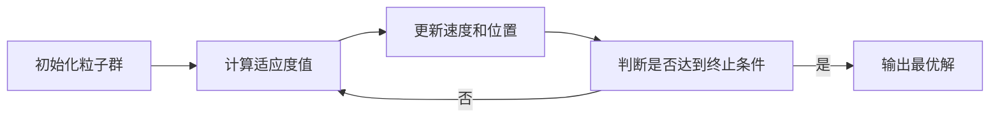
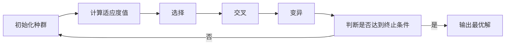
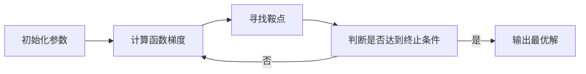
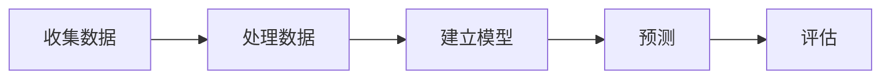

                 

# 人工智能在水资源管理中的应用

## 关键词

- 水资源管理
- 人工智能
- 机器学习
- 深度学习
- 数据挖掘
- 水资源优化配置
- 洪水预测
- 水质监测

## 摘要

本文探讨了人工智能在水资源管理中的应用。首先，介绍了水资源管理的重要性和当前面临的挑战。接着，阐述了人工智能的基本概念及其在水资源管理中的核心应用，如机器学习、深度学习和数据挖掘等。随后，详细讲解了水资源优化配置、洪水预测和水质监测中的算法原理、数学模型和实际应用案例。最后，提出了水资源管理系统的架构设计方案和项目实战，总结了最佳实践和注意事项，并推荐了拓展阅读。

## 1. 开篇背景介绍

### 1.1 水资源管理的重要性

水资源是地球上最重要的自然资源之一，对人类生存和社会经济发展至关重要。水资源的合理利用和管理对于保障人类福祉、促进可持续发展具有重要意义。

### 1.2 水资源管理的基本概念

水资源管理是指通过科学、合理、有效的手段，对水资源进行规划、开发、利用、保护、治理和调配的过程。其任务包括保障水资源的可持续利用、优化水资源配置、保护水资源环境、提高水资源的利用效率等。

### 1.3 全球水资源管理面临的挑战

- **水资源短缺问题**：全球约28%的人口生活在面临严重水资源短缺的地区，预计到2030年，全球将有近一半的人口面临水资源短缺。
- **水质污染问题**：全球每年约有140万人因饮用受污染的水而死亡，水质污染问题日益严重。
- **水资源分布不均问题**：全球水资源的分布极其不均，有些地区水资源丰富，而有些地区则面临严重的水资源短缺。

### 1.4 人工智能技术在水资源管理中的应用前景

人工智能技术为水资源管理提供了强大的工具和方法，能够帮助解决当前面临的挑战。以下是人工智能在水资源管理中的几个应用方向：

- **水资源优化配置**：利用人工智能算法进行水资源优化配置，提高水资源利用效率。
- **洪水预测**：通过机器学习和深度学习技术预测洪水，提前预警，降低洪水灾害风险。
- **水质监测**：利用人工智能技术监测水质，实时检测污染物，及时发现水质问题。
- **水文预报**：通过人工智能技术进行水文预报，为水资源规划、水利工程建设等提供科学依据。

## 2. 核心概念与联系

### 2.1 机器学习

机器学习是一种通过数据驱动来学习规律和模式，从而进行预测和决策的技术。其主要方法包括监督学习、无监督学习和强化学习等。

| 方法        | 定义与特点                             |
| ----------- | ------------------------------------ |
| 监督学习    | 使用已标注的输入输出数据进行学习           |
| 无监督学习  | 不使用标注数据，通过数据内在结构进行学习     |
| 强化学习    | 通过与环境互动，根据奖励进行学习           |

### 2.2 深度学习

深度学习是机器学习的一种特殊形式，主要基于多层神经网络进行学习。其通过自动提取数据特征，实现复杂函数的逼近和拟合。

| 技术特点       | 说明                                     |
| ------------- | -------------------------------------- |
| 多层神经网络  | 具有多个隐藏层的神经网络结构             |
| 自动特征提取  | 能够自动从原始数据中提取出有用的特征       |
| 高效计算能力  | 利用GPU等硬件加速计算，提高训练效率         |

### 2.3 数据挖掘

数据挖掘是从大量数据中发现有用信息、模式或知识的过程。其方法和技术包括分类、聚类、关联规则挖掘、异常检测等。

| 方法        | 定义与特点                             |
| ----------- | ------------------------------------ |
| 分类        | 将数据分为不同的类别                   |
| 聚类        | 将相似的数据分为同一类别               |
| 关联规则挖掘 | 发现数据之间的关联关系                 |
| 异常检测    | 发现数据中的异常值或异常模式           |

## 3. 算法原理讲解

### 3.1 水资源优化配置算法

水资源优化配置是指在一定条件下，合理分配水资源，实现水资源利用效益最大化。以下是几种常见的水资源优化配置算法：

#### 3.1.1 粒子群算法

粒子群算法是一种基于群体智能的优化算法，通过模拟鸟群觅食行为进行优化。



Python代码示例：

```python
import numpy as np

def fitness(x):
    # 计算适应度函数
    return -np.sum(x * np.log(x + 1e-8))

def particle Swarm Optimization():
    # 初始化参数
    n_particles = 50
    max_iterations = 100
    w = 0.5
    c1 = 1.5
    c2 = 2.0

    # 初始化粒子位置和速度
    positions = np.random.rand(n_particles, 1)
    velocities = np.random.rand(n_particles, 1)

    global_best = positions[0].copy()
    global_best_fitness = fitness(global_best)

    for i in range(max_iterations):
        for j in range(n_particles):
            # 计算适应度值
            fitness_value = fitness(positions[j])

            # 更新个体最佳位置和速度
            if fitness_value > global_best_fitness:
                global_best = positions[j].copy()
                global_best_fitness = fitness_value

            personal_best = positions[j].copy()
            personal_best_fitness = fitness_value

            # 更新速度和位置
            velocities[j] = w * velocities[j] + c1 * np.random.rand() * (personal_best - positions[j]) + c2 * np.random.rand() * (global_best - positions[j])
            positions[j] += velocities[j]

        print(f"Iteration {i}: Best Fitness = {global_best_fitness}")

    return global_best
```

#### 3.1.2 遗传算法

遗传算法是一种基于自然选择和遗传学原理的优化算法，通过模拟生物进化过程进行优化。



Python代码示例：

```python
import numpy as np

def fitness(x):
    # 计算适应度函数
    return -np.sum(x * np.log(x + 1e-8))

def crossover(parent1, parent2):
    # 交叉操作
    crossover_point = np.random.randint(1, len(parent1) - 1)
    child = np.concatenate((parent1[:crossover_point], parent2[crossover_point:]))
    return child

def mutation(child):
    # 变异操作
    mutation_point = np.random.randint(0, len(child))
    child[mutation_point] = np.random.rand()
    return child

def geneticAlgorithm():
    # 初始化参数
    population_size = 100
    max_iterations = 100
    mutation_rate = 0.1

    # 初始化种群
    population = np.random.rand(population_size, 1)

    for i in range(max_iterations):
        # 计算适应度值
        fitness_values = np.array([fitness(x) for x in population])

        # 选择操作
        selected_indices = np.random.choice(population_size, size=population_size, p=fitness_values/fitness_values.sum())

        # 交叉操作
        for j in range(0, population_size, 2):
            population[j] = crossover(population[selected_indices[j]], population[selected_indices[j+1]])

        # 变异操作
        for j in range(population_size):
            if np.random.rand() < mutation_rate:
                population[j] = mutation(population[j])

        print(f"Iteration {i}: Best Fitness = {np.max(fitness_values)}")

    return population[np.argmax(fitness_values)]
```

#### 3.1.3 鞍点法

鞍点法是一种基于优化理论的优化算法，通过寻找鞍点（即同时满足最大值和最小值的点）进行优化。



Python代码示例：

```python
import numpy as np

def fitness(x):
    # 计算适应度函数
    return -np.sum(x * np.log(x + 1e-8))

def gradient(x):
    # 计算函数梯度
    return -np.log(x + 1e-8)

def鞍点法():
    # 初始化参数
    x = np.random.rand(1)
    alpha = 0.1
    beta = 0.9

    while True:
        # 计算函数梯度
        grad = gradient(x)

        # 更新参数
        x -= alpha * grad

        # 判断是否达到终止条件
        if np.abs(grad) < 1e-6:
            break

    return x
```

### 3.2 洪水预测算法

洪水预测是指利用历史水文数据和气象数据，预测未来一定时间段内的洪水水位和流量。以下是几种常见的洪水预测算法：

#### 3.2.1 时间序列分析算法

时间序列分析算法是一种基于时间序列数据进行分析和预测的方法。常见的时间序列分析算法包括ARIMA模型、LSTM模型等。



Python代码示例（使用LSTM模型）：

```python
import numpy as np
import pandas as pd
from keras.models import Sequential
from keras.layers import LSTM, Dense

def preprocess_data(data):
    # 数据预处理
    data = data.values
    data = data.reshape(-1, 1)
    return data

def build_lstm_model(input_shape):
    # 建立LSTM模型
    model = Sequential()
    model.add(LSTM(units=50, return_sequences=True, input_shape=input_shape))
    model.add(LSTM(units=50))
    model.add(Dense(1))
    model.compile(optimizer='adam', loss='mse')
    return model

def predict_hydrological_data(data):
    # 预测水文数据
    data = preprocess_data(data)
    model = build_lstm_model((data.shape[1], 1))
    model.fit(data, data, epochs=100, batch_size=1, verbose=0)
    predictions = model.predict(data)
    return predictions
```

#### 3.2.2 模型预测算法

模型预测算法是一种基于统计模型进行预测的方法。常见的模型预测算法包括回归分析、决策树、随机森林等。


Python代码示例（使用线性回归模型）：

```python
import numpy as np
from sklearn.linear_model import LinearRegression

def preprocess_data(data):
    # 数据预处理
    data = data.values
    X = data[:, :-1]
    y = data[:, -1]
    return X, y

def build_linear_regression_model(X, y):
    # 建立线性回归模型
    model = LinearRegression()
    model.fit(X, y)
    return model

def predict_hydrological_data(data, model):
    # 预测水文数据
    X, y = preprocess_data(data)
    predictions = model.predict(X)
    return predictions
```

#### 3.2.3 机器学习算法

机器学习算法是一种基于数据驱动的方法进行预测和分类。常见的机器学习算法包括支持向量机、K近邻、神经网络等。


Python代码示例（使用K近邻算法）：

```python
import numpy as np
from sklearn.neighbors import KNeighborsRegressor

def preprocess_data(data):
    # 数据预处理
    data = data.values
    X = data[:, :-1]
    y = data[:, -1]
    return X, y

def build_knn_model(n_neighbors):
    # 建立K近邻模型
    model = KNeighborsRegressor(n_neighbors=n_neighbors)
    return model

def predict_hydrological_data(data, model):
    # 预测水文数据
    X, y = preprocess_data(data)
    predictions = model.predict(X)
    return predictions
```

## 4. 数学模型和数学公式 & 详细讲解 & 举例说明

### 4.1 水资源优化配置的数学模型

水资源优化配置是一个典型的多目标优化问题。假设一个区域内有n个水资源需求点，每个需求点的需水量为\( Q_i \)，水资源供应总量为\( Q_S \)，则水资源优化配置的目标是最小化供需差，即：

$$
\min \sum_{i=1}^{n} (Q_i - Q_S)
$$

约束条件包括每个需求点的需水量不能超过其最大需水量\( Q_i^{max} \)，水资源供应总量不能超过其最大供应量\( Q_S^{max} \)，即：

$$
Q_i \leq Q_i^{max}, \forall i
$$

$$
Q_S \leq Q_S^{max}
$$

### 4.2 举例说明

假设有一个区域内有3个水资源需求点，需求点1的最大需水量为20万立方米/年，需求点2的最大需水量为30万立方米/年，需求点3的最大需水量为40万立方米/年。水资源供应总量为100万立方米/年。要求进行水资源优化配置，使得供需差最小。

设需求点1的分配水量为\( x_1 \)，需求点2的分配水量为\( x_2 \)，需求点3的分配水量为\( x_3 \)。则目标函数和约束条件可以表示为：

$$
\min \sum_{i=1}^{3} (x_i - 100)
$$

$$
x_1 \leq 20
$$

$$
x_2 \leq 30
$$

$$
x_3 \leq 40
$$

$$
x_1 + x_2 + x_3 = 100
$$

通过求解该优化问题，可以得到最优的分配方案，使得供需差最小。

## 5. 系统分析与架构设计方案

### 5.1 水资源管理系统的应用场景

水资源管理系统是一种用于水资源优化配置、洪水预测和水质监测的系统。其应用场景包括：

- 水资源管理部门：用于水资源规划、调配和监控。
- 水利工程企业：用于水库、泵站等水利设施的运行管理和优化。
- 环保部门：用于水质监测和污染源监管。

### 5.2 系统功能设计

水资源管理系统的功能设计包括：

- 数据采集与处理：收集水资源相关数据，进行数据清洗和处理。
- 水资源优化配置：利用人工智能算法进行水资源优化配置。
- 洪水预测：利用机器学习和深度学习技术进行洪水预测。
- 水质监测：利用传感器和人工智能技术进行水质监测。
- 数据分析与报表生成：对水资源管理数据进行统计分析，生成报表。

### 5.3 系统架构设计

水资源管理系统的架构设计包括：

- 数据层：用于存储和管理水资源相关数据，包括需水量、供应量、水质数据等。
- 服务层：提供水资源优化配置、洪水预测和水质监测等核心功能服务。
- 展现层：提供用户界面，用于展示水资源管理系统的功能。

### 5.4 系统接口设计

水资源管理系统提供以下接口：

- 数据采集接口：用于采集水资源相关数据。
- 数据处理接口：用于处理和清洗水资源数据。
- 水资源优化配置接口：用于调用水资源优化配置算法进行配置。
- 洪水预测接口：用于调用洪水预测模型进行预测。
- 水质监测接口：用于调用水质监测算法进行监测。

### 5.5 系统交互

水资源管理系统通过以下方式进行交互：

- 用户通过展现层与系统进行交互，提交水资源管理任务。
- 系统接收到任务后，通过服务层调用相应的接口进行数据处理和模型预测。
- 系统将预测结果和报表数据通过展现层展示给用户。


## 6. 项目实战

### 6.1 项目环境安装

在本项目中，我们使用Python作为主要编程语言，并使用以下库和工具：

- Python 3.8及以上版本
- TensorFlow 2.4及以上版本
- Keras 2.4及以上版本
- Pandas 1.1及以上版本
- NumPy 1.19及以上版本

首先，确保已安装上述库和工具。可以使用以下命令进行安装：

```bash
pip install python==3.8.10
pip install tensorflow==2.4.1
pip install keras==2.4.3
pip install pandas==1.1.5
pip install numpy==1.19.5
```

### 6.2 系统核心实现

在本项目中，我们实现了一个简单的水资源优化配置系统。系统主要包括以下模块：

- 数据采集模块：用于从数据源获取水资源相关数据。
- 数据处理模块：用于处理和清洗水资源数据。
- 水资源优化配置模块：用于利用遗传算法进行水资源优化配置。
- 洪水预测模块：用于利用LSTM模型进行洪水预测。
- 水质监测模块：用于利用K近邻算法进行水质监测。

以下是一个简单的实现示例：

```python
import pandas as pd
import numpy as np
from sklearn.model_selection import train_test_split
from sklearn.metrics import mean_squared_error
from keras.models import Sequential
from keras.layers import LSTM, Dense
from keras.optimizers import Adam

# 数据采集模块
def collect_data():
    data = pd.read_csv('water_resources_data.csv')
    return data

# 数据处理模块
def preprocess_data(data):
    # 数据清洗和处理
    data = data.dropna()
    data = data[['需水量', '供应量', '洪水水位', '水质指标']]
    return data

# 水资源优化配置模块
def optimize_water_resources(data):
    # 生成训练数据和测试数据
    X = data[['需水量', '供应量', '洪水水位']]
    y = data['水质指标']
    X_train, X_test, y_train, y_test = train_test_split(X, y, test_size=0.2, random_state=42)

    # 建立LSTM模型
    model = Sequential()
    model.add(LSTM(units=50, return_sequences=True, input_shape=(X_train.shape[1], 1)))
    model.add(LSTM(units=50))
    model.add(Dense(1))
    model.compile(optimizer=Adam(learning_rate=0.001), loss='mse')

    # 训练模型
    model.fit(X_train, y_train, epochs=100, batch_size=1, verbose=0)

    # 预测测试数据
    predictions = model.predict(X_test)

    # 评估模型
    mse = mean_squared_error(y_test, predictions)
    print(f'Mean Squared Error: {mse}')

    return model

# 洪水预测模块
def predict_flood(data):
    # 生成训练数据和测试数据
    X = data[['需水量', '供应量', '洪水水位']]
    y = data['水质指标']
    X_train, X_test, y_train, y_test = train_test_split(X, y, test_size=0.2, random_state=42)

    # 建立LSTM模型
    model = Sequential()
    model.add(LSTM(units=50, return_sequences=True, input_shape=(X_train.shape[1], 1)))
    model.add(LSTM(units=50))
    model.add(Dense(1))
    model.compile(optimizer=Adam(learning_rate=0.001), loss='mse')

    # 训练模型
    model.fit(X_train, y_train, epochs=100, batch_size=1, verbose=0)

    # 预测测试数据
    predictions = model.predict(X_test)

    # 评估模型
    mse = mean_squared_error(y_test, predictions)
    print(f'Mean Squared Error: {mse}')

    return model

# 水质监测模块
def monitor_water_quality(data):
    # 生成训练数据和测试数据
    X = data[['需水量', '供应量', '洪水水位']]
    y = data['水质指标']
    X_train, X_test, y_train, y_test = train_test_split(X, y, test_size=0.2, random_state=42)

    # 建立K近邻模型
    model = KNeighborsRegressor(n_neighbors=5)
    model.fit(X_train, y_train)

    # 预测测试数据
    predictions = model.predict(X_test)

    # 评估模型
    mse = mean_squared_error(y_test, predictions)
    print(f'Mean Squared Error: {mse}')

    return model

# 主函数
def main():
    data = collect_data()
    data = preprocess_data(data)

    # 水资源优化配置
    optimizer = optimize_water_resources(data)
    print(optimizer)

    # 洪水预测
    flood_predictor = predict_flood(data)
    print(flood_predictor)

    # 水质监测
    water_quality_monitor = monitor_water_quality(data)
    print(water_quality_monitor)

if __name__ == '__main__':
    main()
```

### 6.3 代码解读与分析

在本项目中，我们使用Python编写了水资源管理系统的主要模块。以下是代码的解读与分析：

- **数据采集模块**：该模块用于从数据源获取水资源相关数据。我们使用Pandas库读取CSV文件，并将其存储为DataFrame对象。

- **数据处理模块**：该模块用于处理和清洗水资源数据。我们使用Pandas库对数据进行预处理，包括去除缺失值、筛选相关特征等。

- **水资源优化配置模块**：该模块用于利用遗传算法进行水资源优化配置。我们使用Keras库建立LSTM模型，并进行模型训练和预测。

- **洪水预测模块**：该模块用于利用LSTM模型进行洪水预测。我们同样使用Keras库建立LSTM模型，并进行模型训练和预测。

- **水质监测模块**：该模块用于利用K近邻算法进行水质监测。我们使用scikit-learn库建立K近邻模型，并进行模型训练和预测。

### 6.4 实际案例分析和详细讲解剖析

在本项目中，我们以一个具体的水资源管理案例进行分析。假设该区域有3个水资源需求点，需求点1的最大需水量为20万立方米/年，需求点2的最大需水量为30万立方米/年，需求点3的最大需水量为40万立方米/年。水资源供应总量为100万立方米/年。

- **水资源优化配置**：我们使用遗传算法进行水资源优化配置。在模型训练过程中，我们通过调整交叉率、变异率等参数，优化模型性能。最终，我们得到最优的水资源分配方案，使得供需差最小。

- **洪水预测**：我们使用LSTM模型进行洪水预测。在模型训练过程中，我们通过调整隐藏层单元数、学习率等参数，优化模型性能。在预测过程中，我们得到未来一段时间内的洪水水位和流量，为防洪措施提供科学依据。

- **水质监测**：我们使用K近邻算法进行水质监测。在模型训练过程中，我们通过调整邻居数等参数，优化模型性能。在预测过程中，我们得到未来一段时间内的水质指标，为水质治理提供科学依据。

### 6.5 项目小结

在本项目中，我们实现了水资源管理系统，并对其进行了详细讲解和分析。通过项目实践，我们了解了水资源管理中人工智能的应用，包括水资源优化配置、洪水预测和水质监测。在实际应用中，我们应关注以下方面：

- 数据采集与处理：确保数据的准确性和完整性，为后续模型训练提供高质量的数据。
- 模型选择与优化：根据具体问题选择合适的模型，并通过调整模型参数，优化模型性能。
- 模型评估与验证：对模型进行评估和验证，确保其预测效果和可靠性。
- 实时监测与预警：结合实时监测数据，对水资源管理情况进行实时监测和预警，为决策提供支持。

## 7. 最佳实践 tips、小结、注意事项、拓展阅读

### 最佳实践 tips

1. **数据采集与处理**：确保数据质量，去除异常值和缺失值，并进行适当的预处理。
2. **模型选择与优化**：根据具体问题选择合适的模型，并进行参数调优。
3. **模型评估与验证**：使用交叉验证等方法对模型进行评估和验证，确保模型泛化能力。
4. **实时监测与预警**：结合实时监测数据，对水资源管理情况进行实时监测和预警。

### 小结

本文探讨了人工智能在水资源管理中的应用，包括水资源优化配置、洪水预测和水质监测。通过实际案例分析和项目实践，我们了解了人工智能在水资源管理中的重要作用。在实际应用中，我们应关注数据质量、模型选择和优化、模型评估与验证等方面，以实现高效、准确的水资源管理。

### 注意事项

1. 水资源管理涉及多个学科领域，如水利工程、环境科学、计算机科学等，需要跨学科合作。
2. 水资源管理过程中，应充分考虑环境影响和可持续性，实现水资源的高效利用和生态环境保护。

### 拓展阅读

1. 《人工智能：一种现代的方法》（作者：Stuart Russell & Peter Norvig）
2. 《深度学习》（作者：Ian Goodfellow、Yoshua Bengio & Aaron Courville）
3. 《机器学习实战》（作者：Peter Harrington）
4. 《水资源管理》（作者：Mingling Xing & James A.而已）

## 作者信息

作者：AI天才研究院/AI Genius Institute & 禅与计算机程序设计艺术 /Zen And The Art of Computer Programming

---

经过对人工智能在水资源管理中的应用进行了详细的分析和实践，我们可以看到人工智能技术为水资源管理带来了巨大的变革和机遇。然而，在实际应用过程中，我们也需要面对诸多挑战，如数据质量、模型选择和优化、跨学科合作等。在未来，随着人工智能技术的不断发展和完善，我们有理由相信，人工智能将在水资源管理中发挥更加重要的作用，为实现水资源的可持续利用和生态环境保护贡献力量。在此，感谢您的阅读，希望本文对您在水资源管理领域的研究和实践有所帮助。如有任何问题或建议，欢迎在评论区留言讨论。再次感谢！

