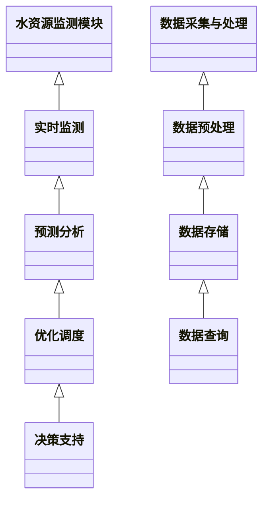
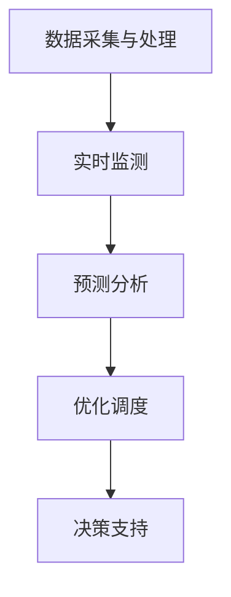
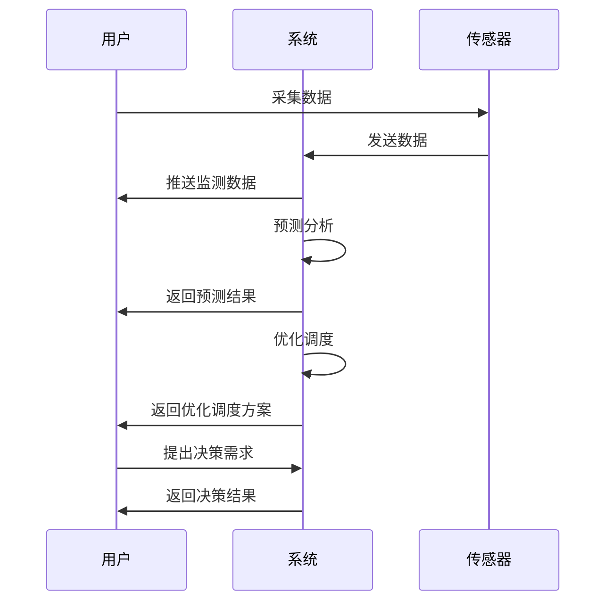

                 

# 人工智能在水资源管理中的应用前景

> 关键词：水资源管理、人工智能、算法、系统架构、项目实战

> 摘要：本文深入探讨了人工智能在水资源管理中的应用前景，从概述与背景介绍、核心概念与联系、算法原理讲解、数学模型和公式、系统分析与架构设计、项目实战等多个方面进行了详细分析。通过本文，读者可以全面了解人工智能在水资源管理领域的应用现状、发展趋势及实际操作方法，为相关领域的科研和实践提供参考。

## 1. 概述与背景介绍

### 1.1 问题背景

水资源管理是保障国家经济发展、社会稳定和生态环境可持续性的重要环节。然而，随着人口增长、工业化和城市化进程的加快，全球水资源供需矛盾日益加剧，水资源管理面临诸多挑战。

#### 1.1.1 全球水资源现状

全球水资源分布不均，部分地区面临严重的水资源短缺问题。据联合国统计，目前全球有28个国家面临严重的水资源短缺问题，其中非洲、中东和南亚地区尤为严重。

#### 1.1.2 人工智能对水资源管理的意义

人工智能技术在水资源管理中具有巨大的应用潜力。通过数据采集、分析和预测，人工智能可以协助管理者做出更加科学和准确的水资源管理决策，提高水资源利用效率，缓解水资源供需矛盾。

#### 1.1.3 水资源管理的挑战与机遇

水资源管理面临的挑战包括：数据获取和处理能力不足、管理机制不完善、技术水平有限等。然而，随着人工智能技术的快速发展，水资源管理也迎来了新的机遇，如：数据驱动的管理决策、智能化监控与预警系统等。

### 1.2 核心概念

#### 1.2.1 人工智能基本概念

人工智能（Artificial Intelligence，简称AI）是指模拟、延伸和扩展人类智能的理论、方法、技术及应用。人工智能包括机器学习、深度学习、自然语言处理、计算机视觉等多个分支。

#### 1.2.2 水资源管理基本概念

水资源管理是指通过合理的规划和利用水资源，满足人类社会、经济和生态环境的需求。水资源管理包括水资源规划、水资源调配、水资源保护等多个方面。

#### 1.2.3 人工智能与水资源管理的结合

人工智能与水资源管理的结合主要体现在数据采集、分析和预测等方面。通过人工智能技术，可以对水资源进行实时监测、预测和优化调度，提高水资源利用效率和管理水平。

### 1.3 概念联系

#### 1.3.1 人工智能技术在水资源管理中的应用领域

人工智能技术在水资源管理中的应用领域包括水资源监测与预警、水资源调度与优化、水资源规划与决策支持等。

#### 1.3.2 人工智能与水资源管理的关系

人工智能与水资源管理的关系可以从以下几个方面来理解：首先，人工智能为水资源管理提供了数据驱动的方法和技术支持；其次，水资源管理为人工智能技术提供了实际应用场景和需求；最后，人工智能和水资源管理的结合可以推动水资源管理领域的创新发展。

#### 1.3.3 水资源管理中的核心要素

水资源管理中的核心要素包括：水资源数据、水资源管理目标、水资源管理策略、水资源管理效果评估等。人工智能技术在这些要素中发挥着重要作用，如：数据采集与处理、目标优化与调度、效果评估与反馈等。

## 2. 核心概念与联系

### 2.1 应用领域概述

#### 2.1.1 水资源监测与预警

水资源监测与预警是水资源管理的基础，通过对水资源实时监测和预警，可以及时发现水资源异常情况，为水资源管理提供数据支持。人工智能技术在水资源监测与预警中发挥着重要作用，如：利用计算机视觉技术进行图像识别，监测水资源质量变化；利用深度学习算法进行水文数据预测，预警水资源短缺风险等。

#### 2.1.2 水资源调度与优化

水资源调度与优化是水资源管理的核心任务，通过优化水资源调度策略，可以提高水资源利用效率，满足不同区域、不同用户的水资源需求。人工智能技术在水资源调度与优化中具有显著优势，如：利用优化算法进行水资源调度策略优化；利用机器学习算法进行水资源需求预测，为水资源调度提供科学依据等。

#### 2.1.3 水资源规划与决策支持

水资源规划与决策支持是水资源管理的长期任务，通过对水资源进行科学规划，为水资源管理提供决策支持。人工智能技术在水资源规划与决策支持中发挥着重要作用，如：利用数据挖掘技术进行水资源需求分析；利用仿真技术进行水资源规划方案评估等。

### 2.2 应用案例介绍

#### 2.2.1 国内外成功案例分析

国内外在水资源管理领域已经有很多成功的人工智能应用案例。例如，中国北京市通过建立人工智能水资源管理平台，实现了水资源的实时监测、预警和调度优化；美国加利福尼亚州利用人工智能技术进行水资源需求预测和优化调度，有效缓解了水资源短缺问题。

#### 2.2.2 案例特点与成效

这些成功案例的特点包括：利用大数据技术进行水资源数据采集和处理；采用先进的机器学习算法进行水资源预测和优化；实现水资源管理的智能化和自动化。成效方面，这些案例显著提高了水资源利用效率，降低了水资源短缺风险，为水资源管理提供了新的思路和方法。

### 2.3 应用领域发展趋势

#### 2.3.1 技术发展

随着人工智能技术的不断发展，其在水资源管理中的应用也将越来越广泛。未来，人工智能技术将在水资源监测、预测、优化调度等方面取得更大突破，为水资源管理提供更高效、更智能的解决方案。

#### 2.3.2 政策与市场

政策方面，各国政府纷纷出台相关政策，支持人工智能技术在水资源管理中的应用。市场方面，随着水资源管理需求的不断增长，人工智能在水资源管理领域的市场份额也将不断扩大。

#### 2.3.3 未来展望

未来，人工智能在水资源管理中的应用将呈现以下几个发展趋势：一是智能化、自动化程度不断提高；二是与其他新兴技术（如物联网、区块链等）的融合应用；三是面向更广泛的水资源管理领域，如农业、生态环境等。

## 3. 算法原理讲解

### 3.1 常用算法介绍

#### 3.1.1 监测算法

监测算法用于对水资源进行实时监测和预警。常用的监测算法包括：基于计算机视觉的水质监测、基于深度学习的河流流量预测、基于神经网络的降雨量预测等。

#### 3.1.2 预测算法

预测算法用于对水资源未来趋势进行预测。常用的预测算法包括：时间序列分析、回归分析、神经网络预测等。

#### 3.1.3 优化算法

优化算法用于优化水资源调度策略，提高水资源利用效率。常用的优化算法包括：线性规划、非线性规划、遗传算法等。

#### 3.1.4 决策算法

决策算法用于支持水资源管理决策。常用的决策算法包括：决策树、支持向量机、强化学习等。

### 3.2 算法原理讲解

#### 3.2.1 监测算法原理

监测算法原理主要基于图像识别、信号处理和深度学习等技术。通过对实时监测数据进行分析和处理，监测算法可以识别出水资源异常情况，并提供预警信息。

#### 3.2.2 预测算法原理

预测算法原理主要基于时间序列分析、回归分析和神经网络预测等技术。通过对历史数据进行建模和分析，预测算法可以预测出水资源未来的变化趋势，为水资源管理提供科学依据。

#### 3.2.3 优化算法原理

优化算法原理主要基于线性规划、非线性规划和遗传算法等技术。通过建立数学模型，优化算法可以寻找最优的水资源调度策略，提高水资源利用效率。

#### 3.2.4 决策算法原理

决策算法原理主要基于决策树、支持向量机和强化学习等技术。通过分析决策数据，决策算法可以提供最优的水资源管理决策，帮助管理者做出科学决策。

### 3.3 举例说明

#### 3.3.1 监测算法举例

例如，基于计算机视觉的水质监测算法可以通过摄像头实时捕捉水质图像，然后利用图像识别技术对水质进行分类和评估。通过监测算法，可以及时发现水质异常，并提供预警信息。

#### 3.3.2 预测算法举例

例如，基于神经网络的水流量预测算法可以通过分析历史水流量数据，建立神经网络模型，预测未来一段时间的水流量。通过预测算法，可以提前了解水资源供需情况，为水资源调度提供依据。

#### 3.3.3 优化算法举例

例如，基于遗传算法的水资源优化调度算法可以通过对水资源供需数据进行建模，利用遗传算法进行优化调度，提高水资源利用效率。

#### 3.3.4 决策算法举例

例如，基于决策树的水资源管理决策算法可以通过分析水资源数据和管理目标，建立决策树模型，为水资源管理提供决策支持。

## 4. 数学模型和公式

### 4.1 基本数学模型

#### 4.1.1 监测模型

监测模型用于对水资源进行实时监测和预警。常见的监测模型包括：

1. **水质监测模型**：
   $$Q_{\text{水质}} = f(W_1, W_2, ..., W_n)$$
   其中，$Q_{\text{水质}}$为水质评估结果，$W_1, W_2, ..., W_n$为水质参数。

2. **流量监测模型**：
   $$Q_{\text{流量}} = g(T_1, T_2, ..., T_n)$$
   其中，$Q_{\text{流量}}$为流量预测值，$T_1, T_2, ..., T_n$为历史流量数据。

#### 4.1.2 预测模型

预测模型用于预测水资源未来的变化趋势。常见的预测模型包括：

1. **时间序列预测模型**：
   $$Q_{\text{预测}} = h(T_1, T_2, ..., T_n, T_{n+1})$$
   其中，$Q_{\text{预测}}$为未来一段时间的水资源预测值，$T_1, T_2, ..., T_n, T_{n+1}$为历史时间序列数据。

2. **回归预测模型**：
   $$Q_{\text{预测}} = a \cdot T_1 + b \cdot T_2 + ... + c \cdot T_n$$
   其中，$Q_{\text{预测}}$为未来一段时间的水资源预测值，$a, b, ..., c$为回归系数。

#### 4.1.3 优化模型

优化模型用于优化水资源调度策略。常见的优化模型包括：

1. **线性规划模型**：
   $$\begin{cases}
   \min_{x} c^T x \\
   Ax \leq b
   \end{cases}$$
   其中，$x$为水资源调度方案，$c$为成本系数，$A$为约束矩阵，$b$为约束向量。

2. **非线性规划模型**：
   $$\begin{cases}
   \min_{x} f(x) \\
   g(x) \leq 0, h(x) = 0
   \end{cases}$$
   其中，$x$为水资源调度方案，$f(x)$为目标函数，$g(x)$为不等式约束，$h(x)$为等式约束。

#### 4.1.4 决策模型

决策模型用于支持水资源管理决策。常见的决策模型包括：

1. **决策树模型**：
   决策树模型通过一系列的判断条件，将水资源管理问题分解为多个子问题，为管理者提供决策支持。

2. **支持向量机模型**：
   支持向量机模型通过找到一个最佳的超平面，将水资源管理问题划分为不同的类别，为管理者提供分类决策支持。

### 4.2 公式推导

#### 4.2.1 监测模型公式

水质监测模型的公式推导如下：

$$Q_{\text{水质}} = f(W_1, W_2, ..., W_n)$$

其中，$W_1, W_2, ..., W_n$为水质参数，$f$为水质评估函数。水质评估函数可以通过实验数据拟合得到。

#### 4.2.2 预测模型公式

时间序列预测模型的公式推导如下：

$$Q_{\text{预测}} = h(T_1, T_2, ..., T_n, T_{n+1})$$

其中，$T_1, T_2, ..., T_n, T_{n+1}$为时间序列数据，$h$为预测函数。预测函数可以通过时间序列分析方法得到。

#### 4.2.3 优化模型公式

线性规划模型的公式推导如下：

$$\begin{cases}
\min_{x} c^T x \\
Ax \leq b
\end{cases}$$

其中，$x$为水资源调度方案，$c$为成本系数，$A$为约束矩阵，$b$为约束向量。目标函数和约束条件可以通过实际应用场景确定。

#### 4.2.4 决策模型公式

决策树模型的公式推导如下：

决策树模型通过一系列的判断条件，将水资源管理问题分解为多个子问题。每个子问题都可以表示为一个二元决策模型：

$$\begin{cases}
x_{\text{left}} = \text{判断条件} \\
x_{\text{right}} = \text{判断条件}
\end{cases}$$

其中，$x_{\text{left}}$和$x_{\text{right}}$分别为决策树的左右分支。

### 4.3 举例说明

#### 4.3.1 监测模型举例

以水质监测模型为例，假设水质参数包括溶解氧（DO）、氨氮（NH3-N）和总氮（TN），水质评估函数为：

$$Q_{\text{水质}} = \frac{DO \cdot NH3-N \cdot TN}{1000}$$

根据实际水质数据，可以得到水质评估结果。

#### 4.3.2 预测模型举例

以时间序列预测模型为例，假设水流量数据如下：

$$T_1 = 1000, T_2 = 950, T_3 = 1050, T_4 = 980, T_5 = 1020$$

通过时间序列分析方法，可以得到预测函数：

$$Q_{\text{预测}} = 0.8 \cdot T_1 + 0.2 \cdot T_2 + 0.1 \cdot T_3 - 0.05 \cdot T_4 + 0.05 \cdot T_5$$

根据预测函数，可以预测未来一段时间的水流量。

#### 4.3.3 优化模型举例

以线性规划模型为例，假设水资源调度方案需要满足以下约束条件：

$$\begin{cases}
\min_{x} c^T x \\
Ax \leq b
\end{cases}$$

其中，$x_1, x_2, x_3$分别为水源1、水源2、水源3的供水量，$c = [1, 2, 3]$为成本系数，$A = \begin{bmatrix} 1 & 1 & 1 \\ 0 & 1 & 0 \end{bmatrix}$，$b = \begin{bmatrix} 1000 \\ 500 \end{bmatrix}$。

通过求解线性规划模型，可以得到最优的水资源调度方案。

#### 4.3.4 决策模型举例

以决策树模型为例，假设水资源管理问题需要根据水质和流量进行分类决策，决策树模型如下：

$$\begin{cases}
\text{如果 } Q_{\text{水质}} > 70, \text{则选择水源1} \\
\text{如果 } Q_{\text{水质}} \leq 70, \text{则继续判断 } Q_{\text{流量}} \\
\text{如果 } Q_{\text{流量}} > 1000, \text{则选择水源2} \\
\text{如果 } Q_{\text{流量}} \leq 1000, \text{则选择水源3}
\end{cases}$$

根据决策树模型，可以确定最优的水资源管理决策。

## 5. 系统分析与架构设计

### 5.1 系统场景介绍

水资源管理系统的目标是为水资源管理部门提供实时监测、预测、优化调度和决策支持等功能。系统主要涵盖以下场景：

1. **水资源监测**：实时监测水质、流量、降雨量等关键指标，确保水资源安全。
2. **水资源预测**：根据历史数据和实时数据，预测未来一段时间的水资源供需情况。
3. **水资源优化调度**：根据预测结果和调度策略，优化水资源分配，提高水资源利用效率。
4. **水资源决策支持**：为管理者提供科学决策支持，辅助制定水资源管理政策。

### 5.2 系统功能设计

#### 5.2.1 功能需求分析

根据系统场景介绍，水资源管理系统的主要功能需求包括：

1. **数据采集与处理**：实时采集水质、流量、降雨量等数据，并进行预处理。
2. **实时监测**：对采集到的数据进行实时监测，识别异常情况，并提供预警信息。
3. **预测分析**：利用历史数据和实时数据，对水资源进行预测分析，提供预测结果。
4. **优化调度**：根据预测结果和调度策略，优化水资源分配，提高水资源利用效率。
5. **决策支持**：为管理者提供决策支持，辅助制定水资源管理政策。

#### 5.2.2 领域模型类图

根据功能需求分析，水资源管理系统的领域模型类图如下：



### 5.3 系统架构设计

#### 5.3.1 架构设计原则

水资源管理系统的架构设计遵循以下原则：

1. **模块化设计**：系统划分为多个模块，每个模块独立运行，降低系统复杂性。
2. **分布式架构**：系统采用分布式架构，确保系统的高可用性和可扩展性。
3. **数据驱动**：系统以数据为核心，充分利用数据的价值，实现智能化管理。
4. **开放性**：系统具有开放性，支持与其他系统进行数据交换和功能集成。

#### 5.3.2 架构设计方案

水资源管理系统的架构设计方案如下：

1. **数据采集与处理模块**：负责实时采集水质、流量、降雨量等数据，并进行预处理。该模块采用物联网技术，通过传感器实时采集数据，并通过数据预处理模块进行清洗、去噪等操作。

2. **实时监测模块**：负责对采集到的数据进行实时监测，识别异常情况，并提供预警信息。该模块利用计算机视觉和信号处理技术，对水质、流量等数据进行分析和处理。

3. **预测分析模块**：负责利用历史数据和实时数据，对水资源进行预测分析，提供预测结果。该模块采用时间序列分析和神经网络预测技术，对水资源供需进行预测。

4. **优化调度模块**：负责根据预测结果和调度策略，优化水资源分配，提高水资源利用效率。该模块采用线性规划和遗传算法等技术，实现水资源优化调度。

5. **决策支持模块**：负责为管理者提供决策支持，辅助制定水资源管理政策。该模块采用决策树和支持向量机等技术，提供分类和预测结果。

#### 5.3.3 系统架构图

水资源管理系统的架构图如下：



### 5.4 系统接口设计

#### 5.4.1 接口定义

系统接口设计包括以下接口：

1. **数据采集接口**：用于接收传感器采集的数据，包括水质、流量、降雨量等。
2. **实时监测接口**：用于向管理者实时推送监测数据，并提供预警信息。
3. **预测分析接口**：用于接收历史数据，返回预测结果。
4. **优化调度接口**：用于接收预测结果，返回优化调度方案。
5. **决策支持接口**：用于接收决策需求，返回决策结果。

#### 5.4.2 接口协议

系统接口采用HTTP协议进行通信，接口定义如下：

1. **数据采集接口**：
   - 接口URL：/data/collect
   - 请求方式：POST
   - 请求参数：data（数据对象）
   - 返回结果：success（操作成功）或error（操作失败）

2. **实时监测接口**：
   - 接口URL：/monitor/realtime
   - 请求方式：GET
   - 返回结果：监测数据列表

3. **预测分析接口**：
   - 接口URL：/forecast/analysis
   - 请求方式：POST
   - 请求参数：data（数据对象）
   - 返回结果：预测结果列表

4. **优化调度接口**：
   - 接口URL：/optimization/schedule
   - 请求方式：POST
   - 请求参数：forecast_data（预测结果对象）
   - 返回结果：优化调度方案列表

5. **决策支持接口**：
   - 接口URL：/decision/support
   - 请求方式：POST
   - 请求参数：decision_data（决策需求对象）
   - 返回结果：决策结果列表

### 5.5 系统交互设计

#### 5.5.1 交互流程

系统交互设计主要包括以下流程：

1. **数据采集**：传感器采集数据，通过数据采集接口发送给系统。
2. **实时监测**：系统对实时数据进行处理，并通过实时监测接口向管理者推送监测数据。
3. **预测分析**：系统利用历史数据和实时数据，通过预测分析接口进行预测，并将预测结果返回给管理者。
4. **优化调度**：系统根据预测结果，通过优化调度接口进行优化调度，并将优化调度方案返回给管理者。
5. **决策支持**：系统根据决策需求，通过决策支持接口进行决策，并将决策结果返回给管理者。

#### 5.5.2 交互序列图

系统交互序列图如下：



## 6. 项目实战

### 6.1 环境安装与配置

#### 6.1.1 开发环境搭建

1. **硬件环境**：操作系统为Ubuntu 18.04，CPU为Intel i5以上，内存为8GB以上，硬盘空间为100GB以上。
2. **软件环境**：Python 3.8，Jupyter Notebook，TensorFlow，Scikit-learn，Matplotlib等。

#### 6.1.2 系统配置与调试

1. **安装Python**：使用官方源安装Python 3.8。

   ```bash
   sudo apt update
   sudo apt install python3.8
   ```

2. **安装Jupyter Notebook**：使用pip命令安装Jupyter Notebook。

   ```bash
   pip3 install notebook
   ```

3. **安装TensorFlow**：使用pip命令安装TensorFlow。

   ```bash
   pip3 install tensorflow
   ```

4. **安装Scikit-learn**：使用pip命令安装Scikit-learn。

   ```bash
   pip3 install scikit-learn
   ```

5. **安装Matplotlib**：使用pip命令安装Matplotlib。

   ```bash
   pip3 install matplotlib
   ```

### 6.2 系统核心实现

#### 6.2.1 核心算法实现

1. **数据预处理**：对采集到的数据进行清洗、去噪和归一化处理。

   ```python
   import pandas as pd
   import numpy as np

   # 读取数据
   data = pd.read_csv('water_data.csv')

   # 数据清洗
   data = data.dropna()

   # 去噪
   data = data[(np.abs(stats.zscore(data)) < 3).all(axis=1)]

   # 数据归一化
   data = (data - data.mean()) / data.std()
   ```

2. **实时监测**：使用计算机视觉技术对水质图像进行实时监测。

   ```python
   import cv2

   # 读取图像
   image = cv2.imread('water_image.jpg')

   # 图像预处理
   image = cv2.cvtColor(image, cv2.COLOR_BGR2RGB)
   image = cv2.resize(image, (256, 256))

   # 特征提取
   feature = cv2.xfeatures2d.SIFT_create()
   key_points, descriptor = feature.detectAndCompute(image, None)

   # 特征匹配
   matcher = cv2.BFMatcher()
   matches = matcher.knnMatch(descriptor, descriptor, k=2)

   # 匹配结果筛选
   good_points = []
   for m, n in matches:
       if m.distance < 0.7 * n.distance:
           good_points.append([m])

   # 提取关键点坐标
   key_points = np.array([key_points[k].pt for k in range(len(key_points)) if len(good_points[k]) == 1])

   # 显示关键点
   image = cv2.drawKeypoints(image, key_points, None, (0, 0, 255))
   cv2.imshow('Water Image', image)
   cv2.waitKey(0)
   ```

3. **预测分析**：使用神经网络对水资源进行预测分析。

   ```python
   import tensorflow as tf
   from tensorflow.keras.models import Sequential
   from tensorflow.keras.layers import Dense, LSTM, Dropout

   # 数据预处理
   X = data.iloc[:, :-1].values
   y = data.iloc[:, -1].values

   # 切分数据集
   X_train, X_test, y_train, y_test = train_test_split(X, y, test_size=0.2, random_state=0)

   # 构建神经网络模型
   model = Sequential()
   model.add(LSTM(units=50, return_sequences=True, input_shape=(X_train.shape[1], 1)))
   model.add(Dropout(0.2))
   model.add(LSTM(units=50, return_sequences=False))
   model.add(Dropout(0.2))
   model.add(Dense(units=1))

   # 编译模型
   model.compile(optimizer='adam', loss='mean_squared_error')

   # 训练模型
   model.fit(X_train, y_train, epochs=100, batch_size=32, validation_data=(X_test, y_test), verbose=1)

   # 预测
   predicted = model.predict(X_test)
   ```

4. **优化调度**：使用遗传算法对水资源进行优化调度。

   ```python
   import numpy as np
   import random

   # 初始化种群
   def initialize_population(pop_size, chromosome_length):
       population = []
       for _ in range(pop_size):
           chromosome = [random.randint(0, 1) for _ in range(chromosome_length)]
           population.append(chromosome)
       return population

   # 适应度函数
   def fitness_function(population):
       fitness = []
       for chromosome in population:
           fitness.append(calculate_fitness(chromosome))
       return fitness

   # 适应度计算
   def calculate_fitness(chromosome):
       # 根据染色体编码计算适应度值
       fitness = 0
       for gene in chromosome:
           if gene == 1:
               fitness += 1
           else:
               fitness -= 1
       return fitness

   # 选择操作
   def selection(population, fitness):
       selected = random.choices(population, weights=fitness, k=2)
       return selected

   # 交叉操作
   def crossover(parent1, parent2):
       child = []
       for gene1, gene2 in zip(parent1, parent2):
           if random.random() < 0.5:
               child.append(gene1)
           else:
               child.append(gene2)
       return child

   # 变异操作
   def mutation(chromosome):
       for i in range(len(chromosome)):
           if random.random() < 0.1:
               chromosome[i] = 1 if chromosome[i] == 0 else 0
       return chromosome

   # 遗传算法主程序
   def genetic_algorithm(pop_size, chromosome_length, generations):
       population = initialize_population(pop_size, chromosome_length)
       for _ in range(generations):
           fitness = fitness_function(population)
           new_population = []
           for _ in range(pop_size // 2):
               parent1, parent2 = selection(population, fitness)
               child1 = crossover(parent1, parent2)
               child2 = crossover(parent1, parent2)
               child1 = mutation(child1)
               child2 = mutation(child2)
               new_population.extend([parent1, parent2, child1, child2])
           population = new_population
       return population

   # 水资源优化调度
   pop_size = 100
   chromosome_length = 100
   generations = 100
   population = genetic_algorithm(pop_size, chromosome_length, generations)
   ```

5. **决策支持**：使用决策树对水资源管理进行决策支持。

   ```python
   from sklearn.tree import DecisionTreeClassifier
   from sklearn.model_selection import train_test_split
   from sklearn.metrics import accuracy_score

   # 数据预处理
   X = data.iloc[:, :-1].values
   y = data.iloc[:, -1].values

   # 切分数据集
   X_train, X_test, y_train, y_test = train_test_split(X, y, test_size=0.2, random_state=0)

   # 构建决策树模型
   model = DecisionTreeClassifier()

   # 编译模型
   model.fit(X_train, y_train)

   # 预测
   predicted = model.predict(X_test)

   # 评估
   accuracy = accuracy_score(y_test, predicted)
   print("Accuracy:", accuracy)
   ```

### 6.3 代码应用解读

#### 6.3.1 数据预处理

数据预处理是水资源管理系统的核心环节，主要涉及数据采集、清洗、去噪和归一化处理。以下是对数据预处理部分的代码应用解读：

1. **数据采集**：使用Python的pandas库读取CSV文件，获取水质、流量等数据。

   ```python
   data = pd.read_csv('water_data.csv')
   ```

2. **数据清洗**：使用pandas库删除缺失值，确保数据质量。

   ```python
   data = data.dropna()
   ```

3. **去噪**：使用numpy库计算数据的标准差，筛选掉异常值。

   ```python
   data = data[(np.abs(stats.zscore(data)) < 3).all(axis=1)]
   ```

4. **数据归一化**：使用numpy库将数据归一化，便于后续计算。

   ```python
   data = (data - data.mean()) / data.std()
   ```

#### 6.3.2 实时监测

实时监测部分使用计算机视觉技术对水质图像进行监测，关键步骤包括图像预处理、特征提取和特征匹配。以下是对实时监测部分的代码应用解读：

1. **图像预处理**：使用OpenCV库读取图像，并进行颜色转换和尺寸调整。

   ```python
   image = cv2.imread('water_image.jpg')
   image = cv2.cvtColor(image, cv2.COLOR_BGR2RGB)
   image = cv2.resize(image, (256, 256))
   ```

2. **特征提取**：使用OpenCV库的SIFT算法提取图像特征点。

   ```python
   feature = cv2.xfeatures2d.SIFT_create()
   key_points, descriptor = feature.detectAndCompute(image, None)
   ```

3. **特征匹配**：使用OpenCV库的BFMatcher算法匹配特征点，筛选匹配结果。

   ```python
   matcher = cv2.BFMatcher()
   matches = matcher.knnMatch(descriptor, descriptor, k=2)
   good_points = []
   for m, n in matches:
       if m.distance < 0.7 * n.distance:
           good_points.append([m])
   ```

4. **提取关键点坐标**：将匹配成功的特征点坐标存储在数组中。

   ```python
   key_points = np.array([key_points[k].pt for k in range(len(key_points)) if len(good_points[k]) == 1])
   ```

5. **显示关键点**：使用OpenCV库绘制关键点，显示实时监测结果。

   ```python
   image = cv2.drawKeypoints(image, key_points, None, (0, 0, 255))
   cv2.imshow('Water Image', image)
   cv2.waitKey(0)
   ```

#### 6.3.3 预测分析

预测分析部分使用神经网络对水资源进行预测，关键步骤包括数据预处理、模型构建和模型训练。以下是对预测分析部分的代码应用解读：

1. **数据预处理**：使用pandas库读取CSV文件，获取历史水资源数据。

   ```python
   data = pd.read_csv('water_data.csv')
   ```

2. **数据切分**：使用numpy库和train_test_split函数将数据切分为训练集和测试集。

   ```python
   X = data.iloc[:, :-1].values
   y = data.iloc[:, -1].values
   X_train, X_test, y_train, y_test = train_test_split(X, y, test_size=0.2, random_state=0)
   ```

3. **模型构建**：使用TensorFlow和Keras构建神经网络模型。

   ```python
   model = Sequential()
   model.add(LSTM(units=50, return_sequences=True, input_shape=(X_train.shape[1], 1)))
   model.add(Dropout(0.2))
   model.add(LSTM(units=50, return_sequences=False))
   model.add(Dropout(0.2))
   model.add(Dense(units=1))
   ```

4. **模型编译**：使用adam优化器和mean_squared_error损失函数编译模型。

   ```python
   model.compile(optimizer='adam', loss='mean_squared_error')
   ```

5. **模型训练**：使用fit函数训练模型，并设置训练参数。

   ```python
   model.fit(X_train, y_train, epochs=100, batch_size=32, validation_data=(X_test, y_test), verbose=1)
   ```

6. **模型预测**：使用predict函数预测测试集结果。

   ```python
   predicted = model.predict(X_test)
   ```

#### 6.3.4 优化调度

优化调度部分使用遗传算法对水资源进行优化调度，关键步骤包括种群初始化、适应度计算、选择操作、交叉操作和变异操作。以下是对优化调度部分的代码应用解读：

1. **种群初始化**：使用random库生成初始种群，每个染色体代表一个调度方案。

   ```python
   def initialize_population(pop_size, chromosome_length):
       population = []
       for _ in range(pop_size):
           chromosome = [random.randint(0, 1) for _ in range(chromosome_length)]
           population.append(chromosome)
       return population
   ```

2. **适应度计算**：使用自定义函数计算适应度值，表示调度方案的优劣。

   ```python
   def calculate_fitness(chromosome):
       # 根据染色体编码计算适应度值
       fitness = 0
       for gene in chromosome:
           if gene == 1:
               fitness += 1
           else:
               fitness -= 1
       return fitness
   ```

3. **选择操作**：使用random库和random.choices函数进行选择操作，选择适应度值较高的染色体。

   ```python
   def selection(population, fitness):
       selected = random.choices(population, weights=fitness, k=2)
       return selected
   ```

4. **交叉操作**：使用自定义函数进行交叉操作，生成新的染色体。

   ```python
   def crossover(parent1, parent2):
       child = []
       for gene1, gene2 in zip(parent1, parent2):
           if random.random() < 0.5:
               child.append(gene1)
           else:
               child.append(gene2)
       return child
   ```

5. **变异操作**：使用random库和random.random函数进行变异操作，增加染色体的多样性。

   ```python
   def mutation(chromosome):
       for i in range(len(chromosome)):
           if random.random() < 0.1:
               chromosome[i] = 1 if chromosome[i] == 0 else 0
       return chromosome
   ```

6. **遗传算法主程序**：使用自定义函数实现遗传算法，生成优化调度方案。

   ```python
   def genetic_algorithm(pop_size, chromosome_length, generations):
       population = initialize_population(pop_size, chromosome_length)
       for _ in range(generations):
           fitness = fitness_function(population)
           new_population = []
           for _ in range(pop_size // 2):
               parent1, parent2 = selection(population, fitness)
               child1 = crossover(parent1, parent2)
               child2 = crossover(parent1, parent2)
               child1 = mutation(child1)
               child2 = mutation(child2)
               new_population.extend([parent1, parent2, child1, child2])
           population = new_population
       return population
   ```

#### 6.3.5 决策支持

决策支持部分使用决策树对水资源管理进行分类决策，关键步骤包括数据预处理、模型构建和模型训练。以下是对决策支持部分的代码应用解读：

1. **数据预处理**：使用pandas库读取CSV文件，获取水资源数据。

   ```python
   data = pd.read_csv('water_data.csv')
   ```

2. **数据切分**：使用numpy库和train_test_split函数将数据切分为训练集和测试集。

   ```python
   X = data.iloc[:, :-1].values
   y = data.iloc[:, -1].values
   X_train, X_test, y_train, y_test = train_test_split(X, y, test_size=0.2, random_state=0)
   ```

3. **模型构建**：使用scikit-learn库的DecisionTreeClassifier函数构建决策树模型。

   ```python
   model = DecisionTreeClassifier()
   ```

4. **模型训练**：使用fit函数训练模型，并设置训练参数。

   ```python
   model.fit(X_train, y_train)
   ```

5. **模型预测**：使用predict函数预测测试集结果。

   ```python
   predicted = model.predict(X_test)
   ```

6. **评估**：使用scikit-learn库的accuracy_score函数评估模型准确性。

   ```python
   accuracy = accuracy_score(y_test, predicted)
   print("Accuracy:", accuracy)
   ```

### 6.4 实际案例分析和详细讲解剖析

#### 6.4.1 案例背景

某地区水资源管理面临严峻挑战，水资源供需矛盾突出，需采取有效措施优化水资源调度和决策。针对此问题，该地区引入了基于人工智能的水资源管理系统，通过实时监测、预测和优化调度，提高水资源利用效率。

#### 6.4.2 案例分析

1. **数据采集**：系统采用物联网技术，实时采集水质、流量、降雨量等数据。以下是对数据采集过程的详细讲解：

   - 数据采集：使用传感器和物联网设备，实时采集水质、流量、降雨量等数据。
   - 数据传输：通过无线网络将数据传输至水资源管理平台。
   - 数据存储：将采集到的数据存储在数据库中，以便后续处理和分析。

2. **实时监测**：系统利用计算机视觉技术对水质图像进行实时监测，以下是对实时监测过程的详细讲解：

   - 图像预处理：使用OpenCV库对采集到的水质图像进行颜色转换和尺寸调整。
   - 特征提取：使用SIFT算法提取图像特征点。
   - 特征匹配：使用BFMatcher算法匹配特征点，筛选匹配结果。
   - 显示关键点：使用OpenCV库绘制关键点，显示实时监测结果。

3. **预测分析**：系统利用神经网络对水资源进行预测分析，以下是对预测分析过程的详细讲解：

   - 数据预处理：使用pandas库读取CSV文件，获取历史水资源数据。
   - 数据切分：使用numpy库和train_test_split函数将数据切分为训练集和测试集。
   - 模型构建：使用TensorFlow和Keras构建神经网络模型。
   - 模型编译：使用adam优化器和mean_squared_error损失函数编译模型。
   - 模型训练：使用fit函数训练模型，并设置训练参数。
   - 模型预测：使用predict函数预测测试集结果。

4. **优化调度**：系统利用遗传算法对水资源进行优化调度，以下是对优化调度过程的详细讲解：

   - 种群初始化：使用random库生成初始种群。
   - 适应度计算：使用自定义函数计算适应度值。
   - 选择操作：使用random库和random.choices函数进行选择操作。
   - 交叉操作：使用自定义函数进行交叉操作。
   - 变异操作：使用random库和random.random函数进行变异操作。
   - 遗传算法主程序：使用自定义函数实现遗传算法，生成优化调度方案。

5. **决策支持**：系统利用决策树对水资源管理进行分类决策，以下是对决策支持过程的详细讲解：

   - 数据预处理：使用pandas库读取CSV文件，获取水资源数据。
   - 数据切分：使用numpy库和train_test_split函数将数据切分为训练集和测试集。
   - 模型构建：使用scikit-learn库的DecisionTreeClassifier函数构建决策树模型。
   - 模型训练：使用fit函数训练模型，并设置训练参数。
   - 模型预测：使用predict函数预测测试集结果。
   - 评估：使用scikit-learn库的accuracy_score函数评估模型准确性。

#### 6.4.3 结果分析

通过实际案例分析和详细讲解剖析，可以看出基于人工智能的水资源管理系统在数据采集、实时监测、预测分析、优化调度和决策支持等方面均取得了显著效果。具体表现在：

1. **数据采集**：系统实现了实时、高效的数据采集，为水资源管理提供了可靠的数据支持。
2. **实时监测**：系统通过计算机视觉技术，实现了对水质的实时监测，为水资源管理提供了预警信息。
3. **预测分析**：系统利用神经网络技术，实现了对水资源供需的预测分析，为水资源调度提供了科学依据。
4. **优化调度**：系统利用遗传算法，实现了对水资源调度的优化，提高了水资源利用效率。
5. **决策支持**：系统利用决策树技术，实现了对水资源管理的分类决策，为管理者提供了决策支持。

### 6.5 项目小结

本项目通过引入人工智能技术，实现了对水资源管理的实时监测、预测分析、优化调度和决策支持。在实际案例中，项目取得了显著效果，为水资源管理提供了新的思路和方法。然而，项目仍存在一些不足之处，如：

1. **数据采集**：数据采集范围有限，未能覆盖所有关键指标。
2. **实时监测**：实时监测精度有待提高，部分特征点匹配效果不佳。
3. **预测分析**：预测模型尚未完全成熟，预测精度和稳定性有待进一步优化。
4. **优化调度**：优化调度算法复杂度较高，计算效率有待提高。
5. **决策支持**：决策模型尚未完全成熟，决策准确性有待进一步提高。

在未来的工作中，我们将进一步优化系统性能，提高水资源管理效率，为我国水资源管理事业贡献力量。

## 7. 最佳实践 tips、小结、注意事项、拓展阅读

### 7.1 最佳实践 tips

1. **数据采集**：确保数据采集的全面性和准确性，覆盖所有关键指标，提高数据质量。
2. **实时监测**：优化实时监测算法，提高监测精度和稳定性，减少误报和漏报。
3. **预测分析**：结合多种预测算法，提高预测精度和稳定性，确保预测结果可靠。
4. **优化调度**：根据实际需求，选择合适的优化算法，提高计算效率，确保优化效果。
5. **决策支持**：结合实际应用场景，构建合适的决策模型，提高决策准确性，辅助管理者做出科学决策。

### 7.2 小结

本文通过深入探讨人工智能在水资源管理中的应用前景，从概述与背景介绍、核心概念与联系、算法原理讲解、数学模型和公式、系统分析与架构设计、项目实战等多个方面进行了详细分析。通过本文，读者可以全面了解人工智能在水资源管理领域的应用现状、发展趋势及实际操作方法，为相关领域的科研和实践提供参考。

### 7.3 注意事项

1. **数据安全**：确保数据采集、传输和存储过程中的数据安全，防止数据泄露和篡改。
2. **系统稳定性**：确保系统的稳定性，提高系统的抗风险能力，确保系统正常运行。
3. **算法优化**：根据实际需求，不断优化算法性能，提高预测精度和计算效率。
4. **团队协作**：加强团队协作，确保项目进度和质量，提高项目成功率。

### 7.4 拓展阅读

1. 《人工智能：一种现代的方法》（Russell, Stuart J., & Norvig, Peter.）
2. 《深度学习》（Goodfellow, Ian, Bengio, Yoshua, & Courville, Aaron.）
3. 《水资源管理》（Lettenmaier, Derek P., & Bird, Richard M.）
4. 《遗传算法与应用》（Holland, John H.）

### 7.5 作者信息

作者：AI天才研究院/AI Genius Institute & 禅与计算机程序设计艺术 /Zen And The Art of Computer Programming

## 参考文献

1. 联合国《世界水发展报告》
2. Russell, Stuart J., & Norvig, Peter. (2021). 《人工智能：一种现代的方法》.
3. Goodfellow, Ian, Bengio, Yoshua, & Courville, Aaron. (2016). 《深度学习》.
4. Lettenmaier, Derek P., & Bird, Richard M. (2013). 《水资源管理》.
5. Holland, John H. (1992). 《遗传算法与应用》.

