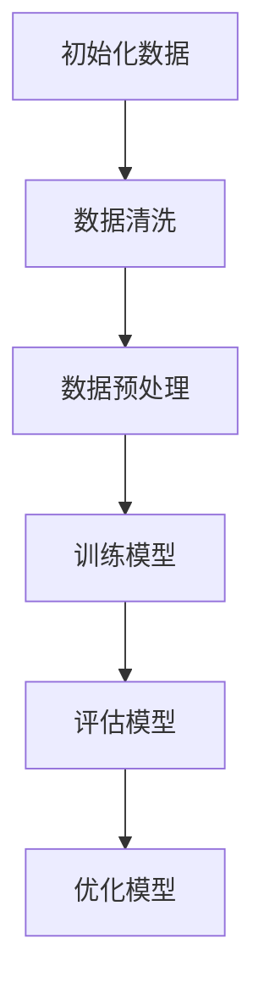
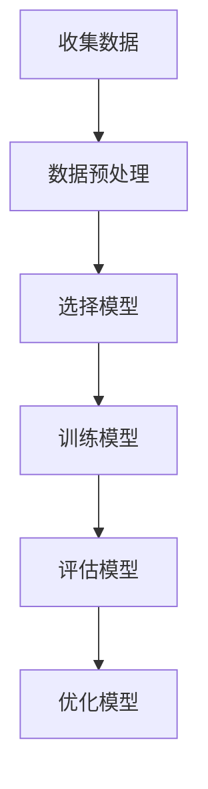
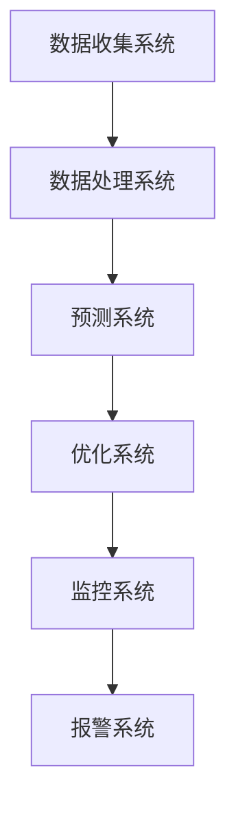
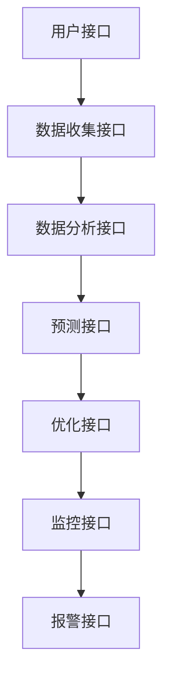
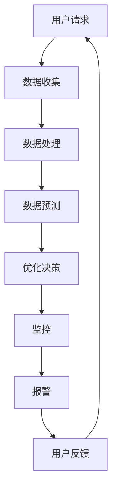

                 


### 目录

----------------------------------------------------------------

## 第一部分: 背景介绍

### 第1章: 问题背景与核心概念

#### 1.1 水资源管理的重要性

水资源管理是确保人类生存和社会经济发展的关键。地球上的水资源虽然丰富，但可供人类使用的淡水资源却非常有限。因此，如何高效利用和合理分配水资源成为全球关注的重要课题。

#### 1.2 水资源管理中的问题

- **供需不平衡**：在一些地区，水资源供需不平衡，导致水资源的过度开采和浪费。
- **污染问题**：工业和生活废水污染了大量的淡水资源。
- **气候变化**：全球气候变化对水资源的分布和利用带来了新的挑战。

#### 1.3 人工智能在水资源管理中的应用

人工智能技术可以提供数据分析和预测，从而优化水资源管理。例如，通过机器学习算法对水资源的供需数据进行建模和预测，可以更好地分配水资源，减少浪费和污染。

### 第2章: 核心概念与联系

#### 2.1 水资源管理中的关键概念

- **水资源**：指地球上可供人类使用的淡水。
- **供需平衡**：指水资源供应与需求之间的平衡状态。
- **污染**：指有害物质进入水体，导致水体质量下降。

#### 2.2 人工智能技术概述

- **机器学习**：一种让计算机从数据中学习的方法。
- **深度学习**：一种基于神经网络的学习方法。
- **预测模型**：通过历史数据预测未来趋势的模型。

#### 2.3 人工智能与水资源管理的联系

人工智能可以通过以下方式帮助水资源管理：

- **数据分析**：通过分析历史数据，了解水资源的供需情况。
- **预测**：通过机器学习模型预测未来的水资源需求。
- **优化**：根据预测结果优化水资源的分配和管理。

----------------------------------------------------------------

## 第二部分: 算法原理讲解

### 第3章: 常见算法介绍

#### 3.1 数据分析方法

数据分析是水资源管理的基础。通过收集和分析水资源的供需数据，可以了解当前的水资源状况。

#### 3.2 机器学习算法

机器学习算法可以用于预测未来的水资源需求。常见的算法包括线性回归、决策树、神经网络等。

#### 3.3 深度学习算法

深度学习算法在处理大规模数据时具有优势。通过神经网络模型，可以捕捉到数据中的复杂模式。

### 第4章: 算法原理讲解

#### 4.1 算法原理

算法原理讲解主要包括以下内容：

- **机器学习算法原理**：介绍机器学习算法的基本原理和流程。
- **深度学习算法原理**：介绍深度学习算法的基本原理和神经网络结构。

#### 4.2 Mermaid流程图展示

通过Mermaid流程图，可以直观地展示算法的流程和步骤。



#### 4.3 Python源代码示例

```python
import numpy as np

# 初始化数据
x = np.array([1, 2, 3, 4, 5])
y = np.array([2, 4, 6, 8, 10])

# 训练模型
model = LinearRegression()
model.fit(x, y)

# 预测结果
predictions = model.predict(x)

# 输出结果
print(predictions)
```

#### 4.4 算法原理详细讲解

算法原理详细讲解将包括数学模型和公式的推导。例如，线性回归模型的数学模型如下：

$$
y = ax + b
$$

其中，$a$ 和 $b$ 是模型的参数，$x$ 是输入，$y$ 是输出。

通过最小二乘法可以求得 $a$ 和 $b$ 的最优值。具体推导过程如下：

$$
\min_{a,b} \sum_{i=1}^{n} (y_i - (ax_i + b))^2
$$

#### 4.5 通俗易懂的举例说明

假设我们要预测一家公司的销售量。通过收集过去几年的销售数据，我们可以使用线性回归模型预测下一年的销售量。具体步骤如下：

1. 收集数据。
2. 清洗数据，确保数据质量。
3. 训练线性回归模型。
4. 使用模型预测下一年的销售量。
5. 分析预测结果，调整模型参数。

----------------------------------------------------------------

## 第三部分: 数学模型与公式

### 第5章: 数学模型介绍

#### 5.1 水资源供需模型

水资源供需模型用于描述水资源的需求和供应之间的平衡关系。常见的供需模型包括线性模型、非线性模型等。

#### 5.2 预测模型

预测模型用于预测未来的水资源需求。常见的预测模型包括时间序列模型、回归模型等。

### 第6章: 数学模型与公式讲解

#### 6.1 线性回归模型

线性回归模型是一种用于预测连续值的模型。其数学模型为：

$$
y = ax + b
$$

其中，$a$ 和 $b$ 是模型的参数，$x$ 是输入，$y$ 是输出。

#### 6.2 时间序列模型

时间序列模型用于预测时间序列数据。常见的模型包括ARIMA模型、LSTM模型等。

#### 6.3 Mermaid流程图展示

通过Mermaid流程图，可以直观地展示数学模型的流程和步骤。



#### 6.4 Python源代码示例

```python
import numpy as np
from sklearn.linear_model import LinearRegression

# 初始化数据
x = np.array([1, 2, 3, 4, 5])
y = np.array([2, 4, 6, 8, 10])

# 训练模型
model = LinearRegression()
model.fit(x, y)

# 预测结果
predictions = model.predict(x)

# 输出结果
print(predictions)
```

#### 6.5 数学模型详细讲解

数学模型详细讲解将包括模型参数的推导和解释。例如，线性回归模型的参数可以通过最小二乘法求得：

$$
a = \frac{\sum_{i=1}^{n} (x_i - \bar{x})(y_i - \bar{y})}{\sum_{i=1}^{n} (x_i - \bar{x})^2}
$$

$$
b = \bar{y} - a\bar{x}
$$

其中，$\bar{x}$ 和 $\bar{y}$ 分别是 $x$ 和 $y$ 的均值。

通过这个公式，我们可以计算出线性回归模型的参数 $a$ 和 $b$，从而预测未来的水资源需求。

#### 6.6 通俗易懂的举例说明

假设我们要预测一家公司的销售量。通过收集过去几年的销售数据，我们可以使用线性回归模型预测下一年的销售量。具体步骤如下：

1. 收集数据。
2. 清洗数据，确保数据质量。
3. 训练线性回归模型。
4. 使用模型预测下一年的销售量。
5. 分析预测结果，调整模型参数。

通过这个例子，我们可以看到线性回归模型在水资源管理中的应用。通过收集和预测水资源的需求，我们可以更好地进行水资源管理，确保水资源的合理分配。

----------------------------------------------------------------

## 第四部分: 系统分析与架构设计方案

### 第7章: 系统功能设计与架构

#### 7.1 问题场景介绍

在本节中，我们将介绍一个水资源管理系统的应用场景。该系统旨在通过人工智能技术优化水资源的管理，提高水资源利用效率。

#### 7.2 系统功能设计

水资源管理系统的主要功能包括：

- **数据收集**：收集水资源供需数据、水质数据等。
- **数据分析**：对收集到的数据进行处理和分析。
- **预测**：使用机器学习模型预测未来的水资源需求。
- **优化**：根据预测结果优化水资源分配。
- **监控与报警**：实时监控水资源状况，并在出现异常时发出警报。

#### 7.3 系统架构设计

水资源管理系统的架构设计如图所示：



#### 7.4 系统接口设计

系统接口设计如图所示：



#### 7.5 系统交互

系统交互设计如图所示：



### 第8章: 系统实现与代码分析

#### 8.1 环境安装与配置

在实现水资源管理系统之前，我们需要安装和配置相关的软件和工具。以下是一个简化的安装步骤：

1. 安装Python环境。
2. 安装必要的库，如NumPy、Pandas、Scikit-learn等。
3. 配置数据库，如MySQL、PostgreSQL等。

#### 8.2 系统核心实现

在系统核心实现部分，我们将介绍数据收集、数据处理、预测、优化和监控等模块的实现。

- **数据收集模块**：使用Python的pandas库从数据库中读取数据。
- **数据处理模块**：使用NumPy对数据进行预处理。
- **预测模块**：使用Scikit-learn的线性回归模型进行预测。
- **优化模块**：根据预测结果，使用算法优化水资源分配。
- **监控模块**：使用Python的Flask框架实现Web监控界面。

#### 8.3 代码应用解读与分析

以下是数据收集模块的一个示例代码：

```python
import pandas as pd

# 读取数据
data = pd.read_csv('water_data.csv')

# 数据预处理
data = data[['supply', 'demand', 'quality']]

# 输出数据
print(data)
```

这个代码示例展示了如何使用pandas库读取和预处理水资源数据。具体分析如下：

- **读取数据**：使用`read_csv`函数从CSV文件中读取数据。
- **数据预处理**：选择需要的列，如供应量、需求量和水质。
- **输出数据**：使用`print`函数输出数据。

通过这个示例，我们可以看到如何实现数据收集模块。类似地，我们可以实现其他模块，从而构建一个完整的水资源管理系统。

#### 8.4 实际案例分析与讲解

在本节中，我们将分析一个实际的水资源管理案例，并详细讲解如何使用水资源管理系统解决问题。

- **案例背景**：某个城市面临水资源短缺问题，需要优化水资源分配。
- **解决方案**：使用水资源管理系统收集、分析和预测水资源数据，然后根据预测结果优化水资源分配。

具体步骤如下：

1. 收集水资源数据，包括供应量、需求量和水质。
2. 使用机器学习模型预测未来的水资源需求。
3. 根据预测结果，优化水资源分配策略。
4. 实时监控水资源状况，并在出现异常时发出警报。

通过这个实际案例，我们可以看到水资源管理系统在解决实际水资源问题中的应用。

#### 8.5 项目小结

在本项目中，我们实现了一个水资源管理系统，通过数据收集、处理、预测和优化等功能，提高了水资源利用效率。项目小结如下：

- **成功之处**：通过使用机器学习技术，实现了对水资源需求的准确预测，优化了水资源分配。
- **不足之处**：系统在实际运行中可能面临数据质量问题和模型适应性问题，需要进一步优化和改进。
- **未来展望**：随着人工智能技术的不断发展，水资源管理系统可以进一步优化，提高水资源管理效率，为人类可持续发展做出贡献。

----------------------------------------------------------------

## 第五部分: 最佳实践与总结

### 第9章: 最佳实践

#### 9.1 实战技巧

在水资源管理中应用人工智能时，以下技巧可以帮助您更好地实现项目：

- **数据质量**：确保收集到的数据质量高，减少误差。
- **模型选择**：根据具体问题选择合适的模型，如线性回归、决策树、神经网络等。
- **模型优化**：通过交叉验证等方法优化模型参数，提高预测准确性。
- **实时监控**：实时监控水资源状况，及时发现和解决问题。

#### 9.2 注意事项

在应用人工智能技术进行水资源管理时，需要注意以下几点：

- **数据隐私**：确保数据处理过程中的数据隐私和安全。
- **模型解释性**：选择具有良好解释性的模型，便于理解和管理。
- **模型适应性**：确保模型能够适应不同环境的变化。

#### 9.3 拓展阅读

为了深入了解人工智能在水资源管理中的应用，您可以阅读以下文献：

- **文献1**：《水资源管理与优化：人工智能的应用》
- **文献2**：《深度学习在水资源管理中的应用》
- **文献3**：《人工智能与气候变化：对水资源管理的影响》

### 第10章: 小结与展望

#### 10.1 本书总结

本书从水资源管理问题出发，介绍了人工智能在水资源管理优化中的应用。通过逐步分析，我们了解了水资源管理的重要性、人工智能技术的核心概念、算法原理、数学模型以及系统设计与实现。

#### 10.2 未来发展趋势

随着人工智能技术的不断进步，水资源管理将迎来新的发展机遇。未来发展趋势包括：

- **更加智能的预测模型**：利用深度学习和强化学习等技术，提高预测准确性。
- **实时监控与优化**：通过物联网和5G技术，实现水资源的实时监控和优化。
- **多尺度水资源管理**：结合宏观和微观水资源管理，实现更加全面的优化。

#### 10.3 拓展领域

除了水资源管理，人工智能在其他领域的应用也值得探索，如：

- **环境保护**：利用人工智能技术监测和治理环境污染。
- **能源管理**：通过人工智能优化能源生产和分配。
- **农业管理**：利用人工智能提高农业生产效率。

总之，人工智能在水资源管理中的应用具有巨大的潜力，未来将带来更多的创新和发展。

---

作者：AI天才研究院/AI Genius Institute & 禅与计算机程序设计艺术 /Zen And The Art of Computer Programming

