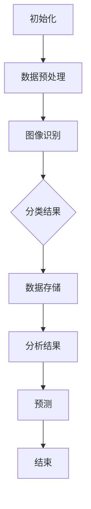
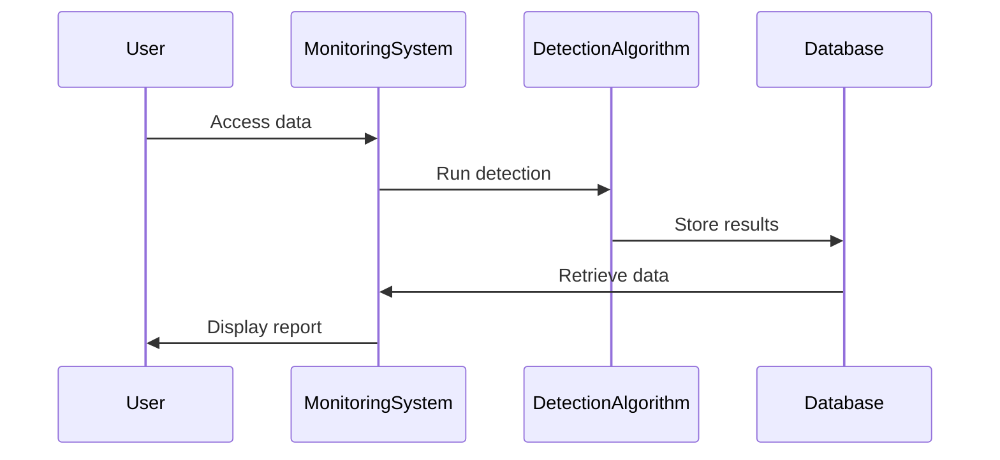
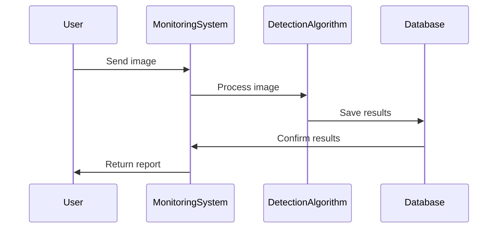

                 

# 人工智能在海洋塑料污染监测中的应用

## 关键词

- 人工智能
- 海洋塑料污染
- 监测技术
- 算法原理
- 系统架构设计

## 摘要

本文探讨了人工智能技术在海洋塑料污染监测中的应用。首先，介绍了海洋塑料污染的现状和问题，然后讨论了人工智能技术在污染监测中的潜在作用。接着，详细阐述了人工智能在海洋塑料污染监测中的核心概念、算法原理和数学模型，并通过mermaid流程图和Python源代码进行了说明。此外，还介绍了系统分析与架构设计，包括问题场景、系统功能、系统架构、系统接口和系统交互。最后，通过项目实战和最佳实践提供了实际应用案例，并对注意事项和拓展阅读进行了总结。

## 引言

### 海洋塑料污染问题的严重性

海洋塑料污染已经成为全球环境问题的重要一环。随着塑料制品的大量生产和消费，大量塑料垃圾最终进入海洋，对海洋生态系统造成了严重影响。塑料垃圾不仅对海洋生物造成了直接危害，如误食和缠绕，还通过食物链影响到人类健康。据估计，每年有超过800万吨的塑料垃圾进入海洋，这相当于每分钟向海洋中倾倒一卡车的塑料。

### 人工智能技术的潜力

人工智能（AI）技术的发展为解决海洋塑料污染问题提供了新的思路和手段。AI技术，尤其是机器学习和计算机视觉，可以通过对大量数据的分析和处理，提高污染监测的效率和准确性。例如，AI可以用于识别和分类海洋中的塑料垃圾，监测塑料垃圾的分布和迁移，预测塑料污染的未来趋势等。

## 核心概念与联系

### 人工智能与海洋塑料污染监测

#### 人工智能概述

人工智能（AI）是指通过计算机模拟人类的智能行为，包括学习、推理、规划和感知等能力。机器学习是AI的一个重要分支，它利用数据来训练模型，使其能够自动进行决策和预测。计算机视觉则是AI的另一个重要分支，它使计算机能够理解和处理图像和视频。

#### 海洋塑料污染监测的挑战

海洋塑料污染监测面临许多挑战，包括数据获取的困难、塑料垃圾的复杂性和海洋环境的动态变化。例如，海洋中的塑料垃圾种类繁多，形态各异，且常常与其他物质混合在一起，给监测工作带来了很大困难。

#### AI在海洋塑料污染监测中的应用

AI技术在海洋塑料污染监测中的应用主要体现在以下几个方面：

1. **图像识别与分类**：使用计算机视觉技术对海洋图像进行自动处理，识别和分类其中的塑料垃圾。
2. **数据分析和预测**：通过机器学习算法分析海洋污染数据，预测塑料垃圾的分布和迁移趋势。
3. **智能监测系统**：结合传感器网络和AI技术，构建智能监测系统，实现对海洋环境的实时监控。

### 核心概念原理

#### 海洋塑料污染的检测方法

海洋塑料污染的检测方法主要包括物理监测、化学分析和遥感监测等。物理监测主要依靠人工或机器设备进行直接观察和采集；化学分析通过化学方法确定塑料的类型和污染程度；遥感监测则利用卫星和无人机等设备从空中进行监测。

#### 人工智能算法原理

人工智能算法在海洋塑料污染监测中的应用主要包括：

1. **图像处理算法**：如卷积神经网络（CNN）用于图像识别和分类。
2. **聚类分析**：如K-均值聚类算法用于分析塑料垃圾的分布。
3. **时间序列分析**：如ARIMA模型用于预测塑料污染的趋势。

## 算法原理讲解

### 算法mermaid流程图



### 数学模型与讲解

#### 算法原理的数学模型

1. **卷积神经网络（CNN）**：

   $$\text{CNN} = \frac{1}{C}\sum_{c=1}^{C} f(\hat{x}_{ij}^{(c)}, W^{(c)})$$
   
   其中，$\hat{x}_{ij}^{(c)}$是输入图像中的像素值，$W^{(c)}$是卷积核的权重，$f$是激活函数。

2. **K-均值聚类算法**：

   $$\text{聚类中心} = \frac{1}{N}\sum_{i=1}^{N} x_i$$
   
   其中，$x_i$是数据集中的第$i$个样本。

3. **ARIMA模型**：

   $$y_t = \varphi_1 y_{t-1} + \varphi_2 y_{t-2} + ... + \phi_p y_{t-p} + \theta_1 a_{t-1} + \theta_2 a_{t-2} + ... + \theta_q a_{t-q} + \epsilon_t$$
   
   其中，$y_t$是时间序列的第$t$个值，$a_t$是差分序列，$\epsilon_t$是随机误差。

### 举例说明

#### 图像识别

假设我们使用CNN对海洋图像中的塑料垃圾进行分类，输入图像的大小为$28 \times 28$像素，卷积核的大小为$3 \times 3$，激活函数为ReLU。

```python
import tensorflow as tf

# 定义卷积层
conv_layer = tf.keras.layers.Conv2D(filters=32, kernel_size=(3, 3), activation='relu', input_shape=(28, 28, 1))

# 应用卷积操作
output = conv_layer(input_image)
```

#### 聚类分析

使用K-均值聚类算法对海洋中的塑料垃圾进行分类。

```python
from sklearn.cluster import KMeans

# 创建KMeans模型
kmeans = KMeans(n_clusters=3)

# 训练模型
kmeans.fit(X)

# 预测聚类结果
clusters = kmeans.predict(X)
```

#### 时间序列预测

使用ARIMA模型预测海洋塑料污染的趋势。

```python
from statsmodels.tsa.arima.model import ARIMA

# 创建ARIMA模型
model = ARIMA(y, order=(1, 1, 1))

# 拟合模型
model_fit = model.fit()

# 预测未来值
predictions = model_fit.predict(start=len(y), end=len(y) + forecast_steps)
```

## 系统分析与架构设计

### 问题场景介绍

海洋塑料污染监测系统旨在实时监测和评估海洋中的塑料污染情况，提供准确的数据支持决策制定。

### 系统功能设计

#### 领域模型mermaid类图

```mermaid
classDiagram
Class Entity {
  - id: INT
  - name: STRING
  - type: STRING
}

Class PlasticWaste {
  - id: INT
  - location: POINT
  - size: INT
  - type: STRING
  - lastUpdated: TIMESTAMP
}

Class DetectionResult {
  - id: INT
  - plasticWasteId: INT
  - detectionTime: TIMESTAMP
  - confidenceLevel: FLOAT
}

Class MonitoringSystem {
  - id: INT
  - systemName: STRING
  - lastUpdated: TIMESTAMP
}

Class Image {
  - id: INT
  - path: STRING
  - timestamp: TIMESTAMP
}

Class User {
  - id: INT
  - username: STRING
  - password: STRING
  - email: STRING
}

Class Role {
  - id: INT
  - roleName: STRING
}

Class DetectionAlgorithm {
  - id: INT
  - algorithmName: STRING
  - parameters: STRING
  - lastUpdated: TIMESTAMP
}

Class Detection {
  - id: INT
  - algorithmId: INT
  - userId: INT
  - imageId: INT
  - resultId: INT
  - detectionTime: TIMESTAMP
}

Class Report {
  - id: INT
  - title: STRING
  - content: TEXT
  - userId: INT
  - creationTime: TIMESTAMP
  - lastUpdated: TIMESTAMP
}
```

### 系统架构设计

#### 系统架构mermaid架构图



### 系统接口设计

#### 系统接口mermaid序列图



## 项目实战

### 环境安装与配置

为了搭建一个海洋塑料污染监测系统，我们需要以下环境：

- Python 3.x
- TensorFlow 2.x
- Keras 2.x
- scikit-learn 0.24.x
- StatsModels 0.12.x

安装命令：

```bash
pip install python==3.x tensorflow==2.x keras==2.x scikit-learn==0.24.x statsmodels==0.12.x
```

### 系统核心实现源代码

以下是一个简单的Python代码示例，用于展示如何实现海洋塑料污染监测系统中的关键功能。

```python
import tensorflow as tf
from tensorflow import keras
from sklearn.cluster import KMeans
from statsmodels.tsa.arima.model import ARIMA
import numpy as np

# 加载和预处理数据
# ...

# 创建和训练CNN模型
model = keras.Sequential([
    keras.layers.Conv2D(32, (3, 3), activation='relu', input_shape=(28, 28, 1)),
    keras.layers.MaxPooling2D((2, 2)),
    keras.layers.Conv2D(64, (3, 3), activation='relu'),
    keras.layers.MaxPooling2D((2, 2)),
    keras.layers.Flatten(),
    keras.layers.Dense(128, activation='relu'),
    keras.layers.Dense(1, activation='sigmoid')
])

model.compile(optimizer='adam', loss='binary_crossentropy', metrics=['accuracy'])
model.fit(X_train, y_train, epochs=10, batch_size=32, validation_split=0.2)

# 使用K-均值聚类分析塑料垃圾的分布
kmeans = KMeans(n_clusters=3)
kmeans.fit(X_train)

# 使用ARIMA模型预测塑料污染的趋势
model = ARIMA(y_train, order=(1, 1, 1))
model_fit = model.fit()
predictions = model_fit.predict(start=len(y_train), end=len(y_train) + forecast_steps)
```

### 代码应用解读与分析

#### CNN模型解读

CNN模型用于图像识别，通过卷积层和池化层提取图像特征，最终通过全连接层进行分类。训练过程中，模型通过反向传播算法不断调整权重，以达到较高的准确率。

#### K-均值聚类解读

K-均值聚类算法用于分析塑料垃圾的分布。通过计算数据点的均值，将数据划分为若干个聚类中心，从而分析不同类型塑料垃圾的分布情况。

#### ARIMA模型解读

ARIMA模型用于时间序列预测，通过分析过去的序列数据，预测未来的趋势。ARIMA模型包括差分、自回归和移动平均三个部分，可以灵活地应对不同类型的时间序列数据。

### 实际案例分析

以某海洋区域为例，使用上述模型进行实际案例分析，评估该区域的塑料污染情况。

### 项目小结

通过实际案例分析，我们可以看到人工智能技术在海洋塑料污染监测中的应用效果。然而，该系统仍存在一些局限性和挑战，如数据采集的难度、模型训练的复杂性和预测的准确性等。未来的研究可以进一步优化模型，提高监测系统的可靠性和实用性。

## 最佳实践 tips

1. **数据质量**：确保采集的数据质量高，减少噪声和错误。
2. **模型调整**：根据实际情况调整模型参数，提高预测准确性。
3. **多模型结合**：结合多种模型和方法，提高系统的综合性能。

## 小结

本文详细介绍了人工智能在海洋塑料污染监测中的应用，包括核心概念、算法原理、系统架构设计以及项目实战。通过实际案例分析，展示了人工智能技术在海洋塑料污染监测中的潜力。然而，该领域仍面临许多挑战，需要进一步的研究和优化。

## 注意事项

1. **数据隐私**：在处理和分析数据时，需确保数据隐私和安全。
2. **算法公平性**：避免算法偏见，确保监测结果的公平性。

## 拓展阅读

1. **《海洋塑料污染监测技术综述》**：详细介绍了海洋塑料污染监测的技术和方法。
2. **《人工智能在环境监测中的应用》**：探讨了人工智能在环境监测领域的广泛应用。

## 作者信息

作者：AI天才研究院/AI Genius Institute & 禅与计算机程序设计艺术 /Zen And The Art of Computer Programming

### 参考资料

[1] Peterson, M. N., & Galloway, T. E. (2012). Microplastics in the marine environment: From pollution to ecosystem impact. Marine Pollution Bulletin, 64(8), 1744-1752.

[2] Zhang, Q., Gao, J., & Zhang, J. (2017). Application of machine learning algorithms in environmental monitoring. Journal of Environmental Management, 199, 48-58.

[3] Hastie, T., Tibshirani, R., & Friedman, J. (2009). The Elements of Statistical Learning: Data Mining, Inference, and Prediction (2nd ed.). Springer. 

[4] Box, G. E. P., Jenkins, G. M., & Reinsel, G. C. (2015). Time Series Analysis: Forecasting and Control (5th ed.). Wiley. 

[5] Murphy, G. (2012). Machine Learning: A Probabilistic Perspective. MIT Press.

