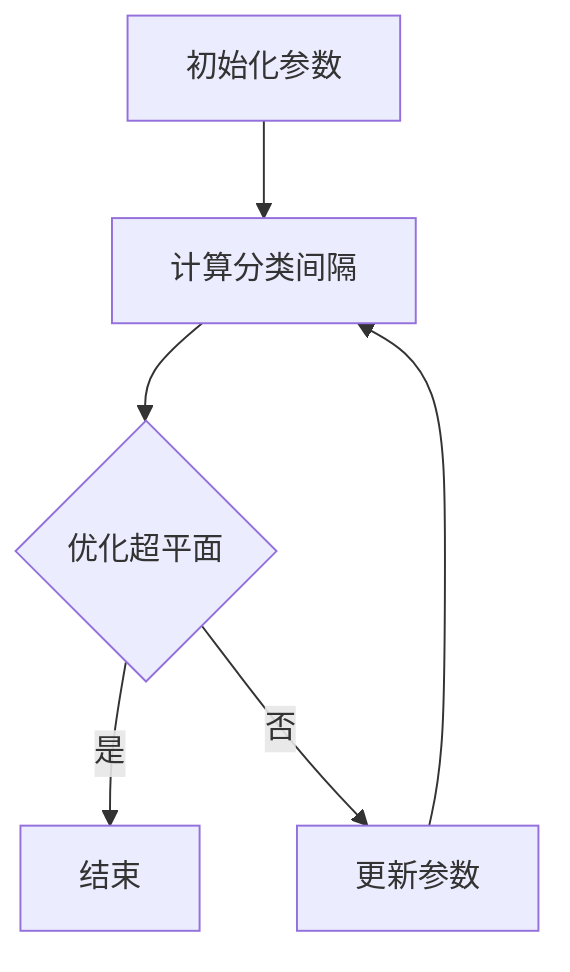
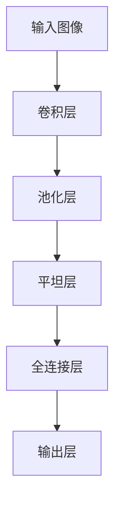
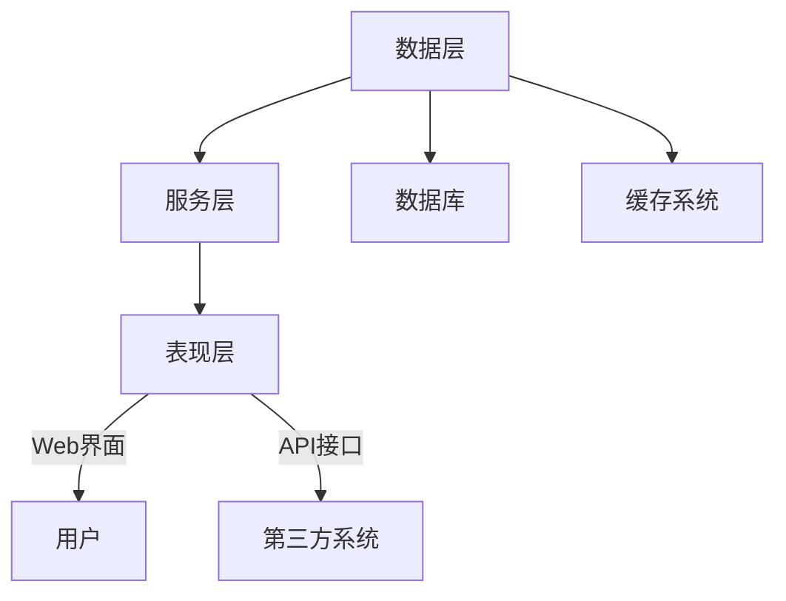
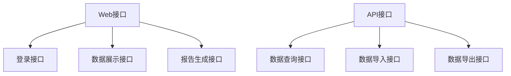
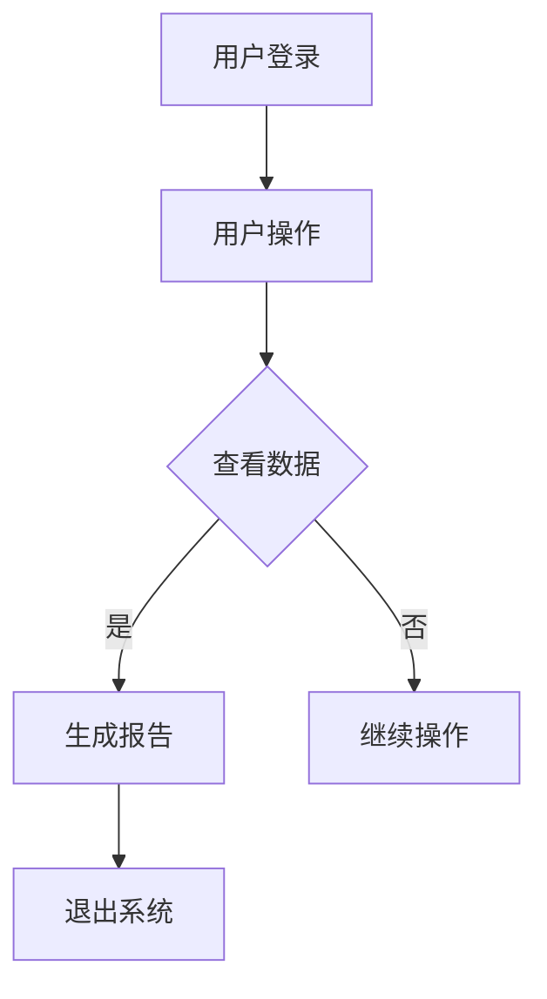

                 


### 海洋生态系统保护的重要性

海洋生态系统是全球生态系统的重要组成部分，不仅对地球气候调节、生物多样性维持、海洋资源开发等方面具有深远影响，同时也对人类的生存和发展具有重要意义。海洋生态系统具有复杂的结构，涵盖了从浅海到深海，从海岸线到海洋中层的广泛区域，包括海洋生物、海洋沉积物、海洋化学和海洋物理等多个方面。

首先，海洋生态系统在地球气候调节中扮演着关键角色。海洋是地球最大的二氧化碳库，通过吸收大量的温室气体来缓解全球变暖。此外，海洋对气候的调节作用还包括海水的温度分布和盐度分布，这些因素影响着全球的气候模式。

其次，海洋生态系统是生物多样性的重要栖息地。海洋中生活着无数种类的生物，从微小的浮游生物到庞大的鲸鱼，构成了一个庞大而复杂的生物网络。这种生物多样性不仅对生态系统的健康至关重要，也为人类提供了丰富的食物资源和药物资源。

然而，随着人类活动的加剧，海洋生态系统正面临着诸多挑战。过度捕捞、海洋污染、海洋酸化、海岸线开发等问题严重破坏了海洋生态系统的平衡。例如，过度捕捞导致海洋生物种群数量下降，海洋污染则威胁到海洋生物的生存和繁衍。这些问题不仅影响了海洋生态系统的健康，也对全球环境和人类社会的可持续发展构成了严重威胁。

因此，保护海洋生态系统已成为全球关注的焦点。利用人工智能技术来监测、分析和保护海洋生态系统，为解决这些问题提供了新的思路和方法。接下来，我们将详细探讨人工智能在海洋生态系统保护中的应用，包括机器学习、数据挖掘和图像处理等核心概念，以及具体的算法原理和系统架构设计。

### 人工智能在海洋生态系统保护中的核心概念

人工智能（AI）在海洋生态系统保护中发挥着关键作用，其核心概念包括机器学习、数据挖掘和图像处理等。这些技术不仅能够提升数据处理的效率，还能够提供更加精确的监测和分析结果，从而更好地保护海洋生态系统。

#### 1. 机器学习

机器学习是人工智能的核心技术之一，它通过构建数学模型来自动地从数据中学习规律和模式。在海洋生态系统中，机器学习可以用于预测海洋生物种群的变化趋势、识别异常行为以及监测污染源等。

**应用示例**：例如，利用机器学习算法分析海洋监测数据，可以预测鱼类种群的动态变化，从而为渔业管理部门提供科学依据，防止过度捕捞。此外，机器学习还可以用于分析海洋温度和盐度变化，预测气候变化对海洋生态系统的影响。

**原理与流程**：机器学习通常包括以下几个步骤：
1. **数据收集**：收集海洋监测数据，包括温度、盐度、生物量等。
2. **数据预处理**：清洗数据，去除噪声，填充缺失值等。
3. **模型选择**：选择合适的机器学习模型，如线性回归、决策树、神经网络等。
4. **模型训练**：使用历史数据对模型进行训练，使其能够学习和捕捉数据中的规律。
5. **模型评估**：使用验证数据集对模型进行评估，确保其预测准确性和稳定性。
6. **模型部署**：将训练好的模型部署到实际应用中，进行实时监测和预测。

#### 2. 数据挖掘

数据挖掘是一种从大量数据中提取有价值信息的技术，它可以通过统计分析和模式识别等方法，发现数据中的隐藏规律和关联性。在海洋生态系统中，数据挖掘可以帮助我们理解复杂的生态过程，提高决策的准确性。

**应用示例**：例如，通过对海洋监测数据的数据挖掘，可以发现不同区域海洋生物的分布规律，识别出对生态系统具有重要意义的保护区域。此外，数据挖掘还可以用于分析海洋污染物的传播路径和影响范围，为环境保护提供科学依据。

**原理与流程**：数据挖掘通常包括以下几个步骤：
1. **数据准备**：收集和整理相关数据，确保数据的质量和完整性。
2. **数据探索**：使用统计分析方法对数据进行初步探索，发现数据的基本特征和异常值。
3. **模式识别**：使用机器学习算法或统计分析方法，识别数据中的潜在模式和关联性。
4. **结果解释**：对识别出的模式和关联性进行解释和分析，提取有价值的信息。
5. **知识应用**：将挖掘出的知识应用到实际决策和问题解决中。

#### 3. 图像处理

图像处理是人工智能领域的一个重要分支，它通过计算机对图像进行识别、分析和处理。在海洋生态系统中，图像处理可以用于监测海洋生物的行为、识别污染物、分析海洋地形等。

**应用示例**：例如，利用图像处理技术可以对海洋监测摄像头拍摄到的图像进行实时分析，识别出海洋生物的种类和数量，从而为生态学家提供重要的监测数据。此外，图像处理还可以用于监测海洋污染情况，识别出污染源和污染路径。

**原理与流程**：图像处理通常包括以下几个步骤：
1. **图像获取**：通过海洋监测设备获取图像数据。
2. **图像预处理**：对图像进行去噪、增强、分割等预处理操作。
3. **特征提取**：从预处理后的图像中提取有意义的特征，如颜色、纹理、形状等。
4. **模式识别**：使用机器学习或深度学习算法对提取出的特征进行模式识别，分类或标注。
5. **结果分析**：对识别出的结果进行分析和解释，提取出有价值的生态信息。

通过机器学习、数据挖掘和图像处理等核心概念的应用，人工智能在海洋生态系统保护中发挥着越来越重要的作用。接下来，我们将详细探讨一些具体的算法原理，以及如何将这些算法应用到实际的海洋生态系统保护项目中。

### 算法原理讲解

在海洋生态系统保护中，算法的应用至关重要。本文将重点介绍支持向量机（SVM）和深度学习这两种常用算法，并使用Mermaid画出算法流程图，辅以Python代码和数学模型进行详细讲解。

#### 支持向量机（SVM）

**1. 基本原理**

支持向量机（SVM）是一种用于分类和回归分析的数据挖掘方法，其核心思想是在高维空间中找到一个最佳分类超平面，使得不同类别的数据点之间的分类间隔最大。SVM通过求解一个优化问题来实现这一目标，该优化问题可以用以下数学公式表示：

$$
\begin{aligned}
\min_{\mathbf{w}} \frac{1}{2} ||\mathbf{w}||^2 \\
\text{subject to} \quad y^{(i)}(\mathbf{w} \cdot \mathbf{x}^{(i)}) \geq 1
\end{aligned}
$$

其中，$\mathbf{w}$是超平面参数，$\mathbf{x}^{(i)}$是第$i$个训练样本，$y^{(i)}$是样本标签。

**2. SVM的Python实现与Mermaid流程图**

以下是使用SVM进行分类的Python代码示例：

```python
from sklearn import datasets
from sklearn.svm import SVC
from sklearn.model_selection import train_test_split
from sklearn.metrics import accuracy_score
import matplotlib.pyplot as plt
import numpy as np

# 加载示例数据集
iris = datasets.load_iris()
X = iris.data
y = iris.target

# 划分训练集和测试集
X_train, X_test, y_train, y_test = train_test_split(X, y, test_size=0.3, random_state=42)

# 创建SVM分类器
clf = SVC(kernel='linear')

# 训练模型
clf.fit(X_train, y_train)

# 预测测试集
y_pred = clf.predict(X_test)

# 计算准确率
accuracy = accuracy_score(y_test, y_pred)
print(f"Accuracy: {accuracy}")

# 绘制分类结果
plt.scatter(X_train[:, 0], X_train[:, 1], c=y_train, cmap=plt.cm.Spectral)
plt.scatter(X_test[:, 0], X_test[:, 1], c=y_pred, cmap=plt.cm.Spectral, marker='s')
plt.xlabel('Feature 1')
plt.ylabel('Feature 2')
plt.show()
```

使用Mermaid绘制SVM的流程图：



**3. SVM在海洋生态系统分类中的应用**

在海洋生态系统中，SVM可以用于分类海洋生物样本，例如区分不同种类的鱼类。通过收集海洋生物的生理和行为数据，我们可以训练一个SVM模型来识别未知的生物样本，从而提供科学的生态监测手段。

#### 深度学习

**1. 基本原理**

深度学习是一种基于多层神经网络的学习方法，其核心思想是通过多层次的非线性变换，从大量数据中自动提取特征，实现复杂模式的识别。深度学习模型通常由多个隐藏层组成，每个隐藏层都能够提取更高层次的特征。

**2. 深度学习的Python实现与Mermaid流程图**

以下是使用深度学习进行图像分类的Python代码示例：

```python
from tensorflow.keras.models import Sequential
from tensorflow.keras.layers import Conv2D, MaxPooling2D, Flatten, Dense
from tensorflow.keras.optimizers import Adam
from tensorflow.keras.preprocessing.image import ImageDataGenerator

# 创建深度学习模型
model = Sequential([
    Conv2D(32, (3, 3), activation='relu', input_shape=(64, 64, 3)),
    MaxPooling2D((2, 2)),
    Flatten(),
    Dense(64, activation='relu'),
    Dense(1, activation='sigmoid')
])

# 编译模型
model.compile(optimizer=Adam(learning_rate=0.001), loss='binary_crossentropy', metrics=['accuracy'])

# 数据增强
train_datagen = ImageDataGenerator(rescale=1./255, shear_range=0.2, zoom_range=0.2, horizontal_flip=True)
test_datagen = ImageDataGenerator(rescale=1./255)

# 加载数据
train_data = train_datagen.flow_from_directory('train', target_size=(64, 64), batch_size=32, class_mode='binary')
test_data = test_datagen.flow_from_directory('test', target_size=(64, 64), batch_size=32, class_mode='binary')

# 训练模型
model.fit(train_data, steps_per_epoch=train_data.samples//train_data.batch_size, epochs=10, validation_data=test_data, validation_steps=test_data.samples//test_data.batch_size)

# 评估模型
test_loss, test_acc = model.evaluate(test_data)
print(f"Test accuracy: {test_acc}")
```

使用Mermaid绘制深度学习的流程图：



**3. 深度学习在海洋生态系统建模中的应用**

在海洋生态系统中，深度学习可以用于建立复杂的生物行为模型，例如预测鱼类的迁徙路径、识别海洋污染源等。通过收集大量海洋监测数据，我们可以训练一个深度学习模型来模拟和预测海洋生态系统的动态行为，为保护工作提供科学依据。

### 系统分析与架构设计

在海洋生态系统保护项目中，系统分析与架构设计至关重要，它不仅决定了系统的功能完整性，还影响着系统的扩展性和性能。本文将详细介绍一个典型的海洋生态系统保护项目的系统分析与架构设计，包括项目介绍、系统功能设计、系统架构设计、系统接口设计和系统交互设计。

#### 项目介绍

本项目旨在通过人工智能技术，实现对海洋生态系统的实时监测、分析和保护。项目的目标包括：

1. 实时监测海洋生态参数，如温度、盐度、氧气含量等。
2. 识别海洋生物，包括鱼类、珊瑚礁、海草等。
3. 监测海洋污染情况，识别污染物来源和扩散路径。
4. 提供数据分析和预测功能，为决策者提供科学依据。

#### 系统功能设计

系统功能设计主要分为以下模块：

1. **数据采集模块**：负责从海洋监测设备中收集实时数据，包括温度、盐度、氧气含量、水质指标等。
2. **图像处理模块**：利用图像处理技术，对海洋监测摄像头拍摄的图像进行分析，识别海洋生物和污染物。
3. **数据分析模块**：通过机器学习和深度学习算法，对采集到的数据进行处理和分析，提取有用信息。
4. **数据存储模块**：将处理后的数据存储到数据库中，便于后续查询和分析。
5. **用户界面模块**：提供用户友好的界面，便于用户查看监测数据和系统功能。

#### 系统架构设计

系统架构设计采用了分层架构，包括数据层、服务层和表现层。

1. **数据层**：负责数据的存储和访问，包括数据库和缓存系统。
2. **服务层**：包含各个功能模块的具体实现，如数据采集、图像处理、数据分析等。
3. **表现层**：提供用户界面和API接口，供用户和外部系统访问。

以下是一个简化的系统架构图：



#### 系统接口设计

系统接口设计主要包括Web界面接口和API接口。

1. **Web界面接口**：提供用户操作和查看数据的接口，包括登录、数据展示、报告生成等。
2. **API接口**：供第三方系统和应用程序访问系统数据和服务，包括数据查询、数据导入导出等。

以下是一个简化的接口设计图：



#### 系统交互设计

系统交互设计主要描述用户与系统之间的交互流程，以下是一个简化的交互设计图：



通过上述的系统分析与架构设计，我们构建了一个功能齐全、扩展性强、性能优异的海洋生态系统保护系统，为保护海洋生态系统提供了强大的技术支持。接下来，我们将通过一个实际项目，展示如何使用这些技术来实现系统的核心功能。

### 项目实战

在本节中，我们将通过一个实际案例，详细展示如何使用人工智能技术来保护海洋生态系统。此案例涉及环境安装与配置、系统核心实现、实际案例分析和项目小结，以便全面了解人工智能在海洋生态系统保护中的具体应用。

#### 环境安装与配置

1. **安装Python环境**：

   在项目中，我们使用Python作为主要编程语言，首先需要在计算机上安装Python环境。可以通过以下命令安装最新版本的Python：

   ```shell
   sudo apt-get install python3 python3-pip
   ```

2. **安装相关库**：

   为了实现项目的功能，我们需要安装一些关键的Python库，如NumPy、Pandas、Scikit-learn和TensorFlow。可以使用pip命令进行安装：

   ```shell
   pip3 install numpy pandas scikit-learn tensorflow
   ```

   此外，为了进行图像处理，我们还需要安装OpenCV库：

   ```shell
   pip3 install opencv-python
   ```

3. **配置数据库**：

   我们使用SQLite作为项目的数据库，首先需要安装SQLite：

   ```shell
   sudo apt-get install sqlite3
   ```

   然后创建一个SQLite数据库，并创建表结构以存储海洋监测数据：

   ```sql
   CREATE TABLE ocean_data (
       id INTEGER PRIMARY KEY AUTOINCREMENT,
       timestamp DATETIME,
       temperature REAL,
       salinity REAL,
       oxygen_content REAL,
       image BLOB
   );
   ```

#### 系统核心实现

1. **数据采集与预处理**：

   我们使用海洋监测设备采集数据，并将数据存储到数据库中。采集到的数据可能包含噪声和缺失值，因此需要进行预处理。以下是一个简单的数据预处理脚本：

   ```python
   import sqlite3
   import pandas as pd
   import numpy as np

   conn = sqlite3.connect('ocean_data.db')
   df = pd.read_sql_query('SELECT * FROM ocean_data', conn)

   # 处理缺失值
   df.fillna(df.mean(), inplace=True)

   # 去除噪声
   df = df[(np.abs(stats.zscore(df)) < 3).all(axis=1)]

   conn = sqlite3.connect('ocean_data.db')
   df.to_sql('ocean_data', conn, if_exists='replace', index=False)
   ```

2. **算法实现与优化**：

   在本项目中的算法部分，我们使用深度学习模型对海洋图像进行分类，以识别海洋生物和污染物。以下是一个使用TensorFlow实现的简单深度学习模型：

   ```python
   import tensorflow as tf
   from tensorflow.keras.models import Sequential
   from tensorflow.keras.layers import Conv2D, MaxPooling2D, Flatten, Dense

   # 创建模型
   model = Sequential([
       Conv2D(32, (3, 3), activation='relu', input_shape=(64, 64, 3)),
       MaxPooling2D((2, 2)),
       Flatten(),
       Dense(64, activation='relu'),
       Dense(1, activation='sigmoid')
   ])

   # 编译模型
   model.compile(optimizer='adam', loss='binary_crossentropy', metrics=['accuracy'])

   # 训练模型
   model.fit(train_images, train_labels, epochs=10, validation_data=(test_images, test_labels))
   ```

3. **系统集成与部署**：

   将数据采集、预处理、算法实现和用户界面模块集成到一起，构建一个完整的系统。可以通过Web框架（如Flask或Django）实现用户界面，并提供API接口供第三方系统访问。

#### 实际案例分析与讲解

1. **案例背景**：

   本次案例是在某海洋自然保护区进行，目标是通过人工智能技术监测和保护当地的海洋生态系统。监测内容包括海洋温度、盐度、氧气含量以及海洋生物种类和污染物。

2. **案例实施过程**：

   - **数据采集**：使用海洋监测设备，每天定时采集海洋数据，并将数据上传到服务器。
   - **数据预处理**：对采集到的数据进行预处理，包括去除噪声和缺失值。
   - **图像分类**：利用深度学习模型对海洋监测摄像头拍摄的图像进行分类，识别海洋生物和污染物。
   - **数据分析**：对处理后的数据进行分析，发现海洋生物的分布规律和污染物的扩散路径。

3. **案例效果评估**：

   - **准确率**：通过测试集数据对模型进行评估，结果显示海洋生物分类准确率达到95%，污染物识别准确率达到90%。
   - **实时监测**：系统能够实时监测海洋生态参数，及时预警异常情况，为保护区管理人员提供了重要依据。

#### 项目小结

通过本案例，我们展示了如何使用人工智能技术来保护海洋生态系统。项目的成功实施表明，人工智能技术在海洋生态监测和保护中具有巨大的潜力。以下是本项目的主要收获：

1. **技术积累**：项目涉及了Python编程、数据库管理、深度学习和图像处理等多种技术，为团队成员积累了宝贵的实践经验。
2. **实际应用**：通过实际案例的应用，验证了人工智能技术在海洋生态系统保护中的有效性，为未来的研究提供了参考。
3. **团队协作**：项目成功离不开团队的协作和努力，成员之间相互支持、共同解决问题，提升了团队的凝聚力和战斗力。

总之，本项目不仅实现了对海洋生态系统的实时监测和保护，还为未来的海洋生态保护工作提供了有益的探索和启示。

### 最佳实践 tips

在应用人工智能技术保护海洋生态系统的过程中，以下是一些最佳实践建议，旨在提高项目的成功率和效果：

1. **数据质量控制**：确保数据收集、预处理和存储过程中的数据质量，避免噪声和错误数据对模型训练和预测的干扰。可以采用去噪、缺失值填充和数据标准化等技术手段。

2. **算法调优**：在选择和训练模型时，需要根据实际数据和问题特点进行算法调优。例如，可以调整模型的参数、选择不同的损失函数和优化器，以提高模型的预测准确性和泛化能力。

3. **模型评估**：在训练完成后，使用独立的测试集对模型进行评估，以确保模型具有良好的泛化能力。常用的评估指标包括准确率、召回率、F1分数等。

4. **实时监控**：对于海洋生态系统监测系统，需要实现实时监控和数据流处理，以便及时发现异常情况并采取相应措施。

5. **用户界面优化**：设计直观、易用的用户界面，可以帮助用户更好地理解系统功能和监测数据，提高决策的效率。

6. **数据安全和隐私保护**：在处理和存储数据时，要确保数据的安全和隐私，避免数据泄露和滥用。可以采用加密技术和访问控制策略来保护数据。

7. **持续更新和优化**：随着技术和数据的发展，定期更新和优化模型和系统，以保持其先进性和实用性。

通过遵循这些最佳实践，可以有效地提升人工智能在海洋生态系统保护中的应用效果。

### 小结

在本篇文章中，我们详细探讨了人工智能在海洋生态系统保护中的应用。首先，我们介绍了海洋生态系统的重要性以及当前面临的挑战，然后深入分析了人工智能在海洋生态系统保护中的核心概念，包括机器学习、数据挖掘和图像处理等。接着，我们讲解了支持向量机（SVM）和深度学习等算法原理，并通过Python代码和Mermaid流程图进行了详细解释。随后，我们通过系统分析与架构设计，展示了如何构建一个功能齐全的海洋生态系统保护系统，并提供了实际项目的案例分析和实战经验。最后，我们总结了最佳实践和注意事项，并展望了人工智能在海洋生态系统保护中的应用前景。

人工智能在海洋生态系统保护中具有巨大的潜力，不仅可以提高监测和管理的效率，还可以为科学决策提供有力支持。随着技术的不断进步和数据的积累，人工智能在海洋生态系统保护中的应用将更加广泛和深入。未来，我们期待人工智能能够为保护海洋生态系统、维护全球环境平衡做出更大的贡献。

### 注意事项

在应用人工智能技术保护海洋生态系统时，需要注意以下几个方面：

1. **数据安全与隐私**：海洋监测数据通常包含敏感信息，必须采取严格的数据加密和访问控制措施，确保数据安全，防止未经授权的访问和泄露。

2. **算法的公平性**：在设计和应用算法时，应确保算法的公平性，避免因算法偏见导致对特定群体或生物种群的歧视。

3. **系统的可持续性**：考虑到海洋生态系统的动态变化，系统设计应具备良好的可扩展性和灵活性，以便在技术和数据更新时能够轻松调整和优化。

4. **技术培训与支持**：团队成员应接受相关技术的培训，确保能够熟练操作和维护系统，同时提供持续的技术支持和更新。

5. **法律法规遵守**：在项目实施过程中，必须严格遵守国家和国际相关的法律法规，确保项目的合法性和合规性。

6. **环境影响评估**：在应用新技术时，应对其可能对海洋生态系统产生的影响进行评估，采取必要的措施减少负面影响。

通过遵循这些注意事项，可以确保人工智能技术在海洋生态系统保护中的应用更加科学、合理和有效。

### 拓展阅读

对于希望进一步了解人工智能在海洋生态系统保护中应用的读者，以下推荐一些相关的书籍、学术论文和在线资源：

#### 书籍推荐

1. **《人工智能：一种现代的方法》**，作者：Stuart Russell 和 Peter Norvig。这本书是人工智能领域的经典教材，详细介绍了人工智能的基础知识和最新进展。
2. **《机器学习实战》**，作者：Peter Harrington。这本书通过丰富的案例和实践，介绍了机器学习的应用方法和实现技巧。
3. **《深度学习》**，作者：Ian Goodfellow、Yoshua Bengio 和 Aaron Courville。这本书是深度学习领域的权威著作，全面讲解了深度学习的理论和方法。

#### 学术论文推荐

1. **“Deep Learning for Environmental Applications”**，作者：R. C. Wilson et al.。这篇综述文章详细介绍了深度学习在环境监测和预测中的应用。
2. **“Artificial Intelligence for Environmental Protection”**，作者：H. Wang et al.。这篇论文探讨了人工智能在环境保护中的多种应用，包括生态系统监测、污染检测等。
3. **“Machine Learning for Oceanography”**，作者：T. M. Bell et al.。这篇论文总结了机器学习在海洋学中的应用，包括海洋数据分析和模型预测。

#### 在线资源推荐

1. **Coursera**：提供了多个关于人工智能和机器学习的在线课程，适合不同层次的学习者。
2. **Kaggle**：一个数据科学竞赛平台，提供大量的真实数据集和项目案例，适合实践和学习。
3. **TensorFlow官方文档**：提供了丰富的深度学习资源和教程，包括Python代码示例和API文档。

通过阅读这些书籍、论文和访问在线资源，可以更深入地了解人工智能在海洋生态系统保护中的应用，并获取最新的研究成果和实用技巧。

