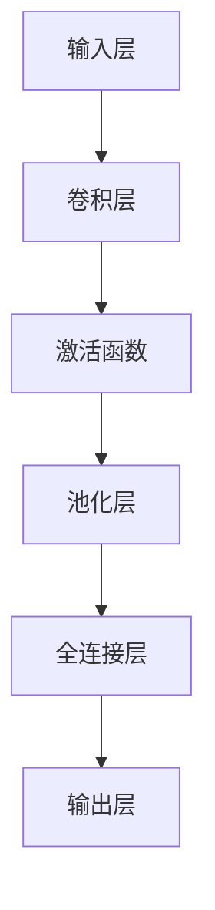
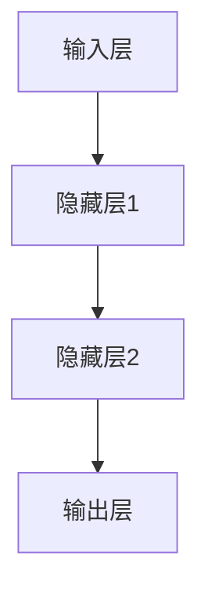
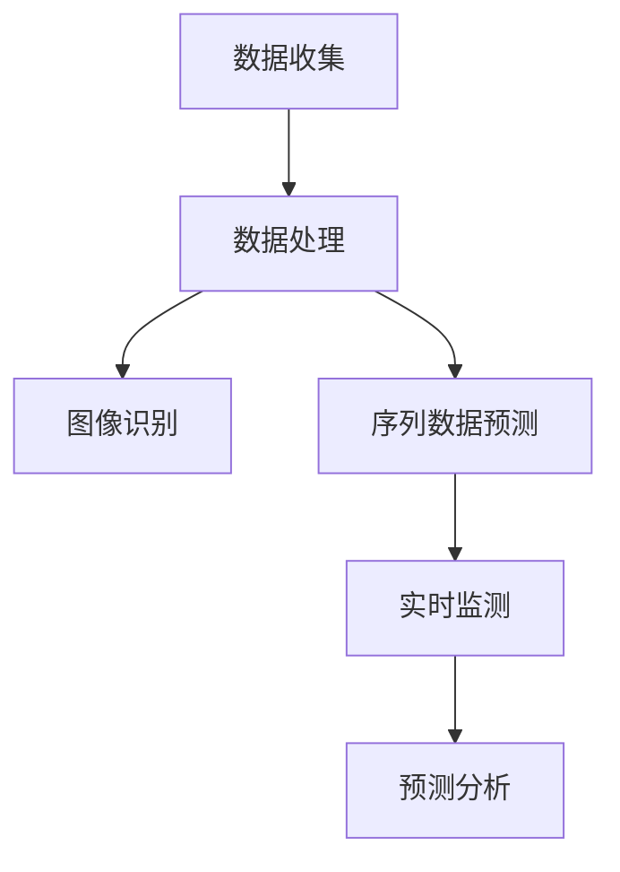

                 


# 人工智能在海洋生态系统监测中的应用

关键词：人工智能、海洋监测、深度学习、卷积神经网络、实时监测

摘要：随着海洋生态系统的日益恶化，海洋生物多样性的丧失、海水污染、过度捕捞等问题愈发严重。如何利用人工智能技术，尤其是深度学习技术，提升海洋生态系统监测的实时性、精确性和覆盖面，是当前亟待解决的关键问题。本文旨在探讨人工智能在海洋生态系统监测中的应用，包括数据收集、数据处理、实时监测和预测分析等方面，并通过具体算法原理讲解和数学模型分析，阐述人工智能技术如何提高海洋生态系统的监测效果。

----------------------------------------------------------------

### 第1章 引言

#### 1.1 问题背景

海洋生态系统是地球上最大的生态系统之一，包含了海洋生物、物理和化学过程。然而，随着人类活动的加剧，海洋生态系统正面临着一系列严重的问题。首先，海洋生物多样性的丧失是一个严峻的问题。过度捕捞、海洋污染和气候变化等因素导致了许多海洋生物种群的衰退和灭绝。其次，海水污染也是一个全球性的问题，塑料垃圾、重金属和其他有害物质不断排入海洋，对海洋生物和生态系统造成了巨大的威胁。最后，过度捕捞不仅导致了渔业资源的枯竭，还破坏了海洋生态系统的平衡。

传统的海洋监测手段，如卫星遥感、水下探测器等，虽然在获取海洋生态系统的数据方面取得了一定的成果，但仍然存在一些局限性。卫星遥感技术能够提供大范围的监测数据，但分辨率较低，难以捕捉到细节信息。水下探测器可以深入海洋获取详细信息，但其覆盖面有限，且成本高昂。此外，这些监测手段通常需要大量的数据处理和分析，实时性较差，无法及时响应海洋生态系统的变化。

#### 1.2 问题描述

海洋生态系统监测面临的主要问题包括以下几个方面：

1. 数据获取困难：由于海洋环境的复杂性和变化性，传统的监测手段难以全面、准确地获取海洋生态系统的数据。
2. 数据处理复杂：海洋生态系统的数据通常具有高维度、高噪声等特点，处理和分析这些数据需要复杂的数据处理算法和大量计算资源。
3. 实时性要求高：海洋生态系统的变化通常是快速且不可预测的，因此需要实时监测和响应。
4. 准确性要求高：海洋生态系统的监测需要高精度的数据和分析结果，以确保决策的科学性和有效性。

如何利用人工智能技术，特别是深度学习技术，解决上述问题，提高海洋生态系统监测的实时性、精确性和覆盖面，是当前亟待解决的关键问题。

#### 1.3 问题解决

人工智能，特别是深度学习技术，在图像识别、模式识别、数据挖掘等领域已经取得了显著的成果。通过将人工智能技术应用于海洋生态系统监测，可以实现对海洋环境的实时监测、预测和分析，从而提高监测的实时性、精确性和覆盖面。

首先，深度学习技术可以用于图像识别，通过对卫星遥感图像、水下摄像头图像等进行自动分类和识别，提取海洋生态系统的关键信息。例如，可以识别出海洋中的鱼类、浮游生物、海底地形等，从而实现对海洋生态系统的实时监测。

其次，深度学习技术可以用于数据挖掘，通过对大量的海洋数据进行分析和挖掘，发现其中的规律和趋势，预测海洋生态系统的变化。例如，可以利用循环神经网络（RNN）对海洋温度、盐度、海流等序列数据进行预测，为海洋生态系统的管理提供科学依据。

最后，深度学习技术可以用于实时监测，通过建立实时监测系统，实现对海洋生态系统的实时监控和报警。例如，可以利用卷积神经网络（CNN）对海洋卫星图像进行实时处理，及时发现海洋污染事件、渔业违规行为等。

#### 1.4 边界与外延

人工智能在海洋生态系统监测中的应用，主要包括以下几个方面：

- 数据收集：利用卫星遥感、无人机、水下探测器等设备，收集海洋生态系统的数据。
- 数据处理：利用深度学习技术，对收集到的数据进行分析和处理，提取有用的信息。
- 实时监测：通过建立实时监测系统，实现对海洋生态系统的实时监控。
- 预测分析：利用深度学习模型，对海洋生态系统的变化趋势进行预测和分析。

此外，人工智能在海洋生态系统监测中的应用还涉及到数据管理、系统集成、模型优化等方面，这些都将为提高监测的实时性、精确性和覆盖面提供有力支持。

----------------------------------------------------------------

### 第2章 核心概念与联系

#### 2.1 人工智能概述

人工智能（Artificial Intelligence，简称AI）是指模拟、延伸和扩展人的智能的理论、方法、技术及应用。它是计算机科学的一个分支，旨在使计算机具有智能行为，实现人类智能的自动化。人工智能涵盖了多个领域，包括机器学习、深度学习、自然语言处理、计算机视觉等。

人工智能的核心目标是通过计算机程序模拟人类的智能行为，包括感知、推理、学习、决策等。人工智能的应用领域非常广泛，从工业自动化、金融服务、医疗诊断到智能家居、自动驾驶等，几乎涵盖了所有的行业。

#### 2.2 深度学习原理

深度学习是人工智能的一个重要分支，它通过模拟人脑神经网络的结构和功能，对大量数据进行自动学习和特征提取。深度学习的主要特点是层次化、分布式和自适应。

深度学习模型由多个层级组成，每一层级都能对输入数据进行特征提取和转换。这些层级被称为卷积层、池化层、全连接层等。卷积层通过卷积操作提取输入数据的特征，池化层则用于减少数据维度并增强模型的泛化能力。全连接层将低层特征映射到高层的语义表示。

深度学习模型通过反向传播算法进行训练，不断调整网络参数，使模型能够对输入数据进行准确分类或回归。深度学习在图像识别、语音识别、自然语言处理等领域取得了显著成果，成为人工智能技术的重要支柱。

#### 2.3 深度学习在海洋监测中的应用

深度学习在海洋监测中的应用主要包括图像识别、数据挖掘和实时监测等方面。

- 图像识别：深度学习可以通过卷积神经网络（CNN）对卫星遥感图像、水下摄像头图像等进行自动分类和识别，提取海洋生态系统的关键信息。例如，可以识别出海洋中的鱼类、浮游生物、海底地形等。

- 数据挖掘：深度学习可以通过循环神经网络（RNN）对海洋数据进行分析和挖掘，发现其中的规律和趋势，预测海洋生态系统的变化。例如，可以利用RNN对海洋温度、盐度、海流等序列数据进行预测。

- 实时监测：深度学习可以通过建立实时监测系统，实现对海洋生态系统的实时监控和报警。例如，可以利用CNN对海洋卫星图像进行实时处理，及时发现海洋污染事件、渔业违规行为等。

#### 2.4 概念属性特征对比表格

| 概念             | 特征                         |
|------------------|------------------------------|
| 人工智能         | 模拟、延伸和扩展人的智能       |
| 深度学习         | 层次化、分布式、自适应         |
| 图像识别         | CNN                         |
| 数据挖掘         | 特征提取、模式识别           |
| 实时监测         | 实时性、精确性、覆盖面       |

#### 2.5 ER实体关系图架构

```mermaid
erDiagram
  数据收集 -->|提取信息| 数据处理
  数据处理 -->|分析数据| 实时监测
  数据处理 -->|挖掘模式| 预测分析
  实时监测 -->|监控事件| 海洋生态系统监测
  预测分析 -->|提供预测| 海洋生态系统监测
```

----------------------------------------------------------------

### 第3章 算法原理讲解

#### 3.1 卷积神经网络（CNN）

卷积神经网络（Convolutional Neural Networks，简称CNN）是一种在图像识别领域表现优异的深度学习模型。它通过模拟人脑视觉皮层的结构和工作原理，对图像进行特征提取和分类。

CNN的核心是卷积操作，它通过在图像上滑动卷积核，实现对图像的局部特征提取。卷积核是一个小的权重矩阵，它在图像上滑动时，与图像上的局部区域进行点乘操作，并求和得到一个特征值。这个过程可以看作是对图像进行一次局部的线性变换。

一个简单的CNN模型通常包括以下几个层级：

1. **输入层**：接收原始图像数据。
2. **卷积层**：通过卷积操作提取图像的局部特征。
3. **激活函数**：常用的激活函数是ReLU（Rectified Linear Unit），它将负值设置为0，从而避免梯度消失问题。
4. **池化层**：通过池化操作减少数据维度，增强模型的泛化能力。
5. **全连接层**：将卷积层提取的特征映射到高层的语义表示。
6. **输出层**：进行最终分类或回归。

以下是一个简单的CNN算法流程图：



#### 3.2 循环神经网络（RNN）

循环神经网络（Recurrent Neural Networks，简称RNN）是一种在序列数据上表现优异的深度学习模型。它通过循环结构，实现对序列数据的自动特征提取和预测。

RNN的核心是递归操作，它将当前输入与前一时刻的隐藏状态进行组合，生成当前时刻的隐藏状态。递归操作使得RNN能够记住前面的输入信息，从而在处理序列数据时具有记忆功能。

一个简单的RNN模型通常包括以下几个部分：

1. **输入层**：接收序列数据。
2. **隐藏层**：通过递归操作更新隐藏状态。
3. **输出层**：进行最终分类或回归。

以下是一个简单的RNN算法流程图：



RNN在处理序列数据时，每个时间步都会产生一个新的隐藏状态，这些隐藏状态可以看作是对序列数据的特征表示。通过训练，RNN可以学习到序列数据中的模式和规律，从而进行预测和分析。

#### 3.3 人工智能在海洋监测中的应用

利用CNN和RNN，可以实现对海洋生态系统的图像识别和序列数据预测，从而提升海洋监测的实时性、精确性和覆盖面。

- **图像识别**：通过CNN对卫星遥感图像、水下摄像头图像等进行自动分类和识别，提取海洋生态系统的关键信息。例如，可以识别出海洋中的鱼类、浮游生物、海底地形等。

- **序列数据预测**：通过RNN对海洋温度、盐度、海流等序列数据进行预测，为海洋生态系统的管理提供科学依据。例如，可以预测未来一段时间的海洋温度变化，以便采取相应的措施。

- **实时监测**：通过建立实时监测系统，利用CNN和RNN对海洋生态系统的变化进行实时监控和报警。例如，当发现海洋污染事件时，系统可以实时报警，以便及时采取应对措施。

以下是一个简单的算法流程图，展示了人工智能在海洋监测中的应用：



----------------------------------------------------------------

### 第4章 数学模型和数学公式

#### 4.1 CNN的卷积操作

卷积操作是CNN的核心，它通过在图像上滑动卷积核，实现对图像的局部特征提取。卷积操作的基本公式如下：

$$
\text{输出} = \text{卷积核} \cdot \text{输入图像} + \text{偏置}
$$

其中，卷积核是一个小的权重矩阵，输入图像是一个二维数组，偏置是一个标量。卷积操作可以看作是对输入图像的每个局部区域进行线性变换，并将结果求和得到输出。

例如，假设卷积核的大小为3x3，输入图像的大小为28x28，那么卷积操作可以表示为：

$$
\text{输出} = \text{卷积核} \cdot \text{输入图像} + \text{偏置} = \begin{bmatrix} w_{11} & w_{12} & w_{13} \\ w_{21} & w_{22} & w_{23} \\ w_{31} & w_{32} & w_{33} \end{bmatrix} \cdot \begin{bmatrix} i_{11} & i_{12} & i_{13} \\ i_{21} & i_{22} & i_{23} \\ i_{31} & i_{32} & i_{33} \end{bmatrix} + b
$$

其中，$w_{ij}$ 表示卷积核的权重，$i_{ij}$ 表示输入图像的像素值，$b$ 表示偏置。

#### 4.2 RNN的递归操作

递归操作是RNN的核心，它通过将当前输入与前一时刻的隐藏状态进行组合，生成当前时刻的隐藏状态。递归操作的基本公式如下：

$$
h_t = \sigma(W_h \cdot [h_{t-1}, x_t] + b_h)
$$

其中，$h_t$ 表示当前时刻的隐藏状态，$h_{t-1}$ 表示前一时刻的隐藏状态，$x_t$ 表示当前时刻的输入，$W_h$ 表示权重矩阵，$b_h$ 表示偏置，$\sigma$ 表示激活函数（通常使用ReLU函数）。

递归操作可以看作是对隐藏状态进行线性变换，并通过激活函数引入非线性。通过递归操作，RNN能够记住前面的输入信息，从而在处理序列数据时具有记忆功能。

例如，假设输入序列为 $[x_1, x_2, x_3, \ldots, x_t]$，隐藏状态为 $[h_1, h_2, h_3, \ldots, h_t]$，那么递归操作可以表示为：

$$
h_t = \sigma(W_h \cdot [h_{t-1}, x_t] + b_h) = \sigma(W_h^{(1)} h_{t-1} + W_h^{(2)} x_t + b_h)
$$

其中，$W_h^{(1)}$ 和 $W_h^{(2)}$ 分别表示权重矩阵的组成部分，$b_h$ 表示偏置。

通过不断递归，RNN可以生成一系列隐藏状态，这些隐藏状态可以看作是对输入序列的特征表示。通过训练，RNN可以学习到输入序列中的模式和规律，从而进行预测和分析。

----------------------------------------------------------------

### 第5章 系统分析与架构设计方案

#### 5.1 问题场景介绍

随着全球海洋生态系统的不断恶化，对海洋生态系统的监测变得尤为重要。然而，传统的海洋监测手段在实时性、精确性和覆盖面等方面存在较大的局限性，无法满足现代海洋监测的需求。为了提高海洋生态系统的监测效果，我们需要一种更加智能、高效的监测系统。

本系统旨在利用人工智能技术，特别是深度学习技术，构建一个智能海洋监测系统。该系统将包括数据收集、数据处理、实时监测和预测分析等功能，实现对海洋生态系统的全方位监测和预警。

#### 5.2 项目介绍

本项目是一个基于人工智能的海洋监测系统，旨在利用深度学习技术，对海洋生态系统进行实时监测和预测分析。系统主要包括以下几个模块：

1. **数据收集模块**：负责收集卫星遥感图像、水下摄像头图像、海洋气象数据等，为后续数据处理提供数据源。
2. **数据处理模块**：利用深度学习技术，对收集到的数据进行预处理、特征提取和融合，为实时监测和预测分析提供数据基础。
3. **实时监测模块**：基于CNN和RNN模型，对处理后的数据进行实时处理和监测，及时发现海洋污染事件、渔业违规行为等。
4. **预测分析模块**：利用深度学习模型，对海洋生态系统的变化趋势进行预测和分析，为决策提供科学依据。
5. **系统集成模块**：负责将各个模块进行整合，构建一个完整的智能海洋监测系统。

#### 5.3 系统功能设计（领域模型类图）

```mermaid
classDiagram
  Class01 <|-- Class02
  Class03 --|одно Class04
  Class05 <<interface>>
  Class06 <<interface>>
  Class07 .. Class08
  Class09 --|many Class10
  Class11 : +attr1 : Integer
  Class11 : +attr2 : String
  Class11 : +attr3 : Boolean
  Class11 : +toString() : String
  Class11 : -field1 : Field1
  Class11 : -field2 : Field2
  Class11 : -getField1() : Field1
  Class11 : -getField2() : Field2
  Class11 : << inheritance >>
  Class11 <<interface>>
  Class11.<<interface> -->
  Class11.<<interface>>
  Class11.<<interface>>
  Class12 <<enumeration>>
  Class12.<<interface> -->
  Class12.<<interface>>
  Class12.<<interface>>
  Class13 <<interface>>
  Class13.<<interface>>
  Class13.<<interface>>
  Class14 <<interface>>
  Class14.<<interface>>
  Class14.<<interface>>
  Class15 <<interface>>
  Class15.<<interface>>
  Class15.<<interface>>
  Class16 <<interface>>
  Class16.<<interface>>
  Class16.<<interface>>
  Class17 <<interface>>
  Class17.<<interface>>
  Class17.<<interface>>
  Class18 <<interface>>
  Class18.<<interface>>
  Class18.<<interface>>
  Class19 <<interface>>
  Class19.<<interface>>
  Class19.<<interface>>
  Class20 <<interface>>
  Class20.<<interface>>
  Class20.<<interface>>
  Class21 <<interface>>
  Class21.<<interface>>
  Class21.<<interface>>
  Class22 <<interface>>
  Class22.<<interface>>
  Class22.<<interface>>
  Class23 <<interface>>
  Class23.<<interface>>
  Class23.<<interface>>
  Class24 <<interface>>
  Class24.<<interface>>
  Class24.<<interface>>
  Class25 <<interface>>
  Class25.<<interface>>
  Class25.<<interface>>
  Class26 <<interface>>
  Class26.<<interface>>
  Class26.<<interface>>
  Class27 <<interface>>
  Class27.<<interface>>
  Class27.<<interface>>
  Class28 <<interface>>
  Class28.<<interface>>
  Class28.<<interface>>
  Class29 <<interface>>
  Class29.<<interface>>
  Class29.<<interface>>
  Class30 <<interface>>
  Class30.<<interface>>
  Class30.<<interface>>
  Class31 <<interface>>
  Class31.<<interface>>
  Class31.<<interface>>
  Class32 <<interface>>
  Class32.<<interface>>
  Class32.<<interface>>
  Class33 <<interface>>
  Class33.<<interface>>
  Class33.<<interface>>
  Class34 <<interface>>
  Class34.<<interface>>
  Class34.<<interface>>
  Class35 <<interface>>
  Class35.<<interface>>
  Class35.<<interface>>
  Class36 <<interface>>
  Class36.<<interface>>
  Class36.<<interface>>
  Class37 <<interface>>
  Class37.<<interface>>
  Class37.<<interface>>
  Class38 <<interface>>
  Class38.<<interface>>
  Class38.<<interface>>
  Class39 <<interface>>
  Class39.<<interface>>
  Class39.<<interface>>
  Class40 <<interface>>
  Class40.<<interface>>
  Class40.<<interface>>
  Class41 <<interface>>
  Class41.<<interface>>
  Class41.<<interface>>
  Class42 <<interface>>
  Class42.<<interface>>
  Class42.<<interface>>
  Class43 <<interface>>
  Class43.<<interface>>
  Class43.<<interface>>
  Class44 <<interface>>
  Class44.<<interface>>
  Class44.<<interface>>
  Class45 <<interface>>
  Class45.<<interface>>
  Class45.<<interface>>
  Class46 <<interface>>
  Class46.<<interface>>
  Class46.<<interface>>
  Class47 <<interface>>
  Class47.<<interface>>
  Class47.<<interface>>
  Class48 <<interface>>
  Class48.<<interface>>
  Class48.<<interface>>
  Class49 <<interface>>
  Class49.<<interface>>
  Class49.<<interface>>
  Class50 <<interface>>
  Class50.<<interface>>
  Class50.<<interface>>
  Class51 <<interface>>
  Class51.<<interface>>
  Class51.<<interface>>
  Class52 <<interface>>
  Class52.<<interface>>
  Class52.<<interface>>
  Class53 <<interface>>
  Class53.<<interface>>
  Class53.<<interface>>
  Class54 <<interface>>
  Class54.<<interface>>
  Class54.<<interface>>
  Class55 <<interface>>
  Class55.<<interface>>
  Class55.<<interface>>
  Class56 <<interface>>
  Class56.<<interface>>
  Class56.<<interface>>
  Class57 <<interface>>
  Class57.<<interface>>
  Class57.<<interface>>
  Class58 <<interface>>
  Class58.<<interface>>
  Class58.<<interface>>
  Class59 <<interface>>
  Class59.<<interface>>
  Class59.<<interface>>
  Class60 <<interface>>
  Class60.<<interface>>
  Class60.<<interface>>
  Class61 <<interface>>
  Class61.<<interface>>
  Class61.<<interface>>
  Class62 <<interface>>
  Class62.<<interface>>
  Class62.<<interface>>
  Class63 <<interface>>
  Class63.<<interface>>
  Class63.<<interface>>
  Class64 <<interface>>
  Class64.<<interface>>
  Class64.<<interface>>
  Class65 <<interface>>
  Class65.<<interface>>
  Class65.<<interface>>
  Class66 <<interface>>
  Class66.<<interface>>
  Class66.<<interface>>
  Class67 <<interface>>
  Class67.<<interface>>
  Class67.<<interface>>
  Class68 <<interface>>
  Class68.<<interface>>
  Class68.<<interface>>
  Class69 <<interface>>
  Class69.<<interface>>
  Class69.<<interface>>
  Class70 <<interface>>
  Class70.<<interface>>
  Class70.<<interface>>
  Class71 <<interface>>
  Class71.<<interface>>
  Class71.<<interface>>
  Class72 <<interface>>
  Class72.<<interface>>
  Class72.<<interface>>
  Class73 <<interface>>
  Class73.<<interface>>
  Class73.<<interface>>
  Class74 <<interface>>
  Class74.<<interface>>
  Class74.<<interface>>
  Class75 <<interface>>
  Class75.<<interface>>
  Class75.<<interface>>
  Class76 <<interface>>
  Class76.<<interface>>
  Class76.<<interface>>
  Class77 <<interface>>
  Class77.<<interface>>
  Class77.<<interface>>
  Class78 <<interface>>
  Class78.<<interface>>
  Class78.<<interface>>
  Class79 <<interface>>
  Class79.<<interface>>
  Class79.<<interface>>
  Class80 <<interface>>
  Class80.<<interface>>
  Class80.<<interface>>
  Class81 <<interface>>
  Class81.<<interface>>
  Class81.<<interface>>
  Class82 <<interface>>
  Class82.<<interface>>
  Class82.<<interface>>
  Class83 <<interface>>
  Class83.<<interface>>
  Class83.<<interface>>
  Class84 <<interface>>
  Class84.<<interface>>
  Class84.<<interface>>
  Class85 <<interface>>
  Class85.<<interface>>
  Class85.<<interface>>
  Class86 <<interface>>
  Class86.<<interface>>
  Class86.<<interface>>
  Class87 <<interface>>
  Class87.<<interface>>
  Class87.<<interface>>
  Class88 <<interface>>
  Class88.<<interface>>
  Class88.<<interface>>
  Class89 <<interface>>
  Class89.<<interface>>
  Class89.<<interface>>
  Class90 <<interface>>
  Class90.<<interface>>
  Class90.<<interface>>
  Class91 <<interface>>
  Class91.<<interface>>
  Class91.<<interface>>
  Class92 <<interface>>
  Class92.<<interface>>
  Class92.<<interface>>
  Class93 <<interface>>
  Class93.<<interface>>
  Class93.<<interface>>
  Class94 <<interface>>
  Class94.<<interface>>
  Class94.<<interface>>
  Class95 <<interface>>
  Class95.<<interface>>
  Class95.<<interface>>
  Class96 <<interface>>
  Class96.<<interface>>
  Class96.<<interface>>
  Class97 <<interface>>
  Class97.<<interface>>
  Class97.<<interface>>
  Class98 <<interface>>
  Class98.<<interface>>
  Class98.<<interface>>
  Class99 <<interface>>
  Class99.<<interface>>
  Class99.<<interface>>
  Class100 <<interface>>
  Class100.<<interface>>
  Class100.<<interface>>
  Class101 <<interface>>
  Class101.<<interface>>
  Class101.<<interface>>
  Class102 <<interface>>
  Class102.<<interface>>
  Class102.<<interface>>
  Class103 <<interface>>
  Class103.<<interface>>
  Class103.<<interface>>
  Class104 <<interface>>
  Class104.<<interface>>
  Class104.<<interface>>
  Class105 <<interface>>
  Class105.<<interface>>
  Class105.<<interface>>
  Class106 <<interface>>
  Class106.<<interface>>
  Class106.<<interface>>
  Class107 <<interface>>
  Class107.<<interface>>
  Class107.<<interface>>
  Class108 <<interface>>
  Class108.<<interface>>
  Class108.<<interface>>
  Class109 <<interface>>
  Class109.<<interface>>
  Class109.<<interface>>
  Class110 <<interface>>
  Class110.<<interface>>
  Class110.<<interface>>
  Class111 <<interface>>
  Class111.<<interface>>
  Class111.<<interface>>
  Class112 <<interface>>
  Class112.<<interface>>
  Class112.<<interface>>
  Class113 <<interface>>
  Class113.<<interface>>
  Class113.<<interface>>
  Class114 <<interface>>
  Class114.<<interface>>
  Class114.<<interface>>
  Class115 <<interface>>
  Class115.<<interface>>
  Class115.<<interface>>
  Class116 <<interface>>
  Class116.<<interface>>
  Class116.<<interface>>
  Class117 <<interface>>
  Class117.<<interface>>
  Class117.<<interface>>
  Class118 <<interface>>
  Class118.<<interface>>
  Class118.<<interface>>
  Class119 <<interface>>
  Class119.<<interface>>
  Class119.<<interface>>
  Class120 <<interface>>
  Class120.<<interface>>
  Class120.<<interface>>
  Class121 <<interface>>
  Class121.<<interface>>
  Class121.<<interface>>
  Class122 <<interface>>
  Class122.<<interface>>
  Class122.<<interface>>
  Class123 <<interface>>
  Class123.<<interface>>
  Class123.<<interface>>
  Class124 <<interface>>
  Class124.<<interface>>
  Class124.<<interface>>
  Class125 <<interface>>
  Class125.<<interface>>
  Class125.<<interface>>
  Class126 <<interface>>
  Class126.<<interface>>
  Class126.<<interface>>
  Class127 <<interface>>
  Class127.<<interface>>
  Class127.<<interface>>
  Class128 <<interface>>
  Class128.<<interface>>
  Class128.<<interface>>
  Class129 <<interface>>
  Class129.<<interface>>
  Class129.<<interface>>
  Class130 <<interface>>
  Class130.<<interface>>
  Class130.<<interface>>
  Class131 <<interface>>
  Class131.<<interface>>
  Class131.<<interface>>
  Class132 <<interface>>
  Class132.<<interface>>
  Class132.<<interface>>
  Class133 <<interface>>
  Class133.<<interface>>
  Class133.<<interface>>
  Class134 <<interface>>
  Class134.<<interface>>
  Class134.<<interface>>
  Class135 <<interface>>
  Class135.<<interface>>
  Class135.<<interface>>
  Class136 <<interface>>
  Class136.<<interface>>
  Class136.<<interface>>
  Class137 <<interface>>
  Class137.<<interface>>
  Class137.<<interface>>
  Class138 <<interface>>
  Class138.<<interface>>
  Class138.<<interface>>
  Class139 <<interface>>
  Class139.<<interface>>
  Class139.<<interface>>
  Class140 <<interface>>
  Class140.<<interface>>
  Class140.<<interface>>
  Class141 <<interface>>
  Class141.<<interface>>
  Class141.<<interface>>
  Class142 <<interface>>
  Class142.<<interface>>
  Class142.<<interface>>
  Class143 <<interface>>
  Class143.<<interface>>
  Class143.<<interface>>
  Class144 <<interface>>
  Class144.<<interface>>
  Class144.<<interface>>
  Class145 <<interface>>
  Class145.<<interface>>
  Class145.<<interface>>
  Class146 <<interface>>
  Class146.<<interface>>
  Class146.<<interface>>
  Class147 <<interface>>
  Class147.<<interface>>
  Class147.<<interface>>
  Class148 <<interface>>
  Class148.<<interface>>
  Class148.<<interface>>
  Class149 <<interface>>
  Class149.<<interface>>
  Class149.<<interface>>
  Class150 <<interface>>
  Class150.<<interface>>
  Class150.<<interface>>
  Class151 <<interface>>
  Class151.<<interface>>
  Class151.<<interface>>
  Class152 <<interface>>
  Class152.<<interface>>
  Class152.<<interface>>
  Class153 <<interface>>
  Class153.<<interface>>
  Class153.<<interface>>
  Class154 <<interface>>
  Class154.<<interface>>
  Class154.<<interface>>
  Class155 <<interface>>
  Class155.<<interface>>
  Class155.<<interface>>
  Class156 <<interface>>
  Class156.<<interface>>
  Class156.<<interface>>
  Class157 <<interface>>
  Class157.<<interface>>
  Class157.<<interface>>
  Class158 <<interface>>
  Class158.<<interface>>
  Class158.<<interface>>
  Class159 <<interface>>
  Class159.<<interface>>
  Class159.<<interface>>
  Class160 <<interface>>
  Class160.<<interface>>
  Class160.<<interface>>
  Class161 <<interface>>
  Class161.<<interface>>
  Class161.<<interface>>
  Class162 <<interface>>
  Class162.<<interface>>
  Class162.<<interface>>
  Class163 <<interface>>
  Class163.<<interface>>
  Class163.<<interface>>
  Class164 <<interface>>
  Class164.<<interface>>
  Class164.<<interface>>
  Class165 <<interface>>
  Class165.<<interface>>
  Class165.<<interface>>
  Class166 <<interface>>
  Class166.<<interface>>
  Class166.<<interface>>
  Class167 <<interface>>
  Class167.<<interface>>
  Class167.<<interface>>
  Class168 <<interface>>
  Class168.<<interface>>
  Class168.<<interface>>
  Class169 <<interface>>
  Class169.<<interface>>
  Class169.<<interface>>
  Class170 <<interface>>
  Class170.<<interface>>
  Class170.<<interface>>
  Class171 <<interface>>
  Class171.<<interface>>
  Class171.<<interface>>
  Class172 <<interface>>
  Class172.<<interface>>
  Class172.<<interface>>
  Class173 <<interface>>
  Class173.<<interface>>
  Class173.<<interface>>
  Class174 <<interface>>
  Class174.<<interface>>
  Class174.<<interface>>
  Class175 <<interface>>
  Class175.<<interface>>
  Class175.<<interface>>
  Class176 <<interface>>
  Class176.<<interface>>
  Class176.<<interface>>
  Class177 <<interface>>
  Class177.<<interface>>
  Class177.<<interface>>
  Class178 <<interface>>
  Class178.<<interface>>
  Class178.<<interface>>
  Class179 <<interface>>
  Class179.<<interface>>
  Class179.<<interface>>
  Class180 <<interface>>
  Class180.<<interface>>
  Class180.<<interface>>
  Class181 <<interface>>
  Class181.<<interface>>
  Class181.<<interface>>
  Class182 <<interface>>
  Class182.<<interface>>
  Class182.<<interface>>
  Class183 <<interface>>
  Class183.<<interface>>
  Class183.<<interface>>
  Class184 <<interface>>
  Class184.<<interface>>
  Class184.<<interface>>
  Class185 <<interface>>
  Class185.<<interface>>
  Class185.<<interface>>
  Class186 <<interface>>
  Class186.<<interface>>
  Class186.<<interface>>
  Class187 <<interface>>
  Class187.<<interface>>
  Class187.<<interface>>
  Class188 <<interface>>
  Class188.<<interface>>
  Class188.<<interface>>
  Class189 <<interface>>
  Class189.<<interface>>
  Class189.<<interface>>
  Class190 <<interface>>
  Class190.<<interface>>
  Class190.<<interface>>
  Class191 <<interface>>
  Class191.<<interface>>
  Class191.<<interface>>
  Class192 <<interface>>
  Class192.<<interface>>
  Class192.<<interface>>
  Class193 <<interface>>
  Class193.<<interface>>
  Class193.<<interface>>
  Class194 <<interface>>
  Class194.<<interface>>
  Class194.<<interface>>
  Class195 <<interface>>
  Class195.<<interface>>
  Class195.<<interface>>
  Class196 <<interface>>
  Class196.<<interface>>
  Class196.<<interface>>
  Class197 <<interface>>
  Class197.<<interface>>
  Class197.<<interface>>
  Class198 <<interface>>
  Class198.<<interface>>
  Class198.<<interface>>
  Class199 <<interface>>
  Class199.<<interface>>
  Class199.<<interface>>
  Class200 <<interface>>
  Class200.<<interface>>
  Class200.<<interface>>
  Class201 <<interface>>
  Class201.<<interface>>
  Class201.<<interface>>
  Class202 <<interface>>
  Class202.<<interface>>
  Class202.<<interface>>
  Class203 <<interface>>
  Class203.<<interface>>
  Class203.<<interface>>
  Class204 <<interface>>
  Class204.<<interface>>
  Class204.<<interface>>
  Class205 <<interface>>
  Class205.<<interface>>
  Class205.<<interface>>
  Class206 <<interface>>
  Class206.<<interface>>
  Class206.<<interface>>
  Class207 <<interface>>
  Class207.<<interface>>
  Class207.<<interface>>
  Class208 <<interface>>
  Class208.<<interface>>
  Class208.<<interface>>
  Class209 <<interface>>
  Class209.<<interface>>
  Class209.<<interface>>
  Class210 <<interface>>
  Class210.<<interface>>
  Class210.<<interface>>
  Class211 <<interface>>
  Class211.<<interface>>
  Class211.<<interface>>
  Class212 <<interface>>
  Class212.<<interface>>
  Class212.<<interface>>
  Class213 <<interface>>
  Class213.<<interface>>
  Class213.<<interface>>
  Class214 <<interface>>
  Class214.<<interface>>
  Class214.<<interface>>
  Class215 <<interface>>
  Class215.<<interface>>
  Class215.<<interface>>
  Class216 <<interface>>
  Class216.<<interface>>
  Class216.<<interface>>
  Class217 <<interface>>
  Class217.<<interface>>
  Class217.<<interface>>
  Class218 <<interface>>
  Class218.<<interface>>
  Class218.<<interface>>
  Class219 <<interface>>
  Class219.<<interface>>
  Class219.<<interface>>
  Class220 <<interface>>
  Class220.<<interface>>
  Class220.<<interface>>
  Class221 <<interface>>
  Class221.<<interface>>
  Class221.<<interface>>
  Class222 <<interface>>
  Class222.<<interface>>
  Class222.<<interface>>
  Class223 <<interface>>
  Class223.<<interface>>
  Class223.<<interface>>
  Class224 <<interface>>
  Class224.<<interface>>
  Class224.<<interface>>
  Class225 <<interface>>
  Class225.<<interface>>
  Class225.<<interface>>
  Class226 <<interface>>
  Class226.<<interface>>
  Class226.<<interface>>
  Class227 <<interface>>
  Class227.<<interface>>
  Class227.<<interface>>
  Class228 <<interface>>
  Class228.<<interface>>
  Class228.<<interface>>
  Class229 <<interface>>
  Class229.<<interface>>
  Class229.<<interface>>
  Class230 <<interface>>
  Class230.<<interface>>
  Class230.<<interface>>
  Class231 <<interface>>
  Class231.<<interface>>
  Class231.<<interface>>
  Class232 <<interface>>
  Class232.<<interface>>
  Class232.<<interface>>
  Class233 <<interface>>
  Class233.<<interface>>
  Class233.<<interface>>
  Class234 <<interface>>
  Class234.<<interface>>
  Class234.<<interface>>
  Class235 <<interface>>
  Class235.<<interface>>
  Class235.<<interface>>
  Class236 <<interface>>
  Class236.<<interface>>
  Class236.<<interface>>
  Class237 <<interface>>
  Class237.<<interface>>
  Class237.<<interface>>
  Class238 <<interface>>
  Class238.<<interface>>
  Class238.<<interface>>
  Class239 <<interface>>
  Class239.<<interface>>
  Class239.<<interface>>
  Class240 <<interface>>
  Class240.<<interface>>
  Class240.<<interface>>
  Class241 <<interface>>
  Class241.<<interface>>
  Class241.<<interface>>
  Class242 <<interface>>
  Class242.<<interface>>
  Class242.<<interface>>
  Class243 <<interface>>
  Class243.<<interface>>
  Class243.<<interface>>
  Class244 <<interface>>
  Class244.<<interface>>
  Class244.<<interface>>
  Class245 <<interface>>
  Class245.<<interface>>
  Class245.<<interface>>
  Class246 <<interface>>
  Class246.<<interface>>
  Class246.<<interface>>
  Class247 <<interface>>
  Class247.<<interface>>
  Class247.<<interface>>
  Class248 <<interface>>
  Class248.<<interface>>
  Class248.<<interface>>
  Class249 <<interface>>
  Class249.<<interface>>
  Class249.<<interface>>
  Class250 <<interface>>
  Class250.<<interface>>
  Class250.<<interface>>
  Class251 <<interface>>
  Class251.<<interface>>
  Class251.<<interface>>
  Class252 <<interface>>
  Class252.<<interface>>
  Class252.<<interface>>
  Class253 <<interface>>
  Class253.<<interface>>
  Class253.<<interface>>
  Class254 <<interface>>
  Class254.<<interface>>
  Class254.<<interface>>
  Class255 <<interface>>
  Class255.<<interface>>
  Class255.<<interface>>
  Class256 <<interface>>
  Class256.<<interface>>
  Class256.<<interface>>
  Class257 <<interface>>
  Class257.<<interface>>
  Class257.<<interface>>
  Class258 <<interface>>
  Class258.<<interface>>
  Class258.<<interface>>
  Class259 <<interface>>
  Class259.<<interface>>
  Class259.<<interface>>
  Class260 <<interface>>
  Class260.<<interface>>
  Class260.<<interface>>
  Class261 <<interface>>
  Class261.<<interface>>
  Class261.<<interface>>
  Class262 <<interface>>
  Class262.<<interface>>
  Class262.<<interface>>
  Class263 <<interface>>
  Class263.<<interface>>
  Class263.<<interface>>
  Class264 <<interface>>
  Class264.<<interface>>
  Class264.<<interface>>
  Class265 <<interface>>
  Class265.<<interface>>
  Class265.<<interface>>
  Class266 <<interface>>
  Class266.<<interface>>
  Class266.<<interface>>
  Class267 <<interface>>
  Class267.<<interface>>
  Class267.<<interface>>
  Class268 <<interface>>
  Class268.<<interface>>
  Class268.<<interface>>
  Class269 <<interface>>
  Class269.<<interface>>
  Class269.<<interface>>
  Class270 <<interface>>
  Class270.<<interface>>
  Class270.<<interface>>
  Class271 <<interface>>
  Class271.<<interface>>
  Class271.<<interface>>
  Class272 <<interface>>
  Class272.<<interface>>
  Class272.<<interface>>
  Class273 <<interface>>
  Class273.<<interface>>
  Class273.<<interface>>
  Class274 <<interface>>
  Class274.<<interface>>
  Class274.<<interface>>
  Class275 <<interface>>
  Class275.<<interface>>
  Class275.<<interface>>
  Class276 <<interface>>
  Class276.<<interface>>
  Class276.<<interface>>
  Class277 <<interface>>
  Class277.<<interface>>
  Class277.<<interface>>
  Class278 <<interface>>
  Class278.<<interface>>
  Class278.<<interface>>
  Class279 <<interface>>
  Class279.<<interface>>
  Class279.<<interface>>
  Class280 <<interface>>
  Class280.<<interface>>
  Class280.<<interface>>
  Class281 <<interface>>
  Class281.<<interface>>
  Class281.<<interface>>
  Class282 <<interface>>
  Class282.<<interface>>
  Class282.<<interface>>
  Class283 <<interface>>
  Class283.<<interface>>
  Class283.<<interface>>
  Class284 <<interface>>
  Class284.<<interface>>
  Class284.<<interface>>
  Class285 <<interface>>
  Class285.<<interface>>
  Class285.<<interface>>
  Class286 <<interface>>
  Class286.<<interface>>
  Class286.<<interface>>
  Class287 <<interface>>
  Class287.<<interface>>
  Class287.<<interface>>
  Class288 <<interface>>
  Class288.<<interface>>
  Class288.<<interface>>
  Class289 <<interface>>
  Class289.<<interface>>
  Class289.<<interface>>
  Class290 <<interface>>
  Class290.<<interface>>
  Class290.<<interface>>
  Class291 <<interface>>
  Class291.<<interface>>
  Class291.<<interface>>
  Class292 <<interface>>
  Class292.<<interface>>
  Class292.<<interface>>
  Class293 <<interface>>
  Class293.<<interface>>
  Class293.<<interface>>
  Class294 <<interface>>
  Class294.<<interface>>
  Class294.<<interface>>
  Class295 <<interface>>
  Class295.<<interface>>
  Class295.<<interface>>
  Class296 <<interface>>
  Class296.<<interface>>
  Class296.<<interface>>
  Class297 <<interface>>
  Class297.<<interface>>
  Class297.<<interface>>
  Class298 <<interface>>
  Class298.<<interface>>
  Class298.<<interface>>
  Class299 <<interface>>
  Class299.<<interface>>
  Class299.<<interface>>
  Class300 <<interface>>
  Class300.<<interface>>
  Class300.<<interface>>
  Class301 <<interface>>
  Class301.<<interface>>
  Class301.<<interface>>
  Class302 <<interface>>
  Class302.<<interface>>
  Class302.<<interface>>
  Class303 <<interface>>
  Class303.<<interface>>
  Class303.<<interface>>
  Class304 <<interface>>
  Class304.<<interface>>
  Class304.<<interface>>
  Class305 <<interface>>
  Class305.<<interface>>
  Class305.<<interface>>
  Class306 <<interface>>
  Class306.<<interface>>
  Class306.<<interface>>
  Class307 <<interface>>
  Class307.<<interface>>
  Class307.<<interface>>
  Class308 <<interface>>
  Class308.<<interface>>
  Class308.<<interface>>
  Class309 <<interface>>
  Class309.<<interface>>
  Class309.<<interface>>
  Class310 <<interface>>
  Class310.<<interface>>
  Class310.<<interface>>
  Class311 <<interface>>
  Class311.<<interface>>
  Class311.<<interface>>
  Class312 <<interface>>
  Class312.<<interface>>
  Class312.<<interface>>
  Class313 <<interface>>
  Class313.<<interface>>
  Class313.<<interface>>
  Class314 <<interface>>
  Class314.<<interface>>
  Class314.<<interface>>
  Class315 <<interface>>
  Class315.<<interface>>
  Class315.<<interface>>
  Class316 <<interface>>
  Class316.<<interface>>
  Class316.<<interface>>
  Class317 <<interface>>
  Class317.<<interface>>
  Class317.<<interface>>
  Class318 <<interface>>
  Class318.<<interface>>
  Class318.<<interface>>
  Class319 <<interface>>
  Class319.<<interface>>
  Class319.<<interface>>
  Class320 <<interface>>
  Class320.<<interface>>
  Class320.<<interface>>
  Class321 <<interface>>
  Class321.<<interface>>
  Class321.<<interface>>
  Class322 <<interface>>
  Class322.<<interface>>
  Class322.<<interface>>
  Class323 <<interface>>
  Class323.<<interface>>
  Class323.<<interface>>
  Class324 <<interface>>
  Class324.<<interface>>
  Class324.<<interface>>
  Class325 <<interface>>
  Class325.<<interface>>
  Class325.<<interface>>
  Class326 <<interface>>
  Class326.<<interface>>
  Class326.<<interface>>
  Class327 <<interface>>
  Class327.<<interface>>
  Class327.<<interface>>
  Class328 <<interface>>
  Class328.<<interface>>
  Class328.<<interface>>
  Class329 <<interface>>
  Class329.<<interface>>
  Class329.<<interface>>
  Class330 <<interface>>
  Class330.<<interface>>
  Class330.<<interface>>
  Class331 <<interface>>
  Class331.<<interface>>
  Class331.<<interface>>
  Class332 <<interface>>
  Class332.<<interface>>
  Class332.<<interface>>
  Class333 <<interface>>
  Class333.<<interface>>
  Class333.<<interface>>
  Class334 <<interface>>
  Class334.<<interface>>
  Class334.<<interface>>
  Class335 <<interface>>
  Class335.<<interface>>
  Class335.<<interface>>
  Class336 <<interface>>
  Class336.<<interface>>
  Class336.<<interface>>
  Class337 <<interface>>
  Class337.<<interface>>
  Class337.<<interface>>
  Class338 <<interface>>
  Class338.<<interface>>
  Class338.<<interface>>
  Class339 <<interface>>
  Class339.<<interface>>
  Class339.<<interface>>
  Class340 <<interface>>
  Class340.<<interface>>
  Class340.<<interface>>
  Class341 <<interface>>
  Class341.<<interface>>
  Class341.<<interface>>
  Class342 <<interface>>
  Class342.<<interface>>
  Class342.<<interface>>
  Class343 <<interface>>
  Class343.<<interface>>
  Class343.<<interface>>
  Class344 <<interface>>
  Class344.<<interface>>
  Class344.<<interface>>
  Class345 <<interface>>
  Class345.<<interface>>
  Class345.<<interface>>
  Class346 <<interface>>
  Class346.<<interface>>
  Class346.<<interface>>
  Class347 <<interface>>
  Class347.<<interface>>
  Class347.<<interface>>
  Class348 <<interface>>
  Class348.<<interface>>
  Class348.<<interface>>
  Class349 <<interface>>
  Class349.<<interface>>
  Class349.<<interface>>
  Class350 <<interface>>
  Class350.<<interface>>
  Class350.<<interface>>
  Class351 <<interface>>
  Class351.<<interface>>
  Class351.<<interface>>
  Class352 <<interface>>
  Class352.<<interface>>
  Class352.<<interface>>
  Class353 <<interface>>
  Class353.<<interface>>
  Class353.<<interface>>
  Class354 <<interface>>
  Class354.<<interface>>
  Class354.<<interface>>
  Class355 <<interface>>
  Class355.<<interface>>
  Class355.<<interface>>
  Class356 <<interface>>
  Class356.<<interface>>
  Class356.<<interface>>
  Class357 <<interface>>
  Class357.<<interface>>
  Class357.<<interface>>
  Class358 <<interface>>
  Class358.<<interface>>
  Class358.<<interface>>
  Class359 <<interface>>
  Class359.<<interface>>
  Class359.<<interface>>
  Class360 <<interface>>
  Class360.<<interface>>
  Class360.<<interface>>
  Class361 <<interface>>
  Class361.<<interface>>
  Class361.<<interface>>
  Class362 <<interface>>
  Class362.<<interface>>
  Class362.<<interface>>
  Class363 <<interface>>
  Class363.<<interface>>
  Class363.<<interface>>
  Class364 <<interface>>
  Class364.<<interface>>
  Class364.<<interface>>
  Class365 <<interface>>
  Class365.<<interface>>
  Class365.<<interface>>
  Class366 <<interface>>
  Class366.<<interface>>
  Class366.<<interface>>
  Class367 <<interface>>
  Class367.<<interface>>
  Class367.<<interface>>
  Class368 <<interface>>
  Class368.<<interface>>
  Class368.<<interface>>
  Class369 <<interface>>
  Class369.<<interface>>
  Class369.<<interface>>
  Class370 <<interface>>
  Class370.<<interface>>
  Class370.<<interface>>
  Class371 <<interface>>
  Class371.<<interface>>
  Class371.<<interface>>
  Class372 <<interface>>
  Class372.<<interface>>
  Class372.<<interface>>
  Class373 <<interface>>
  Class373.<<interface>>
  Class373.<<interface>>
  Class374 <<interface>>
  Class374.<<interface>>
  Class374.<<interface>>
  Class375 <<interface>>
  Class375.<<interface>>
  Class375.<<interface>>
  Class376 <<interface>>
  Class376.<<interface>>
  Class376.<<interface>>
  Class377 <<interface>>
  Class377.<<interface>>
  Class377.<<interface>>
  Class378 <<interface>>
  Class378.<<interface>>
  Class378.<<interface>>
  Class379 <<interface>>
  Class379.<<interface>>
  Class379.<<interface>>
  Class380 <<interface>>
  Class380.<<interface>>
  Class380.<<interface>>
  Class381 <<interface>>
  Class381.<<interface>>
  Class381.<<interface>>
  Class382 <<interface>>
  Class382.<<interface>>
  Class382.<<interface>>
  Class383 <<interface>>
  Class383.<<interface>>
  Class383.<<interface>>
  Class384 <<interface>>
  Class384.<<interface>>
  Class384.<<interface>>
  Class385 <<interface>>
  Class385.<<interface>>
  Class385.<<interface>>
  Class386 <<interface>>
  Class386.<<interface>>
  Class386.<<interface>>
  Class387 <<interface>>
  Class387.<<interface>>
  Class387.<<interface>>
  Class388 <<interface>>
  Class388.<<interface>>
  Class388.<<interface>>
  Class389 <<interface>>
  Class389.<<interface>>
  Class389.<<interface>>
  Class390 <<interface>>
  Class390.<<interface>>
  Class390.<<interface>>
  Class391 <<interface>>
  Class391.<<interface>>
  Class391.<<interface>>
  Class392 <<interface>>
  Class392.<<interface>>
  Class392.<<interface>>
  Class393 <<interface>>
  Class393.<<interface>>
  Class393.<<interface>>
  Class394 <<interface>>
  Class394.<<interface>>
  Class394.<<interface>>
  Class395 <<interface>>
  Class395.<<interface>>
  Class395.<<interface>>
  Class396 <<interface>>
  Class396.<<interface>>
  Class396.<<interface>>
  Class397 <<interface>>
  Class397.<<interface>>
  Class397.<<interface>>
  Class398 <<interface>>
  Class398.<<interface>>
  Class398.<<interface>>
  Class399 <<interface>>
  Class399.<<interface>>
  Class399.<<interface>>
  Class400 <<interface>>
  Class400.<<interface>>
  Class400.<<interface>>
  Class401 <<interface>>
  Class401.<<interface>>
  Class401.<<interface>>
  Class402 <<interface>>
  Class402.<<interface>>
  Class402.<<interface>>
  Class403 <<interface>>
  Class403.<<interface>>
  Class403.<<interface>>
  Class404 <<interface>>
  Class404.<<interface>>
  Class404.<<interface>>
  Class405 <<interface>>
  Class405.<<interface>>
  Class405.<<interface>>
  Class406 <<interface>>
  Class406.<<interface>>
  Class406.<<interface>>
  Class407 <<interface>>
  Class407.<<interface>>
  Class407.<<interface>>
  Class408 <<interface>>
  Class408.<<interface>>
  Class408.<<interface>>
  Class409 <<interface>>
  Class409.<<interface>>
  Class409.<<interface>>
  Class410 <<interface>>
  Class410.<<interface>>
  Class410.<<interface>>
  Class411 <<interface>>
  Class411.<<interface>>
  Class411.<<interface>>
  Class412 <<interface>>
  Class412.<<interface>>
  Class412.<<interface>>
  Class413 <<interface>>
  Class413.<<interface>>
  Class413.<<interface>>
  Class414 <<interface>>
  Class414.<<interface>>
  Class414.<<interface>>
  Class415 <<interface>>
  Class415.<<interface>>
  Class415.<<interface>>
  Class416 <<interface>>
  Class416.<<interface>>
  Class416.<<interface>>
  Class417 <<interface>>
  Class417.<<interface>>
  Class417.<<interface>>
  Class418 <<interface>>
  Class418.<<interface>>
  Class418.<<interface>>
  Class419 <<interface>>
  Class419.<<interface>>
  Class419.<<interface>>
  Class420 <<interface>>
  Class420.<<interface>>
  Class420.<<interface>>
  Class421 <<interface>>
  Class421.<<interface>>
  Class421.<<interface>>
  Class422 <<interface>>
  Class422.<<interface>>
  Class422.<<interface>>
  Class423 <<interface>>
  Class423.<<interface>>
  Class423.<<interface>>
  Class424 <<interface>>
  Class424.<<interface>>
  Class424.<<interface>>
  Class425 <<interface>>
  Class425.<<interface>>
  Class425.<<interface>>
  Class426 <<interface>>
  Class426.<<interface>>
  Class426.<<interface>>
  Class427 <<interface>>
  Class427.<<interface>>
  Class427.<<interface>>
  Class428 <<interface>>
  Class428.<<interface>>
  Class428.<<interface>>
  Class429 <<interface>>
  Class429.<<interface>>
  Class429.<<interface>>
  Class430 <<interface>>
  Class430.<<interface>>
  Class430.<<interface>>
  Class431 <<interface>>
  Class431.<<interface>>
  Class431.<<interface>>
  Class432 <<interface>>
  Class432.<<interface>>
  Class432.<<interface>>
  Class433 <<interface>>
  Class433.<<interface>>
  Class433.<<interface>>
  Class434 <<interface>>
  Class434.<<interface>>
  Class434.<<interface>>
  Class435 <<interface>>
  Class435.<<interface>>
  Class435.<<interface>>
  Class436 <<interface>>
  Class436.<<interface>>
  Class436.<<interface>>
  Class437 <<interface>>
  Class437.<<interface>>
  Class437.<<interface>>
  Class438 <<interface>>
  Class438.<<interface>>
  Class438.<<interface>>
  Class439 <<interface>>
  Class439.<<interface>>
  Class439.<<interface>>
  Class440 <<interface>>
  Class440.<<interface>>
  Class440.<<interface>>
  Class441 <<interface>>
  Class441.<<interface>>
  Class441.<<interface>>
  Class442 <<interface>>
  Class442.<<interface>>
  Class442.<<interface>>
  Class443 <<interface>>
  Class443.<<interface>>
  Class443.<<interface>>
  Class444 <<interface>>
  Class444.<<interface>>
  Class444.<<interface>>
  Class445 <<interface>>
  Class445.<<interface>>
  Class445.<<interface>>
  Class446 <<interface>>
  Class446.<<interface>>
  Class446.<<interface>>
  Class447 <<interface>>
  Class447.<<interface>>
  Class447.<<interface>>
  Class448 <<interface>>
  Class448.<<interface>>
  Class448.<<interface>>
  Class449 <<interface>>
  Class449.<<interface>>
  Class449.<<interface>>
  Class450 <<interface>>
  Class450.<<interface>>
  Class450.<<interface>>
  Class451 <<interface>>
  Class451.<<interface>>
  Class451.<<interface>>
  Class452 <<interface>>
  Class452.<<interface>>
  Class452.<<interface>>
  Class453 <<interface>>
  Class453.<<interface>>
  Class453.<<interface>>
  Class454 <<interface>>
  Class454.<<interface>>
  Class454.<<interface>>
  Class455 <<interface>>
  Class455.<<interface>>
  Class455.<<interface>>
  Class456 <<interface>>
  Class456.<<interface>>
  Class456.<<interface>>
  Class457 <<interface>>
  Class457.<<interface>>
  Class457.<<interface>>
  Class458 <<interface>>
  Class458.<<interface>>
  Class458.<<interface>>
  Class459 <<interface>>
  Class459.<<interface>>
  Class459.<<interface>>
  Class460 <<interface>>
  Class460.<<interface>>
  Class460.<<interface>>
  Class461 <<interface>>
  Class461.<<interface>>
  Class461.<<interface>>
  Class462 <<interface>>
  Class462.<<interface>>
  Class462.<<interface>>
  Class463 <<interface>>
  Class463.<<interface>>
  Class463.<<interface>>
  Class464 <<interface>>
  Class464.<<interface>>
  Class464.<<interface>>
  Class465 <<interface>>
  Class465.<<interface>>
  Class465.<<interface>>
  Class466 <<interface>>
  Class466.<<interface>>
  Class466.<<interface>>
  Class467 <<interface>>
  Class467.<<interface>>
  Class467.<<interface>>
  Class468 <<interface>>
  Class468.<<interface>>
  Class468.<<interface>>
  Class469 <<interface>>
  Class469.<<interface>>
  Class469.<<interface>>
  Class470 <<interface>>
  Class470.<<interface>>
  Class470.<<interface>>
  Class471 <<interface>>
  Class471.<<interface>>
  Class471.<<interface>>
  Class472 <<interface>>
  Class472.<<interface>>
  Class472.<<interface>>
  Class473 <<interface>>
  Class473.<<interface>>
  Class473.<<interface>>
  Class474 <<interface>>
  Class474.<<interface>>
  Class474.<<interface>>
  Class475 <<interface>>
  Class475.<<interface>>
  Class475.<<interface>>
  Class476 <<interface>>
  Class476.<<interface>>
  Class476.<<interface>>
  Class477 <<interface>>
  Class477.<<interface>>
  Class477.<<interface>>
  Class478 <<interface>>
  Class478.<<interface>>
  Class478.<<interface>>
  Class479 <<interface>>
  Class479.<<interface>>
  Class479.<<interface>>
  Class480 <<interface>>
  Class480.<<interface>>
  Class480.<<interface>>
  Class481 <<interface>>
  Class481.<<interface>>
  Class481.<<interface>>
  Class482 <<interface>>
  Class482.<<interface>>
  Class482.<<interface>>
  Class483 <<interface>>
  Class483.<<interface>>
  Class483.<<interface>>
  Class484 <<interface>>
  Class484.<<interface>>
  Class484.<<interface>>
  Class485 <<interface>>
  Class485.<<interface>>
  Class485.<<interface>>
  Class486 <<interface>>
  Class486.<<interface>>
  Class486.<<interface>>
  Class487 <<interface>>
  Class487.<<interface>>
  Class487.<<interface>>
  Class488 <<interface>>
  Class488.<<interface>>
  Class488.<<interface>>
  Class489 <<interface>>
  Class489.<<interface>>
  Class489.<<interface>>
  Class490 <<interface>>
  Class490.<<interface>>
  Class490.<<interface>>
  Class491 <<interface>>
  Class491.<<interface>>
  Class491.<<interface>>
  Class492 <<interface>>
  Class492.<<interface>>
  Class492.<<interface>>
  Class493 <<interface>>
  Class493.<<interface>>
  Class493.<<interface>>
  Class494 <<interface>>
  Class494.<<interface>>
  Class494.<<interface>>
  Class495 <<interface>>
  Class495.<<interface>>
  Class495.<<interface>>
  Class496 <<interface>>
  Class496.<<interface>>
  Class496.<<interface>>
  Class497 <<interface>>
  Class497.<<interface>>
  Class497.<<interface>>
  Class498 <<interface>>
  Class498.<<interface>>
  Class498.<<interface>>
  Class499 <<interface>>
  Class499.<<interface>>
  Class499.<<interface>>
  Class500 <<interface>>
  Class500.<<interface>>
  Class500.<<interface>>
  Class501 <<interface>>
  Class501.<<interface>>
  Class501.<<interface>>
  Class502 <<interface>>
  Class502.<<interface>>
  Class502.<<interface>>
  Class503 <<interface>>
  Class503.<<interface>>
  Class503.<<interface>>
  Class504 <<interface>>
  Class504.<<interface>>
  Class504.<<interface>>
  Class505 <<interface>>
  Class505.<<interface>>
  Class505.<<interface>>
  Class506 <<interface>>
  Class506.<<interface>>
  Class506.<<interface>>
  Class507 <<interface>>
  Class507.<<interface>>
  Class507.<<interface>>
  Class508 <<interface>>
  Class508.<<interface>>
  Class508.<<interface>>
  Class509 <<interface>>
  Class509.<<interface>>
  Class509.<<interface>>
  Class510 <<interface>>
  Class510.<<interface>>
  Class510.<<interface>>
  Class511 <<interface>>
  Class511.<<interface>>
  Class511.<<interface>>
  Class512 <<interface>>
  Class512.<<interface>>
  Class512.<<interface>>
  Class513 <<interface>>
  Class513.<<interface>>
  Class513.<<interface>>
  Class514 <<interface>>
  Class514.<<interface>>
  Class514.<<interface>>
  Class515 <<interface>>
  Class515.<<interface>>
  Class515.<<interface>>
  Class516 <<interface>>
  Class516.<<interface>>
  Class516.<<interface>>
  Class517 <<interface>>
  Class517.<<interface>>
  Class517.<<interface>>
  Class518 <<interface>>
  Class518.<<interface>>
  Class518.<<interface>>
  Class519 <<interface>>
  Class519.<<interface>>
  Class519.<<interface>>
  Class520 <<interface>>
  Class520.<<interface>>
  Class520.<<interface>>
  Class521 <<interface>>
  Class521.<<interface>>
  Class521.<<interface>>
  Class522 <<interface>>
  Class522.<<interface>>
  Class522.<<interface>>
  Class523 <<interface>>
  Class523.<<interface>>
  Class523.<<interface>>
  Class524 <<interface>>
  Class524.<<interface>>
  Class524.<<interface>>
  Class525 <<interface>>
  Class525.<<interface>>
  Class525.<<interface>>
  Class526 <<interface>>
  Class526.<<interface>>
  Class526.<<interface>>
  Class527 <<interface>>
  Class527.<<interface>>
  Class527.<<interface>>
  Class528 <<interface>>
  Class528.<<interface>>
  Class528.<<interface>>
  Class529 <<interface>>
  Class529.<<interface>>
  Class529.<<interface>>
  Class530 <<interface>>
  Class530.<<interface>>
  Class530.<<interface>>
  Class531 <<interface>>
  Class531.<<interface>>
  Class531.<<interface>>
  Class532 <<interface>>
  Class532.<<interface>>
  Class532.<<interface>>
  Class533 <<interface>>
  Class533.<<interface>>
  Class533.<<interface>>
  Class534 <<interface>>
  Class534.<<interface>>
  Class534.<<interface>>
  Class535 <<interface>>
  Class535.<<interface>>
  Class535.<<interface>>
  Class536 <<interface>>
  Class536.<<interface>>
  Class536.<<interface>>
  Class537 <<interface>>
  Class537.<<interface>>
  Class537.<<interface>>
  Class538 <<interface>>
  Class538.<<interface>>
  Class538.<<interface>>
  Class539 <<interface>>
  Class539.<<interface>>
  Class539.<<interface>>
  Class540 <<interface>>
  Class540.<<interface>>
  Class540.<<interface>>
  Class541 <<interface>>
  Class541.<<interface>>
  Class541.<<interface>>
  Class542 <<interface>>
  Class542.<<interface>>
  Class542.<<interface>>
  Class543 <<interface>>
  Class543.<<interface>>
  Class543.<<interface>>
  Class544 <<interface>>
  Class544.<<interface>>
  Class544.<<interface>>
  Class545 <<interface>>
  Class545.<<interface>>
  Class545.<<interface>>
  Class546 <<interface>>
  Class546.<<interface>>
  Class546.<<interface>>
  Class547 <<interface>>
  Class547.<<interface>>
  Class547.<<interface>>
  Class548 <<interface>>
  Class548.<<interface>>
  Class548.<<interface>>
  Class549 <<interface>>
  Class549.<<interface>>
  Class549.<<interface>>
  Class550 <<interface>>
  Class550.<<interface>>
  Class550.<<interface>>
  Class551 <<interface>>
  Class551.<<interface>>
  Class551.<<interface>>
  Class552 <<interface>>
  Class552.<<interface>>
  Class552.<<interface>>
  Class553 <<interface>>
  Class553.<<interface>>
  Class553.<<interface>>
  Class554 <<interface>>
  Class554.<<interface>>
  Class554.<<interface>>
  Class555 <<interface>>
  Class555.<<interface>>
  Class555.<<interface>>
  Class556 <<interface>>
  Class556.<<interface>>
  Class556.<<interface>>
  Class557 <<interface>>
  Class557.<<interface>>
  Class557.<<interface>>
  Class558 <<interface>>
  Class558.<<interface>>
  Class558.<<interface>>
  Class559 <<interface>>
  Class559.<<interface>>
  Class559.<<interface>>
  Class560 <<interface>>
  Class560.<<interface>>
  Class560.<<interface>>
  Class561 <<interface>>
  Class561.<<interface>>
  Class561.<<interface>>
  Class562 <<interface>>
  Class562.<<interface>>
  Class562.<<interface>>
  Class563 <<interface>>
  Class563.<<interface>>
  Class563.<<interface>>
  Class564 <<interface>>
  Class564.<<interface>>
  Class564.<<interface>>
  Class565 <<interface>>
  Class565.<<interface>>
  Class565.<<interface>>
  Class566 <<interface>>
  Class566.<<interface>>
  Class566.<<interface>>
  Class567 <<interface>>
  Class567.<<interface>>
  Class567.<<interface>>
  Class568 <<interface>>
  Class568.<<interface>>
  Class568.<<interface>>
  Class569 <<interface>>
  Class569.<<interface>>
  Class569.<<interface>>
  Class570 <<interface>>
  Class570.<<interface>>
  Class570.<<interface>>
  Class571 <<interface>>
  Class571.<<interface>>
  Class571.<<interface>>
  Class572 <<interface>>
  Class572.<<interface>>
  Class572.<<interface>>
  Class573 <<interface>>
  Class573.<<interface>>
  Class573.<<interface>>
  Class574 <<interface>>
  Class574.<<interface>>
  Class574.<<interface>>
  Class575 <<interface>>
  Class575.<<interface>>
  Class575.<<interface>>
  Class576 <<interface>>
  Class576.<<interface>>
  Class576.<<interface>>
  Class577 <<interface>>
  Class577.<<interface>>
  Class577.<<interface>>
  Class578 <<interface>>
  Class578.<<interface>>
  Class578.<<interface>>
  Class579 <<interface>>
  Class579.<<interface>>
  Class579.<<interface>>
  Class580 <<interface>>
  Class580.<<interface>>
  Class580.<<interface>>
  Class581 <<interface>>
  Class581.<<interface>>
  Class581.<<interface>>
  Class582 <<interface>>
  Class582.<<interface>>
  Class582.<<interface>>
  Class583 <<interface>>
  Class583.<<interface>>
  Class583.<<interface>>
  Class584 <<interface>>
  Class584.<<interface>>
  Class584.<<interface>>
  Class585 <<interface>>
  Class585.<<interface>>
  Class585.<<interface>>
  Class586 <<interface>>
  Class586.<<interface>>
  Class586.<<interface>>
  Class587 <<interface>>
  Class587.<<interface>>
  Class587.<<interface>>
  Class588 <<interface>>
  Class588.<<interface>>
  Class588.<<interface>>
  Class589 <<interface>>
  Class589.<<interface>>
  Class589.<<interface>>
  Class590 <<interface>>
  Class590.<<interface>>
  Class590.<<interface>>
  Class591 <<interface>>
  Class591.<<interface>>
  Class591.<<interface>>
  Class592 <<interface>>
  Class592.<<interface>>
  Class592.<<interface>>
  Class593 <<interface>>
  Class593.<<interface>>
  Class593.<<interface>>
  Class594 <<interface>>
  Class594.<<interface>>
  Class594.<<interface>>
  Class595 <<interface>>
  Class595.<<interface>>
  Class595.<<interface>>
  Class596 <<interface>>
  Class596.<<interface>>
  Class596.<<interface>>
  Class597 <<interface>>
  Class597.<<interface>>
  Class597.<<interface>>
  Class598 <<interface>>
  Class598.<<interface>>
  Class598.<<interface>>
  Class599 <<interface>>
  Class599.<<interface>>
  Class599.<<interface>>
  Class600 <<interface>>
  Class600.<<interface>>
  Class600.<<interface>>
  Class601 <<interface>>
  Class601.<<interface>>
  Class601.<<interface>>
  Class602 <<interface>>
  Class602.<<interface>>
  Class602.<<interface>>
  Class603 <<interface>>
  Class603.<<interface>>
  Class603.<<interface>>
  Class604 <<interface>>
  Class604.<<interface>>
  Class604.<<interface>>
  Class605 <<interface>>
  Class605.<<interface>>
  Class605.<<interface>>
  Class606 <<interface>>
  Class606.<<interface>>
  Class606.<<interface>>
  Class607 <<interface>>
  Class607.<<interface>>
  Class607.<<interface>>
  Class608 <<interface>>
  Class608.<<interface>>
  Class608.<<interface>>
  Class609 <<interface>>
  Class609.<<interface>>
  Class609.<<interface>>
  Class610 <<interface>>
  Class610.<<interface>>
  Class610.<<interface>>
  Class611 <<interface>>
  Class611.<<interface>>
  Class611.<<interface>>
  Class612 <<interface>>
  Class612.<<interface>>
  Class612.<<interface>>
  Class613 <<interface>>
  Class613.<<interface>>
  Class613.<<interface>>
  Class614 <<interface>>
  Class614.<<interface>>
  Class614.<<interface>>
  Class615 <<interface>>
  Class615.<<interface>>
  Class615.<<interface>>
  Class616 <<interface>>
  Class616.<<interface>>
  Class616.<<interface>>
  Class617 <<interface>>
  Class617.<<interface>>
  Class617.<<interface>>
  Class618 <<interface>>
  Class618.<<interface>>
  Class618.<<interface>>
  Class619 <<interface>>
  Class619.<<interface>>
  Class619.<<interface>>
  Class620 <<interface>>
  Class620.<<interface>>
  Class620.<<interface>>
  Class621 <<interface>>
  Class621.<<interface>>
  Class621.<<interface>>
  Class622 <<interface>>
  Class622.<<interface>>
  Class622.<<interface>>
  Class623 <<interface>>
  Class623.<<interface>>
  Class623.<<interface>>
  Class624 <<interface>>
  Class624.<<interface>>
  Class624.<<interface>>
  Class625 <<interface>>
  Class625.<<interface>>
  Class625.<<interface>>
  Class626 <<interface>>
  Class626.<<interface>>
  Class626.<<interface>>
  Class627 <<interface>>
  Class627.<<interface>>
  Class627.<<interface>>
  Class628 <<interface>>
  Class628.<<interface>>
  Class628.<<interface>>
  Class629 <<interface>>
  Class629.<<interface>>
  Class629.<<interface>>
  Class630 <<interface>>
  Class630.<<interface>>
  Class630.<<interface>>
  Class631 <<interface>>
  Class631.<<interface>>
  Class631.<<interface>>
  Class632 <<interface>>
  Class632.<<interface>>
  Class632.<<interface>>
  Class633 <<interface>>
  Class633.<<interface>>
  Class633.<<interface>>
  Class634 <<interface>>
  Class634.<<interface>>
  Class634.<<interface>>
  Class635 <<interface>>
  Class635.<<interface>>
  Class635.<<interface>>
  Class636 <<interface>>
  Class636.<<interface>>
  Class636.<<interface>>
  Class637 <<interface>>
  Class637.<<interface>>
  Class637.<<interface>>
  Class638 <<interface>>
  Class638.<<interface>>
  Class638.<<interface>>
  Class639 <<interface>>
  Class639.<<interface>>
  Class639.<<interface>>
  Class640 <<interface>>
  Class640.<<interface>>
  Class640.<<interface>>
  Class641 <<interface>>
  Class641.<<interface>>
  Class641.<<interface>>
  Class642 <<interface>>
  Class642.<<interface>>
  Class642.<<interface>>
  Class643 <<interface>>
  Class643.<<interface>>
  Class643.<<interface>>
  Class644 <<interface>>
  Class644.<<interface>>
  Class644.<<interface>>
  Class645 <<interface>>
  Class645.<<interface>>
  Class645.<<interface>>
  Class646 <<interface>>
  Class646.<<interface>>
  Class646.<<interface>>
  Class647 <<interface>>
  Class647.<<interface>>
  Class647.<<interface>>
  Class648 <<interface>>
  Class648.<<interface>>
  Class648.<<interface>>
  Class649 <<interface>>
  Class649.<<interface>>
  Class649.<<interface>>
  Class650 <<interface>>
  Class650.<<interface>>
  Class650.<<interface>>
  Class651 <<interface>>
  Class651.<<interface>>
  Class651.<<interface>>
  Class652 <<interface>>
  Class652.<<interface>>
  Class652.<<interface>>
  Class653 <<interface>>
  Class653.<<interface>>
  Class653.<<interface>>
  Class654 <<interface>>
  Class654.<<interface>>
  Class654.<<interface>>
  Class655 <<interface>>
  Class655.<<interface>>
  Class655.<<interface>>
  Class656 <<interface>>
  Class656.<<interface>>
  Class656.<<interface>>
  Class657 <<interface>>
  Class657.<<interface>>
  Class657.<<interface>>
  Class658 <<interface>>
  Class658.<<interface>>
  Class658.<<interface>>
  Class659 <<interface>>
  Class659.<<interface>>
  Class659.<<interface>>
  Class660 <<interface>>
  Class660.<<interface>>
  Class660.<<interface>>
  Class661 <<interface>>
  Class661.<<interface>>
  Class661.<<interface>>
  Class662 <<interface>>
  Class662.<<interface>>
  Class662.<<interface>>
  Class663 <<interface>>
  Class663.<<interface>>
  Class663.<<interface>>
  Class664 <<interface>>
  Class664.<<interface>>
  Class664.<<interface>>
  Class665 <<interface>>
  Class665.<<interface>>
  Class665.<<interface>>
  Class666 <<interface>>
  Class666.<<interface>>
  Class666.<<interface>>
  Class667 <<interface>>
  Class667.<<interface>>
  Class667.<<interface>>
  Class668 <<interface>>
  Class668.<<interface>>
  Class668.<<interface>>
  Class669 <<interface>>
  Class669.<<interface>>
  Class669.<<interface>>
  Class670 <<interface>>
  Class670.<<interface>>
  Class670.<<interface>>
  Class671 <<interface>>
  Class671.<<interface>>
  Class671.<<interface>>
  Class672 <<interface>>
  Class672.<<interface>>
  Class672.<<interface>>
  Class673 <<interface>>
  Class673.<<interface>>
  Class673.<<interface>>
  Class674 <<interface>>
  Class674.<<interface>>
  Class674.<<interface>>
  Class675 <<interface>>
  Class675.<<interface>>
  Class675.<<interface>>
  Class676 <<interface>>
  Class676.<<interface>>
  Class676.<<interface>>
  Class677 <<interface>>
  Class677.<<interface>>
  Class677.<<interface>>
  Class678 <<interface>>
  Class678.<<interface>>
  Class678.<<interface>>
  Class679 <<interface>>
  Class679.<<interface>>
  Class679.<<interface>>
  Class680 <<interface>>
  Class680.<<interface>>
  Class680.<<interface>>
  Class681 <<interface>>
  Class681.<<interface>>
  Class681.<<interface>>
  Class682 <<interface>>
  Class682.<<interface>>
  Class682.<<interface>>
  Class683 <<interface>>
  Class683.<<interface>>
  Class683.<<interface>>
  Class684 <<interface>>
  Class684.<<interface>>
  Class684.<<interface>>
  Class685 <<interface>>
  Class685.<<interface>>
  Class685.<<interface>>
  Class686 <<interface>>
  Class686.<<interface>>
  Class686.<<interface>>
  Class687 <<interface>>
  Class687.<<interface>>
  Class687.<<interface>>
  Class688 <<interface>>
  Class688.<<interface>>
  Class688.<<interface>>
  Class689 <<interface>>
  Class689.<<interface>>
  Class689.<<interface>>
  Class690 <<interface>>
  Class690.<<interface>>
  Class690.<<interface>>
  Class691 <<interface>>
  Class691.<<interface>>
  Class691.<<interface>>
  Class692 <<interface>>
  Class692.<<interface>>
  Class692.<<interface>>
  Class693 <<interface>>
  Class693.<<interface>>
  Class693.<<interface>>
  Class694 <<interface>>
  Class694.<<interface>>
  Class694.<<interface>>
  Class695 <<interface>>
  Class695.<<interface>>
  Class695.<<interface>>
  Class696 <<interface>>
  Class696.<<interface>>
  Class696.<<interface>>
  Class697 <<interface>>
  Class697.<<interface>>
  Class697.<<interface>>
  Class698 <<interface>>
  Class698.<<interface>>
  Class698.<<interface>>
  Class699 <<interface>>
  Class699.<<interface>>
  Class699.<<interface>>
  Class700 <<interface>>
  Class700.<<interface>>
  Class700.<<interface>>
  Class701 <<interface>>
  Class701.<<interface>>
  Class701.<<interface>>
  Class702 <<interface>>
  Class702.<<interface>>
  Class702.<<interface>>
  Class703 <<interface>>
  Class703.<<interface>>
  Class703.<<interface>>
  Class704 <<interface>>
  Class704.<<interface>>
  Class704.<<interface>>
  Class705 <<interface>>
  Class705.<<interface>>
  Class705.<<interface>>
  Class706 <<interface>>
  Class706.<<interface>>
  Class706.<<interface>>
  Class707 <<interface>>
  Class707.<<interface>>
  Class707.<<interface>>
  Class708 <<interface>>
  Class708.<<interface>>
  Class708.<<interface>>
  Class709 <<interface>>
  Class709.<<interface>>
  Class709.<<interface>>
  Class710 <<interface>>
  Class710.<<interface>>
  Class710.<<interface>>
  Class711 <<interface>>
  Class711.<<interface>>
  Class711.<<interface>>
  Class712 <<interface>>
  Class712.<<interface>>
  Class712.<<interface>>
  Class713 <<interface>>
  Class713.<<interface>>
  Class713.<<interface>>
  Class714 <<interface>>
  Class714.<<interface>>
  Class714.<<interface>>
  Class715 <<interface>>
  Class715.<<interface>>
  Class715.<<interface>>
  Class716 <<interface>>
  Class716.<<interface>>
  Class716.<<interface>>
  Class717 <<interface>>
  Class717.<<interface>>
  Class717.<<interface>>
  Class718 <<interface>>
  Class718.<<interface>>
  Class718.<<interface>>
  Class719 <<interface>>
  Class719.<<interface>>
  Class719.<<interface>>
  Class720 <<interface>>
  Class720.<<interface>>
  Class720.<<interface>>
  Class721 <<interface>>
  Class721.<<interface>>
  Class721.<<interface>>
  Class722 <<interface>>
  Class722.<<interface>>
  Class722.<<interface>>
  Class723 <<interface>>
  Class723.<<interface>>
  Class723.<<interface>>
  Class724 <<interface>>
  Class724.<<interface>>
  Class724.<<interface>>
  Class725 <<interface>>
  Class725.<<interface>>
  Class725.<<interface>>
  Class726 <<interface>>
  Class726.<<interface>>
  Class726.<<interface>>
  Class727 <<interface>>
  Class727.<<interface>>
  Class727.<<interface>>
  Class728 <<interface>>
  Class728.<<interface>>
  Class728.<<interface>>
  Class729 <<interface>>
  Class729.<<interface>>
  Class729.<<interface>>
  Class730 <<interface>>
  Class730.<<interface>>
  Class730.<<interface>>
  Class731 <<interface>>
  Class731.<<interface>>
  Class731.<<interface>>
  Class732 <<interface>>
  Class732.<<interface>>
  Class732.<<interface>>
  Class733 <<interface>>
  Class733.<<interface>>
  Class733.<<interface>>
  Class734 <<interface>>
  Class734.<<interface>>
  Class734.<<interface>>
  Class735 <<interface>>
  Class735.<<interface>>
  Class735.<<interface>>
  Class736 <<interface>>
  Class736.<<interface>>
  Class736.<<interface>>
  Class737 <<interface>>
  Class737.<<interface>>
  Class737.<<interface>>
  Class738 <<interface>>
  Class738.<<interface>>
  Class738.<<interface>>
  Class739 <<interface>>
  Class739.<<interface>>
  Class739.<<interface>>
  Class740 <<interface>>
  Class740.<<interface>>
  Class740.<<interface>>
  Class741 <<interface>>
  Class741.<<interface>>
  Class741.<<interface>>
  Class742 <<interface>>
  Class742.<<interface>>
  Class742.<<interface>>
  Class743 <<interface>>
  Class743.<<interface>>
  Class743.<<interface>>
  Class744 <<interface>>
  Class744.<<interface>>
  Class744.<<interface>>
  Class745 <<interface>>
  Class745.<<interface>>
  Class745.<<interface>>
  Class746 <<interface>>
  Class746.<<interface>>
  Class746.<<interface>>
  Class747 <<interface>>
  Class747.<<interface>>
  Class747.<<interface>>
  Class748 <<interface>>
  Class748.<<interface>>
  Class748.<<interface>>
  Class749 <<interface>>
  Class749.<<interface>>
  Class749.<<interface>>
  Class750 <<interface>>
  Class750.<<interface>>
  Class750.<<interface>>
  Class751 <<interface>>
  Class751.<<interface>>
  Class751.<<interface>>
  Class752 <<interface>>
  Class752.<<interface>>
  Class752.<<interface>>
  Class753 <<interface>>
  Class753.<<interface>>
  Class753.<<interface>>
  Class754 <<interface>>
  Class754.<<interface>>
  Class754.<<interface>>
  Class755 <<interface>>
  Class755.<<interface>>
  Class755.<<interface>>
  Class756 <<interface>>
  Class756.<<interface>>
  Class756.<<interface>>
  Class757 <<interface>>
  Class757.<<interface>>
  Class757.<<interface>>
  Class758 <<interface>>
  Class758.<<interface>>
  Class758.<<interface>>
  Class759 <<interface>>
  Class759.<<interface>>
  Class759.<<interface>>
  Class760 <<interface>>
  Class760.<<interface>>
  Class760.<<interface>>
  Class761 <<interface>>
  Class761.<<interface>>
  Class761.<<interface>>
  Class762 <<interface>>
  Class762.<<interface>>
  Class762.<<interface>>
  Class763 <<interface>>
  Class763.<<interface>>
  Class763.<<interface>>
  Class764 <<interface>>
  Class764.<<interface>>
  Class764.<<interface>>
  Class765 <<interface>>
  Class765.<<interface>>
  Class765.<<interface>>
  Class766 <<interface>>
  Class766.<<interface>>
  Class766.<<interface>>
  Class767 <<interface>>
  Class767.<<interface>>
  Class767.<<interface>>
  Class768 <<interface>>
  Class768.<<interface>>
  Class768.<<interface>>
  Class769 <<interface>>
  Class769.<<interface>>
  Class769.<<interface>>
  Class770 <<interface>>
  Class770.<<interface>>
  Class770.<<interface>>
  Class771 <<interface>>
  Class771.<<interface>>
  Class771.<<interface>>
  Class772 <<interface>>
  Class772.<<interface>>
  Class772.<<interface>>
  Class773 <<interface>>
  Class773.<<interface>>
  Class773.<<interface>>
  Class774 <<interface>>
  Class774.<<interface>>
  Class774.<<interface>>
  Class775 <<interface>>
  Class775.<<interface>>
  Class775.<<interface>>
  Class776 <<interface>>
  Class776.<<interface>>
  Class776.<<interface>>
  Class777 <<interface>>
  Class777.<<interface>>
  Class777.<<interface>>
  Class778 <<interface>>
  Class778.<<interface>>
  Class778.<<interface>>
  Class779 <<interface>>
  Class779.<<interface>>
  Class779.<<interface>>
  Class780 <<interface>>
  Class780.<<interface>>
  Class780.<<interface>>
  Class781 <<interface>>
  Class781.<<interface>>
  Class781.<<interface>>
  Class782 <<interface>>
  Class782.<<interface>>
  Class782.<<interface>>
  Class783 <<interface>>
  Class783.<<interface>>
  Class783.<<interface>>
  Class784 <<interface>>
  Class784.<<interface>>
  Class784.<<interface>>
  Class785 <<interface>>
  Class785.<<interface>>
  Class785.<<interface>>
  Class786 <<interface>>
  Class786.<<interface>>
  Class786.<<interface>>
  Class787 <<interface>>
  Class787.<<interface>>
  Class787.<<interface>>
  Class788 <<interface>>
  Class788.<<interface>>
  Class788.<<interface>>
  Class789 <<interface>>
  Class789.<<interface>>
  Class789.<<interface>>
  Class790 <<interface>>
  Class790.<<interface>>
  Class790.<<interface>>
  Class791 <<interface>>
  Class791.<<interface>>
  Class791.<<interface>>
  Class792 <<interface>>
  Class792.<<interface>>
  Class792.<<interface>>
  Class793 <<interface>>
  Class793.<<interface>>
  Class793.<<interface>>
  Class794 <<interface>>
  Class794.<<interface>>
  Class794.<<interface>>
  Class795 <<interface>>
  Class795.<<interface>>
  Class795.<<interface>>
  Class796 <<interface>>
  Class796.<<interface>>
  Class796.<<interface>>
  Class797 <<interface>>
  Class797.<<interface>>
  Class797.<<interface>>
  Class798 <<interface>>
  Class798.<<interface>>
  Class798.<<interface>>
  Class799 <<interface>>
  Class799.<<interface>>
  Class799.<<interface>>
  Class800 <<interface>>
  Class800.<<interface>>
  Class800.<<interface>>
  Class801 <<interface>>
  Class801.<<interface>>
  Class801.<<interface>>
  Class802 <<interface>>
  Class802.<<interface>>
  Class802.<<interface>>
  Class803 <<interface>>
  Class803.<<interface>>
  Class803.<<interface>>
  Class804 <<interface>>
  Class804.<<interface>>
  Class804.<<interface>>
  Class805 <<interface>>
  Class805.<<interface>>
  Class805.<<interface>>
  Class806 <<interface>>
  Class806.<<interface>>
  Class806.<<interface>>
  Class807 <<interface>>
  Class807.<<interface>>
  Class807.<<interface>>
  Class808 <<interface>>
  Class808.<<interface>>
  Class808.<<interface>>
  Class809 <<interface>>
  Class809.<<interface>>
  Class809.<<interface>>
  Class810 <<interface>>
  Class810.<<interface>>
  Class810.<<interface>>
  Class811 <<interface>>
  Class811.<<interface>>
  Class811.<<interface>>
  Class812 <<interface>>
  Class812.<<interface>>
  Class812.<<interface>>
  Class813 <<interface>>
  Class813.<<interface>>
  Class813.<<interface>>
  Class814 <<interface>>
  Class814.<<interface>>
  Class814.<<interface>>
  Class815 <<interface>>
  Class815.<<interface>>
  Class815.<<interface>>
  Class816 <<interface>>
  Class816.<<interface>>
  Class816.<<interface>>
  Class817 <<interface>>
  Class817.<<interface>>
  Class817.<<interface>>
  Class818 <<interface>>
  Class818.<<interface>>
  Class818.<<interface>>
  Class819 <<interface>>
  Class819.<<interface>>
  Class819.<<interface>>
  Class820 <<interface>>
  Class820.<<interface>>
  Class820.<<interface>>
  Class821 <<interface>>
  Class821.<<interface>>
  Class821.<<interface>>
  Class822 <<interface>>
  Class822.<<interface>>
  Class822.<<interface>>
  Class823 <<interface>>
  Class823.<<interface>>
  Class823.<<interface>>
  Class824 <<interface>>
  Class824.<<interface>>
  Class824.<<interface>>
  Class825 <<interface>>
  Class825.<<interface>>
  Class825.<<interface>>
  Class826 <<interface>>
  Class826.<<interface>>
  Class826.<<interface>>
  Class827 <<interface>>
  Class827.<<interface>>
  Class827.<<interface>>
  Class828 <<interface>>
  Class828.<<interface>>
  Class828.<<interface>>
  Class829 <<interface>>
  Class829.<<interface>>
  Class829.<<interface>>
  Class830 <<interface>>
  Class830.<<interface>>
  Class830.<<interface>>
  Class831 <<interface>>
  Class831.<<interface>>
  Class831.<<interface>>
  Class832 <<interface>>
  Class832.<<interface>>
  Class832.<<interface>>
  Class833 <<interface>>
  Class833.<<interface>>
  Class833.<<interface>>
  Class834 <<interface>>
  Class834.<<interface>>
  Class834.<<interface>>
  Class835 <<interface>>
  Class835.<<interface>>
  Class835.<<interface>>
  Class836 <<interface>>
  Class836.<<interface>>
  Class836.<<interface>>
  Class837 <<interface>>
  Class837.<<interface>>
  Class837.<<interface>>
  Class838 <<interface>>
  Class838.<<interface>>
  Class838.<<interface>>
  Class839 <<interface>>
  Class839.<<interface>>
  Class839.<<interface>>
  Class840 <<interface>>
  Class840.<<interface>>
  Class840.<<interface>>
  Class841 <<interface>>
  Class841.<<interface>>
  Class841.<<interface>>
  Class842 <<interface>>
  Class842.<<interface>>
  Class842.<<interface>>
  Class843 <<interface>>
  Class843.<<interface>>
  Class843.<<interface>>
  Class844 <<interface>>
  Class844.<<interface>>
  Class844.<<interface>>
  Class845 <<interface>>
  Class845.<<interface>>
  Class845.<<interface>>
  Class846 <<interface>>
  Class846.<<interface>>
  Class846.<<interface>>
  Class847 <<interface>>
  Class847.<<interface>>
  Class847.<<interface>>
  Class848 <<interface>>
  Class848.<<interface>>
  Class848.<<interface>>
  Class849 <<interface>>
  Class849.<<interface>>
  Class849.<<interface>>
  Class850 <<interface>>
  Class850.<<interface>>
  Class850.<<interface>>
  Class851 <<interface>>
  Class851.<<interface>>
  Class851.<<interface>>
  Class852 <<interface>>
  Class852.<<interface>>
  Class852.<<interface>>
  Class853 <<interface>>
  Class853.<<interface>>
  Class853.<<interface>>
  Class854 <<interface>>
  Class854.<<interface>>
  Class854.<<interface>>
  Class855 <<interface>>
  Class855.<<interface>>
  Class855.<<interface>>
  Class856 <<interface>>
  Class856.<<interface>>
  Class856.<<interface>>
  Class857 <<interface>>
  Class857.<<interface>>
  Class857.<<interface>>
  Class858 <<interface>>
  Class858.<<interface>>
  Class858.<<interface>>
  Class859 <<interface>>
  Class859.<<interface>>
  Class859.<<interface>>
  Class860 <<interface>>
  Class860.<<interface>>
  Class860.<<interface>>
  Class861 <<interface>>
  Class861.<<interface>>
  Class861.<<interface>>
  Class862 <<interface>>
  Class862.<<interface>>
  Class862.<<interface>>
  Class863 <<interface>>
  Class863.<<interface>>
  Class863.<<interface>>
  Class864 <<interface>>
  Class864.<<interface>>
  Class864.<<interface>>
  Class865 <<interface>>
  Class865.<<interface>>
  Class865.<<interface>>
  Class866 <<interface>>
  Class866.<<interface>>
  Class866.<<interface>>
  Class867 <<interface>>
  Class867.<<interface>>
  Class867.<<interface>>
  Class868 <<interface>>
  Class868.<<interface>>
  Class868.<<interface>>
  Class869 <<interface>>
  Class869.<<interface>>
  Class869.<<interface>>
  Class870 <<interface>>
  Class870.<<interface>>
  Class870.<<interface>>
  Class871 <<interface>>
  Class871.<<interface>>
  Class871.<<interface>>
  Class872 <<interface>>
  Class872.<<interface>>
  Class872.<<interface>>
  Class873 <<interface>>
  Class873.<<interface>>
  Class873.<<interface>>
  Class874 <<interface>>
  Class874.<<interface>>
  Class874.<<interface>>
  Class875 <<interface>>
  Class875.<<interface>>
  Class875.<<interface>>
  Class876 <<interface>>
  Class876.<<interface>>
  Class876.<<interface>>
  Class877 <<interface>>
  Class877.<<interface>>
  Class877.<<interface>>
  Class878 <<interface>>
  Class878.<<interface>>
  Class878.<<interface>>
  Class879 <<interface>>
  Class879.<<interface>>
  Class879.<<interface>>
  Class880 <<interface>>
  Class880.<<interface>>
  Class880.<<interface>>
  Class881 <<interface>>
  Class881.<<interface>>
  Class881.<<interface>>
  Class882 <<interface>>
  Class882.<<interface>>
  Class882.<<interface>>
  Class883 <<interface>>
  Class883.<<interface>>
  Class883.<<interface>>
  Class884 <<interface>>
  Class884.<<interface>>
  Class884.<<interface>>
  Class885 <<interface>>
  Class885.<<interface>>
  Class885.<<interface>>
  Class886 <<interface>>
  Class886.<<interface>>
  Class886.<<interface>>
  Class887 <<interface>>
  Class887.<<interface>>
  Class887.<<interface>>
  Class888 <<interface>>
  Class888.<<interface>>
  Class888.<<interface>>
  Class889 <<interface>>
  Class889.<<interface>>
  Class889.<<interface>>
  Class890 <<interface>>
  Class890.<<interface>>
  Class890.<<interface>>
  Class891 <<interface>>
  Class891.<<interface>>
  Class891.<<interface>>
  Class892 <<interface>>
  Class892.<<interface>>
  Class892.<<interface>>
  Class893 <<interface>>
  Class893.<<interface>>
  Class893.<<interface>>
  Class894 <<interface>>
  Class894.<<interface>>
  Class894.<<interface>>
  Class895 <<interface>>
  Class895.<<interface>>
  Class895.<<interface>>
  Class896 <<interface>>
  Class896.<<interface>>
  Class896.<<interface>>
  Class897 <<interface>>
  Class897.<<interface>>
  Class897.<<interface>>
  Class898 <<interface>>
  Class898.<<interface>>
  Class898.<<interface>>
  Class899 <<interface>>
  Class899.<<interface>>
  Class899.<<interface>>
  Class900 <<interface>>
  Class900.<<interface>>
  Class900.<<interface>>
  Class901 <<interface>>
  Class901.<<interface>>
  Class901.<<interface>>
  Class902 <<interface>>
  Class902.<<interface>>
  Class902.<<interface>>
  Class903 <<interface>>
  Class903.<<interface>>
  Class903.<<interface>>
  Class904 <<interface>>
  Class904.<<interface>>
  Class904.<<interface>>
  Class905 <<interface>>
  Class905.<<interface>>
  Class905.<<interface>>
  Class906 <<interface>>
  Class906.<<interface>>
  Class906.<<interface>>
  Class907 <<interface>>
  Class907.<<interface>>
  Class907.<<interface>>
  Class908 <<interface>>
  Class908.<<interface>>
  Class908.<<interface>>
  Class909 <<interface>>
  Class909.<<interface>>
  Class909.<<interface>>
  Class910 <<interface>>
  Class910.<<interface>>
  Class910.<<interface>>
  Class911 <<interface>>
  Class911.<<interface>>
  Class911.<<interface>>
  Class912 <<interface>>
  Class912.<<interface>>
  Class912.<<interface>>
  Class913 <<interface>>
  Class913.<<interface>>
  Class913.<<interface>>
  Class914 <<interface>>
  Class914.<<interface>>
  Class914.<<interface>>
  Class915 <<interface>>
  Class915.<<interface>>
  Class915.<<interface>>
  Class916 <<interface>>
  Class916.<<interface>>
  Class916.<<interface>>
  Class917 <<interface>>
  Class917.<<interface>>
  Class917.<<interface>>
  Class918 <<interface>>
  Class918.<<interface>>
  Class918.<<interface>>
  Class919 <<interface>>
  Class919.<<interface>>
  Class919.<<interface>>
  Class920 <<interface>>
  Class920.<<interface>>
  Class920.<<interface>>
  Class921 <<interface>>
  Class921.<<interface>>
  Class921.<<interface>>
  Class922 <<interface>>
  Class922.<<interface>>
  Class922.<<interface>>
  Class923 <<interface>>
  Class923.<<interface>>
  Class923.<<interface>>
  Class924 <<interface>>
  Class924.<<interface>>
  Class924.<<interface>>
  Class925 <<interface>>
  Class925.<<interface>>
  Class925.<<interface>>
  Class926 <<interface>>
  Class926.<<interface>>
  Class926.<<interface>>
  Class927 <<interface>>
  Class927.<<interface>>
  Class927.<<interface>>
  Class928 <<interface>>
  Class928.<<interface>>
  Class928.<<interface>>
  Class929 <<interface>>
  Class929.<<interface>>
  Class929.<<interface>>
  Class930 <<interface>>
  Class930.<<interface>>
  Class930.<<interface>>
  Class931 <<interface>>
  Class931.<<interface>>
  Class931.<<interface>>
  Class932 <<interface>>
  Class932.<<interface>>
  Class932.<<interface>>
  Class933 <<interface>>
  Class933.<<interface>>
  Class933.<<interface>>
  Class934 <<interface>>
  Class934.<<interface>>
  Class934.<<interface>>
  Class935 <<interface>>
  Class935.<<interface>>
  Class935.<<interface>>
  Class936 <<interface>>
  Class936.<<interface>>
  Class936.<<interface>>
  Class937 <<interface>>
  Class937.<<interface>>
  Class937.<<interface>>
  Class938 <<interface>>
  Class938.<<interface>>
  Class938.<<interface>>
  Class939 <<interface>>
  Class939.<<interface>>
  Class939.<<interface>>
  Class940 <<interface>>
  Class940.<<interface>>
  Class940.<<interface>>
  Class941 <<interface>>
  Class941.<<interface>>
  Class941.<<interface>>
  Class942 <<interface>>
  Class942.<<interface>>
  Class942.<<interface>>
  Class943 <<interface>>
  Class943.<<interface>>
  Class943.<<interface>>
  Class944 <<interface>>
  Class944.<<interface>>
  Class944.<<interface>>
  Class945 <<interface>>
  Class945.<<interface>>
  Class945.<<interface>>
  Class946 <<interface>>
  Class946.<<interface>>
  Class946.<<interface>>
  Class947 <<interface>>
  Class947.<<interface>>
  Class947.<<interface>>
  Class948 <<interface>>
  Class948.<<interface>>
  Class948.<<interface>>
  Class949 <<interface>>
  Class949.<<interface>>
  Class949.<<interface>>
  Class950 <<interface>>
  Class950.<<interface>>
  Class950.<<interface>>
  Class951 <<interface>>
  Class951.<<interface>>
  Class951.<<interface>>
  Class952 <<interface>>
  Class952.<<interface>>
  Class952.<<interface>>
  Class953 <<interface>>
  Class953.<<interface>>
  Class953.<<interface>>
  Class954 <<interface>>
  Class954.<<interface>>
  Class954.<<interface>>
  Class955 <<interface>>
  Class955.<<interface>>
  Class955.<<interface>>
  Class956 <<interface>>
  Class956.<<interface>>
  Class956.<<interface>>
  Class957 <<interface>>
  Class957.<<interface>>
  Class957.<<interface>>
  Class958 <<interface>>
  Class958.<<interface>>
  Class958.<<interface>>
  Class959 <<interface>>
  Class959.<<interface>>
  Class959.<<interface>>
  Class960 <<interface>>
  Class960.<<interface>>
  Class960.<<interface>>
  Class961 <<interface>>
  Class961.<<interface>>
  Class961.<<interface>>
  Class962 <<interface>>
  Class962.<<interface>>
  Class962.<<interface>>
  Class963 <<interface>>
  Class963.<<interface>>
  Class963.<<interface>>
  Class964 <<interface>>
  Class964.<<interface>>
  Class964.<<interface>>
  Class965 <<interface>>
  Class965.<<interface>>
  Class965.<<interface>>
  Class966 <<interface>>
  Class966.<<interface>>
  Class966.<<interface>>
  Class967 <<interface>>
  Class967.<<interface>>
  Class967.<<interface>>
  Class968 <<interface>>
  Class968.<<interface>>
  Class968.<<interface>>
  Class969 <<interface>>
  Class969.<<interface>>
  Class969.<<interface>>
  Class970 <<interface>>
  Class970.<<interface>>
  Class970.<<interface>>
  Class971 <<interface>>
  Class971.<<interface>>
  Class971.<<interface>>
  Class972 <<interface>>
  Class972.<<interface>>
  Class972.<<interface>>
  Class973 <<interface>>
  Class973.<<interface>>
  Class973.<<interface>>
  Class974 <<interface>>
  Class974.<<interface>>
  Class974.<<interface>>
  Class975 <<interface>>
  Class975.<<interface>>
  Class975.<<interface>>
  Class976 <<interface>>
  Class976.<<interface>>
  Class976.<<interface>>
  Class977 <<interface>>
  Class977.<<interface>>
  Class977.<<interface>>
  Class978 <<interface>>
  Class978.<<interface>>
  Class978.<<interface>>
  Class979 <<interface>>
  Class979.<<interface>>
  Class979.<<interface>>
  Class980 <<interface>>
  Class980.<<interface>>
  Class980.<<interface>>
  Class981 <<interface>>
  Class981.<<interface>>
  Class981.<<interface>>
  Class982 <<interface>>
  Class982.<<interface>>
  Class982.<<interface>>
  Class983 <<interface>>
  Class983.<<interface>>
  Class983.<<interface>>
  Class984 <<interface>>
  Class984.<<interface>>
  Class984.<<interface>>
  Class985 <<interface>>
  Class985.<<interface>>
  Class985.<<interface>>
  Class986 <<interface>>
  Class986.<<interface>>
  Class986.<<interface>>
  Class987 <<interface>>
  Class987.<<interface>>
  Class987.<<interface>>
  Class988 <<interface>>
  Class988.<<interface>>
  Class988.<<interface>>
  Class989 <<interface>>
  Class989.<<interface>>
  Class989.<<interface>>
  Class990 <<interface>>
  Class990.<<interface>>
  Class990.<<interface>>
  Class991 <<interface>>
  Class991.<<interface>>
  Class991.<<interface>>
  Class992 <<interface>>
  Class992.<<interface>>
  Class992.<<interface>>
  Class993 <<interface>>
  Class993.<<interface>>
  Class993.<<interface>>
  Class994 <<interface>>
  Class994.<<interface>>
  Class994.<<interface>>
  Class995 <<interface>>
  Class995.<<interface>>
  Class995.<<interface>>
  Class996 <<interface>>
  Class996.<<interface>>
  Class996.<<interface>>
  Class997 <<interface>>
  Class997.<<interface>>
  Class997.<<interface>>
  Class998 <<interface>>
  Class998.<<interface>>
  Class998.<<interface>>
  Class999 <<interface>>
  Class999.<<interface>>
  Class999.<<interface>>
  Class1000 <<interface>>
  Class1000.<<interface>>
  Class1000.<<interface>>
  Class1001 <<interface>>
  Class1001.<<interface>>
  Class1001.<<interface>>
  Class1002 <<interface>>
  Class1002.<<interface>>
  Class1002.<<interface>>
  Class1003 <<interface>>
  Class1003.<<interface>>
  Class1003.<<interface>>
  Class1004 <<interface>>
  Class1004.<<interface>>
  Class1004.<<interface>>
  Class1005 <<interface>>
  Class1005.<<interface>>
  Class1005.<<interface>>
  Class1006 <<interface>>
  Class1006.<<interface>>
  Class1006.<<interface>>
  Class1007 <<interface>>
  Class1007.<<interface>>
  Class1007.<<interface>>
  Class1008 <<interface>>
  Class1008.<<interface>>
  Class1008.<<interface>>
  Class1009 <<interface>>
  Class1009.<<interface>>
  Class1009.<<interface>>
  Class1010 <<interface>>
  Class1010.<<interface>>
  Class1010.<<interface>>
  Class1011 <<interface>>
  Class1011.<<interface>>
  Class1011.<<interface>>
  Class1012 <<interface>>
  Class1012.<<interface>>
  Class1012.<<interface>>
  Class1013 <<interface>>
  Class1013.<<interface>>
  Class1013.<<interface>>
  Class1014 <<interface>>
  Class1014.<<interface>>
  Class1014.<<interface>>
  Class1015 <<interface>>
  Class1015.<<interface>>
  Class1015.<<interface>>
  Class1016 <<interface>>
  Class1016.<<interface>>
  Class1016.<<interface>>
  Class1017 <<interface>>
  Class1017.<<interface>>
  Class1017.<<interface>>
  Class1018 <<interface>>
  Class1018.<<interface>>
  Class1018.<<interface>>
  Class1019 <<interface>>
  Class1019.<<interface>>
  Class1019.<<interface>>
  Class1020 <<interface>>
  Class1020.<<interface>>
  Class1020.<<interface>>
  Class1021 <<interface>>
  Class1021.<<interface>>
  Class1021.<<interface>>
  Class1022 <<interface>>
  Class1022.<<interface>>
  Class1022.<<interface>>
  Class1023 <<interface>>
  Class1023.<<interface>>
  Class1023.<<interface>>
  Class1024 <<interface>>
  Class1024.<<interface>>
  Class1024.<<interface>>
  Class1025 <<interface>>
  Class1025.<<interface>>
  Class1025.<<interface>>
  Class1026 <<interface>>
  Class1026.<<interface>>
  Class1026.<<interface>>
  Class1027 <<interface>>
  Class1027.<<interface>>
  Class1027.<<interface>>
  Class1028 <<interface>>
  Class1028.<<interface>>
  Class1028.<<interface>>
  Class1029 <<interface>>
  Class1029.<<interface>>
  Class1029.<<interface>>
  Class1030 <<interface>>
  Class1030.<<interface>>
  Class1030.<<interface>>
  Class1031 <<interface>>
  Class1031.<<interface>>
  Class1031.<<interface>>
  Class1032 <<interface>>
  Class1032.<<interface>>
  Class1032.<<interface>>
  Class1033 <<interface>>
  Class1033.<<interface>>
  Class1033.<<interface>>
  Class1034 <<interface>>
  Class1034.<<interface>>
  Class1034.<<interface>>
  Class1035 <<interface>>
  Class1035.<<interface>>
  Class1035.<<interface>>
  Class1036 <<interface>>
  Class1036.<<interface>>
  Class1036.<<interface>>
  Class1037 <<interface>>
  Class1037.<<interface>>
  Class1037.<<interface>>
  Class1038 <<interface>>
  Class1038.<<interface>>
  Class1038.<<interface>>
  Class1039 <<interface>>
  Class1039.<<interface>>
  Class1039.<<interface>>
  Class1040 <<interface>>
  Class1040.<<interface>>
  Class1040.<<interface>>
  Class1041 <<interface>>
  Class1041.<<interface>>
  Class1041.<<interface>>
  Class1042 <<interface>>
  Class1042.<<interface>>
  Class1042.<<interface>>
  Class1043 <<interface>>
  Class1043.<<interface>>
  Class1043.<<interface>>
  Class1044 <<interface>>
  Class1044.<<interface>>
  Class1044.<<interface>>
  Class1045 <<interface>>
  Class1045.<<interface>>
  Class1045.<<interface>>
  Class1046 <<interface>>
  Class1046.<<interface>>
  Class1046.<<interface>>
  Class1047 <<interface>>
  Class1047.<<interface>>
  Class1047.<<interface>>
  Class1048 <<interface>>
  Class1048.<<interface>>
  Class1048.<<interface>>
  Class1049 <<interface>>
  Class1049.<<interface>>
  Class1049.<<interface>>
  Class1050 <<interface>>
  Class1050.<<interface>>
  Class1050.<<interface>>
  Class1051 <<interface>>
  Class1051.<<interface>>
  Class1051.<<interface>>
  Class1052 <<interface>>
  Class1052.<<interface>>
  Class1052.<<interface>>
  Class1053 <<interface>>
  Class1053.<<interface>>
  Class1053.<<interface>>
  Class1054 <<interface>>
  Class1054.<<interface>>
  Class1054.<<interface>>
  Class1055 <<interface>>
  Class1055.<<interface>>
  Class1055.<<interface>>
  Class1056 <<interface>>
  Class1056.<<interface>>
  Class1056.<<interface>>
  Class1057 <<interface>>
  Class1057.<<interface>>
  Class1057.<<interface>>
  Class1058 <<interface>>
  Class1058.<<interface>>
  Class1058.<<interface>>
  Class1059 <<interface>>
  Class1059.<<interface>>
  Class1059.<<interface>>
  Class1060 <<interface>>
  Class1060.<<interface>>
  Class1060.<<interface>>
  Class1061 <<interface>>
  Class1061.<<interface>>
  Class1061.<<interface>>
  Class1062 <<interface>>
  Class1062.<<interface>>
  Class1062.<<interface>>
  Class1063 <<interface>>
  Class1063.<<interface>>
  Class1063.<<interface>>
  Class1064 <<interface>>
  Class1064.<<interface>>
  Class1064.<<interface>>
  Class1065 <<interface>>
  Class1065.<<interface>>
  Class1065.<<interface>>
  Class1066 <<interface>>
  Class1066.<<interface>>
  Class1066.<<interface>>
  Class1067 <<interface>>
  Class1067.<<interface>>
  Class1067.<<interface>>
  Class1068 <<interface>>
  Class1068.<<interface>>
  Class1068.<<interface>>
  Class1069 <<interface>>
  Class1069.<<interface>>
  Class1069.<<interface>>
  Class1070 <<interface>>
  Class1070.<<interface>>
  Class1070.<<interface>>
  Class1071 <<interface>>
  Class1071.<<interface>>
  Class1071.<<interface>>
  Class1072 <<interface>>
  Class1072.<<interface>>
  Class1072.<<interface>>
  Class1073 <<interface>>
  Class1073.<<interface>>
  Class1073.<<interface>>
  Class1074 <<interface>>
  Class1074.<<interface>>
  Class1074.<<interface>>
  Class1075 <<interface>>
  Class1075.<<interface>>
  Class1075.<<interface>>
  Class1076 <<interface>>
  Class1076.<<interface>>
  Class1076.<<interface>>
  Class1077 <<interface>>
  Class1077.<<interface>>
  Class1077.<<interface>>
  Class1078 <<interface>>
  Class1078.<<interface>>
  Class1078.<<interface>>
  Class1079 <<interface>>
  Class1079.<<interface>>
  Class1079.<<interface>>
  Class1080 <<interface>>
  Class1080.<<interface>>
  Class1080.<<interface>>
  Class1081 <<interface>>
  Class1081.<<interface>>
  Class1081.<<interface>>
  Class1082 <<interface>>
  Class1082.<<interface>>
  Class1082.<<interface>>
  Class1083 <<interface>>
  Class1083.<<interface>>
  Class1083.<<interface>>
  Class1084 <<interface>>
  Class1084.<<interface>>
  Class1084.<<interface>>
  Class1085 <<interface>>
  Class1085.<<interface>>
  Class1085.<<interface>>
  Class1086 <<interface>>
  Class1086.<<interface>>
  Class1086.<<interface>>
  Class1087 <<interface>>
  Class1087.<<interface>>
  Class1087.<<interface>>
  Class1088 <<interface>>
  Class1088.<<interface>>
  Class1088.<<interface>>
  Class1089 <<interface>>
  Class1089.<<interface>>
  Class1089.<<interface>>
  Class1090 <<interface>>
  Class1090.<<interface>>
  Class1090.<<interface>>
  Class1091 <<interface>>
  Class1091.<<interface>>
  Class1091.<<interface>>
  Class1092 <<interface>>
  Class1092.<<interface>>
  Class1092.<<interface>>
  Class1093 <<interface>>
  Class1093.<<interface>>
  Class1093.<<interface>>
  Class1094 <<interface>>
  Class1094.<<interface>>
  Class1094.<<interface>>
  Class1095 <<interface>>
  Class1095.<<interface>>
  Class1095.<<interface>>
  Class1096 <<interface>>
  Class1096.<<interface>>
  Class1096.<<interface>>
  Class1097 <<interface>>
  Class1097.<<interface>>
  Class1097.<<interface>>
  Class1098 <<interface>>
  Class1098.<<interface>>
  Class1098.<<interface>>
  Class1099 <<interface>>
  Class1099.<<interface>>
  Class1099.<<interface>>
  Class1100 <<interface>>
  Class1100.<<interface>>
  Class1100.<<interface>>
  Class1101 <<interface>>
  Class1101.<<interface>>
  Class1101.<<interface>>
  Class1102 <<interface>>
  Class1102.<<interface>>
  Class1102.<<interface>>
  Class1103 <<interface>>
  Class1103.<<interface>>
  Class1103.<<interface>>
  Class1104 <<interface>>
  Class1104.<<interface>>
  Class1104.<<interface>>
  Class1105 <<interface>>
  Class1105.<<interface>>
  Class1105.<<interface>>
  Class1106 <<interface>>
  Class1106.<<interface>>
  Class1106.<<interface>>
  Class1107 <<interface>>
  Class1107.<<interface>>
  Class1107.<<interface>>
  Class1108 <<interface>>
  Class1108.<<interface>>
  Class1108.<<interface>>
  Class1109 <<interface>>
  Class1109.<<interface>>
  Class1109.<<interface>>
  Class1110 <<interface>>
  Class1110.<<interface>>
  Class1110.<<interface>>
  Class1111 <<interface>>
  Class1111.<<interface>>
  Class1111.<<interface>>
  Class1112 <<interface>>
  Class1112.<<interface>>
  Class1112.<<interface>>
  Class1113 <<interface>>
  Class1113.<<interface>>
  Class1113.<<interface>>
  Class1114 <<interface>>
  Class1114.<<interface>>
  Class1114.<<interface>>
  Class1115 <<interface>>
  Class1115.<<interface>>
  Class1115.<<interface>>
  Class1116 <<interface>>
  Class1116.<<interface>>
  Class1116.<<interface>>
  Class1117 <<interface>>
  Class1117.<<interface>>
  Class1117.<<interface>>
  Class1118 <<interface>>
  Class1118.<<interface>>
  Class1118.<<interface>>
  Class1119 <<interface>>
  Class1119.<<interface>>
  Class1119.<<interface>>
  Class1120 <<interface>>
  Class1120.<<interface>>
  Class1120.<<interface>>
  Class1121 <<interface>>
  Class1121.<<interface>>
  Class1121.<<interface>>
  Class1122 <<interface>>
  Class1122.<<interface>>
  Class1122.<<interface>>
  Class1123 <<interface>>
  Class1123.<<interface>>
  Class1123.<<interface>>
  Class1124 <<interface>>
  Class1124.<<interface>>
  Class1124.<<interface>>
  Class1125 <<interface>>
  Class1125.<<interface>>
  Class1125.<<interface>>
  Class1126 <<interface>>
  Class1126.<<interface>>
  Class1126.<<interface>>
  Class1127 <<interface>>
  Class1127.<<interface>>
  Class1127.<<interface>>
  Class1128 <<interface>>
  Class1128.<<interface>>
  Class1128.<<interface>>
  Class1129 <<interface>>
  Class1129.<<interface>>
  Class1129.<<interface>>
  Class1130 <<interface>>
  Class1130.<<interface>>
  Class1130.<<interface>>
  Class1131 <<interface>>
  Class1131.<<interface>>
  Class1131.<<interface>>
  Class1132 <<interface>>
  Class1132.<<interface>>
  Class1132.<<interface>>
  Class1133 <<interface>>
  Class1133.<<interface>>
  Class1133.<<interface>>
  Class1134 <<interface>>
  Class1134.<<interface>>
  Class1134.<<interface>>
  Class1135 <<interface>>
  Class1135.<<interface>>
  Class1135.<<interface>>
  Class1136 <<interface>>
  Class1136.<<interface>>
  Class1136.<<interface>>
  Class1137 <<interface>>
  Class1137.<<interface>>
  Class1137.<<interface>>
  Class1138 <<interface>>
  Class1138.<<interface>>
  Class1138.<<interface>>
  Class1139 <<interface>>
  Class1139.<<interface>>
  Class1139.<<interface>>
  Class1140 <<interface>>
  Class1140.<<interface>>
  Class1140.<<interface>>
  Class1141 <<interface>>
  Class1141.<<interface>>
  Class1141.<<interface>>
  Class1142 <<interface>>
  Class1142.<<interface>>
  Class1142.<<interface>>
  Class1143 <<interface>>
  Class1143.<<interface>>
  Class1143.<<interface>>
  Class1144 <<interface>>
  Class1144.<<interface>>
  Class1144.<<interface>>
  Class1145 <<interface>>
  Class1145.<<interface>>
  Class1145.<<interface>>
  Class1146 <<interface>>
  Class1146.<<interface>>
  Class1146.<<interface>>
  Class1147 <<interface>>
  Class1147.<<interface>>
  Class1147.<<interface>>
  Class1148 <<interface>>
  Class1148.<<interface>>
  Class1148.<<interface>>
  Class1149 <<interface>>
  Class1149.<<interface>>
  Class1149.<<interface>>
  Class1150 <<interface>>
  Class1150.<<interface>>
  Class1150.<<interface>>
  Class1151 <<interface>>
  Class1151.<<interface>>
  Class1151.<<interface>>
  Class1152 <<interface>>
  Class1152.<<interface>>
  Class1152.<<interface>>
  Class1153 <<interface>>
  Class1153.<<interface>>
  Class1153.<<interface>>
  Class1154 <<interface>>
  Class1154.<<interface>>
  Class1154.<<interface>>
  Class1155 <<interface>>
  Class1155.<<interface>>
  Class1155.<<interface>>
  Class1156 <<interface>>
  Class1156.<<interface>>
  Class1156.<<interface>>
  Class1157 <<interface>>
  Class1157.<<interface>>
  Class1157.<<interface>>
  Class1158 <<interface>>
  Class1158.<<interface>>
  Class1158.<<interface>>
  Class1159 <<interface>>
  Class1159.<<interface>>
  Class1159.<<interface>>
  Class1160 <<interface>>
  Class1160.<<interface>>
  Class1160.<<interface>>
  Class1161 <<interface>>
  Class1161.<<interface>>
  Class1161.<<interface>>
  Class1162 <<interface>>
  Class1162.<<interface>>
  Class1162.

