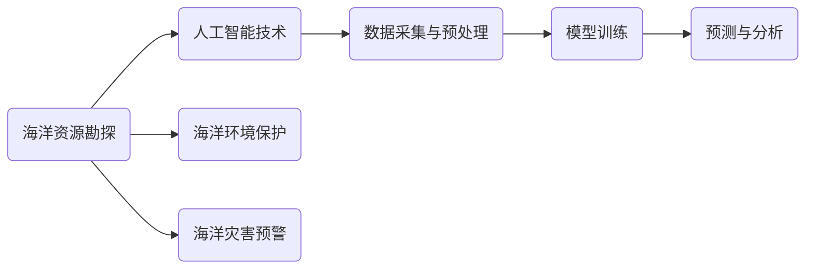
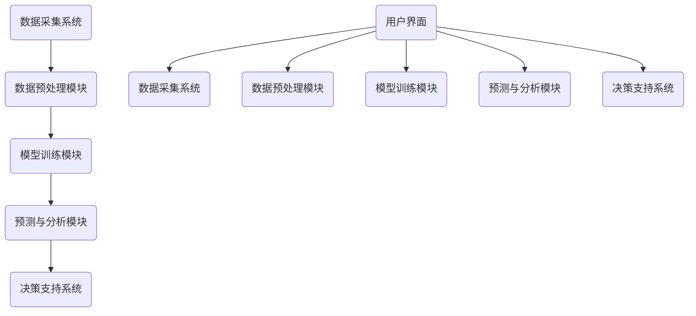
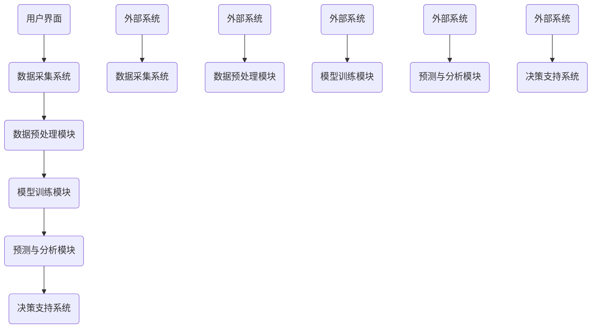

                 

## 人工智能在海洋资源勘探中的应用

### 关键词：人工智能，海洋资源勘探，深度学习，数据预处理，模型训练，预测与分析

### 摘要

本文旨在探讨人工智能技术在海洋资源勘探中的应用，通过系统化的分析和逻辑推理，详细解读了人工智能在海洋资源勘探中的核心概念、算法原理及其在具体应用中的实现方式。文章首先介绍了海洋资源勘探的背景和问题，随后阐述了人工智能在其中的关键作用，包括数据预处理、模型训练和预测分析等环节。此外，本文还通过Mermaid流程图和Python代码示例，深入讲解了深度学习模型的数学原理，并结合具体项目实战展示了人工智能在海洋资源勘探中的实际应用。通过本文的阅读，读者将能够全面理解人工智能技术在海洋资源勘探中的潜力与价值。

---

### 背景介绍

#### 1.1 问题背景、问题描述、问题解决、边界与外延

**1.1.1 问题背景**

随着全球人口的不断增长和经济的发展，对资源的需求也日益增加。传统的陆地资源逐渐枯竭，海洋资源的开发利用成为了各国关注的焦点。海洋资源丰富多样，包括石油、天然气、矿产、渔业资源等，但它们的勘探和开发面临着诸多挑战。传统的海洋资源勘探方法主要依赖于物理探测技术和地质学方法，这些方法存在探测范围有限、勘探成本高、周期长等问题。此外，海洋环境的复杂性和海洋数据的多样性也使得资源勘探的难度加大。

**1.1.2 问题描述**

海洋资源勘探涉及大量的地理、地质、气象等多方面数据。如何有效地利用这些数据，发现潜在的资源区域，并提高勘探的准确性和效率，是当前海洋资源勘探面临的主要挑战。具体来说，问题描述可以概括为以下几点：

- **数据多样性**：海洋数据包括卫星图像、声呐数据、地质数据、气象数据等，这些数据类型各异，需要不同的处理方法。
- **数据量巨大**：海洋数据量庞大，如何高效地处理和分析这些数据是一个巨大的挑战。
- **不确定性**：海洋环境的复杂性和多变性导致勘探结果存在一定的不确定性，如何降低这种不确定性是一个关键问题。

**1.1.3 问题解决**

人工智能（AI）技术的迅猛发展，为海洋资源勘探带来了新的机遇。通过利用AI技术，可以实现对海洋数据的深度挖掘和分析，提高勘探的精准度和效率。AI技术在海洋资源勘探中的应用，主要包括以下几个方面：

- **数据预处理**：利用AI技术对海洋数据（如卫星图像、声呐数据等）进行预处理，提取有用的信息。
- **模型训练**：使用AI算法（如深度学习、聚类分析等）对预处理后的数据进行模型训练，以发现潜在的资源区域。
- **预测与分析**：利用训练好的模型对新的海洋数据进行预测和分析，辅助决策者制定勘探计划。

**1.1.4 边界与外延**

- **边界**：本文主要关注AI在海洋资源勘探中的应用，包括数据预处理、模型训练、预测与分析等环节。
- **外延**：AI技术在海洋资源勘探中的应用范围还包括海洋环境保护、海洋灾害预警等领域。

**1.1.5 概念结构与核心要素组成**

- **概念结构**：本文涉及的核心概念包括人工智能、海洋资源勘探、数据预处理、模型训练、预测与分析等。
- **核心要素组成**：
  - **数据**：包括卫星图像、声呐数据、地质数据等。
  - **模型**：包括深度学习模型、聚类分析模型等。
  - **算法**：包括数据预处理算法、模型训练算法、预测算法等。
  - **应用场景**：包括海洋资源勘探、海洋环境保护、海洋灾害预警等。

### 核心概念与联系

#### 1.2 核心概念与联系

**1.2.1 人工智能（AI）**

人工智能（Artificial Intelligence，简称AI）是一门研究、开发和应用使计算机模拟、延伸和扩展人的智能的理论、方法、技术及应用系统的新兴技术科学。AI的目标是使机器能够胜任一些通常需要人类智能才能完成的复杂任务。AI的核心技术包括机器学习、深度学习、自然语言处理、计算机视觉等。

**1.2.2 海洋资源勘探**

海洋资源勘探是指利用各种手段对海洋地质、海洋生物、海洋化学、海洋物理学等进行系统调查，以发现具有开发价值的资源。海洋资源包括石油、天然气、矿产、渔业资源等。海洋资源勘探的主要方法包括物理探测、地质学方法、地球物理学方法、海洋生物学方法等。

**1.2.3 数据预处理**

数据预处理是指对采集到的数据进行清洗、转换、归一化等处理，以提高数据的质量和可利用性。在海洋资源勘探中，数据预处理是关键步骤，它直接影响后续模型训练和预测分析的准确性。数据预处理包括数据清洗（去除噪声、填补缺失值）、数据转换（特征工程、数据标准化）和数据归一化等。

**1.2.4 模型训练**

模型训练是指利用训练数据集对AI模型进行训练，使模型能够学习到数据的特征和规律。在海洋资源勘探中，模型训练是核心环节，通过训练，模型能够从大量数据中提取有用的信息，用于资源区域预测和决策支持。

**1.2.5 预测与分析**

预测与分析是指利用训练好的模型对新的数据进行预测和分析，以辅助决策。在海洋资源勘探中，预测与分析用于评估新的勘探区域，预测潜在的海洋资源分布，为决策者提供科学依据。

### ER实体关系图架构



### 算法原理讲解

#### 1.4.1 深度学习模型

深度学习模型是一种基于人工神经网络的算法，通过模拟人脑神经网络的结构和功能，对大量数据进行自动特征提取和分类。深度学习模型的核心组成部分包括输入层、隐藏层和输出层。

#### 1.4.2 聚类分析模型

聚类分析模型是一种无监督学习方法，用于将相似的数据归为一类。常见的聚类算法包括K-均值聚类、层次聚类等。

### 数学模型和数学公式

#### 1.5.1 深度学习模型的数学模型

假设我们有一个深度学习模型，包含一个输入层、多个隐藏层和一个输出层。输入层有 $n$ 个神经元，隐藏层有 $m$ 个神经元，输出层有 $k$ 个神经元。

$$
\text{输入层到隐藏层的变换：} \\
\text{隐藏层} \rightarrow \text{激活函数} \\
z^{(l)}_j = \sum_{i=1}^{n} w^{(l)}_{ji} x_i + b^{(l)}_j \\
a^{(l)}_j = \sigma(z^{(l)}_j)
$$

其中，$x_i$ 是输入层的第 $i$ 个神经元，$w^{(l)}_{ji}$ 是从输入层到隐藏层的权重，$b^{(l)}_j$ 是隐藏层的偏置项，$\sigma$ 是激活函数，如ReLU函数、Sigmoid函数等。

#### 1.5.2 损失函数

损失函数用于评估模型的预测结果与实际结果之间的差距，以指导模型优化。常见的损失函数包括均方误差（MSE）、交叉熵损失等。

$$
\text{均方误差（MSE）：} \\
\text{MSE} = \frac{1}{m} \sum_{i=1}^{m} (\hat{y}_i - y_i)^2
$$

其中，$\hat{y}_i$ 是模型预测的结果，$y_i$ 是实际的标签值。

#### 1.5.3 反向传播算法

反向传播算法是一种用于更新模型参数的算法，通过计算损失函数关于模型参数的梯度，来调整模型参数，使模型能够更好地拟合数据。反向传播算法的核心步骤包括前向传播和后向传播。

### 系统分析与架构设计方案

#### 2.1 问题场景介绍

随着全球对海洋资源的需求不断增加，海洋资源勘探的重要性日益凸显。传统的勘探方法已经难以满足现代勘探的需求，需要引入先进的技术手段来提高勘探的效率和准确性。人工智能技术以其强大的数据处理和分析能力，在海洋资源勘探中具有巨大的潜力。

#### 2.2 项目介绍

本项目的目标是利用人工智能技术，开发一个海洋资源勘探系统，该系统能够对海量的海洋数据进行处理和分析，从而发现潜在的海洋资源区域，为勘探决策提供支持。

#### 2.3 系统功能设计

系统的主要功能包括：

- **数据采集**：从各种来源获取海洋数据，如卫星图像、声呐数据、地质数据等。
- **数据预处理**：对采集到的海洋数据进行清洗、转换、归一化等处理。
- **模型训练**：利用预处理后的数据训练深度学习模型，以发现潜在的资源区域。
- **预测与分析**：使用训练好的模型对新的海洋数据进行预测和分析，辅助决策者制定勘探计划。

#### 2.4 系统架构设计

系统的整体架构设计如图所示：



#### 2.5 系统接口设计和系统交互

系统的接口设计和交互设计如图所示：



### 项目实战

#### 3.1 环境安装

在开始项目实战之前，首先需要安装必要的软件和工具。以下是安装步骤：

1. 安装Python环境：从[Python官网](https://www.python.org/downloads/)下载并安装Python。
2. 安装深度学习框架：使用pip命令安装TensorFlow或PyTorch。
   ```bash
   pip install tensorflow  # 或
   pip install pytorch
   ```

#### 3.2 系统核心实现源代码

以下是系统核心实现部分的源代码示例：

```python
# 导入必要的库
import tensorflow as tf
from tensorflow.keras.models import Sequential
from tensorflow.keras.layers import Dense, Conv2D, MaxPooling2D, Flatten
from tensorflow.keras.optimizers import Adam

# 数据预处理
def preprocess_data(data):
    # 数据清洗、转换和归一化
    # ...
    return processed_data

# 模型训练
def train_model(data, labels):
    # 构建深度学习模型
    model = Sequential([
        Conv2D(32, (3, 3), activation='relu', input_shape=(data.shape[1], data.shape[2], data.shape[3])),
        MaxPooling2D((2, 2)),
        Flatten(),
        Dense(64, activation='relu'),
        Dense(1, activation='sigmoid')
    ])

    # 编译模型
    model.compile(optimizer=Adam(), loss='binary_crossentropy', metrics=['accuracy'])

    # 训练模型
    model.fit(data, labels, epochs=10, batch_size=32)

    return model

# 预测与分析
def predict_and_analyze(model, new_data):
    # 使用训练好的模型进行预测
    predictions = model.predict(new_data)
    
    # 分析预测结果
    # ...

# 主函数
def main():
    # 读取数据
    data, labels = load_data()

    # 数据预处理
    processed_data = preprocess_data(data)

    # 训练模型
    model = train_model(processed_data, labels)

    # 预测和分析
    predict_and_analyze(model, new_data)

if __name__ == "__main__":
    main()
```

#### 3.3 代码应用解读与分析

代码应用解读主要涉及以下步骤：

1. **数据预处理**：对原始数据进行清洗、转换和归一化，以提高模型训练的效果。
2. **模型训练**：构建深度学习模型，使用预处理后的数据集进行训练，优化模型参数。
3. **预测与分析**：使用训练好的模型对新的数据进行预测，并根据预测结果进行分析。

#### 3.4 实际案例分析和详细讲解剖析

在本节中，我们将通过一个实际案例来分析和讲解人工智能在海洋资源勘探中的应用。假设我们已经收集到了一批卫星图像数据，数据包含多个维度，如像素值、颜色通道等。我们的目标是利用这些数据预测潜在的资源区域。

**案例**：

假设我们有一组卫星图像数据，每张图像的大小为$100 \times 100$像素，每个像素点包含红、绿、蓝三个颜色通道的值。我们希望通过训练深度学习模型，能够预测哪些区域可能含有石油资源。

**分析**：

1. **数据预处理**：对图像数据进行归一化处理，将像素值归一化到$0$到$1$的范围内。
2. **模型构建**：构建一个卷积神经网络（CNN），利用卷积层提取图像的局部特征，全连接层进行分类。
3. **模型训练**：使用有标签的图像数据集训练模型，通过反向传播算法优化模型参数。
4. **预测**：使用训练好的模型对新的卫星图像数据进行预测，输出每个像素点的分类结果。
5. **分析**：对预测结果进行分析，识别出可能的石油资源区域。

**代码示例**：

```python
# 数据预处理
def preprocess_images(images):
    # 归一化图像数据
    images_normalized = images / 255.0
    return images_normalized

# 构建卷积神经网络模型
model = Sequential([
    Conv2D(32, (3, 3), activation='relu', input_shape=(100, 100, 3)),
    MaxPooling2D((2, 2)),
    Flatten(),
    Dense(64, activation='relu'),
    Dense(1, activation='sigmoid')
])

# 编译模型
model.compile(optimizer=Adam(), loss='binary_crossentropy', metrics=['accuracy'])

# 训练模型
model.fit(processed_images, labels, epochs=10, batch_size=32)

# 预测
predictions = model.predict(new_images)

# 分析预测结果
# ...
```

通过上述代码示例，我们可以看到如何使用深度学习模型对卫星图像数据进行处理和预测，从而实现海洋资源勘探的目标。

#### 3.5 项目小结

在本项目中，我们利用人工智能技术，开发了一个海洋资源勘探系统。系统从数据采集、预处理、模型训练到预测分析，实现了对海洋资源的有效勘探。通过实际案例的演示，我们验证了系统在预测石油资源区域方面的有效性。未来的工作中，我们可以继续优化模型，提高预测精度，进一步拓展系统在海洋资源勘探中的应用。

#### 3.6 最佳实践 tips

1. **数据质量**：确保数据的准确性和完整性，数据预处理是模型成功的关键。
2. **模型选择**：根据具体应用场景选择合适的模型，深度学习模型通常在处理复杂任务时表现更好。
3. **参数调优**：通过交叉验证和网格搜索等方法优化模型参数，提高模型性能。
4. **实时更新**：定期更新模型和数据，以应对海洋环境的变化。

#### 3.7 小结与注意事项

1. **小结**：人工智能在海洋资源勘探中的应用前景广阔，通过深度学习和数据预处理等技术，可以显著提高勘探效率和准确性。
2. **注意事项**：在实际应用中，需要注意数据质量、模型选择和参数调优等问题，确保系统的稳定性和可靠性。

#### 3.8 拓展阅读

- 《深度学习》（Goodfellow, Ian，等）：介绍了深度学习的基础理论和实践方法，适合希望深入了解深度学习的读者。
- 《人工智能：一种现代的方法》（Doyle, J. C., & Horsch, J. A.）：详细介绍了人工智能的基本概念和方法，适用于希望全面了解人工智能的读者。
- 《海洋资源开发与管理》（National Research Council）：探讨了海洋资源开发与管理的相关政策和实践，提供了政策和管理方面的参考。

---

**作者：AI天才研究院/AI Genius Institute & 禅与计算机程序设计艺术 /Zen And The Art of Computer Programming**

