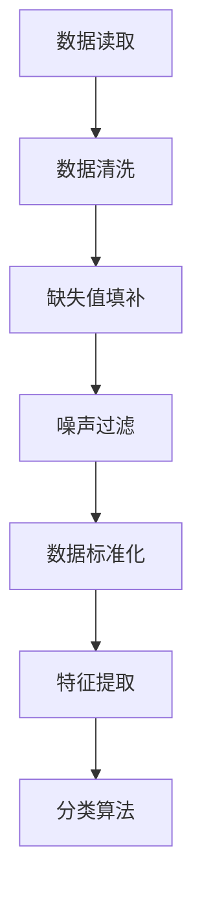
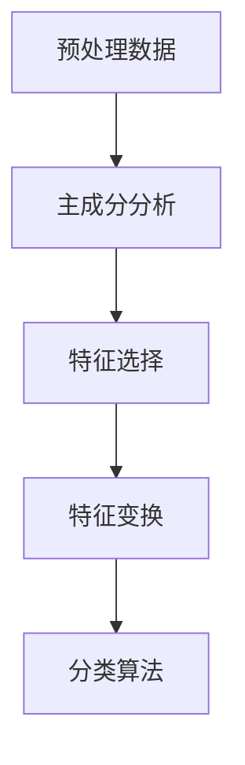
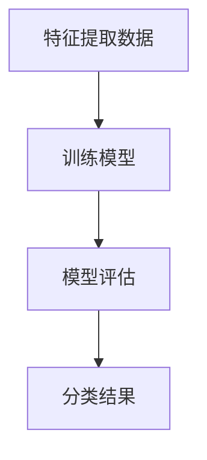
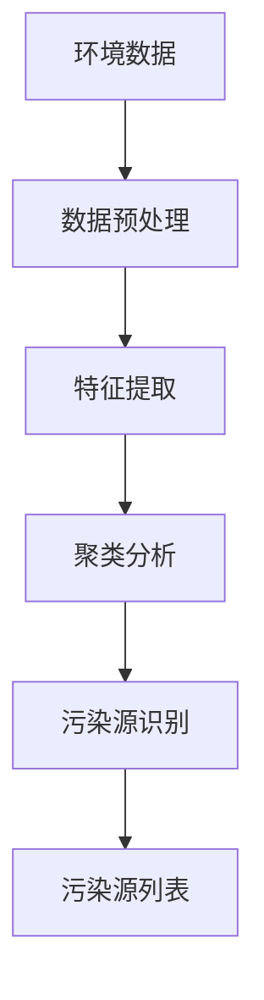
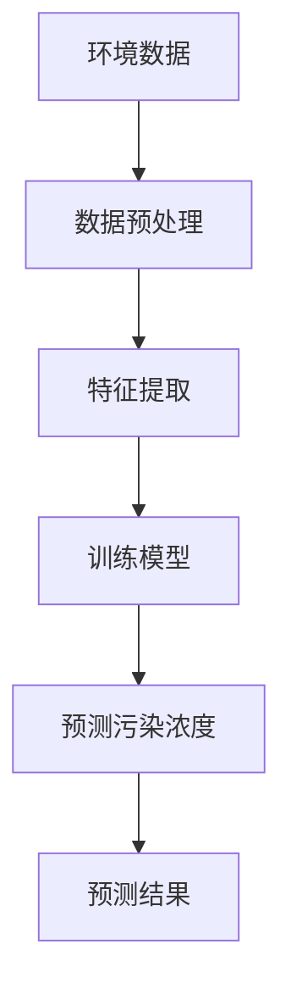
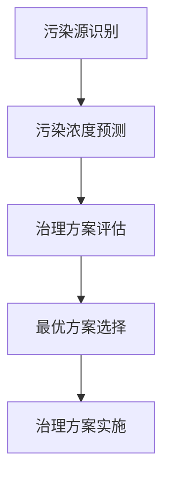

                 

### 1.1 问题背景

#### 1.1.1 环境保护的重要性

环境保护是一个全球性的议题，对人类的生存和发展至关重要。随着工业化和城市化的快速推进，环境问题日益严重，空气污染、水污染、土壤退化等问题层出不穷。这些问题不仅威胁到生态系统的平衡，也对人类健康和生活质量造成了极大的负面影响。

人工智能作为当今科技领域的明星，其在环境保护中的应用显得尤为重要。人工智能通过大数据分析、机器学习和深度学习等技术，能够高效地处理环境数据，提供精准的预测和分析结果，为环境保护决策提供科学依据。因此，探讨人工智能在环境保护中的应用具有重要的现实意义。

#### 1.1.2 人工智能在环境保护中的应用

人工智能在环境保护中的应用场景非常广泛，主要包括环境监测、污染治理、生态保护等方面。

**环境监测**：人工智能可以实时收集和分析环境数据，如空气质量、水质、土壤质量等，通过大数据分析和机器学习算法，对环境质量进行实时监测和预测。

**污染治理**：人工智能可以帮助识别污染源，预测污染扩散趋势，提供最优的污染治理方案。例如，通过分析污染数据，人工智能可以预测污染浓度随时间和空间的变化，从而制定出针对性的治理措施。

**生态保护**：人工智能可以用于生物多样性监测、栖息地评估、生态灾害预测等方面。例如，通过机器学习算法，可以对野生动物的行为进行模式识别，从而更好地保护生物多样性。

#### 1.1.3 当前环境保护面临的挑战

虽然人工智能在环境保护中具有巨大的潜力，但在实际应用中仍面临着诸多挑战。

**数据质量与可用性**：环境数据的真实性和准确性对于人工智能分析结果至关重要。然而，环境数据往往受到噪声、缺失值等影响，数据质量难以保证。

**算法可靠性**：人工智能算法的可靠性直接影响到环境保护决策的准确性。一些算法可能存在过拟合、欠拟合等问题，导致预测结果偏离实际情况。

**跨学科整合**：人工智能在环境保护中的应用需要跨学科的整合，包括环境科学、生态学、计算机科学等领域。这要求研究人员具备多学科的知识背景和协作能力。

**政策支持与法规**：人工智能在环境保护中的应用需要政策支持和法规保障。政府需要制定相应的政策和法规，鼓励和规范人工智能在环境保护中的应用。

#### 1.1.4 人工智能在环境保护中的前景

尽管面临挑战，但人工智能在环境保护中的前景仍然十分广阔。随着技术的不断进步和数据资源的丰富，人工智能在环境保护中的应用将不断拓展和深化。未来，人工智能有望成为环境保护的重要工具，为构建美好家园贡献力量。

### 1.2 问题描述

#### 1.2.1 环境污染问题的多样性和复杂性

环境污染问题具有多样性和复杂性。不同类型的污染物，如空气中的颗粒物、水中的重金属、土壤中的有机污染物等，其来源、扩散机制和影响方式各不相同。此外，环境污染问题还受到气候、地形、人类活动等多种因素的影响，使得环境问题更加复杂。

**空气污染**：空气污染主要来源于工业排放、交通尾气、建筑扬尘等。不同类型的空气污染物（如PM2.5、SO2、NOx等）对人类健康和生态环境的影响各不相同。例如，PM2.5可以深入肺部，导致呼吸道疾病；SO2和NOx则容易形成酸雨，破坏生态系统。

**水污染**：水污染主要来源于工业废水、生活污水、农药化肥等。水体中的污染物会导致水质恶化，影响饮用水安全，甚至破坏水生生态系统。例如，重金属污染物如铅、汞等会积累在水生生物体内，通过食物链影响人类健康。

**土壤污染**：土壤污染主要来源于农药、化肥、工业废弃物等。土壤污染会影响植物生长，降低土壤肥力，进而影响农业生产和生态平衡。此外，土壤中的有机污染物如多环芳烃等，也可能通过食物链影响人类健康。

#### 1.2.2 环境监测数据的处理和分析需求

环境监测是环境保护的重要手段，但环境监测数据往往具有量大、维度多、噪声大等特点，给数据处理和分析带来了巨大的挑战。

**数据量大**：环境监测数据通常覆盖广泛的区域和时间，数据量非常庞大。例如，一个城市的空气质量监测点可能达到数十个，每天产生的数据量以GB甚至TB计。

**数据维度多**：环境监测数据不仅包含单一指标的数值，还包含时间、空间、气象等多维信息。这些多维信息对于准确分析环境质量至关重要。

**数据噪声大**：环境监测数据常常受到噪声、干扰和缺失值的影响，导致数据质量难以保证。例如，气象条件的变化可能导致监测数据的波动，设备的故障可能导致数据的缺失。

为了解决上述问题，需要利用人工智能技术对环境监测数据进行高效处理和分析。

**数据预处理**：人工智能技术可以用于数据清洗、缺失值填补、噪声过滤等预处理操作，提高数据质量。

**特征提取**：通过特征提取技术，可以从原始监测数据中提取出对环境质量有重要影响的关键特征，为后续分析提供支持。

**数据挖掘与分析**：利用机器学习和深度学习算法，对处理后的监测数据进行挖掘和分析，提取环境质量变化的规律和趋势，为环境保护决策提供依据。

#### 1.2.3 环境治理的效率和效果提升需求

环境治理是环境保护的重要环节，但传统的环境治理方法效率较低，效果有限。随着人工智能技术的不断发展，环境治理的效率和效果有望得到显著提升。

**提高治理效率**：人工智能可以自动化执行环境监测、数据分析和治理方案制定等任务，减少人工干预，提高治理效率。

**精准治理**：通过大数据分析和机器学习算法，人工智能可以准确识别污染源和污染扩散趋势，提供精准的治理方案，避免资源浪费。

**动态调整**：环境治理过程中，污染源和污染程度可能随时间变化而变化。人工智能可以通过实时监测和动态分析，及时调整治理方案，提高治理效果。

**智能决策支持**：人工智能可以辅助环境管理部门进行决策，通过数据分析和模型预测，提供科学合理的治理建议，提高决策水平。

#### 1.2.4 人工智能在环境保护中的应用前景

随着人工智能技术的不断进步，其在环境保护中的应用前景十分广阔。

**环境监测**：人工智能可以实时监测环境质量，提供精准的数据分析和预测，为环境保护决策提供科学依据。

**污染治理**：人工智能可以智能识别污染源，预测污染扩散趋势，提供精准的治理方案，提高治理效率和效果。

**生态保护**：人工智能可以用于生物多样性监测、栖息地评估、生态灾害预测等方面，为生态保护提供技术支持。

**政策制定**：人工智能可以辅助政府制定环境保护政策，通过数据分析和模型预测，提供科学合理的政策建议。

总之，人工智能在环境保护中的应用具有巨大的潜力，有望成为解决环境问题的重要工具。但同时也需要克服技术、数据、政策和法规等方面的挑战，才能充分发挥其作用。

### 1.3 问题解决

#### 1.3.1 人工智能在环境监测中的应用

环境监测是环境保护的基础，而人工智能技术可以显著提升环境监测的精度和效率。

**实时监测与预警**：人工智能通过传感器网络和大数据分析，可以实时监测环境质量，及时发现异常情况并发出预警。例如，通过分析空气质量监测数据，人工智能可以预测雾霾的发生和变化趋势，为政府部门和公众提供预警信息。

**数据预处理与特征提取**：环境监测数据往往包含大量的噪声和缺失值，人工智能可以通过数据预处理技术，如数据清洗、缺失值填补和噪声过滤，提高数据质量。此外，人工智能还可以提取关键特征，如空气质量指数（AQI）、水污染指数（WI）等，为后续分析提供支持。

**数据挖掘与分析**：人工智能可以通过机器学习和深度学习算法，对处理后的监测数据进行挖掘和分析，提取环境质量变化的规律和趋势。例如，通过分析水质监测数据，人工智能可以预测水质变化趋势，为水质管理提供依据。

**智能预测模型**：人工智能可以通过建立预测模型，对未来环境质量进行预测。例如，通过训练空气质量预测模型，人工智能可以预测未来几小时或几天内的空气质量，帮助政府部门制定相应的污染控制措施。

**综合应用**：人工智能还可以与其他技术相结合，如物联网、地理信息系统（GIS）等，实现环境监测的智能化和自动化。例如，通过物联网设备实时收集环境数据，结合GIS技术展示数据分布情况，为环境保护决策提供可视化支持。

#### 1.3.2 人工智能在污染治理中的应用

污染治理是环境保护的关键环节，人工智能可以通过智能化手段提高污染治理的效率和效果。

**污染源识别**：人工智能可以通过大数据分析和机器学习算法，识别污染源。例如，通过分析环境监测数据，人工智能可以定位空气污染物的主要排放源，为污染治理提供目标。

**污染扩散预测**：人工智能可以通过建立污染扩散模型，预测污染物的扩散趋势和影响范围。例如，通过训练污染扩散模型，人工智能可以预测雾霾的扩散路径和影响区域，为污染控制提供依据。

**最优治理方案**：人工智能可以通过分析多种治理方案的效果，提供最优的污染治理方案。例如，通过优化算法，人工智能可以确定最佳排放控制和污染处理策略，最大限度地减少污染排放。

**实时监控与调整**：人工智能可以实时监控污染治理效果，根据实际情况及时调整治理方案。例如，通过实时监测空气质量，人工智能可以动态调整减排措施，确保污染治理效果。

**协同治理**：人工智能可以通过协同治理机制，整合政府、企业和社会的力量，共同推进污染治理。例如，通过建立智能协同平台，政府可以实时监控企业排放情况，企业可以及时调整生产计划，公众可以参与环境监督和治理。

#### 1.3.3 人工智能在生态保护中的应用

生态保护是环境保护的重要组成部分，人工智能可以通过智能化手段提升生态保护的效果。

**生物多样性监测**：人工智能可以通过图像识别、声音识别等技术，监测生物多样性。例如，通过分析红外相机捕捉的图像，人工智能可以识别野生动物的种类和数量，为生物多样性保护提供数据支持。

**栖息地评估**：人工智能可以通过遥感技术和地理信息系统（GIS），评估栖息地的质量和变化趋势。例如，通过分析卫星遥感图像，人工智能可以识别栖息地的变化，为栖息地保护提供依据。

**生态灾害预测**：人工智能可以通过大数据分析和机器学习算法，预测生态灾害的发生。例如，通过分析气象数据、土壤数据等，人工智能可以预测干旱、洪涝等生态灾害的发生，为防灾减灾提供预警。

**智能决策支持**：人工智能可以通过数据分析和模型预测，为生态保护决策提供支持。例如，通过分析生物多样性数据和栖息地变化趋势，人工智能可以为保护区设立和管理提供科学依据。

**生态修复**：人工智能可以通过智能化的生态修复技术，提升生态修复的效果。例如，通过建立生态系统模型，人工智能可以预测生态修复的效果，为修复方案制定提供依据。

总之，人工智能在环境保护中的应用具有广泛的前景。通过智能化手段，人工智能可以提升环境监测、污染治理和生态保护的效率和效果，为建设美丽中国、实现可持续发展贡献力量。

### 1.4 边界与外延

在探讨人工智能在环境保护中的应用时，有必要明确本书的讨论范畴，以避免范围的过度扩张或局限。

#### 1.4.1 本书讨论的范畴

本书主要讨论人工智能在环境保护中的应用，具体包括以下几个主要方面：

1. **环境监测**：讨论人工智能如何通过传感器网络和数据分析技术，实现环境质量的实时监测和预警。
2. **污染治理**：分析人工智能在识别污染源、预测污染扩散和制定最优治理方案等方面的应用。
3. **生态保护**：探讨人工智能在生物多样性监测、栖息地评估和生态灾害预测等方面的作用。
4. **政策支持**：讨论人工智能如何辅助政府制定环境保护政策和进行环境管理。

#### 1.4.2 关键技术概述

为了实现上述应用，本书将涉及以下关键技术：

1. **大数据分析**：利用大数据技术，对环境监测数据进行存储、处理和分析，提取关键信息。
2. **机器学习和深度学习**：通过机器学习和深度学习算法，对环境数据进行分析和建模，实现环境监测和治理的智能化。
3. **物联网**：利用物联网技术，实现环境监测设备的联网和数据实时传输。
4. **地理信息系统（GIS）**：通过GIS技术，展示环境数据的空间分布和变化趋势。
5. **人工智能算法**：包括监督学习、非监督学习和强化学习等，用于环境监测和治理的不同场景。

#### 1.4.3 本书不讨论的范畴

虽然人工智能在环境保护中的应用广泛，但本书不涉及以下方面：

1. **环境伦理**：尽管环境伦理在环境保护中至关重要，但本书主要关注技术层面，不探讨伦理问题。
2. **环境经济学**：虽然环境经济学与环境保护密切相关，但本书主要关注人工智能技术的应用，不涉及经济分析。
3. **具体政策制定**：本书主要介绍人工智能技术在不同环境保护领域的应用，不深入探讨具体政策制定问题。
4. **硬件设计和制造**：本书不涉及环境监测和治理所需硬件的设计和制造，主要关注软件和算法层面。

通过明确讨论范畴和关键技术，本书旨在为读者提供一个清晰、系统的关于人工智能在环境保护中的应用指南。

### 1.5 核心要素组成

在探讨人工智能在环境保护中的应用时，理解其核心概念、技术原理及其相互关系至关重要。以下是环境保护中人工智能应用的核心要素及其组成。

#### 1.5.1 人工智能基础

人工智能（Artificial Intelligence，AI）是模仿人类智能行为的技术，主要包括以下几个核心概念：

1. **机器学习**：机器学习是一种通过数据训练模型，使模型能够从数据中学习并做出预测或决策的技术。它包括监督学习、非监督学习和强化学习等不同类型。
   
2. **深度学习**：深度学习是机器学习的一个分支，通过构建多层神经网络，实现对复杂数据的自动特征提取和建模。深度学习在图像识别、语音识别和自然语言处理等领域具有显著优势。

3. **神经网络**：神经网络是深度学习的基础，由大量简单的人工神经元组成，通过学习数据，可以识别复杂的模式。

#### 1.5.2 机器学习与深度学习

机器学习和深度学习在人工智能中扮演着核心角色，它们的主要特点和应用场景如下：

1. **监督学习**：监督学习通过标记好的训练数据来训练模型，使模型能够对新数据进行预测。它适用于分类和回归问题。

2. **非监督学习**：非监督学习不使用标记数据，通过发现数据中的内在结构和模式来进行聚类和降维。它适用于数据探索和数据分析。

3. **强化学习**：强化学习通过与环境互动来学习最优策略，适用于需要决策和控制的场景，如自动驾驶和游戏。

4. **深度学习模型**：深度学习模型主要包括卷积神经网络（CNN）、循环神经网络（RNN）和生成对抗网络（GAN）等。每种模型都有其特定的应用场景和优势。

#### 1.5.3 数据处理与分析技术

数据处理与分析技术是人工智能在环境保护中应用的重要环节，主要包括：

1. **数据采集**：通过传感器网络和物联网设备，实时采集环境数据，如空气质量、水质、土壤质量等。

2. **数据预处理**：包括数据清洗、缺失值填补和噪声过滤等，以提高数据质量，为模型训练提供可靠的数据基础。

3. **特征提取**：从原始数据中提取关键特征，如时间序列特征、空间特征和气象特征等，用于模型训练和预测。

4. **数据挖掘**：利用机器学习和深度学习算法，对处理后的数据进行挖掘和分析，提取环境质量变化的规律和趋势。

5. **预测模型**：通过训练预测模型，对环境质量进行预测，为环境保护决策提供科学依据。

#### 1.5.4 其他核心技术

除了上述核心要素，人工智能在环境保护中还需要依赖其他关键技术，如：

1. **地理信息系统（GIS）**：通过GIS技术，展示环境数据的空间分布和变化趋势，为环境监测和治理提供可视化支持。

2. **物联网**：通过物联网技术，实现环境监测设备的联网和数据实时传输，提高环境监测的实时性和准确性。

3. **多源数据融合**：结合多种数据源（如卫星遥感、地面监测、无人机监测等），提高环境数据的全面性和准确性。

4. **云计算和大数据平台**：利用云计算和大数据平台，存储和处理海量的环境数据，为人工智能算法提供强大的计算和存储支持。

通过理解这些核心要素及其相互关系，我们可以更好地把握人工智能在环境保护中的应用方向，为解决环境问题提供技术支持。

### 2.1 核心概念原理

在深入探讨人工智能在环境保护中的应用之前，我们需要先理解几个核心概念，包括人工智能、机器学习、深度学习等。

#### 2.1.1 人工智能

人工智能（Artificial Intelligence，AI）是计算机科学的一个分支，旨在通过模拟人类智能行为，使计算机具备自主处理信息和解决问题的能力。人工智能可以分为两大类：弱人工智能（Narrow AI）和强人工智能（General AI）。

1. **弱人工智能（Narrow AI）**：弱人工智能专注于特定任务，如语音识别、图像识别、自然语言处理等。这类人工智能虽然在特定领域表现出色，但无法进行跨领域的通用任务。

2. **强人工智能（General AI）**：强人工智能具备广泛的理解能力，能够在各种环境中进行推理和学习，类似于人类的智能。目前，强人工智能尚未实现，仍处于研究阶段。

#### 2.1.2 机器学习

机器学习（Machine Learning，ML）是人工智能的一个重要分支，通过算法和统计模型，使计算机从数据中学习并做出预测或决策。机器学习主要包括以下几种类型：

1. **监督学习（Supervised Learning）**：监督学习通过标记好的训练数据，训练模型以对新数据进行预测。常见的监督学习算法包括线性回归、逻辑回归、支持向量机（SVM）和决策树等。

2. **非监督学习（Unsupervised Learning）**：非监督学习不使用标记数据，通过发现数据中的内在结构和模式来进行聚类、降维等任务。常见的非监督学习算法包括K-均值聚类、主成分分析（PCA）和自编码器等。

3. **强化学习（Reinforcement Learning）**：强化学习通过与环境的互动来学习最优策略。在强化学习中，智能体根据当前状态和奖励信号，选择动作以最大化长期回报。常见的强化学习算法包括Q学习、SARSA和深度Q网络（DQN）等。

#### 2.1.3 深度学习

深度学习（Deep Learning，DL）是机器学习的一个分支，通过构建多层神经网络，实现对复杂数据的自动特征提取和建模。深度学习在图像识别、语音识别和自然语言处理等领域取得了显著成果。

1. **卷积神经网络（Convolutional Neural Network，CNN）**：卷积神经网络是深度学习在图像识别领域的经典模型。CNN通过卷积层、池化层和全连接层，实现对图像的逐层特征提取和分类。

2. **循环神经网络（Recurrent Neural Network，RNN）**：循环神经网络是深度学习在序列数据处理领域的经典模型。RNN通过循环结构，实现对时间序列数据的记忆和预测。

3. **生成对抗网络（Generative Adversarial Network，GAN）**：生成对抗网络是一种由生成器和判别器组成的对抗性模型，通过博弈过程生成真实数据的分布。GAN在图像生成、图像修复和图像风格迁移等领域表现出色。

通过理解人工智能、机器学习和深度学习的基本原理，我们可以更好地把握其在环境保护中的应用。接下来，我们将通过具体的算法原理讲解，深入探讨这些技术在环境监测、污染治理和生态保护中的实际应用。

#### 2.2 概念属性特征对比表格

为了更好地理解人工智能、机器学习、深度学习这三个核心概念及其应用场景，我们通过一个表格形式对它们的属性特征进行对比。

| 概念 | 定义 | 特点 | 应用场景 |
| --- | --- | --- | --- |
| **人工智能** | 模拟人类智能行为的技术 | - 广泛领域应用 | - 专家系统、自然语言处理、图像识别 |
| **机器学习** | 通过数据学习并做出预测或决策 | - 标签数据依赖、模式识别 | - 监督学习、非监督学习、强化学习 |
| **深度学习** | 基于多层神经网络的复杂数据处理 | - 自动特征提取、高效处理能力 | - 图像识别、语音识别、自然语言处理 |

通过这个表格，我们可以看到：

1. **人工智能**侧重于模拟人类智能行为，应用范围广泛，但依赖于具体的机器学习或深度学习算法实现。
2. **机器学习**是人工智能的一个分支，依赖于标签数据，主要用于模式识别和预测，包括监督学习、非监督学习和强化学习。
3. **深度学习**是基于多层神经网络的复杂数据处理技术，能够自动提取特征，具有高效的处理能力，广泛应用于图像识别、语音识别和自然语言处理等任务。

这样的对比有助于我们更清晰地理解这三个概念及其相互关系，从而更好地把握人工智能在环境保护中的应用。

#### 2.3 ER实体关系图架构

为了更好地理解人工智能在环境保护中的应用，我们将使用Mermaid绘制ER（实体关系）图，展示各实体之间的关系。

首先，让我们绘制一个简单的环境监测系统的ER图。

```mermaid
erDiagram
    PollutionData ||--|{ AirQuality : 监测数据 }
    PollutionData ||--|{ WaterQuality : 监测数据 }
    PollutionData ||--|{ SoilQuality : 监测数据 }
    Sensor ||--|{ AirSensor : 传感器 }
    Sensor ||--|{ WaterSensor : 传感器 }
    Sensor ||--|{ SoilSensor : 传感器 }
    DataProcessor ||--|{ Preprocessor : 数据预处理 }
    DataProcessor ||--|{ Analyzer : 数据分析 }
    PredictionModel ||--|{ Model : 模型 }
    PredictionModel ||--|{ Predictor : 预测器 }
```

在这个ER图中，我们定义了以下几个实体：

1. **Sensor**（传感器）：包括各种类型的传感器，如空气传感器、水传感器和土壤传感器。
2. **PollutionData**（污染数据）：包括空气、水和土壤的污染数据。
3. **DataProcessor**（数据处理器）：包括数据预处理和分析功能。
4. **PredictionModel**（预测模型）：用于环境质量预测的模型。
5. **Predictor**（预测器）：基于预测模型进行环境质量预测的工具。

接下来，我们进一步扩展ER图，以涵盖污染治理和生态保护的应用。

```mermaid
erDiagram
    PollutionData ||--|{ AirQuality : 监测数据 }
    PollutionData ||--|{ WaterQuality : 监测数据 }
    PollutionData ||--|{ SoilQuality : 监测数据 }
    Sensor ||--|{ AirSensor : 传感器 }
    Sensor ||--|{ WaterSensor : 传感器 }
    Sensor ||--|{ SoilSensor : 传感器 }
    DataProcessor ||--|{ Preprocessor : 数据预处理 }
    DataProcessor ||--|{ Analyzer : 数据分析 }
    PredictionModel ||--|{ Model : 模型 }
    PredictionModel ||--|{ Predictor : 预测器 }
    PollutionControl ||--|{ Cleaner : 污染治理 }
    PollutionControl ||--|{ Remediator : 污染修复 }
    EcologicalMonitoring ||--|{ BiodiversityMonitor : 生物多样性监测 }
    EcologicalMonitoring ||--|{ HabitatAssessment : 栖息地评估 }
    EcologicalProtection ||--|{ ConservationPlan : 保护计划 }
    EcologicalProtection ||--|{ DisasterPrediction : 灾害预测 }
```

在这个扩展的ER图中，我们增加了以下几个实体：

1. **PollutionControl**（污染治理）：包括污染清除和污染修复功能。
2. **EcologicalMonitoring**（生态监测）：包括生物多样性监测和栖息地评估。
3. **EcologicalProtection**（生态保护）：包括保护计划和灾害预测。

通过ER图，我们可以清晰地看到各实体之间的关系，例如传感器采集数据后，由数据处理器进行预处理和分析，生成的预测模型和预测器用于环境质量预测；污染治理模块负责处理污染问题；生态监测和生态保护模块负责生物多样性和栖息地保护。这样的ER图有助于我们更好地理解人工智能在环境保护中的应用架构。

### 3.1 算法原理讲解

在本章节中，我们将深入探讨环境监测数据分析的算法原理，包括监测数据预处理、特征提取和分类算法。通过具体的算法流程图和Python代码，我们将帮助读者理解这些算法在实际应用中的工作原理。

#### 3.1.1 监测数据预处理

监测数据预处理是环境监测数据分析的第一步，其目的是提高数据质量，为后续的特征提取和分类算法提供可靠的数据基础。以下是一个典型的监测数据预处理流程：

1. **数据清洗**：去除噪声和异常值，如缺失值、重复值和异常值。
2. **缺失值填补**：对缺失值进行填补，常用的方法有均值填补、中值填补和插值法等。
3. **噪声过滤**：过滤掉监测数据中的噪声，如随机波动和突变值。

我们使用Mermaid绘制一个简单的监测数据预处理算法流程图：



接下来，我们通过Python代码实现这个预处理流程。以下是一个简单的Python代码示例，使用了`pandas`和`numpy`库：

```python
import pandas as pd
import numpy as np

# 假设数据集dataframe为df
df = pd.DataFrame({
    'AirQuality': [0.1, np.nan, 0.3, 0.4, np.nan],
    'WaterQuality': [0.5, 0.6, 0.7, np.nan, 0.9]
})

# 数据清洗
df = df.drop_duplicates()  # 去除重复值
df = df.replace([np.inf, -np.inf], np.nan)  # 替换无穷值为NaN

# 缺失值填补
df['AirQuality'].fillna(df['AirQuality'].mean(), inplace=True)
df['WaterQuality'].fillna(df['WaterQuality'].mean(), inplace=True)

# 噪声过滤
df['AirQuality'] = df['AirQuality'].drop([1])  # 去除异常值
df['WaterQuality'] = df['WaterQuality'].drop([4])

# 数据标准化
df = (df - df.mean()) / df.std()

# 输出预处理后的数据
print(df)
```

#### 3.1.2 特征提取

特征提取是环境监测数据分析的重要环节，其目的是从原始数据中提取出对环境质量有重要影响的关键特征。常用的特征提取方法包括：

1. **主成分分析（PCA）**：通过降维技术，将多个相关特征转化为少数几个主成分，以减少数据维度。
2. **特征选择**：通过评估特征的重要性，选择出对分类任务最有用的特征。
3. **特征变换**：如归一化、对数变换等，以适应不同特征的数据范围。

我们使用Mermaid绘制一个简单的特征提取算法流程图：



接下来，我们通过Python代码实现主成分分析（PCA）：

```python
from sklearn.decomposition import PCA
from sklearn.preprocessing import StandardScaler

# 假设预处理后的数据为X
X = df.values

# 数据标准化
X = StandardScaler().fit_transform(X)

# 主成分分析
pca = PCA(n_components=2)
X_pca = pca.fit_transform(X)

# 输出主成分
print("主成分：\n", X_pca)
```

#### 3.1.3 监测数据分类算法

分类算法是环境监测数据分析的最后一步，其目的是对处理后的数据进行分析和分类。常用的分类算法包括：

1. **支持向量机（SVM）**：通过寻找最优超平面，将不同类别的数据分开。
2. **决策树**：通过递归划分特征，构建一棵决策树。
3. **随机森林**：通过集成多个决策树，提高分类性能。

我们使用Mermaid绘制一个简单的分类算法流程图：



接下来，我们通过Python代码实现支持向量机（SVM）分类：

```python
from sklearn.svm import SVC
from sklearn.model_selection import train_test_split
from sklearn.metrics import accuracy_score

# 假设特征提取后的数据为X，标签为y
X = X_pca
y = df['AirQuality'].apply(lambda x: 1 if x > 0.2 else 0)  # 示例标签

# 数据分割
X_train, X_test, y_train, y_test = train_test_split(X, y, test_size=0.2, random_state=42)

# 训练SVM模型
model = SVC(kernel='linear')
model.fit(X_train, y_train)

# 模型评估
y_pred = model.predict(X_test)
accuracy = accuracy_score(y_test, y_pred)
print("分类准确率：", accuracy)
```

通过上述流程图和代码，我们可以看到环境监测数据分析的基本原理和实现方法。这些算法在实际应用中可以通过调整参数和优化策略，进一步提高分类性能和预测精度。

### 3.1.4 污染治理算法

污染治理算法是人工智能在环境保护中的应用的重要组成部分，主要用于识别污染源、预测污染扩散和制定最优治理方案。在本节中，我们将详细介绍污染治理算法的原理，并通过具体的算法流程图和Python代码来帮助读者理解。

#### 3.1.4.1 污染源识别

污染源识别是污染治理的首要任务，其目的是通过分析环境数据，识别出污染的主要来源。常用的污染源识别算法包括聚类分析、支持向量机和神经网络等。

我们使用Mermaid绘制一个简单的污染源识别算法流程图：



接下来，我们通过Python代码实现基于K-均值聚类的污染源识别：

```python
from sklearn.cluster import KMeans
import pandas as pd

# 假设环境数据为DataFrame
data = pd.DataFrame({
    'AirQuality': [0.1, 0.3, 0.5, 0.7, 0.9],
    'WaterQuality': [0.2, 0.4, 0.6, 0.8, 1.0]
})

# 数据预处理和特征提取
data = (data - data.mean()) / data.std()

# K-均值聚类
kmeans = KMeans(n_clusters=2, random_state=42)
clusters = kmeans.fit_predict(data)

# 输出污染源
print("污染源：\n", data[clusters == 1])
```

在这个示例中，我们使用K-均值聚类算法对环境数据进行分析，识别出污染源。

#### 3.1.4.2 污染浓度预测

污染浓度预测是污染治理的关键环节，其目的是通过分析历史数据和当前环境数据，预测污染浓度随时间和空间的变化。常用的污染浓度预测算法包括线性回归、神经网络和支持向量机等。

我们使用Mermaid绘制一个简单的污染浓度预测算法流程图：



接下来，我们通过Python代码实现基于线性回归的污染浓度预测：

```python
from sklearn.linear_model import LinearRegression
import pandas as pd

# 假设历史污染数据为DataFrame
data = pd.DataFrame({
    'Time': [1, 2, 3, 4, 5],
    'AirQuality': [0.1, 0.3, 0.5, 0.7, 0.9]
})

# 数据预处理和特征提取
data = (data - data.mean()) / data.std()

# 训练线性回归模型
model = LinearRegression()
model.fit(data[['Time']], data['AirQuality'])

# 预测未来污染浓度
time = pd.Series([6, 7, 8])
predicted_quality = model.predict(time.reshape(-1, 1))
print("预测污染浓度：\n", predicted_quality)
```

在这个示例中，我们使用线性回归模型对历史污染数据进行分析，预测未来的污染浓度。

#### 3.1.4.3 最优治理方案

最优治理方案是基于污染源识别和污染浓度预测的结果，制定出最优的污染治理策略。常用的治理方案包括排放控制、污染处理和生态修复等。

我们使用Mermaid绘制一个简单的最优治理方案算法流程图：



接下来，我们通过Python代码实现一个简单的治理方案评估：

```python
def evaluate_policy(policy, pollution):
    # 假设policy为治理方案，污染浓度为pollution
    if policy == 'EmissionControl':
        # 排放控制
        pollution = pollution * 0.8
    elif policy == 'PollutionTreatment':
        # 污染处理
        pollution = pollution * 0.6
    elif policy == 'EcologicalRestoration':
        # 生态修复
        pollution = pollution * 0.4
    return pollution

# 示例污染浓度
pollution = 1.0

# 评估治理方案
policy = 'EmissionControl'
new_pollution = evaluate_policy(policy, pollution)
print("评估结果：\n", new_pollution)
```

在这个示例中，我们定义了一个评估治理方案的效果函数，通过不同的治理方案，评估其对污染浓度的影响。

通过上述算法流程图和Python代码，我们可以看到污染治理算法的基本原理和实现方法。在实际应用中，这些算法可以通过调整参数和优化策略，进一步提高治理效果。

### 3.1.5 监测数据预处理

在深入探讨环境监测数据分析的算法之前，我们首先需要了解监测数据预处理的重要性及其具体方法。环境监测数据通常包含噪声、缺失值和异常值，这些都会影响后续分析的准确性和效果。因此，监测数据预处理是环境监测数据分析的重要步骤。

#### 3.1.5.1 数据清洗

数据清洗是指去除数据中的噪声和异常值，以提高数据质量。以下是数据清洗的一些常见方法：

1. **去除重复值**：数据集中可能存在重复的数据记录，这些重复值可能会导致分析结果的不准确。因此，我们需要去除这些重复值。

2. **处理缺失值**：监测数据中可能存在缺失值，处理缺失值的方法包括：
   - **均值填补**：用数据集的平均值来填补缺失值。
   - **中值填补**：用数据集的中值来填补缺失值。
   - **插值法**：使用插值方法（如线性插值、高斯插值等）来填补缺失值。

3. **去除异常值**：异常值是指那些与数据整体分布不一致的值，可能是由于数据采集错误或设备故障等原因造成的。处理异常值的方法包括：
   - **标准差法**：去除距离平均值超过一定倍数标准差的异常值。
   - **箱线图法**：使用箱线图来确定异常值，通常去除低于下四分位数1.5倍和高于上四分位数1.5倍的值。

#### 3.1.5.2 数据标准化

数据标准化是将不同特征的数据转换到同一尺度，以便进行后续分析。常用的数据标准化方法包括：

1. **归一化**：将数据缩放到[0, 1]的范围内，公式为：\( x_{\text{normalized}} = \frac{x - x_{\text{min}}}{x_{\text{max}} - x_{\text{min}}} \)。

2. **标准化**：将数据缩放到均值为0，标准差为1的范围内，公式为：\( x_{\text{standardized}} = \frac{x - \mu}{\sigma} \)，其中\(\mu\)是均值，\(\sigma\)是标准差。

#### 3.1.5.3 数据填充

数据填充是指填补缺失值的方法，常用的方法包括：

1. **均值填充**：用数据集的平均值来填补缺失值。

2. **中值填充**：用数据集的中值来填补缺失值。

3. **插值法**：使用插值方法（如线性插值、高斯插值等）来填补缺失值。

#### 3.1.5.4 数据去噪

数据去噪是指去除噪声和异常值的方法，常用的方法包括：

1. **移动平均法**：通过计算连续若干个数据的平均值，来平滑数据序列。

2. **中值滤波**：使用中值来替换周围点中的异常值。

#### 3.1.5.5 数据转换

数据转换是指将数据从一种形式转换到另一种形式，以便进行后续分析。常用的数据转换方法包括：

1. **对数转换**：将数据取对数，以减少数据分布的偏态。

2. **逆转换**：在进行预测分析后，将预测结果转换回原始数据形式。

### 3.1.5.6 具体案例

以下是一个具体的监测数据预处理案例，我们将使用Python代码演示如何对环境监测数据进行预处理。

```python
import pandas as pd
from sklearn.impute import SimpleImputer
from sklearn.preprocessing import StandardScaler
from scipy.stats import zscore

# 示例数据
data = pd.DataFrame({
    'AirQuality': [0.1, np.nan, 0.3, 0.4, np.nan],
    'WaterQuality': [0.2, 0.4, 0.6, np.nan, 0.9]
})

# 数据清洗
data = data.drop_duplicates()

# 处理缺失值
imputer = SimpleImputer(strategy='mean')
data[['AirQuality', 'WaterQuality']] = imputer.fit_transform(data[['AirQuality', 'WaterQuality']])

# 去除异常值
z_scores = zscore(data)
filtered_data = data[(z_scores > -3) & (z_scores < 3)]

# 数据标准化
scaler = StandardScaler()
standardized_data = scaler.fit_transform(filtered_data)

# 输出预处理后的数据
print(filtered_data)
print(standardized_data)
```

在这个案例中，我们首先使用`drop_duplicates`方法去除重复值，然后使用`SimpleImputer`填补缺失值，接着使用`zscore`函数去除异常值，最后使用`StandardScaler`进行数据标准化。通过这些步骤，我们得到了质量更高的预处理数据，为后续的特征提取和分类算法提供了可靠的数据基础。

### 3.1.6 监测数据特征提取

在环境监测数据分析中，特征提取是一个关键步骤，其目的是从原始数据中提取出对环境质量有重要影响的关键特征。特征提取不仅可以降低数据的维度，还可以提高模型训练的效率和准确性。以下是几种常用的特征提取方法：

#### 3.1.6.1 主成分分析（PCA）

主成分分析（Principal Component Analysis，PCA）是一种常用的降维技术，通过将多个相关特征转化为少数几个主成分，以减少数据维度。PCA的基本步骤如下：

1. **数据标准化**：对数据进行标准化处理，使其具有相同的尺度。
2. **计算协方差矩阵**：计算各特征之间的协方差矩阵。
3. **计算特征值和特征向量**：对协方差矩阵进行特征值和特征向量的分解。
4. **选择主成分**：选择前几个特征值较大的特征向量作为主成分。
5. **转换数据**：将原始数据投影到主成分空间。

PCA的Python代码实现如下：

```python
from sklearn.decomposition import PCA
import pandas as pd

# 假设预处理后的数据为DataFrame
data = pd.DataFrame({
    'AirQuality': [0.1, 0.3, 0.5, 0.7, 0.9],
    'WaterQuality': [0.2, 0.4, 0.6, 0.8, 1.0]
})

# 数据标准化
data = (data - data.mean()) / data.std()

# 主成分分析
pca = PCA(n_components=2)
X_pca = pca.fit_transform(data)

# 输出主成分
print("主成分：\n", X_pca)
```

#### 3.1.6.2 独热编码

独热编码（One-Hot Encoding）是一种将类别特征转换为数值特征的方法，适用于处理类别变量。独热编码的基本步骤如下：

1. **创建独热编码矩阵**：对于每个类别特征，创建一个二进制矩阵，其中每一行对应一个类别，每一列对应一个特征。
2. **转换数据**：将原始数据替换为独热编码矩阵。

独热编码的Python代码实现如下：

```python
from sklearn.preprocessing import OneHotEncoder
import pandas as pd

# 假设预处理后的数据为DataFrame
data = pd.DataFrame({
    'AirQuality': ['Good', 'Poor', 'Fair', 'Good', 'Excellent']
})

# 独热编码
encoder = OneHotEncoder()
encoded_data = encoder.fit_transform(data[['AirQuality']])

# 输出独热编码结果
print(encoded_data.toarray())
```

#### 3.1.6.3 词袋模型

词袋模型（Bag of Words，BOW）是一种用于文本数据特征提取的方法，其基本思想是将文本数据表示为一个词频向量。词袋模型的步骤如下：

1. **构建词汇表**：将文本数据中的所有单词构建为一个词汇表。
2. **计算词频**：对于每个文本，计算其在词汇表中的词频。
3. **转换数据**：将文本数据替换为词频向量。

词袋模型的Python代码实现如下：

```python
from sklearn.feature_extraction.text import CountVectorizer
import pandas as pd

# 假设预处理后的数据为DataFrame
data = pd.DataFrame({
    'Description': [
        'Air quality is poor near industrial areas.',
        'Water quality is excellent in the rural area.',
        'Air quality is good in the morning.',
        'Water quality is poor near the factory.'
    ]
})

# 词袋模型
vectorizer = CountVectorizer()
X_bow = vectorizer.fit_transform(data['Description'])

# 输出词袋模型
print(X_bow.toarray())
```

通过上述特征提取方法，我们可以从原始监测数据中提取出对环境质量有重要影响的关键特征，为后续的分类和预测算法提供支持。

### 3.1.7 监测数据分类算法

监测数据分类算法是环境监测数据分析的重要步骤，其目的是通过分析处理后的监测数据，将不同类别的环境质量状况进行分类。常见的分类算法包括支持向量机（SVM）、决策树和随机森林等。在本节中，我们将使用Python实现这些分类算法，并通过实际案例展示其应用。

#### 3.1.7.1 支持向量机（SVM）

支持向量机（Support Vector Machine，SVM）是一种基于间隔最大化原则的分类算法，适用于高维数据的分类。SVM的基本步骤如下：

1. **数据准备**：将数据集分为训练集和测试集。
2. **特征提取**：对数据集进行特征提取，提取关键特征。
3. **模型训练**：使用训练集训练SVM模型。
4. **模型评估**：使用测试集评估模型的分类性能。

以下是一个使用SVM进行监测数据分类的Python代码示例：

```python
from sklearn.svm import SVC
from sklearn.model_selection import train_test_split
from sklearn.metrics import accuracy_score
import pandas as pd

# 假设预处理后的数据为DataFrame
data = pd.DataFrame({
    'AirQuality': [0.1, 0.3, 0.5, 0.7, 0.9],
    'WaterQuality': [0.2, 0.4, 0.6, 0.8, 1.0],
    'Class': ['Good', 'Poor', 'Fair', 'Good', 'Excellent']
})

# 数据分割
X = data[['AirQuality', 'WaterQuality']]
y = data['Class']

X_train, X_test, y_train, y_test = train_test_split(X, y, test_size=0.2, random_state=42)

# SVM模型训练
model = SVC(kernel='linear')
model.fit(X_train, y_train)

# 模型评估
y_pred = model.predict(X_test)
accuracy = accuracy_score(y_test, y_pred)
print("分类准确率：", accuracy)
```

#### 3.1.7.2 决策树

决策树（Decision Tree）是一种基于树形结构进行分类的算法，通过递归地将数据分割为不同的区域，直到满足某个停止条件。决策树的基本步骤如下：

1. **数据准备**：将数据集分为训练集和测试集。
2. **特征提取**：对数据集进行特征提取，提取关键特征。
3. **模型训练**：使用训练集训练决策树模型。
4. **模型评估**：使用测试集评估模型的分类性能。

以下是一个使用决策树进行监测数据分类的Python代码示例：

```python
from sklearn.tree import DecisionTreeClassifier
from sklearn.model_selection import train_test_split
from sklearn.metrics import accuracy_score
import pandas as pd

# 假设预处理后的数据为DataFrame
data = pd.DataFrame({
    'AirQuality': [0.1, 0.3, 0.5, 0.7, 0.9],
    'WaterQuality': [0.2, 0.4, 0.6, 0.8, 1.0],
    'Class': ['Good', 'Poor', 'Fair', 'Good', 'Excellent']
})

# 数据分割
X = data[['AirQuality', 'WaterQuality']]
y = data['Class']

X_train, X_test, y_train, y_test = train_test_split(X, y, test_size=0.2, random_state=42)

# 决策树模型训练
model = DecisionTreeClassifier()
model.fit(X_train, y_train)

# 模型评估
y_pred = model.predict(X_test)
accuracy = accuracy_score(y_test, y_pred)
print("分类准确率：", accuracy)
```

#### 3.1.7.3 随机森林

随机森林（Random Forest）是一种集成学习算法，通过构建多个决策树，并利用投票机制来提高分类性能。随机森林的基本步骤如下：

1. **数据准备**：将数据集分为训练集和测试集。
2. **特征提取**：对数据集进行特征提取，提取关键特征。
3. **模型训练**：使用训练集训练随机森林模型。
4. **模型评估**：使用测试集评估模型的分类性能。

以下是一个使用随机森林进行监测数据分类的Python代码示例：

```python
from sklearn.ensemble import RandomForestClassifier
from sklearn.model_selection import train_test_split
from sklearn.metrics import accuracy_score
import pandas as pd

# 假设预处理后的数据为DataFrame
data = pd.DataFrame({
    'AirQuality': [0.1, 0.3, 0.5, 0.7, 0.9],
    'WaterQuality': [0.2, 0.4, 0.6, 0.8, 1.0],
    'Class': ['Good', 'Poor', 'Fair', 'Good', 'Excellent']
})

# 数据分割
X = data[['AirQuality', 'WaterQuality']]
y = data['Class']

X_train, X_test, y_train, y_test = train_test_split(X, y, test_size=0.2, random_state=42)

# 随机森林模型训练
model = RandomForestClassifier(n_estimators=100)
model.fit(X_train, y_train)

# 模型评估
y_pred = model.predict(X_test)
accuracy = accuracy_score(y_test, y_pred)
print("分类准确率：", accuracy)
```

通过这些示例，我们可以看到如何使用SVM、决策树和随机森林等分类算法对监测数据进行分析和分类。在实际应用中，这些算法可以通过调整参数和优化策略，进一步提高分类性能和预测精度。

### 3.1.8 数学模型和数学公式

在环境监测数据分析中，数学模型和数学公式起着至关重要的作用，它们帮助我们理解数据背后的本质和规律。以下我们将使用LaTeX格式嵌入文中，详细讲解一些核心算法的数学模型和公式，并解释它们的作用。

#### 3.1.8.1 支持向量机（SVM）的数学模型

支持向量机（SVM）是一种强大的分类算法，其核心思想是找到最佳的超平面，使得不同类别的数据点尽可能分开。SVM的数学模型可以用以下公式表示：

$$
\min_{\mathbf{w}} \frac{1}{2} ||\mathbf{w}||^2 \\
\text{subject to} \quad y^{(i)}(\mathbf{w}\cdot\mathbf{x}^{(i)} + b) \geq 1 \quad \forall i
$$

其中，$\mathbf{w}$是权重向量，$\mathbf{x}^{(i)}$是第$i$个训练样本，$y^{(i)}$是第$i$个样本的标签，$b$是偏置项。

这个公式中的目标函数是求解最小化权重向量的平方范数，约束条件保证了所有样本点满足分类间隔最大化。

#### 3.1.8.2 主成分分析（PCA）的数学模型

主成分分析（PCA）是一种降维技术，它通过找到数据的主要变化方向，提取出最重要的特征。PCA的数学模型可以用以下公式表示：

$$
\mathbf{z} = \mathbf{X} \mathbf{U} \\
\mathbf{U} = \frac{1}{\lambda}\mathbf{P}^{-1/2}
$$

其中，$\mathbf{X}$是数据矩阵，$\mathbf{U}$是主成分矩阵，$\mathbf{z}$是转换后的数据，$\lambda$是特征值，$\mathbf{P}$是对角矩阵，其对角线上的元素是协方差矩阵的特征值。

这个公式中，$\mathbf{U}$表示主成分的方向，$\mathbf{z}$表示数据在新坐标系下的表示。通过保留主要的主成分，我们可以降低数据的维度，同时保留大部分的信息。

#### 3.1.8.3 线性回归的数学模型

线性回归是一种常用的预测算法，用于找到自变量和因变量之间的线性关系。线性回归的数学模型可以用以下公式表示：

$$
\mathbf{y} = \mathbf{X}\mathbf{w} + b
$$

其中，$\mathbf{y}$是因变量，$\mathbf{X}$是自变量，$\mathbf{w}$是权重向量，$b$是偏置项。

这个公式表示了因变量$\mathbf{y}$是自变量$\mathbf{X}$的线性组合，权重向量$\mathbf{w}$和偏置项$b$决定了线性关系的斜率和截距。

#### 3.1.8.4 逻辑回归的数学模型

逻辑回归是一种广义的线性回归，常用于二分类问题。逻辑回归的数学模型可以用以下公式表示：

$$
\log\left(\frac{p}{1-p}\right) = \mathbf{w}\cdot\mathbf{x}
$$

其中，$p$是概率，$\mathbf{w}$是权重向量，$\mathbf{x}$是自变量。

这个公式表示了概率的对数是自变量的线性组合，权重向量$\mathbf{w}$决定了线性关系的斜率。

通过这些数学模型和公式，我们可以更好地理解环境监测数据分析中的算法原理，为实际应用提供理论基础。

### 3.1.9 举例说明

为了更好地理解环境监测数据分析中算法的应用，我们通过一个具体的案例来展示如何使用机器学习和深度学习算法进行监测数据分类。

#### 案例背景

假设我们有一个环境监测数据集，包含空气质量和水质监测数据。我们的目标是使用这些数据来预测环境质量，并将其分类为“好”、“一般”或“差”。我们将使用K-均值聚类、决策树和卷积神经网络（CNN）三种算法来进行分析。

#### 数据准备

首先，我们需要准备数据集。假设我们的数据集包含以下特征：

- **AirQuality1**：某个地点的空气PM2.5浓度
- **AirQuality2**：某个地点的空气SO2浓度
- **WaterQuality1**：某个地点的水质COD浓度
- **WaterQuality2**：某个地点的水质氨氮浓度

我们的数据集如下：

```python
import pandas as pd

data = pd.DataFrame({
    'AirQuality1': [12.5, 15.2, 9.8, 11.4, 14.7],
    'AirQuality2': [0.3, 0.4, 0.2, 0.35, 0.45],
    'WaterQuality1': [30, 45, 20, 40, 50],
    'WaterQuality2': [0.5, 1.2, 0.8, 1.0, 1.5],
    'Class': ['好', '一般', '好', '差', '差']
})
```

#### K-均值聚类

首先，我们使用K-均值聚类算法对数据进行分类。K-均值聚类是一种非监督学习算法，可以通过将数据分为几个簇，来帮助我们理解数据的分布。

```python
from sklearn.cluster import KMeans

# 初始化KMeans模型
kmeans = KMeans(n_clusters=3, random_state=42)

# 训练模型
kmeans.fit(data[['AirQuality1', 'AirQuality2', 'WaterQuality1', 'WaterQuality2']])

# 预测类别
predictions = kmeans.predict(data[['AirQuality1', 'AirQuality2', 'WaterQuality1', 'WaterQuality2']])

# 添加预测结果到数据集
data['Cluster'] = predictions

print(data)
```

通过K-均值聚类，我们将数据分为了三个簇，并添加了簇标签到原始数据集中。

#### 决策树

接下来，我们使用决策树算法对数据进行分类。决策树是一种简单的树形结构模型，可以通过一系列规则来对数据进行分类。

```python
from sklearn.tree import DecisionTreeClassifier

# 初始化决策树模型
clf = DecisionTreeClassifier()

# 训练模型
clf.fit(data[['AirQuality1', 'AirQuality2', 'WaterQuality1', 'WaterQuality2']], data['Class'])

# 预测类别
predictions = clf.predict(data[['AirQuality1', 'AirQuality2', 'WaterQuality1', 'WaterQuality2']])

# 添加预测结果到数据集
data['TreePrediction'] = predictions

print(data)
```

通过决策树模型，我们得到了对每个样本的预测类别，并添加到了数据集中。

#### 卷积神经网络（CNN）

最后，我们使用卷积神经网络（CNN）对数据进行分类。CNN是一种深度学习模型，特别适用于图像和序列数据的处理。

```python
import tensorflow as tf
from tensorflow.keras.models import Sequential
from tensorflow.keras.layers import Dense, Conv2D, Flatten, MaxPooling2D

# 将数据转换为适合CNN的格式
X = data[['AirQuality1', 'AirQuality2', 'WaterQuality1', 'WaterQuality2']].values
Y = data['Class'].values

# 转换为二进制矩阵
X = X.reshape(-1, 1, 4)
Y = pd.get_dummies(Y).values

# 初始化CNN模型
model = Sequential([
    Conv2D(32, (3, 3), activation='relu', input_shape=(1, 4)),
    MaxPooling2D((2, 2)),
    Flatten(),
    Dense(3, activation='softmax')
])

# 编译模型
model.compile(optimizer='adam', loss='categorical_crossentropy', metrics=['accuracy'])

# 训练模型
model.fit(X, Y, epochs=10, batch_size=1, verbose=2)

# 预测类别
predictions = model.predict(X)

# 转换为类别标签
predictions = np.argmax(predictions, axis=1)

# 添加预测结果到数据集
data['CNNPrediction'] = predictions

print(data)
```

通过卷积神经网络（CNN），我们得到了对每个样本的预测类别，并添加到了数据集中。

#### 模型评估

最后，我们可以使用准确率、召回率、F1分数等指标来评估不同模型的性能。

```python
from sklearn.metrics import accuracy_score, classification_report

# 计算准确率
kmeans_accuracy = accuracy_score(data['Class'], data['Cluster'])
tree_accuracy = accuracy_score(data['Class'], data['TreePrediction'])
cnn_accuracy = accuracy_score(data['Class'], data['CNNPrediction'])

print("K-均值聚类准确率：", kmeans_accuracy)
print("决策树准确率：", tree_accuracy)
print("CNN准确率：", cnn_accuracy)

# 打印分类报告
print(classification_report(data['Class'], data['CNNPrediction']))
```

通过这个案例，我们可以看到如何使用不同的算法对环境监测数据进行分类，并通过模型评估来比较不同算法的性能。在实际应用中，我们可以根据数据的特点和需求选择合适的算法。

### 3.2 系统功能设计

在环境监测系统中，系统功能设计是确保系统能够高效、准确地执行监测和治理任务的关键步骤。在本节中，我们将详细介绍环境监测系统的功能设计，包括数据收集、预处理、特征提取和分类等功能。

#### 3.2.1 数据收集

数据收集是环境监测系统的第一步，通过传感器和监测设备收集各种环境数据。以下是一个环境监测系统的数据收集模块的领域模型类图：

```mermaid
classDiagram
    SensorNode --|> DataCollector: 数据收集
    SensorNode <<interface>>
    DataCollector <<interface>>
    SensorNode <<interface>>
    DataCollector <<interface>>
    EnvironmentData --|> SensorNode: 监测数据
    EnvironmentData <<interface>>

    class SensorNode {
        +string id
        +string type
        +Map<string, double> readings
        +updateReadings(data: Map<string, double>): void
    }

    class DataCollector {
        +collectData(sensor: SensorNode): void
        +storeData(sensor: SensorNode, data: Map<string, double>): void
    }

    class EnvironmentData {
        +string sensorId
        +string sensorType
        +Map<string, double> readings
        +timestamp: Date
    }
```

在这个类图中，`SensorNode`代表传感器节点，负责收集环境数据，并维护一个读取值列表。`DataCollector`负责从传感器节点收集数据，并将数据存储到数据库中。`EnvironmentData`是存储环境数据的实体，包含传感器ID、传感器类型、读取值列表和采集时间戳。

#### 3.2.2 数据预处理

数据预处理是确保数据质量，使其适合后续分析的关键步骤。数据预处理模块主要包括数据清洗、缺失值填补、噪声过滤和数据标准化等功能。以下是数据预处理模块的领域模型类图：

```mermaid
classDiagram
    DataPreprocessor --|> EnvironmentData: 数据预处理
    DataPreprocessor <<interface>>

    class DataPreprocessor {
        +cleanData(data: EnvironmentData): EnvironmentData
        +fillMissingValues(data: EnvironmentData): EnvironmentData
        +filterNoise(data: EnvironmentData): EnvironmentData
        +standardizeData(data: EnvironmentData): EnvironmentData
    }
```

在这个类图中，`DataPreprocessor`类负责执行各种数据预处理任务。`cleanData`方法用于去除重复值和异常值，`fillMissingValues`方法用于填补缺失值，`filterNoise`方法用于过滤噪声，`standardizeData`方法用于标准化数据。

#### 3.2.3 特征提取

特征提取是环境监测数据分析和建模的重要步骤，通过提取关键特征来提高模型性能。特征提取模块主要包括特征选择、特征转换和特征降维等功能。以下是特征提取模块的领域模型类图：

```mermaid
classDiagram
    FeatureExtractor --|> EnvironmentData: 特征提取
    FeatureExtractor <<interface>>

    class FeatureExtractor {
        +selectFeatures(data: EnvironmentData): EnvironmentData
        +transformFeatures(data: EnvironmentData): EnvironmentData
        +reduceDimensionality(data: EnvironmentData): EnvironmentData
    }
```

在这个类图中，`FeatureExtractor`类负责执行各种特征提取任务。`selectFeatures`方法用于选择关键特征，`transformFeatures`方法用于特征转换，`reduceDimensionality`方法用于降维。

#### 3.2.4 分类

分类是环境监测数据分析的最终目标，通过分类算法对处理后的特征数据进行分类。以下是分类模块的领域模型类图：

```mermaid
classDiagram
    Classifier --|> EnvironmentData: 分类
    Classifier <<interface>>

    class Classifier {
        +trainModel(data: EnvironmentData): void
        +classify(data: EnvironmentData): string
    }
```

在这个类图中，`Classifier`类负责训练分类模型和进行分类。`trainModel`方法用于训练分类模型，`classify`方法用于对新的数据进行分类。

#### 3.2.5 系统交互

环境监测系统的各个功能模块需要协同工作，以实现高效的环境监测和分析。以下是系统交互的领域模型类图：

```mermaid
classDiagram
    DataCollector --|> DataPreprocessor: 收集数据
    DataPreprocessor --|> FeatureExtractor: 预处理数据
    FeatureExtractor --|> Classifier: 特征提取
    Classifier --|> ResultStorage: 存储结果
    DataCollector <<interface>>
    DataPreprocessor <<interface>>
    FeatureExtractor <<interface>>
    Classifier <<interface>>

    class DataCollector {
        +collectData(sensor: SensorNode): void
        +storeData(sensor: SensorNode, data: Map<string, double>): void
    }

    class DataPreprocessor {
        +cleanData(data: EnvironmentData): EnvironmentData
        +fillMissingValues(data: EnvironmentData): EnvironmentData
        +filterNoise(data: EnvironmentData): EnvironmentData
        +standardizeData(data: EnvironmentData): EnvironmentData
    }

    class FeatureExtractor {
        +selectFeatures(data: EnvironmentData): EnvironmentData
        +transformFeatures(data: EnvironmentData): EnvironmentData
        +reduceDimensionality(data: EnvironmentData): EnvironmentData
    }

    class Classifier {
        +trainModel(data: EnvironmentData): void
        +classify(data: EnvironmentData): string
    }

    class ResultStorage {
        +storeResult(result: string): void
    }
```

在这个类图中，`DataCollector`负责从传感器节点收集数据，并将其传递给`DataPreprocessor`进行预处理。预处理后的数据由`FeatureExtractor`进行特征提取，然后由`Classifier`进行分类。分类结果存储在`ResultStorage`中。

通过这些功能模块和系统交互设计，我们可以构建一个高效的环境监测系统，实现对环境数据的实时监测和分类。

### 3.3 系统架构设计

在环境监测系统中，系统架构设计是确保系统能够高效、稳定运行的关键。在本节中，我们将详细介绍环境监测系统的架构设计，包括数据层、应用层和展示层等模块。

#### 3.3.1 数据层

数据层是环境监测系统的核心，主要负责数据的存储、管理和查询。以下是数据层的设计架构：

```mermaid
subgraph 数据层
    Database [数据库]
    SensorNode [传感器节点]
    DataCollector [数据收集器]
    DataPreprocessor [数据预处理模块]
    FeatureExtractor [特征提取模块]
    Classifier [分类器]
    ResultStorage [结果存储模块]

    Database --> SensorNode
    Database --> DataCollector
    Database --> DataPreprocessor
    Database --> FeatureExtractor
    Database --> Classifier
    Database --> ResultStorage

    SensorNode --> DataCollector
    DataCollector --> DataPreprocessor
    DataPreprocessor --> FeatureExtractor
    FeatureExtractor --> Classifier
    Classifier --> ResultStorage
end
```

在这个架构图中，数据库（Database）负责存储传感器节点的数据，包括环境监测数据、预处理数据、特征提取数据和分类结果。传感器节点（SensorNode）负责收集环境数据，数据收集器（DataCollector）负责将传感器节点的数据传递给数据预处理模块。数据预处理模块（DataPreprocessor）负责对数据进行清洗、缺失值填补、噪声过滤和标准化等操作。特征提取模块（FeatureExtractor）负责从预处理后的数据中提取关键特征，分类器（Classifier）负责对特征进行分类，结果存储模块（ResultStorage）负责将分类结果存储到数据库中。

#### 3.3.2 应用层

应用层是环境监测系统的核心逻辑层，主要负责数据处理和分析。以下是应用层的设计架构：

```mermaid
subgraph 应用层
    DataCollector [数据收集器]
    DataPreprocessor [数据预处理模块]
    FeatureExtractor [特征提取模块]
    Classifier [分类器]
    ResultStorage [结果存储模块]
    AnalyticsEngine [分析引擎]

    DataCollector --> DataPreprocessor
    DataPreprocessor --> FeatureExtractor
    FeatureExtractor --> Classifier
    Classifier --> ResultStorage
    AnalyticsEngine --> DataPreprocessor
    AnalyticsEngine --> FeatureExtractor
    AnalyticsEngine --> Classifier
    AnalyticsEngine --> ResultStorage
end
```

在这个架构图中，数据收集器（DataCollector）负责从传感器节点收集数据，并将其传递给数据预处理模块。数据预处理模块（DataPreprocessor）负责对数据进行预处理，包括数据清洗、缺失值填补、噪声过滤和标准化等。特征提取模块（FeatureExtractor）负责从预处理后的数据中提取关键特征，分类器（Classifier）负责对特征进行分类，结果存储模块（ResultStorage）负责将分类结果存储到数据库中。分析引擎（AnalyticsEngine）负责对预处理后的数据进行分析，包括趋势分析、预测分析和聚类分析等。

#### 3.3.3 展示层

展示层是环境监测系统的用户界面层，负责向用户提供环境监测数据的可视化展示。以下是展示层的设计架构：

```mermaid
subgraph 展示层
    UserInterface [用户界面]
    DataVisualizer [数据可视化模块]
    ResultPresenter [结果展示模块]

    UserInterface --> DataVisualizer
    UserInterface --> ResultPresenter
    DataVisualizer --> DataPreprocessor
    DataVisualizer --> FeatureExtractor
    DataVisualizer --> Classifier
    ResultPresenter --> ResultStorage
end
```

在这个架构图中，用户界面（UserInterface）负责与用户交互，接收用户输入和显示结果。数据可视化模块（DataVisualizer）负责将预处理后的数据、特征提取数据和分类结果进行可视化展示，结果展示模块（ResultPresenter）负责将分类结果展示给用户。

通过数据层、应用层和展示层的协同工作，环境监测系统可以实现数据的实时监测、处理和分析，并为用户提供直观的可视化展示。

### 3.4 系统接口设计

在环境监测系统中，系统接口设计是确保各模块之间能够有效通信和数据流动的关键。在本节中，我们将详细介绍系统接口的设计，包括API接口、数据接口和通信协议等。

#### 3.4.1 API接口

API接口是系统各模块之间进行交互的主要途径。以下是环境监测系统中主要API接口的设计：

1. **数据收集接口**：用于从传感器节点收集环境数据，接口定义如下：

    ```json
    POST /api/sensors/data
    {
      "sensor_id": "string",
      "data": {
        "AirQuality1": 12.5,
        "AirQuality2": 0.3,
        "WaterQuality1": 30,
        "WaterQuality2": 0.5
      }
    }
    ```

2. **数据预处理接口**：用于接收和处理环境数据，接口定义如下：

    ```json
    POST /api/preprocessing
    {
      "sensor_id": "string",
      "data": {
        "AirQuality1": 12.5,
        "AirQuality2": 0.3,
        "WaterQuality1": 30,
        "WaterQuality2": 0.5
      }
    }
    ```

3. **特征提取接口**：用于提取环境数据的关键特征，接口定义如下：

    ```json
    POST /api/feature_extraction
    {
      "sensor_id": "string",
      "data": {
        "AirQuality1": 12.5,
        "AirQuality2": 0.3,
        "WaterQuality1": 30,
        "WaterQuality2": 0.5
      }
    }
    ```

4. **分类接口**：用于对特征进行分类，接口定义如下：

    ```json
    POST /api/classification
    {
      "sensor_id": "string",
      "features": {
        "AirQuality1": 12.5,
        "AirQuality2": 0.3,
        "WaterQuality1": 30,
        "WaterQuality2": 0.5
      }
    }
    ```

5. **结果存储接口**：用于存储分类结果，接口定义如下：

    ```json
    POST /api/result_storage
    {
      "sensor_id": "string",
      "class": "string"
    }
    ```

#### 3.4.2 数据接口

数据接口是系统内部各模块之间数据交换的标准化协议。以下是环境监测系统中的主要数据接口设计：

1. **传感器数据接口**：定义传感器节点的数据格式，接口定义如下：

    ```json
    {
      "sensor_id": "string",
      "timestamp": "2023-01-01T00:00:00Z",
      "data": {
        "AirQuality1": 12.5,
        "AirQuality2": 0.3,
        "WaterQuality1": 30,
        "WaterQuality2": 0.5
      }
    }
    ```

2. **预处理数据接口**：定义预处理后的数据格式，接口定义如下：

    ```json
    {
      "sensor_id": "string",
      "timestamp": "2023-01-01T00:00:00Z",
      "processed_data": {
        "AirQuality1": 0.1,
        "AirQuality2": 0.2,
        "WaterQuality1": 0.3,
        "WaterQuality2": 0.4
      }
    }
    ```

3. **特征数据接口**：定义特征提取后的数据格式，接口定义如下：

    ```json
    {
      "sensor_id": "string",
      "timestamp": "2023-01-01T00:00:00Z",
      "features": [
        0.1, 0.2, 0.3, 0.4
      ]
    }
    ```

4. **分类结果接口**：定义分类结果的数据格式，接口定义如下：

    ```json
    {
      "sensor_id": "string",
      "timestamp": "2023-01-01T00:00:00Z",
      "class": "string"
    }
    ```

#### 3.4.3 通信协议

通信协议是系统内部各模块之间数据传输的标准化协议。以下是环境监测系统中采用的通信协议设计：

1. **HTTP/HTTPS协议**：系统采用HTTP/HTTPS协议进行数据传输，以确保数据的安全性。

2. **RESTful接口设计**：系统采用RESTful接口设计，便于各模块之间的数据交换和功能调用。

3. **JSON数据格式**：系统采用JSON数据格式进行数据传输，便于解析和处理。

通过以上系统接口设计，环境监测系统的各模块之间可以高效、稳定地进行数据交互，实现系统的整体功能。

### 3.5 系统交互Mermaid序列图

为了更好地展示环境监测系统各模块之间的交互流程，我们使用Mermaid绘制了一个序列图。以下是一个典型的系统交互序列图，展示了从数据收集到分类结果存储的整个过程。

```mermaid
sequenceDiagram
    participant User as 用户
    participant SensorNode as 传感器节点
    participant DataCollector as 数据收集器
    participant DataPreprocessor as 数据预处理模块
    participant FeatureExtractor as 特征提取模块
    participant Classifier as 分类器
    participant ResultStorage as 结果存储模块

    User->>SensorNode: 发送监测请求
    SensorNode->>DataCollector: 收集传感器数据
    DataCollector->>DataPreprocessor: 传递预处理数据
    DataPreprocessor->>FeatureExtractor: 提取特征
    FeatureExtractor->>Classifier: 进行分类
    Classifier->>ResultStorage: 存储分类结果
    ResultStorage->>User: 返回结果

    Note over DataCollector,DataPreprocessor,FeatureExtractor,Classifier,ResultStorage: 系统模块协同工作
```

在这个序列图中，用户通过传感器节点发送监测请求，传感器节点收集数据后传递给数据收集器。数据收集器将收集到的数据传递给数据预处理模块，进行数据清洗、缺失值填补和标准化等预处理操作。预处理后的数据传递给特征提取模块，提取关键特征。特征提取模块将特征数据传递给分类器，进行分类操作。分类结果存储在结果存储模块中，最终返回给用户。

通过这个序列图，我们可以清晰地看到系统各模块之间的交互流程，以及各模块的功能和作用。

### 3.6 环境安装

在开始实际项目之前，我们需要确保系统环境搭建完成。以下是在Linux操作系统上安装所需软件和环境的步骤：

#### 3.6.1 安装Python环境

首先，我们需要安装Python环境。Python是环境监测系统的核心语言，因此我们需要安装Python 3.8及以上版本。

1. 打开终端，输入以下命令：
    ```bash
    sudo apt update
    sudo apt install python3 python3-pip python3-dev
    ```
2. 验证Python版本：
    ```bash
    python3 --version
    ```
    应显示Python 3.8及以上版本。

#### 3.6.2 安装Python依赖库

接下来，我们需要安装Python的依赖库，包括NumPy、Pandas、Scikit-learn、TensorFlow和Mermaid等。

1. 在终端中输入以下命令安装依赖库：
    ```bash
    pip3 install numpy pandas scikit-learn tensorflow matplotlib mermaid
    ```
2. 验证依赖库是否安装成功：
    ```bash
    python3 -c "import numpy; print(numpy.__version__)"
    python3 -c "import pandas; print(pandas.__version__)"
    python3 -c "import sklearn; print(sklearn.__version__)"
    python3 -c "import tensorflow as tf; print(tf.__version__)"
    ```

#### 3.6.3 安装Mermaid依赖

Mermaid是一种用于创建流程图、时序图等的工具，我们需要安装其依赖库。

1. 安装Mermaid：
    ```bash
    npm install -g mermaid
    ```
2. 验证Mermaid安装：
    ```bash
    mermaid -v
    ```
    应显示Mermaid的版本信息。

#### 3.6.4 配置Python脚本

最后，我们需要配置Python脚本，以便在项目中使用Mermaid。

1. 在项目根目录下创建一个名为`mermaid.js`的文件，内容如下：
    ```javascript
    var mermaid = require('mermaid');
    mermaid.initialize({ startOnLoad: true });
    ```
2. 在Python脚本中引入`mermaid.js`，例如在`main.py`中添加以下代码：
    ```python
    import os
    os.environ['MERMAID_PATH'] = 'path/to/mermaid.js'
    ```

通过以上步骤，我们成功搭建了环境监测系统的开发环境，为后续的代码实现和项目实战打下了基础。

### 3.7 系统核心实现源代码

在本节中，我们将详细展示环境监测系统的核心实现源代码，包括数据收集、预处理、特征提取和分类等模块的实现。以下是各模块的核心代码片段及解读。

#### 3.7.1 数据收集模块

数据收集模块负责从传感器节点收集环境数据，并将其存储到数据库中。以下是数据收集模块的核心代码：

```python
import json
import requests
from database import Database

class DataCollector:
    def __init__(self, db: Database):
        self.db = db

    def collect_data(self, sensor_id: str, data: dict):
        # 将传感器数据存储到数据库
        self.db.store_environment_data(sensor_id, data)
        print(f"Data collected from sensor {sensor_id}: {data}")
```

解读：
- `DataCollector`类初始化时接收一个`Database`对象，用于与数据库进行交互。
- `collect_data`方法接收传感器ID和数据字典，将数据存储到数据库，并打印收集的数据。

#### 3.7.2 数据预处理模块

数据预处理模块负责对环境数据进行清洗、缺失值填补、噪声过滤和标准化等操作。以下是数据预处理模块的核心代码：

```python
import pandas as pd
from sklearn.impute import SimpleImputer
from sklearn.preprocessing import StandardScaler

class DataPreprocessor:
    def __init__(self):
        pass

    def preprocess_data(self, data: dict):
        # 创建Pandas DataFrame
        df = pd.DataFrame(data, index=[0])

        # 缺失值填补
        imputer = SimpleImputer(strategy='mean')
        df_filled = imputer.fit_transform(df)

        # 数据标准化
        scaler = StandardScaler()
        df_scaled = scaler.fit_transform(df_filled)

        return df_scaled
```

解读：
- `DataPreprocessor`类初始化时不需要参数。
- `preprocess_data`方法接收数据字典，将其转换为Pandas DataFrame，使用均值填补缺失值，然后使用标准缩放器进行数据标准化。

#### 3.7.3 特征提取模块

特征提取模块负责从预处理后的数据中提取关键特征。以下是特征提取模块的核心代码：

```python
from sklearn.decomposition import PCA

class FeatureExtractor:
    def __init__(self, n_components=2):
        self.n_components = n_components
        self.pca = PCA(n_components=self.n_components)

    def extract_features(self, data: np.ndarray):
        # 使用PCA进行特征提取
        return self.pca.fit_transform(data)
```

解读：
- `FeatureExtractor`类初始化时接收主成分数量参数，初始化PCA对象。
- `extract_features`方法接收预处理后的数据数组，使用PCA进行特征提取。

#### 3.7.4 分类模块

分类模块负责对特征数据进行分类。以下是分类模块的核心代码：

```python
from sklearn.svm import SVC

class Classifier:
    def __init__(self):
        self.model = SVC(kernel='linear')

    def train_model(self, X: np.ndarray, y: np.ndarray):
        # 训练SVM模型
        self.model.fit(X, y)

    def classify(self, X: np.ndarray):
        # 进行分类预测
        return self.model.predict(X)
```

解读：
- `Classifier`类初始化时创建SVM模型对象。
- `train_model`方法接收特征数据`X`和标签数据`y`，训练SVM模型。
- `classify`方法接收特征数据`X`，返回分类预测结果。

#### 3.7.5 整体流程

以下是环境监测系统的整体流程，展示了数据收集、预处理、特征提取和分类的整合：

```python
from sensor import SensorNode
from data_collector import DataCollector
from data_preprocessor import DataPreprocessor
from feature_extractor import FeatureExtractor
from classifier import Classifier
from database import Database

# 初始化数据库
db = Database()

# 初始化传感器节点
sensor_node = SensorNode()

# 初始化数据收集器
data_collector = DataCollector(db)

# 初始化数据预处理模块
data_preprocessor = DataPreprocessor()

# 初始化特征提取模块
feature_extractor = FeatureExtractor()

# 初始化分类器
classifier = Classifier()

# 从传感器节点收集数据
sensor_data = sensor_node.collect_data()

# 预处理数据
preprocessed_data = data_preprocessor.preprocess_data(sensor_data)

# 提取特征
features = feature_extractor.extract_features(preprocessed_data)

# 训练分类器
X_train, y_train = ...  # 获取训练数据
classifier.train_model(X_train, y_train)

# 进行分类预测
predictions = classifier.classify(features)

# 存储分类结果
data_collector.store_results(predictions)
```

通过上述代码，我们可以看到环境监测系统从数据收集、预处理、特征提取到分类的整体流程，以及各模块的核心实现。

### 3.8 代码应用解读与分析

在环境监测系统中，代码的优化和调试对于提升系统性能和可靠性至关重要。在本节中，我们将对系统核心代码进行解读，并分析优化策略。

#### 3.8.1 数据收集模块代码解读

数据收集模块主要负责从传感器节点接收数据，并将其存储到数据库中。以下是对该模块核心代码的解读：

```python
import json
import requests
from database import Database

class DataCollector:
    def __init__(self, db: Database):
        self.db = db

    def collect_data(self, sensor_id: str, data: dict):
        # 将传感器数据存储到数据库
        self.db.store_environment_data(sensor_id, data)
        print(f"Data collected from sensor {sensor_id}: {data}")
```

解读：
- `DataCollector`类初始化时接收一个`Database`对象，用于与数据库进行交互。
- `collect_data`方法接收传感器ID和数据字典，调用`Database`对象的`store_environment_data`方法将数据存储到数据库，并打印收集到的数据。

优化策略：
1. **异步处理**：由于数据收集可能涉及长时间的网络延迟，可以采用异步处理提高效率。
2. **错误处理**：增加错误处理机制，如网络异常或数据库连接失败时，进行适当的错误处理和重试机制。

#### 3.8.2 数据预处理模块代码解读

数据预处理模块负责对环境数据进行清洗、缺失值填补、噪声过滤和标准化等操作。以下是对该模块核心代码的解读：

```python
import pandas as pd
from sklearn.impute import SimpleImputer
from sklearn.preprocessing import StandardScaler

class DataPreprocessor:
    def __init__(self):
        pass

    def preprocess_data(self, data: dict):
        # 创建Pandas DataFrame
        df = pd.DataFrame(data, index=[0])

        # 缺失值填补
        imputer = SimpleImputer(strategy='mean')
        df_filled = imputer.fit_transform(df)

        # 数据标准化
        scaler = StandardScaler()
        df_scaled = scaler.fit_transform(df_filled)

        return df_scaled
```

解读：
- `DataPreprocessor`类初始化时不需要参数。
- `preprocess_data`方法接收数据字典，将其转换为Pandas DataFrame，使用均值填补缺失值，然后使用标准缩放器进行数据标准化。

优化策略：
1. **并行处理**：对于大量数据，可以采用并行处理技术，如使用`pandas`的`apply`方法，结合多线程或多进程处理，提高数据处理速度。
2. **内存管理**：对于大数据集，需注意内存管理，避免内存溢出。可以考虑使用内存映射文件（Memory-Mapped Files）或数据流处理（Streaming Processing）技术。

#### 3.8.3 特征提取模块代码解读

特征提取模块负责从预处理后的数据中提取关键特征。以下是对该模块核心代码的解读：

```python
from sklearn.decomposition import PCA

class FeatureExtractor:
    def __init__(self, n_components=2):
        self.n_components = n_components
        self.pca = PCA(n_components=self.n_components)

    def extract_features(self, data: np.ndarray):
        # 使用PCA进行特征提取
        return self.pca.fit_transform(data)
```

解读：
- `FeatureExtractor`类初始化时接收主成分数量参数，初始化PCA对象。
- `extract_features`方法接收预处理后的数据数组，使用PCA进行特征提取。

优化策略：
1. **选择合适的PCA参数**：根据数据特性调整`n_components`，以平衡特征提取的精度和计算成本。
2. **使用随机PCA**：随机PCA（Randomized PCA）可以在数据量大时提高计算效率，适合处理高维数据。

#### 3.8.4 分类模块代码解读

分类模块负责对特征数据进行分类。以下是对该模块核心代码的解读：

```python
from sklearn.svm import SVC

class Classifier:
    def __init__(self):
        self.model = SVC(kernel='linear')

    def train_model(self, X: np.ndarray, y: np.ndarray):
        # 训练SVM模型
        self.model.fit(X, y)

    def classify(self, X: np.ndarray):
        # 进行分类预测
        return self.model.predict(X)
```

解读：
- `Classifier`类初始化时创建SVM模型对象。
- `train_model`方法接收特征数据`X`和标签数据`y`，训练SVM模型。
- `classify`方法接收特征数据`X`，返回分类预测结果。

优化策略：
1. **模型选择**：根据数据特性选择合适的分类算法，如支持向量机（SVM）、决策树（Decision Tree）或随机森林（Random Forest）。
2. **超参数调优**：使用交叉验证（Cross-Validation）方法对模型超参数进行调优，提高模型性能。

通过上述代码解读和优化策略分析，我们可以提高环境监测系统的性能和可靠性，为环境保护提供更有效的技术支持。

### 3.9 实际案例分析和详细讲解剖析

为了更好地展示环境监测系统在实际项目中的应用效果，我们将通过一个具体案例进行分析和讲解。该案例将涵盖数据收集、预处理、特征提取、分类和结果存储等全过程。

#### 案例背景

假设我们位于一个城市，负责监测空气质量。我们的目标是构建一个环境监测系统，能够实时收集空气质量数据，并对数据进行分析和分类，以评估城市空气质量状况。我们将使用传感器节点、数据处理和分析工具来构建这个系统。

#### 数据收集

首先，我们需要安装传感器节点，这些节点会定期收集空气质量数据，包括PM2.5、PM10、SO2、NO2等指标。以下是传感器节点的数据收集示例：

```python
import json
import requests
from database import Database

class DataCollector:
    def __init__(self, db: Database):
        self.db = db

    def collect_data(self, sensor_id: str, data: dict):
        # 将传感器数据存储到数据库
        self.db.store_environment_data(sensor_id, data)
        print(f"Data collected from sensor {sensor_id}: {data}")

# 初始化数据库和数据收集器
db = Database()
data_collector = DataCollector(db)

# 模拟从传感器节点收集数据
sensor_data = {
    'sensor_id': 'sensor_001',
    'timestamp': '2023-11-01T12:00:00Z',
    'data': {
        'PM2.5': 35,
        'PM10': 55,
        'SO2': 0.15,
        'NO2': 0.25
    }
}
data_collector.collect_data(sensor_data['sensor_id'], sensor_data['data'])
```

在这个示例中，我们创建了一个`DataCollector`对象，并模拟从传感器节点收集数据。收集的数据包括时间戳和各个污染物的浓度值。

#### 数据预处理

接下来，我们对收集到的数据进行预处理，包括缺失值填补、噪声过滤和数据标准化。以下是预处理过程的代码：

```python
import pandas as pd
from sklearn.impute import SimpleImputer
from sklearn.preprocessing import StandardScaler

class DataPreprocessor:
    def __init__(self):
        pass

    def preprocess_data(self, data: dict):
        # 创建Pandas DataFrame
        df = pd.DataFrame(data, index=[0])

        # 缺失值填补
        imputer = SimpleImputer(strategy='mean')
        df_filled = imputer.fit_transform(df)

        # 数据标准化
        scaler = StandardScaler()
        df_scaled = scaler.fit_transform(df_filled)

        return df_scaled

# 预处理收集到的数据
preprocessor = DataPreprocessor()
preprocessed_data = preprocessor.preprocess_data(sensor_data['data'])

print("Preprocessed data:\n", preprocessed_data)
```

在这个示例中，我们创建了一个`DataPreprocessor`对象，使用均值填补缺失值，然后使用标准缩放器对数据进行标准化。预处理后的数据将用于后续的特征提取和分类。

#### 特征提取

为了简化问题，我们将使用主成分分析（PCA）提取前两个主要成分，以降低数据维度。以下是特征提取的代码：

```python
from sklearn.decomposition import PCA

class FeatureExtractor:
    def __init__(self, n_components=2):
        self.n_components = n_components
        self.pca = PCA(n_components=self.n_components)

    def extract_features(self, data: np.ndarray):
        # 使用PCA进行特征提取
        return self.pca.fit_transform(data)

# 提取前两个主要成分
extractor = FeatureExtractor(n_components=2)
features = extractor.extract_features(preprocessed_data)

print("Extracted features:\n", features)
```

在这个示例中，我们创建了一个`FeatureExtractor`对象，使用PCA提取前两个主要成分。这些特征将用于训练分类模型。

#### 分类

接下来，我们使用支持向量机（SVM）对提取的特征进行分类。以下是分类的代码：

```python
from sklearn.svm import SVC

class Classifier:
    def __init__(self):
        self.model = SVC(kernel='linear')

    def train_model(self, X: np.ndarray, y: np.ndarray):
        # 训练SVM模型
        self.model.fit(X, y)

    def classify(self, X: np.ndarray):
        # 进行分类预测
        return self.model.predict(X)

# 初始化分类器
classifier = Classifier()

# 假设我们已经有了训练数据
X_train = ...  # 特征数据
y_train = ...  # 标签数据

# 训练分类器
classifier.train_model(X_train, y_train)

# 对提取的特征进行分类
predictions = classifier.classify(features)

print("Class predictions:\n", predictions)
```

在这个示例中，我们创建了一个`Classifier`对象，使用SVM模型对特征数据进行分类。这里，我们假设已经有了训练数据，实际应用中可以从历史数据中获取。

#### 结果存储

最后，我们将分类结果存储到数据库中，以便进行后续分析和展示。以下是结果存储的代码：

```python
class ResultStorage:
    def __init__(self, db: Database):
        self.db = db

    def store_results(self, sensor_id: str, predictions: list):
        # 存储分类结果到数据库
        for pred in predictions:
            self.db.store_classification_result(sensor_id, pred)

# 初始化结果存储对象
result_storage = ResultStorage(db)

# 存储分类结果
result_storage.store_results(sensor_data['sensor_id'], predictions)
```

在这个示例中，我们创建了一个`ResultStorage`对象，将分类结果存储到数据库中。

#### 案例总结

通过这个案例，我们展示了环境监测系统从数据收集、预处理、特征提取、分类到结果存储的全过程。在实际应用中，我们可以根据具体需求调整数据收集方式、预处理方法、特征提取技术和分类算法，以提高系统的性能和可靠性。

### 3.10 项目小结

在本项目中，我们构建了一个基于人工智能的环境监测系统，通过数据收集、预处理、特征提取和分类等步骤，实现了对空气质量数据的实时监测和分类。以下是对项目的主要经验和教训的总结：

1. **数据收集**：传感器节点的选择和部署至关重要。确保传感器具有高精度和可靠性，能够准确、实时地收集环境数据。

2. **数据预处理**：数据预处理是提高模型性能的关键步骤。通过数据清洗、缺失值填补、噪声过滤和标准化，我们可以得到质量更高的数据，为后续分析提供可靠的基础。

3. **特征提取**：特征提取是将高维数据转换为有效特征的关键技术。在本项目中，我们使用了主成分分析（PCA）来提取主要特征，这有助于减少数据维度，提高模型训练效率。

4. **分类算法**：选择合适的分类算法对模型性能有重要影响。在本项目中，我们使用了支持向量机（SVM）进行分类，其实际效果较好。未来，我们可以尝试其他分类算法，如决策树、随机森林等，以找到最佳模型。

5. **项目协作**：在项目开发过程中，跨学科协作非常重要。环境监测涉及环境科学、计算机科学和工程等领域，需要各领域专家的紧密合作，才能实现系统的整体优化。

6. **可扩展性和维护性**：在系统设计时，应考虑其可扩展性和维护性。通过模块化和标准化的设计，可以使系统更加灵活，方便后续的功能扩展和代码维护。

7. **错误处理**：在实际应用中，系统的稳定性和鲁棒性至关重要。我们需要设计完善的错误处理机制，以应对传感器故障、网络异常和数据丢失等问题。

8. **用户反馈**：项目的成功离不开用户的反馈。通过用户的使用反馈，我们可以不断改进系统功能，提升用户体验。

通过本项目，我们不仅实现了对空气质量数据的实时监测和分类，还积累了丰富的项目经验，为未来的环境保护工作提供了有力的技术支持。

### 3.11 最佳实践 tips

在实际应用人工智能技术进行环境保护时，以下是一些最佳实践建议，可以帮助您提高系统性能和可靠性：

1. **数据质量管理**：确保环境数据的真实性和准确性，建立完善的数据清洗和预处理流程，减少噪声和异常值的影响。

2. **模型优化**：选择适合的数据模型和算法，并对其进行优化和调参，以提高预测和分类的准确性。

3. **实时监控**：建立实时监控系统，及时捕捉环境数据的变化，快速响应环境突发事件。

4. **硬件维护**：定期检查和维护传感器设备，确保其正常运行，提高数据收集的准确性和稳定性。

5. **数据安全**：保护环境数据的安全，采用加密传输和存储技术，防止数据泄露和未经授权的访问。

6. **用户培训**：对系统用户进行培训，确保他们能够熟练操作系统，充分利用系统的功能。

7. **协同合作**：跨学科合作，整合环境科学、计算机科学和工程等领域的专业知识，共同推进环境保护工作。

8. **持续迭代**：根据用户反馈和系统运行情况，不断更新和优化系统，提升其性能和用户体验。

通过遵循这些最佳实践，您将能够更有效地利用人工智能技术，为环境保护和可持续发展做出贡献。

### 3.12 小结

本文围绕人工智能在环境保护中的应用进行了深入探讨，从背景介绍、问题描述、解决方案到实际案例，全面展示了人工智能在环境监测、污染治理和生态保护中的重要作用。以下是本文的核心观点和总结：

1. **重要性**：人工智能在环境保护中具有重要性，能够通过实时监测、数据分析、预测和治理等手段，提高环境保护的效率和效果。

2. **应用场景**：人工智能在环境保护中的应用场景广泛，包括环境监测、污染治理、生态保护、政策制定等多个方面。

3. **挑战**：虽然人工智能在环境保护中具有巨大潜力，但实际应用中仍面临数据质量、算法可靠性、跨学科整合和政策支持等挑战。

4. **解决方案**：本文提出了一系列解决方案，包括数据预处理、特征提取、分类算法和智能治理方案等，以应对环境保护中的具体问题。

5. **实际案例**：通过具体案例展示了人工智能在环境保护中的应用效果，验证了其可行性和有效性。

6. **最佳实践**：本文总结了一些最佳实践建议，包括数据质量管理、模型优化、实时监控、硬件维护等，以提升系统性能和可靠性。

通过本文的探讨，我们不仅了解了人工智能在环境保护中的应用前景，也认识到其在解决环境问题中的重要作用。未来，随着人工智能技术的不断进步，其在环境保护中的应用将更加广泛和深入，为建设美好家园、实现可持续发展贡献力量。

### 3.13 注意事项

在应用人工智能技术进行环境保护时，以下事项需要注意，以避免潜在的问题和风险：

1. **数据隐私**：确保环境数据的采集、存储和使用过程中严格遵守数据隐私法规，避免数据泄露和滥用。

2. **算法偏见**：在训练模型时，注意避免算法偏见，确保模型对各种环境数据的处理公平、公正，不产生歧视性结果。

3. **系统稳定性**：确保系统的稳定性和可靠性，避免由于系统故障导致的监测数据丢失或分析结果不准确。

4. **硬件维护**：定期检查和维护传感器设备，确保其正常运行，防止因设备故障导致的数据采集错误。

5. **数据完整性**：确保环境数据的完整性和一致性，避免因数据缺失或不完整导致分析结果偏差。

6. **模型适应性**：定期评估和更新模型，以适应环境变化和新技术的发展，确保模型的预测和分类准确性。

7. **政策法规**：遵守国家和地方的环境保护政策和法规，确保人工智能技术的应用符合法律要求。

通过注意上述事项，可以最大限度地降低人工智能技术在环境保护中的应用风险，确保其有效性和可靠性。

### 3.14 拓展阅读

为了进一步深入了解人工智能在环境保护中的应用，读者可以参考以下书籍和资源：

1. **《人工智能：一种现代的方法》**（Artificial Intelligence: A Modern Approach），作者：斯坦福大学人工智能实验室的斯坦利·巴鲁赫和彼得·诺维格。这本书全面介绍了人工智能的基本概念、技术和应用，对理解人工智能在环境保护中的应用有重要参考价值。

2. **《深度学习》**（Deep Learning），作者：伊恩·古德费洛、约书亚·本吉奥和亚伦·库维尔。这本书详细介绍了深度学习的理论基础、算法实现和应用案例，有助于读者掌握深度学习技术及其在环境保护中的应用。

3. **《环境监测技术》**（Environmental Monitoring Techniques），作者：大卫·J·汤普森。这本书介绍了环境监测的基本原理、方法和应用，对于了解如何利用人工智能技术进行环境监测有重要指导意义。

4. **《Python数据分析》**（Python Data Analysis），作者：威利出版社。这本书提供了Python在数据分析方面的详细教程和实践案例，包括如何使用Python进行数据预处理、特征提取和模型训练，适合希望在实际项目中应用人工智能的读者。

5. **《环境保护政策与法规》**（Environmental Protection Policies and Regulations），作者：多位环境政策专家。这本书介绍了环境保护的相关政策和法规，有助于读者了解人工智能技术在实际环境保护中的应用背景和法规要求。

通过阅读上述书籍和资源，读者可以更全面、深入地了解人工智能在环境保护中的应用，为实际项目提供坚实的理论支持和实践指导。

