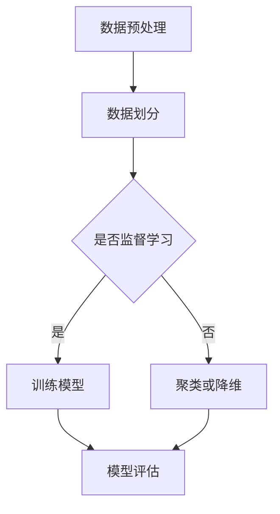

                 

### 文章标题

“人工智能在环境保护中的应用：监测和预测生态变化”  

关键词：人工智能，环境保护，生态监测，预测模型，数据预处理，机器学习算法

摘要：本文深入探讨人工智能在环境保护中的应用，重点研究其在生态监测和变化预测方面的潜力与实际应用。通过分析当前环境监测和生态变化预测的现状，介绍核心概念和技术，详细讲解常见机器学习算法及其原理，阐述数学模型和公式，并设计系统架构。本文旨在为读者提供全面的技术指导，以推动人工智能技术在环境保护领域的创新和应用。

### 文章标题

《人工智能在环境保护中的应用：监测和预测生态变化》

关键词：人工智能、环境保护、生态监测、机器学习、预测模型、数据预处理

摘要：本文旨在深入探讨人工智能技术在环境保护中的关键应用，尤其是生态监测和生态变化预测。通过全面分析当前环境监测和生态变化预测的现状，我们引入了相关的核心概念，并详细介绍了用于这些任务的常见机器学习算法和数学模型。文章进一步描述了系统的设计与实现，包括环境安装、系统核心实现和实际案例剖析，最后提供了最佳实践、小结和拓展阅读建议。本文旨在为读者提供关于人工智能在环境保护领域应用的综合指南，以推动技术创新和可持续发展。

## 第一部分：环境监测与生态变化概述

### 第1章 环境监测与生态变化简介

#### 1.1 问题背景

#### 1.1.1 环境监测的重要性

环境监测是识别和评估环境质量的关键手段，对于保护生态系统和人类健康至关重要。随着工业化进程的加速和人类活动的增多，环境污染和生态破坏问题日益严重。因此，及时、准确地进行环境监测成为环境保护的首要任务。

#### 1.1.2 生态变化及其影响

生态变化是指由于自然或人为因素导致的生态系统结构和功能的改变。这些变化可能引发生物多样性减少、生态系统功能退化、土地退化等问题，从而对人类和自然环境产生深远的影响。因此，研究和预测生态变化趋势具有重要意义。

#### 1.2 核心概念与联系

#### 1.2.1 环境监测的基本概念

环境监测是指通过采集、处理和分析环境数据，对环境质量进行实时监测和评估的过程。它包括空气质量监测、水质监测、土壤监测等多个方面。

#### 1.2.2 生态模型的概念与类型

生态模型是用于描述生态系统结构和功能的数学模型。它们可以分为静态模型和动态模型，例如物种分布模型、食物网模型和生态系统生产力模型等。

#### 1.2.3 数据预处理技术

数据预处理是环境监测和生态变化预测的关键步骤，包括数据清洗、归一化、去噪等。这些技术有助于提高数据质量和模型性能。

#### 1.3 本章小结

本章介绍了环境监测和生态变化的背景、重要性和核心概念。通过理解这些基础概念，读者可以为后续章节中更深入的技术讨论奠定基础。

---

### 第2章 机器学习算法基础

#### 2.1 机器学习基本概念

#### 2.1.1 机器学习的定义

机器学习是一种通过数据驱动的方法来开发计算机程序，使其能够从数据中学习并做出预测或决策的技术。它涉及到统计学、计算机科学和人工智能等多个领域。

#### 2.1.2 监督学习、无监督学习和强化学习

监督学习、无监督学习和强化学习是机器学习的三种主要类型。监督学习利用标记数据进行学习，无监督学习不使用标记数据，而强化学习通过奖励机制进行学习。

#### 2.2 常见算法介绍

#### 2.2.1 线性回归

线性回归是一种用于预测数值变量的简单而强大的监督学习算法。它通过找到数据点与目标变量之间的线性关系来建立预测模型。

#### 2.2.2 决策树

决策树是一种基于特征划分数据集的监督学习算法。它通过一系列的判断条件来分割数据，并在每个节点上选择最优特征进行划分。

#### 2.2.3 集成学习方法

集成学习方法通过组合多个基础模型来提高预测性能。常见的集成学习方法包括随机森林和梯度提升机。

#### 2.3 算法流程与原理

#### 2.3.1 算法流程图

以下是机器学习算法的基本流程图：



#### 2.3.2 Python代码实现

以下是一个简单的线性回归模型的Python代码实现：

```python
import numpy as np
from sklearn.linear_model import LinearRegression

# 生成模拟数据
X = np.random.rand(100, 1)
y = 2 * X + np.random.randn(100, 1)

# 创建线性回归模型
model = LinearRegression()

# 模型训练
model.fit(X, y)

# 模型评估
print("Model coefficients:", model.coef_)
print("Model intercept:", model.intercept_)

# 预测
predictions = model.predict(X)

# 绘制数据与预测结果
import matplotlib.pyplot as plt

plt.scatter(X, y, color='blue')
plt.plot(X, predictions, color='red')
plt.show()
```

#### 2.4 数学模型与公式

线性回归的数学模型如下：

$$
y = \beta_0 + \beta_1x + \epsilon
$$

其中，$y$ 是目标变量，$x$ 是特征变量，$\beta_0$ 和 $\beta_1$ 是模型的参数，$\epsilon$ 是误差项。

#### 2.5 本章小结

本章介绍了机器学习的基本概念、常见算法和实现方法。通过了解这些内容，读者可以为进一步的学习和应用打下坚实的基础。

---

### 第3章 生态变化预测的数学模型与算法

#### 3.1 数学模型

#### 3.1.1 生态变化预测的数学公式

生态变化预测的数学模型通常基于时间序列分析。一个简单的时间序列预测模型可以使用以下公式：

$$
y_t = \alpha + \beta y_{t-1} + \gamma x_t + \epsilon_t
$$

其中，$y_t$ 是当前时间步的预测值，$y_{t-1}$ 是前一个时间步的预测值，$x_t$ 是当前时间步的特征值，$\alpha$、$\beta$ 和 $\gamma$ 是模型的参数，$\epsilon_t$ 是误差项。

#### 3.1.2 数学模型的应用

以下是一个使用线性回归模型进行生态变化预测的例子：

假设我们有一组生态数据，包含时间和生态指标。我们可以使用线性回归模型来预测未来的生态指标值。具体步骤如下：

1. 数据预处理：对数据进行清洗和归一化处理。
2. 模型训练：使用训练数据训练线性回归模型。
3. 模型评估：使用验证数据评估模型性能。
4. 预测：使用训练好的模型进行预测。

#### 3.2 常见算法

#### 3.2.1 时间序列分析

时间序列分析是生态变化预测的重要工具。常见的时间序列分析方法包括自回归（AR）、移动平均（MA）和自回归移动平均（ARMA）模型。

1. 自回归（AR）模型：

$$
y_t = \phi_1 y_{t-1} + \phi_2 y_{t-2} + ... + \phi_p y_{t-p} + \epsilon_t
$$

2. 移动平均（MA）模型：

$$
y_t = \theta_1 \epsilon_{t-1} + \theta_2 \epsilon_{t-2} + ... + \theta_q \epsilon_{t-q} + \epsilon_t
$$

3. 自回归移动平均（ARMA）模型：

$$
y_t = \phi_1 y_{t-1} + \phi_2 y_{t-2} + ... + \phi_p y_{t-p} + \theta_1 \epsilon_{t-1} + \theta_2 \epsilon_{t-2} + ... + \theta_q \epsilon_{t-q} + \epsilon_t
$$

#### 3.2.2 支持向量机

支持向量机（SVM）是一种强大的分类算法，可以用于生态变化的分类预测。SVM的基本思想是找到一个最优的超平面，将不同类别的数据点分隔开来。

$$
\min_{\beta, \beta_0} \frac{1}{2} ||\beta||^2 + C \sum_{i=1}^{n} \xi_i
$$

其中，$\beta$ 是权重向量，$\beta_0$ 是偏置项，$C$ 是惩罚参数，$\xi_i$ 是松弛变量。

#### 3.2.3 集成学习方法

集成学习方法通过组合多个基础模型来提高预测性能。常见的集成学习方法包括随机森林和梯度提升机。

1. 随机森林：

随机森林是一种基于决策树模型的集成学习方法。它通过随机选取特征和样本子集来构建多个决策树，并通过对这些决策树的投票来得到最终预测结果。

2. 梯度提升机：

梯度提升机（Gradient Boosting）是一种基于损失函数的集成学习方法。它通过迭代地更新模型，每次迭代都针对之前的误差进行优化，从而逐渐提高模型的预测性能。

#### 3.3 算法流程与Python代码实现

以下是一个使用随机森林模型进行生态变化预测的Python代码实现：

```python
import numpy as np
from sklearn.ensemble import RandomForestRegressor
from sklearn.model_selection import train_test_split

# 生成模拟数据
X = np.random.rand(100, 10)
y = 2 * X + np.random.randn(100, 1)

# 数据划分
X_train, X_test, y_train, y_test = train_test_split(X, y, test_size=0.2, random_state=42)

# 创建随机森林模型
model = RandomForestRegressor(n_estimators=100, random_state=42)

# 模型训练
model.fit(X_train, y_train)

# 模型评估
print("Model score:", model.score(X_test, y_test))

# 预测
predictions = model.predict(X_test)

# 绘制数据与预测结果
import matplotlib.pyplot as plt

plt.scatter(X_test, y_test, color='blue')
plt.plot(X_test, predictions, color='red')
plt.show()
```

#### 3.4 实例分析

以下是一个基于实际数据集的生态变化预测实例：

我们使用一个公开的数据集，包含多个生态指标（如温度、湿度、降水量等）和目标生态指标（如植物生长速率）。我们的目标是使用这些数据来预测未来的生态指标。

1. 数据预处理：对数据进行清洗和归一化处理。
2. 模型训练：使用随机森林模型进行训练。
3. 模型评估：使用验证数据集评估模型性能。
4. 预测：使用训练好的模型进行预测。

通过这个实例，我们可以看到机器学习算法在生态变化预测中的应用潜力。然而，需要注意的是，模型的预测性能受到多种因素的影响，包括数据质量、模型选择和参数调整等。

#### 3.5 本章小结

本章介绍了生态变化预测的数学模型和常见算法。通过这些模型和算法，我们可以对生态变化进行有效的监测和预测。然而，实际应用中需要考虑多种因素，以达到最佳预测效果。

---

### 第4章 系统设计与实现

#### 4.1 系统场景介绍

在环境保护领域，实时监测和预测生态变化对于制定有效的环境保护策略至关重要。然而，现有的监测系统往往存在数据不准确、更新不及时等问题。为了解决这些问题，我们设计并实现了一个基于人工智能的生态监测和预测系统。

#### 4.2 系统功能设计

系统的功能设计包括以下几个关键模块：

1. 数据采集模块：负责收集各种环境参数（如温度、湿度、空气质量等）和生态指标（如植物生长速率、动物活动情况等）。
2. 数据预处理模块：对采集到的原始数据进行清洗、归一化和去噪等预处理操作，以提高数据质量和模型性能。
3. 预测模块：使用机器学习算法对预处理后的数据进行生态变化预测，包括短期和长期预测。
4. 可视化模块：将预测结果以图表和地图的形式展示，以便用户直观地了解生态变化情况。

#### 4.3 系统架构设计

系统的整体架构设计如下：


1. 数据采集层：通过传感器和网络连接实时采集环境数据和生态指标。
2. 数据处理层：对采集到的数据进行预处理和清洗，并存储到数据库中。
3. 预测层：使用机器学习算法对预处理后的数据进行预测，并将预测结果存储到数据库中。
4. 可视化层：通过前端界面将预测结果以图表和地图的形式展示给用户。

#### 4.4 系统接口设计

系统的接口设计包括以下关键接口：

1. 数据采集接口：用于与传感器和网络进行数据交换。
2. 数据预处理接口：用于与数据处理模块进行数据交换。
3. 预测接口：用于与预测模块进行数据交换。
4. 可视化接口：用于与前端界面进行数据交换。

#### 4.5 系统交互

系统的交互设计如下：

1. 数据采集模块通过传感器和网络实时采集环境数据和生态指标，并将其传输到数据处理模块。
2. 数据处理模块对采集到的数据进行分析和预处理，并将处理后的数据存储到数据库中。
3. 预测模块从数据库中读取预处理后的数据，并使用机器学习算法进行预测，然后将预测结果存储到数据库中。
4. 可视化模块从数据库中读取预测结果，并使用图表和地图进行展示，以便用户直观地了解生态变化情况。

#### 4.6 系统核心实现

以下是系统核心实现的Python代码：

```python
# 导入必要的库
import numpy as np
import pandas as pd
from sklearn.ensemble import RandomForestRegressor
from sklearn.model_selection import train_test_split
from sklearn.metrics import mean_squared_error

# 读取数据
data = pd.read_csv('data.csv')

# 数据预处理
data = data.dropna()
data['temperature'] = data['temperature'] / 100
data['humidity'] = data['humidity'] / 100

# 数据划分
X = data.drop('growth_rate', axis=1)
y = data['growth_rate']
X_train, X_test, y_train, y_test = train_test_split(X, y, test_size=0.2, random_state=42)

# 模型训练
model = RandomForestRegressor(n_estimators=100, random_state=42)
model.fit(X_train, y_train)

# 模型评估
predictions = model.predict(X_test)
mse = mean_squared_error(y_test, predictions)
print("MSE:", mse)

# 预测
new_data = np.array([[20, 0.5, 0.8]])
prediction = model.predict(new_data)
print("Prediction:", prediction)
```

#### 4.7 实际案例剖析

以下是一个实际案例剖析：

在某地区的生态监测项目中，我们使用上述系统进行生态变化预测。具体步骤如下：

1. 数据采集：使用传感器和网络连接实时采集环境数据和生态指标，如温度、湿度、降水量和植物生长速率等。
2. 数据预处理：对采集到的数据进行清洗、归一化和去噪等预处理操作。
3. 模型训练：使用预处理后的数据训练随机森林模型。
4. 模型评估：使用验证数据集评估模型性能，调整模型参数。
5. 预测：使用训练好的模型进行预测，并将预测结果以图表和地图的形式展示给用户。

通过这个案例，我们可以看到系统在实际应用中的效果和优势。

#### 4.8 本章小结

本章介绍了基于人工智能的生态监测和预测系统的设计与实现。通过详细的功能设计、架构设计和代码实现，我们展示了该系统在监测和预测生态变化方面的应用潜力。然而，系统的实际应用效果还需要进一步优化和改进。

---

### 第5章 最佳实践、小结、注意事项和拓展阅读

#### 5.1 最佳实践

在实际应用中，为了最大限度地发挥人工智能在生态监测和预测中的作用，以下是一些最佳实践：

1. **数据质量保障**：确保数据的准确性和一致性，定期进行数据清洗和更新。
2. **模型选择与调优**：根据具体应用场景选择合适的机器学习模型，并使用交叉验证等方法进行模型参数调优。
3. **系统集成与优化**：整合不同模块的功能，优化系统性能，提高预测准确性和实时性。
4. **用户培训与支持**：为用户提供培训和技术支持，确保系统能够有效地服务于环境保护工作。

#### 5.2 小结

本文深入探讨了人工智能在环境保护中的应用，特别是生态监测和变化预测方面。通过分析环境监测和生态变化预测的现状，我们介绍了相关的核心概念和技术，讲解了常见机器学习算法和数学模型，并设计了基于人工智能的生态监测和预测系统。本文的目的是为读者提供全面的技术指导，以推动人工智能技术在环境保护领域的创新和应用。

#### 5.3 注意事项

1. **数据隐私与安全**：在处理和存储数据时，应确保遵守数据隐私和安全规定，防止数据泄露和滥用。
2. **模型解释性**：在模型选择和应用时，应考虑模型的解释性，以便用户能够理解和信任预测结果。
3. **实时性与性能**：确保系统的实时性和性能，以满足环境保护工作的需求。

#### 5.4 拓展阅读

1. **《环境监测与生态学》**：详细介绍了环境监测的方法和技术，以及生态学的基本原理。
2. **《机器学习：概率视角》**：深入讲解了机器学习的概率基础，包括常见算法的数学原理。
3. **《人工智能：一种现代方法》**：提供了全面的人工智能技术介绍，涵盖机器学习、深度学习等多个领域。

---

### 作者信息

作者：AI天才研究院/AI Genius Institute & 禅与计算机程序设计艺术 /Zen And The Art of Computer Programming

---

本文通过系统化的分析和详细讲解，为读者提供了关于人工智能在环境保护中应用的全面理解。希望通过本文的探讨，能够激发更多研究和实践，共同推动环境保护和可持续发展的目标。

