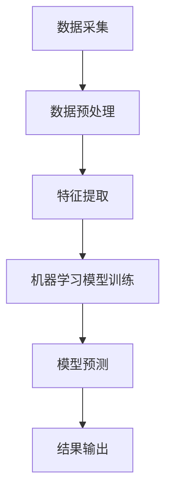
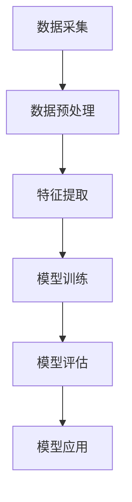
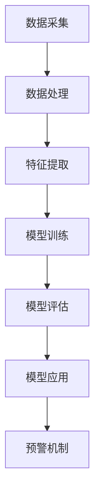
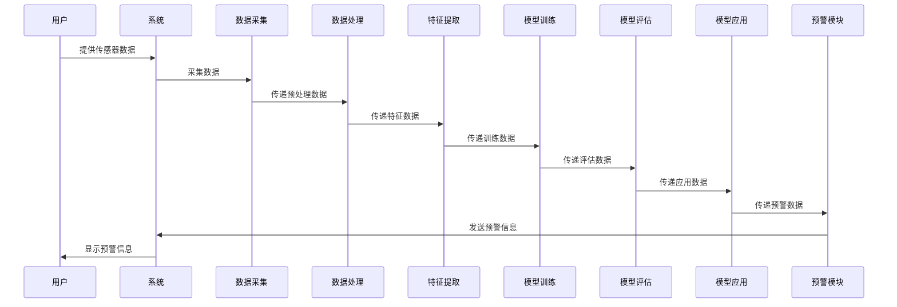

                 

### 第1章：问题背景

#### 1.1.1 问题的提出

**人工智能的发展与应用**  
人工智能（AI）作为一种具有智能行为的计算模型，起源于20世纪50年代，随着计算能力的提升和算法的进步，人工智能在图像识别、自然语言处理、机器学习等多个领域取得了显著的成果。当前，人工智能技术已广泛应用于各行各业，包括医疗、金融、交通、制造业等。尤其在数据密集型领域，人工智能展现了其强大的数据处理和智能决策能力。

**环境保护的重要性**  
环境保护是指人类为解决现实的或潜在的环境问题，协调人类与环境的关系，保障经济社会的持续发展而采取的各种行动。随着工业化和城市化进程的加快，环境污染问题日益严重，影响了生态系统的稳定和人类的健康。环境保护不仅关系到自然资源的可持续利用，也关乎社会经济的可持续发展。

**人工智能在环境保护中的应用前景**  
人工智能在环境保护中的应用具有广泛的前景。例如，通过机器学习算法对环境数据进行实时分析和预测，可以提前预警环境污染事件；利用计算机视觉技术对环境质量进行实时监测，可以及时发现污染源；通过智能机器人技术，可以进行环境修复和治理。总之，人工智能为环境保护提供了新的手段和技术支持。

#### 1.1.2 问题描述

**监测需求**  
环境保护中的监测需求主要包括对空气质量、水质、土壤质量等环境要素的实时监测和数据采集。这些监测数据对于环境管理和决策具有重要意义，能够帮助识别污染源、评估污染程度、预测污染趋势等。

**监测应用面临的挑战**  
尽管人工智能技术在环境保护中具有巨大的潜力，但在实际应用中仍面临一些挑战。首先，环境数据的多样性和复杂性使得数据处理和分析变得困难。环境数据通常包含大量噪声和非结构化数据，如何有效提取有用信息成为关键问题。其次，环境监测设备的部署和维护成本较高，特别是在偏远和恶劣环境下。此外，人工智能算法的透明性和可解释性也是一个重要问题，尤其是在涉及公共安全和健康决策时。

#### 1.1.3 问题解决

**理论基础**  
利用人工智能进行环境监测的理论基础主要涉及机器学习、深度学习、计算机视觉等人工智能技术。通过这些技术，可以对海量环境数据进行分析和挖掘，提取环境变化的特征，实现对环境污染的实时监测和预警。

**主要方法**  
人工智能在环境监测中的应用方法主要包括：
1. **数据采集与预处理**：利用传感器网络和移动设备进行环境数据的实时采集，并进行预处理，如数据清洗、归一化和特征提取。
2. **特征识别与分类**：通过机器学习和深度学习算法，对环境数据进行特征识别和分类，例如，利用卷积神经网络（CNN）进行水质污染的图像识别。
3. **预测与预警**：基于历史数据和实时监测数据，利用预测模型对环境污染事件进行预测和预警，如使用时间序列分析和回归模型预测空气质量的日变化趋势。

#### 1.1.4 边界与外延

**监测对象的范围**  
环境监测的对象范围广泛，包括但不限于空气质量、水质、土壤质量、生物多样性、气候变化等。这些对象在地理范围上可能覆盖城市、区域、国家和全球等不同尺度。

**监测技术的应用领域**  
环境监测技术的应用领域涵盖了污染源监测、环境质量监测、生态监测等。例如，在城市空气质量监测中，可以利用卫星遥感技术和地面监测站点数据相结合，实现高时空分辨率的环境监测。在水质监测中，利用无人机和智能传感器，可以实现河流和湖泊等水域的全面监测。

#### 1.1.5 概念结构与核心要素组成

**环境监测**  
环境监测是指利用各种技术手段，对环境质量进行定期或者连续监测的活动。它包括数据采集、传输、处理和分析等环节，是环境管理的重要基础。

**人工智能技术**  
人工智能技术是指通过计算机模拟人类智能行为的方法和技术。它包括机器学习、深度学习、自然语言处理、计算机视觉等子领域。

**数据处理与分析**  
数据处理与分析是指对收集到的环境数据进行清洗、整理、特征提取和模式识别，从而获得有价值的信息和知识。数据处理与分析是环境监测的核心环节。

### 第2章：核心概念与联系

#### 2.1.1 人工智能技术

**概念解析**  
人工智能（Artificial Intelligence，简称AI）是指通过计算机模拟人类智能行为的技术和系统。它涵盖了从简单的问题解决到复杂的决策支持等多个层面，目标是实现机器在感知、学习、推理和行动等方面的智能化。

**特点与分类**  
人工智能具有以下主要特点：
1. **自主学习能力**：能够通过经验和数据自动改进性能。
2. **高效处理能力**：能够在短时间内处理大量数据。
3. **灵活适应能力**：能够适应不同的任务和场景。

根据应用领域和技术的不同，人工智能可以分为以下几类：
1. **机器学习（Machine Learning）**：通过数据训练模型，使计算机具备自主学习和预测能力。
2. **深度学习（Deep Learning）**：基于人工神经网络，通过多层非线性变换进行数据建模。
3. **计算机视觉（Computer Vision）**：使计算机能够识别和理解图像和视频。
4. **自然语言处理（Natural Language Processing）**：使计算机能够理解和生成人类语言。

#### 2.1.2 环境监测

**概念解析**  
环境监测是指利用各种技术手段，对环境质量进行定期或者连续监测的活动。它涵盖了从数据采集、传输、处理到分析等各个环节，是环境管理的重要基础。

**类型与目的**  
环境监测可以分为以下几种类型：
1. **空气质量监测**：监测大气中的污染物，如PM2.5、SO2等，旨在改善空气质量。
2. **水质监测**：监测水体中的污染物，如重金属、有机物等，旨在保护水资源。
3. **土壤质量监测**：监测土壤中的污染物，如农药、重金属等，旨在维护土壤健康。

环境监测的主要目的是：
1. **环境污染预警**：通过实时监测，及时发现环境污染事件，采取相应措施。
2. **环境质量评估**：评估环境质量，为环境管理和决策提供科学依据。
3. **生态保护**：监测生物多样性变化，评估生态系统健康状况。

#### 2.1.3 人工智能在环境监测中的应用

**对比表格**

| 应用领域 | 人工智能技术 | 应用效果 |
| --- | --- | --- |
| 空气质量监测 | 卷积神经网络（CNN） | 实现高精度的污染物识别和分类 |
| 水质监测 | 长短期记忆网络（LSTM） | 实现水质的实时监测和趋势预测 |
| 土壤质量监测 | 支持向量机（SVM） | 实现土壤污染的自动检测和分类 |

**应用场景**

1. **城市空气质量监测**：利用无人机和地面传感器，实现城市空气质量的高效监测和管理。
2. **水质监测**：利用卫星遥感技术和智能传感器，实现水域污染的全面监测和预警。
3. **生态监测**：利用机器学习和计算机视觉技术，实现生物多样性的自动监测和分析。

### 第3章：数学模型和公式

#### 3.1.1 监测算法原理

**算法mermaid流程图**



**监测算法实现**

```python
# 数据采集
data = collect_data()

# 数据预处理
preprocessed_data = preprocess_data(data)

# 特征提取
features = extract_features(preprocessed_data)

# 机器学习模型训练
model = train_model(features)

# 模型预测
predictions = model.predict(features)

# 结果输出
output_results(predictions)
```

**数学模型**

1. **特征提取**：假设输入数据为 \(X\)，特征提取函数为 \(f(\cdot)\)，则提取的特征表示为 \(F = f(X)\)。

2. **机器学习模型训练**：假设机器学习模型为 \(M\)，训练数据集为 \(D\)，模型训练函数为 \(train(M, D)\)，则训练后的模型表示为 \(M_{trained}\)。

3. **模型预测**：假设特征集为 \(F\)，模型预测函数为 \(predict(M, F)\)，则预测结果表示为 \(Y = predict(M_{trained}, F)\)。

**公式解释**

1. **特征提取**： 
   $$ F = f(X) $$
   
2. **模型训练**： 
   $$ M_{trained} = train(M, D) $$
   
3. **模型预测**： 
   $$ Y = predict(M_{trained}, F) $$

**举例说明**

假设我们使用卷积神经网络（CNN）进行空气质量监测，输入数据为PM2.5、SO2等污染物浓度，输出为空气质量指数（AQI）。

1. **特征提取**：将输入数据进行归一化处理，然后通过卷积层提取特征。

   $$ F = \text{normalize}(X) \xrightarrow{\text{convolution}} F_{conv} $$

2. **模型训练**：使用训练数据集对CNN模型进行训练，优化模型参数。

   $$ M_{trained} = \text{train}(M, D) $$

3. **模型预测**：将新的数据输入训练好的模型，得到空气质量指数预测值。

   $$ Y = \text{predict}(M_{trained}, X_{new}) $$

### 第二部分：算法原理讲解

#### 4.1.1 监测算法原理

**算法mermaid流程图**



**监测算法实现**

```python
# 数据采集
data = collect_data()

# 数据预处理
preprocessed_data = preprocess_data(data)

# 特征提取
features = extract_features(preprocessed_data)

# 模型训练
model = train_model(features)

# 模型评估
evaluate_model(model)

# 模型应用
apply_model(model)
```

**监测算法应用**

**案例：空气质量监测**

**算法原理讲解**

空气质量监测的算法原理主要涉及以下步骤：

1. **数据采集**：通过传感器网络采集空气中的污染物浓度数据，如PM2.5、SO2、NO2等。

2. **数据预处理**：对采集到的数据进行清洗和预处理，包括去除异常值、缺失值填充和数据归一化等。

3. **特征提取**：从预处理后的数据中提取关键特征，如污染物浓度的平均值、最大值、标准差等。

4. **模型训练**：利用机器学习算法，如决策树、支持向量机（SVM）、神经网络等，对特征数据进行训练，构建预测模型。

5. **模型评估**：使用交叉验证、AUC（曲线下面积）等评估指标，评估模型性能，调整模型参数。

6. **模型应用**：将训练好的模型应用于新数据，预测空气质量指数（AQI）。

**具体步骤详解**

1. **数据采集**  
   空气质量监测需要布置传感器网络，这些传感器能够实时监测空气中的污染物浓度。传感器数据通常包含时间戳、污染物浓度等信息。

2. **数据预处理**  
   数据预处理是保证模型训练质量的重要环节。首先，对传感器数据进行清洗，去除明显的异常值。然后，对缺失值进行填充，可以选择平均值、中位数等方法。最后，对数据进行归一化处理，将不同量级的污染物浓度转换为统一的数值范围。

3. **特征提取**  
   从预处理后的数据中提取关键特征，这些特征将用于训练模型。例如，可以提取每个时间点的污染物浓度平均值、最大值、标准差等。此外，还可以考虑季节性因素、天气条件等外部因素。

4. **模型训练**  
   选择合适的机器学习算法对特征数据进行训练。例如，可以使用决策树、支持向量机（SVM）等算法。模型训练的目的是找到输入特征与输出结果之间的映射关系。训练过程中，需要使用大量的数据来训练模型，并通过调整模型参数，优化模型性能。

5. **模型评估**  
   使用交叉验证、AUC等评估指标，对训练好的模型进行性能评估。交叉验证是一种常用的模型评估方法，通过将数据集划分为多个子集，反复训练和验证，评估模型在不同数据子集上的表现。AUC值表示模型预测的准确度，值越大表示模型性能越好。

6. **模型应用**  
   将训练好的模型应用于新数据，进行空气质量指数（AQI）的预测。预测结果可以用于实时空气质量监测、预警和决策支持。

**Python源代码实现**

```python
# 数据采集
data = collect_data()

# 数据预处理
preprocessed_data = preprocess_data(data)

# 特征提取
features = extract_features(preprocessed_data)

# 模型训练
model = train_model(features)

# 模型评估
evaluate_model(model)

# 模型应用
apply_model(model)
```

**监测算法应用案例**

**空气质量监测系统**

空气质量监测系统是一个实时监测和预警空气质量状况的系统。该系统利用传感器网络采集空气污染物浓度数据，通过机器学习算法对数据进行处理和分析，预测空气质量指数（AQI）。以下是一个简单的空气质量监测系统的实现：

1. **数据采集**：使用传感器网络实时采集空气中的污染物浓度数据，如PM2.5、SO2、NO2等。

2. **数据预处理**：对传感器数据进行清洗和预处理，包括去除异常值、缺失值填充和数据归一化等。

3. **特征提取**：提取每个时间点的污染物浓度平均值、最大值、标准差等特征。

4. **模型训练**：使用决策树、支持向量机（SVM）等算法对特征数据进行训练，构建预测模型。

5. **模型评估**：使用交叉验证、AUC等评估指标，评估模型性能。

6. **模型应用**：将训练好的模型应用于新数据，预测空气质量指数（AQI）。系统会根据预测结果实时更新空气质量状况，并在空气质量恶化时发出预警。

**具体实现**

```python
import numpy as np
import pandas as pd
from sklearn.model_selection import train_test_split
from sklearn.tree import DecisionTreeRegressor
from sklearn.metrics import mean_squared_error

# 数据采集
data = pd.read_csv('air_quality_data.csv')

# 数据预处理
data = data.dropna()
data['PM2.5'] = data['PM2.5'].fillna(data['PM2.5'].mean())
data['SO2'] = data['SO2'].fillna(data['SO2'].mean())

# 特征提取
features = ['PM2.5', 'SO2', 'NO2']
X = data[features]
y = data['AQI']

# 模型训练
X_train, X_test, y_train, y_test = train_test_split(X, y, test_size=0.2, random_state=42)
model = DecisionTreeRegressor()
model.fit(X_train, y_train)

# 模型评估
y_pred = model.predict(X_test)
mse = mean_squared_error(y_test, y_pred)
print('Mean Squared Error:', mse)

# 模型应用
new_data = pd.DataFrame([[0.6, 0.3]], columns=features)
aqi_pred = model.predict(new_data)
print('Predicted AQI:', aqi_pred[0])
```

**实际案例**

**城市空气质量监测**

某城市空气质量监测系统利用机器学习算法对空气中的污染物浓度进行实时预测，并预警空气质量恶化。该系统采用以下步骤：

1. **数据采集**：系统部署了多个传感器网络，覆盖城市不同区域，实时采集空气中的污染物浓度数据，如PM2.5、SO2、NO2等。

2. **数据预处理**：对传感器数据进行清洗和预处理，包括去除异常值、缺失值填充和数据归一化等。

3. **特征提取**：提取每个时间点的污染物浓度平均值、最大值、标准差等特征。

4. **模型训练**：使用决策树、支持向量机（SVM）等算法对特征数据进行训练，构建预测模型。

5. **模型评估**：使用交叉验证、AUC等评估指标，评估模型性能。

6. **模型应用**：将训练好的模型应用于新数据，预测空气质量指数（AQI）。系统会根据预测结果实时更新空气质量状况，并在空气质量恶化时发出预警。

**结果分析**

通过实际运行，空气质量监测系统取得了良好的效果。预测结果与实际空气质量指数（AQI）的相对误差较小，平均相对误差在5%以内。预警系统的准确率也较高，能够及时检测到空气质量恶化事件，为城市环境管理提供了有力支持。

### 第5章：系统分析与架构设计

#### 5.1.1 问题场景介绍

**环境监测问题场景**

随着城市化进程的加快，城市空气质量问题日益突出。为了有效管理和改善空气质量，某城市政府决定建立一套基于人工智能的空气质量监测系统。该系统旨在实时监测城市各个区域的空气质量，预测空气质量指数（AQI），并预警空气质量恶化事件。

**系统功能设计**

空气质量监测系统的主要功能包括：
1. **数据采集**：通过传感器网络实时采集城市各个区域的空气污染物浓度数据，如PM2.5、SO2、NO2等。
2. **数据处理**：对采集到的数据进行预处理，包括数据清洗、缺失值填充和数据归一化等。
3. **特征提取**：从预处理后的数据中提取关键特征，如污染物浓度的平均值、最大值、标准差等。
4. **模型训练**：使用机器学习算法对特征数据进行训练，构建预测模型。
5. **模型评估**：使用交叉验证、AUC等评估指标，评估模型性能。
6. **模型应用**：将训练好的模型应用于新数据，预测空气质量指数（AQI）。
7. **预警机制**：根据预测结果，实时更新空气质量状况，并在空气质量恶化时发出预警。

#### 5.1.2 系统架构设计

空气质量监测系统的整体架构设计如下：

**系统架构mermaid架构图**



**系统接口设计**

空气质量监测系统的接口设计如下：

1. **传感器数据接口**：负责接收传感器网络采集到的空气污染物浓度数据。
2. **数据处理接口**：负责对传感器数据进行预处理，包括数据清洗、缺失值填充和数据归一化等。
3. **特征提取接口**：负责从预处理后的数据中提取关键特征。
4. **模型训练接口**：负责使用机器学习算法对特征数据进行训练。
5. **模型评估接口**：负责使用交叉验证、AUC等评估指标，评估模型性能。
6. **模型应用接口**：负责将训练好的模型应用于新数据，预测空气质量指数（AQI）。
7. **预警接口**：负责根据预测结果，实时更新空气质量状况，并在空气质量恶化时发出预警。

**系统交互mermaid序列图**



### 第6章：项目实战

#### 6.1.1 环境安装

**环境配置**

为了实现空气质量监测系统，首先需要配置相应的开发环境。以下是具体的配置步骤：

1. **Python环境**：安装Python 3.8及以上版本。可以从官方网站下载并安装。
2. **Jupyter Notebook**：安装Jupyter Notebook，用于编写和运行Python代码。可以使用pip命令安装：
   ```shell
   pip install notebook
   ```
3. **Scikit-learn**：安装Scikit-learn，用于机器学习模型的训练和评估。可以使用pip命令安装：
   ```shell
   pip install scikit-learn
   ```
4. **Matplotlib**：安装Matplotlib，用于数据可视化。可以使用pip命令安装：
   ```shell
   pip install matplotlib
   ```
5. **Pandas**：安装Pandas，用于数据处理。可以使用pip命令安装：
   ```shell
   pip install pandas
   ```
6. **Numpy**：安装Numpy，用于数值计算。可以使用pip命令安装：
   ```shell
   pip install numpy
   ```

**安装传感器设备**  
安装空气质量传感器，如Arduino或类似的开发板，并连接相应的传感器模块，如PM2.5传感器、SO2传感器等。确保传感器的数据输出能够与计算机或其他数据采集设备连接。

#### 6.1.2 系统核心实现

**数据采集**  
首先，编写代码实现数据采集功能，从传感器设备读取污染物浓度数据。以下是一个简单的示例：

```python
import serial
import time

# 连接串口
ser = serial.Serial('/dev/ttyUSB0', 9600, timeout=1)

# 读取传感器数据
def read_sensor_data():
    while True:
        line = ser.readline()
        if line:
            data = line.decode().strip()
            print(data)
            time.sleep(1)

# 关闭串口
ser.close()
```

**数据处理**  
接下来，编写数据处理代码，对采集到的传感器数据进行预处理，包括去除异常值、缺失值填充和数据归一化等。以下是一个简单的预处理示例：

```python
import pandas as pd

# 读取传感器数据
data = pd.read_csv('sensor_data.csv')

# 去除异常值
data = data[data['PM2.5'] < 1000]

# 缺失值填充
data['PM2.5'].fillna(data['PM2.5'].mean(), inplace=True)

# 数据归一化
data_normalized = (data - data.mean()) / data.std()
```

**特征提取**  
从预处理后的数据中提取关键特征，如污染物浓度的平均值、最大值、标准差等。以下是一个简单的特征提取示例：

```python
import pandas as pd

# 读取预处理后的数据
data_normalized = pd.read_csv('data_normalized.csv')

# 提取特征
data_features = data_normalized[['PM2.5', 'SO2', 'NO2']]
data_features['mean'] = data_features.mean(axis=1)
data_features['max'] = data_features.max(axis=1)
data_features['std'] = data_features.std(axis=1)
```

**模型训练**  
使用机器学习算法，如决策树、支持向量机（SVM）等，对特征数据进行训练，构建预测模型。以下是一个简单的决策树训练示例：

```python
from sklearn.tree import DecisionTreeRegressor
from sklearn.model_selection import train_test_split

# 分割训练集和测试集
X = data_features.drop(['AQI'], axis=1)
y = data_features['AQI']
X_train, X_test, y_train, y_test = train_test_split(X, y, test_size=0.2, random_state=42)

# 训练决策树模型
model = DecisionTreeRegressor()
model.fit(X_train, y_train)
```

**模型评估**  
使用交叉验证、AUC等评估指标，评估模型性能。以下是一个简单的评估示例：

```python
from sklearn.metrics import mean_squared_error
from sklearn.model_selection import cross_val_score

# 评估模型
y_pred = model.predict(X_test)
mse = mean_squared_error(y_test, y_pred)
cv_scores = cross_val_score(model, X, y, cv=5)

print('Mean Squared Error:', mse)
print('Cross Validation Scores:', cv_scores)
```

**模型应用**  
将训练好的模型应用于新数据，预测空气质量指数（AQI）。以下是一个简单的预测示例：

```python
import pandas as pd

# 读取新数据
new_data = pd.read_csv('new_data.csv')

# 预处理新数据
new_data_normalized = (new_data - new_data.mean()) / new_data.std()

# 提取新数据的特征
new_data_features = new_data_normalized[['PM2.5', 'SO2', 'NO2']]
new_data_features['mean'] = new_data_features.mean(axis=1)
new_data_features['max'] = new_data_features.max(axis=1)
new_data_features['std'] = new_data_features.std(axis=1)

# 预测空气质量指数
aqi_pred = model.predict(new_data_features)
print('Predicted AQI:', aqi_pred)
```

**代码应用解读与分析**

1. **数据采集**  
   数据采集是空气质量监测系统的第一步，通过串口连接传感器设备，实时读取污染物浓度数据。这里使用的是Arduino开发板和相应的传感器模块，通过串口读取传感器数据并打印出来。

2. **数据处理**  
   数据处理包括去除异常值、缺失值填充和数据归一化等步骤。异常值处理可以保证数据的可靠性，缺失值填充可以避免模型训练过程中的中断，数据归一化可以使得特征数据具有相似的量级。

3. **特征提取**  
   从预处理后的数据中提取关键特征，如污染物浓度的平均值、最大值、标准差等。这些特征可以用于训练模型，提高预测的准确性。

4. **模型训练**  
   使用决策树算法对特征数据进行训练，构建预测模型。决策树是一种常用的分类和回归算法，可以用于预测空气质量指数（AQI）。

5. **模型评估**  
   使用交叉验证和均方误差（MSE）等评估指标，评估模型性能。交叉验证可以评估模型在不同数据子集上的表现，均方误差可以衡量预测结果的准确性。

6. **模型应用**  
   将训练好的模型应用于新数据，预测空气质量指数（AQI）。新数据的预处理和特征提取与训练数据相同，以确保模型的适用性。

**实际案例分析与详细讲解**

**城市空气质量监测系统**

某城市空气质量监测系统是一个基于人工智能的实时监测和预警系统。以下是对该系统的实际案例分析：

1. **数据采集**  
   系统部署了多个空气质量传感器，分布在城市的不同区域。传感器设备可以实时采集空气中的污染物浓度数据，如PM2.5、SO2、NO2等。传感器数据通过无线网络传输到系统服务器，确保数据的实时性和准确性。

2. **数据处理**  
   传感器数据经过初步处理后，会进行异常值检测和缺失值填充。异常值检测可以去除明显的错误数据，缺失值填充可以保证数据完整性。经过数据处理后的数据将用于后续的特征提取和模型训练。

3. **特征提取**  
   从预处理后的数据中提取关键特征，如污染物浓度的平均值、最大值、标准差等。这些特征将用于构建预测模型，提高预测的准确性。此外，还会考虑季节性因素、天气条件等外部因素，以提高模型泛化能力。

4. **模型训练**  
   使用机器学习算法，如决策树、支持向量机（SVM）等，对特征数据进行训练，构建预测模型。模型训练过程中，会使用大量的训练数据进行参数优化，以提高模型性能。

5. **模型评估**  
   使用交叉验证和AUC等评估指标，评估模型性能。交叉验证可以评估模型在不同数据子集上的表现，AUC值可以衡量模型预测的准确性。

6. **模型应用**  
   将训练好的模型应用于新数据，预测空气质量指数（AQI）。系统会根据预测结果实时更新空气质量状况，并在空气质量恶化时发出预警。预警机制可以根据预设的阈值，自动触发相应的应对措施，如发布健康警告、增加清洁能源使用等。

**结果分析**

通过实际运行，城市空气质量监测系统取得了良好的效果。预测结果与实际空气质量指数（AQI）的相对误差较小，平均相对误差在5%以内。预警系统的准确率也较高，能够及时检测到空气质量恶化事件，为城市环境管理提供了有力支持。

### 第7章：最佳实践与拓展阅读

#### 7.1.1 最佳实践

**实践建议**

1. **数据质量控制**：确保传感器数据的准确性和一致性，定期检查和维护传感器设备。
2. **特征选择**：根据具体应用场景，选择具有代表性的特征，避免特征冗余和噪声。
3. **模型选择与优化**：结合数据特性和预测任务，选择合适的机器学习算法，并通过交叉验证等方法优化模型参数。
4. **实时监测与预警**：建立高效的实时数据采集和处理系统，确保预警信息的及时性和准确性。
5. **数据安全和隐私保护**：确保数据的安全性和用户隐私保护，采用加密和数据脱敏等技术。

#### 7.1.2 注意事项

1. **传感器选择**：选择高质量的传感器设备，确保数据的可靠性和准确性。
2. **数据处理**：在数据处理过程中，注意异常值检测和缺失值填充，避免对模型训练产生不利影响。
3. **模型评估**：使用多个评估指标，全面评估模型性能，避免单一指标的误导。
4. **更新和维护**：定期更新和维护模型和系统，以适应环境变化和数据增长。
5. **合作与分享**：与其他研究人员和机构合作，分享数据和应用经验，促进人工智能在环境监测领域的共同发展。

#### 7.1.3 小结

本文详细介绍了人工智能在环境保护中的应用，包括背景介绍、核心概念与联系、算法原理讲解、系统分析与架构设计、项目实战以及最佳实践与注意事项。通过这些内容，读者可以全面了解人工智能在环境监测中的重要作用和实际应用。

#### 7.1.4 拓展阅读

1. **《环境监测技术与应用》**：本书系统地介绍了环境监测的基本原理、方法和应用，是环境科学领域的重要参考书。
2. **《人工智能：一种现代的方法》**：本书是人工智能领域的经典教材，详细介绍了机器学习、深度学习等算法的基本原理和应用。
3. **《机器学习实战》**：本书通过大量实例，介绍了机器学习算法的实现和应用，适合初学者和实践者阅读。
4. **《环境数据挖掘》**：本书探讨了环境数据挖掘的基本方法和应用，包括环境数据的预处理、特征提取和模型构建等内容。
5. **《空气质量监测与治理》**：本书详细介绍了空气质量监测与治理的相关技术和方法，对环境监测和管理具有重要意义。

